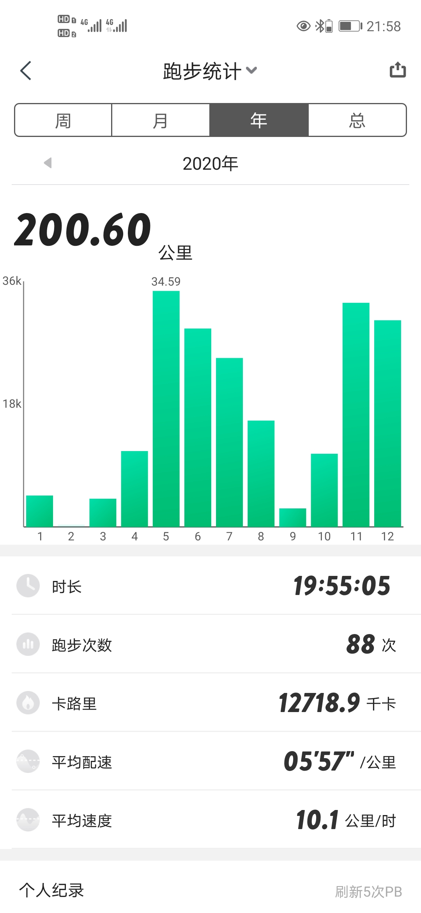

# 2021-01

新的一年啦！去年完成了200公里目标。

### 今年的目标

- 总里程300公里以上
- 能跑几次10公里的全程
- 5公里跑的配速稳定下降到6分钟以内
- 每周至少跑一次

## 2021-01-02

下午，晴天，3℃。世纪公园。8.01公里。48:51秒，配速06:05每公里。刷新了最长跑步时间和最远跑步距离的个人记录。好的开端！穿着单薄的外套，听着热血音乐，迎着寒风走向跑场，自己就像是春秋战国时列阵走向敌军的武士。

