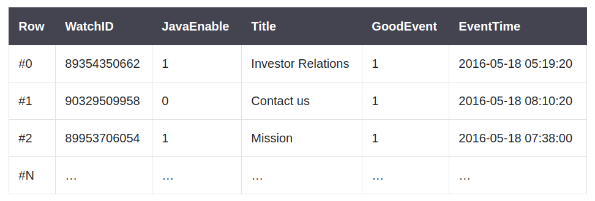
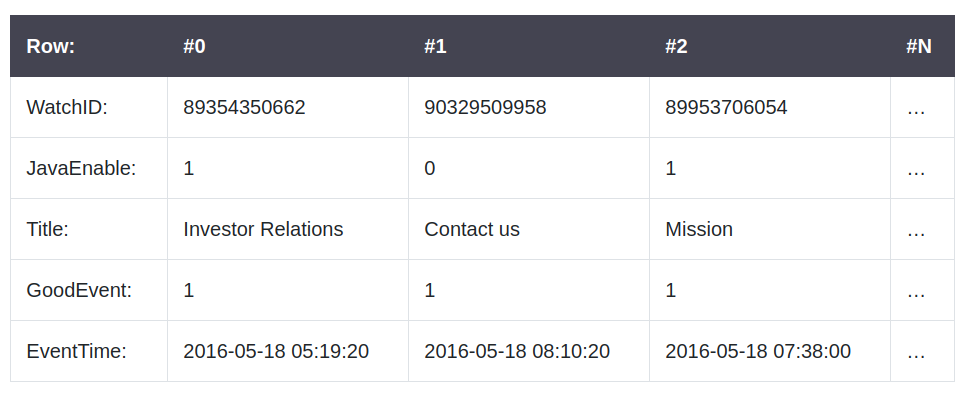
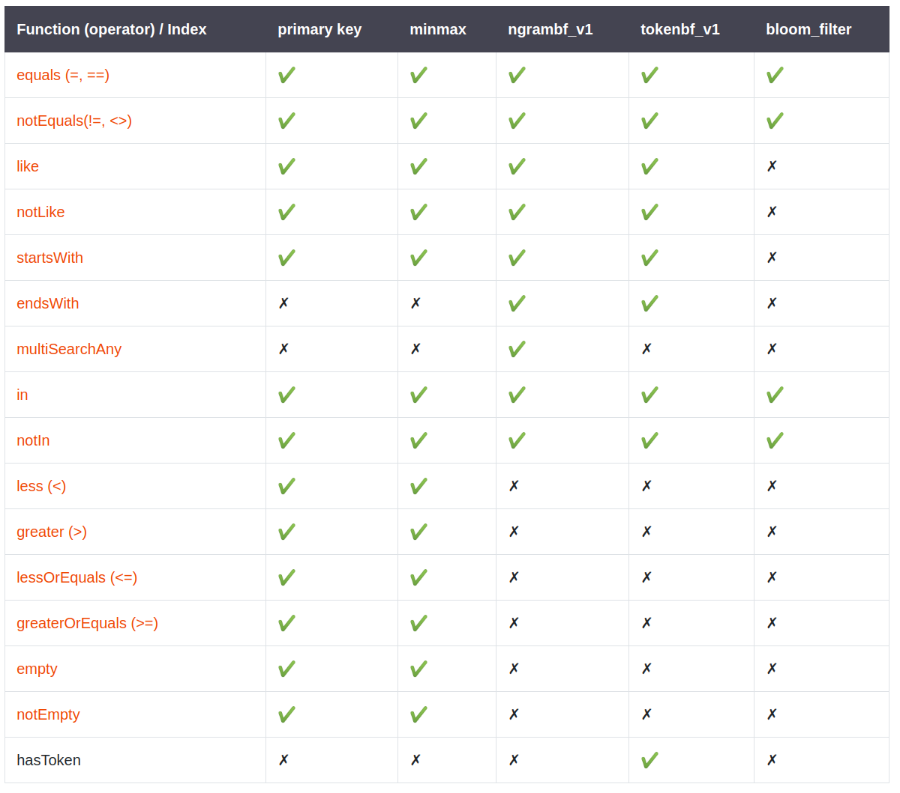

# The Application and Performance of Clickhouse
- [The Application and Performance of Clickhouse](#the-application-and-performance-of-clickhouse)
  - [Introduction](#introduction)
    - [Overview](#overview)
      - [What Is ClickHouse?](#what-is-clickhouse)
      - [Key Properties of OLAP Scenario](#key-properties-of-olap-scenario)
      - [Why Column-Oriented Databases Work Better in the OLAP Scenario](#why-column-oriented-databases-work-better-in-the-olap-scenario)
        - [Input/output](#inputoutput)
        - [CPU](#cpu)
    - [Distinctive Features of ClickHouse](#distinctive-features-of-clickhouse)
      - [True Column-Oriented Database Management System](#true-column-oriented-database-management-system)
      - [Data Compression](#data-compression)
      - [Disk Storage of Data](#disk-storage-of-data)
      - [Parallel Processing on Multiple Cores](#parallel-processing-on-multiple-cores)
      - [Distributed Processing on Multiple Servers](#distributed-processing-on-multiple-servers)
      - [SQL Support](#sql-support)
      - [Vector Computation Engine](#vector-computation-engine)
      - [Real-time Data Updates](#real-time-data-updates)
      - [Primary Index](#primary-index)
      - [Secondary Indexes](#secondary-indexes)
      - [Suitable for Online Queries](#suitable-for-online-queries)
      - [Support for Approximated Calculations](#support-for-approximated-calculations)
      - [Adaptive Join Algorithm](#adaptive-join-algorithm)
      - [Data Replication and Data Integrity Support](#data-replication-and-data-integrity-support)
      - [Role-Based Access Control](#role-based-access-control)
      - [Features that Can Be Considered Disadvantages](#features-that-can-be-considered-disadvantages)
    - [Performance](#performance)
      - [Throughput for a Single Large Query](#throughput-for-a-single-large-query)
      - [Latency When Processing Short Queries](#latency-when-processing-short-queries)
      - [Throughput When Processing a Large Quantity of Short Queries](#throughput-when-processing-a-large-quantity-of-short-queries)
      - [Performance When Inserting Data](#performance-when-inserting-data)
  - [Getting Started](#getting-started)
    - [Example Datasets](#example-datasets)
    - [Installation](#installation)
      - [System Requirements](#system-requirements)
      - [Available Installation Options](#available-installation-options)
        - [From DEB Packages](#from-deb-packages)
        - [Launch](#launch)
    - [Tutorial](#tutorial)
      - [What to Expect from This Tutorial?](#what-to-expect-from-this-tutorial)
      - [Single Node Setup](#single-node-setup)
      - [Import Sample Dataset](#import-sample-dataset)
        - [Download and Extract Table Data](#download-and-extract-table-data)
        - [Create Tables](#create-tables)
        - [Import Data](#import-data)
  - [Interfaces](#interfaces)
    - [Command-line Client](#command-line-client)
      - [Usage](#usage)
        - [Queries with Parameters](#queries-with-parameters)
        - [Query Syntax](#query-syntax)
        - [Example](#example)
        - [Configuring](#configuring)
        - [Configuration Files](#configuration-files)
    - [Native Interface (TCP)](#native-interface-tcp)
    - [HTTP Interface](#http-interface)
  - [Engines](#engines)
    - [Table Engines](#table-engines)
      - [Engine Families](#engine-families)
        - [MergeTree](#mergetree)
        - [Log](#log)
        - [Integration Engines](#integration-engines)
        - [Special Engines](#special-engines)
        - [Virtual Columns](#virtual-columns)
    - [MergeTree Engine Family](#mergetree-engine-family)
    - [MergeTree](#mergetree-1)
      - [Creating a Table](#creating-a-table)
        - [Query Clauses](#query-clauses)
      - [Example of Sections Setting](#example-of-sections-setting)
      - [Data Storage](#data-storage)
      - [Primary Keys and Indexes in Queries](#primary-keys-and-indexes-in-queries)
      - [Selecting the Primary Key](#selecting-the-primary-key)
      - [Choosing a Primary Key that Differs from the Sorting Key](#choosing-a-primary-key-that-differs-from-the-sorting-key)
      - [Use of Indexes and Partitions in Queries](#use-of-indexes-and-partitions-in-queries)
      - [Use of Index for Partially-monotonic Primary Keys](#use-of-index-for-partially-monotonic-primary-keys)
      - [Data Skipping Indexes](#data-skipping-indexes)
        - [Available Types of Indices](#available-types-of-indices)
        - [Functions Support](#functions-support)
      - [Concurrent Data Access](#concurrent-data-access)
      - [TTL for Columns and Tables](#ttl-for-columns-and-tables)
      - [Column TTL](#column-ttl)
      - [Table TTL](#table-ttl)
        - [Removing Data](#removing-data)
      - [Using Multiple Block Devices for Data Storage](#using-multiple-block-devices-for-data-storage)
        - [Introduction](#introduction-1)
        - [Terms](#terms)
        - [Configuration](#configuration)
        - [Details](#details)
        - [Using S3 for Data Storage](#using-s3-for-data-storage)
    - [Data Replication](#data-replication)
      - [Creating Replicated Tables](#creating-replicated-tables)
      - [Recovery After Failures](#recovery-after-failures)
      - [Recovery After Complete Data Loss](#recovery-after-complete-data-loss)
      - [Converting from MergeTree to ReplicatedMergeTree](#converting-from-mergetree-to-replicatedmergetree)
      - [Converting from ReplicatedMergeTree to MergeTree](#converting-from-replicatedmergetree-to-mergetree)
      - [Recovery When Metadata in the Zookeeper Cluster Is Lost or Damaged](#recovery-when-metadata-in-the-zookeeper-cluster-is-lost-or-damaged)
    - [Custom Partitioning Key](#custom-partitioning-key)
    - [ReplacingMergeTree](#replacingmergetree)
      - [Creating a Table](#creating-a-table-1)
    - [SummingMergeTree](#summingmergetree)
      - [Creating a Table](#creating-a-table-2)
      - [Usage Example](#usage-example)
      - [Data Processing](#data-processing)
        - [Common Rules for Summation](#common-rules-for-summation)
        - [The Summation in the Aggregatefunction Columns](#the-summation-in-the-aggregatefunction-columns)
        - [Nested Structures](#nested-structures)
    - [Aggregatingmergetree](#aggregatingmergetree)
      - [Creating a Table](#creating-a-table-3)
      - [SELECT and INSERT](#select-and-insert)
      - [Example of an Aggregated Materialized View](#example-of-an-aggregated-materialized-view)
    - [CollapsingMergeTree](#collapsingmergetree)
      - [Creating a Table](#creating-a-table-4)
      - [Collapsing](#collapsing)
        - [Data](#data)
        - [Algorithm](#algorithm)
      - [Example of Use](#example-of-use)
      - [Example of Another Approach](#example-of-another-approach)
    - [VersionedCollapsingMergeTree](#versionedcollapsingmergetree)
      - [Creating a Table](#creating-a-table-5)
      - [Collapsing](#collapsing-1)
        - [Data](#data-1)
        - [Algorithm](#algorithm-1)
      - [Selecting Data](#selecting-data)
        - [Example of Use](#example-of-use-1)
    - [GraphiteMergeTree](#graphitemergetree)
      - [Creating a Table](#creating-a-table-6)
      - [Rollup Configuration](#rollup-configuration)
        - [Required Columns](#required-columns)
        - [Patterns](#patterns)
        - [Configuration Example](#configuration-example)
  - [SQL Referemce](#sql-referemce)
    - [SELECT Query](#select-query)
      - [Syntax](#syntax)
      - [SELECT Clause](#select-clause)
        - [COLUMNS expression](#columns-expression)
        - [Asterisk](#asterisk)
        - [Extreme Values](#extreme-values)
        - [Implementation Details](#implementation-details)
        - [SELECT modifiers](#select-modifiers)
        - [APPLY](#apply)
        - [EXCEPT](#except)
        - [REPLACE](#replace)
        - [Modifier Combinations](#modifier-combinations)
        - [SETTINGS in SELECT Query](#settings-in-select-query)
    - [ALL Clause](#all-clause)
    - [ARRAY JOIN Clause](#array-join-clause)
    - [DISTINCT Clause](#distinct-clause)
    - [FORMAT Clause](#format-clause)
    - [FROM Clause](#from-clause)
    - [GROUP BY Clause](#group-by-clause)
    - [HAVING Clause](#having-clause)
    - [INTO OUTFILE Clause](#into-outfile-clause)
    - [JOIN Clause](#join-clause)
    - [LIMIT Clause](#limit-clause)
    - [LIMIT BY Clause](#limit-by-clause)
    - [ORDER BY Clause](#order-by-clause)
    - [PREWHERE Clause](#prewhere-clause)
    - [SAMPLE Clause](#sample-clause)
    - [UNION Clause](#union-clause)
    - [WHERE Clause](#where-clause)
    - [WITH Clause](#with-clause)
    - [INSERT INTO Statement](#insert-into-statement)
    - [CREATE Queries](#create-queries)
      - [CREATE DATABASE](#create-database)
      - [CREATE TABLE](#create-table)
      - [CREATE VIEW](#create-view)
      - [CREATE DICTIONARY](#create-dictionary)
      - [CREATE USER](#create-user)
      - [CREATE ROLE](#create-role)
      - [CREATE ROW POLICY](#create-row-policy)
      - [CREATE QUOTA](#create-quota)
      - [CREATE SETTINGS PROFILE](#create-settings-profile)
    - [ALTER](#alter)
    - [Column Manipulations](#column-manipulations)
      - [Manipulating Partitions and Parts](#manipulating-partitions-and-parts)
      - [ALTER TABLE … DELETE Statement](#alter-table--delete-statement)
      - [ALTER TABLE … UPDATE Statements](#alter-table--update-statements)
      - [Manipulating Key Expressions](#manipulating-key-expressions)
      - [Manipulating Sampling-Key Expressions](#manipulating-sampling-key-expressions)
      - [Manipulating Data Skipping Indices](#manipulating-data-skipping-indices)
      - [Manipulating Constraints](#manipulating-constraints)
      - [Manipulations with Table TTL](#manipulations-with-table-ttl)
      - [ALTER USER¶](#alter-user)
      - [ALTER QUOTA](#alter-quota)
      - [ALTER ROLE](#alter-role)
      - [ALTER ROW POLICY](#alter-row-policy)
      - [ALTER SETTINGS PROFILE](#alter-settings-profile)
    - [SYSTEM Statements](#system-statements)
    - [SHOW Statements](#show-statements)
    - [GRANT Statement](#grant-statement)
    - [EXPLAIN Statement](#explain-statement)
    - [REVOKE Statement](#revoke-statement)
    - [ATTACH Statement](#attach-statement)
    - [CHECK TABLE Statement](#check-table-statement)
    - [DESCRIBE TABLE Statement](#describe-table-statement)
    - [DETACH Statement](#detach-statement)
    - [DROP Statements](#drop-statements)
    - [EXISTS Statement](#exists-statement)
    - [KILL Statements](#kill-statements)
    - [OPTIMIZE Statement](#optimize-statement)
    - [RENAME Statement](#rename-statement)
    - [SET Statement](#set-statement)
    - [SET ROLE Statement](#set-role-statement)
    - [TRUNCATE Statement](#truncate-statement)
    - [USE Statement](#use-statement)
    - [Syntax](#syntax-1)
    - [Distributed DDL Queries (ON CLUSTER Clause)](#distributed-ddl-queries-on-cluster-clause)
    - [Functions](#functions)
      - [Arithmetic Functions](#arithmetic-functions)
      - [Array Functions](#array-functions)
      - [Comparison Functions](#comparison-functions)
      - [Logical Functions](#logical-functions)
      - [Type Conversion Functions](#type-conversion-functions)
      - [Functions for Working with Strings](#functions-for-working-with-strings)
      - [Functions for Searching in Strings](#functions-for-searching-in-strings)
      - [Functions for Searching and Replacing in Strings](#functions-for-searching-and-replacing-in-strings)
      - [Conditional Functions](#conditional-functions)
      - [Mathematical Functions](#mathematical-functions)
      - [Rounding Functions](#rounding-functions)
      - [Functions for maps](#functions-for-maps)
      - [Functions for Splitting and Merging Strings and Arrays](#functions-for-splitting-and-merging-strings-and-arrays)
      - [Bit Functions](#bit-functions)
      - [Bitmap Functions](#bitmap-functions)
      - [Hash Functions](#hash-functions)
      - [Functions for Generating Pseudo-Random Numbers](#functions-for-generating-pseudo-random-numbers)
      - [Encoding Functions](#encoding-functions)
      - [Functions for Working with UUID](#functions-for-working-with-uuid)
      - [Functions for Working with URLs](#functions-for-working-with-urls)
      - [Functions for Working with IPv4 and IPv6 Addresses](#functions-for-working-with-ipv4-and-ipv6-addresses)
      - [Functions for Working with JSON](#functions-for-working-with-json)
      - [Functions for Working with External Dictionaries](#functions-for-working-with-external-dictionaries)
      - [Functions for Working with Yandex.Metrica Dictionaries](#functions-for-working-with-yandexmetrica-dictionaries)
      - [arrayJoin function](#arrayjoin-function)
      - [Machine Learning Functions](#machine-learning-functions)
      - [Introspection Functions](#introspection-functions)
      - [Functions for Working with Tuples](#functions-for-working-with-tuples)
      - [](#)
      - [Other Functions](#other-functions)
    - [Aggregate Functions](#aggregate-functions)
    - [count](#count)
      - [min](#min)
      - [max](#max)
      - [sum](#sum)
      - [avg](#avg)
      - [any](#any)
      - [stddevPop](#stddevpop)
      - [stddevSamp](#stddevsamp)
      - [varPop(x)](#varpopx)
      - [varSamp](#varsamp)
      - [covarPop](#covarpop)
      - [covarSamp](#covarsamp)
      - [anyHeavy](#anyheavy)
      - [anyLast](#anylast)
      - [argMin](#argmin)
      - [argMax](#argmax)
      - [avgWeighted](#avgweighted)
      - [corr](#corr)
      - [topK](#topk)
      - [topKWeighted](#topkweighted)
      - [groupArray](#grouparray)

## Introduction

### Overview

#### What Is ClickHouse?

ClickHouse® is a column-oriented database management system (DBMS) for online analytical processing of queries (OLAP).

In a "normal" row-oriented DBMS, data is stored in this order:



In other words, all the values related to a row are physically stored next to each other.

Examples of a row-oriented DBMS are MySQL, Postgres, and MS SQL Server.

In a column-oriented DBMS, data is stored like this:



These examples only show the order that data is arranged in. The values from different columns are stored separately, and data from the same column is stored together.

Examples of a column-oriented DBMS: Vertica, Paraccel (Actian Matrix and Amazon Redshift), Sybase IQ, Exasol, Infobright, InfiniDB, MonetDB (VectorWise and Actian Vector), LucidDB, SAP HANA, Google Dremel, Google PowerDrill, Druid, and kdb+.

Different orders for storing data are better suited to different scenarios. The data access scenario refers to what queries are made, how often, and in what proportion; how much data is read for each type of query – rows, columns, and bytes; the relationship between reading and updating data; the working size of the data and how locally it is used; whether transactions are used, and how isolated they are; requirements for data replication and logical integrity; requirements for latency and throughput for each type of query, and so on.

*The higher the load on the system, the more important it is to customize the system set up to match the requirements of the usage scenario, and the more fine grained this customization becomes. There is no system that is equally well-suited to significantly different scenarios. If a system is adaptable to a wide set of scenarios, under a high load, the system will handle all the scenarios equally poorly, or will work well for just one or few of possible scenarios.*

#### Key Properties of OLAP Scenario

- The vast majority of requests are for read access.
- Data is updated in fairly large batches (> 1000 rows), not by single rows; or it is not updated at all.
- Data is added to the DB but is not modified.
- For reads, quite a large number of rows are extracted from the DB, but only a small subset of columns.
- Tables are "wide," meaning they contain a large number of columns.
- Queries are relatively rare (usually hundreds of queries per server or less per second).
- For simple queries, latencies around 50 ms are allowed.
- Column values are fairly small: numbers and short strings (for example, 60 bytes per URL).
- Requires high throughput when processing a single query (up to billions of rows per second per server).
- Transactions are not necessary.
- Low requirements for data consistency.
- There is one large table per query. All tables are small, except for one.
- A query result is significantly smaller than the source data. In other words, data is filtered or aggregated, so the result fits in a single server's RAM.

It is easy to see that the OLAP scenario is very different from other popular scenarios (such as OLTP or Key-Value access). So it doesn't make sense to try to use OLTP or a Key-Value DB for processing analytical queries if you want to get decent performance. For example, if you try to use MongoDB or Redis for analytics, you will get very poor performance compared to OLAP databases.

#### Why Column-Oriented Databases Work Better in the OLAP Scenario

Column-oriented databases are better suited to OLAP scenarios: they are at least 100 times faster in processing most queries. 

##### Input/output

- For an analytical query, only a small number of table columns need to be read. In a column-oriented database, you can read just the data you need. For example, if you need 5 columns out of 100, you can expect a 20-fold reduction in I/O.
- Since data is read in packets, it is easier to compress. Data in columns is also easier to compress. This further reduces the I/O volume.
- Due to the reduced I/O, more data fits in the system cache.

For example, the query "count the number of records for each advertising platform" requires reading one "advertising platform ID" column, which takes up 1 byte uncompressed. If most of the traffic was not from advertising platforms, you can expect at least 10-fold compression of this column. When using a quick compression algorithm, data decompression is possible at a speed of at least several gigabytes of uncompressed data per second. In other words, this query can be processed at a speed of approximately several billion rows per second on a single server. This speed is actually achieved in practice.

##### CPU

Since executing a query requires processing a large number of rows, it helps to dispatch all operations for entire vectors instead of for separate rows, or to implement the query engine so that there is almost no dispatching cost. If you don't do this, with any half-decent disk subsystem, the query interpreter inevitably stalls the CPU. It makes sense to both store data in columns and process it, when possible, by columns.

There are two ways to do this:

- A vector engine. All operations are written for vectors, instead of for separate values. This means you don't need to call operations very often, and dispatching costs are negligible. Operation code contains an optimized internal cycle.
- Code generation. The code generated for the query has all the indirect calls in it.

This is not done in "normal" databases, because it doesn't make sense when running simple queries. However, there are exceptions. For example, MemSQL uses code generation to reduce latency when processing SQL queries. (For comparison, analytical DBMSs require optimization of throughput, not latency.)

Note that for CPU efficiency, the query language must be declarative (SQL or MDX), or at least a vector (J, K). The query should only contain implicit loops, allowing for optimization.

> I didn't understand the whole CPU section.

### Distinctive Features of ClickHouse

#### True Column-Oriented Database Management System

In a real column-oriented DBMS, no extra data is stored with the values. Among other things, this means that constant-length values must be supported, to avoid storing their length "number" next to the values. For example, a billion UInt8-type values should consume around 1 GB uncompressed, or this strongly affects the CPU use. It is essential to store data compactly (without any "garbage") even when uncompressed since the speed of decompression (CPU usage) depends mainly on the volume of uncompressed data.

It is worth noting because there are systems that can store values of different columns separately, *but that can't effectively process analytical queries due to their optimization for other scenarios*. Examples are HBase, BigTable, Cassandra, and HyperTable. You would get throughput around a hundred thousand rows per second in these systems, but not hundreds of millions of rows per second.

> But analytical queries are not necessary for financial data?

It's also worth noting that ClickHouse is a database management system, not a single database. ClickHouse allows creating tables and databases in runtime, loading data, and running queries without reconfiguring and restarting the server.

#### Data Compression 

Some column-oriented DBMSs do not use data compression. However, data compression does play a key role in achieving excellent performance.

In addition to efficient general-purpose compression codecs with different trade-offs between disk space and CPU consumption, ClickHouse provides *specialized codecs* for specific kinds of data, which allow ClickHouse to compete with and outperform more niche databases, like time-series ones.

#### Disk Storage of Data

Keeping data physically sorted by primary key makes it possible to extract data for its specific values or value ranges with low latency, less than a few dozen milliseconds. Some column-oriented DBMSs (such as SAP HANA and Google PowerDrill) can only work in RAM. This approach encourages the allocation of a larger hardware budget than is necessary for real-time analysis.

ClickHouse is designed to work on regular hard drives, which means the cost per GB of data storage is low, but SSD and additional RAM are also fully used if available.

#### Parallel Processing on Multiple Cores

Large queries are parallelized naturally, taking all the necessary resources available on the current server.

> What does this mean?

#### Distributed Processing on Multiple Servers

Almost none of the columnar DBMSs mentioned above have support for distributed query processing.

In ClickHouse, data can reside on different shards. Each shard can be a group of replicas used for fault tolerance. All shards are used to run a query in parallel, transparently for the user.

#### SQL Support 

ClickHouse supports a declarative query language based on SQL that is identical to the ANSI SQL standard in many cases.

Supported queries include `GROUP BY`, `ORDER BY`, subqueries in `FROM`, `JOIN` clause, `IN` operator, and scalar subqueries.

Correlated (dependent) subqueries and window functions are not supported at the time of writing but might become available in the future.

#### Vector Computation Engine 

Data is not only stored by columns but is processed by vectors (parts of columns), which allows achieving high CPU efficiency.

#### Real-time Data Updates 

ClickHouse supports tables with a primary key. To quickly perform queries on the range of the primary key, the data is sorted incrementally using the merge tree. Due to this, data can continually be added to the table. No locks are taken when new data is ingested.

#### Primary Index 

Having a data physically sorted by primary key makes it possible to extract data for its specific values or value ranges with low latency, less than a few dozen milliseconds.

#### Secondary Indexes 

Unlike other database management systems, secondary indexes in ClickHouse does not point to specific rows or row ranges. Instead, they allow the database to know in advance that all rows in some data parts wouldn't match the query filtering conditions and do not read them at all, thus they are called data skipping indexes.

#### Suitable for Online Queries 

Most OLAP database management systems don't aim for online queries with sub-second latencies. In alternative systems, report building time of tens of seconds or even minutes is often considered acceptable. Sometimes it takes even more which forces to prepare reports offline (in advance or by responding with "come back later").

In ClickHouse low latency means that queries can be processed without delay and without trying to prepare an answer in advance, right at the same moment while the user interface page is loading. In other words, online.

#### Support for Approximated Calculations 

ClickHouse provides various ways to trade accuracy for performance:

- Aggregate functions for approximated calculation of the number of distinct values, medians, and quantiles.
- Running a query based on a part (sample) of data and getting an approximated result. In this case, proportionally less data is retrieved from the disk.
- Running an aggregation for a limited number of random keys, instead of for all keys. Under certain conditions for key distribution in the data, this provides a reasonably accurate result while using fewer resources.

#### Adaptive Join Algorithm 

ClickHouse adaptively chooses how to `JOIN` multiple tables, by preferring hash-join algorithm and falling back to the merge-join algorithm if there's more than one large table.

#### Data Replication and Data Integrity Support 

ClickHouse uses asynchronous multi-master replication. After being written to any available replica, all the remaining replicas retrieve their copy in the background. The system maintains identical data on different replicas. Recovery after most failures is performed automatically, or semi-automatically in complex cases.

For more information, see the section Data replication.

#### Role-Based Access Control 

ClickHouse implements user account management using SQL queries and allows for role-based access control configuration similar to what can be found in ANSI SQL standard and popular relational database management systems.

#### Features that Can Be Considered Disadvantages 

- No full-fledged transactions.
- Lack of ability to modify or delete already inserted data with a high rate and low latency. There are batch deletes and updates available to clean up or modify data, for example, to comply with GDPR.
- The sparse index makes ClickHouse not so efficient for point queries retrieving single rows by their keys.

### Performance

According to internal testing results at Yandex, ClickHouse shows the best performance (both the highest throughput for long queries and the lowest latency on short queries) for comparable operating scenarios among systems of its class that were available for testing. You can view the test results on a separate page.

Numerous independent benchmarks came to similar conclusions. They are not difficult to find using an internet search, or you can see our small collection of related links.

#### Throughput for a Single Large Query

Throughput can be measured in rows per second or megabytes per second. If the data is placed in the page cache, a query that is not too complex is processed on modern hardware at a speed of approximately 2-10 GB/s of uncompressed data on a single server (for the most straightforward cases, the speed may reach 30 GB/s). If data is not placed in the page cache, the speed depends on the disk subsystem and the data compression rate. For example, if the disk subsystem allows reading data at 400 MB/s, and the data compression rate is 3, the speed is expected to be around 1.2 GB/s. To get the speed in rows per second, divide the speed in bytes per second by the total size of the columns used in the query. For example, if 10 bytes of columns are extracted, the speed is expected to be around 100-200 million rows per second.

> Network latency is not counted in.

The processing speed increases almost linearly for distributed processing, but only if the number of rows resulting from aggregation or sorting is not too large.

#### Latency When Processing Short Queries 

If a query uses a primary key and does not select too many columns and rows to process (hundreds of thousands), you can expect less than 50 milliseconds of latency (single digits of milliseconds in the best case) if data is placed in the page cache. Otherwise, latency is mostly dominated by the number of seeks. If you use rotating disk drives, for a system that is not overloaded, the latency can be estimated with this formula: seek time (10 ms) * count of columns queried * count of data parts.

#### Throughput When Processing a Large Quantity of Short Queries 

Under the same conditions, ClickHouse can handle several hundred queries per second on a single server (up to several thousand in the best case). Since this scenario is not typical for analytical DBMSs, we recommend expecting a maximum of 100 queries per second.

#### Performance When Inserting Data 

*We recommend inserting data in packets of at least 1000 rows, or no more than a single request per second.* When inserting to a MergeTree table from a tab-separated dump, the insertion speed can be from 50 to 200 MB/s. If the inserted rows are around 1 KB in size, the speed will be from 50,000 to 200,000 rows per second. If the rows are small, the performance can be higher in rows per second (on Banner System data -> 500,000 rows per second; on Graphite data -> 1,000,000 rows per second). To improve performance, you can make multiple INSERT queries in parallel, which scales linearly.

## Getting Started

### Example Datasets

### Installation

#### System Requirements

ClickHouse can run on any Linux, FreeBSD, or Mac OS X with x86_64, AArch64, or PowerPC64LE CPU architecture.

Official pre-built binaries are typically compiled for x86_64 and leverage SSE 4.2 instruction set, so unless otherwise stated usage of CPU that supports it becomes an additional system requirement. Here's the command to check if current CPU has support for SSE 4.2:

```shell
$ grep -q sse4_2 /proc/cpuinfo && echo "SSE 4.2 supported" || echo "SSE 4.2 not supported"
```

To run ClickHouse on processors that do not support SSE 4.2 or have AArch64 or PowerPC64LE architecture, you should build ClickHouse from sources with proper configuration adjustments.

#### Available Installation Options

##### From DEB Packages 

It is recommended to use official pre-compiled deb packages for Debian or Ubuntu. Run these commands to install packages:

```shell
sudo apt-get install apt-transport-https ca-certificates dirmngr
sudo apt-key adv --keyserver hkp://keyserver.ubuntu.com:80 --recv E0C56BD4

echo "deb https://repo.clickhouse.tech/deb/stable/ main/" | sudo tee \
    /etc/apt/sources.list.d/clickhouse.list
sudo apt-get update

sudo apt-get install -y clickhouse-server clickhouse-client

sudo service clickhouse-server start
clickhouse-client
```

If you want to use the most recent version, replace stable with testing (this is recommended for your testing environments).

You can also download and install packages manually from here.

Packages 
- clickhouse-common-static — Installs ClickHouse compiled binary files.
- clickhouse-server — Creates a symbolic link for clickhouse-server and installs the default server configuration.
- clickhouse-client — Creates a symbolic link for clickhouse-client and other client-related tools. and installs client configuration files.
- clickhouse-common-static-dbg — Installs ClickHouse compiled binary files with debug info.

##### Launch

To start the server as a daemon, run:

```shell
$ sudo service clickhouse-server start
```

If you don't have service command, run as

```shell
$ sudo /etc/init.d/clickhouse-server start
```

See the logs in the `/var/log/clickhouse-server/` directory.

If the server doesn't start, check the configurations in the file /etc/clickhouse-server/config.xml.

You can also manually launch the server from the console:

```shell
$ clickhouse-server --config-file=/etc/clickhouse-server/config.xml
```

In this case, the log will be printed to the console, which is convenient during development.

If the configuration file is in the current directory, you don't need to specify the `--config-file` parameter. By default, it uses `./config`.xml.

ClickHouse supports access restriction settings. They are located in the users.xml file (next to config.xml).

By default, access is allowed from anywhere for the default user, without a password. See `user/default/networks`.

For more information, see the section "Configuration Files".

After launching server, you can use the command-line client to connect to it:

```shell
$ clickhouse-client
```

By default, it connects to `localhost:9000` on behalf of the user default without a password. It can also be used to connect to a remote server using `--host` argument.

The terminal must use UTF-8 encoding.
For more information, see the section "Command-line client".

Example:

```
$ ./clickhouse-client
ClickHouse client version 0.0.18749.
Connecting to localhost:9000.
Connected to ClickHouse server version 0.0.18749.

:) SELECT 1

SELECT 1

┌─1─┐
│ 1 │
└───┘

1 rows in set. Elapsed: 0.003 sec.

:)
```

### Tutorial

#### What to Expect from This Tutorial?

By going through this tutorial, you'll learn how to set up a simple ClickHouse cluster. It'll be small, but fault-tolerant and scalable. Then we will use one of the example datasets to fill it with data and execute some demo queries.

#### Single Node Setup

To postpone the complexities of a distributed environment, we'll start with deploying ClickHouse on a single server or virtual machine. ClickHouse is usually installed from deb or rpm packages, but there are alternatives for the operating systems that do not support them.

For example, you have chosen deb packages and executed:

```shell
sudo apt-get install apt-transport-https ca-certificates dirmngr
sudo apt-key adv --keyserver hkp://keyserver.ubuntu.com:80 --recv E0C56BD4

echo "deb https://repo.clickhouse.tech/deb/stable/ main/" | sudo tee \
    /etc/apt/sources.list.d/clickhouse.list
sudo apt-get update

sudo apt-get install -y clickhouse-server clickhouse-client

sudo service clickhouse-server start
clickhouse-client
```

What do we have in the packages that got installed:

- clickhouse-client package contains clickhouse-client application, interactive ClickHouse console client.
- clickhouse-common package contains a ClickHouse executable file.
- clickhouse-server package contains configuration files to run ClickHouse as a server.

Server config files are located in `/etc/clickhouse-server/`. Before going further, please notice the `<path>` element in `config.xml`. *Path determines the location for data storage, so it should be located on volume with large disk capacity*; the default value is `/var/lib/clickhouse/`. If you want to adjust the configuration, it's not handy to directly edit `config.xml` file, considering it might get rewritten on future package updates. The recommended way to override the config elements is to create files in `config.d` directory which serve as "patches" to `config.xml`.

As you might have noticed, *clickhouse-server is not launched automatically after package installation*. It won't be automatically restarted after updates, either. The way you start the server depends on your init system, usually, it is:

```shell
sudo service clickhouse-server start
```

or

```shell
sudo /etc/init.d/clickhouse-server start
```

The default location for server logs is `/var/log/clickhouse-server/`. The server is ready to handle client connections once it logs the Ready for connections message.

Once the clickhouse-server is up and running, we can use clickhouse-client to connect to the server and run some test queries like `SELECT "Hello, world!";`.

#### Import Sample Dataset

Now it's time to fill our ClickHouse server with some sample data. In this tutorial, we'll use the anonymized data of Yandex.Metrica, the first service that runs ClickHouse in production way before it became open-source (more on that in history section). There are multiple ways to import Yandex.Metrica dataset, and for the sake of the tutorial, we'll go with the most realistic one.

##### Download and Extract Table Data

```shell
curl https://datasets.clickhouse.tech/hits/tsv/hits_v1.tsv.xz | unxz --threads=`nproc` > hits_v1.tsv
curl https://datasets.clickhouse.tech/visits/tsv/visits_v1.tsv.xz | unxz --threads=`nproc` > visits_v1.tsv
```

The extracted files are about 10GB in size.

##### Create Tables 

As in most databases management systems, ClickHouse logically groups tables into "databases". There's a default database, but we'll create a new one named `tutorial`:

```shell
clickhouse-client --query "CREATE DATABASE IF NOT EXISTS tutorial"
```

Syntax for creating tables is way more complicated compared to databases. In general `CREATE TABLE` statement has to specify three key things:

1. Name of table to create.
2. Table schema, i.e. list of columns and their data types.
3. Table engine and its settings, which determines all the details on how queries to this table will be physically executed.

Yandex.Metrica is a web analytics service, and sample dataset doesn't cover its full functionality, so there are only two tables to create:

- `hits` is a table with each action done by all users on all websites covered by the service.
- `visits` is a table that contains pre-built sessions instead of individual actions.

Let's see and execute the real create table queries for these tables:

```sql
CREATE TABLE tutorial.hits_v1
(
    `WatchID` UInt64,
    `JavaEnable` UInt8,
    `Title` String,
    `GoodEvent` Int16,
    `EventTime` DateTime,
    `EventDate` Date,
    `CounterID` UInt32,
    `ClientIP` UInt32,
    `ClientIP6` FixedString(16),
    `RegionID` UInt32,
    `UserID` UInt64,
    `CounterClass` Int8,
    `OS` UInt8,
    `UserAgent` UInt8,
    `URL` String,
    `Referer` String,
    `URLDomain` String,
    `RefererDomain` String,
    `Refresh` UInt8,
    `IsRobot` UInt8,
    `RefererCategories` Array(UInt16),
    `URLCategories` Array(UInt16),
    `URLRegions` Array(UInt32),
    `RefererRegions` Array(UInt32),
    `ResolutionWidth` UInt16,
    `ResolutionHeight` UInt16,
    `ResolutionDepth` UInt8,
    `FlashMajor` UInt8,
    `FlashMinor` UInt8,
    `FlashMinor2` String,
    `NetMajor` UInt8,
    `NetMinor` UInt8,
    `UserAgentMajor` UInt16,
    `UserAgentMinor` FixedString(2),
    `CookieEnable` UInt8,
    `JavascriptEnable` UInt8,
    `IsMobile` UInt8,
    `MobilePhone` UInt8,
    `MobilePhoneModel` String,
    `Params` String,
    `IPNetworkID` UInt32,
    `TraficSourceID` Int8,
    `SearchEngineID` UInt16,
    `SearchPhrase` String,
    `AdvEngineID` UInt8,
    `IsArtifical` UInt8,
    `WindowClientWidth` UInt16,
    `WindowClientHeight` UInt16,
    `ClientTimeZone` Int16,
    `ClientEventTime` DateTime,
    `SilverlightVersion1` UInt8,
    `SilverlightVersion2` UInt8,
    `SilverlightVersion3` UInt32,
    `SilverlightVersion4` UInt16,
    `PageCharset` String,
    `CodeVersion` UInt32,
    `IsLink` UInt8,
    `IsDownload` UInt8,
    `IsNotBounce` UInt8,
    `FUniqID` UInt64,
    `HID` UInt32,
    `IsOldCounter` UInt8,
    `IsEvent` UInt8,
    `IsParameter` UInt8,
    `DontCountHits` UInt8,
    `WithHash` UInt8,
    `HitColor` FixedString(1),
    `UTCEventTime` DateTime,
    `Age` UInt8,
    `Sex` UInt8,
    `Income` UInt8,
    `Interests` UInt16,
    `Robotness` UInt8,
    `GeneralInterests` Array(UInt16),
    `RemoteIP` UInt32,
    `RemoteIP6` FixedString(16),
    `WindowName` Int32,
    `OpenerName` Int32,
    `HistoryLength` Int16,
    `BrowserLanguage` FixedString(2),
    `BrowserCountry` FixedString(2),
    `SocialNetwork` String,
    `SocialAction` String,
    `HTTPError` UInt16,
    `SendTiming` Int32,
    `DNSTiming` Int32,
    `ConnectTiming` Int32,
    `ResponseStartTiming` Int32,
    `ResponseEndTiming` Int32,
    `FetchTiming` Int32,
    `RedirectTiming` Int32,
    `DOMInteractiveTiming` Int32,
    `DOMContentLoadedTiming` Int32,
    `DOMCompleteTiming` Int32,
    `LoadEventStartTiming` Int32,
    `LoadEventEndTiming` Int32,
    `NSToDOMContentLoadedTiming` Int32,
    `FirstPaintTiming` Int32,
    `RedirectCount` Int8,
    `SocialSourceNetworkID` UInt8,
    `SocialSourcePage` String,
    `ParamPrice` Int64,
    `ParamOrderID` String,
    `ParamCurrency` FixedString(3),
    `ParamCurrencyID` UInt16,
    `GoalsReached` Array(UInt32),
    `OpenstatServiceName` String,
    `OpenstatCampaignID` String,
    `OpenstatAdID` String,
    `OpenstatSourceID` String,
    `UTMSource` String,
    `UTMMedium` String,
    `UTMCampaign` String,
    `UTMContent` String,
    `UTMTerm` String,
    `FromTag` String,
    `HasGCLID` UInt8,
    `RefererHash` UInt64,
    `URLHash` UInt64,
    `CLID` UInt32,
    `YCLID` UInt64,
    `ShareService` String,
    `ShareURL` String,
    `ShareTitle` String,
    `ParsedParams` Nested(
        Key1 String,
        Key2 String,
        Key3 String,
        Key4 String,
        Key5 String,
        ValueDouble Float64),
    `IslandID` FixedString(16),
    `RequestNum` UInt32,
    `RequestTry` UInt8
)
ENGINE = MergeTree()
PARTITION BY toYYYYMM(EventDate)
ORDER BY (CounterID, EventDate, intHash32(UserID))
SAMPLE BY intHash32(UserID)
```

> Here intHash32(UserID) is used for ordering key (primary key). How to avoid hash collision?

```sql
CREATE TABLE tutorial.visits_v1
(
    `CounterID` UInt32,
    `StartDate` Date,
    `Sign` Int8,
    `IsNew` UInt8,
    `VisitID` UInt64,
    `UserID` UInt64,
    `StartTime` DateTime,
    `Duration` UInt32,
    `UTCStartTime` DateTime,
    `PageViews` Int32,
    `Hits` Int32,
    `IsBounce` UInt8,
    `Referer` String,
    `StartURL` String,
    `RefererDomain` String,
    `StartURLDomain` String,
    `EndURL` String,
    `LinkURL` String,
    `IsDownload` UInt8,
    `TraficSourceID` Int8,
    `SearchEngineID` UInt16,
    `SearchPhrase` String,
    `AdvEngineID` UInt8,
    `PlaceID` Int32,
    `RefererCategories` Array(UInt16),
    `URLCategories` Array(UInt16),
    `URLRegions` Array(UInt32),
    `RefererRegions` Array(UInt32),
    `IsYandex` UInt8,
    `GoalReachesDepth` Int32,
    `GoalReachesURL` Int32,
    `GoalReachesAny` Int32,
    `SocialSourceNetworkID` UInt8,
    `SocialSourcePage` String,
    `MobilePhoneModel` String,
    `ClientEventTime` DateTime,
    `RegionID` UInt32,
    `ClientIP` UInt32,
    `ClientIP6` FixedString(16),
    `RemoteIP` UInt32,
    `RemoteIP6` FixedString(16),
    `IPNetworkID` UInt32,
    `SilverlightVersion3` UInt32,
    `CodeVersion` UInt32,
    `ResolutionWidth` UInt16,
    `ResolutionHeight` UInt16,
    `UserAgentMajor` UInt16,
    `UserAgentMinor` UInt16,
    `WindowClientWidth` UInt16,
    `WindowClientHeight` UInt16,
    `SilverlightVersion2` UInt8,
    `SilverlightVersion4` UInt16,
    `FlashVersion3` UInt16,
    `FlashVersion4` UInt16,
    `ClientTimeZone` Int16,
    `OS` UInt8,
    `UserAgent` UInt8,
    `ResolutionDepth` UInt8,
    `FlashMajor` UInt8,
    `FlashMinor` UInt8,
    `NetMajor` UInt8,
    `NetMinor` UInt8,
    `MobilePhone` UInt8,
    `SilverlightVersion1` UInt8,
    `Age` UInt8,
    `Sex` UInt8,
    `Income` UInt8,
    `JavaEnable` UInt8,
    `CookieEnable` UInt8,
    `JavascriptEnable` UInt8,
    `IsMobile` UInt8,
    `BrowserLanguage` UInt16,
    `BrowserCountry` UInt16,
    `Interests` UInt16,
    `Robotness` UInt8,
    `GeneralInterests` Array(UInt16),
    `Params` Array(String),
    `Goals` Nested(
        ID UInt32,
        Serial UInt32,
        EventTime DateTime,
        Price Int64,
        OrderID String,
        CurrencyID UInt32),
    `WatchIDs` Array(UInt64),
    `ParamSumPrice` Int64,
    `ParamCurrency` FixedString(3),
    `ParamCurrencyID` UInt16,
    `ClickLogID` UInt64,
    `ClickEventID` Int32,
    `ClickGoodEvent` Int32,
    `ClickEventTime` DateTime,
    `ClickPriorityID` Int32,
    `ClickPhraseID` Int32,
    `ClickPageID` Int32,
    `ClickPlaceID` Int32,
    `ClickTypeID` Int32,
    `ClickResourceID` Int32,
    `ClickCost` UInt32,
    `ClickClientIP` UInt32,
    `ClickDomainID` UInt32,
    `ClickURL` String,
    `ClickAttempt` UInt8,
    `ClickOrderID` UInt32,
    `ClickBannerID` UInt32,
    `ClickMarketCategoryID` UInt32,
    `ClickMarketPP` UInt32,
    `ClickMarketCategoryName` String,
    `ClickMarketPPName` String,
    `ClickAWAPSCampaignName` String,
    `ClickPageName` String,
    `ClickTargetType` UInt16,
    `ClickTargetPhraseID` UInt64,
    `ClickContextType` UInt8,
    `ClickSelectType` Int8,
    `ClickOptions` String,
    `ClickGroupBannerID` Int32,
    `OpenstatServiceName` String,
    `OpenstatCampaignID` String,
    `OpenstatAdID` String,
    `OpenstatSourceID` String,
    `UTMSource` String,
    `UTMMedium` String,
    `UTMCampaign` String,
    `UTMContent` String,
    `UTMTerm` String,
    `FromTag` String,
    `HasGCLID` UInt8,
    `FirstVisit` DateTime,
    `PredLastVisit` Date,
    `LastVisit` Date,
    `TotalVisits` UInt32,
    `TraficSource` Nested(
        ID Int8,
        SearchEngineID UInt16,
        AdvEngineID UInt8,
        PlaceID UInt16,
        SocialSourceNetworkID UInt8,
        Domain String,
        SearchPhrase String,
        SocialSourcePage String),
    `Attendance` FixedString(16),
    `CLID` UInt32,
    `YCLID` UInt64,
    `NormalizedRefererHash` UInt64,
    `SearchPhraseHash` UInt64,
    `RefererDomainHash` UInt64,
    `NormalizedStartURLHash` UInt64,
    `StartURLDomainHash` UInt64,
    `NormalizedEndURLHash` UInt64,
    `TopLevelDomain` UInt64,
    `URLScheme` UInt64,
    `OpenstatServiceNameHash` UInt64,
    `OpenstatCampaignIDHash` UInt64,
    `OpenstatAdIDHash` UInt64,
    `OpenstatSourceIDHash` UInt64,
    `UTMSourceHash` UInt64,
    `UTMMediumHash` UInt64,
    `UTMCampaignHash` UInt64,
    `UTMContentHash` UInt64,
    `UTMTermHash` UInt64,
    `FromHash` UInt64,
    `WebVisorEnabled` UInt8,
    `WebVisorActivity` UInt32,
    `ParsedParams` Nested(
        Key1 String,
        Key2 String,
        Key3 String,
        Key4 String,
        Key5 String,
        ValueDouble Float64),
    `Market` Nested(
        Type UInt8,
        GoalID UInt32,
        OrderID String,
        OrderPrice Int64,
        PP UInt32,
        DirectPlaceID UInt32,
        DirectOrderID UInt32,
        DirectBannerID UInt32,
        GoodID String,
        GoodName String,
        GoodQuantity Int32,
        GoodPrice Int64),
    `IslandID` FixedString(16)
)
ENGINE = CollapsingMergeTree(Sign)
PARTITION BY toYYYYMM(StartDate)
ORDER BY (CounterID, StartDate, intHash32(UserID), VisitID)
SAMPLE BY intHash32(UserID)
```

> What is CollapsingMergeTree?

You can execute those queries using the interactive mode of `clickhouse-client` (just launch it in a terminal without specifying a query in advance) or try some alternative interface if you want.

As we can see, `hits_v1` uses the basic MergeTree engine, while the `visits_v1` uses the Collapsing variant.

##### Import Data

Data import to ClickHouse is done via `INSERT INTO` query like in many other SQL databases. However, *data is usually provided in one of the supported serialization formats* instead of `VALUES` clause (which is also supported).

The files we downloaded earlier are in tab-separated format, so here's how to import them via console client:

```shell
clickhouse-client --query "INSERT INTO tutorial.hits_v1 FORMAT TSV" --max_insert_block_size=100000 < hits_v1.tsv
clickhouse-client --query "INSERT INTO tutorial.visits_v1 FORMAT TSV" --max_insert_block_size=100000 < visits_v1.tsv
```

ClickHouse has a lot of settings to tune and one way to specify them in console client is via arguments, as we can see with `--max_insert_block_size`. The easiest way to figure out what settings are available, what do they mean and what the defaults are is to query the system.settings table:

```sql
SELECT name, value, changed, description
FROM system.settings
WHERE name LIKE '%max_insert_b%'
FORMAT TSV

max_insert_block_size    1048576    0    "The maximum block size for insertion, if we control the creation of blocks for insertion."
```

Optionally you can `OPTIMIZE` the tables after import. Tables that are configured with an engine from MergeTree-family always do merges of data parts in the background to optimize data storage (or at least check if it makes sense). *These queries force the table engine to do storage optimization right now instead of some time later*:

```shell
clickhouse-client --query "OPTIMIZE TABLE tutorial.hits_v1 FINAL"
clickhouse-client --query "OPTIMIZE TABLE tutorial.visits_v1 FINAL"
```

These queries start an I/O and CPU intensive operation, so if the table consistently receives new data, it's better to leave it alone and let merges run in the background.

Now we can check if the table import was successful:

```shell
clickhouse-client --query "SELECT COUNT(*) FROM tutorial.hits_v1"
clickhouse-client --query "SELECT COUNT(*) FROM tutorial.visits_v1"
```

## Interfaces

ClickHouse provides two network interfaces (both can be optionally wrapped in TLS for additional security):

- HTTP, which is documented and easy to use directly.
- Native TCP, which has less overhead.
  
In most cases it is recommended to use appropriate tool or library instead of interacting with those directly. Officially supported by Yandex are the following:

- Command-line client
- JDBC driver
- ODBC driver
- C++ client library

There are also a wide range of third-party libraries for working with ClickHouse:

- Client libraries
- Integrations
- Visual interfaces

### Command-line Client

ClickHouse provides a native command-line client: `clickhouse-client`. The client supports command-line options and configuration files. For more information, see Configuring.

Install it from the `clickhouse-client` package and run it with the command `clickhouse-client`.

```shell
$ clickhouse-client
ClickHouse client version 20.13.1.5273 (official build).
Connecting to localhost:9000 as user default.
Connected to ClickHouse server version 20.13.1 revision 54442.

:)
```

Different client and server versions are compatible with one another, but some features may not be available in older clients. We recommend using the same version of the client as the server app. When you try to use a client of the older version, then the server, clickhouse-client displays the message:

```
ClickHouse client version is older than ClickHouse server. It may lack support for new features.
```

#### Usage 

The client can be used in interactive and non-interactive (batch) mode. To use batch mode, specify the 'query' parameter, or send data to 'stdin' (it verifies that 'stdin' is not a terminal), or both. Similar to the HTTP interface, when using the 'query' parameter and sending data to 'stdin', the request is a concatenation of the 'query' parameter, a line feed, and the data in 'stdin'. This is convenient for large INSERT queries.

Example of using the client to insert data:

```shell
$ echo -ne "1, 'some text', '2016-08-14 00:00:00'\n2, 'some more text', '2016-08-14 00:00:01'" | clickhouse-client --database=test --query="INSERT INTO test FORMAT CSV";

$ cat <<_EOF | clickhouse-client --database=test --query="INSERT INTO test FORMAT CSV";
3, 'some text', '2016-08-14 00:00:00'
4, 'some more text', '2016-08-14 00:00:01'
_EOF

$ cat file.csv | clickhouse-client --database=test --query="INSERT INTO test FORMAT CSV";
```

In batch mode, the default data format is `TabSeparated`. You can set the format in the `FORMAT` clause of the query.

By default, you can only process a single query in batch mode. To make multiple queries from a "script," use the `--multiquery` parameter. This works for all queries except `INSERT`. Query results are output consecutively without additional separators. Similarly, to process a large number of queries, you can run clickhouse-client for each query. Note that it may take tens of milliseconds to launch the 'clickhouse-client' program.

In interactive mode, you get a command line where you can enter queries.

If 'multiline' is not specified (the default): To run the query, press Enter. The semicolon is not necessary at the end of the query. To enter a multiline query, enter a backslash \ before the line feed. After you press Enter, you will be asked to enter the next line of the query.

If multiline is specified: To run a query, end it with a semicolon and press Enter. If the semicolon was omitted at the end of the entered line, you will be asked to enter the next line of the query.

Only a single query is run, so everything after the semicolon is ignored.

You can specify \G instead of or after the semicolon. This indicates Vertical format. In this format, each value is printed on a separate line, which is convenient for wide tables. This unusual feature was added for compatibility with the MySQL CLI.

The command line is based on 'replxx' (similar to 'readline'). In other words, it uses the familiar keyboard shortcuts and keeps a history. The history is written to ~/.clickhouse-client-history.

By default, the format used is PrettyCompact. You can change the format in the FORMAT clause of the query, or by specifying \G at the end of the query, using the --format or --vertical argument in the command line, or using the client configuration file.

To exit the client, press Ctrl+D, or enter one of the following instead of a query: "exit", "quit", "logout", "exit;", "quit;", "logout;", "q", "Q", ":q"

When processing a query, the client shows:

1. Progress, which is updated no more than 10 times per second (by default). For quick queries, the progress might not have time to be displayed.
2. The formatted query after parsing, for debugging.
3. The result in the specified format.
4. The number of lines in the result, the time passed, and the average speed of query processing.

You can cancel a long query by pressing Ctrl+C. However, you will still need to wait for a little for the server to abort the request. It is not possible to cancel a query at certain stages. If you don't wait and press Ctrl+C a second time, the client will exit.

The command-line client allows passing external data (external temporary tables) for querying. For more information, see the section "External data for query processing".

##### Queries with Parameters 

You can create a query with parameters and pass values to them from client application. This allows to avoid formatting query with specific dynamic values on client side. For example:

```shell
$ clickhouse-client --param_parName="[1, 2]"  -q "SELECT * FROM table WHERE a = {parName:Array(UInt16)}"
```

##### Query Syntax 
Format a query as usual, then place the values that you want to pass from the app parameters to the query in braces in the following format:

```shell
{<name>:<data type>}
```
- name — Placeholder identifier. In the console client it should be used in app parameters as `--param_<name> = value`.
- data type — Data type of the app parameter value. For example, a data structure like (integer, ('string', integer)) can have the Tuple(UInt8, Tuple(String, UInt8)) data type (you can also use another integer types). It's also possible to pass table, database, column names as a parameter, in that case you would need to use Identifier as a data type.

##### Example 

```shell
$ clickhouse-client --param_tuple_in_tuple="(10, ('dt', 10))" -q "SELECT * FROM table WHERE val = {tuple_in_tuple:Tuple(UInt8, Tuple(String, UInt8))}"
$ clickhouse-client --param_tbl="numbers" --param_db="system" --param_col="number" --query "SELECT {col:Identifier} FROM {db:Identifier}.{tbl:Identifier} LIMIT 10"
```

##### Configuring 

You can pass parameters to `clickhouse-client` (all parameters have a default value) using:

- From the Command Line

Command-line options override the default values and settings in configuration files.

- Configuration files.

Settings in the configuration files override the default values.

- Command Line Options 

- `--host, -h` – The server name, 'localhost' by default. You can use either the name or the IPv4 or IPv6 address.
- -`-port` – The port to connect to. Default value: 9000. Note that the HTTP interface and the native interface use different ports.
- `--user, -u` – The username. Default value: default.
- `--password` – The password. Default value: empty string.
- `--query, -q` – The query to process when using non-interactive mode. You must specify either query or queries-file option.
- `--queries-file, -qf` – file path with queries to execute. You must specify either query or queries-file option.
- `--database, -d` – Select the current default database. Default value: the current database from the server settings ('default' by default).
- `--multiline, -m` – If specified, allow multiline queries (do not send the query on Enter).
- `--multiquery, -n` – If specified, allow processing multiple queries separated by semicolons.
- `--format, -f` – Use the specified default format to output the result.
- `--vertical, -E` – If specified, use the Vertical format by default to output the result. This is the same as –format=Vertical. In this format, each value is printed on a separate line, which is helpful when displaying wide tables.
- `--time, -t` – If specified, print the query execution time to 'stderr' in non-interactive mode.
- `--stacktrace` – If specified, also print the stack trace if an exception occurs.
- `--config-file` – The name of the configuration file.
- `--secure` – If specified, will connect to server over secure connection.
- `--history_file` — Path to a file containing command history.
- `--param_<name>` — Value for a query with parameters.

Since version 20.5, clickhouse-client has automatic syntax highlighting (always enabled).

##### Configuration Files 

`clickhouse-client` uses the first existing file of the following:

- Defined in the `--config-file` parameter.
- `./clickhouse-client.xml`
- `~/.clickhouse-client/config.xml`
- `/etc/clickhouse-client/config.xml`

Example of a config file:

```xml
<config>
    <user>username</user>
    <password>password</password>
    <secure>False</secure>
</config>
```

### Native Interface (TCP)

The native protocol is used in the command-line client, for inter-server communication during distributed query processing, and also in other C++ programs. Unfortunately, native ClickHouse protocol does not have formal specification yet, but it can be reverse-engineered from ClickHouse source code (starting around here) and/or by intercepting and analyzing TCP traffic.

### HTTP Interface

## Engines

### Table Engines

The table engine (type of table) determines:

- How and where data is stored, where to write it to, and where to read it from.
- Which queries are supported, and how.
- Concurrent data access.
- Use of indexes, if present.
- Whether multithreaded request execution is possible.
- Data replication parameters.

#### Engine Families

##### MergeTree 

The most universal and functional table engines for high-load tasks. The property shared by these engines is quick data insertion with subsequent background data processing. MergeTree family engines support data replication (with Replicated* versions of engines), partitioning, secondary data-skipping indexes, and other features not supported in other engines.

Engines in the family:

- MergeTree
- ReplacingMergeTree
- SummingMergeTree
- AggregatingMergeTree
- CollapsingMergeTree
- VersionedCollapsingMergeTree
- GraphiteMergeTree

##### Log 

Lightweight engines with minimum functionality. They're the most effective when you need to quickly write many small tables (up to approximately 1 million rows) and read them later as a whole.

Engines in the family:

- TinyLog
- StripeLog
- Log

##### Integration Engines 

Engines for communicating with other data storage and processing systems.

Engines in the family:

- Kafka
- MySQL
- ODBC
- JDBC
- HDFS
- S3

##### Special Engines 

Engines in the family:

- Distributed
- MaterializedView
- Dictionary
- Merge
- File
- Null
- Set
- Join
- URL
- View
- Memory
- Buffer

##### Virtual Columns

Virtual column is an integral table engine attribute that is defined in the engine source code.

You shouldn't specify virtual columns in the `CREATE TABLE` query and you can't see them in SHOW `CREATE TABLE` and `DESCRIBE TABLE` query results. Virtual columns are also read-only, so you can't insert data into virtual columns.

To select data from a virtual column, you must specify its name in the `SELECT` query. `SELECT` * doesn't return values from virtual columns.

If you create a table with a column that has the same name as one of the table virtual columns, the virtual column becomes inaccessible. We don't recommend doing this. To help avoid conflicts, virtual column names are usually prefixed with an underscore.

### MergeTree Engine Family 

Table engines from the MergeTree family are the core of ClickHouse data storage capabilities. They provide most features for resilience and high-performance data retrieval: columnar storage, custom partitioning, sparse primary index, secondary data-skipping indexes, etc.

Base MergeTree table engine can be considered the default table engine for single-node ClickHouse instances because it is versatile and practical for a wide range of use cases.

For production usage ReplicatedMergeTree is the way to go, because it adds high-availability to all features of regular MergeTree engine. A bonus is automatic data deduplication on data ingestion, so the software can safely retry if there was some network issue during insert.

All other engines of MergeTree family add extra functionality for some specific use cases. Usually, it's implemented as additional data manipulation in background.

The main downside of MergeTree engines is that they are rather heavy-weight. So the typical pattern is to have not so many of them. If you need many small tables, for example for temporary data, consider Log engine family.

### MergeTree 

The MergeTree engine and other engines of this family (`*MergeTree`) are the most robust ClickHouse table engines.

Engines in the MergeTree family are designed for inserting a very large amount of data into a table. The data is quickly written to the table part by part, then rules are applied for merging the parts in the background. This method is much more efficient than continually rewriting the data in storage during insert.

Main features:

- Stores data sorted by primary key.

- This allows you to create a small sparse index that helps find data faster.

- Partitions can be used if the partitioning key is specified.
  
  ClickHouse supports certain operations with partitions that are more effective than general operations on the same data with the same result. ClickHouse also automatically cuts off the partition data where the partitioning key is specified in the query. This also improves query performance.

- Data replication support.

- The family of ReplicatedMergeTree tables provides data replication. For more information, see Data replication.

- Data sampling support.
  If necessary, you can set the data sampling method in the table.

The Merge engine does not belong to the `*MergeTree` family.

#### Creating a Table

```sql
CREATE TABLE [IF NOT EXISTS] [db.]table_name [ON CLUSTER cluster]
(
    name1 [type1] [DEFAULT|MATERIALIZED|ALIAS expr1] [TTL expr1],
    name2 [type2] [DEFAULT|MATERIALIZED|ALIAS expr2] [TTL expr2],
    ...
    INDEX index_name1 expr1 TYPE type1(...) GRANULARITY value1,
    INDEX index_name2 expr2 TYPE type2(...) GRANULARITY value2
) ENGINE = MergeTree()
ORDER BY expr
[PARTITION BY expr]
[PRIMARY KEY expr]
[SAMPLE BY expr]
[TTL expr 
    [DELETE|TO DISK 'xxx'|TO VOLUME 'xxx' [, ...] ]
    [WHERE conditions] 
    [GROUP BY key_expr [SET v1 = aggr_func(v1) [, v2 = aggr_func(v2) ...]] ] ] 
[SETTINGS name=value, ...]
```

For a description of parameters, see the CREATE query description.

##### Query Clauses

- `ENGINE` — Name and parameters of the engine. `ENGINE = MergeTree()`. The MergeTree engine does not have parameters.

- `ORDER BY` — The sorting key.

- A tuple of column names or arbitrary expressions. Example: `ORDER BY (CounterID, EventDate)`.

  ClickHouse uses the sorting key as a primary key if the primary key is not defined obviously by the `PRIMARY KEY` clause.

  Use the `ORDER BY` tuple() syntax, if you don't need sorting. See Selecting the Primary Key.

  > If the sorting key is defined by tuple() syntax, no data sorting happens?

- `PARTITION BY` — The partitioning key. Optional.

  For partitioning by month, use the `toYYYYMM(date_column)` expression, where `date_column` is a column with a date of the type Date. The partition names here have the "YYYYMM" format.

- `PRIMARY KEY` — The primary key if it differs from the sorting key. Optional.

  By default the primary key is the same as the sorting key (which is specified by the `ORDER BY` clause). Thus in most cases it is unnecessary to specify a separate `PRIMARY KEY` clause.

- `SAMPLE BY` — An expression for sampling. Optional.

  If a sampling expression is used, the primary key must contain it. Example: `SAMPLE BY intHash32(UserID) ORDER BY (CounterID, EventDate, intHash32(UserID))`.

- *`TTL` — A list of rules specifying storage duration of rows and defining logic of automatic parts movement between disks and volumes.* Optional.

  Expression must have one `Date` or `DateTime` column as a result. Example: `TTL date + INTERVAL 1 DAY`

  Type of the rule `DELETE|TO DISK 'xxx'|TO VOLUME 'xxx'|GROUP BY` specifies an action to be done with the part if the expression is satisfied (reaches current time): removal of expired rows, moving a part (if expression is satisfied for all rows in a part) to specified disk (`TO DISK` 'xxx') or to volume (`TO VOLUME` 'xxx'), or aggregating values in expired rows. Default type of the rule is removal (`DELETE`). List of multiple rules can specified, but there should be no more than one `DELETE` rule.

  For more details, see TTL for columns and tables

- `SETTINGS` — Additional parameters that control the behavior of the MergeTree (optional):

  - `index_granularity` — Maximum number of data rows between the marks of an index. Default value: 8192. See Data Storage.
  - `index_granularity_bytes` — Maximum size of data granules in bytes. Default value: 10Mb. To restrict the granule size only by number of rows, set to 0 (not recommended). See Data Storage.
  - `min_index_granularity_bytes` — Min allowed size of data granules in bytes. Default value: 1024b. To provide a safeguard against accidentally creating tables with very low `index_granularity_bytes`. See Data Storage.
  - `enable_mixed_granularity_parts` — Enables or disables transitioning to control the granule size with the `index_granularity_bytes` setting. Before version 19.11, there was only the `index_granularity` setting for restricting granule size. The `index_granularity_bytes` setting improves ClickHouse performance when selecting data from tables with big rows (tens and hundreds of megabytes). If you have tables with big rows, you can enable this setting for the tables to improve the efficiency of SELECT queries.
  - `use_minimalistic_part_header_in_zookeeper` — Storage method of the data parts headers in ZooKeeper. If `use_minimalistic_part_header_in_zookeeper=1`, then ZooKeeper stores less data. For more information, see the setting description in "Server configuration parameters".
  - `min_merge_bytes_to_use_direct_io` — The minimum data volume for merge operation that is required for using direct I/O access to the storage disk. When merging data parts, ClickHouse calculates the total storage volume of all the data to be merged. If the volume exceeds `min_merge_bytes_to_use_direct_io` bytes, ClickHouse reads and writes the data to the storage disk using the direct I/O interface (`O_DIRECT` option). If `min_merge_bytes_to_use_direct_io = 0`, then direct I/O is disabled. Default value: 10 * 1024 * 1024 * 1024 bytes.
  - `merge_with_ttl_timeout` — Minimum delay in seconds before repeating a merge with TTL. Default value: 86400 (1 day).
  - `write_final_mark` — Enables or disables writing the final index mark at the end of data part (after the last byte). Default value: 1. Don't turn it off.
  - `merge_max_block_size` — Maximum number of rows in block for merge operations. Default value: 8192.
  - `storage_policy` — Storage policy. See Using Multiple Block Devices for Data Storage.
  - `min_bytes_for_wide_part`, `min_rows_for_wide_part` — Minimum number of bytes/rows in a data part that can be stored in Wide format. You can set one, both or none of these settings. See Data Storage.
  - `max_parts_in_total` — Maximum number of parts in all partitions.
  - `max_compress_block_size` — Maximum size of blocks of uncompressed data before compressing for writing to a table. You can also specify this setting in the global settings (see max_compress_block_size setting). The value specified when table is created overrides the global value for this setting.
  - `min_compress_block_size` — Minimum size of blocks of uncompressed data required for compression when writing the next mark. You can also specify this setting in the global settings (see min_compress_block_size setting). The value specified when table is created overrides the global value for this setting.
  - `max_partitions_to_read` — Limits the maximum number of partitions that can be accessed in one query. You can also specify setting `max_partitions_to_read` in the global setting.

#### Example of Sections Setting

```sql
ENGINE MergeTree() PARTITION BY toYYYYMM(EventDate) ORDER BY (CounterID, EventDate, intHash32(UserID)) SAMPLE BY intHash32(UserID) SETTINGS index_granularity=8192
```

In the example, we set partitioning by month.

We also set an expression for sampling as a hash by the user ID. This allows you to pseudorandomize the data in the table for each CounterID and EventDate. If you define a SAMPLE clause when selecting the data, ClickHouse will return an evenly pseudorandom data sample for a subset of users.

The `index_granularity` setting can be omitted because 8192 is the default value.

#### Data Storage 

A table consists of data parts sorted by primary key.

*When data is inserted in a table, separate data parts are created and each of them is lexicographically sorted by primary key.* For example, if the primary key is (CounterID, Date), the data in the part is sorted by CounterID, and within each CounterID, it is ordered by Date.

*Data belonging to different partitions are separated into different parts. In the background, ClickHouse merges data parts for more efficient storage. Parts belonging to different partitions are not merged.* The merge mechanism does not guarantee that all rows with the same primary key will be in the same data part.

*Data parts can be stored in Wide or Compact format. In Wide format each column is stored in a separate file in a filesystem, in Compact format all columns are stored in one file. Compact format can be used to increase performance of small and frequent inserts.*

*Data storing format is controlled by the `min_bytes_for_wide_part` and `min_rows_for_wide_part` settings of the table engine. If the number of bytes or rows in a data part is less then the corresponding setting's value, the part is stored in Compact format. Otherwise it is stored in Wide format. If none of these settings is set, data parts are stored in Wide format.*

*Each data part is logically divided into granules. A granule is the smallest indivisible data set that ClickHouse reads when selecting data. ClickHouse doesn't split rows or values, so each granule always contains an integer number of rows. The first row of a granule is marked with the value of the primary key for the row. For each data part, ClickHouse creates an index file that stores the marks. For each column, whether it's in the primary key or not, ClickHouse also stores the same marks. These marks let you find data directly in column files.*

*The granule size is restricted by the `index_granularity` and `index_granularity_bytes` settings of the table engine. The number of rows in a granule lays in the `[1, index_granularity]` range, depending on the size of the rows. The size of a granule can exceed `index_granularity_bytes` if the size of a single row is greater than the value of the setting. In this case, the size of the granule equals the size of the row.*

#### Primary Keys and Indexes in Queries

Take the (CounterID, Date) primary key as an example. In this case, the sorting and index can be illustrated as follows:

```
 Whole data:     [--------------------------------------------------------------------------]
  CounterID:      [aaaaaaaaaaaaaaaaaabbbbcdeeeeeeeeeeeeefgggggggghhhhhhhhhiiiiiiiiikllllllll]
  Date:           [1111111222222233331233211111222222333211111112122222223111112223311122333]
  Marks:           |      |      |      |      |      |      |      |      |      |      |
                  a,1    a,2    a,3    b,3    e,2    e,3    g,1    h,2    i,1    i,3    l,3
  Marks numbers:   0      1      2      3      4      5      6      7      8      9      10
```

> The number of rows in a guanule (index_granualarity) is 8 in the example.

If the data query specifies:

CounterID in ('a', 'h'), the server reads the data in the ranges of marks [0, 3) and [6, 8).
CounterID IN ('a', 'h') AND Date = 3, the server reads the data in the ranges of marks [1, 3) and [7, 8).
Date = 3, the server reads the data in the range of marks [1, 10].
The examples above show that it is always more effective to use an index than a full scan.

A sparse index allows extra data to be read. When reading a single range of the primary key, up to `index_granularity * 2` extra rows in each data block can be read.

Sparse indexes allow you to work with a very large number of table rows, because in most cases, such indexes fit in the computer's RAM.

*ClickHouse does not require a unique primary key.* You can insert multiple rows with the same primary key.

You can use Nullable-typed expressions in the `PRIMARY KEY` and `ORDER BY` clauses. To allow this feature, turn on the `allow_nullable_key` setting.

The `NULLS_LAST` principle applies for `NULL` values in the `ORDER BY` clause.

#### Selecting the Primary Key

The number of columns in the primary key is not explicitly limited. Depending on the data structure, you can include more or fewer columns in the primary key. This may:

- Improve the performance of an index.
- If the primary key is `(a, b)`, then adding another column `c` will improve the performance if the following conditions are met:
  - There are queries with a condition on column `c`.
  - Long data ranges (several times longer than the `index_granularity`) with identical values for `(a, b)` are common. In other words, when adding another column allows you to skip quite long data ranges.
  - Improve data compression.

*ClickHouse sorts data by primary key, so the higher the consistency, the better the compression.*

Provide additional logic when merging data parts in the `CollapsingMergeTree` and `SummingMergeTree` engines.

In this case it makes sense to specify the sorting key that is different from the primary key.

A long primary key will negatively affect the insert performance and memory consumption, but extra columns in the primary key do not affect ClickHouse performance during `SELECT` queries.

You can create a table without a primary key using the `ORDER BY tuple()` syntax. In this case, ClickHouse stores data in the order of inserting. If you want to save data order when inserting data by `INSERT` ... `SELECT` queries, set `max_insert_threads = 1`.

> Data is not stored by the order of `ORDER BY tuple()`!

To select data in the initial order, use single-threaded `SELECT` queries.

#### Choosing a Primary Key that Differs from the Sorting Key

*It is possible to specify a primary key (an expression with values that are written in the index file for each mark) that is different from the sorting key (an expression for sorting the rows in data parts). In this case the primary key expression tuple must be a prefix of the sorting key expression tuple.*

This feature is helpful when using the `SummingMergeTree` and `AggregatingMergeTree` table engines. In a common case when using these engines, the table has two types of columns: dimensions and measures. Typical queries aggregate values of measure columns with arbitrary `GROUP BY` and filtering by dimensions. Because `SummingMergeTree` and `AggregatingMergeTree` aggregate rows with the same value of the sorting key, it is natural to add all dimensions to it. As a result, the key expression consists of a long list of columns and this list must be frequently updated with newly added dimensions.

In this case it makes sense to leave only a few columns in the primary key that will provide efficient range scans and add the remaining dimension columns to the sorting key tuple.

`ALTER` of the sorting key is a lightweight operation because when a new column is simultaneously added to the table and to the sorting key, existing data parts don't need to be changed. Since the old sorting key is a prefix of the new sorting key and there is no data in the newly added column, the data is sorted by both the old and new sorting keys at the moment of table modification.

#### Use of Indexes and Partitions in Queries

For `SELECT` queries, ClickHouse analyzes whether an index can be used. *An index can be used if the `WHERE/PREWHERE` clause has an expression (as one of the conjunction elements, or entirely) that represents an equality or inequality comparison operation, or if it has `IN` or `LIKE` with a fixed prefix on columns or expressions that are in the primary key or partitioning key, or on certain partially repetitive functions of these columns, or logical relationships of these expressions.*

Thus, it is possible to quickly run queries on one or many ranges of the primary key. In this example, queries will be fast when run for a specific tracking tag, for a specific tag and date range, for a specific tag and date, for multiple tags with a date range, and so on.

Let's look at the engine configured as follows:

```sql
ENGINE MergeTree() PARTITION BY toYYYYMM(EventDate) ORDER BY (CounterID, EventDate) SETTINGS index_granularity=8192
```

In this case, in queries:

```sql
SELECT count() FROM table WHERE EventDate = toDate(now()) AND CounterID = 34
SELECT count() FROM table WHERE EventDate = toDate(now()) AND (CounterID = 34 OR CounterID = 42)
SELECT count() FROM table WHERE ((EventDate >= toDate('2014-01-01') AND EventDate <= toDate('2014-01-31')) OR EventDate = toDate('2014-05-01')) AND CounterID IN (101500, 731962, 160656) AND (CounterID = 101500 OR EventDate != toDate('2014-05-01'))
```

ClickHouse will use the primary key index to trim improper data and the monthly partitioning key to trim partitions that are in improper date ranges.

The queries above show that the index is used even for complex expressions. Reading from the table is organized so that using the index can't be slower than a full scan.

In the example below, the index can't be used.

```sql
SELECT count() FROM table WHERE CounterID = 34 OR URL LIKE '%upyachka%'
```

To check whether ClickHouse can use the index when running a query, use the settings force_index_by_date and force_primary_key.

The key for partitioning by month allows reading only those data blocks which contain dates from the proper range. In this case, the data block may contain data for many dates (up to an entire month). Within a block, data is sorted by primary key, which might not contain the date as the first column. Because of this, using a query with only a date condition that does not specify the primary key prefix will cause more data to be read than for a single date.

#### Use of Index for Partially-monotonic Primary Keys

Consider, for example, the days of the month. They form a monotonic sequence for one month, but not monotonic for more extended periods. This is a partially-monotonic sequence. If a user creates the table with partially-monotonic primary key, ClickHouse creates a sparse index as usual. When a user selects data from this kind of table, ClickHouse analyzes the query conditions. If the user wants to get data between two marks of the index and both these marks fall within one month, ClickHouse can use the index in this particular case because it can calculate the distance between the parameters of a query and index marks.

ClickHouse cannot use an index if the values of the primary key in the query parameter range don't represent a monotonic sequence. In this case, ClickHouse uses the full scan method.

ClickHouse uses this logic not only for days of the month sequences, but for any primary key that represents a partially-monotonic sequence.

#### Data Skipping Indexes

The index declaration is in the columns section of the CREATE query.

```sql
INDEX index_name expr TYPE type(...) GRANULARITY granularity_value
```

For tables from the *MergeTree family, data skipping indices can be specified.

These indices aggregate some information about the specified expression on blocks, which consist of granularity_value granules (the size of the granule is specified using the index_granularity setting in the table engine). Then these aggregates are used in SELECT queries for reducing the amount of data to read from the disk by skipping big blocks of data where the where query cannot be satisfied.

Example:

```sql
CREATE TABLE table_name
(
    u64 UInt64,
    i32 Int32,
    s String,
    ...
    INDEX a (u64 * i32, s) TYPE minmax GRANULARITY 3,
    INDEX b (u64 * length(s)) TYPE set(1000) GRANULARITY 4
) ENGINE = MergeTree()
...
```

Indices from the example can be used by ClickHouse to reduce the amount of data to read from disk in the following queries:

```sql
SELECT count() FROM table WHERE s < 'z'
SELECT count() FROM table WHERE u64 * i32 == 10 AND u64 * length(s) >= 1234
```

##### Available Types of Indices

- `minmax`

  Stores extremes of the specified expression (if the expression is tuple, then it stores extremes for each element of tuple), uses stored info for skipping blocks of data like the primary key.

- `set(max_rows)`

  Stores unique values of the specified expression (no more than max_rows rows, max_rows=0 means "no limits"). Uses the values to check if the WHERE expression is not satisfiable on a block of data.

- `ngrambf_v1(n, size_of_bloom_filter_in_bytes, number_of_hash_functions, random_seed)`

  Stores a Bloom filter that contains all ngrams from a block of data. Works only with strings. Can be used for optimization of equals, like and in expressions.

  - `n` — ngram size,
  - `size_of_bloom_filter_in_bytes` — Bloom filter size in bytes (you can use large values here, for example, 256 or 512, because it can be compressed well).
  - number_of_hash_functions — The number of hash functions used in the Bloom filter.
  - random_seed — The seed for Bloom filter hash functions.

- `tokenbf_v1(size_of_bloom_filter_in_bytes, number_of_hash_functions, random_seed)`

  The same as ngrambf_v1, but stores tokens instead of ngrams. Tokens are sequences separated by non-alphanumeric characters.

- `bloom_filter([false_positive])` — Stores a Bloom filter for the specified columns.

  The optional false_positive parameter is the probability of receiving a false positive response from the filter. Possible values: (0, 1). Default value: 0.025.

  Supported data types: Int*, UInt*, Float*, Enum, Date, DateTime, String, FixedString, Array, LowCardinality, Nullable.

  The following functions can use it: equals, notEquals, in, notIn, has.

```sql
INDEX sample_index (u64 * length(s)) TYPE minmax GRANULARITY 4
INDEX sample_index2 (u64 * length(str), i32 + f64 * 100, date, str) TYPE set(100) GRANULARITY 4
INDEX sample_index3 (lower(str), str) TYPE ngrambf_v1(3, 256, 2, 0) GRANULARITY 4
```

##### Functions Support

Conditions in the `WHERE` clause contains calls of the functions that operate with columns. If the column is a part of an index, ClickHouse tries to use this index when performing the functions. ClickHouse supports different subsets of functions for using indexes.

The `set` index can be used with all functions. Function subsets for other indexes are shown in the table below.



Functions with a constant argument that is less than ngram size can't be used by `ngrambf_v1` for query optimization.

Bloom filters can have false positive matches, so the `ngrambf_v1`, `tokenbf_v1`, and `bloom_filter` indexes can't be used for optimizing queries where the result of a function is expected to be false, for example:

- Can be optimized:
  - s LIKE '%test%'
  - NOT s NOT LIKE '%test%'
  - s = 1
  - NOT s != 1
  - startsWith(s, 'test')

- Can't be optimized:
  - NOT s LIKE '%test%'
  - s NOT LIKE '%test%'
  - NOT s = 1
  - s != 1
  - NOT startsWith(s, 'test')

#### Concurrent Data Access

For concurrent table access, we use multi-versioning. In other words, when a table is simultaneously read and updated, data is read from a set of parts that is current at the time of the query. There are no lengthy locks. Inserts do not get in the way of read operations.

Reading from a table is automatically parallelized.

#### TTL for Columns and Tables

Determines the lifetime of values.

The `TTL` clause can be set for the whole table and for each individual column. Table-level TTL can also specify logic of automatic move of data between disks and volumes.

Expressions must evaluate to Date or DateTime data type.

Example:

```sql
TTL time_column
TTL time_column + interval
```

To define interval, use time interval operators.

```sql
TTL date_time + INTERVAL 1 MONTH
TTL date_time + INTERVAL 15 HOUR
```

#### Column TTL 

When the values in the column expire, ClickHouse replaces them with the default values for the column data type. If all the column values in the data part expire, ClickHouse deletes this column from the data part in a filesystem.

The `TTL` clause can't be used for key columns.

Examples:

Creating a table with TTL

```sql
CREATE TABLE example_table
(
    d DateTime,
    a Int TTL d + INTERVAL 1 MONTH,
    b Int TTL d + INTERVAL 1 MONTH,
    c String
)
ENGINE = MergeTree
PARTITION BY toYYYYMM(d)
ORDER BY d;
```

Adding TTL to a column of an existing table

```sql
ALTER TABLE example_table
    MODIFY COLUMN
    c String TTL d + INTERVAL 1 DAY;
```

Altering TTL of the column

```sql
ALTER TABLE example_table
    MODIFY COLUMN
    c String TTL d + INTERVAL 1 MONTH;
```

#### Table TTL

Table can have an expression for removal of expired rows, and multiple expressions for automatic move of parts between disks or volumes. When rows in the table expire, ClickHouse deletes all corresponding rows. For parts moving feature, all rows of a part must satisfy the movement expression criteria.

```sql
TTL expr 
    [DELETE|TO DISK 'xxx'|TO VOLUME 'xxx'][, DELETE|TO DISK 'aaa'|TO VOLUME 'bbb'] ...
    [WHERE conditions] 
    [GROUP BY key_expr [SET v1 = aggr_func(v1) [, v2 = aggr_func(v2) ...]] ]   
```

Type of TTL rule may follow each TTL expression. It affects an action which is to be done once the expression is satisfied (reaches current time):

- `DELETE` - delete expired rows (default action);
- `TO DISK 'aaa'` - move part to the disk aaa;
- `TO VOLUME 'bbb'` - move part to the disk bbb;
- `GROUP BY` - aggregate expired rows.

With `WHERE` clause you may specify which of the expired rows to delete or aggregate (it cannot be applied to moves).

`GROUP BY` expression must be a prefix of the table primary key.

If a column is not part of the `GROUP BY` expression and is not set explicitely in the SET clause, in result row it contains an occasional value from the grouped rows (as if aggregate function any is applied to it).

Examples

Creating a table with TTL:

```sql
CREATE TABLE example_table
(
    d DateTime,
    a Int
)
ENGINE = MergeTree
PARTITION BY toYYYYMM(d)
ORDER BY d
TTL d + INTERVAL 1 MONTH [DELETE],
    d + INTERVAL 1 WEEK TO VOLUME 'aaa',
    d + INTERVAL 2 WEEK TO DISK 'bbb';
```

Altering TTL of the table:

```sql
ALTER TABLE example_table
    MODIFY TTL d + INTERVAL 1 DAY;
```

Creating a table, where the rows are expired after one month. The expired rows where dates are Mondays are deleted:

```sql
CREATE TABLE table_with_where
(
    d DateTime, 
    a Int
)
ENGINE = MergeTree
PARTITION BY toYYYYMM(d)
ORDER BY d
TTL d + INTERVAL 1 MONTH DELETE WHERE toDayOfWeek(d) = 1;
```

Creating a table, where expired rows are aggregated. In result rows `x` contains the maximum value accross the grouped rows, `y` — the minimum value, and `d` — any occasional value from grouped rows.

```sql
CREATE TABLE table_for_aggregation
(
    d DateTime, 
    k1 Int, 
    k2 Int, 
    x Int, 
    y Int
)
ENGINE = MergeTree
ORDER BY (k1, k2)
TTL d + INTERVAL 1 MONTH GROUP BY k1, k2 SET x = max(x), y = min(y);
```

##### Removing Data

Data with an expired TTL is removed when ClickHouse merges data parts.

When ClickHouse see that data is expired, it performs an off-schedule merge. To control the frequency of such merges, you can set merge_with_ttl_timeout. If the value is too low, it will perform many off-schedule merges that may consume a lot of resources.

If you perform the `SELECT` query between merges, you may get expired data. To avoid it, use the `OPTIMIZE` query before `SELECT`.

#### Using Multiple Block Devices for Data Storage

##### Introduction 

`MergeTree` family table engines can store data on multiple block devices. For example, it can be useful when the data of a certain table are implicitly split into "hot" and "cold". The most recent data is regularly requested but requires only a small amount of space. On the contrary, the fat-tailed historical data is requested rarely. If several disks are available, the "hot" data may be located on fast disks (for example, NVMe SSDs or in memory), while the "cold" data - on relatively slow ones (for example, HDD).

Data part is the minimum movable unit for MergeTree-engine tables. The data belonging to one part are stored on one disk. Data parts can be moved between disks in the background (according to user settings) as well as by means of the ALTER queries.

##### Terms 
- Disk — Block device mounted to the filesystem.
- Default disk — Disk that stores the path specified in the path server setting.
- Volume — Ordered set of equal disks (similar to JBOD).
- Storage policy — Set of volumes and the rules for moving data between them.
The names given to the described entities can be found in the system tables, system.storage_policies and system.disks. To apply one of the configured storage policies for a table, use the storage_policy setting of MergeTree-engine family tables.

##### Configuration 

Disks, volumes and storage policies should be declared inside the `<storage_configuration>` tag either in the main file `config.xml` or in a distinct file in the `config.d` directory.

Configuration structure:

```xml
<storage_configuration>
    <disks>
        <disk_name_1> <!-- disk name -->
            <path>/mnt/fast_ssd/clickhouse/</path>
        </disk_name_1>
        <disk_name_2>
            <path>/mnt/hdd1/clickhouse/</path>
            <keep_free_space_bytes>10485760</keep_free_space_bytes>
        </disk_name_2>
        <disk_name_3>
            <path>/mnt/hdd2/clickhouse/</path>
            <keep_free_space_bytes>10485760</keep_free_space_bytes>
        </disk_name_3>

        ...
    </disks>

    ...
</storage_configuration>
```

Tags:

- `<disk_name_N>` — Disk name. Names must be different for all disks.
- `path` — path under which a server will store data (data and shadow folders), should be terminated with '/'.
- `keep_free_space_bytes` — the amount of free disk space to be reserved.

The order of the disk definition is not important.

Storage policies configuration markup:

```xml
<storage_configuration>
    ...
    <policies>
        <policy_name_1>
            <volumes>
                <volume_name_1>
                    <disk>disk_name_from_disks_configuration</disk>
                    <max_data_part_size_bytes>1073741824</max_data_part_size_bytes>
                </volume_name_1>
                <volume_name_2>
                    <!-- configuration -->
                </volume_name_2>
                <!-- more volumes -->
            </volumes>
            <move_factor>0.2</move_factor>
        </policy_name_1>
        <policy_name_2>
            <!-- configuration -->
        </policy_name_2>

        <!-- more policies -->
    </policies>
    ...
</storage_configuration>
```

Tags:

- `policy_name_N` — Policy name. Policy names must be unique.
- `volume_name_N` — Volume name. Volume names must be unique.
- `disk` — a disk within a volume.
- `max_data_part_size_bytes` — the maximum size of a part that can be stored on any of the volume's disks.
- `move_factor` — when the amount of available space gets lower than this factor, data automatically start to move on the next volume if any (by default, 0.1).
- `prefer_not_to_merge` — Disables merging of data parts on this volume. When this setting is enabled, merging data on this volume is not allowed. This allows controlling how ClickHouse works with slow disks.

Cofiguration examples:

```xml
<storage_configuration>
    ...
    <policies>
        <hdd_in_order> <!-- policy name -->
            <volumes>
                <single> <!-- volume name -->
                    <disk>disk1</disk>
                    <disk>disk2</disk>
                </single>
            </volumes>
        </hdd_in_order>

        <moving_from_ssd_to_hdd>
            <volumes>
                <hot>
                    <disk>fast_ssd</disk>
                    <max_data_part_size_bytes>1073741824</max_data_part_size_bytes>
                </hot>
                <cold>
                    <disk>disk1</disk>
                </cold>
            </volumes>
            <move_factor>0.2</move_factor>
        </moving_from_ssd_to_hdd>

        <small_jbod_with_external_no_merges>
            <volumes>
                <main>
                    <disk>jbod1</disk>
                </main>
                <external>
                    <disk>external</disk>
                    <prefer_not_to_merge>true</prefer_not_to_merge>
                </external>
            </volumes>
        </small_jbod_with_external_no_merges>
    </policies>
    ...
</storage_configuration>
```

In given example, the `hdd_in_order` policy implements the round-robin approach. Thus this policy defines only one volume (`single`), the data parts are stored on all its disks in circular order. Such policy can be quite useful if there are several similar disks are mounted to the system, but RAID is not configured. Keep in mind that each individual disk drive is not reliable and you might want to compensate it with replication factor of 3 or more.

If there are different kinds of disks available in the system, `moving_from_ssd_to_hdd` policy can be used instead. The volume hot consists of an SSD disk (`fast_ssd`), and the maximum size of a part that can be stored on this volume is 1GB. All the parts with the size larger than 1GB will be stored directly on the cold volume, which contains an HDD disk `disk1`.

Also, once the disk `fast_ssd` gets filled by more than 80%, data will be transferred to the `disk1` by a background process.

The order of volume enumeration within a storage policy is important. Once a volume is overfilled, data are moved to the next one. The order of disk enumeration is important as well because data are stored on them in turns.

When creating a table, one can apply one of the configured storage policies to it:

```sql
CREATE TABLE table_with_non_default_policy (
    EventDate Date,
    OrderID UInt64,
    BannerID UInt64,
    SearchPhrase String
) ENGINE = MergeTree
ORDER BY (OrderID, BannerID)
PARTITION BY toYYYYMM(EventDate)
SETTINGS storage_policy = 'moving_from_ssd_to_hdd'
```

The `default` storage policy implies using only one volume, which consists of only one disk given in `<path>`. Once a table is created, its storage policy cannot be changed.

The number of threads performing background moves of data parts can be changed by `background_move_pool_size` setting.

##### Details

In the case of `MergeTree` tables, data is getting to disk in different ways:

As a result of an insert (`INSERT` query).
During background merges and mutations.
When downloading from another replica.
As a result of partition freezing ALTER TABLE … FREEZE PARTITION.
In all these cases except for mutations and partition freezing, a part is stored on a volume and a disk according to the given storage policy:

1. The first volume (in the order of definition) that has enough disk space for storing a part (`unreserved_space > current_part_size`) and allows for storing parts of a given size (`max_data_part_size_bytes > current_part_size`) is chosen.
2. Within this volume, that disk is chosen that follows the one, which was used for storing the previous chunk of data, and that has free space more than the part size (`unreserved_space - keep_free_space_bytes > current_part_size`).

Under the hood, mutations and partition freezing make use of hard links. Hard links between different disks are not supported, therefore in such cases the resulting parts are stored on the same disks as the initial ones.

In the background, parts are moved between volumes on the basis of the amount of free space (`move_factor` parameter) according to the order the volumes are declared in the configuration file.
Data is never transferred from the last one and into the first one. One may use system tables system.part_log (field `type = MOVE_PART`) and system.parts (fields path and disk) to monitor background moves. Also, the detailed information can be found in server logs.

User can force moving a part or a partition from one volume to another using the query ALTER TABLE … MOVE PART|PARTITION … TO VOLUME|DISK …, all the restrictions for background operations are taken into account. The query initiates a move on its own and does not wait for background operations to be completed. User will get an error message if not enough free space is available or if any of the required conditions are not met.

Moving data does not interfere with data replication. Therefore, different storage policies can be specified for the same table on different replicas.

After the completion of background merges and mutations, old parts are removed only after a certain amount of time (`old_parts_lifetime`).
During this time, they are not moved to other volumes or disks. Therefore, until the parts are finally removed, they are still taken into account for evaluation of the occupied disk space.

##### Using S3 for Data Storage

MergeTree family table engines is able to store data to S3 using a disk with type s3.

Configuration markup:

```xml
<storage_configuration>
    ...
    <disks>
        <s3>
            <type>s3</type>
            <endpoint>https://storage.yandexcloud.net/my-bucket/root-path/</endpoint>
            <access_key_id>your_access_key_id</access_key_id>
            <secret_access_key>your_secret_access_key</secret_access_key>
            <server_side_encryption_customer_key_base64>your_base64_encoded_customer_key</server_side_encryption_customer_key_base64>
            <proxy>
                <uri>http://proxy1</uri>
                <uri>http://proxy2</uri>
            </proxy>
            <connect_timeout_ms>10000</connect_timeout_ms>
            <request_timeout_ms>5000</request_timeout_ms>
            <retry_attempts>10</retry_attempts>
            <min_bytes_for_seek>1000</min_bytes_for_seek>
            <metadata_path>/var/lib/clickhouse/disks/s3/</metadata_path>
            <cache_enabled>true</cache_enabled>
            <cache_path>/var/lib/clickhouse/disks/s3/cache/</cache_path>
            <skip_access_check>false</skip_access_check>
        </s3>
    </disks>
    ...
</storage_configuration>
```

Required parameters:
- `endpoint` — S3 endpoint url in path or virtual hosted styles. Endpoint url should contain bucket and root path to store data.
- `access_key_id` — S3 access key id.
- `secret_access_key` — S3 secret access key.

Optional parameters:
- `use_environment_credentials` — Reads AWS credentials from the Environment variables AWS_ACCESS_KEY_ID and AWS_SECRET_ACCESS_KEY and AWS_SESSION_TOKEN if they exist. Default value is `false`.
- `proxy` — Proxy configuration for S3 endpoint. Each uri element inside proxy block should contain a proxy URL.
- `connect_timeout_ms` — Socket connect timeout in milliseconds. Default value is 10 seconds.
- `request_timeout_ms` — Request timeout in milliseconds. Default value is 5 seconds.
- `retry_attempts` — Number of retry attempts in case of failed request. Default value is 10.
- `min_bytes_for_seek` — Minimal number of bytes to use seek operation instead of sequential read. Default value is 1 Mb.
- `metadata_path` — Path on local FS to store metadata files for S3. Default value is `/var/lib/clickhouse/disks/<disk_name>/`.
- `cache_enabled` — Allows to cache mark and index files on local FS. Default value is true.
- `cache_path` — Path on local FS where to store cached mark and index files. Default value is `/var/lib/clickhouse/disks/<disk_name>/cache/`.
- `skip_access_check` — If true, disk access checks will not be performed on disk start-up. Default value is false.
- `server_side_encryption_customer_key_base64` — If specified, required headers for accessing S3 objects with SSE-C encryption will be set.

S3 disk can be configured as main or cold storage:

```xml
<storage_configuration>
    ...
    <disks>
        <s3>
            <type>s3</type>
            <endpoint>https://storage.yandexcloud.net/my-bucket/root-path/</endpoint>
            <access_key_id>your_access_key_id</access_key_id>
            <secret_access_key>your_secret_access_key</secret_access_key>
        </s3>
    </disks>
    <policies>
        <s3_main>
            <volumes>
                <main>
                    <disk>s3</disk>
                </main>
            </volumes>
        </s3_main>
        <s3_cold>
            <volumes>
                <main>
                    <disk>default</disk>
                </main>
                <external>
                    <disk>s3</disk>
                </external>
            </volumes>
            <move_factor>0.2</move_factor>
        </s3_cold>
    </policies>
    ...
</storage_configuration>
```

In case of cold option a data can be moved to S3 if local disk free size will be smaller than `move_factor * disk_size` or by TTL move rule.

### Data Replication

Replication is only supported for tables in the MergeTree family:

- ReplicatedMergeTree
- ReplicatedSummingMergeTree
- ReplicatedReplacingMergeTree
- ReplicatedAggregatingMergeTree
- ReplicatedCollapsingMergeTree
- ReplicatedVersionedCollapsingMergeTree
- ReplicatedGraphiteMergeTree
- Replication works at the level of an individual table, not the entire server. A server can store both replicated and non-replicated tables at the same time.

Replication does not depend on sharding. Each shard has its own independent replication.

Compressed data for INSERT and ALTER queries is replicated (for more information, see the documentation for ALTER).

CREATE, DROP, ATTACH, DETACH and RENAME queries are executed on a single server and are not replicated:

- The CREATE TABLE query creates a new replicatable table on the server where the query is run. If this table already exists on other servers, it adds a new replica.
- The DROP TABLE query deletes the replica located on the server where the query is run.
- The RENAME query renames the table on one of the replicas. In other words, replicated tables can have different names on different replicas.

ClickHouse uses Apache ZooKeeper for storing replicas meta information. Use ZooKeeper version 3.4.5 or newer.

To use replication, set parameters in the zookeeper server configuration section.

Don’t neglect the security setting. ClickHouse supports the digest ACL scheme of the ZooKeeper security subsystem.

Example of setting the addresses of the ZooKeeper cluster:

```xml
<zookeeper>
    <node>
        <host>example1</host>
        <port>2181</port>
    </node>
    <node>
        <host>example2</host>
        <port>2181</port>
    </node>
    <node>
        <host>example3</host>
        <port>2181</port>
    </node>
</zookeeper>
```

ClickHouse also supports to store replicas meta information in the auxiliary ZooKeeper cluster by providing ZooKeeper cluster name and path as engine arguments.
In other word, it supports to store the metadata of differnt tables in different ZooKeeper clusters.

Example of setting the addresses of the auxiliary ZooKeeper cluster:

```xml
<auxiliary_zookeepers>
    <zookeeper2>
        <node>
            <host>example_2_1</host>
            <port>2181</port>
        </node>
        <node>
            <host>example_2_2</host>
            <port>2181</port>
        </node>
        <node>
            <host>example_2_3</host>
            <port>2181</port>
        </node>
    </zookeeper2>
    <zookeeper3>
        <node>
            <host>example_3_1</host>
            <port>2181</port>
        </node>
    </zookeeper3>
</auxiliary_zookeepers>
```

To store table datameta in a auxiliary ZooKeeper cluster instead of default ZooKeeper cluster, we can use the SQL to create table with `ReplicatedMergeTree` engine as follow:

```sql
CREATE TABLE table_name ( ... ) ENGINE = ReplicatedMergeTree('zookeeper_name_configured_in_auxiliary_zookeepers:path', 'replica_name') ...
```

You can specify any existing ZooKeeper cluster and the system will use a directory on it for its own data (the directory is specified when creating a replicatable table).

If ZooKeeper isn’t set in the config file, you can’t create replicated tables, and any existing replicated tables will be read-only.

ZooKeeper is not used in `SELECT` queries because replication does not affect the performance of `SELECT` and queries run just as fast as they do for non-replicated tables. When querying distributed replicated tables, ClickHouse behavior is controlled by the settings `max_replica_delay_for_distributed_queries` and `fallback_to_stale_replicas_for_distributed_queries`.

For each `INSERT` query, approximately ten entries are added to ZooKeeper through several transactions. (To be more precise, this is for each inserted block of data; an `INSERT` query contains one block or one block per `max_insert_block_size` = 1048576 rows.) This leads to slightly longer latencies for `INSERT` compared to non-replicated tables. But if you follow the recommendations to insert data in batches of no more than one `INSERT` per second, it doesn’t create any problems. The entire ClickHouse cluster used for coordinating one ZooKeeper cluster has a total of several hundred `INSERT`s per second. The throughput on data inserts (the number of rows per second) is just as high as for non-replicated data.

For very large clusters, you can use different ZooKeeper clusters for different shards. However, this hasn’t proven necessary on the Yandex.Metrica cluster (approximately 300 servers).

Replication is asynchronous and multi-master. `INSERT` queries (as well as ALTER) can be sent to any available server. Data is inserted on the server where the query is run, and then it is copied to the other servers. Because it is asynchronous, recently inserted data appears on the other replicas with some latency. If part of the replicas are not available, the data is written when they become available. If a replica is available, the latency is the amount of time it takes to transfer the block of compressed data over the network. The number of threads performing background tasks for replicated tables can be set by `background_schedule_pool_size` setting.

By default, an `INSERT` query waits for confirmation of writing the data from only one replica. If the data was successfully written to only one replica and the server with this replica ceases to exist, the stored data will be lost. To enable getting confirmation of data writes from multiple replicas, use the `insert_quorum` option.

Each block of data is written atomically. The `INSERT` query is divided into blocks up to `max_insert_block_size = 1048576` rows. In other words, if the `INSERT` query has less than 1048576 rows, it is made atomically.

Data blocks are deduplicated. For multiple writes of the same data block (data blocks of the same size containing the same rows in the same order), the block is only written once. The reason for this is in case of network failures when the client application doesn’t know if the data was written to the DB, so the INSERT query can simply be repeated. It doesn’t matter which replica INSERTs were sent to with identical data. INSERTs are idempotent. Deduplication parameters are controlled by merge_tree server settings.

During replication, only the source data to insert is transferred over the network. Further data transformation (merging) is coordinated and performed on all the replicas in the same way. This minimizes network usage, which means that replication works well when replicas reside in different datacenters. (Note that duplicating data in different datacenters is the main goal of replication.)

You can have any number of replicas of the same data. Yandex.Metrica uses double replication in production. Each server uses RAID-5 or RAID-6, and RAID-10 in some cases. This is a relatively reliable and convenient solution.

The system monitors data synchronicity on replicas and is able to recover after a failure. Failover is automatic (for small differences in data) or semi-automatic (when data differs too much, which may indicate a configuration error).

#### Creating Replicated Tables

The Replicated prefix is added to the table engine name. For example:ReplicatedMergeTree.

**Replicated*MergeTree parameters**

- `zoo_path` — The path to the table in ZooKeeper.
- `replica_name` — The replica name in ZooKeeper.
- `other_parameters` — Parameters of an engine which is used for creating the replicated version, for example, version in ReplacingMergeTree.

**Example**:

```sql
CREATE TABLE table_name
(
    EventDate DateTime,
    CounterID UInt32,
    UserID UInt32,
    ver UInt16
) ENGINE = ReplicatedReplacingMergeTree('/clickhouse/tables/{layer}-{shard}/table_name', '{replica}', ver)
PARTITION BY toYYYYMM(EventDate)
ORDER BY (CounterID, EventDate, intHash32(UserID))
SAMPLE BY intHash32(UserID)
```

As the example shows, these parameters can contain substitutions in curly brackets. The substituted values are taken from the «macros section of the configuration file.

**Example**:

```xml
<macros>
    <layer>05</layer>
    <shard>02</shard>
    <replica>example05-02-1.yandex.ru</replica>
</macros>
```

The path to the table in ZooKeeper should be unique for each replicated table. Tables on different shards should have different paths.
In this case, the path consists of the following parts:

/clickhouse/tables/ is the common prefix. We recommend using exactly this one.

{layer}-{shard} is the shard identifier. In this example it consists of two parts, since the Yandex.Metrica cluster uses bi-level sharding. For most tasks, you can leave just the {shard} substitution, which will be expanded to the shard identifier.

table_name is the name of the node for the table in ZooKeeper. It is a good idea to make it the same as the table name. It is defined explicitly, because in contrast to the table name, it doesn’t change after a RENAME query.
HINT: you could add a database name in front of table_name as well. E.g. db_name.table_name

The two built-in substitutions {database} and {table} can be used, they expand into the table name and the database name respectively (unless these macros are defined in the macros section). So the zookeeper path can be specified as '/clickhouse/tables/{layer}-{shard}/{database}/{table}'.
Be careful with table renames when using these built-in substitutions. The path in Zookeeper cannot be changed, and when the table is renamed, the macros will expand into a different path, the table will refer to a path that does not exist in Zookeeper, and will go into read-only mode.

The replica name identifies different replicas of the same table. You can use the server name for this, as in the example. The name only needs to be unique within each shard.

You can define the parameters explicitly instead of using substitutions. This might be convenient for testing and for configuring small clusters. However, you can’t use distributed DDL queries (ON CLUSTER) in this case.

When working with large clusters, we recommend using substitutions because they reduce the probability of error.

You can specify default arguments for Replicated table engine in the server configuration file. For instance:

```xml
<default_replica_path>/clickhouse/tables/{shard}/{database}/{table}</default_replica_path>
<default_replica_name>{replica}</default_replica_name>
```

In this case, you can omit arguments when creating tables:

```sql
CREATE TABLE table_name (
    x UInt32
) ENGINE = ReplicatedMergeTree 
ORDER BY x;
```

It is equivalent to:

```sql
CREATE TABLE table_name (
    x UInt32
) ENGINE = ReplicatedMergeTree('/clickhouse/tables/{shard}/{database}/table_name', '{replica}') 
ORDER BY x;
```

Run the CREATE TABLE query on each replica. This query creates a new replicated table, or adds a new replica to an existing one.

If you add a new replica after the table already contains some data on other replicas, the data will be copied from the other replicas to the new one after running the query. In other words, the new replica syncs itself with the others.

To delete a replica, run DROP TABLE. However, only one replica is deleted – the one that resides on the server where you run the query.

#### Recovery After Failures

If ZooKeeper is unavailable when a server starts, replicated tables switch to read-only mode. The system periodically attempts to connect to ZooKeeper.

If ZooKeeper is unavailable during an INSERT, or an error occurs when interacting with ZooKeeper, an exception is thrown.

After connecting to ZooKeeper, the system checks whether the set of data in the local file system matches the expected set of data (ZooKeeper stores this information). If there are minor inconsistencies, the system resolves them by syncing data with the replicas.

If the system detects broken data parts (with the wrong size of files) or unrecognized parts (parts written to the file system but not recorded in ZooKeeper), it moves them to the detached subdirectory (they are not deleted). Any missing parts are copied from the replicas.

Note that ClickHouse does not perform any destructive actions such as automatically deleting a large amount of data.

When the server starts (or establishes a new session with ZooKeeper), it only checks the quantity and sizes of all files. If the file sizes match but bytes have been changed somewhere in the middle, this is not detected immediately, but only when attempting to read the data for a SELECT query. The query throws an exception about a non-matching checksum or size of a compressed block. In this case, data parts are added to the verification queue and copied from the replicas if necessary.

If the local set of data differs too much from the expected one, a safety mechanism is triggered. The server enters this in the log and refuses to launch. The reason for this is that this case may indicate a configuration error, such as if a replica on a shard was accidentally configured like a replica on a different shard. However, the thresholds for this mechanism are set fairly low, and this situation might occur during normal failure recovery. In this case, data is restored semi-automatically - by “pushing a button”.

To start recovery, create the node /path_to_table/replica_name/flags/force_restore_data in ZooKeeper with any content, or run the command to restore all replicated tables:

```shell
sudo -u clickhouse touch /var/lib/clickhouse/flags/force_restore_data
```

Then restart the server. On start, the server deletes these flags and starts recovery.

#### Recovery After Complete Data Loss

If all data and metadata disappeared from one of the servers, follow these steps for recovery:

1. Install ClickHouse on the server. Define substitutions correctly in the config file that contains the shard identifier and replicas, if you use them.
2. If you had unreplicated tables that must be manually duplicated on the servers, copy their data from a replica (in the directory `/var/lib/clickhouse/data/db_name/table_name/`).
3. Copy table definitions located in `/var/lib/clickhouse/metadata/` from a replica. If a shard or replica identifier is defined explicitly in the table definitions, correct it so that it corresponds to this replica. (Alternatively, start the server and make all the `ATTACH TABLE` queries that should have been in the .sql files in `/var/lib/clickhouse/metadata/`.)
4. To start recovery, create the ZooKeeper node `/path_to_table/replica_name/flags/force_restore_data` with any content, or run the command to restore all replicated tables: `sudo -u clickhouse touch /var/lib/clickhouse/flags/force_restore_data`
Then start the server (restart, if it is already running). Data will be downloaded from replicas.

An alternative recovery option is to delete information about the lost replica from ZooKeeper (`/path_to_table/replica_name`), then create the replica again as described in “Creating replicated tables”.

There is no restriction on network bandwidth during recovery. Keep this in mind if you are restoring many replicas at once.

#### Converting from MergeTree to ReplicatedMergeTree

We use the term MergeTree to refer to all table engines in the MergeTree family, the same as for `ReplicatedMergeTree`.

If you had a `MergeTree` table that was manually replicated, you can convert it to a replicated table. You might need to do this if you have already collected a large amount of data in a `MergeTree` table and now you want to enable replication.

If the data differs on various replicas, first sync it, or delete this data on all the replicas except one.

1. Rename the existing `MergeTree` table, then create a `ReplicatedMergeTree` table with the old name.
2. Move the data from the old table to the detached subdirectory inside the directory with the new table data (`/var/lib/clickhouse/data/db_name/table_name/`).
3. Then run `ALTER TABLE ATTACH PARTITION` on one of the replicas to add these data parts to the working set.

#### Converting from ReplicatedMergeTree to MergeTree 

Create a MergeTree table with a different name. Move all the data from the directory with the `ReplicatedMergeTree` table data to the new table’s data directory. Then delete the `ReplicatedMergeTree` table and restart the server.

If you want to get rid of a `ReplicatedMergeTree` table without launching the server:

- Delete the corresponding .sql file in the metadata directory (`/var/lib/clickhouse/metadata/`).
- Delete the corresponding path in ZooKeeper (`/path_to_table/replica_name`).

After this, you can launch the server, create a `MergeTree` table, move the data to its directory, and then restart the server.

#### Recovery When Metadata in the Zookeeper Cluster Is Lost or Damaged 

If the data in ZooKeeper was lost or damaged, you can save data by moving it to an unreplicated table as described above.

### Custom Partitioning Key

Partitioning is available for the MergeTree family tables (including replicated tables). Materialized views based on MergeTree tables support partitioning, as well.

A partition is a logical combination of records in a table by a specified criterion. You can set a partition by an arbitrary criterion, such as by month, by day, or by event type. Each partition is stored separately to simplify manipulations of this data. When accessing the data, ClickHouse uses the smallest subset of partitions possible.

The partition is specified in the PARTITION BY expr clause when creating a table. The partition key can be any expression from the table columns. For example, to specify partitioning by month, use the expression `toYYYYMM(date_column)`:

```sql
CREATE TABLE visits
(
    VisitDate Date,
    Hour UInt8,
    ClientID UUID
)
ENGINE = MergeTree()
PARTITION BY toYYYYMM(VisitDate)
ORDER BY Hour;
```

The partition key can also be a tuple of expressions (similar to the primary key). For example:

```sql
ENGINE = ReplicatedCollapsingMergeTree('/clickhouse/tables/name', 'replica1', Sign)
PARTITION BY (toMonday(StartDate), EventType)
ORDER BY (CounterID, StartDate, intHash32(UserID));
```

In this example, we set partitioning by the event types that occurred during the current week.

When inserting new data to a table, this data is stored as a separate part (chunk) sorted by the primary key. In 10-15 minutes after inserting, the parts of the same partition are merged into the entire part.

A merge only works for data parts that have the same value for the partitioning expression. This means you shouldn’t make overly granular partitions (more than about a thousand partitions). Otherwise, the `SELECT` query performs poorly because of an unreasonably large number of files in the file system and open file descriptors.

Use the system.parts table to view the table parts and partitions. For example, let’s assume that we have a visits table with partitioning by month. Let’s perform the SELECT query for the system.parts table:

```sql
SELECT
    partition,
    name,
    active
FROM system.parts
WHERE table = 'visits'

┌─partition─┬─name───────────┬─active─┐
│ 201901    │ 201901_1_3_1   │      0 │
│ 201901    │ 201901_1_9_2   │      1 │
│ 201901    │ 201901_8_8_0   │      0 │
│ 201901    │ 201901_9_9_0   │      0 │
│ 201902    │ 201902_4_6_1   │      1 │
│ 201902    │ 201902_10_10_0 │      1 │
│ 201902    │ 201902_11_11_0 │      1 │
└───────────┴────────────────┴────────┘
```

The `partition` column contains the names of the partitions. There are two partitions in this example: `201901` and `201902`. You can use this column value to specify the partition name in `ALTER` … `PARTITION` queries.

The name column contains the names of the partition data parts. You can use this column to specify the name of the part in the `ALTER ATTACH PART` query.

Let’s break down the name of the first part: 201901_1_3_1:

- 201901 is the partition name.
- 1 is the minimum number of the data block.
- 3 is the maximum number of the data block.
- 1 is the chunk level (the depth of the merge tree it is formed from).

The parts of old-type tables have the name: `20190117_20190123_2_2_0` (minimum date - maximum date - minimum block number - maximum block number - level).

The `active` column shows the status of the part. 1 is active; 0 is inactive. The inactive parts are, for example, source parts remaining after merging to a larger part. The corrupted data parts are also indicated as inactive.

As you can see in the example, there are several separated parts of the same partition (for example, `201901_1_3_1` and `201901_1_9_2`). This means that these parts are not merged yet. ClickHouse merges the inserted parts of data periodically, approximately 15 minutes after inserting. In addition, you can perform a non-scheduled merge using the `OPTIMIZE` query. Example:

```sql
OPTIMIZE TABLE visits PARTITION 201902;

┌─partition─┬─name───────────┬─active─┐
│ 201901    │ 201901_1_3_1   │      0 │
│ 201901    │ 201901_1_9_2   │      1 │
│ 201901    │ 201901_8_8_0   │      0 │
│ 201901    │ 201901_9_9_0   │      0 │
│ 201902    │ 201902_4_6_1   │      0 │
│ 201902    │ 201902_4_11_2  │      1 │
│ 201902    │ 201902_10_10_0 │      0 │
│ 201902    │ 201902_11_11_0 │      0 │
└───────────┴────────────────┴────────┘
```

Inactive parts will be deleted approximately 10 minutes after merging.

Another way to view a set of parts and partitions is to go into the directory of the table: `/var/lib/clickhouse/data/<database>/<table>/`. For example:

```shell
/var/lib/clickhouse/data/default/visits$ ls -l
total 40
drwxr-xr-x 2 clickhouse clickhouse 4096 Feb  1 16:48 201901_1_3_1
drwxr-xr-x 2 clickhouse clickhouse 4096 Feb  5 16:17 201901_1_9_2
drwxr-xr-x 2 clickhouse clickhouse 4096 Feb  5 15:52 201901_8_8_0
drwxr-xr-x 2 clickhouse clickhouse 4096 Feb  5 15:52 201901_9_9_0
drwxr-xr-x 2 clickhouse clickhouse 4096 Feb  5 16:17 201902_10_10_0
drwxr-xr-x 2 clickhouse clickhouse 4096 Feb  5 16:17 201902_11_11_0
drwxr-xr-x 2 clickhouse clickhouse 4096 Feb  5 16:19 201902_4_11_2
drwxr-xr-x 2 clickhouse clickhouse 4096 Feb  5 12:09 201902_4_6_1
drwxr-xr-x 2 clickhouse clickhouse 4096 Feb  1 16:48 detached
```

The folders ‘201901_1_1_0’, ‘201901_1_7_1’ and so on are the directories of the parts. Each part relates to a corresponding partition and contains data just for a certain month (the table in this example has partitioning by month).

The detached directory contains parts that were detached from the table using the DETACH query. The corrupted parts are also moved to this directory, instead of being deleted. The server does not use the parts from the detached directory. You can add, delete, or modify the data in this directory at any time – the server will not know about this until you run the ATTACH query.

Note that on the operating server, you cannot manually change the set of parts or their data on the file system, since the server will not know about it. For non-replicated tables, you can do this when the server is stopped, but it isn’t recommended. For replicated tables, the set of parts cannot be changed in any case.

ClickHouse allows you to perform operations with the partitions: delete them, copy from one table to another, or create a backup. See the list of all operations in the section Manipulations With Partitions and Parts.

### ReplacingMergeTree

The engine differs from MergeTree in that it removes duplicate entries with the same sorting key value (ORDER BY table section, not PRIMARY KEY).

Data deduplication occurs only during a merge. Merging occurs in the background at an unknown time, so you can’t plan for it. Some of the data may remain unprocessed. Although you can run an unscheduled merge using the OPTIMIZE query, don’t count on using it, because the OPTIMIZE query will read and write a large amount of data.

Thus, ReplacingMergeTree is suitable for clearing out duplicate data in the background in order to save space, but it doesn’t guarantee the absence of duplicates.

#### Creating a Table

```sql
CREATE TABLE [IF NOT EXISTS] [db.]table_name [ON CLUSTER cluster]
(
    name1 [type1] [DEFAULT|MATERIALIZED|ALIAS expr1],
    name2 [type2] [DEFAULT|MATERIALIZED|ALIAS expr2],
    ...
) ENGINE = ReplacingMergeTree([ver])
[PARTITION BY expr]
[ORDER BY expr]
[PRIMARY KEY expr]
[SAMPLE BY expr]
[SETTINGS name=value, ...]
```
For a description of request parameters, see statement description.

Uniqueness of rows is determined by the ORDER BY table section, not PRIMARY KEY.

**ReplacingMergeTree Parameters**

- `ver` — column with version. `Type UInt*`, `Date` or `DateTime`. Optional parameter.
  
  When merging, `ReplacingMergeTree` from all the rows with the same sorting key leaves only one:

  - The last in the selection, if ver not set. A selection is a set of rows in a set of parts participating in the merge. The most recently created part (the last insert) will be the last one in the selection. Thus, after deduplication, the very last row from the most recent insert will remain for each unique sorting key.
  - With the maximum version, if ver specified.

**Query clauses**

When creating a `ReplacingMergeTree` table the same clauses are required, as when creating a `MergeTree` table.

### SummingMergeTree

The engine inherits from MergeTree. The difference is that when merging data parts for `SummingMergeTree` tables ClickHouse replaces all the rows with the same primary key (or more accurately, with the same sorting key) with one row which contains summarized values for the columns with the numeric data type. If the sorting key is composed in a way that a single key value corresponds to large number of rows, this significantly reduces storage volume and speeds up data selection.

We recommend to use the engine together with MergeTree. Store complete data in MergeTree table, and use `SummingMergeTree` for aggregated data storing, for example, when preparing reports. Such an approach will prevent you from losing valuable data due to an incorrectly composed primary key.

#### Creating a Table

```sql
CREATE TABLE [IF NOT EXISTS] [db.]table_name [ON CLUSTER cluster]
(
    name1 [type1] [DEFAULT|MATERIALIZED|ALIAS expr1],
    name2 [type2] [DEFAULT|MATERIALIZED|ALIAS expr2],
    ...
) ENGINE = SummingMergeTree([columns])
[PARTITION BY expr]
[ORDER BY expr]
[SAMPLE BY expr]
[SETTINGS name=value, ...]
```

For a description of request parameters, see request description.

**Parameters of SummingMergeTree**

- `columns` - a tuple with the names of columns where values will be summarized. Optional parameter.
  The columns must be of a numeric type and must not be in the primary key.

  If columns not specified, ClickHouse summarizes the values in all columns with a numeric data type that are not in the primary key.

**Query clauses**

When creating a SummingMergeTree table the same clauses are required, as when creating a MergeTree table.

#### Usage Example 

Consider the following table:

```sql
CREATE TABLE summtt
(
    key UInt32,
    value UInt32
)
ENGINE = SummingMergeTree()
ORDER BY key
```

Insert data to it:

```sql
INSERT INTO summtt Values(1,1),(1,2),(2,1)
```

ClickHouse may sum all the rows not completely (see below), so we use an aggregate function sum and GROUP BY clause in the query.

SELECT key, sum(value) FROM summtt GROUP BY key
┌─key─┬─sum(value)─┐
│   2 │          1 │
│   1 │          3 │
└─────┴────────────┘

#### Data Processing 

When data are inserted into a table, they are saved as-is. ClickHouse merges the inserted parts of data periodically and this is when rows with the same primary key are summed and replaced with one for each resulting part of data.

ClickHouse can merge the data parts so that different resulting parts of data cat consist rows with the same primary key, i.e. the summation will be incomplete. Therefore (SELECT) an aggregate function sum() and GROUP BY clause should be used in a query as described in the example above.

##### Common Rules for Summation

The values in the columns with the numeric data type are summarized. The set of columns is defined by the parameter `columns`.

If the values were 0 in all of the columns for summation, the row is deleted.

If column is not in the primary key and is not summarized, an arbitrary value is selected from the existing ones.

The values are not summarized for columns in the primary key.

##### The Summation in the Aggregatefunction Columns 

For columns of AggregateFunction type ClickHouse behaves as AggregatingMergeTree engine aggregating according to the function.

##### Nested Structures 
Table can have nested data structures that are processed in a special way.

If the name of a nested table ends with Map and it contains at least two columns that meet the following criteria:

- the first column is numeric `(*Int*, Date, DateTime)` or a string `(String, FixedString)`, let’s call it key,
- the other columns are arithmetic `(*Int*, Float32/64)`, let’s call it `(values...)`,

then this nested table is interpreted as a mapping of `key => (values...)`, and when merging its rows, the elements of two data sets are merged by key with a summation of the corresponding `(values...)`.

Examples:

```
[(1, 100)] + [(2, 150)] -> [(1, 100), (2, 150)]
[(1, 100)] + [(1, 150)] -> [(1, 250)]
[(1, 100)] + [(1, 150), (2, 150)] -> [(1, 250), (2, 150)]
[(1, 100), (2, 150)] + [(1, -100)] -> [(2, 150)]
```

When requesting data, use the sumMap(key, value) function for aggregation of `Map`.

For nested data structure, you do not need to specify its columns in the tuple of columns for summation.

### Aggregatingmergetree

The engine inherits from MergeTree, altering the logic for data parts merging. ClickHouse replaces all rows with the same primary key (or more accurately, with the same sorting key) with a single row (within a one data part) that stores a combination of states of aggregate functions.

You can use `AggregatingMergeTree` tables for incremental data aggregation, including for aggregated materialized views.

The engine processes all columns with the following types:

- AggregateFunction
- SimpleAggregateFunction

It is appropriate to use `AggregatingMergeTree` if it reduces the number of rows by orders.

#### Creating a Table 

```sql
CREATE TABLE [IF NOT EXISTS] [db.]table_name [ON CLUSTER cluster]
(
    name1 [type1] [DEFAULT|MATERIALIZED|ALIAS expr1],
    name2 [type2] [DEFAULT|MATERIALIZED|ALIAS expr2],
    ...
) ENGINE = AggregatingMergeTree()
[PARTITION BY expr]
[ORDER BY expr]
[SAMPLE BY expr]
[TTL expr]
[SETTINGS name=value, ...]
```

For a description of request parameters, see request description.

**Query clauses**

When creating a AggregatingMergeTree table the same clauses are required, as when creating a MergeTree table.

#### SELECT and INSERT 

To insert data, use INSERT SELECT query with aggregate -State- functions.
When selecting data from `AggregatingMergeTree` table, use `GROUP BY` clause and the same aggregate functions as when inserting data, but using `-Merge` suffix.

In the results of `SELECT` query, the values of `AggregateFunction` type have implementation-specific binary representation for all of the ClickHouse output formats. If dump data into, for example, TabSeparated format with `SELECT` query then this dump can be loaded back using `INSERT` query.

#### Example of an Aggregated Materialized View 

`AggregatingMergeTree` materialized view that watches the test.visits table:

```sql
CREATE MATERIALIZED VIEW test.basic
ENGINE = AggregatingMergeTree() PARTITION BY toYYYYMM(StartDate) ORDER BY (CounterID, StartDate)
AS SELECT
    CounterID,
    StartDate,
    sumState(Sign)    AS Visits,
    uniqState(UserID) AS Users
FROM test.visits
GROUP BY CounterID, StartDate;
```

Inserting data into the test.visits table.

```sql
INSERT INTO test.visits ...
```

The data are inserted in both the table and view test.basic that will perform the aggregation.

To get the aggregated data, we need to execute a query such as `SELECT ... GROUP BY ...` from the view test.basic:

```sql
SELECT
    StartDate,
    sumMerge(Visits) AS Visits,
    uniqMerge(Users) AS Users
FROM test.basic
GROUP BY StartDate
ORDER BY StartDate;
```

### CollapsingMergeTree

The engine inherits from MergeTree and adds the logic of rows collapsing to data parts merge algorithm.

CollapsingMergeTree asynchronously deletes (collapses) pairs of rows if all of the fields in a sorting key (ORDER BY) are equivalent excepting the particular field Sign which can have 1 and -1 values. Rows without a pair are kept. For more details see the Collapsing section of the document.

The engine may significantly reduce the volume of storage and increase the efficiency of SELECT query as a consequence.

#### Creating a Table

```sql
CREATE TABLE [IF NOT EXISTS] [db.]table_name [ON CLUSTER cluster]
(
    name1 [type1] [DEFAULT|MATERIALIZED|ALIAS expr1],
    name2 [type2] [DEFAULT|MATERIALIZED|ALIAS expr2],
    ...
) ENGINE = CollapsingMergeTree(sign)
[PARTITION BY expr]
[ORDER BY expr]
[SAMPLE BY expr]
[SETTINGS name=value, ...]
```

For a description of query parameters, see query description.

**CollapsingMergeTree Parameters**

- sign — Name of the column with the type of row: 1 is a “state” row, -1 is a “cancel” row.
  
  Column data type — Int8.

**Query clauses**

When creating a CollapsingMergeTree table, the same query clauses are required, as when creating a MergeTree table.

#### Collapsing

##### Data

Consider the situation where you need to save continually changing data for some object. It sounds logical to have one row for an object and update it at any change, but update operation is expensive and slow for DBMS because it requires rewriting of the data in the storage. If you need to write data quickly, update not acceptable, but you can write the changes of an object sequentially as follows.

Use the particular column Sign. If Sign = 1 it means that the row is a state of an object, let’s call it “state” row. If Sign = -1 it means the cancellation of the state of an object with the same attributes, let’s call it “cancel” row.

For example, we want to calculate how much pages users checked at some site and how long they were there. At some moment we write the following row with the state of user activity:

```
┌──────────────UserID─┬─PageViews─┬─Duration─┬─Sign─┐
│ 4324182021466249494 │         5 │      146 │    1 │
└─────────────────────┴───────────┴──────────┴──────┘
```

At some moment later we register the change of user activity and write it with the following two rows.

```
┌──────────────UserID─┬─PageViews─┬─Duration─┬─Sign─┐
│ 4324182021466249494 │         5 │      146 │   -1 │
│ 4324182021466249494 │         6 │      185 │    1 │
└─────────────────────┴───────────┴──────────┴──────┘
```

The first row cancels the previous state of the object (user). It should copy the sorting key fields of the cancelled state excepting Sign.

The second row contains the current state.

As we need only the last state of user activity, the rows

```
┌──────────────UserID─┬─PageViews─┬─Duration─┬─Sign─┐
│ 4324182021466249494 │         5 │      146 │    1 │
│ 4324182021466249494 │         5 │      146 │   -1 │
└─────────────────────┴───────────┴──────────┴──────┘
```

can be deleted collapsing the invalid (old) state of an object. CollapsingMergeTree does this while merging of the data parts.

Why we need 2 rows for each change read in the Algorithm paragraph.

**Peculiar properties of such approach**

1. The program that writes the data should remember the state of an object to be able to cancel it. “Cancel” string should contain copies of the sorting key fields of the “state” string and the opposite Sign. It increases the initial size of storage but allows to write the data quickly.
2. Long growing arrays in columns reduce the efficiency of the engine due to load for writing. The more straightforward data, the higher the efficiency.
3. The SELECT results depend strongly on the consistency of object changes history. Be accurate when preparing data for inserting. You can get unpredictable results in inconsistent data, for example, negative values for non-negative metrics such as session depth.

##### Algorithm

When ClickHouse merges data parts, each group of consecutive rows with the same sorting key (ORDER BY) is reduced to not more than two rows, one with Sign = 1 (“state” row) and another with Sign = -1 (“cancel” row). In other words, entries collapse.

For each resulting data part ClickHouse saves:

1. The first “cancel” and the last “state” rows, if the number of “state” and “cancel” rows matches and the last row is a “state” row.
2. The last “state” row, if there are more “state” rows than “cancel” rows.
3. The first “cancel” row, if there are more “cancel” rows than “state” rows.
4. None of the rows, in all other cases.

Also when there are at least 2 more “state” rows than “cancel” rows, or at least 2 more “cancel” rows then “state” rows, the merge continues, but ClickHouse treats this situation as a logical error and records it in the server log. This error can occur if the same data were inserted more than once.

Thus, collapsing should not change the results of calculating statistics.
Changes gradually collapsed so that in the end only the last state of almost every object left.

The `Sign` is required because the merging algorithm doesn’t guarantee that all of the rows with the same sorting key will be in the same resulting data part and even on the same physical server. ClickHouse process `SELECT` queries with multiple threads, and it can not predict the order of rows in the result. The aggregation is required if there is a need to get completely “collapsed” data from `CollapsingMergeTree` table.

To finalize collapsing, write a query with `GROUP BY` clause and aggregate functions that account for the sign. For example, to calculate quantity, use `sum(Sign)` instead of `count()`. To calculate the sum of something, use `sum(Sign * x)` instead of `sum(x)`, and so on, and also add `HAVING sum(Sign) > 0`.

The aggregates `count`, `sum` and `avg` could be calculated this way. The aggregate uniq could be calculated if an object has at least one state not collapsed. The aggregates min and max could not be calculated because CollapsingMergeTree does not save the values history of the collapsed states.

If you need to extract data without aggregation (for example, to check whether rows are present whose newest values match certain conditions), you can use the `FINAL` modifier for the FROM clause. This approach is significantly less efficient.

#### Example of Use

Example data:

```
┌──────────────UserID─┬─PageViews─┬─Duration─┬─Sign─┐
│ 4324182021466249494 │         5 │      146 │    1 │
│ 4324182021466249494 │         5 │      146 │   -1 │
│ 4324182021466249494 │         6 │      185 │    1 │
└─────────────────────┴───────────┴──────────┴──────┘
```

Creation of the table:

```sql
CREATE TABLE UAct
(
    UserID UInt64,
    PageViews UInt8,
    Duration UInt8,
    Sign Int8
)
ENGINE = CollapsingMergeTree(Sign)
ORDER BY UserID
Insertion of the data:

INSERT INTO UAct VALUES (4324182021466249494, 5, 146, 1)
INSERT INTO UAct VALUES (4324182021466249494, 5, 146, -1),(4324182021466249494, 6, 185, 1)
```

We use two INSERT queries to create two different data parts. If we insert the data with one query ClickHouse creates one data part and will not perform any merge ever.

Getting the data:

```sql
SELECT * FROM UAct
┌──────────────UserID─┬─PageViews─┬─Duration─┬─Sign─┐
│ 4324182021466249494 │         5 │      146 │   -1 │
│ 4324182021466249494 │         6 │      185 │    1 │
└─────────────────────┴───────────┴──────────┴──────┘
┌──────────────UserID─┬─PageViews─┬─Duration─┬─Sign─┐
│ 4324182021466249494 │         5 │      146 │    1 │
└─────────────────────┴───────────┴──────────┴──────┘
```

What do we see and where is collapsing?

With two `INSERT` queries, we created 2 data parts. The `SELECT` query was performed in 2 threads, and we got a random order of rows. Collapsing not occurred because there was no merge of the data parts yet. ClickHouse merges data part in an unknown moment which we can not predict.

Thus we need aggregation:

```sql
SELECT
    UserID,
    sum(PageViews * Sign) AS PageViews,
    sum(Duration * Sign) AS Duration
FROM UAct
GROUP BY UserID
HAVING sum(Sign) > 0

┌──────────────UserID─┬─PageViews─┬─Duration─┐
│ 4324182021466249494 │         6 │      185 │
└─────────────────────┴───────────┴──────────┘
```

If we do not need aggregation and want to force collapsing, we can use FINAL modifier for FROM clause.

```sql
SELECT * FROM UAct FINAL

┌──────────────UserID─┬─PageViews─┬─Duration─┬─Sign─┐
│ 4324182021466249494 │         6 │      185 │    1 │
└─────────────────────┴───────────┴──────────┴──────┘
```

This way of selecting the data is very inefficient. Don’t use it for big tables.

#### Example of Another Approach

Example data:

```
┌──────────────UserID─┬─PageViews─┬─Duration─┬─Sign─┐
│ 4324182021466249494 │         5 │      146 │    1 │
│ 4324182021466249494 │        -5 │     -146 │   -1 │
│ 4324182021466249494 │         6 │      185 │    1 │
└─────────────────────┴───────────┴──────────┴──────┘
```

The idea is that merges take into account only key fields. And in the “Cancel” line we can specify negative values that equalize the previous version of the row when summing without using the Sign column. For this approach, it is necessary to change the data type PageViews,Duration to store negative values of UInt8 -> Int16.

```sql
CREATE TABLE UAct
(
    UserID UInt64,
    PageViews Int16,
    Duration Int16,
    Sign Int8
)
ENGINE = CollapsingMergeTree(Sign)
ORDER BY UserID
```

Let’s test the approach:

```sql
insert into UAct values(4324182021466249494,  5,  146,  1);
insert into UAct values(4324182021466249494, -5, -146, -1);
insert into UAct values(4324182021466249494,  6,  185,  1);

select * from UAct final; // avoid using final in production (just for a test or small tables)

┌──────────────UserID─┬─PageViews─┬─Duration─┬─Sign─┐
│ 4324182021466249494 │         6 │      185 │    1 │
└─────────────────────┴───────────┴──────────┴──────┘

SELECT
    UserID,
    sum(PageViews) AS PageViews,
    sum(Duration) AS Duration
FROM UAct
GROUP BY UserID
┌──────────────UserID─┬─PageViews─┬─Duration─┐
│ 4324182021466249494 │         6 │      185 │
└─────────────────────┴───────────┴──────────┘

select count() FROM UAct
┌─count()─┐
│       3 │
└─────────┘
optimize table UAct final;

select * FROM UAct
┌──────────────UserID─┬─PageViews─┬─Duration─┬─Sign─┐
│ 4324182021466249494 │         6 │      185 │    1 │
└─────────────────────┴───────────┴──────────┴──────┘
```

### VersionedCollapsingMergeTree

This engine:

- Allows quick writing of object states that are continually changing.
- Deletes old object states in the background. This significantly reduces the volume of storage.

See the section Collapsing for details.

The engine inherits from MergeTree and adds the logic for collapsing rows to the algorithm for merging data parts. VersionedCollapsingMergeTree serves the same purpose as CollapsingMergeTree but uses a different collapsing algorithm that allows inserting the data in any order with multiple threads. In particular, the Version column helps to collapse the rows properly even if they are inserted in the wrong order. In contrast, CollapsingMergeTree allows only strictly consecutive insertion.

#### Creating a Table

```sql
CREATE TABLE [IF NOT EXISTS] [db.]table_name [ON CLUSTER cluster]
(
    name1 [type1] [DEFAULT|MATERIALIZED|ALIAS expr1],
    name2 [type2] [DEFAULT|MATERIALIZED|ALIAS expr2],
    ...
) ENGINE = VersionedCollapsingMergeTree(sign, version)
[PARTITION BY expr]
[ORDER BY expr]
[SAMPLE BY expr]
[SETTINGS name=value, ...]
```

For a description of query parameters, see the query description.

**Engine Parameters**

```sql
VersionedCollapsingMergeTree(sign, version)
```

- `sign` — Name of the column with the type of row: 1 is a “state” row, -1 is a “cancel” row.

  The column data type should be Int8.

- `version` — Name of the column with the version of the object state.

  The column data type should be UInt*.

**Query Clauses**

When creating a `VersionedCollapsingMergeTree` table, the same clauses are required as when creating a MergeTree table.

#### Collapsing 

##### Data 

Consider a situation where you need to save continually changing data for some object. It is reasonable to have one row for an object and update the row whenever there are changes. However, the update operation is expensive and slow for a DBMS because it requires rewriting the data in the storage. Update is not acceptable if you need to write data quickly, but you can write the changes to an object sequentially as follows.

Use the Sign column when writing the row. If `Sign = 1` it means that the row is a state of an object (let’s call it the “state” row). If `Sign = -1` it indicates the cancellation of the state of an object with the same attributes (let’s call it the “cancel” row). Also use the Version column, which should identify each state of an object with a separate number.

For example, we want to calculate how many pages users visited on some site and how long they were there. At some point in time we write the following row with the state of user activity:

```
┌──────────────UserID─┬─PageViews─┬─Duration─┬─Sign─┬─Version─┐
│ 4324182021466249494 │         5 │      146 │    1 │       1 |
└─────────────────────┴───────────┴──────────┴──────┴─────────┘
```

At some point later we register the change of user activity and write it with the following two rows.

```
┌──────────────UserID─┬─PageViews─┬─Duration─┬─Sign─┬─Version─┐
│ 4324182021466249494 │         5 │      146 │   -1 │       1 |
│ 4324182021466249494 │         6 │      185 │    1 │       2 |
└─────────────────────┴───────────┴──────────┴──────┴─────────┘
```

The first row cancels the previous state of the object (user). It should copy all of the fields of the canceled state except Sign.

The second row contains the current state.

Because we need only the last state of user activity, the rows

```
┌──────────────UserID─┬─PageViews─┬─Duration─┬─Sign─┬─Version─┐
│ 4324182021466249494 │         5 │      146 │    1 │       1 |
│ 4324182021466249494 │         5 │      146 │   -1 │       1 |
└─────────────────────┴───────────┴──────────┴──────┴─────────┘
```

can be deleted, collapsing the invalid (old) state of the object. `VersionedCollapsingMergeTree` does this while merging the data parts.

To find out why we need two rows for each change, see Algorithm.

**Notes on Usage**

1. The program that writes the data should remember the state of an object to be able to cancel it. “Cancel” string should contain copies of the primary key fields and the version of the “state” string and the opposite Sign. It increases the initial size of storage but allows to write the data quickly.
2. Long growing arrays in columns reduce the efficiency of the engine due to the load for writing. The more straightforward the data, the better the efficiency.
3. SELECT results depend strongly on the consistency of the history of object changes. Be accurate when preparing data for inserting. You can get unpredictable results with inconsistent data, such as negative values for non-negative metrics like session depth.


##### Algorithm 

When ClickHouse merges data parts, it deletes each pair of rows that have the same primary key and version and different Sign. The order of rows does not matter.

When ClickHouse inserts data, it orders rows by the primary key. If the Version column is not in the primary key, ClickHouse adds it to the primary key implicitly as the last field and uses it for ordering.

#### Selecting Data 

ClickHouse doesn’t guarantee that all of the rows with the same primary key will be in the same resulting data part or even on the same physical server. This is true both for writing the data and for subsequent merging of the data parts. In addition, ClickHouse processes `SELECT` queries with multiple threads, and it cannot predict the order of rows in the result. This means that aggregation is required if there is a need to get completely “collapsed” data from a `VersionedCollapsingMergeTree` table.

To finalize collapsing, write a query with a `GROUP BY` clause and aggregate functions that account for the sign. For example, to calculate quantity, use `sum(Sign)` instead of `count()`. To calculate the sum of something, use `sum(Sign * x)` instead of `sum(x)`, and add `HAVING sum(Sign) > 0`.

The aggregates count, sum and avg can be calculated this way. The aggregate uniq can be calculated if an object has at least one non-collapsed state. The aggregates min and max can’t be calculated because VersionedCollapsingMergeTree does not save the history of values of collapsed states.

If you need to extract the data with “collapsing” but without aggregation (for example, to check whether rows are present whose newest values match certain conditions), you can use the FINAL modifier for the FROM clause. This approach is inefficient and should not be used with large tables.

##### Example of Use 

Example data:

```
┌──────────────UserID─┬─PageViews─┬─Duration─┬─Sign─┬─Version─┐
│ 4324182021466249494 │         5 │      146 │    1 │       1 |
│ 4324182021466249494 │         5 │      146 │   -1 │       1 |
│ 4324182021466249494 │         6 │      185 │    1 │       2 |
└─────────────────────┴───────────┴──────────┴──────┴─────────┘
```

Creating the table:

```sql
CREATE TABLE UAct
(
    UserID UInt64,
    PageViews UInt8,
    Duration UInt8,
    Sign Int8,
    Version UInt8
)
ENGINE = VersionedCollapsingMergeTree(Sign, Version)
ORDER BY UserID
```

Inserting the data:

```sql
INSERT INTO UAct VALUES (4324182021466249494, 5, 146, 1, 1)
INSERT INTO UAct VALUES (4324182021466249494, 5, 146, -1, 1),(4324182021466249494, 6, 185, 1, 2)
```

We use two `INSERT` queries to create two different data parts. If we insert the data with a single query, ClickHouse creates one data part and will never perform any merge.

Getting the data:

```sql
SELECT * FROM UAct
┌──────────────UserID─┬─PageViews─┬─Duration─┬─Sign─┬─Version─┐
│ 4324182021466249494 │         5 │      146 │    1 │       1 │
└─────────────────────┴───────────┴──────────┴──────┴─────────┘
┌──────────────UserID─┬─PageViews─┬─Duration─┬─Sign─┬─Version─┐
│ 4324182021466249494 │         5 │      146 │   -1 │       1 │
│ 4324182021466249494 │         6 │      185 │    1 │       2 │
└─────────────────────┴───────────┴──────────┴──────┴─────────┘
```

What do we see here and where are the collapsed parts?
We created two data parts using two INSERT queries. The SELECT query was performed in two threads, and the result is a random order of rows.
Collapsing did not occur because the data parts have not been merged yet. ClickHouse merges data parts at an unknown point in time which we cannot predict.

This is why we need aggregation:

```sql
SELECT
    UserID,
    sum(PageViews * Sign) AS PageViews,
    sum(Duration * Sign) AS Duration,
    Version
FROM UAct
GROUP BY UserID, Version
HAVING sum(Sign) > 0

┌──────────────UserID─┬─PageViews─┬─Duration─┬─Version─┐
│ 4324182021466249494 │         6 │      185 │       2 │
└─────────────────────┴───────────┴──────────┴─────────┘
```
If we don’t need aggregation and want to force collapsing, we can use the FINAL modifier for the FROM clause.

```sql
SELECT * FROM UAct FINAL
┌──────────────UserID─┬─PageViews─┬─Duration─┬─Sign─┬─Version─┐
│ 4324182021466249494 │         6 │      185 │    1 │       2 │
└─────────────────────┴───────────┴──────────┴──────┴─────────┘
```

This is a very inefficient way to select data. Don’t use it for large tables.

### GraphiteMergeTree

This engine is designed for thinning and aggregating/averaging (rollup) Graphite data. It may be helpful to developers who want to use ClickHouse as a data store for Graphite.

You can use any ClickHouse table engine to store the Graphite data if you don’t need rollup, but if you need a rollup use GraphiteMergeTree. The engine reduces the volume of storage and increases the efficiency of queries from Graphite.

The engine inherits properties from MergeTree.

#### Creating a Table 

```sql
CREATE TABLE [IF NOT EXISTS] [db.]table_name [ON CLUSTER cluster]
(
    Path String,
    Time DateTime,
    Value <Numeric_type>,
    Version <Numeric_type>
    ...
) ENGINE = GraphiteMergeTree(config_section)
[PARTITION BY expr]
[ORDER BY expr]
[SAMPLE BY expr]
[SETTINGS name=value, ...]
```

See a detailed description of the CREATE TABLE query.

A table for the Graphite data should have the following columns for the following data:

- Metric name (Graphite sensor). Data type: String.
- Time of measuring the metric. Data type: DateTime.
- Value of the metric. Data type: any numeric.
- Version of the metric. Data type: any numeric.
  ClickHouse saves the rows with the highest version or the last written if versions are the same. Other rows are deleted during the merge of data parts.

The names of these columns should be set in the rollup configuration.

**GraphiteMergeTree parameters**

- `config_section` — Name of the section in the configuration file, where are the rules of rollup set.

**Query clauses**

When creating a `GraphiteMergeTree` table, the same clauses are required, as when creating a MergeTree table.

#### Rollup Configuration 

The settings for rollup are defined by the `graphite_rollup` parameter in the server configuration. The name of the parameter could be any. You can create several configurations and use them for different tables.

Rollup configuration structure:

```
 required-columns
  patterns
```

##### Required Columns 

- `path_column_name` — The name of the column storing the metric name (Graphite sensor). Default value: Path.
- `time_column_name` — The name of the column storing the time of measuring the metric. Default value: Time.
- `value_column_name` — The name of the column storing the value of the metric at the time set in `time_column_name`. Default value: Value.
- `version_column_name` — The name of the column storing the version of the metric. Default value: Timestamp.

##### Patterns 

Structure of the patterns section:

```shell
pattern
    regexp
    function
pattern
    regexp
    age + precision
    ...
pattern
    regexp
    function
    age + precision
    ...
pattern
    ...
default
    function
    age + precision
    ...
```

**Attention**

Patterns must be strictly ordered:

1. Patterns without `function` or `retention`.
2. Patterns with both `function` and `retention`.
3. Pattern `default`.

When processing a row, ClickHouse checks the rules in the `pattern` sections. Each of `pattern` (including `default`) sections can contain function parameter for aggregation, retention parameters or both. If the metric name matches the regexp, the rules from the `pattern` section (or sections) are applied; otherwise, the rules from the default section are used.

Fields for `pattern` and `default` sections:

- `regexp–` A pattern for the metric name.
- `age` – The minimum age of the data in seconds.
- `precision–` How precisely to define the age of the data in seconds. Should be a divisor for 86400 (seconds in a day).
- `function` – The name of the aggregating function to apply to data whose age falls within the range [age, age + precision].


##### Configuration Example

```xml
<graphite_rollup>
    <version_column_name>Version</version_column_name>
    <pattern>
        <regexp>click_cost</regexp>
        <function>any</function>
        <retention>
            <age>0</age>
            <precision>5</precision>
        </retention>
        <retention>
            <age>86400</age>
            <precision>60</precision>
        </retention>
    </pattern>
    <default>
        <function>max</function>
        <retention>
            <age>0</age>
            <precision>60</precision>
        </retention>
        <retention>
            <age>3600</age>
            <precision>300</precision>
        </retention>
        <retention>
            <age>86400</age>
            <precision>3600</precision>
        </retention>
    </default>
</graphite_rollup>
```

## SQL Referemce

### SELECT Query

SELECT queries perform data retrieval. By default, the requested data is returned to the client, while in conjunction with INSERT INTO it can be forwarded to a different table.

#### Syntax

```sql
[WITH expr_list|(subquery)]
SELECT [DISTINCT] expr_list
[FROM [db.]table | (subquery) | table_function] [FINAL]
[SAMPLE sample_coeff]
[ARRAY JOIN ...]
[GLOBAL] [ANY|ALL|ASOF] [INNER|LEFT|RIGHT|FULL|CROSS] [OUTER|SEMI|ANTI] JOIN (subquery)|table (ON <expr_list>)|(USING <column_list>)
[PREWHERE expr]
[WHERE expr]
[GROUP BY expr_list] [WITH ROLLUP|WITH CUBE] [WITH TOTALS]
[HAVING expr]
[ORDER BY expr_list] [WITH FILL] [FROM expr] [TO expr] [STEP expr]
[LIMIT [offset_value, ]n BY columns]
[LIMIT [n, ]m] [WITH TIES]
[SETTINGS ...]
[UNION  ...]
[INTO OUTFILE filename]
[FORMAT format]
```

All clauses are optional, except for the required list of expressions immediately after SELECT which is covered in more detail below.

Specifics of each optional clause are covered in separate sections, which are listed in the same order as they are executed:

- WITH clause
- FROM clause
- SAMPLE clause
- JOIN clause
- PREWHERE clause
- WHERE clause
- GROUP BY clause
- LIMIT BY clause
- HAVING clause
- SELECT clause
- DISTINCT clause
- LIMIT clause
- UNION clause
- INTO OUTFILE clause
- FORMAT clause

#### SELECT Clause

Expressions specified in the SELECT clause are calculated after all the operations in the clauses described above are finished. These expressions work as if they apply to separate rows in the result. If expressions in the SELECT clause contain aggregate functions, then ClickHouse processes aggregate functions and expressions used as their arguments during the GROUP BY aggregation.

If you want to include all columns in the result, use the asterisk (*) symbol. For example, SELECT * FROM ....

##### COLUMNS expression 

To match some columns in the result with a re2 regular expression, you can use the COLUMNS expression.

```sql
COLUMNS('regexp')
```

For example, consider the table:

```sql
CREATE TABLE default.col_names (aa Int8, ab Int8, bc Int8) ENGINE = TinyLog
```

The following query selects data from all the columns containing the a symbol in their name.

```sql
SELECT COLUMNS('a') FROM col_names
┌─aa─┬─ab─┐
│  1 │  1 │
└────┴────┘
```

The selected columns are returned not in the alphabetical order.

You can use multiple COLUMNS expressions in a query and apply functions to them.

For example:

```sql
SELECT COLUMNS('a'), COLUMNS('c'), toTypeName(COLUMNS('c')) FROM col_names
┌─aa─┬─ab─┬─bc─┬─toTypeName(bc)─┐
│  1 │  1 │  1 │ Int8           │
└────┴────┴────┴────────────────┘
```

Each column returned by the COLUMNS expression is passed to the function as a separate argument. Also you can pass other arguments to the function if it supports them. Be careful when using functions. If a function doesn’t support the number of arguments you have passed to it, ClickHouse throws an exception.

For example:

```sql
SELECT COLUMNS('a') + COLUMNS('c') FROM col_names
Received exception from server (version 19.14.1):
Code: 42. DB::Exception: Received from localhost:9000. DB::Exception: Number of arguments for function plus doesn't match: passed 3, should be 2.
```

In this example, COLUMNS('a') returns two columns: aa and ab. COLUMNS('c') returns the bc column. The + operator can’t apply to 3 arguments, so ClickHouse throws an exception with the relevant message.

Columns that matched the COLUMNS expression can have different data types. If COLUMNS doesn’t match any columns and is the only expression in SELECT, ClickHouse throws an exception.

##### Asterisk 

You can put an asterisk in any part of a query instead of an expression. When the query is analyzed, the asterisk is expanded to a list of all table columns (excluding the MATERIALIZED and ALIAS columns). There are only a few cases when using an asterisk is justified:

- When creating a table dump.
- For tables containing just a few columns, such as system tables.
- For getting information about what columns are in a table. In this case, set LIMIT 1. But it is better to use the DESC TABLE query.
- When there is strong filtration on a small number of columns using PREWHERE.
- In subqueries (since columns that aren’t needed for the external query are excluded from subqueries).

In all other cases, we don’t recommend using the asterisk, since it only gives you the drawbacks of a columnar DBMS instead of the advantages. In other words using the asterisk is not recommended.

##### Extreme Values 

In addition to results, you can also get minimum and maximum values for the results columns. To do this, set the extremes setting to 1. Minimums and maximums are calculated for numeric types, dates, and dates with times. For other columns, the default values are output.

An extra two rows are calculated – the minimums and maximums, respectively. These extra two rows are output in JSON*, TabSeparated*, and Pretty* formats, separate from the other rows. They are not output for other formats.

In JSON* formats, the extreme values are output in a separate ‘extremes’ field. In TabSeparated* formats, the row comes after the main result, and after ‘totals’ if present. It is preceded by an empty row (after the other data). In Pretty* formats, the row is output as a separate table after the main result, and after totals if present.

Extreme values are calculated for rows before LIMIT, but after LIMIT BY. However, when using LIMIT offset, size, the rows before offset are included in extremes. In stream requests, the result may also include a small number of rows that passed through LIMIT.

**Notes**

You can use synonyms (AS aliases) in any part of a query.

The GROUP BY and ORDER BY clauses do not support positional arguments. This contradicts MySQL, but conforms to standard SQL. For example, GROUP BY 1, 2 will be interpreted as grouping by constants (i.e. aggregation of all rows into one).

##### Implementation Details

If the query omits the DISTINCT, GROUP BY and ORDER BY clauses and the IN and JOIN subqueries, the query will be completely stream processed, using O(1) amount of RAM. Otherwise, the query might consume a lot of RAM if the appropriate restrictions are not specified:

- max_memory_usage
- max_rows_to_group_by
- max_rows_to_sort
- max_rows_in_distinct
- max_bytes_in_distinct
- max_rows_in_set
- max_bytes_in_set
- max_rows_in_join
- max_bytes_in_join
- max_bytes_before_external_sort
- max_bytes_before_external_group_by

For more information, see the section “Settings”. It is possible to use external sorting (saving temporary tables to a disk) and external aggregation.

##### SELECT modifiers 
You can use the following modifiers in SELECT queries.

##### APPLY 
Allows you to invoke some function for each row returned by an outer table expression of a query.

Syntax:

```sql
SELECT <expr> APPLY( <func> ) FROM [db.]table_name
```

Example:

```sql
CREATE TABLE columns_transformers (i Int64, j Int16, k Int64) ENGINE = MergeTree ORDER by (i);
INSERT INTO columns_transformers VALUES (100, 10, 324), (120, 8, 23);
SELECT * APPLY(sum) FROM columns_transformers;
┌─sum(i)─┬─sum(j)─┬─sum(k)─┐
│    220 │     18 │    347 │
└────────┴────────┴────────┘
```

##### EXCEPT 

Specifies the names of one or more columns to exclude from the result. All matching column names are omitted from the output.

Syntax:

```sql
SELECT <expr> EXCEPT ( col_name1 [, col_name2, col_name3, ...] ) FROM [db.]table_name
```

Example:

```sql
SELECT * EXCEPT (i) from columns_transformers;
┌──j─┬───k─┐
│ 10 │ 324 │
│  8 │  23 │
└────┴─────┘
```

##### REPLACE 

Specifies one or more expression aliases. Each alias must match a column name from the SELECT * statement. In the output column list, the column that matches the alias is replaced by the expression in that REPLACE.

This modifier does not change the names or order of columns. However, it can change the value and the value type.

Syntax:

```sql
SELECT <expr> REPLACE( <expr> AS col_name) from [db.]table_name
```

Example:

```sql
SELECT * REPLACE(i + 1 AS i) from columns_transformers;
┌───i─┬──j─┬───k─┐
│ 101 │ 10 │ 324 │
│ 121 │  8 │  23 │
└─────┴────┴─────┘
```

##### Modifier Combinations 

You can use each modifier separately or combine them.

Examples:

Using the same modifier multiple times.

```sql
SELECT COLUMNS('[jk]') APPLY(toString) APPLY(length) APPLY(max) from columns_transformers;
┌─max(length(toString(j)))─┬─max(length(toString(k)))─┐
│                        2 │                        3 │
└──────────────────────────┴──────────────────────────┘
```

Using multiple modifiers in a single query.

```sql
SELECT * REPLACE(i + 1 AS i) EXCEPT (j) APPLY(sum) from columns_transformers;
┌─sum(plus(i, 1))─┬─sum(k)─┐
│             222 │    347 │
└─────────────────┴────────┘
```

##### SETTINGS in SELECT Query 

You can specify the necessary settings right in the SELECT query. The setting value is applied only to this query and is reset to default or previous value after the query is executed.

Other ways to make settings see here.

Example

```sql
SELECT * FROM some_table SETTINGS optimize_read_in_order=1, cast_keep_nullable=1;
```

### ALL Clause

If there are multiple matching rows in the table, then ALL returns all of them. SELECT ALL is identical to SELECT without DISTINCT. If both ALL and DISTINCT specified, exception will be thrown.

ALL can also be specified inside aggregate function with the same effect(noop), for instance:

```sql
SELECT sum(ALL number) FROM numbers(10);
```

equals to

```sql
SELECT sum(number) FROM numbers(10);
```

### ARRAY JOIN Clause

It is a common operation for tables that contain an array column to produce a new table that has a column with each individual array element of that initial column, while values of other columns are duplicated. This is the basic case of what ARRAY JOIN clause does.

Its name comes from the fact that it can be looked at as executing JOIN with an array or nested data structure. The intent is similar to the arrayJoin function, but the clause functionality is broader.

Syntax:

SELECT <expr_list>
FROM <left_subquery>
[LEFT] ARRAY JOIN <array>
[WHERE|PREWHERE <expr>]
...
You can specify only one ARRAY JOIN clause in a SELECT query.

Supported types of ARRAY JOIN are listed below:

ARRAY JOIN - In base case, empty arrays are not included in the result of JOIN.
LEFT ARRAY JOIN - The result of JOIN contains rows with empty arrays. The value for an empty array is set to the default value for the array element type (usually 0, empty string or NULL).
Basic ARRAY JOIN Examples 
The examples below demonstrate the usage of the ARRAY JOIN and LEFT ARRAY JOIN clauses. Let’s create a table with an Array type column and insert values into it:

CREATE TABLE arrays_test
(
    s String,
    arr Array(UInt8)
) ENGINE = Memory;

INSERT INTO arrays_test
VALUES ('Hello', [1,2]), ('World', [3,4,5]), ('Goodbye', []);
┌─s───────────┬─arr─────┐
│ Hello       │ [1,2]   │
│ World       │ [3,4,5] │
│ Goodbye     │ []      │
└─────────────┴─────────┘
The example below uses the ARRAY JOIN clause:

SELECT s, arr
FROM arrays_test
ARRAY JOIN arr;
┌─s─────┬─arr─┐
│ Hello │   1 │
│ Hello │   2 │
│ World │   3 │
│ World │   4 │
│ World │   5 │
└───────┴─────┘
The next example uses the LEFT ARRAY JOIN clause:

SELECT s, arr
FROM arrays_test
LEFT ARRAY JOIN arr;
┌─s───────────┬─arr─┐
│ Hello       │   1 │
│ Hello       │   2 │
│ World       │   3 │
│ World       │   4 │
│ World       │   5 │
│ Goodbye     │   0 │
└─────────────┴─────┘
Using Aliases 
An alias can be specified for an array in the ARRAY JOIN clause. In this case, an array item can be accessed by this alias, but the array itself is accessed by the original name. Example:

SELECT s, arr, a
FROM arrays_test
ARRAY JOIN arr AS a;
┌─s─────┬─arr─────┬─a─┐
│ Hello │ [1,2]   │ 1 │
│ Hello │ [1,2]   │ 2 │
│ World │ [3,4,5] │ 3 │
│ World │ [3,4,5] │ 4 │
│ World │ [3,4,5] │ 5 │
└───────┴─────────┴───┘
Using aliases, you can perform ARRAY JOIN with an external array. For example:

SELECT s, arr_external
FROM arrays_test
ARRAY JOIN [1, 2, 3] AS arr_external;
┌─s───────────┬─arr_external─┐
│ Hello       │            1 │
│ Hello       │            2 │
│ Hello       │            3 │
│ World       │            1 │
│ World       │            2 │
│ World       │            3 │
│ Goodbye     │            1 │
│ Goodbye     │            2 │
│ Goodbye     │            3 │
└─────────────┴──────────────┘
Multiple arrays can be comma-separated in the ARRAY JOIN clause. In this case, JOIN is performed with them simultaneously (the direct sum, not the cartesian product). Note that all the arrays must have the same size. Example:

SELECT s, arr, a, num, mapped
FROM arrays_test
ARRAY JOIN arr AS a, arrayEnumerate(arr) AS num, arrayMap(x -> x + 1, arr) AS mapped;
┌─s─────┬─arr─────┬─a─┬─num─┬─mapped─┐
│ Hello │ [1,2]   │ 1 │   1 │      2 │
│ Hello │ [1,2]   │ 2 │   2 │      3 │
│ World │ [3,4,5] │ 3 │   1 │      4 │
│ World │ [3,4,5] │ 4 │   2 │      5 │
│ World │ [3,4,5] │ 5 │   3 │      6 │
└───────┴─────────┴───┴─────┴────────┘
The example below uses the arrayEnumerate function:

SELECT s, arr, a, num, arrayEnumerate(arr)
FROM arrays_test
ARRAY JOIN arr AS a, arrayEnumerate(arr) AS num;
┌─s─────┬─arr─────┬─a─┬─num─┬─arrayEnumerate(arr)─┐
│ Hello │ [1,2]   │ 1 │   1 │ [1,2]               │
│ Hello │ [1,2]   │ 2 │   2 │ [1,2]               │
│ World │ [3,4,5] │ 3 │   1 │ [1,2,3]             │
│ World │ [3,4,5] │ 4 │   2 │ [1,2,3]             │
│ World │ [3,4,5] │ 5 │   3 │ [1,2,3]             │
└───────┴─────────┴───┴─────┴─────────────────────┘
ARRAY JOIN with Nested Data Structure 
ARRAY JOIN also works with nested data structures:

CREATE TABLE nested_test
(
    s String,
    nest Nested(
    x UInt8,
    y UInt32)
) ENGINE = Memory;

INSERT INTO nested_test
VALUES ('Hello', [1,2], [10,20]), ('World', [3,4,5], [30,40,50]), ('Goodbye', [], []);
┌─s───────┬─nest.x──┬─nest.y─────┐
│ Hello   │ [1,2]   │ [10,20]    │
│ World   │ [3,4,5] │ [30,40,50] │
│ Goodbye │ []      │ []         │
└─────────┴─────────┴────────────┘
SELECT s, `nest.x`, `nest.y`
FROM nested_test
ARRAY JOIN nest;
┌─s─────┬─nest.x─┬─nest.y─┐
│ Hello │      1 │     10 │
│ Hello │      2 │     20 │
│ World │      3 │     30 │
│ World │      4 │     40 │
│ World │      5 │     50 │
└───────┴────────┴────────┘
When specifying names of nested data structures in ARRAY JOIN, the meaning is the same as ARRAY JOIN with all the array elements that it consists of. Examples are listed below:

SELECT s, `nest.x`, `nest.y`
FROM nested_test
ARRAY JOIN `nest.x`, `nest.y`;
┌─s─────┬─nest.x─┬─nest.y─┐
│ Hello │      1 │     10 │
│ Hello │      2 │     20 │
│ World │      3 │     30 │
│ World │      4 │     40 │
│ World │      5 │     50 │
└───────┴────────┴────────┘
This variation also makes sense:

SELECT s, `nest.x`, `nest.y`
FROM nested_test
ARRAY JOIN `nest.x`;
┌─s─────┬─nest.x─┬─nest.y─────┐
│ Hello │      1 │ [10,20]    │
│ Hello │      2 │ [10,20]    │
│ World │      3 │ [30,40,50] │
│ World │      4 │ [30,40,50] │
│ World │      5 │ [30,40,50] │
└───────┴────────┴────────────┘
An alias may be used for a nested data structure, in order to select either the JOIN result or the source array. Example:

SELECT s, `n.x`, `n.y`, `nest.x`, `nest.y`
FROM nested_test
ARRAY JOIN nest AS n;
┌─s─────┬─n.x─┬─n.y─┬─nest.x──┬─nest.y─────┐
│ Hello │   1 │  10 │ [1,2]   │ [10,20]    │
│ Hello │   2 │  20 │ [1,2]   │ [10,20]    │
│ World │   3 │  30 │ [3,4,5] │ [30,40,50] │
│ World │   4 │  40 │ [3,4,5] │ [30,40,50] │
│ World │   5 │  50 │ [3,4,5] │ [30,40,50] │
└───────┴─────┴─────┴─────────┴────────────┘
Example of using the arrayEnumerate function:

SELECT s, `n.x`, `n.y`, `nest.x`, `nest.y`, num
FROM nested_test
ARRAY JOIN nest AS n, arrayEnumerate(`nest.x`) AS num;
┌─s─────┬─n.x─┬─n.y─┬─nest.x──┬─nest.y─────┬─num─┐
│ Hello │   1 │  10 │ [1,2]   │ [10,20]    │   1 │
│ Hello │   2 │  20 │ [1,2]   │ [10,20]    │   2 │
│ World │   3 │  30 │ [3,4,5] │ [30,40,50] │   1 │
│ World │   4 │  40 │ [3,4,5] │ [30,40,50] │   2 │
│ World │   5 │  50 │ [3,4,5] │ [30,40,50] │   3 │
└───────┴─────┴─────┴─────────┴────────────┴─────┘
Implementation Details 
The query execution order is optimized when running ARRAY JOIN. Although ARRAY JOIN must always be specified before the WHERE/PREWHERE clause in a query, technically they can be performed in any order, unless result of ARRAY JOIN is used for filtering. The processing order is controlled by the query optimizer.

### DISTINCT Clause

If SELECT DISTINCT is specified, only unique rows will remain in a query result. Thus only a single row will remain out of all the sets of fully matching rows in the result.

Null Processing 
DISTINCT works with NULL as if NULL were a specific value, and NULL==NULL. In other words, in the DISTINCT results, different combinations with NULL occur only once. It differs from NULL processing in most other contexts.

Alternatives 
It is possible to obtain the same result by applying GROUP BY across the same set of values as specified as SELECT clause, without using any aggregate functions. But there are few differences from GROUP BY approach:

DISTINCT can be applied together with GROUP BY.
When ORDER BY is omitted and LIMIT is defined, the query stops running immediately after the required number of different rows has been read.
Data blocks are output as they are processed, without waiting for the entire query to finish running.
Examples 
ClickHouse supports using the DISTINCT and ORDER BY clauses for different columns in one query. The DISTINCT clause is executed before the ORDER BY clause.

Example table:

┌─a─┬─b─┐
│ 2 │ 1 │
│ 1 │ 2 │
│ 3 │ 3 │
│ 2 │ 4 │
└───┴───┘
When selecting data with the SELECT DISTINCT a FROM t1 ORDER BY b ASC query, we get the following result:

┌─a─┐
│ 2 │
│ 1 │
│ 3 │
└───┘
If we change the sorting direction SELECT DISTINCT a FROM t1 ORDER BY b DESC, we get the following result:

┌─a─┐
│ 3 │
│ 1 │
│ 2 │
└───┘
Row 2, 4 was cut before sorting.

Take this implementation specificity into account when programming queries.

### FORMAT Clause

ClickHouse supports a wide range of serialization formats that can be used on query results among other things. There are multiple ways to choose a format for SELECT output, one of them is to specify FORMAT format at the end of query to get resulting data in any specific format.

Specific format might be used either for convenience, integration with other systems or performance gain.

Default Format 
If the FORMAT clause is omitted, the default format is used, which depends on both the settings and the interface used for accessing the ClickHouse server. For the HTTP interface and the command-line client in batch mode, the default format is TabSeparated. For the command-line client in interactive mode, the default format is PrettyCompact (it produces compact human-readable tables).

Implementation Details 
When using the command-line client, data is always passed over the network in an internal efficient format (Native). The client independently interprets the FORMAT clause of the query and formats the data itself (thus relieving the network and the server from the extra load).

### FROM Clause 

The FROM clause specifies the source to read data from:

Table
Subquery
Table function
JOIN and ARRAY JOIN clauses may also be used to extend the functionality of the FROM clause.

Subquery is another SELECT query that may be specified in parenthesis inside FROM clause.

FROM clause can contain multiple data sources, separated by commas, which is equivalent of performing CROSS JOIN on them.

FINAL Modifier 
When FINAL is specified, ClickHouse fully merges the data before returning the result and thus performs all data transformations that happen during merges for the given table engine.

It is applicable when selecting data from tables that use the MergeTree-engine family (except GraphiteMergeTree). Also supported for:

Replicated versions of MergeTree engines.
View, Buffer, Distributed, and MaterializedView engines that operate over other engines, provided they were created over MergeTree-engine tables.
Now SELECT queries with FINAL are executed in parallel and slightly faster. But there are drawbacks (see below). The max_final_threads setting limits the number of threads used.

Drawbacks 
Queries that use FINAL are executed slightly slower than similar queries that don’t, because:

Data is merged during query execution.
Queries with FINAL read primary key columns in addition to the columns specified in the query.
In most cases, avoid using FINAL. The common approach is to use different queries that assume the background processes of the MergeTree engine have’t happened yet and deal with it by applying aggregation (for example, to discard duplicates).

Implementation Details 
If the FROM clause is omitted, data will be read from the system.one table.
The system.one table contains exactly one row (this table fulfills the same purpose as the DUAL table found in other DBMSs).

To execute a query, all the columns listed in the query are extracted from the appropriate table. Any columns not needed for the external query are thrown out of the subqueries.
If a query does not list any columns (for example, SELECT count() FROM t), some column is extracted from the table anyway (the smallest one is preferred), in order to calculate the number of rows.

### GROUP BY Clause

GROUP BY clause switches the SELECT query into an aggregation mode, which works as follows:

GROUP BY clause contains a list of expressions (or a single expression, which is considered to be the list of length one). This list acts as a “grouping key”, while each individual expression will be referred to as a “key expression”.
All the expressions in the SELECT, HAVING, and ORDER BY clauses must be calculated based on key expressions or on aggregate functions over non-key expressions (including plain columns). In other words, each column selected from the table must be used either in a key expression or inside an aggregate function, but not both.
Result of aggregating SELECT query will contain as many rows as there were unique values of “grouping key” in source table. Usually this signficantly reduces the row count, often by orders of magnitude, but not necessarily: row count stays the same if all “grouping key” values were distinct.
Note

There’s an additional way to run aggregation over a table. If a query contains table columns only inside aggregate functions, the GROUP BY clause can be omitted, and aggregation by an empty set of keys is assumed. Such queries always return exactly one row.

NULL Processing 
For grouping, ClickHouse interprets NULL as a value, and NULL==NULL. It differs from NULL processing in most other contexts.

Here’s an example to show what this means.

Assume you have this table:

┌─x─┬────y─┐
│ 1 │    2 │
│ 2 │ ᴺᵁᴸᴸ │
│ 3 │    2 │
│ 3 │    3 │
│ 3 │ ᴺᵁᴸᴸ │
└───┴──────┘
The query SELECT sum(x), y FROM t_null_big GROUP BY y results in:

┌─sum(x)─┬────y─┐
│      4 │    2 │
│      3 │    3 │
│      5 │ ᴺᵁᴸᴸ │
└────────┴──────┘
You can see that GROUP BY for y = NULL summed up x, as if NULL is this value.

If you pass several keys to GROUP BY, the result will give you all the combinations of the selection, as if NULL were a specific value.

WITH ROLLUP Modifier 
WITH ROLLUP modifier is used to calculate subtotals for the key expressions, based on their order in the GROUP BY list. The subtotals rows are added after the result table.

The subtotals are calculated in the reverse order: at first subtotals are calculated for the last key expression in the list, then for the previous one, and so on up to the first key expression.

In the subtotals rows the values of already "grouped" key expressions are set to 0 or empty line.

Note

Mind that HAVING clause can affect the subtotals results.

Example

Consider the table t:

┌─year─┬─month─┬─day─┐
│ 2019 │     1 │   5 │
│ 2019 │     1 │  15 │
│ 2020 │     1 │   5 │
│ 2020 │     1 │  15 │
│ 2020 │    10 │   5 │
│ 2020 │    10 │  15 │
└──────┴───────┴─────┘
Query:

SELECT year, month, day, count(*) FROM t GROUP BY year, month, day WITH ROLLUP;
As GROUP BY section has three key expressions, the result contains four tables with subtotals "rolled up" from right to left:

GROUP BY year, month, day;
GROUP BY year, month (and day column is filled with zeros);
GROUP BY year (now month, day columns are both filled with zeros);
and totals (and all three key expression columns are zeros).
┌─year─┬─month─┬─day─┬─count()─┐
│ 2020 │    10 │  15 │       1 │
│ 2020 │     1 │   5 │       1 │
│ 2019 │     1 │   5 │       1 │
│ 2020 │     1 │  15 │       1 │
│ 2019 │     1 │  15 │       1 │
│ 2020 │    10 │   5 │       1 │
└──────┴───────┴─────┴─────────┘
┌─year─┬─month─┬─day─┬─count()─┐
│ 2019 │     1 │   0 │       2 │
│ 2020 │     1 │   0 │       2 │
│ 2020 │    10 │   0 │       2 │
└──────┴───────┴─────┴─────────┘
┌─year─┬─month─┬─day─┬─count()─┐
│ 2019 │     0 │   0 │       2 │
│ 2020 │     0 │   0 │       4 │
└──────┴───────┴─────┴─────────┘
┌─year─┬─month─┬─day─┬─count()─┐
│    0 │     0 │   0 │       6 │
└──────┴───────┴─────┴─────────┘
WITH CUBE Modifier 
WITH CUBE modifier is used to calculate subtotals for every combination of the key expressions in the GROUP BY list. The subtotals rows are added after the result table.

In the subtotals rows the values of all "grouped" key expressions are set to 0 or empty line.

Note

Mind that HAVING clause can affect the subtotals results.

Example

Consider the table t:

┌─year─┬─month─┬─day─┐
│ 2019 │     1 │   5 │
│ 2019 │     1 │  15 │
│ 2020 │     1 │   5 │
│ 2020 │     1 │  15 │
│ 2020 │    10 │   5 │
│ 2020 │    10 │  15 │
└──────┴───────┴─────┘
Query:

SELECT year, month, day, count(*) FROM t GROUP BY year, month, day WITH CUBE;
As GROUP BY section has three key expressions, the result contains eight tables with subtotals for all key expression combinations:

GROUP BY year, month, day
GROUP BY year, month
GROUP BY year, day
GROUP BY year
GROUP BY month, day
GROUP BY month
GROUP BY day
and totals.
Columns, excluded from GROUP BY, are filled with zeros.

┌─year─┬─month─┬─day─┬─count()─┐
│ 2020 │    10 │  15 │       1 │
│ 2020 │     1 │   5 │       1 │
│ 2019 │     1 │   5 │       1 │
│ 2020 │     1 │  15 │       1 │
│ 2019 │     1 │  15 │       1 │
│ 2020 │    10 │   5 │       1 │
└──────┴───────┴─────┴─────────┘
┌─year─┬─month─┬─day─┬─count()─┐
│ 2019 │     1 │   0 │       2 │
│ 2020 │     1 │   0 │       2 │
│ 2020 │    10 │   0 │       2 │
└──────┴───────┴─────┴─────────┘
┌─year─┬─month─┬─day─┬─count()─┐
│ 2020 │     0 │   5 │       2 │
│ 2019 │     0 │   5 │       1 │
│ 2020 │     0 │  15 │       2 │
│ 2019 │     0 │  15 │       1 │
└──────┴───────┴─────┴─────────┘
┌─year─┬─month─┬─day─┬─count()─┐
│ 2019 │     0 │   0 │       2 │
│ 2020 │     0 │   0 │       4 │
└──────┴───────┴─────┴─────────┘
┌─year─┬─month─┬─day─┬─count()─┐
│    0 │     1 │   5 │       2 │
│    0 │    10 │  15 │       1 │
│    0 │    10 │   5 │       1 │
│    0 │     1 │  15 │       2 │
└──────┴───────┴─────┴─────────┘
┌─year─┬─month─┬─day─┬─count()─┐
│    0 │     1 │   0 │       4 │
│    0 │    10 │   0 │       2 │
└──────┴───────┴─────┴─────────┘
┌─year─┬─month─┬─day─┬─count()─┐
│    0 │     0 │   5 │       3 │
│    0 │     0 │  15 │       3 │
└──────┴───────┴─────┴─────────┘
┌─year─┬─month─┬─day─┬─count()─┐
│    0 │     0 │   0 │       6 │
└──────┴───────┴─────┴─────────┘
WITH TOTALS Modifier 
If the WITH TOTALS modifier is specified, another row will be calculated. This row will have key columns containing default values (zeros or empty lines), and columns of aggregate functions with the values calculated across all the rows (the “total” values).

This extra row is only produced in JSON*, TabSeparated*, and Pretty* formats, separately from the other rows:

In JSON* formats, this row is output as a separate ‘totals’ field.
In TabSeparated* formats, the row comes after the main result, preceded by an empty row (after the other data).
In Pretty* formats, the row is output as a separate table after the main result.
In the other formats it is not available.
WITH TOTALS can be run in different ways when HAVING is present. The behavior depends on the totals_mode setting.

Configuring Totals Processing 
By default, totals_mode = 'before_having'. In this case, ‘totals’ is calculated across all rows, including the ones that don’t pass through HAVING and max_rows_to_group_by.

The other alternatives include only the rows that pass through HAVING in ‘totals’, and behave differently with the setting max_rows_to_group_by and group_by_overflow_mode = 'any'.

after_having_exclusive – Don’t include rows that didn’t pass through max_rows_to_group_by. In other words, ‘totals’ will have less than or the same number of rows as it would if max_rows_to_group_by were omitted.

after_having_inclusive – Include all the rows that didn’t pass through ‘max_rows_to_group_by’ in ‘totals’. In other words, ‘totals’ will have more than or the same number of rows as it would if max_rows_to_group_by were omitted.

after_having_auto – Count the number of rows that passed through HAVING. If it is more than a certain amount (by default, 50%), include all the rows that didn’t pass through ‘max_rows_to_group_by’ in ‘totals’. Otherwise, do not include them.

totals_auto_threshold – By default, 0.5. The coefficient for after_having_auto.

If max_rows_to_group_by and group_by_overflow_mode = 'any' are not used, all variations of after_having are the same, and you can use any of them (for example, after_having_auto).

You can use WITH TOTALS in subqueries, including subqueries in the JOIN clause (in this case, the respective total values are combined).

Examples 
Example:

SELECT
    count(),
    median(FetchTiming > 60 ? 60 : FetchTiming),
    count() - sum(Refresh)
FROM hits
As opposed to MySQL (and conforming to standard SQL), you can’t get some value of some column that is not in a key or aggregate function (except constant expressions). To work around this, you can use the ‘any’ aggregate function (get the first encountered value) or ‘min/max’.

Example:

SELECT
    domainWithoutWWW(URL) AS domain,
    count(),
    any(Title) AS title -- getting the first occurred page header for each domain.
FROM hits
GROUP BY domain
For every different key value encountered, GROUP BY calculates a set of aggregate function values.

Implementation Details 
Aggregation is one of the most important features of a column-oriented DBMS, and thus it’s implementation is one of the most heavily optimized parts of ClickHouse. By default, aggregation is done in memory using a hash-table. It has 40+ specializations that are chosen automatically depending on “grouping key” data types.

GROUP BY Optimization Depending on Table Sorting Key 
The aggregation can be performed more effectively, if a table is sorted by some key, and GROUP BY expression contains at least prefix of sorting key or injective functions. In this case when a new key is read from table, the in-between result of aggregation can be finalized and sent to client. This behaviour is switched on by the optimize_aggregation_in_order setting. Such optimization reduces memory usage during aggregation, but in some cases may slow down the query execution.

GROUP BY in External Memory 
You can enable dumping temporary data to the disk to restrict memory usage during GROUP BY.
The max_bytes_before_external_group_by setting determines the threshold RAM consumption for dumping GROUP BY temporary data to the file system. If set to 0 (the default), it is disabled.

When using max_bytes_before_external_group_by, we recommend that you set max_memory_usage about twice as high. This is necessary because there are two stages to aggregation: reading the data and forming intermediate data (1) and merging the intermediate data (2). Dumping data to the file system can only occur during stage 1. If the temporary data wasn’t dumped, then stage 2 might require up to the same amount of memory as in stage 1.

For example, if max_memory_usage was set to 10000000000 and you want to use external aggregation, it makes sense to set max_bytes_before_external_group_by to 10000000000, and max_memory_usage to 20000000000. When external aggregation is triggered (if there was at least one dump of temporary data), maximum consumption of RAM is only slightly more than max_bytes_before_external_group_by.

With distributed query processing, external aggregation is performed on remote servers. In order for the requester server to use only a small amount of RAM, set distributed_aggregation_memory_efficient to 1.

When merging data flushed to the disk, as well as when merging results from remote servers when the distributed_aggregation_memory_efficient setting is enabled, consumes up to 1/256 * the_number_of_threads from the total amount of RAM.

When external aggregation is enabled, if there was less than max_bytes_before_external_group_by of data (i.e. data was not flushed), the query runs just as fast as without external aggregation. If any temporary data was flushed, the run time will be several times longer (approximately three times).

If you have an ORDER BY with a LIMIT after GROUP BY, then the amount of used RAM depends on the amount of data in LIMIT, not in the whole table. But if the ORDER BY doesn’t have LIMIT, don’t forget to enable external sorting (max_bytes_before_external_sort).

### HAVING Clause 

Allows filtering the aggregation results produced by GROUP BY. It is similar to the WHERE clause, but the difference is that WHERE is performed before aggregation, while HAVING is performed after it.

It is possible to reference aggregation results from SELECT clause in HAVING clause by their alias. Alternatively, HAVING clause can filter on results of additional aggregates that are not returned in query results.

### INTO OUTFILE Clause 

Add the INTO OUTFILE filename clause (where filename is a string literal) to SELECT query to redirect its output to the specified file on the client-side.

Implementation Details 
This functionality is available in the command-line client and clickhouse-local. Thus a query sent via HTTP interface will fail.
The query will fail if a file with the same filename already exists.
The default output format is TabSeparated (like in the command-line client batch mode).

### JOIN Clause 
Join produces a new table by combining columns from one or multiple tables by using values common to each. It is a common operation in databases with SQL support, which corresponds to relational algebra join. The special case of one table join is often referred to as “self-join”.

Syntax:

SELECT <expr_list>
FROM <left_table>
[GLOBAL] [INNER|LEFT|RIGHT|FULL|CROSS] [OUTER|SEMI|ANTI|ANY|ASOF] JOIN <right_table>
(ON <expr_list>)|(USING <column_list>) ...
Expressions from ON clause and columns from USING clause are called “join keys”. Unless otherwise stated, join produces a Cartesian product from rows with matching “join keys”, which might produce results with much more rows than the source tables.

Supported Types of JOIN 
All standard SQL JOIN types are supported:

INNER JOIN, only matching rows are returned.
LEFT OUTER JOIN, non-matching rows from left table are returned in addition to matching rows.
RIGHT OUTER JOIN, non-matching rows from right table are returned in addition to matching rows.
FULL OUTER JOIN, non-matching rows from both tables are returned in addition to matching rows.
CROSS JOIN, produces cartesian product of whole tables, “join keys” are not specified.
JOIN without specified type implies INNER. Keyword OUTER can be safely omitted. Alternative syntax for CROSS JOIN is specifying multiple tables in FROM clause separated by commas.

Additional join types available in ClickHouse:

LEFT SEMI JOIN and RIGHT SEMI JOIN, a whitelist on “join keys”, without producing a cartesian product.
LEFT ANTI JOIN and RIGHT ANTI JOIN, a blacklist on “join keys”, without producing a cartesian product.
LEFT ANY JOIN, RIGHT ANY JOIN and INNER ANY JOIN, partially (for opposite side of LEFT and RIGHT) or completely (for INNER and FULL) disables the cartesian product for standard JOIN types.
ASOF JOIN and LEFT ASOF JOIN, joining sequences with a non-exact match. ASOF JOIN usage is described below.
Setting 
Note

The default join type can be overriden using join_default_strictness setting.

Also the behavior of ClickHouse server for ANY JOIN operations depends on the any_join_distinct_right_table_keys setting.

ASOF JOIN Usage 
ASOF JOIN is useful when you need to join records that have no exact match.

Algorithm requires the special column in tables. This column:

Must contain an ordered sequence.
Can be one of the following types: Int, UInt, Float*, Date, DateTime, Decimal*.
Can’t be the only column in the JOIN clause.
Syntax ASOF JOIN ... ON:

SELECT expressions_list
FROM table_1
ASOF LEFT JOIN table_2
ON equi_cond AND closest_match_cond
You can use any number of equality conditions and exactly one closest match condition. For example, SELECT count() FROM table_1 ASOF LEFT JOIN table_2 ON table_1.a == table_2.b AND table_2.t <= table_1.t.

Conditions supported for the closest match: >, >=, <, <=.

Syntax ASOF JOIN ... USING:

SELECT expressions_list
FROM table_1
ASOF JOIN table_2
USING (equi_column1, ... equi_columnN, asof_column)
ASOF JOIN uses equi_columnX for joining on equality and asof_column for joining on the closest match with the table_1.asof_column >= table_2.asof_column condition. The asof_column column always the last one in the USING clause.

For example, consider the following tables:

     table_1                           table_2
  | event | ev_time | user_id       event | ev_time | user_id |
  | ----- | ------- | ------------------- | ------- | ------- ||
              ...                               ...
event_1_1 |  12:00  |  42         event_2_1 |  11:59  |   42
              ...                 event_2_2 |  12:30  |   42
event_1_2 |  13:00  |  42         event_2_3 |  13:00  |   42
              ...                               ...
ASOF JOIN can take the timestamp of a user event from table_1 and find an event in table_2 where the timestamp is closest to the timestamp of the event from table_1 corresponding to the closest match condition. Equal timestamp values are the closest if available. Here, the user_id column can be used for joining on equality and the ev_time column can be used for joining on the closest match. In our example, event_1_1 can be joined with event_2_1 and event_1_2 can be joined with event_2_3, but event_2_2 can’t be joined.

Note

ASOF join is not supported in the Join table engine.

Distributed Join 
There are two ways to execute join involving distributed tables:

When using a normal JOIN, the query is sent to remote servers. Subqueries are run on each of them in order to make the right table, and the join is performed with this table. In other words, the right table is formed on each server separately.
When using GLOBAL ... JOIN, first the requestor server runs a subquery to calculate the right table. This temporary table is passed to each remote server, and queries are run on them using the temporary data that was transmitted.
Be careful when using GLOBAL. For more information, see the Distributed subqueries section.

Usage Recommendations 
Processing of Empty or NULL Cells 
While joining tables, the empty cells may appear. The setting join_use_nulls define how ClickHouse fills these cells.

If the JOIN keys are Nullable fields, the rows where at least one of the keys has the value NULL are not joined.

Syntax 
The columns specified in USING must have the same names in both subqueries, and the other columns must be named differently. You can use aliases to change the names of columns in subqueries.

The USING clause specifies one or more columns to join, which establishes the equality of these columns. The list of columns is set without brackets. More complex join conditions are not supported.

Syntax Limitations 
For multiple JOIN clauses in a single SELECT query:

Taking all the columns via * is available only if tables are joined, not subqueries.
The PREWHERE clause is not available.
For ON, WHERE, and GROUP BY clauses:

Arbitrary expressions cannot be used in ON, WHERE, and GROUP BY clauses, but you can define an expression in a SELECT clause and then use it in these clauses via an alias.
Performance 
When running a JOIN, there is no optimization of the order of execution in relation to other stages of the query. The join (a search in the right table) is run before filtering in WHERE and before aggregation.

Each time a query is run with the same JOIN, the subquery is run again because the result is not cached. To avoid this, use the special Join table engine, which is a prepared array for joining that is always in RAM.

In some cases, it is more efficient to use IN instead of JOIN.

If you need a JOIN for joining with dimension tables (these are relatively small tables that contain dimension properties, such as names for advertising campaigns), a JOIN might not be very convenient due to the fact that the right table is re-accessed for every query. For such cases, there is an “external dictionaries” feature that you should use instead of JOIN. For more information, see the External dictionaries section.

Memory Limitations 
By default, ClickHouse uses the hash join algorithm. ClickHouse takes the <right_table> and creates a hash table for it in RAM. After some threshold of memory consumption, ClickHouse falls back to merge join algorithm.

If you need to restrict join operation memory consumption use the following settings:

max_rows_in_join — Limits number of rows in the hash table.
max_bytes_in_join — Limits size of the hash table.
When any of these limits is reached, ClickHouse acts as the join_overflow_mode setting instructs.

Examples 
Example:

SELECT
    CounterID,
    hits,
    visits
FROM
(
    SELECT
        CounterID,
        count() AS hits
    FROM test.hits
    GROUP BY CounterID
) ANY LEFT JOIN
(
    SELECT
        CounterID,
        sum(Sign) AS visits
    FROM test.visits
    GROUP BY CounterID
) USING CounterID
ORDER BY hits DESC
LIMIT 10
┌─CounterID─┬───hits─┬─visits─┐
│   1143050 │ 523264 │  13665 │
│    731962 │ 475698 │ 102716 │
│    722545 │ 337212 │ 108187 │
│    722889 │ 252197 │  10547 │
│   2237260 │ 196036 │   9522 │
│  23057320 │ 147211 │   7689 │
│    722818 │  90109 │  17847 │
│     48221 │  85379 │   4652 │
│  19762435 │  77807 │   7026 │
│    722884 │  77492 │  11056 │
└───────────┴────────┴────────┘

### LIMIT Clause 
LIMIT m allows to select the first m rows from the result.

LIMIT n, m allows to select the m rows from the result after skipping the first n rows. The LIMIT m OFFSET n syntax is equivalent.

n and m must be non-negative integers.

If there is no ORDER BY clause that explicitly sorts results, the choice of rows for the result may be arbitrary and non-deterministic.

LIMIT … WITH TIES Modifier 
When you set WITH TIES modifier for LIMIT n[,m] and specify ORDER BY expr_list, you will get in result first n or n,m rows and all rows with same ORDER BY fields values equal to row at position n for LIMIT n and m for LIMIT n,m.

This modifier also can be combined with ORDER BY … WITH FILL modifier.

For example, the following query

SELECT * FROM (
    SELECT number%50 AS n FROM numbers(100)
) ORDER BY n LIMIT 0,5
returns

┌─n─┐
│ 0 │
│ 0 │
│ 1 │
│ 1 │
│ 2 │
└───┘
but after apply WITH TIES modifier

SELECT * FROM (
    SELECT number%50 AS n FROM numbers(100)
) ORDER BY n LIMIT 0,5 WITH TIES
it returns another rows set

┌─n─┐
│ 0 │
│ 0 │
│ 1 │
│ 1 │
│ 2 │
│ 2 │
└───┘
cause row number 6 have same value “2” for field n as row number 5

### LIMIT BY Clause 

A query with the LIMIT n BY expressions clause selects the first n rows for each distinct value of expressions. The key for LIMIT BY can contain any number of expressions.

ClickHouse supports the following syntax variants:

LIMIT [offset_value, ]n BY expressions
LIMIT n OFFSET offset_value BY expressions
During query processing, ClickHouse selects data ordered by sorting key. The sorting key is set explicitly using an ORDER BY clause or implicitly as a property of the table engine. Then ClickHouse applies LIMIT n BY expressions and returns the first n rows for each distinct combination of expressions. If OFFSET is specified, then for each data block that belongs to a distinct combination of expressions, ClickHouse skips offset_value number of rows from the beginning of the block and returns a maximum of n rows as a result. If offset_value is bigger than the number of rows in the data block, ClickHouse returns zero rows from the block.

Note

LIMIT BY is not related to LIMIT. They can both be used in the same query.

Examples 
Sample table:

CREATE TABLE limit_by(id Int, val Int) ENGINE = Memory;
INSERT INTO limit_by VALUES (1, 10), (1, 11), (1, 12), (2, 20), (2, 21);
Queries:

SELECT * FROM limit_by ORDER BY id, val LIMIT 2 BY id
┌─id─┬─val─┐
│  1 │  10 │
│  1 │  11 │
│  2 │  20 │
│  2 │  21 │
└────┴─────┘
SELECT * FROM limit_by ORDER BY id, val LIMIT 1, 2 BY id
┌─id─┬─val─┐
│  1 │  11 │
│  1 │  12 │
│  2 │  21 │
└────┴─────┘
The SELECT * FROM limit_by ORDER BY id, val LIMIT 2 OFFSET 1 BY id query returns the same result.

The following query returns the top 5 referrers for each domain, device_type pair with a maximum of 100 rows in total (LIMIT n BY + LIMIT).

SELECT
    domainWithoutWWW(URL) AS domain,
    domainWithoutWWW(REFERRER_URL) AS referrer,
    device_type,
    count() cnt
FROM hits
GROUP BY domain, referrer, device_type
ORDER BY cnt DESC
LIMIT 5 BY domain, device_type
LIMIT 100

### ORDER BY Clause 
The ORDER BY clause contains a list of expressions, which can each be attributed with DESC (descending) or ASC (ascending) modifier which determine the sorting direction. If the direction is not specified, ASC is assumed, so it’s usually omitted. The sorting direction applies to a single expression, not to the entire list. Example: ORDER BY Visits DESC, SearchPhrase

Rows that have identical values for the list of sorting expressions are output in an arbitrary order, which can also be non-deterministic (different each time).
If the ORDER BY clause is omitted, the order of the rows is also undefined, and may be non-deterministic as well.

Sorting of Special Values 
There are two approaches to NaN and NULL sorting order:

By default or with the NULLS LAST modifier: first the values, then NaN, then NULL.
With the NULLS FIRST modifier: first NULL, then NaN, then other values.
Example 
For the table

┌─x─┬────y─┐
│ 1 │ ᴺᵁᴸᴸ │
│ 2 │    2 │
│ 1 │  nan │
│ 2 │    2 │
│ 3 │    4 │
│ 5 │    6 │
│ 6 │  nan │
│ 7 │ ᴺᵁᴸᴸ │
│ 6 │    7 │
│ 8 │    9 │
└───┴──────┘
Run the query SELECT * FROM t_null_nan ORDER BY y NULLS FIRST to get:

┌─x─┬────y─┐
│ 1 │ ᴺᵁᴸᴸ │
│ 7 │ ᴺᵁᴸᴸ │
│ 1 │  nan │
│ 6 │  nan │
│ 2 │    2 │
│ 2 │    2 │
│ 3 │    4 │
│ 5 │    6 │
│ 6 │    7 │
│ 8 │    9 │
└───┴──────┘
When floating point numbers are sorted, NaNs are separate from the other values. Regardless of the sorting order, NaNs come at the end. In other words, for ascending sorting they are placed as if they are larger than all the other numbers, while for descending sorting they are placed as if they are smaller than the rest.

Collation Support 
For sorting by String values, you can specify collation (comparison). Example: ORDER BY SearchPhrase COLLATE 'tr' - for sorting by keyword in ascending order, using the Turkish alphabet, case insensitive, assuming that strings are UTF-8 encoded. COLLATE can be specified or not for each expression in ORDER BY independently. If ASC or DESC is specified, COLLATE is specified after it. When using COLLATE, sorting is always case-insensitive.

Collate is supported in LowCardinality, Nullable, Array and Tuple.

We only recommend using COLLATE for final sorting of a small number of rows, since sorting with COLLATE is less efficient than normal sorting by bytes.

Collation Examples 
Example only with String values:

Input table:

┌─x─┬─s────┐
│ 1 │ bca  │
│ 2 │ ABC  │
│ 3 │ 123a │
│ 4 │ abc  │
│ 5 │ BCA  │
└───┴──────┘
Query:

SELECT * FROM collate_test ORDER BY s ASC COLLATE 'en';
Result:

┌─x─┬─s────┐
│ 3 │ 123a │
│ 4 │ abc  │
│ 2 │ ABC  │
│ 1 │ bca  │
│ 5 │ BCA  │
└───┴──────┘
Example with Nullable:

Input table:

┌─x─┬─s────┐
│ 1 │ bca  │
│ 2 │ ᴺᵁᴸᴸ │
│ 3 │ ABC  │
│ 4 │ 123a │
│ 5 │ abc  │
│ 6 │ ᴺᵁᴸᴸ │
│ 7 │ BCA  │
└───┴──────┘
Query:

SELECT * FROM collate_test ORDER BY s ASC COLLATE 'en';
Result:

┌─x─┬─s────┐
│ 4 │ 123a │
│ 5 │ abc  │
│ 3 │ ABC  │
│ 1 │ bca  │
│ 7 │ BCA  │
│ 6 │ ᴺᵁᴸᴸ │
│ 2 │ ᴺᵁᴸᴸ │
└───┴──────┘
Example with Array:

Input table:

┌─x─┬─s─────────────┐
│ 1 │ ['Z']         │
│ 2 │ ['z']         │
│ 3 │ ['a']         │
│ 4 │ ['A']         │
│ 5 │ ['z','a']     │
│ 6 │ ['z','a','a'] │
│ 7 │ ['']          │
└───┴───────────────┘
Query:

SELECT * FROM collate_test ORDER BY s ASC COLLATE 'en';
Result:

┌─x─┬─s─────────────┐
│ 7 │ ['']          │
│ 3 │ ['a']         │
│ 4 │ ['A']         │
│ 2 │ ['z']         │
│ 5 │ ['z','a']     │
│ 6 │ ['z','a','a'] │
│ 1 │ ['Z']         │
└───┴───────────────┘
Example with LowCardinality string:

Input table:

┌─x─┬─s───┐
│ 1 │ Z   │
│ 2 │ z   │
│ 3 │ a   │
│ 4 │ A   │
│ 5 │ za  │
│ 6 │ zaa │
│ 7 │     │
└───┴─────┘
Query:

SELECT * FROM collate_test ORDER BY s ASC COLLATE 'en';
Result:

┌─x─┬─s───┐
│ 7 │     │
│ 3 │ a   │
│ 4 │ A   │
│ 2 │ z   │
│ 1 │ Z   │
│ 5 │ za  │
│ 6 │ zaa │
└───┴─────┘
Example with Tuple:

┌─x─┬─s───────┐
│ 1 │ (1,'Z') │
│ 2 │ (1,'z') │
│ 3 │ (1,'a') │
│ 4 │ (2,'z') │
│ 5 │ (1,'A') │
│ 6 │ (2,'Z') │
│ 7 │ (2,'A') │
└───┴─────────┘
Query:

SELECT * FROM collate_test ORDER BY s ASC COLLATE 'en';
Result:

┌─x─┬─s───────┐
│ 3 │ (1,'a') │
│ 5 │ (1,'A') │
│ 2 │ (1,'z') │
│ 1 │ (1,'Z') │
│ 7 │ (2,'A') │
│ 4 │ (2,'z') │
│ 6 │ (2,'Z') │
└───┴─────────┘
Implementation Details 
Less RAM is used if a small enough LIMIT is specified in addition to ORDER BY. Otherwise, the amount of memory spent is proportional to the volume of data for sorting. For distributed query processing, if GROUP BY is omitted, sorting is partially done on remote servers, and the results are merged on the requestor server. This means that for distributed sorting, the volume of data to sort can be greater than the amount of memory on a single server.

If there is not enough RAM, it is possible to perform sorting in external memory (creating temporary files on a disk). Use the setting max_bytes_before_external_sort for this purpose. If it is set to 0 (the default), external sorting is disabled. If it is enabled, when the volume of data to sort reaches the specified number of bytes, the collected data is sorted and dumped into a temporary file. After all data is read, all the sorted files are merged and the results are output. Files are written to the /var/lib/clickhouse/tmp/ directory in the config (by default, but you can use the tmp_path parameter to change this setting).

Running a query may use more memory than max_bytes_before_external_sort. For this reason, this setting must have a value significantly smaller than max_memory_usage. As an example, if your server has 128 GB of RAM and you need to run a single query, set max_memory_usage to 100 GB, and max_bytes_before_external_sort to 80 GB.

External sorting works much less effectively than sorting in RAM.

Optimization of Data Reading 
If ORDER BY expression has a prefix that coincides with the table sorting key, you can optimize the query by using the optimize_read_in_order setting.

When the optimize_read_in_order setting is enabled, the Clickhouse server uses the table index and reads the data in order of the ORDER BY key. This allows to avoid reading all data in case of specified LIMIT. So queries on big data with small limit are processed faster.

Optimization works with both ASC and DESC and doesn't work together with GROUP BY clause and FINAL modifier.

When the optimize_read_in_order setting is disabled, the Clickhouse server does not use the table index while processing SELECT queries.

Consider disabling optimize_read_in_order manually, when running queries that have ORDER BY clause, large LIMIT and WHERE condition that requires to read huge amount of records before queried data is found.

Optimization is supported in the following table engines:

MergeTree
Merge, Buffer, and MaterializedView table engines over MergeTree-engine tables
In MaterializedView-engine tables the optimization works with views like SELECT ... FROM merge_tree_table ORDER BY pk. But it is not supported in the queries like SELECT ... FROM view ORDER BY pk if the view query doesn't have the ORDER BY clause.

ORDER BY Expr WITH FILL Modifier 
This modifier also can be combined with LIMIT … WITH TIES modifier.

WITH FILL modifier can be set after ORDER BY expr with optional FROM expr, TO expr and STEP expr parameters.
All missed values of expr column will be filled sequentially and other columns will be filled as defaults.

Use following syntax for filling multiple columns add WITH FILL modifier with optional parameters after each field name in ORDER BY section.

ORDER BY expr [WITH FILL] [FROM const_expr] [TO const_expr] [STEP const_numeric_expr], ... exprN [WITH FILL] [FROM expr] [TO expr] [STEP numeric_expr]
WITH FILL can be applied only for fields with Numeric (all kind of float, decimal, int) or Date/DateTime types.
When FROM const_expr not defined sequence of filling use minimal expr field value from ORDER BY.
When TO const_expr not defined sequence of filling use maximum expr field value from ORDER BY.
When STEP const_numeric_expr defined then const_numeric_expr interprets as is for numeric types as days for Date type and as seconds for DateTime type.
When STEP const_numeric_expr omitted then sequence of filling use 1.0 for numeric type, 1 day for Date type and 1 second for DateTime type.

For example, the following query

SELECT n, source FROM (
   SELECT toFloat32(number % 10) AS n, 'original' AS source
   FROM numbers(10) WHERE number % 3 = 1
) ORDER BY n
returns

┌─n─┬─source───┐
│ 1 │ original │
│ 4 │ original │
│ 7 │ original │
└───┴──────────┘
but after apply WITH FILL modifier

SELECT n, source FROM (
   SELECT toFloat32(number % 10) AS n, 'original' AS source
   FROM numbers(10) WHERE number % 3 = 1
) ORDER BY n WITH FILL FROM 0 TO 5.51 STEP 0.5
returns

┌───n─┬─source───┐
│   0 │          │
│ 0.5 │          │
│   1 │ original │
│ 1.5 │          │
│   2 │          │
│ 2.5 │          │
│   3 │          │
│ 3.5 │          │
│   4 │ original │
│ 4.5 │          │
│   5 │          │
│ 5.5 │          │
│   7 │ original │
└─────┴──────────┘
For the case when we have multiple fields ORDER BY field2 WITH FILL, field1 WITH FILL order of filling will follow the order of fields in ORDER BY clause.

Example:

SELECT
    toDate((number * 10) * 86400) AS d1,
    toDate(number * 86400) AS d2,
    'original' AS source
FROM numbers(10)
WHERE (number % 3) = 1
ORDER BY
    d2 WITH FILL,
    d1 WITH FILL STEP 5;
returns

┌───d1───────┬───d2───────┬─source───┐
│ 1970-01-11 │ 1970-01-02 │ original │
│ 1970-01-01 │ 1970-01-03 │          │
│ 1970-01-01 │ 1970-01-04 │          │
│ 1970-02-10 │ 1970-01-05 │ original │
│ 1970-01-01 │ 1970-01-06 │          │
│ 1970-01-01 │ 1970-01-07 │          │
│ 1970-03-12 │ 1970-01-08 │ original │
└────────────┴────────────┴──────────┘
Field d1 doesn’t fill and use default value cause we don’t have repeated values for d2 value, and sequence for d1 can’t be properly calculated.

The following query with a changed field in ORDER BY

SELECT
    toDate((number * 10) * 86400) AS d1,
    toDate(number * 86400) AS d2,
    'original' AS source
FROM numbers(10)
WHERE (number % 3) = 1
ORDER BY
    d1 WITH FILL STEP 5,
    d2 WITH FILL;
returns

┌───d1───────┬───d2───────┬─source───┐
│ 1970-01-11 │ 1970-01-02 │ original │
│ 1970-01-16 │ 1970-01-01 │          │
│ 1970-01-21 │ 1970-01-01 │          │
│ 1970-01-26 │ 1970-01-01 │          │
│ 1970-01-31 │ 1970-01-01 │          │
│ 1970-02-05 │ 1970-01-01 │          │
│ 1970-02-10 │ 1970-01-05 │ original │
│ 1970-02-15 │ 1970-01-01 │          │
│ 1970-02-20 │ 1970-01-01 │          │
│ 1970-02-25 │ 1970-01-01 │          │
│ 1970-03-02 │ 1970-01-01 │          │
│ 1970-03-07 │ 1970-01-01 │          │
│ 1970-03-12 │ 1970-01-08 │ original │
└────────────┴────────────┴──────────┘
OFFSET FETCH Clause 
OFFSET and FETCH allow you to retrieve data by portions. They specify a row block which you want to get by a single query.

OFFSET offset_row_count {ROW | ROWS}] [FETCH {FIRST | NEXT} fetch_row_count {ROW | ROWS} {ONLY | WITH TIES}]
The offset_row_count or fetch_row_count value can be a number or a literal constant. You can omit fetch_row_count; by default, it equals 1.

OFFSET specifies the number of rows to skip before starting to return rows from the query.

The FETCH specifies the maximum number of rows that can be in the result of a query.

The ONLY option is used to return rows that immediately follow the rows omitted by the OFFSET. In this case the FETCH is an alternative to the LIMIT clause. For example, the following query

SELECT * FROM test_fetch ORDER BY a OFFSET 1 ROW FETCH FIRST 3 ROWS ONLY;
is identical to the query

SELECT * FROM test_fetch ORDER BY a LIMIT 3 OFFSET 1;
The WITH TIES option is used to return any additional rows that tie for the last place in the result set according to the ORDER BY clause. For example, if fetch_row_count is set to 5 but two additional rows match the values of the ORDER BY columns in the fifth row, the result set will contain seven rows.

Note

According to the standard, the OFFSET clause must come before the FETCH clause if both are present.

Examples 
Input table:

┌─a─┬─b─┐
│ 1 │ 1 │
│ 2 │ 1 │
│ 3 │ 4 │
│ 1 │ 3 │
│ 5 │ 4 │
│ 0 │ 6 │
│ 5 │ 7 │
└───┴───┘
Usage of the ONLY option:

SELECT * FROM test_fetch ORDER BY a OFFSET 3 ROW FETCH FIRST 3 ROWS ONLY;
Result:

┌─a─┬─b─┐
│ 2 │ 1 │
│ 3 │ 4 │
│ 5 │ 4 │
└───┴───┘
Usage of the WITH TIES option:

SELECT * FROM test_fetch ORDER BY a OFFSET 3 ROW FETCH FIRST 3 ROWS WITH TIES;
Result:

┌─a─┬─b─┐
│ 2 │ 1 │
│ 3 │ 4 │
│ 5 │ 4 │
│ 5 │ 7 │
└───┴───┘

### PREWHERE Clause 
Prewhere is an optimization to apply filtering more efficiently. It is enabled by default even if PREWHERE clause is not specified explicitly. It works by automatically moving part of WHERE condition to prewhere stage. The role of PREWHERE clause is only to control this optimization if you think that you know how to do it better than it happens by default.

With prewhere optimization, at first only the columns necessary for executing prewhere expression are read. Then the other columns are read that are needed for running the rest of the query, but only those blocks where the prewhere expression is “true” at least for some rows. If there are a lot of blocks where prewhere expression is “false” for all rows and prewhere needs less columns than other parts of query, this often allows to read a lot less data from disk for query execution.

Controlling Prewhere Manually 
The clause has the same meaning as the WHERE clause. The difference is in which data is read from the table. When manually controlling PREWHERE for filtration conditions that are used by a minority of the columns in the query, but that provide strong data filtration. This reduces the volume of data to read.

A query may simultaneously specify PREWHERE and WHERE. In this case, PREWHERE precedes WHERE.

If the optimize_move_to_prewhere setting is set to 0, heuristics to automatically move parts of expressions from WHERE to PREWHERE are disabled.

Limitations 
PREWHERE is only supported by tables from the *MergeTree family.

### SAMPLE Clause 
The SAMPLE clause allows for approximated SELECT query processing.

When data sampling is enabled, the query is not performed on all the data, but only on a certain fraction of data (sample). For example, if you need to calculate statistics for all the visits, it is enough to execute the query on the 1/10 fraction of all the visits and then multiply the result by 10.

Approximated query processing can be useful in the following cases:

When you have strict timing requirements (like \<100ms) but you can’t justify the cost of additional hardware resources to meet them.
When your raw data is not accurate, so approximation doesn’t noticeably degrade the quality.
Business requirements target approximate results (for cost-effectiveness, or to market exact results to premium users).
Note

You can only use sampling with the tables in the MergeTree family, and only if the sampling expression was specified during table creation (see MergeTree engine).

The features of data sampling are listed below:

Data sampling is a deterministic mechanism. The result of the same SELECT .. SAMPLE query is always the same.
Sampling works consistently for different tables. For tables with a single sampling key, a sample with the same coefficient always selects the same subset of possible data. For example, a sample of user IDs takes rows with the same subset of all the possible user IDs from different tables. This means that you can use the sample in subqueries in the IN clause. Also, you can join samples using the JOIN clause.
Sampling allows reading less data from a disk. Note that you must specify the sampling key correctly. For more information, see Creating a MergeTree Table.
For the SAMPLE clause the following syntax is supported:

SAMPLE Clause Syntax	Description
SAMPLE k	Here k is the number from 0 to 1.
The query is executed on k fraction of data. For example, SAMPLE 0.1 runs the query on 10% of data. Read more SAMPLE n Here n is a sufficiently large integer.The query is executed on a sample of at least n rows (but not significantly more than this). For example, SAMPLE 10000000 runs the query on a minimum of 10,000,000 rows. Read more SAMPLE k OFFSET m Here k and m are the numbers from 0 to 1.The query is executed on a sample of k fraction of the data. The data used for the sample is offset by m fraction. Read more
SAMPLE K 
Here k is the number from 0 to 1 (both fractional and decimal notations are supported). For example, SAMPLE 1/2 or SAMPLE 0.5.

In a SAMPLE k clause, the sample is taken from the k fraction of data. The example is shown below:

SELECT
    Title,
    count() * 10 AS PageViews
FROM hits_distributed
SAMPLE 0.1
WHERE
    CounterID = 34
GROUP BY Title
ORDER BY PageViews DESC LIMIT 1000
In this example, the query is executed on a sample from 0.1 (10%) of data. Values of aggregate functions are not corrected automatically, so to get an approximate result, the value count() is manually multiplied by 10.

SAMPLE N 
Here n is a sufficiently large integer. For example, SAMPLE 10000000.

In this case, the query is executed on a sample of at least n rows (but not significantly more than this). For example, SAMPLE 10000000 runs the query on a minimum of 10,000,000 rows.

Since the minimum unit for data reading is one granule (its size is set by the index_granularity setting), it makes sense to set a sample that is much larger than the size of the granule.

When using the SAMPLE n clause, you don’t know which relative percent of data was processed. So you don’t know the coefficient the aggregate functions should be multiplied by. Use the _sample_factor virtual column to get the approximate result.

The _sample_factor column contains relative coefficients that are calculated dynamically. This column is created automatically when you create a table with the specified sampling key. The usage examples of the _sample_factor column are shown below.

Let’s consider the table visits, which contains the statistics about site visits. The first example shows how to calculate the number of page views:

SELECT sum(PageViews * _sample_factor)
FROM visits
SAMPLE 10000000
The next example shows how to calculate the total number of visits:

SELECT sum(_sample_factor)
FROM visits
SAMPLE 10000000
The example below shows how to calculate the average session duration. Note that you don’t need to use the relative coefficient to calculate the average values.

SELECT avg(Duration)
FROM visits
SAMPLE 10000000
SAMPLE K OFFSET M 
Here k and m are numbers from 0 to 1. Examples are shown below.

Example 1

SAMPLE 1/10
In this example, the sample is 1/10th of all data:

[++------------]

Example 2

SAMPLE 1/10 OFFSET 1/2
Here, a sample of 10% is taken from the second half of the data.

[------++------]

### UNION Clause 
You can use UNION with explicitly specifying UNION ALL or UNION DISTINCT.

If you don't specify ALL or DISTINCT, it will depend on the union_default_mode setting. The difference between UNION ALL and UNION DISTINCT is that UNION DISTINCT will do a distinct transform for union result, it is equivalent to SELECT DISTINCT from a subquery containing UNION ALL.

You can use UNION to combine any number of SELECT queries by extending their results. Example:

SELECT CounterID, 1 AS table, toInt64(count()) AS c
    FROM test.hits
    GROUP BY CounterID

UNION ALL

SELECT CounterID, 2 AS table, sum(Sign) AS c
    FROM test.visits
    GROUP BY CounterID
    HAVING c > 0
Result columns are matched by their index (order inside SELECT). If column names do not match, names for the final result are taken from the first query.

Type casting is performed for unions. For example, if two queries being combined have the same field with non-Nullable and Nullable types from a compatible type, the resulting UNION has a Nullable type field.

Queries that are parts of UNION can be enclosed in round brackets. ORDER BY and LIMIT are applied to separate queries, not to the final result. If you need to apply a conversion to the final result, you can put all the queries with UNION in a subquery in the FROM clause.

If you use UNION without explicitly specifying UNION ALL or UNION DISTINCT, you can specify the union mode using the union_default_mode setting. The setting values can be ALL, DISTINCT or an empty string. However, if you use UNION with union_default_mode setting to empty string, it will throw an exception. The following examples demonstrate the results of queries with different values setting.

Query:

SET union_default_mode = 'DISTINCT';
SELECT 1 UNION SELECT 2 UNION SELECT 3 UNION SELECT 2;
Result:

┌─1─┐
│ 1 │
└───┘
┌─1─┐
│ 2 │
└───┘
┌─1─┐
│ 3 │
└───┘
Query:

SET union_default_mode = 'ALL';
SELECT 1 UNION SELECT 2 UNION SELECT 3 UNION SELECT 2;
Result:

┌─1─┐
│ 1 │
└───┘
┌─1─┐
│ 2 │
└───┘
┌─1─┐
│ 2 │
└───┘
┌─1─┐
│ 3 │
└───┘
Queries that are parts of UNION/UNION ALL/UNION DISTINCT can be run simultaneously, and their results can be mixed together.

### WHERE Clause 
WHERE clause allows to filter the data that is coming from FROM clause of SELECT.

If there is a WHERE clause, it must contain an expression with the UInt8 type. This is usually an expression with comparison and logical operators. Rows where this expression evaluates to 0 are expluded from further transformations or result.

WHERE expression is evaluated on the ability to use indexes and partition pruning, if the underlying table engine supports that.

### WITH Clause 
Clickhouse supports Common Table Expressions (CTE), that is provides to use results of WITH clause in the rest of SELECT query. Named subqueries can be included to the current and child query context in places where table objects are allowed. Recursion is prevented by hiding the current level CTEs from the WITH expression.

Syntax 
WITH <expression> AS <identifier>
or

WITH <identifier> AS <subquery expression>
Examples 
Example 1: Using constant expression as “variable”

WITH '2019-08-01 15:23:00' as ts_upper_bound
SELECT *
FROM hits
WHERE
    EventDate = toDate(ts_upper_bound) AND
    EventTime <= ts_upper_bound;
Example 2: Evicting a sum(bytes) expression result from the SELECT clause column list

WITH sum(bytes) as s
SELECT
    formatReadableSize(s),
    table
FROM system.parts
GROUP BY table
ORDER BY s;
Example 3: Using results of a scalar subquery

/* this example would return TOP 10 of most huge tables */
WITH
    (
        SELECT sum(bytes)
        FROM system.parts
        WHERE active
    ) AS total_disk_usage
SELECT
    (sum(bytes) / total_disk_usage) * 100 AS table_disk_usage,
    table
FROM system.parts
GROUP BY table
ORDER BY table_disk_usage DESC
LIMIT 10;
Example 4: Reusing expression in a subquery

WITH test1 AS (SELECT i + 1, j + 1 FROM test1) 
SELECT * FROM test1;

### INSERT INTO Statement

Adding data.

Basic query format:

INSERT INTO [db.]table [(c1, c2, c3)] VALUES (v11, v12, v13), (v21, v22, v23), ...
You can specify a list of columns to insert using the (c1, c2, c3). You can also use an expression with column matcher such as * and/or modifiers such as APPLY, EXCEPT, REPLACE.

For example, consider the table:

SHOW CREATE insert_select_testtable;
CREATE TABLE insert_select_testtable
(
    `a` Int8,
    `b` String,
    `c` Int8
)
ENGINE = MergeTree()
ORDER BY a
INSERT INTO insert_select_testtable (*) VALUES (1, 'a', 1) ;
If you want to insert data in all the columns, except 'b', you need to pass so many values how many columns you chose in parenthesis then:

INSERT INTO insert_select_testtable (* EXCEPT(b)) Values (2, 2);
SELECT * FROM insert_select_testtable;
┌─a─┬─b─┬─c─┐
│ 2 │   │ 2 │
└───┴───┴───┘
┌─a─┬─b─┬─c─┐
│ 1 │ a │ 1 │
└───┴───┴───┘
In this example, we see that the second inserted row has a and c columns filled by the passed values, and b filled with value by default.

If a list of columns doesn't include all existing columns, the rest of the columns are filled with:

The values calculated from the DEFAULT expressions specified in the table definition.
Zeros and empty strings, if DEFAULT expressions are not defined.
Data can be passed to the INSERT in any format supported by ClickHouse. The format must be specified explicitly in the query:

INSERT INTO [db.]table [(c1, c2, c3)] FORMAT format_name data_set
For example, the following query format is identical to the basic version of INSERT … VALUES:

INSERT INTO [db.]table [(c1, c2, c3)] FORMAT Values (v11, v12, v13), (v21, v22, v23), ...
ClickHouse removes all spaces and one line feed (if there is one) before the data. When forming a query, we recommend putting the data on a new line after the query operators (this is important if the data begins with spaces).

Example:

INSERT INTO t FORMAT TabSeparated
11  Hello, world!
22  Qwerty
You can insert data separately from the query by using the command-line client or the HTTP interface. For more information, see the section “Interfaces”.

Constraints 
If table has constraints, their expressions will be checked for each row of inserted data. If any of those constraints is not satisfied — server will raise an exception containing constraint name and expression, the query will be stopped.

Inserting the Results of SELECT 
INSERT INTO [db.]table [(c1, c2, c3)] SELECT ...
Columns are mapped according to their position in the SELECT clause. However, their names in the SELECT expression and the table for INSERT may differ. If necessary, type casting is performed.

None of the data formats except Values allow setting values to expressions such as now(), 1 + 2, and so on. The Values format allows limited use of expressions, but this is not recommended, because in this case inefficient code is used for their execution.

Other queries for modifying data parts are not supported: UPDATE, DELETE, REPLACE, MERGE, UPSERT, INSERT UPDATE.
However, you can delete old data using ALTER TABLE ... DROP PARTITION.

FORMAT clause must be specified in the end of query if SELECT clause contains table function input().

Performance Considerations 
INSERT sorts the input data by primary key and splits them into partitions by a partition key. If you insert data into several partitions at once, it can significantly reduce the performance of the INSERT query. To avoid this:

Add data in fairly large batches, such as 100,000 rows at a time.
Group data by a partition key before uploading it to ClickHouse.
Performance will not decrease if:

Data is added in real time.
You upload data that is usually sorted by time.

### CREATE Queries

Create queries make a new entity of one of the following kinds:

DATABASE
TABLE
VIEW
DICTIONARY
USER
ROLE
ROW POLICY
QUOTA
SETTINGS PROFILE

#### CREATE DATABASE 
Creates a new database.

CREATE DATABASE [IF NOT EXISTS] db_name [ON CLUSTER cluster] [ENGINE = engine(...)]
Clauses 
IF NOT EXISTS 
If the db_name database already exists, then ClickHouse doesn’t create a new database and:

Doesn’t throw an exception if clause is specified.
Throws an exception if clause isn’t specified.
ON CLUSTER 
ClickHouse creates the db_name database on all the servers of a specified cluster. More details in a Distributed DDL article.

ENGINE 
MySQL allows you to retrieve data from the remote MySQL server. By default, ClickHouse uses its own database engine. There’s also a lazy engine.

#### CREATE TABLE 
Creates a new table. This query can have various syntax forms depending on a use case.

By default, tables are created only on the current server. Distributed DDL queries are implemented as ON CLUSTER clause, which is described separately.

Syntax Forms 
With Explicit Schema 
CREATE TABLE [IF NOT EXISTS] [db.]table_name [ON CLUSTER cluster]
(
    name1 [type1] [NULL|NOT NULL] [DEFAULT|MATERIALIZED|ALIAS expr1] [compression_codec] [TTL expr1],
    name2 [type2] [NULL|NOT NULL] [DEFAULT|MATERIALIZED|ALIAS expr2] [compression_codec] [TTL expr2],
    ...
) ENGINE = engine
Creates a table named name in the db database or the current database if db is not set, with the structure specified in brackets and the engine engine.
The structure of the table is a list of column descriptions, secondary indexes and constraints . If primary key is supported by the engine, it will be indicated as parameter for the table engine.

A column description is name type in the simplest case. Example: RegionID UInt32.

Expressions can also be defined for default values (see below).

If necessary, primary key can be specified, with one or more key expressions.

With a Schema Similar to Other Table 
CREATE TABLE [IF NOT EXISTS] [db.]table_name AS [db2.]name2 [ENGINE = engine]
Creates a table with the same structure as another table. You can specify a different engine for the table. If the engine is not specified, the same engine will be used as for the db2.name2 table.

From a Table Function 
CREATE TABLE [IF NOT EXISTS] [db.]table_name AS table_function()
Creates a table with the same result as that of the table function specified. The created table will also work in the same way as the corresponding table function that was specified.

CREATE TABLE [IF NOT EXISTS] [db.]table_name ENGINE = engine AS SELECT ...
Creates a table with a structure like the result of the SELECT query, with the engine engine, and fills it with data from SELECT.

In all cases, if IF NOT EXISTS is specified, the query won’t return an error if the table already exists. In this case, the query won’t do anything.

There can be other clauses after the ENGINE clause in the query. See detailed documentation on how to create tables in the descriptions of table engines.

NULL Or NOT NULL Modifiers 
NULL and NOT NULL modifiers after data type in column definition allow or do not allow it to be Nullable.

If the type is not Nullable and if NULL is specified, it will be treated as Nullable; if NOT NULL is specified, then no. For example, INT NULL is the same as Nullable(INT). If the type is Nullable and NULL or NOT NULL modifiers are specified, the exception will be thrown.

See also data_type_default_nullable setting.

Default Values 
The column description can specify an expression for a default value, in one of the following ways: DEFAULT expr, MATERIALIZED expr, ALIAS expr.

Example: URLDomain String DEFAULT domain(URL).

If an expression for the default value is not defined, the default values will be set to zeros for numbers, empty strings for strings, empty arrays for arrays, and 1970-01-01 for dates or zero unix timestamp for DateTime, NULL for Nullable.

If the default expression is defined, the column type is optional. If there isn’t an explicitly defined type, the default expression type is used. Example: EventDate DEFAULT toDate(EventTime) – the ‘Date’ type will be used for the ‘EventDate’ column.

If the data type and default expression are defined explicitly, this expression will be cast to the specified type using type casting functions. Example: Hits UInt32 DEFAULT 0 means the same thing as Hits UInt32 DEFAULT toUInt32(0).

Default expressions may be defined as an arbitrary expression from table constants and columns. When creating and changing the table structure, it checks that expressions don’t contain loops. For INSERT, it checks that expressions are resolvable – that all columns they can be calculated from have been passed.

DEFAULT 
DEFAULT expr

Normal default value. If the INSERT query doesn’t specify the corresponding column, it will be filled in by computing the corresponding expression.

MATERIALIZED 
MATERIALIZED expr

Materialized expression. Such a column can’t be specified for INSERT, because it is always calculated.
For an INSERT without a list of columns, these columns are not considered.
In addition, this column is not substituted when using an asterisk in a SELECT query. This is to preserve the invariant that the dump obtained using SELECT * can be inserted back into the table using INSERT without specifying the list of columns.

ALIAS 
ALIAS expr

Synonym. Such a column isn’t stored in the table at all.
Its values can’t be inserted in a table, and it is not substituted when using an asterisk in a SELECT query.
It can be used in SELECTs if the alias is expanded during query parsing.

When using the ALTER query to add new columns, old data for these columns is not written. Instead, when reading old data that does not have values for the new columns, expressions are computed on the fly by default. However, if running the expressions requires different columns that are not indicated in the query, these columns will additionally be read, but only for the blocks of data that need it.

If you add a new column to a table but later change its default expression, the values used for old data will change (for data where values were not stored on the disk). Note that when running background merges, data for columns that are missing in one of the merging parts is written to the merged part.

It is not possible to set default values for elements in nested data structures.

Primary Key 
You can define a primary key when creating a table. Primary key can be specified in two ways:

Inside the column list
CREATE TABLE db.table_name
(
    name1 type1, name2 type2, ...,
    PRIMARY KEY(expr1[, expr2,...])]
)
ENGINE = engine;
Outside the column list
CREATE TABLE db.table_name
(
    name1 type1, name2 type2, ...
)
ENGINE = engine
PRIMARY KEY(expr1[, expr2,...]);
Warning

You can't combine both ways in one query.

Constraints 
Along with columns descriptions constraints could be defined:

CREATE TABLE [IF NOT EXISTS] [db.]table_name [ON CLUSTER cluster]
(
    name1 [type1] [DEFAULT|MATERIALIZED|ALIAS expr1] [compression_codec] [TTL expr1],
    ...
    CONSTRAINT constraint_name_1 CHECK boolean_expr_1,
    ...
) ENGINE = engine
boolean_expr_1 could by any boolean expression. If constraints are defined for the table, each of them will be checked for every row in INSERT query. If any constraint is not satisfied — server will raise an exception with constraint name and checking expression.

Adding large amount of constraints can negatively affect performance of big INSERT queries.

TTL Expression 
Defines storage time for values. Can be specified only for MergeTree-family tables. For the detailed description, see TTL for columns and tables.

Column Compression Codecs 
By default, ClickHouse applies the lz4 compression method. For MergeTree-engine family you can change the default compression method in the compression section of a server configuration.

You can also define the compression method for each individual column in the CREATE TABLE query.

CREATE TABLE codec_example
(
    dt Date CODEC(ZSTD),
    ts DateTime CODEC(LZ4HC),
    float_value Float32 CODEC(NONE),
    double_value Float64 CODEC(LZ4HC(9))
    value Float32 CODEC(Delta, ZSTD)
)
ENGINE = <Engine>
...
The Default codec can be specified to reference default compression which may depend on different settings (and properties of data) in runtime.
Example: value UInt64 CODEC(Default) — the same as lack of codec specification.

Also you can remove current CODEC from the column and use default compression from config.xml:

ALTER TABLE codec_example MODIFY COLUMN float_value CODEC(Default);
Codecs can be combined in a pipeline, for example, CODEC(Delta, Default).

To select the best codec combination for you project, pass benchmarks similar to described in the Altinity New Encodings to Improve ClickHouse Efficiency article. One thing to note is that codec can't be applied for ALIAS column type.

Warning

You can’t decompress ClickHouse database files with external utilities like lz4. Instead, use the special clickhouse-compressor utility.

Compression is supported for the following table engines:

MergeTree family. Supports column compression codecs and selecting the default compression method by compression settings.
Log family. Uses the lz4 compression method by default and supports column compression codecs.
Set. Only supported the default compression.
Join. Only supported the default compression.
ClickHouse supports general purpose codecs and specialized codecs.

General Purpose Codecs 
Codecs:

NONE — No compression.
LZ4 — Lossless data compression algorithm used by default. Applies LZ4 fast compression.
LZ4HC[(level)] — LZ4 HC (high compression) algorithm with configurable level. Default level: 9. Setting level <= 0 applies the default level. Possible levels: [1, 12]. Recommended level range: [4, 9].
ZSTD[(level)] — ZSTD compression algorithm with configurable level. Possible levels: [1, 22]. Default value: 1.
High compression levels are useful for asymmetric scenarios, like compress once, decompress repeatedly. Higher levels mean better compression and higher CPU usage.

Specialized Codecs 
These codecs are designed to make compression more effective by using specific features of data. Some of these codecs don’t compress data themself. Instead, they prepare the data for a common purpose codec, which compresses it better than without this preparation.

Specialized codecs:

Delta(delta_bytes) — Compression approach in which raw values are replaced by the difference of two neighboring values, except for the first value that stays unchanged. Up to delta_bytes are used for storing delta values, so delta_bytes is the maximum size of raw values. Possible delta_bytes values: 1, 2, 4, 8. The default value for delta_bytes is sizeof(type) if equal to 1, 2, 4, or 8. In all other cases, it’s 1.
DoubleDelta — Calculates delta of deltas and writes it in compact binary form. Optimal compression rates are achieved for monotonic sequences with a constant stride, such as time series data. Can be used with any fixed-width type. Implements the algorithm used in Gorilla TSDB, extending it to support 64-bit types. Uses 1 extra bit for 32-byte deltas: 5-bit prefixes instead of 4-bit prefixes. For additional information, see Compressing Time Stamps in Gorilla: A Fast, Scalable, In-Memory Time Series Database.
Gorilla — Calculates XOR between current and previous value and writes it in compact binary form. Efficient when storing a series of floating point values that change slowly, because the best compression rate is achieved when neighboring values are binary equal. Implements the algorithm used in Gorilla TSDB, extending it to support 64-bit types. For additional information, see Compressing Values in Gorilla: A Fast, Scalable, In-Memory Time Series Database.
T64 — Compression approach that crops unused high bits of values in integer data types (including Enum, Date and DateTime). At each step of its algorithm, codec takes a block of 64 values, puts them into 64x64 bit matrix, transposes it, crops the unused bits of values and returns the rest as a sequence. Unused bits are the bits, that don’t differ between maximum and minimum values in the whole data part for which the compression is used.
DoubleDelta and Gorilla codecs are used in Gorilla TSDB as the components of its compressing algorithm. Gorilla approach is effective in scenarios when there is a sequence of slowly changing values with their timestamps. Timestamps are effectively compressed by the DoubleDelta codec, and values are effectively compressed by the Gorilla codec. For example, to get an effectively stored table, you can create it in the following configuration:

CREATE TABLE codec_example
(
    timestamp DateTime CODEC(DoubleDelta),
    slow_values Float32 CODEC(Gorilla)
)
ENGINE = MergeTree()
Temporary Tables 
ClickHouse supports temporary tables which have the following characteristics:

Temporary tables disappear when the session ends, including if the connection is lost.
A temporary table uses the Memory engine only.
The DB can’t be specified for a temporary table. It is created outside of databases.
Impossible to create a temporary table with distributed DDL query on all cluster servers (by using ON CLUSTER): this table exists only in the current session.
If a temporary table has the same name as another one and a query specifies the table name without specifying the DB, the temporary table will be used.
For distributed query processing, temporary tables used in a query are passed to remote servers.
To create a temporary table, use the following syntax:

CREATE TEMPORARY TABLE [IF NOT EXISTS] table_name
(
    name1 [type1] [DEFAULT|MATERIALIZED|ALIAS expr1],
    name2 [type2] [DEFAULT|MATERIALIZED|ALIAS expr2],
    ...
)
In most cases, temporary tables are not created manually, but when using external data for a query, or for distributed (GLOBAL) IN. For more information, see the appropriate sections

It’s possible to use tables with ENGINE = Memory instead of temporary tables.

REPLACE TABLE 
'REPLACE' query allows you to update the table atomically.

Note

This query is supported only for Atomic database engine.

If you need to delete some data from a table, you can create a new table and fill it with a SELECT statement that doesn't retrieve unwanted data, then drop the old table and rename the new one:

CREATE TABLE myNewTable AS myOldTable;
INSERT INTO myNewTable SELECT * FROM myOldTable WHERE CounterID <12345;
DROP TABLE myOldTable;
RENAME TABLE myNewTable TO myOldTable;
Instead of above, you can use the following:

REPLACE TABLE myOldTable SELECT * FROM myOldTable WHERE CounterID <12345;
Syntax 
{CREATE [OR REPLACE]|REPLACE} TABLE [db.]table_name

All syntax forms for CREATE query also work for this query. REPLACE for a non-existent table will cause an error.

Examples: 
Consider the table:

CREATE DATABASE base ENGINE = Atomic;
CREATE OR REPLACE TABLE base.t1 (n UInt64, s String) ENGINE = MergeTree ORDER BY n;
INSERT INTO base.t1 VALUES (1, 'test');
SELECT * FROM base.t1;
┌─n─┬─s────┐
│ 1 │ test │
└───┴──────┘
Using REPLACE query to clear all data:

CREATE OR REPLACE TABLE base.t1 (n UInt64, s Nullable(String)) ENGINE = MergeTree ORDER BY n;
INSERT INTO base.t1 VALUES (2, null);
SELECT * FROM base.t1;
┌─n─┬─s──┐
│ 2 │ \N │
└───┴────┘
Using REPLACE query to change table structure:

REPLACE TABLE base.t1 (n UInt64) ENGINE = MergeTree ORDER BY n;
INSERT INTO base.t1 VALUES (3);
SELECT * FROM base.t1;
┌─n─┐
│ 3 │
└───┘

#### CREATE VIEW 
Creates a new view. There are two types of views: normal and materialized.

Normal 
Syntax:

CREATE [OR REPLACE] VIEW [IF NOT EXISTS] [db.]table_name [ON CLUSTER] AS SELECT ...
Normal views don’t store any data. They just perform a read from another table on each access. In other words, a normal view is nothing more than a saved query. When reading from a view, this saved query is used as a subquery in the FROM clause.

As an example, assume you’ve created a view:

CREATE VIEW view AS SELECT ...
and written a query:

SELECT a, b, c FROM view
This query is fully equivalent to using the subquery:

SELECT a, b, c FROM (SELECT ...)
Materialized 
CREATE MATERIALIZED VIEW [IF NOT EXISTS] [db.]table_name [ON CLUSTER] [TO[db.]name] [ENGINE = engine] [POPULATE] AS SELECT ...
Materialized views store data transformed by the corresponding SELECT query.

When creating a materialized view without TO [db].[table], you must specify ENGINE – the table engine for storing data.

When creating a materialized view with TO [db].[table], you must not use POPULATE.

A materialized view is implemented as follows: when inserting data to the table specified in SELECT, part of the inserted data is converted by this SELECT query, and the result is inserted in the view.

Important

Materialized views in ClickHouse are implemented more like insert triggers. If there’s some aggregation in the view query, it’s applied only to the batch of freshly inserted data. Any changes to existing data of source table (like update, delete, drop partition, etc.) doesn’t change the materialized view.

If you specify POPULATE, the existing table data is inserted in the view when creating it, as if making a CREATE TABLE ... AS SELECT ... . Otherwise, the query contains only the data inserted in the table after creating the view. We don’t recommend using POPULATE, since data inserted in the table during the view creation will not be inserted in it.

A SELECT query can contain DISTINCT, GROUP BY, ORDER BY, LIMIT… Note that the corresponding conversions are performed independently on each block of inserted data. For example, if GROUP BY is set, data is aggregated during insertion, but only within a single packet of inserted data. The data won’t be further aggregated. The exception is when using an ENGINE that independently performs data aggregation, such as SummingMergeTree.

The execution of ALTER queries on materialized views has limitations, so they might be inconvenient. If the materialized view uses the construction TO [db.]name, you can DETACH the view, run ALTER for the target table, and then ATTACH the previously detached (DETACH) view.

Note that materialized view is influenced by optimize_on_insert setting. The data is merged before the insertion into a view.

Views look the same as normal tables. For example, they are listed in the result of the SHOW TABLES query.

There isn’t a separate query for deleting views. To delete a view, use DROP TABLE.

Live View (Experimental) 
Important

This is an experimental feature that may change in backwards-incompatible ways in the future releases.
Enable usage of live views and WATCH query using set allow_experimental_live_view = 1.

CREATE LIVE VIEW [IF NOT EXISTS] [db.]table_name [WITH [TIMEOUT [value_in_sec] [AND]] [REFRESH [value_in_sec]]] AS SELECT ...
Live views store result of the corresponding SELECT query and are updated any time the result of the query changes. Query result as well as partial result needed to combine with new data are stored in memory providing increased performance for repeated queries. Live views can provide push notifications when query result changes using the WATCH query.

Live views are triggered by insert into the innermost table specified in the query.

Live views work similarly to how a query in a distributed table works. But instead of combining partial results from different servers they combine partial result from current data with partial result from the new data. When a live view query includes a subquery then the cached partial result is only stored for the innermost subquery.

Limitations

Table function is not supported as the innermost table.
Tables that do not have inserts such as a dictionary, system table, a normal view, or a materialized view will not trigger a live view.
Only queries where one can combine partial result from the old data plus partial result from the new data will work. Live view will not work for queries that require the complete data set to compute the final result or aggregations where the state of the aggregation must be preserved.
Does not work with replicated or distributed tables where inserts are performed on different nodes.
Can't be triggered by multiple tables.
See WITH REFRESH to force periodic updates of a live view that in some cases can be used as a workaround.

You can watch for changes in the live view query result using the WATCH query

WATCH [db.]live_view
Example:

CREATE TABLE mt (x Int8) Engine = MergeTree ORDER BY x;
CREATE LIVE VIEW lv AS SELECT sum(x) FROM mt;
Watch a live view while doing a parallel insert into the source table.

WATCH lv
┌─sum(x)─┬─_version─┐
│      1 │        1 │
└────────┴──────────┘
┌─sum(x)─┬─_version─┐
│      2 │        2 │
└────────┴──────────┘
┌─sum(x)─┬─_version─┐
│      6 │        3 │
└────────┴──────────┘
...
INSERT INTO mt VALUES (1);
INSERT INTO mt VALUES (2);
INSERT INTO mt VALUES (3);
or add EVENTS clause to just get change events.

WATCH [db.]live_view EVENTS
Example:

WATCH lv EVENTS
┌─version─┐
│       1 │
└─────────┘
┌─version─┐
│       2 │
└─────────┘
┌─version─┐
│       3 │
└─────────┘
...
You can execute SELECT query on a live view in the same way as for any regular view or a table. If the query result is cached it will return the result immediately without running the stored query on the underlying tables.

SELECT * FROM [db.]live_view WHERE ...
Force Refresh 
You can force live view refresh using the ALTER LIVE VIEW [db.]table_name REFRESH statement.

With Timeout 
When a live view is create with a WITH TIMEOUT clause then the live view will be dropped automatically after the specified number of seconds elapse since the end of the last WATCH query that was watching the live view.

CREATE LIVE VIEW [db.]table_name WITH TIMEOUT [value_in_sec] AS SELECT ...
If the timeout value is not specified then the value specified by the temporary_live_view_timeout setting is used.

Example:

CREATE TABLE mt (x Int8) Engine = MergeTree ORDER BY x;
CREATE LIVE VIEW lv WITH TIMEOUT 15 AS SELECT sum(x) FROM mt;
With Refresh 
When a live view is created with a WITH REFRESH clause then it will be automatically refreshed after the specified number of seconds elapse since the last refresh or trigger.

CREATE LIVE VIEW [db.]table_name WITH REFRESH [value_in_sec] AS SELECT ...
If the refresh value is not specified then the value specified by the periodic_live_view_refresh setting is used.

Example:

CREATE LIVE VIEW lv WITH REFRESH 5 AS SELECT now();
WATCH lv
┌───────────────now()─┬─_version─┐
│ 2021-02-21 08:47:05 │        1 │
└─────────────────────┴──────────┘
┌───────────────now()─┬─_version─┐
│ 2021-02-21 08:47:10 │        2 │
└─────────────────────┴──────────┘
┌───────────────now()─┬─_version─┐
│ 2021-02-21 08:47:15 │        3 │
└─────────────────────┴──────────┘
You can combine WITH TIMEOUT and WITH REFRESH clauses using an AND clause.

CREATE LIVE VIEW [db.]table_name WITH TIMEOUT [value_in_sec] AND REFRESH [value_in_sec] AS SELECT ...
Example:

CREATE LIVE VIEW lv WITH TIMEOUT 15 AND REFRESH 5 AS SELECT now();
After 15 sec the live view will be automatically dropped if there are no active WATCH queries.

WATCH lv
Code: 60. DB::Exception: Received from localhost:9000. DB::Exception: Table default.lv doesn't exist.. 
Usage 
Most common uses of live view tables include:

Providing push notifications for query result changes to avoid polling.
Caching results of most frequent queries to provide immediate query results.
Watching for table changes and triggering a follow-up select queries.
Watching metrics from system tables using periodic refresh.
Settings 
You can use the following settings to control the behaviour of live views.

allow_experimental_live_view - enable live views. Default is 0.
live_view_heartbeat_interval - the heartbeat interval in seconds to indicate live query is alive. Default is 15 seconds.
max_live_view_insert_blocks_before_refresh - maximum number of inserted blocks after which
mergeable blocks are dropped and query is re-executed. Default is 64 inserts.
temporary_live_view_timeout - interval after which live view with timeout is deleted. Default is 5 seconds.
periodic_live_view_refresh - interval after which periodically refreshed live view is forced to refresh. Default is 60 seconds.

#### CREATE DICTIONARY 
Creates a new external dictionary with given structure, source, layout and lifetime.

Syntax:

CREATE DICTIONARY [IF NOT EXISTS] [db.]dictionary_name [ON CLUSTER cluster]
(
    key1 type1  [DEFAULT|EXPRESSION expr1] [HIERARCHICAL|INJECTIVE|IS_OBJECT_ID],
    key2 type2  [DEFAULT|EXPRESSION expr2] [HIERARCHICAL|INJECTIVE|IS_OBJECT_ID],
    attr1 type2 [DEFAULT|EXPRESSION expr3],
    attr2 type2 [DEFAULT|EXPRESSION expr4]
)
PRIMARY KEY key1, key2
SOURCE(SOURCE_NAME([param1 value1 ... paramN valueN]))
LAYOUT(LAYOUT_NAME([param_name param_value]))
LIFETIME({MIN min_val MAX max_val | max_val})
External dictionary structure consists of attributes. Dictionary attributes are specified similarly to table columns. The only required attribute property is its type, all other properties may have default values.

ON CLUSTER clause allows creating dictionary on a cluster, see Distributed DDL.

Depending on dictionary layout one or more attributes can be specified as dictionary keys.

For more information, see External Dictionaries section.

#### CREATE USER 
Creates user accounts.

Syntax:

CREATE USER [IF NOT EXISTS | OR REPLACE] name1 [ON CLUSTER cluster_name1] 
        [, name2 [ON CLUSTER cluster_name2] ...]
    [NOT IDENTIFIED | IDENTIFIED {[WITH {no_password | plaintext_password | sha256_password | sha256_hash | double_sha1_password | double_sha1_hash}] BY {'password' | 'hash'}} | {WITH ldap SERVER 'server_name'} | {WITH kerberos [REALM 'realm']}]
    [HOST {LOCAL | NAME 'name' | REGEXP 'name_regexp' | IP 'address' | LIKE 'pattern'} [,...] | ANY | NONE]
    [DEFAULT ROLE role [,...]]
    [SETTINGS variable [= value] [MIN [=] min_value] [MAX [=] max_value] [READONLY | WRITABLE] | PROFILE 'profile_name'] [,...]
ON CLUSTER clause allows creating users on a cluster, see Distributed DDL.

Identification 
There are multiple ways of user identification:

IDENTIFIED WITH no_password
IDENTIFIED WITH plaintext_password BY 'qwerty'
IDENTIFIED WITH sha256_password BY 'qwerty' or IDENTIFIED BY 'password'
IDENTIFIED WITH sha256_hash BY 'hash'
IDENTIFIED WITH double_sha1_password BY 'qwerty'
IDENTIFIED WITH double_sha1_hash BY 'hash'
IDENTIFIED WITH ldap SERVER 'server_name'
IDENTIFIED WITH kerberos or IDENTIFIED WITH kerberos REALM 'realm'
User Host 
User host is a host from which a connection to ClickHouse server could be established. The host can be specified in the HOST query section in the following ways:

HOST IP 'ip_address_or_subnetwork' — User can connect to ClickHouse server only from the specified IP address or a subnetwork. Examples: HOST IP '192.168.0.0/16', HOST IP '2001:DB8::/32'. For use in production, only specify HOST IP elements (IP addresses and their masks), since using host and host_regexp might cause extra latency.
HOST ANY — User can connect from any location. This is a default option.
HOST LOCAL — User can connect only locally.
HOST NAME 'fqdn' — User host can be specified as FQDN. For example, HOST NAME 'mysite.com'.
HOST NAME REGEXP 'regexp' — You can use pcre regular expressions when specifying user hosts. For example, HOST NAME REGEXP '.*\.mysite\.com'.
HOST LIKE 'template' — Allows you to use the LIKE operator to filter the user hosts. For example, HOST LIKE '%' is equivalent to HOST ANY, HOST LIKE '%.mysite.com' filters all the hosts in the mysite.com domain.
Another way of specifying host is to use @ syntax following the username. Examples:

CREATE USER mira@'127.0.0.1' — Equivalent to the HOST IP syntax.
CREATE USER mira@'localhost' — Equivalent to the HOST LOCAL syntax.
CREATE USER mira@'192.168.%.%' — Equivalent to the HOST LIKE syntax.
Warning

ClickHouse treats user_name@'address' as a username as a whole. Thus, technically you can create multiple users with the same user_name and different constructions after @. However, we don’t recommend to do so.

Examples 
Create the user account mira protected by the password qwerty:

CREATE USER mira HOST IP '127.0.0.1' IDENTIFIED WITH sha256_password BY 'qwerty'
mira should start client app at the host where the ClickHouse server runs.

Create the user account john, assign roles to it and make this roles default:

CREATE USER john DEFAULT ROLE role1, role2
Create the user account john and make all his future roles default:

CREATE USER user DEFAULT ROLE ALL
When some role is assigned to john in the future, it will become default automatically.

Create the user account john and make all his future roles default excepting role1 and role2:

CREATE USER john DEFAULT ROLE ALL EXCEPT role1, role2

#### CREATE ROLE 
Creates new roles. Role is a set of privileges. A user assigned a role gets all the privileges of this role.

Syntax:

CREATE ROLE [IF NOT EXISTS | OR REPLACE] name1 [, name2 ...]
    [SETTINGS variable [= value] [MIN [=] min_value] [MAX [=] max_value] [READONLY|WRITABLE] | PROFILE 'profile_name'] [,...]
Managing Roles 
A user can be assigned multiple roles. Users can apply their assigned roles in arbitrary combinations by the SET ROLE statement. The final scope of privileges is a combined set of all the privileges of all the applied roles. If a user has privileges granted directly to it’s user account, they are also combined with the privileges granted by roles.

User can have default roles which apply at user login. To set default roles, use the SET DEFAULT ROLE statement or the ALTER USER statement.

To revoke a role, use the REVOKE statement.

To delete role, use the DROP ROLE statement. The deleted role is being automatically revoked from all the users and roles to which it was assigned.

Examples 
CREATE ROLE accountant;
GRANT SELECT ON db.* TO accountant;
This sequence of queries creates the role accountant that has the privilege of reading data from the accounting database.

Assigning the role to the user mira:

GRANT accountant TO mira;
After the role is assigned, the user can apply it and execute the allowed queries. For example:

SET ROLE accountant;
SELECT * FROM db.*;

#### CREATE ROW POLICY 
Creates filters for rows, which a user can read from a table.

Syntax:

CREATE [ROW] POLICY [IF NOT EXISTS | OR REPLACE] policy_name1 [ON CLUSTER cluster_name1] ON [db1.]table1 
        [, policy_name2 [ON CLUSTER cluster_name2] ON [db2.]table2 ...] 
    [AS {PERMISSIVE | RESTRICTIVE}]
    [FOR SELECT]
    [USING condition]
    [TO {role1 [, role2 ...] | ALL | ALL EXCEPT role1 [, role2 ...]}]
ON CLUSTER clause allows creating row policies on a cluster, see Distributed DDL.

AS Clause 
Using this section you can create permissive or restrictive policies.

Permissive policy grants access to rows. Permissive policies which apply to the same table are combined together using the boolean OR operator. Policies are permissive by default.

Restrictive policy restricts access to rows. Restrictive policies which apply to the same table are combined together using the boolean AND operator.

Restrictive policies apply to rows that passed the permissive filters. If you set restrictive policies but no permissive policies, the user can’t get any row from the table.

TO Clause 
In the section TO you can provide a mixed list of roles and users, for example, CREATE ROW POLICY ... TO accountant, john@localhost.

Keyword ALL means all the ClickHouse users including current user. Keywords ALL EXCEPT allow to exclude some users from the all users list, for example, CREATE ROW POLICY ... TO ALL EXCEPT accountant, john@localhost

Examples 
CREATE ROW POLICY filter ON mydb.mytable FOR SELECT USING a<1000 TO accountant, john@localhost

CREATE ROW POLICY filter ON mydb.mytable FOR SELECT USING a<1000 TO ALL EXCEPT mira

#### CREATE QUOTA 
Creates a quota that can be assigned to a user or a role.

Syntax:

CREATE QUOTA [IF NOT EXISTS | OR REPLACE] name [ON CLUSTER cluster_name]
    [KEYED BY {user_name | ip_address | client_key | client_key,user_name | client_key,ip_address} | NOT KEYED]
    [FOR [RANDOMIZED] INTERVAL number {second | minute | hour | day | week | month | quarter | year}
        {MAX { {queries | query_selects | query_inserts | errors | result_rows | result_bytes | read_rows | read_bytes | execution_time} = number } [,...] |
         NO LIMITS | TRACKING ONLY} [,...]]
    [TO {role [,...] | ALL | ALL EXCEPT role [,...]}]
Keys user_name, ip_address, client_key, client_key, user_name and client_key, ip_address correspond to the fields in the system.quotas table.

Parameters queries, query_selects, query_inserts, errors, result_rows, result_bytes, read_rows, read_bytes, execution_time correspond to the fields in the system.quotas_usage table.

ON CLUSTER clause allows creating quotas on a cluster, see Distributed DDL.

Examples

Limit the maximum number of queries for the current user with 123 queries in 15 months constraint:

CREATE QUOTA qA FOR INTERVAL 15 month MAX queries = 123 TO CURRENT_USER;
For the default user limit the maximum execution time with half a second in 30 minutes, and limit the maximum number of queries with 321 and the maximum number of errors with 10 in 5 quaters:

CREATE QUOTA qB FOR INTERVAL 30 minute MAX execution_time = 0.5, FOR INTERVAL 5 quarter MAX queries = 321, errors = 10 TO default;

#### CREATE SETTINGS PROFILE 
Creates settings profiles that can be assigned to a user or a role.

Syntax:

CREATE SETTINGS PROFILE [IF NOT EXISTS | OR REPLACE] TO name1 [ON CLUSTER cluster_name1] 
        [, name2 [ON CLUSTER cluster_name2] ...]
    [SETTINGS variable [= value] [MIN [=] min_value] [MAX [=] max_value] [READONLY|WRITABLE] | INHERIT 'profile_name'] [,...]
ON CLUSTER clause allows creating settings profiles on a cluster, see Distributed DDL.

Example 
Create the max_memory_usage_profile settings profile with value and constraints for the max_memory_usage setting and assign it to user robin:

CREATE SETTINGS PROFILE max_memory_usage_profile SETTINGS max_memory_usage = 100000001 MIN 90000000 MAX 110000000 TO robin

### ALTER 
Most ALTER queries modify table settings or data:

COLUMN
PARTITION
DELETE
UPDATE
ORDER BY
INDEX
CONSTRAINT
TTL
Note

Most ALTER queries are supported only for *MergeTree tables, as well as Merge and Distributed.

While these ALTER settings modify entities related to role-based access control:

USER
ROLE
QUOTA
ROW POLICY
SETTINGS PROFILE
Mutations 
ALTER queries that are intended to manipulate table data are implemented with a mechanism called “mutations”, most notably ALTER TABLE … DELETE and ALTER TABLE … UPDATE. They are asynchronous background processes similar to merges in MergeTree tables that to produce new “mutated” versions of parts.

For *MergeTree tables mutations execute by rewriting whole data parts. There is no atomicity - parts are substituted for mutated parts as soon as they are ready and a SELECT query that started executing during a mutation will see data from parts that have already been mutated along with data from parts that have not been mutated yet.

Mutations are totally ordered by their creation order and are applied to each part in that order. Mutations are also partially ordered with INSERT INTO queries: data that was inserted into the table before the mutation was submitted will be mutated and data that was inserted after that will not be mutated. Note that mutations do not block inserts in any way.

A mutation query returns immediately after the mutation entry is added (in case of replicated tables to ZooKeeper, for non-replicated tables - to the filesystem). The mutation itself executes asynchronously using the system profile settings. To track the progress of mutations you can use the system.mutations table. A mutation that was successfully submitted will continue to execute even if ClickHouse servers are restarted. There is no way to roll back the mutation once it is submitted, but if the mutation is stuck for some reason it can be cancelled with the KILL MUTATION query.

Entries for finished mutations are not deleted right away (the number of preserved entries is determined by the finished_mutations_to_keep storage engine parameter). Older mutation entries are deleted.

Synchronicity of ALTER Queries 
For non-replicated tables, all ALTER queries are performed synchronously. For replicated tables, the query just adds instructions for the appropriate actions to ZooKeeper, and the actions themselves are performed as soon as possible. However, the query can wait for these actions to be completed on all the replicas.

For ALTER ... ATTACH|DETACH|DROP queries, you can use the replication_alter_partitions_sync setting to set up waiting. Possible values: 0 – do not wait; 1 – only wait for own execution (default); 2 – wait for all.

For ALTER TABLE ... UPDATE|DELETE queries the synchronicity is defined by the mutations_sync setting.

### Column Manipulations 
A set of queries that allow changing the table structure.

Syntax:

ALTER TABLE [db].name [ON CLUSTER cluster] ADD|DROP|CLEAR|COMMENT|MODIFY COLUMN ...
In the query, specify a list of one or more comma-separated actions.
Each action is an operation on a column.

The following actions are supported:

ADD COLUMN — Adds a new column to the table.
DROP COLUMN — Deletes the column.
RENAME COLUMN — Renames the column.
CLEAR COLUMN — Resets column values.
COMMENT COLUMN — Adds a text comment to the column.
MODIFY COLUMN — Changes column’s type, default expression and TTL.
MODIFY COLUMN REMOVE — Removes one of the column properties.
RENAME COLUMN — Renames an existing column.
These actions are described in detail below.

ADD COLUMN 
ADD COLUMN [IF NOT EXISTS] name [type] [default_expr] [codec] [AFTER name_after | FIRST]
Adds a new column to the table with the specified name, type, codec and default_expr (see the section Default expressions).

If the IF NOT EXISTS clause is included, the query won’t return an error if the column already exists. If you specify AFTER name_after (the name of another column), the column is added after the specified one in the list of table columns. If you want to add a column to the beginning of the table use the FIRST clause. Otherwise, the column is added to the end of the table. For a chain of actions, name_after can be the name of a column that is added in one of the previous actions.

Adding a column just changes the table structure, without performing any actions with data. The data doesn’t appear on the disk after ALTER. If the data is missing for a column when reading from the table, it is filled in with default values (by performing the default expression if there is one, or using zeros or empty strings). The column appears on the disk after merging data parts (see MergeTree).

This approach allows us to complete the ALTER query instantly, without increasing the volume of old data.

Example:

ALTER TABLE alter_test ADD COLUMN Added1 UInt32 FIRST;
ALTER TABLE alter_test ADD COLUMN Added2 UInt32 AFTER NestedColumn;
ALTER TABLE alter_test ADD COLUMN Added3 UInt32 AFTER ToDrop;
DESC alter_test FORMAT TSV;
Added1  UInt32
CounterID       UInt32
StartDate       Date
UserID  UInt32
VisitID UInt32
NestedColumn.A  Array(UInt8)
NestedColumn.S  Array(String)
Added2  UInt32
ToDrop  UInt32
Added3  UInt32
DROP COLUMN 
DROP COLUMN [IF EXISTS] name
Deletes the column with the name name. If the IF EXISTS clause is specified, the query won’t return an error if the column doesn’t exist.

Deletes data from the file system. Since this deletes entire files, the query is completed almost instantly.

Example:

ALTER TABLE visits DROP COLUMN browser
RENAME COLUMN 
RENAME COLUMN [IF EXISTS] name to new_name
Renames the column name to new_name. If the IF EXISTS clause is specified, the query won’t return an error if the column doesn’t exist. Since renaming does not involve the underlying data, the query is completed almost instantly.

NOTE: Columns specified in the key expression of the table (either with ORDER BY or PRIMARY KEY) cannot be renamed. Trying to change these columns will produce SQL Error [524].

Example:

ALTER TABLE visits RENAME COLUMN webBrowser TO browser
CLEAR COLUMN 
CLEAR COLUMN [IF EXISTS] name IN PARTITION partition_name
Resets all data in a column for a specified partition. Read more about setting the partition name in the section How to specify the partition expression.

If the IF EXISTS clause is specified, the query won’t return an error if the column doesn’t exist.

Example:

ALTER TABLE visits CLEAR COLUMN browser IN PARTITION tuple()
COMMENT COLUMN 
COMMENT COLUMN [IF EXISTS] name 'comment'
Adds a comment to the column. If the IF EXISTS clause is specified, the query won’t return an error if the column doesn’t exist.

Each column can have one comment. If a comment already exists for the column, a new comment overwrites the previous comment.

Comments are stored in the comment_expression column returned by the DESCRIBE TABLE query.

Example:

ALTER TABLE visits COMMENT COLUMN browser 'The table shows the browser used for accessing the site.'
MODIFY COLUMN 
MODIFY COLUMN [IF EXISTS] name [type] [default_expr] [TTL] [AFTER name_after | FIRST]
This query changes the name column properties:

Type

Default expression

TTL

For examples of columns TTL modifying, see [Column TTL](../../engines/table_engines/mergetree_family/mergetree.md#mergetree-column-ttl).
If the IF EXISTS clause is specified, the query won’t return an error if the column doesn’t exist.

The query also can change the order of the columns using FIRST | AFTER clause, see ADD COLUMN description.

When changing the type, values are converted as if the toType functions were applied to them. If only the default expression is changed, the query doesn’t do anything complex, and is completed almost instantly.

Example:

ALTER TABLE visits MODIFY COLUMN browser Array(String)
Changing the column type is the only complex action – it changes the contents of files with data. For large tables, this may take a long time.

The ALTER query is atomic. For MergeTree tables it is also lock-free.

The ALTER query for changing columns is replicated. The instructions are saved in ZooKeeper, then each replica applies them. All ALTER queries are run in the same order. The query waits for the appropriate actions to be completed on the other replicas. However, a query to change columns in a replicated table can be interrupted, and all actions will be performed asynchronously.

MODIFY COLUMN REMOVE 
Removes one of the column properties: DEFAULT, ALIAS, MATERIALIZED, CODEC, COMMENT, TTL.

Syntax:

ALTER TABLE table_name MODIFY column_name REMOVE property;
Example

ALTER TABLE table_with_ttl MODIFY COLUMN column_ttl REMOVE TTL;
See Also 
REMOVE TTL.
RENAME COLUMN 
Renames an existing column.

Syntax:

ALTER TABLE table_name RENAME COLUMN column_name TO new_column_name
Example

ALTER TABLE table_with_ttl RENAME COLUMN column_ttl TO column_ttl_new;
Limitations 
The ALTER query lets you create and delete separate elements (columns) in nested data structures, but not whole nested data structures. To add a nested data structure, you can add columns with a name like name.nested_name and the type Array(T). A nested data structure is equivalent to multiple array columns with a name that has the same prefix before the dot.

There is no support for deleting columns in the primary key or the sampling key (columns that are used in the ENGINE expression). Changing the type for columns that are included in the primary key is only possible if this change does not cause the data to be modified (for example, you are allowed to add values to an Enum or to change a type from DateTime to UInt32).

If the ALTER query is not sufficient to make the table changes you need, you can create a new table, copy the data to it using the INSERT SELECT query, then switch the tables using the RENAME query and delete the old table. You can use the clickhouse-copier as an alternative to the INSERT SELECT query.

The ALTER query blocks all reads and writes for the table. In other words, if a long SELECT is running at the time of the ALTER query, the ALTER query will wait for it to complete. At the same time, all new queries to the same table will wait while this ALTER is running.

For tables that don’t store data themselves (such as Merge and Distributed), ALTER just changes the table structure, and does not change the structure of subordinate tables. For example, when running ALTER for a Distributed table, you will also need to run ALTER for the tables on all remote servers.

#### Manipulating Partitions and Parts 
The following operations with partitions are available:

DETACH PARTITION — Moves a partition to the detached directory and forget it.
DROP PARTITION — Deletes a partition.
ATTACH PART|PARTITION — Adds a part or partition from the detached directory to the table.
ATTACH PARTITION FROM — Copies the data partition from one table to another and adds.
REPLACE PARTITION — Copies the data partition from one table to another and replaces.
MOVE PARTITION TO TABLE — Moves the data partition from one table to another.
CLEAR COLUMN IN PARTITION — Resets the value of a specified column in a partition.
CLEAR INDEX IN PARTITION — Resets the specified secondary index in a partition.
FREEZE PARTITION — Creates a backup of a partition.
FETCH PARTITION — Downloads a partition from another server.
MOVE PARTITION|PART — Move partition/data part to another disk or volume.
DETACH PARTITION|PART 
ALTER TABLE table_name DETACH PARTITION|PART partition_expr
Moves all data for the specified partition to the detached directory. The server forgets about the detached data partition as if it does not exist. The server will not know about this data until you make the ATTACH query.

Example:

ALTER TABLE mt DETACH PARTITION '2020-11-21';
ALTER TABLE mt DETACH PART 'all_2_2_0';
Read about setting the partition expression in a section How to specify the partition expression.

After the query is executed, you can do whatever you want with the data in the detached directory — delete it from the file system, or just leave it.

This query is replicated – it moves the data to the detached directory on all replicas. Note that you can execute this query only on a leader replica. To find out if a replica is a leader, perform the SELECT query to the system.replicas table. Alternatively, it is easier to make a DETACH query on all replicas - all the replicas throw an exception, except the leader replica.

DROP PARTITION|PART 
ALTER TABLE table_name DROP PARTITION|PART partition_expr
Deletes the specified partition from the table. This query tags the partition as inactive and deletes data completely, approximately in 10 minutes.

Read about setting the partition expression in a section How to specify the partition expression.

The query is replicated – it deletes data on all replicas.

Example:

ALTER TABLE mt DROP PARTITION '2020-11-21';
ALTER TABLE mt DROP PART 'all_4_4_0';
DROP DETACHED PARTITION|PART 
ALTER TABLE table_name DROP DETACHED PARTITION|PART partition_expr
Removes the specified part or all parts of the specified partition from detached.
Read more about setting the partition expression in a section How to specify the partition expression.

ATTACH PARTITION|PART 
ALTER TABLE table_name ATTACH PARTITION|PART partition_expr
Adds data to the table from the detached directory. It is possible to add data for an entire partition or for a separate part. Examples:

ALTER TABLE visits ATTACH PARTITION 201901;
ALTER TABLE visits ATTACH PART 201901_2_2_0;
Read more about setting the partition expression in a section How to specify the partition expression.

This query is replicated. The replica-initiator checks whether there is data in the detached directory. If data exists, the query checks its integrity. If everything is correct, the query adds the data to the table. All other replicas download the data from the replica-initiator.

So you can put data to the detached directory on one replica, and use the ALTER ... ATTACH query to add it to the table on all replicas.

ATTACH PARTITION FROM 
ALTER TABLE table2 ATTACH PARTITION partition_expr FROM table1
This query copies the data partition from the table1 to table2 adds data to exsisting in the table2. Note that data won’t be deleted from table1.

For the query to run successfully, the following conditions must be met:

Both tables must have the same structure.
Both tables must have the same partition key.
REPLACE PARTITION 
ALTER TABLE table2 REPLACE PARTITION partition_expr FROM table1
This query copies the data partition from the table1 to table2 and replaces existing partition in the table2. Note that data won’t be deleted from table1.

For the query to run successfully, the following conditions must be met:

Both tables must have the same structure.
Both tables must have the same partition key.
MOVE PARTITION TO TABLE 
ALTER TABLE table_source MOVE PARTITION partition_expr TO TABLE table_dest
This query moves the data partition from the table_source to table_dest with deleting the data from table_source.

For the query to run successfully, the following conditions must be met:

Both tables must have the same structure.
Both tables must have the same partition key.
Both tables must be the same engine family (replicated or non-replicated).
Both tables must have the same storage policy.
CLEAR COLUMN IN PARTITION 
ALTER TABLE table_name CLEAR COLUMN column_name IN PARTITION partition_expr
Resets all values in the specified column in a partition. If the DEFAULT clause was determined when creating a table, this query sets the column value to a specified default value.

Example:

ALTER TABLE visits CLEAR COLUMN hour in PARTITION 201902
FREEZE PARTITION 
ALTER TABLE table_name FREEZE [PARTITION partition_expr]
This query creates a local backup of a specified partition. If the PARTITION clause is omitted, the query creates the backup of all partitions at once.

Note

The entire backup process is performed without stopping the server.

Note that for old-styled tables you can specify the prefix of the partition name (for example, ‘2019’) - then the query creates the backup for all the corresponding partitions. Read about setting the partition expression in a section How to specify the partition expression.

At the time of execution, for a data snapshot, the query creates hardlinks to a table data. Hardlinks are placed in the directory /var/lib/clickhouse/shadow/N/..., where:

/var/lib/clickhouse/ is the working ClickHouse directory specified in the config.
N is the incremental number of the backup.
Note

If you use a set of disks for data storage in a table, the shadow/N directory appears on every disk, storing data parts that matched by the PARTITION expression.

The same structure of directories is created inside the backup as inside /var/lib/clickhouse/. The query performs ‘chmod’ for all files, forbidding writing into them.

After creating the backup, you can copy the data from /var/lib/clickhouse/shadow/ to the remote server and then delete it from the local server. Note that the ALTER t FREEZE PARTITION query is not replicated. It creates a local backup only on the local server.

The query creates backup almost instantly (but first it waits for the current queries to the corresponding table to finish running).

ALTER TABLE t FREEZE PARTITION copies only the data, not table metadata. To make a backup of table metadata, copy the file /var/lib/clickhouse/metadata/database/table.sql

To restore data from a backup, do the following:

Create the table if it does not exist. To view the query, use the .sql file (replace ATTACH in it with CREATE).
Copy the data from the data/database/table/ directory inside the backup to the /var/lib/clickhouse/data/database/table/detached/ directory.
Run ALTER TABLE t ATTACH PARTITION queries to add the data to a table.
Restoring from a backup doesn’t require stopping the server.

For more information about backups and restoring data, see the Data Backup section.

CLEAR INDEX IN PARTITION 
ALTER TABLE table_name CLEAR INDEX index_name IN PARTITION partition_expr
The query works similar to CLEAR COLUMN, but it resets an index instead of a column data.

FETCH PARTITION 
ALTER TABLE table_name FETCH PARTITION partition_expr FROM 'path-in-zookeeper'
Downloads a partition from another server. This query only works for the replicated tables.

The query does the following:

Downloads the partition from the specified shard. In ‘path-in-zookeeper’ you must specify a path to the shard in ZooKeeper.
Then the query puts the downloaded data to the detached directory of the table_name table. Use the ATTACH PARTITION|PART query to add the data to the table.
For example:

ALTER TABLE users FETCH PARTITION 201902 FROM '/clickhouse/tables/01-01/visits';
ALTER TABLE users ATTACH PARTITION 201902;
Note that:

The ALTER ... FETCH PARTITION query isn’t replicated. It places the partition to the detached directory only on the local server.
The ALTER TABLE ... ATTACH query is replicated. It adds the data to all replicas. The data is added to one of the replicas from the detached directory, and to the others - from neighboring replicas.
Before downloading, the system checks if the partition exists and the table structure matches. The most appropriate replica is selected automatically from the healthy replicas.

Although the query is called ALTER TABLE, it does not change the table structure and does not immediately change the data available in the table.

MOVE PARTITION|PART 
Moves partitions or data parts to another volume or disk for MergeTree-engine tables. See Using Multiple Block Devices for Data Storage.

ALTER TABLE table_name MOVE PARTITION|PART partition_expr TO DISK|VOLUME 'disk_name'
The ALTER TABLE t MOVE query:

Not replicated, because different replicas can have different storage policies.
Returns an error if the specified disk or volume is not configured. Query also returns an error if conditions of data moving, that specified in the storage policy, can’t be applied.
Can return an error in the case, when data to be moved is already moved by a background process, concurrent ALTER TABLE t MOVE query or as a result of background data merging. A user shouldn’t perform any additional actions in this case.
Example:

ALTER TABLE hits MOVE PART '20190301_14343_16206_438' TO VOLUME 'slow'
ALTER TABLE hits MOVE PARTITION '2019-09-01' TO DISK 'fast_ssd'
UPDATE IN PARTITION 
Manipulates data in the specifies partition matching the specified filtering expression. Implemented as a mutation.

Syntax:

ALTER TABLE [db.]table UPDATE column1 = expr1 [, ...] [IN PARTITION partition_id] WHERE filter_expr
Example 
ALTER TABLE mt UPDATE x = x + 1 IN PARTITION 2 WHERE p = 2;
See Also 
UPDATE
DELETE IN PARTITION 
Deletes data in the specifies partition matching the specified filtering expression. Implemented as a mutation.

Syntax:

ALTER TABLE [db.]table DELETE [IN PARTITION partition_id] WHERE filter_expr
Example 
ALTER TABLE mt DELETE IN PARTITION 2 WHERE p = 2;
See Also 
DELETE
How to Set Partition Expression 
You can specify the partition expression in ALTER ... PARTITION queries in different ways:

As a value from the partition column of the system.parts table. For example, ALTER TABLE visits DETACH PARTITION 201901.
As a tuple of expressions or constants that matches (in types) the table partitioning keys tuple. In the case of a single element partitioning key, the expression should be wrapped in the tuple (...) function. For example, ALTER TABLE visits DETACH PARTITION tuple(toYYYYMM(toDate('2019-01-25'))).
Using the partition ID. Partition ID is a string identifier of the partition (human-readable, if possible) that is used as the names of partitions in the file system and in ZooKeeper. The partition ID must be specified in the PARTITION ID clause, in a single quotes. For example, ALTER TABLE visits DETACH PARTITION ID '201901'.
In the ALTER ATTACH PART and DROP DETACHED PART query, to specify the name of a part, use string literal with a value from the name column of the system.detached_parts table. For example, ALTER TABLE visits ATTACH PART '201901_1_1_0'.
Usage of quotes when specifying the partition depends on the type of partition expression. For example, for the String type, you have to specify its name in quotes ('). For the Date and Int* types no quotes are needed.

All the rules above are also true for the OPTIMIZE query. If you need to specify the only partition when optimizing a non-partitioned table, set the expression PARTITION tuple(). For example:

OPTIMIZE TABLE table_not_partitioned PARTITION tuple() FINAL;
IN PARTITION specifies the partition to which the UPDATE or DELETE expressions are applied as a result of the ALTER TABLE query. New parts are created only from the specified partition. In this way, IN PARTITION helps to reduce the load when the table is divided into many partitions, and you only need to update the data point-by-point.

The examples of ALTER ... PARTITION queries are demonstrated in the tests 00502_custom_partitioning_local and 00502_custom_partitioning_replicated_zookeeper.

#### ALTER TABLE … DELETE Statement 
ALTER TABLE [db.]table [ON CLUSTER cluster] DELETE WHERE filter_expr
Deletes data matching the specified filtering expression. Implemented as a mutation.

Note

The ALTER TABLE prefix makes this syntax different from most other systems supporting SQL. It is intended to signify that unlike similar queries in OLTP databases this is a heavy operation not designed for frequent use.

The filter_expr must be of type UInt8. The query deletes rows in the table for which this expression takes a non-zero value.

One query can contain several commands separated by commas.

The synchronicity of the query processing is defined by the mutations_sync setting. By default, it is asynchronous.

See also

Mutations
Synchronicity of ALTER Queries
mutations_sync setting

#### ALTER TABLE … UPDATE Statements 
ALTER TABLE [db.]table UPDATE column1 = expr1 [, ...] WHERE filter_expr
Manipulates data matching the specified filtering expression. Implemented as a mutation.

Note

The ALTER TABLE prefix makes this syntax different from most other systems supporting SQL. It is intended to signify that unlike similar queries in OLTP databases this is a heavy operation not designed for frequent use.

The filter_expr must be of type UInt8. This query updates values of specified columns to the values of corresponding expressions in rows for which the filter_expr takes a non-zero value. Values are casted to the column type using the CAST operator. Updating columns that are used in the calculation of the primary or the partition key is not supported.

One query can contain several commands separated by commas.

The synchronicity of the query processing is defined by the mutations_sync setting. By default, it is asynchronous.

See also

Mutations
Synchronicity of ALTER Queries
mutations_sync setting

#### Manipulating Key Expressions 
ALTER TABLE [db].name [ON CLUSTER cluster] MODIFY ORDER BY new_expression
The command changes the sorting key of the table to new_expression (an expression or a tuple of expressions). Primary key remains the same.

The command is lightweight in a sense that it only changes metadata. To keep the property that data part rows are ordered by the sorting key expression you cannot add expressions containing existing columns to the sorting key (only columns added by the ADD COLUMN command in the same ALTER query).

#### Manipulating Sampling-Key Expressions 
Syntax:

ALTER TABLE [db].name [ON CLUSTER cluster] MODIFY SAMPLE BY new_expression
The command changes the sampling key of the table to new_expression (an expression or a tuple of expressions).

The command is lightweight in the sense that it only changes metadata. The primary key must contain the new sample key.

Note

It only works for tables in the MergeTree family (including

replicated tables).

#### Manipulating Data Skipping Indices 
The following operations are available:

ALTER TABLE [db].name ADD INDEX name expression TYPE type GRANULARITY value AFTER name [AFTER name2] - Adds index description to tables metadata.

ALTER TABLE [db].name DROP INDEX name - Removes index description from tables metadata and deletes index files from disk.

ALTER TABLE [db.]table MATERIALIZE INDEX name IN PARTITION partition_name - The query rebuilds the secondary index name in the partition partition_name. Implemented as a mutation.

The first two commands are lightweight in a sense that they only change metadata or remove files.

Also, they are replicated, syncing indices metadata via ZooKeeper.

Note

Index manipulation is supported only for tables with *MergeTree engine (including replicated variants).

#### Manipulating Constraints 
Constraints could be added or deleted using following syntax:

ALTER TABLE [db].name ADD CONSTRAINT constraint_name CHECK expression;
ALTER TABLE [db].name DROP CONSTRAINT constraint_name;
See more on constraints.

Queries will add or remove metadata about constraints from table so they are processed immediately.

Warning

Constraint check will not be executed on existing data if it was added.

All changes on replicated tables are broadcasted to ZooKeeper and will be applied on other replicas as well.

#### Manipulations with Table TTL 
MODIFY TTL 
You can change table TTL with a request of the following form:

ALTER TABLE table_name MODIFY TTL ttl_expression;
REMOVE TTL 
TTL-property can be removed from table with the following query:

ALTER TABLE table_name REMOVE TTL
Example

Consider the table with table TTL:

CREATE TABLE table_with_ttl
(
    event_time DateTime,
    UserID UInt64,
    Comment String
)
ENGINE MergeTree()
ORDER BY tuple()
TTL event_time + INTERVAL 3 MONTH;
SETTINGS min_bytes_for_wide_part = 0;

INSERT INTO table_with_ttl VALUES (now(), 1, 'username1');

INSERT INTO table_with_ttl VALUES (now() - INTERVAL 4 MONTH, 2, 'username2');
Run OPTIMIZE to force TTL cleanup:

OPTIMIZE TABLE table_with_ttl FINAL;
SELECT * FROM table_with_ttl FORMAT PrettyCompact;
Second row was deleted from table.

┌─────────event_time────┬──UserID─┬─────Comment──┐
│   2020-12-11 12:44:57 │       1 │    username1 │
└───────────────────────┴─────────┴──────────────┘
Now remove table TTL with the following query:

ALTER TABLE table_with_ttl REMOVE TTL;
Re-insert the deleted row and force the TTL cleanup again with OPTIMIZE:

INSERT INTO table_with_ttl VALUES (now() - INTERVAL 4 MONTH, 2, 'username2');
OPTIMIZE TABLE table_with_ttl FINAL;
SELECT * FROM table_with_ttl FORMAT PrettyCompact;
The TTL is no longer there, so the second row is not deleted:

┌─────────event_time────┬──UserID─┬─────Comment──┐
│   2020-12-11 12:44:57 │       1 │    username1 │
│   2020-08-11 12:44:57 │       2 │    username2 │
└───────────────────────┴─────────┴──────────────┘
See Also 
More about the TTL-expression.
Modify column with TTL.

#### ALTER USER¶
Changes ClickHouse user accounts.

Syntax:

ALTER USER [IF EXISTS] name1 [ON CLUSTER cluster_name1] [RENAME TO new_name1] 
        [, name2 [ON CLUSTER cluster_name2] [RENAME TO new_name2] ...]
    [NOT IDENTIFIED | IDENTIFIED {[WITH {no_password | plaintext_password | sha256_password | sha256_hash | double_sha1_password | double_sha1_hash}] BY {'password' | 'hash'}} | {WITH ldap SERVER 'server_name'} | {WITH kerberos [REALM 'realm']}]
    [[ADD | DROP] HOST {LOCAL | NAME 'name' | REGEXP 'name_regexp' | IP 'address' | LIKE 'pattern'} [,...] | ANY | NONE]
    [DEFAULT ROLE role [,...] | ALL | ALL EXCEPT role [,...] ]
    [SETTINGS variable [= value] [MIN [=] min_value] [MAX [=] max_value] [READONLY | WRITABLE] | PROFILE 'profile_name'] [,...]
To use ALTER USER you must have the ALTER USER privilege.

Examples 
Set assigned roles as default:

ALTER USER user DEFAULT ROLE role1, role2
If roles aren’t previously assigned to a user, ClickHouse throws an exception.

Set all the assigned roles to default:

ALTER USER user DEFAULT ROLE ALL
If a role is assigned to a user in the future, it will become default automatically.

Set all the assigned roles to default, excepting role1 and role2:

#### ALTER QUOTA 
Changes quotas.

Syntax:

ALTER QUOTA [IF EXISTS] name [ON CLUSTER cluster_name]
    [RENAME TO new_name]
    [KEYED BY {user_name | ip_address | client_key | client_key,user_name | client_key,ip_address} | NOT KEYED]
    [FOR [RANDOMIZED] INTERVAL number {second | minute | hour | day | week | month | quarter | year}
        {MAX { {queries | query_selects | query_inserts | errors | result_rows | result_bytes | read_rows | read_bytes | execution_time} = number } [,...] |
        NO LIMITS | TRACKING ONLY} [,...]]
    [TO {role [,...] | ALL | ALL EXCEPT role [,...]}]
Keys user_name, ip_address, client_key, client_key, user_name and client_key, ip_address correspond to the fields in the system.quotas table.

Parameters queries, query_selects, 'query_inserts', errors,result_rows,result_bytes,read_rows,read_bytes,execution_time` correspond to the fields in the system.quotas_usage table.

ON CLUSTER clause allows creating quotas on a cluster, see Distributed DDL.

Examples

Limit the maximum number of queries for the current user with 123 queries in 15 months constraint:

ALTER QUOTA IF EXISTS qA FOR INTERVAL 15 month MAX queries = 123 TO CURRENT_USER;
For the default user limit the maximum execution time with half a second in 30 minutes, and limit the maximum number of queries with 321 and the maximum number of errors with 10 in 5 quaters:

ALTER QUOTA IF EXISTS qB FOR INTERVAL 30 minute MAX execution_time = 0.5, FOR INTERVAL 5 quarter MAX queries = 321, errors = 10 TO default;

#### ALTER ROLE 
Changes roles.

Syntax:

ALTER ROLE [IF EXISTS] name1 [ON CLUSTER cluster_name1] [RENAME TO new_name1] 
        [, name2 [ON CLUSTER cluster_name2] [RENAME TO new_name2] ...]
    [SETTINGS variable [= value] [MIN [=] min_value] [MAX [=] max_value] [READONLY|WRITABLE] | PROFILE 'profile_name'] [,...]

####    ALTER ROW POLICY 
Changes row policy.

Syntax:

ALTER [ROW] POLICY [IF EXISTS] name1 [ON CLUSTER cluster_name1] ON [database1.]table1 [RENAME TO new_name1] 
        [, name2 [ON CLUSTER cluster_name2] ON [database2.]table2 [RENAME TO new_name2] ...]
    [AS {PERMISSIVE | RESTRICTIVE}]
    [FOR SELECT]
    [USING {condition | NONE}][,...]
    [TO {role [,...] | ALL | ALL EXCEPT role [,...]}]

####      ALTER SETTINGS PROFILE 
Changes settings profiles.

Syntax:

ALTER SETTINGS PROFILE [IF EXISTS] TO name1 [ON CLUSTER cluster_name1] [RENAME TO new_name1]
        [, name2 [ON CLUSTER cluster_name2] [RENAME TO new_name2] ...]
    [SETTINGS variable [= value] [MIN [=] min_value] [MAX [=] max_value] [READONLY|WRITABLE] | INHERIT 'profile_name'] [,...]

###     SYSTEM Statements 
The list of available SYSTEM statements:

RELOAD EMBEDDED DICTIONARIES
RELOAD DICTIONARIES
RELOAD DICTIONARY
DROP DNS CACHE
DROP MARK CACHE
DROP UNCOMPRESSED CACHE
DROP COMPILED EXPRESSION CACHE
DROP REPLICA
FLUSH LOGS
RELOAD CONFIG
SHUTDOWN
KILL
STOP DISTRIBUTED SENDS
FLUSH DISTRIBUTED
START DISTRIBUTED SENDS
STOP MERGES
START MERGES
STOP TTL MERGES
START TTL MERGES
STOP MOVES
START MOVES
STOP FETCHES
START FETCHES
STOP REPLICATED SENDS
START REPLICATED SENDS
STOP REPLICATION QUEUES
START REPLICATION QUEUES
SYNC REPLICA
RESTART REPLICA
RESTART REPLICAS
RELOAD EMBEDDED DICTIONARIES 
Reload all Internal dictionaries.
By default, internal dictionaries are disabled.
Always returns Ok. regardless of the result of the internal dictionary update.

RELOAD DICTIONARIES 
Reloads all dictionaries that have been successfully loaded before.
By default, dictionaries are loaded lazily (see dictionaries_lazy_load), so instead of being loaded automatically at startup, they are initialized on first access through dictGet function or SELECT from tables with ENGINE = Dictionary. The SYSTEM RELOAD DICTIONARIES query reloads such dictionaries (LOADED).
Always returns Ok. regardless of the result of the dictionary update.

RELOAD DICTIONARY 
Completely reloads a dictionary dictionary_name, regardless of the state of the dictionary (LOADED / NOT_LOADED / FAILED).
Always returns Ok. regardless of the result of updating the dictionary.
The status of the dictionary can be checked by querying the system.dictionaries table.

SELECT name, status FROM system.dictionaries;
DROP DNS CACHE 
Resets ClickHouse’s internal DNS cache. Sometimes (for old ClickHouse versions) it is necessary to use this command when changing the infrastructure (changing the IP address of another ClickHouse server or the server used by dictionaries).

For more convenient (automatic) cache management, see disable_internal_dns_cache, dns_cache_update_period parameters.

DROP MARK CACHE 
Resets the mark cache. Used in development of ClickHouse and performance tests.

DROP REPLICA 
Dead replicas can be dropped using following syntax:

SYSTEM DROP REPLICA 'replica_name' FROM TABLE database.table;
SYSTEM DROP REPLICA 'replica_name' FROM DATABASE database;
SYSTEM DROP REPLICA 'replica_name';
SYSTEM DROP REPLICA 'replica_name' FROM ZKPATH '/path/to/table/in/zk';
Queries will remove the replica path in ZooKeeper. It is useful when the replica is dead and its metadata cannot be removed from ZooKeeper by DROP TABLE because there is no such table anymore. It will only drop the inactive/stale replica, and it cannot drop local replica, please use DROP TABLE for that. DROP REPLICA does not drop any tables and does not remove any data or metadata from disk.

The first one removes metadata of 'replica_name' replica of database.table table.
The second one does the same for all replicated tables in the database.
The third one does the same for all replicated tables on the local server.
The fourth one is useful to remove metadata of dead replica when all other replicas of a table were dropped. It requires the table path to be specified explicitly. It must be the same path as was passed to the first argument of ReplicatedMergeTree engine on table creation.

DROP UNCOMPRESSED CACHE 
Reset the uncompressed data cache. Used in development of ClickHouse and performance tests.
For manage uncompressed data cache parameters use following server level settings uncompressed_cache_size and query/user/profile level settings use_uncompressed_cache

DROP COMPILED EXPRESSION CACHE 
Reset the compiled expression cache. Used in development of ClickHouse and performance tests.
Complied expression cache used when query/user/profile enable option compile

FLUSH LOGS 
Flushes buffers of log messages to system tables (e.g. system.query_log). Allows you to not wait 7.5 seconds when debugging.
This will also create system tables even if message queue is empty.

RELOAD CONFIG 
Reloads ClickHouse configuration. Used when configuration is stored in ZooKeeeper.

SHUTDOWN 
Normally shuts down ClickHouse (like service clickhouse-server stop / kill {$pid_clickhouse-server})

KILL 
Aborts ClickHouse process (like kill -9 {$ pid_clickhouse-server})

Managing Distributed Tables 
ClickHouse can manage distributed tables. When a user inserts data into these tables, ClickHouse first creates a queue of the data that should be sent to cluster nodes, then asynchronously sends it. You can manage queue processing with the STOP DISTRIBUTED SENDS, FLUSH DISTRIBUTED, and START DISTRIBUTED SENDS queries. You can also synchronously insert distributed data with the insert_distributed_sync setting.

STOP DISTRIBUTED SENDS 
Disables background data distribution when inserting data into distributed tables.

SYSTEM STOP DISTRIBUTED SENDS [db.]<distributed_table_name>
FLUSH DISTRIBUTED 
Forces ClickHouse to send data to cluster nodes synchronously. If any nodes are unavailable, ClickHouse throws an exception and stops query execution. You can retry the query until it succeeds, which will happen when all nodes are back online.

SYSTEM FLUSH DISTRIBUTED [db.]<distributed_table_name>
START DISTRIBUTED SENDS 
Enables background data distribution when inserting data into distributed tables.

SYSTEM START DISTRIBUTED SENDS [db.]<distributed_table_name>
Managing MergeTree Tables 
ClickHouse can manage background processes in MergeTree tables.

STOP MERGES 
Provides possibility to stop background merges for tables in the MergeTree family:

SYSTEM STOP MERGES [ON VOLUME <volume_name> | [db.]merge_tree_family_table_name]
Note

DETACH / ATTACH table will start background merges for the table even in case when merges have been stopped for all MergeTree tables before.

START MERGES 
Provides possibility to start background merges for tables in the MergeTree family:

SYSTEM START MERGES [ON VOLUME <volume_name> | [db.]merge_tree_family_table_name]
STOP TTL MERGES 
Provides possibility to stop background delete old data according to TTL expression for tables in the MergeTree family:
Return Ok. even table doesn’t exists or table have not MergeTree engine. Return error when database doesn’t exists:

SYSTEM STOP TTL MERGES [[db.]merge_tree_family_table_name]
START TTL MERGES 
Provides possibility to start background delete old data according to TTL expression for tables in the MergeTree family:
Return Ok. even table doesn’t exists. Return error when database doesn’t exists:

SYSTEM START TTL MERGES [[db.]merge_tree_family_table_name]
STOP MOVES 
Provides possibility to stop background move data according to TTL table expression with TO VOLUME or TO DISK clause for tables in the MergeTree family:
Return Ok. even table doesn’t exists. Return error when database doesn’t exists:

SYSTEM STOP MOVES [[db.]merge_tree_family_table_name]
START MOVES 
Provides possibility to start background move data according to TTL table expression with TO VOLUME and TO DISK clause for tables in the MergeTree family:
Return Ok. even table doesn’t exists. Return error when database doesn’t exists:

SYSTEM STOP MOVES [[db.]merge_tree_family_table_name]
Managing ReplicatedMergeTree Tables 
ClickHouse can manage background replication related processes in ReplicatedMergeTree tables.

STOP FETCHES 
Provides possibility to stop background fetches for inserted parts for tables in the ReplicatedMergeTree family:
Always returns Ok. regardless of the table engine and even table or database doesn’t exists.

SYSTEM STOP FETCHES [[db.]replicated_merge_tree_family_table_name]
START FETCHES 
Provides possibility to start background fetches for inserted parts for tables in the ReplicatedMergeTree family:
Always returns Ok. regardless of the table engine and even table or database doesn’t exists.

SYSTEM START FETCHES [[db.]replicated_merge_tree_family_table_name]
STOP REPLICATED SENDS 
Provides possibility to stop background sends to other replicas in cluster for new inserted parts for tables in the ReplicatedMergeTree family:

SYSTEM STOP REPLICATED SENDS [[db.]replicated_merge_tree_family_table_name]
START REPLICATED SENDS 
Provides possibility to start background sends to other replicas in cluster for new inserted parts for tables in the ReplicatedMergeTree family:

SYSTEM START REPLICATED SENDS [[db.]replicated_merge_tree_family_table_name]
STOP REPLICATION QUEUES 
Provides possibility to stop background fetch tasks from replication queues which stored in Zookeeper for tables in the ReplicatedMergeTree family. Possible background tasks types - merges, fetches, mutation, DDL statements with ON CLUSTER clause:

SYSTEM STOP REPLICATION QUEUES [[db.]replicated_merge_tree_family_table_name]
START REPLICATION QUEUES 
Provides possibility to start background fetch tasks from replication queues which stored in Zookeeper for tables in the ReplicatedMergeTree family. Possible background tasks types - merges, fetches, mutation, DDL statements with ON CLUSTER clause:

SYSTEM START REPLICATION QUEUES [[db.]replicated_merge_tree_family_table_name]
SYNC REPLICA 
Wait until a ReplicatedMergeTree table will be synced with other replicas in a cluster. Will run until receive_timeout if fetches currently disabled for the table.

SYSTEM SYNC REPLICA [db.]replicated_merge_tree_family_table_name
RESTART REPLICA 
Provides possibility to reinitialize Zookeeper sessions state for ReplicatedMergeTree table, will compare current state with Zookeeper as source of true and add tasks to Zookeeper queue if needed
Initialization replication quene based on ZooKeeper date happens in the same way as ATTACH TABLE statement. For a short time the table will be unavailable for any operations.

SYSTEM RESTART REPLICA [db.]replicated_merge_tree_family_table_name
RESTART REPLICAS 
Provides possibility to reinitialize Zookeeper sessions state for all ReplicatedMergeTree tables, will compare current state with Zookeeper as source of true and add tasks to Zookeeper queue if needed


### SHOW Statements 
SHOW CREATE TABLE 
SHOW CREATE [TEMPORARY] [TABLE|DICTIONARY] [db.]table [INTO OUTFILE filename] [FORMAT format]
Returns a single String-type ‘statement’ column, which contains a single value – the CREATE query used for creating the specified object.

SHOW DATABASES 
Prints a list of all databases.

SHOW DATABASES [LIKE | ILIKE | NOT LIKE '<pattern>'] [LIMIT <N>] [INTO OUTFILE filename] [FORMAT format]
This statement is identical to the query:

SELECT name FROM system.databases [WHERE name LIKE | ILIKE | NOT LIKE '<pattern>'] [LIMIT <N>] [INTO OUTFILE filename] [FORMAT format]
Examples 
Getting database names, containing the symbols sequence 'de' in their names:

SHOW DATABASES LIKE '%de%'
Result:

┌─name────┐
│ default │
└─────────┘
Getting database names, containing symbols sequence 'de' in their names, in the case insensitive manner:

SHOW DATABASES ILIKE '%DE%'
Result:

┌─name────┐
│ default │
└─────────┘
Getting database names, not containing the symbols sequence 'de' in their names:

SHOW DATABASES NOT LIKE '%de%'
Result:

┌─name───────────────────────────┐
│ _temporary_and_external_tables │
│ system                         │
│ test                           │
│ tutorial                       │
└────────────────────────────────┘
Getting the first two rows from database names:

SHOW DATABASES LIMIT 2
Result:

┌─name───────────────────────────┐
│ _temporary_and_external_tables │
│ default                        │
└────────────────────────────────┘
See Also 
CREATE DATABASE
SHOW PROCESSLIST 
SHOW PROCESSLIST [INTO OUTFILE filename] [FORMAT format]
Outputs the content of the system.processes table, that contains a list of queries that is being processed at the moment, excepting SHOW PROCESSLIST queries.

The SELECT * FROM system.processes query returns data about all the current queries.

Tip (execute in the console):

$ watch -n1 "clickhouse-client --query='SHOW PROCESSLIST'"
SHOW TABLES 
Displays a list of tables.

SHOW [TEMPORARY] TABLES [{FROM | IN} <db>] [LIKE | ILIKE | NOT LIKE '<pattern>'] [LIMIT <N>] [INTO OUTFILE <filename>] [FORMAT <format>]
If the FROM clause is not specified, the query returns the list of tables from the current database.

This statement is identical to the query:

SELECT name FROM system.tables [WHERE name LIKE | ILIKE | NOT LIKE '<pattern>'] [LIMIT <N>] [INTO OUTFILE <filename>] [FORMAT <format>]
Examples 
Getting table names, containing the symbols sequence 'user' in their names:

SHOW TABLES FROM system LIKE '%user%'
Result:

┌─name─────────────┐
│ user_directories │
│ users            │
└──────────────────┘
Getting table names, containing sequence 'user' in their names, in the case insensitive manner:

SHOW TABLES FROM system ILIKE '%USER%'
Result:

┌─name─────────────┐
│ user_directories │
│ users            │
└──────────────────┘
Getting table names, not containing the symbol sequence 's' in their names:

SHOW TABLES FROM system NOT LIKE '%s%'
Result:

┌─name─────────┐
│ metric_log   │
│ metric_log_0 │
│ metric_log_1 │
└──────────────┘
Getting the first two rows from table names:

SHOW TABLES FROM system LIMIT 2
Result:

┌─name───────────────────────────┐
│ aggregate_function_combinators │
│ asynchronous_metric_log        │
└────────────────────────────────┘
See Also 
Create Tables
SHOW CREATE TABLE
SHOW DICTIONARIES 
Displays a list of external dictionaries.

SHOW DICTIONARIES [FROM <db>] [LIKE '<pattern>'] [LIMIT <N>] [INTO OUTFILE <filename>] [FORMAT <format>]
If the FROM clause is not specified, the query returns the list of dictionaries from the current database.

You can get the same results as the SHOW DICTIONARIES query in the following way:

SELECT name FROM system.dictionaries WHERE database = <db> [AND name LIKE <pattern>] [LIMIT <N>] [INTO OUTFILE <filename>] [FORMAT <format>]
Example

The following query selects the first two rows from the list of tables in the system database, whose names contain reg.

SHOW DICTIONARIES FROM db LIKE '%reg%' LIMIT 2
┌─name─────────┐
│ regions      │
│ region_names │
└──────────────┘
SHOW GRANTS 
Shows privileges for a user.

Syntax 
SHOW GRANTS [FOR user1 [, user2 ...]]
If user is not specified, the query returns privileges for the current user.

SHOW CREATE USER 
Shows parameters that were used at a user creation.

SHOW CREATE USER doesn’t output user passwords.

Syntax 
SHOW CREATE USER [name1 [, name2 ...] | CURRENT_USER]
SHOW CREATE ROLE 
Shows parameters that were used at a role creation.

Syntax 
SHOW CREATE ROLE name1 [, name2 ...]
SHOW CREATE ROW POLICY 
Shows parameters that were used at a row policy creation.

Syntax 
SHOW CREATE [ROW] POLICY name ON [database1.]table1 [, [database2.]table2 ...]
SHOW CREATE QUOTA 
Shows parameters that were used at a quota creation.

Syntax 
SHOW CREATE QUOTA [name1 [, name2 ...] | CURRENT]
SHOW CREATE SETTINGS PROFILE 
Shows parameters that were used at a settings profile creation.

Syntax 
SHOW CREATE [SETTINGS] PROFILE name1 [, name2 ...]
SHOW USERS 
Returns a list of user account names. To view user accounts parameters, see the system table system.users.

Syntax 
SHOW USERS
SHOW ROLES 
Returns a list of roles. To view another parameters, see system tables system.roles and system.role-grants.

Syntax 
SHOW [CURRENT|ENABLED] ROLES
SHOW PROFILES 
Returns a list of setting profiles. To view user accounts parameters, see the system table settings_profiles.

Syntax 
SHOW [SETTINGS] PROFILES
SHOW POLICIES 
Returns a list of row policies for the specified table. To view user accounts parameters, see the system table system.row_policies.

Syntax 
SHOW [ROW] POLICIES [ON [db.]table]
SHOW QUOTAS 
Returns a list of quotas. To view quotas parameters, see the system table system.quotas.

Syntax 
SHOW QUOTAS
SHOW QUOTA 
Returns a quota consumption for all users or for current user. To view another parameters, see system tables system.quotas_usage and system.quota_usage.

Syntax 
SHOW [CURRENT] QUOTA
SHOW ACCESS 
Shows all users, roles, profiles, etc. and all their grants.

Syntax 
SHOW ACCESS
SHOW CLUSTER(s) 
Returns a list of clusters. All available clusters are listed in the system.clusters table.

Note

SHOW CLUSTER name query displays the contents of system.clusters table for this cluster.

Syntax 
SHOW CLUSTER '<name>'
SWOW CLUSTERS [LIKE|NOT LIKE '<pattern>'] [LIMIT <N>]
Examples 
Query:

SHOW CLUSTERS;
Result:

┌─cluster──────────────────────────────────────┐
│ test_cluster_two_shards                      │
│ test_cluster_two_shards_internal_replication │
│ test_cluster_two_shards_localhost            │
│ test_shard_localhost                         │
│ test_shard_localhost_secure                  │
│ test_unavailable_shard                       │
└──────────────────────────────────────────────┘
Query:

SHOW CLUSTERS LIKE 'test%' LIMIT 1;
Result:

┌─cluster─────────────────┐
│ test_cluster_two_shards │
└─────────────────────────┘
Query:

SHOW CLUSTER 'test_shard_localhost' FORMAT Vertical;
Result:

Row 1:
──────
cluster:                 test_shard_localhost
shard_num:               1
shard_weight:            1
replica_num:             1
host_name:               localhost
host_address:            127.0.0.1
port:                    9000
is_local:                1
user:                    default
default_database:
errors_count:            0
estimated_recovery_time: 0
SHOW SETTINGS 
Returns a list of system settings and their values. Selects data from the system.settings table.

Syntax

SHOW [CHANGED] SETTINGS LIKE|ILIKE <name>
Clauses

LIKE|ILIKE allow to specify a matching pattern for the setting name. It can contain globs such as % or _. LIKE clause is case-sensitive, ILIKE — case insensitive.

When the CHANGED clause is used, the query returns only settings changed from their default values.

Examples

Query with the LIKE clause:

SHOW SETTINGS LIKE 'send_timeout';
Result:

┌─name─────────┬─type────┬─value─┐
│ send_timeout │ Seconds │ 300   │
└──────────────┴─────────┴───────┘
Query with the ILIKE clause:

SHOW SETTINGS ILIKE '%CONNECT_timeout%'
Result:

┌─name────────────────────────────────────┬─type─────────┬─value─┐
│ connect_timeout                         │ Seconds      │ 10    │
│ connect_timeout_with_failover_ms        │ Milliseconds │ 50    │
│ connect_timeout_with_failover_secure_ms │ Milliseconds │ 100   │
└─────────────────────────────────────────┴──────────────┴───────┘
Query with the CHANGED clause:

SHOW CHANGED SETTINGS ILIKE '%MEMORY%'
Result:

┌─name─────────────┬─type───┬─value───────┐
│ max_memory_usage │ UInt64 │ 10000000000 │
└──────────────────┴────────┴─────────────┘
See Also

system.settings table

### GRANT Statement 
Grants privileges to ClickHouse user accounts or roles.
Assigns roles to user accounts or to the other roles.
To revoke privileges, use the REVOKE statement. Also you can list granted privileges with the SHOW GRANTS statement.

Granting Privilege Syntax 
GRANT [ON CLUSTER cluster_name] privilege[(column_name [,...])] [,...] ON {db.table|db.*|*.*|table|*} TO {user | role | CURRENT_USER} [,...] [WITH GRANT OPTION]
privilege — Type of privilege.
role — ClickHouse user role.
user — ClickHouse user account.
The WITH GRANT OPTION clause grants user or role with permission to execute the GRANT query. Users can grant privileges of the same scope they have and less.

Assigning Role Syntax 
GRANT [ON CLUSTER cluster_name] role [,...] TO {user | another_role | CURRENT_USER} [,...] [WITH ADMIN OPTION]
role — ClickHouse user role.
user — ClickHouse user account.
The WITH ADMIN OPTION clause grants ADMIN OPTION privilege to user or role.

Usage 
To use GRANT, your account must have the GRANT OPTION privilege. You can grant privileges only inside the scope of your account privileges.

For example, administrator has granted privileges to the john account by the query:

GRANT SELECT(x,y) ON db.table TO john WITH GRANT OPTION
It means that john has the permission to execute:

SELECT x,y FROM db.table.
SELECT x FROM db.table.
SELECT y FROM db.table.
john can’t execute SELECT z FROM db.table. The SELECT * FROM db.table also is not available. Processing this query, ClickHouse doesn’t return any data, even x and y. The only exception is if a table contains only x and y columns. In this case ClickHouse returns all the data.

Also john has the GRANT OPTION privilege, so it can grant other users with privileges of the same or smaller scope.

Specifying privileges you can use asterisk (*) instead of a table or a database name. For example, the GRANT SELECT ON db.* TO john query allows john to execute the SELECT query over all the tables in db database. Also, you can omit database name. In this case privileges are granted for current database. For example, GRANT SELECT ON * TO john grants the privilege on all the tables in the current database, GRANT SELECT ON mytable TO john grants the privilege on the mytable table in the current database.

Access to the system database is always allowed (since this database is used for processing queries).

You can grant multiple privileges to multiple accounts in one query. The query GRANT SELECT, INSERT ON *.* TO john, robin allows accounts john and robin to execute the INSERT and SELECT queries over all the tables in all the databases on the server.

Privileges 
Privilege is a permission to execute specific kind of queries.

Privileges have a hierarchical structure. A set of permitted queries depends on the privilege scope.

Hierarchy of privileges:

SELECT
INSERT
ALTER
ALTER TABLE
ALTER UPDATE
ALTER DELETE
ALTER COLUMN
ALTER ADD COLUMN
ALTER DROP COLUMN
ALTER MODIFY COLUMN
ALTER COMMENT COLUMN
ALTER CLEAR COLUMN
ALTER RENAME COLUMN
ALTER INDEX
ALTER ORDER BY
ALTER SAMPLE BY
ALTER ADD INDEX
ALTER DROP INDEX
ALTER MATERIALIZE INDEX
ALTER CLEAR INDEX
ALTER CONSTRAINT
ALTER ADD CONSTRAINT
ALTER DROP CONSTRAINT
ALTER TTL
ALTER MATERIALIZE TTL
ALTER SETTINGS
ALTER MOVE PARTITION
ALTER FETCH PARTITION
ALTER FREEZE PARTITION
ALTER VIEW
ALTER VIEW REFRESH
ALTER VIEW MODIFY QUERY
CREATE
CREATE DATABASE
CREATE TABLE
CREATE VIEW
CREATE DICTIONARY
CREATE TEMPORARY TABLE
DROP
DROP DATABASE
DROP TABLE
DROP VIEW
DROP DICTIONARY
TRUNCATE
OPTIMIZE
SHOW
SHOW DATABASES
SHOW TABLES
SHOW COLUMNS
SHOW DICTIONARIES
KILL QUERY
ACCESS MANAGEMENT
CREATE USER
ALTER USER
DROP USER
CREATE ROLE
ALTER ROLE
DROP ROLE
CREATE ROW POLICY
ALTER ROW POLICY
DROP ROW POLICY
CREATE QUOTA
ALTER QUOTA
DROP QUOTA
CREATE SETTINGS PROFILE
ALTER SETTINGS PROFILE
DROP SETTINGS PROFILE
SHOW ACCESS
SHOW_USERS
SHOW_ROLES
SHOW_ROW_POLICIES
SHOW_QUOTAS
SHOW_SETTINGS_PROFILES
ROLE ADMIN
SYSTEM
SYSTEM SHUTDOWN
SYSTEM DROP CACHE
SYSTEM DROP DNS CACHE
SYSTEM DROP MARK CACHE
SYSTEM DROP UNCOMPRESSED CACHE
SYSTEM RELOAD
SYSTEM RELOAD CONFIG
SYSTEM RELOAD DICTIONARY
SYSTEM RELOAD EMBEDDED DICTIONARIES
SYSTEM MERGES
SYSTEM TTL MERGES
SYSTEM FETCHES
SYSTEM MOVES
SYSTEM SENDS
SYSTEM DISTRIBUTED SENDS
SYSTEM REPLICATED SENDS
SYSTEM REPLICATION QUEUES
SYSTEM SYNC REPLICA
SYSTEM RESTART REPLICA
SYSTEM FLUSH
SYSTEM FLUSH DISTRIBUTED
SYSTEM FLUSH LOGS
INTROSPECTION
addressToLine
addressToSymbol
demangle
SOURCES
FILE
URL
REMOTE
YSQL
ODBC
JDBC
HDFS
S3
dictGet
Examples of how this hierarchy is treated:

The ALTER privilege includes all other ALTER* privileges.
ALTER CONSTRAINT includes ALTER ADD CONSTRAINT and ALTER DROP CONSTRAINT privileges.
Privileges are applied at different levels. Knowing of a level suggests syntax available for privilege.

Levels (from lower to higher):

COLUMN — Privilege can be granted for column, table, database, or globally.
TABLE — Privilege can be granted for table, database, or globally.
VIEW — Privilege can be granted for view, database, or globally.
DICTIONARY — Privilege can be granted for dictionary, database, or globally.
DATABASE — Privilege can be granted for database or globally.
GLOBAL — Privilege can be granted only globally.
GROUP — Groups privileges of different levels. When GROUP-level privilege is granted, only that privileges from the group are granted which correspond to the used syntax.
Examples of allowed syntax:

GRANT SELECT(x) ON db.table TO user
GRANT SELECT ON db.* TO user
Examples of disallowed syntax:

GRANT CREATE USER(x) ON db.table TO user
GRANT CREATE USER ON db.* TO user
The special privilege ALL grants all the privileges to a user account or a role.

By default, a user account or a role has no privileges.

If a user or a role has no privileges, it is displayed as NONE privilege.

Some queries by their implementation require a set of privileges. For example, to execute the RENAME query you need the following privileges: SELECT, CREATE TABLE, INSERT and DROP TABLE.

SELECT 
Allows executing SELECT queries.

Privilege level: COLUMN.

Description

User granted with this privilege can execute SELECT queries over a specified list of columns in the specified table and database. If user includes other columns then specified a query returns no data.

Consider the following privilege:

GRANT SELECT(x,y) ON db.table TO john
This privilege allows john to execute any SELECT query that involves data from the x and/or y columns in db.table, for example, SELECT x FROM db.table. john can’t execute SELECT z FROM db.table. The SELECT * FROM db.table also is not available. Processing this query, ClickHouse doesn’t return any data, even x and y. The only exception is if a table contains only x and y columns, in this case ClickHouse returns all the data.

INSERT 
Allows executing INSERT queries.

Privilege level: COLUMN.

Description

User granted with this privilege can execute INSERT queries over a specified list of columns in the specified table and database. If user includes other columns then specified a query doesn’t insert any data.

Example

GRANT INSERT(x,y) ON db.table TO john
The granted privilege allows john to insert data to the x and/or y columns in db.table.

ALTER 
Allows executing ALTER queries according to the following hierarchy of privileges:

ALTER. Level: COLUMN.
ALTER TABLE. Level: GROUP
ALTER UPDATE. Level: COLUMN. Aliases: UPDATE
ALTER DELETE. Level: COLUMN. Aliases: DELETE
ALTER COLUMN. Level: GROUP
ALTER ADD COLUMN. Level: COLUMN. Aliases: ADD COLUMN
ALTER DROP COLUMN. Level: COLUMN. Aliases: DROP COLUMN
ALTER MODIFY COLUMN. Level: COLUMN. Aliases: MODIFY COLUMN
ALTER COMMENT COLUMN. Level: COLUMN. Aliases: COMMENT COLUMN
ALTER CLEAR COLUMN. Level: COLUMN. Aliases: CLEAR COLUMN
ALTER RENAME COLUMN. Level: COLUMN. Aliases: RENAME COLUMN
ALTER INDEX. Level: GROUP. Aliases: INDEX
ALTER ORDER BY. Level: TABLE. Aliases: ALTER MODIFY ORDER BY, MODIFY ORDER BY
ALTER SAMPLE BY. Level: TABLE. Aliases: ALTER MODIFY SAMPLE BY, MODIFY SAMPLE BY
ALTER ADD INDEX. Level: TABLE. Aliases: ADD INDEX
ALTER DROP INDEX. Level: TABLE. Aliases: DROP INDEX
ALTER MATERIALIZE INDEX. Level: TABLE. Aliases: MATERIALIZE INDEX
ALTER CLEAR INDEX. Level: TABLE. Aliases: CLEAR INDEX
ALTER CONSTRAINT. Level: GROUP. Aliases: CONSTRAINT
ALTER ADD CONSTRAINT. Level: TABLE. Aliases: ADD CONSTRAINT
ALTER DROP CONSTRAINT. Level: TABLE. Aliases: DROP CONSTRAINT
ALTER TTL. Level: TABLE. Aliases: ALTER MODIFY TTL, MODIFY TTL
ALTER MATERIALIZE TTL. Level: TABLE. Aliases: MATERIALIZE TTL
ALTER SETTINGS. Level: TABLE. Aliases: ALTER SETTING, ALTER MODIFY SETTING, MODIFY SETTING
ALTER MOVE PARTITION. Level: TABLE. Aliases: ALTER MOVE PART, MOVE PARTITION, MOVE PART
ALTER FETCH PARTITION. Level: TABLE. Aliases: FETCH PARTITION
ALTER FREEZE PARTITION. Level: TABLE. Aliases: FREEZE PARTITION
ALTER VIEW Level: GROUP
ALTER VIEW REFRESH. Level: VIEW. Aliases: ALTER LIVE VIEW REFRESH, REFRESH VIEW
ALTER VIEW MODIFY QUERY. Level: VIEW. Aliases: ALTER TABLE MODIFY QUERY
Examples of how this hierarchy is treated:

The ALTER privilege includes all other ALTER* privileges.
ALTER CONSTRAINT includes ALTER ADD CONSTRAINT and ALTER DROP CONSTRAINT privileges.
Notes

The MODIFY SETTING privilege allows modifying table engine settings. It doesn’t affect settings or server configuration parameters.
The ATTACH operation needs the CREATE privilege.
The DETACH operation needs the DROP privilege.
To stop mutation by the KILL MUTATION query, you need to have a privilege to start this mutation. For example, if you want to stop the ALTER UPDATE query, you need the ALTER UPDATE, ALTER TABLE, or ALTER privilege.
CREATE 
Allows executing CREATE and ATTACH DDL-queries according to the following hierarchy of privileges:

CREATE. Level: GROUP
CREATE DATABASE. Level: DATABASE
CREATE TABLE. Level: TABLE
CREATE VIEW. Level: VIEW
CREATE DICTIONARY. Level: DICTIONARY
CREATE TEMPORARY TABLE. Level: GLOBAL
Notes

To delete the created table, a user needs DROP.
DROP 
Allows executing DROP and DETACH queries according to the following hierarchy of privileges:

DROP. Level:
DROP DATABASE. Level: DATABASE
DROP TABLE. Level: TABLE
DROP VIEW. Level: VIEW
DROP DICTIONARY. Level: DICTIONARY
TRUNCATE 
Allows executing TRUNCATE queries.

Privilege level: TABLE.

OPTIMIZE 
Allows executing OPTIMIZE TABLE queries.

Privilege level: TABLE.

SHOW 
Allows executing SHOW, DESCRIBE, USE, and EXISTS queries according to the following hierarchy of privileges:

SHOW. Level: GROUP
SHOW DATABASES. Level: DATABASE. Allows to execute SHOW DATABASES, SHOW CREATE DATABASE, USE <database> queries.
SHOW TABLES. Level: TABLE. Allows to execute SHOW TABLES, EXISTS <table>, CHECK <table> queries.
SHOW COLUMNS. Level: COLUMN. Allows to execute SHOW CREATE TABLE, DESCRIBE queries.
SHOW DICTIONARIES. Level: DICTIONARY. Allows to execute SHOW DICTIONARIES, SHOW CREATE DICTIONARY, EXISTS <dictionary> queries.
Notes

A user has the SHOW privilege if it has any other privilege concerning the specified table, dictionary or database.

KILL QUERY 
Allows executing KILL queries according to the following hierarchy of privileges:

Privilege level: GLOBAL.

Notes

KILL QUERY privilege allows one user to kill queries of other users.

ACCESS MANAGEMENT 
Allows a user to execute queries that manage users, roles and row policies.

ACCESS MANAGEMENT. Level: GROUP
CREATE USER. Level: GLOBAL
ALTER USER. Level: GLOBAL
DROP USER. Level: GLOBAL
CREATE ROLE. Level: GLOBAL
ALTER ROLE. Level: GLOBAL
DROP ROLE. Level: GLOBAL
ROLE ADMIN. Level: GLOBAL
CREATE ROW POLICY. Level: GLOBAL. Aliases: CREATE POLICY
ALTER ROW POLICY. Level: GLOBAL. Aliases: ALTER POLICY
DROP ROW POLICY. Level: GLOBAL. Aliases: DROP POLICY
CREATE QUOTA. Level: GLOBAL
ALTER QUOTA. Level: GLOBAL
DROP QUOTA. Level: GLOBAL
CREATE SETTINGS PROFILE. Level: GLOBAL. Aliases: CREATE PROFILE
ALTER SETTINGS PROFILE. Level: GLOBAL. Aliases: ALTER PROFILE
DROP SETTINGS PROFILE. Level: GLOBAL. Aliases: DROP PROFILE
SHOW ACCESS. Level: GROUP
SHOW_USERS. Level: GLOBAL. Aliases: SHOW CREATE USER
SHOW_ROLES. Level: GLOBAL. Aliases: SHOW CREATE ROLE
SHOW_ROW_POLICIES. Level: GLOBAL. Aliases: SHOW POLICIES, SHOW CREATE ROW POLICY, SHOW CREATE POLICY
SHOW_QUOTAS. Level: GLOBAL. Aliases: SHOW CREATE QUOTA
SHOW_SETTINGS_PROFILES. Level: GLOBAL. Aliases: SHOW PROFILES, SHOW CREATE SETTINGS PROFILE, SHOW CREATE PROFILE
The ROLE ADMIN privilege allows a user to assign and revoke any roles including those which are not assigned to the user with the admin option.

SYSTEM 
Allows a user to execute SYSTEM queries according to the following hierarchy of privileges.

SYSTEM. Level: GROUP
SYSTEM SHUTDOWN. Level: GLOBAL. Aliases: SYSTEM KILL, SHUTDOWN
SYSTEM DROP CACHE. Aliases: DROP CACHE
SYSTEM DROP DNS CACHE. Level: GLOBAL. Aliases: SYSTEM DROP DNS, DROP DNS CACHE, DROP DNS
SYSTEM DROP MARK CACHE. Level: GLOBAL. Aliases: SYSTEM DROP MARK, DROP MARK CACHE, DROP MARKS
SYSTEM DROP UNCOMPRESSED CACHE. Level: GLOBAL. Aliases: SYSTEM DROP UNCOMPRESSED, DROP UNCOMPRESSED CACHE, DROP UNCOMPRESSED
SYSTEM RELOAD. Level: GROUP
SYSTEM RELOAD CONFIG. Level: GLOBAL. Aliases: RELOAD CONFIG
SYSTEM RELOAD DICTIONARY. Level: GLOBAL. Aliases: SYSTEM RELOAD DICTIONARIES, RELOAD DICTIONARY, RELOAD DICTIONARIES
SYSTEM RELOAD EMBEDDED DICTIONARIES. Level: GLOBAL. Aliases: RELOAD EMBEDDED DICTIONARIES
SYSTEM MERGES. Level: TABLE. Aliases: SYSTEM STOP MERGES, SYSTEM START MERGES, STOP MERGES, START MERGES
SYSTEM TTL MERGES. Level: TABLE. Aliases: SYSTEM STOP TTL MERGES, SYSTEM START TTL MERGES, STOP TTL MERGES, START TTL MERGES
SYSTEM FETCHES. Level: TABLE. Aliases: SYSTEM STOP FETCHES, SYSTEM START FETCHES, STOP FETCHES, START FETCHES
SYSTEM MOVES. Level: TABLE. Aliases: SYSTEM STOP MOVES, SYSTEM START MOVES, STOP MOVES, START MOVES
SYSTEM SENDS. Level: GROUP. Aliases: SYSTEM STOP SENDS, SYSTEM START SENDS, STOP SENDS, START SENDS
SYSTEM DISTRIBUTED SENDS. Level: TABLE. Aliases: SYSTEM STOP DISTRIBUTED SENDS, SYSTEM START DISTRIBUTED SENDS, STOP DISTRIBUTED SENDS, START DISTRIBUTED SENDS
SYSTEM REPLICATED SENDS. Level: TABLE. Aliases: SYSTEM STOP REPLICATED SENDS, SYSTEM START REPLICATED SENDS, STOP REPLICATED SENDS, START REPLICATED SENDS
SYSTEM REPLICATION QUEUES. Level: TABLE. Aliases: SYSTEM STOP REPLICATION QUEUES, SYSTEM START REPLICATION QUEUES, STOP REPLICATION QUEUES, START REPLICATION QUEUES
SYSTEM SYNC REPLICA. Level: TABLE. Aliases: SYNC REPLICA
SYSTEM RESTART REPLICA. Level: TABLE. Aliases: RESTART REPLICA
SYSTEM FLUSH. Level: GROUP
SYSTEM FLUSH DISTRIBUTED. Level: TABLE. Aliases: FLUSH DISTRIBUTED
SYSTEM FLUSH LOGS. Level: GLOBAL. Aliases: FLUSH LOGS
The SYSTEM RELOAD EMBEDDED DICTIONARIES privilege implicitly granted by the SYSTEM RELOAD DICTIONARY ON *.* privilege.

INTROSPECTION 
Allows using introspection functions.

INTROSPECTION. Level: GROUP. Aliases: INTROSPECTION FUNCTIONS
addressToLine. Level: GLOBAL
addressToSymbol. Level: GLOBAL
demangle. Level: GLOBAL
SOURCES 
Allows using external data sources. Applies to table engines and table functions.

SOURCES. Level: GROUP
FILE. Level: GLOBAL
URL. Level: GLOBAL
REMOTE. Level: GLOBAL
YSQL. Level: GLOBAL
ODBC. Level: GLOBAL
JDBC. Level: GLOBAL
HDFS. Level: GLOBAL
S3. Level: GLOBAL
The SOURCES privilege enables use of all the sources. Also you can grant a privilege for each source individually. To use sources, you need additional privileges.

Examples:

To create a table with the MySQL table engine, you need CREATE TABLE (ON db.table_name) and MYSQL privileges.
To use the mysql table function, you need CREATE TEMPORARY TABLE and MYSQL privileges.
dictGet 
dictGet. Aliases: dictHas, dictGetHierarchy, dictIsIn
Allows a user to execute dictGet, dictHas, dictGetHierarchy, dictIsIn functions.

Privilege level: DICTIONARY.

Examples

GRANT dictGet ON mydb.mydictionary TO john
GRANT dictGet ON mydictionary TO john
ALL 
Grants all the privileges on regulated entity to a user account or a role.

NONE 
Doesn’t grant any privileges.

ADMIN OPTION 
The ADMIN OPTION privilege allows a user to grant their role to another user.

### EXPLAIN Statement 
Show the execution plan of a statement.

Syntax:

EXPLAIN [AST | SYNTAX | PLAN | PIPELINE] [setting = value, ...] SELECT ... [FORMAT ...]
Example:

EXPLAIN SELECT sum(number) FROM numbers(10) UNION ALL SELECT sum(number) FROM numbers(10) ORDER BY sum(number) ASC FORMAT TSV;
Union
  Expression (Projection)
    Expression (Before ORDER BY and SELECT)
      Aggregating
        Expression (Before GROUP BY)
          SettingQuotaAndLimits (Set limits and quota after reading from storage)
            ReadFromStorage (SystemNumbers)
  Expression (Projection)
    MergingSorted (Merge sorted streams for ORDER BY)
      MergeSorting (Merge sorted blocks for ORDER BY)
        PartialSorting (Sort each block for ORDER BY)
          Expression (Before ORDER BY and SELECT)
            Aggregating
              Expression (Before GROUP BY)
                SettingQuotaAndLimits (Set limits and quota after reading from storage)
                  ReadFromStorage (SystemNumbers)
EXPLAIN Types 
AST — Abstract syntax tree.
SYNTAX — Query text after AST-level optimizations.
PLAN — Query execution plan.
PIPELINE — Query execution pipeline.
EXPLAIN AST 
Dump query AST.

Example:

EXPLAIN AST SELECT 1;
SelectWithUnionQuery (children 1)
 ExpressionList (children 1)
  SelectQuery (children 1)
   ExpressionList (children 1)
    Literal UInt64_1
EXPLAIN SYNTAX 
Return query after syntax optimizations.

Example:

EXPLAIN SYNTAX SELECT * FROM system.numbers AS a, system.numbers AS b, system.numbers AS c;
SELECT
    `--a.number` AS `a.number`,
    `--b.number` AS `b.number`,
    number AS `c.number`
FROM
(
    SELECT
        number AS `--a.number`,
        b.number AS `--b.number`
    FROM system.numbers AS a
    CROSS JOIN system.numbers AS b
) AS `--.s`
CROSS JOIN system.numbers AS c
EXPLAIN PLAN 
Dump query plan steps.

Settings:

header — Print output header for step. Default: 0.
description — Print step description. Default: 1.
actions — Print detailed information about step actions. Default: 0.
Example:

EXPLAIN SELECT sum(number) FROM numbers(10) GROUP BY number % 4;
Union
  Expression (Projection)
  Expression (Before ORDER BY and SELECT)
    Aggregating
      Expression (Before GROUP BY)
        SettingQuotaAndLimits (Set limits and quota after reading from storage)
          ReadFromStorage (SystemNumbers)
Note

Step and query cost estimation is not supported.

EXPLAIN PIPELINE 
Settings:

header — Print header for each output port. Default: 0.
graph — Use DOT graph description language. Default: 0.
compact — Print graph in compact mode if graph is enabled. Default: 1.
Example:

EXPLAIN PIPELINE SELECT sum(number) FROM numbers_mt(100000) GROUP BY number % 4;
(Union)
(Expression)
ExpressionTransform
  (Expression)
  ExpressionTransform
    (Aggregating)
    Resize 2 → 1
      AggregatingTransform × 2
        (Expression)
        ExpressionTransform × 2
          (SettingQuotaAndLimits)
            (ReadFromStorage)
            NumbersMt × 2 0 → 1

###             REVOKE Statement 
Revokes privileges from users or roles.

Syntax 
Revoking privileges from users

REVOKE [ON CLUSTER cluster_name] privilege[(column_name [,...])] [,...] ON {db.table|db.*|*.*|table|*} FROM {user | CURRENT_USER} [,...] | ALL | ALL EXCEPT {user | CURRENT_USER} [,...]
Revoking roles from users

REVOKE [ON CLUSTER cluster_name] [ADMIN OPTION FOR] role [,...] FROM {user | role | CURRENT_USER} [,...] | ALL | ALL EXCEPT {user_name | role_name | CURRENT_USER} [,...]
Description 
To revoke some privilege you can use a privilege of a wider scope than you plan to revoke. For example, if a user has the SELECT (x,y) privilege, administrator can execute REVOKE SELECT(x,y) ..., or REVOKE SELECT * ..., or even REVOKE ALL PRIVILEGES ... query to revoke this privilege.

Partial Revokes 
You can revoke a part of a privilege. For example, if a user has the SELECT *.* privilege you can revoke from it a privilege to read data from some table or a database.

Examples 
Grant the john user account with a privilege to select from all the databases, excepting the accounts one:

GRANT SELECT ON *.* TO john;
REVOKE SELECT ON accounts.* FROM john;
Grant the mira user account with a privilege to select from all the columns of the accounts.staff table, excepting the wage one.

GRANT SELECT ON accounts.staff TO mira;
REVOKE SELECT(wage) ON accounts.staff FROM mira;

### ATTACH Statement 
This query is exactly the same as CREATE, but

Instead of the word CREATE it uses the word ATTACH.
The query does not create data on the disk, but assumes that data is already in the appropriate places, and just adds information about the table to the server.
After executing an ATTACH query, the server will know about the existence of the table.
If the table was previously detached (DETACH), meaning that its structure is known, you can use shorthand without defining the structure.

ATTACH TABLE [IF NOT EXISTS] [db.]name [ON CLUSTER cluster]
This query is used when starting the server. The server stores table metadata as files with ATTACH queries, which it simply runs at launch (with the exception of some system tables, which are explicitly created on the server).

If the table was detached permanently, it won't be reattached at the server start, so you need to use ATTACH query explicitly.

### CHECK TABLE Statement 
Checks if the data in the table is corrupted.

CHECK TABLE [db.]name
The CHECK TABLE query compares actual file sizes with the expected values which are stored on the server. If the file sizes do not match the stored values, it means the data is corrupted. This can be caused, for example, by a system crash during query execution.

The query response contains the result column with a single row. The row has a value of
Boolean type:

0 - The data in the table is corrupted.
1 - The data maintains integrity.
The CHECK TABLE query supports the following table engines:

Log
TinyLog
StripeLog
MergeTree family
Performed over the tables with another table engines causes an exception.

Engines from the *Log family don’t provide automatic data recovery on failure. Use the CHECK TABLE query to track data loss in a timely manner.

For MergeTree family engines, the CHECK TABLE query shows a check status for every individual data part of a table on the local server.

If the data is corrupted

If the table is corrupted, you can copy the non-corrupted data to another table. To do this:

Create a new table with the same structure as damaged table. To do this execute the query CREATE TABLE <new_table_name> AS <damaged_table_name>.
Set the max_threads value to 1 to process the next query in a single thread. To do this run the query SET max_threads = 1.
Execute the query INSERT INTO <new_table_name> SELECT * FROM <damaged_table_name>. This request copies the non-corrupted data from the damaged table to another table. Only the data before the corrupted part will be copied.
Restart the clickhouse-client to reset the max_threads value.

### DESCRIBE TABLE Statement 
DESC|DESCRIBE TABLE [db.]table [INTO OUTFILE filename] [FORMAT format]
Returns the following String type columns:

name — Column name.
type— Column type.
default_type — Clause that is used in default expression (DEFAULT, MATERIALIZED or ALIAS). Column contains an empty string, if the default expression isn’t specified.
default_expression — Value specified in the DEFAULT clause.
comment_expression — Comment text.
Nested data structures are output in “expanded” format. Each column is shown separately, with the name after a dot.

### DETACH Statement 
Makes the server "forget" about the existence of the table or materialized view.

Syntax:

DETACH TABLE|VIEW [IF EXISTS] [db.]name [PERMANENTLY] [ON CLUSTER cluster]
Detaching does not delete the data or metadata for the table or materialized view. If the table or view was not detached PERMANENTLY, on the next server launch the server will read the metadata and recall the table/view again. If the table or view was detached PERMANENTLY, there will be no automatic recall.

Whether the table was detached permanently or not, in both cases you can reattach it using the ATTACH. System log tables can be also attached back (e.g. query_log, text_log, etc). Other system tables can't be reattached. On the next server launch the server will recall those tables again.

ATTACH MATERIALIZED VIEW doesn't work with short syntax (without SELECT), but you can attach it using the ATTACH TABLE query.

Note that you can not detach permanently the table which is already detached (temporary). But you can attach it back and then detach permanently again.

Also you can not DROP the detached table, or CREATE TABLE with the same name as detached permanently, or replace it with the other table with RENAME TABLE query.

Example

Creating a table:

Query:

CREATE TABLE test ENGINE = Log AS SELECT * FROM numbers(10);
SELECT * FROM test;
Result:

┌─number─┐
│      0 │
│      1 │
│      2 │
│      3 │
│      4 │
│      5 │
│      6 │
│      7 │
│      8 │
│      9 │
└────────┘
Detaching the table:

Query:

DETACH TABLE test;
SELECT * FROM test;
Result:

Received exception from server (version 21.4.1):
Code: 60. DB::Exception: Received from localhost:9000. DB::Exception: Table default.test doesn't exist.

### DROP Statements 
Deletes existing entity. If the IF EXISTS clause is specified, these queries don’t return an error if the entity doesn’t exist.

DROP DATABASE 
Deletes all tables inside the db database, then deletes the db database itself.

Syntax:

DROP DATABASE [IF EXISTS] db [ON CLUSTER cluster]
DROP TABLE 
Deletes the table.

Syntax:

DROP [TEMPORARY] TABLE [IF EXISTS] [db.]name [ON CLUSTER cluster]
DROP DICTIONARY 
Deletes the dictionary.

Syntax:

DROP DICTIONARY [IF EXISTS] [db.]name
DROP USER 
Deletes a user.

Syntax:

DROP USER [IF EXISTS] name [,...] [ON CLUSTER cluster_name]
DROP ROLE 
Deletes a role. The deleted role is revoked from all the entities where it was assigned.

Syntax:

DROP ROLE [IF EXISTS] name [,...] [ON CLUSTER cluster_name]
DROP ROW POLICY 
Deletes a row policy. Deleted row policy is revoked from all the entities where it was assigned.

Syntax:

DROP [ROW] POLICY [IF EXISTS] name [,...] ON [database.]table [,...] [ON CLUSTER cluster_name]
DROP QUOTA 
Deletes a quota. The deleted quota is revoked from all the entities where it was assigned.

Syntax:

DROP QUOTA [IF EXISTS] name [,...] [ON CLUSTER cluster_name]
DROP SETTINGS PROFILE 
Deletes a settings profile. The deleted settings profile is revoked from all the entities where it was assigned.

Syntax:

DROP [SETTINGS] PROFILE [IF EXISTS] name [,...] [ON CLUSTER cluster_name]
DROP VIEW 
Deletes a view. Views can be deleted by a DROP TABLE command as well but DROP VIEW checks that [db.]name is a view.

Syntax:

DROP VIEW [IF EXISTS] [db.]name [ON CLUSTER cluster]

### EXISTS Statement 
EXISTS [TEMPORARY] [TABLE|DICTIONARY] [db.]name [INTO OUTFILE filename] [FORMAT format]
Returns a single UInt8-type column, which contains the single value 0 if the table or database doesn’t exist, or 1 if the table exists in the specified database.

### KILL Statements 
There are two kinds of kill statements: to kill a query and to kill a mutation

KILL QUERY 
KILL QUERY [ON CLUSTER cluster]
  WHERE <where expression to SELECT FROM system.processes query>
  [SYNC|ASYNC|TEST]
  [FORMAT format]
Attempts to forcibly terminate the currently running queries.
The queries to terminate are selected from the system.processes table using the criteria defined in the WHERE clause of the KILL query.

Examples:

-- Forcibly terminates all queries with the specified query_id:
KILL QUERY WHERE query_id='2-857d-4a57-9ee0-327da5d60a90'

-- Synchronously terminates all queries run by 'username':
KILL QUERY WHERE user='username' SYNC
Read-only users can only stop their own queries.

By default, the asynchronous version of queries is used (ASYNC), which doesn’t wait for confirmation that queries have stopped.

The synchronous version (SYNC) waits for all queries to stop and displays information about each process as it stops.
The response contains the kill_status column, which can take the following values:

finished – The query was terminated successfully.
waiting – Waiting for the query to end after sending it a signal to terminate.
The other values ​​explain why the query can’t be stopped.
A test query (TEST) only checks the user’s rights and displays a list of queries to stop.

KILL MUTATION 
KILL MUTATION [ON CLUSTER cluster]
  WHERE <where expression to SELECT FROM system.mutations query>
  [TEST]
  [FORMAT format]
Tries to cancel and remove mutations that are currently executing. Mutations to cancel are selected from the system.mutations table using the filter specified by the WHERE clause of the KILL query.

A test query (TEST) only checks the user’s rights and displays a list of mutations to stop.

Examples:

-- Cancel and remove all mutations of the single table:
KILL MUTATION WHERE database = 'default' AND table = 'table'

-- Cancel the specific mutation:
KILL MUTATION WHERE database = 'default' AND table = 'table' AND mutation_id = 'mutation_3.txt'
The query is useful when a mutation is stuck and cannot finish (e.g. if some function in the mutation query throws an exception when applied to the data contained in the table).

Changes already made by the mutation are not rolled back.

### OPTIMIZE Statement 
OPTIMIZE TABLE [db.]name [ON CLUSTER cluster] [PARTITION partition | PARTITION ID 'partition_id'] [FINAL] [DEDUPLICATE [BY expression]]
This query tries to initialize an unscheduled merge of data parts for tables with a table engine from the MergeTree family.

The OPTMIZE query is also supported for the MaterializedView and the Buffer engines. Other table engines aren’t supported.

When OPTIMIZE is used with the ReplicatedMergeTree family of table engines, ClickHouse creates a task for merging and waits for execution on all nodes (if the replication_alter_partitions_sync setting is enabled).

If OPTIMIZE doesn’t perform a merge for any reason, it doesn’t notify the client. To enable notifications, use the optimize_throw_if_noop setting.
If you specify a PARTITION, only the specified partition is optimized. How to set partition expression.
If you specify FINAL, optimization is performed even when all the data is already in one part. Also merge is forced even if concurrent merges are performed.
If you specify DEDUPLICATE, then completely identical rows (unless by-clause is specified) will be deduplicated (all columns are compared), it makes sense only for the MergeTree engine.
BY expression 
If you want to perform deduplication on custom set of columns rather than on all, you can specify list of columns explicitly or use any combination of *, COLUMNS or EXCEPT expressions. The explictly written or implicitly expanded list of columns must include all columns specified in row ordering expression (both primary and sorting keys) and partitioning expression (partitioning key).

Note that * behaves just like in SELECT: MATERIALIZED, and ALIAS columns are not used for expansion.
Also, it is an error to specify empty list of columns, or write an expression that results in an empty list of columns, or deduplicate by an ALIAS column.

OPTIMIZE TABLE table DEDUPLICATE; -- the old one
OPTIMIZE TABLE table DEDUPLICATE BY *; -- not the same as the old one, excludes MATERIALIZED columns (see the note above)
OPTIMIZE TABLE table DEDUPLICATE BY * EXCEPT colX;
OPTIMIZE TABLE table DEDUPLICATE BY * EXCEPT (colX, colY);
OPTIMIZE TABLE table DEDUPLICATE BY col1,col2,col3;
OPTIMIZE TABLE table DEDUPLICATE BY COLUMNS('column-matched-by-regex');
OPTIMIZE TABLE table DEDUPLICATE BY COLUMNS('column-matched-by-regex') EXCEPT colX;
OPTIMIZE TABLE table DEDUPLICATE BY COLUMNS('column-matched-by-regex') EXCEPT (colX, colY);
Example:

A silly synthetic table.

CREATE TABLE example (
    primary_key Int32,
    secondary_key Int32,
    value UInt32,
    partition_key UInt32,
    materialized_value UInt32 MATERIALIZED 12345,
    aliased_value UInt32 ALIAS 2,
    PRIMARY KEY primary_key
) ENGINE=MergeTree
PARTITION BY partition_key
ORDER BY (primary_key, secondary_key);
-- The 'old' deduplicate, all columns are taken into account, i.e. row is removed only if all values in all columns are equal to corresponding values in previous row.
OPTIMIZE TABLE example FINAL DEDUPLICATE;
-- Deduplicate by all columns that are not `ALIAS` or `MATERIALIZED`: `primary_key`, `secondary_key`, `value`, `partition_key`, and `materialized_value` columns.
OPTIMIZE TABLE example FINAL DEDUPLICATE BY *;
-- Deduplicate by all columns that are not `ALIAS` or `MATERIALIZED` and explicitly not `materialized_value`: `primary_key`, `secondary_key`, `value`, and `partition_key` columns.
OPTIMIZE TABLE example FINAL DEDUPLICATE BY * EXCEPT materialized_value;
-- Deduplicate explicitly by `primary_key`, `secondary_key`, and `partition_key` columns.
OPTIMIZE TABLE example FINAL DEDUPLICATE BY primary_key, secondary_key, partition_key;
-- Deduplicate by any column matching a regex: `primary_key`, `secondary_key`, and `partition_key` columns.
OPTIMIZE TABLE example FINAL DEDUPLICATE BY COLUMNS('.*_key');
Warning

OPTIMIZE can’t fix the “Too many parts” error.

### RENAME Statement 
Renames one or more tables.

RENAME TABLE [db11.]name11 TO [db12.]name12, [db21.]name21 TO [db22.]name22, ... [ON CLUSTER cluster]
Renaming tables is a light operation. If you indicated another database after TO, the table will be moved to this database. However, the directories with databases must reside in the same file system (otherwise, an error is returned). If you rename multiple tables in one query, this is a non-atomic operation, it may be partially executed, queries in other sessions may receive the error Table ... doesn't exist ...

### SET Statement 
SET param = value
Assigns value to the param setting for the current session. You cannot change server settings this way.

You can also set all the values from the specified settings profile in a single query.

SET profile = 'profile-name-from-the-settings-file'
For more information, see Settings.

### SET ROLE Statement 
Activates roles for the current user.

SET ROLE {DEFAULT | NONE | role [,...] | ALL | ALL EXCEPT role [,...]}
SET DEFAULT ROLE 
Sets default roles to a user.

Default roles are automatically activated at user login. You can set as default only the previously granted roles. If the role isn’t granted to a user, ClickHouse throws an exception.

SET DEFAULT ROLE {NONE | role [,...] | ALL | ALL EXCEPT role [,...]} TO {user|CURRENT_USER} [,...]
Examples 
Set multiple default roles to a user:

SET DEFAULT ROLE role1, role2, ... TO user
Set all the granted roles as default to a user:

SET DEFAULT ROLE ALL TO user
Purge default roles from a user:

SET DEFAULT ROLE NONE TO user
Set all the granted roles as default excepting some of them:

SET DEFAULT ROLE ALL EXCEPT role1, role2 TO user

### TRUNCATE Statement 
TRUNCATE TABLE [IF EXISTS] [db.]name [ON CLUSTER cluster]
Removes all data from a table. When the clause IF EXISTS is omitted, the query returns an error if the table does not exist.

The TRUNCATE query is not supported for View, File, URL and Null table engines.

### USE Statement 
USE db
Lets you set the current database for the session.

The current database is used for searching for tables if the database is not explicitly defined in the query with a dot before the table name.

This query can’t be made when using the HTTP protocol, since there is no concept of a session.

###WATCH Statement (Experimental) 
Important

This is an experimental feature that may change in backwards-incompatible ways in the future releases.
Enable live views and WATCH query using set allow_experimental_live_view = 1.

WATCH [db.]live_view
[EVENTS]
[LIMIT n]
[FORMAT format]
The WATCH query performs continuous data retrieval from a live view table. Unless the LIMIT clause is specified it provides an infinite stream of query results from a live view.

WATCH [db.]live_view
The virtual _version column in the query result indicates the current result version.

Example:

CREATE LIVE VIEW lv WITH REFRESH 5 AS SELECT now();
WATCH lv
┌───────────────now()─┬─_version─┐
│ 2021-02-21 09:17:21 │        1 │
└─────────────────────┴──────────┘
┌───────────────now()─┬─_version─┐
│ 2021-02-21 09:17:26 │        2 │
└─────────────────────┴──────────┘
┌───────────────now()─┬─_version─┐
│ 2021-02-21 09:17:31 │        3 │
└─────────────────────┴──────────┘
...
By default, the requested data is returned to the client, while in conjunction with INSERT INTO it can be forwarded to a different table.

INSERT INTO [db.]table WATCH [db.]live_view ...
EVENTS Clause 
The EVENTS clause can be used to obtain a short form of the WATCH query where instead of the query result you will just get the latest query result version.

WATCH [db.]live_view EVENTS
Example:

CREATE LIVE VIEW lv WITH REFRESH 5 AS SELECT now();
WATCH lv EVENTS
┌─version─┐
│       1 │
└─────────┘
┌─version─┐
│       2 │
└─────────┘
...
LIMIT Clause 
The LIMIT n clause species the number of updates the WATCH query should wait for before terminating. By default there is no limit on the number of updates and therefore the query will not terminate. The value of 0 indicates that the WATCH query should not wait for any new query results and therefore will return immediately once query is evaluated.

WATCH [db.]live_view LIMIT 1
Example:

CREATE LIVE VIEW lv WITH REFRESH 5 AS SELECT now();
WATCH lv EVENTS LIMIT 1
┌─version─┐
│       1 │
└─────────┘
FORMAT Clause 
The FORMAT clause works the same way as for the SELECT.

Note

The JSONEachRowWithProgress format should be used when watching live view tables over the HTTP interface. The progress messages will be added to the output to keep the long-lived HTTP connection alive until the query result changes. The interval between progress messages is controlled using the live_view_heartbeat_interval setting.

### Syntax
There are two types of parsers in the system: the full SQL parser (a recursive descent parser), and the data format parser (a fast stream parser).
In all cases except the INSERT query, only the full SQL parser is used.
The INSERT query uses both parsers:

INSERT INTO t VALUES (1, 'Hello, world'), (2, 'abc'), (3, 'def')
The INSERT INTO t VALUES fragment is parsed by the full parser, and the data (1, 'Hello, world'), (2, 'abc'), (3, 'def') is parsed by the fast stream parser. You can also turn on the full parser for the data by using the input_format_values_interpret_expressions setting. When input_format_values_interpret_expressions = 1, ClickHouse first tries to parse values with the fast stream parser. If it fails, ClickHouse tries to use the full parser for the data, treating it like an SQL expression.

Data can have any format. When a query is received, the server calculates no more than max_query_size bytes of the request in RAM (by default, 1 MB), and the rest is stream parsed.
It allows for avoiding issues with large INSERT queries.

When using the Values format in an INSERT query, it may seem that data is parsed the same as expressions in a SELECT query, but this is not true. The Values format is much more limited.

The rest of this article covers the full parser. For more information about format parsers, see the Formats section.

Spaces 
There may be any number of space symbols between syntactical constructions (including the beginning and end of a query). Space symbols include the space, tab, line feed, CR, and form feed.

Comments 
ClickHouse supports either SQL-style and C-style comments:

SQL-style comments start with -- and continue to the end of the line, a space after -- can be omitted.
C-style are from /* to */and can be multiline, spaces are not required either.
Keywords 
Keywords are case-insensitive when they correspond to:

SQL standard. For example, SELECT, select and SeLeCt are all valid.
Implementation in some popular DBMS (MySQL or Postgres). For example, DateTime is the same as datetime.
You can check whether a data type name is case-sensitive in the system.data_type_families table.

In contrast to standard SQL, all other keywords (including functions names) are case-sensitive.

Keywords are not reserved; they are treated as such only in the corresponding context. If you use identifiers with the same name as the keywords, enclose them into double-quotes or backticks. For example, the query SELECT "FROM" FROM table_name is valid if the table table_name has column with the name "FROM".

Identifiers 
Identifiers are:

Cluster, database, table, partition, and column names.
Functions.
Data types.
Expression aliases.
Identifiers can be quoted or non-quoted. The latter is preferred.

Non-quoted identifiers must match the regex ^[a-zA-Z_][0-9a-zA-Z_]*$ and can not be equal to keywords. Examples: x, _1, X_y__Z123_.

If you want to use identifiers the same as keywords or you want to use other symbols in identifiers, quote it using double quotes or backticks, for example, "id", `id`.

Literals 
There are numeric, string, compound, and NULL literals.

Numeric 
Numeric literal tries to be parsed:

First, as a 64-bit signed number, using the strtoull function.
If unsuccessful, as a 64-bit unsigned number, using the strtoll function.
If unsuccessful, as a floating-point number using the strtod function.
Otherwise, it returns an error.
Literal value has the smallest type that the value fits in.
For example, 1 is parsed as UInt8, but 256 is parsed as UInt16. For more information, see Data types.

Examples: 1, 18446744073709551615, 0xDEADBEEF, 01, 0.1, 1e100, -1e-100, inf, nan.

String 
Only string literals in single quotes are supported. The enclosed characters can be backslash-escaped. The following escape sequences have a corresponding special value: \b, \f, \r, \n, \t, \0, \a, \v, \xHH. In all other cases, escape sequences in the format \c, where c is any character, are converted to c. It means that you can use the sequences \'and\\. The value will have the String type.

In string literals, you need to escape at least ' and \. Single quotes can be escaped with the single quote, literals 'It\'s' and 'It''s' are equal.

Compound 
Arrays are constructed with square brackets [1, 2, 3]. Tuples are constructed with round brackets (1, 'Hello, world!', 2).
Technically these are not literals, but expressions with the array creation operator and the tuple creation operator, respectively.
An array must consist of at least one item, and a tuple must have at least two items.
There’s a separate case when tuples appear in the IN clause of a SELECT query. Query results can include tuples, but tuples can’t be saved to a database (except of tables with Memory engine).

NULL 
Indicates that the value is missing.

In order to store NULL in a table field, it must be of the Nullable type.

Depending on the data format (input or output), NULL may have a different representation. For more information, see the documentation for data formats.

There are many nuances to processing NULL. For example, if at least one of the arguments of a comparison operation is NULL, the result of this operation is also NULL. The same is true for multiplication, addition, and other operations. For more information, read the documentation for each operation.

In queries, you can check NULL using the IS NULL and IS NOT NULL operators and the related functions isNull and isNotNull.

Functions 
Function calls are written like an identifier with a list of arguments (possibly empty) in round brackets. In contrast to standard SQL, the brackets are required, even for an empty argument list. Example: now().
There are regular and aggregate functions (see the section “Aggregate functions”). Some aggregate functions can contain two lists of arguments in brackets. Example: quantile (0.9) (x). These aggregate functions are called “parametric” functions, and the arguments in the first list are called “parameters”. The syntax of aggregate functions without parameters is the same as for regular functions.

Operators 
Operators are converted to their corresponding functions during query parsing, taking their priority and associativity into account.
For example, the expression 1 + 2 * 3 + 4 is transformed to plus(plus(1, multiply(2, 3)), 4).

Data Types and Database Table Engines 
Data types and table engines in the CREATE query are written the same way as identifiers or functions. In other words, they may or may not contain an argument list in brackets. For more information, see the sections “Data types,” “Table engines,” and “CREATE”.

Expression Aliases 
An alias is a user-defined name for expression in a query.

expr AS alias
AS — The keyword for defining aliases. You can define the alias for a table name or a column name in a SELECT clause without using the AS keyword.

For example, `SELECT table_name_alias.column_name FROM table_name table_name_alias`.

In the [CAST](sql_reference/functions/type_conversion_functions.md#type_conversion_function-cast) function, the `AS` keyword has another meaning. See the description of the function.
expr — Any expression supported by ClickHouse.

For example, `SELECT column_name * 2 AS double FROM some_table`.
alias — Name for expr. Aliases should comply with the identifiers syntax.

For example, `SELECT "table t".column_name FROM table_name AS "table t"`.
Notes on Usage 
Aliases are global for a query or subquery, and you can define an alias in any part of a query for any expression. For example, SELECT (1 AS n) + 2, n.

Aliases are not visible in subqueries and between subqueries. For example, while executing the query SELECT (SELECT sum(b.a) + num FROM b) - a.a AS num FROM a ClickHouse generates the exception Unknown identifier: num.

If an alias is defined for the result columns in the SELECT clause of a subquery, these columns are visible in the outer query. For example, SELECT n + m FROM (SELECT 1 AS n, 2 AS m).

Be careful with aliases that are the same as column or table names. Let’s consider the following example:

CREATE TABLE t
(
    a Int,
    b Int
)
ENGINE = TinyLog()
SELECT
    argMax(a, b),
    sum(b) AS b
FROM t
Received exception from server (version 18.14.17):
Code: 184. DB::Exception: Received from localhost:9000, 127.0.0.1. DB::Exception: Aggregate function sum(b) is found inside another aggregate function in query.
In this example, we declared table t with column b. Then, when selecting data, we defined the sum(b) AS b alias. As aliases are global, ClickHouse substituted the literal b in the expression argMax(a, b) with the expression sum(b). This substitution caused the exception.

Asterisk 
In a SELECT query, an asterisk can replace the expression. For more information, see the section “SELECT”.

Expressions 
An expression is a function, identifier, literal, application of an operator, expression in brackets, subquery, or asterisk. It can also contain an alias.
A list of expressions is one or more expressions separated by commas.
Functions and operators, in turn, can have expressions as arguments.

### Distributed DDL Queries (ON CLUSTER Clause) 
By default the CREATE, DROP, ALTER, and RENAME queries affect only the current server where they are executed. In a cluster setup, it is possible to run such queries in a distributed manner with the ON CLUSTER clause.

For example, the following query creates the all_hits Distributed table on each host in cluster:

CREATE TABLE IF NOT EXISTS all_hits ON CLUSTER cluster (p Date, i Int32) ENGINE = Distributed(cluster, default, hits)
In order to run these queries correctly, each host must have the same cluster definition (to simplify syncing configs, you can use substitutions from ZooKeeper). They must also connect to the ZooKeeper servers.

The local version of the query will eventually be executed on each host in the cluster, even if some hosts are currently not available.

Warning

The order for executing queries within a single host is guaranteed

### Functions 
There are at least* two types of functions - regular functions (they are just called “functions”) and aggregate functions. These are completely different concepts. Regular functions work as if they are applied to each row separately (for each row, the result of the function doesn’t depend on the other rows). Aggregate functions accumulate a set of values from various rows (i.e. they depend on the entire set of rows).

In this section we discuss regular functions. For aggregate functions, see the section “Aggregate functions”.

* - There is a third type of function that the ‘arrayJoin’ function belongs to; table functions can also be mentioned separately.*

Strong Typing 
In contrast to standard SQL, ClickHouse has strong typing. In other words, it doesn’t make implicit conversions between types. Each function works for a specific set of types. This means that sometimes you need to use type conversion functions.

Common Subexpression Elimination 
All expressions in a query that have the same AST (the same record or same result of syntactic parsing) are considered to have identical values. Such expressions are concatenated and executed once. Identical subqueries are also eliminated this way.

Types of Results 
All functions return a single return as the result (not several values, and not zero values). The type of result is usually defined only by the types of arguments, not by the values. Exceptions are the tupleElement function (the a.N operator), and the toFixedString function.

Constants 
For simplicity, certain functions can only work with constants for some arguments. For example, the right argument of the LIKE operator must be a constant.
Almost all functions return a constant for constant arguments. The exception is functions that generate random numbers.
The ‘now’ function returns different values for queries that were run at different times, but the result is considered a constant, since constancy is only important within a single query.
A constant expression is also considered a constant (for example, the right half of the LIKE operator can be constructed from multiple constants).

Functions can be implemented in different ways for constant and non-constant arguments (different code is executed). But the results for a constant and for a true column containing only the same value should match each other.

NULL Processing 
Functions have the following behaviors:

If at least one of the arguments of the function is NULL, the function result is also NULL.
Special behavior that is specified individually in the description of each function. In the ClickHouse source code, these functions have UseDefaultImplementationForNulls=false.
Constancy 
Functions can’t change the values of their arguments – any changes are returned as the result. Thus, the result of calculating separate functions does not depend on the order in which the functions are written in the query.

Higher-order functions, -> operator and lambda(params, expr) function 
Higher-order functions can only accept lambda functions as their functional argument. To pass a lambda function to a higher-order function use -> operator. The left side of the arrow has a formal parameter, which is any ID, or multiple formal parameters – any IDs in a tuple. The right side of the arrow has an expression that can use these formal parameters, as well as any table columns.

Examples:

x -> 2 * x
str -> str != Referer
A lambda function that accepts multiple arguments can also be passed to a higher-order function. In this case, the higher-order function is passed several arrays of identical length that these arguments will correspond to.

For some functions the first argument (the lambda function) can be omitted. In this case, identical mapping is assumed.

Error Handling 
Some functions might throw an exception if the data is invalid. In this case, the query is canceled and an error text is returned to the client. For distributed processing, when an exception occurs on one of the servers, the other servers also attempt to abort the query.

Evaluation of Argument Expressions 
In almost all programming languages, one of the arguments might not be evaluated for certain operators. This is usually the operators &&, ||, and ?:.
But in ClickHouse, arguments of functions (operators) are always evaluated. This is because entire parts of columns are evaluated at once, instead of calculating each row separately.

Performing Functions for Distributed Query Processing 
For distributed query processing, as many stages of query processing as possible are performed on remote servers, and the rest of the stages (merging intermediate results and everything after that) are performed on the requestor server.

This means that functions can be performed on different servers.
For example, in the query SELECT f(sum(g(x))) FROM distributed_table GROUP BY h(y),

if a distributed_table has at least two shards, the functions ‘g’ and ‘h’ are performed on remote servers, and the function ‘f’ is performed on the requestor server.
if a distributed_table has only one shard, all the ‘f’, ‘g’, and ‘h’ functions are performed on this shard’s server.
The result of a function usually doesn’t depend on which server it is performed on. However, sometimes this is important.
For example, functions that work with dictionaries use the dictionary that exists on the server they are running on.
Another example is the hostName function, which returns the name of the server it is running on in order to make GROUP BY by servers in a SELECT query.

If a function in a query is performed on the requestor server, but you need to perform it on remote servers, you can wrap it in an ‘any’ aggregate function or add it to a key in GROUP BY.

#### Arithmetic Functions 
For all arithmetic functions, the result type is calculated as the smallest number type that the result fits in, if there is such a type. The minimum is taken simultaneously based on the number of bits, whether it is signed, and whether it floats. If there are not enough bits, the highest bit type is taken.

Example:

SELECT toTypeName(0), toTypeName(0 + 0), toTypeName(0 + 0 + 0), toTypeName(0 + 0 + 0 + 0)
┌─toTypeName(0)─┬─toTypeName(plus(0, 0))─┬─toTypeName(plus(plus(0, 0), 0))─┬─toTypeName(plus(plus(plus(0, 0), 0), 0))─┐
│ UInt8         │ UInt16                 │ UInt32                          │ UInt64                                   │
└───────────────┴────────────────────────┴─────────────────────────────────┴──────────────────────────────────────────┘
Arithmetic functions work for any pair of types from UInt8, UInt16, UInt32, UInt64, Int8, Int16, Int32, Int64, Float32, or Float64.

Overflow is produced the same way as in C++.

plus(a, b), a + b operator 
Calculates the sum of the numbers.
You can also add integer numbers with a date or date and time. In the case of a date, adding an integer means adding the corresponding number of days. For a date with time, it means adding the corresponding number of seconds.

minus(a, b), a - b operator 
Calculates the difference. The result is always signed.

You can also calculate integer numbers from a date or date with time. The idea is the same – see above for ‘plus’.

multiply(a, b), a * b operator 
Calculates the product of the numbers.

divide(a, b), a / b operator 
Calculates the quotient of the numbers. The result type is always a floating-point type.
It is not integer division. For integer division, use the ‘intDiv’ function.
When dividing by zero you get ‘inf’, ‘-inf’, or ‘nan’.

intDiv(a, b) 
Calculates the quotient of the numbers. Divides into integers, rounding down (by the absolute value).
An exception is thrown when dividing by zero or when dividing a minimal negative number by minus one.

intDivOrZero(a, b) 
Differs from ‘intDiv’ in that it returns zero when dividing by zero or when dividing a minimal negative number by minus one.

modulo(a, b), a % b operator 
Calculates the remainder after division.
If arguments are floating-point numbers, they are pre-converted to integers by dropping the decimal portion.
The remainder is taken in the same sense as in C++. Truncated division is used for negative numbers.
An exception is thrown when dividing by zero or when dividing a minimal negative number by minus one.

moduloOrZero(a, b) 
Differs from modulo in that it returns zero when the divisor is zero.

negate(a), -a operator 
Calculates a number with the reverse sign. The result is always signed.

abs(a) 
Calculates the absolute value of the number (a). That is, if a \< 0, it returns -a. For unsigned types it doesn’t do anything. For signed integer types, it returns an unsigned number.

gcd(a, b) 
Returns the greatest common divisor of the numbers.
An exception is thrown when dividing by zero or when dividing a minimal negative number by minus one.

lcm(a, b) 
Returns the least common multiple of the numbers.
An exception is thrown when dividing by zero or when dividing a minimal negative number by minus one.

#### Array Functions 
empty 
Returns 1 for an empty array, or 0 for a non-empty array.
The result type is UInt8.
The function also works for strings.

notEmpty 
Returns 0 for an empty array, or 1 for a non-empty array.
The result type is UInt8.
The function also works for strings.

length 
Returns the number of items in the array.
The result type is UInt64.
The function also works for strings.

emptyArrayUInt8, emptyArrayUInt16, emptyArrayUInt32, emptyArrayUInt64 
emptyArrayInt8, emptyArrayInt16, emptyArrayInt32, emptyArrayInt64 
emptyArrayFloat32, emptyArrayFloat64 
emptyArrayDate, emptyArrayDateTime 
emptyArrayString 
Accepts zero arguments and returns an empty array of the appropriate type.

emptyArrayToSingle 
Accepts an empty array and returns a one-element array that is equal to the default value.

range(end), range(start, end [, step]) 
Returns an array of numbers from start to end-1 by step.
If the argument start is not specified, defaults to 0.
If the argument step is not specified, defaults to 1.
It behaviors almost like pythonic range. But the difference is that all the arguments type must be UInt numbers.
Just in case, an exception is thrown if arrays with a total length of more than 100,000,000 elements are created in a data block.

array(x1, …), operator [x1, …] 
Creates an array from the function arguments.
The arguments must be constants and have types that have the smallest common type. At least one argument must be passed, because otherwise it isn’t clear which type of array to create. That is, you can’t use this function to create an empty array (to do that, use the ‘emptyArray*’ function described above).
Returns an ‘Array(T)’ type result, where ‘T’ is the smallest common type out of the passed arguments.

arrayConcat 
Combines arrays passed as arguments.

arrayConcat(arrays)
Arguments

arrays – Arbitrary number of arguments of Array type.
Example
SELECT arrayConcat([1, 2], [3, 4], [5, 6]) AS res
┌─res───────────┐
│ [1,2,3,4,5,6] │
└───────────────┘
arrayElement(arr, n), operator arr[n] 
Get the element with the index n from the array arr. n must be any integer type.
Indexes in an array begin from one.
Negative indexes are supported. In this case, it selects the corresponding element numbered from the end. For example, arr[-1] is the last item in the array.

If the index falls outside of the bounds of an array, it returns some default value (0 for numbers, an empty string for strings, etc.), except for the case with a non-constant array and a constant index 0 (in this case there will be an error Array indices are 1-based).

has(arr, elem) 
Checks whether the ‘arr’ array has the ‘elem’ element.
Returns 0 if the element is not in the array, or 1 if it is.

NULL is processed as a value.

SELECT has([1, 2, NULL], NULL)
┌─has([1, 2, NULL], NULL)─┐
│                       1 │
└─────────────────────────┘
hasAll 
Checks whether one array is a subset of another.

hasAll(set, subset)
Arguments

set – Array of any type with a set of elements.
subset – Array of any type with elements that should be tested to be a subset of set.
Return values

1, if set contains all of the elements from subset.
0, otherwise.
Peculiar properties

An empty array is a subset of any array.
Null processed as a value.
Order of values in both of arrays doesn’t matter.
Examples

SELECT hasAll([], []) returns 1.

SELECT hasAll([1, Null], [Null]) returns 1.

SELECT hasAll([1.0, 2, 3, 4], [1, 3]) returns 1.

SELECT hasAll(['a', 'b'], ['a']) returns 1.

SELECT hasAll([1], ['a']) returns 0.

SELECT hasAll([[1, 2], [3, 4]], [[1, 2], [3, 5]]) returns 0.

hasAny 
Checks whether two arrays have intersection by some elements.

hasAny(array1, array2)
Arguments

array1 – Array of any type with a set of elements.
array2 – Array of any type with a set of elements.
Return values

1, if array1 and array2 have one similar element at least.
0, otherwise.
Peculiar properties

Null processed as a value.
Order of values in both of arrays doesn’t matter.
Examples

SELECT hasAny([1], []) returns 0.

SELECT hasAny([Null], [Null, 1]) returns 1.

SELECT hasAny([-128, 1., 512], [1]) returns 1.

SELECT hasAny([[1, 2], [3, 4]], ['a', 'c']) returns 0.

SELECT hasAll([[1, 2], [3, 4]], [[1, 2], [1, 2]]) returns 1.

hasSubstr 
Checks whether all the elements of array2 appear in array1 in the same exact order. Therefore, the function will return 1, if and only if array1 = prefix + array2 + suffix.

hasSubstr(array1, array2)
In other words, the functions will check whether all the elements of array2 are contained in array1 like
the hasAll function. In addition, it will check that the elements are observed in the same order in both array1 and array2.

For Example:
- hasSubstr([1,2,3,4], [2,3]) returns 1. However, hasSubstr([1,2,3,4], [3,2]) will return 0.
- hasSubstr([1,2,3,4], [1,2,3]) returns 1. However, hasSubstr([1,2,3,4], [1,2,4]) will return 0.

Arguments

array1 – Array of any type with a set of elements.
array2 – Array of any type with a set of elements.
Return values

1, if array1 contains array2.
0, otherwise.
Peculiar properties

The function will return 1 if array2 is empty.
Null processed as a value. In other words hasSubstr([1, 2, NULL, 3, 4], [2,3]) will return 0. However, hasSubstr([1, 2, NULL, 3, 4], [2,NULL,3]) will return 1
Order of values in both of arrays does matter.
Examples

SELECT hasSubstr([], []) returns 1.

SELECT hasSubstr([1, Null], [Null]) returns 1.

SELECT hasSubstr([1.0, 2, 3, 4], [1, 3]) returns 0.

SELECT hasSubstr(['a', 'b'], ['a']) returns 1.

SELECT hasSubstr(['a', 'b' , 'c'], ['a', 'b']) returns 1.

SELECT hasSubstr(['a', 'b' , 'c'], ['a', 'c']) returns 0.

SELECT hasSubstr([[1, 2], [3, 4], [5, 6]], [[1, 2], [3, 4]]) returns 1.

indexOf(arr, x) 
Returns the index of the first ‘x’ element (starting from 1) if it is in the array, or 0 if it is not.

Example:

SELECT indexOf([1, 3, NULL, NULL], NULL)
┌─indexOf([1, 3, NULL, NULL], NULL)─┐
│                                 3 │
└───────────────────────────────────┘
Elements set to NULL are handled as normal values.

arrayCount([func,] arr1, …) 
Returns the number of elements in the arr array for which func returns something other than 0. If ‘func’ is not specified, it returns the number of non-zero elements in the array.

Note that the arrayCount is a higher-order function. You can pass a lambda function to it as the first argument.

countEqual(arr, x) 
Returns the number of elements in the array equal to x. Equivalent to arrayCount (elem -> elem = x, arr).

NULL elements are handled as separate values.

Example:

SELECT countEqual([1, 2, NULL, NULL], NULL)
┌─countEqual([1, 2, NULL, NULL], NULL)─┐
│                                    2 │
└──────────────────────────────────────┘
arrayEnumerate(arr) 
Returns the array [1, 2, 3, …, length (arr) ]

This function is normally used with ARRAY JOIN. It allows counting something just once for each array after applying ARRAY JOIN. Example:

SELECT
    count() AS Reaches,
    countIf(num = 1) AS Hits
FROM test.hits
ARRAY JOIN
    GoalsReached,
    arrayEnumerate(GoalsReached) AS num
WHERE CounterID = 160656
LIMIT 10
┌─Reaches─┬──Hits─┐
│   95606 │ 31406 │
└─────────┴───────┘
In this example, Reaches is the number of conversions (the strings received after applying ARRAY JOIN), and Hits is the number of pageviews (strings before ARRAY JOIN). In this particular case, you can get the same result in an easier way:

SELECT
    sum(length(GoalsReached)) AS Reaches,
    count() AS Hits
FROM test.hits
WHERE (CounterID = 160656) AND notEmpty(GoalsReached)
┌─Reaches─┬──Hits─┐
│   95606 │ 31406 │
└─────────┴───────┘
This function can also be used in higher-order functions. For example, you can use it to get array indexes for elements that match a condition.

arrayEnumerateUniq(arr, …) 
Returns an array the same size as the source array, indicating for each element what its position is among elements with the same value.
For example: arrayEnumerateUniq([10, 20, 10, 30]) = [1, 1, 2, 1].

This function is useful when using ARRAY JOIN and aggregation of array elements.
Example:

SELECT
    Goals.ID AS GoalID,
    sum(Sign) AS Reaches,
    sumIf(Sign, num = 1) AS Visits
FROM test.visits
ARRAY JOIN
    Goals,
    arrayEnumerateUniq(Goals.ID) AS num
WHERE CounterID = 160656
GROUP BY GoalID
ORDER BY Reaches DESC
LIMIT 10
┌──GoalID─┬─Reaches─┬─Visits─┐
│   53225 │    3214 │   1097 │
│ 2825062 │    3188 │   1097 │
│   56600 │    2803 │    488 │
│ 1989037 │    2401 │    365 │
│ 2830064 │    2396 │    910 │
│ 1113562 │    2372 │    373 │
│ 3270895 │    2262 │    812 │
│ 1084657 │    2262 │    345 │
│   56599 │    2260 │    799 │
│ 3271094 │    2256 │    812 │
└─────────┴─────────┴────────┘
In this example, each goal ID has a calculation of the number of conversions (each element in the Goals nested data structure is a goal that was reached, which we refer to as a conversion) and the number of sessions. Without ARRAY JOIN, we would have counted the number of sessions as sum(Sign). But in this particular case, the rows were multiplied by the nested Goals structure, so in order to count each session one time after this, we apply a condition to the value of the arrayEnumerateUniq(Goals.ID) function.

The arrayEnumerateUniq function can take multiple arrays of the same size as arguments. In this case, uniqueness is considered for tuples of elements in the same positions in all the arrays.

SELECT arrayEnumerateUniq([1, 1, 1, 2, 2, 2], [1, 1, 2, 1, 1, 2]) AS res
┌─res───────────┐
│ [1,2,1,1,2,1] │
└───────────────┘
This is necessary when using ARRAY JOIN with a nested data structure and further aggregation across multiple elements in this structure.

arrayPopBack 
Removes the last item from the array.

arrayPopBack(array)
Arguments

array – Array.
Example

SELECT arrayPopBack([1, 2, 3]) AS res;
┌─res───┐
│ [1,2] │
└───────┘
arrayPopFront 
Removes the first item from the array.

arrayPopFront(array)
Arguments

array – Array.
Example

SELECT arrayPopFront([1, 2, 3]) AS res;
┌─res───┐
│ [2,3] │
└───────┘
arrayPushBack 
Adds one item to the end of the array.

arrayPushBack(array, single_value)
Arguments

array – Array.
single_value – A single value. Only numbers can be added to an array with numbers, and only strings can be added to an array of strings. When adding numbers, ClickHouse automatically sets the single_value type for the data type of the array. For more information about the types of data in ClickHouse, see “Data types”. Can be NULL. The function adds a NULL element to an array, and the type of array elements converts to Nullable.
Example

SELECT arrayPushBack(['a'], 'b') AS res;
┌─res───────┐
│ ['a','b'] │
└───────────┘
arrayPushFront 
Adds one element to the beginning of the array.

arrayPushFront(array, single_value)
Arguments

array – Array.
single_value – A single value. Only numbers can be added to an array with numbers, and only strings can be added to an array of strings. When adding numbers, ClickHouse automatically sets the single_value type for the data type of the array. For more information about the types of data in ClickHouse, see “Data types”. Can be NULL. The function adds a NULL element to an array, and the type of array elements converts to Nullable.
Example

SELECT arrayPushFront(['b'], 'a') AS res;
┌─res───────┐
│ ['a','b'] │
└───────────┘
arrayResize 
Changes the length of the array.

arrayResize(array, size[, extender])
Arguments:

array — Array.
size — Required length of the array.
If size is less than the original size of the array, the array is truncated from the right.
If size is larger than the initial size of the array, the array is extended to the right with extender values or default values for the data type of the array items.
extender — Value for extending an array. Can be NULL.
Returned value:

An array of length size.

Examples of calls

SELECT arrayResize([1], 3);
┌─arrayResize([1], 3)─┐
│ [1,0,0]             │
└─────────────────────┘
SELECT arrayResize([1], 3, NULL);
┌─arrayResize([1], 3, NULL)─┐
│ [1,NULL,NULL]             │
└───────────────────────────┘
arraySlice 
Returns a slice of the array.

arraySlice(array, offset[, length])
Arguments

array – Array of data.
offset – Indent from the edge of the array. A positive value indicates an offset on the left, and a negative value is an indent on the right. Numbering of the array items begins with 1.
length – The length of the required slice. If you specify a negative value, the function returns an open slice [offset, array_length - length). If you omit the value, the function returns the slice [offset, the_end_of_array].
Example

SELECT arraySlice([1, 2, NULL, 4, 5], 2, 3) AS res;
┌─res────────┐
│ [2,NULL,4] │
└────────────┘
Array elements set to NULL are handled as normal values.

arraySort([func,] arr, …) 
Sorts the elements of the arr array in ascending order. If the func function is specified, sorting order is determined by the result of the func function applied to the elements of the array. If func accepts multiple arguments, the arraySort function is passed several arrays that the arguments of func will correspond to. Detailed examples are shown at the end of arraySort description.

Example of integer values sorting:

SELECT arraySort([1, 3, 3, 0]);
┌─arraySort([1, 3, 3, 0])─┐
│ [0,1,3,3]               │
└─────────────────────────┘
Example of string values sorting:

SELECT arraySort(['hello', 'world', '!']);
┌─arraySort(['hello', 'world', '!'])─┐
│ ['!','hello','world']              │
└────────────────────────────────────┘
Consider the following sorting order for the NULL, NaN and Inf values:

SELECT arraySort([1, nan, 2, NULL, 3, nan, -4, NULL, inf, -inf]);
┌─arraySort([1, nan, 2, NULL, 3, nan, -4, NULL, inf, -inf])─┐
│ [-inf,-4,1,2,3,inf,nan,nan,NULL,NULL]                     │
└───────────────────────────────────────────────────────────┘
-Inf values are first in the array.
NULL values are last in the array.
NaN values are right before NULL.
Inf values are right before NaN.
Note that arraySort is a higher-order function. You can pass a lambda function to it as the first argument. In this case, sorting order is determined by the result of the lambda function applied to the elements of the array.

Let’s consider the following example:

SELECT arraySort((x) -> -x, [1, 2, 3]) as res;
┌─res─────┐
│ [3,2,1] │
└─────────┘
For each element of the source array, the lambda function returns the sorting key, that is, [1 –> -1, 2 –> -2, 3 –> -3]. Since the arraySort function sorts the keys in ascending order, the result is [3, 2, 1]. Thus, the (x) –> -x lambda function sets the descending order in a sorting.

The lambda function can accept multiple arguments. In this case, you need to pass the arraySort function several arrays of identical length that the arguments of lambda function will correspond to. The resulting array will consist of elements from the first input array; elements from the next input array(s) specify the sorting keys. For example:

SELECT arraySort((x, y) -> y, ['hello', 'world'], [2, 1]) as res;
┌─res────────────────┐
│ ['world', 'hello'] │
└────────────────────┘
Here, the elements that are passed in the second array ([2, 1]) define a sorting key for the corresponding element from the source array ([‘hello’, ‘world’]), that is, [‘hello’ –> 2, ‘world’ –> 1]. Since the lambda function doesn’t use x, actual values of the source array don’t affect the order in the result. So, ‘hello’ will be the second element in the result, and ‘world’ will be the first.

Other examples are shown below.

SELECT arraySort((x, y) -> y, [0, 1, 2], ['c', 'b', 'a']) as res;
┌─res─────┐
│ [2,1,0] │
└─────────┘
SELECT arraySort((x, y) -> -y, [0, 1, 2], [1, 2, 3]) as res;
┌─res─────┐
│ [2,1,0] │
└─────────┘
Note

To improve sorting efficiency, the Schwartzian transform is used.

arrayReverseSort([func,] arr, …) 
Sorts the elements of the arr array in descending order. If the func function is specified, arr is sorted according to the result of the func function applied to the elements of the array, and then the sorted array is reversed. If func accepts multiple arguments, the arrayReverseSort function is passed several arrays that the arguments of func will correspond to. Detailed examples are shown at the end of arrayReverseSort description.

Example of integer values sorting:

SELECT arrayReverseSort([1, 3, 3, 0]);
┌─arrayReverseSort([1, 3, 3, 0])─┐
│ [3,3,1,0]                      │
└────────────────────────────────┘
Example of string values sorting:

SELECT arrayReverseSort(['hello', 'world', '!']);
┌─arrayReverseSort(['hello', 'world', '!'])─┐
│ ['world','hello','!']                     │
└───────────────────────────────────────────┘
Consider the following sorting order for the NULL, NaN and Inf values:

SELECT arrayReverseSort([1, nan, 2, NULL, 3, nan, -4, NULL, inf, -inf]) as res;
┌─res───────────────────────────────────┐
│ [inf,3,2,1,-4,-inf,nan,nan,NULL,NULL] │
└───────────────────────────────────────┘
Inf values are first in the array.
NULL values are last in the array.
NaN values are right before NULL.
-Inf values are right before NaN.
Note that the arrayReverseSort is a higher-order function. You can pass a lambda function to it as the first argument. Example is shown below.

SELECT arrayReverseSort((x) -> -x, [1, 2, 3]) as res;
┌─res─────┐
│ [1,2,3] │
└─────────┘
The array is sorted in the following way:

At first, the source array ([1, 2, 3]) is sorted according to the result of the lambda function applied to the elements of the array. The result is an array [3, 2, 1].
Array that is obtained on the previous step, is reversed. So, the final result is [1, 2, 3].
The lambda function can accept multiple arguments. In this case, you need to pass the arrayReverseSort function several arrays of identical length that the arguments of lambda function will correspond to. The resulting array will consist of elements from the first input array; elements from the next input array(s) specify the sorting keys. For example:

SELECT arrayReverseSort((x, y) -> y, ['hello', 'world'], [2, 1]) as res;
┌─res───────────────┐
│ ['hello','world'] │
└───────────────────┘
In this example, the array is sorted in the following way:

At first, the source array ([‘hello’, ‘world’]) is sorted according to the result of the lambda function applied to the elements of the arrays. The elements that are passed in the second array ([2, 1]), define the sorting keys for corresponding elements from the source array. The result is an array [‘world’, ‘hello’].
Array that was sorted on the previous step, is reversed. So, the final result is [‘hello’, ‘world’].
Other examples are shown below.

SELECT arrayReverseSort((x, y) -> y, [4, 3, 5], ['a', 'b', 'c']) AS res;
┌─res─────┐
│ [5,3,4] │
└─────────┘
SELECT arrayReverseSort((x, y) -> -y, [4, 3, 5], [1, 2, 3]) AS res;
┌─res─────┐
│ [4,3,5] │
└─────────┘
arrayUniq(arr, …) 
If one argument is passed, it counts the number of different elements in the array.
If multiple arguments are passed, it counts the number of different tuples of elements at corresponding positions in multiple arrays.

If you want to get a list of unique items in an array, you can use arrayReduce(‘groupUniqArray’, arr).

arrayJoin(arr) 
A special function. See the section “ArrayJoin function”.

arrayDifference 
Calculates the difference between adjacent array elements. Returns an array where the first element will be 0, the second is the difference between a[1] - a[0], etc. The type of elements in the resulting array is determined by the type inference rules for subtraction (e.g. UInt8 - UInt8 = Int16).

Syntax

arrayDifference(array)
Arguments

array – Array.
Returned values

Returns an array of differences between adjacent elements.

Type: UInt*, Int*, Float*.

Example

Query:

SELECT arrayDifference([1, 2, 3, 4]);
Result:

┌─arrayDifference([1, 2, 3, 4])─┐
│ [0,1,1,1]                     │
└───────────────────────────────┘
Example of the overflow due to result type Int64:

Query:

SELECT arrayDifference([0, 10000000000000000000]);
Result:

┌─arrayDifference([0, 10000000000000000000])─┐
│ [0,-8446744073709551616]                   │
└────────────────────────────────────────────┘
arrayDistinct 
Takes an array, returns an array containing the distinct elements only.

Syntax

arrayDistinct(array)
Arguments

array – Array.
Returned values

Returns an array containing the distinct elements.

Example

Query:

SELECT arrayDistinct([1, 2, 2, 3, 1]);
Result:

┌─arrayDistinct([1, 2, 2, 3, 1])─┐
│ [1,2,3]                        │
└────────────────────────────────┘
arrayEnumerateDense(arr) 
Returns an array of the same size as the source array, indicating where each element first appears in the source array.

Example:

SELECT arrayEnumerateDense([10, 20, 10, 30])
┌─arrayEnumerateDense([10, 20, 10, 30])─┐
│ [1,2,1,3]                             │
└───────────────────────────────────────┘
arrayIntersect(arr) 
Takes multiple arrays, returns an array with elements that are present in all source arrays. Elements order in the resulting array is the same as in the first array.

Example:

SELECT
    arrayIntersect([1, 2], [1, 3], [2, 3]) AS no_intersect,
    arrayIntersect([1, 2], [1, 3], [1, 4]) AS intersect
┌─no_intersect─┬─intersect─┐
│ []           │ [1]       │
└──────────────┴───────────┘
arrayReduce 
Applies an aggregate function to array elements and returns its result. The name of the aggregation function is passed as a string in single quotes 'max', 'sum'. When using parametric aggregate functions, the parameter is indicated after the function name in parentheses 'uniqUpTo(6)'.

Syntax

arrayReduce(agg_func, arr1, arr2, ..., arrN)
Arguments

agg_func — The name of an aggregate function which should be a constant string.
arr — Any number of array type columns as the parameters of the aggregation function.
Returned value

Example

Query:

SELECT arrayReduce('max', [1, 2, 3]);
Result:

┌─arrayReduce('max', [1, 2, 3])─┐
│                             3 │
└───────────────────────────────┘
If an aggregate function takes multiple arguments, then this function must be applied to multiple arrays of the same size.

Query:

SELECT arrayReduce('maxIf', [3, 5], [1, 0]);
Result:

┌─arrayReduce('maxIf', [3, 5], [1, 0])─┐
│                                    3 │
└──────────────────────────────────────┘
Example with a parametric aggregate function:

Query:

SELECT arrayReduce('uniqUpTo(3)', [1, 2, 3, 4, 5, 6, 7, 8, 9, 10]);
Result:

┌─arrayReduce('uniqUpTo(3)', [1, 2, 3, 4, 5, 6, 7, 8, 9, 10])─┐
│                                                           4 │
└─────────────────────────────────────────────────────────────┘
arrayReduceInRanges 
Applies an aggregate function to array elements in given ranges and returns an array containing the result corresponding to each range. The function will return the same result as multiple arrayReduce(agg_func, arraySlice(arr1, index, length), ...).

Syntax

arrayReduceInRanges(agg_func, ranges, arr1, arr2, ..., arrN)
Arguments

agg_func — The name of an aggregate function which should be a constant string.
ranges — The ranges to aggretate which should be an array of tuples which containing the index and the length of each range.
arr — Any number of Array type columns as the parameters of the aggregation function.
Returned value

Array containing results of the aggregate function over specified ranges.
Type: Array.

Example

Query:

SELECT arrayReduceInRanges(
    'sum',
    [(1, 5), (2, 3), (3, 4), (4, 4)],
    [1000000, 200000, 30000, 4000, 500, 60, 7]
) AS res
Result:

┌─res─────────────────────────┐
│ [1234500,234000,34560,4567] │
└─────────────────────────────┘
arrayReverse(arr) 
Returns an array of the same size as the original array containing the elements in reverse order.

Example:

SELECT arrayReverse([1, 2, 3])
┌─arrayReverse([1, 2, 3])─┐
│ [3,2,1]                 │
└─────────────────────────┘
reverse(arr) 
Synonym for “arrayReverse”

arrayFlatten 
Converts an array of arrays to a flat array.

Function:

Applies to any depth of nested arrays.
Does not change arrays that are already flat.
The flattened array contains all the elements from all source arrays.

Syntax

flatten(array_of_arrays)
Alias: flatten.

Arguments

array_of_arrays — Array of arrays. For example, [[1,2,3], [4,5]].
Examples

SELECT flatten([[[1]], [[2], [3]]]);
┌─flatten(array(array([1]), array([2], [3])))─┐
│ [1,2,3]                                     │
└─────────────────────────────────────────────┘
arrayCompact 
Removes consecutive duplicate elements from an array. The order of result values is determined by the order in the source array.

Syntax

arrayCompact(arr)
Arguments

arr — The array to inspect.

Returned value

The array without duplicate.

Type: Array.

Example

Query:

SELECT arrayCompact([1, 1, nan, nan, 2, 3, 3, 3]);
Result:

┌─arrayCompact([1, 1, nan, nan, 2, 3, 3, 3])─┐
│ [1,nan,nan,2,3]                            │
└────────────────────────────────────────────┘
arrayZip 
Combines multiple arrays into a single array. The resulting array contains the corresponding elements of the source arrays grouped into tuples in the listed order of arguments.

Syntax

arrayZip(arr1, arr2, ..., arrN)
Arguments

arrN — Array.
The function can take any number of arrays of different types. All the input arrays must be of equal size.

Returned value

Array with elements from the source arrays grouped into tuples. Data types in the tuple are the same as types of the input arrays and in the same order as arrays are passed.
Type: Array.

Example

Query:

SELECT arrayZip(['a', 'b', 'c'], [5, 2, 1]);
Result:

┌─arrayZip(['a', 'b', 'c'], [5, 2, 1])─┐
│ [('a',5),('b',2),('c',1)]            │
└──────────────────────────────────────┘
arrayAUC 
Calculate AUC (Area Under the Curve, which is a concept in machine learning, see more details: https://en.wikipedia.org/wiki/Receiver_operating_characteristic#Area_under_the_curve).

Syntax

arrayAUC(arr_scores, arr_labels)
Arguments

arr_scores — scores prediction model gives.
arr_labels — labels of samples, usually 1 for positive sample and 0 for negtive sample.
Returned value

Returns AUC value with type Float64.

Example

Query:

select arrayAUC([0.1, 0.4, 0.35, 0.8], [0, 0, 1, 1]);
Result:

┌─arrayAUC([0.1, 0.4, 0.35, 0.8], [0, 0, 1, 1])─┐
│                                          0.75 │
└───────────────────────────────────────────────┘
arrayMap(func, arr1, …) 
Returns an array obtained from the original application of the func function to each element in the arr array.

Examples:

SELECT arrayMap(x -> (x + 2), [1, 2, 3]) as res;
┌─res─────┐
│ [3,4,5] │
└─────────┘
The following example shows how to create a tuple of elements from different arrays:

SELECT arrayMap((x, y) -> (x, y), [1, 2, 3], [4, 5, 6]) AS res
┌─res─────────────────┐
│ [(1,4),(2,5),(3,6)] │
└─────────────────────┘
Note that the arrayMap is a higher-order function. You must pass a lambda function to it as the first argument, and it can’t be omitted.

arrayFilter(func, arr1, …) 
Returns an array containing only the elements in arr1 for which func returns something other than 0.

Examples:

SELECT arrayFilter(x -> x LIKE '%World%', ['Hello', 'abc World']) AS res
┌─res───────────┐
│ ['abc World'] │
└───────────────┘
SELECT
    arrayFilter(
        (i, x) -> x LIKE '%World%',
        arrayEnumerate(arr),
        ['Hello', 'abc World'] AS arr)
    AS res
┌─res─┐
│ [2] │
└─────┘
Note that the arrayFilter is a higher-order function. You must pass a lambda function to it as the first argument, and it can’t be omitted.

arrayFill(func, arr1, …) 
Scan through arr1 from the first element to the last element and replace arr1[i] by arr1[i - 1] if func returns 0. The first element of arr1 will not be replaced.

Examples:

SELECT arrayFill(x -> not isNull(x), [1, null, 3, 11, 12, null, null, 5, 6, 14, null, null]) AS res
┌─res──────────────────────────────┐
│ [1,1,3,11,12,12,12,5,6,14,14,14] │
└──────────────────────────────────┘
Note that the arrayFill is a higher-order function. You must pass a lambda function to it as the first argument, and it can’t be omitted.

arrayReverseFill(func, arr1, …) 
Scan through arr1 from the last element to the first element and replace arr1[i] by arr1[i + 1] if func returns 0. The last element of arr1 will not be replaced.

Examples:

SELECT arrayReverseFill(x -> not isNull(x), [1, null, 3, 11, 12, null, null, 5, 6, 14, null, null]) AS res
┌─res────────────────────────────────┐
│ [1,3,3,11,12,5,5,5,6,14,NULL,NULL] │
└────────────────────────────────────┘
Note that the arrayReverseFilter is a higher-order function. You must pass a lambda function to it as the first argument, and it can’t be omitted.

arraySplit(func, arr1, …) 
Split arr1 into multiple arrays. When func returns something other than 0, the array will be split on the left hand side of the element. The array will not be split before the first element.

Examples:

SELECT arraySplit((x, y) -> y, [1, 2, 3, 4, 5], [1, 0, 0, 1, 0]) AS res
┌─res─────────────┐
│ [[1,2,3],[4,5]] │
└─────────────────┘
Note that the arraySplit is a higher-order function. You must pass a lambda function to it as the first argument, and it can’t be omitted.

arrayReverseSplit(func, arr1, …) 
Split arr1 into multiple arrays. When func returns something other than 0, the array will be split on the right hand side of the element. The array will not be split after the last element.

Examples:

SELECT arrayReverseSplit((x, y) -> y, [1, 2, 3, 4, 5], [1, 0, 0, 1, 0]) AS res
┌─res───────────────┐
│ [[1],[2,3,4],[5]] │
└───────────────────┘
Note that the arrayReverseSplit is a higher-order function. You must pass a lambda function to it as the first argument, and it can’t be omitted.

arrayExists([func,] arr1, …) 
Returns 1 if there is at least one element in arr for which func returns something other than 0. Otherwise, it returns 0.

Note that the arrayExists is a higher-order function. You can pass a lambda function to it as the first argument.

arrayAll([func,] arr1, …) 
Returns 1 if func returns something other than 0 for all the elements in arr. Otherwise, it returns 0.

Note that the arrayAll is a higher-order function. You can pass a lambda function to it as the first argument.

arrayFirst(func, arr1, …) 
Returns the first element in the arr1 array for which func returns something other than 0.

Note that the arrayFirst is a higher-order function. You must pass a lambda function to it as the first argument, and it can’t be omitted.

arrayFirstIndex(func, arr1, …) 
Returns the index of the first element in the arr1 array for which func returns something other than 0.

Note that the arrayFirstIndex is a higher-order function. You must pass a lambda function to it as the first argument, and it can’t be omitted.

arrayMin 
Returns the minimum of elements in the source array.

If the func function is specified, returns the mininum of elements converted by this function.

Note that the arrayMin is a higher-order function. You can pass a lambda function to it as the first argument.

Syntax

arrayMin([func,] arr)
Arguments

func — Function. Expression.
arr — Array. Array.
Returned value

The minimum of function values (or the array minimum).
Type: if func is specified, matches func return value type, else matches the array elements type.

Examples

Query:

SELECT arrayMin([1, 2, 4]) AS res;
Result:

┌─res─┐
│   1 │
└─────┘
Query:

SELECT arrayMin(x -> (-x), [1, 2, 4]) AS res;
Result:

┌─res─┐
│  -4 │
└─────┘
arrayMax 
Returns the maximum of elements in the source array.

If the func function is specified, returns the maximum of elements converted by this function.

Note that the arrayMax is a higher-order function. You can pass a lambda function to it as the first argument.

Syntax

arrayMax([func,] arr)
Arguments

func — Function. Expression.
arr — Array. Array.
Returned value

The maximum of function values (or the array maximum).
Type: if func is specified, matches func return value type, else matches the array elements type.

Examples

Query:

SELECT arrayMax([1, 2, 4]) AS res;
Result:

┌─res─┐
│   4 │
└─────┘
Query:

SELECT arrayMax(x -> (-x), [1, 2, 4]) AS res;
Result:

┌─res─┐
│  -1 │
└─────┘
arraySum 
Returns the sum of elements in the source array.

If the func function is specified, returns the sum of elements converted by this function.

Note that the arraySum is a higher-order function. You can pass a lambda function to it as the first argument.

Syntax

arraySum([func,] arr)
Arguments

func — Function. Expression.
arr — Array. Array.
Returned value

The sum of the function values (or the array sum).
Type: for decimal numbers in source array (or for converted values, if func is specified) — Decimal128, for floating point numbers — Float64, for numeric unsigned — UInt64, and for numeric signed — Int64.

Examples

Query:

SELECT arraySum([2, 3]) AS res;
Result:

┌─res─┐
│   5 │
└─────┘
Query:

SELECT arraySum(x -> x*x, [2, 3]) AS res;
Result:

┌─res─┐
│  13 │
└─────┘
arrayAvg 
Returns the average of elements in the source array.

If the func function is specified, returns the average of elements converted by this function.

Note that the arrayAvg is a higher-order function. You can pass a lambda function to it as the first argument.

Syntax

arrayAvg([func,] arr)
Arguments

func — Function. Expression.
arr — Array. Array.
Returned value

The average of function values (or the array average).
Type: Float64.

Examples

Query:

SELECT arrayAvg([1, 2, 4]) AS res;
Result:

┌────────────────res─┐
│ 2.3333333333333335 │
└────────────────────┘
Query:

SELECT arrayAvg(x -> (x * x), [2, 4]) AS res;
Result:

┌─res─┐
│  10 │
└─────┘
arrayCumSum([func,] arr1, …) 
Returns an array of partial sums of elements in the source array (a running sum). If the func function is specified, then the values of the array elements are converted by this function before summing.

Example:

SELECT arrayCumSum([1, 1, 1, 1]) AS res
┌─res──────────┐
│ [1, 2, 3, 4] │
└──────────────┘
Note that the arrayCumSum is a higher-order function. You can pass a lambda function to it as the first argument.

arrayCumSumNonNegative(arr) 
Same as arrayCumSum, returns an array of partial sums of elements in the source array (a running sum). Different arrayCumSum, when then returned value contains a value less than zero, the value is replace with zero and the subsequent calculation is performed with zero parameters. For example:

SELECT arrayCumSumNonNegative([1, 1, -4, 1]) AS res
┌─res───────┐
│ [1,2,0,1] │
└───────────┘
Note that the arraySumNonNegative is a higher-order function. You can pass a lambda function to it as the first argument.

#### Comparison Functions 
Comparison functions always return 0 or 1 (Uint8).

The following types can be compared:

numbers
strings and fixed strings
dates
dates with times
within each group, but not between different groups.

For example, you can’t compare a date with a string. You have to use a function to convert the string to a date, or vice versa.

Strings are compared by bytes. A shorter string is smaller than all strings that start with it and that contain at least one more character.

equals, a = b and a == b operator 
notEquals, a != b and a \<> b operator 
less, \< operator 
greater, > operator 
lessOrEquals, \<= operator 
greaterOrEquals, >= operator¶

#### Logical Functions 
Logical functions accept any numeric types, but return a UInt8 number equal to 0 or 1.

Zero as an argument is considered “false,” while any non-zero value is considered “true”.

and, AND operator 
or, OR operator 
not, NOT operator 
xor 

#### Type Conversion Functions 
Common Issues of Numeric Conversions 
When you convert a value from one to another data type, you should remember that in common case, it is an unsafe operation that can lead to a data loss. A data loss can occur if you try to fit value from a larger data type to a smaller data type, or if you convert values between different data types.

ClickHouse has the same behavior as C++ programs.

toInt(8|16|32|64|128|256) 
Converts an input value to the Int data type. This function family includes:

toInt8(expr) — Results in the Int8 data type.
toInt16(expr) — Results in the Int16 data type.
toInt32(expr) — Results in the Int32 data type.
toInt64(expr) — Results in the Int64 data type.
toInt128(expr) — Results in the Int128 data type.
toInt256(expr) — Results in the Int256 data type.
Arguments

expr — Expression returning a number or a string with the decimal representation of a number. Binary, octal, and hexadecimal representations of numbers are not supported. Leading zeroes are stripped.
Returned value

Integer value in the Int8, Int16, Int32, Int64, Int128 or Int256 data type.

Functions use rounding towards zero, meaning they truncate fractional digits of numbers.

The behavior of functions for the NaN and Inf arguments is undefined. Remember about numeric convertions issues, when using the functions.

Example

Query:

SELECT toInt64(nan), toInt32(32), toInt16('16'), toInt8(8.8);
Result:

┌─────────toInt64(nan)─┬─toInt32(32)─┬─toInt16('16')─┬─toInt8(8.8)─┐
│ -9223372036854775808 │          32 │            16 │           8 │
└──────────────────────┴─────────────┴───────────────┴─────────────┘
toInt(8|16|32|64|128|256)OrZero 
It takes an argument of type String and tries to parse it into Int (8 | 16 | 32 | 64 | 128 | 256). If failed, returns 0.

Example

Query:

SELECT toInt64OrZero('123123'), toInt8OrZero('123qwe123');
Result:

┌─toInt64OrZero('123123')─┬─toInt8OrZero('123qwe123')─┐
│                  123123 │                         0 │
└─────────────────────────┴───────────────────────────┘
toInt(8|16|32|64|128|256)OrNull 
It takes an argument of type String and tries to parse it into Int (8 | 16 | 32 | 64 | 128 | 256). If failed, returns NULL.

Example

Query:

SELECT toInt64OrNull('123123'), toInt8OrNull('123qwe123');
Result:

┌─toInt64OrNull('123123')─┬─toInt8OrNull('123qwe123')─┐
│                  123123 │                      ᴺᵁᴸᴸ │
└─────────────────────────┴───────────────────────────┘
toUInt(8|16|32|64|256) 
Converts an input value to the UInt data type. This function family includes:

toUInt8(expr) — Results in the UInt8 data type.
toUInt16(expr) — Results in the UInt16 data type.
toUInt32(expr) — Results in the UInt32 data type.
toUInt64(expr) — Results in the UInt64 data type.
toUInt256(expr) — Results in the UInt256 data type.
Arguments

expr — Expression returning a number or a string with the decimal representation of a number. Binary, octal, and hexadecimal representations of numbers are not supported. Leading zeroes are stripped.
Returned value

Integer value in the UInt8, UInt16, UInt32, UInt64 or UInt256 data type.

Functions use rounding towards zero, meaning they truncate fractional digits of numbers.

The behavior of functions for negative agruments and for the NaN and Inf arguments is undefined. If you pass a string with a negative number, for example '-32', ClickHouse raises an exception. Remember about numeric convertions issues, when using the functions.

Example

Query:

SELECT toUInt64(nan), toUInt32(-32), toUInt16('16'), toUInt8(8.8);
Result:

┌───────toUInt64(nan)─┬─toUInt32(-32)─┬─toUInt16('16')─┬─toUInt8(8.8)─┐
│ 9223372036854775808 │    4294967264 │             16 │            8 │
└─────────────────────┴───────────────┴────────────────┴──────────────┘
toUInt(8|16|32|64|256)OrZero 
toUInt(8|16|32|64|256)OrNull 
toFloat(32|64) 
toFloat(32|64)OrZero 
toFloat(32|64)OrNull 
toDate 
Alias: DATE.

toDateOrZero 
toDateOrNull 
toDateTime 
toDateTimeOrZero 
toDateTimeOrNull 
toDecimal(32|64|128|256) 
Converts value to the Decimal data type with precision of S. The value can be a number or a string. The S (scale) parameter specifies the number of decimal places.

toDecimal32(value, S)
toDecimal64(value, S)
toDecimal128(value, S)
toDecimal256(value, S)
toDecimal(32|64|128|256)OrNull 
Converts an input string to a Nullable(Decimal(P,S)) data type value. This family of functions include:

toDecimal32OrNull(expr, S) — Results in Nullable(Decimal32(S)) data type.
toDecimal64OrNull(expr, S) — Results in Nullable(Decimal64(S)) data type.
toDecimal128OrNull(expr, S) — Results in Nullable(Decimal128(S)) data type.
toDecimal256OrNull(expr, S) — Results in Nullable(Decimal256(S)) data type.
These functions should be used instead of toDecimal*() functions, if you prefer to get a NULL value instead of an exception in the event of an input value parsing error.

Arguments

expr — Expression, returns a value in the String data type. ClickHouse expects the textual representation of the decimal number. For example, '1.111'.
S — Scale, the number of decimal places in the resulting value.
Returned value

A value in the Nullable(Decimal(P,S)) data type. The value contains:

Number with S decimal places, if ClickHouse interprets the input string as a number.
NULL, if ClickHouse can’t interpret the input string as a number or if the input number contains more than S decimal places.
Examples

Query:

SELECT toDecimal32OrNull(toString(-1.111), 5) AS val, toTypeName(val);
Result:

┌──────val─┬─toTypeName(toDecimal32OrNull(toString(-1.111), 5))─┐
│ -1.11100 │ Nullable(Decimal(9, 5))                            │
└──────────┴────────────────────────────────────────────────────┘
Query:

SELECT toDecimal32OrNull(toString(-1.111), 2) AS val, toTypeName(val);
Result:

┌──val─┬─toTypeName(toDecimal32OrNull(toString(-1.111), 2))─┐
│ ᴺᵁᴸᴸ │ Nullable(Decimal(9, 2))                            │
└──────┴────────────────────────────────────────────────────┘
toDecimal(32|64|128|256)OrZero 
Converts an input value to the Decimal(P,S) data type. This family of functions include:

toDecimal32OrZero( expr, S) — Results in Decimal32(S) data type.
toDecimal64OrZero( expr, S) — Results in Decimal64(S) data type.
toDecimal128OrZero( expr, S) — Results in Decimal128(S) data type.
toDecimal256OrZero( expr, S) — Results in Decimal256(S) data type.
These functions should be used instead of toDecimal*() functions, if you prefer to get a 0 value instead of an exception in the event of an input value parsing error.

Arguments

expr — Expression, returns a value in the String data type. ClickHouse expects the textual representation of the decimal number. For example, '1.111'.
S — Scale, the number of decimal places in the resulting value.
Returned value

A value in the Nullable(Decimal(P,S)) data type. The value contains:

Number with S decimal places, if ClickHouse interprets the input string as a number.
0 with S decimal places, if ClickHouse can’t interpret the input string as a number or if the input number contains more than S decimal places.
Example

Query:

SELECT toDecimal32OrZero(toString(-1.111), 5) AS val, toTypeName(val);
Result:

┌──────val─┬─toTypeName(toDecimal32OrZero(toString(-1.111), 5))─┐
│ -1.11100 │ Decimal(9, 5)                                      │
└──────────┴────────────────────────────────────────────────────┘
Query:

SELECT toDecimal32OrZero(toString(-1.111), 2) AS val, toTypeName(val);
Result:

┌──val─┬─toTypeName(toDecimal32OrZero(toString(-1.111), 2))─┐
│ 0.00 │ Decimal(9, 2)                                      │
└──────┴────────────────────────────────────────────────────┘
toString 
Functions for converting between numbers, strings (but not fixed strings), dates, and dates with times.
All these functions accept one argument.

When converting to or from a string, the value is formatted or parsed using the same rules as for the TabSeparated format (and almost all other text formats). If the string can’t be parsed, an exception is thrown and the request is canceled.

When converting dates to numbers or vice versa, the date corresponds to the number of days since the beginning of the Unix epoch.
When converting dates with times to numbers or vice versa, the date with time corresponds to the number of seconds since the beginning of the Unix epoch.

The date and date-with-time formats for the toDate/toDateTime functions are defined as follows:

YYYY-MM-DD
YYYY-MM-DD hh:mm:ss
As an exception, if converting from UInt32, Int32, UInt64, or Int64 numeric types to Date, and if the number is greater than or equal to 65536, the number is interpreted as a Unix timestamp (and not as the number of days) and is rounded to the date. This allows support for the common occurrence of writing ‘toDate(unix_timestamp)’, which otherwise would be an error and would require writing the more cumbersome ‘toDate(toDateTime(unix_timestamp))’.

Conversion between a date and date with time is performed the natural way: by adding a null time or dropping the time.

Conversion between numeric types uses the same rules as assignments between different numeric types in C++.

Additionally, the toString function of the DateTime argument can take a second String argument containing the name of the time zone. Example: Asia/Yekaterinburg In this case, the time is formatted according to the specified time zone.

Example

Query:

SELECT
    now() AS now_local,
    toString(now(), 'Asia/Yekaterinburg') AS now_yekat;
Result:

┌───────────now_local─┬─now_yekat───────────┐
│ 2016-06-15 00:11:21 │ 2016-06-15 02:11:21 │
└─────────────────────┴─────────────────────┘
Also see the toUnixTimestamp function.

toFixedString(s, N) 
Converts a String type argument to a FixedString(N) type (a string with fixed length N). N must be a constant.
If the string has fewer bytes than N, it is padded with null bytes to the right. If the string has more bytes than N, an exception is thrown.

toStringCutToZero(s) 
Accepts a String or FixedString argument. Returns the String with the content truncated at the first zero byte found.

Example

Query:

SELECT toFixedString('foo', 8) AS s, toStringCutToZero(s) AS s_cut;
Result:

┌─s─────────────┬─s_cut─┐
│ foo\0\0\0\0\0 │ foo   │
└───────────────┴───────┘
Query:

SELECT toFixedString('foo\0bar', 8) AS s, toStringCutToZero(s) AS s_cut;
Result:

┌─s──────────┬─s_cut─┐
│ foo\0bar\0 │ foo   │
└────────────┴───────┘
reinterpretAsUInt(8|16|32|64) 
reinterpretAsInt(8|16|32|64) 
reinterpretAsFloat(32|64) 
reinterpretAsDate 
reinterpretAsDateTime 
These functions accept a string and interpret the bytes placed at the beginning of the string as a number in host order (little endian). If the string isn’t long enough, the functions work as if the string is padded with the necessary number of null bytes. If the string is longer than needed, the extra bytes are ignored. A date is interpreted as the number of days since the beginning of the Unix Epoch, and a date with time is interpreted as the number of seconds since the beginning of the Unix Epoch.

reinterpretAsString 
This function accepts a number or date or date with time, and returns a string containing bytes representing the corresponding value in host order (little endian). Null bytes are dropped from the end. For example, a UInt32 type value of 255 is a string that is one byte long.

reinterpretAsFixedString 
This function accepts a number or date or date with time, and returns a FixedString containing bytes representing the corresponding value in host order (little endian). Null bytes are dropped from the end. For example, a UInt32 type value of 255 is a FixedString that is one byte long.

reinterpretAsUUID 
This function accepts 16 bytes string, and returns UUID containing bytes representing the corresponding value in network byte order (big-endian). If the string isn't long enough, the functions work as if the string is padded with the necessary number of null bytes to the end. If the string longer than 16 bytes, the extra bytes at the end are ignored.

Syntax

reinterpretAsUUID(fixed_string)
Arguments

fixed_string — Big-endian byte string. FixedString.
reinterpret(x, T) 
Returned value

The UUID type value. UUID.
Examples

String to UUID.

Query:

SELECT reinterpret(toInt8(-1), 'UInt8') as int_to_uint,
    reinterpret(toInt8(1), 'Float32') as int_to_float,
    reinterpret('1', 'UInt32') as string_to_int;
Result:

┌─reinterpretAsUUID(reverse(unhex('000102030405060708090a0b0c0d0e0f')))─┐
│                                  08090a0b-0c0d-0e0f-0001-020304050607 │
└───────────────────────────────────────────────────────────────────────┘
Going back and forth from String to UUID.

Query:

WITH
    generateUUIDv4() AS uuid,
    identity(lower(hex(reverse(reinterpretAsString(uuid))))) AS str,
    reinterpretAsUUID(reverse(unhex(str))) AS uuid2
SELECT uuid = uuid2;
Result:

┌─equals(uuid, uuid2)─┐
│                   1 │
└─────────────────────┘
CAST(x, T) 
Converts input value x to the T data type.

The syntax CAST(x AS t) is also supported.

Note, that if value x does not fit the bounds of type T, the function overflows. For example, CAST(-1, 'UInt8') returns 255.

Example

Query:

SELECT
    '2016-06-15 23:00:00' AS timestamp,
    CAST(timestamp AS DateTime) AS datetime,
    CAST(timestamp AS Date) AS date,
    CAST(timestamp, 'String') AS string,
    CAST(timestamp, 'FixedString(22)') AS fixed_string;
Result:

┌─timestamp───────────┬────────────datetime─┬───────date─┬─string──────────────┬─fixed_string──────────────┐
│ 2016-06-15 23:00:00 │ 2016-06-15 23:00:00 │ 2016-06-15 │ 2016-06-15 23:00:00 │ 2016-06-15 23:00:00\0\0\0 │
└─────────────────────┴─────────────────────┴────────────┴─────────────────────┴───────────────────────────┘
Conversion to FixedString(N) only works for arguments of type String or FixedString(N).

Type conversion to Nullable and back is supported.

Example

Query:

SELECT toTypeName(x) FROM t_null;
Result:

┌─toTypeName(x)─┐
│ Int8          │
│ Int8          │
└───────────────┘
Query:

SELECT toTypeName(CAST(x, 'Nullable(UInt16)')) FROM t_null;
Result:

┌─toTypeName(CAST(x, 'Nullable(UInt16)'))─┐
│ Nullable(UInt16)                        │
│ Nullable(UInt16)                        │
└─────────────────────────────────────────┘
See also

cast_keep_nullable setting
accurateCast(x, T) 
Converts x to the T data type.

The difference from cast(x, T) is that accurateCast does not allow overflow of numeric types during cast if type value x does not fit the bounds of type T. For example, accurateCast(-1, 'UInt8') throws an exception.

Example

Query:

SELECT cast(-1, 'UInt8') as uint8;
Result:

┌─uint8─┐
│   255 │
└───────┘
Query:

SELECT accurateCast(-1, 'UInt8') as uint8;
Result:

Code: 70. DB::Exception: Received from localhost:9000. DB::Exception: Value in column Int8 cannot be safely converted into type UInt8: While processing accurateCast(-1, 'UInt8') AS uint8.
accurateCastOrNull(x, T) 
Converts input value x to the specified data type T. Always returns Nullable type and returns NULL if the casted value is not representable in the target type.

Syntax

accurateCastOrNull(x, T)
Parameters

x — Input value.
T — The name of the returned data type.
Returned value

The value, converted to the specified data type T.
Example

Query:

SELECT toTypeName(accurateCastOrNull(5, 'UInt8'));
Result:

┌─toTypeName(accurateCastOrNull(5, 'UInt8'))─┐
│ Nullable(UInt8)                            │
└────────────────────────────────────────────┘
Query:

SELECT
    accurateCastOrNull(-1, 'UInt8') as uint8,
    accurateCastOrNull(128, 'Int8') as int8,
    accurateCastOrNull('Test', 'FixedString(2)') as fixed_string;
Result:

┌─uint8─┬─int8─┬─fixed_string─┐
│  ᴺᵁᴸᴸ │ ᴺᵁᴸᴸ │ ᴺᵁᴸᴸ         │
└───────┴──────┴──────────────┘
toInterval(Year|Quarter|Month|Week|Day|Hour|Minute|Second) 
Converts a Number type argument to an Interval data type.

Syntax

toIntervalSecond(number)
toIntervalMinute(number)
toIntervalHour(number)
toIntervalDay(number)
toIntervalWeek(number)
toIntervalMonth(number)
toIntervalQuarter(number)
toIntervalYear(number)
Arguments

number — Duration of interval. Positive integer number.
Returned values

The value in Interval data type.
Example

Query:

WITH
    toDate('2019-01-01') AS date,
    INTERVAL 1 WEEK AS interval_week,
    toIntervalWeek(1) AS interval_to_week
SELECT
    date + interval_week,
    date + interval_to_week;
Result:

┌─plus(date, interval_week)─┬─plus(date, interval_to_week)─┐
│                2019-01-08 │                   2019-01-08 │
└───────────────────────────┴──────────────────────────────┘
parseDateTimeBestEffort 
Converts a date and time in the String representation to DateTime data type.

The function parses ISO 8601, RFC 1123 - 5.2.14 RFC-822 Date and Time Specification, ClickHouse’s and some other date and time formats.

Syntax

parseDateTimeBestEffort(time_string [, time_zone])
Arguments

time_string — String containing a date and time to convert. String.
time_zone — Time zone. The function parses time_string according to the time zone. String.
Supported non-standard formats

A string containing 9..10 digit unix timestamp.
A string with a date and a time component: YYYYMMDDhhmmss, DD/MM/YYYY hh:mm:ss, DD-MM-YY hh:mm, YYYY-MM-DD hh:mm:ss, etc.
A string with a date, but no time component: YYYY, YYYYMM, YYYY*MM, DD/MM/YYYY, DD-MM-YY etc.
A string with a day and time: DD, DD hh, DD hh:mm. In this case YYYY-MM are substituted as 2000-01.
A string that includes the date and time along with time zone offset information: YYYY-MM-DD hh:mm:ss ±h:mm, etc. For example, 2020-12-12 17:36:00 -5:00.
For all of the formats with separator the function parses months names expressed by their full name or by the first three letters of a month name. Examples: 24/DEC/18, 24-Dec-18, 01-September-2018.

Returned value

time_string converted to the DateTime data type.
Examples

Query:

SELECT parseDateTimeBestEffort('12/12/2020 12:12:57')
AS parseDateTimeBestEffort;
Result:

┌─parseDateTimeBestEffort─┐
│     2020-12-12 12:12:57 │
└─────────────────────────┘
Query:

SELECT parseDateTimeBestEffort('Sat, 18 Aug 2018 07:22:16 GMT', 'Europe/Moscow')
AS parseDateTimeBestEffort;
Result:

┌─parseDateTimeBestEffort─┐
│     2018-08-18 10:22:16 │
└─────────────────────────┘
Query:

SELECT parseDateTimeBestEffort('1284101485')
AS parseDateTimeBestEffort;
Result:

┌─parseDateTimeBestEffort─┐
│     2015-07-07 12:04:41 │
└─────────────────────────┘
Query:

SELECT parseDateTimeBestEffort('2018-12-12 10:12:12')
AS parseDateTimeBestEffort;
Result:

┌─parseDateTimeBestEffort─┐
│     2018-12-12 10:12:12 │
└─────────────────────────┘
Query:

SELECT parseDateTimeBestEffort('10 20:19');
Result:

┌─parseDateTimeBestEffort('10 20:19')─┐
│                 2000-01-10 20:19:00 │
└─────────────────────────────────────┘
See Also

ISO 8601 announcement by @xkcd
RFC 1123
toDate
toDateTime
parseDateTimeBestEffortUS 
This function is similar to parseDateTimeBestEffort, the only difference is that this function prefers US date format (MM/DD/YYYY etc.) in case of ambiguity.

Syntax

parseDateTimeBestEffortUS(time_string [, time_zone])
Arguments

time_string — String containing a date and time to convert. String.
time_zone — Time zone. The function parses time_string according to the time zone. String.
Supported non-standard formats

A string containing 9..10 digit unix timestamp.
A string with a date and a time component: YYYYMMDDhhmmss, MM/DD/YYYY hh:mm:ss, MM-DD-YY hh:mm, YYYY-MM-DD hh:mm:ss, etc.
A string with a date, but no time component: YYYY, YYYYMM, YYYY*MM, MM/DD/YYYY, MM-DD-YY etc.
A string with a day and time: DD, DD hh, DD hh:mm. In this case, YYYY-MM are substituted as 2000-01.
A string that includes the date and time along with time zone offset information: YYYY-MM-DD hh:mm:ss ±h:mm, etc. For example, 2020-12-12 17:36:00 -5:00.
Returned value

time_string converted to the DateTime data type.
Examples

Query:

SELECT parseDateTimeBestEffortUS('09/12/2020 12:12:57')
AS parseDateTimeBestEffortUS;
Result:

┌─parseDateTimeBestEffortUS─┐
│     2020-09-12 12:12:57   │
└─────────────────────────——┘
Query:

SELECT parseDateTimeBestEffortUS('09-12-2020 12:12:57')
AS parseDateTimeBestEffortUS;
Result:

┌─parseDateTimeBestEffortUS─┐
│     2020-09-12 12:12:57   │
└─────────────────────────——┘
Query:

SELECT parseDateTimeBestEffortUS('09.12.2020 12:12:57')
AS parseDateTimeBestEffortUS;
Result:

┌─parseDateTimeBestEffortUS─┐
│     2020-09-12 12:12:57   │
└─────────────────────────——┘
parseDateTimeBestEffortOrNull 
Same as for parseDateTimeBestEffort except that it returns null when it encounters a date format that cannot be processed.

parseDateTimeBestEffortOrZero 
Same as for parseDateTimeBestEffort except that it returns zero date or zero date time when it encounters a date format that cannot be processed.

parseDateTimeBestEffortUSOrNull 
Same as parseDateTimeBestEffortUS function except that it returns NULL when it encounters a date format that cannot be processed.

Syntax

parseDateTimeBestEffortUSOrNull(time_string[, time_zone])
Parameters

time_string — String containing a date or date with time to convert. The date must be in the US date format (MM/DD/YYYY, etc). String.
time_zone — Timezone. The function parses time_string according to the timezone. Optional. String.
Supported non-standard formats

A string containing 9..10 digit unix timestamp.
A string with a date and a time components: YYYYMMDDhhmmss, MM/DD/YYYY hh:mm:ss, MM-DD-YY hh:mm, YYYY-MM-DD hh:mm:ss, etc.
A string with a date, but no time component: YYYY, YYYYMM, YYYY*MM, MM/DD/YYYY, MM-DD-YY, etc.
A string with a day and time: DD, DD hh, DD hh:mm. In this case, YYYY-MM are substituted with 2000-01.
A string that includes date and time along with timezone offset information: YYYY-MM-DD hh:mm:ss ±h:mm, etc. For example, 2020-12-12 17:36:00 -5:00.
Returned values

time_string converted to the DateTime data type.
NULL if the input string cannot be converted to the DateTime data type.
Examples

Query:

SELECT parseDateTimeBestEffortUSOrNull('02/10/2021 21:12:57') AS parseDateTimeBestEffortUSOrNull;
Result:

┌─parseDateTimeBestEffortUSOrNull─┐
│             2021-02-10 21:12:57 │
└─────────────────────────────────┘
Query:

SELECT parseDateTimeBestEffortUSOrNull('02-10-2021 21:12:57 GMT', 'Europe/Moscow') AS parseDateTimeBestEffortUSOrNull;
Result:

┌─parseDateTimeBestEffortUSOrNull─┐
│             2021-02-11 00:12:57 │
└─────────────────────────────────┘
Query:

SELECT parseDateTimeBestEffortUSOrNull('02.10.2021') AS parseDateTimeBestEffortUSOrNull;
Result:

┌─parseDateTimeBestEffortUSOrNull─┐
│             2021-02-10 00:00:00 │
└─────────────────────────────────┘
Query:

SELECT parseDateTimeBestEffortUSOrNull('10.2021') AS parseDateTimeBestEffortUSOrNull;
Result:

┌─parseDateTimeBestEffortUSOrNull─┐
│                            ᴺᵁᴸᴸ │
└─────────────────────────────────┘
parseDateTimeBestEffortUSOrZero 
Same as parseDateTimeBestEffortUS function except that it returns zero date (1970-01-01) or zero date with time (1970-01-01 00:00:00) when it encounters a date format that cannot be processed.

Syntax

parseDateTimeBestEffortUSOrZero(time_string[, time_zone])
Parameters

time_string — String containing a date or date with time to convert. The date must be in the US date format (MM/DD/YYYY, etc). String.
time_zone — Timezone. The function parses time_string according to the timezone. Optional. String.
Supported non-standard formats

A string containing 9..10 digit unix timestamp.
A string with a date and a time components: YYYYMMDDhhmmss, MM/DD/YYYY hh:mm:ss, MM-DD-YY hh:mm, YYYY-MM-DD hh:mm:ss, etc.
A string with a date, but no time component: YYYY, YYYYMM, YYYY*MM, MM/DD/YYYY, MM-DD-YY, etc.
A string with a day and time: DD, DD hh, DD hh:mm. In this case, YYYY-MM are substituted with 2000-01.
A string that includes date and time along with timezone offset information: YYYY-MM-DD hh:mm:ss ±h:mm, etc. For example, 2020-12-12 17:36:00 -5:00.
Returned values

time_string converted to the DateTime data type.
Zero date or zero date with time if the input string cannot be converted to the DateTime data type.
Examples

Query:

SELECT parseDateTimeBestEffortUSOrZero('02/10/2021 21:12:57') AS parseDateTimeBestEffortUSOrZero;
Result:

┌─parseDateTimeBestEffortUSOrZero─┐
│             2021-02-10 21:12:57 │
└─────────────────────────────────┘
Query:

SELECT parseDateTimeBestEffortUSOrZero('02-10-2021 21:12:57 GMT', 'Europe/Moscow') AS parseDateTimeBestEffortUSOrZero;
Result:

┌─parseDateTimeBestEffortUSOrZero─┐
│             2021-02-11 00:12:57 │
└─────────────────────────────────┘
Query:

SELECT parseDateTimeBestEffortUSOrZero('02.10.2021') AS parseDateTimeBestEffortUSOrZero;
Result:

┌─parseDateTimeBestEffortUSOrZero─┐
│             2021-02-10 00:00:00 │
└─────────────────────────────────┘
Query:

SELECT parseDateTimeBestEffortUSOrZero('02.2021') AS parseDateTimeBestEffortUSOrZero;
Result:

┌─parseDateTimeBestEffortUSOrZero─┐
│             1970-01-01 00:00:00 │
└─────────────────────────────────┘
toLowCardinality 
Converts input parameter to the LowCardianlity version of same data type.

To convert data from the LowCardinality data type use the CAST function. For example, CAST(x as String).

Syntax

toLowCardinality(expr)
Arguments

expr — Expression resulting in one of the supported data types.
Returned values

Result of expr.
Type: LowCardinality(expr_result_type)

Example

Query:

SELECT toLowCardinality('1');
Result:

┌─toLowCardinality('1')─┐
│ 1                     │
└───────────────────────┘
toUnixTimestamp64Milli 
toUnixTimestamp64Micro 
toUnixTimestamp64Nano 
Converts a DateTime64 to a Int64 value with fixed sub-second precision. Input value is scaled up or down appropriately depending on it precision. Please note that output value is a timestamp in UTC, not in timezone of DateTime64.

Syntax

toUnixTimestamp64Milli(value)
Arguments

value — DateTime64 value with any precision.
Returned value

value converted to the Int64 data type.
Examples

Query:

WITH toDateTime64('2019-09-16 19:20:12.345678910', 6) AS dt64
SELECT toUnixTimestamp64Milli(dt64);
Result:

┌─toUnixTimestamp64Milli(dt64)─┐
│                1568650812345 │
└──────────────────────────────┘
WITH toDateTime64('2019-09-16 19:20:12.345678910', 6) AS dt64
SELECT toUnixTimestamp64Nano(dt64);
Result:

┌─toUnixTimestamp64Nano(dt64)─┐
│         1568650812345678000 │
└─────────────────────────────┘
fromUnixTimestamp64Milli 
fromUnixTimestamp64Micro 
fromUnixTimestamp64Nano 
Converts an Int64 to a DateTime64 value with fixed sub-second precision and optional timezone. Input value is scaled up or down appropriately depending on it’s precision. Please note that input value is treated as UTC timestamp, not timestamp at given (or implicit) timezone.

Syntax

fromUnixTimestamp64Milli(value [, ti])
Arguments

value — Int64 value with any precision.
timezone — String (optional) timezone name of the result.
Returned value

value converted to the DateTime64 data type.
Example

Query:

WITH CAST(1234567891011, 'Int64') AS i64
SELECT fromUnixTimestamp64Milli(i64, 'UTC');
Result:

┌─fromUnixTimestamp64Milli(i64, 'UTC')─┐
│              2009-02-13 23:31:31.011 │
└──────────────────────────────────────┘
formatRow 
Converts arbitrary expressions into a string via given format.

Syntax

formatRow(format, x, y, ...)
Arguments

format — Text format. For example, CSV, TSV.
x,y, ... — Expressions.
Returned value

A formatted string (for text formats it's usually terminated with the new line character).
Example

Query:

SELECT formatRow('CSV', number, 'good')
FROM numbers(3);
Result:

┌─formatRow('CSV', number, 'good')─┐
│ 0,"good"
                         │
│ 1,"good"
                         │
│ 2,"good"
                         │
└──────────────────────────────────┘
formatRowNoNewline 
Converts arbitrary expressions into a string via given format. The function trims the last \n if any.

Syntax

formatRowNoNewline(format, x, y, ...)
Arguments

format — Text format. For example, CSV, TSV.
x,y, ... — Expressions.
Returned value

A formatted string.
Example

Query:

SELECT formatRowNoNewline('CSV', number, 'good')
FROM numbers(3);
Result:

┌─formatRowNoNewline('CSV', number, 'good')─┐
│ 0,"good"                                  │
│ 1,"good"                                  │
│ 2,"good"                                  │
└───────────────────────────────────────────┘

####Functions for Working with Dates and Times 
Support for time zones

All functions for working with the date and time that have a logical use for the time zone can accept a second optional time zone argument. Example: Asia/Yekaterinburg. In this case, they use the specified time zone instead of the local (default) one.

SELECT
    toDateTime('2016-06-15 23:00:00') AS time,
    toDate(time) AS date_local,
    toDate(time, 'Asia/Yekaterinburg') AS date_yekat,
    toString(time, 'US/Samoa') AS time_samoa
┌────────────────time─┬─date_local─┬─date_yekat─┬─time_samoa──────────┐
│ 2016-06-15 23:00:00 │ 2016-06-15 │ 2016-06-16 │ 2016-06-15 09:00:00 │
└─────────────────────┴────────────┴────────────┴─────────────────────┘
toTimeZone 
Convert time or date and time to the specified time zone. The time zone is an attribute of the Date/DateTime types. The internal value (number of seconds) of the table field or of the resultset's column does not change, the column's type changes and its string representation changes accordingly.

SELECT
    toDateTime('2019-01-01 00:00:00', 'UTC') AS time_utc,
    toTypeName(time_utc) AS type_utc,
    toInt32(time_utc) AS int32utc,
    toTimeZone(time_utc, 'Asia/Yekaterinburg') AS time_yekat,
    toTypeName(time_yekat) AS type_yekat,
    toInt32(time_yekat) AS int32yekat,
    toTimeZone(time_utc, 'US/Samoa') AS time_samoa,
    toTypeName(time_samoa) AS type_samoa,
    toInt32(time_samoa) AS int32samoa
FORMAT Vertical;
Row 1:
──────
time_utc:   2019-01-01 00:00:00
type_utc:   DateTime('UTC')
int32utc:   1546300800
time_yekat: 2019-01-01 05:00:00
type_yekat: DateTime('Asia/Yekaterinburg')
int32yekat: 1546300800
time_samoa: 2018-12-31 13:00:00
type_samoa: DateTime('US/Samoa')
int32samoa: 1546300800
toTimeZone(time_utc, 'Asia/Yekaterinburg') changes the DateTime('UTC') type to DateTime('Asia/Yekaterinburg'). The value (Unixtimestamp) 1546300800 stays the same, but the string representation (the result of the toString() function) changes from time_utc: 2019-01-01 00:00:00 to time_yekat: 2019-01-01 05:00:00.

toYear 
Converts a date or date with time to a UInt16 number containing the year number (AD).

Alias: YEAR.

toQuarter 
Converts a date or date with time to a UInt8 number containing the quarter number.

Alias: QUARTER.

toMonth 
Converts a date or date with time to a UInt8 number containing the month number (1-12).

Alias: MONTH.

toDayOfYear 
Converts a date or date with time to a UInt16 number containing the number of the day of the year (1-366).

Alias: DAYOFYEAR.

toDayOfMonth 
Converts a date or date with time to a UInt8 number containing the number of the day of the month (1-31).

Aliases: DAYOFMONTH, DAY.

toDayOfWeek 
Converts a date or date with time to a UInt8 number containing the number of the day of the week (Monday is 1, and Sunday is 7).

Alias: DAYOFWEEK.

toHour 
Converts a date with time to a UInt8 number containing the number of the hour in 24-hour time (0-23).
This function assumes that if clocks are moved ahead, it is by one hour and occurs at 2 a.m., and if clocks are moved back, it is by one hour and occurs at 3 a.m. (which is not always true – even in Moscow the clocks were twice changed at a different time).

Alias: HOUR.

toMinute 
Converts a date with time to a UInt8 number containing the number of the minute of the hour (0-59).

Alias: MINUTE.

toSecond 
Converts a date with time to a UInt8 number containing the number of the second in the minute (0-59).
Leap seconds are not accounted for.

Alias: SECOND.

toUnixTimestamp 
For DateTime argument: converts value to the number with type UInt32 -- Unix Timestamp (https://en.wikipedia.org/wiki/Unix_time).
For String argument: converts the input string to the datetime according to the timezone (optional second argument, server timezone is used by default) and returns the corresponding unix timestamp.

Syntax

toUnixTimestamp(datetime)
toUnixTimestamp(str, [timezone])
Returned value

Returns the unix timestamp.
Type: UInt32.

Example

Query:

SELECT toUnixTimestamp('2017-11-05 08:07:47', 'Asia/Tokyo') AS unix_timestamp
Result:

┌─unix_timestamp─┐
│     1509836867 │
└────────────────┘
toStartOfYear 
Rounds down a date or date with time to the first day of the year.
Returns the date.

toStartOfISOYear 
Rounds down a date or date with time to the first day of ISO year.
Returns the date.

toStartOfQuarter 
Rounds down a date or date with time to the first day of the quarter.
The first day of the quarter is either 1 January, 1 April, 1 July, or 1 October.
Returns the date.

toStartOfMonth 
Rounds down a date or date with time to the first day of the month.
Returns the date.

Attention

The behavior of parsing incorrect dates is implementation specific. ClickHouse may return zero date, throw an exception or do “natural” overflow.

toMonday 
Rounds down a date or date with time to the nearest Monday.
Returns the date.

toStartOfWeek(t[,mode]) 
Rounds down a date or date with time to the nearest Sunday or Monday by mode.
Returns the date.
The mode argument works exactly like the mode argument to toWeek(). For the single-argument syntax, a mode value of 0 is used.

toStartOfDay 
Rounds down a date with time to the start of the day.

toStartOfHour 
Rounds down a date with time to the start of the hour.

toStartOfMinute 
Rounds down a date with time to the start of the minute.

toStartOfSecond 
Truncates sub-seconds.

Syntax

toStartOfSecond(value[, timezone])
Arguments

value — Date and time. DateTime64.
timezone — Timezone for the returned value (optional). If not specified, the function uses the timezone of the value parameter. String.
Returned value

Input value without sub-seconds.
Type: DateTime64.

Examples

Query without timezone:

WITH toDateTime64('2020-01-01 10:20:30.999', 3) AS dt64
SELECT toStartOfSecond(dt64);
Result:

┌───toStartOfSecond(dt64)─┐
│ 2020-01-01 10:20:30.000 │
└─────────────────────────┘
Query with timezone:

WITH toDateTime64('2020-01-01 10:20:30.999', 3) AS dt64
SELECT toStartOfSecond(dt64, 'Europe/Moscow');
Result:

┌─toStartOfSecond(dt64, 'Europe/Moscow')─┐
│                2020-01-01 13:20:30.000 │
└────────────────────────────────────────┘
See also

Timezone server configuration parameter.
toStartOfFiveMinute 
Rounds down a date with time to the start of the five-minute interval.

toStartOfTenMinutes 
Rounds down a date with time to the start of the ten-minute interval.

toStartOfFifteenMinutes 
Rounds down the date with time to the start of the fifteen-minute interval.

toStartOfInterval(time_or_data, INTERVAL x unit [, time_zone]) 
This is a generalization of other functions named toStartOf*. For example,
toStartOfInterval(t, INTERVAL 1 year) returns the same as toStartOfYear(t),
toStartOfInterval(t, INTERVAL 1 month) returns the same as toStartOfMonth(t),
toStartOfInterval(t, INTERVAL 1 day) returns the same as toStartOfDay(t),
toStartOfInterval(t, INTERVAL 15 minute) returns the same as toStartOfFifteenMinutes(t) etc.

toTime 
Converts a date with time to a certain fixed date, while preserving the time.

toRelativeYearNum 
Converts a date with time or date to the number of the year, starting from a certain fixed point in the past.

toRelativeQuarterNum 
Converts a date with time or date to the number of the quarter, starting from a certain fixed point in the past.

toRelativeMonthNum 
Converts a date with time or date to the number of the month, starting from a certain fixed point in the past.

toRelativeWeekNum 
Converts a date with time or date to the number of the week, starting from a certain fixed point in the past.

toRelativeDayNum 
Converts a date with time or date to the number of the day, starting from a certain fixed point in the past.

toRelativeHourNum 
Converts a date with time or date to the number of the hour, starting from a certain fixed point in the past.

toRelativeMinuteNum 
Converts a date with time or date to the number of the minute, starting from a certain fixed point in the past.

toRelativeSecondNum 
Converts a date with time or date to the number of the second, starting from a certain fixed point in the past.

toISOYear 
Converts a date or date with time to a UInt16 number containing the ISO Year number.

toISOWeek 
Converts a date or date with time to a UInt8 number containing the ISO Week number.

toWeek(date[,mode]) 
This function returns the week number for date or datetime. The two-argument form of toWeek() enables you to specify whether the week starts on Sunday or Monday and whether the return value should be in the range from 0 to 53 or from 1 to 53. If the mode argument is omitted, the default mode is 0.
toISOWeek()is a compatibility function that is equivalent to toWeek(date,3).
The following table describes how the mode argument works.

Mode	First day of week	Range	Week 1 is the first week …
0	Sunday	0-53	with a Sunday in this year
1	Monday	0-53	with 4 or more days this year
2	Sunday	1-53	with a Sunday in this year
3	Monday	1-53	with 4 or more days this year
4	Sunday	0-53	with 4 or more days this year
5	Monday	0-53	with a Monday in this year
6	Sunday	1-53	with 4 or more days this year
7	Monday	1-53	with a Monday in this year
8	Sunday	1-53	contains January 1
9	Monday	1-53	contains January 1
For mode values with a meaning of “with 4 or more days this year,” weeks are numbered according to ISO 8601:1988:

If the week containing January 1 has 4 or more days in the new year, it is week 1.

Otherwise, it is the last week of the previous year, and the next week is week 1.

For mode values with a meaning of “contains January 1”, the week contains January 1 is week 1. It doesn’t matter how many days in the new year the week contained, even if it contained only one day.

toWeek(date, [, mode][, Timezone])
Arguments

date – Date or DateTime.
mode – Optional parameter, Range of values is [0,9], default is 0.
Timezone – Optional parameter, it behaves like any other conversion function.
Example

SELECT toDate('2016-12-27') AS date, toWeek(date) AS week0, toWeek(date,1) AS week1, toWeek(date,9) AS week9;
┌───────date─┬─week0─┬─week1─┬─week9─┐
│ 2016-12-27 │    52 │    52 │     1 │
└────────────┴───────┴───────┴───────┘
toYearWeek(date[,mode]) 
Returns year and week for a date. The year in the result may be different from the year in the date argument for the first and the last week of the year.

The mode argument works exactly like the mode argument to toWeek(). For the single-argument syntax, a mode value of 0 is used.

toISOYear()is a compatibility function that is equivalent to intDiv(toYearWeek(date,3),100).

Example

SELECT toDate('2016-12-27') AS date, toYearWeek(date) AS yearWeek0, toYearWeek(date,1) AS yearWeek1, toYearWeek(date,9) AS yearWeek9;
┌───────date─┬─yearWeek0─┬─yearWeek1─┬─yearWeek9─┐
│ 2016-12-27 │    201652 │    201652 │    201701 │
└────────────┴───────────┴───────────┴───────────┘
date_trunc 
Truncates date and time data to the specified part of date.

Syntax

date_trunc(unit, value[, timezone])
Alias: dateTrunc.

Arguments

unit — The type of interval to truncate the result. String Literal.
Possible values:

second
minute
hour
day
week
month
quarter
year
value — Date and time. DateTime or DateTime64.

timezone — Timezone name for the returned value (optional). If not specified, the function uses the timezone of the value parameter. String.
Returned value

Value, truncated to the specified part of date.
Type: Datetime.

Example

Query without timezone:

SELECT now(), date_trunc('hour', now());
Result:

┌───────────────now()─┬─date_trunc('hour', now())─┐
│ 2020-09-28 10:40:45 │       2020-09-28 10:00:00 │
└─────────────────────┴───────────────────────────┘
Query with the specified timezone:

SELECT now(), date_trunc('hour', now(), 'Europe/Moscow');
Result:

┌───────────────now()─┬─date_trunc('hour', now(), 'Europe/Moscow')─┐
│ 2020-09-28 10:46:26 │                        2020-09-28 13:00:00 │
└─────────────────────┴────────────────────────────────────────────┘
See Also

toStartOfInterval
date_add 
Adds the time interval or date interval to the provided date or date with time.

Syntax

date_add(unit, value, date)
Aliases: dateAdd, DATE_ADD.

Arguments

unit — The type of interval to add. String.
Possible values:

second
minute
hour
day
week
month
quarter
year
value — Value of interval to add. Int.

date — The date or date with time to which value is added. Date or DateTime.
Returned value

Date or date with time obtained by adding value, expressed in unit, to date.

Type: Date or DateTime.

Example

Query:

SELECT date_add(YEAR, 3, toDate('2018-01-01'));
Result:

┌─plus(toDate('2018-01-01'), toIntervalYear(3))─┐
│                                    2021-01-01 │
└───────────────────────────────────────────────┘
date_diff 
Returns the difference between two dates or dates with time values.

Syntax

date_diff('unit', startdate, enddate, [timezone])
Aliases: dateDiff, DATE_DIFF.

Arguments

unit — The type of interval for result. String.
Possible values:

second
minute
hour
day
week
month
quarter
year
startdate — The first time value to subtract (the subtrahend). Date or DateTime.

enddate — The second time value to subtract from (the minuend). Date or DateTime.

timezone — Timezone name (optional). If specified, it is applied to both startdate and enddate. If not specified, timezones of startdate and enddate are used. If they are not the same, the result is unspecified. String.

Returned value

Difference between enddate and startdate expressed in unit.

Type: Int.

Example

Query:

SELECT dateDiff('hour', toDateTime('2018-01-01 22:00:00'), toDateTime('2018-01-02 23:00:00'));
Result:

┌─dateDiff('hour', toDateTime('2018-01-01 22:00:00'), toDateTime('2018-01-02 23:00:00'))─┐
│                                                                                     25 │
└────────────────────────────────────────────────────────────────────────────────────────┘
date_sub 
Subtracts the time interval or date interval from the provided date or date with time.

Syntax

date_sub(unit, value, date)
Aliases: dateSub, DATE_SUB.

Arguments

unit — The type of interval to subtract. String.
Possible values:

second
minute
hour
day
week
month
quarter
year
value — Value of interval to subtract. Int.

date — The date or date with time from which value is subtracted. Date or DateTime.
Returned value

Date or date with time obtained by subtracting value, expressed in unit, from date.

Type: Date or DateTime.

Example

Query:

SELECT date_sub(YEAR, 3, toDate('2018-01-01'));
Result:

┌─minus(toDate('2018-01-01'), toIntervalYear(3))─┐
│                                     2015-01-01 │
└────────────────────────────────────────────────┘
timestamp_add 
Adds the specified time value with the provided date or date time value.

Syntax

timestamp_add(date, INTERVAL value unit)
Aliases: timeStampAdd, TIMESTAMP_ADD.

Arguments

date — Date or date with time. Date or DateTime.
value — Value of interval to add. Int.
unit — The type of interval to add. String.
Possible values:

second
minute
hour
day
week
month
quarter
year
Returned value

Date or date with time with the specified value expressed in unit added to date.

Type: Date or DateTime.

Example

Query:

select timestamp_add(toDate('2018-01-01'), INTERVAL 3 MONTH);
Result:

┌─plus(toDate('2018-01-01'), toIntervalMonth(3))─┐
│                                     2018-04-01 │
└────────────────────────────────────────────────┘
timestamp_sub 
Subtracts the time interval from the provided date or date with time.

Syntax

timestamp_sub(unit, value, date)
Aliases: timeStampSub, TIMESTAMP_SUB.

Arguments

unit — The type of interval to subtract. String.
Possible values:

second
minute
hour
day
week
month
quarter
year
value — Value of interval to subtract. Int.

date — Date or date with time. Date or DateTime.
Returned value

Date or date with time obtained by subtracting value, expressed in unit, from date.

Type: Date or DateTime.

Example

Query:

select timestamp_sub(MONTH, 5, toDateTime('2018-12-18 01:02:03'));
Result:

┌─minus(toDateTime('2018-12-18 01:02:03'), toIntervalMonth(5))─┐
│                                          2018-07-18 01:02:03 │
└──────────────────────────────────────────────────────────────┘
now 
Returns the current date and time.

Syntax

now([timezone])
Arguments

timezone — Timezone name for the returned value (optional). String.
Returned value

Current date and time.
Type: Datetime.

Example

Query without timezone:

SELECT now();
Result:

┌───────────────now()─┐
│ 2020-10-17 07:42:09 │
└─────────────────────┘
Query with the specified timezone:

SELECT now('Europe/Moscow');
Result:

┌─now('Europe/Moscow')─┐
│  2020-10-17 10:42:23 │
└──────────────────────┘
today 
Accepts zero arguments and returns the current date at one of the moments of request execution.
The same as ‘toDate(now())’.

yesterday 
Accepts zero arguments and returns yesterday’s date at one of the moments of request execution.
The same as ‘today() - 1’.

timeSlot 
Rounds the time to the half hour.
This function is specific to Yandex.Metrica, since half an hour is the minimum amount of time for breaking a session into two sessions if a tracking tag shows a single user’s consecutive pageviews that differ in time by strictly more than this amount. This means that tuples (the tag ID, user ID, and time slot) can be used to search for pageviews that are included in the corresponding session.

toYYYYMM 
Converts a date or date with time to a UInt32 number containing the year and month number (YYYY * 100 + MM).

toYYYYMMDD 
Converts a date or date with time to a UInt32 number containing the year and month number (YYYY * 10000 + MM * 100 + DD).

toYYYYMMDDhhmmss 
Converts a date or date with time to a UInt64 number containing the year and month number (YYYY * 10000000000 + MM * 100000000 + DD * 1000000 + hh * 10000 + mm * 100 + ss).

addYears, addMonths, addWeeks, addDays, addHours, addMinutes, addSeconds, addQuarters 
Function adds a Date/DateTime interval to a Date/DateTime and then return the Date/DateTime. For example:

WITH
    toDate('2018-01-01') AS date,
    toDateTime('2018-01-01 00:00:00') AS date_time
SELECT
    addYears(date, 1) AS add_years_with_date,
    addYears(date_time, 1) AS add_years_with_date_time
┌─add_years_with_date─┬─add_years_with_date_time─┐
│          2019-01-01 │      2019-01-01 00:00:00 │
└─────────────────────┴──────────────────────────┘
subtractYears, subtractMonths, subtractWeeks, subtractDays, subtractHours, subtractMinutes, subtractSeconds, subtractQuarters 
Function subtract a Date/DateTime interval to a Date/DateTime and then return the Date/DateTime. For example:

WITH
    toDate('2019-01-01') AS date,
    toDateTime('2019-01-01 00:00:00') AS date_time
SELECT
    subtractYears(date, 1) AS subtract_years_with_date,
    subtractYears(date_time, 1) AS subtract_years_with_date_time
┌─subtract_years_with_date─┬─subtract_years_with_date_time─┐
│               2018-01-01 │           2018-01-01 00:00:00 │
└──────────────────────────┴───────────────────────────────┘
timeSlots(StartTime, Duration,[, Size]) 
For a time interval starting at ‘StartTime’ and continuing for ‘Duration’ seconds, it returns an array of moments in time, consisting of points from this interval rounded down to the ‘Size’ in seconds. ‘Size’ is an optional parameter: a constant UInt32, set to 1800 by default.
For example, timeSlots(toDateTime('2012-01-01 12:20:00'), 600) = [toDateTime('2012-01-01 12:00:00'), toDateTime('2012-01-01 12:30:00')].
This is necessary for searching for pageviews in the corresponding session.

formatDateTime 
Formats a Time according to the given Format string. Format is a constant expression, so you cannot have multiple formats for a single result column.

Syntax

formatDateTime(Time, Format\[, Timezone\])
Returned value(s)

Returnes time and date values according to the determined format.

Replacement fields
Using replacement fields, you can define a pattern for the resulting string. “Example” column shows formatting result for 2018-01-02 22:33:44.

Placeholder	Description	Example
%C	year divided by 100 and truncated to integer (00-99)	20
%d	day of the month, zero-padded (01-31)	02
%D	Short MM/DD/YY date, equivalent to %m/%d/%y	01/02/18
%e	day of the month, space-padded ( 1-31)	2
%F	short YYYY-MM-DD date, equivalent to %Y-%m-%d	2018-01-02
%G	four-digit year format for ISO week number, calculated from the week-based year defined by the ISO 8601 standard, normally useful only with %V	2018
%g	two-digit year format, aligned to ISO 8601, abbreviated from four-digit notation	18
%H	hour in 24h format (00-23)	22
%I	hour in 12h format (01-12)	10
%j	day of the year (001-366)	002
%m	month as a decimal number (01-12)	01
%M	minute (00-59)	33
%n	new-line character (‘’)	
%p	AM or PM designation	PM
%Q	Quarter (1-4)	1
%R	24-hour HH:MM time, equivalent to %H:%M	22:33
%S	second (00-59)	44
%t	horizontal-tab character (’)	
%T	ISO 8601 time format (HH:MM:SS), equivalent to %H:%M:%S	22:33:44
%u	ISO 8601 weekday as number with Monday as 1 (1-7)	2
%V	ISO 8601 week number (01-53)	01
%w	weekday as a decimal number with Sunday as 0 (0-6)	2
%y	Year, last two digits (00-99)	18
%Y	Year	2018
%%	a % sign	%
Example

Query:

SELECT formatDateTime(toDate('2010-01-04'), '%g')
Result:

┌─formatDateTime(toDate('2010-01-04'), '%g')─┐
│ 10                                         │
└────────────────────────────────────────────┘
FROM_UNIXTIME 
Function converts Unix timestamp to a calendar date and a time of a day. When there is only a single argument of Integer type, it acts in the same way as toDateTime and return DateTime type.

Example:

Query:

SELECT FROM_UNIXTIME(423543535);
Result:

┌─FROM_UNIXTIME(423543535)─┐
│      1983-06-04 10:58:55 │
└──────────────────────────┘
When there are two arguments: first is an Integer or DateTime, second is a constant format string — it acts in the same way as formatDateTime and return String type.

For example:

SELECT FROM_UNIXTIME(1234334543, '%Y-%m-%d %R:%S') AS DateTime;
┌─DateTime────────────┐
│ 2009-02-11 14:42:23 │
└─────────────────────┘
toModifiedJulianDay 
Converts a Proleptic Gregorian calendar date in text form YYYY-MM-DD to a Modified Julian Day number in Int32. This function supports date from 0000-01-01 to 9999-12-31. It raises an exception if the argument cannot be parsed as a date, or the date is invalid.

Syntax

toModifiedJulianDay(date)
Arguments

date — Date in text form. String or FixedString.
Returned value

Modified Julian Day number.
Type: Int32.

Example

Query:

SELECT toModifiedJulianDay('2020-01-01');
Result:

┌─toModifiedJulianDay('2020-01-01')─┐
│                             58849 │
└───────────────────────────────────┘
toModifiedJulianDayOrNull 
Similar to toModifiedJulianDay(), but instead of raising exceptions it returns NULL.

Syntax

toModifiedJulianDayOrNull(date)
Arguments

date — Date in text form. String or FixedString.
Returned value

Modified Julian Day number.
Type: Nullable(Int32).

Example

Query:

SELECT toModifiedJulianDayOrNull('2020-01-01');
Result:

┌─toModifiedJulianDayOrNull('2020-01-01')─┐
│                                   58849 │
└─────────────────────────────────────────┘
fromModifiedJulianDay 
Converts a Modified Julian Day number to a Proleptic Gregorian calendar date in text form YYYY-MM-DD. This function supports day number from -678941 to 2973119 (which represent 0000-01-01 and 9999-12-31 respectively). It raises an exception if the day number is outside of the supported range.

Syntax

fromModifiedJulianDay(day)
Arguments

day — Modified Julian Day number. Any integral types.
Returned value

Date in text form.
Type: String

Example

Query:

SELECT fromModifiedJulianDay(58849);
Result:

┌─fromModifiedJulianDay(58849)─┐
│ 2020-01-01                   │
└──────────────────────────────┘
fromModifiedJulianDayOrNull 
Similar to fromModifiedJulianDayOrNull(), but instead of raising exceptions it returns NULL.

Syntax

fromModifiedJulianDayOrNull(day)
Arguments

day — Modified Julian Day number. Any integral types.
Returned value

Date in text form.
Type: Nullable(String)

Example

Query:

SELECT fromModifiedJulianDayOrNull(58849);
Result:

┌─fromModifiedJulianDayOrNull(58849)─┐
│ 2020-01-01                         │
└────────────────────────────────────┘

#### Functions for Working with Strings 
Note

Functions for searching and replacing in strings are described separately.

empty 
Returns 1 for an empty string or 0 for a non-empty string.
The result type is UInt8.
A string is considered non-empty if it contains at least one byte, even if this is a space or a null byte.
The function also works for arrays.

notEmpty 
Returns 0 for an empty string or 1 for a non-empty string.
The result type is UInt8.
The function also works for arrays.

length 
Returns the length of a string in bytes (not in characters, and not in code points).
The result type is UInt64.
The function also works for arrays.

lengthUTF8 
Returns the length of a string in Unicode code points (not in characters), assuming that the string contains a set of bytes that make up UTF-8 encoded text. If this assumption is not met, it returns some result (it doesn’t throw an exception).
The result type is UInt64.

char_length, CHAR_LENGTH 
Returns the length of a string in Unicode code points (not in characters), assuming that the string contains a set of bytes that make up UTF-8 encoded text. If this assumption is not met, it returns some result (it doesn’t throw an exception).
The result type is UInt64.

character_length, CHARACTER_LENGTH 
Returns the length of a string in Unicode code points (not in characters), assuming that the string contains a set of bytes that make up UTF-8 encoded text. If this assumption is not met, it returns some result (it doesn’t throw an exception).
The result type is UInt64.

lower, lcase 
Converts ASCII Latin symbols in a string to lowercase.

upper, ucase 
Converts ASCII Latin symbols in a string to uppercase.

lowerUTF8 
Converts a string to lowercase, assuming the string contains a set of bytes that make up a UTF-8 encoded text.
It doesn’t detect the language. So for Turkish the result might not be exactly correct.
If the length of the UTF-8 byte sequence is different for upper and lower case of a code point, the result may be incorrect for this code point.
If the string contains a set of bytes that is not UTF-8, then the behavior is undefined.

upperUTF8 
Converts a string to uppercase, assuming the string contains a set of bytes that make up a UTF-8 encoded text.
It doesn’t detect the language. So for Turkish the result might not be exactly correct.
If the length of the UTF-8 byte sequence is different for upper and lower case of a code point, the result may be incorrect for this code point.
If the string contains a set of bytes that is not UTF-8, then the behavior is undefined.

isValidUTF8 
Returns 1, if the set of bytes is valid UTF-8 encoded, otherwise 0.

toValidUTF8 
Replaces invalid UTF-8 characters by the � (U+FFFD) character. All running in a row invalid characters are collapsed into the one replacement character.

toValidUTF8(input_string)
Arguments

input_string — Any set of bytes represented as the String data type object.
Returned value: Valid UTF-8 string.

Example

SELECT toValidUTF8('\x61\xF0\x80\x80\x80b');
┌─toValidUTF8('a����b')─┐
│ a�b                   │
└───────────────────────┘
repeat 
Repeats a string as many times as specified and concatenates the replicated values as a single string.

Alias: REPEAT.

Syntax

repeat(s, n)
Arguments

s — The string to repeat. String.
n — The number of times to repeat the string. UInt.
Returned value

The single string, which contains the string s repeated n times. If n \< 1, the function returns empty string.

Type: String.

Example

Query:

SELECT repeat('abc', 10);
Result:

┌─repeat('abc', 10)──────────────┐
│ abcabcabcabcabcabcabcabcabcabc │
└────────────────────────────────┘
reverse 
Reverses the string (as a sequence of bytes).

reverseUTF8 
Reverses a sequence of Unicode code points, assuming that the string contains a set of bytes representing a UTF-8 text. Otherwise, it does something else (it doesn’t throw an exception).

format(pattern, s0, s1, …) 
Formatting constant pattern with the string listed in the arguments. pattern is a simplified Python format pattern. Format string contains “replacement fields” surrounded by curly braces {}. Anything that is not contained in braces is considered literal text, which is copied unchanged to the output. If you need to include a brace character in the literal text, it can be escaped by doubling: {{ and }}. Field names can be numbers (starting from zero) or empty (then they are treated as consequence numbers).

SELECT format('{1} {0} {1}', 'World', 'Hello')
┌─format('{1} {0} {1}', 'World', 'Hello')─┐
│ Hello World Hello                       │
└─────────────────────────────────────────┘
SELECT format('{} {}', 'Hello', 'World')
┌─format('{} {}', 'Hello', 'World')─┐
│ Hello World                       │
└───────────────────────────────────┘
concat 
Concatenates the strings listed in the arguments, without a separator.

Syntax

concat(s1, s2, ...)
Arguments

Values of type String or FixedString.

Returned values

Returns the String that results from concatenating the arguments.

If any of argument values is NULL, concat returns NULL.

Example

Query:

SELECT concat('Hello, ', 'World!');
Result:

┌─concat('Hello, ', 'World!')─┐
│ Hello, World!               │
└─────────────────────────────┘
concatAssumeInjective 
Same as concat, the difference is that you need to ensure that concat(s1, s2, ...) → sn is injective, it will be used for optimization of GROUP BY.

The function is named “injective” if it always returns different result for different values of arguments. In other words: different arguments never yield identical result.

Syntax

concatAssumeInjective(s1, s2, ...)
Arguments

Values of type String or FixedString.

Returned values

Returns the String that results from concatenating the arguments.

If any of argument values is NULL, concatAssumeInjective returns NULL.

Example

Input table:

CREATE TABLE key_val(`key1` String, `key2` String, `value` UInt32) ENGINE = TinyLog;
INSERT INTO key_val VALUES ('Hello, ','World',1), ('Hello, ','World',2), ('Hello, ','World!',3), ('Hello',', World!',2);
SELECT * from key_val;
┌─key1────┬─key2─────┬─value─┐
│ Hello,  │ World    │     1 │
│ Hello,  │ World    │     2 │
│ Hello,  │ World!   │     3 │
│ Hello   │ , World! │     2 │
└─────────┴──────────┴───────┘
Query:

SELECT concat(key1, key2), sum(value) FROM key_val GROUP BY concatAssumeInjective(key1, key2);
Result:

┌─concat(key1, key2)─┬─sum(value)─┐
│ Hello, World!      │          3 │
│ Hello, World!      │          2 │
│ Hello, World       │          3 │
└────────────────────┴────────────┘
substring(s, offset, length), mid(s, offset, length), substr(s, offset, length) 
Returns a substring starting with the byte from the ‘offset’ index that is ‘length’ bytes long. Character indexing starts from one (as in standard SQL). The ‘offset’ and ‘length’ arguments must be constants.

substringUTF8(s, offset, length) 
The same as ‘substring’, but for Unicode code points. Works under the assumption that the string contains a set of bytes representing a UTF-8 encoded text. If this assumption is not met, it returns some result (it doesn’t throw an exception).

appendTrailingCharIfAbsent(s, c) 
If the ‘s’ string is non-empty and does not contain the ‘c’ character at the end, it appends the ‘c’ character to the end.

convertCharset(s, from, to) 
Returns the string ‘s’ that was converted from the encoding in ‘from’ to the encoding in ‘to’.

base64Encode(s) 
Encodes ‘s’ string into base64

Alias: TO_BASE64.

base64Decode(s) 
Decode base64-encoded string ‘s’ into original string. In case of failure raises an exception.

Alias: FROM_BASE64.

tryBase64Decode(s) 
Similar to base64Decode, but in case of error an empty string would be returned.

endsWith(s, suffix) 
Returns whether to end with the specified suffix. Returns 1 if the string ends with the specified suffix, otherwise it returns 0.

startsWith(str, prefix) 
Returns 1 whether string starts with the specified prefix, otherwise it returns 0.

SELECT startsWith('Spider-Man', 'Spi');
Returned values

1, if the string starts with the specified prefix.
0, if the string doesn’t start with the specified prefix.
Example

Query:

SELECT startsWith('Hello, world!', 'He');
Result:

┌─startsWith('Hello, world!', 'He')─┐
│                                 1 │
└───────────────────────────────────┘
trim 
Removes all specified characters from the start or end of a string.
By default removes all consecutive occurrences of common whitespace (ASCII character 32) from both ends of a string.

Syntax

trim([[LEADING|TRAILING|BOTH] trim_character FROM] input_string)
Arguments

trim_character — Specified characters for trim. String.
input_string — String for trim. String.
Returned value

A string without leading and (or) trailing specified characters.

Type: String.

Example

Query:

SELECT trim(BOTH ' ()' FROM '(   Hello, world!   )');
Result:

┌─trim(BOTH ' ()' FROM '(   Hello, world!   )')─┐
│ Hello, world!                                 │
└───────────────────────────────────────────────┘
trimLeft 
Removes all consecutive occurrences of common whitespace (ASCII character 32) from the beginning of a string. It doesn’t remove other kinds of whitespace characters (tab, no-break space, etc.).

Syntax

trimLeft(input_string)
Alias: ltrim(input_string).

Arguments

input_string — string to trim. String.
Returned value

A string without leading common whitespaces.

Type: String.

Example

Query:

SELECT trimLeft('     Hello, world!     ');
Result:

┌─trimLeft('     Hello, world!     ')─┐
│ Hello, world!                       │
└─────────────────────────────────────┘
trimRight 
Removes all consecutive occurrences of common whitespace (ASCII character 32) from the end of a string. It doesn’t remove other kinds of whitespace characters (tab, no-break space, etc.).

Syntax

trimRight(input_string)
Alias: rtrim(input_string).

Arguments

input_string — string to trim. String.
Returned value

A string without trailing common whitespaces.

Type: String.

Example

Query:

SELECT trimRight('     Hello, world!     ');
Result:

┌─trimRight('     Hello, world!     ')─┐
│      Hello, world!                   │
└──────────────────────────────────────┘
trimBoth 
Removes all consecutive occurrences of common whitespace (ASCII character 32) from both ends of a string. It doesn’t remove other kinds of whitespace characters (tab, no-break space, etc.).

Syntax

trimBoth(input_string)
Alias: trim(input_string).

Arguments

input_string — string to trim. String.
Returned value

A string without leading and trailing common whitespaces.

Type: String.

Example

Query:

SELECT trimBoth('     Hello, world!     ');
Result:

┌─trimBoth('     Hello, world!     ')─┐
│ Hello, world!                       │
└─────────────────────────────────────┘
CRC32(s) 
Returns the CRC32 checksum of a string, using CRC-32-IEEE 802.3 polynomial and initial value 0xffffffff (zlib implementation).

The result type is UInt32.

CRC32IEEE(s) 
Returns the CRC32 checksum of a string, using CRC-32-IEEE 802.3 polynomial.

The result type is UInt32.

CRC64(s) 
Returns the CRC64 checksum of a string, using CRC-64-ECMA polynomial.

The result type is UInt64.

normalizeQuery 
Replaces literals, sequences of literals and complex aliases with placeholders.

Syntax

normalizeQuery(x)
Arguments

x — Sequence of characters. String.
Returned value

Sequence of characters with placeholders.
Type: String.

Example

Query:

SELECT normalizeQuery('[1, 2, 3, x]') AS query;
Result:

┌─query────┐
│ [?.., x] │
└──────────┘
normalizedQueryHash 
Returns identical 64bit hash values without the values of literals for similar queries. It helps to analyze query log.

Syntax

normalizedQueryHash(x)
Arguments

x — Sequence of characters. String.
Returned value

Hash value.
Type: UInt64.

Example

Query:

SELECT normalizedQueryHash('SELECT 1 AS `xyz`') != normalizedQueryHash('SELECT 1 AS `abc`') AS res;
Result:

┌─res─┐
│   1 │
└─────┘
encodeXMLComponent 
Escapes characters to place string into XML text node or attribute.

The following five XML predefined entities will be replaced: <, &, >, ", '.

Syntax

encodeXMLComponent(x)
Arguments

x — The sequence of characters. String.
Returned value

The sequence of characters with escape characters.
Type: String.

Example

Query:

SELECT encodeXMLComponent('Hello, "world"!');
SELECT encodeXMLComponent('<123>');
SELECT encodeXMLComponent('&clickhouse');
SELECT encodeXMLComponent('\'foo\'');
Result:

Hello, &quot;world&quot;!
&lt;123&gt;
&amp;clickhouse
&apos;foo&apos;
decodeXMLComponent 
Replaces XML predefined entities with characters. Predefined entities are &quot; &amp; &apos; &gt; &lt;
This function also replaces numeric character references with Unicode characters. Both decimal (like &#10003;) and hexadecimal (&#x2713;) forms are supported.

Syntax

decodeXMLComponent(x)
Arguments

x — A sequence of characters. String.
Returned value

The sequence of characters after replacement.
Type: String.

Example

Query:

SELECT decodeXMLComponent('&apos;foo&apos;');
SELECT decodeXMLComponent('&lt; &#x3A3; &gt;');
Result:

'foo' 
< Σ >
See Also

List of XML and HTML character entity references

#### Functions for Searching in Strings 
The search is case-sensitive by default in all these functions. There are separate variants for case insensitive search.

Note

Functions for replacing and other manipulations with strings are described separately.

position(haystack, needle), locate(haystack, needle) 
Returns the position (in bytes) of the found substring in the string, starting from 1.

For a case-insensitive search, use the function positionCaseInsensitive.

Syntax

position(haystack, needle[, start_pos])
Alias: locate(haystack, needle[, start_pos]).

Arguments

haystack — String, in which substring will to be searched. String.
needle — Substring to be searched. String.
start_pos — Optional parameter, position of the first character in the string to start search. UInt.
Returned values

Starting position in bytes (counting from 1), if substring was found.
0, if the substring was not found.
Type: Integer.

Examples

The phrase “Hello, world!” contains a set of bytes representing a single-byte encoded text. The function returns some expected result:

Query:

SELECT position('Hello, world!', '!');
Result:

┌─position('Hello, world!', '!')─┐
│                             13 │
└────────────────────────────────┘
SELECT
    position('Hello, world!', 'o', 1),
    position('Hello, world!', 'o', 7)
┌─position('Hello, world!', 'o', 1)─┬─position('Hello, world!', 'o', 7)─┐
│                                 5 │                                 9 │
└───────────────────────────────────┴───────────────────────────────────┘
The same phrase in Russian contains characters which can’t be represented using a single byte. The function returns some unexpected result (use positionUTF8 function for multi-byte encoded text):

Query:

SELECT position('Привет, мир!', '!');
Result:

┌─position('Привет, мир!', '!')─┐
│                            21 │
└───────────────────────────────┘
positionCaseInsensitive 
The same as position returns the position (in bytes) of the found substring in the string, starting from 1. Use the function for a case-insensitive search.

Works under the assumption that the string contains a set of bytes representing a single-byte encoded text. If this assumption is not met and a character can’t be represented using a single byte, the function doesn’t throw an exception and returns some unexpected result. If character can be represented using two bytes, it will use two bytes and so on.

Syntax

positionCaseInsensitive(haystack, needle[, start_pos])
Arguments

haystack — String, in which substring will to be searched. String.
needle — Substring to be searched. String.
start_pos — Optional parameter, position of the first character in the string to start search. UInt.
Returned values

Starting position in bytes (counting from 1), if substring was found.
0, if the substring was not found.
Type: Integer.

Example

Query:

SELECT positionCaseInsensitive('Hello, world!', 'hello');
Result:

┌─positionCaseInsensitive('Hello, world!', 'hello')─┐
│                                                 1 │
└───────────────────────────────────────────────────┘
positionUTF8 
Returns the position (in Unicode points) of the found substring in the string, starting from 1.

Works under the assumption that the string contains a set of bytes representing a UTF-8 encoded text. If this assumption is not met, the function doesn’t throw an exception and returns some unexpected result. If character can be represented using two Unicode points, it will use two and so on.

For a case-insensitive search, use the function positionCaseInsensitiveUTF8.

Syntax

positionUTF8(haystack, needle[, start_pos])
Arguments

haystack — String, in which substring will to be searched. String.
needle — Substring to be searched. String.
start_pos — Optional parameter, position of the first character in the string to start search. UInt
Returned values

Starting position in Unicode points (counting from 1), if substring was found.
0, if the substring was not found.
Type: Integer.

Examples

The phrase “Hello, world!” in Russian contains a set of Unicode points representing a single-point encoded text. The function returns some expected result:

Query:

SELECT positionUTF8('Привет, мир!', '!');
Result:

┌─positionUTF8('Привет, мир!', '!')─┐
│                                12 │
└───────────────────────────────────┘
The phrase “Salut, étudiante!”, where character é can be represented using a one point (U+00E9) or two points (U+0065U+0301) the function can be returned some unexpected result:

Query for the letter é, which is represented one Unicode point U+00E9:

SELECT positionUTF8('Salut, étudiante!', '!');
Result:

┌─positionUTF8('Salut, étudiante!', '!')─┐
│                                     17 │
└────────────────────────────────────────┘
Query for the letter é, which is represented two Unicode points U+0065U+0301:

SELECT positionUTF8('Salut, étudiante!', '!');
Result:

┌─positionUTF8('Salut, étudiante!', '!')─┐
│                                     18 │
└────────────────────────────────────────┘
positionCaseInsensitiveUTF8 
The same as positionUTF8, but is case-insensitive. Returns the position (in Unicode points) of the found substring in the string, starting from 1.

Works under the assumption that the string contains a set of bytes representing a UTF-8 encoded text. If this assumption is not met, the function doesn’t throw an exception and returns some unexpected result. If character can be represented using two Unicode points, it will use two and so on.

Syntax

positionCaseInsensitiveUTF8(haystack, needle[, start_pos])
Arguments

haystack — String, in which substring will to be searched. String.
needle — Substring to be searched. String.
start_pos — Optional parameter, position of the first character in the string to start search. UInt
Returned value

Starting position in Unicode points (counting from 1), if substring was found.
0, if the substring was not found.
Type: Integer.

Example

Query:

SELECT positionCaseInsensitiveUTF8('Привет, мир!', 'Мир');
Result:

┌─positionCaseInsensitiveUTF8('Привет, мир!', 'Мир')─┐
│                                                  9 │
└────────────────────────────────────────────────────┘
multiSearchAllPositions 
The same as position but returns Array of positions (in bytes) of the found corresponding substrings in the string. Positions are indexed starting from 1.

The search is performed on sequences of bytes without respect to string encoding and collation.

For case-insensitive ASCII search, use the function multiSearchAllPositionsCaseInsensitive.
For search in UTF-8, use the function multiSearchAllPositionsUTF8.
For case-insensitive UTF-8 search, use the function multiSearchAllPositionsCaseInsensitiveUTF8.
Syntax

multiSearchAllPositions(haystack, [needle1, needle2, ..., needlen])
Arguments

haystack — String, in which substring will to be searched. String.
needle — Substring to be searched. String.
Returned values

Array of starting positions in bytes (counting from 1), if the corresponding substring was found and 0 if not found.
Example

Query:

SELECT multiSearchAllPositions('Hello, World!', ['hello', '!', 'world']);
Result:

┌─multiSearchAllPositions('Hello, World!', ['hello', '!', 'world'])─┐
│ [0,13,0]                                                          │
└───────────────────────────────────────────────────────────────────┘
multiSearchAllPositionsUTF8 
See multiSearchAllPositions.

multiSearchFirstPosition(haystack, [needle1, needle2, …, needlen]) 
The same as position but returns the leftmost offset of the string haystack that is matched to some of the needles.

For a case-insensitive search or/and in UTF-8 format use functions multiSearchFirstPositionCaseInsensitive, multiSearchFirstPositionUTF8, multiSearchFirstPositionCaseInsensitiveUTF8.

multiSearchFirstIndex(haystack, [needle1, needle2, …, needlen]) 
Returns the index i (starting from 1) of the leftmost found needlei in the string haystack and 0 otherwise.

For a case-insensitive search or/and in UTF-8 format use functions multiSearchFirstIndexCaseInsensitive, multiSearchFirstIndexUTF8, multiSearchFirstIndexCaseInsensitiveUTF8.

multiSearchAny(haystack, [needle1, needle2, …, needlen]) 
Returns 1, if at least one string needlei matches the string haystack and 0 otherwise.

For a case-insensitive search or/and in UTF-8 format use functions multiSearchAnyCaseInsensitive, multiSearchAnyUTF8, multiSearchAnyCaseInsensitiveUTF8.

Note

In all multiSearch* functions the number of needles should be less than 28 because of implementation specification.

match(haystack, pattern) 
Checks whether the string matches the pattern regular expression. A re2 regular expression. The syntax of the re2 regular expressions is more limited than the syntax of the Perl regular expressions.

Returns 0 if it doesn’t match, or 1 if it matches.

Note that the backslash symbol (\) is used for escaping in the regular expression. The same symbol is used for escaping in string literals. So in order to escape the symbol in a regular expression, you must write two backslashes (\) in a string literal.

The regular expression works with the string as if it is a set of bytes. The regular expression can’t contain null bytes.
For patterns to search for substrings in a string, it is better to use LIKE or ‘position’, since they work much faster.

multiMatchAny(haystack, [pattern1, pattern2, …, patternn]) 
The same as match, but returns 0 if none of the regular expressions are matched and 1 if any of the patterns matches. It uses hyperscan library. For patterns to search substrings in a string, it is better to use multiSearchAny since it works much faster.

Note

The length of any of the haystack string must be less than 232 bytes otherwise the exception is thrown. This restriction takes place because of hyperscan API.

multiMatchAnyIndex(haystack, [pattern1, pattern2, …, patternn]) 
The same as multiMatchAny, but returns any index that matches the haystack.

multiMatchAllIndices(haystack, [pattern1, pattern2, …, patternn]) 
The same as multiMatchAny, but returns the array of all indicies that match the haystack in any order.

multiFuzzyMatchAny(haystack, distance, [pattern1, pattern2, …, patternn]) 
The same as multiMatchAny, but returns 1 if any pattern matches the haystack within a constant edit distance. This function is also in an experimental mode and can be extremely slow. For more information see hyperscan documentation.

multiFuzzyMatchAnyIndex(haystack, distance, [pattern1, pattern2, …, patternn]) 
The same as multiFuzzyMatchAny, but returns any index that matches the haystack within a constant edit distance.

multiFuzzyMatchAllIndices(haystack, distance, [pattern1, pattern2, …, patternn]) 
The same as multiFuzzyMatchAny, but returns the array of all indices in any order that match the haystack within a constant edit distance.

Note

multiFuzzyMatch* functions do not support UTF-8 regular expressions, and such expressions are treated as bytes because of hyperscan restriction.

Note

To turn off all functions that use hyperscan, use setting SET allow_hyperscan = 0;.

extract(haystack, pattern) 
Extracts a fragment of a string using a regular expression. If ‘haystack’ doesn’t match the ‘pattern’ regex, an empty string is returned. If the regex doesn’t contain subpatterns, it takes the fragment that matches the entire regex. Otherwise, it takes the fragment that matches the first subpattern.

extractAll(haystack, pattern) 
Extracts all the fragments of a string using a regular expression. If ‘haystack’ doesn’t match the ‘pattern’ regex, an empty string is returned. Returns an array of strings consisting of all matches to the regex. In general, the behavior is the same as the ‘extract’ function (it takes the first subpattern, or the entire expression if there isn’t a subpattern).

extractAllGroupsHorizontal 
Matches all groups of the haystack string using the pattern regular expression. Returns an array of arrays, where the first array includes all fragments matching the first group, the second array - matching the second group, etc.

Note

extractAllGroupsHorizontal function is slower than extractAllGroupsVertical.

Syntax

extractAllGroupsHorizontal(haystack, pattern)
Arguments

haystack — Input string. Type: String.
pattern — Regular expression with re2 syntax. Must contain groups, each group enclosed in parentheses. If pattern contains no groups, an exception is thrown. Type: String.
Returned value

Type: Array.
If haystack doesn’t match the pattern regex, an array of empty arrays is returned.

Example

Query:

SELECT extractAllGroupsHorizontal('abc=111, def=222, ghi=333', '("[^"]+"|\\w+)=("[^"]+"|\\w+)');
Result:

┌─extractAllGroupsHorizontal('abc=111, def=222, ghi=333', '("[^"]+"|\\w+)=("[^"]+"|\\w+)')─┐
│ [['abc','def','ghi'],['111','222','333']]                                                │
└──────────────────────────────────────────────────────────────────────────────────────────┘
See Also

extractAllGroupsVertical
extractAllGroupsVertical 
Matches all groups of the haystack string using the pattern regular expression. Returns an array of arrays, where each array includes matching fragments from every group. Fragments are grouped in order of appearance in the haystack.

Syntax

extractAllGroupsVertical(haystack, pattern)
Arguments

haystack — Input string. Type: String.
pattern — Regular expression with re2 syntax. Must contain groups, each group enclosed in parentheses. If pattern contains no groups, an exception is thrown. Type: String.
Returned value

Type: Array.
If haystack doesn’t match the pattern regex, an empty array is returned.

Example

Query:

SELECT extractAllGroupsVertical('abc=111, def=222, ghi=333', '("[^"]+"|\\w+)=("[^"]+"|\\w+)');
Result:

┌─extractAllGroupsVertical('abc=111, def=222, ghi=333', '("[^"]+"|\\w+)=("[^"]+"|\\w+)')─┐
│ [['abc','111'],['def','222'],['ghi','333']]                                            │
└────────────────────────────────────────────────────────────────────────────────────────┘
See Also

extractAllGroupsHorizontal
like(haystack, pattern), haystack LIKE pattern operator 
Checks whether a string matches a simple regular expression.
The regular expression can contain the metasymbols % and _.

% indicates any quantity of any bytes (including zero characters).

_ indicates any one byte.

Use the backslash (\) for escaping metasymbols. See the note on escaping in the description of the ‘match’ function.

For regular expressions like %needle%, the code is more optimal and works as fast as the position function.
For other regular expressions, the code is the same as for the ‘match’ function.

notLike(haystack, pattern), haystack NOT LIKE pattern operator 
The same thing as ‘like’, but negative.

ilike 
Case insensitive variant of like function. You can use ILIKE operator instead of the ilike function.

Syntax

ilike(haystack, pattern)
Arguments

haystack — Input string. String.
pattern — If pattern doesn't contain percent signs or underscores, then the pattern only represents the string itself. An underscore (_) in pattern stands for (matches) any single character. A percent sign (%) matches any sequence of zero or more characters.
Some pattern examples:

'abc' ILIKE 'abc'    true
'abc' ILIKE 'a%'     true
'abc' ILIKE '_b_'    true
'abc' ILIKE 'c'      false
Returned values

True, if the string matches pattern.
False, if the string doesn't match pattern.
Example

Input table:

┌─id─┬─name─────┬─days─┐
│  1 │ January  │   31 │
│  2 │ February │   29 │
│  3 │ March    │   31 │
│  4 │ April    │   30 │
└────┴──────────┴──────┘
Query:

SELECT * FROM Months WHERE ilike(name, '%j%');
Result:

┌─id─┬─name────┬─days─┐
│  1 │ January │   31 │
└────┴─────────┴──────┘
See Also

like
ngramDistance(haystack, needle) 
Calculates the 4-gram distance between haystack and needle: counts the symmetric difference between two multisets of 4-grams and normalizes it by the sum of their cardinalities. Returns float number from 0 to 1 – the closer to zero, the more strings are similar to each other. If the constant needle or haystack is more than 32Kb, throws an exception. If some of the non-constant haystack or needle strings are more than 32Kb, the distance is always one.

For case-insensitive search or/and in UTF-8 format use functions ngramDistanceCaseInsensitive, ngramDistanceUTF8, ngramDistanceCaseInsensitiveUTF8.

ngramSearch(haystack, needle) 
Same as ngramDistance but calculates the non-symmetric difference between needle and haystack – the number of n-grams from needle minus the common number of n-grams normalized by the number of needle n-grams. The closer to one, the more likely needle is in the haystack. Can be useful for fuzzy string search.

For case-insensitive search or/and in UTF-8 format use functions ngramSearchCaseInsensitive, ngramSearchUTF8, ngramSearchCaseInsensitiveUTF8.

Note

For UTF-8 case we use 3-gram distance. All these are not perfectly fair n-gram distances. We use 2-byte hashes to hash n-grams and then calculate the (non-)symmetric difference between these hash tables – collisions may occur. With UTF-8 case-insensitive format we do not use fair tolower function – we zero the 5-th bit (starting from zero) of each codepoint byte and first bit of zeroth byte if bytes more than one – this works for Latin and mostly for all Cyrillic letters.

countSubstrings 
Returns the number of substring occurrences.

For a case-insensitive search, use countSubstringsCaseInsensitive or countSubstringsCaseInsensitiveUTF8 functions.

Syntax

countSubstrings(haystack, needle[, start_pos])
Arguments

haystack — The string to search in. String.
needle — The substring to search for. String.
start_pos – Position of the first character in the string to start search. Optional. UInt.
Returned values

Number of occurrences.
Type: UInt64.

Examples

Query:

SELECT countSubstrings('foobar.com', '.');
Result:

┌─countSubstrings('foobar.com', '.')─┐
│                                  1 │
└────────────────────────────────────┘
Query:

SELECT countSubstrings('aaaa', 'aa');
Result:

┌─countSubstrings('aaaa', 'aa')─┐
│                             2 │
└───────────────────────────────┘
Query:

SELECT countSubstrings('abc___abc', 'abc', 4);
Result:

┌─countSubstrings('abc___abc', 'abc', 4)─┐
│                                      1 │
└────────────────────────────────────────┘
countSubstringsCaseInsensitive 
Returns the number of substring occurrences case-insensitive.

Syntax

countSubstringsCaseInsensitive(haystack, needle[, start_pos])
Arguments

haystack — The string to search in. String.
needle — The substring to search for. String.
start_pos — Position of the first character in the string to start search. Optional. UInt.
Returned values

Number of occurrences.
Type: UInt64.

Examples

Query:

SELECT countSubstringsCaseInsensitive('aba', 'B');
Result:

┌─countSubstringsCaseInsensitive('aba', 'B')─┐
│                                          1 │
└────────────────────────────────────────────┘
Query:

SELECT countSubstringsCaseInsensitive('foobar.com', 'CoM');
Result:

┌─countSubstringsCaseInsensitive('foobar.com', 'CoM')─┐
│                                                   1 │
└─────────────────────────────────────────────────────┘
Query:

SELECT countSubstringsCaseInsensitive('abC___abC', 'aBc', 2);
Result:

┌─countSubstringsCaseInsensitive('abC___abC', 'aBc', 2)─┐
│                                                     1 │
└───────────────────────────────────────────────────────┘
countSubstringsCaseInsensitiveUTF8 
Returns the number of substring occurrences in UTF-8 case-insensitive.

Syntax

SELECT countSubstringsCaseInsensitiveUTF8(haystack, needle[, start_pos])
Arguments

haystack — The string to search in. String.
needle — The substring to search for. String.
start_pos — Position of the first character in the string to start search. Optional. UInt.
Returned values

Number of occurrences.
Type: UInt64.

Examples

Query:

SELECT countSubstringsCaseInsensitiveUTF8('абв', 'A');
Result:

┌─countSubstringsCaseInsensitiveUTF8('абв', 'A')─┐
│                                              1 │
└────────────────────────────────────────────────┘
Query:

SELECT countSubstringsCaseInsensitiveUTF8('аБв__АбВ__абв', 'Абв');
Result:

┌─countSubstringsCaseInsensitiveUTF8('аБв__АбВ__абв', 'Абв')─┐
│                                                          3 │
└────────────────────────────────────────────────────────────┘
countMatches(haystack, pattern) 
Returns the number of regular expression matches for a pattern in a haystack.

Syntax

countMatches(haystack, pattern)
Arguments

haystack — The string to search in. String.
pattern — The regular expression with re2 syntax. String.
Returned value

The number of matches.
Type: UInt64.

Examples

Query:

SELECT countMatches('foobar.com', 'o+');
Result:

┌─countMatches('foobar.com', 'o+')─┐
│                                2 │
└──────────────────────────────────┘
Query:

SELECT countMatches('aaaa', 'aa');
Result:

┌─countMatches('aaaa', 'aa')────┐
│                             2 │
└───────────────────────────────┘

#### Functions for Searching and Replacing in Strings 
Note

Functions for searching and other manipulations with strings are described separately.

replaceOne(haystack, pattern, replacement) 
Replaces the first occurrence, if it exists, of the ‘pattern’ substring in ‘haystack’ with the ‘replacement’ substring.
Hereafter, ‘pattern’ and ‘replacement’ must be constants.

replaceAll(haystack, pattern, replacement), replace(haystack, pattern, replacement) 
Replaces all occurrences of the ‘pattern’ substring in ‘haystack’ with the ‘replacement’ substring.

replaceRegexpOne(haystack, pattern, replacement) 
Replacement using the ‘pattern’ regular expression. A re2 regular expression.
Replaces only the first occurrence, if it exists.
A pattern can be specified as ‘replacement’. This pattern can include substitutions \0-\9.
The substitution \0 includes the entire regular expression. Substitutions \1-\9 correspond to the subpattern numbers.To use the \ character in a template, escape it using \.
Also keep in mind that a string literal requires an extra escape.

Example 1. Converting the date to American format:

SELECT DISTINCT
    EventDate,
    replaceRegexpOne(toString(EventDate), '(\\d{4})-(\\d{2})-(\\d{2})', '\\2/\\3/\\1') AS res
FROM test.hits
LIMIT 7
FORMAT TabSeparated
2014-03-17      03/17/2014
2014-03-18      03/18/2014
2014-03-19      03/19/2014
2014-03-20      03/20/2014
2014-03-21      03/21/2014
2014-03-22      03/22/2014
2014-03-23      03/23/2014
Example 2. Copying a string ten times:

SELECT replaceRegexpOne('Hello, World!', '.*', '\\0\\0\\0\\0\\0\\0\\0\\0\\0\\0') AS res
┌─res────────────────────────────────────────────────────────────────────────────────────────────────────────────────────────────────┐
│ Hello, World!Hello, World!Hello, World!Hello, World!Hello, World!Hello, World!Hello, World!Hello, World!Hello, World!Hello, World! │
└────────────────────────────────────────────────────────────────────────────────────────────────────────────────────────────────────┘
replaceRegexpAll(haystack, pattern, replacement) 
This does the same thing, but replaces all the occurrences. Example:

SELECT replaceRegexpAll('Hello, World!', '.', '\\0\\0') AS res
┌─res────────────────────────┐
│ HHeelllloo,,  WWoorrlldd!! │
└────────────────────────────┘
As an exception, if a regular expression worked on an empty substring, the replacement is not made more than once.
Example:

SELECT replaceRegexpAll('Hello, World!', '^', 'here: ') AS res
┌─res─────────────────┐
│ here: Hello, World! │
└─────────────────────┘
regexpQuoteMeta(s) 
The function adds a backslash before some predefined characters in the string.
Predefined characters: \0, \\, |, (, ), ^, $, ., [, ], ?, *, +, {, :, -.
This implementation slightly differs from re2::RE2::QuoteMeta. It escapes zero byte as \0 instead of \x00 and it escapes only required characters.
For more information, see the link: RE2

#### Conditional Functions 
if 
Controls conditional branching. Unlike most systems, ClickHouse always evaluate both expressions then and else.

Syntax

SELECT if(cond, then, else)
If the condition cond evaluates to a non-zero value, returns the result of the expression then, and the result of the expression else, if present, is skipped. If the cond is zero or NULL, then the result of the then expression is skipped and the result of the else expression, if present, is returned.

Arguments

cond – The condition for evaluation that can be zero or not. The type is UInt8, Nullable(UInt8) or NULL.
then – The expression to return if condition is met.
else – The expression to return if condition is not met.
Returned values

The function executes then and else expressions and returns its result, depending on whether the condition cond ended up being zero or not.

Example

Query:

SELECT if(1, plus(2, 2), plus(2, 6));
Result:

┌─plus(2, 2)─┐
│          4 │
└────────────┘
Query:

SELECT if(0, plus(2, 2), plus(2, 6));
Result:

┌─plus(2, 6)─┐
│          8 │
└────────────┘
then and else must have the lowest common type.
Example:

Take this LEFT_RIGHT table:

SELECT *
FROM LEFT_RIGHT

┌─left─┬─right─┐
│ ᴺᵁᴸᴸ │     4 │
│    1 │     3 │
│    2 │     2 │
│    3 │     1 │
│    4 │  ᴺᵁᴸᴸ │
└──────┴───────┘
The following query compares left and right values:

SELECT
    left,
    right,
    if(left < right, 'left is smaller than right', 'right is greater or equal than left') AS is_smaller
FROM LEFT_RIGHT
WHERE isNotNull(left) AND isNotNull(right)

┌─left─┬─right─┬─is_smaller──────────────────────────┐
│    1 │     3 │ left is smaller than right          │
│    2 │     2 │ right is greater or equal than left │
│    3 │     1 │ right is greater or equal than left │
└──────┴───────┴─────────────────────────────────────┘
Note: NULL values are not used in this example, check NULL values in conditionals section.

Ternary Operator 
It works same as if function.

Syntax: cond ? then : else

Returns then if the cond evaluates to be true (greater than zero), otherwise returns else.

cond must be of type of UInt8, and then and else must have the lowest common type.

then and else can be NULL

See also

ifNotFinite.
multiIf 
Allows you to write the CASE operator more compactly in the query.

Syntax: multiIf(cond_1, then_1, cond_2, then_2, ..., else)

Arguments:

cond_N — The condition for the function to return then_N.
then_N — The result of the function when executed.
else — The result of the function if none of the conditions is met.
The function accepts 2N+1 parameters.

Returned values

The function returns one of the values then_N or else, depending on the conditions cond_N.

Example

Again using LEFT_RIGHT table.

SELECT
    left,
    right,
    multiIf(left < right, 'left is smaller', left > right, 'left is greater', left = right, 'Both equal', 'Null value') AS result
FROM LEFT_RIGHT

┌─left─┬─right─┬─result──────────┐
│ ᴺᵁᴸᴸ │     4 │ Null value      │
│    1 │     3 │ left is smaller │
│    2 │     2 │ Both equal      │
│    3 │     1 │ left is greater │
│    4 │  ᴺᵁᴸᴸ │ Null value      │
└──────┴───────┴─────────────────┘
Using Conditional Results Directly 
Conditionals always result to 0, 1 or NULL. So you can use conditional results directly like this:

SELECT left < right AS is_small
FROM LEFT_RIGHT

┌─is_small─┐
│     ᴺᵁᴸᴸ │
│        1 │
│        0 │
│        0 │
│     ᴺᵁᴸᴸ │
└──────────┘
NULL Values in Conditionals 
When NULL values are involved in conditionals, the result will also be NULL.

SELECT
    NULL < 1,
    2 < NULL,
    NULL < NULL,
    NULL = NULL

┌─less(NULL, 1)─┬─less(2, NULL)─┬─less(NULL, NULL)─┬─equals(NULL, NULL)─┐
│ ᴺᵁᴸᴸ          │ ᴺᵁᴸᴸ          │ ᴺᵁᴸᴸ             │ ᴺᵁᴸᴸ               │
└───────────────┴───────────────┴──────────────────┴────────────────────┘
So you should construct your queries carefully if the types are Nullable.

The following example demonstrates this by failing to add equals condition to multiIf.

SELECT
    left,
    right,
    multiIf(left < right, 'left is smaller', left > right, 'right is smaller', 'Both equal') AS faulty_result
FROM LEFT_RIGHT

┌─left─┬─right─┬─faulty_result────┐
│ ᴺᵁᴸᴸ │     4 │ Both equal       │
│    1 │     3 │ left is smaller  │
│    2 │     2 │ Both equal       │
│    3 │     1 │ right is smaller │
│    4 │  ᴺᵁᴸᴸ │ Both equal       │
└──────┴───────┴──────────────────┘

#### Mathematical Functions 
All the functions return a Float64 number. The accuracy of the result is close to the maximum precision possible, but the result might not coincide with the machine representable number nearest to the corresponding real number.

e() 
Returns a Float64 number that is close to the number e.

pi() 
Returns a Float64 number that is close to the number π.

exp(x) 
Accepts a numeric argument and returns a Float64 number close to the exponent of the argument.

log(x), ln(x) 
Accepts a numeric argument and returns a Float64 number close to the natural logarithm of the argument.

exp2(x) 
Accepts a numeric argument and returns a Float64 number close to 2 to the power of x.

log2(x) 
Accepts a numeric argument and returns a Float64 number close to the binary logarithm of the argument.

exp10(x) 
Accepts a numeric argument and returns a Float64 number close to 10 to the power of x.

log10(x) 
Accepts a numeric argument and returns a Float64 number close to the decimal logarithm of the argument.

sqrt(x) 
Accepts a numeric argument and returns a Float64 number close to the square root of the argument.

cbrt(x) 
Accepts a numeric argument and returns a Float64 number close to the cubic root of the argument.

erf(x) 
If ‘x’ is non-negative, then erf(x / σ√2) is the probability that a random variable having a normal distribution with standard deviation ‘σ’ takes the value that is separated from the expected value by more than ‘x’.

Example (three sigma rule):

SELECT erf(3 / sqrt(2));
┌─erf(divide(3, sqrt(2)))─┐
│      0.9973002039367398 │
└─────────────────────────┘
erfc(x) 
Accepts a numeric argument and returns a Float64 number close to 1 - erf(x), but without loss of precision for large ‘x’ values.

lgamma(x) 
The logarithm of the gamma function.

tgamma(x) 
Gamma function.

sin(x) 
The sine.

cos(x) 
The cosine.

tan(x) 
The tangent.

asin(x) 
The arc sine.

acos(x) 
The arc cosine.

atan(x) 
The arc tangent.

pow(x, y), power(x, y) 
Takes two numeric arguments x and y. Returns a Float64 number close to x to the power of y.

intExp2 
Accepts a numeric argument and returns a UInt64 number close to 2 to the power of x.

intExp10 
Accepts a numeric argument and returns a UInt64 number close to 10 to the power of x.

cosh(x) 
Hyperbolic cosine.

Syntax

cosh(x)
Arguments

x — The angle, in radians. Values from the interval: -∞ < x < +∞. Float64.
Returned value

Values from the interval: 1 <= cosh(x) < +∞.
Type: Float64.

Example

Query:

SELECT cosh(0);
Result:

┌─cosh(0)──┐
│        1 │
└──────────┘
acosh(x) 
Inverse hyperbolic cosine.

Syntax

acosh(x)
Arguments

x — Hyperbolic cosine of angle. Values from the interval: 1 <= x < +∞. Float64.
Returned value

The angle, in radians. Values from the interval: 0 <= acosh(x) < +∞.
Type: Float64.

Example

Query:

SELECT acosh(1);
Result:

┌─acosh(1)─┐
│        0 │
└──────────┘
See Also

cosh(x)
sinh(x) 
Hyperbolic sine.

Syntax

sinh(x)
Arguments

x — The angle, in radians. Values from the interval: -∞ < x < +∞. Float64.
Returned value

Values from the interval: -∞ < sinh(x) < +∞.
Type: Float64.

Example

Query:

SELECT sinh(0);
Result:

┌─sinh(0)──┐
│        0 │
└──────────┘
asinh(x) 
Inverse hyperbolic sine.

Syntax

asinh(x)
Arguments

x — Hyperbolic sine of angle. Values from the interval: -∞ < x < +∞. Float64.
Returned value

The angle, in radians. Values from the interval: -∞ < asinh(x) < +∞.
Type: Float64.

Example

Query:

SELECT asinh(0);
Result:

┌─asinh(0)─┐
│        0 │
└──────────┘
See Also

sinh(x)
atanh(x) 
Inverse hyperbolic tangent.

Syntax

atanh(x)
Arguments

x — Hyperbolic tangent of angle. Values from the interval: –1 < x < 1. Float64.
Returned value

The angle, in radians. Values from the interval: -∞ < atanh(x) < +∞.
Type: Float64.

Example

Query:

SELECT atanh(0);
Result:

┌─atanh(0)─┐
│        0 │
└──────────┘
atan2(y, x) 
The function calculates the angle in the Euclidean plane, given in radians, between the positive x axis and the ray to the point (x, y) ≠ (0, 0).

Syntax

atan2(y, x)
Arguments

y — y-coordinate of the point through which the ray passes. Float64.
x — x-coordinate of the point through which the ray passes. Float64.
Returned value

The angle θ such that −π < θ ≤ π, in radians.
Type: Float64.

Example

Query:

SELECT atan2(1, 1);
Result:

┌────────atan2(1, 1)─┐
│ 0.7853981633974483 │
└────────────────────┘
hypot(x, y) 
Calculates the length of the hypotenuse of a right-angle triangle. The function avoids problems that occur when squaring very large or very small numbers.

Syntax

hypot(x, y)
Arguments

x — The first cathetus of a right-angle triangle. Float64.
y — The second cathetus of a right-angle triangle. Float64.
Returned value

The length of the hypotenuse of a right-angle triangle.
Type: Float64.

Example

Query:

SELECT hypot(1, 1);
Result:

┌────────hypot(1, 1)─┐
│ 1.4142135623730951 │
└────────────────────┘
log1p(x) 
Calculates log(1+x). The function log1p(x) is more accurate than log(1+x) for small values of x.

Syntax

log1p(x)
Arguments

x — Values from the interval: -1 < x < +∞. Float64.
Returned value

Values from the interval: -∞ < log1p(x) < +∞.
Type: Float64.

Example

Query:

SELECT log1p(0);
Result:

┌─log1p(0)─┐
│        0 │
└──────────┘
See Also

log(x)
sign(x) 
Returns the sign of a real number.

Syntax

sign(x)
Arguments

x — Values from -∞ to +∞. Support all numeric types in ClickHouse.
Returned value

-1 for x < 0
0 for x = 0
1 for x > 0
Examples

Sign for the zero value:

SELECT sign(0);
Result:

┌─sign(0)─┐
│       0 │
└─────────┘
Sign for the positive value:

SELECT sign(1);
Result:

┌─sign(1)─┐
│       1 │
└─────────┘
Sign for the negative value:

SELECT sign(-1);
Result:

┌─sign(-1)─┐
│       -1 │
└──────────┘

#### Rounding Functions 
floor(x[, N]) 
Returns the largest round number that is less than or equal to x. A round number is a multiple of 1/10N, or the nearest number of the appropriate data type if 1 / 10N isn’t exact.
‘N’ is an integer constant, optional parameter. By default it is zero, which means to round to an integer.
‘N’ may be negative.

Examples: floor(123.45, 1) = 123.4, floor(123.45, -1) = 120.

x is any numeric type. The result is a number of the same type.
For integer arguments, it makes sense to round with a negative N value (for non-negative N, the function doesn’t do anything).
If rounding causes overflow (for example, floor(-128, -1)), an implementation-specific result is returned.

ceil(x[, N]), ceiling(x[, N]) 
Returns the smallest round number that is greater than or equal to x. In every other way, it is the same as the floor function (see above).

trunc(x[, N]), truncate(x[, N]) 
Returns the round number with largest absolute value that has an absolute value less than or equal to x‘s. In every other way, it is the same as the ’floor’ function (see above).

round(x[, N]) 
Rounds a value to a specified number of decimal places.

The function returns the nearest number of the specified order. In case when given number has equal distance to surrounding numbers, the function uses banker’s rounding for float number types and rounds away from zero for the other number types.

round(expression [, decimal_places])
Arguments

expression — A number to be rounded. Can be any expression returning the numeric data type.
decimal-places — An integer value.
If decimal-places > 0 then the function rounds the value to the right of the decimal point.
If decimal-places < 0 then the function rounds the value to the left of the decimal point.
If decimal-places = 0 then the function rounds the value to integer. In this case the argument can be omitted.
Returned value:

The rounded number of the same type as the input number.

Examples 
Example of use

SELECT number / 2 AS x, round(x) FROM system.numbers LIMIT 3
┌───x─┬─round(divide(number, 2))─┐
│   0 │                        0 │
│ 0.5 │                        0 │
│   1 │                        1 │
└─────┴──────────────────────────┘
Examples of rounding

Rounding to the nearest number.

round(3.2, 0) = 3
round(4.1267, 2) = 4.13
round(22,-1) = 20
round(467,-2) = 500
round(-467,-2) = -500
Banker’s rounding.

round(3.5) = 4
round(4.5) = 4
round(3.55, 1) = 3.6
round(3.65, 1) = 3.6
See Also

roundBankers
roundBankers 
Rounds a number to a specified decimal position.

If the rounding number is halfway between two numbers, the function uses banker’s rounding.

Banker's rounding is a method of rounding fractional numbers. When the rounding number is halfway between two numbers, it's rounded to the nearest even digit at the specified decimal position. For example: 3.5 rounds up to 4, 2.5 rounds down to 2.

It's the default rounding method for floating point numbers defined in [IEEE 754](https://en.wikipedia.org/wiki/IEEE_754#Roundings_to_nearest). The [round](#rounding_functions-round) function performs the same rounding for floating point numbers. The `roundBankers` function also rounds integers the same way, for example, `roundBankers(45, -1) = 40`.
In other cases, the function rounds numbers to the nearest integer.

Using banker’s rounding, you can reduce the effect that rounding numbers has on the results of summing or subtracting these numbers.

For example, sum numbers 1.5, 2.5, 3.5, 4.5 with different rounding:

No rounding: 1.5 + 2.5 + 3.5 + 4.5 = 12.
Banker’s rounding: 2 + 2 + 4 + 4 = 12.
Rounding to the nearest integer: 2 + 3 + 4 + 5 = 14.
Syntax

roundBankers(expression [, decimal_places])
Arguments

expression — A number to be rounded. Can be any expression returning the numeric data type.
decimal-places — Decimal places. An integer number.
decimal-places > 0 — The function rounds the number to the given position right of the decimal point. Example: roundBankers(3.55, 1) = 3.6.
decimal-places < 0 — The function rounds the number to the given position left of the decimal point. Example: roundBankers(24.55, -1) = 20.
decimal-places = 0 — The function rounds the number to an integer. In this case the argument can be omitted. Example: roundBankers(2.5) = 2.
Returned value

A value rounded by the banker’s rounding method.

Examples 
Example of use

Query:

 SELECT number / 2 AS x, roundBankers(x, 0) AS b fROM system.numbers limit 10
Result:

┌───x─┬─b─┐
│   0 │ 0 │
│ 0.5 │ 0 │
│   1 │ 1 │
│ 1.5 │ 2 │
│   2 │ 2 │
│ 2.5 │ 2 │
│   3 │ 3 │
│ 3.5 │ 4 │
│   4 │ 4 │
│ 4.5 │ 4 │
└─────┴───┘
Examples of Banker’s rounding

roundBankers(0.4) = 0
roundBankers(-3.5) = -4
roundBankers(4.5) = 4
roundBankers(3.55, 1) = 3.6
roundBankers(3.65, 1) = 3.6
roundBankers(10.35, 1) = 10.4
roundBankers(10.755, 2) = 11,76
See Also

round
roundToExp2(num) 
Accepts a number. If the number is less than one, it returns 0. Otherwise, it rounds the number down to the nearest (whole non-negative) degree of two.

roundDuration(num) 
Accepts a number. If the number is less than one, it returns 0. Otherwise, it rounds the number down to numbers from the set: 1, 10, 30, 60, 120, 180, 240, 300, 600, 1200, 1800, 3600, 7200, 18000, 36000. This function is specific to Yandex.Metrica and used for implementing the report on session length.

roundAge(num) 
Accepts a number. If the number is less than 18, it returns 0. Otherwise, it rounds the number down to a number from the set: 18, 25, 35, 45, 55. This function is specific to Yandex.Metrica and used for implementing the report on user age.

roundDown(num, arr) 
Accepts a number and rounds it down to an element in the specified array. If the value is less than the lowest bound, the lowest bound is returned.

#### Functions for maps 
map 
Arranges key:value pairs into Map(key, value) data type.

Syntax

map(key1, value1[, key2, value2, ...])
Arguments

key — The key part of the pair. String or Integer.
value — The value part of the pair. String, Integer or Array.
Returned value

Data structure as key:value pairs.
Type: Map(key, value).

Examples

Query:

SELECT map('key1', number, 'key2', number * 2) FROM numbers(3);
Result:

┌─map('key1', number, 'key2', multiply(number, 2))─┐
│ {'key1':0,'key2':0}                              │
│ {'key1':1,'key2':2}                              │
│ {'key1':2,'key2':4}                              │
└──────────────────────────────────────────────────┘
Query:

CREATE TABLE table_map (a Map(String, UInt64)) ENGINE = MergeTree() ORDER BY a;
INSERT INTO table_map SELECT map('key1', number, 'key2', number * 2) FROM numbers(3);
SELECT a['key2'] FROM table_map;
Result:

┌─arrayElement(a, 'key2')─┐
│                       0 │
│                       2 │
│                       4 │
└─────────────────────────┘
See Also

Map(key, value) data type
mapAdd 
Collect all the keys and sum corresponding values.

Syntax

mapAdd(Tuple(Array, Array), Tuple(Array, Array) [, ...])
Arguments

Arguments are tuples of two arrays, where items in the first array represent keys, and the second array contains values for the each key. All key arrays should have same type, and all value arrays should contain items which are promote to the one type (Int64, UInt64 or Float64). The common promoted type is used as a type for the result array.

Returned value

Returns one tuple, where the first array contains the sorted keys and the second array contains values.
Example

Query:

SELECT mapAdd(([toUInt8(1), 2], [1, 1]), ([toUInt8(1), 2], [1, 1])) as res, toTypeName(res) as type;
Result:

┌─res───────────┬─type───────────────────────────────┐
│ ([1,2],[2,2]) │ Tuple(Array(UInt8), Array(UInt64)) │
└───────────────┴────────────────────────────────────┘
mapSubtract 
Collect all the keys and subtract corresponding values.

Syntax

mapSubtract(Tuple(Array, Array), Tuple(Array, Array) [, ...])
Arguments

Arguments are tuples of two arrays, where items in the first array represent keys, and the second array contains values for the each key. All key arrays should have same type, and all value arrays should contain items which are promote to the one type (Int64, UInt64 or Float64). The common promoted type is used as a type for the result array.

Returned value

Returns one tuple, where the first array contains the sorted keys and the second array contains values.
Example

Query:

SELECT mapSubtract(([toUInt8(1), 2], [toInt32(1), 1]), ([toUInt8(1), 2], [toInt32(2), 1])) as res, toTypeName(res) as type;
Result:

┌─res────────────┬─type──────────────────────────────┐
│ ([1,2],[-1,0]) │ Tuple(Array(UInt8), Array(Int64)) │
└────────────────┴───────────────────────────────────┘
mapPopulateSeries 
Fills missing keys in the maps (key and value array pair), where keys are integers. Also, it supports specifying the max key, which is used to extend the keys array.

Syntax

mapPopulateSeries(keys, values[, max])
Generates a map, where keys are a series of numbers, from minimum to maximum keys (or max argument if it specified) taken from keys array with a step size of one, and corresponding values taken from values array. If the value is not specified for the key, then it uses the default value in the resulting map. For repeated keys, only the first value (in order of appearing) gets associated with the key.

The number of elements in keys and values must be the same for each row.

Arguments

keys — Array of keys. Array(Int).
values — Array of values. Array(Int).
Returned value

Returns a tuple of two arrays: keys in sorted order, and values the corresponding keys.
Example

Query:

select mapPopulateSeries([1,2,4], [11,22,44], 5) as res, toTypeName(res) as type;
Result:

┌─res──────────────────────────┬─type──────────────────────────────┐
│ ([1,2,3,4,5],[11,22,0,44,0]) │ Tuple(Array(UInt8), Array(UInt8)) │
└──────────────────────────────┴───────────────────────────────────┘
mapContains 
Determines whether the map contains the key parameter.

Syntax

mapContains(map, key)
Parameters

map — Map. Map.
key — Key. Type matches the type of keys of map parameter.
Returned value

1 if map contains key, 0 if not.
Type: UInt8.

Example

Query:

CREATE TABLE test (a Map(String,String)) ENGINE = Memory;

INSERT INTO test VALUES ({'name':'eleven','age':'11'}), ({'number':'twelve','position':'6.0'});

SELECT mapContains(a, 'name') FROM test;
Result:

┌─mapContains(a, 'name')─┐
│                      1 │
│                      0 │
└────────────────────────┘
mapKeys 
Returns all keys from the map parameter.

Syntax

mapKeys(map)
Parameters

map — Map. Map.
Returned value

Array containing all keys from the map.
Type: Array.

Example

Query:

CREATE TABLE test (a Map(String,String)) ENGINE = Memory;

INSERT INTO test VALUES ({'name':'eleven','age':'11'}), ({'number':'twelve','position':'6.0'});

SELECT mapKeys(a) FROM test;
Result:

┌─mapKeys(a)────────────┐
│ ['name','age']        │
│ ['number','position'] │
└───────────────────────┘
mapValues 
Returns all values from the map parameter.

Syntax

mapKeys(map)
Parameters

map — Map. Map.
Returned value

Array containing all the values from map.
Type: Array.

Example

Query:

CREATE TABLE test (a Map(String,String)) ENGINE = Memory;

INSERT INTO test VALUES ({'name':'eleven','age':'11'}), ({'number':'twelve','position':'6.0'});

SELECT mapValues(a) FROM test;
Result:

┌─mapValues(a)─────┐
│ ['eleven','11']  │
│ ['twelve','6.0'] │
└──────────────────┘

#### Functions for Splitting and Merging Strings and Arrays 
splitByChar(separator, s) 
Splits a string into substrings separated by a specified character. It uses a constant string separator which consisting of exactly one character.
Returns an array of selected substrings. Empty substrings may be selected if the separator occurs at the beginning or end of the string, or if there are multiple consecutive separators.

Syntax

splitByChar(<separator>, <s>)
Arguments

separator — The separator which should contain exactly one character. String.
s — The string to split. String.
Returned value(s)

Returns an array of selected substrings. Empty substrings may be selected when:

A separator occurs at the beginning or end of the string;
There are multiple consecutive separators;
The original string s is empty.
Type: Array of String.

Example

SELECT splitByChar(',', '1,2,3,abcde')
┌─splitByChar(',', '1,2,3,abcde')─┐
│ ['1','2','3','abcde']           │
└─────────────────────────────────┘
splitByString(separator, s) 
Splits a string into substrings separated by a string. It uses a constant string separator of multiple characters as the separator. If the string separator is empty, it will split the string s into an array of single characters.

Syntax

splitByString(<separator>, <s>)
Arguments

separator — The separator. String.
s — The string to split. String.
Returned value(s)

Returns an array of selected substrings. Empty substrings may be selected when:

Type: Array of String.

A non-empty separator occurs at the beginning or end of the string;
There are multiple consecutive non-empty separators;
The original string s is empty while the separator is not empty.
Example

SELECT splitByString(', ', '1, 2 3, 4,5, abcde')
┌─splitByString(', ', '1, 2 3, 4,5, abcde')─┐
│ ['1','2 3','4,5','abcde']                 │
└───────────────────────────────────────────┘
SELECT splitByString('', 'abcde')
┌─splitByString('', 'abcde')─┐
│ ['a','b','c','d','e']      │
└────────────────────────────┘
arrayStringConcat(arr[, separator]) 
Concatenates the strings listed in the array with the separator.’separator’ is an optional parameter: a constant string, set to an empty string by default.
Returns the string.

alphaTokens(s) 
Selects substrings of consecutive bytes from the ranges a-z and A-Z.Returns an array of substrings.

Example

SELECT alphaTokens('abca1abc')
┌─alphaTokens('abca1abc')─┐
│ ['abca','abc']          │
└─────────────────────────┘
extractAllGroups(text, regexp) 
Extracts all groups from non-overlapping substrings matched by a regular expression.

Syntax

extractAllGroups(text, regexp) 
Arguments

text — String or FixedString.
regexp — Regular expression. Constant. String or FixedString.
Returned values

If the function finds at least one matching group, it returns Array(Array(String)) column, clustered by group_id (1 to N, where N is number of capturing groups in regexp).

If there is no matching group, returns an empty array.

Type: Array.

Example

Query:

SELECT extractAllGroups('abc=123, 8="hkl"', '("[^"]+"|\\w+)=("[^"]+"|\\w+)');
Result:

┌─extractAllGroups('abc=123, 8="hkl"', '("[^"]+"|\\w+)=("[^"]+"|\\w+)')─┐
│ [['abc','123'],['8','"hkl"']]                                         │
└───────────────────────────────────────────────────────────────────────┘

#### Bit Functions 
Bit functions work for any pair of types from UInt8, UInt16, UInt32, UInt64, Int8, Int16, Int32, Int64, Float32, or Float64.

The result type is an integer with bits equal to the maximum bits of its arguments. If at least one of the arguments is signed, the result is a signed number. If an argument is a floating-point number, it is cast to Int64.

bitAnd(a, b) 
bitOr(a, b) 
bitXor(a, b) 
bitNot(a) 
bitShiftLeft(a, b) 
bitShiftRight(a, b) 
bitRotateLeft(a, b) 
bitRotateRight(a, b) 
bitTest 
Takes any integer and converts it into binary form, returns the value of a bit at specified position. The countdown starts from 0 from the right to the left.

Syntax

SELECT bitTest(number, index)
Arguments

number – Integer number.
index – Position of bit.
Returned values

Returns a value of bit at specified position.

Type: UInt8.

Example

For example, the number 43 in base-2 (binary) numeral system is 101011.

Query:

SELECT bitTest(43, 1);
Result:

┌─bitTest(43, 1)─┐
│              1 │
└────────────────┘
Another example:

Query:

SELECT bitTest(43, 2);
Result:

┌─bitTest(43, 2)─┐
│              0 │
└────────────────┘
bitTestAll 
Returns result of logical conjuction (AND operator) of all bits at given positions. The countdown starts from 0 from the right to the left.

The conjuction for bitwise operations:

0 AND 0 = 0

0 AND 1 = 0

1 AND 0 = 0

1 AND 1 = 1

Syntax

SELECT bitTestAll(number, index1, index2, index3, index4, ...)
Arguments

number – Integer number.
index1, index2, index3, index4 – Positions of bit. For example, for set of positions (index1, index2, index3, index4) is true if and only if all of its positions are true (index1 ⋀ index2, ⋀ index3 ⋀ index4).
Returned values

Returns result of logical conjuction.

Type: UInt8.

Example

For example, the number 43 in base-2 (binary) numeral system is 101011.

Query:

SELECT bitTestAll(43, 0, 1, 3, 5);
Result:

┌─bitTestAll(43, 0, 1, 3, 5)─┐
│                          1 │
└────────────────────────────┘
Another example:

Query:

SELECT bitTestAll(43, 0, 1, 3, 5, 2);
Result:

┌─bitTestAll(43, 0, 1, 3, 5, 2)─┐
│                             0 │
└───────────────────────────────┘
bitTestAny 
Returns result of logical disjunction (OR operator) of all bits at given positions. The countdown starts from 0 from the right to the left.

The disjunction for bitwise operations:

0 OR 0 = 0

0 OR 1 = 1

1 OR 0 = 1

1 OR 1 = 1

Syntax

SELECT bitTestAny(number, index1, index2, index3, index4, ...)
Arguments

number – Integer number.
index1, index2, index3, index4 – Positions of bit.
Returned values

Returns result of logical disjuction.

Type: UInt8.

Example

For example, the number 43 in base-2 (binary) numeral system is 101011.

Query:

SELECT bitTestAny(43, 0, 2);
Result:

┌─bitTestAny(43, 0, 2)─┐
│                    1 │
└──────────────────────┘
Another example:

Query:

SELECT bitTestAny(43, 4, 2);
Result:

┌─bitTestAny(43, 4, 2)─┐
│                    0 │
└──────────────────────┘
bitCount 
Calculates the number of bits set to one in the binary representation of a number.

Syntax

bitCount(x)
Arguments

x — Integer or floating-point number. The function uses the value representation in memory. It allows supporting floating-point numbers.
Returned value

Number of bits set to one in the input number.
The function doesn’t convert input value to a larger type (sign extension). So, for example, bitCount(toUInt8(-1)) = 8.

Type: UInt8.

Example

Take for example the number 333. Its binary representation: 0000000101001101.

Query:

SELECT bitCount(333);
Result:

┌─bitCount(333)─┐
│             5 │
└───────────────┘

#### Bitmap Functions 
Bitmap functions work for two bitmaps Object value calculation, it is to return new bitmap or cardinality while using formula calculation, such as and, or, xor, and not, etc.

There are 2 kinds of construction methods for Bitmap Object. One is to be constructed by aggregation function groupBitmap with -State, the other is to be constructed by Array Object. It is also to convert Bitmap Object to Array Object.

RoaringBitmap is wrapped into a data structure while actual storage of Bitmap objects. When the cardinality is less than or equal to 32, it uses Set objet. When the cardinality is greater than 32, it uses RoaringBitmap object. That is why storage of low cardinality set is faster.

For more information on RoaringBitmap, see: CRoaring.

bitmapBuild 
Build a bitmap from unsigned integer array.

bitmapBuild(array)
Arguments

array – Unsigned integer array.
Example

SELECT bitmapBuild([1, 2, 3, 4, 5]) AS res, toTypeName(res);
┌─res─┬─toTypeName(bitmapBuild([1, 2, 3, 4, 5]))─────┐
│     │ AggregateFunction(groupBitmap, UInt8)    │
└─────┴──────────────────────────────────────────────┘
bitmapToArray 
Convert bitmap to integer array.

bitmapToArray(bitmap)
Arguments

bitmap – Bitmap object.
Example

SELECT bitmapToArray(bitmapBuild([1, 2, 3, 4, 5])) AS res;
┌─res─────────┐
│ [1,2,3,4,5] │
└─────────────┘
bitmapSubsetInRange 
Return subset in specified range (not include the range_end).

bitmapSubsetInRange(bitmap, range_start, range_end)
Arguments

bitmap – Bitmap object.
range_start – Range start point. Type: UInt32.
range_end – Range end point (excluded). Type: UInt32.
Example

SELECT bitmapToArray(bitmapSubsetInRange(bitmapBuild([0,1,2,3,4,5,6,7,8,9,10,11,12,13,14,15,16,17,18,19,20,21,22,23,24,25,26,27,28,29,30,31,32,33,100,200,500]), toUInt32(30), toUInt32(200))) AS res;
┌─res───────────────┐
│ [30,31,32,33,100] │
└───────────────────┘
bitmapSubsetLimit 
Creates a subset of bitmap with n elements taken between range_start and cardinality_limit.

Syntax

bitmapSubsetLimit(bitmap, range_start, cardinality_limit)
Arguments

bitmap – Bitmap object.
range_start – The subset starting point. Type: UInt32.
cardinality_limit – The subset cardinality upper limit. Type: UInt32.
Returned value

The subset.

Type: Bitmap object.

Example

Query:

SELECT bitmapToArray(bitmapSubsetLimit(bitmapBuild([0,1,2,3,4,5,6,7,8,9,10,11,12,13,14,15,16,17,18,19,20,21,22,23,24,25,26,27,28,29,30,31,32,33,100,200,500]), toUInt32(30), toUInt32(200))) AS res;
Result:

┌─res───────────────────────┐
│ [30,31,32,33,100,200,500] │
└───────────────────────────┘
bitmapContains 
Checks whether the bitmap contains an element.

bitmapContains(haystack, needle)
Arguments

haystack – Bitmap object, where the function searches.
needle – Value that the function searches. Type: UInt32.
Returned values

0 — If haystack doesn’t contain needle.
1 — If haystack contains needle.
Type: UInt8.

Example

SELECT bitmapContains(bitmapBuild([1,5,7,9]), toUInt32(9)) AS res;
┌─res─┐
│  1  │
└─────┘
bitmapHasAny 
Checks whether two bitmaps have intersection by some elements.

bitmapHasAny(bitmap1, bitmap2)
If you are sure that bitmap2 contains strictly one element, consider using the bitmapContains function. It works more efficiently.

Arguments

bitmap* – Bitmap object.
Return values

1, if bitmap1 and bitmap2 have one similar element at least.
0, otherwise.
Example

SELECT bitmapHasAny(bitmapBuild([1,2,3]),bitmapBuild([3,4,5])) AS res;
┌─res─┐
│  1  │
└─────┘
bitmapHasAll 
Analogous to hasAll(array, array) returns 1 if the first bitmap contains all the elements of the second one, 0 otherwise.
If the second argument is an empty bitmap then returns 1.

bitmapHasAll(bitmap,bitmap)
Arguments

bitmap – Bitmap object.
Example

SELECT bitmapHasAll(bitmapBuild([1,2,3]),bitmapBuild([3,4,5])) AS res;
┌─res─┐
│  0  │
└─────┘
bitmapCardinality 
Retrun bitmap cardinality of type UInt64.

bitmapCardinality(bitmap)
Arguments

bitmap – Bitmap object.
Example

SELECT bitmapCardinality(bitmapBuild([1, 2, 3, 4, 5])) AS res;
┌─res─┐
│   5 │
└─────┘
bitmapMin 
Retrun the smallest value of type UInt64 in the set, UINT32_MAX if the set is empty.

bitmapMin(bitmap)
Arguments

bitmap – Bitmap object.
Example

SELECT bitmapMin(bitmapBuild([1, 2, 3, 4, 5])) AS res;
 ┌─res─┐
 │   1 │
 └─────┘
bitmapMax 
Retrun the greatest value of type UInt64 in the set, 0 if the set is empty.

bitmapMax(bitmap)
Arguments

bitmap – Bitmap object.
Example

SELECT bitmapMax(bitmapBuild([1, 2, 3, 4, 5])) AS res;
 ┌─res─┐
 │   5 │
 └─────┘
bitmapTransform 
Transform an array of values in a bitmap to another array of values, the result is a new bitmap.

bitmapTransform(bitmap, from_array, to_array)
Arguments

bitmap – Bitmap object.
from_array – UInt32 array. For idx in range [0, from_array.size()), if bitmap contains from_array[idx], then replace it with to_array[idx]. Note that the result depends on array ordering if there are common elements between from_array and to_array.
to_array – UInt32 array, its size shall be the same to from_array.
Example

SELECT bitmapToArray(bitmapTransform(bitmapBuild([1, 2, 3, 4, 5, 6, 7, 8, 9, 10]), cast([5,999,2] as Array(UInt32)), cast([2,888,20] as Array(UInt32)))) AS res;
 ┌─res───────────────────┐
 │ [1,3,4,6,7,8,9,10,20] │
 └───────────────────────┘
bitmapAnd 
Two bitmap and calculation, the result is a new bitmap.

bitmapAnd(bitmap,bitmap)
Arguments

bitmap – Bitmap object.
Example

SELECT bitmapToArray(bitmapAnd(bitmapBuild([1,2,3]),bitmapBuild([3,4,5]))) AS res;
┌─res─┐
│ [3] │
└─────┘
bitmapOr 
Two bitmap or calculation, the result is a new bitmap.

bitmapOr(bitmap,bitmap)
Arguments

bitmap – Bitmap object.
Example

SELECT bitmapToArray(bitmapOr(bitmapBuild([1,2,3]),bitmapBuild([3,4,5]))) AS res;
┌─res─────────┐
│ [1,2,3,4,5] │
└─────────────┘
bitmapXor 
Two bitmap xor calculation, the result is a new bitmap.

bitmapXor(bitmap,bitmap)
Arguments

bitmap – Bitmap object.
Example

SELECT bitmapToArray(bitmapXor(bitmapBuild([1,2,3]),bitmapBuild([3,4,5]))) AS res;
┌─res───────┐
│ [1,2,4,5] │
└───────────┘
bitmapAndnot 
Two bitmap andnot calculation, the result is a new bitmap.

bitmapAndnot(bitmap,bitmap)
Arguments

bitmap – Bitmap object.
Example

SELECT bitmapToArray(bitmapAndnot(bitmapBuild([1,2,3]),bitmapBuild([3,4,5]))) AS res;
┌─res───┐
│ [1,2] │
└───────┘
bitmapAndCardinality 
Two bitmap and calculation, return cardinality of type UInt64.

bitmapAndCardinality(bitmap,bitmap)
Arguments

bitmap – Bitmap object.
Example

SELECT bitmapAndCardinality(bitmapBuild([1,2,3]),bitmapBuild([3,4,5])) AS res;
┌─res─┐
│   1 │
└─────┘
bitmapOrCardinality 
Two bitmap or calculation, return cardinality of type UInt64.

bitmapOrCardinality(bitmap,bitmap)
Arguments

bitmap – Bitmap object.
Example

SELECT bitmapOrCardinality(bitmapBuild([1,2,3]),bitmapBuild([3,4,5])) AS res;
┌─res─┐
│   5 │
└─────┘
bitmapXorCardinality 
Two bitmap xor calculation, return cardinality of type UInt64.

bitmapXorCardinality(bitmap,bitmap)
Arguments

bitmap – Bitmap object.
Example

SELECT bitmapXorCardinality(bitmapBuild([1,2,3]),bitmapBuild([3,4,5])) AS res;
┌─res─┐
│   4 │
└─────┘
bitmapAndnotCardinality 
Two bitmap andnot calculation, return cardinality of type UInt64.

bitmapAndnotCardinality(bitmap,bitmap)
Arguments

bitmap – Bitmap object.
Example

SELECT bitmapAndnotCardinality(bitmapBuild([1,2,3]),bitmapBuild([3,4,5])) AS res;
┌─res─┐
│   2 │
└─────┘

#### Hash Functions 
Hash functions can be used for the deterministic pseudo-random shuffling of elements.

halfMD5 
Interprets all the input parameters as strings and calculates the MD5 hash value for each of them. Then combines hashes, takes the first 8 bytes of the hash of the resulting string, and interprets them as UInt64 in big-endian byte order.

halfMD5(par1, ...)
The function is relatively slow (5 million short strings per second per processor core).
Consider using the sipHash64 function instead.

Arguments

The function takes a variable number of input parameters. Arguments can be any of the supported data types.

Returned Value

A UInt64 data type hash value.

Example

SELECT halfMD5(array('e','x','a'), 'mple', 10, toDateTime('2019-06-15 23:00:00')) AS halfMD5hash, toTypeName(halfMD5hash) AS type;
┌────────halfMD5hash─┬─type───┐
│ 186182704141653334 │ UInt64 │
└────────────────────┴────────┘
MD5 
Calculates the MD5 from a string and returns the resulting set of bytes as FixedString(16).
If you don’t need MD5 in particular, but you need a decent cryptographic 128-bit hash, use the ‘sipHash128’ function instead.
If you want to get the same result as output by the md5sum utility, use lower(hex(MD5(s))).

sipHash64 
Produces a 64-bit SipHash hash value.

sipHash64(par1,...)
This is a cryptographic hash function. It works at least three times faster than the MD5 function.

Function interprets all the input parameters as strings and calculates the hash value for each of them. Then combines hashes by the following algorithm:

After hashing all the input parameters, the function gets the array of hashes.
Function takes the first and the second elements and calculates a hash for the array of them.
Then the function takes the hash value, calculated at the previous step, and the third element of the initial hash array, and calculates a hash for the array of them.
The previous step is repeated for all the remaining elements of the initial hash array.
Arguments

The function takes a variable number of input parameters. Arguments can be any of the supported data types.

Returned Value

A UInt64 data type hash value.

Example

SELECT sipHash64(array('e','x','a'), 'mple', 10, toDateTime('2019-06-15 23:00:00')) AS SipHash, toTypeName(SipHash) AS type;
┌──────────────SipHash─┬─type───┐
│ 13726873534472839665 │ UInt64 │
└──────────────────────┴────────┘
sipHash128 
Calculates SipHash from a string.
Accepts a String-type argument. Returns FixedString(16).
Differs from sipHash64 in that the final xor-folding state is only done up to 128 bits.

cityHash64 
Produces a 64-bit CityHash hash value.

cityHash64(par1,...)
This is a fast non-cryptographic hash function. It uses the CityHash algorithm for string parameters and implementation-specific fast non-cryptographic hash function for parameters with other data types. The function uses the CityHash combinator to get the final results.

Arguments

The function takes a variable number of input parameters. Arguments can be any of the supported data types.

Returned Value

A UInt64 data type hash value.

Examples

Call example:

SELECT cityHash64(array('e','x','a'), 'mple', 10, toDateTime('2019-06-15 23:00:00')) AS CityHash, toTypeName(CityHash) AS type;
┌─────────────CityHash─┬─type───┐
│ 12072650598913549138 │ UInt64 │
└──────────────────────┴────────┘
The following example shows how to compute the checksum of the entire table with accuracy up to the row order:

SELECT groupBitXor(cityHash64(*)) FROM table
intHash32 
Calculates a 32-bit hash code from any type of integer.
This is a relatively fast non-cryptographic hash function of average quality for numbers.

intHash64 
Calculates a 64-bit hash code from any type of integer.
It works faster than intHash32. Average quality.

SHA1 
SHA224 
SHA256 
Calculates SHA-1, SHA-224, or SHA-256 from a string and returns the resulting set of bytes as FixedString(20), FixedString(28), or FixedString(32).
The function works fairly slowly (SHA-1 processes about 5 million short strings per second per processor core, while SHA-224 and SHA-256 process about 2.2 million).
We recommend using this function only in cases when you need a specific hash function and you can’t select it.
Even in these cases, we recommend applying the function offline and pre-calculating values when inserting them into the table, instead of applying it in SELECTS.

URLHash(url[, N]) 
A fast, decent-quality non-cryptographic hash function for a string obtained from a URL using some type of normalization.
URLHash(s) – Calculates a hash from a string without one of the trailing symbols /,? or # at the end, if present.
URLHash(s, N) – Calculates a hash from a string up to the N level in the URL hierarchy, without one of the trailing symbols /,? or # at the end, if present.
Levels are the same as in URLHierarchy. This function is specific to Yandex.Metrica.

farmFingerprint64 
farmHash64 
Produces a 64-bit FarmHash or Fingerprint value. farmFingerprint64 is preferred for a stable and portable value.

farmFingerprint64(par1, ...)
farmHash64(par1, ...)
These functions use the Fingerprint64 and Hash64 methods respectively from all available methods.

Arguments

The function takes a variable number of input parameters. Arguments can be any of the supported data types.

Returned Value

A UInt64 data type hash value.

Example

SELECT farmHash64(array('e','x','a'), 'mple', 10, toDateTime('2019-06-15 23:00:00')) AS FarmHash, toTypeName(FarmHash) AS type;
┌─────────────FarmHash─┬─type───┐
│ 17790458267262532859 │ UInt64 │
└──────────────────────┴────────┘
javaHash 
Calculates JavaHash from a string. This hash function is neither fast nor having a good quality. The only reason to use it is when this algorithm is already used in another system and you have to calculate exactly the same result.

Syntax

SELECT javaHash('')
Returned value

A Int32 data type hash value.

Example

Query:

SELECT javaHash('Hello, world!');
Result:

┌─javaHash('Hello, world!')─┐
│               -1880044555 │
└───────────────────────────┘
javaHashUTF16LE 
Calculates JavaHash from a string, assuming it contains bytes representing a string in UTF-16LE encoding.

Syntax

javaHashUTF16LE(stringUtf16le)
Arguments

stringUtf16le — a string in UTF-16LE encoding.
Returned value

A Int32 data type hash value.

Example

Correct query with UTF-16LE encoded string.

Query:

SELECT javaHashUTF16LE(convertCharset('test', 'utf-8', 'utf-16le'));
Result:

┌─javaHashUTF16LE(convertCharset('test', 'utf-8', 'utf-16le'))─┐
│                                                      3556498 │
└──────────────────────────────────────────────────────────────┘
hiveHash 
Calculates HiveHash from a string.

SELECT hiveHash('')
This is just JavaHash with zeroed out sign bit. This function is used in Apache Hive for versions before 3.0. This hash function is neither fast nor having a good quality. The only reason to use it is when this algorithm is already used in another system and you have to calculate exactly the same result.

Returned value

A Int32 data type hash value.

Type: hiveHash.

Example

Query:

SELECT hiveHash('Hello, world!');
Result:

┌─hiveHash('Hello, world!')─┐
│                 267439093 │
└───────────────────────────┘
metroHash64 
Produces a 64-bit MetroHash hash value.

metroHash64(par1, ...)
Arguments

The function takes a variable number of input parameters. Arguments can be any of the supported data types.

Returned Value

A UInt64 data type hash value.

Example

SELECT metroHash64(array('e','x','a'), 'mple', 10, toDateTime('2019-06-15 23:00:00')) AS MetroHash, toTypeName(MetroHash) AS type;
┌────────────MetroHash─┬─type───┐
│ 14235658766382344533 │ UInt64 │
└──────────────────────┴────────┘
jumpConsistentHash 
Calculates JumpConsistentHash form a UInt64.
Accepts two arguments: a UInt64-type key and the number of buckets. Returns Int32.
For more information, see the link: JumpConsistentHash

murmurHash2_32, murmurHash2_64 
Produces a MurmurHash2 hash value.

murmurHash2_32(par1, ...)
murmurHash2_64(par1, ...)
Arguments

Both functions take a variable number of input parameters. Arguments can be any of the supported data types.

Returned Value

The murmurHash2_32 function returns hash value having the UInt32 data type.
The murmurHash2_64 function returns hash value having the UInt64 data type.
Example

SELECT murmurHash2_64(array('e','x','a'), 'mple', 10, toDateTime('2019-06-15 23:00:00')) AS MurmurHash2, toTypeName(MurmurHash2) AS type;
┌──────────MurmurHash2─┬─type───┐
│ 11832096901709403633 │ UInt64 │
└──────────────────────┴────────┘
gccMurmurHash 
Calculates a 64-bit MurmurHash2 hash value using the same hash seed as gcc. It is portable between CLang and GCC builds.

Syntax

gccMurmurHash(par1, ...)
Arguments

par1, ... — A variable number of parameters that can be any of the supported data types.
Returned value

Calculated hash value.
Type: UInt64.

Example

Query:

SELECT
    gccMurmurHash(1, 2, 3) AS res1,
    gccMurmurHash(('a', [1, 2, 3], 4, (4, ['foo', 'bar'], 1, (1, 2)))) AS res2
Result:

┌─────────────────res1─┬────────────────res2─┐
│ 12384823029245979431 │ 1188926775431157506 │
└──────────────────────┴─────────────────────┘
murmurHash3_32, murmurHash3_64 
Produces a MurmurHash3 hash value.

murmurHash3_32(par1, ...)
murmurHash3_64(par1, ...)
Arguments

Both functions take a variable number of input parameters. Arguments can be any of the supported data types.

Returned Value

The murmurHash3_32 function returns a UInt32 data type hash value.
The murmurHash3_64 function returns a UInt64 data type hash value.
Example

SELECT murmurHash3_32(array('e','x','a'), 'mple', 10, toDateTime('2019-06-15 23:00:00')) AS MurmurHash3, toTypeName(MurmurHash3) AS type;
┌─MurmurHash3─┬─type───┐
│     2152717 │ UInt32 │
└─────────────┴────────┘
murmurHash3_128 
Produces a 128-bit MurmurHash3 hash value.

murmurHash3_128( expr )
Arguments

expr — Expressions returning a String-type value.
Returned Value

A FixedString(16) data type hash value.

Example

SELECT murmurHash3_128('example_string') AS MurmurHash3, toTypeName(MurmurHash3) AS type;
┌─MurmurHash3──────┬─type────────────┐
│ 6�1
�4"S5KT�~~q │ FixedString(16) │
└──────────────────┴─────────────────┘
xxHash32, xxHash64 
Calculates xxHash from a string. It is proposed in two flavors, 32 and 64 bits.

SELECT xxHash32('')

OR

SELECT xxHash64('')
Returned value

A Uint32 or Uint64 data type hash value.

Type: xxHash.

Example

Query:

SELECT xxHash32('Hello, world!');
Result:

┌─xxHash32('Hello, world!')─┐
│                 834093149 │
└───────────────────────────┘
See Also

xxHash.

#### Functions for Generating Pseudo-Random Numbers 
All the functions accept zero arguments or one argument. If an argument is passed, it can be any type, and its value is not used for anything. The only purpose of this argument is to prevent common subexpression elimination, so that two different instances of the same function return different columns with different random numbers.

Note

Non-cryptographic generators of pseudo-random numbers are used.

rand, rand32 
Returns a pseudo-random UInt32 number, evenly distributed among all UInt32-type numbers.

Uses a linear congruential generator.

rand64 
Returns a pseudo-random UInt64 number, evenly distributed among all UInt64-type numbers.

Uses a linear congruential generator.

randConstant 
Produces a constant column with a random value.

Syntax

randConstant([x])
Arguments

x — Expression resulting in any of the supported data types. The resulting value is discarded, but the expression itself if used for bypassing common subexpression elimination if the function is called multiple times in one query. Optional parameter.
Returned value

Pseudo-random number.
Type: UInt32.

Example

Query:

SELECT rand(), rand(1), rand(number), randConstant(), randConstant(1), randConstant(number)
FROM numbers(3)
Result:

┌─────rand()─┬────rand(1)─┬─rand(number)─┬─randConstant()─┬─randConstant(1)─┬─randConstant(number)─┐
│ 3047369878 │ 4132449925 │   4044508545 │     2740811946 │      4229401477 │           1924032898 │
│ 2938880146 │ 1267722397 │   4154983056 │     2740811946 │      4229401477 │           1924032898 │
│  956619638 │ 4238287282 │   1104342490 │     2740811946 │      4229401477 │           1924032898 │
└────────────┴────────────┴──────────────┴────────────────┴─────────────────┴──────────────────────┘
Random Functions for Working with Strings 
randomString 
randomFixedString 
randomPrintableASCII 
randomStringUTF8 
fuzzBits 
Syntax

fuzzBits([s], [prob])
Inverts bits of s, each with probability prob.

Arguments
- s - String or FixedString
- prob - constant Float32/64

Returned value
Fuzzed string with same as s type.

Example

SELECT fuzzBits(materialize('abacaba'), 0.1)
FROM numbers(3)
``` text
┌─fuzzBits(materialize(‘abacaba’), 0.1)─┐
│ abaaaja │
│ a*cjab+ │
│ aeca2A │
└───────────────────────────────────────┘
```

#### Encoding Functions 
char 
Returns the string with the length as the number of passed arguments and each byte has the value of corresponding argument. Accepts multiple arguments of numeric types. If the value of argument is out of range of UInt8 data type, it is converted to UInt8 with possible rounding and overflow.

Syntax

char(number_1, [number_2, ..., number_n]);
Arguments

number_1, number_2, ..., number_n — Numerical arguments interpreted as integers. Types: Int, Float.
Returned value

a string of given bytes.
Type: String.

Example

Query:

SELECT char(104.1, 101, 108.9, 108.9, 111) AS hello;
Result:

┌─hello─┐
│ hello │
└───────┘
You can construct a string of arbitrary encoding by passing the corresponding bytes. Here is example for UTF-8:

Query:

SELECT char(0xD0, 0xBF, 0xD1, 0x80, 0xD0, 0xB8, 0xD0, 0xB2, 0xD0, 0xB5, 0xD1, 0x82) AS hello;
Result:

┌─hello──┐
│ привет │
└────────┘
Query:

SELECT char(0xE4, 0xBD, 0xA0, 0xE5, 0xA5, 0xBD) AS hello;
Result:

┌─hello─┐
│ 你好  │
└───────┘
hex 
Returns a string containing the argument’s hexadecimal representation.

Alias: HEX.

Syntax

hex(arg)
The function is using uppercase letters A-F and not using any prefixes (like 0x) or suffixes (like h).

For integer arguments, it prints hex digits (“nibbles”) from the most significant to least significant (big endian or “human readable” order). It starts with the most significant non-zero byte (leading zero bytes are omitted) but always prints both digits of every byte even if leading digit is zero.

Example:

Example

Query:

SELECT hex(1);
Result:

01
Values of type Date and DateTime are formatted as corresponding integers (the number of days since Epoch for Date and the value of Unix Timestamp for DateTime).

For String and FixedString, all bytes are simply encoded as two hexadecimal numbers. Zero bytes are not omitted.

Values of floating point and Decimal types are encoded as their representation in memory. As we support little endian architecture, they are encoded in little endian. Zero leading/trailing bytes are not omitted.

Arguments

arg — A value to convert to hexadecimal. Types: String, UInt, Float, Decimal, Date or DateTime.
Returned value

A string with the hexadecimal representation of the argument.
Type: String.

Example

Query:

SELECT hex(toFloat32(number)) as hex_presentation FROM numbers(15, 2);
Result:

┌─hex_presentation─┐
│ 00007041         │
│ 00008041         │
└──────────────────┘
Query:

SELECT hex(toFloat64(number)) as hex_presentation FROM numbers(15, 2);
Result:

┌─hex_presentation─┐
│ 0000000000002E40 │
│ 0000000000003040 │
└──────────────────┘
unhex(str) 
Accepts a string containing any number of hexadecimal digits, and returns a string containing the corresponding bytes. Supports both uppercase and lowercase letters A-F. The number of hexadecimal digits does not have to be even. If it is odd, the last digit is interpreted as the least significant half of the 00-0F byte. If the argument string contains anything other than hexadecimal digits, some implementation-defined result is returned (an exception isn’t thrown).
If you want to convert the result to a number, you can use the ‘reverse’ and ‘reinterpretAsType’ functions.

UUIDStringToNum(str) 
Accepts a string containing 36 characters in the format 123e4567-e89b-12d3-a456-426655440000, and returns it as a set of bytes in a FixedString(16).

UUIDNumToString(str) 
Accepts a FixedString(16) value. Returns a string containing 36 characters in text format.

bitmaskToList(num) 
Accepts an integer. Returns a string containing the list of powers of two that total the source number when summed. They are comma-separated without spaces in text format, in ascending order.

bitmaskToArray(num) 
Accepts an integer. Returns an array of UInt64 numbers containing the list of powers of two that total the source number when summed. Numbers in the array are in ascending order.

#### Functions for Working with UUID 
The functions for working with UUID are listed below.

generateUUIDv4 
Generates the UUID of version 4.

generateUUIDv4()
Returned value

The UUID type value.

Usage example

This example demonstrates creating a table with the UUID type column and inserting a value into the table.

CREATE TABLE t_uuid (x UUID) ENGINE=TinyLog

INSERT INTO t_uuid SELECT generateUUIDv4()

SELECT * FROM t_uuid
┌────────────────────────────────────x─┐
│ f4bf890f-f9dc-4332-ad5c-0c18e73f28e9 │
└──────────────────────────────────────┘
toUUID (x) 
Converts String type value to UUID type.

toUUID(String)
Returned value

The UUID type value.

Usage example

SELECT toUUID('61f0c404-5cb3-11e7-907b-a6006ad3dba0') AS uuid
┌─────────────────────────────────uuid─┐
│ 61f0c404-5cb3-11e7-907b-a6006ad3dba0 │
└──────────────────────────────────────┘
toUUIDOrNull (x) 
It takes an argument of type String and tries to parse it into UUID. If failed, returns NULL.

toUUIDOrNull(String)
Returned value

The Nullable(UUID) type value.

Usage example

SELECT toUUIDOrNull('61f0c404-5cb3-11e7-907b-a6006ad3dba0T') AS uuid
┌─uuid─┐
│ ᴺᵁᴸᴸ │
└──────┘
toUUIDOrZero (x) 
It takes an argument of type String and tries to parse it into UUID. If failed, returns zero UUID.

toUUIDOrZero(String)
Returned value

The UUID type value.

Usage example

SELECT toUUIDOrZero('61f0c404-5cb3-11e7-907b-a6006ad3dba0T') AS uuid
┌─────────────────────────────────uuid─┐
│ 00000000-0000-0000-0000-000000000000 │
└──────────────────────────────────────┘
UUIDStringToNum 
Accepts a string containing 36 characters in the format xxxxxxxx-xxxx-xxxx-xxxx-xxxxxxxxxxxx, and returns it as a set of bytes in a FixedString(16).

UUIDStringToNum(String)
Returned value

FixedString(16)

Usage examples

SELECT
    '612f3c40-5d3b-217e-707b-6a546a3d7b29' AS uuid,
    UUIDStringToNum(uuid) AS bytes
┌─uuid─────────────────────────────────┬─bytes────────────┐
│ 612f3c40-5d3b-217e-707b-6a546a3d7b29 │ a/<@];!~p{jTj={) │
└──────────────────────────────────────┴──────────────────┘
UUIDNumToString 
Accepts a FixedString(16) value, and returns a string containing 36 characters in text format.

UUIDNumToString(FixedString(16))
Returned value

String.

Usage example

SELECT
    'a/<@];!~p{jTj={)' AS bytes,
    UUIDNumToString(toFixedString(bytes, 16)) AS uuid
┌─bytes────────────┬─uuid─────────────────────────────────┐
│ a/<@];!~p{jTj={) │ 612f3c40-5d3b-217e-707b-6a546a3d7b29 │
└──────────────────┴──────────────────────────────────────┘
See Also 
dictGetUUID

#### Functions for Working with URLs 
All these functions don’t follow the RFC. They are maximally simplified for improved performance.

Functions that Extract Parts of a URL 
If the relevant part isn’t present in a URL, an empty string is returned.

protocol 
Extracts the protocol from a URL.

Examples of typical returned values: http, https, ftp, mailto, tel, magnet…

domain 
Extracts the hostname from a URL.

domain(url)
Arguments

url — URL. Type: String.
The URL can be specified with or without a scheme. Examples:

svn+ssh://some.svn-hosting.com:80/repo/trunk
some.svn-hosting.com:80/repo/trunk
https://yandex.com/time/
For these examples, the domain function returns the following results:

some.svn-hosting.com
some.svn-hosting.com
yandex.com
Returned values

Host name. If ClickHouse can parse the input string as a URL.
Empty string. If ClickHouse can’t parse the input string as a URL.
Type: String.

Example

SELECT domain('svn+ssh://some.svn-hosting.com:80/repo/trunk');
┌─domain('svn+ssh://some.svn-hosting.com:80/repo/trunk')─┐
│ some.svn-hosting.com                                   │
└────────────────────────────────────────────────────────┘
domainWithoutWWW 
Returns the domain and removes no more than one ‘www.’ from the beginning of it, if present.

topLevelDomain 
Extracts the the top-level domain from a URL.

topLevelDomain(url)
Arguments

url — URL. Type: String.
The URL can be specified with or without a scheme. Examples:

svn+ssh://some.svn-hosting.com:80/repo/trunk
some.svn-hosting.com:80/repo/trunk
https://yandex.com/time/
Returned values

Domain name. If ClickHouse can parse the input string as a URL.
Empty string. If ClickHouse cannot parse the input string as a URL.
Type: String.

Example

SELECT topLevelDomain('svn+ssh://www.some.svn-hosting.com:80/repo/trunk');
┌─topLevelDomain('svn+ssh://www.some.svn-hosting.com:80/repo/trunk')─┐
│ com                                                                │
└────────────────────────────────────────────────────────────────────┘
firstSignificantSubdomain 
Returns the “first significant subdomain”. This is a non-standard concept specific to Yandex.Metrica. The first significant subdomain is a second-level domain if it is ‘com’, ‘net’, ‘org’, or ‘co’. Otherwise, it is a third-level domain. For example, firstSignificantSubdomain (‘https://news.yandex.ru/’) = ‘yandex’, firstSignificantSubdomain (‘https://news.yandex.com.tr/’) = ‘yandex’. The list of “insignificant” second-level domains and other implementation details may change in the future.

cutToFirstSignificantSubdomain 
Returns the part of the domain that includes top-level subdomains up to the “first significant subdomain” (see the explanation above).

For example:

cutToFirstSignificantSubdomain('https://news.yandex.com.tr/') = 'yandex.com.tr'.
cutToFirstSignificantSubdomain('www.tr') = 'tr'.
cutToFirstSignificantSubdomain('tr') = ''.
cutToFirstSignificantSubdomainWithWWW 
Returns the part of the domain that includes top-level subdomains up to the “first significant subdomain”, without stripping "www".

For example:

cutToFirstSignificantSubdomain('https://news.yandex.com.tr/') = 'yandex.com.tr'.
cutToFirstSignificantSubdomain('www.tr') = 'www.tr'.
cutToFirstSignificantSubdomain('tr') = ''.
cutToFirstSignificantSubdomainCustom 
Returns the part of the domain that includes top-level subdomains up to the first significant subdomain. Accepts custom TLD list name.

Can be useful if you need fresh TLD list or you have custom.

Configuration example:

<!-- <top_level_domains_path>/var/lib/clickhouse/top_level_domains/</top_level_domains_path> -->
<top_level_domains_lists>
    <!-- https://publicsuffix.org/list/public_suffix_list.dat -->
    <public_suffix_list>public_suffix_list.dat</public_suffix_list>
    <!-- NOTE: path is under top_level_domains_path -->
</top_level_domains_lists>
Syntax

cutToFirstSignificantSubdomain(URL, TLD)
Parameters

URL — URL. String.
TLD — Custom TLD list name. String.
Returned value

Part of the domain that includes top-level subdomains up to the first significant subdomain.
Type: String.

Example

Query:

SELECT cutToFirstSignificantSubdomainCustom('bar.foo.there-is-no-such-domain', 'public_suffix_list');
Result:

┌─cutToFirstSignificantSubdomainCustom('bar.foo.there-is-no-such-domain', 'public_suffix_list')─┐
│ foo.there-is-no-such-domain                                                                   │
└───────────────────────────────────────────────────────────────────────────────────────────────┘
See Also

firstSignificantSubdomain.
cutToFirstSignificantSubdomainCustomWithWWW 
Returns the part of the domain that includes top-level subdomains up to the first significant subdomain without stripping www. Accepts custom TLD list name.

Can be useful if you need fresh TLD list or you have custom.

Configuration example:

<!-- <top_level_domains_path>/var/lib/clickhouse/top_level_domains/</top_level_domains_path> -->
<top_level_domains_lists>
    <!-- https://publicsuffix.org/list/public_suffix_list.dat -->
    <public_suffix_list>public_suffix_list.dat</public_suffix_list>
    <!-- NOTE: path is under top_level_domains_path -->
</top_level_domains_lists>
Syntax

cutToFirstSignificantSubdomainCustomWithWWW(URL, TLD)
Parameters

URL — URL. String.
TLD — Custom TLD list name. String.
Returned value

Part of the domain that includes top-level subdomains up to the first significant subdomain without stripping www.
Type: String.

Example

Query:

SELECT cutToFirstSignificantSubdomainCustomWithWWW('www.foo', 'public_suffix_list');
Result:

┌─cutToFirstSignificantSubdomainCustomWithWWW('www.foo', 'public_suffix_list')─┐
│ www.foo                                                                      │
└──────────────────────────────────────────────────────────────────────────────┘
See Also

firstSignificantSubdomain.
firstSignificantSubdomainCustom 
Returns the first significant subdomain. Accepts customs TLD list name.

Can be useful if you need fresh TLD list or you have custom.

Configuration example:

<!-- <top_level_domains_path>/var/lib/clickhouse/top_level_domains/</top_level_domains_path> -->
<top_level_domains_lists>
    <!-- https://publicsuffix.org/list/public_suffix_list.dat -->
    <public_suffix_list>public_suffix_list.dat</public_suffix_list>
    <!-- NOTE: path is under top_level_domains_path -->
</top_level_domains_lists>
Syntax

firstSignificantSubdomainCustom(URL, TLD)
Parameters

URL — URL. String.
TLD — Custom TLD list name. String.
Returned value

First significant subdomain.
Type: String.

Example

Query:

SELECT firstSignificantSubdomainCustom('bar.foo.there-is-no-such-domain', 'public_suffix_list');
Result:

┌─firstSignificantSubdomainCustom('bar.foo.there-is-no-such-domain', 'public_suffix_list')─┐
│ foo                                                                                      │
└──────────────────────────────────────────────────────────────────────────────────────────┘
See Also

firstSignificantSubdomain.
port(URL[, default_port = 0]) 
Returns the port or default_port if there is no port in the URL (or in case of validation error).

path 
Returns the path. Example: /top/news.html The path does not include the query string.

pathFull 
The same as above, but including query string and fragment. Example: /top/news.html?page=2#comments

queryString 
Returns the query string. Example: page=1&lr=213. query-string does not include the initial question mark, as well as # and everything after #.

fragment 
Returns the fragment identifier. fragment does not include the initial hash symbol.

queryStringAndFragment 
Returns the query string and fragment identifier. Example: page=1#29390.

extractURLParameter(URL, name) 
Returns the value of the ‘name’ parameter in the URL, if present. Otherwise, an empty string. If there are many parameters with this name, it returns the first occurrence. This function works under the assumption that the parameter name is encoded in the URL exactly the same way as in the passed argument.

extractURLParameters(URL) 
Returns an array of name=value strings corresponding to the URL parameters. The values are not decoded in any way.

extractURLParameterNames(URL) 
Returns an array of name strings corresponding to the names of URL parameters. The values are not decoded in any way.

URLHierarchy(URL) 
Returns an array containing the URL, truncated at the end by the symbols /,? in the path and query-string. Consecutive separator characters are counted as one. The cut is made in the position after all the consecutive separator characters.

URLPathHierarchy(URL) 
The same as above, but without the protocol and host in the result. The / element (root) is not included. Example: the function is used to implement tree reports the URL in Yandex. Metric.

URLPathHierarchy('https://example.com/browse/CONV-6788') =
[
    '/browse/',
    '/browse/CONV-6788'
]
decodeURLComponent(URL) 
Returns the decoded URL.
Example:

SELECT decodeURLComponent('http://127.0.0.1:8123/?query=SELECT%201%3B') AS DecodedURL;
┌─DecodedURL─────────────────────────────┐
│ http://127.0.0.1:8123/?query=SELECT 1; │
└────────────────────────────────────────┘
netloc 
Extracts network locality (username:password@host:port) from a URL.

Syntax

netloc(URL)
Arguments

url — URL. String.
Returned value

username:password@host:port.
Type: String.

Example

Query:

SELECT netloc('http://paul@www.example.com:80/');
Result:

┌─netloc('http://paul@www.example.com:80/')─┐
│ paul@www.example.com:80                   │
└───────────────────────────────────────────┘
Functions that Remove Part of a URL 
If the URL doesn’t have anything similar, the URL remains unchanged.

cutWWW 
Removes no more than one ‘www.’ from the beginning of the URL’s domain, if present.

cutQueryString 
Removes query string. The question mark is also removed.

cutFragment 
Removes the fragment identifier. The number sign is also removed.

cutQueryStringAndFragment 
Removes the query string and fragment identifier. The question mark and number sign are also removed.

cutURLParameter(URL, name) 
Removes the ‘name’ URL parameter, if present. This function works under the assumption that the parameter name is encoded in the URL exactly the same way as in the passed argument.

#### Functions for Working with IPv4 and IPv6 Addresses 
IPv4NumToString(num) 
Takes a UInt32 number. Interprets it as an IPv4 address in big endian. Returns a string containing the corresponding IPv4 address in the format A.B.C.d (dot-separated numbers in decimal form).

Alias: INET_NTOA.

IPv4StringToNum(s) 
The reverse function of IPv4NumToString. If the IPv4 address has an invalid format, it returns 0.

Alias: INET_ATON.

IPv4NumToStringClassC(num) 
Similar to IPv4NumToString, but using xxx instead of the last octet.

Example:

SELECT
    IPv4NumToStringClassC(ClientIP) AS k,
    count() AS c
FROM test.hits
GROUP BY k
ORDER BY c DESC
LIMIT 10
┌─k──────────────┬─────c─┐
│ 83.149.9.xxx   │ 26238 │
│ 217.118.81.xxx │ 26074 │
│ 213.87.129.xxx │ 25481 │
│ 83.149.8.xxx   │ 24984 │
│ 217.118.83.xxx │ 22797 │
│ 78.25.120.xxx  │ 22354 │
│ 213.87.131.xxx │ 21285 │
│ 78.25.121.xxx  │ 20887 │
│ 188.162.65.xxx │ 19694 │
│ 83.149.48.xxx  │ 17406 │
└────────────────┴───────┘
Since using ‘xxx’ is highly unusual, this may be changed in the future. We recommend that you don’t rely on the exact format of this fragment.

IPv6NumToString(x) 
Accepts a FixedString(16) value containing the IPv6 address in binary format. Returns a string containing this address in text format.
IPv6-mapped IPv4 addresses are output in the format ::ffff:111.222.33.44.

Alias: INET6_NTOA.

Examples:

SELECT IPv6NumToString(toFixedString(unhex('2A0206B8000000000000000000000011'), 16)) AS addr;
┌─addr─────────┐
│ 2a02:6b8::11 │
└──────────────┘
SELECT
    IPv6NumToString(ClientIP6 AS k),
    count() AS c
FROM hits_all
WHERE EventDate = today() AND substring(ClientIP6, 1, 12) != unhex('00000000000000000000FFFF')
GROUP BY k
ORDER BY c DESC
LIMIT 10
┌─IPv6NumToString(ClientIP6)──────────────┬─────c─┐
│ 2a02:2168:aaa:bbbb::2                   │ 24695 │
│ 2a02:2698:abcd:abcd:abcd:abcd:8888:5555 │ 22408 │
│ 2a02:6b8:0:fff::ff                      │ 16389 │
│ 2a01:4f8:111:6666::2                    │ 16016 │
│ 2a02:2168:888:222::1                    │ 15896 │
│ 2a01:7e00::ffff:ffff:ffff:222           │ 14774 │
│ 2a02:8109:eee:ee:eeee:eeee:eeee:eeee    │ 14443 │
│ 2a02:810b:8888:888:8888:8888:8888:8888  │ 14345 │
│ 2a02:6b8:0:444:4444:4444:4444:4444      │ 14279 │
│ 2a01:7e00::ffff:ffff:ffff:ffff          │ 13880 │
└─────────────────────────────────────────┴───────┘
SELECT
    IPv6NumToString(ClientIP6 AS k),
    count() AS c
FROM hits_all
WHERE EventDate = today()
GROUP BY k
ORDER BY c DESC
LIMIT 10
┌─IPv6NumToString(ClientIP6)─┬──────c─┐
│ ::ffff:94.26.111.111       │ 747440 │
│ ::ffff:37.143.222.4        │ 529483 │
│ ::ffff:5.166.111.99        │ 317707 │
│ ::ffff:46.38.11.77         │ 263086 │
│ ::ffff:79.105.111.111      │ 186611 │
│ ::ffff:93.92.111.88        │ 176773 │
│ ::ffff:84.53.111.33        │ 158709 │
│ ::ffff:217.118.11.22       │ 154004 │
│ ::ffff:217.118.11.33       │ 148449 │
│ ::ffff:217.118.11.44       │ 148243 │
└────────────────────────────┴────────┘
IPv6StringToNum 
The reverse function of IPv6NumToString. If the IPv6 address has an invalid format, it returns a string of null bytes.

If the input string contains a valid IPv4 address, returns its IPv6 equivalent.
HEX can be uppercase or lowercase.

Alias: INET6_ATON.

Syntax

IPv6StringToNum(string)
Argument

string — IP address. String.
Returned value

IPv6 address in binary format.
Type: FixedString(16).

Example

Query:

SELECT addr, cutIPv6(IPv6StringToNum(addr), 0, 0) FROM (SELECT ['notaddress', '127.0.0.1', '1111::ffff'] AS addr) ARRAY JOIN addr;
Result:

┌─addr───────┬─cutIPv6(IPv6StringToNum(addr), 0, 0)─┐
│ notaddress │ ::                                   │
│ 127.0.0.1  │ ::ffff:127.0.0.1                     │
│ 1111::ffff │ 1111::ffff                           │
└────────────┴──────────────────────────────────────┘
See Also

cutIPv6.
IPv4ToIPv6(x) 
Takes a UInt32 number. Interprets it as an IPv4 address in big endian. Returns a FixedString(16) value containing the IPv6 address in binary format. Examples:

SELECT IPv6NumToString(IPv4ToIPv6(IPv4StringToNum('192.168.0.1'))) AS addr;
┌─addr───────────────┐
│ ::ffff:192.168.0.1 │
└────────────────────┘
cutIPv6(x, bytesToCutForIPv6, bytesToCutForIPv4) 
Accepts a FixedString(16) value containing the IPv6 address in binary format. Returns a string containing the address of the specified number of bytes removed in text format. For example:

WITH
    IPv6StringToNum('2001:0DB8:AC10:FE01:FEED:BABE:CAFE:F00D') AS ipv6,
    IPv4ToIPv6(IPv4StringToNum('192.168.0.1')) AS ipv4
SELECT
    cutIPv6(ipv6, 2, 0),
    cutIPv6(ipv4, 0, 2)
┌─cutIPv6(ipv6, 2, 0)─────────────────┬─cutIPv6(ipv4, 0, 2)─┐
│ 2001:db8:ac10:fe01:feed:babe:cafe:0 │ ::ffff:192.168.0.0  │
└─────────────────────────────────────┴─────────────────────┘
IPv4CIDRToRange(ipv4, Cidr), 
Accepts an IPv4 and an UInt8 value containing the CIDR. Return a tuple with two IPv4 containing the lower range and the higher range of the subnet.

SELECT IPv4CIDRToRange(toIPv4('192.168.5.2'), 16);
┌─IPv4CIDRToRange(toIPv4('192.168.5.2'), 16)─┐
│ ('192.168.0.0','192.168.255.255')          │
└────────────────────────────────────────────┘
IPv6CIDRToRange(ipv6, Cidr), 
Accepts an IPv6 and an UInt8 value containing the CIDR. Return a tuple with two IPv6 containing the lower range and the higher range of the subnet.

SELECT IPv6CIDRToRange(toIPv6('2001:0db8:0000:85a3:0000:0000:ac1f:8001'), 32);
┌─IPv6CIDRToRange(toIPv6('2001:0db8:0000:85a3:0000:0000:ac1f:8001'), 32)─┐
│ ('2001:db8::','2001:db8:ffff:ffff:ffff:ffff:ffff:ffff')                │
└────────────────────────────────────────────────────────────────────────┘
toIPv4(string) 
An alias to IPv4StringToNum() that takes a string form of IPv4 address and returns value of IPv4 type, which is binary equal to value returned by IPv4StringToNum().

WITH
    '171.225.130.45' as IPv4_string
SELECT
    toTypeName(IPv4StringToNum(IPv4_string)),
    toTypeName(toIPv4(IPv4_string))
┌─toTypeName(IPv4StringToNum(IPv4_string))─┬─toTypeName(toIPv4(IPv4_string))─┐
│ UInt32                                   │ IPv4                            │
└──────────────────────────────────────────┴─────────────────────────────────┘
WITH
    '171.225.130.45' as IPv4_string
SELECT
    hex(IPv4StringToNum(IPv4_string)),
    hex(toIPv4(IPv4_string))
┌─hex(IPv4StringToNum(IPv4_string))─┬─hex(toIPv4(IPv4_string))─┐
│ ABE1822D                          │ ABE1822D                 │
└───────────────────────────────────┴──────────────────────────┘
toIPv6 
Converts a string form of IPv6 address to IPv6 type. If the IPv6 address has an invalid format, returns an empty value.
Similar to IPv6StringToNum function, which converts IPv6 address to binary format.

If the input string contains a valid IPv4 address, then the IPv6 equivalent of the IPv4 address is returned.

Syntax

toIPv6(string)
Argument

string — IP address. String
Returned value

IP address.
Type: IPv6.

Examples

Query:

WITH '2001:438:ffff::407d:1bc1' AS IPv6_string
SELECT
    hex(IPv6StringToNum(IPv6_string)),
    hex(toIPv6(IPv6_string));
Result:

┌─hex(IPv6StringToNum(IPv6_string))─┬─hex(toIPv6(IPv6_string))─────────┐
│ 20010438FFFF000000000000407D1BC1  │ 20010438FFFF000000000000407D1BC1 │
└───────────────────────────────────┴──────────────────────────────────┘
Query:

SELECT toIPv6('127.0.0.1');
Result:

┌─toIPv6('127.0.0.1')─┐
│ ::ffff:127.0.0.1    │
└─────────────────────┘
isIPv4String 
Determines whether the input string is an IPv4 address or not. If string is IPv6 address returns 0.

Syntax

isIPv4String(string)
Arguments

string — IP address. String.
Returned value

1 if string is IPv4 address, 0 otherwise.
Type: UInt8.

Examples

Query:

SELECT addr, isIPv4String(addr) FROM ( SELECT ['0.0.0.0', '127.0.0.1', '::ffff:127.0.0.1'] AS addr ) ARRAY JOIN addr;
Result:

┌─addr─────────────┬─isIPv4String(addr)─┐
│ 0.0.0.0          │                  1 │
│ 127.0.0.1        │                  1 │
│ ::ffff:127.0.0.1 │                  0 │
└──────────────────┴────────────────────┘
isIPv6String 
Determines whether the input string is an IPv6 address or not. If string is IPv4 address returns 0.

Syntax

isIPv6String(string)
Arguments

string — IP address. String.
Returned value

1 if string is IPv6 address, 0 otherwise.
Type: UInt8.

Examples

Query:

SELECT addr, isIPv6String(addr) FROM ( SELECT ['::', '1111::ffff', '::ffff:127.0.0.1', '127.0.0.1'] AS addr ) ARRAY JOIN addr;
Result:

┌─addr─────────────┬─isIPv6String(addr)─┐
│ ::               │                  1 │
│ 1111::ffff       │                  1 │
│ ::ffff:127.0.0.1 │                  1 │
│ 127.0.0.1        │                  0 │
└──────────────────┴────────────────────┘

#### Functions for Working with JSON 
In Yandex.Metrica, JSON is transmitted by users as session parameters. There are some special functions for working with this JSON. (Although in most of the cases, the JSONs are additionally pre-processed, and the resulting values are put in separate columns in their processed format.) All these functions are based on strong assumptions about what the JSON can be, but they try to do as little as possible to get the job done.

The following assumptions are made:

The field name (function argument) must be a constant.
The field name is somehow canonically encoded in JSON. For example: visitParamHas('{"abc":"def"}', 'abc') = 1, but visitParamHas('{"\\u0061\\u0062\\u0063":"def"}', 'abc') = 0
Fields are searched for on any nesting level, indiscriminately. If there are multiple matching fields, the first occurrence is used.
The JSON doesn’t have space characters outside of string literals.
visitParamHas(params, name) 
Checks whether there is a field with the ‘name’ name.

visitParamExtractUInt(params, name) 
Parses UInt64 from the value of the field named ‘name’. If this is a string field, it tries to parse a number from the beginning of the string. If the field doesn’t exist, or it exists but doesn’t contain a number, it returns 0.

visitParamExtractInt(params, name) 
The same as for Int64.

visitParamExtractFloat(params, name) 
The same as for Float64.

visitParamExtractBool(params, name) 
Parses a true/false value. The result is UInt8.

visitParamExtractRaw(params, name) 
Returns the value of a field, including separators.

Examples:

visitParamExtractRaw('{"abc":"\\n\\u0000"}', 'abc') = '"\\n\\u0000"'
visitParamExtractRaw('{"abc":{"def":[1,2,3]}}', 'abc') = '{"def":[1,2,3]}'
visitParamExtractString(params, name) 
Parses the string in double quotes. The value is unescaped. If unescaping failed, it returns an empty string.

Examples:

visitParamExtractString('{"abc":"\\n\\u0000"}', 'abc') = '\n\0'
visitParamExtractString('{"abc":"\\u263a"}', 'abc') = '☺'
visitParamExtractString('{"abc":"\\u263"}', 'abc') = ''
visitParamExtractString('{"abc":"hello}', 'abc') = ''
There is currently no support for code points in the format \uXXXX\uYYYY that are not from the basic multilingual plane (they are converted to CESU-8 instead of UTF-8).

The following functions are based on simdjson designed for more complex JSON parsing requirements. The assumption 2 mentioned above still applies.

isValidJSON(json) 
Checks that passed string is a valid json.

Examples:

SELECT isValidJSON('{"a": "hello", "b": [-100, 200.0, 300]}') = 1
SELECT isValidJSON('not a json') = 0
JSONHas(json[, indices_or_keys]…) 
If the value exists in the JSON document, 1 will be returned.

If the value does not exist, 0 will be returned.

Examples:

SELECT JSONHas('{"a": "hello", "b": [-100, 200.0, 300]}', 'b') = 1
SELECT JSONHas('{"a": "hello", "b": [-100, 200.0, 300]}', 'b', 4) = 0
indices_or_keys is a list of zero or more arguments each of them can be either string or integer.

String = access object member by key.
Positive integer = access the n-th member/key from the beginning.
Negative integer = access the n-th member/key from the end.
Minimum index of the element is 1. Thus the element 0 doesn’t exist.

You may use integers to access both JSON arrays and JSON objects.

So, for example:

SELECT JSONExtractKey('{"a": "hello", "b": [-100, 200.0, 300]}', 1) = 'a'
SELECT JSONExtractKey('{"a": "hello", "b": [-100, 200.0, 300]}', 2) = 'b'
SELECT JSONExtractKey('{"a": "hello", "b": [-100, 200.0, 300]}', -1) = 'b'
SELECT JSONExtractKey('{"a": "hello", "b": [-100, 200.0, 300]}', -2) = 'a'
SELECT JSONExtractString('{"a": "hello", "b": [-100, 200.0, 300]}', 1) = 'hello'
JSONLength(json[, indices_or_keys]…) 
Return the length of a JSON array or a JSON object.

If the value does not exist or has a wrong type, 0 will be returned.

Examples:

SELECT JSONLength('{"a": "hello", "b": [-100, 200.0, 300]}', 'b') = 3
SELECT JSONLength('{"a": "hello", "b": [-100, 200.0, 300]}') = 2
JSONType(json[, indices_or_keys]…) 
Return the type of a JSON value.

If the value does not exist, Null will be returned.

Examples:

SELECT JSONType('{"a": "hello", "b": [-100, 200.0, 300]}') = 'Object'
SELECT JSONType('{"a": "hello", "b": [-100, 200.0, 300]}', 'a') = 'String'
SELECT JSONType('{"a": "hello", "b": [-100, 200.0, 300]}', 'b') = 'Array'
JSONExtractUInt(json[, indices_or_keys]…) 
JSONExtractInt(json[, indices_or_keys]…) 
JSONExtractFloat(json[, indices_or_keys]…) 
JSONExtractBool(json[, indices_or_keys]…) 
Parses a JSON and extract a value. These functions are similar to visitParam functions.

If the value does not exist or has a wrong type, 0 will be returned.

Examples:

SELECT JSONExtractInt('{"a": "hello", "b": [-100, 200.0, 300]}', 'b', 1) = -100
SELECT JSONExtractFloat('{"a": "hello", "b": [-100, 200.0, 300]}', 'b', 2) = 200.0
SELECT JSONExtractUInt('{"a": "hello", "b": [-100, 200.0, 300]}', 'b', -1) = 300
JSONExtractString(json[, indices_or_keys]…) 
Parses a JSON and extract a string. This function is similar to visitParamExtractString functions.

If the value does not exist or has a wrong type, an empty string will be returned.

The value is unescaped. If unescaping failed, it returns an empty string.

Examples:

SELECT JSONExtractString('{"a": "hello", "b": [-100, 200.0, 300]}', 'a') = 'hello'
SELECT JSONExtractString('{"abc":"\\n\\u0000"}', 'abc') = '\n\0'
SELECT JSONExtractString('{"abc":"\\u263a"}', 'abc') = '☺'
SELECT JSONExtractString('{"abc":"\\u263"}', 'abc') = ''
SELECT JSONExtractString('{"abc":"hello}', 'abc') = ''
JSONExtract(json[, indices_or_keys…], Return_type) 
Parses a JSON and extract a value of the given ClickHouse data type.

This is a generalization of the previous JSONExtract<type> functions.
This means
JSONExtract(..., 'String') returns exactly the same as JSONExtractString(),
JSONExtract(..., 'Float64') returns exactly the same as JSONExtractFloat().

Examples:

SELECT JSONExtract('{"a": "hello", "b": [-100, 200.0, 300]}', 'Tuple(String, Array(Float64))') = ('hello',[-100,200,300])
SELECT JSONExtract('{"a": "hello", "b": [-100, 200.0, 300]}', 'Tuple(b Array(Float64), a String)') = ([-100,200,300],'hello')
SELECT JSONExtract('{"a": "hello", "b": [-100, 200.0, 300]}', 'b', 'Array(Nullable(Int8))') = [-100, NULL, NULL]
SELECT JSONExtract('{"a": "hello", "b": [-100, 200.0, 300]}', 'b', 4, 'Nullable(Int64)') = NULL
SELECT JSONExtract('{"passed": true}', 'passed', 'UInt8') = 1
SELECT JSONExtract('{"day": "Thursday"}', 'day', 'Enum8(\'Sunday\' = 0, \'Monday\' = 1, \'Tuesday\' = 2, \'Wednesday\' = 3, \'Thursday\' = 4, \'Friday\' = 5, \'Saturday\' = 6)') = 'Thursday'
SELECT JSONExtract('{"day": 5}', 'day', 'Enum8(\'Sunday\' = 0, \'Monday\' = 1, \'Tuesday\' = 2, \'Wednesday\' = 3, \'Thursday\' = 4, \'Friday\' = 5, \'Saturday\' = 6)') = 'Friday'
JSONExtractKeysAndValues(json[, indices_or_keys…], Value_type) 
Parses key-value pairs from a JSON where the values are of the given ClickHouse data type.

Example:

SELECT JSONExtractKeysAndValues('{"x": {"a": 5, "b": 7, "c": 11}}', 'x', 'Int8') = [('a',5),('b',7),('c',11)];
JSONExtractRaw(json[, indices_or_keys]…) 
Returns a part of JSON as unparsed string.

If the part does not exist or has a wrong type, an empty string will be returned.

Example:

SELECT JSONExtractRaw('{"a": "hello", "b": [-100, 200.0, 300]}', 'b') = '[-100, 200.0, 300]';
JSONExtractArrayRaw(json[, indices_or_keys…]) 
Returns an array with elements of JSON array, each represented as unparsed string.

If the part does not exist or isn’t array, an empty array will be returned.

Example:

SELECT JSONExtractArrayRaw('{"a": "hello", "b": [-100, 200.0, "hello"]}', 'b') = ['-100', '200.0', '"hello"']';
JSONExtractKeysAndValuesRaw 
Extracts raw data from a JSON object.

Syntax

JSONExtractKeysAndValuesRaw(json[, p, a, t, h])
Arguments

json — String with valid JSON.
p, a, t, h — Comma-separated indices or keys that specify the path to the inner field in a nested JSON object. Each argument can be either a string to get the field by the key or an integer to get the N-th field (indexed from 1, negative integers count from the end). If not set, the whole JSON is parsed as the top-level object. Optional parameter.
Returned values

Array with ('key', 'value') tuples. Both tuple members are strings.
Empty array if the requested object does not exist, or input JSON is invalid.
Type: Array(Tuple(String, String).

Examples

Query:

SELECT JSONExtractKeysAndValuesRaw('{"a": [-100, 200.0], "b":{"c": {"d": "hello", "f": "world"}}}');
Result:

┌─JSONExtractKeysAndValuesRaw('{"a": [-100, 200.0], "b":{"c": {"d": "hello", "f": "world"}}}')─┐
│ [('a','[-100,200]'),('b','{"c":{"d":"hello","f":"world"}}')]                                 │
└──────────────────────────────────────────────────────────────────────────────────────────────┘
Query:

SELECT JSONExtractKeysAndValuesRaw('{"a": [-100, 200.0], "b":{"c": {"d": "hello", "f": "world"}}}', 'b');
Result:

┌─JSONExtractKeysAndValuesRaw('{"a": [-100, 200.0], "b":{"c": {"d": "hello", "f": "world"}}}', 'b')─┐
│ [('c','{"d":"hello","f":"world"}')]                                                               │
└───────────────────────────────────────────────────────────────────────────────────────────────────┘
Query:

SELECT JSONExtractKeysAndValuesRaw('{"a": [-100, 200.0], "b":{"c": {"d": "hello", "f": "world"}}}', -1, 'c');
Result:

┌─JSONExtractKeysAndValuesRaw('{"a": [-100, 200.0], "b":{"c": {"d": "hello", "f": "world"}}}', -1, 'c')─┐
│ [('d','"hello"'),('f','"world"')]                                                                     │
└───────────────────────────────────────────────────────────────────────────────────────────────────────┘

#### Functions for Working with External Dictionaries 
For information on connecting and configuring external dictionaries, see External dictionaries.

dictGet 
Retrieves a value from an external dictionary.

dictGet('dict_name', 'attr_name', id_expr)
dictGetOrDefault('dict_name', 'attr_name', id_expr, default_value_expr)
Arguments

dict_name — Name of the dictionary. String literal.
attr_name — Name of the column of the dictionary. String literal.
id_expr — Key value. Expression returning a UInt64 or Tuple-type value depending on the dictionary configuration.
default_value_expr — Value returned if the dictionary doesn’t contain a row with the id_expr key. Expression returning the value in the data type configured for the attr_name attribute.
Returned value

If ClickHouse parses the attribute successfully in the attribute’s data type, functions return the value of the dictionary attribute that corresponds to id_expr.

If there is no the key, corresponding to id_expr, in the dictionary, then:

- `dictGet` returns the content of the `<null_value>` element specified for the attribute in the dictionary configuration.
- `dictGetOrDefault` returns the value passed as the `default_value_expr` parameter.
ClickHouse throws an exception if it cannot parse the value of the attribute or the value doesn’t match the attribute data type.

Example

Create a text file ext-dict-text.csv containing the following:

1,1
2,2
The first column is id, the second column is c1.

Configure the external dictionary:

<yandex>
    <dictionary>
        <name>ext-dict-test</name>
        <source>
            <file>
                <path>/path-to/ext-dict-test.csv</path>
                <format>CSV</format>
            </file>
        </source>
        <layout>
            <flat />
        </layout>
        <structure>
            <id>
                <name>id</name>
            </id>
            <attribute>
                <name>c1</name>
                <type>UInt32</type>
                <null_value></null_value>
            </attribute>
        </structure>
        <lifetime>0</lifetime>
    </dictionary>
</yandex>
Perform the query:

SELECT
    dictGetOrDefault('ext-dict-test', 'c1', number + 1, toUInt32(number * 10)) AS val,
    toTypeName(val) AS type
FROM system.numbers
LIMIT 3
┌─val─┬─type───┐
│   1 │ UInt32 │
│   2 │ UInt32 │
│  20 │ UInt32 │
└─────┴────────┘
See Also

External Dictionaries
dictHas 
Checks whether a key is present in a dictionary.

dictHas('dict_name', id_expr)
Arguments

dict_name — Name of the dictionary. String literal.
id_expr — Key value. Expression returning a UInt64 or Tuple-type value depending on the dictionary configuration.
Returned value

0, if there is no key.
1, if there is a key.
Type: UInt8.

dictGetHierarchy 
Creates an array, containing all the parents of a key in the hierarchical dictionary.

Syntax

dictGetHierarchy('dict_name', key)
Arguments

dict_name — Name of the dictionary. String literal.
key — Key value. Expression returning a UInt64-type value.
Returned value

Parents for the key.
Type: Array(UInt64).

dictIsIn 
Checks the ancestor of a key through the whole hierarchical chain in the dictionary.

dictIsIn('dict_name', child_id_expr, ancestor_id_expr)
Arguments

dict_name — Name of the dictionary. String literal.
child_id_expr — Key to be checked. Expression returning a UInt64-type value.
ancestor_id_expr — Alleged ancestor of the child_id_expr key. Expression returning a UInt64-type value.
Returned value

0, if child_id_expr is not a child of ancestor_id_expr.
1, if child_id_expr is a child of ancestor_id_expr or if child_id_expr is an ancestor_id_expr.
Type: UInt8.

Other Functions 
ClickHouse supports specialized functions that convert dictionary attribute values to a specific data type regardless of the dictionary configuration.

Functions:

dictGetInt8, dictGetInt16, dictGetInt32, dictGetInt64
dictGetUInt8, dictGetUInt16, dictGetUInt32, dictGetUInt64
dictGetFloat32, dictGetFloat64
dictGetDate
dictGetDateTime
dictGetUUID
dictGetString
All these functions have the OrDefault modification. For example, dictGetDateOrDefault.

Syntax:

dictGet[Type]('dict_name', 'attr_name', id_expr)
dictGet[Type]OrDefault('dict_name', 'attr_name', id_expr, default_value_expr)
Arguments

dict_name — Name of the dictionary. String literal.
attr_name — Name of the column of the dictionary. String literal.
id_expr — Key value. Expression returning a UInt64 or Tuple-type value depending on the dictionary configuration.
default_value_expr — Value returned if the dictionary doesn’t contain a row with the id_expr key. Expression returning the value in the data type configured for the attr_name attribute.
Returned value

If ClickHouse parses the attribute successfully in the attribute’s data type, functions return the value of the dictionary attribute that corresponds to id_expr.

If there is no requested id_expr in the dictionary then:

- `dictGet[Type]` returns the content of the `<null_value>` element specified for the attribute in the dictionary configuration.
- `dictGet[Type]OrDefault` returns the value passed as the `default_value_expr` parameter.
ClickHouse throws an exception if it cannot parse the value of the attribute or the value doesn’t match the attribute data type.

#### Functions for Working with Yandex.Metrica Dictionaries 
In order for the functions below to work, the server config must specify the paths and addresses for getting all the Yandex.Metrica dictionaries. The dictionaries are loaded at the first call of any of these functions. If the reference lists can’t be loaded, an exception is thrown.

For information about creating reference lists, see the section “Dictionaries”.

Multiple Geobases 
ClickHouse supports working with multiple alternative geobases (regional hierarchies) simultaneously, in order to support various perspectives on which countries certain regions belong to.

The ‘clickhouse-server’ config specifies the file with the regional hierarchy::<path_to_regions_hierarchy_file>/opt/geo/regions_hierarchy.txt</path_to_regions_hierarchy_file>

Besides this file, it also searches for files nearby that have the _ symbol and any suffix appended to the name (before the file extension).
For example, it will also find the file /opt/geo/regions_hierarchy_ua.txt, if present.

ua is called the dictionary key. For a dictionary without a suffix, the key is an empty string.

All the dictionaries are re-loaded in runtime (once every certain number of seconds, as defined in the builtin_dictionaries_reload_interval config parameter, or once an hour by default). However, the list of available dictionaries is defined one time, when the server starts.

All functions for working with regions have an optional argument at the end – the dictionary key. It is referred to as the geobase.
Example:

regionToCountry(RegionID) – Uses the default dictionary: /opt/geo/regions_hierarchy.txt
regionToCountry(RegionID, '') – Uses the default dictionary: /opt/geo/regions_hierarchy.txt
regionToCountry(RegionID, 'ua') – Uses the dictionary for the 'ua' key: /opt/geo/regions_hierarchy_ua.txt
regionToCity(id[, geobase]) 
Accepts a UInt32 number – the region ID from the Yandex geobase. If this region is a city or part of a city, it returns the region ID for the appropriate city. Otherwise, returns 0.

regionToArea(id[, geobase]) 
Converts a region to an area (type 5 in the geobase). In every other way, this function is the same as ‘regionToCity’.

SELECT DISTINCT regionToName(regionToArea(toUInt32(number), 'ua'))
FROM system.numbers
LIMIT 15
┌─regionToName(regionToArea(toUInt32(number), \'ua\'))─┐
│                                                      │
│ Moscow and Moscow region                             │
│ St. Petersburg and Leningrad region                  │
│ Belgorod region                                      │
│ Ivanovsk region                                      │
│ Kaluga region                                        │
│ Kostroma region                                      │
│ Kursk region                                         │
│ Lipetsk region                                       │
│ Orlov region                                         │
│ Ryazan region                                        │
│ Smolensk region                                      │
│ Tambov region                                        │
│ Tver region                                          │
│ Tula region                                          │
└──────────────────────────────────────────────────────┘
regionToDistrict(id[, geobase]) 
Converts a region to a federal district (type 4 in the geobase). In every other way, this function is the same as ‘regionToCity’.

SELECT DISTINCT regionToName(regionToDistrict(toUInt32(number), 'ua'))
FROM system.numbers
LIMIT 15
┌─regionToName(regionToDistrict(toUInt32(number), \'ua\'))─┐
│                                                          │
│ Central federal district                                 │
│ Northwest federal district                               │
│ South federal district                                   │
│ North Caucases federal district                          │
│ Privolga federal district                                │
│ Ural federal district                                    │
│ Siberian federal district                                │
│ Far East federal district                                │
│ Scotland                                                 │
│ Faroe Islands                                            │
│ Flemish region                                           │
│ Brussels capital region                                  │
│ Wallonia                                                 │
│ Federation of Bosnia and Herzegovina                     │
└──────────────────────────────────────────────────────────┘
regionToCountry(id[, geobase]) 
Converts a region to a country. In every other way, this function is the same as ‘regionToCity’.
Example: regionToCountry(toUInt32(213)) = 225 converts Moscow (213) to Russia (225).

regionToContinent(id[, geobase]) 
Converts a region to a continent. In every other way, this function is the same as ‘regionToCity’.
Example: regionToContinent(toUInt32(213)) = 10001 converts Moscow (213) to Eurasia (10001).

regionToTopContinent (#regiontotopcontinent) 
Finds the highest continent in the hierarchy for the region.

Syntax

regionToTopContinent(id[, geobase])
Arguments

id — Region ID from the Yandex geobase. UInt32.
geobase — Dictionary key. See Multiple Geobases. String. Optional.
Returned value

Identifier of the top level continent (the latter when you climb the hierarchy of regions).
0, if there is none.
Type: UInt32.

regionToPopulation(id[, geobase]) 
Gets the population for a region.
The population can be recorded in files with the geobase. See the section “External dictionaries”.
If the population is not recorded for the region, it returns 0.
In the Yandex geobase, the population might be recorded for child regions, but not for parent regions.

regionIn(lhs, rhs[, geobase]) 
Checks whether a ‘lhs’ region belongs to a ‘rhs’ region. Returns a UInt8 number equal to 1 if it belongs, or 0 if it doesn’t belong.
The relationship is reflexive – any region also belongs to itself.

regionHierarchy(id[, geobase]) 
Accepts a UInt32 number – the region ID from the Yandex geobase. Returns an array of region IDs consisting of the passed region and all parents along the chain.
Example: regionHierarchy(toUInt32(213)) = [213,1,3,225,10001,10000].

regionToName(id[, lang]) 
Accepts a UInt32 number – the region ID from the Yandex geobase. A string with the name of the language can be passed as a second argument. Supported languages are: ru, en, ua, uk, by, kz, tr. If the second argument is omitted, the language ‘ru’ is used. If the language is not supported, an exception is thrown. Returns a string – the name of the region in the corresponding language. If the region with the specified ID doesn’t exist, an empty string is returned.

ua and uk both mean Ukrainian.

#### arrayJoin function 
This is a very unusual function.

Normal functions don’t change a set of rows, but just change the values in each row (map).
Aggregate functions compress a set of rows (fold or reduce).
The ‘arrayJoin’ function takes each row and generates a set of rows (unfold).

This function takes an array as an argument, and propagates the source row to multiple rows for the number of elements in the array.
All the values in columns are simply copied, except the values in the column where this function is applied; it is replaced with the corresponding array value.

A query can use multiple arrayJoin functions. In this case, the transformation is performed multiple times.

Note the ARRAY JOIN syntax in the SELECT query, which provides broader possibilities.

Example:

SELECT arrayJoin([1, 2, 3] AS src) AS dst, 'Hello', src
┌─dst─┬─\'Hello\'─┬─src─────┐
│   1 │ Hello     │ [1,2,3] │
│   2 │ Hello     │ [1,2,3] │
│   3 │ Hello     │ [1,2,3] │
└─────┴───────────┴─────────┘

####Functions for Working with Nullable Values 
isNull 
Checks whether the argument is NULL.

isNull(x)
Alias: ISNULL.

Arguments

x — A value with a non-compound data type.
Returned value

1 if x is NULL.
0 if x is not NULL.
Example

Input table

┌─x─┬────y─┐
│ 1 │ ᴺᵁᴸᴸ │
│ 2 │    3 │
└───┴──────┘
Query

SELECT x FROM t_null WHERE isNull(y);
┌─x─┐
│ 1 │
└───┘
isNotNull 
Checks whether the argument is NULL.

isNotNull(x)
Arguments:

x — A value with a non-compound data type.
Returned value

0 if x is NULL.
1 if x is not NULL.
Example

Input table

┌─x─┬────y─┐
│ 1 │ ᴺᵁᴸᴸ │
│ 2 │    3 │
└───┴──────┘
Query

SELECT x FROM t_null WHERE isNotNull(y);
┌─x─┐
│ 2 │
└───┘
coalesce 
Checks from left to right whether NULL arguments were passed and returns the first non-NULL argument.

coalesce(x,...)
Arguments:

Any number of parameters of a non-compound type. All parameters must be compatible by data type.
Returned values

The first non-NULL argument.
NULL, if all arguments are NULL.
Example

Consider a list of contacts that may specify multiple ways to contact a customer.

┌─name─────┬─mail─┬─phone─────┬──icq─┐
│ client 1 │ ᴺᵁᴸᴸ │ 123-45-67 │  123 │
│ client 2 │ ᴺᵁᴸᴸ │ ᴺᵁᴸᴸ      │ ᴺᵁᴸᴸ │
└──────────┴──────┴───────────┴──────┘
The mail and phone fields are of type String, but the icq field is UInt32, so it needs to be converted to String.

Get the first available contact method for the customer from the contact list:

SELECT coalesce(mail, phone, CAST(icq,'Nullable(String)')) FROM aBook;
┌─name─────┬─coalesce(mail, phone, CAST(icq, 'Nullable(String)'))─┐
│ client 1 │ 123-45-67                                            │
│ client 2 │ ᴺᵁᴸᴸ                                                 │
└──────────┴──────────────────────────────────────────────────────┘
ifNull 
Returns an alternative value if the main argument is NULL.

ifNull(x,alt)
Arguments:

x — The value to check for NULL.
alt — The value that the function returns if x is NULL.
Returned values

The value x, if x is not NULL.
The value alt, if x is NULL.
Example

SELECT ifNull('a', 'b');
┌─ifNull('a', 'b')─┐
│ a                │
└──────────────────┘
SELECT ifNull(NULL, 'b');
┌─ifNull(NULL, 'b')─┐
│ b                 │
└───────────────────┘
nullIf 
Returns NULL if the arguments are equal.

nullIf(x, y)
Arguments:

x, y — Values for comparison. They must be compatible types, or ClickHouse will generate an exception.

Returned values

NULL, if the arguments are equal.
The x value, if the arguments are not equal.
Example

SELECT nullIf(1, 1);
┌─nullIf(1, 1)─┐
│         ᴺᵁᴸᴸ │
└──────────────┘
SELECT nullIf(1, 2);
┌─nullIf(1, 2)─┐
│            1 │
└──────────────┘
assumeNotNull 
Results in a value of type Nullable for a non- Nullable, if the value is not NULL.

assumeNotNull(x)
Arguments:

x — The original value.
Returned values

The original value from the non-Nullable type, if it is not NULL.
The default value for the non-Nullable type if the original value was NULL.
Example

Consider the t_null table.

SHOW CREATE TABLE t_null;
┌─statement─────────────────────────────────────────────────────────────────┐
│ CREATE TABLE default.t_null ( x Int8,  y Nullable(Int8)) ENGINE = TinyLog │
└───────────────────────────────────────────────────────────────────────────┘
┌─x─┬────y─┐
│ 1 │ ᴺᵁᴸᴸ │
│ 2 │    3 │
└───┴──────┘
Apply the assumeNotNull function to the y column.

SELECT assumeNotNull(y) FROM t_null;
┌─assumeNotNull(y)─┐
│                0 │
│                3 │
└──────────────────┘
SELECT toTypeName(assumeNotNull(y)) FROM t_null;
┌─toTypeName(assumeNotNull(y))─┐
│ Int8                         │
│ Int8                         │
└──────────────────────────────┘
toNullable 
Converts the argument type to Nullable.

toNullable(x)
Arguments:

x — The value of any non-compound type.
Returned value

The input value with a Nullable type.
Example

SELECT toTypeName(10);
┌─toTypeName(10)─┐
│ UInt8          │
└────────────────┘
SELECT toTypeName(toNullable(10));
┌─toTypeName(toNullable(10))─┐
│ Nullable(UInt8)            │
└────────────────────────────┘

#### Machine Learning Functions 
evalMLMethod 
Prediction using fitted regression models uses evalMLMethod function. See link in linearRegression.

stochasticLinearRegression 
The stochasticLinearRegression aggregate function implements stochastic gradient descent method using linear model and MSE loss function. Uses evalMLMethod to predict on new data.

stochasticLogisticRegression 
The stochasticLogisticRegression aggregate function implements stochastic gradient descent method for binary classification problem. Uses evalMLMethod to predict on new data.

bayesAB 
Compares test groups (variants) and calculates for each group the probability to be the best one. The first group is used as a control group.

Syntax

bayesAB(distribution_name, higher_is_better, variant_names, x, y)
Arguments

distribution_name — Name of the probability distribution. String. Possible values:

beta for Beta distribution
gamma for Gamma distribution
higher_is_better — Boolean flag. Boolean. Possible values:

0 — lower values are considered to be better than higher
1 — higher values are considered to be better than lower
variant_names — Variant names. Array(String).

x — Numbers of tests for the corresponding variants. Array(Float64).

y — Numbers of successful tests for the corresponding variants. Array(Float64).

Note

All three arrays must have the same size. All x and y values must be non-negative constant numbers. y cannot be larger than x.

Returned values

For each variant the function calculates:
- beats_control — long-term probability to out-perform the first (control) variant
- to_be_best — long-term probability to out-perform all other variants

Type: JSON.

Example

Query:

SELECT bayesAB('beta', 1, ['Control', 'A', 'B'], [3000., 3000., 3000.], [100., 90., 110.]) FORMAT PrettySpace;
Result:

{
   "data":[
      {
         "variant_name":"Control",
         "x":3000,
         "y":100,
         "beats_control":0,
         "to_be_best":0.22619
      },
      {
         "variant_name":"A",
         "x":3000,
         "y":90,
         "beats_control":0.23469,
         "to_be_best":0.04671
      },
      {
         "variant_name":"B",
         "x":3000,
         "y":110,
         "beats_control":0.7580899999999999,
         "to_be_best":0.7271
      }
   ]
}

#### Introspection Functions 
You can use functions described in this chapter to introspect ELF and DWARF for query profiling.

Warning

These functions are slow and may impose security considerations.

For proper operation of introspection functions:

Install the clickhouse-common-static-dbg package.

Set the allow_introspection_functions setting to 1.

For security reasons introspection functions are disabled by default.
ClickHouse saves profiler reports to the trace_log system table. Make sure the table and profiler are configured properly.

addressToLine 
Converts virtual memory address inside ClickHouse server process to the filename and the line number in ClickHouse source code.

If you use official ClickHouse packages, you need to install the clickhouse-common-static-dbg package.

Syntax

addressToLine(address_of_binary_instruction)
Arguments

address_of_binary_instruction (UInt64) — Address of instruction in a running process.
Returned value

Source code filename and the line number in this file delimited by colon.

For example, `/build/obj-x86_64-linux-gnu/../src/Common/ThreadPool.cpp:199`, where `199` is a line number.
Name of a binary, if the function couldn’t find the debug information.

Empty string, if the address is not valid.

Type: String.

Example

Enabling introspection functions:

SET allow_introspection_functions=1;
Selecting the first string from the trace_log system table:

SELECT * FROM system.trace_log LIMIT 1 \G;
Row 1:
──────
event_date:              2019-11-19
event_time:              2019-11-19 18:57:23
revision:                54429
timer_type:              Real
thread_number:           48
query_id:                421b6855-1858-45a5-8f37-f383409d6d72
trace:                   [140658411141617,94784174532828,94784076370703,94784076372094,94784076361020,94784175007680,140658411116251,140658403895439]
The trace field contains the stack trace at the moment of sampling.

Getting the source code filename and the line number for a single address:

SELECT addressToLine(94784076370703) \G;
Row 1:
──────
addressToLine(94784076370703): /build/obj-x86_64-linux-gnu/../src/Common/ThreadPool.cpp:199
Applying the function to the whole stack trace:

SELECT
    arrayStringConcat(arrayMap(x -> addressToLine(x), trace), '\n') AS trace_source_code_lines
FROM system.trace_log
LIMIT 1
\G
The arrayMap function allows to process each individual element of the trace array by the addressToLine function. The result of this processing you see in the trace_source_code_lines column of output.

Row 1:
──────
trace_source_code_lines: /lib/x86_64-linux-gnu/libpthread-2.27.so
/usr/lib/debug/usr/bin/clickhouse
/build/obj-x86_64-linux-gnu/../src/Common/ThreadPool.cpp:199
/build/obj-x86_64-linux-gnu/../src/Common/ThreadPool.h:155
/usr/include/c++/9/bits/atomic_base.h:551
/usr/lib/debug/usr/bin/clickhouse
/lib/x86_64-linux-gnu/libpthread-2.27.so
/build/glibc-OTsEL5/glibc-2.27/misc/../sysdeps/unix/sysv/linux/x86_64/clone.S:97
addressToSymbol 
Converts virtual memory address inside ClickHouse server process to the symbol from ClickHouse object files.

Syntax

addressToSymbol(address_of_binary_instruction)
Arguments

address_of_binary_instruction (UInt64) — Address of instruction in a running process.
Returned value

Symbol from ClickHouse object files.
Empty string, if the address is not valid.
Type: String.

Example

Enabling introspection functions:

SET allow_introspection_functions=1;
Selecting the first string from the trace_log system table:

SELECT * FROM system.trace_log LIMIT 1 \G;
Row 1:
──────
event_date:    2019-11-20
event_time:    2019-11-20 16:57:59
revision:      54429
timer_type:    Real
thread_number: 48
query_id:      724028bf-f550-45aa-910d-2af6212b94ac
trace:         [94138803686098,94138815010911,94138815096522,94138815101224,94138815102091,94138814222988,94138806823642,94138814457211,94138806823642,94138814457211,94138806823642,94138806795179,94138806796144,94138753770094,94138753771646,94138753760572,94138852407232,140399185266395,140399178045583]
The trace field contains the stack trace at the moment of sampling.

Getting a symbol for a single address:

SELECT addressToSymbol(94138803686098) \G;
Row 1:
──────
addressToSymbol(94138803686098): _ZNK2DB24IAggregateFunctionHelperINS_20AggregateFunctionSumImmNS_24AggregateFunctionSumDataImEEEEE19addBatchSinglePlaceEmPcPPKNS_7IColumnEPNS_5ArenaE
Applying the function to the whole stack trace:

SELECT
    arrayStringConcat(arrayMap(x -> addressToSymbol(x), trace), '\n') AS trace_symbols
FROM system.trace_log
LIMIT 1
\G
The arrayMap function allows to process each individual element of the trace array by the addressToSymbols function. The result of this processing you see in the trace_symbols column of output.

Row 1:
──────
trace_symbols: _ZNK2DB24IAggregateFunctionHelperINS_20AggregateFunctionSumImmNS_24AggregateFunctionSumDataImEEEEE19addBatchSinglePlaceEmPcPPKNS_7IColumnEPNS_5ArenaE
_ZNK2DB10Aggregator21executeWithoutKeyImplERPcmPNS0_28AggregateFunctionInstructionEPNS_5ArenaE
_ZN2DB10Aggregator14executeOnBlockESt6vectorIN3COWINS_7IColumnEE13immutable_ptrIS3_EESaIS6_EEmRNS_22AggregatedDataVariantsERS1_IPKS3_SaISC_EERS1_ISE_SaISE_EERb
_ZN2DB10Aggregator14executeOnBlockERKNS_5BlockERNS_22AggregatedDataVariantsERSt6vectorIPKNS_7IColumnESaIS9_EERS6_ISB_SaISB_EERb
_ZN2DB10Aggregator7executeERKSt10shared_ptrINS_17IBlockInputStreamEERNS_22AggregatedDataVariantsE
_ZN2DB27AggregatingBlockInputStream8readImplEv
_ZN2DB17IBlockInputStream4readEv
_ZN2DB26ExpressionBlockInputStream8readImplEv
_ZN2DB17IBlockInputStream4readEv
_ZN2DB26ExpressionBlockInputStream8readImplEv
_ZN2DB17IBlockInputStream4readEv
_ZN2DB28AsynchronousBlockInputStream9calculateEv
_ZNSt17_Function_handlerIFvvEZN2DB28AsynchronousBlockInputStream4nextEvEUlvE_E9_M_invokeERKSt9_Any_data
_ZN14ThreadPoolImplI20ThreadFromGlobalPoolE6workerESt14_List_iteratorIS0_E
_ZZN20ThreadFromGlobalPoolC4IZN14ThreadPoolImplIS_E12scheduleImplIvEET_St8functionIFvvEEiSt8optionalImEEUlvE1_JEEEOS4_DpOT0_ENKUlvE_clEv
_ZN14ThreadPoolImplISt6threadE6workerESt14_List_iteratorIS0_E
execute_native_thread_routine
start_thread
clone
demangle 
Converts a symbol that you can get using the addressToSymbol function to the C++ function name.

Syntax

demangle(symbol)
Arguments

symbol (String) — Symbol from an object file.
Returned value

Name of the C++ function.
Empty string if a symbol is not valid.
Type: String.

Example

Enabling introspection functions:

SET allow_introspection_functions=1;
Selecting the first string from the trace_log system table:

SELECT * FROM system.trace_log LIMIT 1 \G;
Row 1:
──────
event_date:    2019-11-20
event_time:    2019-11-20 16:57:59
revision:      54429
timer_type:    Real
thread_number: 48
query_id:      724028bf-f550-45aa-910d-2af6212b94ac
trace:         [94138803686098,94138815010911,94138815096522,94138815101224,94138815102091,94138814222988,94138806823642,94138814457211,94138806823642,94138814457211,94138806823642,94138806795179,94138806796144,94138753770094,94138753771646,94138753760572,94138852407232,140399185266395,140399178045583]
The trace field contains the stack trace at the moment of sampling.

Getting a function name for a single address:

SELECT demangle(addressToSymbol(94138803686098)) \G;
Row 1:
──────
demangle(addressToSymbol(94138803686098)): DB::IAggregateFunctionHelper<DB::AggregateFunctionSum<unsigned long, unsigned long, DB::AggregateFunctionSumData<unsigned long> > >::addBatchSinglePlace(unsigned long, char*, DB::IColumn const**, DB::Arena*) const
Applying the function to the whole stack trace:

SELECT
    arrayStringConcat(arrayMap(x -> demangle(addressToSymbol(x)), trace), '\n') AS trace_functions
FROM system.trace_log
LIMIT 1
\G
The arrayMap function allows to process each individual element of the trace array by the demangle function. The result of this processing you see in the trace_functions column of output.

Row 1:
──────
trace_functions: DB::IAggregateFunctionHelper<DB::AggregateFunctionSum<unsigned long, unsigned long, DB::AggregateFunctionSumData<unsigned long> > >::addBatchSinglePlace(unsigned long, char*, DB::IColumn const**, DB::Arena*) const
DB::Aggregator::executeWithoutKeyImpl(char*&, unsigned long, DB::Aggregator::AggregateFunctionInstruction*, DB::Arena*) const
DB::Aggregator::executeOnBlock(std::vector<COW<DB::IColumn>::immutable_ptr<DB::IColumn>, std::allocator<COW<DB::IColumn>::immutable_ptr<DB::IColumn> > >, unsigned long, DB::AggregatedDataVariants&, std::vector<DB::IColumn const*, std::allocator<DB::IColumn const*> >&, std::vector<std::vector<DB::IColumn const*, std::allocator<DB::IColumn const*> >, std::allocator<std::vector<DB::IColumn const*, std::allocator<DB::IColumn const*> > > >&, bool&)
DB::Aggregator::executeOnBlock(DB::Block const&, DB::AggregatedDataVariants&, std::vector<DB::IColumn const*, std::allocator<DB::IColumn const*> >&, std::vector<std::vector<DB::IColumn const*, std::allocator<DB::IColumn const*> >, std::allocator<std::vector<DB::IColumn const*, std::allocator<DB::IColumn const*> > > >&, bool&)
DB::Aggregator::execute(std::shared_ptr<DB::IBlockInputStream> const&, DB::AggregatedDataVariants&)
DB::AggregatingBlockInputStream::readImpl()
DB::IBlockInputStream::read()
DB::ExpressionBlockInputStream::readImpl()
DB::IBlockInputStream::read()
DB::ExpressionBlockInputStream::readImpl()
DB::IBlockInputStream::read()
DB::AsynchronousBlockInputStream::calculate()
std::_Function_handler<void (), DB::AsynchronousBlockInputStream::next()::{lambda()#1}>::_M_invoke(std::_Any_data const&)
ThreadPoolImpl<ThreadFromGlobalPool>::worker(std::_List_iterator<ThreadFromGlobalPool>)
ThreadFromGlobalPool::ThreadFromGlobalPool<ThreadPoolImpl<ThreadFromGlobalPool>::scheduleImpl<void>(std::function<void ()>, int, std::optional<unsigned long>)::{lambda()#3}>(ThreadPoolImpl<ThreadFromGlobalPool>::scheduleImpl<void>(std::function<void ()>, int, std::optional<unsigned long>)::{lambda()#3}&&)::{lambda()#1}::operator()() const
ThreadPoolImpl<std::thread>::worker(std::_List_iterator<std::thread>)
execute_native_thread_routine
start_thread
clone
tid 
Returns id of the thread, in which current Block is processed.

Syntax

tid()
Returned value

Current thread id. Uint64.
Example

Query:

SELECT tid();
Result:

┌─tid()─┐
│  3878 │
└───────┘
logTrace 
Emits trace log message to server log for each Block.

Syntax

logTrace('message')
Arguments

message — Message that is emitted to server log. String.
Returned value

Always returns 0.
Example

Query:

SELECT logTrace('logTrace message');
Result:

┌─logTrace('logTrace message')─┐
│                            0 │
└──────────────────────────────┘

#### Functions for Working with Tuples 
tuple 
A function that allows grouping multiple columns.
For columns with the types T1, T2, …, it returns a Tuple(T1, T2, …) type tuple containing these columns. There is no cost to execute the function.
Tuples are normally used as intermediate values for an argument of IN operators, or for creating a list of formal parameters of lambda functions. Tuples can’t be written to a table.

The function implements the operator (x, y, …).

Syntax

tuple(x, y, …)
tupleElement 
A function that allows getting a column from a tuple.
‘N’ is the column index, starting from 1. N must be a constant. ‘N’ must be a constant. ‘N’ must be a strict postive integer no greater than the size of the tuple.
There is no cost to execute the function.

The function implements the operator x.N.

Syntax

tupleElement(tuple, n)
untuple 
Performs syntactic substitution of tuple elements in the call location.

Syntax

untuple(x)
You can use the EXCEPT expression to skip columns as a result of the query.

Arguments

x — A tuple function, column, or tuple of elements. Tuple.
Returned value

None.
Examples

Input table:

┌─key─┬─v1─┬─v2─┬─v3─┬─v4─┬─v5─┬─v6────────┐
│   1 │ 10 │ 20 │ 40 │ 30 │ 15 │ (33,'ab') │
│   2 │ 25 │ 65 │ 70 │ 40 │  6 │ (44,'cd') │
│   3 │ 57 │ 30 │ 20 │ 10 │  5 │ (55,'ef') │
│   4 │ 55 │ 12 │  7 │ 80 │ 90 │ (66,'gh') │
│   5 │ 30 │ 50 │ 70 │ 25 │ 55 │ (77,'kl') │
└─────┴────┴────┴────┴────┴────┴───────────┘
Example of using a Tuple-type column as the untuple function parameter:

Query:

SELECT untuple(v6) FROM kv;
Result:

┌─_ut_1─┬─_ut_2─┐
│    33 │ ab    │
│    44 │ cd    │
│    55 │ ef    │
│    66 │ gh    │
│    77 │ kl    │
└───────┴───────┘
Example of using an EXCEPT expression:

Query:

SELECT untuple((* EXCEPT (v2, v3),)) FROM kv;
Result:

┌─key─┬─v1─┬─v4─┬─v5─┬─v6────────┐
│   1 │ 10 │ 30 │ 15 │ (33,'ab') │
│   2 │ 25 │ 40 │  6 │ (44,'cd') │
│   3 │ 57 │ 10 │  5 │ (55,'ef') │
│   4 │ 55 │ 80 │ 90 │ (66,'gh') │
│   5 │ 30 │ 25 │ 55 │ (77,'kl') │
└─────┴────┴────┴────┴───────────┘
See Also

Tuple

#### 

Encryption functions 
These functions implement encryption and decryption of data with AES (Advanced Encryption Standard) algorithm.

Key length depends on encryption mode. It is 16, 24, and 32 bytes long for -128-, -196-, and -256- modes respectively.

Initialization vector length is always 16 bytes (bytes in excess of 16 are ignored).

Note that these functions work slowly until ClickHouse 21.1.

encrypt 
This function encrypts data using these modes:

aes-128-ecb, aes-192-ecb, aes-256-ecb
aes-128-cbc, aes-192-cbc, aes-256-cbc
aes-128-cfb1, aes-192-cfb1, aes-256-cfb1
aes-128-cfb8, aes-192-cfb8, aes-256-cfb8
aes-128-cfb128, aes-192-cfb128, aes-256-cfb128
aes-128-ofb, aes-192-ofb, aes-256-ofb
aes-128-gcm, aes-192-gcm, aes-256-gcm
Syntax

encrypt('mode', 'plaintext', 'key' [, iv, aad])
Arguments

mode — Encryption mode. String.
plaintext — Text thats need to be encrypted. String.
key — Encryption key. String.
iv — Initialization vector. Required for -gcm modes, optinal for others. String.
aad — Additional authenticated data. It isn't encrypted, but it affects decryption. Works only in -gcm modes, for others would throw an exception. String.
Returned value

Ciphertext binary string. String.
Examples

Create this table:

Query:

CREATE TABLE encryption_test
(
    `comment` String,
    `secret` String
)
ENGINE = Memory;
Insert some data (please avoid storing the keys/ivs in the database as this undermines the whole concept of encryption), also storing 'hints' is unsafe too and used only for illustrative purposes:

Query:

INSERT INTO encryption_test VALUES('aes-256-cfb128 no IV', encrypt('aes-256-cfb128', 'Secret', '12345678910121314151617181920212')),\
('aes-256-cfb128 no IV, different key', encrypt('aes-256-cfb128', 'Secret', 'keykeykeykeykeykeykeykeykeykeyke')),\
('aes-256-cfb128 with IV', encrypt('aes-256-cfb128', 'Secret', '12345678910121314151617181920212', 'iviviviviviviviv')),\
('aes-256-cbc no IV', encrypt('aes-256-cbc', 'Secret', '12345678910121314151617181920212'));
Query:

SELECT comment, hex(secret) FROM encryption_test;
Result:

┌─comment─────────────────────────────┬─hex(secret)──────────────────────┐
│ aes-256-cfb128 no IV                │ B4972BDC4459                     │
│ aes-256-cfb128 no IV, different key │ 2FF57C092DC9                     │
│ aes-256-cfb128 with IV              │ 5E6CB398F653                     │
│ aes-256-cbc no IV                   │ 1BC0629A92450D9E73A00E7D02CF4142 │
└─────────────────────────────────────┴──────────────────────────────────┘
Example with -gcm:

Query:

INSERT INTO encryption_test VALUES('aes-256-gcm', encrypt('aes-256-gcm', 'Secret', '12345678910121314151617181920212', 'iviviviviviviviv')), \
('aes-256-gcm with AAD', encrypt('aes-256-gcm', 'Secret', '12345678910121314151617181920212', 'iviviviviviviviv', 'aad'));

SELECT comment, hex(secret) FROM encryption_test WHERE comment LIKE '%gcm%';
Result:

┌─comment──────────────┬─hex(secret)──────────────────────────────────┐
│ aes-256-gcm          │ A8A3CCBC6426CFEEB60E4EAE03D3E94204C1B09E0254 │
│ aes-256-gcm with AAD │ A8A3CCBC6426D9A1017A0A932322F1852260A4AD6837 │
└──────────────────────┴──────────────────────────────────────────────┘
aes_encrypt_mysql 
Compatible with mysql encryption and resulting ciphertext can be decrypted with AES_DECRYPT function.

Will produce the same ciphertext as encrypt on equal inputs. But when key or iv are longer than they should normally be, aes_encrypt_mysql will stick to what MySQL's aes_encrypt does: 'fold' key and ignore excess bits of iv.

Supported encryption modes:

aes-128-ecb, aes-192-ecb, aes-256-ecb
aes-128-cbc, aes-192-cbc, aes-256-cbc
aes-128-cfb1, aes-192-cfb1, aes-256-cfb1
aes-128-cfb8, aes-192-cfb8, aes-256-cfb8
aes-128-cfb128, aes-192-cfb128, aes-256-cfb128
aes-128-ofb, aes-192-ofb, aes-256-ofb
Syntax

aes_encrypt_mysql('mode', 'plaintext', 'key' [, iv])
Arguments

mode — Encryption mode. String.
plaintext — Text that needs to be encrypted. String.
key — Encryption key. If key is longer than required by mode, MySQL-specific key folding is performed. String.
iv — Initialization vector. Optional, only first 16 bytes are taken into account String.
Returned value

Ciphertext binary string. String.
Examples

Given equal input encrypt and aes_encrypt_mysql produce the same ciphertext:

Query:

SELECT encrypt('aes-256-cfb128', 'Secret', '12345678910121314151617181920212', 'iviviviviviviviv') = aes_encrypt_mysql('aes-256-cfb128', 'Secret', '12345678910121314151617181920212', 'iviviviviviviviv') AS ciphertexts_equal;
Result:

┌─ciphertexts_equal─┐
│                 1 │
└───────────────────┘
But encrypt fails when key or iv is longer than expected:

Query:

SELECT encrypt('aes-256-cfb128', 'Secret', '123456789101213141516171819202122', 'iviviviviviviviv123');
Result:

Received exception from server (version 21.1.2):
Code: 36. DB::Exception: Received from localhost:9000. DB::Exception: Invalid key size: 33 expected 32: While processing encrypt('aes-256-cfb128', 'Secret', '123456789101213141516171819202122', 'iviviviviviviviv123'). 
While aes_encrypt_mysql produces MySQL-compatitalbe output:

Query:

SELECT hex(aes_encrypt_mysql('aes-256-cfb128', 'Secret', '123456789101213141516171819202122', 'iviviviviviviviv123')) AS ciphertext;
Result:

┌─ciphertext───┐
│ 24E9E4966469 │
└──────────────┘
Notice how supplying even longer IV produces the same result

Query:

SELECT hex(aes_encrypt_mysql('aes-256-cfb128', 'Secret', '123456789101213141516171819202122', 'iviviviviviviviv123456')) AS ciphertext
Result:

┌─ciphertext───┐
│ 24E9E4966469 │
└──────────────┘
Which is binary equal to what MySQL produces on same inputs:

mysql> SET  block_encryption_mode='aes-256-cfb128';
Query OK, 0 rows affected (0.00 sec)

mysql> SELECT aes_encrypt('Secret', '123456789101213141516171819202122', 'iviviviviviviviv123456') as ciphertext;
+------------------------+
| ciphertext             |
+------------------------+
| 0x24E9E4966469         |
+------------------------+
1 row in set (0.00 sec)
decrypt 
This function decrypts ciphertext into a plaintext using these modes:

aes-128-ecb, aes-192-ecb, aes-256-ecb
aes-128-cbc, aes-192-cbc, aes-256-cbc
aes-128-cfb1, aes-192-cfb1, aes-256-cfb1
aes-128-cfb8, aes-192-cfb8, aes-256-cfb8
aes-128-cfb128, aes-192-cfb128, aes-256-cfb128
aes-128-ofb, aes-192-ofb, aes-256-ofb
aes-128-gcm, aes-192-gcm, aes-256-gcm
Syntax

decrypt('mode', 'ciphertext', 'key' [, iv, aad])
Arguments

mode — Decryption mode. String.
ciphertext — Encrypted text that needs to be decrypted. String.
key — Decryption key. String.
iv — Initialization vector. Required for -gcm modes, optinal for others. String.
aad — Additional authenticated data. Won't decrypt if this value is incorrect. Works only in -gcm modes, for others would throw an exception. String.
Returned value

Decrypted String. String.
Examples

Re-using table from encrypt.

Query:

SELECT comment, hex(secret) FROM encryption_test;
Result:

┌─comment──────────────┬─hex(secret)──────────────────────────────────┐
│ aes-256-gcm          │ A8A3CCBC6426CFEEB60E4EAE03D3E94204C1B09E0254 │
│ aes-256-gcm with AAD │ A8A3CCBC6426D9A1017A0A932322F1852260A4AD6837 │
└──────────────────────┴──────────────────────────────────────────────┘
┌─comment─────────────────────────────┬─hex(secret)──────────────────────┐
│ aes-256-cfb128 no IV                │ B4972BDC4459                     │
│ aes-256-cfb128 no IV, different key │ 2FF57C092DC9                     │
│ aes-256-cfb128 with IV              │ 5E6CB398F653                     │
│ aes-256-cbc no IV                   │ 1BC0629A92450D9E73A00E7D02CF4142 │
└─────────────────────────────────────┴──────────────────────────────────┘
Now let's try to decrypt all that data.

Query:

SELECT comment, decrypt('aes-256-cfb128', secret, '12345678910121314151617181920212') as plaintext FROM encryption_test
Result:

┌─comment─────────────────────────────┬─plaintext─┐
│ aes-256-cfb128 no IV                │ Secret    │
│ aes-256-cfb128 no IV, different key │ �4�
                                           �         │
│ aes-256-cfb128 with IV              │ ���6�~        │
 │aes-256-cbc no IV                   │ �2*4�h3c�4w��@
└─────────────────────────────────────┴───────────┘
Notice how only a portion of the data was properly decrypted, and the rest is gibberish since either mode, key, or iv were different upon encryption.

aes_decrypt_mysql 
Compatible with mysql encryption and decrypts data encrypted with AES_ENCRYPT function.

Will produce same plaintext as decrypt on equal inputs. But when key or iv are longer than they should normally be, aes_decrypt_mysql will stick to what MySQL's aes_decrypt does: 'fold' key and ignore excess bits of IV.

Supported decryption modes:

aes-128-ecb, aes-192-ecb, aes-256-ecb
aes-128-cbc, aes-192-cbc, aes-256-cbc
aes-128-cfb1, aes-192-cfb1, aes-256-cfb1
aes-128-cfb8, aes-192-cfb8, aes-256-cfb8
aes-128-cfb128, aes-192-cfb128, aes-256-cfb128
aes-128-ofb, aes-192-ofb, aes-256-ofb
Syntax

aes_decrypt_mysql('mode', 'ciphertext', 'key' [, iv])
Arguments

mode — Decryption mode. String.
ciphertext — Encrypted text that needs to be decrypted. String.
key — Decryption key. String.
iv — Initialization vector. Optinal. String.
Returned value

Decrypted String. String.
Examples

Let's decrypt data we've previously encrypted with MySQL:

mysql> SET  block_encryption_mode='aes-256-cfb128';
Query OK, 0 rows affected (0.00 sec)

mysql> SELECT aes_encrypt('Secret', '123456789101213141516171819202122', 'iviviviviviviviv123456') as ciphertext;
+------------------------+
| ciphertext             |
+------------------------+
| 0x24E9E4966469         |
+------------------------+
1 row in set (0.00 sec)
Query:

SELECT aes_decrypt_mysql('aes-256-cfb128', unhex('24E9E4966469'), '123456789101213141516171819202122', 'iviviviviviviviv123456') AS plaintext
Result:

┌─plaintext─┐
│ Secret    │
└───────────┘

#### Other Functions 
hostName() 
Returns a string with the name of the host that this function was performed on. For distributed processing, this is the name of the remote server host, if the function is performed on a remote server.

getMacro 
Gets a named value from the macros section of the server configuration.

Syntax

getMacro(name);
Arguments

name — Name to retrieve from the macros section. String.
Returned value

Value of the specified macro.
Type: String.

Example

The example macros section in the server configuration file:

<macros>
    <test>Value</test>
</macros>
Query:

SELECT getMacro('test');
Result:

┌─getMacro('test')─┐
│ Value            │
└──────────────────┘
An alternative way to get the same value:

SELECT * FROM system.macros
WHERE macro = 'test';
┌─macro─┬─substitution─┐
│ test  │ Value        │
└───────┴──────────────┘
FQDN 
Returns the fully qualified domain name.

Syntax

fqdn();
This function is case-insensitive.

Returned value

String with the fully qualified domain name.
Type: String.

Example

Query:

SELECT FQDN();
Result:

┌─FQDN()──────────────────────────┐
│ clickhouse.ru-central1.internal │
└─────────────────────────────────┘
basename 
Extracts the trailing part of a string after the last slash or backslash. This function if often used to extract the filename from a path.

basename( expr )
Arguments

expr — Expression resulting in a String type value. All the backslashes must be escaped in the resulting value.
Returned Value

A string that contains:

The trailing part of a string after the last slash or backslash.

If the input string contains a path ending with slash or backslash, for example, `/` or `c:\`, the function returns an empty string.
The original string if there are no slashes or backslashes.

Example

SELECT 'some/long/path/to/file' AS a, basename(a)
┌─a──────────────────────┬─basename('some\\long\\path\\to\\file')─┐
│ some\long\path\to\file │ file                                   │
└────────────────────────┴────────────────────────────────────────┘
SELECT 'some\\long\\path\\to\\file' AS a, basename(a)
┌─a──────────────────────┬─basename('some\\long\\path\\to\\file')─┐
│ some\long\path\to\file │ file                                   │
└────────────────────────┴────────────────────────────────────────┘
SELECT 'some-file-name' AS a, basename(a)
┌─a──────────────┬─basename('some-file-name')─┐
│ some-file-name │ some-file-name             │
└────────────────┴────────────────────────────┘
visibleWidth(x) 
Calculates the approximate width when outputting values to the console in text format (tab-separated).
This function is used by the system for implementing Pretty formats.

NULL is represented as a string corresponding to NULL in Pretty formats.

SELECT visibleWidth(NULL)
┌─visibleWidth(NULL)─┐
│                  4 │
└────────────────────┘
toTypeName(x) 
Returns a string containing the type name of the passed argument.

If NULL is passed to the function as input, then it returns the Nullable(Nothing) type, which corresponds to an internal NULL representation in ClickHouse.

blockSize() 
Gets the size of the block.
In ClickHouse, queries are always run on blocks (sets of column parts). This function allows getting the size of the block that you called it for.

byteSize 
Returns estimation of uncompressed byte size of its arguments in memory.

Syntax

byteSize(argument [, ...])
Arguments

argument — Value.
Returned value

Estimation of byte size of the arguments in memory.
Type: UInt64.

Examples

For String arguments the funtion returns the string length + 9 (terminating zero + length).

Query:

SELECT byteSize('string');
Result:

┌─byteSize('string')─┐
│                 15 │
└────────────────────┘
Query:

CREATE TABLE test
(
    `key` Int32,
    `u8` UInt8,
    `u16` UInt16,
    `u32` UInt32,
    `u64` UInt64,
    `i8` Int8,
    `i16` Int16,
    `i32` Int32,
    `i64` Int64,
    `f32` Float32,
    `f64` Float64
)
ENGINE = MergeTree
ORDER BY key;

INSERT INTO test VALUES(1, 8, 16, 32, 64,  -8, -16, -32, -64, 32.32, 64.64);

SELECT key, byteSize(u8) AS `byteSize(UInt8)`, byteSize(u16) AS `byteSize(UInt16)`, byteSize(u32) AS `byteSize(UInt32)`, byteSize(u64) AS `byteSize(UInt64)`, byteSize(i8) AS `byteSize(Int8)`, byteSize(i16) AS `byteSize(Int16)`, byteSize(i32) AS `byteSize(Int32)`, byteSize(i64) AS `byteSize(Int64)`, byteSize(f32) AS `byteSize(Float32)`, byteSize(f64) AS `byteSize(Float64)` FROM test ORDER BY key ASC FORMAT Vertical;
Result:

Row 1:
──────
key:               1
byteSize(UInt8):   1
byteSize(UInt16):  2
byteSize(UInt32):  4
byteSize(UInt64):  8
byteSize(Int8):    1
byteSize(Int16):   2
byteSize(Int32):   4
byteSize(Int64):   8
byteSize(Float32): 4
byteSize(Float64): 8
If the function takes multiple arguments, it returns their combined byte size.

Query:

SELECT byteSize(NULL, 1, 0.3, '');
Result:

┌─byteSize(NULL, 1, 0.3, '')─┐
│                         19 │
└────────────────────────────┘
materialize(x) 
Turns a constant into a full column containing just one value.
In ClickHouse, full columns and constants are represented differently in memory. Functions work differently for constant arguments and normal arguments (different code is executed), although the result is almost always the same. This function is for debugging this behavior.

ignore(…) 
Accepts any arguments, including NULL. Always returns 0.
However, the argument is still evaluated. This can be used for benchmarks.

sleep(seconds) 
Sleeps ‘seconds’ seconds on each data block. You can specify an integer or a floating-point number.

sleepEachRow(seconds) 
Sleeps ‘seconds’ seconds on each row. You can specify an integer or a floating-point number.

currentDatabase() 
Returns the name of the current database.
You can use this function in table engine parameters in a CREATE TABLE query where you need to specify the database.

currentUser() 
Returns the login of current user. Login of user, that initiated query, will be returned in case distibuted query.

SELECT currentUser();
Alias: user(), USER().

Returned values

Login of current user.
Login of user that initiated query in case of disributed query.
Type: String.

Example

Query:

SELECT currentUser();
Result:

┌─currentUser()─┐
│ default       │
└───────────────┘
isConstant 
Checks whether the argument is a constant expression.

A constant expression means an expression whose resulting value is known at the query analysis (i.e. before execution). For example, expressions over literals are constant expressions.

The function is intended for development, debugging and demonstration.

Syntax

isConstant(x)
Arguments

x — Expression to check.
Returned values

1 — x is constant.
0 — x is non-constant.
Type: UInt8.

Examples

Query:

SELECT isConstant(x + 1) FROM (SELECT 43 AS x)
Result:

┌─isConstant(plus(x, 1))─┐
│                      1 │
└────────────────────────┘
Query:

WITH 3.14 AS pi SELECT isConstant(cos(pi))
Result:

┌─isConstant(cos(pi))─┐
│                   1 │
└─────────────────────┘
Query:

SELECT isConstant(number) FROM numbers(1)
Result:

┌─isConstant(number)─┐
│                  0 │
└────────────────────┘
isFinite(x) 
Accepts Float32 and Float64 and returns UInt8 equal to 1 if the argument is not infinite and not a NaN, otherwise 0.

isInfinite(x) 
Accepts Float32 and Float64 and returns UInt8 equal to 1 if the argument is infinite, otherwise 0. Note that 0 is returned for a NaN.

ifNotFinite 
Checks whether floating point value is finite.

Syntax

ifNotFinite(x,y)
Arguments

x — Value to be checked for infinity. Type: Float*.
y — Fallback value. Type: Float*.
Returned value

x if x is finite.
y if x is not finite.
Example

Query:

SELECT 1/0 as infimum, ifNotFinite(infimum,42)
Result:

┌─infimum─┬─ifNotFinite(divide(1, 0), 42)─┐
│     inf │                            42 │
└─────────┴───────────────────────────────┘
You can get similar result by using ternary operator: isFinite(x) ? x : y.

isNaN(x) 
Accepts Float32 and Float64 and returns UInt8 equal to 1 if the argument is a NaN, otherwise 0.

hasColumnInTable([‘hostname’[, ‘username’[, ‘password’]],] ‘database’, ‘table’, ‘column’) 
Accepts constant strings: database name, table name, and column name. Returns a UInt8 constant expression equal to 1 if there is a column, otherwise 0. If the hostname parameter is set, the test will run on a remote server.
The function throws an exception if the table does not exist.
For elements in a nested data structure, the function checks for the existence of a column. For the nested data structure itself, the function returns 0.

bar 
Allows building a unicode-art diagram.

bar(x, min, max, width) draws a band with a width proportional to (x - min) and equal to width characters when x = max.

Arguments

x — Size to display.
min, max — Integer constants. The value must fit in Int64.
width — Constant, positive integer, can be fractional.
The band is drawn with accuracy to one eighth of a symbol.

Example:

SELECT
    toHour(EventTime) AS h,
    count() AS c,
    bar(c, 0, 600000, 20) AS bar
FROM test.hits
GROUP BY h
ORDER BY h ASC
┌──h─┬──────c─┬─bar────────────────┐
│  0 │ 292907 │ █████████▋         │
│  1 │ 180563 │ ██████             │
│  2 │ 114861 │ ███▋               │
│  3 │  85069 │ ██▋                │
│  4 │  68543 │ ██▎                │
│  5 │  78116 │ ██▌                │
│  6 │ 113474 │ ███▋               │
│  7 │ 170678 │ █████▋             │
│  8 │ 278380 │ █████████▎         │
│  9 │ 391053 │ █████████████      │
│ 10 │ 457681 │ ███████████████▎   │
│ 11 │ 493667 │ ████████████████▍  │
│ 12 │ 509641 │ ████████████████▊  │
│ 13 │ 522947 │ █████████████████▍ │
│ 14 │ 539954 │ █████████████████▊ │
│ 15 │ 528460 │ █████████████████▌ │
│ 16 │ 539201 │ █████████████████▊ │
│ 17 │ 523539 │ █████████████████▍ │
│ 18 │ 506467 │ ████████████████▊  │
│ 19 │ 520915 │ █████████████████▎ │
│ 20 │ 521665 │ █████████████████▍ │
│ 21 │ 542078 │ ██████████████████ │
│ 22 │ 493642 │ ████████████████▍  │
│ 23 │ 400397 │ █████████████▎     │
└────┴────────┴────────────────────┘
transform 
Transforms a value according to the explicitly defined mapping of some elements to other ones.
There are two variations of this function:

transform(x, array_from, array_to, default) 
x – What to transform.

array_from – Constant array of values for converting.

array_to – Constant array of values to convert the values in ‘from’ to.

default – Which value to use if ‘x’ is not equal to any of the values in ‘from’.

array_from and array_to – Arrays of the same size.

Types:

transform(T, Array(T), Array(U), U) -> U

T and U can be numeric, string, or Date or DateTime types.
Where the same letter is indicated (T or U), for numeric types these might not be matching types, but types that have a common type.
For example, the first argument can have the Int64 type, while the second has the Array(UInt16) type.

If the ‘x’ value is equal to one of the elements in the ‘array_from’ array, it returns the existing element (that is numbered the same) from the ‘array_to’ array. Otherwise, it returns ‘default’. If there are multiple matching elements in ‘array_from’, it returns one of the matches.

Example:

SELECT
    transform(SearchEngineID, [2, 3], ['Yandex', 'Google'], 'Other') AS title,
    count() AS c
FROM test.hits
WHERE SearchEngineID != 0
GROUP BY title
ORDER BY c DESC
┌─title─────┬──────c─┐
│ Yandex    │ 498635 │
│ Google    │ 229872 │
│ Other     │ 104472 │
└───────────┴────────┘
transform(x, array_from, array_to) 
Differs from the first variation in that the ‘default’ argument is omitted.
If the ‘x’ value is equal to one of the elements in the ‘array_from’ array, it returns the matching element (that is numbered the same) from the ‘array_to’ array. Otherwise, it returns ‘x’.

Types:

transform(T, Array(T), Array(T)) -> T

Example:

SELECT
    transform(domain(Referer), ['yandex.ru', 'google.ru', 'vk.com'], ['www.yandex', 'example.com']) AS s,
    count() AS c
FROM test.hits
GROUP BY domain(Referer)
ORDER BY count() DESC
LIMIT 10
┌─s──────────────┬───────c─┐
│                │ 2906259 │
│ www.yandex     │  867767 │
│ ███████.ru     │  313599 │
│ mail.yandex.ru │  107147 │
│ ██████.ru      │  100355 │
│ █████████.ru   │   65040 │
│ news.yandex.ru │   64515 │
│ ██████.net     │   59141 │
│ example.com    │   57316 │
└────────────────┴─────────┘
formatReadableSize(x) 
Accepts the size (number of bytes). Returns a rounded size with a suffix (KiB, MiB, etc.) as a string.

Example:

SELECT
    arrayJoin([1, 1024, 1024*1024, 192851925]) AS filesize_bytes,
    formatReadableSize(filesize_bytes) AS filesize
┌─filesize_bytes─┬─filesize───┐
│              1 │ 1.00 B     │
│           1024 │ 1.00 KiB   │
│        1048576 │ 1.00 MiB   │
│      192851925 │ 183.92 MiB │
└────────────────┴────────────┘
formatReadableQuantity(x) 
Accepts the number. Returns a rounded number with a suffix (thousand, million, billion, etc.) as a string.

It is useful for reading big numbers by human.

Example:

SELECT
    arrayJoin([1024, 1234 * 1000, (4567 * 1000) * 1000, 98765432101234]) AS number,
    formatReadableQuantity(number) AS number_for_humans
┌─────────number─┬─number_for_humans─┐
│           1024 │ 1.02 thousand     │
│        1234000 │ 1.23 million      │
│     4567000000 │ 4.57 billion      │
│ 98765432101234 │ 98.77 trillion    │
└────────────────┴───────────────────┘
formatReadableTimeDelta 
Accepts the time delta in seconds. Returns a time delta with (year, month, day, hour, minute, second) as a string.

Syntax

formatReadableTimeDelta(column[, maximum_unit])
Arguments

column — A column with numeric time delta.
maximum_unit — Optional. Maximum unit to show. Acceptable values seconds, minutes, hours, days, months, years.
Example:

SELECT
    arrayJoin([100, 12345, 432546534]) AS elapsed,
    formatReadableTimeDelta(elapsed) AS time_delta
┌────elapsed─┬─time_delta ─────────────────────────────────────────────────────┐
│        100 │ 1 minute and 40 seconds                                         │
│      12345 │ 3 hours, 25 minutes and 45 seconds                              │
│  432546534 │ 13 years, 8 months, 17 days, 7 hours, 48 minutes and 54 seconds │
└────────────┴─────────────────────────────────────────────────────────────────┘
SELECT
    arrayJoin([100, 12345, 432546534]) AS elapsed,
    formatReadableTimeDelta(elapsed, 'minutes') AS time_delta
┌────elapsed─┬─time_delta ─────────────────────────────────────────────────────┐
│        100 │ 1 minute and 40 seconds                                         │
│      12345 │ 205 minutes and 45 seconds                                      │
│  432546534 │ 7209108 minutes and 54 seconds                                  │
└────────────┴─────────────────────────────────────────────────────────────────┘
least(a, b) 
Returns the smallest value from a and b.

greatest(a, b) 
Returns the largest value of a and b.

uptime() 
Returns the server’s uptime in seconds.

version() 
Returns the version of the server as a string.

timezone() 
Returns the timezone of the server.

blockNumber 
Returns the sequence number of the data block where the row is located.

rowNumberInBlock 
Returns the ordinal number of the row in the data block. Different data blocks are always recalculated.

rowNumberInAllBlocks() 
Returns the ordinal number of the row in the data block. This function only considers the affected data blocks.

neighbor 
The window function that provides access to a row at a specified offset which comes before or after the current row of a given column.

Syntax

neighbor(column, offset[, default_value])
The result of the function depends on the affected data blocks and the order of data in the block.

Warning

It can reach the neighbor rows only inside the currently processed data block.

The rows order used during the calculation of neighbor can differ from the order of rows returned to the user.
To prevent that you can make a subquery with ORDER BY and call the function from outside the subquery.

Arguments

column — A column name or scalar expression.
offset — The number of rows forwards or backwards from the current row of column. Int64.
default_value — Optional. The value to be returned if offset goes beyond the scope of the block. Type of data blocks affected.
Returned values

Value for column in offset distance from current row if offset value is not outside block bounds.
Default value for column if offset value is outside block bounds. If default_value is given, then it will be used.
Type: type of data blocks affected or default value type.

Example

Query:

SELECT number, neighbor(number, 2) FROM system.numbers LIMIT 10;
Result:

┌─number─┬─neighbor(number, 2)─┐
│      0 │                   2 │
│      1 │                   3 │
│      2 │                   4 │
│      3 │                   5 │
│      4 │                   6 │
│      5 │                   7 │
│      6 │                   8 │
│      7 │                   9 │
│      8 │                   0 │
│      9 │                   0 │
└────────┴─────────────────────┘
Query:

SELECT number, neighbor(number, 2, 999) FROM system.numbers LIMIT 10;
Result:

┌─number─┬─neighbor(number, 2, 999)─┐
│      0 │                        2 │
│      1 │                        3 │
│      2 │                        4 │
│      3 │                        5 │
│      4 │                        6 │
│      5 │                        7 │
│      6 │                        8 │
│      7 │                        9 │
│      8 │                      999 │
│      9 │                      999 │
└────────┴──────────────────────────┘
This function can be used to compute year-over-year metric value:

Query:

WITH toDate('2018-01-01') AS start_date
SELECT
    toStartOfMonth(start_date + (number * 32)) AS month,
    toInt32(month) % 100 AS money,
    neighbor(money, -12) AS prev_year,
    round(prev_year / money, 2) AS year_over_year
FROM numbers(16)
Result:

┌──────month─┬─money─┬─prev_year─┬─year_over_year─┐
│ 2018-01-01 │    32 │         0 │              0 │
│ 2018-02-01 │    63 │         0 │              0 │
│ 2018-03-01 │    91 │         0 │              0 │
│ 2018-04-01 │    22 │         0 │              0 │
│ 2018-05-01 │    52 │         0 │              0 │
│ 2018-06-01 │    83 │         0 │              0 │
│ 2018-07-01 │    13 │         0 │              0 │
│ 2018-08-01 │    44 │         0 │              0 │
│ 2018-09-01 │    75 │         0 │              0 │
│ 2018-10-01 │     5 │         0 │              0 │
│ 2018-11-01 │    36 │         0 │              0 │
│ 2018-12-01 │    66 │         0 │              0 │
│ 2019-01-01 │    97 │        32 │           0.33 │
│ 2019-02-01 │    28 │        63 │           2.25 │
│ 2019-03-01 │    56 │        91 │           1.62 │
│ 2019-04-01 │    87 │        22 │           0.25 │
└────────────┴───────┴───────────┴────────────────┘
runningDifference(x) 
Calculates the difference between successive row values ​​in the data block.
Returns 0 for the first row and the difference from the previous row for each subsequent row.

Warning

It can reach the previous row only inside the currently processed data block.

The result of the function depends on the affected data blocks and the order of data in the block.

The rows order used during the calculation of runningDifference can differ from the order of rows returned to the user.
To prevent that you can make a subquery with ORDER BY and call the function from outside the subquery.

Example:

SELECT
    EventID,
    EventTime,
    runningDifference(EventTime) AS delta
FROM
(
    SELECT
        EventID,
        EventTime
    FROM events
    WHERE EventDate = '2016-11-24'
    ORDER BY EventTime ASC
    LIMIT 5
)
┌─EventID─┬───────────EventTime─┬─delta─┐
│    1106 │ 2016-11-24 00:00:04 │     0 │
│    1107 │ 2016-11-24 00:00:05 │     1 │
│    1108 │ 2016-11-24 00:00:05 │     0 │
│    1109 │ 2016-11-24 00:00:09 │     4 │
│    1110 │ 2016-11-24 00:00:10 │     1 │
└─────────┴─────────────────────┴───────┘
Please note - block size affects the result. With each new block, the runningDifference state is reset.

SELECT
    number,
    runningDifference(number + 1) AS diff
FROM numbers(100000)
WHERE diff != 1
┌─number─┬─diff─┐
│      0 │    0 │
└────────┴──────┘
┌─number─┬─diff─┐
│  65536 │    0 │
└────────┴──────┘
set max_block_size=100000 -- default value is 65536!

SELECT
    number,
    runningDifference(number + 1) AS diff
FROM numbers(100000)
WHERE diff != 1
┌─number─┬─diff─┐
│      0 │    0 │
└────────┴──────┘
runningDifferenceStartingWithFirstValue 
Same as for runningDifference, the difference is the value of the first row, returned the value of the first row, and each subsequent row returns the difference from the previous row.

runningConcurrency 
Given a series of beginning time and ending time of events, this function calculates concurrency of the events at each of the data point, that is, the beginning time.

Warning

Events spanning multiple data blocks will not be processed correctly. The function resets its state for each new data block.

The result of the function depends on the order of data in the block. It assumes the beginning time is sorted in ascending order.

Syntax

runningConcurrency(begin, end)
Arguments

begin — A column for the beginning time of events (inclusive). Date, DateTime, or DateTime64.
end — A column for the ending time of events (exclusive). Date, DateTime, or DateTime64.
Note that two columns begin and end must have the same type.

Returned values

The concurrency of events at the data point.
Type: UInt32

Example

Input table:

┌───────────────begin─┬─────────────────end─┐
│ 2020-12-01 00:00:00 │ 2020-12-01 00:59:59 │
│ 2020-12-01 00:30:00 │ 2020-12-01 00:59:59 │
│ 2020-12-01 00:40:00 │ 2020-12-01 01:30:30 │
│ 2020-12-01 01:10:00 │ 2020-12-01 01:30:30 │
│ 2020-12-01 01:50:00 │ 2020-12-01 01:59:59 │
└─────────────────────┴─────────────────────┘
Query:

SELECT runningConcurrency(begin, end) FROM example
Result:

┌─runningConcurrency(begin, end)─┐
│                              1 │
│                              2 │
│                              3 │
│                              2 │
│                              1 │
└────────────────────────────────┘
MACNumToString(num) 
Accepts a UInt64 number. Interprets it as a MAC address in big endian. Returns a string containing the corresponding MAC address in the format AA:BB:CC:DD:EE:FF (colon-separated numbers in hexadecimal form).

MACStringToNum(s) 
The inverse function of MACNumToString. If the MAC address has an invalid format, it returns 0.

MACStringToOUI(s) 
Accepts a MAC address in the format AA:BB:CC:DD:EE:FF (colon-separated numbers in hexadecimal form). Returns the first three octets as a UInt64 number. If the MAC address has an invalid format, it returns 0.

getSizeOfEnumType 
Returns the number of fields in Enum.

getSizeOfEnumType(value)
Arguments:

value — Value of type Enum.
Returned values

The number of fields with Enum input values.
An exception is thrown if the type is not Enum.
Example

SELECT getSizeOfEnumType( CAST('a' AS Enum8('a' = 1, 'b' = 2) ) ) AS x
┌─x─┐
│ 2 │
└───┘
blockSerializedSize 
Returns size on disk (without taking into account compression).

blockSerializedSize(value[, value[, ...]])
Arguments

value — Any value.
Returned values

The number of bytes that will be written to disk for block of values (without compression).
Example

Query:

SELECT blockSerializedSize(maxState(1)) as x
Result:

┌─x─┐
│ 2 │
└───┘
toColumnTypeName 
Returns the name of the class that represents the data type of the column in RAM.

toColumnTypeName(value)
Arguments:

value — Any type of value.
Returned values

A string with the name of the class that is used for representing the value data type in RAM.
Example of the difference betweentoTypeName ' and ' toColumnTypeName

SELECT toTypeName(CAST('2018-01-01 01:02:03' AS DateTime))
┌─toTypeName(CAST('2018-01-01 01:02:03', 'DateTime'))─┐
│ DateTime                                            │
└─────────────────────────────────────────────────────┘
SELECT toColumnTypeName(CAST('2018-01-01 01:02:03' AS DateTime))
┌─toColumnTypeName(CAST('2018-01-01 01:02:03', 'DateTime'))─┐
│ Const(UInt32)                                             │
└───────────────────────────────────────────────────────────┘
The example shows that the DateTime data type is stored in memory as Const(UInt32).

dumpColumnStructure 
Outputs a detailed description of data structures in RAM

dumpColumnStructure(value)
Arguments:

value — Any type of value.
Returned values

A string describing the structure that is used for representing the value data type in RAM.
Example

SELECT dumpColumnStructure(CAST('2018-01-01 01:02:03', 'DateTime'))
┌─dumpColumnStructure(CAST('2018-01-01 01:02:03', 'DateTime'))─┐
│ DateTime, Const(size = 1, UInt32(size = 1))                  │
└──────────────────────────────────────────────────────────────┘
defaultValueOfArgumentType 
Outputs the default value for the data type.

Does not include default values for custom columns set by the user.

defaultValueOfArgumentType(expression)
Arguments:

expression — Arbitrary type of value or an expression that results in a value of an arbitrary type.
Returned values

0 for numbers.
Empty string for strings.
ᴺᵁᴸᴸ for Nullable.
Example

SELECT defaultValueOfArgumentType( CAST(1 AS Int8) )
┌─defaultValueOfArgumentType(CAST(1, 'Int8'))─┐
│                                           0 │
└─────────────────────────────────────────────┘
SELECT defaultValueOfArgumentType( CAST(1 AS Nullable(Int8) ) )
┌─defaultValueOfArgumentType(CAST(1, 'Nullable(Int8)'))─┐
│                                                  ᴺᵁᴸᴸ │
└───────────────────────────────────────────────────────┘
defaultValueOfTypeName 
Outputs the default value for given type name.

Does not include default values for custom columns set by the user.

defaultValueOfTypeName(type)
Arguments:

type — A string representing a type name.
Returned values

0 for numbers.
Empty string for strings.
ᴺᵁᴸᴸ for Nullable.
Example

SELECT defaultValueOfTypeName('Int8')
┌─defaultValueOfTypeName('Int8')─┐
│                              0 │
└────────────────────────────────┘
SELECT defaultValueOfTypeName('Nullable(Int8)')
┌─defaultValueOfTypeName('Nullable(Int8)')─┐
│                                     ᴺᵁᴸᴸ │
└──────────────────────────────────────────┘
replicate 
Creates an array with a single value.

Used for internal implementation of arrayJoin.

SELECT replicate(x, arr);
Arguments:

arr — Original array. ClickHouse creates a new array of the same length as the original and fills it with the value x.
x — The value that the resulting array will be filled with.
Returned value

An array filled with the value x.

Type: Array.

Example

Query:

SELECT replicate(1, ['a', 'b', 'c'])
Result:

┌─replicate(1, ['a', 'b', 'c'])─┐
│ [1,1,1]                       │
└───────────────────────────────┘
filesystemAvailable 
Returns amount of remaining space on the filesystem where the files of the databases located. It is always smaller than total free space (filesystemFree) because some space is reserved for OS.

Syntax

filesystemAvailable()
Returned value

The amount of remaining space available in bytes.
Type: UInt64.

Example

Query:

SELECT formatReadableSize(filesystemAvailable()) AS "Available space", toTypeName(filesystemAvailable()) AS "Type";
Result:

┌─Available space─┬─Type───┐
│ 30.75 GiB       │ UInt64 │
└─────────────────┴────────┘
filesystemFree 
Returns total amount of the free space on the filesystem where the files of the databases located. See also filesystemAvailable

Syntax

filesystemFree()
Returned value

Amount of free space in bytes.
Type: UInt64.

Example

Query:

SELECT formatReadableSize(filesystemFree()) AS "Free space", toTypeName(filesystemFree()) AS "Type";
Result:

┌─Free space─┬─Type───┐
│ 32.39 GiB  │ UInt64 │
└────────────┴────────┘
filesystemCapacity 
Returns the capacity of the filesystem in bytes. For evaluation, the path to the data directory must be configured.

Syntax

filesystemCapacity()
Returned value

Capacity information of the filesystem in bytes.
Type: UInt64.

Example

Query:

SELECT formatReadableSize(filesystemCapacity()) AS "Capacity", toTypeName(filesystemCapacity()) AS "Type"
Result:

┌─Capacity──┬─Type───┐
│ 39.32 GiB │ UInt64 │
└───────────┴────────┘
finalizeAggregation 
Takes state of aggregate function. Returns result of aggregation (or finalized state when using-State combinator).

Syntax

finalizeAggregation(state)
Arguments

state — State of aggregation. AggregateFunction.
Returned value(s)

Value/values that was aggregated.
Type: Value of any types that was aggregated.

Examples

Query:

SELECT finalizeAggregation(( SELECT countState(number) FROM numbers(10)));
Result:

┌─finalizeAggregation(_subquery16)─┐
│                               10 │
└──────────────────────────────────┘
Query:

SELECT finalizeAggregation(( SELECT sumState(number) FROM numbers(10)));
Result:

┌─finalizeAggregation(_subquery20)─┐
│                               45 │
└──────────────────────────────────┘
Note that NULL values are ignored.

Query:

SELECT finalizeAggregation(arrayReduce('anyState', [NULL, 2, 3]));
Result:

┌─finalizeAggregation(arrayReduce('anyState', [NULL, 2, 3]))─┐
│                                                          2 │
└────────────────────────────────────────────────────────────┘
Combined example:

Query:

WITH initializeAggregation('sumState', number) AS one_row_sum_state
SELECT
    number,
    finalizeAggregation(one_row_sum_state) AS one_row_sum,
    runningAccumulate(one_row_sum_state) AS cumulative_sum
FROM numbers(10);
Result:

┌─number─┬─one_row_sum─┬─cumulative_sum─┐
│      0 │           0 │              0 │
│      1 │           1 │              1 │
│      2 │           2 │              3 │
│      3 │           3 │              6 │
│      4 │           4 │             10 │
│      5 │           5 │             15 │
│      6 │           6 │             21 │
│      7 │           7 │             28 │
│      8 │           8 │             36 │
│      9 │           9 │             45 │
└────────┴─────────────┴────────────────┘
See Also

arrayReduce
initializeAggregation
runningAccumulate 
Accumulates states of an aggregate function for each row of a data block.

Warning

The state is reset for each new data block.

Syntax

runningAccumulate(agg_state[, grouping]);
Arguments

agg_state — State of the aggregate function. AggregateFunction.
grouping — Grouping key. Optional. The state of the function is reset if the grouping value is changed. It can be any of the supported data types for which the equality operator is defined.
Returned value

Each resulting row contains a result of the aggregate function, accumulated for all the input rows from 0 to the current position. runningAccumulate resets states for each new data block or when the grouping value changes.
Type depends on the aggregate function used.

Examples

Consider how you can use runningAccumulate to find the cumulative sum of numbers without and with grouping.

Query:

SELECT k, runningAccumulate(sum_k) AS res FROM (SELECT number as k, sumState(k) AS sum_k FROM numbers(10) GROUP BY k ORDER BY k);
Result:

┌─k─┬─res─┐
│ 0 │   0 │
│ 1 │   1 │
│ 2 │   3 │
│ 3 │   6 │
│ 4 │  10 │
│ 5 │  15 │
│ 6 │  21 │
│ 7 │  28 │
│ 8 │  36 │
│ 9 │  45 │
└───┴─────┘
The subquery generates sumState for every number from 0 to 9. sumState returns the state of the sum function that contains the sum of a single number.

The whole query does the following:

For the first row, runningAccumulate takes sumState(0) and returns 0.
For the second row, the function merges sumState(0) and sumState(1) resulting in sumState(0 + 1), and returns 1 as a result.
For the third row, the function merges sumState(0 + 1) and sumState(2) resulting in sumState(0 + 1 + 2), and returns 3 as a result.
The actions are repeated until the block ends.
The following example shows the groupping parameter usage:

Query:

SELECT
    grouping,
    item,
    runningAccumulate(state, grouping) AS res
FROM
(
    SELECT
        toInt8(number / 4) AS grouping,
        number AS item,
        sumState(number) AS state
    FROM numbers(15)
    GROUP BY item
    ORDER BY item ASC
);
Result:

┌─grouping─┬─item─┬─res─┐
│        0 │    0 │   0 │
│        0 │    1 │   1 │
│        0 │    2 │   3 │
│        0 │    3 │   6 │
│        1 │    4 │   4 │
│        1 │    5 │   9 │
│        1 │    6 │  15 │
│        1 │    7 │  22 │
│        2 │    8 │   8 │
│        2 │    9 │  17 │
│        2 │   10 │  27 │
│        2 │   11 │  38 │
│        3 │   12 │  12 │
│        3 │   13 │  25 │
│        3 │   14 │  39 │
└──────────┴──────┴─────┘
As you can see, runningAccumulate merges states for each group of rows separately.

joinGet 
The function lets you extract data from the table the same way as from a dictionary.

Gets data from Join tables using the specified join key.

Only supports tables created with the ENGINE = Join(ANY, LEFT, <join_keys>) statement.

Syntax

joinGet(join_storage_table_name, `value_column`, join_keys)
Arguments

join_storage_table_name — an identifier indicates where search is performed. The identifier is searched in the default database (see parameter default_database in the config file). To override the default database, use the USE db_name or specify the database and the table through the separator db_name.db_table, see the example.
value_column — name of the column of the table that contains required data.
join_keys — list of keys.
Returned value

Returns list of values corresponded to list of keys.

If certain doesn’t exist in source table then 0 or null will be returned based on join_use_nulls setting.

More info about join_use_nulls in Join operation.

Example

Input table:

CREATE DATABASE db_test
CREATE TABLE db_test.id_val(`id` UInt32, `val` UInt32) ENGINE = Join(ANY, LEFT, id) SETTINGS join_use_nulls = 1
INSERT INTO db_test.id_val VALUES (1,11)(2,12)(4,13)
┌─id─┬─val─┐
│  4 │  13 │
│  2 │  12 │
│  1 │  11 │
└────┴─────┘
Query:

SELECT joinGet(db_test.id_val,'val',toUInt32(number)) from numbers(4) SETTINGS join_use_nulls = 1
Result:

┌─joinGet(db_test.id_val, 'val', toUInt32(number))─┐
│                                                0 │
│                                               11 │
│                                               12 │
│                                                0 │
└──────────────────────────────────────────────────┘
modelEvaluate(model_name, …) 
Evaluate external model.
Accepts a model name and model arguments. Returns Float64.

throwIf(x[, custom_message]) 
Throw an exception if the argument is non zero.
custom_message - is an optional parameter: a constant string, provides an error message

SELECT throwIf(number = 3, 'Too many') FROM numbers(10);
↙ Progress: 0.00 rows, 0.00 B (0.00 rows/s., 0.00 B/s.) Received exception from server (version 19.14.1):
Code: 395. DB::Exception: Received from localhost:9000. DB::Exception: Too many.
identity 
Returns the same value that was used as its argument. Used for debugging and testing, allows to cancel using index, and get the query performance of a full scan. When query is analyzed for possible use of index, the analyzer doesn’t look inside identity functions. Also constant folding is not applied too.

Syntax

identity(x)
Example

Query:

SELECT identity(42)
Result:

┌─identity(42)─┐
│           42 │
└──────────────┘
randomPrintableASCII 
Generates a string with a random set of ASCII printable characters.

Syntax

randomPrintableASCII(length)
Arguments

length — Resulting string length. Positive integer.
If you pass `length < 0`, behavior of the function is undefined.
Returned value

String with a random set of ASCII printable characters.
Type: String

Example

SELECT number, randomPrintableASCII(30) as str, length(str) FROM system.numbers LIMIT 3
┌─number─┬─str────────────────────────────┬─length(randomPrintableASCII(30))─┐
│      0 │ SuiCOSTvC0csfABSw=UcSzp2.`rv8x │                               30 │
│      1 │ 1Ag NlJ &RCN:*>HVPG;PE-nO"SUFD │                               30 │
│      2 │ /"+<"wUTh:=LjJ Vm!c&hI*m#XTfzz │                               30 │
└────────┴────────────────────────────────┴──────────────────────────────────┘
randomString 
Generates a binary string of the specified length filled with random bytes (including zero bytes).

Syntax

randomString(length)
Arguments

length — String length. Positive integer.
Returned value

String filled with random bytes.
Type: String.

Example

Query:

SELECT randomString(30) AS str, length(str) AS len FROM numbers(2) FORMAT Vertical;
Result:

Row 1:
──────
str: 3 G  :   pT ?w тi  k aV f6
len: 30

Row 2:
──────
str: 9 ,]    ^   )  ]??  8
len: 30
See Also

generateRandom
randomPrintableASCII
randomFixedString 
Generates a binary string of the specified length filled with random bytes (including zero bytes).

Syntax

randomFixedString(length);
Arguments

length — String length in bytes. UInt64.
Returned value(s)

String filled with random bytes.
Type: FixedString.

Example

Query:

SELECT randomFixedString(13) as rnd, toTypeName(rnd)
Result:

┌─rnd──────┬─toTypeName(randomFixedString(13))─┐
│ j▒h㋖HɨZ'▒ │ FixedString(13)                 │
└──────────┴───────────────────────────────────┘
randomStringUTF8 
Generates a random string of a specified length. Result string contains valid UTF-8 code points. The value of code points may be outside of the range of assigned Unicode.

Syntax

randomStringUTF8(length);
Arguments

length — Required length of the resulting string in code points. UInt64.
Returned value(s)

UTF-8 random string.
Type: String.

Example

Query:

SELECT randomStringUTF8(13)
Result:

┌─randomStringUTF8(13)─┐
│ 𘤗𙉝д兠庇󡅴󱱎󦐪􂕌𔊹𓰛   │
└──────────────────────┘
getSetting 
Returns the current value of a custom setting.

Syntax

getSetting('custom_setting');
Parameter

custom_setting — The setting name. String.
Returned value

The setting current value.
Example

SET custom_a = 123;
SELECT getSetting('custom_a');
Result

123
See Also

Custom Settings
isDecimalOverflow 
Checks whether the Decimal value is out of its (or specified) precision.

Syntax

isDecimalOverflow(d, [p])
Arguments

d — value. Decimal.
p — precision. Optional. If omitted, the initial precision of the first argument is used. Using of this paratemer could be helpful for data extraction to another DBMS or file. UInt8.
Returned values

1 — Decimal value has more digits then it's precision allow,
0 — Decimal value satisfies the specified precision.
Example

Query:

SELECT isDecimalOverflow(toDecimal32(1000000000, 0), 9),
       isDecimalOverflow(toDecimal32(1000000000, 0)),
       isDecimalOverflow(toDecimal32(-1000000000, 0), 9),
       isDecimalOverflow(toDecimal32(-1000000000, 0));
Result:

1   1   1   1
countDigits 
Returns number of decimal digits you need to represent the value.

Syntax

countDigits(x)
Arguments

x — Int or Decimal value.
Returned value

Number of digits.

Type: UInt8.

!!! note "Note"
For Decimal values takes into account their scales: calculates result over underlying integer type which is (value * scale). For example: countDigits(42) = 2, countDigits(42.000) = 5, countDigits(0.04200) = 4. I.e. you may check decimal overflow for Decimal64 with countDecimal(x) > 18. It's a slow variant of isDecimalOverflow.

Example

Query:

SELECT countDigits(toDecimal32(1, 9)), countDigits(toDecimal32(-1, 9)),
       countDigits(toDecimal64(1, 18)), countDigits(toDecimal64(-1, 18)),
       countDigits(toDecimal128(1, 38)), countDigits(toDecimal128(-1, 38));
Result:

10  10  19  19  39  39
errorCodeToName 
Returned value

Variable name for the error code.
Type: LowCardinality(String).

Syntax

errorCodeToName(1)
Result:

UNSUPPORTED_METHOD
tcpPort 
Returns native interface TCP port number listened by this server.

Syntax

tcpPort()
Arguments

None.
Returned value

The TCP port number.
Type: UInt16.

Example

Query:

SELECT tcpPort();
Result:

┌─tcpPort()─┐
│      9000 │
└───────────┘
See Also

tcp_port

### Aggregate Functions 
Aggregate functions work in the normal way as expected by database experts.

ClickHouse also supports:

Parametric aggregate functions, which accept other parameters in addition to columns.
Combinators, which change the behavior of aggregate functions.
NULL Processing 
During aggregation, all NULLs are skipped.

Examples:

Consider this table:

┌─x─┬────y─┐
│ 1 │    2 │
│ 2 │ ᴺᵁᴸᴸ │
│ 3 │    2 │
│ 3 │    3 │
│ 3 │ ᴺᵁᴸᴸ │
└───┴──────┘
Let’s say you need to total the values in the y column:

SELECT sum(y) FROM t_null_big
┌─sum(y)─┐
│      7 │
└────────┘
Now you can use the groupArray function to create an array from the y column:

SELECT groupArray(y) FROM t_null_big
┌─groupArray(y)─┐
│ [2,2,3]       │
└───────────────┘
groupArray does not include NULL in the resulting array.

### count 
Counts the number of rows or not-NULL values.

ClickHouse supports the following syntaxes for count:

count(expr) or COUNT(DISTINCT expr).
count() or COUNT(*). The count() syntax is ClickHouse-specific.
Arguments

The function can take:

Zero parameters.
One expression.
Returned value

If the function is called without parameters it counts the number of rows.
If the expression is passed, then the function counts how many times this expression returned not null. If the expression returns a Nullable-type value, then the result of count stays not Nullable. The function returns 0 if the expression returned NULL for all the rows.
In both cases the type of the returned value is UInt64.

Details

ClickHouse supports the COUNT(DISTINCT ...) syntax. The behavior of this construction depends on the count_distinct_implementation setting. It defines which of the uniq* functions is used to perform the operation. The default is the uniqExact function.

The SELECT count() FROM table query is not optimized, because the number of entries in the table is not stored separately. It chooses a small column from the table and counts the number of values in it.

Examples

Example 1:

SELECT count() FROM t
┌─count()─┐
│       5 │
└─────────┘
Example 2:

SELECT name, value FROM system.settings WHERE name = 'count_distinct_implementation'
┌─name──────────────────────────┬─value─────┐
│ count_distinct_implementation │ uniqExact │
└───────────────────────────────┴───────────┘
SELECT count(DISTINCT num) FROM t
┌─uniqExact(num)─┐
│              3 │
└────────────────┘
This example shows that count(DISTINCT num) is performed by the uniqExact function according to the count_distinct_implementation setting value.

#### min 
Calculates the minimum.

#### max
Calculates the maximum.

#### sum 
Calculates the sum. Only works for numbers.

#### avg 
Calculates the arithmetic mean.

Syntax

avg(x)
Arguments

x — input values, must be Integer, Float, or Decimal.
Returned value

The arithmetic mean, always as Float64.
NaN if the input parameter x is empty.
Example

Query:

SELECT avg(x) FROM values('x Int8', 0, 1, 2, 3, 4, 5);
Result:

┌─avg(x)─┐
│    2.5 │
└────────┘
Example

Create a temp table:

Query:

CREATE table test (t UInt8) ENGINE = Memory;
Get the arithmetic mean:

Query:

SELECT avg(t) FROM test;
Result:

┌─avg(x)─┐
│    nan │
└────────┘

#### any 
Selects the first encountered value.
The query can be executed in any order and even in a different order each time, so the result of this function is indeterminate.
To get a determinate result, you can use the ‘min’ or ‘max’ function instead of ‘any’.

In some cases, you can rely on the order of execution. This applies to cases when SELECT comes from a subquery that uses ORDER BY.

When a SELECT query has the GROUP BY clause or at least one aggregate function, ClickHouse (in contrast to MySQL) requires that all expressions in the SELECT, HAVING, and ORDER BY clauses be calculated from keys or from aggregate functions. In other words, each column selected from the table must be used either in keys or inside aggregate functions. To get behavior like in MySQL, you can put the other columns in the any aggregate function.

#### stddevPop 
The result is equal to the square root of varPop.

#### stddevSamp 
The result is equal to the square root of varSamp.

Note

This function uses a numerically unstable algorithm. If you need numerical stability in calculations, use the stddevSampStable function. It works slower but provides a lower computational error.

#### varPop(x) 
Calculates the amount Σ((x - x̅)^2) / n, where n is the sample size and x̅is the average value of x.

In other words, dispersion for a set of values. Returns Float64.

Note

This function uses a numerically unstable algorithm. If you need numerical stability in calculations, use the varPopStable function. It works slower but provides a lower computational error.

#### varSamp 
Calculates the amount Σ((x - x̅)^2) / (n - 1), where n is the sample size and x̅is the average value of x.

It represents an unbiased estimate of the variance of a random variable if passed values form its sample.

Returns Float64. When n <= 1, returns +∞.

Note

This function uses a numerically unstable algorithm. If you need numerical stability in calculations, use the varSampStable function. It works slower but provides a lower computational error.

#### covarPop 
Syntax: covarPop(x, y)

Calculates the value of Σ((x - x̅)(y - y̅)) / n.

Note

This function uses a numerically unstable algorithm. If you need numerical stability in calculations, use the covarPopStable function. It works slower but provides a lower computational error.

#### covarSamp 
Calculates the value of Σ((x - x̅)(y - y̅)) / (n - 1).

Returns Float64. When n <= 1, returns +∞.

Note

This function uses a numerically unstable algorithm. If you need numerical stability in calculations, use the covarSampStable function. It works slower but provides a lower computational error.

#### anyHeavy 
Selects a frequently occurring value using the heavy hitters algorithm. If there is a value that occurs more than in half the cases in each of the query’s execution threads, this value is returned. Normally, the result is nondeterministic.

anyHeavy(column)
Arguments

column – The column name.
Example

Take the OnTime data set and select any frequently occurring value in the AirlineID column.

SELECT anyHeavy(AirlineID) AS res
FROM ontime
┌───res─┐
│ 19690 │
└───────┘

#### anyLast 
Selects the last value encountered.
The result is just as indeterminate as for the any function.

#### argMin 
Calculates the arg value for a minimum val value. If there are several different values of arg for minimum values of val, returns the first of these values encountered.

Tuple version of this function will return the tuple with the minimum val value. It is convenient for use with SimpleAggregateFunction.

Syntax

argMin(arg, val)
or

argMin(tuple(arg, val))
Arguments

arg — Argument.
val — Value.
Returned value

arg value that corresponds to minimum val value.
Type: matches arg type.

For tuple in the input:

Tuple (arg, val), where val is the minimum value and arg is a corresponding value.
Type: Tuple.

Example

Input table:

┌─user─────┬─salary─┐
│ director │   5000 │
│ manager  │   3000 │
│ worker   │   1000 │
└──────────┴────────┘
Query:

SELECT argMin(user, salary), argMin(tuple(user, salary)) FROM salary;
Result:

┌─argMin(user, salary)─┬─argMin(tuple(user, salary))─┐
│ worker               │ ('worker',1000)             │
└──────────────────────┴─────────────────────────────┘

#### argMax 
Calculates the arg value for a maximum val value. If there are several different values of arg for maximum values of val, returns the first of these values encountered.

Tuple version of this function will return the tuple with the maximum val value. It is convenient for use with SimpleAggregateFunction.

Syntax

argMax(arg, val)
or

argMax(tuple(arg, val))
Arguments

arg — Argument.
val — Value.
Returned value

arg value that corresponds to maximum val value.
Type: matches arg type.

For tuple in the input:

Tuple (arg, val), where val is the maximum value and arg is a corresponding value.
Type: Tuple.

Example

Input table:

┌─user─────┬─salary─┐
│ director │   5000 │
│ manager  │   3000 │
│ worker   │   1000 │
└──────────┴────────┘
Query:

SELECT argMax(user, salary), argMax(tuple(user, salary), salary), argMax(tuple(user, salary)) FROM salary;
Result:

┌─argMax(user, salary)─┬─argMax(tuple(user, salary), salary)─┬─argMax(tuple(user, salary))─┐
│ director             │ ('director',5000)                   │ ('director',5000)           │
└──────────────────────┴─────────────────────────────────────┴─────────────────────────────┘

#### avgWeighted 
Calculates the weighted arithmetic mean.

Syntax

avgWeighted(x, weight)
Arguments

x — Values.
weight — Weights of the values.
x and weight must both be
Integer,
floating-point, or
Decimal,
but may have different types.

Returned value

NaN if all the weights are equal to 0 or the supplied weights parameter is empty.
Weighted mean otherwise.
Return type is always Float64.

Example

Query:

SELECT avgWeighted(x, w)
FROM values('x Int8, w Int8', (4, 1), (1, 0), (10, 2))
Result:

┌─avgWeighted(x, weight)─┐
│                      8 │
└────────────────────────┘
Example

Query:

SELECT avgWeighted(x, w)
FROM values('x Int8, w Float64', (4, 1), (1, 0), (10, 2))
Result:

┌─avgWeighted(x, weight)─┐
│                      8 │
└────────────────────────┘
Example

Query:

SELECT avgWeighted(x, w)
FROM values('x Int8, w Int8', (0, 0), (1, 0), (10, 0))
Result:

┌─avgWeighted(x, weight)─┐
│                    nan │
└────────────────────────┘
Example

Query:

CREATE table test (t UInt8) ENGINE = Memory;
SELECT avgWeighted(t) FROM test
Result:

┌─avgWeighted(x, weight)─┐
│                    nan │
└────────────────────────┘

#### corr 
Syntax: corr(x, y)

Calculates the Pearson correlation coefficient: Σ((x - x̅)(y - y̅)) / sqrt(Σ((x - x̅)^2) * Σ((y - y̅)^2)).

Note

This function uses a numerically unstable algorithm. If you need numerical stability in calculations, use the corrStable function. It works slower but provides a lower computational error.

#### topK 
Returns an array of the approximately most frequent values in the specified column. The resulting array is sorted in descending order of approximate frequency of values (not by the values themselves).

Implements the Filtered Space-Saving algorithm for analyzing TopK, based on the reduce-and-combine algorithm from Parallel Space Saving.

topK(N)(column)
This function doesn’t provide a guaranteed result. In certain situations, errors might occur and it might return frequent values that aren’t the most frequent values.

We recommend using the N < 10 value; performance is reduced with large N values. Maximum value of N = 65536.

Arguments

N – The number of elements to return.
If the parameter is omitted, default value 10 is used.

Arguments

x – The value to calculate frequency.
Example

Take the OnTime data set and select the three most frequently occurring values in the AirlineID column.

SELECT topK(3)(AirlineID) AS res
FROM ontime
┌─res─────────────────┐
│ [19393,19790,19805] │
└─────────────────────┘

#### topKWeighted 
Similar to topK but takes one additional argument of integer type - weight. Every value is accounted weight times for frequency calculation.

Syntax

topKWeighted(N)(x, weight)
Arguments

N — The number of elements to return.
Arguments

x — The value.
weight — The weight. UInt8.
Returned value

Returns an array of the values with maximum approximate sum of weights.

Example

Query:

SELECT topKWeighted(10)(number, number) FROM numbers(1000)
Result:

┌─topKWeighted(10)(number, number)──────────┐
│ [999,998,997,996,995,994,993,992,991,990] │
└───────────────────────────────────────────┘

#### groupArray 
Syntax: groupArray(x) or groupArray(max_size)(x)

Creates an array of argument values.
Values can be added to the array in any (indeterminate) order.

The second version (with the max_size parameter) limits the size of the resulting array to max_size elements. For example, groupArray(1)(x) is equivalent to [any (x)].

In some cases, you can still rely on the order of execution. This applies to cases when SELECT comes from a subquery that uses ORDER BY.

