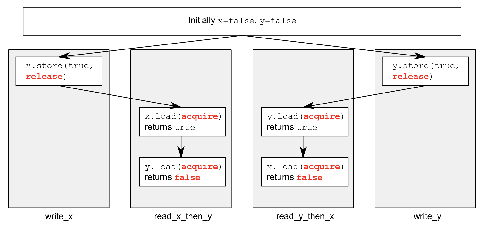

# The Concept and Best Practice of C++ Memory Order

- [The Concept and Best Practice of C++ Memory Order](#the-concept-and-best-practice-of-c-memory-order)
  - [Memory Order Basics](#memory-order-basics)
  - [Atomic Operations and Types in C++](#atomic-operations-and-types-in-c)
    - [Storing a New Value (or not) Depending on the Current Value](#storing-a-new-value-or-not-depending-on-the-current-value)
  - [Synchronizing Operations and Enforcing Ordering](#synchronizing-operations-and-enforcing-ordering)
    - [the Synchronizes-with Relationship](#the-synchronizes-with-relationship)
    - [the Happens-before Relationship](#the-happens-before-relationship)
    - [Memory Ordering for Atomic Types](#memory-ordering-for-atomic-types)
    - [Sequentially Consistent Ordering](#sequentially-consistent-ordering)
    - [Non-Sequentially Consistent Memory Orderings](#non-sequentially-consistent-memory-orderings)
    - [Relaxed Ordering](#relaxed-ordering)
    - [Understanding Relaxed Ordering](#understanding-relaxed-ordering)
    - [Acquire-Release Ordering](#acquire-release-ordering)
    - [Transitive Synchronization with Acquire-Release Ordering](#transitive-synchronization-with-acquire-release-ordering)
    - [Data Dependency with Acquire-Release Ordering and Memory_Order_Consume](#data-dependency-with-acquire-release-ordering-and-memory_order_consume)
    - [Release Sequences and Synchronizes-with](#release-sequences-and-synchronizes-with)
    - [Fences](#fences)
    - [Ordering Nonatomic Operations without Atomics](#ordering-nonatomic-operations-without-atomics)

## Memory Order Basics

Whatever its type, an object is stored in one or more *memory locations*. In C++ memory model,

- Every variable is an object, including those that are members of other object.
- Every object occupies at least one memory location.
- Variables of fundamental type such as `int` or `char` are exactly one memory location, whatever their size, even if they're adjacent or part of an array
- Adjacent bit fields are part of the same memory location

In order to avoid the data race, there has to be an enforced ordering(先后) between the accesses in two threads that access the *same* memory location.

Every object in a C++ program has a defined *modification order* composed of all the writes to that object from all threads in the program, starting with the object's initialization. In most cases this order will vary between runs (because of out of order execution of CPU), but in any given execution of the program, all the threads in the system must agree on the order. If the object in question is not one of the atomic types of C++, you are responsible for ensuring that the necessary synchronization is in place. However, although all threads must agree on the modification orders of each individual object, they don't necessarily have to agree on the relative order of operations on separate objects. 

## Atomic Operations and Types in C++

The standard atomic types are not copyable or assignable in the conventional sense, in that they have to copy constructors or copy assignment operators. All operations on an atomic type are defined as atomic, and assignment and copy-construction involves two objects. A single operation on two distinct objects cannot be atomic. In the case of copy-construction or copy-assignment, the value must first be read from one object and then written to the other. These are two separate operations on two separate objects, and the combination cannot be atomic. Therefore, there operations are not permitted. However, they support assignment from and implicit conversion to the corresponding built-in types as well as direct `load()` and `store()` member functions, `exchange()`, `compare_exchange_weak()`, and `compare_exchange_strong()`. Each of the operations on the atomic types has an optional memory-ordering argument that can be used to specify the required memory-ordering semantics. The operations are divided into three categories:

- *Store* operations, which can have `memory_order_relaxed`, `memory_order_release`, or `memory_order_seq_cst` ordering.
- *Load* operations, which can have `memory_order_relaxed`, `memory_order_consume`, `memory_order_acquire`, or `memory_order_seq_cst` ordering.
- *Read-modify-write* operations, which can have `memory_order_relaxed`, `memory_order_consume`, `memory_Order_acquire`, `memory_oreder_release`, `memory_order_acq_rel`, or `memory_order_seq_cst` ordering.

The default ordering for all operations is `memory_order_seq_cst`.

### Storing a New Value (or not) Depending on the Current Value

There is a special operation of atomic type called compare/exchange, and it comes in the form of the `compare_exchange_weak()` and `compare_exchange_strong()` member functions. The compare/exchange operation is the cornerstone of programming with atomic types; it compares the value of the atomic variable with a supplied expected value, and stores the supplied desired value if they are equal. If the values are not equal, the expected value is updated with the actual value of the atomic variable. The return type of the compare/exchange functions is a `bool`, which is `true` if the store was performed and `false` otherwise.

For `compare_exchange_weak()`, the store might not be successful even if the original value was equal to the expected value, in which case the value of the variable is unchanged and the return value of `compare_exchange_weak()` is `false`. This is called a *spurious failure*, because the reason for the failure is a function of timing rather than the values of the variables. Therefore, `compare_exchange_weak()` must typically be used in a loop:

```c++
bool expected = false;
extern atomic<bool> b; // set somewhere else
while (!b.compare_exchange_weak(expected, true) && !expected);
```

On the other hand, `compare_exchange_strong()` is guaranteed to return `false` only if the actual value wasn't equal to the `expected` value. 

## Synchronizing Operations and Enforcing Ordering

Suppose you have two threads, one of which is populating a data structure to be read by the second. The code listing shows such scenario:

```c++
#include <vector>
#include <atomic>
#include <iostream>

std::vector<int> data;
std::atomic<bool> data_ready(false);

void reader_thread() {
    while (!data_ready.load()) { // (1)
        std::this_thread::sleep(std::milliseconds(1));
    }
    std::cout << "The answer = " << data[0] << "\n"; // (2)
}

void writer_thread() {
    data.push_back(42); // (3)
    data_ready = true; // (4)
}
```

The required enforced access ordering comes from the operations on the `std::atomic<bool>` variable `data_ready`; they provide the necessary ordering by virtue of the memory model relations *happens-before* and *synchronizes-with*. The write of the data (3) happens-before the write to the `data_ready` flag (4), and the read of the flag (1) happens-before the read of the data (2). When the value read from `data_ready` (1) is `true`, the write synchronizes-with that read, creating a happens-before relationship. Because the happens-before is transitive, the write to the data (3) happens-before the write to the flag (4), which happens-before the read of the `true` value from the flag (1), which happens before the read of the data (2), and you have an enforced ordering: the write of the data happens-before the read of the data and everything is OK. With default atomic operations, the operation that writes a value happens before an operation that reads that value, which is rather intuitive, but it does need spelling out: the atomic operations also have other options for the ordering requirements.

### the Synchronizes-with Relationship

The basic idea is this: a suitably tagged atomic write operation `W` on a variable `x` synchronizes-with a suitably tagged atomic read operation on `x` that reads the value stored by (我们在以下情况下，认为写和读是同步的):

- that write (`W`) (读操作读出的是`W`对`x`写入的值)
- a subsequent atomic write operation on `x` by the same thread that performed the initial write `W` (读操作读出的是`W`所在的线程在`W`操作之后写入的值)
- a sequence of atomic read-modify-write operations on `x` (such as `fetch_add()` or `compare_exchange_weak()`) by any thread, where the value read by the first thread in the sequence is the value written by `w`. (读操作读出的是任何线程通过read-modify-write操作对`x`写入的值，而这个read-modify-write读出的值是`W`写入的值).

### the Happens-before Relationship

The *happens-before* relationship is the basic building block of operation ordering in a program; it specifies which operations see the effects of which other operations. For a single thread, it's largely straightforward: if one operation is sequenced before another, then it also happens-before it. If operation A on one thread inter-thread happens-before operation B on another thread, then A happens-before B. If operation A in one thread synchronizes-with operation B in another thread, then A inter-thread happens-before B.

### Memory Ordering for Atomic Types

There are six memory ordering options that can be applied to operations on atomic types: `memory_order_relaxed`, `memory_order_consume`, `memory_order_acquire`, `memory_order_release`, `memory_order_acq_rel`, and `memory_order_seq_cst`. The default memory-ordering option for all operations on atomic types is `memory_order_seq_cst` unless explicitly specified. Although there are six ordering options, they represent three models: *sequentially consistent* ordering (`memory_order_seq_cst`), *acquire-release* ordering (`memory_order_consume`, `memory_order_acquire`, `memory_order_release`, and `memory_order_acq_rel`), and *relaxed* ordering (`memory_order_relaxed`). 

### Sequentially Consistent Ordering

The default ordering is named *sequentially consistent* because it implies that the behavior of the program is consistent with a simple sequential view of the world. If all operations on instances of atomic types are sequentially consistent, the behavior of a multi-threaded program is as if all these operations were performed in some particular sequence by a single thread: all threads must see the same order of operations.

From the point of view of synchronization, a sequentially consistent store synchronizes-with a sequentially consistent load of the same variable that reads the value stored. What's more, any sequentially consistent atomic operations done after that load must also appear after the store to other threads in the system using sequentially consistent atomic operations. The following listing shows sequentially consistency in action:

```c++
#include <atomic>
#include <thread>
#include <cassert>

std::atomic<bool> x, y;
std::atomic<int> z;

void write_x() {
    x.store(true, std::memory_order_seq_cst); // (1)
}

void write_y() {
    y.store(true, std::memory_order_seq_cst); // (2)
}

void read_x_then_y() {
    while (!x.load(std::memory_order_seq_cst));
    if (y.load(std::memory_order_seq_cst)) // (3)
      ++z;
}

void read_y_then_x() {
    while (!y.load(std::memory_order_seq_cst));
    if (x.load(std::memory_order_seq_cst)) // (4)
      ++z;
}

int main() {
    x = false;
    y = false;
    z = 0;
    std::thread a(write_x);
    std::thread b(write_y);
    std::thread c(read_x_then_y);
    std::thread d(read_y_then_x);
    a.join();
    b.join();
    c.join();
    d.join();
    assert(z.load() != 0); // (5_)
}
```

The `assert` (5) can never fire, because either the store to `x` (1) or the store to `y` (2) must happens first by the view of all threads, even though it's not specified which.

### Non-Sequentially Consistent Memory Orderings

Probably the biggest issue outside the nice sequentially consistent world is the fact that *there's no longer a single global order of events*. This means that different threads can see different views of the same operations, and you must throw away any mental model you have of operations from different threads neatly interleaved one after the other. Not only do you have to account for things happening truly concurrently, but *threads don't have to agree on the order of events*. It's not just that the compiler can reorder the instructions. Even if the threads are running the same bit of code, they can disagree on the order of events caused by operations in other threads in the absence of explicit ordering constraints, because the different CPU caches and internal buffers can hold different values for the same memory. It's so important I'll say it again: *threads don't have to agree on the order of events*.

You also have to throw out mental models based on the idea of the compiler or processor reordering the instructions. *In the absence of other ordering constraints, the only requirement is that all threads agree on the modification order of each individual variables.* Operations on distinct variables can appear in different orders on different threads, provided the values seen are consistent with any additional ordering constraints imposed.

### Relaxed Ordering

Operations on atomic types performed with relaxed ordering don't participate in synchronizes-with relationships. Operations on the same variable within a single thread still obey happens-before relationships, but there is almost no requirement on ordering relative to other threads. The only requirement is that accesses to a single atomic variable from the same thread can't be reordered; once a given thread has seen a particular value of an atomic variable, a subsequent read by that thread can't retrieve an earlier value of the variable. Without any additional synchronization, the modification order of each variable is the only thing shared between threads that are using `memory_order_relaxed`. 

To demonstrate just how relaxed your relaxed operations can be, you need only two threads, as shown in the following listing.

```c++
#include <atomic>
#include <thread>
#include <cassert>

void write_x_then_y() {
    x.store(true, std::memory_order_relaxed); // (1)
    y.store(true, std::memory_order_relaxed); // (2)
}

void read_y_then_x() {
    while (!y.load(std::memory_order_relaxed)); // (3)
    if (x.load(std::memory_order_relaxed)) // (4)
        ++z;
}

int main() {
    x = false;
    y = false;
    z = 0;
    std::thread a(write_x_then_y);
    std::thread b(read_y_then_x);
    a.join();
    b.join();
    assert(z.load() != 0); // (5)
}
```

This time the assert (5) *can* fire, because the load of *x* (4) can read `false`, even though the load of *y* (3) reads `true` and the store of `x` (1) happens-before the store of `y` (2). `x` and `y` are different variables, so there are no ordering guarantees relating to the visibility of values arising from operations on each.

Relaxed operations on different variables can be freely reordered provided they obey any happens-before relationships they're bound by (for example, within the same thread). They don't introduce synchronizes-with relationships.

Let's look at the slightly more complex example with three variables and five threads in the next listing.

```c++
#include <thread>
#include <atomic>
#include <iostream>

std::atomic<int> x(0), y(0), z(0); // data source
std::atomic<bool> go(false);

unsigned const loop_count = 10;
struct read_values {
    int x, y, z;
};

read_values values1[loop_count];
read_values values2[loop_count];
read_values values3[loop_count];
read_values values4[loop_count];
read_values values5[loop_count];

// 这个函数连续读10次x,y,z存下来; 每读一次，都会把var+1. 实际上var是x,y,z
// 所以如果var=x，则应该存下的x是0,1,2,3,4,5,6,7,8,9, y,z的值与此无关
// 如果var=y, 类似存在的y是0,1,2,3,4,5,6,7,8,9, x,z的值与此无关
void increment(std::atomic<int> *var_to_inc, read_values* values) {
    while (!go)
        std::this_thread::yield();
    for (unsigned i = 0; i < loop_count; ++i) {
        values[i].x = x.load(std::memory_order_relaxed);
        values[i].y = y.load(std::memory_order_relaxed);
        values[i].z = z.load(std::memory_order_relaxed);
        var_to_inc->store(i+1, std::memory_order_relaxed);
        std::this_thread::yield();
    }  
}

// 这个函数连续读10次x,y,z存下来，但不做其他操作
void read_vals(read_values* values) {
    while (!go)
        std::this_thread::yield();
    for (unsigned i = 0; i < loop_count; ++i) {
        values[i].x = x.load(std::memory_order_relaxed);
        values[i].y = y.load(std::memory_order_relaxed);
        values[i].z = z.load(std::memory_order_relaxed);
        std::this_thread::yield;
    }    
}

void print(read_values* v) {
    for (unsigned i = 0; i < loop_count; ++i) {
        if (i)
            std::cout << ",";
        std::cout << "(" << v[i].x << "," << v[i].y << "," << v[i].z << ")";
    }
    std::cout << std::endl;
}

int main() {
    std::thread t1(increment, &x, values1);
    std::thread t2(increment, &y, values2);
    std::thread t3(increment, &z, values3);
    std::thread t4(read_vals, values4);
    std::thread t5(read_vals, values5);

    go = true;

    t5.join();
    t4.join();
    t3.join();
    t2.join();
    t1.join();

    print(values1);
    print(values2);
    print(values3);
    print(values4);
    print(values5);
}
```

This is a really simple program in essence. You have three shared global atomic variables and five threads. Each thread loops 10 times, reading the values of three atomic variables using `memory_order_relaxed` and storing them in an array. Three of the threads each update one of the atomic variables each time through the loop, while the other two threads just read. Once all the threads have been joined, you print the values from the arrays stored by each thread. One possible output from this program is as follows:

```shell
(0,0,1),(1,0,2),(2,2,3),(3,2,3),(4,4,5),(5,6,7),(6,6,7),(7,8,9),(8,8,9),(9,8,9)
(2,0,2),(2,1,3),(4,2,4),(4,3,4),(5,4,5),(5,5,5),(7,6,7),(7,7,7),(10,8,9),(10,9,9)
(0,0,0),(1,0,1),(2,1,2),(4,2,3),(4,4,4),(5,6,5),(5,6,6),(7,8,7),(7,8,8),(10,10,9)
(1,0,1),(1,0,1),(1,0,1),(1,0,1),(1,0,1),(1,0,1),(1,0,1),(1,0,1),(1,0,1),(1,0,1)
(1,0,1),(1,0,1),(1,0,1),(1,0,1),(1,0,1),(1,0,1),(1,0,1),(1,0,1),(1,0,1),(1,0,1)
```

### Understanding Relaxed Ordering

这里用中文说书上的例子吧...去理解relaxed ordering. 有一个人坐在一个小隔间里，他有一部电话和一个本子，本子上记录了一个数列。你可以打电话问他数字，也可以让他在数列最后写下一个新数。当你第一次问他数时，他会给你当时数列上任何一个数；你再问他的时候，他只能给上次的数、或者后面的数，但不能给以前的数。当你要求它写下一个新数，然后再问他数时，他会给你让他写的那个数，但也有可能给后面的数（其他人让他写的）。每一个小隔间里的人都是一个relaxed ordering的原子变量，你和其他人可以看作是线程。这就是relaxed ordering的语义。回到之前`write_x_then_y`的例子里，这个线程让隔间`x`里的人写下`true`，然后让隔间`y`里的人写下`true`。另外一个线程`read_y_then_x`则先一直问隔间`y`里的人直到他回答`true`，这个时候去问隔间`x`里的人，`x`的人没有义务告诉你`true`，因为你跟他没有什么关系，他完全可以对你说`false`。

这里关键是：你告诉`x`一个数字，就相当于在这个线程的cache里的`x`写了一个数，这样你这个线程看到的，一定是这个数，或者有可能是后面其他线程对它的`x`写的数字，可能在任何时候冲刷到你这个线程的`x`里。如果你从来没有写过`x`，则你看到的`x`是别人写入的数字以某个频率冲刷到你这里的`x`，你看到的可能是任何中间过程，只是不会逆转。这就是没有任何同步的概念。

### Acquire-Release Ordering

Acquire-release ordering is a step up from relaxed ordering; there is still no total order of operations, but it does introduce some synchronization. Under this ordering model, atomic loads are `acquire` operations (`memory_order_acquire`), atomic stores are `release` operations (`memory_order_release`), and atomic read-modify-write operations (such as `fetch_add` or `exchange()`) are either `acquire`, `release`, or both (`memory_order_acq_rel`). Synchronization is pairwise, between the thread that does the release anhd the thread that does the acquire. *A release operation synchronizes-with an acquire operation that reads the value written*. This means that different threads can *still* see different orderings, but these orderings are restricted. The following listing is a rework of `read_x_y` example using acquire-release semantics rather than sequentially consistent ones.

```c++
#include <atomic>
#include <thread>
#include <cassert>

std::atomic<bool> x, y;
std::atomic<int> z;

void write_x() {
    x.store(true, std::memory_order_release);
}

void write_y() {
    y.store(true, std::memory_order_release);
}

void read_x_then_y() {
    while (!x.load(std::memory_order_acquire));
    if (y.load(std::memory_order_acquire)) // (1)
        ++z;
}

void read_y_then_x() {
    while (!y.load(std::memory_order_acquire));
    if (x.load(std::memory_order_acquire)) // (2)
        ++z;
}

int main() {
    x = false;
    y = false;
    z = 0;
    std::thread a(write_x);
    std::thread b(write_y);
    std::thread c(read_x_then_y);
    std::thread d(read_y_then_x);
    a.join();
    b.join();
    c.join();
    d.join();
    assert(z.load() != 0); // (3)
}
```

In this case the assert (3) can fire, because it's possible for both the load of `x` (2) and the load of `y` (1) to read `false`. `x` and `y` are written by different threads. The `write_x` is synchronized with the read of `x` in `read_x_then_y`, and the `write_y` is synchronized with the read of `y` in `read_y_then_x`. But there is no relationship between the read of `y` in `read_x_then_y` and `write_y`.



In order to see the benefit of acquire-release ordering, you need to consider two stores from the same thread, like the following listing. 

```c++
#include <atomic>
#include <thread>
#include <cassert>

std::atomic<bool> x, y;
std::atomic<int> z;

void write_x_then_y() {
    x.store(true, std::memory_order_relaxed); // (1)
    y.store(true, std::memory_order_release); // (2)
}

void read_y_then_x() {
    while (!y.load(std::memory_order_acquire)); // (3)
    if (x.load(std::memory_order_relaxed)) // (4)
        ++z;
}

int main() {
    x = false;
    y = false;
    z = 0;
    std::thread a(write_x_then_y);
    std::thread b(read_y_then_x);
    a.join();
    b.join();
    assert(z.load() != 0); // (5)
}
```

Eventually, the load from `y` will see `true` as written by the store (2). Because the store uses `memory_order_release` and the load uses `memory_order_acquire`, the store synchronizes-with the load. The store to `x` (1) happens-before the store to `y` (2), because they're in the same thread. Because the store to `y` synchronizes-with the load from `y`, the store to `x` also happens-before the load from `y`, and by extension happens before the load from `x` (4). Thus the load from `x` must read `true`, and the assert *can't* fire. The value stored by a release operation must be seen by an acquire operation for either to have any effect. If either the store at (2) or the load at (3) was a relaxed operation, there'd be no ordering on the accesses to `x`. 这里的关键在于，线程A的release操作和线程B的acquire操作发生了同步，则线程B在acquire之后，就能看到线程A在release操作以前的所有更新，这些更新都会冲刷到线程B的视野里。这是synchronize-with最核心的概念。

acquire-release操作也可以用隔间里的书记员来类比，但情况会复杂一些。首先，每次存store操作是某个更新批次的一部分。当你要求书记员记录一个数时，你可以选择告诉他更新批次的编号。对于一个批次的最后一次store，你会告诉书记员：这是我这个批次的最后一次更新，书记员会记下这个信息，也记下你。这就是一个store-release操作。当你询问数字时，你可以只问数字(relaxed load)操作，书记员只告诉你数字；你也可以让书记员告诉你，它是不是某个批次的最后一次store(load-acquire操作)。如果你问了批次信息，书记员会告诉你数字，并且告诉你这个数字是不是批次里最后store的那个，是谁store的。

### Transitive Synchronization with Acquire-Release Ordering

The transitive synchronization scenario is shown in the next listing.

```c++
std::atomic<int> data[5];
std::atomic<bool> sync1(false), sync2(false);

void thread_1() {
    data[0].store(42, std::memory_order_relaxed);
    data[1].store(97, std::memory_order_relaxed);
    data[2].store(17, std::memory_order_relaxed);
    data[3].store(-141, std::memory_order_relaxed);
    data[4].store(2003, std::memory_order_relaxed);
    sync1.store(true, std::memory_order_release); // (1)
}

void thread_2() {
    while (!sync1.load(std::memory_order_acquire)); // (2)
    sync2.store(true, std::memory_order_release); // (3)
}

void thread_3() {
    while (!sync2.load(std::memory_order_acquire)); // (4)
    assert(data[0].load(std::memory_order_relaxed) == 42);
    assert(data[1].load(std::memory_order_relaxed) == 97);
    assert(data[2].load(std::memory_order_relaxed) == 17);
    assert(data[3].load(std::memory_order_relaxed) == -141);
    assert(data[4].load(std::memory_order_relaxed) == 2003);
}
```

First off, the stores to `data` happens-before the store to `sync` (1), because they're sequenced-before it in the same thread. Because the load from `sync1` is in a `while` loop, it will eventually see the value stored from `thread_1` and thus form the second half of the release-acquire pair. Therefore, the store to `sync1` happens-before (synchronizes-with) the final load from `sync1` in the `while` loop. This load is sequenced-before (and thus happens-before) the store to `sync2` (3), which forms a release-acquire pair with the final load from the `while` loop in `thread_3` (4). The store to `sync2` (3) thus happens-before (synchronizes-with) the load (4), which happens-before the loads from `data`. Because the transitive nature of happens-before, you can chain it all together: the stores to `data` happen-before the store to `sync` (1), which happens-before the load from `sync1` (4), which happens-before the store to `sync2` (3), which happens-before the load from `sync2` (4), which happens-before the loads from `data`. Thus the stores to `data` in `thread_1` happen-before the loads from `data` in `thread_3`, and the `assert`s can't fire.

In this case, you could combine `sync1` and `sync2` into a single variable by using a read-modify-write operation with `memory_order_acq_rel` in `thread_2`. One option would be to use `compare_exchange_strong()` to ensure that the value is updated only once the store from `thread_1` has been seen:

```c++
std::atomic<int> sync(0);
std::atomic<int> data[5];

void thread_1() {
    data[0].store(42, std::memory_order_relaxed);
    data[1].store(97, std::memory_order_relaxed);
    data[2].store(17, std::memory_order_relaxed);
    data[3].store(-141, std::memory_order_relaxed);
    data[4].store(2003, std::memory_order_relaxed);
    sync.store(1, std::memory_order_release);
}

void thread_2() {
    int expected = 1;
    while (!sync.compare_exchange_strong(expected, 2, std::memory_order_acq_rel))
      expected = 1;
}

void thread_3() {
    while (sync.load(std::memory_order_acquire) < 2);
    assert(data[0].load(std::memory_order_relaxed) == 42);
    assert(data[1].load(std::memory_order_relaxed) == 97);
    assert(data[2].load(std::memory_order_relaxed) == 17);
    assert(data[3].load(std::memory_order_relaxed) == -141);
    assert(data[4].load(std::memory_order_relaxed) == 2003);
}
```

If you use read-modify-write operations, it's important to pick which semantics you desire. In this case, you want both acquire and release semantics, so `memory_order_acq_rel` is appropriate, but you can use other orderings too. A `fetch_sub` operation with `memory_order_acquire` semantics doesn't synchronize-with anything, even though it stores a value, because it isn't a release operation. Likewise, a store can't synchronize-with a `fetch_or` with `memory_order_release` semantics, because the read part of the `fetch_or` isn't an acquire operation. Read-modify-write operations with `memory_order_acq_rel` semantics behave as both an acquire and a release, so a prior store can synchronize-with such an operation, and it can synchronize-with a subsequent load, as is the case in this example.

If you mix acquire-release operations with sequentially consistent operations, the sequentially consistent loads behave like loads with acquire semantics, and sequentially consistent stores behave like stores with release semantics. Sequentially consistent read-modify-write operations behave as both acquire and release operations. Relaxed operations are still relaxed but are bound by the additional synchronizes-with and consequent happens-before relationships introduced through the use of acquire-release semantics.

### Data Dependency with Acquire-Release Ordering and Memory_Order_Consume

`memory_order_consume` is special: it's all about data dependencies, and it introduces the data-dependency nuances to the inter-thread happens-before relationship.

There are two new relations that deal with data dependencies: *dependency-ordered-before* and *carries-a-dependency-to*. Just like sequenced-before, carries-a-dependency-to applies strictly within a single thread and essentially models the data dependency between operations; if the result of an operation A is used as an operand for an operation B, then A-carries-a-dependency-to B. If the result of operation A is a value of a scalar type such as `int`, then the relationship still applies if the result of A is stored in a variable, and that variable is then used as an operand for operation B. This operation is also transitive, so if A carries-a-dependency-to B, and B carries-a-dependency-to C, then A carries-a-dependency-to C.

On the other hand, the dependency-ordered-before relationship can apply between threads. It's introduced by using atomic load operations tagged with `memory_order_consume`. This is a special case of `memory_order_acquire` that limits the synchronized data to direct dependencies; *a store operation A tagged with `memory_order_release`, `memory_order_acq_rel`, or `memory_order_seq_cst` is dependency-ordered-before a load operation B tagged with `memory_order_consume` if the consume reads the value stored*. If A is dependency-ordered before B, that A also inter-thread happens-before B.

One important use for this kind of memory ordering is where the atomic operation loads a pointer to some data. By using `memory_order_consume` on the load and `memory_order_release` on the prior store, you ensure that the pointed-to data is correctly synchronized, without imposing any synchronization requirements on any other nondependent data. The following listing shows an example of this scenario.

```c++
struct X {
    int i;
    std::string s;
};

std::atomic<X*> p;
std::atomic<int> a;

void create_x() {
    X* x = new X;
    x->i = 42;
    x->s = "hello";
    a.store(99, std::memory_order_relaxed); // (1)
    p.store(x, std::memory_order_release); // (2)
}

void use_x() {
    X* x;
    while (!(x = p.load(std::memory_order_consume))) // (3)
        std::this_thread::sleep(std::chrono::microseconds(1));
    assert(x->i == 42); // (4)
    assert(x->s == "hello"); // (5)
    assert(a.load(std::memory_order_relaxed) == 99); // (6)
}

int main() {
    std::thread t1(create_x);
    std::thread t2(use_x);
    t1.join();
    t2.join();
}
```

Even though the store to `a` (1) is sequenced before the store to `p` (2), and the store to `p` is tagged `memory_order_release`, the load of `p` (3) is tagged with `memory_order_consume`. *This means that the store to `p` only happens-before those expressions that are dependent on the value loaded from `p`.* This means that the asserts on the data members of the `X` structure (4), (5) are guaranteed not to fire, because the load of `p` carries a dependency to those expressions through the variable `x`. On the other hand, the assert on the value of `a` (6) may or may not fire, this operation isn't dependent on the value loaded from `p`, and so there's no guarantee on the value that's read. This is particularly apparent because it's tagged with `memory_order_relaxed`, as you'll see.

Sometimes, you don't want the overhead of carring the dependency around. In these scenario, you can use `std::kill_dependency()` to explicitly break the dependency chain. For example, if you have a global read-only array, and you use `std::memory_order_consume` when retrieving an index into that array from another thread, you can use `std::kill_dependency()` to let the compiler know that it doesn't need to reread the contents of the array entry:

```c++
int global_data[] = {...};
std::atomic<int> index;
void f() {
    int i = index.load(std::memory_order_consume);
    do_something_with(global_data[std::kill_dependency(i)]);
}
```

`std::kill_dependency()` is a simple function template that copies the supplied argument to the return value, but breaks the dependency chain in doing so.

### Release Sequences and Synchronizes-with

If the store is tagged with `memory_order_release`, `memory_order_acq_rel`, or `memory_order_seq_cst`, and the load is tagged with `memory_order_consume`, `memory_order_acquire`, or `memory_order_seq_cst`, and each operation in the chain loads the value written by the previous operation, then the chain of operations constitutes a *release sequence*, and the initial store synchronizes-with (for `memory_order_acquire` or `memory_order_seq_cst`) or is dependency-ordered-before (for `memory_order_consume`) the final load. *Any atomic read-modify-write operations in the chain can have any memory ordering (even `memory_order_relaxed`)*.

Consider an `atomic<int>` being used as a `count` of the number of items in a shared queue, as in the following listing:

```c++
#include <atomic>
#include <thread>

std::vector<int> queue_data;
std::atomic<int> count;

void populate_queue() {
    unsigned const number_of_items = 20;
    queue_data.clear();
    for (unsigned i = 0; i < number_of_items; ++i) {
        queue_data.push_back(i);
    }
    count.store(number_of_items, std::memory_order_release); //(1)
}

void consume_queue_items() {
    while (true) {
        int item_index;
        if ((item_index = count.fetch_sub(1, std::memory_order_acquire)) <= 0) {
            wait_for_more_items();
            continue;
        }
        process(queue_data[item_index+1]);
    }
}

int main() {
    std::thread a(populate_queue);
    std::thread b(consume_queue_items);
    std::thread c(consume_queue_items);
    a.join();
    b.join();
    c.join();
}
```

If there is one consumer thread, this is fine; the `fetch_sub()` is a read, with `memory_order_acquire` semantics, and the store had `memory_order_release` semantics, so the store synchronizes-with the load and the thread can read the item from the buffer. If there are two threads reading, the second `fetch_sub()` will see the value written by the first thread ('s `fetch_sub()`), and not the value written by the `store`. Without the rule about the release sequence, this second thread wouldn't have a happens-before relationship with the first thread, and it wouldn't be safe to read the shared buffer unless the first `fetch_sub()` also had `memory_order_release` semantics, which would introduce unnecessary synchronization between the two consumer threads. 

### Fences

An atomic operations library wouldn't be complete without a set of fences. These are operations that enforce memory-ordering constraints without modifying and data and are typically combined with atomic operations that use the `memory_order_relaxed` ordering constraints. Fences are global operations and affect the ordering of other atomic operations in the thread that executed the fence. Fences are also commonly called *memory barriers*, and they get their name because they put a line in the code that certain operations can't cross. Relaxed operations on separate variables can unsually be freely reordered by the compiler or the hardware. Fences restrict this freedom and instroduce happens-before and synchronizes-with relationships that weren't present before.

The following listing shows an example adding a fence between the two atomic operations on each thread.

```c++
#include <atomic>
#include <thread>
#include <cassert>

std::atomic<bool> x, y;
std::atomic<int> z;

void write_x_then_y() {
    x.store(true, std::memory_order_relaxed); // (1)
    std::atomic_thread_fence(std::memory_order_release); // (2)
    y.store(true, std::memory_order_relaxed); // (3)
}

void read_y_then_x() {
    while (!y.load(std::memory_order_relaxed)); // (4)
    std::atomic_thread_fence(std::memory_order_acquire); // (5)
    if (x.load(std::memory_order_relaxed)) // (6)
        ++z;
}

int main() {
    x = false;
    y = false;
    z = 0;
    std::thread a(write_x_then_y);
    std::thread b(read_y_then_x);
    a.join();
    b.join();
    assert(z.load() != 0);
}
```

The release fence (2) synchronizes-with the acquire fence (5), because the load from `y` at (4) reads the value stored at (3). This means that the store to `x` at (1) happens-before the load from `x` at (6), so the value read must be `true` and the assert at (7) won't fire. This is in constrast to the original case without the fences where the store to and load from `x` weren't reordered, and so the assert could fire. Note that both fences are necessary: you need a release in one thread and an acquire in another to get a synchronizes-with relationship.

In this case, the release fence (2) has the same effect as if the store to `y` at (3) was tagged with `memory_order_release` rather that `memory_order_relaxed`. Likewise, the acquire fence (5) makes it as if the load from `y` (4) was tagged with `memory_order_acquire`. This is the general idea with fences: if an acquire operation sees the result of a store that takes place after a release fence, the fence synchronizes-with that acquire operation; and if a load that takes place before an acquire fence sees the result of a release operation, the release operation synchronizes-with the acquire fence. Of course, you can have fences on both sides, as in the example here, in which case if a load that takes place before the acquire fences sees a value written by a store that takes place after the release fence, the release fence synchronizes-with the acquire fence.

Although the fence synchronization depends on the values read or written by operations before or after the fence, it's important to note that the synchronization point is the fence itself. If you take `write_x_then_y` from the above listing, and move the write to `x` after the fences as follows, the condition in the assert is no longer guaranteed to be true, even though the write to `x` comes before the write to `y`:

```c++
void write_x_then_y()
{
    std::atomic_thread_fence(std::memory_order_release);
    x.store(true, std::memory_order_relaxed);
    y.store(true, std::memory_order_relaxed);
}
```

These two operations are no longer separated by the fence and so are no longer ordered.

### Ordering Nonatomic Operations without Atomics

If you replace `x` from above listing with an ordinary nonatomic `bool`, the behavior is guaranteed to be the same:

```c++
#include <atomic>
#include <thread>
#include <cassert>

bool x = false;
std::atomic<bool> y;
std::atomic<int> z;

void write_x_then_y() {
    x = true; // (1)
    std::atomic_thread_fence(std::memory_order_release);
    y.store(true, std::memory_order_relaxed); // (2)
}

void read_y_then_x() {
    while (!y.load(std::memory_order_relaxed)); // (3)
    std::atomic_thread_fence(std::memory_order_acquire);
    if (x) // (4)
        ++z;
}

int main() {
    x = false;
    y = false;
    z = 0;
    std::thread a(write_x_then_y);
    std::thread b(read_y_then_x);
    a.join();
    b.join();
    assert(z.load() != 0); // (5)
}
```

The fences still provide an enforced ordering of the store to `x` (1) and the store to `y` (2), and, the load from `y` (3) and the load from `x` (4). There's still a happens-before relationship between the store to `x` and the load from `x`, so the assert (5) still won't fire. 
