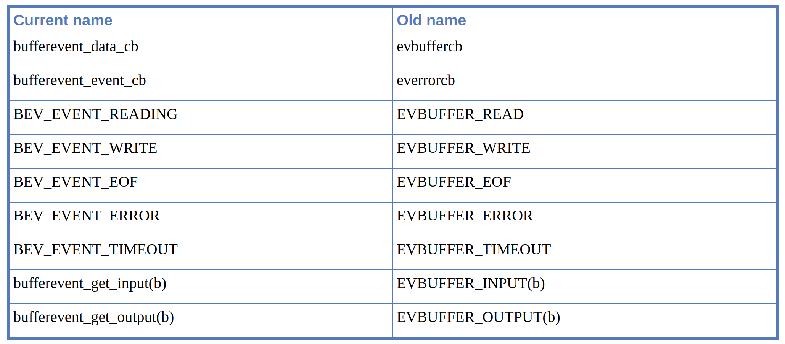

# Libevent

- [Libevent](#libevent)
  - [A tiny introduction to asynchronous IO](#a-tiny-introduction-to-asynchronous-io)
    - [What about convenience?](#what-about-convenience)
  - [The Libevent Reference Manual: Preliminaries](#the-libevent-reference-manual-preliminaries)
    - [Libevent from 10,000 feet](#libevent-from-10000-feet)
    - [The Libraries](#the-libraries)
    - [The Headers](#the-headers)
  - [Creating an event_base](#creating-an-event_base)
    - [Setting up a default event_base](#setting-up-a-default-event_base)
    - [Setting up a complicated event_base](#setting-up-a-complicated-event_base)
    - [Examining an event_base's backend method](#examining-an-event_bases-backend-method)
    - [Deallocating an event_base](#deallocating-an-event_base)
    - [Setting priorities on an event_base](#setting-priorities-on-an-event_base)
    - [Reinitializing an event_base after fork()](#reinitializing-an-event_base-after-fork)
    - [Obsolete event_base functions](#obsolete-event_base-functions)
  - [Working with an event loop](#working-with-an-event-loop)
    - [Running the loop](#running-the-loop)
    - [Stopping the loop](#stopping-the-loop)
    - [Re-checking for events](#re-checking-for-events)
    - [Checking the internal time cache](#checking-the-internal-time-cache)
    - [Dumping the event_base status](#dumping-the-event_base-status)
    - [Running a function over every event in an event_base](#running-a-function-over-every-event-in-an-event_base)
  - [Working with events](#working-with-events)
    - [Constructing event objects](#constructing-event-objects)
      - [The event flags](#the-event-flags)
      - [About Event Persistence](#about-event-persistence)
      - [Creating an event as its own callback argument](#creating-an-event-as-its-own-callback-argument)
      - [Timeout-only events](#timeout-only-events)
      - [Constructing signal events](#constructing-signal-events)
      - [Caveats when working with signals](#caveats-when-working-with-signals)
      - [Setting up events without heap-allocation](#setting-up-events-without-heap-allocation)
    - [Making events pending and non-pending](#making-events-pending-and-non-pending)
    - [Events with priorities](#events-with-priorities)
    - [Inspecting event status](#inspecting-event-status)
    - [Finding the currently running event](#finding-the-currently-running-event)
    - [Configuring one-off events](#configuring-one-off-events)
    - [Manually activating an event](#manually-activating-an-event)
    - [Optimizing common timeouts](#optimizing-common-timeouts)
    - [Telling a good event apart from cleared memory](#telling-a-good-event-apart-from-cleared-memory)
  - [Helper functions and types for Libevent](#helper-functions-and-types-for-libevent)
    - [Basic types](#basic-types)
      - [evutil_socket_t](#evutil_socket_t)
      - [Standard integer types](#standard-integer-types)
      - [Miscellaneous compatibility types](#miscellaneous-compatibility-types)
    - [Timer portability functions](#timer-portability-functions)
    - [Socket API compatibility](#socket-api-compatibility)
    - [Portable string manipulation functions](#portable-string-manipulation-functions)
    - [Locale-independent string manipulation functions](#locale-independent-string-manipulation-functions)
    - [IPv6 helper and portability functions](#ipv6-helper-and-portability-functions)
    - [Structure macro portability functions](#structure-macro-portability-functions)
    - [Secure random number generator](#secure-random-number-generator)
  - [Bufferevents: concepts and basics](#bufferevents-concepts-and-basics)
    - [Bufferevents and evbuffers](#bufferevents-and-evbuffers)
    - [Callbacks and watermarks](#callbacks-and-watermarks)
    - [Deferred callbacks](#deferred-callbacks)
    - [Option flags for bufferevents](#option-flags-for-bufferevents)
    - [Working with socket-based bufferevents](#working-with-socket-based-bufferevents)
      - [Creating a socket-based bufferevent](#creating-a-socket-based-bufferevent)
      - [Launching connections on socket-based bufferevents](#launching-connections-on-socket-based-bufferevents)
      - [Launching connections by hostname](#launching-connections-by-hostname)
    - [Generic bufferevent operations](#generic-bufferevent-operations)
      - [Freeing a bufferevent](#freeing-a-bufferevent)
      - [Manipulating callbacks, watermarks, and enabled operations](#manipulating-callbacks-watermarks-and-enabled-operations)
      - [Manipulating data in a bufferevent](#manipulating-data-in-a-bufferevent)
      - [Read- and write timeouts](#read--and-write-timeouts)
      - [Initiating a flush on a bufferevent](#initiating-a-flush-on-a-bufferevent)
    - [Type-specific bufferevent functions](#type-specific-bufferevent-functions)
    - [Manually locking and unlocking a bufferevent](#manually-locking-and-unlocking-a-bufferevent)
    - [Obsolete bufferevent functionality](#obsolete-bufferevent-functionality)
  - [Bufferevents: advanced topics](#bufferevents-advanced-topics)
    - [Paired bufferevents](#paired-bufferevents)
    - [Filtering bufferevents](#filtering-bufferevents)
    - [Limiting maximum single read/write size](#limiting-maximum-single-readwrite-size)
    - [Bufferevents and Rate-limiting](#bufferevents-and-rate-limiting)
      - [The rate-limiting model](#the-rate-limiting-model)
      - [Setting a rate limit on a bufferevent](#setting-a-rate-limit-on-a-bufferevent)
      - [Setting a rate limit on a group of bufferevents](#setting-a-rate-limit-on-a-group-of-bufferevents)
      - [Inspecting current rate-limit values](#inspecting-current-rate-limit-values)
      - [Manually adjusting rate limits](#manually-adjusting-rate-limits)
      - [Setting the smallest share possible in a rate-limited group](#setting-the-smallest-share-possible-in-a-rate-limited-group)
      - [Limitations of the rate-limiting implementation](#limitations-of-the-rate-limiting-implementation)
  - [Evbuffers: utility functionality for buffered IO](#evbuffers-utility-functionality-for-buffered-io)
    - [Creating or freeing an evbuffer](#creating-or-freeing-an-evbuffer)
    - [Evbuffers and Thread-safety](#evbuffers-and-thread-safety)
    - [Inspecting an evbuffer](#inspecting-an-evbuffer)
    - [Adding data to an evbuffer: basics](#adding-data-to-an-evbuffer-basics)
    - [Moving data from one evbuffer to another](#moving-data-from-one-evbuffer-to-another)
    - [Adding data to the front of an evbuffer](#adding-data-to-the-front-of-an-evbuffer)
      - [Rearranging the internal layout of an evbuffer](#rearranging-the-internal-layout-of-an-evbuffer)
    - [Removing data from an evbuffer](#removing-data-from-an-evbuffer)
    - [Copying data out from an evbuffer](#copying-data-out-from-an-evbuffer)
    - [Line-oriented input](#line-oriented-input)
    - [Searching within an evbuffer](#searching-within-an-evbuffer)
    - [Inspecting data without copying it](#inspecting-data-without-copying-it)
    - [Adding data to an evbuffer directly](#adding-data-to-an-evbuffer-directly)
      - [Notes and Caveats](#notes-and-caveats)
    - [Network IO with evbuffers](#network-io-with-evbuffers)
    - [Evbuffers and callbacks](#evbuffers-and-callbacks)
    - [Avoiding data copies with evbuffer-based IO](#avoiding-data-copies-with-evbuffer-based-io)
    - [Adding a file to an evbuffer](#adding-a-file-to-an-evbuffer)
      - [WARNING](#warning)
    - [Fine-grained control with file segments](#fine-grained-control-with-file-segments)
    - [Adding an evbuffer to another by reference](#adding-an-evbuffer-to-another-by-reference)
    - [Making an evbuffer add- or remove-only](#making-an-evbuffer-add--or-remove-only)
  - [Connection listeners: accepting TCP connections](#connection-listeners-accepting-tcp-connections)
    - [Creating or freeing an evconnlistener](#creating-or-freeing-an-evconnlistener)
      - [Recognized flags](#recognized-flags)
      - [The connection listener callback](#the-connection-listener-callback)
    - [Enabling and disabling an evconnlistener](#enabling-and-disabling-an-evconnlistener)
    - [Adjusting an evconnlistener's callback](#adjusting-an-evconnlisteners-callback)
    - [Inspecting an evconnlistener](#inspecting-an-evconnlistener)
    - [Detecting errors](#detecting-errors)
    - [Example code: an echo server.](#example-code-an-echo-server)

## A tiny introduction to asynchronous IO

Most beginning programmers start with blocking IO calls. An IO call is synchronous if, when you call it, it does not return until the operation is completed, or until enough time has passed that your network stack gives up. When you call `connect()` on a TCP connection, for example, your operating system queues a SYN packet to the host on the other side of the TCP connection. It does not return control back to your application until either it has received a SYN ACK packet from the opposite host, or until enough time has passed that it decides to give up.

Here's an example of a really simple client using blocking network calls. It opens a connection to www.google.com, sends it a simple HTTP request, and prints the response to stdout.

```c++
/* For sockaddr_in */
#include <netinet/in.h>
/* For socket functions */
#include <sys/socket.h>
/* For gethostbyname */
#include <netdb.h>

#include <unistd.h>
#include <string.h>
#include <stdio.h>

int main(int c, char **v)
{
    const char query[] =
        "GET / HTTP/1.0\r\n"
        "Host: www.google.com\r\n"
        "\r\n";
    const char hostname[] = "www.google.com";
    struct sockaddr_in sin;
    struct hostent *h;
    const char *cp;
    int fd;
    ssize_t n_written, remaining;
    char buf[1024];

    /* Look up the IP address for the hostname.   Watch out; this isn't
       threadsafe on most platforms. */
    h = gethostbyname(hostname);
    if (!h) {
        fprintf(stderr, "Couldn't lookup %s: %s", hostname, hstrerror(h_errno));
        return 1;
    }
    if (h->h_addrtype != AF_INET) {
        fprintf(stderr, "No ipv6 support, sorry.");
        return 1;
    }

    /* Allocate a new socket */
    fd = socket(AF_INET, SOCK_STREAM, 0);
    if (fd < 0) {
        perror("socket");
        return 1;
    }

    /* Connect to the remote host. */
    sin.sin_family = AF_INET;
    sin.sin_port = htons(80);
    sin.sin_addr = *(struct in_addr*)h->h_addr;
    if (connect(fd, (struct sockaddr*) &sin, sizeof(sin))) {
        perror("connect");
        close(fd);
        return 1;
    }

    /* Write the query. */
    /* XXX Can send succeed partially? */
    cp = query;
    remaining = strlen(query);
    while (remaining) {
      n_written = send(fd, cp, remaining, 0);
      if (n_written <= 0) {
        perror("send");
        return 1;
      }
      remaining -= n_written;
      cp += n_written;
    }

    /* Get an answer back. */
    while (1) {
        ssize_t result = recv(fd, buf, sizeof(buf), 0);
        if (result == 0) {
            break;
        } else if (result < 0) {
            perror("recv");
            close(fd);
            return 1;
        }
        fwrite(buf, 1, result, stdout);
    }

    close(fd);
    return 0;
}
```

All of the network calls in the code above are blocking: the `gethostbyname` does not return until it has succeeded or failed in resolving www.google.com; the `connect` does not return until it has connected; the `recv` calls do not return until they have received data or a close; and the `send` call does not return until it has at least flushed its output to the kernel's write buffers.

Now, blocking IO is not necessarily evil. If there's nothing else you wanted your program to do in the meantime, blocking IO will work fine for you. But suppose that you need to write a program to handle multiple connections at once. To make our example concrete: suppose that you want to read input from two connections, and you don't know which connection will get input first. You can't say

```c++
/* This won't work. */
char buf[1024];
int i, n;
while (i_still_want_to_read()) {
    for (i=0; i<n_sockets; ++i) {
        n = recv(fd[i], buf, sizeof(buf), 0);
        if (n==0)
            handle_close(fd[i]);
        else if (n<0)
            handle_error(fd[i], errno);
        else
            handle_input(fd[i], buf, n);
    }
}
```

because if data arrives on `fd[2]` first, your program won't even try reading from `fd[2]` until the reads from `fd[0]` and `fd[1]` have gotten some data and finished.

Sometimes people solve this problem with multithreading, or with multi-process servers. One of the simplest ways to do multithreading is with a separate process (or thread) to deal with each connection. Since each connection has its own process, a blocking IO call that waits for one connection won't make any of the other connections' processes block.

Here's another example program. It is a trivial server that listens for TCP connections on port 40713, reads data from its input one line at a time, and writes out the ROT13 obfuscation (一种加密算法) of line each as it arrives. It uses the Unix `fork()` call to create a new process for each incoming connection.

```c++
/* For sockaddr_in */
#include <netinet/in.h>
/* For socket functions */
#include <sys/socket.h>

#include <unistd.h>
#include <string.h>
#include <stdio.h>
#include <stdlib.h>

#define MAX_LINE 16384

char
rot13_char(char c)
{
    /* We don't want to use isalpha here; setting the locale would change
     * which characters are considered alphabetical. */
    if ((c >= 'a' && c <= 'm') || (c >= 'A' && c <= 'M'))
        return c + 13;
    else if ((c >= 'n' && c <= 'z') || (c >= 'N' && c <= 'Z'))
        return c - 13;
    else
        return c;
}

void
child(int fd)
{
    char outbuf[MAX_LINE+1];
    size_t outbuf_used = 0;
    ssize_t result;

    while (1) {
        char ch;
        result = recv(fd, &ch, 1, 0);
        if (result == 0) {
            break;
        } else if (result == -1) {
            perror("read");
            break;
        }

        /* We do this test to keep the user from overflowing the buffer. */
        if (outbuf_used < sizeof(outbuf)) {
            outbuf[outbuf_used++] = rot13_char(ch);
        }

        if (ch == '\n') {
            send(fd, outbuf, outbuf_used, 0);
            outbuf_used = 0;
            continue;
        }
    }
}

void
run(void)
{
    int listener;
    struct sockaddr_in sin;

    sin.sin_family = AF_INET;
    sin.sin_addr.s_addr = 0;
    sin.sin_port = htons(40713);

    listener = socket(AF_INET, SOCK_STREAM, 0);

#ifndef WIN32
    {
        int one = 1;
        setsockopt(listener, SOL_SOCKET, SO_REUSEADDR, &one, sizeof(one));
    }
#endif

    if (bind(listener, (struct sockaddr*)&sin, sizeof(sin)) < 0) {
        perror("bind");
        return;
    }

    if (listen(listener, 16)<0) {
        perror("listen");
        return;
    }


    while (1) {
        struct sockaddr_storage ss;
        socklen_t slen = sizeof(ss);
        int fd = accept(listener, (struct sockaddr*)&ss, &slen);
        if (fd < 0) {
            perror("accept");
        } else {
            if (fork() == 0) {
                child(fd);
                exit(0);
            }
        }
    }
}

int
main(int c, char **v)
{
    run();
    return 0;
}

```

So, do we have the perfect solution for handling multiple connections at once? Can I stop writing this book and go work on something else now? Not quite. First off, process creation (and even thread creation) can be pretty expensive on some platforms. In real life, you'd want to use a thread pool instead of creating new processes. But more fundamentally, threads won't scale as much as you'd like. If your program needs to handle thousands or tens of thousands of connections at a time, dealing with tens of thousands of threads will not be as efficient as trying to have only a few threads per CPU.

But if threading isn't the answer to having multiple connections, what is? In the Unix paradigm, you make your sockets nonblocking. The Unix call to do this is:

```c++
fcntl(fd, F_SETFL, O_NONBLOCK);
```

where `fd` is the file descriptor for the socket. Once you've made `fd` (the socket) nonblocking, from then on, whenever you make a network call to `fd`, the call will either complete the operation immediately or return with a special error code to indicate "I couldn't make any progress now, try again." So our two-socket example might be naively written as:

```c++
/* This will work, but the performance will be unforgivably bad. */
int i, n;
char buf[1024];
for (i=0; i < n_sockets; ++i)
    fcntl(fd[i], F_SETFL, O_NONBLOCK);

while (i_still_want_to_read()) {
    for (i=0; i < n_sockets; ++i) {
        n = recv(fd[i], buf, sizeof(buf), 0);
        if (n == 0) {
            handle_close(fd[i]);
        } else if (n < 0) {
            if (errno == EAGAIN)
                 ; /* The kernel didn't have any data for us to read. */
            else
                 handle_error(fd[i], errno);
         } else {
            handle_input(fd[i], buf, n);
         }
    }
}
```

Now that we're using nonblocking sockets, the code above would work... but only barely. The performance will be awful, for two reasons. First, when there is no data to read on either connection the loop will spin indefinitely, using up all your CPU cycles. Second, if you try to handle more than one or two connections with this approach you'll do a kernel call for each one, whether it has any data for you or not. So what we need is a way to tell the kernel "wait until one of these sockets is ready to give me some data, and tell me which ones are ready."

The oldest solution that people still use for this problem is `select()`. The `select()` call takes three sets of `fd`s (implemented as bit arrays): one for reading, one for writing, and one for "exceptions". It waits until a socket from one of the sets is ready and alters the sets to contain only the sockets ready for use.

Here is our example again, using `select`:

```c++
/* If you only have a couple dozen fds, this version won't be awful */
fd_set readset;
int i, n;
char buf[1024];

while (i_still_want_to_read()) {
    int maxfd = -1;
    FD_ZERO(&readset);

    /* Add all of the interesting fds to readset */
    for (i=0; i < n_sockets; ++i) {
         if (fd[i]>maxfd) maxfd = fd[i];
         FD_SET(fd[i], &readset);
    }

    /* Wait until one or more fds are ready to read */
    select(maxfd+1, &readset, NULL, NULL, NULL);

    /* Process all of the fds that are still set in readset */
    for (i=0; i < n_sockets; ++i) {
        if (FD_ISSET(fd[i], &readset)) {
            n = recv(fd[i], buf, sizeof(buf), 0);
            if (n == 0) {
                handle_close(fd[i]);
            } else if (n < 0) {
                if (errno == EAGAIN)
                     ; /* The kernel didn't have any data for us to read. */
                else
                     handle_error(fd[i], errno);
             } else {
                handle_input(fd[i], buf, n);
             }
        }
    }
}
```

And here's a reimplementation of our ROT13 server, using `select()` this time.

```c++
/* For sockaddr_in */
#include <netinet/in.h>
/* For socket functions */
#include <sys/socket.h>
/* For fcntl */
#include <fcntl.h>
/* for select */
#include <sys/select.h>

#include <assert.h>
#include <unistd.h>
#include <string.h>
#include <stdlib.h>
#include <stdio.h>
#include <errno.h>

#define MAX_LINE 16384

char
rot13_char(char c)
{
    /* We don't want to use isalpha here; setting the locale would change
     * which characters are considered alphabetical. */
    if ((c >= 'a' && c <= 'm') || (c >= 'A' && c <= 'M'))
        return c + 13;
    else if ((c >= 'n' && c <= 'z') || (c >= 'N' && c <= 'Z'))
        return c - 13;
    else
        return c;
}

struct fd_state {
    char buffer[MAX_LINE];
    size_t buffer_used;

    int writing;
    size_t n_written;
    size_t write_upto;
};

struct fd_state *
alloc_fd_state(void)
{
    struct fd_state *state = malloc(sizeof(struct fd_state));
    if (!state)
        return NULL;
    state->buffer_used = state->n_written = state->writing =
        state->write_upto = 0;
    return state;
}

void
free_fd_state(struct fd_state *state)
{
    free(state);
}

void
make_nonblocking(int fd)
{
    fcntl(fd, F_SETFL, O_NONBLOCK);
}

int
do_read(int fd, struct fd_state *state)
{
    char buf[1024];
    int i;
    ssize_t result;
    while (1) { // read all available data from fd to buf
        result = recv(fd, buf, sizeof(buf), 0);
        if (result <= 0)
            break;

        for (i=0; i < result; ++i)  {
            if (state->buffer_used < sizeof(state->buffer))
                state->buffer[state->buffer_used++] = rot13_char(buf[i]);
            if (buf[i] == '\n') { // use '\n' as delimiter
                state->writing = 1;
                state->write_upto = state->buffer_used;
            }
        }
    }

    if (result == 0) {
        return 1;
    } else if (result < 0) {
        if (errno == EAGAIN)
            return 0;
        return -1;
    }

    return 0;
}

int
do_write(int fd, struct fd_state *state)
{
    while (state->n_written < state->write_upto) { // data was sent until n_written
        ssize_t result = send(fd, state->buffer + state->n_written,
                              state->write_upto - state->n_written, 0);
        if (result < 0) {
            if (errno == EAGAIN)
                return 0;
            return -1;
        }
        assert(result != 0);

        state->n_written += result;
    }

    if (state->n_written == state->buffer_used) // all written data is sent
        state->n_written = state->write_upto = state->buffer_used = 0;

    state->writing = 0;

    return 0;
}

void
run(void)
{
    int listener;
    struct fd_state *state[FD_SETSIZE];
    struct sockaddr_in sin;
    int i, maxfd;
    fd_set readset, writeset, exset;

    sin.sin_family = AF_INET;
    sin.sin_addr.s_addr = 0;
    sin.sin_port = htons(40713);

    for (i = 0; i < FD_SETSIZE; ++i)
        state[i] = NULL;

    listener = socket(AF_INET, SOCK_STREAM, 0);
    make_nonblocking(listener);

#ifndef WIN32
    {
        int one = 1;
        setsockopt(listener, SOL_SOCKET, SO_REUSEADDR, &one, sizeof(one));
    }
#endif

    if (bind(listener, (struct sockaddr*)&sin, sizeof(sin)) < 0) {
        perror("bind");
        return;
    }

    if (listen(listener, 16)<0) {
        perror("listen");
        return;
    }

    FD_ZERO(&readset);
    FD_ZERO(&writeset);
    FD_ZERO(&exset);

    while (1) {
        maxfd = listener;

        FD_ZERO(&readset);
        FD_ZERO(&writeset);
        FD_ZERO(&exset);

        FD_SET(listener, &readset);

        for (i=0; i < FD_SETSIZE; ++i) {
            if (state[i]) {
                if (i > maxfd)
                    maxfd = i;
                FD_SET(i, &readset);
                if (state[i]->writing) {
                    FD_SET(i, &writeset);
                }
            }
        }

        if (select(maxfd+1, &readset, &writeset, &exset, NULL) < 0) {
            perror("select");
            return;
        }

        if (FD_ISSET(listener, &readset)) {
            struct sockaddr_storage ss;
            socklen_t slen = sizeof(ss);
            int fd = accept(listener, (struct sockaddr*)&ss, &slen);
            if (fd < 0) {
                perror("accept");
            } else if (fd > FD_SETSIZE) {
                close(fd);
            } else {
                make_nonblocking(fd);
                state[fd] = alloc_fd_state();
                assert(state[fd]);/*XXX*/
            }
        }

        for (i=0; i < maxfd+1; ++i) {
            int r = 0;
            if (i == listener)
                continue;

            if (FD_ISSET(i, &readset)) {
                r = do_read(i, state[i]);
            }
            if (r == 0 && FD_ISSET(i, &writeset)) {
                r = do_write(i, state[i]);
            }
            if (r) { // error
                free_fd_state(state[i]);
                state[i] = NULL;
                close(i);
            }
        }
    }
}

int
main(int c, char **v)
{
    setvbuf(stdout, NULL, _IONBF, 0);

    run();
    return 0;
}
```

But we're still not done. Because generating and reading the `select()` bit arrays takes time proportional to the largest `fd` that you provided for `select()`, the `select()` call scales terribly when the number of sockets is high.

Different operating systems have provided different replacement functions for select. These include `poll()`, `epoll()`, `kqueue()`, evports, and /dev/poll. All of these give better performance than `select()`, and all but `poll()` give O(1) performance for adding a socket, removing a socket, and for noticing that a socket is ready for IO.

Unfortunately, none of the efficient interfaces is a ubiquitous standard. Linux has `epoll()`, the BSDs (including Darwin) have `kqueue()`, Solaris has evports and /dev/poll... and none of these operating systems has any of the others. So if you want to write a portable high-performance asynchronous application, you'll need an abstraction that wraps all of these interfaces, and provides whichever one of them is the most efficient.

And that's what the lowest level of the Libevent API does for you. It provides a consistent interface to various `select()` replacements, using the most efficient version available on the computer where it's running.

Here's yet another version of our asynchronous ROT13 server. This time, it uses Libevent 2 instead of `select()`. Note that the `fd_sets` are gone now: instead, we associate and disassociate events with a struct event_base, which might be implemented in terms of `select()`, `poll()`, `epoll()`, `kqueue()`, etc.

```c++
/* For sockaddr_in */
#include <netinet/in.h>
/* For socket functions */
#include <sys/socket.h>
/* For fcntl */
#include <fcntl.h>

#include <event2/event.h>

#include <assert.h>
#include <unistd.h>
#include <string.h>
#include <stdlib.h>
#include <stdio.h>
#include <errno.h>

#define MAX_LINE 16384

void do_read(evutil_socket_t fd, short events, void *arg);
void do_write(evutil_socket_t fd, short events, void *arg);

char
rot13_char(char c)
{
    /* We don't want to use isalpha here; setting the locale would change
     * which characters are considered alphabetical. */
    if ((c >= 'a' && c <= 'm') || (c >= 'A' && c <= 'M'))
        return c + 13;
    else if ((c >= 'n' && c <= 'z') || (c >= 'N' && c <= 'Z'))
        return c - 13;
    else
        return c;
}

struct fd_state {
    char buffer[MAX_LINE];
    size_t buffer_used;

    size_t n_written;
    size_t write_upto;

    struct event *read_event;
    struct event *write_event;
};

struct fd_state *
alloc_fd_state(struct event_base *base, evutil_socket_t fd)
{
    struct fd_state *state = malloc(sizeof(struct fd_state));
    if (!state)
        return NULL;
    state->read_event = event_new(base, fd, EV_READ|EV_PERSIST, do_read, state);
    if (!state->read_event) {
        free(state);
        return NULL;
    }
    state->write_event =
        event_new(base, fd, EV_WRITE|EV_PERSIST, do_write, state);

    if (!state->write_event) {
        event_free(state->read_event); // read_event is also useless
        free(state);
        return NULL;
    }

    state->buffer_used = state->n_written = state->write_upto = 0;

    assert(state->write_event);
    return state;
}

void
free_fd_state(struct fd_state *state)
{
    event_free(state->read_event);
    event_free(state->write_event);
    free(state);
}

void
do_read(evutil_socket_t fd, short events, void *arg)
{
    struct fd_state *state = arg;
    char buf[1024];
    int i;
    ssize_t result;
    while (1) {
        assert(state->write_event);
        result = recv(fd, buf, sizeof(buf), 0);
        if (result <= 0)
            break;

        for (i=0; i < result; ++i)  {
            if (state->buffer_used < sizeof(state->buffer))
                state->buffer[state->buffer_used++] = rot13_char(buf[i]);
            if (buf[i] == '\n') {
                assert(state->write_event);
                event_add(state->write_event, NULL);
                state->write_upto = state->buffer_used;
            }
        }
    }

    if (result == 0) {
        free_fd_state(state);
    } else if (result < 0) {
        if (errno == EAGAIN) // XXXX use evutil macro
            return;
        perror("recv");
        free_fd_state(state);
    }
}

void
do_write(evutil_socket_t fd, short events, void *arg)
{
    struct fd_state *state = arg;

    while (state->n_written < state->write_upto) {
        ssize_t result = send(fd, state->buffer + state->n_written,
                              state->write_upto - state->n_written, 0);
        if (result < 0) {
            if (errno == EAGAIN) // XXX use evutil macro
                return;
            free_fd_state(state);
            return;
        }
        assert(result != 0);

        state->n_written += result;
    }

    if (state->n_written == state->buffer_used)
        state->n_written = state->write_upto = state->buffer_used = 1;

    event_del(state->write_event);
}

void
do_accept(evutil_socket_t listener, short event, void *arg)
{
    struct event_base *base = arg;
    struct sockaddr_storage ss;
    socklen_t slen = sizeof(ss);
    int fd = accept(listener, (struct sockaddr*)&ss, &slen);
    if (fd < 0) { // XXXX eagain??
        perror("accept");
    } else if (fd > FD_SETSIZE) {
        close(fd); // XXX replace all closes with EVUTIL_CLOSESOCKET */
    } else {
        struct fd_state *state;
        evutil_make_socket_nonblocking(fd);
        state = alloc_fd_state(base, fd);
        assert(state); /*XXX err*/
        assert(state->write_event);
        event_add(state->read_event, NULL);
    }
}

void
run(void)
{
    evutil_socket_t listener;
    struct sockaddr_in sin;
    struct event_base *base;
    struct event *listener_event;

    base = event_base_new();
    if (!base)
        return; /*XXXerr*/

    sin.sin_family = AF_INET;
    sin.sin_addr.s_addr = 0;
    sin.sin_port = htons(40713);

    listener = socket(AF_INET, SOCK_STREAM, 0);
    evutil_make_socket_nonblocking(listener);

#ifndef WIN32
    {
        int one = 1;
        setsockopt(listener, SOL_SOCKET, SO_REUSEADDR, &one, sizeof(one));
    }
#endif

    if (bind(listener, (struct sockaddr*)&sin, sizeof(sin)) < 0) {
        perror("bind");
        return;
    }

    if (listen(listener, 16)<0) {
        perror("listen");
        return;
    }

    listener_event = event_new(base, listener, EV_READ|EV_PERSIST, do_accept, (void*)base);
    /*XXX check it */
    event_add(listener_event, NULL);

    event_base_dispatch(base);
}

int
main(int c, char **v)
{
    setvbuf(stdout, NULL, _IONBF, 0);

    run();
    return 0;
}
```

(Other things to note in the code: instead of typing the sockets as "int", we're using the type `evutil_socket_t`. Instead of calling `fcntl(O_NONBLOCK)` to make the sockets nonblocking, we're calling `evutil_make_socket_nonblocking`. These changes make our code compatible with the divergent parts of the Win32 networking API.)

### What about convenience?

You've probably noticed that as our code has gotten more efficient, it has also gotten more complex. Back when we were forking, we didn't have to manage a buffer for each connection: we just had a separate stack-allocated buffer for each process. We didn't need to explicitly track whether each socket was reading or writing: that was implicit in our location in the code. And we didn't need a structure to track how much of each operation had completed: we just used loops and stack variables.

Moreover, if you're deeply experienced with networking on Windows, you'll realize that Libevent probably isn't getting optimal performance when it's used as in the example above. On Windows, the way you do fast asynchronous IO is not with a select()-like interface: it's by using the IOCP (IO Completion Ports) API. Unlike all the fast networking APIs, IOCP does not alert your program when a socket is ready for an operation that your program then has to perform. Instead, the program tells the Windows networking stack to start a network operation, and IOCP tells the program when the operation has finished.

Fortunately, the Libevent 2 "bufferevents" interface solves both of these issues: it makes programs much simpler to write, and provides an interface that Libevent can implement efficiently on Windows and on Unix.

Here's our ROT13 server one last time, using the bufferevents API.

```c++
/* For sockaddr_in */
#include <netinet/in.h>
/* For socket functions */
#include <sys/socket.h>
/* For fcntl */
#include <fcntl.h>

#include <event2/event.h>
#include <event2/buffer.h>
#include <event2/bufferevent.h>

#include <assert.h>
#include <unistd.h>
#include <string.h>
#include <stdlib.h>
#include <stdio.h>
#include <errno.h>

#define MAX_LINE 16384

void do_read(evutil_socket_t fd, short events, void *arg);
void do_write(evutil_socket_t fd, short events, void *arg);

char
rot13_char(char c)
{
    /* We don't want to use isalpha here; setting the locale would change
     * which characters are considered alphabetical. */
    if ((c >= 'a' && c <= 'm') || (c >= 'A' && c <= 'M'))
        return c + 13;
    else if ((c >= 'n' && c <= 'z') || (c >= 'N' && c <= 'Z'))
        return c - 13;
    else
        return c;
}

void
readcb(struct bufferevent *bev, void *ctx)
{
    struct evbuffer *input, *output;
    char *line;
    size_t n;
    int i;
    input = bufferevent_get_input(bev);
    output = bufferevent_get_output(bev);

    while ((line = evbuffer_readln(input, &n, EVBUFFER_EOL_LF))) {
        for (i = 0; i < n; ++i)
            line[i] = rot13_char(line[i]);
        evbuffer_add(output, line, n);
        evbuffer_add(output, "\n", 1);
        free(line);
    }

    if (evbuffer_get_length(input) >= MAX_LINE) {
        /* Too long; just process what there is and go on so that the buffer
         * doesn't grow infinitely long. */
        char buf[1024];
        while (evbuffer_get_length(input)) {
            int n = evbuffer_remove(input, buf, sizeof(buf));
            for (i = 0; i < n; ++i)
                buf[i] = rot13_char(buf[i]);
            evbuffer_add(output, buf, n);
        }
        evbuffer_add(output, "\n", 1);
    }
}

void
errorcb(struct bufferevent *bev, short error, void *ctx)
{
    if (error & BEV_EVENT_EOF) {
        /* connection has been closed, do any clean up here */
        /* ... */
    } else if (error & BEV_EVENT_ERROR) {
        /* check errno to see what error occurred */
        /* ... */
    } else if (error & BEV_EVENT_TIMEOUT) {
        /* must be a timeout event handle, handle it */
        /* ... */
    }
    bufferevent_free(bev);
}

void
do_accept(evutil_socket_t listener, short event, void *arg)
{
    struct event_base *base = arg;
    struct sockaddr_storage ss;
    socklen_t slen = sizeof(ss);
    int fd = accept(listener, (struct sockaddr*)&ss, &slen);
    if (fd < 0) {
        perror("accept");
    } else if (fd > FD_SETSIZE) {
        close(fd);
    } else {
        struct bufferevent *bev;
        evutil_make_socket_nonblocking(fd);
        bev = bufferevent_socket_new(base, fd, BEV_OPT_CLOSE_ON_FREE);
        bufferevent_setcb(bev, readcb, NULL, errorcb, NULL);
        bufferevent_setwatermark(bev, EV_READ, 0, MAX_LINE);
        bufferevent_enable(bev, EV_READ|EV_WRITE);
    }
}

void
run(void)
{
    evutil_socket_t listener;
    struct sockaddr_in sin;
    struct event_base *base;
    struct event *listener_event;

    base = event_base_new();
    if (!base)
        return; /*XXXerr*/

    sin.sin_family = AF_INET;
    sin.sin_addr.s_addr = 0;
    sin.sin_port = htons(40713);

    listener = socket(AF_INET, SOCK_STREAM, 0);
    evutil_make_socket_nonblocking(listener);

#ifndef WIN32
    {
        int one = 1;
        setsockopt(listener, SOL_SOCKET, SO_REUSEADDR, &one, sizeof(one));
    }
#endif

    if (bind(listener, (struct sockaddr*)&sin, sizeof(sin)) < 0) {
        perror("bind");
        return;
    }

    if (listen(listener, 16)<0) {
        perror("listen");
        return;
    }

    listener_event = event_new(base, listener, EV_READ|EV_PERSIST, do_accept, (void*)base);
    /*XXX check it */
    event_add(listener_event, NULL);

    event_base_dispatch(base);
}

int
main(int c, char **v)
{
    setvbuf(stdout, NULL, _IONBF, 0);

    run();
    return 0;
}
```

## The Libevent Reference Manual: Preliminaries

### Libevent from 10,000 feet

Libevent is a library for writing fast portable nonblocking IO. Its design goals are:

- **Portability**: A program written using Libevent should work across all the platforms Libevent supports. Even when there is no really good way to do nonblocking IO, Libevent should support the so-so ways, so that your program can run in restricted environments.
- **Speed**: Libevent tries to use the fastest available nonblocking IO implementations on each platform, and not to introduce much overhead as it does so.
- **Scalability**: Libevent is designed to work well even with programs that need to have *tens of thousands of active sockets*.
- **Convenience**: Whenever possible, the most natural way to write a program with Libevent should be the stable, portable way.

Libevent is divided into the following components:

- **evutil**: Generic functionality to abstract out the differences between different platforms' networking implementations.
- **event and event_base**: This is the heart of Libevent. It provides an abstract API to the various platform-specific, event-based nonblocking IO backends. It can let you know when sockets are ready to read or write, do basic timeout functionality, and detect OS signals.
- **bufferevent**: These functions provide a more convenient wrapper around Libevent's event-based core. They let your application request buffered reads and writes, and rather than informing you when sockets are ready to do, they let you know when IO has actually occurred. The bufferevent interface also has multiple backends, so that it can take advantage of systems that provide faster ways to do nonblocking IO, such as the Windows IOCP API.
- **evbuffer**: This module implements the buffers underlying bufferevents, and provides functions for efficient and/or convenient access.
- **evhttp**: A simple HTTP client/server implementation.
- **evdns**: A simple DNS client/server implementation.
- **evrpc**: A simple RPC implementation.

### The Libraries

When Libevent is built, by default it installs the following libraries:

- **libevent_core**: All core event and buffer functionality. This library contains all the event_base, `evbuffer`, `bufferevent`, and utility functions.
- **libevent_extra**: This library defines protocol-specific functionality that you may or may not want for your application, including HTTP, DNS, and RPC.
- **libevent**: This library exists for historical reasons; it contains the contents of both `libevent_core` and `libevent_extra`. You shouldn't use it; it may go away in a future version of Libevent.

The following libraries are installed only on some platforms:

- **libevent_pthreads**: This library adds threading and locking implementations based on the pthreads portable threading library. It is separated from `libevent_core` so that you don't need to link against pthreads to use Libevent unless you are actually using Libevent in a multithreaded way.
- **libevent_openssl**: This library provides support for encrypted communications using bufferevents and the OpenSSL library. It is separated from `libevent_core` so that you don't need to link against OpenSSL to use Libevent unless you are actually using encrypted connections.

### The Headers

All current public Libevent headers are installed under the `event2` directory. Headers fall into three broad classes:

- **API headers**: An API header is one that defines current public interfaces to Libevent. These headers have no special suffix.
- **Compatibility headers**: A compatibility header includes definitions for deprecated functions. You shouldn't include it unless you're porting a program from an older version of Libevent.
- **Structure headers**: These headers define structures with relatively volatile layouts. Some of these are exposed in case you need fast access to structure component; some are exposed for historical reasons. Relying on any of the structures in headers directly can break your program's binary compatibility with other versions of Libevent, sometimes in hard-to-debug ways. These headers have the suffix "_struct.h"

## Creating an event_base

Before you can use any interesting Libevent function, you need to allocate one or more event_base structures. Each event_base structure holds a set of events and can poll to determine which events are active.

If an event_base is set up to use locking, it is safe to access it between multiple threads. Its loop can only be run in a single thread, however. *If you want to have multiple threads polling for IO, you need to have an event_base for each thread.*

Each event_base has a "method", or a backend that it uses to determine which events are ready. The recognized methods are:

- select
- poll
- epoll
- kqueue
- devpoll
- evport
- win32

The user can disable specific backends with environment variables. If you want to turn off the kqueue backend, set the `EVENT_NOKQUEUE` environment variable, and so on. If you want to turn off backends from within the program, see notes on `event_config_avoid_method()` below.

### Setting up a default event_base

The `event_base_new()` function allocates and returns a new event_base with the default settings. It examines the environment variables and returns a pointer to a new event_base. If there is an error, it returns NULL.

When choosing among methods, it picks the fastest method that the OS supports.

```c++
struct event_base *event_base_new(void);
```

For most programs, this is all you need.

The `event_base_new()` function is declared in `<event2/event.h>`. It first appeared in Libevent 1.4.3.

### Setting up a complicated event_base

If you want more control over what kind of event_base you get, you need to use an `event_config`. An `event_config` is an opaque structure that holds information about your preferences for an event_base. When you want an event_base, you pass the `event_config` to `event_base_new_with_config()`.

```c++
struct event_config *event_config_new(void);
struct event_base *event_base_new_with_config(const struct event_config *cfg);
void event_config_free(struct event_config *cfg);
```

To allocate an event_base with these functions, you call `event_config_new()` to allocate a new `event_config`. Then, you call other functions on the `event_config` to tell it about your needs. Finally, you call `event_base_new_with_config()` to get a new event_base. When you are done, you can free the `event_config` with `event_config_free()`.

```c++
int event_config_avoid_method(struct event_config *cfg, const char *method);

enum event_method_feature {
    EV_FEATURE_ET = 0x01,
    EV_FEATURE_O1 = 0x02,
    EV_FEATURE_FDS = 0x04,
};
int event_config_require_features(struct event_config *cfg,
                                  enum event_method_feature feature);

enum event_base_config_flag {
    EVENT_BASE_FLAG_NOLOCK = 0x01,
    EVENT_BASE_FLAG_IGNORE_ENV = 0x02,
    EVENT_BASE_FLAG_STARTUP_IOCP = 0x04,
    EVENT_BASE_FLAG_NO_CACHE_TIME = 0x08,
    EVENT_BASE_FLAG_EPOLL_USE_CHANGELIST = 0x10,
    EVENT_BASE_FLAG_PRECISE_TIMER = 0x20
};
int event_config_set_flag(struct event_config *cfg,
    enum event_base_config_flag flag);
```

Calling `event_config_avoid_method` tells Libevent to avoid a specific available backend by name. Calling `event_config_require_feature()` tells Libevent not to use any backend that cannot supply all of a set of features (in other word, to use a backend that supports all the features in set). Calling `event_config_set_flag()` tells Libevent to set one or more of the run-time flags below when constructing the event base.

The recognized feature values for `event_config_require_features` are:

- `EV_FEATURE_ET`: *Requires a backend method that supports edge-triggered IO.*
- `EV_FEATURE_O1`: *Requires a backend method where adding or deleting a single event, or having a single event become active, is an O(1) operation.*
- `EV_FEATURE_FDS`: *Requires a backend method that can support arbitrary file descriptor types, and not just sockets.*

The recognized option values for `event_config_set_flag()` are:

- `EVENT_BASE_FLAG_NOLOCK`: *Do not allocate locks for the event_base.* Setting this option may save a little time for locking and releasing the event_base, but will make it unsafe and nonfunctional to access it from multiple threads.
- `EVENT_BASE_FLAG_IGNORE_ENV`: Do not check the `EVENT_*` environment variables when picking which backend method to use. Think hard before using this flag: it can make it harder for users to debug the interactions between your program and Libevent.
- `EVENT_BASE_FLAG_NO_CACHE_TIME`: Instead of checking the current time every time the event loop is ready to run timeout callbacks, check it after every timeout callback. This can use more CPU than you necessarily intended, so watch out!
- `EVENT_BASE_FLAG_EPOLL_USE_CHANGELIST`: Tells Libevent that, if it decides to use the epoll backend, it is safe to use the faster "changelist"-based backend. The epoll-changelist backend can avoid needless system calls in cases where the same fd has its status modified more than once between calls to the backend's dispatch function, but it also trigger a kernel bug that causes erroneous results if you give Libevent any fds cloned by `dup()` or its variants. This flag has no effect if you use a backend other than epoll. You can also turn on the epoll-changelist option by setting the `EVENT_EPOLL_USE_CHANGELIST` environment variable.
- `EVENT_BASE_FLAG_PRECISE_TIMER`: By default, Libevent tries to use the fastest available timing mechanism that the operating system provides. If there is a slower timing mechanism that provides more fine-grained timing precision, this flag tells Libevent to use that timing mechanism instead. If the operating system provides no such slower-but-more-precise mechanism, this flag has no effect.

The above functions that manipulate an `event_config` all return 0 on success, -1 on failure.

It is easy to set up an `event_config` that requires a backend that your OS does not provide. For example, as of Libevent 2.0.1-alpha, there is no O(1) backend for Windows, and no backend on Linux that provides both EV_FEATURE_FDS and EV_FEATURE_O1. If you have made a configuration that Libevent can't satisfy, `event_base_new_with_config()` will return NULL.

```c++
int event_config_set_max_dispatch_interval(struct event_config *cfg,
    const struct timeval *max_interval, int max_callbacks,
    int min_priority);
```

*This function prevents priority inversion by limiting how many low-priority event callbacks can be invoked before checking for more high-priority events.* If `max_interval` is non-null, the event loop checks the time after each callback, and re-scans for high-priority events if `max_interval` has passed. If `max_callbacks` is nonnegative, the event loop also checks for more events after `max_callbacks` callbacks have been invoked. These rules apply to any event of `min_priority` or higher. (I don't want to waste too much time on low-priority callbacks.)

The following code prefers edge-triggered backends:

```c++
struct event_config *cfg;
struct event_base *base;
int i;

/* My program wants to use edge-triggered events if at all possible.  So     
   I'll try to get a base twice: Once insisting on edge-triggered IO, and 
   once not. */
for (i=0; i<2; ++i) {
    cfg = event_config_new();

    /* I don't like select. */
    event_config_avoid_method(cfg, "select");

    if (i == 0)
        event_config_require_features(cfg, EV_FEATURE_ET);

    base = event_base_new_with_config(cfg);
    event_config_free(cfg);
    if (base)
        break;

    /* If we get here, event_base_new_with_config() returned NULL.  If
       this is the first time around the loop, we'll try again without
       setting EV_FEATURE_ET.  If this is the second time around the
       loop, we'll give up. */
}
```

The following code avoids priority-inversion:

```c++
struct event_config *cfg;
struct event_base *base;

cfg = event_config_new();
if (!cfg)
   /* Handle error */;

/* I'm going to have events running at two priorities.  I expect that
   some of my priority-1 events are going to have pretty slow callbacks,
   so I don't want more than 100 msec to elapse (or 5 callbacks) before
   checking for priority-0 events. */
struct timeval msec_100 = { 0, 100*1000 };
event_config_set_max_dispatch_interval(cfg, &msec_100, 5, 1);

base = event_base_new_with_config(cfg);
if (!base)
   /* Handle error */;

event_base_priority_init(base, 2);
```

These functions and types are declared in `<event2/event.h>`.

### Examining an event_base's backend method

Sometimes you want to see which features are actually available in an event_base, or which method it's using.

```c++
const char **event_get_supported_methods(void);
```

The `event_get_supported_methods()` function returns a pointer to an array of the names of the methods supported in this version of Libevent. The last element in the array is NULL.

```c++
int i;
const char **methods = event_get_supported_methods();
printf("Starting Libevent %s.  Available methods are:\n",
    event_get_version());
for (i=0; methods[i] != NULL; ++i) {
    printf("    %s\n", methods[i]);
}
```

This function returns a list of the methods that Libevent was compiled to support. It is possible that your operating system will not in fact support them all when Libevent tries to run. For example, you could be on a version of OSX where kqueue is too buggy to use.

```c++
const char *event_base_get_method(const struct event_base *base);
enum event_method_feature event_base_get_features(const struct event_base *base);
```

The `event_base_get_method()` call returns the name of the actual method in use by an event_base. The `event_base_get_features()` call returns a bitmask of the features that it supports.

```c++
struct event_base *base;
enum event_method_feature f;

base = event_base_new();
if (!base) {
    puts("Couldn't get an event_base!");
} else {
    printf("Using Libevent with backend method %s.",
        event_base_get_method(base));
    f = event_base_get_features(base);
    if ((f & EV_FEATURE_ET))
        printf("  Edge-triggered events are supported.");
    if ((f & EV_FEATURE_O1))
        printf("  O(1) event notification is supported.");
    if ((f & EV_FEATURE_FDS))
        printf("  All FD types are supported.");
    puts("");
}
```

These functions are defined in `<event2/event.h>`. The `event_base_get_method()` call was first available in Libevent 1.4.3. The others first appeared in Libevent 2.0.1-alpha.

#### Deallocating an event_base

When you are finished with an event_base, you can deallocate it with `event_base_free()`.

```c++
void event_base_free(struct event_base *base);
```

Note that this function *does not deallocate any of the events that are currently associated with the event_base, or close any of their sockets, or free any of their pointers*.

The `event_base_free()` function is defined in `<event2/event.h>`. It was first implemented in Libevent 1.2.

### Setting priorities on an event_base

Libevent supports setting multiple priorities on an event. By default, though, an event_base supports only a single priority level. You can set the number of priorities on an event_base by calling `event_base_priority_init()`.

```c++
int event_base_priority_init(struct event_base *base, int n_priorities);
```

This function returns 0 on success and -1 on failure. The `base` argument is the event_base to modify, and `n_priorities` is the number of priorities to support. It must be at least 1. The available priorities for new events will be numbered from 0 (most important) to `n_priorities`-1 (least important).

There is a constant, `EVENT_MAX_PRIORITIES`, that sets the upper bound on the value of `n_priorities`. It is an error to call this function with a higher value for `n_priorities`.

*You must call this function before any events become active. It is best to call it immediately after creating the event_base.*

To find the number of priorities currently supported by a base, you can call `event_base_getnpriorities()`.

```c++
int event_base_get_npriorities(struct event_base *base);
```

The return value is equal to the number of priorities configured in the base. So if `event_base_get_npriorities()` returns 3, then allowable priority values are 0, 1, and 2.

By default, all new events associated with this base will be initialized with priority equal to `n_priorities` / 2.

The `event_base_priority_init` function is defined in `<event2/event.h>`. It has been available since Libevent 1.0. The `event_base_get_npriorities()` function was new in Libevent 2.1.1-alpha.

### Reinitializing an event_base after fork()

Not all event backends persist cleanly after a call to `fork()`. Thus, if your program uses `fork()` or a related system call in order to start a new process, and you want to continue using an event_base after you have forked, you may need to reinitialize it.

```c++
int event_reinit(struct event_base *base);
```

The function returns 0 on success, -1 on failure.

```c++
struct event_base *base = event_base_new();

/* ... add some events to the event_base ... */

if (fork()) {
    /* In parent */
    continue_running_parent(base); /*...*/
} else {
    /* In child */
    event_reinit(base);
    continue_running_child(base); /*...*/
}
```

The `event_reinit(`) function is defined in `<event2/event.h>`. It was first available in Libevent 1.4.3-alpha.

### Obsolete event_base functions

Older versions of Libevent relied pretty heavily on the idea of a "current" event_base. The "current" event_base was a global setting shared across all threads. If you forgot to specify which event_base you wanted, you got the current one. Since event_bases weren't threadsafe, this could get pretty error-prone.

Instead of `event_base_new()`, there was:

```c++
struct event_base *event_init(void);
```

This function worked like `event_base_new()`, and set the current base to the allocated base. There was no other way to change the current base.

## Working with an event loop

### Running the loop

Once you have an event_base with some events registered (see the next section about how to create and register events), you will want Libevent to wait for events and alert you about them.

```c++
#define EVLOOP_ONCE             0x01
#define EVLOOP_NONBLOCK         0x02
#define EVLOOP_NO_EXIT_ON_EMPTY 0x04

int event_base_loop(struct event_base *base, int flags);
```

By default, the `event_base_loop()` function *runs an event_base until there are no more events registered in it*. To run the loop, *it repeatedly checks whether any of the registered events has triggered* (for example, if a read event's file descriptor is ready to read, or if a timeout event's timeout is ready to expire). *Once this happens, it marks all triggered events as "active", and starts to run them*.

You can change the behavior of `event_base_loop()` by setting one or more flags in its flags argument. *If `EVLOOP_ONCE` is set, then the loop will wait until some events become active, then run active events until there are no more to run, then return*. *If `EVLOOP_NONBLOCK` is set, then the loop will not wait for events to trigger: it will only check whether any events are ready to trigger immediately, and run their callbacks if so*.

*Ordinarily, the loop will exit as soon as it has no pending or active events*. You can override this behavior by passing the `EVLOOP_NO_EXIT_ON_EMPTY flag` --- for example, if you're going to be adding events from some other thread. *If you do set `EVLOOP_NO_EXIT_ON_EMPTY`, the loop will keep running until somebody calls `event_base_loopbreak()`, or calls `event_base_loopexit()`, or an error occurs.*

When it is done, `event_base_loop()` returns 0 if it exited normally, -1 if it exited because of some unhandled error in the backend, and 1 if it exited because there were no more pending or active events.

To aid in understanding, here's an approximate summary of the `event_base_loop` algorithm:

```c++
while (any events are registered with the loop,
        or EVLOOP_NO_EXIT_ON_EMPTY was set) {

    if (EVLOOP_NONBLOCK was set, or any events are already active)
        If any registered events have triggered, mark them active. 
        // otherwise goto the for loop
    else
        Wait until at least one event has triggered, and mark it active.

    for (p = 0; p < n_priorities; ++p) {
       if (any event with priority of p is active) {
          Run all active events with priority of p.
          break; /* Do not run any events of a less important priority */
       }
    }

    if (EVLOOP_ONCE was set or EVLOOP_NONBLOCK was set)
       break;
}
```

As a convenience, you can also call:

```c++
int event_base_dispatch(struct event_base *base);
```

The `event_base_dispatch()` call is the same as `event_base_loop()`, with no flags set. Thus, it keeps running until there are no more registered events or until `event_base_loopbreak()` or `event_base_loopexit()` is called.

These functions are defined in `<event2/event.h>`. They have existed since Libevent 1.0.

### Stopping the loop

If you want an active event loop to stop running before all events are removed from it, you have two slightly different functions you can call.

```c++
int event_base_loopexit(struct event_base *base,
                        const struct timeval *tv);
int event_base_loopbreak(struct event_base *base);
```

The `event_base_loopexit()` function tells an event_base to stop looping after a given time has elapsed. If the `tv` argument is NULL, the event_base stops looping without a delay. *If the event_base is currently running callbacks for any active events, it will continue running them, and not exit until they have **all** been run*.

The `event_base_loopbreak()` function tells the event_base to exit its loop immediately. It differs from `event_base_loopexit(base, NULL)` in that *if the event_base is currently running callbacks for any active events, it will exit immediately after finishing **the one** it's currently processing*.

Note also that `event_base_loopexit(base,NULL)` and `event_base_loopbreak(base)` act differently when no event loop is running: `loopexit` schedules the next instance of the event loop to stop right after the next round of callbacks are run (as if it had been invoked with `EVLOOP_ONCE`) whereas `loopbreak` only stops a currently running loop, and has no effect if the event loop isn't running.

Both of these methods return 0 on success and -1 on failure.

The following code shuts down immediately.

```c++
#include <event2/event.h>

/* Here's a callback function that calls loopbreak */
void cb(int sock, short what, void *arg)
{
    struct event_base *base = arg;
    event_base_loopbreak(base);
}

void main_loop(struct event_base *base, evutil_socket_t watchdog_fd)
{
    struct event *watchdog_event;

    /* Construct a new event to trigger whenever there are any bytes to
       read from a watchdog socket.  When that happens, we'll call the
       cb function, which will make the loop exit immediately without
       running any other active events at all.
     */
    watchdog_event = event_new(base, watchdog_fd, EV_READ, cb, base);

    event_add(watchdog_event, NULL);

    event_base_dispatch(base);
}
```

The following code runs an event loop for 10 seconds, then exit.

```c++
#include <event2/event.h>

void run_base_with_ticks(struct event_base *base)
{
  struct timeval ten_sec;

  ten_sec.tv_sec = 10;
  ten_sec.tv_usec = 0;

  /* Now we run the event_base for a series of 10-second intervals, printing
     "Tick" after each.  For a much better way to implement a 10-second
     timer, see the section below about persistent timer events. */
  while (1) {
     /* This schedules an exit ten seconds from now. */
     event_base_loopexit(base, &ten_sec);

     event_base_dispatch(base);
     puts("Tick");
  }
}
```
Sometimes you may want to tell whether your call to `event_base_dispatch()` or `event_base_loop()` exited normally, or because of a call to `event_base_loopexit()` or `event_base_break()`. You can use these functions to tell whether `loopexit` or `loopbreak `was called:

```c++
int event_base_got_exit(struct event_base *base);
int event_base_got_break(struct event_base *base);
```

These two functions will return true if the loop was stopped with `event_base_loopexit()` or `event_base_break()` respectively, and false otherwise. Their values will be reset the next time you start the event loop.

These functions are declared in `<event2/event.h>`. The `event_break_loopexit()` function was first implemented in Libevent 1.0c; `event_break_loopbreak()` was first implemented in Libevent 1.4.3.

### Re-checking for events

Ordinarily, Libevent checks for events, then runs all the active events with the highest priority, then checks for events again, and so on. But sometimes you might want to stop Libevent right after the current callback has been run, and tell it to scan again (skip the remaining callbacks). By analogy to `event_base_loopbreak()`, you can do this with the function `event_base_loopcontinue()`.

```c++
int event_base_loopcontinue(struct event_base *);
```

Calling `event_base_loopcontinue()` has no effect if we aren't currently running event callbacks.

This function was introduced in Libevent 2.1.2-alpha.

### Checking the internal time cache

Sometimes you want to get an approximate view of the current time inside an event callback, and you want to get it without calling `gettimeofday()` yourself (presumably because your OS implements `gettimeofday()` as a syscall, and you're trying to avoid syscall overhead).

From within a callback, you can ask Libevent for its view of the current time when it began executing this round of callbacks:

```c++
int event_base_gettimeofday_cached(struct event_base *base,
    struct timeval *tv_out);
```

The `event_base_gettimeofday_cached()` function sets the value of its `tv_out` argument to the cached time if the event_base is currently executing callbacks. Otherwise, it calls `evutil_gettimeofday()` for the actual current time. It returns 0 on success, and negative on failure.

Note that since *the timeval is cached when Libevent starts running callbacks*, it will be at least a little inaccurate. If your callbacks take a long time to run, it may be very inaccurate. To force an immediate cache update, you can call this function:

```c++
int event_base_update_cache_time(struct event_base *base);
```

It returns 0 on success and -1 on failure, and has no effect if the base was not running its event loop.

The `event_base_gettimeofday_cached()` function was new in Libevent 2.0.4-alpha. Libevent 2.1.1-alpha added `event_base_update_cache_time()`.

### Dumping the event_base status

```c++
void event_base_dump_events(struct event_base *base, FILE *f);
```

For help debugging your program (or debugging Libevent!) you might sometimes want a complete list of all events added in the event_base and their status. Calling `event_base_dump_events()` writes this list to the stdio file provided.

The list is meant to be human-readable; its format will change in future versions of Libevent.

This function was introduced in Libevent 2.0.1-alpha.

### Running a function over every event in an event_base

```c++
typedef int (*event_base_foreach_event_cb)(const struct event_base *,
    const struct event *, void *);

int event_base_foreach_event(struct event_base *base,
                             event_base_foreach_event_cb fn,
                             void *arg);
```

You can use `event_base_foreach_event()` to iterate over every currently active or pending event associated with an `event_base()`. The provided callback will be invoked exactly once per event, in an unspecified order. The third argument of `event_base_foreach_event()` will be passed as the third argument to each invocation of the callback.

The callback function must return 0 to continue iteration, or some other integer to stop iterating. Whatever value the callback function finally returns will then be returned by `event_base_foreach_function()`.

Your callback function must not modify any of the events that it receives, or add or remove any events to the event base, or otherwise modify any event associated with the event base, or undefined behavior can occur, up to or including crashes and heap-smashing.

The event_base lock will be held for the duration of the call to `event_base_foreach_event()`  —  this will block other threads from doing anything useful with the event_base, so make sure that your callback doesn't take a long time.

This function was added in Libevent 2.1.2-alpha.

## Working with events

Libevent's basic unit of operation is the event. Every event represents a set of conditions, including:

- A file descriptor being ready to read from or write to.
- A file descriptor becoming ready to read from or write to (Edge-triggered IO only).
- A timeout expiring.
- A signal occurring.
- A user-triggered event.

*Events have similar lifecycles. Once you call a Libevent function to set up an event and associate it with an event_base, it becomes initialized. At this point, you can add, which makes it pending in the base. When the event is pending, if the conditions that would trigger an event occur (e.g., its file descriptor changes state or its timeout expires), the event becomes active, and its (user-provided) callback function is run. If the event is configured persistent, it remains pending. If it is not persistent, it stops being pending when its callback runs. You can make a pending event non-pending by deleting it, and you can add a non-pending event to make it pending again.*

### Constructing event objects

To create a new event, use the `event_new()` interface.

```c++
#define EV_TIMEOUT      0x01
#define EV_READ         0x02
#define EV_WRITE        0x04
#define EV_SIGNAL       0x08
#define EV_PERSIST      0x10
#define EV_ET           0x20

typedef void (*event_callback_fn)(evutil_socket_t, short, void *);

struct event *event_new(struct event_base *base, evutil_socket_t fd,
    short what, event_callback_fn cb,
    void *arg);

void event_free(struct event *event);
```

The `event_new()` function tries to allocate and construct a new event for use with `base`. The `what` argument is a set of the flags listed above. (Their semantics are described below.) If `fd` is nonnegative, it is the file that we'll observe for read or write events. When the event is active, Libevent will invoke the provided `cb` function, passing it as arguments: the file descriptor `fd`, a bitfield of all the events that triggered, and the value that was passed in for `arg` when the function was constructed.

On an internal error, or invalid arguments, `event_new()` will return NULL.

All new events are initialized and non-pending. To make an event pending, call `event_add()` (documented below).

To deallocate an event, call `event_free()`. It is safe to call `event_free()` on an event that is pending or active: doing so makes the event non-pending and inactive before deallocating it.

```c++
#include <event2/event.h>

void cb_func(evutil_socket_t fd, short what, void *arg)
{
        const char *data = arg;
        printf("Got an event on socket %d:%s%s%s%s [%s]",
            (int) fd,
            (what&EV_TIMEOUT) ? " timeout" : "",
            (what&EV_READ)    ? " read" : "",
            (what&EV_WRITE)   ? " write" : "",
            (what&EV_SIGNAL)  ? " signal" : "",
            data);
}

void main_loop(evutil_socket_t fd1, evutil_socket_t fd2)
{
        struct event *ev1, *ev2;
        struct timeval five_seconds = {5,0};
        struct event_base *base = event_base_new();

        /* The caller has already set up fd1, fd2 somehow, and make them
           nonblocking. */

        ev1 = event_new(base, fd1, EV_TIMEOUT|EV_READ|EV_PERSIST, cb_func,
           (char*)"Reading event");
        ev2 = event_new(base, fd2, EV_WRITE|EV_PERSIST, cb_func,
           (char*)"Writing event");

        event_add(ev1, &five_seconds);
        event_add(ev2, NULL);
        event_base_dispatch(base);
}
```

The above functions are defined in `<event2/event.h>`, and first appeared in Libevent 2.0.1-alpha. The `event_callback_fn` type first appeared as a typedef in Libevent 2.0.4-alpha.

#### The event flags

- `EV_TIMEOUT`: This flag indicates an event that becomes active after a timeout elapses. The `EV_TIMEOUT` flag is ignored when constructing an event: you can either set a timeout when you add the event, or not. It is set in the `what` argument to the callback function when a timeout has occurred.
- `EV_READ`: This flag indicates an event that becomes active when the provided file descriptor is ready for reading.
- `EV_WRITE`: This flag indicates an event that becomes active when the provided file descriptor is ready for writing.
- `EV_SIGNAL`: Used to implement signal detection. See "Constructing signal events" below.
- `EV_PERSIST`: Indicates that the event is persistent. See "About Event Persistence" below.
- `EV_ET`: Indicates that the event should be edge-triggered, if the underlying event_base backend supports edge-triggered events. This affects the semantics of `EV_READ` and `EV_WRITE`.

Since Libevent 2.0.1-alpha, *any number of events may be pending for the same conditions at the same time*. For example, you may have two events that will become active if a given `fd` becomes ready to read. *The order in which their callbacks are run is undefined*.

These flags are defined in `<event2/event.h>`. All have existed since before Libevent 1.0, except for `EV_ET`, which was introduced in Libevent 2.0.1-alpha.

#### About Event Persistence

By default, whenever a pending event becomes active (because its fd is ready to read or write, or because its timeout expires), *it becomes non-pending right before its callback is executed*. Thus, *if you want to make the event pending again, you can call `event_add()` on it again from inside the callback function*.

*If the `EV_PERSIST` flag is set on an event, however, the event is persistent.* This means that *event remains pending even when its callback is activated*. *If you want to make it non-pending from within its callback, you can call `event_del()` on it*.

*The timeout on a persistent event resets whenever the event's callback runs*. Thus, if you have an event with flags `EV_READ|EV_PERSIST` and a timeout of five seconds, the event will become active:

- Whenever the socket is ready for reading.
- Whenever five seconds have passed since the event last became active.

#### Creating an event as its own callback argument

Frequently, you might want to create an event that receives itself as a callback argument. You can't just pass a pointer to the event as an argument to `event_new()`, though, because it does not exist yet (the callback is a parameter of event "constructor"). To solve this problem, you can use `event_self_cbarg()`.

```c++
void *event_self_cbarg();
```

The `event_self_cbarg()` function returns a "magic" pointer which, when passed as an event callback argument, tells `event_new()` to create an event receiving itself as its callback argument.

```c++
#include <event2/event.h>

static int n_calls = 0;

void cb_func(evutil_socket_t fd, short what, void *arg)
{
    struct event *me = arg;

    printf("cb_func called %d times so far.\n", ++n_calls);

    if (n_calls > 100)
       event_del(me);
}

void run(struct event_base *base)
{
    struct timeval one_sec = { 1, 0 };
    struct event *ev;
    /* We're going to set up a repeating timer to get called called 100
       times. */
    ev = event_new(base, -1, EV_PERSIST, cb_func, event_self_cbarg());
    event_add(ev, &one_sec);
    event_base_dispatch(base);
}
```

This function can also be used with `event_new()`, `evtimer_new()`, `evsignal_new()`, `event_assign()`, `evtimer_assign()`, and `evsignal_assign()`. It won't work as a callback argument for non-events, however.

The `event_self_cbarg()` function was introduced in Libevent 2.1.1-alpha.

#### Timeout-only events

As a convenience, there are a set of macros beginning with `evtimer_` that you can use in place of the `event_*` calls to allocate and manipulate pure-timeout events. Using these macros provides no benefit beyond improving the clarity of your code.

```c++
#define evtimer_new(base, callback, arg) \
    event_new((base), -1, 0, (callback), (arg))
#define evtimer_add(ev, tv) \
    event_add((ev),(tv))
#define evtimer_del(ev) \
    event_del(ev)
#define evtimer_pending(ev, tv_out) \
    event_pending((ev), EV_TIMEOUT, (tv_out))
```

#### Constructing signal events

Libevent can also watch for POSIX-style signals. To construct a handler for a signal, use:

```c++
#define evsignal_new(base, signum, cb, arg) \
    event_new(base, signum, EV_SIGNAL|EV_PERSIST, cb, arg)
```

The arguments are as for event_new, except that we provide a signal number instead of a file descriptor.

```c++
struct event *hup_event;
struct event_base *base = event_base_new();

/* call sighup_function on a HUP signal */
hup_event = evsignal_new(base, SIGHUP, sighup_function, NULL);
```

Note that signal callbacks are run in the event loop after the signal occurs, so *it is safe for them to call functions that you are not supposed to call from a regular POSIX signal handler*.

*Don't set a timeout on a signal event. It might not be supported*.

There are also a set of convenience macros you can use when working with signal events.

```c++
#define evsignal_add(ev, tv) \
    event_add((ev),(tv))
#define evsignal_del(ev) \
    event_del(ev)
#define evsignal_pending(ev, what, tv_out) \
    event_pending((ev), (what), (tv_out))
```

The `evsignal_*` macros have been present since Libevent 2.0.1-alpha. Prior versions called them `signal_add()`, `signal_del()`, and so on.

#### Caveats when working with signals

With current versions of Libevent, with most backends, only one event_base per process at a time can be listening for signals. If you add signal events to two event_bases at once ---even if the signals are different!--- only one event_base will receive signals.

The kqueue backend does not have this limitation.

#### Setting up events without heap-allocation

For performance and other reasons, some people like to allocate events as a part of a larger structure. For each use of the event, this saves them:
- The memory allocator overhead for allocating a small object on the heap.
- The time overhead for dereferencing the pointer to the struct event.
- The time overhead from a possible additional cache miss if the event is not already in the cache.

Using this method risks breaking binary compatibility with other versions of of Libevent, which may have different sizes for the event structure.

These are very small costs, and do not matter for most applications. You should just stick to using `event_new()` unless you know that you're incurring a significant performance penalty for heap-allocating your events. Using `event_assign()` can cause hard-to-diagnose errors with future versions of Libevent if they use a larger event structure than the one you're building with.

```c++
int event_assign(struct event *event, struct event_base *base,
    evutil_socket_t fd, short what,
    void (*callback)(evutil_socket_t, short, void *), void *arg);
```

All the arguments of `event_assign()` are as for `event_new()`, except for the event argument, which must point to an uninitialized event. It returns 0 on success, and -1 on an internal error or bad arguments.

```c++
#include <event2/event.h>
/* Watch out!  Including event_struct.h means that your code will not
 * be binary-compatible with future versions of Libevent. */
#include <event2/event_struct.h>
#include <stdlib.h>

struct event_pair {
         evutil_socket_t fd;
         struct event read_event;
         struct event write_event;
};
void readcb(evutil_socket_t, short, void *);
void writecb(evutil_socket_t, short, void *);
struct event_pair *event_pair_new(struct event_base *base, evutil_socket_t fd)
{
        struct event_pair *p = malloc(sizeof(struct event_pair));
        if (!p) return NULL;
        p->fd = fd;
        event_assign(&p->read_event, base, fd, EV_READ|EV_PERSIST, readcb, p);
        event_assign(&p->write_event, base, fd, EV_WRITE|EV_PERSIST, writecb, p);
        return p;
}
```

You can also use `event_assign()` to initialize stack-allocated or statically allocated events.

Never call `event_assign()` on an event that is already pending in an event base. Doing so can lead to extremely hard-to-diagnose errors. If the event is already initialized and pending, `call event_del()` on it before you call `event_assign()` on it again.

There are convenience macros you can use to `event_assign()` a timeout-only or a signal event:

```c++
#define evtimer_assign(event, base, callback, arg) \
    event_assign(event, base, -1, 0, callback, arg)
#define evsignal_assign(event, base, signum, callback, arg) \
    event_assign(event, base, signum, EV_SIGNAL|EV_PERSIST, callback, arg)
```

If you need to use `event_assign()` and retain binary compatibility with future versions of Libevent, you can ask the Libevent library to tell you at runtime how large a struct event should be:

```c++
size_t event_get_struct_event_size(void);
```

This function returns the number of bytes you need to set aside for a struct event. As before, you should only be using this function if you know that heap-allocation is actually a significant problem in your program, since it can make your code much harder to read and write.

Note that `event_get_struct_event_size(`) may in the future give you a value smaller than sizeof(struct event). If this happens, it means that any extra bytes at the end of struct event are only padding bytes reserved for use by a future version of Libevent.

Here's the same example as above, but instead of relying on the size of struct event from event_struct.h, we use `event_get_struct_size()` to use the correct size at runtime.

```c++
#include <event2/event.h>
#include <stdlib.h>

/* When we allocate an event_pair in memory, we'll actually allocate
 * more space at the end of the structure.  We define some macros
 * to make accessing those events less error-prone. */
struct event_pair {
         evutil_socket_t fd;
};

/* Macro: yield the struct event 'offset' bytes from the start of 'p' */
#define EVENT_AT_OFFSET(p, offset) \
            ((struct event*) ( ((char*)(p)) + (offset) ))
/* Macro: yield the read event of an event_pair */
#define READEV_PTR(pair) \
            EVENT_AT_OFFSET((pair), sizeof(struct event_pair))
/* Macro: yield the write event of an event_pair */
#define WRITEEV_PTR(pair) \
            EVENT_AT_OFFSET((pair), \
                sizeof(struct event_pair)+event_get_struct_event_size())

/* Macro: yield the actual size to allocate for an event_pair */
#define EVENT_PAIR_SIZE() \
            (sizeof(struct event_pair)+2*event_get_struct_event_size())

void readcb(evutil_socket_t, short, void *);
void writecb(evutil_socket_t, short, void *);
struct event_pair *event_pair_new(struct event_base *base, evutil_socket_t fd)
{
        struct event_pair *p = malloc(EVENT_PAIR_SIZE());
        if (!p) return NULL;
        p->fd = fd;
        event_assign(READEV_PTR(p), base, fd, EV_READ|EV_PERSIST, readcb, p);
        event_assign(WRITEEV_PTR(p), base, fd, EV_WRITE|EV_PERSIST, writecb, p);
        return p;
}
```

The `event_assign()` function defined in `<event2/event.h>`. It has existed since Libevent 2.0.1-alpha. It has returned an int since 2.0.3-alpha; previously, it returned void. The `event_get_struct_event_size()` function was introduced in Libevent 2.0.4-alpha. The event structure itself is defined in `<event2/event_struct.h>`.

### Making events pending and non-pending

Once you have constructed an event, it won't actually do anything until you have made it pending by adding it. You do this with event_add:

```c++
int event_add(struct event *ev, const struct timeval *tv);
```

*Calling `event_add` on a non-pending event makes it pending in its configured base.* The function returns 0 on success, and -1 on failure. If `tv` is NULL, the event is added with no timeout. Otherwise, `tv` is the size of the timeout in seconds and microseconds.

*If you call `event_add()` on an event that is already pending, it will leave it pending, and reschedule it with the provided timeout.* If the event is already pending, and you re-add it with the timeout NULL, `event_add()` will have no effect.

*Do not set `tv` to the time at which you want the timeout to run.* If you say `tv->tv_sec = time(NULL)+10;` on 1 January 2010, your timeout will wait 40 years, not 10 seconds.

```c++
int event_del(struct event *ev);
```

*Calling `event_del` on an initialized event makes it non-pending and non-active.* If the event was not pending or active, there is no effect. The return value is 0 on success, -1 on failure.

*If you delete an event after it becomes active but before its callback has a chance to execute, the callback will not be executed*.

```c++
int event_remove_timer(struct event *ev);
```

Finally, you can remove a pending event's timeout completely without deleting its IO or signal components. If the event had no timeout pending, `event_remove_timer()` has no effect. If the event had only a timeout but no IO or signal component, `event_remove_timer()` has the same effect as event_del(). The return value is 0 on success, -1 on failure.

These are defined in `<event2/event.h>`; `event_add()` and `event_del()` have existed since Libevent 0.1; `event_remove_timer()` was added in 2.1.2-alpha.

### Events with priorities

*When multiple events trigger at the same time, Libevent does not define any order with respect to when their callbacks will be executed. You can define some events as more important than others by using priorities*.

As discussed in an earlier section, each event_base has one or more priority values associated with it. *Before adding an event to the event_base, but after initializing it, you can set its priority.*

```c++
int event_priority_set(struct event *event, int priority);
```

The `priority` of the `event` is a number between 0 and the number of priorities in an event_base, minus 1. The function returns 0 on success, and -1 on failure.

*When multiple events of multiple priorities become active, the low-priority events are not run. Instead, Libevent runs the high priority events, then checks for events again. Only when no high-priority events are active are the low-priority events run* (see the pseudo-code of event loop).

```c++
#include <event2/event.h>

void read_cb(evutil_socket_t, short, void *);
void write_cb(evutil_socket_t, short, void *);

void main_loop(evutil_socket_t fd)
{
  struct event *important, *unimportant;
  struct event_base *base;

  base = event_base_new();
  event_base_priority_init(base, 2);
  /* Now base has priority 0, and priority 1 */
  important = event_new(base, fd, EV_WRITE|EV_PERSIST, write_cb, NULL);
  unimportant = event_new(base, fd, EV_READ|EV_PERSIST, read_cb, NULL);
  event_priority_set(important, 0);
  event_priority_set(unimportant, 1);

  /* Now, whenever the fd is ready for writing, the write callback will
     happen before the read callback.  The read callback won't happen at
     all until the write callback is no longer active. */
}
```

When you do not set the priority for an event, *the default is the number of queues in the event base, divided by 2*.

This function is declared in `<event2/event.h>`. It has existed since Libevent 1.0.

### Inspecting event status

Sometimes you want to tell whether an event has been added, and check what it refers to.

```c++
int event_pending(const struct event *ev, short what, struct timeval *tv_out);

#define event_get_signal(ev) /* ... */
evutil_socket_t event_get_fd(const struct event *ev);
struct event_base *event_get_base(const struct event *ev);
short event_get_events(const struct event *ev);
event_callback_fn event_get_callback(const struct event *ev);
void *event_get_callback_arg(const struct event *ev);
int event_get_priority(const struct event *ev);

void event_get_assignment(const struct event *event,
        struct event_base **base_out,
        evutil_socket_t *fd_out,
        short *events_out,
        event_callback_fn *callback_out,
        void **arg_out);
```

The `event_pending` function determines whether the given event is pending or active. If it is, and any of the flags `EV_READ`, `EV_WRITE`, `EV_SIGNAL`, and `EV_TIMEOUT` are set in the `what` argument, the function returns all of the flags that the event is currently pending or active on. If `tv_out` is provided, and `EV_TIMEOUT` is set in `what`, and the event is currently pending or active on a timeout, then `tv_out` is set to hold the time when the event's timeout will expire.

The `event_get_fd()` and `event_get_signal()` functions return the configured file descriptor or signal number for an event. The `event_get_base()` function returns its configured event_base. The `event_get_events()` function returns the event flags (EV_READ, EV_WRITE, etc) of the event. The `event_get_callback()` and `event_get_callback_arg()` functions return the callback function and argument pointer. The `event_get_priority()` function returns the event's currently assigned priority.

The `event_get_assignment()` function copies all of the assigned fields of the event into the provided pointers. If any of the pointers is NULL, it is ignored.

```c++
#include <event2/event.h>
#include <stdio.h>

/* Change the callback and callback_arg of 'ev', which must not be
 * pending. */
int replace_callback(struct event *ev, event_callback_fn new_callback,
    void *new_callback_arg)
{
    struct event_base *base;
    evutil_socket_t fd;
    short events;

    int pending;

    pending = event_pending(ev, EV_READ|EV_WRITE|EV_SIGNAL|EV_TIMEOUT,
                            NULL);
    if (pending) {
        /* We want to catch this here so that we do not re-assign a
         * pending event.  That would be very very bad. */
        fprintf(stderr,
                "Error! replace_callback called on a pending event!\n");
        return -1;
    }

    event_get_assignment(ev, &base, &fd, &events,
                         NULL /* ignore old callback */ ,
                         NULL /* ignore old callback argument */);

    event_assign(ev, base, fd, events, new_callback, new_callback_arg);
    return 0;
}
```

These functions are declared in `<event2/event.h>`. The `event_pending()` function has existed since Libevent 0.1. Libevent 2.0.1-alpha introduced `event_get_fd()` and `event_get_signal()`. Libevent 2.0.2-alpha introduced `event_get_base()`. Libevent 2.1.2-alpha added `event_get_priority()`. The others were new in Libevent 2.0.4-alpha.

### Finding the currently running event

For debugging or other purposes, you can get a pointer to the currently running event.

```c++
struct event *event_base_get_running_event(struct event_base *base);
```

Note that this function's behavior is only defined when it's called from within the provided event_base's loop. Calling it from another thread is not supported, and can cause undefined behavior.

This function is declared in `<event2/event.h>`. It was introduced in Libevent 2.1.1-alpha.

### Configuring one-off events

If you don't need to add an event more than once, or delete it once it has been added, and it doesn't have to be persistent, you can use `event_base_once()`.

```c++
int event_base_once(struct event_base *, evutil_socket_t, short,
  void (*)(evutil_socket_t, short, void *), void *, const struct timeval *);
```

This function's interface is the same as `event_new()`, except that it does not support `EV_SIGNAL` or `EV_PERSIST`. The scheduled event is inserted and run with the default priority. *When the callback is finally done, Libevent frees the internal event structure itself*. The return value is 0 on success, -1 on failure.

Events inserted with `event_base_once` cannot be deleted or manually activated: if you want to be able to cancel an event, create it with the regular `event_new()` or `event_assign()` interfaces.

Note also that at up to Libevent 2.0, if the event is never triggered, the internal memory used to hold it will never be freed. Starting in Libevent 2.1.2-alpha, these events are freed when the event_base is freed, even if they haven't activated, but still be aware: if there's some storage associated with their callback arguments, that storage won't be released unless your program has done something to track and release it.

### Manually activating an event

Rarely, you may want to make an event active even though its conditions have not triggered.

```c++
void event_active(struct event *ev, int what, short ncalls);
```

This function makes an event `ev` become active with the flags `what` (a combination of `EV_READ`, `EV_WRITE`, and `EV_TIMEOUT`). The event does not need to have previously been pending, and activating it does not make it pending.

Warning: `calling event_active()` recursively on the same event may result in resource exhaustion. The following snippet of code is an example of how event_active can be used incorrectly.

The following code shows a bad example of making an infinite loop with `event_active()`:

```c++
struct event *ev;

static void cb(int sock, short which, void *arg) {
        /* Whoops: Calling event_active on the same event unconditionally
           from within its callback means that no other events might not get
           run! */

        event_active(ev, EV_WRITE, 0);
}

int main(int argc, char **argv) {
        struct event_base *base = event_base_new();

        ev = event_new(base, -1, EV_PERSIST | EV_READ, cb, NULL);

        event_add(ev, NULL);

        event_active(ev, EV_WRITE, 0);

        event_base_loop(base, 0);

        return 0;
}
```

This creates a situation where the event loop is only executed once and calls the function "cb" forever.

The following code shows an alternative solution to the above problem using timers:

```c++
struct event *ev;
struct timeval tv;

static void cb(int sock, short which, void *arg) {
   if (!evtimer_pending(ev, NULL)) {
       event_del(ev);
       evtimer_add(ev, &tv);
   }
}

int main(int argc, char **argv) {
   struct event_base *base = event_base_new();

   tv.tv_sec = 0;
   tv.tv_usec = 0;

   ev = evtimer_new(base, cb, NULL);

   evtimer_add(ev, &tv);

   event_base_loop(base, 0);

   return 0;
}
```
The following code shows an alternative solution to the above problem using `event_config_set_max_dispatch_interval()`:

```c++
struct event *ev;

static void cb(int sock, short which, void *arg) {
        event_active(ev, EV_WRITE, 0);
}

int main(int argc, char **argv) {
        struct event_config *cfg = event_config_new();
        /* Run at most 16 callbacks before checking for other events. */
        event_config_set_max_dispatch_interval(cfg, NULL, 16, 0);
        struct event_base *base = event_base_new_with_config(cfg);
        ev = event_new(base, -1, EV_PERSIST | EV_READ, cb, NULL);

        event_add(ev, NULL);

        event_active(ev, EV_WRITE, 0);

        event_base_loop(base, 0);

        return 0;
}
```

### Optimizing common timeouts

*Current versions of Libevent use a binary heap algorithm to keep track of pending events' timeouts. A binary heap gives performance of order O(lg n) for adding and deleting each event timeout. This is optimal if you're adding events with a randomly distributed set of timeout values, but not if you have a large number of events with the same timeout.*

For example, suppose you have ten thousand events, each of which should trigger its timeout five seconds after it was added. In a situation like this, you could get O(1) performance for each timeout by using a doubly-linked queue implementation.

Naturally, you wouldn't want to use a queue for all of your timeout values, since a queue is only faster for constant timeout values. If some of the timeouts are more-or-less randomly distributed, then adding one of those timeouts to a queue would take O(n) time, which would be significantly worse than a binary heap.

Libevent lets you solve this by placing some of your timeouts in queues, and others in the binary heap. To do this, you ask Libevent for a special "common timeout" timeval, which you then use to add events having that timeval. If you have a very large number of events with a single common timeout, using this optimization should improve timeout performance.

```c++
const struct timeval *event_base_init_common_timeout(
    struct event_base *base, const struct timeval *duration);
```

This function takes as its arguments an event_base, and the duration of the common timeout to initialize. It returns a pointer to a special struct timeval that you can use to indicate that an event should be added to an O(1) queue rather than the O(lg n) heap. This special timeval can be copied or assigned freely in your code. It will only work with the specific base you used to construct it. Do not rely on its actual contents: Libevent uses them to tell itself which queue to use.

```c++
#include <event2/event.h>
#include <string.h>

/* We're going to create a very large number of events on a given base,
 * nearly all of which have a ten-second timeout.  If initialize_timeout
 * is called, we'll tell Libevent to add the ten-second ones to an O(1)
 * queue. */
struct timeval ten_seconds = { 10, 0 };

void initialize_timeout(struct event_base *base)
{
    struct timeval tv_in = { 10, 0 };
    const struct timeval *tv_out;
    tv_out = event_base_init_common_timeout(base, &tv_in);
    memcpy(&ten_seconds, tv_out, sizeof(struct timeval));
}

int my_event_add(struct event *ev, const struct timeval *tv)
{
    /* Note that ev must have the same event_base that we passed to
       initialize_timeout */
    if (tv && tv->tv_sec == 10 && tv->tv_usec == 0)
        return event_add(ev, &ten_seconds);
    else
        return event_add(ev, tv);
}
```

As with all optimization functions, you should avoid using the `common_timeout` functionality unless you're pretty sure that it matters for you.

### Telling a good event apart from cleared memory

Libevent provides functions that you can use to distinguish an initialized event from memory that has been cleared by setting it to 0 (for example, by allocating it with calloc() or clearing it with memset() or bzero()).

```c++
int event_initialized(const struct event *ev);

#define evsignal_initialized(ev) event_initialized(ev)
#define evtimer_initialized(ev) event_initialized(ev)
```

These functions can't reliably distinguish between an initialized event and a hunk of uninitialized memory. You should not use them unless you know that the memory in question is either cleared or initialized as an event.

Generally, you shouldn't need to use these functions unless you've got a pretty specific application in mind. Events returned by `event_new()` are always initialized.

```c++
#include <event2/event.h>
#include <stdlib.h>

struct reader {
    evutil_socket_t fd;
};

#define READER_ACTUAL_SIZE() \
    (sizeof(struct reader) + \
     event_get_struct_event_size())

#define READER_EVENT_PTR(r) \
    ((struct event *) (((char*)(r))+sizeof(struct reader)))

struct reader *allocate_reader(evutil_socket_t fd)
{
    struct reader *r = calloc(1, READER_ACTUAL_SIZE());
    if (r)
        r->fd = fd;
    return r;
}

void readcb(evutil_socket_t, short, void *);
int add_reader(struct reader *r, struct event_base *b)
{
    struct event *ev = READER_EVENT_PTR(r);
    if (!event_initialized(ev))
        event_assign(ev, b, r->fd, EV_READ, readcb, r);
    return event_add(ev, NULL);
}
```

## Helper functions and types for Libevent

The `<event2/util.h>` header defines many functions that you might find helpful for implementing portable applications using Libevent. Libevent uses these types and functions internally.

### Basic types

#### evutil_socket_t

Most everywhere except Windows, a socket is an int, and the operating system hands them out in numeric order. Using the Windows socket API, however, a socket is of type SOCKET, which is really a pointer-like OS handle, and the order you receive them is undefined. We define the `evutil_socket_t` type to be an integer that can hold the output of `socket()` or `accept()` without risking pointer truncation on Windows.

```c++
#ifdef WIN32
#define evutil_socket_t intptr_t
#else
#define evutil_socket_t int
#endif
```

#### Standard integer types

Often you will find yourself on a C system that missed out on the 21st century and therefore does not implement the standard C99 stdint.h header. For this situation, Libevent defines its own versions of the bit-width-specific integers from stdint.h.


As in the C99 standard, each type has exactly the specified width, in bits.

These types were introduced in Libevent 1.4.0-beta. The MAX/MIN constants first appeared in Libevent 2.0.4-alpha.

#### Miscellaneous compatibility types

The `ev_ssize_t` type is defined to `ssize_t` (signed `size_t`) on platforms that have one, and to a reasonable default on platforms that don't. The largest possible value of `ev_ssize_t` is `EV_SSIZE_MAX`; the smallest is `EV_SSIZE_MIN`. (The largest possible value for size_t is `EV_SIZE_MAX`, in case your platform doesn't define a `SIZE_MAX` for you.)

The `ev_off_t` type is used to represent offset into a file or a chunk of memory. It is defined to `off_t` on platforms with a reasonable off_t definition, and to `ev_int64_t` on Windows.

Some implementations of the sockets API provide a length type, `socklen_t`, and some do not. The `ev_socklen_t` is defined to this type where it exists, and a reasonable default otherwise.

The `ev_intptr_t` type is a signed integer that is large enough to hold a pointer without loss of bits. The ev_uintptr_t type is an unsigned integer large enough to hold a pointer without loss of bits.

### Timer portability functions

Not every platform defines the standard timeval manipulation functions, so we provide our own implementations.

```c++
#define evutil_timeradd(tvp, uvp, vvp) /* ... */
#define evutil_timersub(tvp, uvp, vvp) /* ... */
```

These macros add or subtract (respectively) their first two arguments, and stores the result in the third.

```c++
#define evutil_timerclear(tvp) /* ... */
#define evutil_timerisset(tvp) /* ... */
```

Clearing a timeval sets its value to zero. Checking whether it is set returns true if it is nonzero and false otherwise.

```c++
#define evutil_timercmp(tvp, uvp, cmp)
```

The `evutil_timercmp` macro compares two timevals, and yields true if they are in the relationship specified by the relational operator cmp. For example, `evutil_timercmp(t1, t2, <=)` means, "Is t1 <= t2?" Note that unlike some operating systems' versions, Libevent's timercmp supports all the C relational operations (that is, <, >, ==, !=, ⇐, and >=).

```c++
int evutil_gettimeofday(struct timeval *tv, struct timezone *tz);
```

The `evutil_gettimeofday` function sets `tv` to the current time. The `tz` argument is unused.

```c++
struct timeval tv1, tv2, tv3;

/* Set tv1 = 5.5 seconds */
tv1.tv_sec = 5; tv1.tv_usec = 500*1000;

/* Set tv2 = now */
evutil_gettimeofday(&tv2, NULL);

/* Set tv3 = 5.5 seconds in the future */
evutil_timeradd(&tv1, &tv2, &tv3);

/* all 3 should print true */
if (evutil_timercmp(&tv1, &tv1, ==))  /* == "If tv1 == tv1" */
   puts("5.5 sec == 5.5 sec");
if (evutil_timercmp(&tv3, &tv2, >=))  /* == "If tv3 >= tv2" */
   puts("The future is after the present.");
if (evutil_timercmp(&tv1, &tv2, <))   /* == "If tv1 < tv2" */
   puts("It is no longer the past.");
```

### Socket API compatibility

This section exists because, for historical reasons, Windows has never really implemented the Berkeley sockets API in a nice compatible (and nicely compatible) way. Here are some functions you can use in order to pretend that it has.

```c++
int evutil_closesocket(evutil_socket_t s);

#define EVUTIL_CLOSESOCKET(s) evutil_closesocket(s)
```

This function closes a socket. On Unix, it's an alias for `close()`.

```c++
#define EVUTIL_SOCKET_ERROR()
#define EVUTIL_SET_SOCKET_ERROR(errcode)
#define evutil_socket_geterror(sock)
#define evutil_socket_error_to_string(errcode)
```

These macros access and manipulate socket error codes. `EVUTIL_SOCKET_ERROR()` returns the global error code for the last socket operation from this thread, and `evutil_socket_geterror()` does so for a particular socket. (Both are errno on Unix-like systems.) `EVUTIL_SET_SOCKET_ERROR()` changes the current socket error code (like setting errno on Unix), and `evutil_socket_error_to_string()` returns a string representation of a given socket error code (like `strerror()` on Unix).

```c++
int evutil_make_socket_nonblocking(evutil_socket_t sock);
```

Even the call you need to do nonblocking IO on a socket is not portable to Windows. The `evutil_make_socket_nonblocking()` function takes a new socket (from `socket()` or `accept()`) and turns it into a nonblocking socket. (It sets `O_NONBLOCK` on Unix and `FIONBIO` on Windows.)

```c++
int evutil_make_listen_socket_reuseable(evutil_socket_t sock);
```

This function makes sure that the address used by a listener socket will be available to another socket immediately after the socket is closed. (It sets `SO_REUSEADDR` on Unix.)

```c++
int evutil_make_socket_closeonexec(evutil_socket_t sock);
```

This call tells the operating system that this socket should be closed if we ever call `exec()`. It sets the `FD_CLOEXEC` flag on Unix.

```c++
int evutil_socketpair(int family, int type, int protocol,
        evutil_socket_t sv[2]);
```

This function behaves as the Unix `socketpair()` call: it makes two sockets that are connected with each other and can be used with ordinary socket IO calls. It stores the two sockets in `sv[0]` and `sv[1]`, and returns 0 for success and -1 for failure.

### Portable string manipulation functions

```c++
ev_int64_t evutil_strtoll(const char *s, char **endptr, int base);
```

This function behaves as `strtol`, but handles 64-bit integers. On some platforms, it only supports Base 10.

```c++
int evutil_snprintf(char *buf, size_t buflen, const char *format, ...);
int evutil_vsnprintf(char *buf, size_t buflen, const char *format, va_list ap);
```

These snprintf-replacement functions behave as the standard snprintf and vsnprintf interfaces. They return the number of bytes that would have been written into the buffer had it been long enough, not counting the terminating NUL byte. (This behavior conforms to the C99 snprintf() standard, and is in contrast to the Windows _snprintf(), which returns a negative number if the string would not fit in the buffer.)

### Locale-independent string manipulation functions

Sometimes, when implementing ASCII-based protocols, you want to manipulate strings according to ASCII's notion of character type, regardless of your current locale. Libevent provides a few functions to help with this:

```c++
int evutil_ascii_strcasecmp(const char *str1, const char *str2);
int evutil_ascii_strncasecmp(const char *str1, const char *str2, size_t n);
```

These functions behave as `strcasecmp()` and `strncasecmp()`, except that they always compare using the ASCII character set, regardless of the current locale. 

### IPv6 helper and portability functions

```c++
const char *evutil_inet_ntop(int af, const void *src, char *dst, size_t len);
int evutil_inet_pton(int af, const char *src, void *dst);
```

These functions behave as the standard `inet_ntop()` and `inet_pton()` functions for parsing and formatting IPv4 and IPv6 addresses, as specified in RFC3493. That is, to format an IPv4 address, you call `evutil_inet_ntop()` with `af` set to `AF_INET`, `src` pointing to a struct `in_addr`, and `dst` pointing to a character buffer of size len. For an IPv6 address, `af` is `AF_INET6` and `src` is a struct `in6_addr`. To parse an IPv4 address, call `evutil_inet_pton()` with `af` set to `AF_INET` or `AF_INET6`, the string to parse in `src`, and `dst` pointing to an `in_addr` or an `in_addr6` as appropriate.

The return value from `evutil_inet_ntop()` is NULL on failure and otherwise points to dst. The return value from `evutil_inet_pton()` is 0 on success and -1 on failure.

```c++
int evutil_parse_sockaddr_port(const char *str, struct sockaddr *out,
    int *outlen);
```

This function parses an address from `str` and writes the result to `out`. The `outlen` argument must point to an integer holding the number of bytes available in `out`; it is altered to hold the number of bytes actually used. This function returns 0 on success and -1 on failure. It recognizes the following address formats:

- [ipv6]:port "as in "[ffff::]:80""
- ipv6 (as in "ffff::")
- [ipv6] (as in "[ffff::]")
- ipv4:port (as in "1.2.3.4:80")
- ipv4 (as in "1.2.3.4")
- 
If no port is given, the port in the resulting sockaddr is set to 0.

```c++
int evutil_sockaddr_cmp(const struct sockaddr *sa1,
    const struct sockaddr *sa2, int include_port);
```

The `evutil_sockaddr_cmp()` function compares two addresses, and returns negative if `sa1` precedes `sa2`, 0 if they are equal, and positive if `sa2` precedes `sa1`. It works for `AF_INET` and `AF_INET6` addresses, and returns undefined output for other addresses. It's guaranteed to give a total order for these addresses, but the ordering may change between Libevent versions.

If the `include_port` argument is false, then two sockaddrs are treated as equal if they differ only in their port. Otherwise, sockaddrs with different ports are treated as unequal.

### Structure macro portability functions

```c++
#define evutil_offsetof(type, field) /* ... */
```

As the standard offsetof macro, this macro yields the number of bytes from the start of type at which field occurs.

### Secure random number generator

Many applications (including evdns) need a source of hard-to-predict random numbers for their security.

```c++
void evutil_secure_rng_get_bytes(void *buf, size_t n);
```

This function fills n-byte buffer at `buf` with `n` bytes of random data.

If your platform provides the `arc4random()` function, Libevent uses that. Otherwise, it uses its own implementation of `arc4random()`, seeded by your operating system's entropy pool (CryptGenRandom on Windows, /dev/urandom everywhere else).

```c++
int evutil_secure_rng_init(void);
void evutil_secure_rng_add_bytes(const char *dat, size_t datlen);
```

You do not need to manually initialize the secure random number generator, but if you want to make sure it is successfully initialized, you can do so by calling `evutil_secure_rng_init()`. It seeds the RNG (if it was not already seeded) and returns 0 on success. If it returns -1, Libevent wasn't able to find a good source of entropy on your OS, and you can't use the RNG safely without initializing it yourself.

If you are running in an environment where your program is likely to drop privileges (for example, by `running chroot(`)), you should call `evutil_secure_rng_init()` before you do so.

You can add more random bytes to the entropy pool yourself by calling `evutil_secure_rng_add_bytes()`; this shouldn't be necessary in typical use.

## Bufferevents: concepts and basics

Most of the time, an application wants to perform some amount of data buffering in addition to just responding to events. When we want to write data, for example, the usual pattern runs something like:

- Decide that we want to write some data to a connection; put that data in a buffer.
- Wait for the connection to become writable
- Write as much of the data as we can
- Remember how much we wrote, and if we still have more data to write, wait for the connection to become writable again.

*This buffered IO pattern is common enough that Libevent provides a generic mechanism for it. A "bufferevent" consists of an underlying transport (like a socket), a read buffer, and a write buffer. Instead of regular events, which give callbacks when the underlying transport is ready to be read or written, a bufferevent invokes its user-supplied callbacks when it has read or written enough data.*

There are multiple types of bufferevent that all share a common interface. As of this writing, the following types exist:

- socket-based bufferevents: A bufferevent that sends and receives data from an underlying stream socket, using the `event_*` interface as its backend.
- filtering bufferevents: A bufferevent that processes incoming and outgoing data before passing it to an underlying bufferevent object -- for example, to compress or translate data.
- paired bufferevents: Two bufferevents that transmit data to one another.

As of Libevent 2.0.2-alpha, the bufferevents interfaces here are still not fully orthogonal across all bufferevent types. In other words, not every interface described below will work on all bufferevent types. The Libevent developers intend to correct this in future versions.

Bufferevents currently only work for stream-oriented protocols like TCP. There may in the future be support for datagram-oriented protocols like UDP.

All of the functions and types in this section are declared in `event2/bufferevent.h`. Functions specifically related to evbuffers are declared in `event2/buffer.h`; see the next chapter for information on those.

### Bufferevents and evbuffers

*Every bufferevent has an input buffer and an output buffer. These are of type `struct evbuffer`. When you have data to write on a bufferevent, you add it to the output buffer; when a bufferevent has data for you to read, you drain it from the input buffer.*

The evbuffer interface supports many operations; we discuss them in a later section.

### Callbacks and watermarks

Every bufferevent has two data-related callbacks: a read callback and a write callback. *By default, the read callback is called whenever any data is read from the underlying transport (to libevent input buffer), and the write callback is called whenever enough data from the (libevent) output buffer is emptied to the underlying transport. You can override the behavior of these functions by adjusting the read and write "watermarks" of the bufferevent.*

Every bufferevent has four watermarks:

- Read low-water mark: Whenever a read (read from underlying transport to libevent input buffer) occurs that leaves the bufferevent's input buffer at this level or higher, the bufferevent's read callback is invoked. Defaults to 0, so that every read results in the read callback being invoked.
- Read high-water mark: If the bufferevent's input buffer ever gets to this level, the bufferevent stops reading (from underlying transport) until enough data is drained from the input buffer to take us below it again. Defaults to unlimited, so that we never stop reading because of the size of the input buffer.
- Write low-water mark: Whenever a write occurs that takes us to this level or below, we invoke the write callback. Defaults to 0, so that a write callback is not invoked unless the output buffer is emptied.
- Write high-water mark: Not used by a bufferevent directly, this watermark can have special meaning when a bufferevent is used as the underlying transport of another bufferevent. See notes on filtering bufferevents below.

A bufferevent also has an "error" or "event" callback that gets invoked to tell the application about non-data-oriented events, like when a connection is closed or an error occurs. The following event flags are defined:

- `BEV_EVENT_READING`: An event occured during a read operation on the bufferevent. See the other flags for which event it was.
- `BEV_EVENT_WRITING`: An event occured during a write operation on the bufferevent. See the other flags for which event it was.
- `BEV_EVENT_ERROR`: An error occurred during a bufferevent operation. For more information on what the error was, call EVUTIL_SOCKET_ERROR().
- `BEV_EVENT_TIMEOUT`: A timeout expired on the bufferevent.
- `BEV_EVENT_EOF`: We got an end-of-file indication on the bufferevent.
- `BEV_EVENT_CONNECTED`: We finished a requested connection on the bufferevent.

### Deferred callbacks

By default, a bufferevent callbacks are executed immediately when the corresponding condition happens. (This is true of evbuffer callbacks too; we'll get to those later.) This immediate invocation can make trouble when dependencies get complex. *For example, suppose that there is a callback that moves data into evbuffer A when it grows empty, and another callback that processes data out of evbuffer A when it grows full. Since these calls are all happening on the stack, you might risk a stack overflow if the dependency grows nasty enough.*

To solve this, you can tell a bufferevent (or an evbuffer) that its callbacks should be deferred. When the conditions are met for a deferred callback, rather than invoking it immediately, it is queued as part of the `event_loop()` call, and invoked after the regular events' callbacks.

### Option flags for bufferevents

You can use one or more flags when creating a bufferevent to alter its behavior. Recognized flags are:

- `BEV_OPT_CLOSE_ON_FREE` When the bufferevent is freed, close the underlying transport. This will close an underlying socket, free an underlying bufferevent, etc.
- `BEV_OPT_THREADSAFE` Automatically allocate locks for the bufferevent, so that it's safe to use from multiple threads.
- `BEV_OPT_DEFER_CALLBACKS` When this flag is set, the bufferevent defers all of its callbacks, as described above.
- `BEV_OPT_UNLOCK_CALLBACKS` By default, when the bufferevent is set up to be threadsafe, the bufferevent's locks are held whenever the any user-provided callback is invoked. Setting this option makes Libevent release the bufferevent's lock when it's invoking your callbacks.

### Working with socket-based bufferevents

The simplest bufferevents to work with is the socket-based type. A socket-based bufferevent uses Libevent's underlying event mechanism to detect when an underlying network socket is ready for read and/or write operations, and uses underlying network calls (like readv, writev, WSASend, or WSARecv) to transmit and receive data.

#### Creating a socket-based bufferevent

You can create a socket-based bufferevent using `bufferevent_socket_new()`:

```c++
struct bufferevent *bufferevent_socket_new(
    struct event_base *base,
    evutil_socket_t fd,
    enum bufferevent_options options);
```

The `base` is an event_base, and `options` is a bitmask of bufferevent options (`BEV_OPT_CLOSE_ON_FREE`, etc). The `fd` argument is an optional file descriptor for a socket. *You can set fd to -1 if you want to set the file descriptor later.*

*Make sure that the socket you provide to `bufferevent_socket_new` is in non-blocking mode.* Libevent provides the convenience method `evutil_make_socket_nonblocking` for this.

This function returns a bufferevent on success, and NULL on failure.

#### Launching connections on socket-based bufferevents

If the bufferevent's socket is not yet connected, you can launch a new connection.

```c++
int bufferevent_socket_connect(struct bufferevent *bev,
    struct sockaddr *address, int addrlen);
```

The `address` and `addrlen` arguments are as for the standard call `connect()`. *If the bufferevent does not already have a socket set, calling this function allocates a new stream socket for it, and makes it nonblocking.*

*If the bufferevent does have a socket already, calling `bufferevent_socket_connect()` tells Libevent that the socket is not connected, and no reads or writes should be done on the socket until the connect operation has succeeded*.

It is okay to add data to the output buffer before the connect is done.

This function returns 0 if the connect was successfully launched, and -1 if an error occurred.

```c++
#include <event2/event.h>
#include <event2/bufferevent.h>
#include <sys/socket.h>
#include <string.h>

void eventcb(struct bufferevent *bev, short events, void *ptr)
{
    if (events & BEV_EVENT_CONNECTED) {
         /* We're connected to 127.0.0.1:8080.   Ordinarily we'd do
            something here, like start reading or writing. */
    } else if (events & BEV_EVENT_ERROR) {
         /* An error occured while connecting. */
    }
}

int main_loop(void)
{
    struct event_base *base;
    struct bufferevent *bev;
    struct sockaddr_in sin;

    base = event_base_new();

    memset(&sin, 0, sizeof(sin));
    sin.sin_family = AF_INET;
    sin.sin_addr.s_addr = htonl(0x7f000001); /* 127.0.0.1 */
    sin.sin_port = htons(8080); /* Port 8080 */

    bev = buf
```

The `bufferevent_socket_connect()` function was introduced in Libevent-2.0.2-alpha. Before then, you had to manually call `connect()` on your socket yourself, and when the connection was complete, the bufferevent would report it as a write.

Note that you only get a `BEV_EVENT_CONNECTED` event if you launch the `connect()` attempt using `bufferevent_socket_connect()`. If you call `connect()` on your own, the connection gets reported as a write.

If you want to call `connect()` yourself, but still get receive a `BEV_EVENT_CONNECTED` event when the connection succeeds, call `bufferevent_socket_connect(bev, NULL, 0)` after `connect()` returns -1 with errno equal to `EAGAIN` or `EINPROGRESS`.

#### Launching connections by hostname

Quite often, you'd like to combine resolving a hostname and connecting to it into a single operation. There's an interface for that:

```c++
int bufferevent_socket_connect_hostname(struct bufferevent *bev,
    struct evdns_base *dns_base, int family, const char *hostname,
    int port);
int bufferevent_socket_get_dns_error(struct bufferevent *bev);
```

This function resolves the DNS name `hostname`, looking for addresses of type family. (Allowable family types are `AF_INET`, `AF_INET6`, and `AF_UNSPEC`.) If the name resolution fails, it invokes the event callback with an error event. If it succeeds, it launches a connection attempt just as `bufferevent_connect` would.

The `dns_base` argument is optional. If it is NULL, then Libevent blocks while waiting for the name lookup to finish, which usually isn't what you want. If it is provided, then Libevent uses it to look up the hostname asynchronously. See chapter R9 for more info on DNS.

As with `bufferevent_socket_connect()`, this function tells Libevent that any existing socket on the bufferevent is not connected, and no reads or writes should be done on the socket until the resolve is finished and the connect operation has succeeded.

If an error occurs, it might be a DNS hostname lookup error. You can find out what the most recent error was by calling `bufferevent_socket_get_dns_error()`. If the returned error code is 0, no DNS error was detected.

The following code shows a trivial HTTP v0 client:

```c++
/* Don't actually copy this code: it is a poor way to implement an
   HTTP client.  Have a look at evhttp instead.
*/
#include <event2/dns.h>
#include <event2/bufferevent.h>
#include <event2/buffer.h>
#include <event2/util.h>
#include <event2/event.h>

#include <stdio.h>

void readcb(struct bufferevent *bev, void *ptr)
{
    char buf[1024];
    int n;
    struct evbuffer *input = bufferevent_get_input(bev);
    while ((n = evbuffer_remove(input, buf, sizeof(buf))) > 0) {
        fwrite(buf, 1, n, stdout);
    }
}

void eventcb(struct bufferevent *bev, short events, void *ptr)
{
    if (events & BEV_EVENT_CONNECTED) {
         printf("Connect okay.\n");
    } else if (events & (BEV_EVENT_ERROR|BEV_EVENT_EOF)) {
         struct event_base *base = ptr;
         if (events & BEV_EVENT_ERROR) {
                 int err = bufferevent_socket_get_dns_error(bev);
                 if (err)
                         printf("DNS error: %s\n", evutil_gai_strerror(err));
         }
         printf("Closing\n");
         bufferevent_free(bev);
         event_base_loopexit(base, NULL);
    }
}

int main(int argc, char **argv)
{
    struct event_base *base;
    struct evdns_base *dns_base;
    struct bufferevent *bev;

    if (argc != 3) {
        printf("Trivial HTTP 0.x client\n"
               "Syntax: %s [hostname] [resource]\n"
               "Example: %s www.google.com /\n",argv[0],argv[0]);
        return 1;
    }

    base = event_base_new();
    dns_base = evdns_base_new(base, 1);

    bev = bufferevent_socket_new(base, -1, BEV_OPT_CLOSE_ON_FREE);
    bufferevent_setcb(bev, readcb, NULL, eventcb, base);
    bufferevent_enable(bev, EV_READ|EV_WRITE);
    evbuffer_add_printf(bufferevent_get_output(bev), "GET %s\r\n", argv[2]);
    bufferevent_socket_connect_hostname(
        bev, dns_base, AF_UNSPEC, argv[1], 80);
    event_base_dispatch(base);
    return 0;
}
```

### Generic bufferevent operations

The functions in this section work with multiple bufferevent implementations.

#### Freeing a bufferevent

```c++
void bufferevent_free(struct bufferevent *bev);
```

This function frees a bufferevent. Bufferevents are internally reference-counted, so if the bufferevent has pending deferred callbacks when you free it, it won't be deleted until the callbacks are done.

The `bufferevent_free()` function does, however, try to free the bufferevent as soon as possible. If there is pending data to write on the bufferevent, it probably won't be flushed before the bufferevent is freed.

If the `BEV_OPT_CLOSE_ON_FREE` flag was set, and this bufferevent has a socket or underlying bufferevent associated with it as its transport, that transport is closed when you free the bufferevent.

#### Manipulating callbacks, watermarks, and enabled operations

```c++
typedef void (*bufferevent_data_cb)(struct bufferevent *bev, void *ctx);
typedef void (*bufferevent_event_cb)(struct bufferevent *bev,
    short events, void *ctx);

void bufferevent_setcb(struct bufferevent *bufev,
    bufferevent_data_cb readcb, bufferevent_data_cb writecb,
    bufferevent_event_cb eventcb, void *cbarg);

void bufferevent_getcb(struct bufferevent *bufev,
    bufferevent_data_cb *readcb_ptr,
    bufferevent_data_cb *writecb_ptr,
    bufferevent_event_cb *eventcb_ptr,
    void **cbarg_ptr);
```

The `bufferevent_setcb()` function changes one or more of the callbacks of a bufferevent. The `readcb`, `writecb`, and `eventcb` functions are called (respectively) when enough data is read, when enough data is written, or when an event occurs. The first argument of each is the bufferevent that has had the event happen. The last argument is the value provided by the user in the cbarg parameter of `bufferevent_callcb()`: You can use this to pass data to your callbacks. The events argument of the event callback is a bitmask of event flags: see "callbacks and watermarks" above.

You can disable a callback by passing NULL instead of the callback function. Note all the callback functions on a bufferevent share a single cbarg value, so changing it will affect all of them.

You can retrieve the currently set callbacks for a bufferevent by passing pointers to `bufferevent_getcb()`, which sets `*readcb_ptr` to the current read callback, `*writecb_ptr` to the current write callback, `*eventcb_ptr` to the current event callback, and `*cbarg_ptr` to the current callback argument field. Any of these pointers set to NULL will be ignored.

```c++
void bufferevent_enable(struct bufferevent *bufev, short events);
void bufferevent_disable(struct bufferevent *bufev, short events);

short bufferevent_get_enabled(struct bufferevent *bufev);
```

You can enable or disable the events `EV_READ`, `EV_WRITE`, or `EV_READ|EV_WRITE` on a bufferevent. When reading or writing is not enabled, the bufferevent will not try to read or write data.

There is no need to disable writing when the output buffer is empty: the bufferevent automatically stops writing, and restarts again when there is data to write.

Similarly, there is no need to disable reading when the input buffer is up to its high-water mark: the bufferevent automatically stops reading, and restarts again when there is space to read.

By default, a newly created bufferevent has writing enabled, but not reading.

You can call `bufferevent_get_enabled()` to see which events are currently enabled on the bufferevent.

```c++
void bufferevent_setwatermark(struct bufferevent *bufev, short events,
    size_t lowmark, size_t highmark);
```

The `bufferevent_setwatermark()` function adjusts the read watermarks, the write watermarks, or both, of a single bufferevent. (If `EV_READ` is set in the events field, the read watermarks are adjusted. If `EV_WRITE` is set in the events field, the write watermarks are adjusted.)

A high-water mark of 0 is equivalent to "unlimited".

```c++
#include <event2/event.h>
#include <event2/bufferevent.h>
#include <event2/buffer.h>
#include <event2/util.h>

#include <stdlib.h>
#include <errno.h>
#include <string.h>

struct info {
    const char *name;
    size_t total_drained;
};

void read_callback(struct bufferevent *bev, void *ctx)
{
    struct info *inf = ctx;
    struct evbuffer *input = bufferevent_get_input(bev);
    size_t len = evbuffer_get_length(input);
    if (len) {
        inf->total_drained += len;
        evbuffer_drain(input, len);
        printf("Drained %lu bytes from %s\n",
             (unsigned long) len, inf->name);
    }
}

void event_callback(struct bufferevent *bev, short events, void *ctx)
{
    struct info *inf = ctx;
    struct evbuffer *input = bufferevent_get_input(bev);
    int finished = 0;

    if (events & BEV_EVENT_EOF) {
        size_t len = evbuffer_get_length(input);
        printf("Got a close from %s.  We drained %lu bytes from it, "
            "and have %lu left.\n", inf->name,
            (unsigned long)inf->total_drained, (unsigned long)len);
        finished = 1;
    }
    if (events & BEV_EVENT_ERROR) {
        printf("Got an error from %s: %s\n",
            inf->name, evutil_socket_error_to_string(EVUTIL_SOCKET_ERROR()));
        finished = 1;
    }
    if (finished) {
        free(ctx);
        bufferevent_free(bev);
    }
}

struct bufferevent *setup_bufferevent(void)
{
    struct bufferevent *b1 = NULL;
    struct info *info1;

    info1 = malloc(sizeof(struct info));
    info1->name = "buffer 1";
    info1->total_drained = 0;

    /* ... Here we should set up the bufferevent and make sure it gets
       connected... */

    /* Trigger the read callback only whenever there is at least 128 bytes
       of data in the buffer. */
    bufferevent_setwatermark(b1, EV_READ, 128, 0);

    bufferevent_setcb(b1, read_callback, NULL, event_callback, info1);

    bufferevent_enable(b1, EV_READ); /* Start reading. */
    return b1;
}
```

#### Manipulating data in a bufferevent

Reading and writing data from the network does you no good if you can't look at it. Bufferevents give you these methods to give them data to write, and to get the data to read:

```c++
struct evbuffer *bufferevent_get_input(struct bufferevent *bufev);
struct evbuffer *bufferevent_get_output(struct bufferevent *bufev);
```

These two functions are very powerful fundamental: they return the input and output buffers respectively. For full information on all the operations you can perform on an evbuffer type, see the next chapter.

Note that the application may only remove (not add) data on the input buffer, and may only add (not remove) data from the output buffer.

If writing on the bufferevent was stalled because of too little data (or if reading was stalled because of too much), then adding data to the output buffer (or removing data from the input buffer) will automatically restart it.

```c++
int bufferevent_write(struct bufferevent *bufev,
    const void *data, size_t size);
int bufferevent_write_buffer(struct bufferevent *bufev,
    struct evbuffer *buf);
```

These functions add data to a bufferevent's output buffer. Calling `bufferevent_write()` adds size bytes from the memory at data to the end of the output buffer. Calling `bufferevent_write_buffer()` removes the entire contents of buf and puts them at the end of the output buffer. Both return 0 if successful, or -1 if an error occurred.

```c++
size_t bufferevent_read(struct bufferevent *bufev, void *data, size_t size);
int bufferevent_read_buffer(struct bufferevent *bufev,
    struct evbuffer *buf);
```

These functions remove data from a bufferevent's input buffer. The `bufferevent_read()` function removes up to size bytes from the input buffer, storing them into the memory at data. It returns the number of bytes actually removed. The `bufferevent_read_buffer()` function drains the entire contents of the input buffer and places them into buf; it returns 0 on success and -1 on failure.

Note that with `bufferevent_read()`, the memory chunk at data must actually have enough space to hold size bytes of data.

```c++
#include <event2/bufferevent.h>
#include <event2/buffer.h>

#include <ctype.h>

void
read_callback_uppercase(struct bufferevent *bev, void *ctx)
{
        /* This callback removes the data from bev's input buffer 128
           bytes at a time, uppercases it, and starts sending it
           back.

           (Watch out!  In practice, you shouldn't use toupper to implement
           a network protocol, unless you know for a fact that the current
           locale is the one you want to be using.)
         */

        char tmp[128];
        size_t n;
        int i;
        while (1) {
                n = bufferevent_read(bev, tmp, sizeof(tmp));
                if (n <= 0)
                        break; /* No more data. */
                for (i=0; i<n; ++i)
                        tmp[i] = toupper(tmp[i]);
                bufferevent_write(bev, tmp, n);
        }
}

struct proxy_info {
        struct bufferevent *other_bev;
};
void
read_callback_proxy(struct bufferevent *bev, void *ctx)
{
        /* You might use a function like this if you're implementing
           a simple proxy: it will take data from one connection (on
           bev), and write it to another, copying as little as
           possible. */
        struct proxy_info *inf = ctx;

        bufferevent_read_buffer(bev,
            bufferevent_get_output(inf->other_bev));
}

struct count {
        unsigned long last_fib[2];
};

void
write_callback_fibonacci(struct bufferevent *bev, void *ctx)
{
        /* Here's a callback that adds some Fibonacci numbers to the
           output buffer of bev.  It stops once we have added 1k of
           data; once this data is drained, we'll add more. */
        struct count *c = ctx;

        struct evbuffer *tmp = evbuffer_new();
        while (evbuffer_get_length(tmp) < 1024) {
                 unsigned long next = c->last_fib[0] + c->last_fib[1];
                 c->last_fib[0] = c->last_fib[1];
                 c->last_fib[1] = next;

                 evbuffer_add_printf(tmp, "%lu", next);
        }

        /* Now we add the whole contents of tmp to bev. */
        bufferevent_write_buffer(bev, tmp);

        /* We don't need tmp any longer. */
        evbuffer_free(tmp);
}
```

#### Read- and write timeouts

As with other events, you can have a timeout get invoked if a certain amount of time passes without any data having been successfully written or read by a bufferevent.

```c++
void bufferevent_set_timeouts(struct bufferevent *bufev,
    const struct timeval *timeout_read, const struct timeval *timeout_write);
```

Setting a timeout to NULL is supposed to remove it; however before Libevent 2.1.2-alpha this wouldn't work with all event types. (As a workaround for older versions, you can try setting the timeout to a multi-day interval and/or having your eventcb function ignore `BEV_TIMEOUT` events when you don't want them.)

The read timeout will trigger if the bufferevent waits at least `timeout_read` seconds while trying to read read. The write timeout will trigger if the bufferevent waits at least `timeout_write` seconds while trying to write data.

Note that the timeouts only count when the bufferevent would like to read or write. In other words, the read timeout is not enabled if reading is disabled on the bufferevent, or if the input buffer is full (at its high-water mark). Similarly, the write timeout is not enabled if if writing is disabled, or if there is no data to write.

When a read or write timeout occurs, the corresponding read or write operation becomes disabled on the bufferevent. The event callback is then invoked with either `BEV_EVENT_TIMEOUT|BEV_EVENT_READING` or `BEV_EVENT_TIMEOUT|BEV_EVENT_WRITING`.

#### Initiating a flush on a bufferevent

```c++
int bufferevent_flush(struct bufferevent *bufev,
    short iotype, enum bufferevent_flush_mode state);
```

Flushing a bufferevent tells the bufferevent to force as many bytes as possible to be read to or written from the underlying transport, ignoring other restrictions that might otherwise keep them from being written. Its detailed function depends on the type of the bufferevent.

The iotype argument should be `EV_READ`, `EV_WRITE`, or `EV_READ|EV_WRITE` to indicate whether bytes being read, written, or both should be processed. The state argument may be one of `BEV_NORMAL`, `BEV_FLUSH`, or `BEV_FINISHED`. `BEV_FINISHED` indicates that the other side should be told that no more data will be sent; the distinction between `BEV_NORMAL` and `BEV_FLUSH` depends on the type of the bufferevent.

The `bufferevent_flush()` function returns -1 on failure, 0 if no data was flushed, or 1 if some data was flushed.

Currently (as of Libevent 2.0.5-beta), `bufferevent_flush()` is only implemented for some bufferevent types. In particular, socket-based bufferevents don't have it.

### Type-specific bufferevent functions

These bufferevent functions are not supported on all bufferevent types.

```c++
int bufferevent_priority_set(struct bufferevent *bufev, int pri);
int bufferevent_get_priority(struct bufferevent *bufev);
```

This function adjusts the priority of the events used to implement bufev to pri. See `event_priority_set()` for more information on priorities.

This function returns 0 on success, and -1 on failure. It works on socket-based bufferevents only.

```c++
int bufferevent_setfd(struct bufferevent *bufev, evutil_socket_t fd);
evutil_socket_t bufferevent_getfd(struct bufferevent *bufev);
```

These functions set or return the file descriptor for a fd-based event. Only socket-based bufferevents support `setfd()`. Both return -1 on failure; `setfd()` returns 0 on success.

```c++
struct event_base *bufferevent_get_base(struct bufferevent *bev);
```

This function returns the event_base of a bufferevent.

```c++
struct bufferevent *bufferevent_get_underlying(struct bufferevent *bufev);
```

This function returns the bufferevent that another bufferevent is using as a transport, if any. For information on when this situation would occur, see notes on filtering bufferevents.

### Manually locking and unlocking a bufferevent

As with evbuffers, sometimes you want to ensure that a number of operations on a bufferevent are all performed atomically. Libevent exposes functions that you can use to manually lock and unlock a bufferevent.

```c++
void bufferevent_lock(struct bufferevent *bufev);
void bufferevent_unlock(struct bufferevent *bufev);
```

Note that locking a bufferevent has no effect if the bufferevent was not given the `BEV_OPT_THREADSAFE` thread on creation, or if Libevent's threading support wasn't activated.

Locking the bufferevent with this function will lock its associated evbuffers as well. These functions are recursive: it is safe to lock a bufferevent for which you already hold the lock. You must, of course, call unlock once for every time that you locked the bufferevent.

### Obsolete bufferevent functionality

The bufferevent backend code underwent substantial revision between Libevent 1.4 and Libevent 2.0. In the old interface, it was sometimes normal to build with access to the internals of the struct bufferevent, and to use macros that relied on this access.

To make matters confusing, the old code sometimes used names for bufferevent functionality that were prefixed with "evbuffer".

Here's a brief guideline of what things used to be called before Libevent 2.0:



The old functions were defined in event.h, not in event2/bufferevent.h.

If you still need access to the internals of the common parts of the bufferevent struct, you can include `event2/bufferevent_struct.h`. We recommend against it: the contents of struct bufferevent WILL change between versions of Libevent. The macros and names in this section are available if you include `event2/bufferevent_compat.h`.

The interface to set up a bufferevent differed in older versions:

```c++
struct bufferevent *bufferevent_new(evutil_socket_t fd,
    evbuffercb readcb, evbuffercb writecb, everrorcb errorcb, void *cbarg);
int bufferevent_base_set(struct event_base *base, struct bufferevent *bufev);
```

The `bufferevent_new()` function creates a socket bufferevent only, and does so on the deprecated "default" event_base. Calling `bufferevent_base_set` adjusts the event_base of a socket bufferevent only.

Instead of setting timeouts as struct timeval, they were set as numbers of seconds:


```c++
void bufferevent_settimeout(struct bufferevent *bufev,
    int timeout_read, int timeout_write);
```

Finally, note that the underlying evbuffer implementation for Libevent versions before 2.0 was pretty inefficient, to the point where using bufferevents for high-performance apps was kind of questionable.

## Bufferevents: advanced topics

This chapter describes some advanced features of Libevent's bufferevent implementation that aren't necessary for typical uses. If you're just learning how to use bufferevents, you should skip this chapter for now and go on to read the evbuffer chapter.

### Paired bufferevents

Sometimes you have a networking program that needs to talk to itself. For example, you could have a program written to tunnel user connections over some protocol that sometimes also wants to tunnel connections of its own over that protocol. You could achieve this by opening a connection to your own listening port and having your program use itself, of course, but that would waste resources by having your program talk to itself via the network stack.

Instead, you can create a pair of paired bufferevents such that all bytes written on one are received on the other (and vice versa), but no actual platform sockets are used.

```c++
int bufferevent_pair_new(struct event_base *base, int options,
    struct bufferevent *pair[2]);
```

Calling `bufferevent_pair_new()` sets `pair[0]` and `pair[1]` to a pair of bufferevents, each connected to the other. All the usual options are supported, except for `BEV_OPT_CLOSE_ON_FREE`, which has no effect, and `BEV_OPT_DEFER_CALLBACKS`, which is always on.

Why do bufferevent pairs need to run with callbacks deferred? It's pretty common for an operation on one element of the pair to invoke a callback that alters the bufferevent, thus invoking the other bufferevent's callbacks, and so on through many steps. When the callbacks were not deferred, this chain of calls would pretty frequently overflow the stack, starve other connections, and require all the callbacks to be reentrant.

Paired bufferevents support flushing; setting the mode argument to either either `BEV_NORMAL` or `BEV_FLUSH` forces all the relevant data to get transferred from one bufferevent in the pair to the other, ignoring the watermarks that would otherwise restrict it. Setting mode to `BEV_FINISHED` additionally generates an EOF event on the opposite bufferevent.

Freeing either member of the pair does not automatically free the other or generate an EOF event; it just makes the other member of the pair become unlinked. Once the bufferevent is unlinked, it will no longer successfully read or write data or generate any events.

```c++
struct bufferevent *bufferevent_pair_get_partner(struct bufferevent *bev)
```

Sometimes you may need to get the other member of a bufferevent pair given only one member. To do this, you can invoke the `bufferevent_pair_get_partner()` function. It will return the other member of the pair if bev is a member of a pair, and the other member still exists. Otherwise, it returns NULL.

### Filtering bufferevents

Sometimes you want to transform all the data passing through a bufferevent object. You could do this to add a compression layer, or wrap a protocol in another protocol for transport.

```c++
enum bufferevent_filter_result {
        BEV_OK = 0,
        BEV_NEED_MORE = 1,
        BEV_ERROR = 2
};
typedef enum bufferevent_filter_result (*bufferevent_filter_cb)(
    struct evbuffer *source, struct evbuffer *destination, ev_ssize_t dst_limit,
    enum bufferevent_flush_mode mode, void *ctx);


struct bufferevent *bufferevent_filter_new(struct bufferevent *underlying,
        bufferevent_filter_cb input_filter,
        bufferevent_filter_cb output_filter,
        int options,
        void (*free_context)(void *),
        void *ctx);
```

The `bufferevent_filter_new()` function creates a new filtering bufferevent, wrapped around an existing "underlying" bufferevent. All data received via the underlying bufferevent is transformed with the "input" filter before arriving at the filtering bufferevent, and all data sent via the filtering bufferevent is transformed with an "output" filter before being sent out to the underlying bufferevent.

Adding a filter to an underlying bufferevent replaces the callbacks on the underlying bufferevent. You can still add callbacks to the underlying bufferevent's evbuffers, but you can't set the callbacks on the bufferevent itself if you want the filter to still work.

The `input_filter` and `output_filter` functions are described below. All the usual `options` are supported in options. If `BEV_OPT_CLOSE_ON_FREE` is set, then freeing the filtering bufferevent also frees the underlying bufferevent. The `ctx` field is an arbitrary pointer passed to the filter functions; if a `free_context` function is provided, it is called on `ctx` just before the filtering bufferevent is closed.

The input filter function will be called whenever there is new readable data on the underlying input buffer. The output filter function is called whenever there is new writable data on the filter's output buffer. Each one receives a pair of evbuffers: a source evbuffer to read data from, and a destination evbuffer to write data to. The `dst_limit` argument describes the upper bound of bytes to add to destination. The filter function is allowed to ignore this value, but doing so might violate high-water marks or rate limits. If `dst_limit` is -1, there is no limit. The mode parameter tells the filter how aggressive to be in writing. If it is `BEV_NORMAL`, then it should write as much as can be conveniently transformed. The `BEV_FLUSH` value means to write as much as possible, and `BEV_FINISHED` means that the filtering function should additionally do any cleanup necessary at the end of the stream. Finally, the filter function's `ctx` argument is a void pointer as provided to the `bufferevent_filter_new()` constructor.

Filter functions must return `BEV_OK` if any data was successfully written to the destination buffer, `BEV_NEED_MORE` if no more data can be written to the destination buffer without getting more input or using a different flush mode, and `BEV_ERROR` if there is a non-recoverable error on the filter.

Creating the filter enables both reading and writing on the underlying bufferevent. You do not need to manage reads/writes on your own: the filter will suspend reading on the underlying bufferevent for you whenever it doesn't want to read. For 2.0.8-rc and later, it is permissible to enable/disable reading and writing on the underlying bufferevent independently from the filter. If you do this, though, you may keep the filter from successfully getting the data it wants.

You don't need to specify both an input filter and an output filter: any filter you omit is replaced with one that passes data on without transforming it.

### Limiting maximum single read/write size

By default, bufferevents won't read or write the maximum possible amount of bytes on each invocation of the event loop; doing so can lead to weird unfair behaviors and resource starvation. On the other hand, the defaults might not be reasonable for all situations.

```c++
int bufferevent_set_max_single_read(struct bufferevent *bev, size_t size);
int bufferevent_set_max_single_write(struct bufferevent *bev, size_t size);

ev_ssize_t bufferevent_get_max_single_read(struct bufferevent *bev);
ev_ssize_t bufferevent_get_max_single_write(struct bufferevent *bev);
```

The two "set" functions replace the current read and write maxima respectively. If the size value is 0 or above `EV_SSIZE_MAX`, they instead set the maxima to the default value. These functions return 0 on success and -1 on failure.

The two "get" functions return the current per-loop read and write maxima respectively.

### Bufferevents and Rate-limiting

Some programs want to limit the amount of bandwidth used for any single bufferevent, or for a group of bufferevents. Libevent 2.0.4-alpha and Libevent 2.0.5-alpha added a basic facility to put caps on individual bufferevents, or to assign bufferevents to a rate-limited group.

#### The rate-limiting model
Libevent's rate-limiting uses a token bucket algorithm to decide how many bytes to read or write at a time. Every rate-limited object, at any given time, has a "read bucket" and a "write bucket", the sizes of which determine how many bytes the object is allowed to read or write immediately. Each bucket has a refill rate, a maximum burst size, and a timing unit or "tick". Whenever the timing unit elapses, the bucket is refilled proportionally to the refill rate—but if would become fuller than its burst size, any excess bytes are lost.

Thus, the refill rate determines the maximum average rate at which the object will send or receive bytes, and the burst size determines the largest number of bytes that will be sent or received in a single burst. The timing unit determines the smoothness of the traffic.

#### Setting a rate limit on a bufferevent

```c++
#define EV_RATE_LIMIT_MAX EV_SSIZE_MAX
struct ev_token_bucket_cfg;
struct ev_token_bucket_cfg *ev_token_bucket_cfg_new(
        size_t read_rate, size_t read_burst,
        size_t write_rate, size_t write_burst,
        const struct timeval *tick_len);
void ev_token_bucket_cfg_free(struct ev_token_bucket_cfg *cfg);
int bufferevent_set_rate_limit(struct bufferevent *bev,
    struct ev_token_bucket_cfg *cfg);
```

An `ev_token_bucket_cfg` structure represents the configuration values for a pair of token buckets used to limit reading and writing on a single bufferevent or group of bufferevents. To create one, call the `ev_token_bucket_cfg_new` function and provide the maximum average read rate, the maximum read burst, the maximum write rate, the maximum write burst, and the length of a tick. If the tick_len argument is NULL, the length of a tick defaults to one second. The function may return NULL on error.

Note that the `read_rate` and `write_rate` arguments are scaled in units of bytes per tick. That is, if the tick is one tenth of a second, and read_rate is 300, then the maximum average read rate is 3000 bytes per second. Rate and burst values over `EV_RATE_LIMIT_MAX` are not supported.

To limit a bufferevent's transfer rate, call `bufferevent_set_rate_limit()` on it with an `ev_token_bucket_cfg`. The function returns 0 on success, and -1 on failure. You can give any number of bufferevents the same `ev_token_bucket_cfg`. To remove a bufferevent's rate limits, call `bufferevent_set_rate_limit()`, passing NULL for the cfg parameter.

To free an `ev_token_bucket_cfg`, call `ev_token_bucket_cfg_free()`. Note that it is NOT currently safe to do this until no bufferevents are using the `ev_token_bucket_cfg`.

#### Setting a rate limit on a group of bufferevents

You can assign bufferevents to a rate limiting group if you want to limit their total bandwidth usage.

```c++
struct bufferevent_rate_limit_group;

struct bufferevent_rate_limit_group *bufferevent_rate_limit_group_new(
        struct event_base *base,
        const struct ev_token_bucket_cfg *cfg);
int bufferevent_rate_limit_group_set_cfg(
        struct bufferevent_rate_limit_group *group,
        const struct ev_token_bucket_cfg *cfg);
void bufferevent_rate_limit_group_free(struct bufferevent_rate_limit_group *);
int bufferevent_add_to_rate_limit_group(struct bufferevent *bev,
    struct bufferevent_rate_limit_group *g);
int bufferevent_remove_from_rate_limit_group(struct bufferevent *bev);
```

To construct a rate limiting group, call `bufferevent_rate_limit_group()` with an event_base and an initial `ev_token_bucket_cfg`. You can add bufferevents to the group with `bufferevent_add_to_rate_limit_group()` and `bufferevent_remove_from_rate_limit_group()`; these functions return 0 on success and -1 on error.

A single bufferevent can be a member of no more than one rate limiting group at a time. A bufferevent can have both an individual rate limit (as set with `bufferevent_set_rate_limit()`) and a group rate limit. When both limits are set, the lower limit for each bufferevent applies.

You can change the rate limit for an existing group by calling `bufferevent_rate_limit_group_set_cfg()`. It returns 0 on success and -1 on failure. The `bufferevent_rate_limit_group_free()` function frees a rate limit group and removes all of its members.

As of version 2.0, Libevent's group rate limiting tries to be fair on aggregate, but the implementation can be unfair on very small timescales. If you care strongly about scheduling fairness, please help out with patches for future versions.

#### Inspecting current rate-limit values

Sometimes your code may want to inspect the current rate limits that apply for a given bufferevent or group. Libevent provides some functions to do so.

```c++
ev_ssize_t bufferevent_get_read_limit(struct bufferevent *bev);
ev_ssize_t bufferevent_get_write_limit(struct bufferevent *bev);
ev_ssize_t bufferevent_rate_limit_group_get_read_limit(
        struct bufferevent_rate_limit_group *);
ev_ssize_t bufferevent_rate_limit_group_get_write_limit(
        struct bufferevent_rate_limit_group *);
```

The above functions return the current size, in bytes, of a bufferevent's or a group's read or write token buckets. Note that these values can be negative if a bufferevent has been forced to exceed its allocations. (Flushing the bufferevent can do this.)

```c++
ev_ssize_t bufferevent_get_max_to_read(struct bufferevent *bev);
ev_ssize_t bufferevent_get_max_to_write(struct bufferevent *bev);
```
These functions return the number of bytes that a bufferevent would be willing to read or write right now, taking into account any rate limits that apply to the bufferevent, its rate limiting group (if any), and any maximum-to-read/write-at-a-time values imposed by Libevent as a whole.

```c++
void bufferevent_rate_limit_group_get_totals(
    struct bufferevent_rate_limit_group *grp,
    ev_uint64_t *total_read_out, ev_uint64_t *total_written_out);
void bufferevent_rate_limit_group_reset_totals(
    struct bufferevent_rate_limit_group *grp);
```

Each bufferevent_rate_limit_group tracks the total number of bytes sent over it, in total. You can use this to track total usage by a number of bufferevents in the group. Calling `bufferevent_rate_limit_group_get_totals()` on a group sets `*total_read_out` and `*total_written_out` to the total number of bytes read and written on a bufferevent group respectively. These totals start at 0 when the group is created, and reset to 0 whenever `bufferevent_rate_limit_group_reset_totals()` is called on a group.

#### Manually adjusting rate limits

For programs with really complex needs, you might want to adjust the current values of a token bucket. You might want to do this, for example, if your program is generating traffic in some way that isn't via a bufferevent.

```c++
int bufferevent_decrement_read_limit(struct bufferevent *bev, ev_ssize_t decr);
int bufferevent_decrement_write_limit(struct bufferevent *bev, ev_ssize_t decr);
int bufferevent_rate_limit_group_decrement_read(
        struct bufferevent_rate_limit_group *grp, ev_ssize_t decr);
int bufferevent_rate_limit_group_decrement_write(
        struct bufferevent_rate_limit_group *grp, ev_ssize_t decr);
```

These functions decrement a current read or write bucket in a bufferevent or rate limiting group. Note that the decrements are signed: if you want to increment a bucket, pass a negative value.

#### Setting the smallest share possible in a rate-limited group

Frequently, you don't want to divide the bytes available in a rate-limiting group up evenly among all bufferevents in every tick. For example, if you had 10,000 active bufferevents in a rate-limiting group with 10,000 bytes available for writing every tick, it wouldn't be efficient to let each bufferevent write only 1 byte per tick, due to the overheads of system calls and TCP headers.

To solve this, each rate-limiting group has a notion of its "minimum share". In the situation above, instead of every bufferevent being allowed to write 1 byte per tick, 10,000/SHARE bufferevents will be allowed to write SHARE bytes each every tick, and the rest will be allowed to write nothing. Which bufferevents are allowed to write first is chosen randomly each tick.

The default minimum share is chosen to give decent performance, and is currently (as of 2.0.6-rc) set to 64. You can adjust this value with the following function:

```c++
int bufferevent_rate_limit_group_set_min_share(
        struct bufferevent_rate_limit_group *group, size_t min_share);
```

Setting the min_share to 0 disables the minimum-share code entirely.

Libevent's rate-limiting has had minimum shares since it was first introduced. The function to change them was first exposed in Libevent 2.0.6-rc.

#### Limitations of the rate-limiting implementation

As of Libevent 2.0, there are some limitations to the rate-limiting implementation that you should know.

- Not every bufferevent type supports rate limiting well, or at all.
- Bufferevent rate limiting groups cannot nest, and a bufferevent can only be in a single rate limiting group at a time.
- The rate limiting implementation only counts bytes transferred in TCP packets as data, doesn't include TCP headers.
- The read-limiting implementation relies on the TCP stack noticing that the application is only consuming data at a certain rate, and pushing back on the other side of the TCP connection when its buffers get full.
- Some implementations of bufferevents (particularly the windows IOCP implementation) can over-commit.
- Buckets start out with one full tick's worth of traffic. This means that a bufferevent can start reading or writing immediately, and not wait until a full tick has passed. It also means, though, that a bufferevent that has been rate limited for N.1 ticks can potentially transfer N+1 ticks worth of traffic.
- Ticks cannot be smaller than 1 millisecond, and all fractions of a millisecond are ignored.

## Evbuffers: utility functionality for buffered IO

Libevent's evbuffer functionality implements a queue of bytes, optimized for adding data to the end and removing it from the front.

Evbuffers are meant to be generally useful for doing the "buffer" part of buffered network IO. They do not provide functions to schedule the IO or trigger the IO when it's ready: that is what bufferevents do.

The functions in this chapter are declared in `event2/buffer.h` unless otherwise noted.

### Creating or freeing an evbuffer

```c++
struct evbuffer *evbuffer_new(void);
void evbuffer_free(struct evbuffer *buf);
```

These functions should be relatively clear: `evbuffer_new()` allocates and returns a new empty evbuffer, and `evbuffer_free()` deletes one and all of its contents.

### Evbuffers and Thread-safety

```c++
int evbuffer_enable_locking(struct evbuffer *buf, void *lock);
void evbuffer_lock(struct evbuffer *buf);
void evbuffer_unlock(struct evbuffer *buf);
```

By default, it is not safe to access an evbuffer from multiple threads at once. If you need to do this, you can call `evbuffer_enable_locking()` on the evbuffer. If its lock argument is NULL, Libevent allocates a new lock using the lock creation function that was provided to `evthread_set_lock_creation_callback`. Otherwise, it uses the argument as the lock.

The `evbuffer_lock()` and `evbuffer_unlock()` functions acquire and release the lock on an evbuffer respectively. You can use them to make a set of operations atomic. If locking has not been enabled on the evbuffer, these functions do nothing.

(Note that you do not need to call `evbuffer_lock()` and `evbuffer_unlock()` around individual operations: if locking is enabled on the evbuffer, individual operations are already atomic. You only need to lock the evbuffer manually when you have more than one operation that need to execute without another thread butting in.)

### Inspecting an evbuffer

```c++
size_t evbuffer_get_length(const struct evbuffer *buf);
```

This function returns the number of bytes stored in an evbuffer.

```c++
size_t evbuffer_get_contiguous_space(const struct evbuffer *buf);
```

This function returns the number of bytes stored contiguously at the front of the evbuffer. The bytes in an evbuffer may be stored in multiple separate chunks of memory; this function returns the number of bytes currently stored in the first chunk.

### Adding data to an evbuffer: basics

```c++
int evbuffer_add(struct evbuffer *buf, const void *data, size_t datlen);
```

This function appends the `datlen` bytes in data to the end of `buf`. It returns 0 on success, and -1 on failure.

```c++
int evbuffer_add_printf(struct evbuffer *buf, const char *fmt, ...)
int evbuffer_add_vprintf(struct evbuffer *buf, const char *fmt, va_list ap);
```

These functions append formatted data to the end of `buf`. The format argument and other remaining arguments are handled as if by the C library functions "printf" and "vprintf" respectively. The functions return the number of bytes appended.

```c++
int evbuffer_expand(struct evbuffer *buf, size_t datlen);
```

This function alters the last chunk of memory in the buffer, or adds a new chunk, such that the buffer is now large enough to contain datlen bytes without any further allocations.

```c++
/* Here are two ways to add "Hello world 2.0.1" to a buffer. */
/* Directly: */
evbuffer_add(buf, "Hello world 2.0.1", 17);

/* Via printf: */
evbuffer_add_printf(buf, "Hello %s %d.%d.%d", "world", 2, 0, 1);
```

### Moving data from one evbuffer to another

For efficiency, Libevent has optimized functions for moving data from one evbuffer to another.

```c++
int evbuffer_add_buffer(struct evbuffer *dst, struct evbuffer *src);
int evbuffer_remove_buffer(struct evbuffer *src, struct evbuffer *dst,
    size_t datlen);
```

The `evbuffer_add_buffer()` function moves all data from src to the end of dst. It returns 0 on success, -1 on failure.

The `evbuffer_remove_buffer()` function moves exactly datlen bytes from src to the end of dst, copying as little as possible. If there are fewer than datlen bytes to move, it moves all the bytes. It returns the number of bytes moved.

### Adding data to the front of an evbuffer

```c++
int evbuffer_prepend(struct evbuffer *buf, const void *data, size_t size);
int evbuffer_prepend_buffer(struct evbuffer *dst, struct evbuffer* src);
```

These functions behave as `evbuffer_add()` and `evbuffer_add_buffer()` respectively, except that they move data to the front of the destination buffer.

These functions should be used with caution, and never on an evbuffer shared with a bufferevent. 

#### Rearranging the internal layout of an evbuffer

Sometimes you want to peek at the first N bytes of data in the front of an evbuffer, and see it as a contiguous array of bytes. To do this, you must first ensure that the front of the buffer really is contiguous.

```c++
unsigned char *evbuffer_pullup(struct evbuffer *buf, ev_ssize_t size);
```

The `evbuffer_pullup()` function "linearizes" the first size bytes of buf, copying or moving them as needed to ensure that they are all contiguous and occupying the same chunk of memory. If size is negative, the function linearizes the entire buffer. If size is greater than the number of bytes in the buffer, the function returns NULL. Otherwise, `evbuffer_pullup()` returns a pointer to the first byte in buf.

Calling `evbuffer_pullup()` with a large size can be quite slow, since it potentially needs to copy the entire buffer's contents.

```c++
#include <event2/buffer.h>
#include <event2/util.h>

#include <string.h>

int parse_socks4(struct evbuffer *buf, ev_uint16_t *port, ev_uint32_t *addr)
{
    /* Let's parse the start of a SOCKS4 request!  The format is easy:
     * 1 byte of version, 1 byte of command, 2 bytes destport, 4 bytes of
     * destip. */
    unsigned char *mem;

    mem = evbuffer_pullup(buf, 8);

    if (mem == NULL) {
        /* Not enough data in the buffer */
        return 0;
    } else if (mem[0] != 4 || mem[1] != 1) {
        /* Unrecognized protocol or command */
        return -1;
    } else {
        memcpy(port, mem+2, 2);
        memcpy(addr, mem+4, 4);
        *port = ntohs(*port);
        *addr = ntohl(*addr);
        /* Actually remove the data from the buffer now that we know we
           like it. */
        evbuffer_drain(buf, 8);
        return 1;
    }
}
```

Calling `evbuffer_pullup()` with size equal to the value returned by `evbuffer_get_contiguous_space()` will not result in any data being copied or moved.

### Removing data from an evbuffer

```c++
int evbuffer_drain(struct evbuffer *buf, size_t len);
int evbuffer_remove(struct evbuffer *buf, void *data, size_t datlen);
```


The `evbuffer_remove()` function copies and removes the first `datlen` bytes from the front of buf into the memory at data. If there are fewer than `datlen` bytes available, the function copies all the bytes there are. The return value is -1 on failure, and is otherwise the number of bytes copied.

The `evbuffer_drain()` function behaves as `evbuffer_remove()`, except that it does not copy the data: it just removes it from the front of the buffer. It returns 0 on success and -1 on failure.

### Copying data out from an evbuffer

Sometimes you want to get a copy of the data at the start of a buffer without draining it. For example, you might want to see whether a complete record of some kind has arrived, without draining any of the data (as `evbuffer_remove` would do), or rearranging the buffer internally (as `evbuffer_pullup()` would do.)

```c++
ev_ssize_t evbuffer_copyout(struct evbuffer *buf, void *data, size_t datlen);
ev_ssize_t evbuffer_copyout_from(struct evbuffer *buf,
     const struct evbuffer_ptr *pos,
     void *data_out, size_t datlen);
```

The `evbuffer_copyout()` behaves just like `evbuffer_remove()`, but does not drain any data from the buffer. That is, it copies the first datlen bytes from the front of buf into the memory at data. If there are fewer than datlen bytes available, the function copies all the bytes there are. The return value is -1 on failure, and is otherwise the number of bytes copied.

The `evbuffer_copyout_from()` function behaves like `evbuffer_copyout()`, but instead of copying bytes from the front of the buffer, it copies them beginning at the position provided in pos. See "Searching within an evbuffer" below for information on the evbuffer_ptr structure.

If copying data from the buffer is too slow, use `evbuffer_peek()` instead.

```c++
#include <event2/buffer.h>
#include <event2/util.h>
#include <stdlib.h>
#include <stdlib.h>

int get_record(struct evbuffer *buf, size_t *size_out, char **record_out)
{
    /* Let's assume that we're speaking some protocol where records
       contain a 4-byte size field in network order, followed by that
       number of bytes.  We will return 1 and set the 'out' fields if we
       have a whole record, return 0 if the record isn't here yet, and
       -1 on error.  */
    size_t buffer_len = evbuffer_get_length(buf);
    ev_uint32_t record_len;
    char *record;

    if (buffer_len < 4)
       return 0; /* The size field hasn't arrived. */

   /* We use evbuffer_copyout here so that the size field will stay on
       the buffer for now. */
    evbuffer_copyout(buf, &record_len, 4);
    /* Convert len_buf into host order. */
    record_len = ntohl(record_len);
    if (buffer_len < record_len + 4)
        return 0; /* The record hasn't arrived */

    /* Okay, _now_ we can remove the record. */
    record = malloc(record_len);
    if (record == NULL)
        return -1;

    evbuffer_drain(buf, 4);
    evbuffer_remove(buf, record, record_len);

    *record_out = record;
    *size_out = record_len;
    return 1;
}
```

### Line-oriented input

```c++
enum evbuffer_eol_style {
        EVBUFFER_EOL_ANY,
        EVBUFFER_EOL_CRLF,
        EVBUFFER_EOL_CRLF_STRICT,
        EVBUFFER_EOL_LF,
        EVBUFFER_EOL_NUL
};
char *evbuffer_readln(struct evbuffer *buffer, size_t *n_read_out,
    enum evbuffer_eol_style eol_style);
```

Many Internet protocols use line-based formats. The `evbuffer_readln()` function extracts a line from the front of an evbuffer and returns it in a newly allocated NUL-terminated string. If n_read_out is not NULL, *n_read_out is set to the number of bytes in the string returned. If there is not a whole line to read, the function returns NULL. The line terminator is not included in the copied string.

The `evbuffer_readln()` function understands 4 line termination formats:

- `EVBUFFER_EOL_LF` The end of a line is a single linefeed character. (This is also known as "\n". It is ASCII value is 0x0A.)
- `EVBUFFER_EOL_CRLF_STRICT` The end of a line is a single carriage return, followed by a single linefeed. (This is also known as "\r\n". The ASCII values are 0x0D 0x0A).
- `EVBUFFER_EOL_CRLF` The end of the line is an optional carriage return, followed by a linefeed. (In other words, it is either a "\r\n" or a "\n".) This format is useful in parsing text-based Internet protocols, since the standards generally prescribe a "\r\n" line-terminator, but nonconformant clients sometimes say just "\n".
- `EVBUFFER_EOL_ANY` The end of line is any sequence of any number of carriage return and linefeed characters. This format is not very useful; it exists mainly for backward compatibility.
- `EVBUFFER_EOL_NUL` The end of line is a single byte with the value 0 — that is, an ASCII NUL.

(Note that if you used `event_set_mem_functions()` to override the default malloc, the string returned by `evbuffer_readln` will be allocated by the malloc-replacement you specified.)

```c++
char *request_line;
size_t len;

request_line = evbuffer_readln(buf, &len, EVBUFFER_EOL_CRLF);
if (!request_line) {
    /* The first line has not arrived yet. */
} else {
    if (!strncmp(request_line, "HTTP/1.0 ", 9)) {
        /* HTTP 1.0 detected ... */
    }
    free(request_line);
}
```

### Searching within an evbuffer

The evbuffer_ptr structure points to a location within an evbuffer, and contains data that you can use to iterate through an evbuffer.

```c++
struct evbuffer_ptr {
        ev_ssize_t pos;
        struct {
                /* internal fields */
        } _internal;
};
```

The pos field is the only public field; the others should not be used by user code. It indicates a position in the evbuffer as an offset from the start.

```c++
struct evbuffer_ptr evbuffer_search(struct evbuffer *buffer,
    const char *what, size_t len, const struct evbuffer_ptr *start);
struct evbuffer_ptr evbuffer_search_range(struct evbuffer *buffer,
    const char *what, size_t len, const struct evbuffer_ptr *start,
    const struct evbuffer_ptr *end);
struct evbuffer_ptr evbuffer_search_eol(struct evbuffer *buffer,
    struct evbuffer_ptr *start, size_t *eol_len_out,
    enum evbuffer_eol_style eol_style);
```

The `evbuffer_search()` function scans the buffer for an occurrence of the len-character string what. It returns an `evbuffer_ptr` containing the position of the string, or -1 if the string was not found. If the start argument is provided, it's the position at which the search should begin; otherwise, the search is from the start of the string.

The `evbuffer_search_range()` function behaves as evbuffer_search, except that it only considers occurrences of what that occur before the `evbuffer_ptr` end.

The `evbuffer_search_eol()` function detects line-endings as `evbuffer_readln()`, but instead of copying out the line, returns an `evbuffer_ptr` to the start of the end-of-line characters(s). If `eol_len_out` is non-NULL, it is set to the length of the EOL string.

```c++
enum evbuffer_ptr_how {
        EVBUFFER_PTR_SET,
        EVBUFFER_PTR_ADD
};
int evbuffer_ptr_set(struct evbuffer *buffer, struct evbuffer_ptr *pos,
    size_t position, enum evbuffer_ptr_how how);
```

The `evbuffer_ptr_set` function manipulates the position of an evbuffer_ptr pos within buffer. If how is `EVBUFFER_PTR_SET`, the pointer is moved to an absolute position position within the buffer. If it is `EVBUFFER_PTR_ADD`, the pointer moves position bytes forward. This function returns 0 on success and -1 on failure.

```c++
#include <event2/buffer.h>
#include <string.h>

/* Count the total occurrences of 'str' in 'buf'. */
int count_instances(struct evbuffer *buf, const char *str)
{
    size_t len = strlen(str);
    int total = 0;
    struct evbuffer_ptr p;

    if (!len)
        /* Don't try to count the occurrences of a 0-length string. */
        return -1;

    evbuffer_ptr_set(buf, &p, 0, EVBUFFER_PTR_SET);

    while (1) {
         p = evbuffer_search(buf, str, len, &p);
         if (p.pos < 0)
             break;
         total++;
         evbuffer_ptr_set(buf, &p, 1, EVBUFFER_PTR_ADD);
    }

    return total;
}
```

Any call that modifies an evbuffer or its layout invalidates all outstanding evbuffer_ptr values, and makes them unsafe to use.

### Inspecting data without copying it

Sometimes, you want to read data in an evbuffer without copying it out (as `evbuffer_copyout()` does), and without rearranging the evbuffer's internal memory (as `evbuffer_pullup()` does). Sometimes you might want to see data in the middle of an evbuffer.

You can do this with:

```c++
struct evbuffer_iovec {
        void *iov_base;
        size_t iov_len;
};

int evbuffer_peek(struct evbuffer *buffer, ev_ssize_t len,
    struct evbuffer_ptr *start_at,
    struct evbuffer_iovec *vec_out, int n_vec);
```

When you call `evbuffer_peek()`, you give it an array of `evbuffer_iovec` structures in vec_out. The array's length is `n_vec`. It sets these structures so that each one contains a pointer to a chunk of the evbuffer's internal RAM (`iov_base`), and the length of memory that is set in that chunk.

If len is less than 0, `evbuffer_peek()` tries to fill all of the `evbuffer_iovec` structs you have given it. Otherwise, it fills them until either they are all used, or at least len bytes are visible. If the function could give you all the data you asked for, it returns the number of `evbuffer_iovec` structures that it actually used. Otherwise, it returns the number that it would need in order to give what you asked for.

When `ptr` is NULL, `evbuffer_peek()` starts at the beginning of the buffer. Otherwise, it starts at the pointer given in `ptr`.

```c++
{
    /* Let's look at the first two chunks of buf, and write them to stderr. */
    int n, i;
    struct evbuffer_iovec v[2];
    n = evbuffer_peek(buf, -1, NULL, v, 2);
    for (i=0; i<n; ++i) { /* There might be less than two chunks available. */
        fwrite(v[i].iov_base, 1, v[i].iov_len, stderr);
    }
}

{
    /* Let's send the first 4906 bytes to stdout via write. */
    int n, i, r;
    struct evbuffer_iovec *v;
    size_t written = 0;

    /* determine how many chunks we need. */
    n = evbuffer_peek(buf, 4096, NULL, NULL, 0);
    /* Allocate space for the chunks.  This would be a good time to use
       alloca() if you have it. */
    v = malloc(sizeof(struct evbuffer_iovec)*n);
    /* Actually fill up v. */
    n = evbuffer_peek(buf, 4096, NULL, v, n);
    for (i=0; i<n; ++i) {
        size_t len = v[i].iov_len;
        if (written + len > 4096)
            len = 4096 - written;
        r = write(1 /* stdout */, v[i].iov_base, len);
        if (r<=0)
            break;
        /* We keep track of the bytes written separately; if we don't,
           we may write more than 4096 bytes if the last chunk puts
           us over the limit. */
        written += len;
    }
    free(v);
}

{
    /* Let's get the first 16K of data after the first occurrence of the
       string "start\n", and pass it to a consume() function. */
    struct evbuffer_ptr ptr;
    struct evbuffer_iovec v[1];
    const char s[] = "start\n";
    int n_written;

    ptr = evbuffer_search(buf, s, strlen(s), NULL);
    if (ptr.pos == -1)
        return; /* no start string found. */

    /* Advance the pointer past the start string. */
    if (evbuffer_ptr_set(buf, &ptr, strlen(s), EVBUFFER_PTR_ADD) < 0)
        return; /* off the end of the string. */

    while (n_written < 16*1024) {
        /* Peek at a single chunk. */
        if (evbuffer_peek(buf, -1, &ptr, v, 1) < 1)
            break;
        /* Pass the data to some user-defined consume function */
        consume(v[0].iov_base, v[0].iov_len);
        n_written += v[0].iov_len;

        /* Advance the pointer so we see the next chunk next time. */
        if (evbuffer_ptr_set(buf, &ptr, v[0].iov_len, EVBUFFER_PTR_ADD)<0)
            break;
    }
}
```
Note that: 

- Modifying the data pointed to by the `evbuffer_iovec` can result in undefined behavior.
- If any function is called that modifies the evbuffer, the pointers that `evbuffer_peek()` yields may become invalid.
- If your evbuffer could be used in multiple threads, make sure to lock it with `evbuffer_lock()` before you call `evbuffer_peek()`, and unlock it once you are done using the extents that `evbuffer_peek()` gave you.

### Adding data to an evbuffer directly

Sometimes you want to insert data info an evbuffer directly, without first writing it into a character array and then copying it in with `evbuffer_add()`. There are an advanced pair of functions you can use to do this: `evbuffer_reserve_space()` and `evbuffer_commit_space()`. As with `evbuffer_peek()`, these functions use the `evbuffer_iovec` structure to provide direct access to memory inside the evbuffer.

```c++
int evbuffer_reserve_space(struct evbuffer *buf, ev_ssize_t size,
    struct evbuffer_iovec *vec, int n_vecs);
int evbuffer_commit_space(struct evbuffer *buf,
    struct evbuffer_iovec *vec, int n_vecs);
```

The `evbuffer_reserve_space()` function gives you pointers to space inside the evbuffer. It expands the buffer as necessary to give you at least size bytes. The pointers to these extents, and their lengths, will be stored in the array of vectors you pass in with vec; `n_vec` is the length of this array.

The value of `n_vec` must be at least 1. If you provide only one vector, then Libevent will ensure that you have all the contiguous space you requested in a single extent, but it may have to rearrange the buffer or waste memory in order to do so. For better performance, provide at least 2 vectors. The function returns the number of provided vectors that it needed for the space you requested.

The data that you write into these vectors is not part of the buffer until you call `evbuffer_commit_space()`, which actually makes the data you wrote count as being in the buffer. If you want to commit less space than you asked for, you can decrease the `iov_len` field in any of the `evbuffer_iovec` structures you were given. You can also pass back fewer vectors than you were given. The `evbuffer_commit_space()` function returns 0 on success and -1 on failure.

#### Notes and Caveats
- Calling any function that rearranges the evbuffer or adds data to it evbuffer will invalidate the pointers you got from `evbuffer_reserve_space()`.
- In the current implementation, `evbuffer_reserve_space()` never uses more than two vectors, no matter how many the user supplies. This may change in a future release.
- It is safe to call `evbuffer_reserve_space()` any number of times.
- If your evbuffer could be used in multiple threads, make sure to lock it with `evbuffer_lock()` before you call `evbuffer_reserve_space()`, and unlock it once you commit.

```c++
/* Suppose we want to fill a buffer with 2048 bytes of output from a
   generate_data() function, without copying. */
struct evbuffer_iovec v[2];
int n, i;
size_t n_to_add = 2048;

/* Reserve 2048 bytes.*/
n = evbuffer_reserve_space(buf, n_to_add, v, 2);
if (n<=0)
   return; /* Unable to reserve the space for some reason. */

for (i=0; i<n && n_to_add > 0; ++i) {
   size_t len = v[i].iov_len;
   if (len > n_to_add) /* Don't write more than n_to_add bytes. */
      len = n_to_add;
   if (generate_data(v[i].iov_base, len) < 0) {
      /* If there was a problem during data generation, we can just stop
         here; no data will be committed to the buffer. */
      return;
   }
   /* Set iov_len to the number of bytes we actually wrote, so we
      don't commit too much. */
   v[i].iov_len = len;
}

/* We commit the space here.  Note that we give it 'i' (the number of
   vectors we actually used) rather than 'n' (the number of vectors we
   had available. */
if (evbuffer_commit_space(buf, v, i) < 0)
   return; /* Error committing */
```

The following code shows a bad example:

```c++
/* Here are some mistakes you can make with evbuffer_reserve().
   DO NOT IMITATE THIS CODE. */
struct evbuffer_iovec v[2];

{
  /* Do not use the pointers from evbuffer_reserve_space() after
     calling any functions that modify the buffer. */
  evbuffer_reserve_space(buf, 1024, v, 2);
  evbuffer_add(buf, "X", 1);
  /* WRONG: This next line won't work if evbuffer_add needed to rearrange
     the buffer's contents.  It might even crash your program. Instead,
     you add the data before calling evbuffer_reserve_space. */
  memset(v[0].iov_base, 'Y', v[0].iov_len-1);
  evbuffer_commit_space(buf, v, 1);
}

{
  /* Do not modify the iov_base pointers. */
  const char *data = "Here is some data";
  evbuffer_reserve_space(buf, strlen(data), v, 1);
  /* WRONG: The next line will not do what you want.  Instead, you
     should _copy_ the contents of data into v[0].iov_base. */
  v[0].iov_base = (char*) data;
  v[0].iov_len = strlen(data);
  /* In this case, evbuffer_commit_space might give an error if you're
     lucky */
  evbuffer_commit_space(buf, v, 1);
}
```

### Network IO with evbuffers

The most common use case for evbuffers in Libevent is network IO. The interface for performing network IO on an evbuffer is:

```c++
int evbuffer_write(struct evbuffer *buffer, evutil_socket_t fd);
int evbuffer_write_atmost(struct evbuffer *buffer, evutil_socket_t fd,
        ev_ssize_t howmuch);
int evbuffer_read(struct evbuffer *buffer, evutil_socket_t fd, int howmuch);
```

The `evbuffer_read()` function reads up to howmuch bytes from the socket `fd` onto the end of buffer. It returns a number of bytes read on success, 0 on EOF, and -1 on an error. Note that the error may indicate that a nonblocking operation would not succeed; you need to check the error code for `EAGAIN` (or `WSAEWOULDBLOCK` on Windows). If howmuch is negative, `evbuffer_read()` tries to guess how much to read itself.

The `evbuffer_write_atmost()` function tries to write up to howmuch bytes from the front of buffer onto the socket `fd`. It returns a number of bytes written on success, and -1 on failure. As with `evbuffer_read()`, you need to check the error code to see whether the error is real, or just indicates that nonblocking IO could not be completed immediately. If you give a negative value for howmuch, we try to write the entire contents of the buffer.

Calling `evbuffer_write()` is the same as calling `evbuffer_write_atmost()` with a negative howmuch argument: it attempts to flush as much of the buffer as it can.

On Unix, these functions should work on any file descriptor that supports read and write. On Windows, only sockets are supported.

Note that when you are using bufferevents, you do not need to call these IO functions; the bufferevents code does it for you.

### Evbuffers and callbacks

Users of evbuffers frequently want to know when data is added to or removed from an evbuffer. To support this, Libevent provides a generic evbuffer callback mechanism.

```c++
struct evbuffer_cb_info {
        size_t orig_size;
        size_t n_added;
        size_t n_deleted;
};

typedef void (*evbuffer_cb_func)(struct evbuffer *buffer,
    const struct evbuffer_cb_info *info, void *arg);
```

An evbuffer callback is invoked whenever data is added to or removed from the evbuffer. It receives the buffer, a pointer to an `evbuffer_cb_info` structure, and a user-supplied argument. The `evbuffer_cb_info` structure's `orig_size` field records how many bytes there were on the buffer before its size changed; its `n_added` field records how many bytes were added to the buffer, and its `n_deleted` field records how many bytes were removed.

```c++
struct evbuffer_cb_entry;
struct evbuffer_cb_entry *evbuffer_add_cb(struct evbuffer *buffer,
    evbuffer_cb_func cb, void *cbarg);
```

The `evbuffer_add_cb()` function adds a callback to an evbuffer, and returns an opaque pointer that can later be used to refer to this particular callback instance. The `cb` argument is the function that will be invoked, and the cbarg is the user-supplied pointer to pass to the function.

You can have multiple callbacks set on a single evbuffer. Adding a new callback does not remove old callbacks.

```c++
#include <event2/buffer.h>
#include <stdio.h>
#include <stdlib.h>

/* Here's a callback that remembers how many bytes we have drained in
   total from the buffer, and prints a dot every time we hit a
   megabyte. */
struct total_processed {
    size_t n;
};
void count_megabytes_cb(struct evbuffer *buffer,
    const struct evbuffer_cb_info *info, void *arg)
{
    struct total_processed *tp = arg;
    size_t old_n = tp->n;
    int megabytes, i;
    tp->n += info->n_deleted;
    megabytes = ((tp->n) >> 20) - (old_n >> 20);
    for (i=0; i<megabytes; ++i)
        putc('.', stdout);
}

void operation_with_counted_bytes(void)
{
    struct total_processed *tp = malloc(sizeof(*tp));
    struct evbuffer *buf = evbuffer_new();
    tp->n = 0;
    evbuffer_add_cb(buf, count_megabytes_cb, tp);

    /* Use the evbuffer for a while.  When we're done: */
    evbuffer_free(buf);
    free(tp);
}
```

Note in passing that freeing a nonempty evbuffer does not count as draining data from it, and that freeing an evbuffer does not free the user-supplied data pointer for its callbacks.

If you don't want a callback to be permanently active on a buffer, you can remove it (to make it gone for good), or disable it (to turn it off for a while):

```c++
int evbuffer_remove_cb_entry(struct evbuffer *buffer,
    struct evbuffer_cb_entry *ent);
int evbuffer_remove_cb(struct evbuffer *buffer, evbuffer_cb_func cb,
    void *cbarg);

#define EVBUFFER_CB_ENABLED 1
int evbuffer_cb_set_flags(struct evbuffer *buffer,
                          struct evbuffer_cb_entry *cb,
                          ev_uint32_t flags);
int evbuffer_cb_clear_flags(struct evbuffer *buffer,
                          struct evbuffer_cb_entry *cb,
                          ev_uint32_t flags);
```

You can remove a callback either by the `evbuffer_cb_entry` you got when you added it, or by the callback and pointer you used. The `evbuffer_remove_cb()` functions return 0 on success and -1 on failure.

The `evbuffer_cb_set_flags()` function and the `evbuffer_cb_clear_flags()` function make a given flag be set or cleared on a given callback respectively. Right now, only one user-visible flag is supported: `EVBUFFER_CB_ENABLED`. The flag is set by default. When it is cleared, modifications to the evbuffer do not cause this callback to get invoked.

```c++
int evbuffer_defer_callbacks(struct evbuffer *buffer, struct event_base *base);
```

As with bufferevent callbacks, you can cause evbuffer callbacks to not run immediately when the evbuffer is changed, but rather to be deferred and run as part of the event loop of a given event base. This can be helpful if you have multiple evbuffers whose callbacks potentially cause data to be added and removed from one another, and you want to avoid smashing the stack.

If an evbuffer's callbacks are deferred, then when they are finally invoked, they may summarize the results for multiple operations.

Like bufferevents, evbuffers are internally reference-counted, so that it is safe to free an evbuffer even if it has deferred callbacks that have not yet executed.

This entire callback system was new in Libevent 2.0.1-alpha. The `evbuffer_cb_(set|clear)_flags()` functions have existed with their present interfaces since 2.0.2-alpha.

### Avoiding data copies with evbuffer-based IO

Really fast network programming often calls for doing as few data copies as possible. Libevent provides some mechanisms to help out with this.

```c++
typedef void (*evbuffer_ref_cleanup_cb)(const void *data,
    size_t datalen, void *extra);

int evbuffer_add_reference(struct evbuffer *outbuf,
    const void *data, size_t datlen,
    evbuffer_ref_cleanup_cb cleanupfn, void *extra);
```

This function adds a piece of data to the end of an evbuffer by reference. No copy is performed: instead, the evbuffer just stores a pointer to the datlen bytes stored at data. Therefore, the pointer must remain valid for as long as the evbuffer is using it. When the evbuffer no longer needs data, it will call the provided `cleanupfn` function with the provided "data" pointer, `datlen` value, and `extra` pointer as arguments. This function returns 0 on success, -1 on failure.

```c++
#include <event2/buffer.h>
#include <stdlib.h>
#include <string.h>

/* In this example, we have a bunch of evbuffers that we want to use to
   spool a one-megabyte resource out to the network.  We do this
   without keeping any more copies of the resource in memory than
   necessary. */

#define HUGE_RESOURCE_SIZE (1024*1024)
struct huge_resource {
    /* We keep a count of the references that exist to this structure,
       so that we know when we can free it. */
    int reference_count;
    char data[HUGE_RESOURCE_SIZE];
};

struct huge_resource *new_resource(void) {
    struct huge_resource *hr = malloc(sizeof(struct huge_resource));
    hr->reference_count = 1;
    /* Here we should fill hr->data with something.  In real life,
       we'd probably load something or do a complex calculation.
       Here, we'll just fill it with EEs. */
    memset(hr->data, 0xEE, sizeof(hr->data));
    return hr;
}

void free_resource(struct huge_resource *hr) {
    --hr->reference_count;
    if (hr->reference_count == 0)
        free(hr);
}

static void cleanup(const void *data, size_t len, void *arg) {
    free_resource(arg);
}

/* This is the function that actually adds the resource to the
   buffer. */
void spool_resource_to_evbuffer(struct evbuffer *buf,
    struct huge_resource *hr)
{
    ++hr->reference_count;
    evbuffer_add_reference(buf, hr->data, HUGE_RESOURCE_SIZE,
        cleanup, hr);
}
```

### Adding a file to an evbuffer

Some operating systems provide ways to write files to the network without ever copying the data to userspace. You can access these mechanisms, where available, with the simple interface:

```c++
int evbuffer_add_file(struct evbuffer *output, int fd, ev_off_t offset,
    size_t length);
```

The `evbuffer_add_file()` function assumes that it has an open file descriptor (not a socket, for once!) fd that is available for reading. It adds length bytes from the file, starting at position offset, to the end of output. It returns 0 on success, or -1 on failure.

#### WARNING

In Libevent 2.0.x, the only reliable thing to do with data added this way was to send it to the network with `evbuffer_write*()`, drain it with `evbuffer_drain()`, or move it to another evbuffer with `evbuffer_*_buffer()`. You couldn't reliably extract it from the buffer with `evbuffer_remove()`, linearize it with `evbuffer_pullup()`, and so on. Libevent 2.1.x tries to fix this limitation.

If your operating system supports `splice()` or `sendfile()`, Libevent will use it to send data from fd to the network directly when call `evbuffer_write()`, without copying the data to user RAM at all. If splice/sendfile don't exist, but you have `mmap()`, Libevent will mmap the file, and your kernel can hopefully figure out that it never needs to copy the data to userspace. Otherwise, Libevent will just read the data from disk into RAM.

The file descriptor will be closed after the data is flushed from the evbuffer, or when the evbuffer is freed. If that's not what you want, or if you want finer-grained control over the file, see the file_segment functionality below.

### Fine-grained control with file segments

The `evbuffer_add_file()` interface is inefficient for adding the same file more than once, since it takes ownership of the file.

```c++
struct evbuffer_file_segment;

struct evbuffer_file_segment *evbuffer_file_segment_new(
        int fd, ev_off_t offset, ev_off_t length, unsigned flags);
void evbuffer_file_segment_free(struct evbuffer_file_segment *seg);
int evbuffer_add_file_segment(struct evbuffer *buf,
    struct evbuffer_file_segment *seg, ev_off_t offset, ev_off_t length);
```

The `evbuffer_file_segment_new()` function creates and returns a new `evbuffer_file_segment` object to represent a piece of the underlying file stored in fd that begins at offset and contains length bytes. On error, it return NULL.

File segments are implemented with sendfile, splice, mmap, CreateFileMapping, or malloc()-and-read(), as appropriate. They're created using the most lightweight supported mechanism, and transition to a heavier-weight mechanism as needed. (For example, if your OS supports sendfile and mmap, then a file segment can be implemented using only sendfile, until you try to actually inspect its contents. At that point, it needs to be mmap()ed.) You can control the fine-grained behavior of a file segment with these flags:

- `EVBUF_FS_CLOSE_ON_FREE` If this flag is set, freeing the file segment with `evbuffer_file_segment_free()` will close the underlying file.
- `EVBUF_FS_DISABLE_MMAP` If this flag is set, the file_segment will never use a mapped-memory style backend (CreateFileMapping, mmap) for this file, even if that would be appropriate.
- `EVBUF_FS_DISABLE_SENDFILE` If this flag is set, the file_segment will never use a sendfile-style backend (sendfile, splice) for this file, even if that would be appropriate.
- `EVBUF_FS_DISABLE_LOCKING` If this flag is set, no locks are allocated for the file segment: it won't be safe to use it in any way where it can be seen by multiple threads.

Once you have an `evbuffer_file_segment`, you can add some or all of it to an evbuffer using `evbuffer_add_file_segment()`. The offset argument here refers to an offset within the file segment, not to an offset within the file itself.

When you no longer want to use a file segment, you can free it with `evbuffer_file_segment_free()`. The actual storage won't be released until no evbuffer any longer holds a reference to a piece of the file segment.

```c++
typedef void (*evbuffer_file_segment_cleanup_cb)(
    struct evbuffer_file_segment const *seg, int flags, void *arg);

void evbuffer_file_segment_add_cleanup_cb(struct evbuffer_file_segment *seg,
        evbuffer_file_segment_cleanup_cb cb, void *arg);
```

You can add a callback function to a file segment that will be invoked when the final reference to the file segment has been released and the file segment is about to get freed. This callback must not attempt to revivify the file segment, add it to any buffers, or so on.

### Adding an evbuffer to another by reference

You can also add one evbuffer's to another by reference: rather than removing the contents of one buffer and adding them to another, you give one evbuffer a reference to another, and it behaves as though you had copied all the bytes in.

```c++
int evbuffer_add_buffer_reference(struct evbuffer *outbuf,
    struct evbuffer *inbuf);
```

The `evbuffer_add_buffer_reference()` function behaves as though you had copied all the data from outbuf to inbuf, but does not perform any unnecessary copies. It returns 0 if successful and -1 on failure.

Note that subsequent changes to the contents of inbuf are not reflected in outbuf: this function adds the current contents of the evbuffer by reference, not the evbuffer itself.

Note also that you cannot nest buffer references: a buffer that has already been the outbuf of one `evbuffer_add_buffer_reference` call cannot be the inbuf of another.

### Making an evbuffer add- or remove-only

```c++
int evbuffer_freeze(struct evbuffer *buf, int at_front);
int evbuffer_unfreeze(struct evbuffer *buf, int at_front);
```

You can use these functions to temporarily disable changes to the front or end of an evbuffer. The bufferevent code uses them internally to prevent accidental modifications to the front of an output buffer, or the end of an input buffer.

## Connection listeners: accepting TCP connections

The evconnlistener mechanism gives you a way to listen for and accept incoming TCP connections.

All the functions and types in this section are declared in `event2/listener.h`. They first appeared in Libevent 2.0.2-alpha, unless otherwise noted.

### Creating or freeing an evconnlistener

```c++
struct evconnlistener *evconnlistener_new(struct event_base *base,
    evconnlistener_cb cb, void *ptr, unsigned flags, int backlog,
    evutil_socket_t fd);
struct evconnlistener *evconnlistener_new_bind(struct event_base *base,
    evconnlistener_cb cb, void *ptr, unsigned flags, int backlog,
    const struct sockaddr *sa, int socklen);
void evconnlistener_free(struct evconnlistener *lev);
```

The two `evconnlistener_new*()` functions both allocate and return a new connection listener object. A connection listener uses an event_base to note when there is a new TCP connection on a given listener socket. When a new connection arrives, it invokes the callback function you give it.

In both functions, the base parameter is an event_base that the listener should use to listen for connections. The cb function is a callback to invoke when a new connection is received; if `cb` is NULL, the listener is treated as disabled until a callback is set. The `ptr` pointer will be passed to the callback. The `flags` argument controls the behavior of the listener -- more on this below. The backlog parameter controls the maximum number of pending connections that the network stack should allow to wait in a not-yet-accepted state at any time; see documentation for your system's listen() function for more details. If backlog is negative, Libevent tries to pick a good value for the backlog; if it is zero, Libevent assumes that you have already called listen() on the socket you are providing it.

The functions differ in how they set up their listener socket. The `evconnlistener_new()` function assumes that you have already bound a socket to the port you want to listen on, and that you're passing the socket in as fd. If you want Libevent to allocate and bind to a socket on its own, call `evconnlistener_new_bind()`, and pass in the sockaddr you want to bind to, and its length.

When using `evconnlistener_new`, make sure your listening socket is in non-blocking mode by using evutil_make_socket_nonblocking or by manually setting the correct socket option. When the listening socket is left in blocking mode, undefined behavior might occur.

To free a connection listener, pass it to `evconnlistener_free()`.

#### Recognized flags
These are the flags you can pass to the flags argument of the `evconnlistener_new()` function. You can give any number of these, OR'd together.

- `LEV_OPT_LEAVE_SOCKETS_BLOCKING` By default, when the connection listener accepts a new incoming socket, it sets it up to be nonblocking so that you can use it with the rest of Libevent. Set this flag if you do not want this behavior.
- `LEV_OPT_CLOSE_ON_FREE` If this option is set, the connection listener closes its underlying socket when you free it.
- `LEV_OPT_CLOSE_ON_EXEC` If this option is set, the connection listener sets the close-on-exec flag on the underlying listener socket. See your platform documentation for fcntl and `FD_CLOEXEC` for more information.
- `LEV_OPT_REUSEABLE` By default on some platforms, once a listener socket is closed, no other socket can bind to the same port until a while has passed. Setting this option makes Libevent mark the socket as reusable, so that once it is closed, another socket can be opened to listen on the same port.
- `LEV_OPT_THREADSAFE` Allocate locks for the listener, so that it's safe to use it from multiple threads. New in Libevent 2.0.8-rc.
- `LEV_OPT_DISABLED` Initialize the listener to be disabled, not enabled. You can turn it on manually with `evconnlistener_enable()`. New in Libevent 2.1.1-alpha.
- `LEV_OPT_DEFERRED_ACCEPT` If possible, tell the kernel to not announce sockets as having been accepted until some data has been received on them, and they are ready for reading. Do not use this option if your protocol doesn't start out with the client transmitting data, since in that case this option will sometimes cause the kernel to never tell you about the connection. Not all operating systems support this option: on ones that don't, this option has no effect. New in Libevent 2.1.1-alpha.

#### The connection listener callback

```c++
typedef void (*evconnlistener_cb)(struct evconnlistener *listener,
    evutil_socket_t sock, struct sockaddr *addr, int len, void *ptr);
```

When a new connection is received, the provided callback function is invoked. The listener argument is the connection listener that received the connection. The sock argument is the new socket itself. The addr and len arguments are the address from which the connection was received and the length of that address respectively. The ptr argument is the user-supplied pointer that was passed to `evconnlistener_new()`.

### Enabling and disabling an evconnlistener

```c++
int evconnlistener_disable(struct evconnlistener *lev);
int evconnlistener_enable(struct evconnlistener *lev);
```

These functions temporarily disable or reenable listening for new connections.

### Adjusting an evconnlistener's callback

```c++
void evconnlistener_set_cb(struct evconnlistener *lev,
    evconnlistener_cb cb, void *arg);
```

This function adjusts the callback and callback argument of an existing evconnlistener.

### Inspecting an evconnlistener

```c++
evutil_socket_t evconnlistener_get_fd(struct evconnlistener *lev);
struct event_base *evconnlistener_get_base(struct evconnlistener *lev);
```

These functions return a listener's associated socket and event_base respectively.

### Detecting errors

You can set an error callback that gets informed whenever an accept() call fails on the listener. This can be important to do if you're facing an error condition that would lock the process unless you addressed it.

```c++
typedef void (*evconnlistener_errorcb)(struct evconnlistener *lis, void *ptr);
void evconnlistener_set_error_cb(struct evconnlistener *lev,
    evconnlistener_errorcb errorcb);
```

If you use `evconnlistener_set_error_cb()` to set an error callback on a listener, the callback will be invoked every time that an error occurs on the listener. It will receive the listener as its first argument, and the argument passed as ptr to `evconnlistener_new()` as its second argument.

### Example code: an echo server.

```c++
#include <event2/listener.h>
#include <event2/bufferevent.h>
#include <event2/buffer.h>

#include <arpa/inet.h>

#include <string.h>
#include <stdlib.h>
#include <stdio.h>
#include <errno.h>

static void
echo_read_cb(struct bufferevent *bev, void *ctx)
{
        /* This callback is invoked when there is data to read on bev. */
        struct evbuffer *input = bufferevent_get_input(bev);
        struct evbuffer *output = bufferevent_get_output(bev);

        /* Copy all the data from the input buffer to the output buffer. */
        evbuffer_add_buffer(output, input);
}

static void
echo_event_cb(struct bufferevent *bev, short events, void *ctx)
{
        if (events & BEV_EVENT_ERROR)
                perror("Error from bufferevent");
        if (events & (BEV_EVENT_EOF | BEV_EVENT_ERROR)) {
                bufferevent_free(bev);
        }
}

static void
accept_conn_cb(struct evconnlistener *listener,
    evutil_socket_t fd, struct sockaddr *address, int socklen,
    void *ctx)
{
        /* We got a new connection! Set up a bufferevent for it. */
        struct event_base *base = evconnlistener_get_base(listener);
        struct bufferevent *bev = bufferevent_socket_new(
                base, fd, BEV_OPT_CLOSE_ON_FREE);

        bufferevent_setcb(bev, echo_read_cb, NULL, echo_event_cb, NULL);

        bufferevent_enable(bev, EV_READ|EV_WRITE);
}

static void
accept_error_cb(struct evconnlistener *listener, void *ctx)
{
        struct event_base *base = evconnlistener_get_base(listener);
        int err = EVUTIL_SOCKET_ERROR();
        fprintf(stderr, "Got an error %d (%s) on the listener. "
                "Shutting down.\n", err, evutil_socket_error_to_string(err));

        event_base_loopexit(base, NULL);
}

int
main(int argc, char **argv)
{
        struct event_base *base;
        struct evconnlistener *listener;
        struct sockaddr_in sin;

        int port = 9876;

        if (argc > 1) {
                port = atoi(argv[1]);
        }
        if (port<=0 || port>65535) {
                puts("Invalid port");
                return 1;
        }

        base = event_base_new();
        if (!base) {
                puts("Couldn't open event base");
                return 1;
        }

        /* Clear the sockaddr before using it, in case there are extra
         * platform-specific fields that can mess us up. */
        memset(&sin, 0, sizeof(sin));
        /* This is an INET address */
        sin.sin_family = AF_INET;
        /* Listen on 0.0.0.0 */
        sin.sin_addr.s_addr = htonl(0);
        /* Listen on the given port. */
        sin.sin_port = htons(port);

        listener = evconnlistener_new_bind(base, accept_conn_cb, NULL,
            LEV_OPT_CLOSE_ON_FREE|LEV_OPT_REUSEABLE, -1,
            (struct sockaddr*)&sin, sizeof(sin));
        if (!listener) {
                perror("Couldn't create listener");
                return 1;
        }
        evconnlistener_set_error_cb(listener, accept_error_cb);

        event_base_dispatch(base);
        return 0;
}
```
