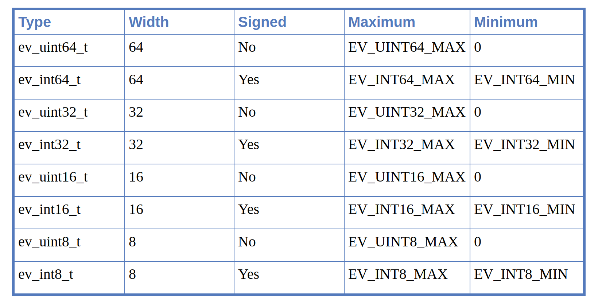

# Libevent

- [Libevent](#libevent)
  - [A tiny introduction to asynchronous IO](#a-tiny-introduction-to-asynchronous-io)
    - [What about convenience?](#what-about-convenience)
  - [The Libevent Reference Manual: Preliminaries](#the-libevent-reference-manual-preliminaries)
    - [Libevent from 10,000 feet](#libevent-from-10000-feet)
    - [The Libraries](#the-libraries)
    - [The Headers](#the-headers)
  - [Creating an event_base](#creating-an-event_base)
    - [Setting up a default event_base](#setting-up-a-default-event_base)
    - [Setting up a complicated event_base](#setting-up-a-complicated-event_base)
    - [Examining an event_base's backend method](#examining-an-event_bases-backend-method)
    - [Deallocating an event_base](#deallocating-an-event_base)
    - [Setting priorities on an event_base](#setting-priorities-on-an-event_base)
    - [Reinitializing an event_base after fork()](#reinitializing-an-event_base-after-fork)
    - [Obsolete event_base functions](#obsolete-event_base-functions)
  - [Working with an event loop](#working-with-an-event-loop)
    - [Running the loop](#running-the-loop)
    - [Stopping the loop](#stopping-the-loop)
    - [Re-checking for events](#re-checking-for-events)
    - [Checking the internal time cache](#checking-the-internal-time-cache)
    - [Dumping the event_base status](#dumping-the-event_base-status)
    - [Running a function over every event in an event_base](#running-a-function-over-every-event-in-an-event_base)
  - [Working with events](#working-with-events)
    - [Constructing event objects](#constructing-event-objects)
      - [The event flags](#the-event-flags)
      - [About Event Persistence](#about-event-persistence)
      - [Creating an event as its own callback argument](#creating-an-event-as-its-own-callback-argument)
      - [Timeout-only events](#timeout-only-events)
      - [Constructing signal events](#constructing-signal-events)
      - [Caveats when working with signals](#caveats-when-working-with-signals)
      - [Setting up events without heap-allocation](#setting-up-events-without-heap-allocation)
    - [Making events pending and non-pending](#making-events-pending-and-non-pending)
    - [Events with priorities](#events-with-priorities)
    - [Inspecting event status](#inspecting-event-status)
    - [Finding the currently running event](#finding-the-currently-running-event)
    - [Configuring one-off events](#configuring-one-off-events)
    - [Manually activating an event](#manually-activating-an-event)
    - [Optimizing common timeouts](#optimizing-common-timeouts)
    - [Telling a good event apart from cleared memory](#telling-a-good-event-apart-from-cleared-memory)
  - [Helper functions and types for Libevent](#helper-functions-and-types-for-libevent)
    - [Basic types](#basic-types)
      - [evutil_socket_t](#evutil_socket_t)
      - [Standard integer types](#standard-integer-types)

## A tiny introduction to asynchronous IO

Most beginning programmers start with blocking IO calls. An IO call is synchronous if, when you call it, it does not return until the operation is completed, or until enough time has passed that your network stack gives up. When you call `connect()` on a TCP connection, for example, your operating system queues a SYN packet to the host on the other side of the TCP connection. It does not return control back to your application until either it has received a SYN ACK packet from the opposite host, or until enough time has passed that it decides to give up.

Here's an example of a really simple client using blocking network calls. It opens a connection to www.google.com, sends it a simple HTTP request, and prints the response to stdout.

```c++
/* For sockaddr_in */
#include <netinet/in.h>
/* For socket functions */
#include <sys/socket.h>
/* For gethostbyname */
#include <netdb.h>

#include <unistd.h>
#include <string.h>
#include <stdio.h>

int main(int c, char **v)
{
    const char query[] =
        "GET / HTTP/1.0\r\n"
        "Host: www.google.com\r\n"
        "\r\n";
    const char hostname[] = "www.google.com";
    struct sockaddr_in sin;
    struct hostent *h;
    const char *cp;
    int fd;
    ssize_t n_written, remaining;
    char buf[1024];

    /* Look up the IP address for the hostname.   Watch out; this isn't
       threadsafe on most platforms. */
    h = gethostbyname(hostname);
    if (!h) {
        fprintf(stderr, "Couldn't lookup %s: %s", hostname, hstrerror(h_errno));
        return 1;
    }
    if (h->h_addrtype != AF_INET) {
        fprintf(stderr, "No ipv6 support, sorry.");
        return 1;
    }

    /* Allocate a new socket */
    fd = socket(AF_INET, SOCK_STREAM, 0);
    if (fd < 0) {
        perror("socket");
        return 1;
    }

    /* Connect to the remote host. */
    sin.sin_family = AF_INET;
    sin.sin_port = htons(80);
    sin.sin_addr = *(struct in_addr*)h->h_addr;
    if (connect(fd, (struct sockaddr*) &sin, sizeof(sin))) {
        perror("connect");
        close(fd);
        return 1;
    }

    /* Write the query. */
    /* XXX Can send succeed partially? */
    cp = query;
    remaining = strlen(query);
    while (remaining) {
      n_written = send(fd, cp, remaining, 0);
      if (n_written <= 0) {
        perror("send");
        return 1;
      }
      remaining -= n_written;
      cp += n_written;
    }

    /* Get an answer back. */
    while (1) {
        ssize_t result = recv(fd, buf, sizeof(buf), 0);
        if (result == 0) {
            break;
        } else if (result < 0) {
            perror("recv");
            close(fd);
            return 1;
        }
        fwrite(buf, 1, result, stdout);
    }

    close(fd);
    return 0;
}
```

All of the network calls in the code above are blocking: the `gethostbyname` does not return until it has succeeded or failed in resolving www.google.com; the `connect` does not return until it has connected; the `recv` calls do not return until they have received data or a close; and the `send` call does not return until it has at least flushed its output to the kernel's write buffers.

Now, blocking IO is not necessarily evil. If there's nothing else you wanted your program to do in the meantime, blocking IO will work fine for you. But suppose that you need to write a program to handle multiple connections at once. To make our example concrete: suppose that you want to read input from two connections, and you don't know which connection will get input first. You can't say

```c++
/* This won't work. */
char buf[1024];
int i, n;
while (i_still_want_to_read()) {
    for (i=0; i<n_sockets; ++i) {
        n = recv(fd[i], buf, sizeof(buf), 0);
        if (n==0)
            handle_close(fd[i]);
        else if (n<0)
            handle_error(fd[i], errno);
        else
            handle_input(fd[i], buf, n);
    }
}
```

because if data arrives on `fd[2]` first, your program won't even try reading from `fd[2]` until the reads from `fd[0]` and `fd[1]` have gotten some data and finished.

Sometimes people solve this problem with multithreading, or with multi-process servers. One of the simplest ways to do multithreading is with a separate process (or thread) to deal with each connection. Since each connection has its own process, a blocking IO call that waits for one connection won't make any of the other connections' processes block.

Here's another example program. It is a trivial server that listens for TCP connections on port 40713, reads data from its input one line at a time, and writes out the ROT13 obfuscation (一种加密算法) of line each as it arrives. It uses the Unix `fork()` call to create a new process for each incoming connection.

```c++
/* For sockaddr_in */
#include <netinet/in.h>
/* For socket functions */
#include <sys/socket.h>

#include <unistd.h>
#include <string.h>
#include <stdio.h>
#include <stdlib.h>

#define MAX_LINE 16384

char
rot13_char(char c)
{
    /* We don't want to use isalpha here; setting the locale would change
     * which characters are considered alphabetical. */
    if ((c >= 'a' && c <= 'm') || (c >= 'A' && c <= 'M'))
        return c + 13;
    else if ((c >= 'n' && c <= 'z') || (c >= 'N' && c <= 'Z'))
        return c - 13;
    else
        return c;
}

void
child(int fd)
{
    char outbuf[MAX_LINE+1];
    size_t outbuf_used = 0;
    ssize_t result;

    while (1) {
        char ch;
        result = recv(fd, &ch, 1, 0);
        if (result == 0) {
            break;
        } else if (result == -1) {
            perror("read");
            break;
        }

        /* We do this test to keep the user from overflowing the buffer. */
        if (outbuf_used < sizeof(outbuf)) {
            outbuf[outbuf_used++] = rot13_char(ch);
        }

        if (ch == '\n') {
            send(fd, outbuf, outbuf_used, 0);
            outbuf_used = 0;
            continue;
        }
    }
}

void
run(void)
{
    int listener;
    struct sockaddr_in sin;

    sin.sin_family = AF_INET;
    sin.sin_addr.s_addr = 0;
    sin.sin_port = htons(40713);

    listener = socket(AF_INET, SOCK_STREAM, 0);

#ifndef WIN32
    {
        int one = 1;
        setsockopt(listener, SOL_SOCKET, SO_REUSEADDR, &one, sizeof(one));
    }
#endif

    if (bind(listener, (struct sockaddr*)&sin, sizeof(sin)) < 0) {
        perror("bind");
        return;
    }

    if (listen(listener, 16)<0) {
        perror("listen");
        return;
    }


    while (1) {
        struct sockaddr_storage ss;
        socklen_t slen = sizeof(ss);
        int fd = accept(listener, (struct sockaddr*)&ss, &slen);
        if (fd < 0) {
            perror("accept");
        } else {
            if (fork() == 0) {
                child(fd);
                exit(0);
            }
        }
    }
}

int
main(int c, char **v)
{
    run();
    return 0;
}

```

So, do we have the perfect solution for handling multiple connections at once? Can I stop writing this book and go work on something else now? Not quite. First off, process creation (and even thread creation) can be pretty expensive on some platforms. In real life, you'd want to use a thread pool instead of creating new processes. But more fundamentally, threads won't scale as much as you'd like. If your program needs to handle thousands or tens of thousands of connections at a time, dealing with tens of thousands of threads will not be as efficient as trying to have only a few threads per CPU.

But if threading isn't the answer to having multiple connections, what is? In the Unix paradigm, you make your sockets nonblocking. The Unix call to do this is:

```c++
fcntl(fd, F_SETFL, O_NONBLOCK);
```

where `fd` is the file descriptor for the socket. Once you've made `fd` (the socket) nonblocking, from then on, whenever you make a network call to `fd`, the call will either complete the operation immediately or return with a special error code to indicate "I couldn't make any progress now, try again." So our two-socket example might be naively written as:

```c++
/* This will work, but the performance will be unforgivably bad. */
int i, n;
char buf[1024];
for (i=0; i < n_sockets; ++i)
    fcntl(fd[i], F_SETFL, O_NONBLOCK);

while (i_still_want_to_read()) {
    for (i=0; i < n_sockets; ++i) {
        n = recv(fd[i], buf, sizeof(buf), 0);
        if (n == 0) {
            handle_close(fd[i]);
        } else if (n < 0) {
            if (errno == EAGAIN)
                 ; /* The kernel didn't have any data for us to read. */
            else
                 handle_error(fd[i], errno);
         } else {
            handle_input(fd[i], buf, n);
         }
    }
}
```

Now that we're using nonblocking sockets, the code above would work... but only barely. The performance will be awful, for two reasons. First, when there is no data to read on either connection the loop will spin indefinitely, using up all your CPU cycles. Second, if you try to handle more than one or two connections with this approach you'll do a kernel call for each one, whether it has any data for you or not. So what we need is a way to tell the kernel "wait until one of these sockets is ready to give me some data, and tell me which ones are ready."

The oldest solution that people still use for this problem is `select()`. The `select()` call takes three sets of `fd`s (implemented as bit arrays): one for reading, one for writing, and one for "exceptions". It waits until a socket from one of the sets is ready and alters the sets to contain only the sockets ready for use.

Here is our example again, using `select`:

```c++
/* If you only have a couple dozen fds, this version won't be awful */
fd_set readset;
int i, n;
char buf[1024];

while (i_still_want_to_read()) {
    int maxfd = -1;
    FD_ZERO(&readset);

    /* Add all of the interesting fds to readset */
    for (i=0; i < n_sockets; ++i) {
         if (fd[i]>maxfd) maxfd = fd[i];
         FD_SET(fd[i], &readset);
    }

    /* Wait until one or more fds are ready to read */
    select(maxfd+1, &readset, NULL, NULL, NULL);

    /* Process all of the fds that are still set in readset */
    for (i=0; i < n_sockets; ++i) {
        if (FD_ISSET(fd[i], &readset)) {
            n = recv(fd[i], buf, sizeof(buf), 0);
            if (n == 0) {
                handle_close(fd[i]);
            } else if (n < 0) {
                if (errno == EAGAIN)
                     ; /* The kernel didn't have any data for us to read. */
                else
                     handle_error(fd[i], errno);
             } else {
                handle_input(fd[i], buf, n);
             }
        }
    }
}
```

And here's a reimplementation of our ROT13 server, using `select()` this time.

```c++
/* For sockaddr_in */
#include <netinet/in.h>
/* For socket functions */
#include <sys/socket.h>
/* For fcntl */
#include <fcntl.h>
/* for select */
#include <sys/select.h>

#include <assert.h>
#include <unistd.h>
#include <string.h>
#include <stdlib.h>
#include <stdio.h>
#include <errno.h>

#define MAX_LINE 16384

char
rot13_char(char c)
{
    /* We don't want to use isalpha here; setting the locale would change
     * which characters are considered alphabetical. */
    if ((c >= 'a' && c <= 'm') || (c >= 'A' && c <= 'M'))
        return c + 13;
    else if ((c >= 'n' && c <= 'z') || (c >= 'N' && c <= 'Z'))
        return c - 13;
    else
        return c;
}

struct fd_state {
    char buffer[MAX_LINE];
    size_t buffer_used;

    int writing;
    size_t n_written;
    size_t write_upto;
};

struct fd_state *
alloc_fd_state(void)
{
    struct fd_state *state = malloc(sizeof(struct fd_state));
    if (!state)
        return NULL;
    state->buffer_used = state->n_written = state->writing =
        state->write_upto = 0;
    return state;
}

void
free_fd_state(struct fd_state *state)
{
    free(state);
}

void
make_nonblocking(int fd)
{
    fcntl(fd, F_SETFL, O_NONBLOCK);
}

int
do_read(int fd, struct fd_state *state)
{
    char buf[1024];
    int i;
    ssize_t result;
    while (1) { // read all available data from fd to buf
        result = recv(fd, buf, sizeof(buf), 0);
        if (result <= 0)
            break;

        for (i=0; i < result; ++i)  {
            if (state->buffer_used < sizeof(state->buffer))
                state->buffer[state->buffer_used++] = rot13_char(buf[i]);
            if (buf[i] == '\n') { // use '\n' as delimiter
                state->writing = 1;
                state->write_upto = state->buffer_used;
            }
        }
    }

    if (result == 0) {
        return 1;
    } else if (result < 0) {
        if (errno == EAGAIN)
            return 0;
        return -1;
    }

    return 0;
}

int
do_write(int fd, struct fd_state *state)
{
    while (state->n_written < state->write_upto) { // data was sent until n_written
        ssize_t result = send(fd, state->buffer + state->n_written,
                              state->write_upto - state->n_written, 0);
        if (result < 0) {
            if (errno == EAGAIN)
                return 0;
            return -1;
        }
        assert(result != 0);

        state->n_written += result;
    }

    if (state->n_written == state->buffer_used) // all written data is sent
        state->n_written = state->write_upto = state->buffer_used = 0;

    state->writing = 0;

    return 0;
}

void
run(void)
{
    int listener;
    struct fd_state *state[FD_SETSIZE];
    struct sockaddr_in sin;
    int i, maxfd;
    fd_set readset, writeset, exset;

    sin.sin_family = AF_INET;
    sin.sin_addr.s_addr = 0;
    sin.sin_port = htons(40713);

    for (i = 0; i < FD_SETSIZE; ++i)
        state[i] = NULL;

    listener = socket(AF_INET, SOCK_STREAM, 0);
    make_nonblocking(listener);

#ifndef WIN32
    {
        int one = 1;
        setsockopt(listener, SOL_SOCKET, SO_REUSEADDR, &one, sizeof(one));
    }
#endif

    if (bind(listener, (struct sockaddr*)&sin, sizeof(sin)) < 0) {
        perror("bind");
        return;
    }

    if (listen(listener, 16)<0) {
        perror("listen");
        return;
    }

    FD_ZERO(&readset);
    FD_ZERO(&writeset);
    FD_ZERO(&exset);

    while (1) {
        maxfd = listener;

        FD_ZERO(&readset);
        FD_ZERO(&writeset);
        FD_ZERO(&exset);

        FD_SET(listener, &readset);

        for (i=0; i < FD_SETSIZE; ++i) {
            if (state[i]) {
                if (i > maxfd)
                    maxfd = i;
                FD_SET(i, &readset);
                if (state[i]->writing) {
                    FD_SET(i, &writeset);
                }
            }
        }

        if (select(maxfd+1, &readset, &writeset, &exset, NULL) < 0) {
            perror("select");
            return;
        }

        if (FD_ISSET(listener, &readset)) {
            struct sockaddr_storage ss;
            socklen_t slen = sizeof(ss);
            int fd = accept(listener, (struct sockaddr*)&ss, &slen);
            if (fd < 0) {
                perror("accept");
            } else if (fd > FD_SETSIZE) {
                close(fd);
            } else {
                make_nonblocking(fd);
                state[fd] = alloc_fd_state();
                assert(state[fd]);/*XXX*/
            }
        }

        for (i=0; i < maxfd+1; ++i) {
            int r = 0;
            if (i == listener)
                continue;

            if (FD_ISSET(i, &readset)) {
                r = do_read(i, state[i]);
            }
            if (r == 0 && FD_ISSET(i, &writeset)) {
                r = do_write(i, state[i]);
            }
            if (r) { // error
                free_fd_state(state[i]);
                state[i] = NULL;
                close(i);
            }
        }
    }
}

int
main(int c, char **v)
{
    setvbuf(stdout, NULL, _IONBF, 0);

    run();
    return 0;
}
```

But we're still not done. Because generating and reading the `select()` bit arrays takes time proportional to the largest `fd` that you provided for `select()`, the `select()` call scales terribly when the number of sockets is high.

Different operating systems have provided different replacement functions for select. These include `poll()`, `epoll()`, `kqueue()`, evports, and /dev/poll. All of these give better performance than `select()`, and all but `poll()` give O(1) performance for adding a socket, removing a socket, and for noticing that a socket is ready for IO.

Unfortunately, none of the efficient interfaces is a ubiquitous standard. Linux has `epoll()`, the BSDs (including Darwin) have `kqueue()`, Solaris has evports and /dev/poll... and none of these operating systems has any of the others. So if you want to write a portable high-performance asynchronous application, you'll need an abstraction that wraps all of these interfaces, and provides whichever one of them is the most efficient.

And that's what the lowest level of the Libevent API does for you. It provides a consistent interface to various `select()` replacements, using the most efficient version available on the computer where it's running.

Here's yet another version of our asynchronous ROT13 server. This time, it uses Libevent 2 instead of `select()`. Note that the `fd_sets` are gone now: instead, we associate and disassociate events with a struct `event_base`, which might be implemented in terms of `select()`, `poll()`, `epoll()`, `kqueue()`, etc.

```c++
/* For sockaddr_in */
#include <netinet/in.h>
/* For socket functions */
#include <sys/socket.h>
/* For fcntl */
#include <fcntl.h>

#include <event2/event.h>

#include <assert.h>
#include <unistd.h>
#include <string.h>
#include <stdlib.h>
#include <stdio.h>
#include <errno.h>

#define MAX_LINE 16384

void do_read(evutil_socket_t fd, short events, void *arg);
void do_write(evutil_socket_t fd, short events, void *arg);

char
rot13_char(char c)
{
    /* We don't want to use isalpha here; setting the locale would change
     * which characters are considered alphabetical. */
    if ((c >= 'a' && c <= 'm') || (c >= 'A' && c <= 'M'))
        return c + 13;
    else if ((c >= 'n' && c <= 'z') || (c >= 'N' && c <= 'Z'))
        return c - 13;
    else
        return c;
}

struct fd_state {
    char buffer[MAX_LINE];
    size_t buffer_used;

    size_t n_written;
    size_t write_upto;

    struct event *read_event;
    struct event *write_event;
};

struct fd_state *
alloc_fd_state(struct event_base *base, evutil_socket_t fd)
{
    struct fd_state *state = malloc(sizeof(struct fd_state));
    if (!state)
        return NULL;
    state->read_event = event_new(base, fd, EV_READ|EV_PERSIST, do_read, state);
    if (!state->read_event) {
        free(state);
        return NULL;
    }
    state->write_event =
        event_new(base, fd, EV_WRITE|EV_PERSIST, do_write, state);

    if (!state->write_event) {
        event_free(state->read_event); // read_event is also useless
        free(state);
        return NULL;
    }

    state->buffer_used = state->n_written = state->write_upto = 0;

    assert(state->write_event);
    return state;
}

void
free_fd_state(struct fd_state *state)
{
    event_free(state->read_event);
    event_free(state->write_event);
    free(state);
}

void
do_read(evutil_socket_t fd, short events, void *arg)
{
    struct fd_state *state = arg;
    char buf[1024];
    int i;
    ssize_t result;
    while (1) {
        assert(state->write_event);
        result = recv(fd, buf, sizeof(buf), 0);
        if (result <= 0)
            break;

        for (i=0; i < result; ++i)  {
            if (state->buffer_used < sizeof(state->buffer))
                state->buffer[state->buffer_used++] = rot13_char(buf[i]);
            if (buf[i] == '\n') {
                assert(state->write_event);
                event_add(state->write_event, NULL);
                state->write_upto = state->buffer_used;
            }
        }
    }

    if (result == 0) {
        free_fd_state(state);
    } else if (result < 0) {
        if (errno == EAGAIN) // XXXX use evutil macro
            return;
        perror("recv");
        free_fd_state(state);
    }
}

void
do_write(evutil_socket_t fd, short events, void *arg)
{
    struct fd_state *state = arg;

    while (state->n_written < state->write_upto) {
        ssize_t result = send(fd, state->buffer + state->n_written,
                              state->write_upto - state->n_written, 0);
        if (result < 0) {
            if (errno == EAGAIN) // XXX use evutil macro
                return;
            free_fd_state(state);
            return;
        }
        assert(result != 0);

        state->n_written += result;
    }

    if (state->n_written == state->buffer_used)
        state->n_written = state->write_upto = state->buffer_used = 1;

    event_del(state->write_event);
}

void
do_accept(evutil_socket_t listener, short event, void *arg)
{
    struct event_base *base = arg;
    struct sockaddr_storage ss;
    socklen_t slen = sizeof(ss);
    int fd = accept(listener, (struct sockaddr*)&ss, &slen);
    if (fd < 0) { // XXXX eagain??
        perror("accept");
    } else if (fd > FD_SETSIZE) {
        close(fd); // XXX replace all closes with EVUTIL_CLOSESOCKET */
    } else {
        struct fd_state *state;
        evutil_make_socket_nonblocking(fd);
        state = alloc_fd_state(base, fd);
        assert(state); /*XXX err*/
        assert(state->write_event);
        event_add(state->read_event, NULL);
    }
}

void
run(void)
{
    evutil_socket_t listener;
    struct sockaddr_in sin;
    struct event_base *base;
    struct event *listener_event;

    base = event_base_new();
    if (!base)
        return; /*XXXerr*/

    sin.sin_family = AF_INET;
    sin.sin_addr.s_addr = 0;
    sin.sin_port = htons(40713);

    listener = socket(AF_INET, SOCK_STREAM, 0);
    evutil_make_socket_nonblocking(listener);

#ifndef WIN32
    {
        int one = 1;
        setsockopt(listener, SOL_SOCKET, SO_REUSEADDR, &one, sizeof(one));
    }
#endif

    if (bind(listener, (struct sockaddr*)&sin, sizeof(sin)) < 0) {
        perror("bind");
        return;
    }

    if (listen(listener, 16)<0) {
        perror("listen");
        return;
    }

    listener_event = event_new(base, listener, EV_READ|EV_PERSIST, do_accept, (void*)base);
    /*XXX check it */
    event_add(listener_event, NULL);

    event_base_dispatch(base);
}

int
main(int c, char **v)
{
    setvbuf(stdout, NULL, _IONBF, 0);

    run();
    return 0;
}
```

(Other things to note in the code: instead of typing the sockets as "int", we're using the type `evutil_socket_t`. Instead of calling `fcntl(O_NONBLOCK)` to make the sockets nonblocking, we're calling `evutil_make_socket_nonblocking`. These changes make our code compatible with the divergent parts of the Win32 networking API.)

### What about convenience?

You've probably noticed that as our code has gotten more efficient, it has also gotten more complex. Back when we were forking, we didn't have to manage a buffer for each connection: we just had a separate stack-allocated buffer for each process. We didn't need to explicitly track whether each socket was reading or writing: that was implicit in our location in the code. And we didn't need a structure to track how much of each operation had completed: we just used loops and stack variables.

Moreover, if you're deeply experienced with networking on Windows, you'll realize that Libevent probably isn't getting optimal performance when it's used as in the example above. On Windows, the way you do fast asynchronous IO is not with a select()-like interface: it's by using the IOCP (IO Completion Ports) API. Unlike all the fast networking APIs, IOCP does not alert your program when a socket is ready for an operation that your program then has to perform. Instead, the program tells the Windows networking stack to start a network operation, and IOCP tells the program when the operation has finished.

Fortunately, the Libevent 2 "bufferevents" interface solves both of these issues: it makes programs much simpler to write, and provides an interface that Libevent can implement efficiently on Windows and on Unix.

Here's our ROT13 server one last time, using the bufferevents API.

```c++
/* For sockaddr_in */
#include <netinet/in.h>
/* For socket functions */
#include <sys/socket.h>
/* For fcntl */
#include <fcntl.h>

#include <event2/event.h>
#include <event2/buffer.h>
#include <event2/bufferevent.h>

#include <assert.h>
#include <unistd.h>
#include <string.h>
#include <stdlib.h>
#include <stdio.h>
#include <errno.h>

#define MAX_LINE 16384

void do_read(evutil_socket_t fd, short events, void *arg);
void do_write(evutil_socket_t fd, short events, void *arg);

char
rot13_char(char c)
{
    /* We don't want to use isalpha here; setting the locale would change
     * which characters are considered alphabetical. */
    if ((c >= 'a' && c <= 'm') || (c >= 'A' && c <= 'M'))
        return c + 13;
    else if ((c >= 'n' && c <= 'z') || (c >= 'N' && c <= 'Z'))
        return c - 13;
    else
        return c;
}

void
readcb(struct bufferevent *bev, void *ctx)
{
    struct evbuffer *input, *output;
    char *line;
    size_t n;
    int i;
    input = bufferevent_get_input(bev);
    output = bufferevent_get_output(bev);

    while ((line = evbuffer_readln(input, &n, EVBUFFER_EOL_LF))) {
        for (i = 0; i < n; ++i)
            line[i] = rot13_char(line[i]);
        evbuffer_add(output, line, n);
        evbuffer_add(output, "\n", 1);
        free(line);
    }

    if (evbuffer_get_length(input) >= MAX_LINE) {
        /* Too long; just process what there is and go on so that the buffer
         * doesn't grow infinitely long. */
        char buf[1024];
        while (evbuffer_get_length(input)) {
            int n = evbuffer_remove(input, buf, sizeof(buf));
            for (i = 0; i < n; ++i)
                buf[i] = rot13_char(buf[i]);
            evbuffer_add(output, buf, n);
        }
        evbuffer_add(output, "\n", 1);
    }
}

void
errorcb(struct bufferevent *bev, short error, void *ctx)
{
    if (error & BEV_EVENT_EOF) {
        /* connection has been closed, do any clean up here */
        /* ... */
    } else if (error & BEV_EVENT_ERROR) {
        /* check errno to see what error occurred */
        /* ... */
    } else if (error & BEV_EVENT_TIMEOUT) {
        /* must be a timeout event handle, handle it */
        /* ... */
    }
    bufferevent_free(bev);
}

void
do_accept(evutil_socket_t listener, short event, void *arg)
{
    struct event_base *base = arg;
    struct sockaddr_storage ss;
    socklen_t slen = sizeof(ss);
    int fd = accept(listener, (struct sockaddr*)&ss, &slen);
    if (fd < 0) {
        perror("accept");
    } else if (fd > FD_SETSIZE) {
        close(fd);
    } else {
        struct bufferevent *bev;
        evutil_make_socket_nonblocking(fd);
        bev = bufferevent_socket_new(base, fd, BEV_OPT_CLOSE_ON_FREE);
        bufferevent_setcb(bev, readcb, NULL, errorcb, NULL);
        bufferevent_setwatermark(bev, EV_READ, 0, MAX_LINE);
        bufferevent_enable(bev, EV_READ|EV_WRITE);
    }
}

void
run(void)
{
    evutil_socket_t listener;
    struct sockaddr_in sin;
    struct event_base *base;
    struct event *listener_event;

    base = event_base_new();
    if (!base)
        return; /*XXXerr*/

    sin.sin_family = AF_INET;
    sin.sin_addr.s_addr = 0;
    sin.sin_port = htons(40713);

    listener = socket(AF_INET, SOCK_STREAM, 0);
    evutil_make_socket_nonblocking(listener);

#ifndef WIN32
    {
        int one = 1;
        setsockopt(listener, SOL_SOCKET, SO_REUSEADDR, &one, sizeof(one));
    }
#endif

    if (bind(listener, (struct sockaddr*)&sin, sizeof(sin)) < 0) {
        perror("bind");
        return;
    }

    if (listen(listener, 16)<0) {
        perror("listen");
        return;
    }

    listener_event = event_new(base, listener, EV_READ|EV_PERSIST, do_accept, (void*)base);
    /*XXX check it */
    event_add(listener_event, NULL);

    event_base_dispatch(base);
}

int
main(int c, char **v)
{
    setvbuf(stdout, NULL, _IONBF, 0);

    run();
    return 0;
}
```

## The Libevent Reference Manual: Preliminaries

### Libevent from 10,000 feet

Libevent is a library for writing fast portable nonblocking IO. Its design goals are:

- **Portability**: A program written using Libevent should work across all the platforms Libevent supports. Even when there is no really good way to do nonblocking IO, Libevent should support the so-so ways, so that your program can run in restricted environments.
- **Speed**: Libevent tries to use the fastest available nonblocking IO implementations on each platform, and not to introduce much overhead as it does so.
- **Scalability**: Libevent is designed to work well even with programs that need to have *tens of thousands of active sockets*.
- **Convenience**: Whenever possible, the most natural way to write a program with Libevent should be the stable, portable way.

Libevent is divided into the following components:

- **evutil**: Generic functionality to abstract out the differences between different platforms' networking implementations.
- **event and event_base**: This is the heart of Libevent. It provides an abstract API to the various platform-specific, event-based nonblocking IO backends. It can let you know when sockets are ready to read or write, do basic timeout functionality, and detect OS signals.
- **bufferevent**: These functions provide a more convenient wrapper around Libevent's event-based core. They let your application request buffered reads and writes, and rather than informing you when sockets are ready to do, they let you know when IO has actually occurred. The bufferevent interface also has multiple backends, so that it can take advantage of systems that provide faster ways to do nonblocking IO, such as the Windows IOCP API.
- **evbuffer**: This module implements the buffers underlying bufferevents, and provides functions for efficient and/or convenient access.
- **evhttp**: A simple HTTP client/server implementation.
- **evdns**: A simple DNS client/server implementation.
- **evrpc**: A simple RPC implementation.

### The Libraries

When Libevent is built, by default it installs the following libraries:

- **libevent_core**: All core event and buffer functionality. This library contains all the `event_base`, `evbuffer`, `bufferevent`, and utility functions.
- **libevent_extra**: This library defines protocol-specific functionality that you may or may not want for your application, including HTTP, DNS, and RPC.
- **libevent**: This library exists for historical reasons; it contains the contents of both `libevent_core` and `libevent_extra`. You shouldn't use it; it may go away in a future version of Libevent.

The following libraries are installed only on some platforms:

- **libevent_pthreads**: This library adds threading and locking implementations based on the pthreads portable threading library. It is separated from `libevent_core` so that you don't need to link against pthreads to use Libevent unless you are actually using Libevent in a multithreaded way.
- **libevent_openssl**: This library provides support for encrypted communications using bufferevents and the OpenSSL library. It is separated from `libevent_core` so that you don't need to link against OpenSSL to use Libevent unless you are actually using encrypted connections.

### The Headers

All current public Libevent headers are installed under the `event2` directory. Headers fall into three broad classes:

- **API headers**: An API header is one that defines current public interfaces to Libevent. These headers have no special suffix.
- **Compatibility headers**: A compatibility header includes definitions for deprecated functions. You shouldn't include it unless you're porting a program from an older version of Libevent.
- **Structure headers**: These headers define structures with relatively volatile layouts. Some of these are exposed in case you need fast access to structure component; some are exposed for historical reasons. Relying on any of the structures in headers directly can break your program's binary compatibility with other versions of Libevent, sometimes in hard-to-debug ways. These headers have the suffix "_struct.h"

## Creating an event_base

Before you can use any interesting Libevent function, you need to allocate one or more `event_base` structures. Each `event_base` structure holds a set of events and can poll to determine which events are active.

If an `event_base` is set up to use locking, it is safe to access it between multiple threads. Its loop can only be run in a single thread, however. If you want to have multiple threads polling for IO, you need to have an `event_base` for each thread.

Each event_base has a "method", or a backend that it uses to determine which events are ready. The recognized methods are:

- select
- poll
- poll
- kqueue
- devpoll
- evport
- win32

The user can disable specific backends with environment variables. If you want to turn off the kqueue backend, set the `EVENT_NOKQUEUE` environment variable, and so on. If you want to turn off backends from within the program, see notes on `event_config_avoid_method()` below.

### Setting up a default event_base

The `event_base_new()` function allocates and returns a new `event base` with the default settings. It examines the environment variables and returns a pointer to a new event_base. If there is an error, it returns NULL.

When choosing among methods, it picks the fastest method that the OS supports.

```c++
struct event_base *event_base_new(void);
```

For most programs, this is all you need.

The `event_base_new()` function is declared in `<event2/event.h>`. It first appeared in Libevent 1.4.3.

### Setting up a complicated event_base

If you want more control over what kind of `event_base` you get, you need to use an `event_config`. An `event_config` is an opaque structure that holds information about your preferences for an `event_base`. When you want an `event_base`, you pass the `event_config` to `event_base_new_with_config()`.

```c++
struct event_config *event_config_new(void);
struct event_base *event_base_new_with_config(const struct event_config *cfg);
void event_config_free(struct event_config *cfg);
```

To allocate an `event_base` with these functions, you call `event_config_new()` to allocate a new `event_config`. Then, you call other functions on the `event_config` to tell it about your needs. Finally, you call `event_base_new_with_config()` to get a new `event_base`. When you are done, you can free the `event_config` with `event_config_free()`.

```c++
int event_config_avoid_method(struct event_config *cfg, const char *method);

enum event_method_feature {
    EV_FEATURE_ET = 0x01,
    EV_FEATURE_O1 = 0x02,
    EV_FEATURE_FDS = 0x04,
};
int event_config_require_features(struct event_config *cfg,
                                  enum event_method_feature feature);

enum event_base_config_flag {
    EVENT_BASE_FLAG_NOLOCK = 0x01,
    EVENT_BASE_FLAG_IGNORE_ENV = 0x02,
    EVENT_BASE_FLAG_STARTUP_IOCP = 0x04,
    EVENT_BASE_FLAG_NO_CACHE_TIME = 0x08,
    EVENT_BASE_FLAG_EPOLL_USE_CHANGELIST = 0x10,
    EVENT_BASE_FLAG_PRECISE_TIMER = 0x20
};
int event_config_set_flag(struct event_config *cfg,
    enum event_base_config_flag flag);
```

Calling `event_config_avoid_method` tells Libevent to avoid a specific available backend by name. Calling `event_config_require_feature()` tells Libevent not to use any backend that cannot supply all of a set of features. Calling `event_config_set_flag()` tells Libevent to set one or more of the run-time flags below when constructing the event base.

The recognized feature values for `event_config_require_features` are:

- `EV_FEATURE_ET`: Requires a backend method that supports edge-triggered IO.
- `EV_FEATURE_O1`: Requires a backend method where adding or deleting a single event, or having a single event become active, is an O(1) operation.
- `EV_FEATURE_FDS`: Requires a backend method that can support arbitrary file descriptor types, and not just sockets.

The recognized option values for `event_config_set_flag()` are:

- `EVENT_BASE_FLAG_NOLOCK`: Do not allocate locks for the `event_base`. Setting this option may save a little time for locking and releasing the event_base, but will make it unsafe and nonfunctional to access it from multiple threads.
- `EVENT_BASE_FLAG_IGNORE_ENV`: Do not check the `EVENT_*` environment variables when picking which backend method to use. Think hard before using this flag: it can make it harder for users to debug the interactions between your program and Libevent.
- `EVENT_BASE_FLAG_STARTUP_IOCP`: On Windows only, this flag makes Libevent enable any necessary IOCP dispatch logic on startup, rather than on-demand.
- `EVENT_BASE_FLAG_NO_CACHE_TIME`: Instead of checking the current time every time the event loop is ready to run timeout callbacks, check it after every timeout callback. This can use more CPU than you necessarily intended, so watch out!
- `EVENT_BASE_FLAG_EPOLL_USE_CHANGELIST`: Tells Libevent that, if it decides to use the epoll backend, it is safe to use the faster "changelist"-based backend. The epoll-changelist backend can avoid needless system calls in cases where the same fd has its status modified more than once between calls to the backend's dispatch function, but it also trigger a kernel bug that causes erroneous results if you give Libevent any fds cloned by `dup()` or its variants. This flag has no effect if you use a backend other than epoll. You can also turn on the epoll-changelist option by setting the `EVENT_EPOLL_USE_CHANGELIST` environment variable.
- `EVENT_BASE_FLAG_PRECISE_TIMER`: By default, Libevent tries to use the fastest available timing mechanism that the operating system provides. If there is a slower timing mechanism that provides more fine-grained timing precision, this flag tells Libevent to use that timing mechanism instead. If the operating system provides no such slower-but-more-precise mechanism, this flag has no effect.

The above functions that manipulate an `event_config` all return 0 on success, -1 on failure.

It is easy to set up an `event_config` that requires a backend that your OS does not provide. For example, as of Libevent 2.0.1-alpha, there is no O(1) backend for Windows, and no backend on Linux that provides both EV_FEATURE_FDS and EV_FEATURE_O1. If you have made a configuration that Libevent can't satisfy, event_base_new_with_config() will return NULL.

```c++
int event_config_set_max_dispatch_interval(struct event_config *cfg,
    const struct timeval *max_interval, int max_callbacks,
    int min_priority);
```

This function prevents priority inversion by limiting how many low-priority event callbacks can be invoked before checking for more high-priority events. If `max_interval` is non-null, the event loop checks the time after each callback, and re-scans for high-priority events if `max_interval` has passed. If `max_callbacks` is nonnegative, the event loop also checks for more events after `max_callbacks` callbacks have been invoked. These rules apply to any event of `min_priority` or higher.

The following code prefers edge-triggered backends:

```c++
struct event_config *cfg;
struct event_base *base;
int i;

/* My program wants to use edge-triggered events if at all possible.  So
   I'll try to get a base twice: Once insisting on edge-triggered IO, and
   once not. */
for (i=0; i<2; ++i) {
    cfg = event_config_new();

    /* I don't like select. */
    event_config_avoid_method(cfg, "select");

    if (i == 0)
        event_config_require_features(cfg, EV_FEATURE_ET);

    base = event_base_new_with_config(cfg);
    event_config_free(cfg);
    if (base)
        break;

    /* If we get here, event_base_new_with_config() returned NULL.  If
       this is the first time around the loop, we'll try again without
       setting EV_FEATURE_ET.  If this is the second time around the
       loop, we'll give up. */
}
```

The following code avoids priority-inversion

```c++
struct event_config *cfg;
struct event_base *base;

cfg = event_config_new();
if (!cfg)
   /* Handle error */;

/* I'm going to have events running at two priorities.  I expect that
   some of my priority-1 events are going to have pretty slow callbacks,
   so I don't want more than 100 msec to elapse (or 5 callbacks) before
   checking for priority-0 events. */
struct timeval msec_100 = { 0, 100*1000 };
event_config_set_max_dispatch_interval(cfg, &msec_100, 5, 1);

base = event_base_new_with_config(cfg);
if (!base)
   /* Handle error */;

event_base_priority_init(base, 2);
```

These functions and types are declared in `<event2/event.h>`.

### Examining an event_base's backend method

Sometimes you want to see which features are actually available in an event_base, or which method it's using.

```c++
const char **event_get_supported_methods(void);
```

The `event_get_supported_methods()` function returns a pointer to an array of the names of the methods supported in this version of Libevent. The last element in the array is NULL.

```c++
int i;
const char **methods = event_get_supported_methods();
printf("Starting Libevent %s.  Available methods are:\n",
    event_get_version());
for (i=0; methods[i] != NULL; ++i) {
    printf("    %s\n", methods[i]);
}
```

This function returns a list of the methods that Libevent was compiled to support. It is possible that your operating system will not in fact support them all when Libevent tries to run. For example, you could be on a version of OSX where kqueue is too buggy to use.

```c++
const char *event_base_get_method(const struct event_base *base);
enum event_method_feature event_base_get_features(const struct event_base *base);
```

The `event_base_get_method()` call returns the name of the actual method in use by an `event_base`. The `event_base_get_features()` call returns a bitmask of the features that it supports.

```c++
struct event_base *base;
enum event_method_feature f;

base = event_base_new();
if (!base) {
    puts("Couldn't get an event_base!");
} else {
    printf("Using Libevent with backend method %s.",
        event_base_get_method(base));
    f = event_base_get_features(base);
    if ((f & EV_FEATURE_ET))
        printf("  Edge-triggered events are supported.");
    if ((f & EV_FEATURE_O1))
        printf("  O(1) event notification is supported.");
    if ((f & EV_FEATURE_FDS))
        printf("  All FD types are supported.");
    puts("");
}
```

These functions are defined in `<event2/event.h>`. The `event_base_get_method()` call was first available in Libevent 1.4.3. The others first appeared in Libevent 2.0.1-alpha.

### Deallocating an event_base

When you are finished with an event_base, you can deallocate it with `event_base_free()`.

```c++
void event_base_free(struct event_base *base);
```

Note that this function does not deallocate any of the events that are currently associated with the event_base, or close any of their sockets, or free any of their pointers.

The `event_base_free()` function is defined in `<event2/event.h>`. It was first implemented in Libevent 1.2.

### Setting priorities on an event_base

Libevent supports setting multiple priorities on an event. By default, though, an `event_base` supports only a single priority level. You can set the number of priorities on an `event_base` by calling `event_base_priority_init()`.


```c++
int event_base_priority_init(struct event_base *base, int n_priorities);
```

This function returns 0 on success and -1 on failure. The base argument is the `event_base` to modify, and `n_priorities` is the number of priorities to support. It must be at least 1. The available priorities for new events will be numbered from 0 (most important) to `n_priorities`-1 (least important).

There is a constant, `EVENT_MAX_PRIORITIES`, that sets the upper bound on the value of `n_priorities`. It is an error to call this function with a higher value for `n_priorities`.

You must call this function before any events become active. It is best to call it immediately after creating the event_base.

To find the number of priorities currently supported by a base, you can call `event_base_getnpriorities()`.

```c++
int event_base_get_npriorities(struct event_base *base);
```

The return value is equal to the number of priorities configured in the base. So if `event_base_get_npriorities()` returns 3, then allowable priority values are 0, 1, and 2.

By default, all new events associated with this base will be initialized with priority equal to `n_priorities` / 2.

The `event_base_priority_init` function is defined in `<event2/event.h>`. It has been available since Libevent 1.0. The `event_base_get_npriorities()` function was new in Libevent 2.1.1-alpha.

### Reinitializing an event_base after fork()

Not all event backends persist cleanly after a call to `fork()`. Thus, if your program uses `fork()` or a related system call in order to start a new process, and you want to continue using an event_base after you have forked, you may need to reinitialize it.

```c++
int event_reinit(struct event_base *base);
```

The function returns 0 on success, -1 on failure.

```c++
struct event_base *base = event_base_new();

/* ... add some events to the event_base ... */

if (fork()) {
    /* In parent */
    continue_running_parent(base); /*...*/
} else {
    /* In child */
    event_reinit(base);
    continue_running_child(base); /*...*/
}
```

The `event_reinit(`) function is defined in `<event2/event.h>`. It was first available in Libevent 1.4.3-alpha.

### Obsolete event_base functions

Older versions of Libevent relied pretty heavily on the idea of a "current" `event_base`. The "current" event_base was a global setting shared across all threads. If you forgot to specify which event_base you wanted, you got the current one. Since event_bases weren't threadsafe, this could get pretty error-prone.

Instead of `event_base_new()`, there was:

```c++
struct event_base *event_init(void);
```

This function worked like `event_base_new()`, and set the current base to the allocated base. There was no other way to change the current base.

## Working with an event loop

### Running the loop

Once you have an event_base with some events registered (see the next section about how to create and register events), you will want Libevent to wait for events and alert you about them.

```c++
#define EVLOOP_ONCE             0x01
#define EVLOOP_NONBLOCK         0x02
#define EVLOOP_NO_EXIT_ON_EMPTY 0x04

int event_base_loop(struct event_base *base, int flags);
```

By default, the `event_base_loop()` function runs an `event_base` until there are no more events registered in it. To run the loop, it repeatedly checks whether any of the registered events has triggered (for example, if a read event's file descriptor is ready to read, or if a timeout event's timeout is ready to expire). Once this happens, it marks all triggered events as "active", and starts to run them.

You can change the behavior of `event_base_loop()` by setting one or more flags in its flags argument. If `EVLOOP_ONCE` is set, then the loop will wait until some events become active, then run active events until there are no more to run, then return. If `EVLOOP_NONBLOCK` is set, then the loop will not wait for events to trigger: it will only check whether any events are ready to trigger immediately, and run their callbacks if so.

Ordinarily, the loop will exit as soon as it has no pending or active events. You can override this behavior by passing the `EVLOOP_NO_EXIT_ON_EMPTY flag` --- for example, if you're going to be adding events from some other thread. If you do set `EVLOOP_NO_EXIT_ON_EMPTY`, the loop will keep running until somebody calls `event_base_loopbreak()`, or calls `event_base_loopexit()`, or an error occurs.

When it is done, `event_base_loop()` returns 0 if it exited normally, -1 if it exited because of some unhandled error in the backend, and 1 if it exited because there were no more pending or active events.

To aid in understanding, here's an approximate summary of the `event_base_loop` algorithm:

```c++
while (any events are registered with the loop,
        or EVLOOP_NO_EXIT_ON_EMPTY was set) {

    if (EVLOOP_NONBLOCK was set, or any events are already active)
        If any registered events have triggered, mark them active.
    else
        Wait until at least one event has triggered, and mark it active.

    for (p = 0; p < n_priorities; ++p) {
       if (any event with priority of p is active) {
          Run all active events with priority of p.
          break; /* Do not run any events of a less important priority */
       }
    }

    if (EVLOOP_ONCE was set or EVLOOP_NONBLOCK was set)
       break;
}
```

As a convenience, you can also call:

```c++
int event_base_dispatch(struct event_base *base);
```

The `event_base_dispatch()` call is the same as `event_base_loop()`, with no flags set. Thus, it keeps running until there are no more registered events or until `event_base_loopbreak()` or `event_base_loopexit()` is called.

These functions are defined in `<event2/event.h>`. They have existed since Libevent 1.0.

### Stopping the loop

If you want an active event loop to stop running before all events are removed from it, you have two slightly different functions you can call.

```c++
int event_base_loopexit(struct event_base *base,
                        const struct timeval *tv);
int event_base_loopbreak(struct event_base *base);
```

The `event_base_loopexit()` function tells an `event_base` to stop looping after a given time has elapsed. If the tv argument is NULL, the event_base stops looping without a delay. If the event_base is currently running callbacks for any active events, it will continue running them, and not exit until they have all been run.

The `event_base_loopbreak()` function tells the `event_base` to exit its loop immediately. It differs from `event_base_loopexit(base, NULL)` in that if the event_base is currently running callbacks for any active events, it will exit immediately after finishing the one it’s currently processing.

Note also that `event_base_loopexit(base,NULL)` and `event_base_loopbreak(base)` act differently when no event loop is running: loopexit schedules the next instance of the event loop to stop right after the next round of callbacks are run (as if it had been invoked with `EVLOOP_ONCE`) whereas loopbreak only stops a currently running loop, and has no effect if the event loop isn’t running.

Both of these methods return 0 on success and -1 on failure.

The following code shuts down immediately.

```c++
#include <event2/event.h>

/* Here's a callback function that calls loopbreak */
void cb(int sock, short what, void *arg)
{
    struct event_base *base = arg;
    event_base_loopbreak(base);
}

void main_loop(struct event_base *base, evutil_socket_t watchdog_fd)
{
    struct event *watchdog_event;

    /* Construct a new event to trigger whenever there are any bytes to
       read from a watchdog socket.  When that happens, we'll call the
       cb function, which will make the loop exit immediately without
       running any other active events at all.
     */
    watchdog_event = event_new(base, watchdog_fd, EV_READ, cb, base);

    event_add(watchdog_event, NULL);

    event_base_dispatch(base);
}
```

The following code runs an event loop for 10 seconds, then exit.

```c++
#include <event2/event.h>

void run_base_with_ticks(struct event_base *base)
{
  struct timeval ten_sec;

  ten_sec.tv_sec = 10;
  ten_sec.tv_usec = 0;

  /* Now we run the event_base for a series of 10-second intervals, printing
     "Tick" after each.  For a much better way to implement a 10-second
     timer, see the section below about persistent timer events. */
  while (1) {
     /* This schedules an exit ten seconds from now. */
     event_base_loopexit(base, &ten_sec);

     event_base_dispatch(base);
     puts("Tick");
  }
}
```
Sometimes you may want to tell whether your call to `event_base_dispatch()` or `event_base_loop()` exited normally, or because of a call to `event_base_loopexit()` or `event_base_break()`. You can use these functions to tell whether loopexit or break was called:

```c++
int event_base_got_exit(struct event_base *base);
int event_base_got_break(struct event_base *base);
```

These two functions will return true if the loop was stopped with `event_base_loopexit()` or `event_base_break()` respectively, and false otherwise. Their values will be reset the next time you start the event loop.

These functions are declared in `<event2/event.h>`. The `event_break_loopexit()` function was first implemented in Libevent 1.0c; `event_break_loopbreak()` was first implemented in Libevent 1.4.3.

### Re-checking for events

Ordinarily, Libevent checks for events, then runs all the active events with the highest priority, then checks for events again, and so on. But sometimes you might want to stop Libevent right after the current callback has been run, and tell it to scan again. By analogy to `event_base_loopbreak()`, you can do this with the function `event_base_loopcontinue()`.

```c++
int event_base_loopcontinue(struct event_base *);
```

Calling `event_base_loopcontinue()` has no effect if we aren’t currently running event callbacks.

This function was introduced in Libevent 2.1.2-alpha.

### Checking the internal time cache

Sometimes you want to get an approximate view of the current time inside an event callback, and you want to get it without calling `gettimeofday()` yourself (presumably because your OS implements `gettimeofday()` as a syscall, and you’re trying to avoid syscall overhead).

From within a callback, you can ask Libevent for its view of the current time when it began executing this round of callbacks:

```c++
int event_base_gettimeofday_cached(struct event_base *base,
    struct timeval *tv_out);
```

The `event_base_gettimeofday_cached()` function sets the value of its tv_out argument to the cached time if the event_base is currently executing callbacks. Otherwise, it calls `evutil_gettimeofday()` for the actual current time. It returns 0 on success, and negative on failure.

Note that since the timeval is cached when Libevent starts running callbacks, it will be at least a little inaccurate. If your callbacks take a long time to run, it may be very inaccurate. To force an immediate cache update, you can call this function:

```c++
int event_base_update_cache_time(struct event_base *base);
```

It returns 0 on success and -1 on failure, and has no effect if the base was not running its event loop.

The `event_base_gettimeofday_cached()` function was new in Libevent 2.0.4-alpha. Libevent 2.1.1-alpha added `event_base_update_cache_time()`.

### Dumping the event_base status

```c++
void event_base_dump_events(struct event_base *base, FILE *f);
```

For help debugging your program (or debugging Libevent!) you might sometimes want a complete list of all events added in the event_base and their status. Calling `event_base_dump_events()` writes this list to the stdio file provided.

The list is meant to be human-readable; its format will change in future versions of Libevent.

This function was introduced in Libevent 2.0.1-alpha.

### Running a function over every event in an event_base

```c++
typedef int (*event_base_foreach_event_cb)(const struct event_base *,
    const struct event *, void *);

int event_base_foreach_event(struct event_base *base,
                             event_base_foreach_event_cb fn,
                             void *arg);
```

You can use `event_base_foreach_event()` to iterate over every currently active or pending event associated with an `event_base()`. The provided callback will be invoked exactly once per event, in an unspecified order. The third argument of `event_base_foreach_event()` will be passed as the third argument to each invocation of the callback.

The callback function must return 0 to continue iteration, or some other integer to stop iterating. Whatever value the callback function finally returns will then be returned by `event_base_foreach_function()`.

Your callback function must not modify any of the events that it receives, or add or remove any events to the event base, or otherwise modify any event associated with the event base, or undefined behavior can occur, up to or including crashes and heap-smashing.

The event_base lock will be held for the duration of the call to `event_base_foreach_event()`  —  this will block other threads from doing anything useful with the event_base, so make sure that your callback doesn’t take a long time.

This function was added in Libevent 2.1.2-alpha.

## Working with events

Libevent’s basic unit of operation is the event. Every event represents a set of conditions, including:

- A file descriptor being ready to read from or write to.
- A file descriptor becoming ready to read from or write to (Edge-triggered IO only).
- A timeout expiring.
- A signal occurring.
- A user-triggered event.

Events have similar lifecycles. Once you call a Libevent function to set up an event and associate it with an event base, it becomes initialized. At this point, you can add, which makes it pending in the base. When the event is pending, if the conditions that would trigger an event occur (e.g., its file descriptor changes state or its timeout expires), the event becomes active, and its (user-provided) callback function is run. If the event is configured persistent, it remains pending. If it is not persistent, it stops being pending when its callback runs. You can make a pending event non-pending by deleting it, and you can add a non-pending event to make it pending again.

### Constructing event objects

To create a new event, use the `event_new()` interface.

```c++
#define EV_TIMEOUT      0x01
#define EV_READ         0x02
#define EV_WRITE        0x04
#define EV_SIGNAL       0x08
#define EV_PERSIST      0x10
#define EV_ET           0x20

typedef void (*event_callback_fn)(evutil_socket_t, short, void *);

struct event *event_new(struct event_base *base, evutil_socket_t fd,
    short what, event_callback_fn cb,
    void *arg);

void event_free(struct event *event);
```

The event_new() function tries to allocate and construct a new event for use with base. The what argument is a set of the flags listed above. (Their semantics are described below.) If fd is nonnegative, it is the file that we’ll observe for read or write events. When the event is active, Libevent will invoke the provided cb function, passing it as arguments: the file descriptor fd, a bitfield of all the events that triggered, and the value that was passed in for arg when the function was constructed.

On an internal error, or invalid arguments, event_new() will return NULL.

All new events are initialized and non-pending. To make an event pending, call event_add() (documented below).

To deallocate an event, call event_free(). It is safe to call event_free() on an event that is pending or active: doing so makes the event non-pending and inactive before deallocating it.

```c++
#include <event2/event.h>

void cb_func(evutil_socket_t fd, short what, void *arg)
{
        const char *data = arg;
        printf("Got an event on socket %d:%s%s%s%s [%s]",
            (int) fd,
            (what&EV_TIMEOUT) ? " timeout" : "",
            (what&EV_READ)    ? " read" : "",
            (what&EV_WRITE)   ? " write" : "",
            (what&EV_SIGNAL)  ? " signal" : "",
            data);
}

void main_loop(evutil_socket_t fd1, evutil_socket_t fd2)
{
        struct event *ev1, *ev2;
        struct timeval five_seconds = {5,0};
        struct event_base *base = event_base_new();

        /* The caller has already set up fd1, fd2 somehow, and make them
           nonblocking. */

        ev1 = event_new(base, fd1, EV_TIMEOUT|EV_READ|EV_PERSIST, cb_func,
           (char*)"Reading event");
        ev2 = event_new(base, fd2, EV_WRITE|EV_PERSIST, cb_func,
           (char*)"Writing event");

        event_add(ev1, &five_seconds);
        event_add(ev2, NULL);
        event_base_dispatch(base);
}
```

The above functions are defined in <event2/event.h>, and first appeared in Libevent 2.0.1-alpha. The event_callback_fn type first appeared as a typedef in Libevent 2.0.4-alpha.

#### The event flags

- `EV_TIMEOUT`: This flag indicates an event that becomes active after a timeout elapses.
- `The EV_TIMEOUT`: flag is ignored when constructing an event: you
can either set a timeout when you add the event, or not.  It is
set in the 'what' argument to the callback function when a timeout
has occurred.
- `EV_READ`: This flag indicates an event that becomes active when the provided file descriptor is ready for reading.
- `EV_WRITE`: This flag indicates an event that becomes active when the provided file descriptor is ready for writing.
- `EV_SIGNAL`: Used to implement signal detection. See "Constructing signal events" below.
- `EV_PERSIST`: Indicates that the event is persistent. See "About Event Persistence" below.
- `EV_ET`: Indicates that the event should be edge-triggered, if the underlying event_base backend supports edge-triggered events. This affects the semantics of EV_READ and EV_WRITE.

Since Libevent 2.0.1-alpha, any number of events may be pending for the same conditions at the same time. For example, you may have two events that will become active if a given fd becomes ready to read. The order in which their callbacks are run is undefined.

These flags are defined in <event2/event.h>. All have existed since before Libevent 1.0, except for EV_ET, which was introduced in Libevent 2.0.1-alpha.

#### About Event Persistence

By default, whenever a pending event becomes active (because its fd is ready to read or write, or because its timeout expires), it becomes non-pending right before its callback is executed. Thus, if you want to make the event pending again, you can call event_add() on it again from inside the callback function.

If the EV_PERSIST flag is set on an event, however, the event is persistent. This means that event remains pending even when its callback is activated. If you want to make it non-pending from within its callback, you can call event_del() on it.

The timeout on a persistent event resets whenever the event’s callback runs. Thus, if you have an event with flags EV_READ|EV_PERSIST and a timeout of five seconds, the event will become active:
- Whenever the socket is ready for reading.
- Whenever five seconds have passed since the event last became active.

#### Creating an event as its own callback argument

Frequently, you might want to create an event that receives itself as a callback argument. You can’t just pass a pointer to the event as an argument to event_new(), though, because it does not exist yet. To solve this problem, you can use event_self_cbarg().

```c++
void *event_self_cbarg();
```

The event_self_cbarg() function returns a "magic" pointer which, when passed as an event callback argument, tells event_new() to create an event receiving itself as its callback argument.

```c++
#include <event2/event.h>

static int n_calls = 0;

void cb_func(evutil_socket_t fd, short what, void *arg)
{
    struct event *me = arg;

    printf("cb_func called %d times so far.\n", ++n_calls);

    if (n_calls > 100)
       event_del(me);
}

void run(struct event_base *base)
{
    struct timeval one_sec = { 1, 0 };
    struct event *ev;
    /* We're going to set up a repeating timer to get called called 100
       times. */
    ev = event_new(base, -1, EV_PERSIST, cb_func, event_self_cbarg());
    event_add(ev, &one_sec);
    event_base_dispatch(base);
}
```

This function can also be used with event_new(), evtimer_new(), evsignal_new(), event_assign(), evtimer_assign(), and evsignal_assign(). It won’t work as a callback argument for non-events, however.

The event_self_cbarg() function was introduced in Libevent 2.1.1-alpha.

#### Timeout-only events

As a convenience, there are a set of macros beginning with evtimer_ that you can use in place of the event_* calls to allocate and manipulate pure-timeout events. Using these macros provides no benefit beyond improving the clarity of your code.

```c++
#define evtimer_new(base, callback, arg) \
    event_new((base), -1, 0, (callback), (arg))
#define evtimer_add(ev, tv) \
    event_add((ev),(tv))
#define evtimer_del(ev) \
    event_del(ev)
#define evtimer_pending(ev, tv_out) \
    event_pending((ev), EV_TIMEOUT, (tv_out))
```

#### Constructing signal events

Libevent can also watch for POSIX-style signals. To construct a handler for a signal, use:

```c++
#define evsignal_new(base, signum, cb, arg) \
    event_new(base, signum, EV_SIGNAL|EV_PERSIST, cb, arg)
```

The arguments are as for event_new, except that we provide a signal number instead of a file descriptor.

```c++
struct event *hup_event;
struct event_base *base = event_base_new();

/* call sighup_function on a HUP signal */
hup_event = evsignal_new(base, SIGHUP, sighup_function, NULL);
```

Note that signal callbacks are run in the event loop after the signal occurs, so it is safe for them to call functions that you are not supposed to call from a regular POSIX signal handler.

Don’t set a timeout on a signal event. It might not be supported.

There are also a set of convenience macros you can use when working with signal events.

```c++
#define evsignal_add(ev, tv) \
    event_add((ev),(tv))
#define evsignal_del(ev) \
    event_del(ev)
#define evsignal_pending(ev, what, tv_out) \
    event_pending((ev), (what), (tv_out))
```

The evsignal_* macros have been present since Libevent 2.0.1-alpha. Prior versions called them signal_add(), signal_del(), and so on.

#### Caveats when working with signals

With current versions of Libevent, with most backends, only one event_base per process at a time can be listening for signals. If you add signal events to two event_bases at once ---even if the signals are different!--- only one event_base will receive signals.

The kqueue backend does not have this limitation.

#### Setting up events without heap-allocation

For performance and other reasons, some people like to allocate events as a part of a larger structure. For each use of the event, this saves them:
- The memory allocator overhead for allocating a small object on the heap.
- The time overhead for dereferencing the pointer to the struct event.
- The time overhead from a possible additional cache miss if the event is not already in the cache.

Using this method risks breaking binary compatibility with other versions of of Libevent, which may have different sizes for the event structure.

These are very small costs, and do not matter for most applications. You should just stick to using event_new() unless you know that you’re incurring a significant performance penalty for heap-allocating your events. Using event_assign() can cause hard-to-diagnose errors with future versions of Libevent if they use a larger event structure than the one you’re building with.

```c++
int event_assign(struct event *event, struct event_base *base,
    evutil_socket_t fd, short what,
    void (*callback)(evutil_socket_t, short, void *), void *arg);
```

All the arguments of event_assign() are as for event_new(), except for the event argument, which must point to an uninitialized event. It returns 0 on success, and -1 on an internal error or bad arguments.

```c++
#include <event2/event.h>
/* Watch out!  Including event_struct.h means that your code will not
 * be binary-compatible with future versions of Libevent. */
#include <event2/event_struct.h>
#include <stdlib.h>

struct event_pair {
         evutil_socket_t fd;
         struct event read_event;
         struct event write_event;
};
void readcb(evutil_socket_t, short, void *);
void writecb(evutil_socket_t, short, void *);
struct event_pair *event_pair_new(struct event_base *base, evutil_socket_t fd)
{
        struct event_pair *p = malloc(sizeof(struct event_pair));
        if (!p) return NULL;
        p->fd = fd;
        event_assign(&p->read_event, base, fd, EV_READ|EV_PERSIST, readcb, p);
        event_assign(&p->write_event, base, fd, EV_WRITE|EV_PERSIST, writecb, p);
        return p;
}
```

You can also use event_assign() to initialize stack-allocated or statically allocated events.

Never call event_assign() on an event that is already pending in an event base. Doing so can lead to extremely hard-to-diagnose errors. If the event is already initialized and pending, call event_del() on it before you call event_assign() on it again.

There are convenience macros you can use to event_assign() a timeout-only or a signal event:

```c++
#define evtimer_assign(event, base, callback, arg) \
    event_assign(event, base, -1, 0, callback, arg)
#define evsignal_assign(event, base, signum, callback, arg) \
    event_assign(event, base, signum, EV_SIGNAL|EV_PERSIST, callback, arg)
```

If you need to use event_assign() and retain binary compatibility with future versions of Libevent, you can ask the Libevent library to tell you at runtime how large a struct event should be:

```c++
size_t event_get_struct_event_size(void);
```

This function returns the number of bytes you need to set aside for a struct event. As before, you should only be using this function if you know that heap-allocation is actually a significant problem in your program, since it can make your code much harder to read and write.

Note that event_get_struct_event_size() may in the future give you a value smaller than sizeof(struct event). If this happens, it means that any extra bytes at the end of struct event are only padding bytes reserved for use by a future version of Libevent.

Here’s the same example as above, but instead of relying on the size of struct event from event_struct.h, we use event_get_struct_size() to use the correct size at runtime.

```c++
#include <event2/event.h>
#include <stdlib.h>

/* When we allocate an event_pair in memory, we'll actually allocate
 * more space at the end of the structure.  We define some macros
 * to make accessing those events less error-prone. */
struct event_pair {
         evutil_socket_t fd;
};

/* Macro: yield the struct event 'offset' bytes from the start of 'p' */
#define EVENT_AT_OFFSET(p, offset) \
            ((struct event*) ( ((char*)(p)) + (offset) ))
/* Macro: yield the read event of an event_pair */
#define READEV_PTR(pair) \
            EVENT_AT_OFFSET((pair), sizeof(struct event_pair))
/* Macro: yield the write event of an event_pair */
#define WRITEEV_PTR(pair) \
            EVENT_AT_OFFSET((pair), \
                sizeof(struct event_pair)+event_get_struct_event_size())

/* Macro: yield the actual size to allocate for an event_pair */
#define EVENT_PAIR_SIZE() \
            (sizeof(struct event_pair)+2*event_get_struct_event_size())

void readcb(evutil_socket_t, short, void *);
void writecb(evutil_socket_t, short, void *);
struct event_pair *event_pair_new(struct event_base *base, evutil_socket_t fd)
{
        struct event_pair *p = malloc(EVENT_PAIR_SIZE());
        if (!p) return NULL;
        p->fd = fd;
        event_assign(READEV_PTR(p), base, fd, EV_READ|EV_PERSIST, readcb, p);
        event_assign(WRITEEV_PTR(p), base, fd, EV_WRITE|EV_PERSIST, writecb, p);
        return p;
}
```

The event_assign() function defined in <event2/event.h>. It has existed since Libevent 2.0.1-alpha. It has returned an int since 2.0.3-alpha; previously, it returned void. The event_get_struct_event_size() function was introduced in Libevent 2.0.4-alpha. The event structure itself is defined in <event2/event_struct.h>.

### Making events pending and non-pending

Once you have constructed an event, it won’t actually do anything until you have made it pending by adding it. You do this with event_add:

```c++
int event_add(struct event *ev, const struct timeval *tv);
```

Calling event_add on a non-pending event makes it pending in its configured base. The function returns 0 on success, and -1 on failure. If tv is NULL, the event is added with no timeout. Otherwise, tv is the size of the timeout in seconds and microseconds.

If you call event_add() on an event that is already pending, it will leave it pending, and reschedule it with the provided timeout. If the event is already pending, and you re-add it with the timeout NULL, event_add() will have no effect.

Do not set tv to the time at which you want the timeout to run. If you say "tv→tv_sec = time(NULL)+10;" on 1 January 2010, your timeout will wait 40 years, not 10 seconds.

```c++
int event_del(struct event *ev);
```

Calling event_del on an initialized event makes it non-pending and non-active. If the event was not pending or active, there is no effect. The return value is 0 on success, -1 on failure.

If you delete an event after it becomes active but before its callback has a chance to execute, the callback will not be executed.

```c++
int event_remove_timer(struct event *ev);
```

Finally, you can remove a pending event’s timeout completely without deleting its IO or signal components. If the event had no timeout pending, event_remove_timer() has no effect. If the event had only a timeout but no IO or signal component, event_remove_timer() has the same effect as event_del(). The return value is 0 on success, -1 on failure.

These are defined in <event2/event.h>; event_add() and event_del() have existed since Libevent 0.1; event_remove_timer() was added in 2.1.2-alpha.

### Events with priorities

When multiple events trigger at the same time, Libevent does not define any order with respect to when their callbacks will be executed. You can define some events as more important than others by using priorities.

As discussed in an earlier section, each event_base has one or more priority values associated with it. Before adding an event to the event_base, but after initializing it, you can set its priority.

```c++
int event_priority_set(struct event *event, int priority);
```

The priority of the event is a number between 0 and the number of priorities in an event_base, minus 1. The function returns 0 on success, and -1 on failure.

When multiple events of multiple priorities become active, the low-priority events are not run. Instead, Libevent runs the high priority events, then checks for events again. Only when no high-priority events are active are the low-priority events run.

```c++
#include <event2/event.h>

void read_cb(evutil_socket_t, short, void *);
void write_cb(evutil_socket_t, short, void *);

void main_loop(evutil_socket_t fd)
{
  struct event *important, *unimportant;
  struct event_base *base;

  base = event_base_new();
  event_base_priority_init(base, 2);
  /* Now base has priority 0, and priority 1 */
  important = event_new(base, fd, EV_WRITE|EV_PERSIST, write_cb, NULL);
  unimportant = event_new(base, fd, EV_READ|EV_PERSIST, read_cb, NULL);
  event_priority_set(important, 0);
  event_priority_set(unimportant, 1);

  /* Now, whenever the fd is ready for writing, the write callback will
     happen before the read callback.  The read callback won't happen at
     all until the write callback is no longer active. */
}
```

When you do not set the priority for an event, the default is the number of queues in the event base, divided by 2.

This function is declared in <event2/event.h>. It has existed since Libevent 1.0.

### Inspecting event status

Sometimes you want to tell whether an event has been added, and check what it refers to.

```c++
int event_pending(const struct event *ev, short what, struct timeval *tv_out);

#define event_get_signal(ev) /* ... */
evutil_socket_t event_get_fd(const struct event *ev);
struct event_base *event_get_base(const struct event *ev);
short event_get_events(const struct event *ev);
event_callback_fn event_get_callback(const struct event *ev);
void *event_get_callback_arg(const struct event *ev);
int event_get_priority(const struct event *ev);

void event_get_assignment(const struct event *event,
        struct event_base **base_out,
        evutil_socket_t *fd_out,
        short *events_out,
        event_callback_fn *callback_out,
        void **arg_out);
```

The event_pending function determines whether the given event is pending or active. If it is, and any of the flags EV_READ, EV_WRITE, EV_SIGNAL, and EV_TIMEOUT are set in the what argument, the function returns all of the flags that the event is currently pending or active on. If tv_out is provided, and EV_TIMEOUT is set in what, and the event is currently pending or active on a timeout, then tv_out is set to hold the time when the event’s timeout will expire.

The event_get_fd() and event_get_signal() functions return the configured file descriptor or signal number for an event. The event_get_base() function returns its configured event_base. The event_get_events() function returns the event flags (EV_READ, EV_WRITE, etc) of the event. The event_get_callback() and event_get_callback_arg() functions return the callback function and argument pointer. The event_get_priority() function returns the event’s currently assigned priority.

The event_get_assignment() function copies all of the assigned fields of the event into the provided pointers. If any of the pointers is NULL, it is ignored.

```c++
#include <event2/event.h>
#include <stdio.h>

/* Change the callback and callback_arg of 'ev', which must not be
 * pending. */
int replace_callback(struct event *ev, event_callback_fn new_callback,
    void *new_callback_arg)
{
    struct event_base *base;
    evutil_socket_t fd;
    short events;

    int pending;

    pending = event_pending(ev, EV_READ|EV_WRITE|EV_SIGNAL|EV_TIMEOUT,
                            NULL);
    if (pending) {
        /* We want to catch this here so that we do not re-assign a
         * pending event.  That would be very very bad. */
        fprintf(stderr,
                "Error! replace_callback called on a pending event!\n");
        return -1;
    }

    event_get_assignment(ev, &base, &fd, &events,
                         NULL /* ignore old callback */ ,
                         NULL /* ignore old callback argument */);

    event_assign(ev, base, fd, events, new_callback, new_callback_arg);
    return 0;
}
```

These functions are declared in <event2/event.h>. The event_pending() function has existed since Libevent 0.1. Libevent 2.0.1-alpha introduced event_get_fd() and event_get_signal(). Libevent 2.0.2-alpha introduced event_get_base(). Libevent 2.1.2-alpha added event_get_priority(). The others were new in Libevent 2.0.4-alpha.

### Finding the currently running event

For debugging or other purposes, you can get a pointer to the currently running event.

```c++
struct event *event_base_get_running_event(struct event_base *base);
```

Note that this function’s behavior is only defined when it’s called from within the provided event_base’s loop. Calling it from another thread is not supported, and can cause undefined behavior.

This function is declared in <event2/event.h>. It was introduced in Libevent 2.1.1-alpha.

### Configuring one-off events

If you don’t need to add an event more than once, or delete it once it has been added, and it doesn’t have to be persistent, you can use event_base_once().

```c++
int event_base_once(struct event_base *, evutil_socket_t, short,
  void (*)(evutil_socket_t, short, void *), void *, const struct timeval *);
```

This function’s interface is the same as event_new(), except that it does not support EV_SIGNAL or EV_PERSIST. The scheduled event is inserted and run with the default priority. When the callback is finally done, Libevent frees the internal event structure itself. The return value is 0 on success, -1 on failure.

Events inserted with event_base_once cannot be deleted or manually activated: if you want to be able to cancel an event, create it with the regular event_new() or event_assign() interfaces.

Note also that at up to Libevent 2.0, if the event is never triggered, the internal memory used to hold it will never be freed. Starting in Libevent 2.1.2-alpha, these events are freed when the event_base is freed, even if they haven’t activated, but still be aware: if there’s some storage associated with their callback arguments, that storage won’t be released unless your program has done something to track and release it.

### Manually activating an event

Rarely, you may want to make an event active even though its conditions have not triggered.

```c++
void event_active(struct event *ev, int what, short ncalls);
```

This function makes an event ev become active with the flags what (a combination of EV_READ, EV_WRITE, and EV_TIMEOUT). The event does not need to have previously been pending, and activating it does not make it pending.

Warning: calling event_active() recursively on the same event may result in resource exhaustion. The following snippet of code is an example of how event_active can be used incorrectly.

The following code shows a bad example of making an infinite loop with event_active():

```c++
struct event *ev;

static void cb(int sock, short which, void *arg) {
        /* Whoops: Calling event_active on the same event unconditionally
           from within its callback means that no other events might not get
           run! */

        event_active(ev, EV_WRITE, 0);
}

int main(int argc, char **argv) {
        struct event_base *base = event_base_new();

        ev = event_new(base, -1, EV_PERSIST | EV_READ, cb, NULL);

        event_add(ev, NULL);

        event_active(ev, EV_WRITE, 0);

        event_base_loop(base, 0);

        return 0;
}
```

This creates a situation where the event loop is only executed once and calls the function "cb" forever.

The following code shows an alternative solution to the above problem using timers:

```c++
struct event *ev;
struct timeval tv;

static void cb(int sock, short which, void *arg) {
   if (!evtimer_pending(ev, NULL)) {
       event_del(ev);
       evtimer_add(ev, &tv);
   }
}

int main(int argc, char **argv) {
   struct event_base *base = event_base_new();

   tv.tv_sec = 0;
   tv.tv_usec = 0;

   ev = evtimer_new(base, cb, NULL);

   evtimer_add(ev, &tv);

   event_base_loop(base, 0);

   return 0;
}
```
The following code shows an alternative solution to the above problem using event_config_set_max_dispatch_interval():

```c++
struct event *ev;

static void cb(int sock, short which, void *arg) {
        event_active(ev, EV_WRITE, 0);
}

int main(int argc, char **argv) {
        struct event_config *cfg = event_config_new();
        /* Run at most 16 callbacks before checking for other events. */
        event_config_set_max_dispatch_interval(cfg, NULL, 16, 0);
        struct event_base *base = event_base_new_with_config(cfg);
        ev = event_new(base, -1, EV_PERSIST | EV_READ, cb, NULL);

        event_add(ev, NULL);

        event_active(ev, EV_WRITE, 0);

        event_base_loop(base, 0);

        return 0;
}
```

### Optimizing common timeouts

Current versions of Libevent use a binary heap algorithm to keep track of pending events' timeouts. A binary heap gives performance of order O(lg n) for adding and deleting each event timeout. This is optimal if you’re adding events with a randomly distributed set of timeout values, but not if you have a large number of events with the same timeout.

For example, suppose you have ten thousand events, each of which should trigger its timeout five seconds after it was added. In a situation like this, you could get O(1) performance for each timeout by using a doubly-linked queue implementation.

Naturally, you wouldn’t want to use a queue for all of your timeout values, since a queue is only faster for constant timeout values. If some of the timeouts are more-or-less randomly distributed, then adding one of those timeouts to a queue would take O(n) time, which would be significantly worse than a binary heap.

Libevent lets you solve this by placing some of your timeouts in queues, and others in the binary heap. To do this, you ask Libevent for a special "common timeout" timeval, which you then use to add events having that timeval. If you have a very large number of events with a single common timeout, using this optimization should improve timeout performance.

```c++
const struct timeval *event_base_init_common_timeout(
    struct event_base *base, const struct timeval *duration);
```

This function takes as its arguments an event_base, and the duration of the common timeout to initialize. It returns a pointer to a special struct timeval that you can use to indicate that an event should be added to an O(1) queue rather than the O(lg n) heap. This special timeval can be copied or assigned freely in your code. It will only work with the specific base you used to construct it. Do not rely on its actual contents: Libevent uses them to tell itself which queue to use.

```c++
#include <event2/event.h>
#include <string.h>

/* We're going to create a very large number of events on a given base,
 * nearly all of which have a ten-second timeout.  If initialize_timeout
 * is called, we'll tell Libevent to add the ten-second ones to an O(1)
 * queue. */
struct timeval ten_seconds = { 10, 0 };

void initialize_timeout(struct event_base *base)
{
    struct timeval tv_in = { 10, 0 };
    const struct timeval *tv_out;
    tv_out = event_base_init_common_timeout(base, &tv_in);
    memcpy(&ten_seconds, tv_out, sizeof(struct timeval));
}

int my_event_add(struct event *ev, const struct timeval *tv)
{
    /* Note that ev must have the same event_base that we passed to
       initialize_timeout */
    if (tv && tv->tv_sec == 10 && tv->tv_usec == 0)
        return event_add(ev, &ten_seconds);
    else
        return event_add(ev, tv);
}
```

As with all optimization functions, you should avoid using the common_timeout functionality unless you’re pretty sure that it matters for you.

### Telling a good event apart from cleared memory

Libevent provides functions that you can use to distinguish an initialized event from memory that has been cleared by setting it to 0 (for example, by allocating it with calloc() or clearing it with memset() or bzero()).

```c++
int event_initialized(const struct event *ev);

#define evsignal_initialized(ev) event_initialized(ev)
#define evtimer_initialized(ev) event_initialized(ev)
```

These functions can’t reliably distinguish between an initialized event and a hunk of uninitialized memory. You should not use them unless you know that the memory in question is either cleared or initialized as an event.

Generally, you shouldn’t need to use these functions unless you’ve got a pretty specific application in mind. Events returned by event_new() are always initialized.

```c++
#include <event2/event.h>
#include <stdlib.h>

struct reader {
    evutil_socket_t fd;
};

#define READER_ACTUAL_SIZE() \
    (sizeof(struct reader) + \
     event_get_struct_event_size())

#define READER_EVENT_PTR(r) \
    ((struct event *) (((char*)(r))+sizeof(struct reader)))

struct reader *allocate_reader(evutil_socket_t fd)
{
    struct reader *r = calloc(1, READER_ACTUAL_SIZE());
    if (r)
        r->fd = fd;
    return r;
}

void readcb(evutil_socket_t, short, void *);
int add_reader(struct reader *r, struct event_base *b)
{
    struct event *ev = READER_EVENT_PTR(r);
    if (!event_initialized(ev))
        event_assign(ev, b, r->fd, EV_READ, readcb, r);
    return event_add(ev, NULL);
}
```

## Helper functions and types for Libevent

The <event2/util.h> header defines many functions that you might find helpful for implementing portable applications using Libevent. Libevent uses these types and functions internally.

### Basic types

#### evutil_socket_t

Most everywhere except Windows, a socket is an int, and the operating system hands them out in numeric order. Using the Windows socket API, however, a socket is of type SOCKET, which is really a pointer-like OS handle, and the order you receive them is undefined. We define the evutil_socket_t type to be an integer that can hold the output of socket() or accept() without risking pointer truncation on Windows.

```c++
#ifdef WIN32
#define evutil_socket_t intptr_t
#else
#define evutil_socket_t int
#endif
```

#### Standard integer types

Often you will find yourself on a C system that missed out on the 21st century and therefore does not implement the standard C99 stdint.h header. For this situation, Libevent defines its own versions of the bit-width-specific integers from stdint.h.




