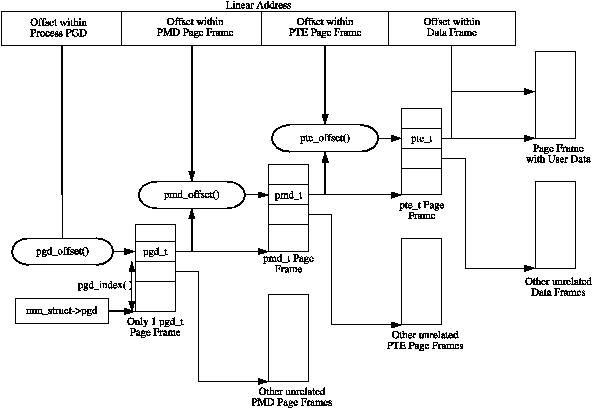

# The Memory Management Subsystem of Linux Kernel

- [The Memory Management Subsystem of Linux Kernel](#the-memory-management-subsystem-of-linux-kernel)
  - [Describing Physical Memory](#describing-physical-memory)
    - [Nodes](#nodes)
    - [Zones](#zones)
      - [Zone Watermarks](#zone-watermarks)
      - [Zone Wait Queue Table](#zone-wait-queue-table)
    - [Zone Initialisation](#zone-initialisation)
    - [Pages](#pages)
  - [Page Table Management](#page-table-management)
    - [Describing the Page Directory](#describing-the-page-directory)
    - [Describing a Page Table Entry](#describing-a-page-table-entry)
    - [Using Page Table Entry](#using-page-table-entry)
    - [Translating and Setting Page Table Entries](#translating-and-setting-page-table-entries)
    - [Allocating and Freeing Page Tables](#allocating-and-freeing-page-tables)
    - [Kernel Page Tables](#kernel-page-tables)
    - [Mapping Addresses to a `struct page`](#mapping-addresses-to-a-struct-page)
      - [Mapping Physical to Virtual Kernel Addresses](#mapping-physical-to-virtual-kernel-addresses)
    - [Translation Lookaside Buffer (TLB)](#translation-lookaside-buffer-tlb)
    - [Level 1 CPU Cache Management](#level-1-cpu-cache-management)
  - [Process Address Space](#process-address-space)
    - [Linear Address Space](#linear-address-space)
    - [Managing the Address Space](#managing-the-address-space)
    - [Process Address Space Descriptor](#process-address-space-descriptor)
      - [Allocating a Descriptor](#allocating-a-descriptor)
    - [Memory Region](#memory-region)
      - [Memory Region Operations](#memory-region-operations)
      - [File/Device backed memory regions](#filedevice-backed-memory-regions)
      - [Creating A Memory Region](#creating-a-memory-region)
      - [Finding a Mapped Memory Region](#finding-a-mapped-memory-region)
      - [Finding a Free Memory Region](#finding-a-free-memory-region)
      - [Inserting a memory region](#inserting-a-memory-region)
      - [Merging Contiguous Regions](#merging-contiguous-regions)
      - [Remapping and Moving a Memory Region](#remapping-and-moving-a-memory-region)
      - [Locking a Memory Region](#locking-a-memory-region)
      - [Unlocking the Region](#unlocking-the-region)
      - [Fixing up Regions After Locking](#fixing-up-regions-after-locking)
      - [Deleting a Memory Region](#deleting-a-memory-region)
      - [Deleting All Memory Regions](#deleting-all-memory-regions)
    - [Exception Handling](#exception-handling)

## Describing Physical Memory

This chapter describes the structures used to keep account of memory banks, pages and the flags that affect VM behavior. 

The first principal concept prevalent in the VM is *Non-Uniform Memory Access (NUMA)*. With large scale machines, memory may be arranged into banks that incur a different cost to access depending on the "distance" from the processor. Each bank is called a *node*, and the concept is represented under Linux by a `struct pglist_data` (typedeffed as `pg_data_t`) even if the architecture is UMA. Every node in the system is kept on a NULL terminated list call `pgdat_list`, and each node is linked to the next with the field `pg_data_t->node_next`. For UMA architectures like PC desktops, only one static `pg_data_t` structure called `contig_page_data` is used. 

Each node is divided up into a number of blocks called *zones*, which represent ranges within memory. Zones should not be confused with zone based allocators. A zone is described by a `struct zone_struct`, typedeffed to `zone_t` and each one is of type `ZONE_DMA`, `ZONE_NORMAL` or `ZONE_HIGHMEM`(有很多zone, 每一个zone带有一种类型属性). Each zone type suitable a different type of usage. `ZONE_DMA` is memory in the low physical memory ranges with certain ISA devices require. Memory within `ZONE_NORMAL` is directly mapped by the kernel into the upper region of the linear address space, `ZONE_HIGHMEM` is the remaining available memory in the system and it not directly mapped by the kernel.

With the x86 the zones are:
- `ZONE_DMA`: First 16MiB of memory
- `ZONE_NORMAL`: 16MiB - 896MiB
- `ZONE_HIGHMEM`: 896MiB - End

It is important to note that many kernel operations can only take place using `ZONE_NORMAL`, so it is the most performance critical one. Each physical page frame is represented by a `struct page`, and all the structs are kept in a global `mem_map` array, which is usually stored at the beginning of `ZONE_NORMAL`. 


As the amount of memory directly accessible by the kernel (`ZONE_NORMAL`) is limited in size, Linux supports the concept of *High Memory*. This chapter will discuss how nodes, zones, and pages are represented before introducing high memory management.

### Nodes

When allocating a page, Linux uses a *node-local allocation policy* to allocate memory from the node closest to the running CPU. As processes tend to run on the same CPU, it is likely the memory from the current node will be used. The struct is declared as follows in `<linux/mmzone.h>`:G

```c++
129 typedef struct pglist_data {
130     zone_t node_zones[MAX_NR_ZONES];
131     zonelist_t node_zonelists[GFP_ZONEMASK+1];
132     int nr_zones;
133     struct page *node_mem_map;
134     unsigned long *valid_addr_bitmap;
135     struct bootmem_data *bdata;
136     unsigned long node_start_paddr;
137     unsigned long node_start_mapnr;
138     unsigned long node_size;
139     int node_id;
140     struct pglist_data *node_next;
141 } pg_data_t; 
```

- **node_zones**: The zones for this node, `ZONE_HIGHMEM`, `ZONE_NORMAL`, `ZONE_DMA`.
- **node_zonelists**: This is the order of zones that allocations are preferred from. (分配内存时选择哪一种zone type的优先级顺序).
- **nr_zones**: Number of zones in this node, between 1 and 3. Not all nodes will have three.
- **node_mem_map**: This is the first page of the `struct page` array representing each physical frame in the node.
- **valid_addr_bitmap**: A bitmap which describes "holes" in the memory node that no memory exists for. Rarely used.
- **bdata**. Only of interest to the boot memory allocator.
- **node_start_paddr**: The starting physical address of the node.
- **node_start_mapnr**: This gives the page offset within the global `mem_map`.
- **node_size**: The total number of pages in this zone.
- **node_id**: The Node ID (NID) of the node, starts at 0.
- **node_next**: Pointer to next node in a NULL terminated list.

### Zones

`struct zone_struct` keeps track of information like page usage statistics, free area information and locks. Tt is declared as follows in `<linux/mmzone.h>`:

```c++
37 typedef struct zone_struct {
41     spinlock_t        lock;
42     unsigned long     free_pages;
43     unsigned long     pages_min, pages_low, pages_high;
44     int               need_balance;
45 
49     free_area_t       free_area[MAX_ORDER];
50 
76     wait_queue_head_t * wait_table;
77     unsigned long     wait_table_size;
78     unsigned long     wait_table_shift;
79 
83     struct pglist_data *zone_pgdat;
84     struct page        *zone_mem_map;
85     unsigned long      zone_start_paddr;
86     unsigned long      zone_start_mapnr;
87 
91     char               *name;
92     unsigned long      size;
93 } zone_t;
```

- **lock**: Spinlock to protect the zone from concurrent accesses.
- **free_pages**: Total number of free pages in the zone.
- **page_min, page_low, page_high**: These are zone watermarks.
- **need_balance**: This flag that tells the pageout **kswapd** to balance the zone. A zone is said to need balance when the number of available pages reaches one of the *zone watermarks*.
- **free_area**: Free area bitmaps used by the buddy allocator.
- **wait_table**: A hash table of wait queues of processes waiting on a page to be freed. While processed could all wait on one queue, this would cause all waiting processes to race for pages still locked when woken up (a thundering herd).
- **wait_table_size**: Number of queues in the hash table, which is a power of 2.
- **zone_pgdat**: Points to the parent `pg_data_t`.
- **zone_mem_map**: The first page in the global `mem_map` this zone refers to.
- **zone_start_paddr**: Same principle as `node_start_paddr`.
- **zone_start_mapnr**: Same principle as `node_start_mapnr`.
- **name**: The string name of the zone, "DMA", "Normal" or "HighMem".
- **size**: The size of the zone in pages.

#### Zone Watermarks

When available memory in the system is low, the pageout daemon **kswapd** is woken up to start freeing pages. If the pressure is high, the process will free up memory synchronously, sometimes referred to as the *direct-reclaim* path. Each zone has three watermarks called `page_low`, `page_min` and `page_high` which help track how much pressure a zone in under.


- **pages_low**: When `pages_low` number of free pages is reached, **kswapd** is woken up by the buddy allocator to start freeing pages.
- **pages_min**: When `page_min` is reached, the allocator will do the **kswapd** work in a synchronous fashion, sometimes refereed to as the *direct-reclaim* path.
- **pages_high**: Once **kswapd** has been woken to start freeing pages, it will not consider the zone to be "balanced" when `pages_high` pages are free. Once the watermark has been reached, **kswapd** will go back to sleep.

#### Zone Wait Queue Table

When IO is being performed on a page, such are during page-in or page-out, it is locked to prevent accessing it with inconsistent data. Processes wishing to use it have to join a wait queue before it can be accessed by calling `wait_on_page()`. When the IO is completed, the page will be unlocked with `UnlockPage()`, and any process waiting on the queue will be woken up. Each page could have a wait queue, but it would be very expensive in terms of memory to have so many separate queues. So instead, the wait queue is stored in the `zone_t`.

It is possible to have just one wait queue in the zone, but that would mean that all processed waiting on any page in a zone would be woken up when one was unlocked. This would cause a serious *thundering herd* problem. Instead, a hash table of wait queues is stored in `zone_t->wait_table`. 

### Zone Initialisation

The zones are initialised after the kernel page tables have been fully setup. Predictably, each architecture performs this task differently, but the objective is always the same: to determine what parameters to send to either `free_area_init()` for UMA architecture, or `free_area_init_node()` for NUMA. The only parameter required for UMA is `zones_size`. 

### Pages

Every physical page frame in the system has an associated `struct page` which is used to keep track of its status. It is declared as follows in `<linux/mm.h>`:

```c++
152 typedef struct page {
153     struct list_head list;
154     struct address_space *mapping;
155     unsigned long index;
156     struct page *next_hash;
158     atomic_t count;
159     unsigned long flags;
161     struct list_head lru;
163     struct page **pprev_hash;
164     struct buffer_head * buffers;
175
176 #if defined(CONFIG_HIGHMEM) || defined(WANT_PAGE_VIRTUAL)
177     void *virtual;
179 #endif /* CONFIG_HIGMEM || WANT_PAGE_VIRTUAL */
180 } mem_map_t;
```

- **list**: Pages may belong to many lists, and this field us used as the list head.
- **mapping**: When files or devices are memory mapped, their inode has an associated `address_space`. This field will point to this address space of the page belongs to the file.
- **index**: This field has two uses and it depends on the state of the page what it means. 
  - If the page is part of a file mapping, it is the offset within the file.
  - If the page is part of the swap cache, this will be the offset within the `address_space` for the swap address space.
- **next_hash**: Pages that are part of a file mapping are hashed on the inode and offset. This field links pages together that share the same hash bucket.
- **count**: The reference count to the page. If it drops to 0, it may be freed. Any greater and it is in use by one or more processes or is in use by the kernel like when waiting for IO.
- **flags**: These are flags which describes the status of the page. All of them are listed in the following table.
- **lru**: For the page replacement policy, pages that may be swapped out will exist on either the `active_list` or the `inactive_list`. This is the list head for these LRU lists.
- **pprev_hash**: This complement to `next_hash` so that the hash can work as a doubly linked list.
- **buffers**: If a page has buffers for a block device associated with it, this field is used to keep track of the `buffer_head`. An anonymous page mapped by a process may also have an associated `buffer_head` of it is backed by a swap file. This is necessary as the page has to be synced with backing storage in block sized chunks defined by the underlying filesystem.
- **virtual**: Normally only pages from `ZONE_NORMAL` are directly mapped by the kernel. To address pages in `ZONE_HIGHMEM`, `kmap()` is used to map the page for the kernel. There are only a fixed number of pages that may be mapped. When it is mapped, this is its virtual address.

## Page Table Management

This chapter will begin by describing how the page table is arranged and what types are used to describe the three separate levels of the page table, followed by how a virtual address is broken up into its component parts for navigating the table. Once covered, it will be discussed how the lowest level entry, the *Page Table Entry (PTE)* and what bits are used by the hardware. The initialisation stage is then discussed, which shows how the page tables are initialised during boot strapping. Finally, we will cover how the TLB and CPU caches are utilized.

### Describing the Page Directory

Each process a pointer (`mm_struct->pgd`) to its own *Page Global Directory (PGD)* which is a physical page frame. This frame contains an array of type `pgd_t` which is an architecture specific type defined in `<asm/page.h>`. On the x86, the process page table is loaded by copying `mm_struct->pgd` into the `cr3` register which has the side effect of flushing the TLB. 

Each active entry in the PGD table points to a page frame containing an array of *Page Middle Directory (PMD)* entries of type `pmd_t` which in turns points to the page frames containing *Page Table Entries (PTE)* of type `pte_t`, which finally points to page frames containing the actual user data (三级页表). In the event the page has been swapped out to backing storage, the swap entry is stored in the PTE and used by `do_swap_page()` during page fault, to find the swap entry containing the page data.



Any given linear address may be broken up into parts, to yield offsets within these three table levels, and offset within the actual page. To help break up the linear address into its component parts, a number of macros are provided in triplets for each page table level, namely a `SHIFT`, a `SIZE` and a `MASK` macro. The `SHIFT` macros specifies the length in bits that are mapped by each level of the page tables.


The `MASK` values can be ANDd with a linear address to mask out all the upper bits, and is frequently used to determine if a linear address is aligned to a given level within the page table (对齐的时候末尾比特是0). The `SIZE` macros reveal how many bytes are addressed by each entry at each level.


For the calculation of each of the triplets (`SHIFT`, `MASK`, and `SIZE`), only `SHIFT` is important as the other two are calculated based on it. For example, the three macros for page level on the x86 are:

```c++
  5 #define PAGE_SHIFT      12
  6 #define PAGE_SIZE       (1UL << PAGE_SHIFT)
  7 #define PAGE_MASK       (~(PAGE_SIZE-1))
```

`PAGE_SHIFT` is the length in bits of the offset part of the linear address space, which is 12 bits on the x86. The size of a page is easily calculated as 2<sup>`PAGE_SHIFT`</sup>, which is the equivalent of the code above. Finally the mask is calculated as the negation of the bits which make up the `PAGE_SIZE - 1`. If a page needs to be aligned on a page boundary, `PAGE_ALIGN()` is used.

`PMD_SHIFT` is the number of bits in the linear address which are mapped by the second level part of the table. The `PMD_SIZE` and `PMD_MASK` are calculated in a similar way to the page level macros.

`PGDIR_SHIFT` is the number of bits which are mapped by the top, or first level, of the page table. The `PGDIR_SIZE` and `PGDIR_MASK` are calculated in the same manner as above.

### Describing a Page Table Entry

As mentioned, each entry is described by the structs `pte_t`, `pmd_t`, and `pgd_t` for PTEs, PMDs, and PGDs, respectively. Even though these are often just unsigned integers, they are defined as structs. To store the protection bits, `pgprot_t` is defined which holds the relevant flags and is usually stored in the lower bits of a page table entry.

On an x86 with no PAE, the `pte_t` is simply a 32 bit integer within a struct. Each `pte_t` points to an address of a page frame, and all the addresses pointed to are guaranteed to be page aligned. Therefore, there are `PAGE_SHIFT` (12) bits in that 32 bit value that are free for status bits of the page table entry (后面12位一定是0，因为已经对齐). 

- `_PAGE_PRESENT`: Page is resident in memory and not swapped out
- `_PAGE_PROTNONE`: Page is resident but not accessible
- `_PAGE_RW`: Set if the page may be written to
- `_PAGE_USER`: Set if the page is accessible from user space
- `_PAGE_DIRTY`: Set if the page is written to
- `_PAGE_ACCESSED`: Set if the page is accessed

### Using Page Table Entry

To navigate the page directories, three macros are provided which break up a linear address space into its component parts. `pgd_offset()` takes an address and the `mm_struct` for the process, and returns the PGD entry that covers the requested address. `pmd_offset()` takes a PGD entry and an address, and returns the relevant PMD. `pte_offset()` takes a PMD, and returns the relevant PTE. The remainder of the linear address provided is the offset within the page.

The second round of macros determine if the page table entries are present or may be used.

- `pte_none()`, `pmd_none()` and `pgd_none()` return 1 if the corresponding entry does not exist.
- `pte_present()`, `pmd_present()` and `pgd_present()` return 1 if the corresponding page table entries have the `PRESENT` bit set.
- `pte_clear()`, `pmd_clear()` and `pgd_clear()` will clear the corresponding page table entry.
- `pmd_bad()` and `pdg_bad()` are used to check entries when passed as input parameters to functions that may change the value of the entries. 

### Translating and Setting Page Table Entries

This set of functions and macros deal with the mapping of addresses and pages to PTEs, and the setting of the individual entries. The macro `mk_pte()` takes a `struct page` (描述physical page frame) and protection bits, and combines them together to form the `pte_t` that needs to be inserted into the page table. A similar macro `mk_pte_phys()` exists which takes a physical page address as a parameter. 

The macro `pte_page()` returns the `struct page` which corresponds to the PTE entry. `pmd_page()` returns the `struct page` containing the set of PTEs. 

### Allocating and Freeing Page Tables

The last set of functions deal with the allocation and freeing of page tables. Page tables, as stated, are physical pages containing an array of entries, and the allocation and freeing of physical pages is a relatively expensive operation, both in terms of time and the fact that interrupts are disabled during page allocation. The allocation and deletion of page tables, at any of the three levels, is a very frequent operation, so it is important the operation is as quick as possible.

PGDs, PMDs, and PTEs have two sets of functions, each for the allocation and freeing of page tables. The allocation functions are `pgd_alloc()`, `pmd_alloc()` and `pte_alloc()` respectively, and the free functions are `pgd_free()`, `pmd_free()` and `pte_free()`.

Pages used for the page tables are cached in a number of different lists called *quicklists*. Broadly speaking, the three implement caching with the use of three caches called `pgd_quicklist`, `pmd_quicklist` and `pte_quicklist`. 

### Kernel Page Tables

Each architecture implements the initialisation of page table differently, so only the x86 case will be discussed. The page initialisation is divided into two phases. The bootstrap phase sets up page tables for just *8MiB* so the paging unit can be enabled. The second phase initialises the rest of the page tables.

While all normal kernel code in `vmlinuz` is compiled with the base address at `PAGE_OFFSET + 1MiB`, the kernel is actually loaded beginning at the first megabyte (0x00100000) of memory. The first megabyte is used by some devices for communication with the BIOS and is skipped. The bootstrap code in this file (`vmlinuz`) treats 1MiB as its base address by subtracting `__PAGE_OFFSET` from any address until the paging unit is enabled. So before the paging unit is enabled, a page table mapping has to be established which translates the 8MiB of physical memory to be virtual `PAGE_OFFSET`.

Initialisation begins with statically defining at compile time an array called `swap_pg_dir`, which is placed using linker directives at 0x00101000. It then establishes page table entries for 2 pages, `pg0` and `pg1`. If the processor supports the *Page Size Extension (PSE)* bit, it will be set so that pages will be translated are 4MiB pages, not 4KiB as is the normal case. The first pointers to `pg0` and `pg1` are placed to cover the region `1-9MiB`, and the second pointers to `pg0` and `pg1` are placed at `PAGE_OFFSET+1MiB`. This means that when paging is enabled, they will map to the correct pages using either physical or virtual addressing for just the kernel image. The rest of the kernel page tables will be initialised by `paging_init()` (这个时候kernel已经启动了，后面就可以用kernel的函数建立页表).

Once this mapping has been established, the paging unit is turned on by setting a bit in the `cr0` register, and a jump takes places immediately to ensure the *Instruction Pointer (EIP register)* is correct.

The call graph of `paging_init()` on x86 can be seen as follows:


The function first call `pagetable_init()` to initialise the page tables necessary to reference all physical memory in `ZONE_DMA` and `ZONE_NORMAL`. Remember that high memory in `ZONE_HIGHMEM` cannot be directly referenced and mappings are set up for it temporarily. For each `pgd_t` used by the kernel, the boot memory allocator is called to allocate a page for the PMDs, and the PSE bit will be set if available to use 4MiB TLB entries instead of 4KiB. If the PSE bit is not supported, a page for PTEs will be allocated for each `pmd_t`. If the CPU supports the PGE flag, it also will be set so that the page table entry will be global and visible to all processes.

Next, `pagetable_init()` calls `fixrange_init()` to setup the fixed address space mappings at the end of the virtual address space starting at `FIXADDR_START`. These mappings are used for purposes such as the local APIC and the atomic kmappings between `FIX_KMAP_BEGIN` and `FIX_KMAP_END` required by `kmap_atomic()`. Finally, the function calls `fixrange_init()` to initialise the page table entries required for normal high memory mappings with `kmap()`.

Once `pagetable_init()` returns, the page tables for kernel space are now full initialised, so the static PGD (`swapper_pg_dir`) is loaded into the CR3 register so that the static table is now being used by the paging unit.

The next task of the `paging_init()` is responsible for calling `kmap_init()` to initialise each of the PTEs with the `PAGE_KERNEL` protection flags. The final task is to call `zone_sizes_init()` which initialises all the zone structures used.

### Mapping Addresses to a `struct page`

There is requirement for Linux to have a fast method of mapping virtual addresses to physical addresses, and for mapping `struct page`s to their physical address. Linux achieves this by knowing where the global `mem_map` array is as the global array has pointers to all `struct page`s representing physical memory in the system.

#### Mapping Physical to Virtual Kernel Addresses

Linux sets up a direct mapping from the physical address 0 to the virtual address `PAGE_OFFSET` at 3GiB on the x86. This means that any virtual address can be translated to the physical address by simply subtracting PAGE_OFFSET which is essentially what the function `virt_to_phys()` with the macro `__pa()` does:

```c++
/* from <asm-i386/page.h> */
132 #define __pa(x)                 ((unsigned long)(x)-PAGE_OFFSET)

/* from <asm-i386/io.h> */
 76 static inline unsigned long virt_to_phys(volatile void * address)
 77 {
 78         return __pa(address);
 79 }
```

Obviously the reverse operation involves simply adding `PAGE_OFFSET` which is carried out by the function `phys_to_virt()` with the macro `__va()`. Next we see how this helps the mapping of struct pages to physical addresses.

The kernel image is located at the physical address 1MiB, which of course translates to the virtual address `PAGE_OFFSET + 0x00100000`, and a virtual region totaling about 8MiB is reserved for the image which is the region that can be addressed by two PGDs. This would imply that the first available memory to use is located `at 0xC0800000`, but that is not the case. Linux tries to reserve the first 16MiB of memory for `ZONE_DMA`, so first virtual area used for kernel allocations is actually 0xC1000000. This is where the global `mem_map` is usually located. `ZONE_DMA` will be still get used, but only when absolutely necessary.

Physical addresses are translated to struct pages by *treating them as an index into the `mem_map` array*. Shifting a physical address `PAGE_SHIFT` bits to the right will treat it as a PFN from physical address 0 which is *also* an index within the mem_map array. This is exactly what the macro `virt_to_page()` does which is declared as follows in `<asm-i386/page.h>`:

```c++
#define virt_to_page(kaddr) (mem_map + (__pa(kaddr) >> PAGE_SHIFT))
```

The macro `virt_to_page()` takes the virtual address `kaddr`, converts it to the physical address with `__pa()`, converts it into an array index by bit shifting it right `PAGE_SHIFT` bits, and indexing into the `mem_map` by simply adding them together. No macro is available for converting struct pages to physical addresses but at this stage, it should be obvious to see how it could be calculated.

### Translation Lookaside Buffer (TLB)

Initially, when the processor needs to map a virtual address to a physical address, it must traverse the full page directory searching for the PTE of interest. This would normally imply that each assembly instruction that references memory actually requires several separate memory references for the page table traversal. *To avoid this considerable overhead, architectures take advantage of the fact that most processes exhibit a locality of reference or, in other words, large numbers of memory references tend to be for a small number of pages.* They take advantage of this reference locality by providing a Translation Lookaside Buffer (TLB) which is a small associative memory that caches virtual to physical page table resolutions.

- `void flush_tlb_all(void)`: This flushes the entire TLB on all processors running in the system, making it the most expensive TLB flush operation. After it completes, all modifications to the page tables will be visible globally.
- `void flush_tlb_mm(struct mm_struct *mm)`: This flushes all TLB entries related to the userspace portion (i.e. below `PAGE_OFFSET`) for the requested mm context. In some architectures, such as MIPS, this will need to be performed for all processors but usually it is confined to the local processor. This is only called when an operation has been performed that affects the entire address space.
- `void flush_tlb_range(struct mm_struct *mm, unsigned long start, unsigned long end)`: As the name indicates, this flushes all entries within the requested userspace range for the mm context. This is used after a new region has been moved or changed as during `mremap()` which moves regions or `mprotect()` which changes the permissions. The function is also indirectly used during unmapping a region with `munmap()` which calls `tlb_finish_mmu()` which tries to use `flush_tlb_range()` intelligently. This API is provided for architectures that can remove ranges of TLB entries quickly rather than iterating with `flush_tlb_page()`.
- `void flush_tlb_page(struct vm_area_struct *vma, unsigned long addr)`: Predictably, this API is responsible for flushing a single page from the TLB. The two most common usage of it is for flushing the TLB after a page has been faulted in or has been paged out.
- `void flush_tlb_pgtables(struct mm_struct *mm, unsigned long start, unsigned long end)`: This API is called with the page tables are being torn down and freed. Some platforms cache the lowest level of the page table, i.e. the actual page frame storing entries, which needs to be flushed when the pages are being deleted. This is called when a region is being unmapped and the page directory entries are being reclaimed.
- `void update_mmu_cache(struct vm_area_struct *vma, unsigned long addr, pte_t pte)`: This API is only called after a page fault completes. It tells the architecture dependant code that a new translation now exists at `pte` for the virtual address `addr`. It is up to each architecture how this information should be used.

### Level 1 CPU Cache Management

As Linux manages the CPU Cache in a very similar fashion to the TLB, this section covers how Linux utilises and manages the CPU cache. CPU caches, like TLB caches, take advantage of the fact that programs tend to exhibit a locality of reference. To avoid having to fetch data from main memory for each reference, the CPU will instead cache very small amounts of data in the CPU cache. Frequently, there is two levels called the Level 1 and Level 2 CPU caches. The Level 2 CPU caches are larger but slower than the L1 cache but Linux only concerns itself with the Level 1 or L1 cache.

*CPU caches are organised into lines*. Each line is typically quite small, usually 32 bytes and each line is aligned to it's boundary size. In other words, *a cache line of 32 bytes will be aligned on a 32 byte address*. With Linux, the size of the line is `L1_CACHE_BYTES` which is defined by each architecture.

How addresses are mapped to cache lines vary between architectures but the mappings come under three headings, *direct mapping*, *associative mapping* and *set associative mapping*. Direct mapping is the simpliest approach where each block of memory maps to only one possible cache line. With associative mapping, any block of memory can map to any cache line. Set associative mapping is a hybrid approach where any block of memory can may to any line but only within a subset of the available lines. Regardless of the mapping scheme, they each have one thing in common: *addresses that are close together and aligned to the cache size are likely to use different lines*. Hence Linux employs simple tricks to try and maximise cache usage:

- Frequently accessed structure fields are at the start of the structure to increase the chance that only one line is needed to address the common fields;
- Unrelated items in a structure should try to be at least cache size bytes apart to avoid false sharing between CPUs;
- Objects in the general caches, such as the mm_struct cache, are aligned to the L1 CPU cache to avoid false sharing.

If the CPU references an address that is not in the cache, a *cache miss* occurs and the data is fetched from main memory. The cost of cache misses is quite high, as a reference to cache can typically be performed in less than 10ns where a reference to main memory typically will cost between 100ns and 200ns. The basic objective is then to have as many cache hits and as few cache misses as possible.

- `void flush_cache_all(void)`: This flushes the entire CPU cache system making it the most severe flush operation to use. It is used when changes to the kernel page tables, which are global in nature, are to be performed.
- `void flush_cache_mm(struct mm_struct mm)`: This flushes all entires related to the address space. On completion, no cache lines will be associated with `mm`.
- `void flush_cache_range(struct mm_struct *mm, unsigned long start, unsigned long end)`: This flushes lines related to a range of addresses in the address space. Like it's TLB equivalent, it is provided in case the architecture has an efficient way of flushing ranges instead of flushing each individual page.
- `void flush_cache_page(struct vm_area_struct *vma, unsigned long vmaddr)`: This is for flushing a single page sized region. The VMA is supplied as the `mm_struct` is easily accessible via `vma->vm_mm`. Additionally, by testing for the `VM_EXEC` flag, the architecture will know if the region is executable for caches that separate the instructions and data caches. 

It does not end there though. A second set of interfaces is required to avoid virtual aliasing problems. The problem is that some CPUs select lines based on the virtual address, meaning that one physical address can exist on multiple lines, leading to cache coherency problems. Architectures with this problem may try and ensure that shared mappings will only use addresses as a stop-gap measure (权宜之计).

- `void flush_dcache_page(struct page *page)`: This function is called when the kernel writes to or copies from a page cache page as these are likely to be mapped by multiple processes.
- `void flush_icache_range(unsigned long address, unsigned long endaddr)`: This is called when the kernel stores information in addresses that is likely to be executed, such as when a kernel module has been loaded.
- `void flush_icache_user_range(struct vm_area_struct *vma, struct page *page, unsigned long addr, int len)`: This is similar to `flush_icache_range()` except it is called when a userspace range is affected. Currently, this is only used for `ptrace()` (used when debugging) when the address space is being accessed by access_process_vm().
- `void flush_icache_page(struct vm_area_struct *vma, struct page *page)`: This is called when a page-cache page is about to be mapped. It is up to the architecture to use the VMA flags to determine whether the I-Cache or D-Cache should be flushed.

## Process Address Space

One of the principal advantages of virtual memory is that each process has its own virtual address space, which is mapped to physical memory by the operating system.

This chapter begins with how the linear address space is broken up and what the purpose of each section is. We then cover the structures maintained to describe each process, how they are allocated, initialised and then destroyed. Next, we will cover how individual regions within the process space are created and all the various functions associated with them. That will bring us to exception handling related to the process address space, page faulting and the various cases that occur to satisfy a page fault. Finally, we will cover how the kernel safely copies information to and from userspace.

### Linear Address Space

From a user perspective, the address space is a flat linear address space. But predictably, the kernel's perspective is very different. *The address space is split into two parts, the userspace part which potentially changes with each full context switch, and the kernel address space which remains constant.* The location of the split is determined by the value of `PAGE_OFFSET` which is at `0xC0000000` on the x86. This means that 3GiB is available for the process to use while the remaining 1GiB is always mapped by the kernel. The linear virtual address space as the kernel sees it is illustrated in the following figure.


The region between `PAGE_OFFSET` and `VMALLOC_START - VMALLOC_OFFSET` is the physical memory map and the size of the region depends on the amount of available RAM. Page table entries exist to map physical memory to the virtual address range beginning at `PAGE_OFFSET`. Between the physical memory map and the vmalloc address space, there is a gap of space `VMALLOC_OFFSET` in size, which on the x86 is 8MiB, to guard against out of bounds errors. For illustration, on a x86 with 32MiB of RAM, `VMALLOC_START` will be located at `PAGE_OFFSET + 0x02000000 + 0x00800000`.

In low memory systems, the remaining amount of the virtual address space, minus a 2 page gap, is used by `vmalloc()` for representing non-contiguous memory allocations in a contiguous virtual address space. In high-memory systems, the vmalloc area extends as far as `PKMAP_BASE` minus the two page gap, and two extra regions are introduced. The first, which begins at `PKMAP_BASE`, is an area reserved for the mapping of high memory pages into low memory with `kmap()`. The second is for fixed virtual address mappings which extends from `FIXADDR_START` to `FIXADDR_TOP`. Fixed virtual addresses are needed for subsystems that need to know the virtual address at compile time such as the Advanced Programmable Interrupt Controller (APIC). `FIXADDR_TOP` is statically defined to be 0xFFFFE000 on the x86 which is one page before the end of the virtual address space. The size of the fixed mapping region is calculated at compile time in `__FIXADDR_SIZE` and used to index back from `FIXADDR_TOP` to give the start of the region `FIXADDR_START`.

### Managing the Address Space

The address space usable by the process is managed by a high level `mm_struct`. Each address space consists of a number of page-aligned regions of memory that are in use. They never overlap and represent a set of addresses which contain pages that are related to each other in terms of protection and purpose. *These regions are represented by a `struct vm_area_struct`*. For clarity, a region may represent the process heap for use with `malloc()`, a memory mapped file such as a shared library, or a block of anonymous memory allocated with `mmap()`. The pages for this region may still have to be allocated, be active and resident or have been paged out.

If a region is backed by a file, its `vm_file` field will be set. By traversing `vm_file->f_dentry->d_inode->i_mapping`, the associated `address_space` for the region may be obtained. The `address_space` has all the filesystem specific information required to perform page-based operations on disk.

The relationship between the different address space related structures is illustrated in the following figure. A number of system calls are provided which affect the address space and regions. 


- `fork()`: Creates a new process with a new address space. All the pages are marked COW and are shared between the two processes until a page fault occurs to make private copies.
- `clone()`: `clone()` allows a new process to be created that shares parts of its context with its parent and is how threading is implemented in Linux. `clone()` without the `CLONE_VM` set will create a new address space which is essentially the same as `fork()`.
- `mmap()`: `mmap()` creates a new region within the process linear address space.
- `mremap()`: Remaps or resizes a region of memory. If the virtual address space is not available for the mapping, the region may be moved unless the move is forbidden by the caller.
- `munmap()`: This destroys part or all of a region. If the region been unmapped is in the middle of an existing region, the existing region is split into two separate regions.
- `shmat()`: This attaches a shared memory segment to a process address space.
- `shmdt()`: Removes a shared memory segment from an address space.
- `execve()`: This loads a new executable file replacing the current address space.
- `exit()`: Destroys an address space and all regions.

### Process Address Space Descriptor

The process address space is described by the `mm_struct` struct meaning that only one exists for each process, and is shared between userspace threads. In fact, threads are identified in the task list by finding all `task_struct`s which have pointers to the same `mm_struct`. (线程指向同一个地址空间)

A unique `mm_struct` is not needed for kernel threads, as they will never page fault or access the userspace portion. The only exception is page faulting within the vmalloc space. The page fault handling code treats this as a special case and updates the current page table with information in the the master page table. As a `mm_struct` is not needed for kernel threads, the `task_struct->mm` field for kernel threads is always NULL. For some tasks such as the boot idle task, the `mm_struct` is never setup but for kernel threads, a call to `daemonize()` will call `exit_mm()` to decrement the usage counter.

As TLB flushes are extremely expensive, a technique called lazy TLB is employed which avoids unnecessary TLB flushes by processes which do not access the userspace page tables as the kernel portion of the address space is always visible. The call to `switch_mm()`, which results in a TLB flush, is avoided by "borrowing" the `mm_struct` used by the previous task and placing it in `task_struct->active_mm`. This technique has made large improvements to context switches times.

When entering lazy TLB, the function `enter_lazy_tlb()` is called to ensure that a `mm_struct` is not shared between processors in SMP machines, making it a NULL operation on UP machines. The second time use of lazy TLB is during process exit when `start_lazy_tlb()` is used briefly while the process is waiting to be reaped by the parent.

The struct has two reference counts called `mm_users` and `mm_count` for two types of "users". 
- `mm_users` is a reference count of processes accessing the userspace portion of for this `mm_struct`, such as the page tables and file mappings. Threads and the `swap_out()` code for instance will increment this count making sure a `mm_struct` is not destroyed early. When it drops to 0, `exit_mmap()` will delete all mappings and tear down the page tables before decrementing the `mm_count`.
- `mm_count` is a reference count of the "anonymous users" for the `mm_struct` initialised at 1 for the "real" user. An anonymous user is one that does not necessarily care about the userspace portion and is just borrowing the `mm_struct`. Example users are kernel threads which use lazy TLB switching. When this count drops to 0, the `mm_struct` can be safely destroyed. Both reference counts exist because anonymous users need the `mm_struct` to exist even if the userspace mappings get destroyed and there is no point delaying the teardown of the page tables.

The `mm_struct` is defined in `<linux/sched.h>` as follows:

```c++
206 struct mm_struct {
207     struct vm_area_struct * mmap;
208     rb_root_t mm_rb;
209     struct vm_area_struct * mmap_cache;
210     pgd_t * pgd;
211     atomic_t mm_users;
212     atomic_t mm_count;
213     int map_count;
214     struct rw_semaphore mmap_sem;
215     spinlock_t page_table_lock;
216 
217     struct list_head mmlist;
221 
222     unsigned long start_code, end_code, start_data, end_data;
223     unsigned long start_brk, brk, start_stack;
224     unsigned long arg_start, arg_end, env_start, env_end;
225     unsigned long rss, total_vm, locked_vm;
226     unsigned long def_flags;
227     unsigned long cpu_vm_mask;
228     unsigned long swap_address;
229 
230     unsigned dumpable:1;
231 
232     /* Architecture-specific MM context */
233     mm_context_t context;
234 };
```

The meaning of each of the field in this sizable struct is as follows:
- **mmap**: The head of a linked list of all VMA regions in the address space;
- **mm_rb**: The VMAs are arranged in a linked list and in a red-black tree for fast lookups. This is the root of the tree;
- **mmap_cache**: The VMA found during the last call to `find_vma()` is stored in this field on the assumption that the area will be used again soon;
- **pgd**: The Page Global Directory for this process;
- **mm_users**: A reference count of users accessing the userspace portion of the address space as explained at the beginning of the section;
- **mm_count**: A reference count of the anonymous users for the `mm_struct` starting at 1 for the "real" user as explained at the beginning of this section;
- **map_count**: Number of VMAs in use;
- **mmap_sem**: This is a long lived lock which protects the VMA list for readers and writers. As users of this lock require it for a long time and may need to sleep, a spinlock is inappropriate. A reader of the list takes this semaphore with `down_read()`. If they need to write, it is taken with `down_write()` and the `page_table_lock` spinlock is later acquired while the VMA linked lists are being updated;
- **page_table_lock**: This protects most fields on the `mm_struct`. As well as the page tables, it protects the RSS (see below) count and the VMA from modification;
- **mmlist**: All `mm_struct`s are linked together via this field;
- **start_code, end_code**: The start and end address of the code section;
- **start_data, end_data**: The start and end address of the data section;
- **start_brk, brk**: The start and end address of the heap;
- **start_stack**: Predictably enough, the start of the stack region;
- **arg_start, arg_end**: The start and end address of command line arguments;
- **env_start, env_end**: The start and end address of environment variables;
- **rss**: Resident Set Size (RSS) is the number of resident pages for this process. It should be noted that the global zero page is not accounted for by RSS;
- **total_vm**: The total memory space occupied by all VMA regions in the process;
- **locked_vm**: The number of resident pages locked in memory;
- **def_flags**: Only one possible value, `VM_LOCKED`. It is used to determine if all future mappings are locked by default or not;
- **cpu_vm_mask**: A bitmask representing all possible CPUs in an SMP system. The mask is used by an InterProcessor Interrupt (IPI) to determine if a processor should execute a particular function or not. This is important during TLB flush for each CPU;
- **swap_address**: Used by the pageout daemon to record the last address that was swapped from when swapping out entire processes;
- **dumpable**: Set by `prctl()`, this flag is important only when tracing a process;
- **context**: Architecture specific MMU context.

There are a small number of functions for dealing with `mm_struct`s:
- `mm_init()`: Initialises a `mm_struct` by setting starting values for each field, allocating a PGD, initialising spinlocks etc.
- `allocate_mm()`: Allocates a `mm_struct()` from the slab allocator.
- `mm_alloc()`: Allocates a `mm_struct` using `allocate_mm()` and calls `mm_init()` to initialise it.
- `exit_mmap()`: Walks through a `mm_struct` and unmaps all VMAs associated with it.
- `copy_mm()`: Makes an exact copy of the current tasks mm_struct for a new task. This is only used during fork.
- `free_mm()`: Returns the `mm_struct` to the slab allocator.

#### Allocating a Descriptor

Two functions are provided to allocate a `mm_struct`. To be slightly confusing, they are essentially the same but with small important differences. `allocate_mm()` is just a preprocessor macro which allocates a `mm_struct` from the slab allocator. `mm_alloc()` allocates from slab and then calls `mm_init()` to initialise it.

The initial `mm_struct` in the system is called `init_mm()` and is statically initialised at compile time using the macro `INIT_MM()`.

```c++
238 #define INIT_MM(name) \
239 {                                                       \
240     mm_rb:          RB_ROOT,                            \
241     pgd:            swapper_pg_dir,                     \
242     mm_users:       ATOMIC_INIT(2),                     \
243     mm_count:       ATOMIC_INIT(1),                     \
244     mmap_sem:       __RWSEM_INITIALIZER(name.mmap_sem), \
245     page_table_lock: SPIN_LOCK_UNLOCKED,                \
246     mmlist:         LIST_HEAD_INIT(name.mmlist),        \
247 }
```

Once it is established, new `mm_struct`s are created using their parent `mm_struct` as a template. The function responsible for the copy operation is `copy_mm()` and it uses `init_mm()` to initialise process specific fields.

While a new user increments the usage count with `atomic_inc(&mm->mm_users)`, it is decremented with a call to `mmput()`. If the `mm_users` count reaches zero, all the mapped regions are destroyed with `exit_mmap()` and the page tables destroyed as there is no longer any users of the userspace portions. The `mm_count` count is decremented with `mmdrop()` as all the users of the page tables and VMAs are counted as one `mm_struct` user. When `mm_count` reaches zero, the `mm_struct` will be destroyed.

### Memory Region

The full address space of a process is rarely used, only sparse regions are. Each region is represented by a `vm_area_struct` which never overlap and represent a set of addresses with the same protection and purpose. Examples of a region include a read-only shared library loaded into the address space or the process heap. A full list of mapped regions a process has may be viewed via the proc interface at `/proc/PID/maps` where PID is the process ID of the process that is to be examined.

The region may have a number of different structures associated with it. At the top, there is the `vm_area_struct` which on its own is enough to represent anonymous memory.

If the region is backed by a file, the `struct file` is available through the `vm_file` field which has a pointer to the `struct inode`. The inode is used to get the `struct address_space` which has all the private information about the file including a set of pointers to filesystem functions which perform the filesystem specific operations such as reading and writing pages to disk.

The struct vm_area_struct is declared as follows in `<linux/mm.h>`:

```c++
 44 struct vm_area_struct {
 45     struct mm_struct * vm_mm;
 46     unsigned long vm_start;
 47     unsigned long vm_end;
 49 
 50     /* linked list of VM areas per task, sorted by address */
 51     struct vm_area_struct *vm_next;
 52 
 53     pgprot_t vm_page_prot;
 54     unsigned long vm_flags;
 55 
 56     rb_node_t vm_rb;
 57 
 63     struct vm_area_struct *vm_next_share;
 64     struct vm_area_struct **vm_pprev_share;
 65 
 66     /* Function pointers to deal with this struct. */
 67     struct vm_operations_struct * vm_ops;
 68 
 69     /* Information about our backing store: */
 70     unsigned long vm_pgoff;
 72     struct file * vm_file;
 73     unsigned long vm_raend;
 74     void * vm_private_data;
 75 };
```

- **vm_mm**: The `mm_struct` this VMA belongs to;
- **vm_start**: The starting address of the region;
- **vm_end**: The end address of the region;
- **vm_next**: All the VMAs in an address space are linked together in an address-ordered singly linked list via this field. It is interesting to note that the VMA list is one of the very rare cases where a singly linked list is used in the kernel;
- **vm_page_prot**: The protection flags that are set for each PTE in this VMA. The different bits are described in the following table;
- **vm_flags**: A set of flags describing the protections and properties of the VMA. They are all defined in `<linux/mm.h>` and are described in in the following table;
- **vm_rb**: As well as being in a linked list, all the VMAs are stored on a red-black tree for fast lookups. This is important for page fault handling when finding the correct region quickly is important, especially for a large number of mapped regions;
- **vm_next_share**: Shared VMA regions based on file mappings (such as shared libraries) linked together with this field;
- **vm_pprev_share**: The complement of vm_next_share;
- **vm_ops**: The vm_ops field contains functions pointers for open(), close() and nopage(). These are needed for syncing with information from the disk;
- **vm_pgoff**: This is the page aligned offset within a file that is memory mapped;
- **vm_file**: The struct file pointer to the file being mapped;
- **vm_raend**: This is the end address of a read-ahead window. When a fault occurs, a number of additional pages after the desired page will be paged in. This field determines how many additional pages are faulted in;
- **vm_private_data**: Used by some device drivers to store private information. Not of concern to the memory manager.

The protection flags:

- `VM_READ`: Pages may be read
- `VM_WRITE`: Pages may be written
- `VM_EXEC`: Pages may be executed
- `VM_SHARED`: Pages may be shared
- `VM_DONTCOPY`: VMA will not be copied on fork
- `VM_DONTEXPAND`: Prevents a region being resized. Flag is unused
  

`mmap` Related flags:

- `VM_MAYREAD`: Allow the `VM_READ` flag to be set
- `VM_MAYWRITE`: Allow the `VM_WRITE` flag to be set
- `VM_MAYEXEC`: Allow the `VM_EXEC` flag to be set
- `VM_MAYSHARE`: Allow the `VM_SHARE` flag to be set
- `VM_GROWSDOWN` Shared segment (probably stack) may grow down
- `VM_GROWSUP`: Shared segment (probably heap) may grow up
- `VM_SHM`: Pages are used by shared SHM memory segment
- `VM_STACK_FLAGS`: Flags used by `setup_arg_flags()` to setup the stack

Locking flags:

- `VM_LOCKED`: If set, the pages will not be swapped out. Set by `mlock()`
- `VM_IO`: Signals that the area is a mmaped region for IO to a device. It will also prevent the region being core dumped
- `VM_RESERVED`: Do not swap out this region, used by device drivers

`madvisde()` flags:

- `VM_SEQ_READ`: A hint that pages will be accessed sequentially
- `VM_RAND_READ`: A hint stating that readahead in the region is useless

All the regions are linked together on a linked list ordered by address via the `vm_next` field. When searching for a free area, it is a simple matter of traversing the list, but a frequent operation is to search for the VMA for a particular address such as during page faulting for example. In this case, the red-black tree is traversed as it has O(logN) search time on average. The tree is ordered so that lower addresses than the current node are on the left leaf and higher addresses are on the right.

#### Memory Region Operations

There are three operations which a VMA may support called `open()`, `close()` and `nopage()`. It supports these with a `vm_operations_struct` in the VMA called `vma->vm_ops`. The struct contains three function pointers and is declared as follows in `<linux/mm.h>`:

```c++
133 struct vm_operations_struct {
134     void (*open)(struct vm_area_struct * area);
135     void (*close)(struct vm_area_struct * area);
136     struct page * (*nopage)(struct vm_area_struct * area, 
                                unsigned long address, 
                                int unused);
137 };
```

The `open()` and `close()` functions are will be called every time a region is created or deleted. These functions are only used by a small number of devices, one filesystem and System V shared regions which need to perform additional operations when regions are opened or closed. For example, the System V `open()` callback will increment the number of VMAs using a shared segment (`shp->shm_nattch`).

The main operation of interest is the `nopage()` callback. This callback is used during a page-fault by `do_no_page()`. *The callback is responsible for locating the page in the page cache or allocating a page and populating it with the required data before returning it*.

Most files that are mapped will use a `generic vm_operations_struct()` called `generic_file_vm_ops`. It registers only a `nopage()` function called `filemap_nopage()`. This `nopage()` function will either locating the page in the page cache or read the information from disk. The struct is declared as follows in `mm/filemap.c`:

```c++
2243 static struct vm_operations_struct generic_file_vm_ops = {
2244     nopage:         filemap_nopage,
2245 };
```

#### File/Device backed memory regions

In the event the region is backed by a file, the `vm_file` leads to an associated `address_space`. The struct contains information of relevance to the filesystem such as the number of dirty pages which must be flushed to disk. It is declared as follows in `<linux/fs.h>`:

```c++
406 struct address_space {
407     struct list_head        clean_pages;    
408     struct list_head        dirty_pages;    
409     struct list_head        locked_pages;   
410     unsigned long           nrpages;        
411     struct address_space_operations *a_ops; 
412     struct inode            *host;          
413     struct vm_area_struct   *i_mmap;        
414     struct vm_area_struct   *i_mmap_shared; 
415     spinlock_t              i_shared_lock;  
416     int                     gfp_mask;       
417 };
```

A brief description of each field is as follows:

- **clean_pages**: List of clean pages that need no synchronisation with backing stoarge;
- **dirty_pages**: List of dirty pages that need synchronisation with backing storage;
- **locked_pages**: List of pages that are locked in memory;
- **nrpages**: Number of resident pages in use by the address space;
- **a_ops**: A struct of function for manipulating the filesystem. Each filesystem provides it's own `address_space_operations` although they sometimes use generic functions;
- **host**: The host inode the file belongs to;
- **i_mmap**: A list of private mappings using this `address_space`;
- **i_mmap_shared**: A list of VMAs which share mappings in this `address_space`;
- **i_shared_lock**: A spinlock to protect this structure;
- **gfp_mask**: The mask to use when calling `__alloc_pages()` for new pages.

Periodically the memory manager will need to flush information to disk. The memory manager does not know and does not care how information is written to disk, so the `a_ops` struct is used to call the relevant functions. It is declared as follows in `<linux/fs.h>`:

```c++
385 struct address_space_operations {
386     int (*writepage)(struct page *);
387     int (*readpage)(struct file *, struct page *);
388     int (*sync_page)(struct page *);
389     /*
390      * ext3 requires that a successful prepare_write() call be
391      * followed by a commit_write() call - they must be balanced
392      */
393     int (*prepare_write)(struct file *, struct page *, 
                             unsigned, unsigned);
394     int (*commit_write)(struct file *, struct page *, 
                             unsigned, unsigned);
395     /* Unfortunately this kludge is needed for FIBMAP. 
         * Don't use it */
396     int (*bmap)(struct address_space *, long);
397     int (*flushpage) (struct page *, unsigned long);
398     int (*releasepage) (struct page *, int);
399 #define KERNEL_HAS_O_DIRECT
400     int (*direct_IO)(int, struct inode *, struct kiobuf *, 
                         unsigned long, int);
401 #define KERNEL_HAS_DIRECT_FILEIO
402     int (*direct_fileIO)(int, struct file *, struct kiobuf *, 
                             unsigned long, int);
403     void (*removepage)(struct page *);
404 };
```

These fields are all function pointers which are described as follows;

- **writepage**: Write a page to disk. The offset within the file to write to is stored within the page struct. It is up to the filesystem specific code to find the block. See `buffer.c:block_write_full_page()`;
- **readpage**: Read a page from disk. See `buffer.c:block_read_full_page()`;
- **sync_page**: Sync a dirty page with disk. See `buffer.c:block_sync_page()`;
- **prepare_write**: This is called before data is copied from userspace into a page that will be written to disk. With a journaled filesystem, this ensures the filesystem log is up to date. With normal filesystems, it makes sure the needed buffer pages are allocated. See `buffer.c:block_prepare_write()`;
- **commit_write**: After the data has been copied from userspace, this function is called to commit the information to disk. See `buffer.c:block_commit_write()`;
- **bmap**: Maps a block so that raw IO can be performed. Mainly of concern to filesystem specific code although it is also when swapping out pages that are backed by a swap file instead of a swap partition;
- **flushpage**: This makes sure there is no IO pending on a page before releasing it. See `buffer.c:discard_bh_page()`;
- **releasepage**: This tries to flush all the buffers associated with a page before freeing the page itself. See `try_to_free_buffers()`.
- **removepage**: An optional callback that is used when a page is removed from the page cache in `remove_page_from_inode_queue()`.

#### Creating A Memory Region

The system call `mmap()` is provided for creating new memory regions within a process. For the x86, the function calls `sys_mmap2()` which calls `do_mmap2()` directly with the same parameters. `do_mmap2()` is responsible for acquiring the parameters needed by `do_mmap_pgoff()`, which is the principle function for creating new areas for all architectures.

`do_mmap2()` first clears the `MAP_DENYWRITE` and `MAP_EXECUTABLE` bits from the flags parameter as they are ignored by Linux, which is confirmed by the `mmap()` manual page. If a file is being mapped, `do_mmap2()` will look up the `struct file` based on the file descriptor passed as a parameter and acquire the `mm_struct->mmap_sem` semaphore before calling `do_mmap_pgoff()`.


`do_mmap_pgoff()` begins by performing some basic sanity checks. It first checks the appropriate filesystem or device functions are available if a file or device is being mapped. It then ensures the size of the mapping is page aligned and that it does not attempt to create a mapping in the kernel portion of the address space. It then makes sure the size of the mapping does not overflow the range of `pgoff` and finally that the process does not have too many mapped regions already.

This rest of the function is large but broadly speaking it takes the following steps:

- Sanity check the parameters;
- Find a free linear address space large enough for the memory mapping. If a filesystem or device specific `get_unmapped_area()` function is provided, it will be used; otherwise `arch_get_unmapped_area()` is called;
- Calculate the VM flags and check them against the file access permissions;
- If an old area exists where the mapping is to take place, fix it up so that it is suitable for the new mapping;
- Allocate a `vm_area_struct` from the slab allocator and fill in its entries;
- Link in the new VMA;
- Call the filesystem or device specific mmap function;
- Update statistics and exit.

#### Finding a Mapped Memory Region

A common operation is to find the VMA a particular address belongs to, such as during operations like page faulting, and the function responsible for this is `find_vma()`. The function `find_vma()` and other API functions affecting memory regions are listed in the following table.

It first checks the `mmap_cache` field which caches the result of the last call to `find_vma()` as it is quite likely the same region will be needed a few times in succession. If it is not the desired region, the red-black tree stored in the `mm_rb` field is traversed. If the desired address is not contained within any VMA, the function will return the VMA closest to the requested address, so it is important callers double check to ensure the returned VMA contains the desired address.

A second function called `find_vma_prev()` is provided which is functionally the same as `find_vma()` except that it also returns a pointer to the VMA preceding the desired VMA which is required as the list is a singly linked list. `find_vma_prev()` is rarely used but notably, it is used when two VMAs are being compared to determine if they may be merged. It is also used when removing a memory region so that the singly linked list may be updated.

The last function of note for searching VMAs is `find_vma_intersection()` which is used to find a VMA which overlaps a given address range. The most notable use of this is during a call to `do_brk()` when a region is growing up. It is important to ensure that the growing region will not overlap an old region.

- `struct vm_area_struct * find_vma(struct mm_struct * mm, unsigned long addr)`: Finds the VMA that covers a given address. If the region does not exist, it returns the VMA closest to the requested address
- `struct vm_area_struct * find_vma_prev(struct mm_struct * mm, unsigned long addr, struct vm_area_struct **pprev)`: Same as `find_vma()` except it also also gives the VMA pointing to the returned VMA. It is not often used, with `sys_mprotect()` being the notable exception, as it is usually `find_vma_prepare()` that is required
- `struct vm_area_struct * find_vma_prepare(struct mm_struct * mm, unsigned long addr, struct vm_area_struct ** pprev, rb_node_t *** rb_link, rb_node_t ** rb_parent)`: Same as `find_vma()` except that it will also the preceeding VMA in the linked list as well as the red-black tree nodes needed to perform an insertion into the tree
- `struct vm_area_struct * find_vma_intersection(struct mm_struct * mm, unsigned long start_addr, unsigned long end_addr)`: Returns the VMA which intersects a given address range. Useful when checking if a linear address region is in use by any VMA
- `int vma_merge(struct mm_struct * mm, struct vm_area_struct * prev, rb_node_t * rb_parent, unsigned long addr, unsigned long end, unsigned long vm_flags)`: Attempts to expand the supplied VMA to cover a new address range. If the VMA can not be expanded forwards, the next VMA is checked to see if it may be expanded backwards to cover the address range instead. Regions may be merged if there is no file/device mapping and the permissions match
- `unsigned long get_unmapped_area(struct file *file, unsigned long addr, unsigned long len, unsigned long pgoff, unsigned long flags)`: Returns the address of a free region of memory large enough to cover the requested size of memory. Used principally when a new VMA is to be created
- `void insert_vm_struct(struct mm_struct *, struct vm_area_struct *)`: Inserts a new VMA into a linear address space

#### Finding a Free Memory Region

When a new area is to be memory mapped, a free region has to be found that is large enough to contain the new mapping. The function responsible for finding a free area is `get_unmapped_area()`.

As the call graph in the following figure indicates, there is little work involved with finding an unmapped area. The function is passed a number of parameters. A `struct file` is passed representing the file or device to be mapped, as well as `pgoff` which is the offset within the file that is been mapped. The requested address for the mapping is passed as well as its length. The last parameter is the protection flags for the area.


If a device is being mapped, such as a video card, the associated `f_op->get_unmapped_area()` is used. This is because devices or files may have additional requirements for mapping that generic code can not be aware of, such as the address having to be aligned to a particular virtual address.

If there are no special requirements, the architecture specific function `arch_get_unmapped_area()` is called. Not all architectures provide their own function. For those that don't, there is a generic version provided in `mm/mmap.c`.

#### Inserting a memory region

The principal function for inserting a new memory region is `insert_vm_struct()` whose call graph can be seen in the following figure. It is a very simple function which first calls `find_vma_prepare()` to find the appropriate VMAs the new region is to be inserted between and the correct nodes within the red-black tree. It then calls `__vma_link()` to do the work of linking in the new VMA.


The function `insert_vm_struct()` is rarely used as it does not increase the `map_count` field. Instead, the function commonly used is `__insert_vm_struct()` which performs the same tasks except that it increments `map_count`.

Two varieties of linking functions are provided: `vma_link()` and `__vma_link()`. `vma_link()` is intended for use when no locks are held. It will acquire all the necessary locks, including locking the file if the VMA is a file mapping before calling `__vma_link()` which places the VMA in the relevant lists.

It is important to note that many functions do not use the `insert_vm_struct()` functions but instead prefer to call `find_vma_prepare()` themselves followed by a later `vma_link()` to avoid having to traverse the tree multiple times.

The linking in `__vma_link()` consists of three stages which are contained in three separate functions. `__vma_link_list()` inserts the VMA into the linear, singly linked list. If it is the first mapping in the address space (i.e. prev is NULL), it will become the red-black tree root node. The second stage is linking the node into the red-black tree with `__vma_link_rb()`. The final stage is fixing up the file share mapping with `__vma_link_file()` which basically inserts the VMA into the linked list of VMAs via the `vm_pprev_share` and `vm_next_share` fields.

#### Merging Contiguous Regions

Linux used to have a function called `merge_segments()` which was responsible for merging adjacent regions of memory together if the file and permissions matched. The objective was to remove the number of VMAs required, especially as many operations resulted in a number of mappings been created such as calls to `sys_mprotect()`. This was an expensive operation as it could result in large portions of the mappings been traversed and was later removed as applications, especially those with many mappings, spent a long time in `merge_segments()`.

The equivalent function which exists now is called `vma_merge()`, and it is only used in two places. The first is user is `sys_mmap()` which calls it if an anonymous region is being mapped, as anonymous regions are frequently mergable. The second time is during `do_brk(`) which is expanding one region into a newly allocated one where the two regions should be merged. Rather than merging two regions, the function `vma_merge()` checks if an existing region may be expanded to satisfy the new allocation, negating the need to create a new region. A region may be expanded if there are no file or device mappings and the permissions of the two areas are the same.

Regions are merged elsewhere, although no function is explicitly called to perform the merging. The first is during a call to `sys_mprotect()` during the fixup of areas where the two regions will be merged if the two sets of permissions are the same after the permissions in the affected region change. The second is during a call to `move_vma()` when it is likely that similar regions will be located beside each other.

#### Remapping and Moving a Memory Region

`mremap()` is a system call provided to grow or shrink an existing memory mapping. This is implemented by the function `sys_mremap()` which may move a memory region if it is growing or it would overlap another region and `MREMAP_FIXED` is not specified in the flags. The call graph is illustrated in the following figure.


If a region is to be moved, `do_mremap()` first calls `get_unmapped_area()` to find a region large enough to contain the new resized mapping, and then calls `move_vma()` to move the old VMA to the new location. See the following figure for the call graph to `move_vma()`.


First `move_vma()` checks if the new location may be merged with the VMAs adjacent to the new location. If they can not be merged, a new VMA is allocated literally one PTE at a time. Next `move_page_tables()` is called (see the following figure for its call graph) which copies all the page table entries from the old mapping to the new one. While there may be better ways to move the page tables, this method makes error recovery trivial as backtracking is relatively straight forward.


The contents of the pages are not copied. Instead, `zap_page_range()` is called to swap out or remove all the pages from the old mapping and the normal page fault handling code will swap the pages back in from backing storage or from files or will call the device specific `do_nopage()` function.

#### Locking a Memory Region

Linux can lock pages from an address range into memory via the system call `mlock()` which is implemented by `sys_mlock()` whose call graph is shown in the following figure. At a high level, the function is simple; it creates a VMA for the address range to be locked, sets the `VM_LOCKED` flag on it, and forces all the pages to be present with `make_pages_present()`. A second system call `mlockall()` which maps to `sys_mlockall()` is also provided which is a simple extension to do the same work as `sys_mlock()`, except for every VMA on the calling process. Both functions rely on the core function `do_mlock()` to perform the real work of finding the affected VMAs and deciding what function is needed to fix up the regions as described later.


There are some limitations to what memory may be locked. The address range must be page aligned as VMAs are page aligned. This is addressed by simply rounding the range up to the nearest page aligned range. The second proviso is that the process limit `RLIMIT_MLOCK` imposed by the system administrator may not be exceeded. The last proviso is that each process may only lock half of physical memory at a time. This is a bit non-functional as there is nothing to stop a process forking a number of times and each child locking a portion but as only root processes are allowed to lock pages, it does not make much difference. It is safe to presume that a root process is trusted and knows what it is doing. If it does not, the system administrator with the resulting broken system probably deserves it and gets to keep both parts of it.

#### Unlocking the Region

The system calls `munlock()` and `munlockall()` provide the corollary for the locking functions and map to `sys_munlock()` and `sys_munlockall()` respectively. The functions are much simpler than the locking functions as they do not have to make numerous checks. They both rely on the same `do_mmap()` function to fix up the regions.

#### Fixing up Regions After Locking

When locking or unlocking, VMAs will be affected in one of four ways, each of which must be fixed up by `mlock_fixup()`. The locking may affect the whole VMA in which case `mlock_fixup_all()` is called. The second condition, handled by `mlock_fixup_start()`, is where the start of the region is locked, requiring that a new VMA be allocated to map the new area. The third condition, handled by `mlock_fixup_end()`, is predictably enough where the end of the region is locked. Finally, `mlock_fixup_middle()` handles the case where the middle of a region is mapped requiring two new VMAs to be allocated.

It is interesting to note that VMAs created as a result of locking are never merged, even when unlocked. It is presumed that processes which lock regions will need to lock the same regions over and over again and it is not worth the processor power to constantly merge and split regions.

#### Deleting a Memory Region

The function responsible for deleting memory regions, or parts thereof, is `do_munmap()`. It is a relatively simple operation in comparison to the other memory region related operations and is basically divided up into three parts. The first is to fix up the red-black tree for the region that is about to be unmapped. The second is to release the pages and PTEs related to the region to be unmapped and the third is to fix up the regions if a hole has been generated.


To ensure the red-black tree is ordered correctly, all VMAs to be affected by the unmap are placed on a linked list called free and then deleted from the red-black tree with `rb_erase()`. The regions if they still exist will be added with their new addresses later during the fixup.

Next the linked list VMAs on free is walked through and checked to ensure it is not a partial unmapping. Even if a region is just to be partially unmapped, `remove_shared_vm_struct()` is still called to remove the shared file mapping. Again, if this is a partial unmapping, it will be recreated during fixup. `zap_page_range()` is called to remove all the pages associated with the region about to be unmapped before `unmap_fixup()` is called to handle partial unmappings.

Lastly `free_pgtables()` is called to try and free up all the page table entries associated with the unmapped region. It is important to note that the page table entry freeing is not exhaustive. It will only unmap full PGD directories and their entries so for example, if only half a PGD was used for the mapping, no page table entries will be freed. This is because a finer grained freeing of page table entries would be too expensive to free up data structures that are both small and likely to be used again.

#### Deleting All Memory Regions

During process exit, it is necessary to unmap all VMAs associated with a mm_struct. The function responsible is `exit_mmap()`. It is a very simply function which flushes the CPU cache before walking through the linked list of VMAs, unmapping each of them in turn and freeing up the associated pages before flushing the TLB and deleting the page table entries. It is covered in detail in the Code Commentary.

### Exception Handling

A very important part of VM is how kernel address space exceptions that are not bugs are caught. This section does not cover the exceptions that are raised with errors such as divide by zero, we are only concerned with the exception raised as the result of a page fault. There are two situations where a bad reference may occur. The first is where a process sends an invalid pointer to the kernel via a system call which the kernel must be able to safely trap as the only check made initially is that the address is below `PAGE_OFFSET`. The second is where the kernel uses `copy_from_user()` or `copy_to_user()` to read or write data from userspace.

At compile time, the linker creates an exception table in the `__ex_table` section of the kernel code segment which starts at `__start___ex_table` and ends at `__stop___ex_table`. Each entry is of type exception_table_entry which is a pair consisting of an execution point and a fixup routine. When an exception occurs that the page fault handler cannot manage, it calls `search_exception_table()` to see if a fixup routine has been provided for an error at the faulting instruction. If module support is compiled, each modules exception table will also be searched.

If the address of the current exception is found in the table, the corresponding location of the fixup code is returned and executed.

