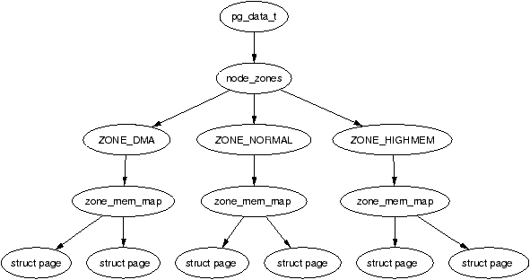

# The Memory Management Subsystem of Linux Kernel

## Describing Physical Memory

This chapter describes the structures used to keep account of memory banks, pages and the flags that affect VM behaviour. 

The first principal concept prevalent in the VM is *Non-Uniform Memory Access (NUMA)*. With large scale machines, memory may be arranged into banks that incur a different cost to access depending on the "distance" from the processor. Each bank is called a *node*, and the concept is represented under Linux by a `struct pglist_data` (typedeffed as `pg_data_t`) even if the aritecture is UMA. Every node in the system is kept on a NULL terminated list call `pgdat_list`, and each node is linked to the next with the field `pg_data_t->node_next`. For UMA architectures like PC desktops, only one static `pg_data_t` structure called `contig_page_data` is used. 

Each node is divided up into a number of blocks called *zones*, which represent ranges within memory. Zones should not be confused with zone based allocators. A zone is described by a `struct zone_struct`, typedeffed to `zone_t` and each one is of type `ZONE_DMA`, `ZONE_NORMAL` or `ZONE_HIGHMEM`(有很多zone, 每一个zone带有一种类型属性). Each zone type suitable a different type of usage. `ZONE_DMA` is memory in the low physical memory ranges with certain ISA devices require. Memory within `ZONE_NORMAL` is directly mapped by the kernel into the upper region of the linear address space, `ZONE_HIGHMEM` is the remaining available memory in the system and it not directlt mapped by the kernel.

With the x86 the zones are:
- `ZONE_DMA`: First 16MiB of memory
- `ZONE_NORMAL`: 16MiB - 896MiB
- `ZONE_HIGHMEM`: 896MiB - End

It is important to note that many kernel operations can only take place using `ZONE_NORMAL`, so it is the most performance critical one. Each physical page frame is represented by a `struct page`, and all the structs are kept in a global `mem_map` array, which is usually stored at the beginning of `ZONE_NORMAL`. 



As the amount of memory directly accessible by the kernel (`ZONE_NORMAL`) is limited in size, Linux supports the concept of *High Memory*. This chapter will discuss how nodes, zones, and pages are represented before introducing high memory management.

### Nodes

When allocating a page, Linux uses a *node-local allocation policy* to allocate memory from the node closest to the running CPU. As processes tend to run on the same CPU, it is likely the memory from the current node will be used. The struct is declared as follows in `<linux/mmzone.h>`:G

```c++
129 typedef struct pglist_data {
130     zone_t node_zones[MAX_NR_ZONES];
131     zonelist_t node_zonelists[GFP_ZONEMASK+1];
132     int nr_zones;
133     struct page *node_mem_map;
134     unsigned long *valid_addr_bitmap;
135     struct bootmem_data *bdata;
136     unsigned long node_start_paddr;
137     unsigned long node_start_mapnr;
138     unsigned long node_size;
139     int node_id;
140     struct pglist_data *node_next;
141 } pg_data_t; 
```

- **node_zones**: The zones for this node, `ZONE_HIGHMEM`, `ZONE_NORMAL`, `ZONE_DMA`.
- **node_zonelists**: This is the order of zones that allocations are preferred from. (分配内存时选择哪一种zone type的优先级顺序).
- **nr_zones**: Number of zones in this node, between 1 and 3. Not all nodes will have three.
- **node_mem_map**: This is the first page of the `struct page` array representing each physical frame in the node.
- **valid_addr_bitmap**: A bitmap which descibes "holes" in the memory node that no memory exists for. Rarely used.
- **bdata**. Only of interest to the boot memory allocator.
- **node_start_paddr**: The starting physical address of the node.
- **node_start_mapnr**: This gives the page offset within the global `mem_map`.
- **node_size**: The total number of pages in this zone.
- **node_id**: The Node ID (NID) of the node, starts at 0.
- **node_next**: Pointer to next node in a NULL terminated list.

### Zones

`struct zone_struct` keeps track of information like page usage statistics, free area information and locks. Tt is declared as follows in `<linux/mmzone.h>`:

```c++
37 typedef struct zone_struct {
41     spinlock_t        lock;
42     unsigned long     free_pages;
43     unsigned long     pages_min, pages_low, pages_high;
44     int               need_balance;
45 
49     free_area_t       free_area[MAX_ORDER];
50 
76     wait_queue_head_t * wait_table;
77     unsigned long     wait_table_size;
78     unsigned long     wait_table_shift;
79 
83     struct pglist_data *zone_pgdat;
84     struct page        *zone_mem_map;
85     unsigned long      zone_start_paddr;
86     unsigned long      zone_start_mapnr;
87 
91     char               *name;
92     unsigned long      size;
93 } zone_t;
```

- **lock**: Spinlock to protect the zone from concurrent accesses.
- **free_pages**: Total number of free pages in the zone.
- **page_min, page_low, page_high**: These are zone watermarks.
- **need_balance**: This flag that tells the pageout **kswapd** to balance the zone. A zone is said to need balance when the number of available pages reaches one of the *zone watermarks*.
- **free_area**: Free area bitmaps used by the buddy allocator.
- **wait_table**: A hash table of wait queues of processes waiting on a page to be freed. While processed could all wait on one queue, this would cause all waiting processes to race for pages still locked when woken up (a thundering herd).
- **wait_table_size**: Number of queues in the hash table, which is a power of 2.
- **zone_pgdat**: Points to the paranet `pg_data_t`.
- **zone_mem_map**: The first page in the global `mem_map` this zone refers to.
- **zone_start_paddr**: Same principle as `node_start_paddr`.
- **zone_start_mapnr**: Same principle as `node_start_mapnr`.
- **name**: The string name of the zone, "DMA", "Normal" or "HighMem".
- **size**: The size of the zone in pages.

#### Zone Watermarks

When available memory in the system is low, the pageout daemon **kswapd** is woken up to start freeing pages. If the pressure is high, the process will free up memory synchronously, sometimes refered to as the *direct-reclaim* path. Each zone has three watermarks called `page_low`, `page_min` and `page_high` which help track how much pressure a zone in under.


- **pages_low**: When `pages_low` number of free pages is reached, **kswapd** is woken up by the buddy allocator to start freeing pages.
- **pages_min**: When `page_min` is reached, the allocator will do the **kswapd** work in a synchronous fasion, sometimes refered to as the *direct-reclaim* path.
- **pages_high**: Once **kswapd** has been woken to start freeing pages, it will not consider the zone to be "balanced" when `pages_high` pages are free. Once the watermark has been reached, **kswapd** will go back to sleep.

#### Zone Wait Queue Table

When IO is being performed on a page, such are during page-in or page-out, it is locked to prevent accessing it with inconsistent data. Processes wishing to use it have to join a wait queue before it can be accessed by calling `wait_on_page()`. When the IO is completed, the page will be unlocked with `UnlockPage()`, and any process waiting on the queue will be woken up. Each page could have a wait queue, but it would be very expensive in terms of memory to have so many separate queues. So instead, thet wait queue is stored in the `zone_t`.

It is possible to have just one wait queue in the zone, but that would mean that all processed waiting on any page in a zone would be woken up when one was unloced. This would cause a serious *thundering herd* problem. Instead, a hash table of wait queues is stored in `zone_t->wait_table`. 

### Zone Initialisation

The zones are initialised after ther kernel page tables have been fully setup. Predictably, each architecture performs this task differently, but the objective is always the same: to determine what parameters to send to either `free_area_init()` for UMA architecture, or `free_area_init_node()` for NUMA. The only parameter required for UMA is `zones_size`. 

### Pages

Every physical page frame in the system has an associated `struct page` which is used to keep track of its status. It is declared as follows in `<linux/mm.h>`:

```c++
152 typedef struct page {
153     struct list_head list;
154     struct address_space *mapping;
155     unsigned long index;
156     struct page *next_hash;
158     atomic_t count;
159     unsigned long flags;
161     struct list_head lru;
163     struct page **pprev_hash;
164     struct buffer_head * buffers;
175
176 #if defined(CONFIG_HIGHMEM) || defined(WANT_PAGE_VIRTUAL)
177     void *virtual;
179 #endif /* CONFIG_HIGMEM || WANT_PAGE_VIRTUAL */
180 } mem_map_t;
```

- **list**: Pages may belong to many lists, and this field us used as the list head.
- **mapping**: When files or devices are memory mapped, their inode has an associated `address_space`. This field will point to this address space of the page belongs to the file.
- **index**: This field has two uses and it depends on the state of the page what it means. 
  - If the page is part of a file mapping, it is the offset within the file.
  - If the page is part of the swap cache, this will be the offset within the `address_space` for the swap address space.
- **next_hash**: Pages that are part of a file mapping are hashed on the inode and offset. This field links pages together that share the same hash bucket.
- **count**: The reference count to the page. If it drops to 0, it may be freed. Any greater and it is in use by one or more processes or is in use by the kernel like when waiting for IO.
- **flags**: These are flags which describes the status of the page. All of them are listed in the following table.
- **lru**: For the page replacement policy, pages that may be swapped out will exist on either the `active_list` or the `inactive_list`. This is the list head for these LRU lists.
- **pprev_hash**: This complement to `next_hash` so that the hash can work as a doubly linked list.
- **buffers**: If a page has buffers for a block device associated with it, this field is used to keep track of the `buffer_head`. An anonymous page mapped by a process may also have an associated `buffer_head` of it is backed by a swap file. This is necessary as the page has to be synced with backing storage in block sized chunks defined by the underlying filesystem.
- **virtual**: Normally only pages from `ZONE_NORMAL` are directly mapped by the kernel. To address pages in `ZONE_HIGHMEM`, `kmap()` is used to map the page for the kernel. There are only a fixed number of pages that may be mapped. When it is mapped, thi is its virtual address.

## Page Table Management

This chapter will begin by describing how the page table is arranged and what types are used to describe the three separate levels of the page table, followed by how a virtual address is broken up into its component parts for navigating the table. Once covered, it will be discussed how the lowest level entry, the *Page Table Entry (PTE)* and what bits are used by the hardware. The initialisation stage is then discussed, which shows how the page tables are initialised during boot strapping. Finally, we will cover how the TLB and CPU caches are utilised.

### Describing the Page Directory

Each process a pointer (`mm_struct->pgd`) to its own *Page Global Directory (PGD)* which is a physical page frame. This frame contains an array of type `pgd_t` which is an architecture specific type defined in `<asm/page.h>`. On the x86, the process page table is loaded by copying `mm_struct->pgd` into the `cr3` register which has the side effect of flushing the TLB. 

Each active entry in the PGD table points to a page frame containing an array of *Page Middle Directory (PMD)* entries of type `pmd_t` which in turns points to the page frames containing *Page Table Entries (PTE)* of type `pte_t`, which finally points to page frames containing the actual user data (三级页表). In the event the page has been swapped out to backing storage, the swap entry is stored in the PTE and used by `do_swap_page()` during page fault, to find the swap entry containing the page data.


Any given linear address may be broken up into parts, to yield offsets within these three table levels, and offset within the actual page. Tp help break up the linear address into its component parts, a number of macros are provided in triplets for each page table level, namely a `SHIFT`, a `SIZE` and a `MASK` macro. The `SHIFT` macros specifies the length in bits that are mapped by each level of the page tables.


The `MASK` values can be ANDd with a linear address to mask out all the upper bits, and is frequently used to determine if a linear address is aligned to a given level within the page table (对齐的时候末尾比特是0). The `SIZE` macros reveal how many bytes are addressed by each entry at each level.


For the calculation of each of the triplets (`SHIFT`, `MASK`, and `SIZE`), only `SHIFT` is important as the other two are calculated based on it. For example, the three macros for page level on the x86 are:

```c++
  5 #define PAGE_SHIFT      12
  6 #define PAGE_SIZE       (1UL << PAGE_SHIFT)
  7 #define PAGE_MASK       (~(PAGE_SIZE-1))
```

`PAGE_SHIFT` is the length in bits of the offset part of the linear address space, which is 12 bits on the x86. The size of a page is easily calculated as 2<sup>`PAGE_SHIFT`</sup>, which is the equivalent of the code above. Finally the mask is calculated as the negation of the bits which make up the `PAGE_SIZE - 1`. If a page needs to be aligned on a page boundary, `PAGE_ALIGN()` is used.

`PMD_SHIFT` is the number of bits in the linear address which are mapped by the second level part of the table. The `PMD_SIZE` and `PMD_MASK` are calculated in a similar way to the page level macros.

`PGDIR_SHIFT` is the number of bits which are mapped by the top, or first level, of the page table. The `PGDIR_SIZE` and `PGDIR_MASK` are calculated in the same manner as above.

### Describing a Page Table Entry

As mentioned, each entry is described by the structs `pte_t`, `pmd_t`, and `pgd_t` for PTEs, PMDs, and PGDs, respectively. Even though these are often just unsigned integers, they are defined as structs. To store the protection bits, `pgprot_t` is defined which holds the relevant flags and is usually stored in the lower bits of a page table entry.

On an x86 with no PAE, the `pte_t` is simply a 32 bit integer within a struct. Each `pte_t` points to an address of a page frame, and all the addresses pointed to are guaranteed to be page aligned. Therefore, there are `PAGE_SHIFT` (12) bits in that 32 bit value that are free for status bits of the page table entry (后面12位一定是0，因为已经对齐). 

- `_PAGE_PRESENT`: Page is resident in memory and not swapped out
- `_PAGE_PROTNONE`: Page is resident but not accessable
- `_PAGE_RW`: Set if the page may be written to
- `_PAGE_USER`: Set if the page is accessible from user space
- `_PAGE_DIRTY`: Set if the page is written to
- `_PAGE_ACCESSED`: Set if the page is accessed

### Using Page Table Entry

To navigate the page directories, three maros are provided which break up a linear address apce into its component parts. `pgd_offset()` takes an address and the `mm_struct` for the process, and returns the PGD entry that covers the requested address. `pmd_offset()` takes a PGD entry and an address, and returns the relevant PMD. `pte_offset()` takes a PMD, and returns the relevant PTE. The remainder of the linear address provided is the offset within the page.

The second round of macros determine if the page table entries are present or may be used.

- `pte_none()`, `pmd_none()` and `pgd_none()` return 1 if the corresponding entry does not exist.
- `pte_present()`, `pmd_present()` and `pgd_present()` return 1 if the corresponding page table entries have the `PRESENT` bit set.
- `pte_clear()`, `pmd_clear()` and `pgd_clear()` will clear the corresponding page table entry.
- `pmd_bad()` and `pdg_bad()` are used to check entries when passed as input parameters to functions that may change the value of the entries. 

### Translating and Setting Page Table Entries

This set of functions and macros deal with the mapping of addresses and pages to PTEs, and the setting of the individual entries. The macro `mk_pte()` takes a `struct page` (描述physical page frame) and protection bits, and combines them together to form the `pte_t` that needs to be inserted into the page table. A similar macro `mk_pte_phys()` exists which takes a physical page address as a parameter. 

The macro `pte_page()` returns the `struct page` which corresponds to the PTE entry. `pmd_page()` returns the `struct page` containing the set of PTEs. 

### Allocating and Freeing Page Tables

The last set of functions deal with the allocation and freeing of page tables. Page tables, as stated, are physical pages containing an array of entries, and the allocation and freeing of physical pages is a relatively expensive operation, both in terms of time and the fact that interrupts are disabled during page allocation. The allocation and deletion of page tables, at any of the three levels, is a very frequent operation, so it is important the operation is as quick as possible.

PGDs, PMDs, and PTEs have two sets of functions, each for the allocation and freeing of page tables. The allocation functions are `pgd_alloc()`, `pmd_alloc()` and `pte_alloc()` respectively, and the free functions are `pgd_free()`, `pmd_free()` and `pte_free()`.

Pages used for the page tables are cached in a number of different lists called *quicklists*. Broadly speaking, the three implement caching with the use of three caches called `pgd_quicklist`, `pmd_quicklist` and `pte_quicklist`. 

### Kernel Page Tables

Each architecture implements the initialisation of page table differently, so only the x86 case will be discussed. The page initialisation is divided into two phases. The bootstrap phase sets up page tables for just *8MiB* so the paging unit can be enabled. The second phase initialises the rest of the page tables.

While all normal kernel code in `vmlinuz` is compiled with the base address at `PAGE_OFFSET + 1MiB`, the kernel is actually loaded beginning at the first megabyte (0x00100000) of memory. The first megabyte is used by some devices for communication with the BIOS and is skipped. The bootstrap code in this file (`vmlinuz`) treats 1MiB as its base address by subtracting `__PAGE_OFFSET` from any address until the paging unit is enabled. So before the paging unit is enabled, a page table mapping has to be established which translates the 8MiB of physical memory to be virtual `PAGE_OFFSET`.

Initialisation begins with statically defining at compile time an array called `swap_pg_dir`, which is placed using linker directives at 0x00101000. It then establishes page table entries for 2 pages, `pg0` and `pg1`. If the processor supports the *Page Size Extension (PSE)* bit, it will be set so that pages will be translated are 4MiB pages, not 4KiB as is the normal case. The first pointers to `pg0` and `pg1` are placed to cover the region `1-9MiB`, and the second pointers to `pg0` and `pg1` are placed at `PAGE_OFFSET+1MiB`. This means that when paging is enabled, they will map to the correct pages using either physical or virtual addressing for just the kernel image. The rest of the kernel page tables will be initialised by `paging_init()` (这个时候kernel已经启动了，后面就可以用kernel的函数建立页表).

Once this mapping has been established, the paging unit is turned on by setting a bit in the `cr0` register, and a jump takes places immediately to ensure the *Instruction Pointer (EIP register)* is correct.

The call graph of `paging_init()` on x86 can be seen as follows:


The function first call `pagetable_init()` to initialise the page tables necessary to reference all physical memory in `ZONE_DMA` and `ZONE_NORMAL`. Remember that high memory in `ZONE_HIGHMEM` cannot be directly referenced and mappings are set up for it temporarily. For each `pgd_t` used by the kernl, the boot memory allocator is called to allocate a page for the PMDs, and the PSE bit will be set if available to use 4MiB TLB entries instead of 4KiB. If the PSE bit is not supported, a page for PTEs will be allocated for each `pmd_t`. If the CPU supports the PGE flag, it also will be set so that the page table entry will be global and visible to all processes.

Next, `pagetable_init()` calls `fixrange_init()` to setup the fixed address space mappings at the end of the virtual address space starting at `FIXADDR_START`. These mappings are used for purposes such as the local APIC and the atomic kmappings between `FIX_KMAP_BEGIN` and `FIX_KMAP_END` required by `kmap_atomic()`. Finally, the function calls `fixrange_init()` to initialise the page table entries required for normal high memory mappings with `kmap()`.

Once `pagetable_init()` returns, the page tables for kernel space are now full initialised, so the static PGD (`swapper_pg_dir`) is loaded into the CR3 register so that the static table is now being used by the paging unit.

The next task of the `paging_init()` is responsible for calling `kmap_init()` to initialise each of the PTEs with the `PAGE_KERNEL` protection flags. The final task is to call `zone_sizes_init()` which initialises all the zone structures used.

### Mapping Addresses to a `struct page`

There is requirement for Linux to have a fast method of mapping virtual addresses to physical addresses, and for mapping `struct page`s to their physical address. Linux achieves this by knowing where the global `mem_map` array is as the global array has pointers to all `struct page`s representing physical memory in the system.

#### Mapping Physical to Virtual Kernel Addresses

Linux sets up a direct mapping from the physical address 0 to the virtual address `PAGE_OFFSET` at 3GiB on the x86. This means that any virtual address can be translated to the physical address by simply subtracting PAGE_OFFSET which is essentially what the function `virt_to_phys()` with the macro `__pa()` does:

```c++
/* from <asm-i386/page.h> */
132 #define __pa(x)                 ((unsigned long)(x)-PAGE_OFFSET)

/* from <asm-i386/io.h> */
 76 static inline unsigned long virt_to_phys(volatile void * address)
 77 {
 78         return __pa(address);
 79 }
```

Obviously the reverse operation involves simply adding `PAGE_OFFSET` which is carried out by the function `phys_to_virt()` with the macro `__va()`. Next we see how this helps the mapping of struct pages to physical addresses.

The kernel image is located at the physical address 1MiB, which of course translates to the virtual address `PAGE_OFFSET + 0x00100000`, and a virtual region totaling about 8MiB is reserved for the image which is the region that can be addressed by two PGDs. This would imply that the first available memory to use is located `at 0xC0800000`, but that is not the case. Linux tries to reserve the first 16MiB of memory for `ZONE_DMA`, so first virtual area used for kernel allocations is actually 0xC1000000. This is where the global `mem_map` is usually located. `ZONE_DMA` will be still get used, but only when absolutely necessary.

Physical addresses are translated to struct pages by *treating them as an index into the `mem_map` array*. Shifting a physical address `PAGE_SHIFT` bits to the right will treat it as a PFN from physical address 0 which is *also* an index within the mem_map array. This is exactly what the macro `virt_to_page()` does which is declared as follows in `<asm-i386/page.h>`:

```c++
#define virt_to_page(kaddr) (mem_map + (__pa(kaddr) >> PAGE_SHIFT))
```

The macro `virt_to_page()` takes the virtual address `kaddr`, converts it to the physical address with `__pa()`, converts it into an array index by bit shifting it right `PAGE_SHIFT` bits, and indexing into the `mem_map` by simply adding them together. No macro is available for converting struct pages to physical addresses but at this stage, it should be obvious to see how it could be calculated.

### Translation Lookaside Buffer (TLB)

Initially, when the processor needs to map a virtual address to a physical address, it must traverse the full page directory searching for the PTE of interest. This would normally imply that each assembly instruction that references memory actually requires several separate memory references for the page table traversal. *To avoid this considerable overhead, architectures take advantage of the fact that most processes exhibit a locality of reference or, in other words, large numbers of memory references tend to be for a small number of pages.* They take advantage of this reference locality by providing a Translation Lookaside Buffer (TLB) which is a small associative memory that caches virtual to physical page table resolutions.

- `void flush_tlb_all(void)`: This flushes the entire TLB on all processors running in the system, making it the most expensive TLB flush operation. After it completes, all modifications to the page tables will be visible globally.
- `void flush_tlb_mm(struct mm_struct *mm)`: This flushes all TLB entries related to the userspace portion (i.e. below `PAGE_OFFSET`) for the requested mm context. In some architectures, such as MIPS, this will need to be performed for all processors but usually it is confined to the local processor. This is only called when an operation has been performed that affects the entire address space.
- `void flush_tlb_range(struct mm_struct *mm, unsigned long start, unsigned long end)`: As the name indicates, this flushes all entries within the requested userspace range for the mm context. This is used after a new region has been moved or changeh as during `mremap()` which moves regions or `mprotect()` which changes the permissions. The function is also indirectly used during unmapping a region with `munmap()` which calls `tlb_finish_mmu()` which tries to use `flush_tlb_range()` intelligently. This API is provided for architectures that can remove ranges of TLB entries quickly rather than iterating with `flush_tlb_page()`.
- `void flush_tlb_page(struct vm_area_struct *vma, unsigned long addr)`: Predictably, this API is responsible for flushing a single page from the TLB. The two most common usage of it is for flushing the TLB after a page has been faulted in or has been paged out.
- `void flush_tlb_pgtables(struct mm_struct *mm, unsigned long start, unsigned long end)`: This API is called with the page tables are being torn down and freed. Some platforms cache the lowest level of the page table, i.e. the actual page frame storing entries, which needs to be flushed when the pages are being deleted. This is called when a region is being unmapped and the page directory entries are being reclaimed.
- `void update_mmu_cache(struct vm_area_struct *vma, unsigned long addr, pte_t pte)`: This API is only called after a page fault completes. It tells the architecture dependant code that a new translation now exists at `pte` for the virtual address `addr`. It is up to each architecture how this information should be used.

### Level 1 CPU Cache Management

As Linux manages the CPU Cache in a very similar fashion to the TLB, this section covers how Linux utilises and manages the CPU cache. CPU caches, like TLB caches, take advantage of the fact that programs tend to exhibit a locality of reference. To avoid having to fetch data from main memory for each reference, the CPU will instead cache very small amounts of data in the CPU cache. Frequently, there is two levels called the Level 1 and Level 2 CPU caches. The Level 2 CPU caches are larger but slower than the L1 cache but Linux only concerns itself with the Level 1 or L1 cache.

*CPU caches are organised into lines*. Each line is typically quite small, usually 32 bytes and each line is aligned to it's boundary size. In other words, *a cache line of 32 bytes will be aligned on a 32 byte address*. With Linux, the size of the line is `L1_CACHE_BYTES` which is defined by each architecture.

How addresses are mapped to cache lines vary between architectures but the mappings come under three headings, *direct mapping*, *associative mapping* and *set associative mapping*. Direct mapping is the simpliest approach where each block of memory maps to only one possible cache line. With associative mapping, any block of memory can map to any cache line. Set associative mapping is a hybrid approach where any block of memory can may to any line but only within a subset of the available lines. Regardless of the mapping scheme, they each have one thing in common: *addresses that are close together and aligned to the cache size are likely to use different lines*. Hence Linux employs simple tricks to try and maximise cache usage:

- Frequently accessed structure fields are at the start of the structure to increase the chance that only one line is needed to address the common fields;
- Unrelated items in a structure should try to be at least cache size bytes apart to avoid false sharing between CPUs;
- Objects in the general caches, such as the mm_struct cache, are aligned to the L1 CPU cache to avoid false sharing.

If the CPU references an address that is not in the cache, a *cache miss* occurs and the data is fetched from main memory. The cost of cache misses is quite high, as a reference to cache can typically be performed in less than 10ns where a reference to main memory typically will cost between 100ns and 200ns. The basic objective is then to have as many cache hits and as few cache misses as possible.

- `void flush_cache_all(void)`: This flushes the entire CPU cache system making it the most severe flush operation to use. It is used when changes to the kernel page tables, which are global in nature, are to be performed.
- `void flush_cache_mm(struct mm_struct mm)`: This flushes all entires related to the address space. On completion, no cache lines will be associated with `mm`.
- `void flush_cache_range(struct mm_struct *mm, unsigned long start, unsigned long end)`: This flushes lines related to a range of addresses in the address space. Like it's TLB equivilant, it is provided in case the architecture has an efficent way of flushing ranges instead of flushing each individual page.
- `void flush_cache_page(struct vm_area_struct *vma, unsigned long vmaddr)`: This is for flushing a single page sized region. The VMA is supplied as the `mm_struct` is easily accessible via `vma->vm_mm`. Additionally, by testing for the `VM_EXEC` flag, the architecture will know if the region is executable for caches that separate the instructions and data caches. 
 
It does not end there though. A second set of interfaces is required to avoid virtual aliasing problems. The problem is that some CPUs select lines based on the virtual address, meaning that one physical address can exist on multiple lines, leading to cache coherency problems. Architectures with this problem may try and ensure that shared mappings will only use addresses as a stop-gap measure (权宜之计).

- `void flush_dcache_page(struct page *page)`: This function is called when the kernel writes to or copies from a page cache page as these are likely to be mapped by multiple processes.
- `void flush_icache_range(unsigned long address, unsigned long endaddr)`: This is called when the kernel stores information in addresses that is likely to be executed, such as when a kernel module has been loaded.
- `void flush_icache_user_range(struct vm_area_struct *vma, struct page *page, unsigned long addr, int len)`: This is similar to `flush_icache_range()` except it is called when a userspace range is affected. Currently, this is only used for `ptrace()` (used when debugging) when the address space is being accessed by access_process_vm().
- `void flush_icache_page(struct vm_area_struct *vma, struct page *page)`: This is called when a page-cache page is about to be mapped. It is up to the architecture to use the VMA flags to determine whether the I-Cache or D-Cache should be flushed.