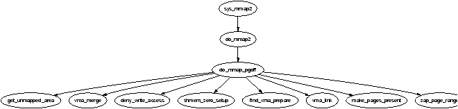
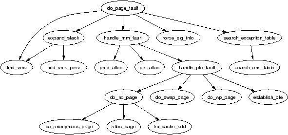
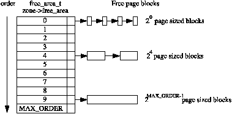

# The Memory Management Subsystem of Linux Kernel

- [The Memory Management Subsystem of Linux Kernel](#the-memory-management-subsystem-of-linux-kernel)
  - [Describing Physical Memory](#describing-physical-memory)
    - [Nodes](#nodes)
    - [Zones](#zones)
      - [Zone Watermarks](#zone-watermarks)
      - [Zone Wait Queue Table](#zone-wait-queue-table)
    - [Zone initialization](#zone-initialization)
      - [initializing mem_map](#initializing-mem_map)
    - [Pages](#pages)
  - [Page Table Management](#page-table-management)
    - [Describing the Page Directory](#describing-the-page-directory)
    - [Describing a Page Table Entry](#describing-a-page-table-entry)
    - [Using Page Table Entry](#using-page-table-entry)
    - [Translating and Setting Page Table Entries](#translating-and-setting-page-table-entries)
    - [Allocating and Freeing Page Tables](#allocating-and-freeing-page-tables)
    - [Kernel Page Tables](#kernel-page-tables)
    - [Mapping Addresses to a struct page](#mapping-addresses-to-a-struct-page)
      - [Mapping Physical to Virtual Kernel Addresses](#mapping-physical-to-virtual-kernel-addresses)
    - [Translation Lookaside Buffer (TLB)](#translation-lookaside-buffer-tlb)
    - [Level 1 CPU Cache Management](#level-1-cpu-cache-management)
  - [Process Address Space](#process-address-space)
    - [Linear Address Space](#linear-address-space)
    - [Managing the Address Space](#managing-the-address-space)
    - [Process Address Space Descriptor](#process-address-space-descriptor)
      - [Allocating a Descriptor](#allocating-a-descriptor)
    - [Memory Region](#memory-region)
      - [Memory Region Operations](#memory-region-operations)
      - [File/Device backed memory regions](#filedevice-backed-memory-regions)
      - [Creating A Memory Region](#creating-a-memory-region)
      - [Finding a Mapped Memory Region](#finding-a-mapped-memory-region)
      - [Finding a Free Memory Region](#finding-a-free-memory-region)
      - [Inserting a memory region](#inserting-a-memory-region)
      - [Merging Contiguous Regions](#merging-contiguous-regions)
      - [Remapping and Moving a Memory Region](#remapping-and-moving-a-memory-region)
      - [Locking a Memory Region](#locking-a-memory-region)
      - [Unlocking the Region](#unlocking-the-region)
      - [Fixing up Regions After Locking](#fixing-up-regions-after-locking)
      - [Deleting a Memory Region](#deleting-a-memory-region)
      - [Deleting All Memory Regions](#deleting-all-memory-regions)
    - [Exception Handling](#exception-handling)
    - [Page Faulting](#page-faulting)
      - [Handling a Page Fault](#handling-a-page-fault)
      - [Demand Allocation](#demand-allocation)
        - [Handling anonymous pages](#handling-anonymous-pages)
        - [Handling file/device backed pages](#handling-filedevice-backed-pages)
      - [Demand Paging](#demand-paging)
      - [Copy On Write (COW) Pages](#copy-on-write-cow-pages)
    - [Copying To/From Userspace](#copying-tofrom-userspace)
  - [Physical Page Allocation](#physical-page-allocation)
    - [Managing Free Blocks](#managing-free-blocks)
    - [Allocating Pages](#allocating-pages)
    - [Free Pages](#free-pages)
    - [Get Free Page (GFP) Flags](#get-free-page-gfp-flags)
      - [Process Flags](#process-flags)
    - [Avoiding Fragmentation](#avoiding-fragmentation)
  - [Non-Contiguous Memory Allocation](#non-contiguous-memory-allocation)
    - [Describing Virtual Memory Areas](#describing-virtual-memory-areas)
    - [Allocating A Non-Contiguous Are](#allocating-a-non-contiguous-are)
    - [Freeing A Non-Contiguous Are](#freeing-a-non-contiguous-are)
  - [Slab Allocator](#slab-allocator)
    - [Caches](#caches)
      - [Cache Descriptor](#cache-descriptor)
      - [Cache Static Flags](#cache-static-flags)
      - [Cache Dynamic Flags](#cache-dynamic-flags)
      - [Cache Allocation Flags](#cache-allocation-flags)
      - [Cache Colouring](#cache-colouring)
      - [Cache Creation](#cache-creation)
      - [Cache Reaping](#cache-reaping)
      - [Cache Shrinking](#cache-shrinking)
      - [Cache Destroying](#cache-destroying)
    - [Slabs](#slabs)
      - [Storing the Slab Descriptor](#storing-the-slab-descriptor)
      - [Slab Creation](#slab-creation)
      - [Tracking Free Objects](#tracking-free-objects)
      - [Initialising the kmem_bufctl_t Array](#initialising-the-kmem_bufctl_t-array)
      - [Finding the Next Free Object](#finding-the-next-free-object)
      - [Updating kmem_bufctl_t](#updating-kmem_bufctl_t)
      - [Calculating the Number of Objects on a Slab](#calculating-the-number-of-objects-on-a-slab)
      - [Slab Destroying](#slab-destroying)
    - [Objects](#objects)
      - [Initialising Objects in a Slab](#initialising-objects-in-a-slab)
      - [Object Allocation](#object-allocation)
      - [Object Freeing](#object-freeing)
    - [Sizes Cache](#sizes-cache)
      - [kmalloc()](#kmalloc)
      - [kfree()](#kfree)
    - [Per-CPU Object Cache](#per-cpu-object-cache)
      - [Describing the Per-CPU Object Cache](#describing-the-per-cpu-object-cache)
      - [Adding/Removing Objects from the Per-CPU Cache](#addingremoving-objects-from-the-per-cpu-cache)
      - [Enabling Per-CPU Caches](#enabling-per-cpu-caches)
      - [Updating Per-CPU Information](#updating-per-cpu-information)
      - [Draining a Per-CPU Cache](#draining-a-per-cpu-cache)
    - [Slab Allocator Initialisation](#slab-allocator-initialisation)
    - [Interfacing with the Buddy Allocator](#interfacing-with-the-buddy-allocator)

## Describing Physical Memory

This chapter describes the structures used to keep account of memory banks, pages and the flags that affect VM behavior. 

The first principal concept prevalent in the VM is *Non-Uniform Memory Access (NUMA)*. With large scale machines, memory may be arranged into banks that incur a different cost to access depending on the "distance" from the processor. Each bank is called a *node*, and the concept is represented under Linux by a `struct pglist_data` (typedeffed as `pg_data_t`) even if the architecture is UMA. *Every node in the system is kept on a NULL terminated list call `pgdat_list`*, and each node is linked to the next with the field `pg_data_t->node_next`. For UMA architectures like PC desktops, only one static `pg_data_t` structure called `contig_page_data` is used. 

Each node is divided up into a number of blocks called *zones*, which represent ranges within memory. Zones should not be confused with zone based allocators. *A zone is described by a `struct zone_struct`, typedeffed to `zone_t` and each one is of type `ZONE_DMA`, `ZONE_NORMAL` or `ZONE_HIGHMEM`*. Each zone type suitable a different type of usage. `ZONE_DMA` is memory in the low physical memory ranges with certain ISA devices require. Memory within `ZONE_NORMAL` is directly mapped by the kernel into the upper region of the linear address (virtual address space), `ZONE_HIGHMEM` is the remaining available memory in the system and it not directly mapped by the kernel.

With the x86 the zones are:
- `ZONE_DMA`: First 16MiB of memory
- `ZONE_NORMAL`: 16MiB - 896MiB
- `ZONE_HIGHMEM`: 896MiB - End

It is important to note that many kernel operations can only take place using `ZONE_NORMAL`, so it is the most performance critical one. *Each physical page frame is represented by a `struct page`, and all the structs are kept in a global `mem_map` array*, which is usually stored at the beginning of `ZONE_NORMAL`. 注意`mem_map`是全局的，即使对NUMA系统也只有一个全局数组.


As the amount of memory directly accessible by the kernel (`ZONE_NORMAL`) is limited in size, Linux supports the concept of *High Memory*. This chapter will discuss how nodes, zones, and pages are represented before introducing high memory management.

### Nodes

When allocating a page, Linux uses a *node-local allocation policy* to allocate memory from the node closest to the running CPU. As processes tend to run on the same CPU, it is likely the memory from the current node will be used. The struct is declared as follows in `<linux/mmzone.h>`:

```c++
129 typedef struct pglist_data {
130     zone_t node_zones[MAX_NR_ZONES];
131     zonelist_t node_zonelists[GFP_ZONEMASK+1];
132     int nr_zones;
133     struct page *node_mem_map;
134     unsigned long *valid_addr_bitmap;
135     struct bootmem_data *bdata;
136     unsigned long node_start_paddr;
137     unsigned long node_start_mapnr;
138     unsigned long node_size;
139     int node_id;
140     struct pglist_data *node_next;
141 } pg_data_t; 
```

- **node_zones**: The zones for this node, `ZONE_HIGHMEM`, `ZONE_NORMAL`, `ZONE_DMA`.
- **node_zonelists**: This is the order of zones that allocations are preferred from. (分配内存时选择哪一种zone type的优先级顺序).
- **nr_zones**: Number of zones in this node, between 1 and 3. Not all nodes will have three.
- **node_mem_map**: This is the first page of the `struct page` array representing each physical frame in the node.
- **valid_addr_bitmap**: A bitmap which describes "holes" in the memory node that no memory exists for. Rarely used.
- **bdata**. Only of interest to the boot memory allocator.
- **node_start_paddr**: The starting physical address of the node.
- **node_start_mapnr**: This gives the page offset within the global `mem_map`.
- **node_size**: The total number of pages in this zone.
- **node_id**: The Node ID (NID) of the node, starts at 0.
- **node_next**: Pointer to next node in a NULL terminated list.

### Zones

`struct zone_struct` keeps track of information like page usage statistics, free area information and locks. Tt is declared as follows in `<linux/mmzone.h>`:

```c++
37 typedef struct zone_struct {
41     spinlock_t        lock;
42     unsigned long     free_pages;
43     unsigned long     pages_min, pages_low, pages_high;
44     int               need_balance;
45 
49     free_area_t       free_area[MAX_ORDER];
50 
76     wait_queue_head_t * wait_table;
77     unsigned long     wait_table_size;
78     unsigned long     wait_table_shift;
79 
83     struct pglist_data *zone_pgdat;
84     struct page        *zone_mem_map;
85     unsigned long      zone_start_paddr;
86     unsigned long      zone_start_mapnr;
87 
91     char               *name;
92     unsigned long      size;
93 } zone_t;
```

- **lock**: Spinlock to protect the zone from concurrent accesses.
- **free_pages**: Total number of free pages in the zone.
- **page_min, page_low, page_high**: These are zone watermarks.
- **need_balance**: This flag that tells the pageout **kswapd** to balance the zone. A zone is said to need balance when the number of available pages reaches one of the *zone watermarks*.
- **free_area**: Free area bitmaps used by the buddy allocator.
- **wait_table**: A hash table of wait queues of processes waiting on a page to be freed. While processed could all wait on one queue, this would cause all waiting processes to race for pages still locked when woken up (a thundering herd).
- **wait_table_size**: Number of queues in the hash table, which is a power of 2.
- **zone_pgdat**: Points to the parent `pg_data_t`.
- **zone_mem_map**: The first page in the global `mem_map` this zone refers to.
- **zone_start_paddr**: Same principle as `node_start_paddr`.
- **zone_start_mapnr**: Same principle as `node_start_mapnr`.
- **name**: The string name of the zone, "DMA", "Normal" or "HighMem".
- **size**: The size of the zone in pages.

#### Zone Watermarks

When available memory in the system is low, the pageout daemon **kswapd** is woken up to start freeing pages. If the pressure is high, the process will free up memory synchronously, sometimes referred to as the *direct-reclaim* path. Each zone has three watermarks called `page_low`, `page_min` and `page_high` which help track how much pressure a zone in under.


- **pages_low**: When `pages_low` number of free pages is reached, **kswapd** is woken up by the buddy allocator to start freeing pages.
- **pages_min**: When `page_min` is reached, the allocator will do the **kswapd** work in a synchronous fashion, sometimes refereed to as the *direct-reclaim* path.
- **pages_high**: Once **kswapd** has been woken to start freeing pages, it will not consider the zone to be "balanced" until `pages_high` pages are free. Once the watermark has been reached, **kswapd** will go back to sleep.

#### Zone Wait Queue Table

*When IO is being performed on a page, such are during page-in or page-out, it is locked to prevent accessing it with inconsistent data.* Processes wishing to use it have to join a wait queue before it can be accessed by calling `wait_on_page()`. When the IO is completed, the page will be unlocked with `UnlockPage()`, and any process waiting on the queue will be woken up. Each page could have a wait queue, but it would be very expensive in terms of memory to have so many separate queues. So instead, the wait queue is stored in the `zone_t`.

It is possible to have just one wait queue in the zone, but that would mean that all processed waiting on any page in a zone would be woken up when one was unlocked. This would cause a serious *thundering herd* problem. Instead, a hash table of wait queues is stored in `zone_t->wait_table`. 

### Zone initialization

*The zones are initialized after the kernel page tables have been fully setup*. Predictably, each architecture performs this task differently, but the objective is always the same: *to determine what parameters to send to* either `free_area_init()` for UMA architecture, or `free_area_init_node()` for NUMA. The only parameter required for UMA is `zones_size`. 

- **nid** is the Node ID which is the logical identifier of the node whose zones are being initialized;
- **pgdat** is the node's `pg_data_t` that is being initialized. In UMA, this will simply be `contig_page_data`;
- **pmap** is set later by `free_area_init_core()` to point to the beginning of the local `lmem_map` array allocated for the node. In NUMA, this is ignored as NUMA treats `mem_map` as a virtual array starting at `PAGE_OFFSET`. In UMA, this pointer is the global `mem_map` variable which is now `mem_map` gets initialized in UMA.
- **zones_sizes** is an array containing the size of each zone in pages;
- **zone_start_paddr** is the starting physical address for the first zone;
- **zone_holes** is an array containing the total size of memory holes in the zones;

It is the core function `free_area_init_core()` which is responsible for filling in each `zone_t` with the relevant information and the allocation of the `mem_map` array for the node. Note that information on what pages are free for the zones is not determined at this point. That information is not known until the boot memory allocator is being retired.

#### initializing mem_map

The `mem_map` area is created during system startup in one of two fashions. On NUMA systems, the global `mem_map` is treated as a virtual array starting at `PAGE_OFFSET`. `free_area_init_node()` is called for each active node in the system, which *allocates the portion of this array for the node being initialized*. On UMA systems, `free_area_init()` uses `contig_page_data` as the node and the global `mem_map` as the "local" `mem_map` for this node. The callgraph for both functions is shown in the following figure.


The core function `free_area_init_core()` allocates a local `lmem_map` ("l" for local) for the node being initialized. The memory for the array is allocated from the boot memory allocator with `alloc_bootmem_node()`. With UMA architectures, this newly allocated memory becomes the global `mem_map` but it is slightly different for NUMA.

NUMA architectures allocate the memory for `lmem_map` within their own memory node. The global `mem_map` never gets explicitly allocated but instead is set to `PAGE_OFFSET` where it is treated as a virtual array. The address of the local map is stored in `pg_data_t->node_mem_map` which exists somewhere within the virtual `mem_map`. For each zone that exists in the node, the address within the virtual `mem_map` for the zone is stored in `zone_t->zone_mem_map`. All the rest of the code then treats `mem_map` as a real array as only valid regions within it will be used by nodes.

### Pages

*Every physical page frame in the system has an associated `struct page` which is used to keep track of its status*. It is declared as follows in `<linux/mm.h>`:

```c++
152 typedef struct page {
153     struct list_head list;
154     struct address_space *mapping;
155     unsigned long index;
156     struct page *next_hash;
158     atomic_t count;
159     unsigned long flags;
161     struct list_head lru;
163     struct page **pprev_hash;
164     struct buffer_head * buffers;
175
176 #if defined(CONFIG_HIGHMEM) || defined(WANT_PAGE_VIRTUAL)
177     void *virtual;
179 #endif /* CONFIG_HIGMEM || WANT_PAGE_VIRTUAL */
180 } mem_map_t;
```

- **list**: Pages may belong to many lists, and this field is used as the list head.
- **mapping**: When files or devices are memory mapped, their inode has an associated `address_space`. This field will point to this address space of the page belongs to the file.
- **index**: This field has two uses and it depends on the state of the page what it means. 
  - If the page is part of a file mapping, it is the offset within the file.
  - If the page is part of the swap cache, this will be the offset within the `address_space` for the swap address space.
- **next_hash**: Pages that are part of a file mapping are hashed on the inode and offset. This field links pages together that share the same hash bucket.
- **count**: The reference count to the page. *If it drops to 0, it may be freed*. Any greater and it is in use by one or more processes or is in use by the kernel like when waiting for IO.
- **flags**: These are flags which describes the status of the page. All of them are listed in the following table.
- **lru**: For the page replacement policy, pages that may be swapped out will exist on either the `active_list` or the `inactive_list`. This is the list head for these LRU lists.
- **pprev_hash**: This complement to `next_hash` so that the hash can work as a doubly linked list.
- **buffers**: If a page has buffers for a block device associated with it, this field is used to keep track of the `buffer_head`. An anonymous page mapped by a process may also have an associated `buffer_head` of it is backed by a swap file. This is necessary as the page has to be synced with backing storage in block sized chunks defined by the underlying filesystem.
- **virtual**: Normally only pages from `ZONE_NORMAL` are directly mapped by the kernel. To address pages in `ZONE_HIGHMEM`, `kmap()` is used to map the page for the kernel. There are only a fixed number of pages that may be mapped. When it is mapped, this is its virtual address.

Bit name and its description:

- `PG_active`:	This bit is set if a page is on the `active_list` LRU and cleared when it is removed. It marks a page as being hot
- `PG_arch_1`:	Quoting directly from the code: `PG_arch_1` is an architecture specific page state bit. The generic code guarantees that this bit is cleared for a page when it first is entered into the page cache. This allows an architecture to defer the flushing of the D-Cache until the page is mapped by a process
- `PG_checked`:	Only used by the Ext2 filesystem
- `PG_dirty`:	This indicates if a page needs to be flushed to disk. When a page is written to that is backed by disk, it is not flushed immediately, this bit is needed to ensure a dirty page is not freed before it is written out
- `PG_error`:	If an error occurs during disk I/O, this bit is set
- `PG_fs_1`:	Bit reserved for a filesystem to use for it's own purposes. Currently, only NFS uses it to indicate if a page is in sync with the remote server or not
- `PG_highmem`:	Pages in high memory cannot be mapped permanently by the kernel. Pages that are in high memory are flagged with this bit during `mem_init()`
- `PG_launder`:	This bit is important only to the page replacement policy. When the VM wants to swap out a page, it will set this bit and call the `writepage()` function. When scanning, if it encounters a page with this bit and PG_locked set, it will wait for the I/O to complete
- `PG_locked`:	This bit is set when the page must be locked in memory for disk I/O. When I/O starts, this bit is set and released when it completes 
-  `PG_lru`:	If a page is on either the `active_list` or the `inactive_list`, this bit will be set
- `PG_referenced`:	If a page is mapped and it is referenced through the mapping, index hash table, this bit is set. It is used during page replacement for moving the page around the LRU lists
- `PG_reserved`:	This is set for pages that can never be swapped out. It is set by the boot memory allocator for pages allocated during system startup. Later it is used to flag empty pages or ones that do not even exist
- `PG_slab`:	This will flag a page as being used by the slab allocator
- `PG_skip`:	Used by some architectures to skip over parts of the address space with no backing physical memory
- `PG_unused`:	This bit is literally unused
- `PG_uptodate`:	When a page is read from disk without error, this bit will be set.

## Page Table Management

This chapter will begin by describing how the page table is arranged and what types are used to describe the three separate levels of the page table, followed by how a virtual address is broken up into its component parts for navigating the table. Once covered, it will be discussed how the lowest level entry, the *Page Table Entry (PTE)* and what bits are used by the hardware. The initialization stage is then discussed, which shows how the page tables are initialized during boot strapping. Finally, we will cover how the TLB and CPU caches are utilized.

### Describing the Page Directory

Each process a pointer (`mm_struct->pgd`) to its own *Page Global Directory (PGD)* which is a physical page frame. This frame contains an array of type `pgd_t` which is an architecture specific type defined in `<asm/page.h>`. On the x86, the process page table is loaded by copying `mm_struct->pgd` into the `cr3` register which has the side effect of flushing the TLB. 

Each active entry in the PGD table points to a page frame containing an array of *Page Middle Directory (PMD)* entries of type `pmd_t`, which in turns points to the page frames containing *Page Table Entries (PTE)* of type `pte_t`, which finally points to page frames containing the actual user data (三级页表). In the event the page has been swapped out to backing storage, the swap entry is stored in the PTE and used by `do_swap_page()` during page fault, to find the swap entry containing the page data.


Any given linear address may be broken up into parts, to yield offsets within these three table levels, and offset within the actual page. To help break up the linear address into its component parts, a number of macros are provided in triplets for each page table level, namely a `SHIFT`, a `SIZE` and a `MASK` macro. The `SHIFT` macros specifies the length in bits that are mapped by each level of the page tables.


The `MASK` values can be ANDd with a linear address to mask out all the upper bits, and is frequently used to determine if a linear address is aligned to a given level within the page table (对齐的时候末尾比特是0). The `SIZE` macros reveal how many bytes are addressed by each entry at each level (表示了多少个地址).


For the calculation of each of the triplets (`SHIFT`, `MASK`, and `SIZE`), only `SHIFT` is important as the other two are calculated based on it. For example, the three macros for page level on the x86 are:

```c++
  5 #define PAGE_SHIFT      12
  6 #define PAGE_SIZE       (1UL << PAGE_SHIFT)
  7 #define PAGE_MASK       (~(PAGE_SIZE-1))
```

`PAGE_SHIFT` is the length in bits of the offset part of the linear address space, which is 12 bits on the x86. The size of a page is easily calculated as 2<sup>`PAGE_SHIFT`</sup>, which is the equivalent of the code above. Finally the mask is calculated as the negation of the bits which make up the `PAGE_SIZE - 1`. If a page needs to be aligned on a page boundary, `PAGE_ALIGN()` is used.

`PMD_SHIFT` is the number of bits in the linear address which are mapped by the second level part of the table. The `PMD_SIZE` and `PMD_MASK` are calculated in a similar way to the page level macros.

`PGDIR_SHIFT` is the number of bits which are mapped by the top, or first level, of the page table. The `PGDIR_SIZE` and `PGDIR_MASK` are calculated in the same manner as above.

### Describing a Page Table Entry

As mentioned, each entry is described by the structs `pte_t`, `pmd_t`, and `pgd_t` for PTEs, PMDs, and PGDs, respectively. Even though these are often just unsigned integers, they are defined as structs. To store the protection bits, `pgprot_t` is defined which holds the relevant flags and is usually stored in the lower bits of a page table entry.

On an x86 with no PAE, the `pte_t` is simply a 32 bit integer within a struct. Each `pte_t` points to an address of a page frame, and all the addresses pointed to are guaranteed to be page aligned. Therefore, there are `PAGE_SHIFT` (12) bits in that 32 bit value that are free for status bits of the page table entry (后面12位一定是0，因为已经对齐). 

- `_PAGE_PRESENT`: Page is resident in memory and not swapped out
- `_PAGE_PROTNONE`: Page is resident but not accessible
- `_PAGE_RW`: Set if the page may be written to
- `_PAGE_USER`: Set if the page is accessible from user space
- `_PAGE_DIRTY`: Set if the page is written to
- `_PAGE_ACCESSED`: Set if the page is accessed

### Using Page Table Entry

To navigate the page directories, three macros are provided which break up a linear address space into its component parts. `pgd_offset()` takes an address and the `mm_struct` for the process, and returns the PGD entry that covers the requested address. `pmd_offset()` takes a PGD entry and an address, and returns the relevant PMD. `pte_offset()` takes a PMD, and returns the relevant PTE. The remainder of the linear address provided is the offset within the page.

The second round of macros determine if the page table entries are present or may be used.

- `pte_none()`, `pmd_none()` and `pgd_none()` return 1 if the corresponding entry does not exist.
- `pte_present()`, `pmd_present()` and `pgd_present()` return 1 if the corresponding page table entries have the `PRESENT` bit set.
- `pte_clear()`, `pmd_clear()` and `pgd_clear()` will clear the corresponding page table entry.
- `pmd_bad()` and `pdg_bad()` are used to check entries when passed as input parameters to functions that may change the value of the entries. 

### Translating and Setting Page Table Entries

This set of functions and macros deal with the mapping of addresses and pages to PTEs, and the setting of the individual entries. The macro `mk_pte()` takes a `struct page` (描述physical page frame) and protection bits, and combines them together to form the `pte_t` that needs to be inserted into the page table. A similar macro `mk_pte_phys()` exists which takes a physical page address as a parameter. 

The macro `pte_page()` returns the `struct page` which corresponds to the PTE entry. `pmd_page()` returns the `struct page` containing the set of PTEs. 

### Allocating and Freeing Page Tables

The last set of functions deal with the allocation and freeing of page tables. Page tables, as stated, are physical pages containing an array of entries, and the allocation and freeing of physical pages is a relatively expensive operation, both in terms of time and the fact that interrupts are disabled during page allocation. The allocation and deletion of page tables, at any of the three levels, is a very frequent operation, so it is important the operation is as quick as possible.

PGDs, PMDs, and PTEs have two sets of functions, each for the allocation and freeing of page tables. The allocation functions are `pgd_alloc()`, `pmd_alloc()` and `pte_alloc()` respectively, and the free functions are `pgd_free()`, `pmd_free()` and `pte_free()`.

Pages used for the page tables are cached in a number of different lists called *quicklists*. Broadly speaking, the three implement caching with the use of three caches called `pgd_quicklist`, `pmd_quicklist` and `pte_quicklist`. 

### Kernel Page Tables

Each architecture implements the initialization of page table differently, so only the x86 case will be discussed. The page initialization is divided into two phases. The bootstrap phase sets up page tables for just *8MiB* so the paging unit can be enabled. The second phase initializes the rest of the page tables.

While all normal kernel code in `vmlinuz` is compiled with the base address at `PAGE_OFFSET + 1MiB`, the kernel is actually loaded beginning at the first megabyte (0x00100000) of memory. The first megabyte is used by some devices for communication with the BIOS and is skipped. The bootstrap code in this file (`vmlinuz`) treats 1MiB as its base address by subtracting `__PAGE_OFFSET` from any address until the paging unit is enabled. So before the paging unit is enabled, a page table mapping has to be established which translates the 8MiB of physical memory to be virtual `PAGE_OFFSET`.

initialization begins with statically defining at compile time an array called `swap_pg_dir`, which is placed using linker directives at 0x00101000. It then establishes page table entries for 2 pages, `pg0` and `pg1`. If the processor supports the *Page Size Extension (PSE)* bit, it will be set so that pages will be translated are 4MiB pages, not 4KiB as is the normal case. The first pointers to `pg0` and `pg1` are placed to cover the region `1-9MiB`, and the second pointers to `pg0` and `pg1` are placed at `PAGE_OFFSET+1MiB`. This means that when paging is enabled, they will map to the correct pages using either physical or virtual addressing for just the kernel image. The rest of the kernel page tables will be initialized by `paging_init()` (这个时候kernel已经启动了，后面就可以用kernel的函数建立页表).

Once this mapping has been established, the paging unit is turned on by setting a bit in the `cr0` register, and a jump takes places immediately to ensure the *Instruction Pointer (EIP register)* is correct.

The call graph of `paging_init()` on x86 can be seen as follows:


The function first call `pagetable_init()` to initialize the page tables necessary to reference all physical memory in `ZONE_DMA` and `ZONE_NORMAL`. Remember that high memory in `ZONE_HIGHMEM` cannot be directly referenced and mappings are set up for it temporarily. For each `pgd_t` used by the kernel, the boot memory allocator is called to allocate a page for the PMDs, and the PSE bit will be set if available to use 4MiB TLB entries instead of 4KiB. If the PSE bit is not supported, a page for PTEs will be allocated for each `pmd_t`. If the CPU supports the PGE flag, it also will be set so that the page table entry will be global and visible to all processes.

Next, `pagetable_init()` calls `fixrange_init()` to setup the fixed address space mappings at the end of the virtual address space starting at `FIXADDR_START`. These mappings are used for purposes such as the local APIC and the atomic kmappings between `FIX_KMAP_BEGIN` and `FIX_KMAP_END` required by `kmap_atomic()`. Finally, the function calls `fixrange_init()` to initialize the page table entries required for normal high memory mappings with `kmap()`.

Once `pagetable_init()` returns, the page tables for kernel space are now full initialized, so the static PGD (`swapper_pg_dir`) is loaded into the CR3 register so that the static table is now being used by the paging unit.

The next task of the `paging_init()` is responsible for calling `kmap_init()` to initialize each of the PTEs with the `PAGE_KERNEL` protection flags. The final task is to call `zone_sizes_init()` which initializes all the zone structures used.

### Mapping Addresses to a struct page

There is requirement for Linux to have a fast method of mapping virtual addresses to physical addresses, and for mapping `struct page`s to their physical address. Linux achieves this by knowing where the global `mem_map` array is as the global array has pointers to all `struct page`s representing physical memory in the system.

#### Mapping Physical to Virtual Kernel Addresses

Linux sets up a direct mapping from the physical address 0 to the virtual address `PAGE_OFFSET` at 3GiB on the x86. This means that any virtual address can be translated to the physical address by simply subtracting PAGE_OFFSET which is essentially what the function `virt_to_phys()` with the macro `__pa()` does:

```c++
/* from <asm-i386/page.h> */
132 #define __pa(x)                 ((unsigned long)(x)-PAGE_OFFSET)

/* from <asm-i386/io.h> */
 76 static inline unsigned long virt_to_phys(volatile void * address)
 77 {
 78         return __pa(address);
 79 }
```

Obviously the reverse operation involves simply adding `PAGE_OFFSET` which is carried out by the function `phys_to_virt()` with the macro `__va()`. Next we see how this helps the mapping of struct pages to physical addresses.

The kernel image is located at the physical address 1MiB, which of course translates to the virtual address `PAGE_OFFSET + 0x00100000`, and a virtual region totaling about 8MiB is reserved for the image which is the region that can be addressed by two PGDs. This would imply that the first available memory to use is located `at 0xC0800000`, but that is not the case. Linux tries to reserve the first 16MiB of memory for `ZONE_DMA`, so first virtual area used for kernel allocations is actually 0xC1000000. This is where the global `mem_map` is usually located. `ZONE_DMA` will be still get used, but only when absolutely necessary.

Physical addresses are translated to struct pages by *treating them as an index into the `mem_map` array*. Shifting a physical address `PAGE_SHIFT` bits to the right will treat it as a PFN from physical address 0 which is *also* an index within the mem_map array. This is exactly what the macro `virt_to_page()` does which is declared as follows in `<asm-i386/page.h>`:

```c++
#define virt_to_page(kaddr) (mem_map + (__pa(kaddr) >> PAGE_SHIFT))
```

The macro `virt_to_page()` takes the virtual address `kaddr`, converts it to the physical address with `__pa()`, converts it into an array index by bit shifting it right `PAGE_SHIFT` bits, and indexing into the `mem_map` by simply adding them together. No macro is available for converting struct pages to physical addresses but at this stage, it should be obvious to see how it could be calculated.

### Translation Lookaside Buffer (TLB)

Initially, when the processor needs to map a virtual address to a physical address, it must traverse the full page directory searching for the PTE of interest. This would normally imply that each assembly instruction that references memory actually requires several separate memory references for the page table traversal. *To avoid this considerable overhead, architectures take advantage of the fact that most processes exhibit a locality of reference or, in other words, large numbers of memory references tend to be for a small number of pages.* They take advantage of this reference locality by providing a Translation Lookaside Buffer (TLB) which is a small associative memory that caches virtual to physical page table resolutions.

- `void flush_tlb_all(void)`: This flushes the entire TLB on all processors running in the system, making it the most expensive TLB flush operation. After it completes, all modifications to the page tables will be visible globally.
- `void flush_tlb_mm(struct mm_struct *mm)`: This flushes all TLB entries related to the userspace portion (i.e. below `PAGE_OFFSET`) for the requested mm context. In some architectures, such as MIPS, this will need to be performed for all processors but usually it is confined to the local processor. This is only called when an operation has been performed that affects the entire address space.
- `void flush_tlb_range(struct mm_struct *mm, unsigned long start, unsigned long end)`: As the name indicates, this flushes all entries within the requested userspace range for the mm context. This is used after a new region has been moved or changed as during `mremap()` which moves regions or `mprotect()` which changes the permissions. The function is also indirectly used during unmapping a region with `munmap()` which calls `tlb_finish_mmu()` which tries to use `flush_tlb_range()` intelligently. This API is provided for architectures that can remove ranges of TLB entries quickly rather than iterating with `flush_tlb_page()`.
- `void flush_tlb_page(struct vm_area_struct *vma, unsigned long addr)`: Predictably, this API is responsible for flushing a single page from the TLB. The two most common usage of it is for flushing the TLB after a page has been faulted in or has been paged out.
- `void flush_tlb_pgtables(struct mm_struct *mm, unsigned long start, unsigned long end)`: This API is called with the page tables are being torn down and freed. Some platforms cache the lowest level of the page table, i.e. the actual page frame storing entries, which needs to be flushed when the pages are being deleted. This is called when a region is being unmapped and the page directory entries are being reclaimed.
- `void update_mmu_cache(struct vm_area_struct *vma, unsigned long addr, pte_t pte)`: This API is only called after a page fault completes. It tells the architecture dependant code that a new translation now exists at `pte` for the virtual address `addr`. It is up to each architecture how this information should be used.

### Level 1 CPU Cache Management

As Linux manages the CPU Cache in a very similar fashion to the TLB, this section covers how Linux utilises and manages the CPU cache. CPU caches, like TLB caches, take advantage of the fact that programs tend to exhibit a locality of reference. To avoid having to fetch data from main memory for each reference, the CPU will instead cache very small amounts of data in the CPU cache. Frequently, there is two levels called the Level 1 and Level 2 CPU caches. The Level 2 CPU caches are larger but slower than the L1 cache but Linux only concerns itself with the Level 1 or L1 cache.

*CPU caches are organised into lines*. Each line is typically quite small, usually 32 bytes and each line is aligned to it's boundary size. In other words, *a cache line of 32 bytes will be aligned on a 32 byte address*. With Linux, the size of the line is `L1_CACHE_BYTES` which is defined by each architecture.

How addresses are mapped to cache lines vary between architectures but the mappings come under three headings, *direct mapping*, *associative mapping* and *set associative mapping*. Direct mapping is the simpliest approach where each block of memory maps to only one possible cache line. With associative mapping, any block of memory can map to any cache line. Set associative mapping is a hybrid approach where any block of memory can may to any line but only within a subset of the available lines. Regardless of the mapping scheme, they each have one thing in common: *addresses that are close together and aligned to the cache size are likely to use different lines*. Hence Linux employs simple tricks to try and maximise cache usage:

- Frequently accessed structure fields are at the start of the structure to increase the chance that only one line is needed to address the common fields;
- Unrelated items in a structure should try to be at least cache size bytes apart to avoid false sharing between CPUs;
- Objects in the general caches, such as the mm_struct cache, are aligned to the L1 CPU cache to avoid false sharing.

If the CPU references an address that is not in the cache, a *cache miss* occurs and the data is fetched from main memory. The cost of cache misses is quite high, as a reference to cache can typically be performed in less than 10ns where a reference to main memory typically will cost between 100ns and 200ns. The basic objective is then to have as many cache hits and as few cache misses as possible.

- `void flush_cache_all(void)`: This flushes the entire CPU cache system making it the most severe flush operation to use. It is used when changes to the kernel page tables, which are global in nature, are to be performed.
- `void flush_cache_mm(struct mm_struct mm)`: This flushes all entires related to the address space. On completion, no cache lines will be associated with `mm`.
- `void flush_cache_range(struct mm_struct *mm, unsigned long start, unsigned long end)`: This flushes lines related to a range of addresses in the address space. Like it's TLB equivalent, it is provided in case the architecture has an efficient way of flushing ranges instead of flushing each individual page.
- `void flush_cache_page(struct vm_area_struct *vma, unsigned long vmaddr)`: This is for flushing a single page sized region. The VMA is supplied as the `mm_struct` is easily accessible via `vma->vm_mm`. Additionally, by testing for the `VM_EXEC` flag, the architecture will know if the region is executable for caches that separate the instructions and data caches. 

It does not end there though. A second set of interfaces is required to avoid virtual aliasing problems. The problem is that some CPUs select lines based on the virtual address, meaning that one physical address can exist on multiple lines, leading to cache coherency problems. Architectures with this problem may try and ensure that shared mappings will only use addresses as a stop-gap measure (权宜之计).

- `void flush_dcache_page(struct page *page)`: This function is called when the kernel writes to or copies from a page cache page as these are likely to be mapped by multiple processes.
- `void flush_icache_range(unsigned long address, unsigned long endaddr)`: This is called when the kernel stores information in addresses that is likely to be executed, such as when a kernel module has been loaded.
- `void flush_icache_user_range(struct vm_area_struct *vma, struct page *page, unsigned long addr, int len)`: This is similar to `flush_icache_range()` except it is called when a userspace range is affected. Currently, this is only used for `ptrace()` (used when debugging) when the address space is being accessed by access_process_vm().
- `void flush_icache_page(struct vm_area_struct *vma, struct page *page)`: This is called when a page-cache page is about to be mapped. It is up to the architecture to use the VMA flags to determine whether the I-Cache or D-Cache should be flushed.

## Process Address Space

One of the principal advantages of virtual memory is that each process has its own virtual address space, which is mapped to physical memory by the operating system.

This chapter begins with how the linear address space is broken up and what the purpose of each section is. We then cover the structures maintained to describe each process, how they are allocated, initialized and then destroyed. Next, we will cover how individual regions within the process space are created and all the various functions associated with them. That will bring us to exception handling related to the process address space, page faulting and the various cases that occur to satisfy a page fault. Finally, we will cover how the kernel safely copies information to and from userspace.

### Linear Address Space

From a user perspective, the address space is a flat linear address space. But predictably, the kernel's perspective is very different. *The address space is split into two parts, the userspace part which potentially changes with each full context switch, and the kernel address space which remains constant.* The location of the split is determined by the value of `PAGE_OFFSET` which is at `0xC0000000` on the x86. This means that 3GiB is available for the process to use while the remaining 1GiB is always mapped by the kernel. The linear virtual address space as the kernel sees it is illustrated in the following figure.


The region between `PAGE_OFFSET` and `VMALLOC_START - VMALLOC_OFFSET` is the physical memory map and the size of the region depends on the amount of available RAM. Page table entries exist to map physical memory to the virtual address range beginning at `PAGE_OFFSET`. Between the physical memory map and the vmalloc address space, there is a gap of space `VMALLOC_OFFSET` in size, which on the x86 is 8MiB, to guard against out of bounds errors. For illustration, on a x86 with 32MiB of RAM, `VMALLOC_START` will be located at `PAGE_OFFSET + 0x02000000 + 0x00800000`.

In low memory systems, the remaining amount of the virtual address space, minus a 2 page gap, is used by `vmalloc()` for representing non-contiguous memory allocations in a contiguous virtual address space. In high-memory systems, the vmalloc area extends as far as `PKMAP_BASE` minus the two page gap, and two extra regions are introduced. The first, which begins at `PKMAP_BASE`, is an area reserved for the mapping of high memory pages into low memory with `kmap()`. The second is for fixed virtual address mappings which extends from `FIXADDR_START` to `FIXADDR_TOP`. Fixed virtual addresses are needed for subsystems that need to know the virtual address at compile time such as the Advanced Programmable Interrupt Controller (APIC). `FIXADDR_TOP` is statically defined to be 0xFFFFE000 on the x86 which is one page before the end of the virtual address space. The size of the fixed mapping region is calculated at compile time in `__FIXADDR_SIZE` and used to index back from `FIXADDR_TOP` to give the start of the region `FIXADDR_START`.

### Managing the Address Space

The address space usable by the process is managed by a high level `mm_struct`. Each address space consists of a number of page-aligned regions of memory that are in use. They never overlap and represent a set of addresses which contain pages that are related to each other in terms of protection and purpose. *These regions are represented by a `struct vm_area_struct`*. For clarity, a region may represent the process heap for use with `malloc()`, a memory mapped file such as a shared library, or a block of anonymous memory allocated with `mmap()`. The pages for this region may still have to be allocated, be active and resident or have been paged out.

If a region is backed by a file, its `vm_file` field will be set. By traversing `vm_file->f_dentry->d_inode->i_mapping`, the associated `address_space` for the region may be obtained. The `address_space` has all the filesystem specific information required to perform page-based operations on disk.

The relationship between the different address space related structures is illustrated in the following figure. A number of system calls are provided which affect the address space and regions. 


- `fork()`: Creates a new process with a new address space. All the pages are marked COW and are shared between the two processes until a page fault occurs to make private copies.
- `clone()`: `clone()` allows a new process to be created that shares parts of its context with its parent and is how threading is implemented in Linux. `clone()` without the `CLONE_VM` set will create a new address space which is essentially the same as `fork()`.
- `mmap()`: `mmap()` creates a new region within the process linear address space.
- `mremap()`: Remaps or resizes a region of memory. If the virtual address space is not available for the mapping, the region may be moved unless the move is forbidden by the caller.
- `munmap()`: This destroys part or all of a region. If the region been unmapped is in the middle of an existing region, the existing region is split into two separate regions.
- `shmat()`: This attaches a shared memory segment to a process address space.
- `shmdt()`: Removes a shared memory segment from an address space.
- `execve()`: This loads a new executable file replacing the current address space.
- `exit()`: Destroys an address space and all regions.

### Process Address Space Descriptor

The process address space is described by the `mm_struct` struct meaning that only one exists for each process, and is shared between userspace threads. In fact, threads are identified in the task list by finding all `task_struct`s which have pointers to the same `mm_struct`. (线程指向同一个地址空间)

A unique `mm_struct` is not needed for kernel threads, as they will never page fault or access the userspace portion. The only exception is page faulting within the vmalloc space. The page fault handling code treats this as a special case and updates the current page table with information in the the master page table. As a `mm_struct` is not needed for kernel threads, the `task_struct->mm` field for kernel threads is always NULL. For some tasks such as the boot idle task, the `mm_struct` is never setup but for kernel threads, a call to `daemonize()` will call `exit_mm()` to decrement the usage counter.

As TLB flushes are extremely expensive, a technique called lazy TLB is employed which avoids unnecessary TLB flushes by processes which do not access the userspace page tables as the kernel portion of the address space is always visible. The call to `switch_mm()`, which results in a TLB flush, is avoided by "borrowing" the `mm_struct` used by the previous task and placing it in `task_struct->active_mm`. This technique has made large improvements to context switches times.

When entering lazy TLB, the function `enter_lazy_tlb()` is called to ensure that a `mm_struct` is not shared between processors in SMP machines, making it a NULL operation on UP machines. The second time use of lazy TLB is during process exit when `start_lazy_tlb()` is used briefly while the process is waiting to be reaped by the parent.

The struct has two reference counts called `mm_users` and `mm_count` for two types of "users". 
- `mm_users` is a reference count of processes accessing the userspace portion of for this `mm_struct`, such as the page tables and file mappings. Threads and the `swap_out()` code for instance will increment this count making sure a `mm_struct` is not destroyed early. When it drops to 0, `exit_mmap()` will delete all mappings and tear down the page tables before decrementing the `mm_count`.
- `mm_count` is a reference count of the "anonymous users" for the `mm_struct` initialized at 1 for the "real" user. An anonymous user is one that does not necessarily care about the userspace portion and is just borrowing the `mm_struct`. Example users are kernel threads which use lazy TLB switching. When this count drops to 0, the `mm_struct` can be safely destroyed. Both reference counts exist because anonymous users need the `mm_struct` to exist even if the userspace mappings get destroyed and there is no point delaying the teardown of the page tables.

The `mm_struct` is defined in `<linux/sched.h>` as follows:

```c++
206 struct mm_struct {
207     struct vm_area_struct * mmap;
208     rb_root_t mm_rb;
209     struct vm_area_struct * mmap_cache;
210     pgd_t * pgd;
211     atomic_t mm_users;
212     atomic_t mm_count;
213     int map_count;
214     struct rw_semaphore mmap_sem;
215     spinlock_t page_table_lock;
216 
217     struct list_head mmlist;
221 
222     unsigned long start_code, end_code, start_data, end_data;
223     unsigned long start_brk, brk, start_stack;
224     unsigned long arg_start, arg_end, env_start, env_end;
225     unsigned long rss, total_vm, locked_vm;
226     unsigned long def_flags;
227     unsigned long cpu_vm_mask;
228     unsigned long swap_address;
229 
230     unsigned dumpable:1;
231 
232     /* Architecture-specific MM context */
233     mm_context_t context;
234 };
```

The meaning of each of the field in this sizable struct is as follows:
- **mmap**: The head of a linked list of all VMA regions in the address space;
- **mm_rb**: The VMAs are arranged in a linked list and in a red-black tree for fast lookups. This is the root of the tree;
- **mmap_cache**: The VMA found during the last call to `find_vma()` is stored in this field on the assumption that the area will be used again soon;
- **pgd**: The Page Global Directory for this process;
- **mm_users**: A reference count of users accessing the userspace portion of the address space as explained at the beginning of the section;
- **mm_count**: A reference count of the anonymous users for the `mm_struct` starting at 1 for the "real" user as explained at the beginning of this section;
- **map_count**: Number of VMAs in use;
- **mmap_sem**: This is a long lived lock which protects the VMA list for readers and writers. As users of this lock require it for a long time and may need to sleep, a spinlock is inappropriate. A reader of the list takes this semaphore with `down_read()`. If they need to write, it is taken with `down_write()` and the `page_table_lock` spinlock is later acquired while the VMA linked lists are being updated;
- **page_table_lock**: This protects most fields on the `mm_struct`. As well as the page tables, it protects the RSS (see below) count and the VMA from modification;
- **mmlist**: All `mm_struct`s are linked together via this field;
- **start_code, end_code**: The start and end address of the code section;
- **start_data, end_data**: The start and end address of the data section;
- **start_brk, brk**: The start and end address of the heap;
- **start_stack**: Predictably enough, the start of the stack region;
- **arg_start, arg_end**: The start and end address of command line arguments;
- **env_start, env_end**: The start and end address of environment variables;
- **rss**: Resident Set Size (RSS) is the number of resident pages for this process. It should be noted that the global zero page is not accounted for by RSS;
- **total_vm**: The total memory space occupied by all VMA regions in the process;
- **locked_vm**: The number of resident pages locked in memory;
- **def_flags**: Only one possible value, `VM_LOCKED`. It is used to determine if all future mappings are locked by default or not;
- **cpu_vm_mask**: A bitmask representing all possible CPUs in an SMP system. The mask is used by an InterProcessor Interrupt (IPI) to determine if a processor should execute a particular function or not. This is important during TLB flush for each CPU;
- **swap_address**: Used by the pageout daemon to record the last address that was swapped from when swapping out entire processes;
- **dumpable**: Set by `prctl()`, this flag is important only when tracing a process;
- **context**: Architecture specific MMU context.

There are a small number of functions for dealing with `mm_struct`s:
- `mm_init()`: initializes a `mm_struct` by setting starting values for each field, allocating a PGD, initializing spinlocks etc.
- `allocate_mm()`: Allocates a `mm_struct()` from the slab allocator.
- `mm_alloc()`: Allocates a `mm_struct` using `allocate_mm()` and calls `mm_init()` to initialize it.
- `exit_mmap()`: Walks through a `mm_struct` and unmaps all VMAs associated with it.
- `copy_mm()`: Makes an exact copy of the current tasks mm_struct for a new task. This is only used during fork.
- `free_mm()`: Returns the `mm_struct` to the slab allocator.

#### Allocating a Descriptor

Two functions are provided to allocate a `mm_struct`. To be slightly confusing, they are essentially the same but with small important differences. `allocate_mm()` is just a preprocessor macro which allocates a `mm_struct` from the slab allocator. `mm_alloc()` allocates from slab and then calls `mm_init()` to initialize it.

The initial `mm_struct` in the system is called `init_mm()` and is statically initialized at compile time using the macro `INIT_MM()`.

```c++
238 #define INIT_MM(name) \
239 {                                                       \
240     mm_rb:          RB_ROOT,                            \
241     pgd:            swapper_pg_dir,                     \
242     mm_users:       ATOMIC_INIT(2),                     \
243     mm_count:       ATOMIC_INIT(1),                     \
244     mmap_sem:       __RWSEM_INITIALIZER(name.mmap_sem), \
245     page_table_lock: SPIN_LOCK_UNLOCKED,                \
246     mmlist:         LIST_HEAD_INIT(name.mmlist),        \
247 }
```

Once it is established, new `mm_struct`s are created using their parent `mm_struct` as a template. The function responsible for the copy operation is `copy_mm()` and it uses `init_mm()` to initialize process specific fields.

While a new user increments the usage count with `atomic_inc(&mm->mm_users)`, it is decremented with a call to `mmput()`. If the `mm_users` count reaches zero, all the mapped regions are destroyed with `exit_mmap()` and the page tables destroyed as there is no longer any users of the userspace portions. The `mm_count` count is decremented with `mmdrop()` as all the users of the page tables and VMAs are counted as one `mm_struct` user. When `mm_count` reaches zero, the `mm_struct` will be destroyed.

### Memory Region

The full address space of a process is rarely used, only sparse regions are. Each region is represented by a `vm_area_struct` which never overlap and represent a set of addresses with the same protection and purpose. Examples of a region include a read-only shared library loaded into the address space or the process heap. A full list of mapped regions a process has may be viewed via the proc interface at `/proc/PID/maps` where PID is the process ID of the process that is to be examined.

The region may have a number of different structures associated with it. At the top, there is the `vm_area_struct` which on its own is enough to represent anonymous memory.

If the region is backed by a file, the `struct file` is available through the `vm_file` field which has a pointer to the `struct inode`. The inode is used to get the `struct address_space` which has all the private information about the file including a set of pointers to filesystem functions which perform the filesystem specific operations such as reading and writing pages to disk.

The struct vm_area_struct is declared as follows in `<linux/mm.h>`:

```c++
 44 struct vm_area_struct {
 45     struct mm_struct * vm_mm;
 46     unsigned long vm_start;
 47     unsigned long vm_end;
 49 
 50     /* linked list of VM areas per task, sorted by address */
 51     struct vm_area_struct *vm_next;
 52 
 53     pgprot_t vm_page_prot;
 54     unsigned long vm_flags;
 55 
 56     rb_node_t vm_rb;
 57 
 63     struct vm_area_struct *vm_next_share;
 64     struct vm_area_struct **vm_pprev_share;
 65 
 66     /* Function pointers to deal with this struct. */
 67     struct vm_operations_struct * vm_ops;
 68 
 69     /* Information about our backing store: */
 70     unsigned long vm_pgoff;
 72     struct file * vm_file;
 73     unsigned long vm_raend;
 74     void * vm_private_data;
 75 };
```

- **vm_mm**: The `mm_struct` this VMA belongs to;
- **vm_start**: The starting address of the region;
- **vm_end**: The end address of the region;
- **vm_next**: All the VMAs in an address space are linked together in an address-ordered singly linked list via this field. It is interesting to note that the VMA list is one of the very rare cases where a singly linked list is used in the kernel;
- **vm_page_prot**: The protection flags that are set for each PTE in this VMA. The different bits are described in the following table;
- **vm_flags**: A set of flags describing the protections and properties of the VMA. They are all defined in `<linux/mm.h>` and are described in in the following table;
- **vm_rb**: As well as being in a linked list, all the VMAs are stored on a red-black tree for fast lookups. This is important for page fault handling when finding the correct region quickly is important, especially for a large number of mapped regions;
- **vm_next_share**: Shared VMA regions based on file mappings (such as shared libraries) linked together with this field;
- **vm_pprev_share**: The complement of vm_next_share;
- **vm_ops**: The vm_ops field contains functions pointers for open(), close() and nopage(). These are needed for syncing with information from the disk;
- **vm_pgoff**: This is the page aligned offset within a file that is memory mapped;
- **vm_file**: The struct file pointer to the file being mapped;
- **vm_raend**: This is the end address of a read-ahead window. When a fault occurs, a number of additional pages after the desired page will be paged in. This field determines how many additional pages are faulted in;
- **vm_private_data**: Used by some device drivers to store private information. Not of concern to the memory manager.

The protection flags:

- `VM_READ`: Pages may be read
- `VM_WRITE`: Pages may be written
- `VM_EXEC`: Pages may be executed
- `VM_SHARED`: Pages may be shared
- `VM_DONTCOPY`: VMA will not be copied on fork
- `VM_DONTEXPAND`: Prevents a region being resized. Flag is unused
  

`mmap` Related flags:

- `VM_MAYREAD`: Allow the `VM_READ` flag to be set
- `VM_MAYWRITE`: Allow the `VM_WRITE` flag to be set
- `VM_MAYEXEC`: Allow the `VM_EXEC` flag to be set
- `VM_MAYSHARE`: Allow the `VM_SHARE` flag to be set
- `VM_GROWSDOWN` Shared segment (probably stack) may grow down
- `VM_GROWSUP`: Shared segment (probably heap) may grow up
- `VM_SHM`: Pages are used by shared SHM memory segment
- `VM_STACK_FLAGS`: Flags used by `setup_arg_flags()` to setup the stack

Locking flags:

- `VM_LOCKED`: If set, the pages will not be swapped out. Set by `mlock()`
- `VM_IO`: Signals that the area is a mmaped region for IO to a device. It will also prevent the region being core dumped
- `VM_RESERVED`: Do not swap out this region, used by device drivers

`madvisde()` flags:

- `VM_SEQ_READ`: A hint that pages will be accessed sequentially
- `VM_RAND_READ`: A hint stating that readahead in the region is useless

All the regions are linked together on a linked list ordered by address via the `vm_next` field. When searching for a free area, it is a simple matter of traversing the list, but a frequent operation is to search for the VMA for a particular address such as during page faulting for example. In this case, the red-black tree is traversed as it has O(logN) search time on average. The tree is ordered so that lower addresses than the current node are on the left leaf and higher addresses are on the right.

#### Memory Region Operations

There are three operations which a VMA may support called `open()`, `close()` and `nopage()`. It supports these with a `vm_operations_struct` in the VMA called `vma->vm_ops`. The struct contains three function pointers and is declared as follows in `<linux/mm.h>`:

```c++
133 struct vm_operations_struct {
134     void (*open)(struct vm_area_struct * area);
135     void (*close)(struct vm_area_struct * area);
136     struct page * (*nopage)(struct vm_area_struct * area, 
                                unsigned long address, 
                                int unused);
137 };
```

The `open()` and `close()` functions are will be called every time a region is created or deleted. These functions are only used by a small number of devices, one filesystem and System V shared regions which need to perform additional operations when regions are opened or closed. For example, the System V `open()` callback will increment the number of VMAs using a shared segment (`shp->shm_nattch`).

The main operation of interest is the `nopage()` callback. This callback is used during a page-fault by `do_no_page()`. *The callback is responsible for locating the page in the page cache or allocating a page and populating it with the required data before returning it*.

Most files that are mapped will use a `generic vm_operations_struct()` called `generic_file_vm_ops`. It registers only a `nopage()` function called `filemap_nopage()`. This `nopage()` function will either locating the page in the page cache or read the information from disk. The struct is declared as follows in `mm/filemap.c`:

```c++
2243 static struct vm_operations_struct generic_file_vm_ops = {
2244     nopage:         filemap_nopage,
2245 };
```

#### File/Device backed memory regions

In the event the region is backed by a file, the `vm_file` leads to an associated `address_space`. The struct contains information of relevance to the filesystem such as the number of dirty pages which must be flushed to disk. It is declared as follows in `<linux/fs.h>`:

```c++
406 struct address_space {
407     struct list_head        clean_pages;    
408     struct list_head        dirty_pages;    
409     struct list_head        locked_pages;   
410     unsigned long           nrpages;        
411     struct address_space_operations *a_ops; 
412     struct inode            *host;          
413     struct vm_area_struct   *i_mmap;        
414     struct vm_area_struct   *i_mmap_shared; 
415     spinlock_t              i_shared_lock;  
416     int                     gfp_mask;       
417 };
```

A brief description of each field is as follows:

- **clean_pages**: List of clean pages that need no synchronisation with backing stoarge;
- **dirty_pages**: List of dirty pages that need synchronisation with backing storage;
- **locked_pages**: List of pages that are locked in memory;
- **nrpages**: Number of resident pages in use by the address space;
- **a_ops**: A struct of function for manipulating the filesystem. Each filesystem provides it's own `address_space_operations` although they sometimes use generic functions;
- **host**: The host inode the file belongs to;
- **i_mmap**: A list of private mappings using this `address_space`;
- **i_mmap_shared**: A list of VMAs which share mappings in this `address_space`;
- **i_shared_lock**: A spinlock to protect this structure;
- **gfp_mask**: The mask to use when calling `__alloc_pages()` for new pages.

Periodically the memory manager will need to flush information to disk. The memory manager does not know and does not care how information is written to disk, so the `a_ops` struct is used to call the relevant functions. It is declared as follows in `<linux/fs.h>`:

```c++
385 struct address_space_operations {
386     int (*writepage)(struct page *);
387     int (*readpage)(struct file *, struct page *);
388     int (*sync_page)(struct page *);
389     /*
390      * ext3 requires that a successful prepare_write() call be
391      * followed by a commit_write() call - they must be balanced
392      */
393     int (*prepare_write)(struct file *, struct page *, 
                             unsigned, unsigned);
394     int (*commit_write)(struct file *, struct page *, 
                             unsigned, unsigned);
395     /* Unfortunately this kludge is needed for FIBMAP. 
         * Don't use it */
396     int (*bmap)(struct address_space *, long);
397     int (*flushpage) (struct page *, unsigned long);
398     int (*releasepage) (struct page *, int);
399 #define KERNEL_HAS_O_DIRECT
400     int (*direct_IO)(int, struct inode *, struct kiobuf *, 
                         unsigned long, int);
401 #define KERNEL_HAS_DIRECT_FILEIO
402     int (*direct_fileIO)(int, struct file *, struct kiobuf *, 
                             unsigned long, int);
403     void (*removepage)(struct page *);
404 };
```

These fields are all function pointers which are described as follows;

- **writepage**: Write a page to disk. The offset within the file to write to is stored within the page struct. It is up to the filesystem specific code to find the block. See `buffer.c:block_write_full_page()`;
- **readpage**: Read a page from disk. See `buffer.c:block_read_full_page()`;
- **sync_page**: Sync a dirty page with disk. See `buffer.c:block_sync_page()`;
- **prepare_write**: This is called before data is copied from userspace into a page that will be written to disk. With a journaled filesystem, this ensures the filesystem log is up to date. With normal filesystems, it makes sure the needed buffer pages are allocated. See `buffer.c:block_prepare_write()`;
- **commit_write**: After the data has been copied from userspace, this function is called to commit the information to disk. See `buffer.c:block_commit_write()`;
- **bmap**: Maps a block so that raw IO can be performed. Mainly of concern to filesystem specific code although it is also when swapping out pages that are backed by a swap file instead of a swap partition;
- **flushpage**: This makes sure there is no IO pending on a page before releasing it. See `buffer.c:discard_bh_page()`;
- **releasepage**: This tries to flush all the buffers associated with a page before freeing the page itself. See `try_to_free_buffers()`.
- **removepage**: An optional callback that is used when a page is removed from the page cache in `remove_page_from_inode_queue()`.

#### Creating A Memory Region

The system call `mmap()` is provided for creating new memory regions within a process. For the x86, the function calls `sys_mmap2()` which calls `do_mmap2()` directly with the same parameters. `do_mmap2()` is responsible for acquiring the parameters needed by `do_mmap_pgoff()`, which is the principle function for creating new areas for all architectures.

`do_mmap2()` first clears the `MAP_DENYWRITE` and `MAP_EXECUTABLE` bits from the flags parameter as they are ignored by Linux, which is confirmed by the `mmap()` manual page. If a file is being mapped, `do_mmap2()` will look up the `struct file` based on the file descriptor passed as a parameter and acquire the `mm_struct->mmap_sem` semaphore before calling `do_mmap_pgoff()`.



`do_mmap_pgoff()` begins by performing some basic sanity checks. It first checks the appropriate filesystem or device functions are available if a file or device is being mapped. It then ensures the size of the mapping is page aligned and that it does not attempt to create a mapping in the kernel portion of the address space. It then makes sure the size of the mapping does not overflow the range of `pgoff` and finally that the process does not have too many mapped regions already.

This rest of the function is large but broadly speaking it takes the following steps:

- Sanity check the parameters;
- Find a free linear address space large enough for the memory mapping. If a filesystem or device specific `get_unmapped_area()` function is provided, it will be used; otherwise `arch_get_unmapped_area()` is called;
- Calculate the VM flags and check them against the file access permissions;
- If an old area exists where the mapping is to take place, fix it up so that it is suitable for the new mapping;
- Allocate a `vm_area_struct` from the slab allocator and fill in its entries;
- Link in the new VMA;
- Call the filesystem or device specific mmap function;
- Update statistics and exit.

#### Finding a Mapped Memory Region

A common operation is to find the VMA a particular address belongs to, such as during operations like page faulting, and the function responsible for this is `find_vma()`. The function `find_vma()` and other API functions affecting memory regions are listed in the following table.

It first checks the `mmap_cache` field which caches the result of the last call to `find_vma()` as it is quite likely the same region will be needed a few times in succession. If it is not the desired region, the red-black tree stored in the `mm_rb` field is traversed. If the desired address is not contained within any VMA, the function will return the VMA closest to the requested address, so it is important callers double check to ensure the returned VMA contains the desired address.

A second function called `find_vma_prev()` is provided which is functionally the same as `find_vma()` except that it also returns a pointer to the VMA preceding the desired VMA which is required as the list is a singly linked list. `find_vma_prev()` is rarely used but notably, it is used when two VMAs are being compared to determine if they may be merged. It is also used when removing a memory region so that the singly linked list may be updated.

The last function of note for searching VMAs is `find_vma_intersection()` which is used to find a VMA which overlaps a given address range. The most notable use of this is during a call to `do_brk()` when a region is growing up. It is important to ensure that the growing region will not overlap an old region.

- `struct vm_area_struct * find_vma(struct mm_struct * mm, unsigned long addr)`: Finds the VMA that covers a given address. If the region does not exist, it returns the VMA closest to the requested address
- `struct vm_area_struct * find_vma_prev(struct mm_struct * mm, unsigned long addr, struct vm_area_struct **pprev)`: Same as `find_vma()` except it also also gives the VMA pointing to the returned VMA. It is not often used, with `sys_mprotect()` being the notable exception, as it is usually `find_vma_prepare()` that is required
- `struct vm_area_struct * find_vma_prepare(struct mm_struct * mm, unsigned long addr, struct vm_area_struct ** pprev, rb_node_t *** rb_link, rb_node_t ** rb_parent)`: Same as `find_vma()` except that it will also the preceeding VMA in the linked list as well as the red-black tree nodes needed to perform an insertion into the tree
- `struct vm_area_struct * find_vma_intersection(struct mm_struct * mm, unsigned long start_addr, unsigned long end_addr)`: Returns the VMA which intersects a given address range. Useful when checking if a linear address region is in use by any VMA
- `int vma_merge(struct mm_struct * mm, struct vm_area_struct * prev, rb_node_t * rb_parent, unsigned long addr, unsigned long end, unsigned long vm_flags)`: Attempts to expand the supplied VMA to cover a new address range. If the VMA can not be expanded forwards, the next VMA is checked to see if it may be expanded backwards to cover the address range instead. Regions may be merged if there is no file/device mapping and the permissions match
- `unsigned long get_unmapped_area(struct file *file, unsigned long addr, unsigned long len, unsigned long pgoff, unsigned long flags)`: Returns the address of a free region of memory large enough to cover the requested size of memory. Used principally when a new VMA is to be created
- `void insert_vm_struct(struct mm_struct *, struct vm_area_struct *)`: Inserts a new VMA into a linear address space

#### Finding a Free Memory Region

When a new area is to be memory mapped, a free region has to be found that is large enough to contain the new mapping. The function responsible for finding a free area is `get_unmapped_area()`.

As the call graph in the following figure indicates, there is little work involved with finding an unmapped area. The function is passed a number of parameters. A `struct file` is passed representing the file or device to be mapped, as well as `pgoff` which is the offset within the file that is been mapped. The requested address for the mapping is passed as well as its length. The last parameter is the protection flags for the area.


If a device is being mapped, such as a video card, the associated `f_op->get_unmapped_area()` is used. This is because devices or files may have additional requirements for mapping that generic code can not be aware of, such as the address having to be aligned to a particular virtual address.

If there are no special requirements, the architecture specific function `arch_get_unmapped_area()` is called. Not all architectures provide their own function. For those that don't, there is a generic version provided in `mm/mmap.c`.

#### Inserting a memory region

The principal function for inserting a new memory region is `insert_vm_struct()` whose call graph can be seen in the following figure. It is a very simple function which first calls `find_vma_prepare()` to find the appropriate VMAs the new region is to be inserted between and the correct nodes within the red-black tree. It then calls `__vma_link()` to do the work of linking in the new VMA.


The function `insert_vm_struct()` is rarely used as it does not increase the `map_count` field. Instead, the function commonly used is `__insert_vm_struct()` which performs the same tasks except that it increments `map_count`.

Two varieties of linking functions are provided: `vma_link()` and `__vma_link()`. `vma_link()` is intended for use when no locks are held. It will acquire all the necessary locks, including locking the file if the VMA is a file mapping before calling `__vma_link()` which places the VMA in the relevant lists.

It is important to note that many functions do not use the `insert_vm_struct()` functions but instead prefer to call `find_vma_prepare()` themselves followed by a later `vma_link()` to avoid having to traverse the tree multiple times.

The linking in `__vma_link()` consists of three stages which are contained in three separate functions. `__vma_link_list()` inserts the VMA into the linear, singly linked list. If it is the first mapping in the address space (i.e. prev is NULL), it will become the red-black tree root node. The second stage is linking the node into the red-black tree with `__vma_link_rb()`. The final stage is fixing up the file share mapping with `__vma_link_file()` which basically inserts the VMA into the linked list of VMAs via the `vm_pprev_share` and `vm_next_share` fields.

#### Merging Contiguous Regions

Linux used to have a function called `merge_segments()` which was responsible for merging adjacent regions of memory together if the file and permissions matched. The objective was to remove the number of VMAs required, especially as many operations resulted in a number of mappings been created such as calls to `sys_mprotect()`. This was an expensive operation as it could result in large portions of the mappings been traversed and was later removed as applications, especially those with many mappings, spent a long time in `merge_segments()`.

The equivalent function which exists now is called `vma_merge()`, and it is only used in two places. The first is user is `sys_mmap()` which calls it if an anonymous region is being mapped, as anonymous regions are frequently mergable. The second time is during `do_brk(`) which is expanding one region into a newly allocated one where the two regions should be merged. Rather than merging two regions, the function `vma_merge()` checks if an existing region may be expanded to satisfy the new allocation, negating the need to create a new region. A region may be expanded if there are no file or device mappings and the permissions of the two areas are the same.

Regions are merged elsewhere, although no function is explicitly called to perform the merging. The first is during a call to `sys_mprotect()` during the fixup of areas where the two regions will be merged if the two sets of permissions are the same after the permissions in the affected region change. The second is during a call to `move_vma()` when it is likely that similar regions will be located beside each other.

#### Remapping and Moving a Memory Region

`mremap()` is a system call provided to grow or shrink an existing memory mapping. This is implemented by the function `sys_mremap()` which may move a memory region if it is growing or it would overlap another region and `MREMAP_FIXED` is not specified in the flags. The call graph is illustrated in the following figure.


If a region is to be moved, `do_mremap()` first calls `get_unmapped_area()` to find a region large enough to contain the new resized mapping, and then calls `move_vma()` to move the old VMA to the new location. See the following figure for the call graph to `move_vma()`.


First `move_vma()` checks if the new location may be merged with the VMAs adjacent to the new location. If they can not be merged, a new VMA is allocated literally one PTE at a time. Next `move_page_tables()` is called (see the following figure for its call graph) which copies all the page table entries from the old mapping to the new one. While there may be better ways to move the page tables, this method makes error recovery trivial as backtracking is relatively straight forward.


The contents of the pages are not copied. Instead, `zap_page_range()` is called to swap out or remove all the pages from the old mapping and the normal page fault handling code will swap the pages back in from backing storage or from files or will call the device specific `do_nopage()` function.

#### Locking a Memory Region

Linux can lock pages from an address range into memory via the system call `mlock()` which is implemented by `sys_mlock()` whose call graph is shown in the following figure. At a high level, the function is simple; it creates a VMA for the address range to be locked, sets the `VM_LOCKED` flag on it, and forces all the pages to be present with `make_pages_present()`. A second system call `mlockall()` which maps to `sys_mlockall()` is also provided which is a simple extension to do the same work as `sys_mlock()`, except for every VMA on the calling process. Both functions rely on the core function `do_mlock()` to perform the real work of finding the affected VMAs and deciding what function is needed to fix up the regions as described later.


There are some limitations to what memory may be locked. The address range must be page aligned as VMAs are page aligned. This is addressed by simply rounding the range up to the nearest page aligned range. The second proviso is that the process limit `RLIMIT_MLOCK` imposed by the system administrator may not be exceeded. The last proviso is that each process may only lock half of physical memory at a time. This is a bit non-functional as there is nothing to stop a process forking a number of times and each child locking a portion but as only root processes are allowed to lock pages, it does not make much difference. It is safe to presume that a root process is trusted and knows what it is doing. If it does not, the system administrator with the resulting broken system probably deserves it and gets to keep both parts of it.

#### Unlocking the Region

The system calls `munlock()` and `munlockall()` provide the corollary for the locking functions and map to `sys_munlock()` and `sys_munlockall()` respectively. The functions are much simpler than the locking functions as they do not have to make numerous checks. They both rely on the same `do_mmap()` function to fix up the regions.

#### Fixing up Regions After Locking

When locking or unlocking, VMAs will be affected in one of four ways, each of which must be fixed up by `mlock_fixup()`. The locking may affect the whole VMA in which case `mlock_fixup_all()` is called. The second condition, handled by `mlock_fixup_start()`, is where the start of the region is locked, requiring that a new VMA be allocated to map the new area. The third condition, handled by `mlock_fixup_end()`, is predictably enough where the end of the region is locked. Finally, `mlock_fixup_middle()` handles the case where the middle of a region is mapped requiring two new VMAs to be allocated.

It is interesting to note that VMAs created as a result of locking are never merged, even when unlocked. It is presumed that processes which lock regions will need to lock the same regions over and over again and it is not worth the processor power to constantly merge and split regions.

#### Deleting a Memory Region

The function responsible for deleting memory regions, or parts thereof, is `do_munmap()`. It is a relatively simple operation in comparison to the other memory region related operations and is basically divided up into three parts. The first is to fix up the red-black tree for the region that is about to be unmapped. The second is to release the pages and PTEs related to the region to be unmapped and the third is to fix up the regions if a hole has been generated.


To ensure the red-black tree is ordered correctly, all VMAs to be affected by the unmap are placed on a linked list called free and then deleted from the red-black tree with `rb_erase()`. The regions if they still exist will be added with their new addresses later during the fixup.

Next the linked list VMAs on free is walked through and checked to ensure it is not a partial unmapping. Even if a region is just to be partially unmapped, `remove_shared_vm_struct()` is still called to remove the shared file mapping. Again, if this is a partial unmapping, it will be recreated during fixup. `zap_page_range()` is called to remove all the pages associated with the region about to be unmapped before `unmap_fixup()` is called to handle partial unmappings.

Lastly `free_pgtables()` is called to try and free up all the page table entries associated with the unmapped region. It is important to note that the page table entry freeing is not exhaustive. It will only unmap full PGD directories and their entries so for example, if only half a PGD was used for the mapping, no page table entries will be freed. This is because a finer grained freeing of page table entries would be too expensive to free up data structures that are both small and likely to be used again.

#### Deleting All Memory Regions

During process exit, it is necessary to unmap all VMAs associated with a mm_struct. The function responsible is `exit_mmap()`. It is a very simply function which flushes the CPU cache before walking through the linked list of VMAs, unmapping each of them in turn and freeing up the associated pages before flushing the TLB and deleting the page table entries. It is covered in detail in the Code Commentary.

### Exception Handling

A very important part of VM is how kernel address space exceptions that are not bugs are caught. This section does not cover the exceptions that are raised with errors such as divide by zero, we are only concerned with the exception raised as the result of a page fault. There are two situations where a bad reference may occur. The first is where a process sends an invalid pointer to the kernel via a system call which the kernel must be able to safely trap as the only check made initially is that the address is below `PAGE_OFFSET`. The second is where the kernel uses `copy_from_user()` or `copy_to_user()` to read or write data from userspace.

At compile time, the linker creates an exception table in the `__ex_table` section of the kernel code segment which starts at `__start___ex_table` and ends at `__stop___ex_table`. Each entry is of type exception_table_entry which is a pair consisting of an execution point and a fixup routine. When an exception occurs that the page fault handler cannot manage, it calls `search_exception_table()` to see if a fixup routine has been provided for an error at the faulting instruction. If module support is compiled, each modules exception table will also be searched.

If the address of the current exception is found in the table, the corresponding location of the fixup code is returned and executed.

### Page Faulting

Pages in the process linear address space are not necessarily resident in memory. For example, allocations made on behalf of a process are not satisfied immediately as the space is just reserved within the `vm_area_struct`. Other examples of non-resident pages include the page having been swapped out to backing storage or writing a read-only page.

Linux, like most operating systems, has a *Demand Fetch* policy as its fetch policy for dealing with pages that are not resident. This states that the page is only fetched from backing storage when the hardware raises a page fault exception which the operating system traps and allocates a page. The characteristics of backing storage imply that some sort of page prefetching policy would result in less page faults, but Linux is fairly primitive in this respect. When a page is paged in from swap space, a number of pages after it, up to 2<sup>page_cluster</sup> are read in by `swapin_readahead()` and placed in the swap cache. Unfortunately there is only a chance that pages likely to be used soon will be adjacent in the swap area making it a poor prepaging policy. Linux would likely benefit from a prepaging policy that adapts to program behaviour.

There are two types of page fault, major and minor faults. Major page faults occur when data has to be read from disk which is an expensive operation, else the fault is referred to as a minor, or soft page fault. Linux maintains statistics on the number of these types of page faults with the `task_struct->maj_flt` and `task_struct->min_flt` fields respectively.

The page fault handler in Linux is expected to recognise and act on a number of different types of page faults listed in Table 4.4 which will be discussed in detail later in this chapter.


Each architecture registers an architecture-specific function for the handling of page faults. While the name of this function is arbitrary, a common choice is do_page_fault() whose call graph for the x86 is shown in the following figure:



This function is provided with a wealth of information such as the address of the fault, whether the page was simply not found or was a protection error, whether it was a read or write fault and whether it is a fault from user or kernel space. It is responsible for determining which type of fault has occurred and how it should be handled by the architecture-independent code. The flow chart, in the following figure, shows broadly speaking what this function does. In the figure, identifiers with a colon after them corresponds to the label as shown in the code.


`handle_mm_fault()` is the architecture independent top level function for faulting in a page from backing storage, performing COW and so on. If it returns 1, it was a minor fault, 2 was a major fault, 0 sends a SIGBUS error and any other value invokes the out of memory handler.

#### Handling a Page Fault

Once the exception handler has decided the fault is a valid page fault in a valid memory region, the architecture-independent function `handle_mm_fault()`, whose call graph is shown in the following figure, takes over. It allocates the required page table entries if they do not already exist and calls `handle_pte_fault()`.

Based on the properties of the PTE, one of the handler functions shown in the following figure will be used. The first stage of the decision is to check if the PTE is marked not present or if it has been allocated with which is checked by `pte_present()` and `pte_none()`. If no PTE has been allocated (`pte_none()` returned true), `do_no_page()` is called which handles Demand Allocation. Otherwise it is a page that has been swapped out to disk and `do_swap_page()` performs Demand Paging. There is a rare exception where swapped out pages belonging to a virtual file are handled by `do_no_page()`. This particular case is covered in Section 12.4.

The second option is if the page is being written to. If the PTE is write protected, then `do_wp_page()` is called as the page is a *Copy-On-Write (COW)* page. A COW page is one which is shared between multiple processes(usually a parent and child) until a write occurs after which a private copy is made for the writing process. A COW page is recognised because the VMA for the region is marked writable even though the individual PTE is not. If it is not a COW page, the page is simply marked dirty as it has been written to.

The last option is if the page has been read and is present but a fault still occurred. This can occur with some architectures that do not have a three level page table. In this case, the PTE is simply established and marked young.

#### Demand Allocation

When a process accesses a page for the very first time, the page has to be allocated and possibly filled with data by the `do_no_page()` function. If the `vm_operations_struct` associated with the parent VMA (`vma->vm_ops`) provides a `nopage()` function, it is called. This is of importance to a memory mapped device such as a video card which needs to allocate the page and supply data on access or to a mapped file which must retrieve its data from backing storage. We will first discuss the case where the faulting page is anonymous as this is the simpliest case.

##### Handling anonymous pages

If `vm_area_struct->vm_ops` field is not filled or a `nopage()` function is not supplied, the function `do_anonymous_page()` is called to handle an anonymous access. There are only two cases to handle, first time read and first time write. As it is an anonymous page, the first read is an easy case as no data exists. In this case, the system-wide `empty_zero_page`, which is just a page of zeros, is mapped for the PTE and the PTE is write protected. The write protection is set so that another page fault will occur if the process writes to the page. On the x86, the global zero-filled page is zerod out in the function `mem_init()`.


If this is the first write to the page `alloc_page()` is called to allocate a free page (see Chapter 6) and is zero filled by `clear_user_highpage()`. Assuming the page was successfully allocated, the Resident Set Size (RSS) field in the `mm_struct` will be incremented; `flush_page_to_ram()` is called as required when a page has been inserted into a userspace process by some architectures to ensure cache coherency. The page is then inserted on the LRU lists so it may be reclaimed later by the page reclaiming code. Finally the page table entries for the process are updated for the new mapping.

##### Handling file/device backed pages

If backed by a file or device, a `nopage()` function will be provided within the VMAs `vm_operations_struct`. In the file-backed case, the function `filemap_nopage()` is frequently the `nopage()` function for allocating a page and reading a page-sized amount of data from disk. Pages backed by a virtual file, such as those provided by shmfs, will use the function `shmem_nopage()` (See Chapter 12). Each device driver provides a different `nopage()` whose internals are unimportant to us here as long as it returns a valid struct page to use.

On return of the page, a check is made to ensure a page was successfully allocated and appropriate errors returned if not. A check is then made to see if an early COW break should take place. An early COW break will take place if the fault is a write to the page and the `VM_SHARED` flag is not included in the managing VMA. An early break is a case of allocating a new page and copying the data across before reducing the reference count to the page returned by the `nopage()` function.

In either case, a check is then made with `pte_none()` to ensure there is not a PTE already in the page table that is about to be used. It is possible with SMP that two faults would occur for the same page at close to the same time and as the spinlocks are not held for the full duration of the fault, this check has to be made at the last instant. If there has been no race, the PTE is assigned, statistics updated and the architecture hooks for cache coherency called.

#### Demand Paging

When a page is swapped out to backing storage, the function `do_swap_page()` is responsible for reading the page back in, with the exception of virtual files which are covered in Section 12. The information needed to find it is stored within the PTE itself. The information within the PTE is enough to find the page in swap. As pages may be shared between multiple processes, they can not always be swapped out immediately. Instead, when a page is swapped out, it is placed within the swap cache.


A shared page can not be swapped out immediately because there is no way of mapping a `struct page `to the PTEs of each process it is shared between. Searching the page tables of all processes is simply far too expensive. It is worth noting that the late 2.5.x kernels and 2.4.x with a custom patch have what is called *Reverse Mapping (RMAP)* which is discussed at the end of the chapter.

With the swap cache existing, it is possible that when a fault occurs it still exists in the swap cache. If it is, the reference count to the page is simply increased and it is placed within the process page tables again and registers as a minor page fault.

If the page exists only on disk `swapin_readahead()` is called which reads in the requested page and a number of pages after it. The number of pages read in is determined by the variable `page_cluster` defined in `mm/swap.c`. On low memory machines with less than 16MiB of RAM, it is initialised as 2 or 3 otherwise. The number of pages read in is 2<sup>page_cluster</sup> unless a bad or empty swap entry is encountered. This works on the premise that a seek is the most expensive operation in time so once the seek has completed, the succeeding pages should also be read in.

#### Copy On Write (COW) Pages

Once upon time, the full parent address space was duplicated for a child when a process forked. This was an extremely expensive operation as it is possible a significant percentage of the process would have to be swapped in from backing storage. To avoid this considerable overhead, a technique called *Copy-On-Write (COW)* is employed.


During fork, the PTEs of the two processes are made read-only so that when a write occurs there will be a page fault. Linux recognises a COW page because even though the PTE is write protected, the controlling VMA shows the region is writable. It uses the function `do_wp_page()` to handle it by making a copy of the page and assigning it to the writing process. If necessary, a new swap slot will be reserved for the page. With this method, only the page table entries have to be copied during a fork.

### Copying To/From Userspace

It is not safe to access memory in the process address space directly as there is no way to quickly check if the page addressed is resident or not. Linux relies on the MMU to raise exceptions when the address is invalid and have the Page Fault Exception handler catch the exception and fix it up. In the x86 case, assembler is provided by the __copy_user() to trap exceptions where the address is totally useless. The location of the fixup code is found when the function search_exception_table() is called. Linux provides an ample API (mainly macros) for copying data to and from the user address space safely as shown in the following table:

- `unsigned long copy_from_user(void *to, const void *from, unsigned long n)`: Copies `n` bytes from the user address(`from`) to the kernel address space(`to`)
- `unsigned long copy_to_user(void *to, const void *from, unsigned long n)`: Copies `n` bytes from the kernel address(`from`) to the user address space(`to`)
- `void copy_user_page(void *to, void *from, unsigned long address)`: This copies data to an anonymous or COW page in userspace. Ports are responsible for avoiding D-cache alises. It can do this by using a kernel virtual address that would use the same cache lines as the virtual address.
- `void clear_user_page(void *page, unsigned long address)`: Similar to `copy_user_page()` except it is for zeroing a page
- `void get_user(void *to, void *from)`: Copies an integer value from userspace (`from`) to kernel space (`to`)
- `void put_user(void *from, void *to)`: Copies an integer value from kernel space (`from`) to userspace (`to`)
- `long strncpy_from_user(char *dst, const char *src, long count)`: Copies a null terminated string of at most count bytes long from userspace (`src`) to kernel space (`dst`)
- `long strlen_user(const char *s, long n)`: Returns the length, upper bound by `n`, of the userspace string including the terminating NULL
- `int access_ok(int type, unsigned long addr, unsigned long size)`: Returns non-zero if the userspace block of memory is valid and zero otherwise

All the macros map on to assembler functions which all follow similar patterns of implementation so for illustration purposes, we'll just trace how `copy_from_user()` is implemented on the x86.

If the size of the copy is known at compile time, `copy_from_user()` calls `__constant_copy_from_user()` else `__generic_copy_from_user()` is used. If the size is known, there are different assembler optimisations to copy data in 1, 2 or 4 byte strides otherwise the distinction between the two copy functions is not important.

The generic copy function eventually calls the function `__copy_user_zeroing()` in `<asm-i386/uaccess.h>` which has three important parts. The first part is the assembler for the actual copying of size number of bytes from userspace. If any page is not resident, a page fault will occur and if the address is valid, it will get swapped in as normal. The second part is “fixup” code and the third part is the `__ex_table mapping` the instructions from the first part to the fixup code in the second part.

These pairings, as described in Section 4.5, copy the location of the copy instructions and the location of the fixup code the kernel exception handle table by the linker. If an invalid address is read, the function `do_page_fault()` will fall through, call `search_exception_table()` and find the EIP where the faulty read took place and jump to the fixup code which copies zeros into the remaining kernel space, fixes up registers and returns. In this manner, the kernel can safely access userspace with no expensive checks and letting the MMU hardware handle the exceptions.

All the other functions that access userspace follow a similar pattern.

## Physical Page Allocation

This chapter describes how physical pages are managed and allocated in Linux. The principal algorithmm used is the *Binary Buddy Allocator*, devised by Knowlton and further described by Knuth. It is has been shown to be extremely fast in comparison to other allocators.

This is an allocation scheme which combines a normal power-of-two allocator with free buffer coalescing and the basic concept behind it is quite simple. Memory is broken up into large blocks of pages where each block is a power of two number of pages. If a block of the desired size is not available, a large block is broken up in half and the two blocks are buddies to each other. One half is used for the allocation and the other is free. The blocks are continuously halved as necessary until a block of the desired size is available. When a block is later freed, the buddy is examined and the two coalesced if it is free.

This chapter will begin with describing how Linux remembers what blocks of memory are free. After that the methods for allocating and freeing pages will be discussed in details. The subsequent section will cover the flags which affect the allocator behaviour and finally the problem of fragmentation and how the allocator handles it will be covered.

### Managing Free Blocks

As stated, the allocator maintains blocks of free pages where each block is a power of two number of pages. The exponent for the power of two sized block is referred to as the order. An array of `free_area_t` structs are maintained for each order that points to a linked list of blocks of pages that are free as indicated by the figure:



Hence, the 0th element of the array will point to a list of free page blocks of size 20 or 1 page, the 1st element will be a list of 2<sup>1</sup> (2) pages up to 2<sup>MAX_ORDER−1</sup> number of pages, where the `MAX_ORDER` is currently defined as 10. This eliminates the chance that a larger block will be split to satisfy a request where a smaller block would have sufficed. The page blocks are maintained on a linear linked list via `page->list`.

Each zone has a `free_area_t` struct array called `free_area[MAX_ORDER]`. It is declared in `<linux/mm.h>` as follows:

```c++
 22 typedef struct free_area_struct {
 23         struct list_head        free_list;
 24         unsigned long           *map;
 25 } free_area_t; 
```

The fields in this struct are simply:

- **free_list** A linked list of free page blocks;
- **map** A bitmap representing the state of a pair of buddies.

Linux saves memory by only using one bit instead of two to represent each pair of buddies. Each time a buddy is allocated or freed, the bit representing the pair of buddies is toggled so that the bit is zero if the pair of pages are both free or both full and 1 if only one buddy is in use. To toggle the correct bit, the macro `MARK_USED()` in `page_alloc.c` is used which is declared as follows:

```c++
164 #define MARK_USED(index, order, area) \
165         __change_bit((index) >> (1+(order)), (area)->map)
```

`index` is the index of the page within the global `mem_map` array. By shifting it right by `1+order` bits, the bit within map representing the pair of buddies is revealed.

### Allocating Pages

parameter which is a set of flags that determine how the allocator will behave. The flags are discussed in Section 6.4.

The allocation API functions all use the core function __alloc_pages() but the APIs exist so that the correct node and zone will be chosen. Different users will require different zones such as ZONE_DMA for certain device drivers or ZONE_NORMAL for disk buffers and callers should not have to be aware of what node is being used. A full list of page allocation APIs are listed in the table.

- `struct page * alloc_page(unsigned int gfp_mask)`: Allocate a single page and return a struct address
- `struct page * alloc_pages(unsigned int gfp_mask, unsigned int order)`: Allocate 2<sup>order</sup> number of pages and returns a struct page
- `unsigned long get_free_page(unsigned int gfp_mask)`: Allocate a single page, zero it and return a virtual address
- `unsigned long __get_free_page(unsigned int gfp_mask)`: Allocate a single page and return a virtual address
- `unsigned long __get_free_pages(unsigned int gfp_mask, unsigned int order)`: Allocate 2<sup>order</sup> number of pages and return a virtual address
- `struct page * __get_dma_pages(unsigned int gfp_mask, unsigned int order)`: Allocate 2<sup>order</sup> number of pages from the DMA zone and return a struct page

Allocations are always for a specified order, 0 in the case where a single page is required. If a free block cannot be found of the requested order, a higher order block is split into two buddies. One is allocated and the other is placed on the free list for the lower order. Figure 6.2 shows where a 2<sup>4</sup> block is split and how the buddies are added to the free lists until a block for the process is available.


When the block is later freed, the buddy will be checked. If both are free, they are merged to form a higher order block and placed on the higher free list where its buddy is checked and so on. If the buddy is not free, the freed block is added to the free list at the current order. During these list manipulations, interrupts have to be disabled to prevent an interrupt handler manipulating the lists while a process has them in an inconsistent state. This is achieved by using an interrupt safe spinlock.

The second decision to make is which memory node or pg_data_t to use. Linux uses a node-local allocation policy which aims to use the memory bank associated with the CPU running the page allocating process. Here, the function `_alloc_pages()` is what is important as this function is different depending on whether the kernel is built for a UMA (function in `mm/page_alloc.c`) or NUMA (function in `mm/numa.c`) machine.

Regardless of which API is used, `__alloc_pages()` in `mm/page_alloc.c` is the heart of the allocator. This function, which is never called directly, examines the selected zone and checks if it is suitable to allocate from based on the number of available pages. If the zone is not suitable, the allocator may fall back to other zones. The order of zones to fall back on are decided at boot time by the function `build_zonelists()` but generally `ZONE_HIGHMEM` will fall back to `ZONE_NORMAL` and that in turn will fall back to `ZONE_DMA`. If number of free pages reaches the pages_low watermark, it will wake **kswapd** to begin freeing up pages from zones and if memory is extremely tight, the caller will do the work of **kswapd** itself.


Once the zone has finally been decided on, the function `rmqueue()` is called to allocate the block of pages or split higher level blocks if one of the appropriate size is not available.

### Free Pages

The API for the freeing of pages is a lot simpler and exists to help remember the order of the block to free as one disadvantage of a buddy allocator is that the caller has to remember the size of the original allocation. The API for freeing is listed in the table:

- `void __free_pages(struct page *page, unsigned int order)`: Free an order number of pages from the given page
- `void __free_page(struct page *page)`: Free a single page
- `void free_page(void *addr)`: Free a page from the given virtual address
- 
The principal function for freeing pages is `__free_pages_ok()` and it should not be called directly. Instead the function `__free_pages()` is provided which performs simple checks first as indicated in the figure:


When a buddy is freed, Linux tries to coalesce the buddies together immediately if possible. This is not optimal as the worst case scenario will have many coalitions followed by the immediate splitting of the same blocks.

To detect if the buddies can be merged or not, Linux checks the bit corresponding to the affected pair of buddies in `free_area->map`. As one buddy has just been freed by this function, it is obviously known that at least one buddy is free. If the bit in the map is 0 after toggling, we know that the other buddy must also be free because if the bit is 0, it means both buddies are either both free or both allocated. If both are free, they may be merged.

Calculating the address of the buddy is a well known concept. As the allocations are always in blocks of size 2<sup>k</sup>, the address of the block, or at least its offset within zone_mem_map will also be a power of 2<sup>k</sup>. The end result is that there will always be at least k number of zeros to the right of the address. To get the address of the buddy, the *k*th bit from the right is examined. If it is 0, then the buddy will have this bit flipped. To get this bit, Linux creates a mask which is calculated as

```
 mask = ( 0 << k) 
```

The mask we are interested in is

```
 imask = 1 +  mask 
```

Linux takes a shortcut in calculating this by noting that

```
 imask = -mask = 1 +  mask 
```
Once the buddy is merged, it is removed for the free list and the newly coalesced pair moves to the next higher order to see if it may also be merged.

### Get Free Page (GFP) Flags

A persistent concept through the whole VM is the *Get Free Page (GFP)* flags. These flags determine how the allocator and **kswapd** will behave for the allocation and freeing of pages. For example, an interrupt handler may not sleep so it will not have the `__GFP_WAIT` flag set as this flag indicates the caller may sleep. There are three sets of GFP flags, all defined in `<linux/mm.h>`.

The first of the three is the set of zone modifiers listed in the table. These flags indicate that the caller must try to allocate from a particular zone. The reader will note there is not a zone modifier for `ZONE_NORMAL`. This is because the zone modifier flag is used as an offset within an array and 0 implicitly means allocate from `ZONE_NORMAL`.

- `__GFP_DMA`	Allocate from `ZONE_DMA` if possible
- `__GFP_HIGHMEM`	Allocate from `ZONE_HIGHMEM` if possible
- `GFP_DMA`	Alias for `__GFP_DMA`

The next flags are action modifiers listed in the table. They change the behaviour of the VM and what the calling process may do. The low level flags on their own are too primitive to be easily used.


- `__GFP_WAIT`	Indicates that the caller is not high priority and can sleep or reschedule
- `__GFP_HIGH`	Used by a high priority or kernel process. Kernel 2.2.x used it to determine if a process could access emergency pools of memory. In 2.4.x kernels, it does not appear to be used
- `__GFP_IO`	Indicates that the caller can perform low level IO. In 2.4.x, the main affect this has is determining if try_to_free_buffers() can flush buffers or not. It is used by at least one journaled filesystem
- `__GFP_HIGHIO`	Determines that IO can be performed on pages mapped in high memory. Only used in try_to_free_buffers()
- `__GFP_FS`	Indicates if the caller can make calls to the filesystem layer. This is used when the caller is filesystem related, the buffer cache for instance, and wants to avoid recursively calling itself

It is difficult to know what the correct combinations are for each instance so a few high level combinations are defined and listed in the table. For clarity the `__GFP_` is removed from the table combinations so, the `__GFP_HIGH` flag will read as `HIGH` below. The combinations to form the high level flags are listed in the second table To help understand this, take GFP_ATOMIC as an example. It has only the `__GFP_HIGH` flag set. This means it is high priority, will use emergency pools (if they exist) but will not sleep, perform IO or access the filesystem. This flag would be used by an interrupt handler for example.

- `GFP_ATOMIC`	HIGH
- `GFP_NOIO`	HIGH | WAIT
- `GFP_NOHIGHIO`	HIGH | WAIT | IO
- `GFP_NOFS`	HIGH | WAIT | IO | HIGHIO
- `GFP_KERNEL`	HIGH | WAIT | IO | HIGHIO | FS
- `GFP_NFS`	HIGH | WAIT | IO | HIGHIO | FS
- `GFP_USER`	WAIT | IO | HIGHIO | FS
- `GFP_HIGHUSER`	WAIT | IO | HIGHIO | FS | HIGHMEM
- `GFP_KSWAPD`	WAIT | IO | HIGHIO | FS

- `GFP_ATOMIC`  This flag is used whenever the caller cannot sleep and must be serviced if at all possible. Any interrupt handler that requires memory must use this flag to avoid sleeping or performing IO. Many subsystems during init will use this system such as `buffer_init()` and `inode_init()`
- `GFP_NOIO`	This is used by callers who are already performing an IO related function. For example, when the loop back device is trying to get a page for a buffer head, it uses this flag to make sure it will not perform some action that would result in more IO. If fact, it appears the flag was introduced specifically to avoid a deadlock in the loopback device.
- `GFP_NOHIGHIO`	This is only used in one place in `alloc_bounce_page()` during the creating of a bounce buffer for IO in high memory
- `GFP_NOFS`	This is only used by the buffer cache and filesystems to make sure they do not recursively call themselves by accident
- `GFP_KERNEL`	The most liberal of the combined flags. It indicates that the caller is free to do whatever it pleases. Strictly speaking the difference between this flag and GFP_USER is that this could use emergency pools of pages but that is a no-op on 2.4.x kernels
- `GFP_USER`	Another flag of historical significance. In the 2.2.x series, an allocation was given a `LOW`, `MEDIUM` or `HIGH` priority. If memory was tight, a request with `GFP_USER` (low) would fail where as the others would keep trying. Now it has no significance and is not treated any different to `GFP_KERNEL`
- `GFP_HIGHUSER`	This flag indicates that the allocator should allocate from `ZONE_HIGHMEM` if possible. It is used when the page is allocated on behalf of a user process
- `GFP_NFS`	This flag is defunct. In the 2.0.x series, this flag determined what the reserved page size was. Normally 20 free pages were reserved. If this flag was set, only 5 would be reserved. Now it is not treated differently anywhere
- `GFP_KSWAPD`	More historical significance. In reality this is not treated any different to `GFP_KERNEL`

#### Process Flags

A process may also set flags in the task_struct which affects allocator behaviour. The full list of process flags are defined in <linux/sched.h> but only the ones affecting VM behaviour are listed in below:

- `PF_MEMALLOC`	This flags the process as a memory allocator. **kswapd** sets this flag and it is set for any process that is about to be killed by the *Out Of Memory (OOM)* killer which is discussed in Chapter 13. It tells the buddy allocator to ignore zone watermarks and assign the pages if at all possible
- `PF_MEMDIE`	This is set by the OOM killer and functions the same as the `PF_MEMALLOC` flag by telling the page allocator to give pages if at all possible as the process is about to die
- `PF_FREE_PAGES`	Set when the buddy allocator calls `try_to_free_pages()` itself to indicate that free pages should be reserved for the calling process in `__free_pages_ok()` instead of returning to the free lists

### Avoiding Fragmentation

One important problem that must be addressed with any allocator is the problem of internal and external fragmentation. External fragmentation is the inability to service a request because the available memory exists only in small blocks. Internal fragmentation is defined as the wasted space where a large block had to be assigned to service a small request. In Linux, external fragmentation is not a serious problem as large requests for contiguous pages are rare and usually vmalloc() (see Chapter 7) is sufficient to service the request. The lists of free blocks ensure that large blocks do not have to be split unnecessarily.

Internal fragmentation is the single most serious failing of the binary buddy system. While fragmentation is expected to be in the region of 28%, it has been shown that it can be in the region of 60%, in comparison to just 1% with the first fit allocator. It has also been shown that using variations of the buddy system will not help the situation significantly. To address this problem, Linux uses a slab allocator to carve up pages into small blocks of memory for allocation which is discussed further in Chapter 8. With this combination of allocators, the kernel can ensure that the amount of memory wasted due to internal fragmentation is kept to a minimum.

## Non-Contiguous Memory Allocation

It is preferable when dealing with large amounts of memory to use physically contiguous pages in memory both for cache related and memory access latency reasons. Unfortunately, due to external fragmentation problems with the buddy allocator, this is not always possible. Linux provides a mechanism via `vmalloc()` where non-contiguous physically memory can be used that is contiguous in virtual memory.

An area is reserved in the virtual address space between `VMALLOC_START` and `VMALLOC_END`. The location of `VMALLOC_START` depends on the amount of available physical memory but the region will always be at least `VMALLOC_RESERVE` in size, which on the x86 is 128MiB. The exact size of the region is discussed in Section 4.1.

The page tables in this region are adjusted as necessary to point to physical pages which are allocated with the normal physical page allocator. This means that allocation must be a multiple of the hardware page size. As allocations require altering the kernel page tables, there is a limitation on how much memory can be mapped with `vmalloc()` as only the virtual addresses space between `VMALLOC_START` and `VMALLOC_END` is available. As a result, it is used sparingly in the core kernel. In 2.4.22, it is only used for storing the swap map information (see Chapter 11) and for loading kernel modules into memory.

This small chapter begins with a description of how the kernel tracks which areas in the vmalloc address space are used and how regions are allocated and freed.

### Describing Virtual Memory Areas

The vmalloc address space is managed with a resource map allocator. The struct vm_struct is responsible for storing the base,size pairs. It is defined in `<linux/vmalloc.h>` as:

```c++
 14 struct vm_struct {
 15         unsigned long flags;
 16         void * addr;
 17         unsigned long size;
 18         struct vm_struct * next;
 19 };
```

A fully-fledged VMA could have been used but it contains extra information that does not apply to vmalloc areas and would be wasteful. Here is a brief description of the fields in this small struct.

- **flags** These set either to `VM_ALLOC`, in the case of use with `vmalloc()` or `VM_IOREMAP` when ioremap is used to map high memory into the kernel virtual address space;
- **addr** This is the starting address of the memory block;
- **size** This is, predictably enough, the size in bytes;
- ((next)) is a pointer to the next `vm_struct`. They are ordered by address and the list is protected by the `vmlist_lock` lock.

As is clear, the areas are linked together via the next field and are ordered by address for simple searches. Each area is separated by at least one page to protect against overruns. This is illustrated by the gaps in the figure:


When the kernel wishes to allocate a new area, the vm_struct list is searched linearly by the function `get_vm_area()`. Space for the struct is allocated with `kmalloc()`. When the virtual area is used for remapping an area for IO (commonly referred to as ioremapping), this function will be called directly to map the requested area.

### Allocating A Non-Contiguous Are


The functions `vmalloc()`, `vmalloc_dma()` and `vmalloc_32()` are provided to allocate a memory area that is contiguous in virtual address space. They all take a single parameter size which is rounded up to the next page alignment. They all return a linear address for the new allocated area.

- `void * vmalloc(unsigned long size)`: Allocate a number of pages in vmalloc space that satisfy the requested size
- `void * vmalloc_dma(unsigned long size)`: Allocate a number of pages from `ZONE_DMA`
- `void * vmalloc_32(unsigned long size)`: Allocate memory that is suitable for 32 bit addressing. This ensures that the physical page frames are in `ZONE_NORMAL` which 32 bit devices will require

As is clear from the call graph shown in the figure, there are two steps to allocating the area. The first step taken by `get_vm_area()` is to find a region large enough to store the request. It searches through a linear linked list of vm_structs and returns a new struct describing the allocated region.

The second step is to allocate the necessary PGD entries with vmalloc_area_pages(), PMD entries with `alloc_area_pmd()` and PTE entries with `alloc_area_pte()` before finally allocating the page with `alloc_page()`.

The page table updated by `vmalloc()` is not the current process but the reference page table stored at `init_mm->pgd`. This means that a process accessing the vmalloc area will cause a page fault exception as its page tables are not pointing to the correct area. There is a special case in the page fault handling code which knows that the fault occured in the vmalloc area and updates the current process page tables using information from the master page table. How the use of `vmalloc()` relates to the buddy allocator and page faulting is illustrated in the figure:


### Freeing A Non-Contiguous Are

The function `vfree()` is responsible for freeing a virtual area. It linearly searches the list of `vm_structs` looking for the desired region and then calls `vmfree_area_pages()` on the region of memory to be freed.


`vmfree_area_pages()` is the exact opposite of `vmalloc_area_pages()`. It walks the page tables freeing up the page table entries and associated pages for the region.

- `void vfree(void *addr)`: Free a region of memory allocated with `vmalloc()`, `vmalloc_dma()` or `vmalloc_32()`

## Slab Allocator

In this chapter, the general-purpose allocator is described. It is a slab allocator which is very similar in many respects to the general kernel allocator used in Solaris. Linux's implementation is heavily based on the first slab allocator paper by Bonwick with many improvements that bear a close resemblance to those described in his later paper. We will begin with a quick overview of the allocator followed by a description of the different structures used before giving an in-depth tour of each task the allocator is responsible for.

The basic idea behind the slab allocator is to have caches of commonly used objects kept in an initialised state available for use by the kernel. Without an object based allocator, the kernel will spend much of its time allocating, initialising and freeing the same object. The slab allocator aims to to cache the freed object so that the basic structure is preserved between uses.

The slab allocator consists of a variable number of caches that are linked together on a doubly linked circular list called a cache chain. A cache, in the context of the slab allocator, is a manager for a number of objects of a particular type like the mm_struct or fs_cache cache and is managed by a struct kmem_cache_s discussed in detail later. The caches are linked via the next field in the cache struct.

Each cache maintains blocks of contiguous pages in memory called slabs which are carved up into small chunks for the data structures and objects the cache manages. The relationship between these different structures is illustrated in the figure:


The slab allocator has three principle aims:

- The allocation of small blocks of memory to help eliminate internal fragmentation that would be otherwise caused by the buddy system;
- The caching of commonly used objects so that the system does not waste time allocating, initialising and destroying objects. Benchmarks on Solaris showed excellent speed improvements for allocations with the slab allocator in use;
- The better utilisation of hardware cache by aligning objects to the L1 or L2 caches.

To help eliminate internal fragmentation normally caused by a binary buddy allocator, two sets of caches of small memory buffers ranging from 2<sup>5</sup> (32) bytes to 2<sup>17</sup> (131072) bytes are maintained. One cache set is suitable for use with DMA devices. These caches are called size-N and size-N(DMA) where N is the size of the allocation, and a function kmalloc() (see Section 8.4.1) is provided for allocating them. With this, the single greatest problem with the low level page allocator is addressed. The sizes caches are discussed in further detail.

The second task of the slab allocator is to maintain caches of commonly used objects. For many structures used in the kernel, the time needed to initialise an object is comparable to, or exceeds, the cost of allocating space for it. When a new slab is created, a number of objects are packed into it and initialised using a constructor if available. When an object is freed, it is left in its initialised state so that object allocation will be quick.

The final task of the slab allocator is hardware cache utilization. If there is space left over after objects are packed into a slab, the remaining space is used to color the slab. Slab coloring is a scheme which attempts to have objects in different slabs use different lines in the cache. By placing objects at a different starting offset within the slab, it is likely that objects will use different lines in the CPU cache helping ensure that objects from the same slab cache will be unlikely to flush each other. With this scheme, space that would otherwise be wasted fulfills a new function. Figure ?? shows how a page allocated from the buddy allocator is used to store objects that using coloring to align the objects to the L1 CPU cache.


Linux does not attempt to color page allocations based on their physical address, or order where objects are placed such as those described for data or code segments but the scheme used does help improve cache line usage. Cache colouring is further discussed in Section 8.1.5. On an SMP system, a further step is taken to help cache utilization where each cache has a small array of objects reserved for each CPU. This is discussed further in Section 8.5.

The slab allocator provides the additional option of slab debugging if the option is set at compile time with CONFIG_SLAB_DEBUG. Two debugging features are providing called red zoning and object poisoning. With red zoning, a marker is placed at either end of the object. If this mark is disturbed, the allocator knows the object where a buffer overflow occured and reports it. Poisoning an object will fill it with a predefined bit pattern(defined 0x5A in mm/slab.c) at slab creation and after a free. At allocation, this pattern is examined and if it is changed, the allocator knows that the object was used before it was allocated and flags it.

The small, but powerful, API which the allocator exports is listed in the table:

- `kmem_cache_t * kmem_cache_create(const char *name, size_t size, size_t offset, unsigned long flags, void (*ctor)(void*, kmem_cache_t *, unsigned long), void (*dtor)(void*, kmem_cache_t *, unsigned long))`: Creates a new cache and adds it to the cache chain
- `int kmem_cache_reap(int gfp_mask)`: Scans at most REAP_SCANLEN caches and selects one for reaping all per-cpu objects and free slabs from. Called when memory is tight
- `int kmem_cache_shrink(kmem_cache_t *cachep)`: This function will delete all per-cpu objects associated with a cache and delete all slabs in the slabs_free list. It returns the number of pages freed.
- `void * kmem_cache_alloc(kmem_cache_t *cachep, int flags)`: Allocate a single object from the cache and return it to the caller
- `void kmem_cache_free(kmem_cache_t *cachep, void *objp)`: Free an object and return it to the cache
- `void * kmalloc(size_t size, int flags)`: Allocate a block of memory from one of the sizes cache
- `void kfree(const void *objp)`: Free a block of memory allocated with kmalloc
- `int kmem_cache_destroy(kmem_cache_t * cachep)`: Destroys all objects in all slabs and frees up all associated memory before removing the cache from the chain


### Caches

One cache exists for each type of object that is to be cached. For a full list of caches available on a running system, run cat /proc/slabinfo . This file gives some basic information on the caches. An excerpt from the output of this file looks like;

```
slabinfo - version: 1.1 (SMP)
kmem_cache            80     80    248    5    5    1 :  252  126
urb_priv               0      0     64    0    0    1 :  252  126
tcp_bind_bucket       15    226     32    2    2    1 :  252  126
inode_cache         5714   5992    512  856  856    1 :  124   62
dentry_cache        5160   5160    128  172  172    1 :  252  126
mm_struct            240    240    160   10   10    1 :  252  126
vm_area_struct      3911   4480     96  112  112    1 :  252  126
size-64(DMA)           0      0     64    0    0    1 :  252  126
size-64              432   1357     64   23   23    1 :  252  126
size-32(DMA)          17    113     32    1    1    1 :  252  126
size-32              850   2712     32   24   24    1 :  252  126
```

Each of the column fields correspond to a field in the struct kmem_cache_s structure. The columns listed in the excerpt above are:

- **cache-name** A human readable name such as “tcp_bind_bucket”;
- **num-active-objs** Number of objects that are in use;
- **total-objs** How many objects are available in total including unused;
- **obj-size** The size of each object, typically quite small;
- **num-active-slabs** Number of slabs containing objects that are active;
- **total-slabs** How many slabs in total exist;
- **num-pages-per-slab** The pages required to create one slab, typically 1.

If SMP is enabled like in the example excerpt, two more columns will be displayed after a colon. They refer to the per CPU cache described in Section 8.5. The columns are:

- **limit** This is the number of free objects the pool can have before half of it is given to the global free pool;
- **batchcount** The number of objects allocated for the processor in a block when no objects are free.

To speed allocation and freeing of objects and slabs they are arranged into three lists; slabs_full, slabs_partial and slabs_free. slabs_full has all its objects in use. slabs_partial has free objects in it and so is a prime candidate for allocation of objects. slabs_free has no allocated objects and so is a prime candidate for slab destruction.

#### Cache Descriptor

All information describing a cache is stored in a struct kmem_cache_s declared in mm/slab.c. This is an extremely large struct and so will be described in parts.

```c++
190 struct kmem_cache_s {
193     struct list_head        slabs_full;
194     struct list_head        slabs_partial;
195     struct list_head        slabs_free;
196     unsigned int            objsize;
197     unsigned int            flags;
198     unsigned int            num;
199     spinlock_t              spinlock;
200 #ifdef CONFIG_SMP
201     unsigned int            batchcount;
202 #endif
203 
```

Most of these fields are of interest when allocating or freeing objects.

- **slabs_*** These are the three lists where the slabs are stored as described in the previous section;
- **objsize** This is the size of each object packed into the slab;
- **flags** These flags determine how parts of the allocator will behave when dealing with the cache. See Section 8.1.2;
- **num** This is the number of objects contained in each slab;
- **spinlock** A spinlock protecting the structure from concurrent accessses;
- **batchcount** This is the number of objects that will be allocated in batch for the per-cpu caches as described in the previous section.

```c++
206     unsigned int            gfporder;
209     unsigned int            gfpflags;
210 
211     size_t                  colour;
212     unsigned int            colour_off;
213     unsigned int            colour_next;
214     kmem_cache_t            *slabp_cache;
215     unsigned int            growing;
216     unsigned int            dflags;
217 
219     void (*ctor)(void *, kmem_cache_t *, unsigned long);
222     void (*dtor)(void *, kmem_cache_t *, unsigned long);
223 
224     unsigned long           failures;
225 
```

This block deals with fields of interest when allocating or freeing slabs from the cache.

- **gfporder** This indicates the size of the slab in pages. Each slab consumes 2gfporder pages as these are the allocation sizes the buddy allocator provides;
- **gfpflags** The GFP flags used when calling the buddy allocator to allocate pages are stored here. See Section 6.4 for a full list;
- **colour** Each slab stores objects in different cache lines if possible. Cache colouring will be further discussed in Section 8.1.5;
- **colour_off** This is the byte alignment to keep slabs at. For example, slabs for the size-X caches are aligned on the L1 cache;
- **colour_next** This is the next colour line to use. This value wraps back to 0 when it reaches colour;
- **growing** This flag is set to indicate if the cache is growing or not. If it is, it is much less likely this cache will be selected to reap free slabs under memory pressure;
- **dflags** These are the dynamic flags which change during the cache lifetime. See Section 8.1.3;
- **ctor** A complex object has the option of providing a constructor function to be called to initialise each new object. This is a pointer to that function and may be NULL;
- **dtor** This is the complementing object destructor and may be NULL;
- **failures** This field is not used anywhere in the code other than being initialised to 0.

```c++
227     char                    name[CACHE_NAMELEN];
228     struct list_head        next;
```

These are set during cache creation

- **name** This is the human readable name of the cache;
- **next** This is the next cache on the cache chain.

```c++
229 #ifdef CONFIG_SMP
231     cpucache_t              *cpudata[NR_CPUS];
232 #endif
```

- **cpudata** This is the per-cpu data and is discussed further in Section 8.5.

```c++
233 #if STATS
234     unsigned long           num_active;
235     unsigned long           num_allocations;
236     unsigned long           high_mark;
237     unsigned long           grown;
238     unsigned long           reaped;
239     unsigned long           errors;
240 #ifdef CONFIG_SMP
241     atomic_t                allochit;
242     atomic_t                allocmiss;
243     atomic_t                freehit;
244     atomic_t                freemiss;
245 #endif
246 #endif
247 };
```

These figures are only available if the CONFIG_SLAB_DEBUG option is set during compile time. They are all beancounters and not of general interest. The statistics for /proc/slabinfo are calculated when the proc entry is read by another process by examining every slab used by each cache rather than relying on these fields to be available.

- **num_active** The current number of active objects in the cache is stored here;
- **num_allocations** A running total of the number of objects that have been allocated on this cache is stored in this field;
- **high_mark** This is the highest value num_active has had to date;
- **grown** This is the number of times kmem_cache_grow() has been called;
- **reaped** The number of times this cache has been reaped is kept here;
- **errors** This field is never used;
- **allochit** This is the total number of times an allocation has used the per-cpu cache;
- **allocmiss** To complement allochit, this is the number of times an allocation has missed the per-cpu cache;
- **freehit** This is the number of times a free was placed on a per-cpu cache;
- **freemiss** This is the number of times an object was freed and placed on the global pool.

#### Cache Static Flags

A number of flags are set at cache creation time that remain the same for the lifetime of the cache. They affect how the slab is structured and how objects are stored within it. All the flags are stored in a bitmask in the flags field of the cache descriptor. The full list of possible flags that may be used are declared in <linux/slab.h>.

There are three principle sets. The first set is internal flags which are set only by the slab allocator and are listed in Table 8.2. The only relevant flag in the set is the CFGS_OFF_SLAB flag which determines where the slab descriptor is stored.

- `CFGS_OFF_SLAB`	Indicates that the slab managers for this cache are kept off-slab. This is discussed further in Section 8.2.1
- `CFLGS_OPTIMIZE`	This flag is only ever set and never used

The second set are set by the cache creator and they determine how the allocator treats the slab and how objects are stored. They are listed in Table 8.3.

- `SLAB_HWCACHE_ALIGN`	Align the objects to the L1 CPU cache
- `SLAB_MUST_HWCACHE_ALIGN`	Force alignment to the L1 CPU cache even if it is very wasteful or slab debugging is enabled
- `SLAB_NO_REAP`	Never reap slabs in this cache
- `SLAB_CACHE_DMA`	Allocate slabs with memory from ZONE_DMA

The last flags are only available if the compile option CONFIG_SLAB_DEBUG is set. They determine what additional checks will be made to slabs and objects and are primarily of interest only when new caches are being developed.

`SLAB_DEBUG_FREE`	Perform expensive checks on free
`SLAB_DEBUG_INITIAL`	On free, call the constructor as a verifier to ensure the object is still initialised correctly
`SLAB_RED_ZONE`	This places a marker at either end of objects to trap overflows
`SLAB_POISON`	Poison objects with a known pattern for trapping changes made to objects not allocated or initialised

To prevent callers using the wrong flags a CREATE_MASK is defined in mm/slab.c consisting of all the allowable flags. When a cache is being created, the requested flags are compared against the CREATE_MASK and reported as a bug if invalid flags are used.

#### Cache Dynamic Flags

The dflags field has only one flag, DFLGS_GROWN, but it is important. The flag is set during kmem_cache_grow() so that kmem_cache_reap() will be unlikely to choose the cache for reaping. When the function does find a cache with this flag set, it skips the cache and removes the flag.

#### Cache Allocation Flags

These flags correspond to the GFP page flag options for allocating pages for slabs. Callers sometimes call with either SLAB_* or GFP_* flags, but they really should use only SLAB_* flags. They correspond directly to the flags described in Section 6.4 so will not be discussed in detail here. It is presumed the existence of these flags are for clarity and in case the slab allocator needed to behave differently in response to a particular flag but in reality, there is no difference.

- `SLAB_ATOMIC`	Equivalent to `GFP_ATOMIC`
- `SLAB_DMA`	Equivalent to `GFP_DMA`
- `SLAB_KERNEL`	Equivalent to `GFP_KERNEL`
- `SLAB_NFS`	Equivalent to `GFP_NFS`
- `SLAB_NOFS`	Equivalent to `GFP_NOFS`
- `SLAB_NOHIGHIO`	Equivalent to `GFP_NOHIGHIO`
- `SLAB_NOIO`	Equivalent to `GFP_NOIO`
- `SLAB_USER`	Equivalent to `GFP_USER`

A very small number of flags may be passed to constructor and destructor functions which are listed in the table:

- `SLAB_CTOR_CONSTRUCTOR`	Set if the function is being called as a constructor for caches which use the same function as a constructor and a destructor
- `SLAB_CTOR_ATOMIC`	Indicates that the constructor may not sleep
- `SLAB_CTOR_VERIFY`	Indicates that the constructor should just verify the object is initialised correctly

#### Cache Colouring

To utilise hardware cache better, the slab allocator will offset objects in different slabs by different amounts depending on the amount of space left over in the slab. The offset is in units of BYTES_PER_WORD unless SLAB_HWCACHE_ALIGN is set in which case it is aligned to blocks of L1_CACHE_BYTES for alignment to the L1 hardware cache.

During cache creation, it is calculated how many objects can fit on a slab (see Section 8.2.7) and how many bytes would be wasted. Based on wastage, two figures are calculated for the cache descriptor

- **colour** This is the number of different offsets that can be used;
- **colour_off** This is the multiple to offset each objects by in the slab.
With the objects offset, they will use different lines on the associative hardware cache. Therefore, objects from slabs are less likely to overwrite each other in memory.

The result of this is best explained by an example. Let us say that s_mem (the address of the first object) on the slab is 0 for convenience, that 100 bytes are wasted on the slab and alignment is to be at 32 bytes to the L1 Hardware Cache on a Pentium II.

In this scenario, the first slab created will have its objects start at 0. The second will start at 32, the third at 64, the fourth at 96 and the fifth will start back at 0. With this, objects from each of the slabs will not hit the same hardware cache line on the CPU. The value of colour is 3 and colour_off is 32.

#### Cache Creation

The function kmem_cache_create() is responsible for creating new caches and adding them to the cache chain. The tasks that are taken to create a cache are

- Perform basic sanity checks for bad usage;
- Perform debugging checks if CONFIG_SLAB_DEBUG is set;
- Allocate a kmem_cache_t from the cache_cache slab cache ;
- Align the object size to the word size;
- Calculate how many objects will fit on a slab;
- Align the object size to the hardware cache;
- Calculate colour offsets ;
- Initialise remaining fields in cache descriptor;
- Add the new cache to the cache chain.

The figure shows the call graph relevant to the creation of a cache; each function is fully described in the Code Commentary.


#### Cache Reaping

When a slab is freed, it is placed on the slabs_free list for future use. Caches do not automatically shrink themselves so when kswapd notices that memory is tight, it calls kmem_cache_reap() to free some memory. This function is responsible for selecting a cache that will be required to shrink its memory usage. It is worth noting that cache reaping does not take into account what memory node or zone is under pressure. This means that with a NUMA or high memory machine, it is possible the kernel will spend a lot of time freeing memory from regions that are under no memory pressure but this is not a problem for architectures like the x86 which has only one bank of memory.


The call graph in the figure is deceptively simple as the task of selecting the proper cache to reap is quite long. In the event that there are numerous caches in the system, only REAP_SCANLEN(currently defined as 10) caches are examined in each call. The last cache to be scanned is stored in the variable clock_searchp so as not to examine the same caches repeatedly. For each scanned cache, the reaper does the following

- Check flags for SLAB_NO_REAP and skip if set;
- If the cache is growing, skip it;
- if the cache has grown recently or is current growing, DFLGS_GROWN will be set. If this flag is set, the slab is skipped but the flag is cleared so it will be a reap canditate the next time;
- Count the number of free slabs in slabs_free and calculate how many pages that would free in the variable pages;
- If the cache has constructors or large slabs, adjust pages to make it less likely for the cache to be selected;
- If the number of pages that would be freed exceeds REAP_PERFECT, free half of the slabs in slabs_free;
- Otherwise scan the rest of the caches and select the one that would free the most pages for freeing half of its slabs in slabs_free.

#### Cache Shrinking

When a cache is selected to shrink itself, the steps it takes are simple and brutal

- Delete all objects in the per CPU caches;
- Delete all slabs from slabs_free unless the growing flag gets set.

Linux is nothing, if not subtle.


Two varieties of shrink functions are provided with confusingly similar names. kmem_cache_shrink() removes all slabs from slabs_free and returns the number of pages freed as a result. This is the principal function exported for use by the slab allocator users.


The second function __kmem_cache_shrink() frees all slabs from slabs_free and then verifies that slabs_partial and slabs_full are empty. This is for internal use only and is important during cache destruction when it doesn't matter how many pages are freed, just that the cache is empty.

#### Cache Destroying

When a module is unloaded, it is responsible for destroying any cache with the function kmem_cache_destroy(). It is important that the cache is properly destroyed as two caches of the same human-readable name are not allowed to exist. Core kernel code often does not bother to destroy its caches as their existence persists for the life of the system. The steps taken to destroy a cache are

- Delete the cache from the cache chain;
- Shrink the cache to delete all slabs;
- Free any per CPU caches (kfree());
- Delete the cache descriptor from the cache_cache.


### Slabs

This section will describe how a slab is structured and managed. The struct which describes it is much simpler than the cache descriptor, but how the slab is arranged is considerably more complex. It is declared as follows:

```c++
typedef struct slab_s {
    struct list_head        list;
    unsigned long           colouroff;
    void                    *s_mem;
    unsigned int            inuse;
    kmem_bufctl_t           free;
} slab_t;
```

The fields in this simple struct are as follows:

- **list** This is the linked list the slab belongs to. This will be one of slab_full, slab_partial or slab_free from the cache manager;
- **colouroff** This is the colour offset from the base address of the first object within the slab. The address of the first object is s_mem + colouroff;
- **s_mem** This gives the starting address of the first object within the slab;
- **inuse** This gives the number of active objects in the slab;
- **free** This is an array of bufctls used for storing locations of free objects. See Section 8.2.3 for further details.

The reader will note that given the slab manager or an object within the slab, there does not appear to be an obvious way to determine what slab or cache they belong to. This is addressed by using the list field in the struct page that makes up the cache. SET_PAGE_CACHE() and SET_PAGE_SLAB() use the next and prev fields on the page→list to track what cache and slab an object belongs to. To get the descriptors from the page, the macros GET_PAGE_CACHE() and GET_PAGE_SLAB() are available. This set of relationships is illustrated in the figure.


#### Storing the Slab Descriptor

If the objects are larger than a threshold (512 bytes on x86), CFGS_OFF_SLAB is set in the cache flags and the slab descriptor is kept off-slab in one of the sizes cache (see Section 8.4). The selected sizes cache is large enough to contain the struct slab_t and kmem_cache_slabmgmt() allocates from it as necessary. This limits the number of objects that can be stored on the slab because there is limited space for the bufctls but that is unimportant as the objects are large and so there should not be many stored in a single slab.


Alternatively, the slab manager is reserved at the beginning of the slab. When stored on-slab, enough space is kept at the beginning of the slab to store both the slab_t and the kmem_bufctl_t which is an array of unsigned integers. The array is responsible for tracking the index of the next free object that is available for use which is discussed further in Section 8.2.3. The actual objects are stored after the kmem_bufctl_t array.

The figure above should help clarify what a slab with the descriptor on-slab looks like and the figure below illustrates how a cache uses a sizes cache to store the slab descriptor when the descriptor is kept off-slab.


#### Slab Creation


At this point, we have seen how the cache is created, but on creation, it is an empty cache with empty lists for its slab_full, slab_partial and slabs_free. New slabs are allocated to a cache by calling the function kmem_cache_grow(). This is frequently called “cache growing” and occurs when no objects are left in the slabs_partial list and there are no slabs in slabs_free. The tasks it fulfills are

- Perform basic sanity checks to guard against bad usage;
- Calculate colour offset for objects in this slab;
- Allocate memory for slab and acquire a slab descriptor;
- Link the pages used for the slab to the slab and cache descriptors described in Section 8.2;
- Initialise objects in the slab;
- Add the slab to the cache.

#### Tracking Free Objects

The slab allocator has got to have a quick and simple means of tracking where free objects are on the partially filled slabs. It achieves this by using an array of unsigned integers called kmem_bufctl_t that is associated with each slab manager as obviously it is up to the slab manager to know where its free objects are.

Historically, and according to the paper describing the slab allocator [Bon94], kmem_bufctl_t was a linked list of objects. In Linux 2.2.x, this struct was a union of three items, a pointer to the next free object, a pointer to the slab manager and a pointer to the object. Which it was depended on the state of the object.

Today, the slab and cache an object belongs to is determined by the struct page and kmem_bufctl_t is simply an integer array of object indices. The number of elements in the array is the same as the number of objects on the slab.

```c++
141 typedef unsigned int kmem_bufctl_t;
As the array is kept after the slab descriptor and there is no pointer to the first element directly, a helper macro slab_bufctl() is provided.

163 #define slab_bufctl(slabp) \
164         ((kmem_bufctl_t *)(((slab_t*)slabp)+1))
```

This seemingly cryptic macro is quite simple when broken down. The parameter slabp is a pointer to the slab manager. The expression ((slab_t*)slabp)+1 casts slabp to a slab_t struct and adds 1 to it. This will give a pointer to a slab_t which is actually the beginning of the kmem_bufctl_t array. (kmem_bufctl_t *) casts the slab_t pointer to the required type. The results in blocks of code that contain slab_bufctl(slabp)[i]. Translated, that says “take a pointer to a slab descriptor, offset it with slab_bufctl() to the beginning of the kmem_bufctl_t array and return the ith element of the array”.

The index to the next free object in the slab is stored in slab_t→free eliminating the need for a linked list to track free objects. When objects are allocated or freed, this pointer is updated based on information in the kmem_bufctl_t array.

#### Initialising the kmem_bufctl_t Array

When a cache is grown, all the objects and the kmem_bufctl_t array on the slab are initialised. The array is filled with the index of each object beginning with 1 and ending with the marker BUFCTL_END. For a slab with 5 objects, the elements of the array would look like the figure:


The value 0 is stored in slab_t→free as the 0th object is the first free object to be used. The idea is that for a given object n, the index of the next free object will be stored in kmem_bufctl_t[n]. Looking at the array above, the next object free after 0 is 1. After 1, there are two and so on. As the array is used, this arrangement will make the array act as a LIFO for free objects.

#### Finding the Next Free Object

When allocating an object, kmem_cache_alloc() performs the “real” work of updating the kmem_bufctl_t() array by calling kmem_cache_alloc_one_tail(). The field slab_t→free has the index of the first free object. The index of the next free object is at kmem_bufctl_t[slab_t→free]. In code terms, this looks like

```c++
1253     objp = slabp->s_mem + slabp->free*cachep->objsize;
1254     slabp->free=slab_bufctl(slabp)[slabp->free];
```

The field slabp→s_mem is a pointer to the first object on the slab. slabp→free is the index of the object to allocate and it has to be multiplied by the size of an object.

The index of the next free object is stored at kmem_bufctl_t[slabp→free]. There is no pointer directly to the array hence the helper macro slab_bufctl() is used. Note that the kmem_bufctl_t array is not changed during allocations but that the elements that are unallocated are unreachable. For example, after two allocations, index 0 and 1 of the kmem_bufctl_t array are not pointed to by any other element.

#### Updating kmem_bufctl_t

The kmem_bufctl_t list is only updated when an object is freed in the function kmem_cache_free_one(). The array is updated with this block of code:

```c++
1451     unsigned int objnr = (objp-slabp->s_mem)/cachep->objsize;
1452 
1453     slab_bufctl(slabp)[objnr] = slabp->free;
1454     slabp->free = objnr;
```

The pointer objp is the object about to be freed and objnr is its index. kmem_bufctl_t[objnr] is updated to point to the current value of slabp→free, effectively placing the object pointed to by free on the pseudo linked list. slabp→free is updated to the object being freed so that it will be the next one allocated.

#### Calculating the Number of Objects on a Slab

During cache creation, the function kmem_cache_estimate() is called to calculate how many objects may be stored on a single slab taking into account whether the slab descriptor must be stored on-slab or off-slab and the size of each kmem_bufctl_t needed to track if an object is free or not. It returns the number of objects that may be stored and how many bytes are wasted. The number of wasted bytes is important if cache colouring is to be used.

The calculation is quite basic and takes the following steps

- Initialise wastage to be the total size of the slab i.e. PAGE_SIZE<sup>gfp_order</sup>;
- Subtract the amount of space required to store the slab descriptor;
- Count up the number of objects that may be stored. Include the size of the kmem_bufctl_t if the slab descriptor is stored on the slab. Keep increasing the size of i until the slab is filled;
- Return the number of objects and bytes wasted.

#### Slab Destroying

When a cache is being shrunk or destroyed, the slabs will be deleted. As the objects may have destructors, these must be called, so the tasks of this function are:

- If available, call the destructor for every object in the slab;
- If debugging is enabled, check the red marking and poison pattern;
Free the pages the slab uses.
The call graph at Figure 8.13 is very simple.


### Objects

This section will cover how objects are managed. At this point, most of the really hard work has been completed by either the cache or slab managers.

#### Initialising Objects in a Slab

When a slab is created, all the objects in it are put in an initialised state. If a constructor is available, it is called for each object and it is expected that objects are left in an initialised state upon free. Conceptually the initialisation is very simple, cycle through all objects and call the constructor and initialise the kmem_bufctl for it. The function kmem_cache_init_objs() is responsible for initialising the objects.

#### Object Allocation

The function kmem_cache_alloc() is responsible for allocating one object to the caller which behaves slightly different in the UP and SMP cases. Figure 8.14 shows the basic call graph that is used to allocate an object in the SMP case.


There are four basic steps. The first step (kmem_cache_alloc_head()) covers basic checking to make sure the allocation is allowable. The second step is to select which slabs list to allocate from. This will be one of slabs_partial or slabs_free. If there are no slabs in slabs_free, the cache is grown (see Section 8.2.2) to create a new slab in slabs_free. The final step is to allocate the object from the selected slab.

The SMP case takes one further step. Before allocating one object, it will check to see if there is one available from the per-CPU cache and will use it if there is. If there is not, it will allocate batchcount number of objects in bulk and place them in its per-cpu cache. See Section 8.5 for more information on the per-cpu caches.

#### Object Freeing

kmem_cache_free() is used to free objects and it has a relatively simple task. Just like kmem_cache_alloc(), it behaves differently in the UP and SMP cases. The principal difference between the two cases is that in the UP case, the object is returned directly to the slab but with the SMP case, the object is returned to the per-cpu cache. In both cases, the destructor for the object will be called if one is available. The destructor is responsible for returning the object to the initialised state.


### Sizes Cache

Linux keeps two sets of caches for small memory allocations for which the physical page allocator is unsuitable. One set is for use with DMA and the other is suitable for normal use. The human readable names for these caches are size-N cache and size-N(DMA) cache which are viewable from /proc/slabinfo. Information for each sized cache is stored in a struct cache_sizes, typedeffed to cache_sizes_t, which is defined in mm/slab.c as:

```c++
331 typedef struct cache_sizes {
332     size_t           cs_size;
333     kmem_cache_t    *cs_cachep;
334     kmem_cache_t    *cs_dmacachep;
335 } cache_sizes_t;
```

The fields in this struct are described as follows:

cs_sizeThe size of the memory block;
cs_cachepThe cache of blocks for normal memory use;
cs_dmacachepThe cache of blocks for use with DMA.
As there are a limited number of these caches that exist, a static array called cache_sizes is initialised at compile time beginning with 32 bytes on a 4KiB machine and 64 for greater page sizes.

```c++
337 static cache_sizes_t cache_sizes[] = {
338 #if PAGE_SIZE == 4096
339     {    32,        NULL, NULL},
340 #endif
341     {    64,        NULL, NULL},
342     {   128,        NULL, NULL},
343     {   256,        NULL, NULL},
344     {   512,        NULL, NULL},
345     {  1024,        NULL, NULL},
346     {  2048,        NULL, NULL},
347     {  4096,        NULL, NULL},
348     {  8192,        NULL, NULL},
349     { 16384,        NULL, NULL},
350     { 32768,        NULL, NULL},
351     { 65536,        NULL, NULL},
352     {131072,        NULL, NULL},
353     {     0,        NULL, NULL}
```

As is obvious, this is a static array that is zero terminated consisting of buffers of succeeding powers of 2 from 25 to 217 . An array now exists that describes each sized cache which must be initialised with caches at system startup.

#### kmalloc()

With the existence of the sizes cache, the slab allocator is able to offer a new allocator function, kmalloc() for use when small memory buffers are required. When a request is received, the appropriate sizes cache is selected and an object assigned from it. The call graph on Figure 8.16 is therefore very simple as all the hard work is in cache allocation.


#### kfree()

Just as there is a kmalloc() function to allocate small memory objects for use, there is a kfree() for freeing it. As with kmalloc(), the real work takes place during object freeing (See Section 8.3.3) so the call graph in Figure 8.17 is very simple.


### Per-CPU Object Cache

One of the tasks the slab allocator is dedicated to is improved hardware cache utilization. An aim of high performance computing [CS98] in general is to use data on the same CPU for as long as possible. Linux achieves this by trying to keep objects in the same CPU cache with a Per-CPU object cache, simply called a cpucache for each CPU in the system.

When allocating or freeing objects, they are placed in the cpucache. When there are no objects free, a batch of objects is placed into the pool. When the pool gets too large, half of them are removed and placed in the global cache. This way the hardware cache will be used for as long as possible on the same CPU.

The second major benefit of this method is that spinlocks do not have to be held when accessing the CPU pool as we are guaranteed another CPU won't access the local data. This is important because without the caches, the spinlock would have to be acquired for every allocation and free which is unnecessarily expensive.

#### Describing the Per-CPU Object Cache

Each cache descriptor has a pointer to an array of cpucaches, described in the cache descriptor as

```c++
231    cpucache_t              *cpudata[NR_CPUS];
This structure is very simple

173 typedef struct cpucache_s {
174     unsigned int avail;
175     unsigned int limit;
176 } cpucache_t;
```

The fields are as follows:

avail This is the number of free objects available on this cpucache;
limit This is the total number of free objects that can exist.
A helper macro cc_data() is provided to give the cpucache for a given cache and processor. It is defined as

```c++
180 #define cc_data(cachep) \
181         ((cachep)->cpudata[smp_processor_id()])
```

This will take a given cache descriptor (cachep) and return a pointer from the cpucache array (cpudata). The index needed is the ID of the current processor, smp_processor_id().

Pointers to objects on the cpucache are placed immediately after the cpucache_t struct. This is very similar to how objects are stored after a slab descriptor.

#### Adding/Removing Objects from the Per-CPU Cache

To prevent fragmentation, objects are always added or removed from the end of the array. To add an object (obj) to the CPU cache (cc), the following block of code is used

```c++
        cc_entry(cc)[cc->avail++] = obj;
```

To remove an object

```c++
        obj = cc_entry(cc)[--cc->avail];
```

There is a helper macro called cc_entry() which gives a pointer to the first object in the cpucache. It is defined as

```c++
178 #define cc_entry(cpucache) \
179         ((void **)(((cpucache_t*)(cpucache))+1))
```

This takes a pointer to a cpucache, increments the value by the size of the cpucache_t descriptor giving the first object in the cache.

#### Enabling Per-CPU Caches

When a cache is created, its CPU cache has to be enabled and memory allocated for it using kmalloc(). The function enable_cpucache() is responsible for deciding what size to make the cache and calling kmem_tune_cpucache() to allocate memory for it.

Obviously a CPU cache cannot exist until after the various sizes caches have been enabled so a global variable g_cpucache_up is used to prevent CPU caches being enabled prematurely. The function enable_all_cpucaches() cycles through all caches in the cache chain and enables their cpucache.

Once the CPU cache has been setup, it can be accessed without locking as a CPU will never access the wrong cpucache so it is guaranteed safe access to it.

#### Updating Per-CPU Information

When the per-cpu caches have been created or changed, each CPU is signalled via an IPI. It is not sufficient to change all the values in the cache descriptor as that would lead to cache coherency issues and spinlocks would have to used to protect the CPU caches. Instead a ccupdate_t struct is populated with all the information each CPU needs and each CPU swaps the new data with the old information in the cache descriptor. The struct for storing the new cpucache information is defined as follows

```c++
868 typedef struct ccupdate_struct_s
869 {
870     kmem_cache_t *cachep;
871     cpucache_t *new[NR_CPUS];
872 } ccupdate_struct_t;
```

cachep is the cache being updated and new is the array of the cpucache descriptors for each CPU on the system. The function smp_function_all_cpus() is used to get each CPU to call the do_ccupdate_local() function which swaps the information from ccupdate_struct_t with the information in the cache descriptor.

Once the information has been swapped, the old data can be deleted.

#### Draining a Per-CPU Cache

When a cache is being shrunk, its first step is to drain the cpucaches of any objects they might have by calling drain_cpu_caches(). This is so that the slab allocator will have a clearer view of what slabs can be freed or not. This is important because if just one object in a slab is placed in a per-cpu cache, that whole slab cannot be freed. If the system is tight on memory, saving a few milliseconds on allocations has a low priority.

### Slab Allocator Initialisation

Here we will describe how the slab allocator initialises itself. When the slab allocator creates a new cache, it allocates the kmem_cache_t from the cache_cache or kmem_cache cache. This is an obvious chicken and egg problem so the cache_cache has to be statically initialised as

```c++
357 static kmem_cache_t cache_cache = {
358     slabs_full:     LIST_HEAD_INIT(cache_cache.slabs_full),
359     slabs_partial:  LIST_HEAD_INIT(cache_cache.slabs_partial),
360     slabs_free:     LIST_HEAD_INIT(cache_cache.slabs_free),
361     objsize:        sizeof(kmem_cache_t),
362     flags:          SLAB_NO_REAP,
363     spinlock:       SPIN_LOCK_UNLOCKED,
364     colour_off:     L1_CACHE_BYTES,
365     name:           "kmem_cache",
366 };
```

This code statically initialised the kmem_cache_t struct as follows:

- 358-360: Initialise the three lists as empty lists;
- 361: The size of each object is the size of a cache descriptor;
- 362: The creation and deleting of caches is extremely rare so do not consider it for reaping ever;
- 363: Initialise the spinlock unlocked;
- 364: Align the objects to the L1 cache;
- 365: Record the human readable name.
That statically defines all the fields that can be calculated at compile time. To initialise the rest of the struct, kmem_cache_init() is called from start_kernel().

### Interfacing with the Buddy Allocator

The slab allocator does not come with pages attached, it must ask the physical page allocator for its pages. Two APIs are provided for this task called kmem_getpages() and kmem_freepages(). They are basically wrappers around the buddy allocators API so that slab flags will be taken into account for allocations. For allocations, the default flags are taken from cachep→gfpflags and the order is taken from cachep→gfporder where cachep is the cache requesting the pages. When freeing the pages, PageClearSlab() will be called for every page being freed before calling free_pages().


