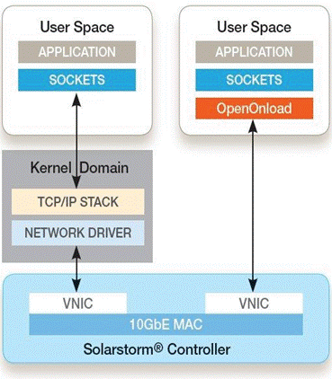

# Openonload

- [Openonload](#openonload)
  - [Low latency Quickstart Guide](#low-latency-quickstart-guide)
    - [Introduction](#introduction)
    - [Software Installation](#software-installation)
      - [Firmware Variant](#firmware-variant)
      - [Solarflare sfnettest](#solarflare-sfnettest)
      - [Solarflare Onload](#solarflare-onload)
      - [Netperf](#netperf)
    - [Test Setup](#test-setup)
      - [BIOS Settings](#bios-settings)
      - [Pre-Test Configuration](#pre-test-configuration)
    - [Reference System Specification](#reference-system-specification)
    - [Latency tests](#latency-tests)
      - [Onload latency with sfnt-pingpong](#onload-latency-with-sfnt-pingpong)
      - [Onload latency with netperf](#onload-latency-with-netperf)
      - [TCPDirect latency](#tcpdirect-latency)
      - [Layer 2 ef_vi Latency](#layer-2-ef_vi-latency)
      - [Latency without CTPIO](#latency-without-ctpio)
      - [Kernel latency](#kernel-latency)
  - [Background](#background)
    - [Introduction](#introduction-1)
      - [Contrasting with Conventional Networking](#contrasting-with-conventional-networking)
      - [How Onload Increases Performance](#how-onload-increases-performance)
        - [Overhead](#overhead)
        - [Latency](#latency)
        - [Bandwidth](#bandwidth)
        - [Scalability](#scalability)
  - [Tuning Onload](#tuning-onload)
    - [Introduction](#introduction-2)
    - [Sysjitter](#sysjitter)
      - [Timer (TSC) Stability](#timer-tsc-stability)
        - [CPU Power Saving Mode](#cpu-power-saving-mode)
    - [Standard Tuning](#standard-tuning)
      - [Spinning (busy-wait)](#spinning-busy-wait)
      - [Enabling spinning](#enabling-spinning)
      - [When to Use Spinning](#when-to-use-spinning)
      - [Polling vs. Interrupts](#polling-vs-interrupts)
    - [Onload Deployment on NUMA Systems](#onload-deployment-on-numa-systems)
      - [Useful commands](#useful-commands)
      - [Driver Loading - NUMA Node](#driver-loading---numa-node)
      - [Memory Policy](#memory-policy)
      - [Application Processing](#application-processing)
      - [Workqueues](#workqueues)
      - [Interrupts](#interrupts)
      - [Verification](#verification)
  - [Interrupt Handling - Kernel Driver](#interrupt-handling---kernel-driver)
    - [Default Behavior](#default-behavior)
      - [Affinitizing RSS Channels to CPUs](#affinitizing-rss-channels-to-cpus)
      - [sfcaffinity_config](#sfcaffinity_config)
      - [Restrict RSS to local NUMA node](#restrict-rss-to-local-numa-node)
      - [Restrict RSS Receive Queues](#restrict-rss-receive-queues)
    - [Performance Jitter](#performance-jitter)
      - [Using Onload Tuning Profiles](#using-onload-tuning-profiles)
      - [The latency-best profile](#the-latency-best-profile)
    - [Advanced Tuning](#advanced-tuning)
      - [Monitoring Using onload_stackdump](#monitoring-using-onload_stackdump)
      - [Worked Examples](#worked-examples)
        - [Prefault Packet Buffers](#prefault-packet-buffers)
      - [Processing at User-Level](#processing-at-user-level)
        - [Solution](#solution)
        - [As Few Interrupts as Possible](#as-few-interrupts-as-possible)
      - [Solution](#solution-1)
        - [Eliminating Drops](#eliminating-drops)
        - [Solution](#solution-2)
        - [Minimizing Lock Contention](#minimizing-lock-contention)
        - [Solution](#solution-3)
      - [Stack Contention - Deferred Work](#stack-contention---deferred-work)
        - [Solutions](#solutions)

## Low latency Quickstart Guide

### Introduction

This chapter demonstrates how to achieve very low latency coupled with minimum jitter on a system fitted with a Solarflare network adapter and using Solarflare’s kernel-bypass network acceleration middleware, OpenOnload. 

The procedure will focus on the performance of the network adapter for TCP and UDP applications running on Linux, using the Solarflare supplied open source sfnettest network benchmark test tools, and also the industry-standard Netperf network benchmark application.

### Software Installation

Before running these benchmark tests ensure that correct driver and firmware versions are installed e.g. (minimum driver and firmware versions are shown):

```shell
[root@server-N]# ethtool -i <interface>
driver: sfc
version: 4.10.0.1011
firmware-version: 6.2.0.1016 rx1 tx1
```

#### Firmware Variant

On SFN7000, SFN8000 and X2 series adapters, the adapter should use the ultra-low-latency firmware variant – as indicated by the presence of rx1 tx1 as shown above. Firmware variants are selected with the sfboot utility from the Solarflare Linux Utilities package (SF-107601-LS).

#### Solarflare sfnettest

Download the sfnettest-<version>.tgz source file from www.openonload.org 

Unpack the tar file using the tar command:

```shell
# tar -zxvf sfnettest-<version>.tgz
```

Run the make utility from the sfnettest-<version>/src subdirectory to build the sfnt-pingpong and other test applications.

#### Solarflare Onload

Before Onload network and kernel drivers can be built and installed the system must support a build environment capable of compiling kernel modules. Refer to Build Dependencies on page 269 for more details.

Download the openonload-<version>.tgz file from www.openonload.org

Unpack the tar file using the tar command:

```shell
# tar -zxvf onload-<version>.tgz
```

Run the onload_install command from the Onload-<version>/scripts subdirectory:

```shell
# ./onload_install
```

Refer to Driver Loading - NUMA Node on page 47 to ensure that drivers are affinitized to a core on the correct NUMA node.

#### Netperf

Netperf is available as a package for most OS distributions.

Netperf can also be downloaded from [](https://github.com/HewlettPackard/netperf).

- Unpack the compressed zip file using the unzip command:

```shell
# unzip netperf-master.zip
```

- Refer to the `INSTALL` file within the distribution for instructions. Following installation the netperf and netserver applications are typically located in the `/usr/local/bin` subdirectory.

### Test Setup

The diagram below identifies the required physical configuration of two servers equipped with Solarflare network adapters connected back-to-back. If required, tests can be repeated with a switch on the link to measure the additional latency delta using a particular switch.

- Two servers are equipped with Solarflare network adapters and connected with a single cable between the Solarflare interfaces.
- The Solarflare interfaces are configured with an IP address so that traffic can pass between them. Use ping to verify connection.
- Onload, sfnettest and netperf are installed on both machines.

#### BIOS Settings

Make the following BIOS settings on both machines:

1. Enable Turbo Boost (sometimes called Turbo Mode).
2. Enable CStates.
3. Disable any of the following settings that are present:
   - Virtualization Technology (also called VT-d/VT-x)
   - IOMMU.

These are similar in their effect, and typically only one will be present.

#### Pre-Test Configuration

The following configuration options are applicable to RHEL7 systems.

First, set some configuration options that decrease latency for Onload acceleration technologies. On both machines:

1. Add the following options to the kernel config line in /boot/grub/grub.conf:

```
isolcpus=<comma separated cpu list> nohz=off iommu=off intel_iommu=off mce=ignore_ce nmi_watchdog=0
```
2. Stop the following services on the server:

```
systemctl stop cpupower
systemctl stop cpuspeed
systemctl stop cpufreqd
systemctl stop powerd
systemctl stop irqbalance
systemctl stop firewalld
```

3. Allocate hugepages. For example, to configure 1024 huge pages:

```shell
# sysctl -w vm.nr_hugepages=1024
```

To make this change persistent, update `/etc/sysctl.conf` . For example:

```shell
# echo "vm.nr_hugepages = 1024" >> /etc/sysctl.conf
```

For more information refer to *Allocating Huge Pages*.

4. Consider the selection of the NUMA node, as this affects latency on a NUMA-
aware system. Refer to *Onload Deployment on NUMA Systems*.

5. Disable interrupt moderation.

```shell
# ethtool -C <interface> rx-usecs 0 adaptive-rx off
```

6. Enable PIO in the Onload environment.

```
EF_PIO=1
```

Now perform the following configuration to improve latency without Onload.

1. Set interrupt affinity such that interrupts and the application are running on
different CPU cores but on the same processor package.
    - Use the following command to identify the interrupts used by the receive queues created for an interface:
      ```
      # cat /proc/interrupts | grep <interface>
      ```
      The output lists the IRQs. For example:

      ```
      34:   ...   PCI-MSI-edge    p2p1-0
      35:   ...   PCI-MSI-edge    p2p1-1
      36:   ...   PCI-MSI-edge    p2p1-ptp
      37:   ...   PCI-MSI-edge    p2p1-3
      38:   ...   PCI-MSI-edge    p2p1-0
      ```

    - Direct the listed IRQs to unused CPU cores that are on the same processor package as the application. For example, to direct IRQs 34-38 to CPU core 2 (where cores are numbered from 0 upwards), using bash:
     
      ```shell
      # for irq in {34..38}
      > do
      > echo 04 > /proc/irq/$irq/smp_affinity
      > done
      ```

2. Set an appropriate tuned profile:
    - The tuned network-latency profile produces better kernel latency results:

      ```
      # tuned-adm profile network-latency
      ```

    - If available, the cpu-partitioning profile includes the network-latency profile, but also makes it easy to isolate cores that can be dedicated to interrupt handling or to an application. For example, to isolate cores 1-3:

      ```
      # echo "isolated_cores=1-3" > /etc/tuned/cpu-partitioning-variables.conf
      # tuned-adm profile cpu-partitioning
      ```

3. Enable the kernel “busy poll” feature to disable interrupts and allow polling of the socket receive queue. The following values are recommended:

   ```
   # sysctl net.core.busy_poll=50 && sysctl net.core.busy_read=50
   ```

### Reference System Specification

The following measurements were recorded on Intel® Kaby Lake servers. The specification of the test systems is as follows:

- DELL PowerEdge R230 servers equipped with Intel® Xeon® CPU E3-1240 v6 @ 3.70GHz, 16GB RAM.
- BIOS configured as specified in BIOS Settings on page 5.
- Solarflare X2522-25G NIC (driver and firmware – see Software Installation on page 3).
- Direct attach cable linking Solarflare NICs:
  - 10Gb cable for measurements at 10Gb
  - 25Gb cable for measurements at 25Gb

- Red Hat Enterprise Linux 7.4 (x86_64 kernel, version 3.10.0-693.5.2.el7.x86_64).
- OS configured as specified in *Pre-Test Configuration*. he tuned cpu-partitioning profile has been enabled, configured to isolate all cores except for core 0, in order to reduce jitter and remove outliers.
- OpenOnload distribution: openonload-201811.
- sfnettest version 1.5.0.
- netperf version 2.7.1.

It is expected that similar results will be achieved on any Intel based, PCIe Gen 3 server or compatible system.

### Latency tests

This section describes various latency tests.

Most of these tests use cut through PIO (CTPIO). This is a feature introduced in the X2 series of adapters, where packets to be sent are streamed directly over the PCIe bus to the network port, bypassing the main adapter transmit datapath. For more information refer to CTPIO on page 144.

The tests use different CTPIO modes, depending on the link speed:

- 10Gb tests use cut-through CTPIO. This is supported only at 10Gb.
- 25Gb tests use variants of store and forward CTPIO.

These different CTPIO modes require changes to the command lines, noted below.

The command lines given below use the taskset command to run the tests on core 1. Change this as necessary, to use an appropriate isolated core on your test system.

#### Onload latency with sfnt-pingpong

Run the sfnt-pingpong application on both systems:

```shell
[sys-1]# onload --profile=<profile> taskset -c 1 sfnt-pingpong
[sys-2]# onload --profile=<profile> taskset -c 1 sfnt-pingpong \
--affinity "1;1" <protocol> <sys-1_ip>
```

where:
- <profile> is latency-best for 10Gb (which uses cut-through CTPIO), or
latency for 25Gb (which uses store and forward (no-poison) CTPIO)
- <protocol> is udp or tcp, as appropriate
- <sys-1_ip> is the IP address of sys-1.

The output identifies mean, minimum, median and maximum (nanosecond) 1⁄2 RTT latency for increasing packet sizes, including the 99% percentile and standard deviation for these results.

#### Onload latency with netperf

You can also measure Onload latency with other standard tools. This test shows how you can use netperf.

NOTE: The latencies measured with netperf are almost identical to the latencies measured with sfnt-pingpong in Onload latency with sfnt-pingpong on page 8.

Run the netserver application on system-1:

```shell
[sys-1]# pkill -f netserver
[sys-1]# onload --profile=<profile> taskset -c 1 netserver
```

and the netperf application on system-2:

```shell
[sys-2]# onload --profile=<profile> taskset -c 1 \
netperf -t <test> -H <sys-1_ip> -l 10 -- -r 32
```

where:
- <profile> is latency-best for 10Gb (which uses cut-through CTPIO), or
latency for 25Gb (which uses store and forward (no-poison) CTPIO)
- <test> is UDP_RR or TCP_RR , as appropriate
- <sys-1_ip> is the IP address of sys-1 .

The output identifies the transaction rate per second, from which:

mean 1⁄2 RTT = (1 / transaction rate) / 2

#### TCPDirect latency

TCPDirect is a feature available for the SFN7000, SFN8000 and X2 series adapters which must have Onload and TCPDirect activation keys installed.

TCPDirect test applications can be found in: `/openonload-<version>/build/gnu_x86_64/tests/zf_apps/static`.

Run the zfudppingpong application on both systems:

```shell
[sys-1]# ZF_ATTR="interface=<interface>;ctpio_mode=<mode>" taskset -c 1 \
zfudppingpong -s 32 pong <sys-1_ip>:20000 <sys-2_ip>:20000
[sys-2]# ZF_ATTR="interface=<interface>;ctpio_mode=<mode>" taskset -c 1 \
zfudppingpong -s 32 ping <sys-2_ip>:20000 <sys-1_ip>:20000
or run the zftcppingpong application on both systems:
[sys-1]# ZF_ATTR="interface=<interface>;ctpio_mode=<mode>" taskset -c 1 \
zftcppingpong -s 32 pong <sys-1_ip>:20000
[sys-2]# ZF_ATTR="interface=<interface>;ctpio_mode=<mode>" taskset -c 1 \
zftcppingpong -s 32 ping <sys-1_ip>:20000
```

where:
- <interface> is the interface to use
- <mode> is the CTPIO mode to use, which is ct for 10Gb, or sf for 25Gb
- <sys-1_ip> is the IP address of sys-1
- <sys-2_ip> is the IP address of sys-2

The output identifies mean RTT, which is halved to give the mean 1⁄2 RTT latency.

#### Layer 2 ef_vi Latency

ef_vi is a Solarflare layer 2 API. ef_vi test applications can be found in `/openonload-<version>/build/gnu_x86_64/tests/ef_vi`

Run the eflatency UDP test application on both systems:

```shell
[sys-1]# taskset -c 1 eflatency <mode> -s 32 pong <interface>
[sys-2]# taskset -c 1 eflatency <mode> -s 32 ping <interface>
```

where:
- <mode> is -p only for 25Gb, to force store and forward (no-poison) CTPIO
- <interface> is the interface to use.

The output gives various diagnostic information (ef_vi version, payload and frame length, number of iterations and warmups, and mode). It also identifies mean RTT, which is halved to give the mean 1⁄2 RTT latency. 

NOTE: Solarflare eflatency Test Application on page 354 describes the eflatency application, command line options and provides example command lines.

#### Latency without CTPIO

The previous tests all use CTPIO. This test shows the result of disabling CTPIO, using UDP traffic with TCPDirect.

TCPDirect test applications can be found in `/openonload-<version>/build/gnu_x86_64/tests/ef_vi`.

Run the zfudppingpong application on both systems:
```shell
[sys-1]# ZF_ATTR="interface=<interface>;ctpio=0" taskset -c 1 \
zfudppingpong -s 32 pong <sys-1_ip>:20000 <sys-2_ip>:20000
[sys-2]# ZF_ATTR="interface=<interface>;ctpio=0" taskset -c 1 \
zfudppingpong -s 32 ping <sys-2_ip>:20000 <sys-1_ip>:20000
```

where:
- <interface> is the interface to use
- <sys-1_ip> is the IP address of sys-1
- <sys-2_ip> is the IP address of sys-2 .

The output identifies mean RTT, which is halved to give the mean 1⁄2 RTT latency.

NOTE: This can be compared with the result of the UDP test in *TCPDirect latency*, which is identical except that CTPIO is enabled. 

#### Kernel latency

The benchmark performance tests can be run without Onload using the regular kernel network drivers. To do this remove the onload --profile=... part from the command line.

Run the sfnt-pingpong application on both systems:

```shell
[sys-1]# taskset -c 1 sfnt-pingpong
[sys-2]# taskset -c 1 sfnt-pingpong --affinity "1;1" <connect> <protocol> <sys-1_ip>
```

where:
- <connect> is --connect only for UDP, to use connect()
- <protocol> is udp or tcp , as appropriate
- <sys-1_ip> is the IP address of sys-1 .

The output identifies mean, minimum, median and maximum (nanosecond) 1⁄2 RTT latency for increasing packet sizes, including the 99% percentile and standard deviation for these results.

## Background

### Introduction

Onload is the Solarflare accelerated network middleware. It is an implementation of TCP and UDP over IP which is dynamically linked into the address space of user-mode applications, and granted direct (but safe) access to the network-adapter hardware. The result is that data can be transmitted to and received from the network directly by the application, without involvement of the operating system. This technique is known as 'kernel bypass'.

Kernel bypass avoids disruptive events such as system calls, context switches and interrupts and so increases the efficiency with which a processor can execute application code. This also directly reduces the host processing overhead, typically by a factor of two, leaving more CPU time available for application processing. This effect is most pronounced for applications which are network intensive, such as:

- Market-data and trading applications
- Computational fluid dynamics (CFD)
- HPC (High Performance Computing)
- HPMPI (High Performance Message Passing Interface), Onload is compatible with MPICH1 and 2, HPMPI, OpenMPI and SCALI
- Other physical models which are moderately parallelizable
- High-bandwidth video-streaming
- Web-caching, Load-balancing and Memcached applications
- Content Delivery Networks (CDN) and HTTP servers
- Other system hot-spots such as distributed lock managers or forced serialization points

The Onload library dynamically links with the application at runtime using the standard BSD sockets API, meaning that no modifications are required to the application being accelerated. Onload is the first and only product to offer full kernel bypass for POSIX socket-based applications over TCP/IP and UDP/IP protocols.

#### Contrasting with Conventional Networking

When using conventional networking, an application calls on the OS kernel to send and receive data to and from the network. Transitioning from the application to the kernel is an expensive operation, and can be a significant performance barrier. When an application accelerated using Onload needs to send or receive data, it need not access the operating system, but can directly access a partition on the network adapter. The two schemes are shown in the figure.



An important feature of the conventional model is that applications do not get direct access to the networking hardware and so cannot compromise system integrity. Onload is able to preserve system integrity by partitioning the NIC at the hardware level into many, protected 'Virtual NICs' (VNIC). An application can be granted direct access to a VNIC without the ability to access the rest of the system (including other VNICs or memory that does not belong to the application). Thus Onload with a Solarflare NIC allows optimum performance without compromising security or system integrity. In summary, Onload can significantly reduce network processing overheads.

#### How Onload Increases Performance

Onload can significantly reduce the costs associated with networking by reducing CPU overheads and improving performance for latency, bandwidth and application scalability.

##### Overhead

Transitioning into and out of the kernel from a user-space application is a relatively expensive operation: the equivalent of hundreds or thousands of instructions. With conventional networking such a transition is required every time the application sends and receives data. With Onload, the TCP/IP processing can be done entirely within the user-process, eliminating expensive application/kernel transitions, i.e. system calls. In addition, the Onload TCP/IP stack is highly tuned, offering further overhead savings. The overhead savings of Onload mean more of the CPU's computing power is available to the application to do useful work.

##### Latency

Conventionally, when a server application is ready to process a transaction it calls into the OS kernel to perform a 'receive' operation, where the kernel puts the calling thread 'to sleep' until a request arrives from the network. When such a request arrives, the network hardware 'interrupts' the kernel, which receives the request and 'wakes' the application. All of this overhead takes CPU cycles as well as increasing cache and translation lookaside-buffer (TLB) footprint. With Onload, the application can remain at user level waiting for requests to arrive at the network adapter and process them directly. The elimination of a kernel-to-user transition, an interrupt, and a subsequent user-to-kernel transition can significantly reduce latency. In short, reduced overheads mean reduced latency.

##### Bandwidth

Because Onload imposes less overhead, it can process more bytes of network traffic every second. Along with specially tuned buffering and algorithms designed for 10 gigabit networks, Onload allows applications to achieve significantly improved bandwidth.

##### Scalability

Modern multi-core systems are capable of running many applications simultaneously. However, the advantages can be quickly lost when the multiple cores contend on a single resource, such as locks in a kernel network stack or device driver. These problems are compounded on modern systems with multiple caches across many CPU cores and Non-Uniform Memory Architectures.

Onload results in the network adapter being partitioned and each partition being accessed by an independent copy of the TCP/IP stack. The result is that with Onload, doubling the cores really can result in doubled throughput as demonstrated by the figure:


## Tuning Onload

### Introduction

This chapter documents the available tuning options for Onload, and the expected results. The options can be split into the following categories:

- System Tuning
- Standard Latency Tuning.
- Advanced Tuning driven from analysis of the Onload stack using onload_stackdump.

Most of the Onload configuration parameters, including tuning parameters, are set by environment variables exported into the accelerated applications environment. Environment variables can be identified throughout this manual as they begin with EF_ . All environment variables are described in Appendices A and B of this manual. Examples throughout this guide assume the use of the bash or sh shells; other shells may use different methods to export variables into the applications environment.

- System Tuning on page 42 describes tools and commands which can be used to tune the server and OS.
- Standard Tuning on page 44 describes how to perform standard heuristic tuning, which can help improve the application’s performance. There are also benchmark examples running specific tests to demonstrate the improvements Onload can have on an application.
- Advanced Tuning on page 59 introduces advanced tuning options using onload_stackdump. There are worked examples to demonstrate how to achieve the application tuning goals.

### Sysjitter

The Solarflare sysjitter utility measures the extent to which the system introduces jitter and so impacts on the user-level process. Sysjitter runs a thread on each processor core and when the thread is de-scheduled from the core it measures for how long. Sysjitter produces summary statistics for each processor core. The sysjitter utility can be downloaded from www.openonload.org.

Sysjitter should be run on a system that is idle. When running on a system with cpusets enabled - run sysjitter as root. 

Refer to the sysjitter README file for further information on building and running  sysjitter.

The following is an example of the output from sysjitter on a single CPU socket server with 4 CPU cores.

```
./sysjitter --runtime 10 200 | column -t
```


The table below describes the output fields of the sysjitter utility.

- threshold (ns) ignore any interrupts shorter than this period
- cpu_mhz CPU speed
- runtime (ns) runtime of sysjitter - nanoseconds
- runtime (s) runtime of sysjitter - seconds
- int_n number of interruptions to the user thread
- int_n_per_sec number of interruptions to the user thread per second
- int_min (ns) minimum time taken away from the user thread due to an interruption 
- int_median (ns) median time taken away from the user thread due to an interruption
- int_mean (ns) mean time taken away from the user thread due to an interruption
- int_90 (ns) 90%percentile value
- int_99 (ns) 99% percentile value
- int_999 (ns) 99.9% percentile value
- int_9999 (ns) 99.99% percentile value
- int_99999 (ns) 99.999% percentile value
- int_max (ns) max time taken away from the user thread
- int_total (ns) total time spent not processing the user thread
- int_total (%) int_total (ns) as a percentage of total runtime

#### Timer (TSC) Stability

Onload uses the Time Stamp Counter (TSC) CPU registers to measure changes in time with very low overhead. Modern CPUs support an “invariant TSC”, which is synchronized across different CPUs and ticks at a constant rate regardless of the current CPU frequency and power saving mode. Onload relies on this to generate accurate time calculations when running across multiple CPUs. If run on a system which does not have an invariant TSC, Onload may calculate wildly inaccurate time values and this can, in extreme cases, lead to some connections becoming stuck. 

Users should consult their server vendor documentation and OS documentation to ensure that servers can meet the invariant TSC requirement.

##### CPU Power Saving Mode

Modern processors utilize design features that enable a CPU core to drop into lowering power states when instructed by the operating system that the CPU core is idle. When the OS schedules work on the idle CPU core (or when other CPU cores or devices need to access data currently in the idle CPU core’s data cache) the CPU core is signaled to return to the fully-on power state. These changes in CPU core power states create additional network latency and jitter. 

Solarflare therefore recommend that customers wishing to achieve the lowest latency and lowest jitter disable the “C1E power state” or “CPU power saving mode”within the machine's BIOS.

Disabling the CPU power saving modes is required if the application is to realize low latency with low jitter.

NOTE: To ensure C states are not enabled, overriding the BIOS settings, it is recommended to put the line ‘ intel_idle.max_cstate=0 idle=poll ’ into the kernel command line /boot/grub/grub.conf . The settings will produce consistent results and are particularly useful when benchmarking. 

Allowing some cores to enable Turbo modes while others are idle can produce better latency in some servers. For this, use idle=mwait and enable C-states in the BIOS.

Alternatively, on later Linux versions, the tuned service can be enabled and used with the network-latency profile. 

Users should refer to vendor documentation and experiment with C states for different applications.

Customers should consult their system vendor and documentation for details concerning the disabling of C1E, C states or CPU power saving states.

### Standard Tuning
This section details standard tuning steps for Onload.

#### Spinning (busy-wait)

Conventionally, when an application attempts to read from a socket and no data is available, the application will enter the OS kernel and block. When data becomes available, the network adapter will interrupt the CPU, allowing the kernel to reschedule the application to continue.

Blocking and interrupts are relatively expensive operations, and can adversely affect bandwidth, latency and CPU efficiency.

Onload can be configured to spin on the processor in user mode for up to a specified number of microseconds waiting for data from the network. If the spin period expires the processor will revert to conventional blocking behavior. Non-blocking sockets will always return immediately as these are unaffected by spinning.

Onload uses the EF_POLL_USEC environment variable to configure the length of the spin timeout.

```shell
export EF_POLL_USEC=100000
```

will set the busy-wait period to 100 milliseconds. See *Meta Options* for more details.

#### Enabling spinning

To enable spinning in Onload:

Set EF_POLL_USEC. This causes Onload to spin on the processor for up to the specified number of microseconds before blocking. This setting is used in TCP and UDP and also in recv() , select() , pselect() and poll() , ppoll() and epoll_wait() , epoll_pwait() and onload_ordered_epoll_wait(). Use the following command:

```shell
export EF_POLL_USEC=100000
```

If neither of the spinning options EF_POLL_USEC and EF_SPIN_USEC are set, Onload will resort to default interrupt driven behavior because the EF_INT_DRIVEN environment variable is enabled by default.

Setting the EF_POLL_USEC variable also sets the following environment variables.

```
EF_SPIN_USEC=EF_POLL_USEC
EF_SELECT_SPIN=1
EF_EPOLL_SPIN=1
EF_POLL_SPIN=1
EF_PKT_WAIT_SPIN=1
EF_TCP_SEND_SPIN=1
EF_UDP_RECV_SPIN=1
EF_UDP_SEND_SPIN=1
EF_TCP_RECV_SPIN=1
EF_BUZZ_USEC=MIN(EF_POLL_USEC, 100)
EF_SOCK_LOCK_BUZZ=1
EF_STACK_LOCK_BUZZ=1
```

Turn off adaptive moderation and set interrupt moderation to a high value (microseconds) to avoid flooding the system with interrupts. Use the following command:

```shell
/sbin/ethtool -C eth2 rx-usecs 60 adaptive-rx off
```

#### When to Use Spinning

The optimal setting is dependent on the nature of the application. If an application is likely to find data soon after blocking, or the system does not have any other major tasks to perform, spinning can improve latency and bandwidth significantly. 

In general, an application will benefit from spinning if the number of active threads is less than the number of available CPU cores. However, if the application has more active threads than available CPU cores, spinning can adversely affect application performance because a thread that is spinning (and therefore idle) takes CPU time away from another thread that could be doing work. If in doubt, it is advisable to try an application with a range of settings to discover the optimal value.

#### Polling vs. Interrupts

Interrupts are useful because they allow the CPU to do other useful work while simultaneously waiting for asynchronous events (such as the reception of packets from the network). The historical alternative to interrupts was for the CPU to periodically poll for asynchronous events and on single processor systems this could result in greater latency than would be observed with interrupts. Historically it was accepted that interrupts were “good for latency”.

On modern, multicore systems the tradeoffs are different. It is often possible to dedicate an entire CPU core to the processing of a single source of asynchronous events (such as network traffic). The CPU dedicated to processing network traffic can be spinning (aka busy waiting), continuously polling for the arrival of packets. When a packet arrives, the CPU can begin processing it almost immediately.

Contrast the polling model to an interrupt-driven model. Here the CPU is likely in its “idle loop” when an interrupt occurs. The idle loop is interrupted, the interrupt handler executes, typically marking a worker task as runnable. The OS scheduler will then run and switches to the kernel thread that will process the incoming packet. There is typically a subsequent task switch to a user-mode thread where the real work of processing the event (e.g. acting on the packet payload) is performed. Depending on the system, it can take on the order of a microsecond to respond to an interrupt and switch to the appropriate thread context before beginning the real work of processing the event. A dedicated CPU spinning in a polling loop can begin processing the asynchronous event in a matter of nanoseconds.

It follows that spinning only becomes an option if a CPU core can be dedicated to the asynchronous event. If there are more threads awaiting events than CPU cores (i.e. if all CPU cores are oversubscribed to application worker threads), then spinning is not a viable option, (at least, not for all events). One thread will be spinning, polling for the event while another could be doing useful work. Spinning in such a scenario can lead to (dramatically) increased latencies. But if a CPU core can be dedicated to each thread that blocks waiting for network I/O, then spinning is the best method to achieve the lowest possible latency.

### Onload Deployment on NUMA Systems

When deployed on NUMA systems, application load throughput and latency performance can be adversely affected unless due consideration is given to the selection of the NUMA node, the allocation of cache memory and the affinitization of drivers, processes and interrupts.

For best performance the accelerated application should always run on the NUMA node nearest to the Solarflare adapter. The correct allocation of memory is particularly important to ensure that packet buffers are allocated on the correct NUMA node to avoid unnecessary increases in QPI traffic and to avoid dropped packets.

#### Useful commands
- To identify NUMA nodes, socket memory and CPU core allocation:

```shell
# numactl -H
```

- To identify the NUMA node local to a Solarflare adapter:

```shell
# cat /sys/class/net/<interface>/device/numa_node
```

- To identify memory allocation and use on a particular NUMA node:

```shell
# cat /sys/devices/system/node/node<N>/numastat
```

- To identify NUMA node mapping to cores, use one of the following:

```shell
# numactl --hardware
# cat /sys/devices/system/node/node<N>/cpulist
```

#### Driver Loading - NUMA Node

When loading, the Onload module will create a variety of common data structures. To ensure that these are created on the NUMA node nearest to the Solarflare adapter, onload_tool reload should be affinitized to a core on the correct NUMA node.

```shell
# numactl --cpunodebind=1 onload_tool reload
```

When there is more than one Solarflare adapter in the same server, on different NUMA nodes, the user must select one node over the other when loading the driver, but also make sure that interrupt IRQs are affinitized to the correct local CPU node for each adapter.

onload_tool reload is single threaded, so running with “cpunodebind=0,1”, for example, means the command could run on either node which is not identifiable by the user until after the command has completed.

#### Memory Policy

To guarantee that memory is appropriately allocated - and to ensure that memory allocations do not fail, a memory policy that binds to a specific NUMA node should be selected. When no policy is specified the system will generally use a default policy allocating memory on the node on which a process is executing.

#### Application Processing

The majority of processing by Onload occurs in the context of the Onloaded application. Various methods can be used to affinitize the Onloaded process; numactl , taskset or cpusets or the CPU affinity can be set programatically.

#### Workqueues

An Onloaded application will create two shared workqueues and one per-stack workqueue. The implementation of the workqueue differs between Linux kernels - and so does the method used to affinitize workqueues.

On more recent Linux kernels (3.10+) the Onload work queues will be initially affinitized to the node on which they are created. Therefore if the driver load is affinitized and the Onloaded application affinitized to the correct node, Onload stacks will be created on the correct node and there will be no further work required.

Specifying a cpumask via sysfs for a workqueue is NOT recommended as this can break ordering requirements.

On older Linux kernels dedicated workqueue threads are created - and these can be affinitized using taskset or cpusets. Identify the two workqueues shared by all Onload stacks:

- onload-wqueue
- sfc_vi

Identify the per-stack workqueue which has a name in the format onload-wq<stack id> (e.g onload-wq:1 for stack 1).

Use the onload_stackdump command to identify Onload stacks and the PID of the process that created the stack:

```shell
# onload_stackdump
#stack-id   stack-name    pids
0           -             106913
```

Use the Linux pidof command to identify the PIDs for Onload workqueues:

```shell
# pidof onload-wq:0 sfc_vi onload-wqueue
106930 105409 105431
```

It is recommended that the shared workqueues are affinitized immediately after the driver is loaded and the per-stack queue immediately after stack creation.

#### Interrupts

When Onload is being used in an interrupt-driven mode (see Interrupt Handling - Using Onload on page 54) interrupts should affinitized to the same NUMA node running the Onload application, but not on the same CPU core as the application. 

When Onload is spinning (busy-wait) there will be few (if any) interrupts, so it is not a real concern where these are handled.

#### Verification

The onload_stackdump lots command is used to verify that allocations occur on the required NUMA node:

```shell
# onload_stackdump lots | grep numa
numa nodes: creation=0 load=0
numa node masks: packet alloc=1 sock alloc=1 interrupt=1
```

The load parameter identifies the node where the adapter driver has been loaded. The creation parameter identifies the node allocating memory for the Onload stack. The numa node masks identify which NUMA nodes allocate memory for packets and for sockets, and the nodes on which interrupts have actually occurred. A mask value of 1 identifies node 0, a value of 2 identifies node 1, a value of 3 identifies both nodes 0 and 1 etc.

For most purposes it is best when load and creation identify the same node which is also the node local to the Solarflare adapter. To identify the local node use the following:

```shell
# cat /sys/class/net/<interface>/device/numa_node
```

The cpu affinity of individual Onloaded threads can be identified with the following command:

```
# onload_stackdump threads
```

## Interrupt Handling - Kernel Driver

### Default Behavior

Using the value identified from the rss_cpus option, the Solarflare NET driver will create a number of receive (and transmit) queues (termed an “RSS channel”) for each physical interface. By default the driver creates one RSS channel per CPU core detected in the server up to a maximum of 32. 

The rss_cpus sfc driver module option can be set in a user created file <sfc.conf> in the /etc/modprobe.d directory. The driver must be reloaded before the option becomes effective. For example, rss_cpus can be set to an integer value:

```
options sfc rss_cpus=4
```

In the above example 4 receive queues are created per Solarflare interface. The default value is rss_cpus=cores . Other available options are rss_cpus=<int> ,

```
rss_cpus=hyperthreads and rss_cpus=packages .
```

NOTE: If the sfc driver module parameter ‘ rss_numa_local ’ is enabled, RSS will be restricted to use cores/hyperthreads on the NUMA node local to the Solarflare adapter.

#### Affinitizing RSS Channels to CPUs

As described in the previous section, the default behavior of the Solarflare network driver is to create one RSS channel per CPU core. At load time the driver affinitizes the interrupt associated with each RSS channel to a separate CPU core so the interrupt load is evenly distributed over the available CPU cores.

NOTE: These initial interrupt affinities will be disrupted and changed if the Linux IRQ balancer daemon is running. To stop the IRQ balancer use the following command:

```shell
# service irqbalance stop
```

In the following example, we have a server with 2 Solarflare dual-port adapters (total of network 4 interfaces), installed in a server with 2 CPU sockets with 8 cores per socket (hyperthreading is disabled).

If we set rss_cpus=4 , each interface will create 4 RSS channels. The driver takes care to spread the affinitized interrupts evenly over the CPU topology i.e. evenly between the two CPU sockets and evenly over shared L2/L3 caches. 

The driver also attempts to spread the interrupt load of the multiple network interfaces by using different CPU cores for different interfaces:


With 4 receive queues created per interface this results, on this machine, to the first network interface mapping to the four lowest number CPU cores i.e. two cores from each CPU socket as illustrated below. The next network interface uses the next four CPUs until each CPU core is loaded with a single RSS channel – as illustrated below.


To identify the mapping of receive queues to CPU cores, use the following
command:


Note that each receive queue has an assigned IRQ. Receive queue eth4-0 is served by IRQ 106, eth4-1 by IRQ 107 etc.

#### sfcaffinity_config

The OpenOnload distribution also includes the sfcaffinity_config script which can also be used to affinitize RSS channel interrupts. sfcaffinity_config has a number of command line options but a common way of running it is with the auto command:

```shell
# sfcaffinity_config auto
```

Auto instructs sfcaffinity_config to set interrupts affinities to evenly spread the RSS channels over the available CPU cores. Using the above scenario as an example, where rss_cpus has been set to 4, the command will affinitize the interrupt associated with each receive queue evenly over the CPU topology – in this case the first four CPU cores.


In this example, after running the sfcaffinity_config auto command, interrupts for the 4 receive queues from the 4 interfaces are now all directed to the same 4 cores 0,1,2,3 as illustrated by the figure.


NOTE: Running the sfcaffinity_config auto command also disables the kernel IRQ balance service to prevent interrupts being redirected by the kernel to other cores.

#### Restrict RSS to local NUMA node

The sfc driver module parameter rss_numa_local will restrict RSS to only use CPU cores or hypterthreads (if hyperthreading is enabled) on the NUMA node local to the Solarflare adapter.

rss_numa_local does NOT restrict the number of RSS channels created by the driver – it instead works by restricting the RSS spreading so only the channels on the local NUMA node will receive kernel driver traffic.

In the default case (where rss_cpus=cores ), one RSS channel is created per CPU core. However, the driver adjusts the RSS settings such that only the RSS channels affinitized to the local CPU socket receive traffic. It therefore has no effect on the Onload allocation and use of receive queues and interrupts.

The figure below identifies the receive queue interrupts spread when rss_cpus=4 and rss_numa_local=1 . In this machine adapter 1 is attached to the PCIe bus on socket #0 with adapter #2 attached to the PCIe bus on socket #1.


#### Restrict RSS Receive Queues

The ethtool -X command can also be used to restrict the receive queues accessible by RSS. In the following example rss_cpus=4 and ethtool -x identifies the 4 receive queues per interface:


To restrict RSS to spread receive flows evenly over the first 2 receive queues. Use ethtool -X :


Interrupt Handling - Using Onload
A thread accelerated by Onload will either be interrupt driven or it will be spinning.
When the thread is interrupt driven, a thread which calls into Onload to read from
its receive queue and for which there are no received packets to be processed, will
‘sleep’ until an interrupt(s) from the kernel informs it that there is more work to do.
When a thread is spinning, it is busy waiting on its receive queue until packets are
received - in which case the packets are retrieved and the thread returns
immediately to the receive queue, or until the spin period expires. If the spin period
expires the thread will relinquish the CPU core and ‘sleep’ until an interrupt from the
kernel informs it that further packets have been received. If the spin period is set
greater than the packet inter-arrival rate, the spinning thread can continue to spin
and retrieve packets without interrupts occurring. Even when spinning, an
application might experience a few interrupts.
As a general rule, when spinning, only a few interrupts will be expected so
performance is typically insensitive as to which CPU core processes the interrupts.
However, when Onload is interrupt driven performance can be sensitive to where
the interrupts are handled and will typically benefit to be on the same CPU socket
as the application thread handling the socket I/O. The method required depends on
the setting of the EF_PACKET_BUFFER_MODE environment variable:
•
If EF_PACKET_BUFFER_MODE=0 or 2 , an Onload stack will use one or more of the
interrupts assigned to the NET driver receive queues. The CPU core handling
the interrupts is defined by the RSS mapping of receive queues to CPU cores:
-
Issue 29
If sfcaffinity_config has been used to affinitize RSS channel
interrupts, the interrupt handling core for the stack can be set using the
EF_IRQ_CORE environment variable.

It is only possible for interrupts to be handled on the requested core if a
NET driver interrupt is assigned to the selected core.
See Affinitizing RSS Channels to CPUs on page 50.
-
•
Otherwise, the interrupt handling core for the stack can be set using the
EF_IRQ_CHANNEL environment variable. Onload interrupts are handled by
the same core assigned to the NET driver receive channel.
If EF_PACKET_BUFFER_MODE=1 or 3 , the onload stack creates dedicated
interrupts. The interrupt handling core for the stack can be set using the
EF_IRQ_CORE environment variable.
For more information about these environment variables, see:
• EF_IRQ_CHANNEL on page 215
• EF_IRQ_CORE on page 216
• EF_PACKET_BUFFER_MODE on page 224.
When Onload is using a NET driver RSS channel for its source of interrupts, it can be
useful to dedicate this channel to Onload and prevent the driver from using this
channel for RSS traffic. See Restrict RSS to local NUMA node on page 52 and Restrict
RSS Receive Queues on page 53 for methods of how to achieve this.

### Performance Jitter

On any system reducing or eliminating jitter is key to gaining optimum performance, however the causes of jitter leading to poor performance can be difficult to define and difficult to remedy. The following section identifies some key points that should be considered.

- A first step towards reducing jitter should be to consider the configuration settings specified in the Low Latency Quickstart Guide on page 3 - this includes the disabling of the irqbalance service, interrupt moderation settings and measures to prevent CPU cores switching to power saving modes. 
- Use isolcpus to isolate CPU cores that the application - or at least the critical threads of the application will use and prevent OS housekeeping tasks and other non-critical tasks from running on these cores. 
- Set an application thread running on one core and the interrupts for that thread on a separate core - but on the same physical CPU package. Even when spinning, interrupts may still occur, for example, if the application fails to call into the Onload stack for extended periods because it is busy doing other work. 
- Ideally each spinning thread will be allocated a separate core so that, in the event that it blocks or is de-scheduled, it will not prevent other important threads from doing work. A common cause of jitter is more than one spinning thread sharing the same CPU core. Jitter spikes may indicate that one thread is being held off the CPU core by another thread.
- When EF_STACK_LOCK_BUZZ=1 , threads will spin for the EF_BUZZ_USEC period while they wait to acquire the stack lock. Lock buzzing can lead to unfairness between threads competing for a lock, and so result in resource starvation for one. Occurrences of this are counted in the 'stack_lock_buzz' counter. EF_STACK_LOCK_BUZZ is enabled by default when EF_POLL_USEC (spinning) is enabled.
- If a multi-thread application is doing lots of socket operations, stack lock contention will lead to send/receive performance jitter. In such cases improved performance can be had when each contending thread has its own stack. This can be managed with EF_STACK_PER_THREAD which creates a separate Onload stack for the sockets created by each thread. If separate stacks are not an option then it may be beneficial to reduce the EF_BUZZ_USEC period or to disable stack lock buzzing altogether.
- It is always important that threads that need to communicate with each other are running on the same CPU package so that these threads can share a memory cache.
- Jitter may also be introduced when some sockets are accelerated and others are not. Onload will ensure that accelerated sockets are given priority over non-accelerated sockets, although this delay will only be in the region of a few microseconds - not milliseconds, the penalty will always be on the side of the non-accelerated sockets. The environment variables EF_POLL_FAST_USEC and EF_POLL_NONBLOCK_FAST_USEC can be configured to manage the extent of priority of accelerated sockets over non-accelerated sockets.
- If traffic is sparse, spinning will deliver the same latency benefits, but the user should ensure that the spin timeout period, configured using the EF_POLL_USEC variable, is sufficiently long to ensure the thread is still spinning when traffic is received.
- When applications only need to send and receive occasionally it may be beneficial to implement a keepalive - heartbeat mechanism between peers. This has the effect of retaining the process data in the CPU memory cache. Calling send or receive after a delay can result in the call taking measurably longer, due to the cache effects, than if this is called in a tight loop.
- On some servers BIOS settings such as power and utilization monitoring can cause unnecessary jitter by performing monitoring tasks on all CPU cores. The user should check the BIOS and decide if periodic tasks (and the related SMIs) can be disabled.
- The Solarflare sysjitter utility can be used to identify and measure jitter on all cores of an idle system - refer to Sysjitter on page 42 for details.

#### Using Onload Tuning Profiles

Environment variables set in the application user-space can be used to configure and control aspects of the accelerated application’s performance. These variables can be exported using the Linux export command e.g. 

```shell
export EF_POLL_USEC=100000
```

Onload supports tuning profile script files which are used to group environment variables within a single file to be called from the Onload command line. The latency profile sets the EF_POLL_USEC=100000 setting the busy-wait spin timeout to 100 milliseconds. The profile also disables TCP faststart for new or idle connections where additional TCP ACKs will add latency to the receive path. To use the profile include it on the onload command line, e.g:

```shell
onload --profile=latency netperf -H onload2-sfc -t TCP_RR
```

Following Onload installation, profiles provided by Solarflare are located in the following directory - this directory will be deleted by the onload_uninstall command:

```shell
/usr/libexec/onload/profiles
```

User-defined environment variables can be written to a user-defined profile script file (having a .opf extension) and stored in any directory on the server. The full path to the file should then be specified on the onload command line e.g.

```shell
onload --profile=/tmp/myprofile.opf netperf -H onload2-sfc -t TCP_RR
```

As an example the latency profile, provided by the Onload distribution is shown below:

```
# Onload low latency profile.
# Enable polling / spinning. When the application makes a blocking call
# such as recv() or poll(), this causes Onload to busy wait for up to
100ms
# before blocking.
onload_set EF_POLL_USEC=100000
# Disable FASTSTART when connection is new or has been idle for a while.
# The additional acks it causes add latency on the receive path.
onload_set EF_TCP_FASTSTART_INIT 0
onload_set EF_TCP_FASTSTART_IDLE 0
```

For a complete list of environment variables refer to *Parameter Reference*.

#### The latency-best profile

The latency-best profile targets the lowest possible latency for a given release of Onload. This means that:
- Some features used in the profile might be experimental.
- The combination of features in the profile might not be suitable for all deployments, or all types of traffic.
- The profile is subject to change between releases.

As new low-latency features become available, they will be added to the profile.

Consequently, Solarflare recommends the following:

- Always create a renamed copy of the profile, and use the copy. This will avoid the profile unexpectedly changing when you update Onload, and potentially breaking your applications.
- Always test and tune your copy of the profile in a non-production environment, before deploying it. This will avoid issues caused by combinations of settings that are inappropriate for your production systems.

If you do not follow the above recommendations, and directly use the latency-best profile in a production environment, you might experience issues either now, or when upgrading Onload in the future.

### Advanced Tuning

Advanced tuning requires closer examination of the application performance. The application should be tuned to achieve the following objectives:

- To have as much processing at user-level as possible.
- To have as few interrupts as possible.
- To eliminate drops.
- To minimize lock contention.

Onload includes a diagnostic application called onload_stackdump , which can be used to monitor Onload performance and to set tuning options. 

The following sections demonstrate the use of onload_stackdump to examine aspects of the system performance and set environment variables to achieve the tuning objectives.

For further examples and use of onload_stackdump refer to onload_stackdump.

#### Monitoring Using onload_stackdump

To use onload_stackdump , enter the following command:

```shell
onload_stackdump [command]
```

To list available commands and view documentation for onload_stackdump enter the following commands:

```shell
onload_stackdump doc
onload_stackdump -h
```

A specific stack number can also be provided on the onload_stackdump command line.

#### Worked Examples

##### Prefault Packet Buffers

The Onload environment variable EF_PREFAULT_PACKETS will cause the user process to ‘touch’ the specified number of packet buffers when an Onload stack is created. This means that memory for these packet buffers is pre-allocated and memory-mapped into the user-process address space.

Pre allocation is advised to prevent latency jitter caused by the allocation and memory-mapping overheads.

When deciding how many packets to prefault, the user should look at the alloc value when the onload_stackdump packets command is run. The alloc value is a high water mark identifying the maximum the number of packets being used by the stack at any singular point. Setting EF_PREFAULT_PACKETS to at least this value is recommended.

```shell
$ onload_stackdump packets
ci_netif_pkt_dump_all: id=0
pkt_sets: pkt_size=2048 set_size=1024 max=32 alloc=2
pkt_set[0]: free=544
pkt_set[1]: free=446 current
pkt_bufs: max=32768 alloc=2048 free=990 async=0
pkt_bufs: rx=1058 rx_ring=992 rx_queued=2 pressure_pool=64
pkt_bufs: tx=0 tx_ring=0 tx_oflow=0
pkt_bufs: in_loopback=0 in_sock=0
994: 0x200 Rx
n_zero_refs=1054 n_freepkts=1 estimated_free_nonb=1053
free_nonb=0 nonb_pkt_pool=ffffffffffffffff
```

NOTE: It is not possible to prefault a number of packets exceeding the current value of EF_MAX_PACKETS – and attempts to do this will result in a warning similar to the following:

```shell
ci_netif_pkt_prefault_reserve: Prefaulted only 63488 of 64000
```

The warning message is harmless, this informs the user that not all the requested packets could be prefaulted (because some have already been allocated to receive rings).

When deciding how many packets to prefault the user should consider that Onload must allocate from the EF_MAX_PACKET pool, a number of packet buffers per receive ring per interface. Once these have been allocated, any remainder can be prefaulted.

Users who require to prefault the maximum possible number of available packets can set EF_PREFAULT_PACKETS and EF_MAX_PACKETS to the same value and just ignore the warnings from Onload: EF_PREFAULT_PACKETS=64000 EF_MAX_PACKETS=64000 onload <myapplication>...

CAUTION: Prefaulting packet buffers for one stack will reduce the number of available buffers available for others. Users should consider that over allocation to one stack might mean spare (redundant) packet buffer capacity that could be better allocated elsewhere.

#### Processing at User-Level
Many applications can achieve better performance when most processing occurs at user-level rather than kernel-level. To identify how an application is performing, enter the following command:

```shell
onload_stackdump lots | grep polls
```

- k_polls Number of times the socket event queue was polled from the kernel. 
- u_polls Number of times the socket event queue was polled from user space.
- periodic_polls Number of times a periodic timer has polled for events.
- interrupt_polls Number of times an interrupt polled for network events.
- deferred_polls Number of times poll has been deferred to the stack lock holder.
- timeout_interrupt_polls Number of times timeout interrupts polled for network events.

```shell
$ onload_stackdump lots | grep poll
k_polls: 673
u_polls: 41
```

The output identifies many more k_polls than u_polls indicating that the stack is operating mainly at kernel-level and may not be achieving optimal performance. 

##### Solution

Terminate the application and set the EF_POLL_USEC parameter to 100000 . Re-start the application and re-run onload_stackdump : 

```shell
export EF_POLL_USEC=100000
onload_stackdump lots | grep polls
$ onload_stackdump lots | grep polls
k_polls: 673
u_polls: 1289
```

The output identifies that the number of u_polls is far greater than the number of k_polls indicating that the stack is now operating mainly at user-level.

##### As Few Interrupts as Possible

A tuned application will reach a balance between the number/rate of interrupts processed and the amount of real work that gets done e.g. process multiple packets per interrupt rather than one. Even spinning applications can benefit from the occasional interrupt, e.g. when a spinning thread has been de-scheduled from a CPU, an interrupt will prod the thread back to action when further work has to be done.

```shell
# onload_stackdump lots | grep ^interrupt
```

- Interrupts Total number of interrupts received for the stack. 
- Interrupt polls Number of times the stack is polled - invoked by interrupt.
- Interrupt evs Number of events processed when invoked by an interrupt.
- Interrupt wakes Number of times the application is woken by interrupt.
- Interrupt primes Number of times interrupts are re-enabled (after spinning or polling the stack).
- Interrupt no events Number of stack polls for which there was no event to recover.
- Interrupt lock contends The application polled the stack and has the lock before an interrupt fired.
- Interrupt budget limited Number of times, when handling a poll in an interrupt, the poll was stopped when the NAPI budget was reached. Any remaining events are then processed on the stack workqueue.

#### Solution

If an application is observed taking lots of interrupts it may be beneficial to increase the spin time with the EF_POLL_USEC variable or setting a high interrupt moderation value for the net driver using ethtool . The number of interrupts on the system can also be identified from /proc/ interrupts .

##### Eliminating Drops

The performance of networks is impacted by any packet loss. This is especially pronounced for reliable data transfer protocols that are built on top of unicast or multicast UDP sockets.

First check to see if packets have been dropped by the network adapter before reaching the Onload stack. Use ethtool to collect stats directly from the network adapter:

```shell
# ethtool -S enps0f0 | grep drop
```

- rx_noskb_drops Number of packets dropped when there are no further socket buffers to use.
- port_rx_nodesc_drops Number of packets dropped when there are no further descriptors in the rx ring buffer to receive them.
- port_rx_dp_di_dropped_packets Number of packets dropped because filters indicate the packets should be dropped - this can happen when packets don’t match any filter or the matched filter indicates the packet should be dropped.

```shell
# ethtool -S enps0f0 | grep drop
rx_noskb_drops: 0
port_rx_nodesc_drops: 0
port_rx_dp_di_dropped_packets: 681618610
```

##### Solution

If packet loss is observed at the network level due to a lack of receive buffering try increasing the size of the receive descriptor queue size via EF_RXQ_SIZE . If packet drops are observed at the socket level consult the application documentation - it may also be worth experimenting with socket buffer sizes (see EF_UDP_RCVBUF ). Setting the EF_EVS_PER_POLL variable to a higher value may also improve efficiency - refer to Appendix A for a description of this variable.

##### Minimizing Lock Contention

Lock contention can greatly affect performance. When threads share a stack, a thread holding the stack lock will prevent another thread from doing useful work. Applications with fewer threads may be able to create a stack per thread (see EF_STACK_PER_THREAD and Stacks API on page 277).

Use onload_stackdump to identify instances of lock contention:

```shell
# onload_stackdump lots | egrep "(lock_)|(sleep)"
```

- periodic_lock_contends Number of times periodic timer could not get the stack lock
- interrupt_lock_contends Number of times the interrupt handler could not get the stack lock because it is already held by user level or other context. 
- timeout_interrupt_lock_contends Number of times timeout interrupts could not lock the stack. 
- sock_sleeps Number of times a thread has blocked on a single socket.
- sock_sleep_primes Number of times select/poll/epoll enabled interrupts.
- unlock_slow Number of times the slow path was taken to unlock the stack lock.
- unlock_slow_pkt_waiter Number of times packet memory shortage provoked the unlock slow path. 
- unlock_slow_socket_list Number of times the deferred socket list provoked the unlock slow path.
- unlock_slow_need_prime Number of times interrupt priming provoked the unlock slow path.
- unlock_slow_wake Number of times the unlock slow path was taken to wake threads.
- unlock_slow_swf_update Number of times the unlock slow path was taken to update sw filters.
- unlock_slow_close Number of times the unlock slow path was taken to close sockets/pipes. 
- unlock_slow_syscall Number of times a syscall was needed on the unlock slow path.
- lock_wakes Number of times a thread is woken when blocked on the stack lock.
- stack_lock_buzz Number of times a thread has spun waiting for the stack lock
- sock_lock_sleeps Number of times a thread has slept waiting for a sock lock.
- sock_lock_buzz Number of times a thread has spun waiting for a sock lock.
- tcp_send_ni_lock_contends Number of times TCP sendmsg() contended the stack lock
- udp_send_ni_lock_contends Number of times UDP sendmsg() contended the stack lock
- getsockopt_ni_lock_contends Number of times getsockopt() contended the stack lock.
- setsockopt_ni_lock_contends Number of times setsockopt() contended the stack lock.
- lock_dropped_icmps Number of dropped ICMP messages not processed due to contention.

##### Solution

Performance will be improved when stack contention is kept to a minimum. When threads share a stack it is preferable for a thread to spin rather than sleep when waiting for a stack lock. The EF_BUZZ_USEC value can be increased to reduce ‘sleeps’. Where possible use stacks per process.

#### Stack Contention - Deferred Work

When multiple threads share an Onload stack, the ability for one thread to defer sending tasks to another thread that is currently holding the stack lock, can mitigate the effects of lock contention. When sending data, contention occurs when one thread calls send(), while another thread holds the stack lock. The task of sending the data can be deferred to the lock holder - freeing the deferring thread to continue with other work. However a send() which also processes a lot of deferred work will take longer to execute - preventing other threads from getting the stack lock. 

A thread which calls send() when the stack EF_DEFER_WORK_LIMIT has been reached cannot defer further work to the lock holder, but is forced to block and wait for the stack lock. The defer_work_limited counter identifies the number of these occurrences.

onload_stackdump per-socket counters will indicate the level of deferred work on each socket within a stack e.g.

```shell
TCP 2:10 lcl=172.16.20.123:4112 rmt=172.16.20.88:4112 ESTABLISHED
snd: limited rwnd=17 cwnd=129 nagle=0 more=0 app=103905
tx: defer=48799 nomac=0 warm=0 warm_aborted=0
```

onload_stackdump per-stack counters also indicate the level of lock contention:

- deferred_work - the number packets sent using the deferred mechanism
- defer_work_limited - the number of times a sending thread is prevented from deferring to the stack lock holder because the EF_DEFER_WORK_LIMIT has been reached.
- deferred_polls - a thread is prevented from polling the stack when another thread has the stack lock. The poll is deferred to the lock holder. The lock holder will place any ready received data on the correct socket queues and wake other threads if there is work to be done.

##### Solutions

To reduce the level of stack lock contention, the following actions are recommended:

- For affected stacks, reduce the number of threads performing network I/O.
- Applications with fewer threads can use a stack for each thread - see EF_STACK_PER_THREAD.
- Bind critical sockets to selected stacks - see Stacks API on page 277.
- For TCP connections, use onload_move_fd() to place sockets accepted from a listening socket into multiple stacks.

For more information see Minimizing Lock Contention on page 64.