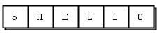
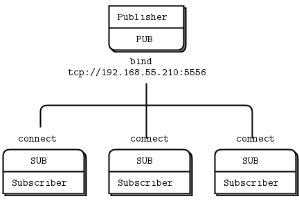
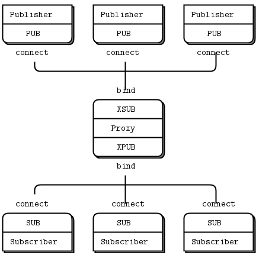
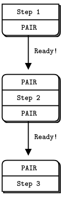
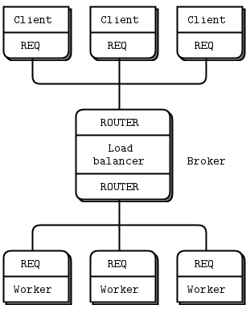
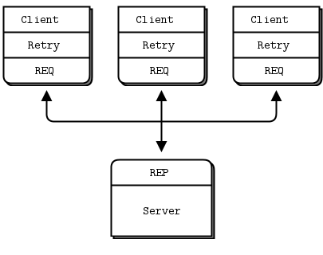

# ZeroMQ Guide

- [ZeroMQ Guide](#zeromq-guide)
  - [Basics](#basics)
    - [Hello World](#hello-world)
    - [A Minor Note on Strings](#a-minor-note-on-strings)
    - [A Note on the Naming Convention](#a-note-on-the-naming-convention)
    - [Getting the Message Out](#getting-the-message-out)
    - [Divide and Conquer](#divide-and-conquer)
    - [Programming with ZeroMQ](#programming-with-zeromq)
      - [Getting the Context Right](#getting-the-context-right)
      - [Making a Clean Exit](#making-a-clean-exit)
    - [Why We Needed ZeroMQ](#why-we-needed-zeromq)
    - [Socket Scalability](#socket-scalability)
  - [Sockets and Patterns](#sockets-and-patterns)
    - [The Socket API](#the-socket-api)
      - [Plugging Sockets into the Topology](#plugging-sockets-into-the-topology)
      - [Sending and Receiving Messages](#sending-and-receiving-messages)
      - [Unicast Transports](#unicast-transports)
      - [ZeroMQ is Not a Neutral Carrier](#zeromq-is-not-a-neutral-carrier)
      - [I/O Threads](#io-threads)
    - [Messaging Patterns](#messaging-patterns)
      - [High-Level Messaging Patterns](#high-level-messaging-patterns)
      - [Working with Messages](#working-with-messages)
      - [Handling Multiple Sockets](#handling-multiple-sockets)
      - [Multipart Messages](#multipart-messages)
      - [Intermediaries and Proxies](#intermediaries-and-proxies)
      - [The Dynamic Discovery Problem](#the-dynamic-discovery-problem)
      - [Shared Queue (DEALER and ROUTER sockets)](#shared-queue-dealer-and-router-sockets)
      - [ZeroMQ’s Built-In Proxy Function](#zeromqs-built-in-proxy-function)
      - [Transport Bridging](#transport-bridging)
    - [Handling Errors and ETERM](#handling-errors-and-eterm)
    - [Handling Interrupt Signals](#handling-interrupt-signals)
    - [Detecting Memory Leaks](#detecting-memory-leaks)
    - [Multithreading with ZeroMQ](#multithreading-with-zeromq)
    - [Signaling Between Threads (PAIR Sockets)](#signaling-between-threads-pair-sockets)
    - [Node Coordination](#node-coordination)
    - [Zero-Copy](#zero-copy)
    - [Pub-Sub Message Envelopes](#pub-sub-message-envelopes)
    - [High-Water Marks](#high-water-marks)
    - [Missing Message Problem Solver](#missing-message-problem-solver)
  - [Advanced Request-Reply Patterns](#advanced-request-reply-patterns)
    - [The Request-Reply Mechanisms](#the-request-reply-mechanisms)
      - [The Simple Reply Envelope](#the-simple-reply-envelope)
      - [The Extended Reply Envelope](#the-extended-reply-envelope)
      - [What’s This Good For?](#whats-this-good-for)
      - [Recap of Request-Reply Socket](#recap-of-request-reply-socket)
    - [Request-Reply Combination](#request-reply-combination)
      - [The REQ to REP Combination](#the-req-to-rep-combination)
      - [The DEALER to REP Combination](#the-dealer-to-rep-combination)
      - [The REQ to ROUTER Combination](#the-req-to-router-combination)
      - [The DEALER to ROUTER Combination](#the-dealer-to-router-combination)
      - [The DEALER to DEALER Combination](#the-dealer-to-dealer-combination)
      - [The ROUTER to ROUTER Combination](#the-router-to-router-combination)
      - [Invalid Combinations](#invalid-combinations)
    - [Exploring ROUTER Sockets](#exploring-router-sockets)
      - [Identities and Addresses](#identities-and-addresses)
      - [ROUTER Error Handling](#router-error-handling)
    - [The Load Balancing Pattern](#the-load-balancing-pattern)
      - [ROUTER Broker and REQ Workers](#router-broker-and-req-workers)
      - [ROUTER Broker and DEALER Workers](#router-broker-and-dealer-workers)
      - [A Load Balancing Message Broker](#a-load-balancing-message-broker)
    - [A High-Level API for ZeroMQ](#a-high-level-api-for-zeromq)
      - [Features of a Higher-Level API](#features-of-a-higher-level-api)
      - [The CZMQ High-Level API](#the-czmq-high-level-api)
    - [The Asynchronous Client/Server Pattern](#the-asynchronous-clientserver-pattern)
    - [Worked Example: Inter-Broker Routing](#worked-example-inter-broker-routing)
      - [Establishing the Details](#establishing-the-details)
      - [Architecture of a Single Cluster](#architecture-of-a-single-cluster)
      - [Scaling to Multiple Clusters](#scaling-to-multiple-clusters)
      - [Federation Versus Peering](#federation-versus-peering)
      - [The Naming Ceremony](#the-naming-ceremony)
      - [Prototyping the State Flow](#prototyping-the-state-flow)
      - [Prototyping the Local and Cloud Flow](#prototyping-the-local-and-cloud-flow)
      - [Putting it All Together](#putting-it-all-together)
  - [Reliable Request-Reply Patterns](#reliable-request-reply-patterns)
    - [What is “Reliability”?](#what-is-reliability)
    - [Designing Reliability](#designing-reliability)
    - [Client-Side Reliability (Lazy Pirate Pattern)](#client-side-reliability-lazy-pirate-pattern)
    - [Basic Reliable Queuing (Simple Pirate Pattern)](#basic-reliable-queuing-simple-pirate-pattern)
    - [Robust Reliable Queuing (Paranoid Pirate Pattern)](#robust-reliable-queuing-paranoid-pirate-pattern)
    - [Heartbeating](#heartbeating)
      - [Shrugging It Off](#shrugging-it-off)
      - [One-Way Heartbeats](#one-way-heartbeats)
      - [Ping-Pong Heartbeats](#ping-pong-heartbeats)
      - [Heartbeating for Paranoid Pirate](#heartbeating-for-paranoid-pirate)
    - [Contracts and Protocols](#contracts-and-protocols)
    - [Service-Oriented Reliable Queuing (Majordomo Pattern)](#service-oriented-reliable-queuing-majordomo-pattern)
    - [Asynchronous Majordomo Pattern](#asynchronous-majordomo-pattern)
    - [Service Discovery](#service-discovery)
    - [Idempotent Services](#idempotent-services)
    - [Disconnected Reliability (Titanic Pattern](#disconnected-reliability-titanic-pattern)
    - [High-Availability Pair (Binary Star Pattern)](#high-availability-pair-binary-star-pattern)
      - [Detailed Requirements](#detailed-requirements)
      - [Preventing Split-Brain Syndrome](#preventing-split-brain-syndrome)
      - [Binary Star Implementation](#binary-star-implementation)
      - [Binary Star Reactor](#binary-star-reactor)
    - [Brokerless Reliability (Freelance Pattern)](#brokerless-reliability-freelance-pattern)
      - [Model One: Simple Retry and Failover](#model-one-simple-retry-and-failover)
      - [Model Two: Brutal Shotgun Massacre](#model-two-brutal-shotgun-massacre)
      - [Model Three: Complex and Nasty](#model-three-complex-and-nasty)
      - [Conclusion](#conclusion)

## Basics

### Hello World

So let's start with some code. We start of course with a Hello World example. We'll make a client and a server. The client sends "Hello" to the server, which replies with "World". Here's the server in C, which opens a ZeroMQ socket on port 5555, reads requests on it, and replies with "World" to each request:

```c++
//
//  Hello World server in C++
//  Binds REP socket to tcp://*:5555
//  Expects "Hello" from client, replies with "World"
//
#include <zmq.hpp>
#include <string>
#include <iostream>
#ifndef _WIN32
#include <unistd.h>
#else
#include <windows.h>

#define sleep(n)	Sleep(n)
#endif

int main () {
    //  Prepare our context and socket
    zmq::context_t context (1);
    zmq::socket_t socket (context, ZMQ_REP);
    socket.bind ("tcp://*:5555");

    while (true) {
        zmq::message_t request;

        //  Wait for next request from client
        socket.recv (&request);
        std::cout << "Received Hello" << std::endl;

        //  Do some 'work'
    	  sleep(1);

        //  Send reply back to client
        zmq::message_t reply (5);
        memcpy (reply.data (), "World", 5);
        socket.send (reply);
    }
    return 0;
}
```


The REQ-REP socket pair is in lockstep. The client issues zmq_send() and then zmq_recv(), in a loop (or once if that's all it needs). Doing any other sequence (e.g., sending two messages in a row) will result in a return code of -1 from the send or recv call. Similarly, the service issues zmq_recv() and then zmq_send() in that order, as often as it needs to.

ZeroMQ uses C as its reference language and this is the main language we'll use for examples. If you're reading this online, the link below the example takes you to translations into other programming languages. Let's compare the same server in C++:

```c++
//
//  Hello World server in C++
//  Binds REP socket to tcp://*:5555
//  Expects "Hello" from client, replies with "World"
//
#include <zmq.hpp>
#include <string>
#include <iostream>
#ifndef _WIN32
#include <unistd.h>
#else
#include <windows.h>

#define sleep(n)	Sleep(n)
#endif

int main () {
    //  Prepare our context and socket
    zmq::context_t context (1);
    zmq::socket_t socket (context, ZMQ_REP); /// ZMQ_REP
    socket.bind ("tcp://*:5555");

    while (true) {
        zmq::message_t request;

        //  Wait for next request from client
        socket.recv (&request);
        std::cout << "Received Hello" << std::endl;

        //  Do some 'work'
      	sleep(1);

        //  Send reply back to client
        zmq::message_t reply (5);
        memcpy (reply.data (), "World", 5);
        socket.send (reply);
    }
    return 0;
}
```

Here's the client code:

```c++
//
//  Hello World client in C++
//  Connects REQ socket to tcp://localhost:5555
//  Sends "Hello" to server, expects "World" back
//
#include <zmq.hpp>
#include <string>
#include <iostream>

int main ()
{
    //  Prepare our context and socket
    zmq::context_t context (1);
    zmq::socket_t socket (context, ZMQ_REQ); /// ZMQ_REQ

    std::cout << "Connecting to hello world server..." << std::endl;
    socket.connect ("tcp://localhost:5555");

    //  Do 10 requests, waiting each time for a response
    for (int request_nbr = 0; request_nbr != 10; request_nbr++) {
        zmq::message_t request (5);
        memcpy (request.data (), "Hello", 5);
        std::cout << "Sending Hello " << request_nbr << "..." << std::endl;
        socket.send (request);

        //  Get the reply.
        zmq::message_t reply;
        socket.recv (&reply);
        std::cout << "Received World " << request_nbr << std::endl;
    }
    return 0;
}
```

Now this looks too simple to be realistic, but ZeroMQ sockets have, as we already learned, superpowers. You could throw thousands of clients at this server, all at once, and it would continue to work happily and quickly. For fun, try starting the client and then starting the server, see how it all still works, then think for a second what this means.

Let us explain briefly what these two programs are actually doing. They create a ZeroMQ context to work with, and a socket. Don't worry what the words mean. You'll pick it up. The server binds its REP (reply) socket to port 5555. The server waits for a request in a loop, and responds each time with a reply. The client sends a request and reads the reply back from the server.

If you kill the server (Ctrl-C) and restart it, the client won't recover properly. Recovering from crashing processes isn't quite that easy. Making a reliable request-reply flow is complex enough that we won't cover it until *Chapter 4 - Reliable Request-Reply Patterns*.

There is a lot happening behind the scenes but what matters to us programmers is how short and sweet the code is, and how often it doesn't crash, even under a heavy load. This is the request-reply pattern, probably the simplest way to use ZeroMQ. It maps to RPC and the classic client/server model.

### A Minor Note on Strings

ZeroMQ doesn't know anything about the data you send except its size in bytes. That means you are responsible for formatting it safely so that applications can read it back. Doing this for objects and complex data types is a job for specialized libraries like Protocol Buffers. But even for strings, you need to take care.

In C and some other languages, strings are terminated with a null byte. We could send a string like "HELLO" with that extra null byte:

```c++
zmq_send (requester, "Hello", 6, 0);
```

However, if you send a string from another language, it probably will not include that null byte. For example, when we send that same string in Python, we do this:

```python
socket.send ("Hello")
```


Then what goes onto the wire is a length (one byte for shorter strings) and the string contents as individual characters.


And if you read this from a C program, you will get something that looks like a string, and might by accident act like a string (if by luck the five bytes find themselves followed by an innocently lurking null), but isn't a proper string. When your client and server don't agree on the string format, you will get weird results.

When you receive string data from ZeroMQ in C, you simply cannot trust that it's safely terminated. Every single time you read a string, you should allocate a new buffer with space for an extra byte, copy the string, and terminate it properly with a null.

So let's establish the rule that ZeroMQ strings are length-specified and are sent on the wire without a trailing null. In the simplest case (and we'll do this in our examples), a ZeroMQ string maps neatly to a ZeroMQ message frame, which looks like the above figure–a length and some bytes.

Here is what we need to do, in C, to receive a ZeroMQ string and deliver it to the application as a valid C string:

```c++
//  Receive ZeroMQ string from socket and convert into C string
//  Chops string at 255 chars, if it's longer
static char *
s_recv (void *socket) {
    char buffer [256];
    int size = zmq_recv (socket, buffer, 255, 0);
    if (size == -1)
        return NULL;
    if (size > 255)
        size = 255;
    buffer [size] = \0;
    /* use strndup(buffer, sizeof(buffer)-1) in *nix */
    return strdup (buffer);
}
```

This makes a handy helper function and in the spirit of making things we can reuse profitably, let's write a similar `s_send` function that sends strings in the correct ZeroMQ format, and package this into a header file we can reuse.

The result is `zhelpers.h`, which lets us write sweeter and shorter ZeroMQ applications in C. It is a fairly long source, and only fun for C developers, so read it at leisure.

### A Note on the Naming Convention

The prefix `s_` used in `zhelpers.h` and the examples which follow in this guide is an indicator for static methods or variables.

### Getting the Message Out

The second classic pattern is one-way data distribution, in which a server pushes updates to a set of clients. Let's see an example that pushes out weather updates consisting of a zip code, temperature, and relative humidity. We'll generate random values, just like the real weather stations do.

Here's the server. We'll use port 5556 for this application:

```c++
//
//  Weather update server in C++
//  Binds PUB socket to tcp://*:5556
//  Publishes random weather updates
//
#include <zmq.hpp>
#include <stdio.h>
#include <stdlib.h>
#include <time.h>

#if (defined (WIN32))
#include <zhelpers.hpp>
#endif

#define within(num) (int) ((float) num * random () / (RAND_MAX + 1.0))

int main () {

    //  Prepare our context and publisher
    zmq::context_t context (1);
    zmq::socket_t publisher (context, ZMQ_PUB); /// ZMQ_PUB
    publisher.bind("tcp://*:5556");
    publisher.bind("ipc://weather.ipc");				// Not usable on Windows.

    //  Initialize random number generator
    srandom ((unsigned) time (NULL));
    while (1) {

        int zipcode, temperature, relhumidity;

        //  Get values that will fool the boss
        zipcode     = within (100000);
        temperature = within (215) - 80;
        relhumidity = within (50) + 10;

        //  Send message to all subscribers
        zmq::message_t message(20);
        snprintf ((char *) message.data(), 20 ,
        	"%05d %d %d", zipcode, temperature, relhumidity);
        publisher.send(message);

    }
    return 0;
}
```

There's no start and no end to this stream of updates, it's like a never ending broadcast.

Here is the client application, which listens to the stream of updates and grabs anything to do with a specified zip code, by default New York City because that's a great place to start any adventure:

```c++
//
//  Weather update client in C++
//  Connects SUB socket to tcp://localhost:5556
//  Collects weather updates and finds avg temp in zipcode
//

#include <zmq.hpp>
#include <iostream>
#include <sstream>

int main (int argc, char *argv[])
{
    zmq::context_t context (1);

    //  Socket to talk to server
    std::cout << "Collecting updates from weather server...\n" << std::endl;
    zmq::socket_t subscriber (context, ZMQ_SUB); /// ZMQ_SUB
    subscriber.connect("tcp://localhost:5556");

    //  Subscribe to zipcode, default is NYC, 10001
	  const char *filter = (argc > 1)? argv [1]: "10001 ";
    subscriber.setsockopt(ZMQ_SUBSCRIBE, filter, strlen (filter));

    //  Process 100 updates
    int update_nbr;
    long total_temp = 0;
    for (update_nbr = 0; update_nbr < 100; update_nbr++) {

        zmq::message_t update;
        int zipcode, temperature, relhumidity;

        subscriber.recv(&update);

        std::istringstream iss(static_cast<char*>(update.data()));
	    	iss >> zipcode >> temperature >> relhumidity ;

	    	total_temp += temperature;
    }
    std::cout 	<< "Average temperature for zipcode '"<< filter
    			<<"' was "<<(int) (total_temp / update_nbr) <<"F"
    			<< std::endl;
    return 0;
}
```


Note that when you use a SUB socket you must set a subscription using `zmq_setsockopt()` and `SUBSCRIBE`, as in this code. If you don't set any subscription, you won't get any messages. It's a common mistake for beginners. The subscriber can set many subscriptions, which are added together. That is, if an update matches `ANY` subscription, the subscriber receives it. The subscriber can also cancel specific subscriptions. A subscription is often, but not always, a printable string. See `zmq_setsockopt()` for how this works.

The PUB-SUB socket pair is asynchronous. The client does `zmq_recv()`, in a loop (or once if that's all it needs). Trying to send a message to a SUB socket will cause an error. Similarly, the service does `zmq_send()` as often as it needs to, but must not do `zmq_recv()` on a PUB socket.

In theory with ZeroMQ sockets, it does not matter which end connects and which end binds. However, in practice there are undocumented differences that I'll come to later. For now, bind the PUB and connect the SUB, unless your network design makes that impossible.

There is one more important thing to know about PUB-SUB sockets: *you do not know precisely when a subscriber starts to get messages*. Even if you start a subscriber, wait a while, and then start the publisher, the subscriber will always miss the first messages that the publisher sends. This is because as the subscriber connects to the publisher (something that takes a small but non-zero time), the publisher may already be sending messages out.

This "slow joiner" symptom hits enough people often enough that we're going to explain it in detail. Remember that ZeroMQ does asynchronous I/O, i.e., in the background. Say you have two nodes doing this, in this order:

1. Subscriber connects to an endpoint and receives and counts messages.
2. Publisher binds to an endpoint and immediately sends 1,000 messages.

Then the subscriber will most likely not receive anything. You'll blink, check that you set a correct filter and try again, and the subscriber will still not receive anything.

Making a TCP connection involves to and from handshaking that takes several milliseconds depending on your network and the number of hops between peers. In that time, ZeroMQ can send many messages. For sake of argument assume it takes 5 msecs to establish a connection, and that same link can handle 1M messages per second. During the 5 msecs that the subscriber is connecting to the publisher, it takes the publisher only 1 msec to send out those 1K messages.

In *Chapter 2 - Sockets and Patterns* we'll explain how to synchronize a publisher and subscribers so that you don't start to publish data until the subscribers really are connected and ready. There is a simple and stupid way to delay the publisher, which is to sleep. Don't do this in a real application, though, because it is extremely fragile as well as inelegant and slow. Use sleeps to prove to yourself what's happening, and then wait for *Chapter 2 - Sockets and Patterns* to see how to do this right.

The alternative to synchronization is to simply assume that the published data stream is infinite and has no start and no end. One also assumes that the subscriber doesn't care what transpired before it started up. This is how we built our weather client example.

So the client subscribes to its chosen zip code and collects 100 updates for that zip code. That means about ten million updates from the server, if zip codes are randomly distributed. You can start the client, and then the server, and the client will keep working. You can stop and restart the server as often as you like, and the client will keep working. When the client has collected its hundred updates, it calculates the average, prints it, and exits.

Some points about the publish-subscribe (pub-sub) pattern:

- A subscriber can connect to more than one publisher, using one connect call each time. Data will then arrive and be interleaved ("fair-queued") so that no single publisher drowns out the others.
- If a publisher has no connected subscribers, then it will simply drop all messages.
- If you're using TCP and a subscriber is slow, messages will queue up on the publisher. We'll look at how to protect publishers against this using the "high-water mark" later.

From ZeroMQ v3.x, filtering happens at the publisher side when using a connected protocol (`tcp:<>` or `ipc:<>`). Using the `epgm:<>` protocol, filtering happens at the subscriber side. In ZeroMQ v2.x, all filtering happened at the subscriber side.

This is how long it takes to receive and filter 10M messages on my laptop, which is an 2011-era Intel i5, decent but nothing special:

```shell
$ time wuclient
Collecting updates from weather server...
Average temperature for zipcode '10001 ' was 28F

real    0m4.470s
user    0m0.000s
sys     0m0.008s
```

### Divide and Conquer


As a final example (you are surely getting tired of juicy code and want to delve back into philological discussions about comparative abstractive norms), let's do a little supercomputing. Then coffee. Our supercomputing application is a fairly typical parallel processing model. We have:

- A ventilator that produces tasks that can be done in parallel
- A set of workers that process tasks
- A sink that collects results back from the worker processes

In reality, workers run on superfast boxes, perhaps using GPUs (graphic processing units) to do the hard math. Here is the ventilator. It generates 100 tasks, each a message telling the worker to sleep for some number of milliseconds:

```c++
//
//  Task ventilator in C++
//  Binds PUSH socket to tcp://localhost:5557
//  Sends batch of tasks to workers via that socket
//

#include <zmq.hpp>
#include <stdlib.h>
#include <stdio.h>
#include <unistd.h>
#include <iostream>

#define within(num) (int) ((float) num * random () / (RAND_MAX + 1.0))

int main (int argc, char *argv[])
{
    zmq::context_t context (1);

    //  Socket to send messages on
    zmq::socket_t  sender(context, ZMQ_PUSH);
    sender.bind("tcp://*:5557");

    std::cout << "Press Enter when the workers are ready: " << std::endl;
    getchar ();
    std::cout << "Sending tasks to workers...\n" << std::endl;

    //  The first message is "0" and signals start of batch
    zmq::socket_t sink(context, ZMQ_PUSH);
    sink.connect("tcp://localhost:5558");
    zmq::message_t message(2);
    memcpy(message.data(), "0", 1);
    sink.send(message);

    //  Initialize random number generator
    srandom ((unsigned) time (NULL));

    //  Send 100 tasks
    int task_nbr;
    int total_msec = 0;     //  Total expected cost in msecs
    for (task_nbr = 0; task_nbr < 100; task_nbr++) {
        int workload;
        //  Random workload from 1 to 100msecs
        workload = within (100) + 1;
        total_msec += workload;

        message.rebuild(10);
        memset(message.data(), '\0', 10);
        sprintf ((char *) message.data(), "%d", workload);
        sender.send(message);
    }
    std::cout << "Total expected cost: " << total_msec << " msec" << std::endl;
    sleep (1);              //  Give 0MQ time to deliver

    return 0;
}
```

Here is the worker application. It receives a message, sleeps for that number of seconds, and then signals that it's finished:

```c++
//
//  Task worker in C++
//  Connects PULL socket to tcp://localhost:5557
//  Collects workloads from ventilator via that socket
//  Connects PUSH socket to tcp://localhost:5558
//  Sends results to sink via that socket
//

#include "zhelpers.hpp"
#include <string>

int main (int argc, char *argv[])
{
    zmq::context_t context(1);

    //  Socket to receive messages on
    zmq::socket_t receiver(context, ZMQ_PULL);
    receiver.connect("tcp://localhost:5557");

    //  Socket to send messages to
    zmq::socket_t sender(context, ZMQ_PUSH);
    sender.connect("tcp://localhost:5558");

    //  Process tasks forever
    while (1) {

        zmq::message_t message;
        int workload;           //  Workload in msecs

        receiver.recv(&message);
        std::string smessage(static_cast<char*>(message.data()), message.size());

        std::istringstream iss(smessage);
        iss >> workload;

        //  Do the work
        s_sleep(workload);

        //  Send results to sink
        message.rebuild();
        sender.send(message);

        //  Simple progress indicator for the viewer
        std::cout << "." << std::flush;
    }
    return 0;
}
```

Here is the sink application. It collects the 100 tasks, then calculates how long the overall processing took, so we can confirm that the workers really were running in parallel if there are more than one of them:

```c++
//
//  Task sink in C++
//  Binds PULL socket to tcp://localhost:5558
//  Collects results from workers via that socket
//

#include <zmq.hpp>
#include <time.h>
#include <sys/time.h>
#include <iostream>

int main (int argc, char *argv[])
{
    //  Prepare our context and socket
    zmq::context_t context(1);
    zmq::socket_t receiver(context,ZMQ_PULL);
    receiver.bind("tcp://*:5558");

    //  Wait for start of batch
    zmq::message_t message;
    receiver.recv(&message);

    //  Start our clock now
    struct timeval tstart;
    gettimeofday (&tstart, NULL);

    //  Process 100 confirmations
    int task_nbr;
    int total_msec = 0;     //  Total calculated cost in msecs
    for (task_nbr = 0; task_nbr < 100; task_nbr++) {

        receiver.recv(&message);
        if (task_nbr % 10 == 0)
            std::cout << ":" << std::flush;
        else
            std::cout << "." << std::flush;
    }
    //  Calculate and report duration of batch
    struct timeval tend, tdiff;
    gettimeofday (&tend, NULL);

    if (tend.tv_usec < tstart.tv_usec) {
        tdiff.tv_sec = tend.tv_sec - tstart.tv_sec - 1;
        tdiff.tv_usec = 1000000 + tend.tv_usec - tstart.tv_usec;
    }
    else {
        tdiff.tv_sec = tend.tv_sec - tstart.tv_sec;
        tdiff.tv_usec = tend.tv_usec - tstart.tv_usec;
    }
    total_msec = tdiff.tv_sec * 1000 + tdiff.tv_usec / 1000;
    std::cout << "\nTotal elapsed time: " << total_msec << " msec\n" << std::endl;
    return 0;
}
```

The average cost of a batch is 5 seconds. When we start 1, 2, or 4 workers we get results like this from the sink:

- 1 worker: total elapsed time: 5034 msecs.
- 2 workers: total elapsed time: 2421 msecs.
- 4 workers: total elapsed time: 1018 msecs.

Let's look at some aspects of this code in more detail:

The workers connect upstream to the ventilator, and downstream to the sink. This means you can add workers arbitrarily. If the workers bound to their endpoints, you would need (a) more endpoints and (b) to modify the ventilator and/or the sink each time you added a worker. We say that the ventilator and sink are stable parts of our architecture and the workers are dynamic parts of it.

We have to synchronize the start of the batch with all workers being up and running. This is a fairly common gotcha in ZeroMQ and there is no easy solution. The `zmq_connect` method takes a certain time. So when a set of workers connect to the ventilator, the first one to successfully connect will get a whole load of messages in that short time while the others are also connecting. If you don't synchronize the start of the batch somehow, the system won't run in parallel at all. Try removing the wait in the ventilator, and see what happens.

The ventilator's PUSH socket distributes tasks to workers (assuming they are all connected before the batch starts going out) evenly. This is called load balancing and it's something we'll look at again in more detail.

The sink's PULL socket collects results from workers evenly. This is called fair-queuing.


The pipeline pattern also exhibits the "slow joiner" syndrome, leading to accusations that PUSH sockets don't load balance properly. If you are using PUSH and PULL, and one of your workers gets way more messages than the others, it's because that PULL socket has joined faster than the others, and grabs a lot of messages before the others manage to connect. If you want proper load balancing, you probably want to look at the load balancing pattern in *Chapter 3 - Advanced Request-Reply Patterns*.

### Programming with ZeroMQ

Having seen some examples, you must be eager to start using ZeroMQ in some apps. Before you start that, take a deep breath, chillax, and reflect on some basic advice that will save you much stress and confusion.

- Learn ZeroMQ step-by-step. It's just one simple API, but it hides a world of possibilities. Take the possibilities slowly and master each one.
- Write nice code. Ugly code hides problems and makes it hard for others to help you. You might get used to meaningless variable names, but people reading your code won't. Use names that are real words, that say something other than "I'm too careless to tell you what this variable is really for". Use consistent indentation and clean layout. Write nice code and your world will be more comfortable.
- Test what you make as you make it. When your program doesn't work, you should know what five lines are to blame. This is especially true when you do ZeroMQ magic, which just won't work the first few times you try it.
- When you find that things don't work as expected, break your code into pieces, test each one, see which one is not working. ZeroMQ lets you make essentially modular code; use that to your advantage.
- Make abstractions (classes, methods, whatever) as you need them. If you copy/paste a lot of code, you're going to copy/paste errors, too.

#### Getting the Context Right

ZeroMQ applications always start by creating a context, and then using that for creating sockets. In C, it's the `zmq_ctx_new()` call. You should create and use exactly one context in your process. Technically, the context is the container for all sockets in a single process, and acts as the transport for inproc sockets, which are the fastest way to connect threads in one process. If at runtime a process has two contexts, these are like separate ZeroMQ instances. If that's explicitly what you want, OK, but otherwise remember:

> Call `zmq_ctx_new()` once at the start of a process, and `zmq_ctx_destroy()` once at the end.

If you're using the `fork()` system call, do `zmq_ctx_new()` after the fork and at the beginning of the child process code. In general, you want to do interesting (ZeroMQ) stuff in the children, and boring process management in the parent.

#### Making a Clean Exit

Classy programmers share the same motto as classy hit men: always clean-up when you finish the job. When you use ZeroMQ in a language like Python, stuff gets automatically freed for you. But when using C, you have to carefully free objects when you're finished with them or else you get memory leaks, unstable applications, and generally bad karma.

Memory leaks are one thing, but ZeroMQ is quite finicky about how you exit an application. The reasons are technical and painful, but the upshot is that if you leave any sockets open, the `zmq_ctx_destroy()` function will hang forever. And even if you close all sockets, `zmq_ctx_destroy()` will by default wait forever if there are pending connects or sends unless you set the LINGER to zero on those sockets before closing them.

The ZeroMQ objects we need to worry about are messages, sockets, and contexts. Luckily it's quite simple, at least in simple programs:

- Use `zmq_send()` and `zmq_recv()` when you can, as it avoids the need to work with zmq_msg_t objects.
- If you do use `zmq_msg_recv()`, always release the received message as soon as you're done with it, by calling `zmq_msg_close()`.
- If you are opening and closing a lot of sockets, that's probably a sign that you need to redesign your application. In some cases socket handles won't be freed until you destroy the context.
- When you exit the program, close your sockets and then call `zmq_ctx_destroy()`. This destroys the context.

This is at least the case for C development. In a language with automatic object destruction, sockets and contexts will be destroyed as you leave the scope. If you use exceptions you'll have to do the clean-up in something like a "final" block, the same as for any resource.

If you're doing multithreaded work, it gets rather more complex than this. We'll get to multithreading in the next chapter, but because some of you will, despite warnings, try to run before you can safely walk, below is the quick and dirty guide to making a clean exit in a multithreaded ZeroMQ application.

First, *do not try to use the same socket from multiple threads*. Please don't explain why you think this would be excellent fun, just please don't do it. Next, *you need to shut down each socket that has ongoing requests. The proper way is to set a low LINGER value (1 second), and then close the socket*. If your language binding doesn't do this for you automatically when you destroy a context, I'd suggest sending a patch.

Finally, destroy the context. This will cause any blocking receives or polls or sends in attached threads (i.e., which share the same context) to return with an error. Catch that error, and then set linger on, and close sockets in that thread, and exit. Do not destroy the same context twice. The `zmq_ctx_destroy` in the main thread will block until all sockets it knows about are safely closed.

Voila! It's complex and painful enough that any language binding author worth his or her salt will do this automatically and make the socket closing dance unnecessary.

### Why We Needed ZeroMQ

Now that you've seen ZeroMQ in action, let's go back to the "why".

Many applications these days consist of components that stretch across some kind of network, either a LAN or the Internet. So many application developers end up doing some kind of messaging. Some developers use message queuing products, but most of the time they do it themselves, using TCP or UDP. These protocols are not hard to use, but there is a great difference between sending a few bytes from A to B, and doing messaging in any kind of reliable way.

Let's look at the typical problems we face when we start to connect pieces using raw TCP. Any reusable messaging layer would need to solve all or most of these:

- How do we handle I/O? Does our application block, or do we handle I/O in the background? This is a key design decision. Blocking I/O creates architectures that do not scale well. But background I/O can be very hard to do right.

- How do we handle dynamic components, i.e., pieces that go away temporarily? Do we formally split components into "clients" and "servers" and mandate that servers cannot disappear? What then if we want to connect servers to servers? Do we try to reconnect every few seconds?

- How do we represent a message on the wire? How do we frame data so it's easy to write and read, safe from buffer overflows, efficient for small messages, yet adequate for the very largest videos of dancing cats wearing party hats?

- How do we handle messages that we can't deliver immediately? Particularly, if we're waiting for a component to come back online? Do we discard messages, put them into a database, or into a memory queue?

- Where do we store message queues? What happens if the component reading from a queue is very slow and causes our queues to build up? What's our strategy then?

- How do we handle lost messages? Do we wait for fresh data, request a resend, or do we build some kind of reliability layer that ensures messages cannot be lost? What if that layer itself crashes?

- What if we need to use a different network transport. Say, multicast instead of TCP unicast? Or IPv6? Do we need to rewrite the applications, or is the transport abstracted in some layer?

- How do we route messages? Can we send the same message to multiple peers? Can we send replies back to an original requester?

- How do we write an API for another language? Do we re-implement a wire-level protocol or do we repackage a library? If the former, how can we guarantee efficient and stable stacks? If the latter, how can we guarantee interoperability?

- How do we represent data so that it can be read between different architectures? Do we enforce a particular encoding for data types? How far is this the job of the messaging system rather than a higher layer?

- How do we handle network errors? Do we wait and retry, ignore them silently, or abort?

Take a typical open source project like Hadoop Zookeeper and read the C API code in `src/c/src/zookeeper.c`. When I read this code, in January 2013, it was 4,200 lines of mystery and in there is an undocumented, client/server network communication protocol. I see it's efficient because it uses poll instead of select. But really, Zookeeper should be using a generic messaging layer and an explicitly documented wire level protocol. It is incredibly wasteful for teams to be building this particular wheel over and over.

But how to make a reusable messaging layer? Why, when so many projects need this technology, are people still doing it the hard way by driving TCP sockets in their code, and solving the problems in that long list over and over?

It turns out that building reusable messaging systems is really difficult, which is why few FOSS projects ever tried, and why commercial messaging products are complex, expensive, inflexible, and brittle. In 2006, iMatix designed AMQP which started to give FOSS developers perhaps the first reusable recipe for a messaging system. AMQP works better than many other designs, but remains relatively complex, expensive, and brittle. It takes weeks to learn to use, and months to create stable architectures that don't crash when things get hairy.


Most messaging projects, like AMQP, that try to solve this long list of problems in a reusable way do so by inventing a new concept, the "broker", that does addressing, routing, and queuing. This results in a client/server protocol or a set of APIs on top of some undocumented protocol that allows applications to speak to this broker. Brokers are an excellent thing in reducing the complexity of large networks. But adding broker-based messaging to a product like Zookeeper would make it worse, not better. It would mean adding an additional big box, and a new single point of failure. A broker rapidly becomes a bottleneck and a new risk to manage. If the software supports it, we can add a second, third, and fourth broker and make some failover scheme. People do this. It creates more moving pieces, more complexity, and more things to break.

And a broker-centric setup needs its own operations team. You literally need to watch the brokers day and night, and beat them with a stick when they start misbehaving. You need boxes, and you need backup boxes, and you need people to manage those boxes. It is only worth doing for large applications with many moving pieces, built by several teams of people over several years.


So small to medium application developers are trapped. Either they avoid network programming and make monolithic applications that do not scale. Or they jump into network programming and make brittle, complex applications that are hard to maintain. Or they bet on a messaging product, and end up with scalable applications that depend on expensive, easily broken technology. There has been no really good choice, which is maybe why messaging is largely stuck in the last century and stirs strong emotions: negative ones for users, gleeful joy for those selling support and licenses.

What we need is something that does the job of messaging, but does it in such a simple and cheap way that it can work in any application, with close to zero cost. It should be a library which you just link, without any other dependencies. No additional moving pieces, so no additional risk. It should run on any OS and work with any programming language.

And this is ZeroMQ: an efficient, embeddable library that solves most of the problems an application needs to become nicely elastic across a network, without much cost. Specifically:

- It handles I/O asynchronously, in background threads. These communicate with application threads using lock-free data structures, so concurrent ZeroMQ applications need no locks, semaphores, or other wait states.
- Components can come and go dynamically and ZeroMQ will automatically reconnect. This means you can start components in any order. You can create "service-oriented architectures" (SOAs) where services can join and leave the network at any time.
- It queues messages automatically when needed. It does this intelligently, pushing messages as close as possible to the receiver before queuing them.
- It has ways of dealing with over-full queues (called "high water mark"). *When a queue is full, ZeroMQ automatically blocks senders, or throws away messages, depending on the kind of messaging you are doing (the so-called "pattern").
- It lets your applications talk to each other over arbitrary transports: TCP, multicast, in-process, inter-process. You don't need to change your code to use a different transport.
- It handles slow/blocked readers safely, using different strategies that depend on the messaging pattern.
- It lets you route messages using a variety of patterns such as request-reply and pub-sub. These patterns are how you create the topology, the structure of your network.
- It lets you create proxies to queue, forward, or capture messages with a single call. Proxies can reduce the interconnection complexity of a network.
- It delivers whole messages exactly as they were sent, using a simple framing on the wire. If you write a 10k message, you will receive a 10k message.
- It does not impose any format on messages. They are blobs from zero to gigabytes large. When you want to represent data you choose some other product on top, such as msgpack, Google's protocol buffers, and others.
- It handles network errors intelligently, by retrying automatically in cases where it makes sense.
- It reduces your carbon footprint. Doing more with less CPU means your boxes use less power, and you can keep your old boxes in use for longer. Al Gore would love ZeroMQ.

Actually ZeroMQ does rather more than this. It has a subversive effect on how you develop network-capable applications. Superficially, it's a socket-inspired API on which you do `zmq_recv()` and `zmq_send()`. But message processing rapidly becomes the central loop, and your application soon breaks down into a set of message processing tasks. It is elegant and natural. And it scales: each of these tasks maps to a node, and the nodes talk to each other across arbitrary transports. Two nodes in one process (node is a thread), two nodes on one box (node is a process), or two nodes on one network (node is a box)–it's all the same, with no application code changes.

### Socket Scalability

Let's see ZeroMQ's scalability in action. Here is a shell script that starts the weather server and then a bunch of clients in parallel:

```shell
wuserver &
wuclient 12345 &
wuclient 23456 &
wuclient 34567 &
wuclient 45678 &
wuclient 56789 &
```

As the clients run, we take a look at the active processes using the top command', and we see something like (on a 4-core box):

```
PID  USER  PR  NI  VIRT  RES  SHR S %CPU %MEM   TIME+  COMMAND
7136  ph   20   0 1040m 959m 1156 R  157 12.0 16:25.47 wuserver
7966  ph   20   0 98608 1804 1372 S   33  0.0  0:03.94 wuclient
7963  ph   20   0 33116 1748 1372 S   14  0.0  0:00.76 wuclient
7965  ph   20   0 33116 1784 1372 S    6  0.0  0:00.47 wuclient
7964  ph   20   0 33116 1788 1372 S    5  0.0  0:00.25 wuclient
7967  ph   20   0 33072 1740 1372 S    5  0.0  0:00.35 wuclient
```

Let's think for a second about what is happening here. The weather server has a single socket, and yet here we have it sending data to five clients in parallel. We could have thousands of concurrent clients. The server application doesn't see them, doesn't talk to them directly. So the ZeroMQ socket is acting like a little server, silently accepting client requests and shoving data out to them as fast as the network can handle it. And it's a multithreaded server, squeezing more juice out of your CPU.

## Sockets and Patterns

In *Chapter 1 - Basics* we took ZeroMQ for a drive, with some basic examples of the main ZeroMQ patterns: request-reply, pub-sub, and pipeline. In this chapter, we're going to get our hands dirty and start to learn how to use these tools in real programs.

We'll cover:

- How to create and work with ZeroMQ sockets.
- How to send and receive messages on sockets.
- How to build your apps around ZeroMQ's asynchronous I/O model.
- How to handle multiple sockets in one thread.
- How to handle fatal and nonfatal errors properly.
- How to handle interrupt signals like Ctrl-C.
- How to shut down a ZeroMQ application cleanly.
- How to check a ZeroMQ application for memory leaks.
- How to send and receive multipart messages.
- How to forward messages across networks.
- How to build a simple message queuing broker.
- How to write multithreaded applications with ZeroMQ.
- How to use ZeroMQ to signal between threads.
- How to use ZeroMQ to coordinate a network of nodes.
- How to create and use message envelopes for pub-sub.
- Using the HWM (high-water mark) to protect against memory overflows.

### The Socket API

To be perfectly honest, ZeroMQ does a kind of switch-and-bait on you, for which we don't apologize. It's for your own good and it hurts us more than it hurts you. ZeroMQ presents a familiar socket-based API, which requires great effort for us to hide a bunch of message-processing engines. However, the result will slowly fix your world view about how to design and write distributed software.

Sockets are the de facto standard API for network programming, as well as being useful for stopping your eyes from falling onto your cheeks. One thing that makes ZeroMQ especially tasty to developers is that it uses sockets and messages instead of some other arbitrary set of concepts. 

Like a favorite dish, ZeroMQ sockets are easy to digest. Sockets have a life in four parts, just like BSD sockets:

- Creating and destroying sockets, which go together to form a karmic circle of socket life (see `zmq_socket()`, `zmq_close()`).
- Configuring sockets by setting options on them and checking them if necessary (see `zmq_setsockopt()`, `zmq_getsockopt()`).
- Plugging sockets into the network topology by creating ZeroMQ connections to and from them (see `zmq_bind()`, `zmq_connect()`).
- Using the sockets to carry data by writing and receiving messages on them (see `zmq_msg_send()`, `zmq_msg_recv()`).

Note that sockets are always `void` pointers, and messages (which we'll come to very soon) are structures. So in C you pass sockets as-such, but you pass addresses of messages in all functions that work with messages, like `zmq_msg_send()` and `zmq_msg_recv()`. As a mnemonic, realize that "*in ZeroMQ, all your sockets are belong to us*", *but messages are things you actually own in your code*.

Creating, destroying, and configuring sockets works as you'd expect for any object. But remember that ZeroMQ is an asynchronous, elastic fabric. This has some impact on how we plug sockets into the network topology and how we use the sockets after that.

#### Plugging Sockets into the Topology

To create a connection between two nodes, you use `zmq_bind()` in one node and `zmq_connect()` in the other. As a general rule of thumb, the node that does `zmq_bind()` is a "server", sitting on a well-known network address, and the node which does `zmq_connect()` is a "client", with unknown or arbitrary network addresses. Thus we say that we "bind a socket to an endpoint" and "connect a socket to an endpoint", the endpoint being that well-known network address.

ZeroMQ connections are somewhat different from classic TCP connections. The main notable differences are:

- They go across an arbitrary transport (inproc, ipc, tcp, pgm, or epgm). See `zmq_inproc()`, `zmq_ipc()`, `zmq_tcp()`, `zmq_pgm()`, and `zmq_epgm()`.
- One socket may have many outgoing and many incoming connections.
- *There is no `zmq_accept()` method. When a socket is bound to an endpoint it automatically starts accepting connections*.
- *The network connection itself happens in the background, and ZeroMQ will automatically reconnect if the network connection is broken* (e.g., if the peer disappears and then comes back).
- Your application code cannot work with these connections directly; they are encapsulated under the socket.

Many architectures follow some kind of client/server model, where the server is the component that is most static, and the clients are the components that are most dynamic, i.e., they come and go the most. There are sometimes issues of addressing: servers will be visible to clients, but not necessarily vice versa. So mostly it's obvious which node should be doing `zmq_bind()` (the server) and which should be doing `zmq_connect()` (the client). It also depends on the kind of sockets you're using, with some exceptions for unusual network architectures. We'll look at socket types later.

Now, imagine we start the client before we start the server. In traditional networking, we get a big red Fail flag. But ZeroMQ lets us start and stop pieces arbitrarily. As soon as the client node does `zmq_connect()`, the connection exists and that node can start to write messages to the socket. At some stage (hopefully before messages queue up so much that they start to get discarded, or the client blocks), the server comes alive, does a zmq_bind(), and ZeroMQ starts to deliver messages.

A server node can bind to many endpoints (that is, a combination of protocol and address) and it can do this using a single socket. This means it will accept connections across different transports:

```c++
zmq_bind (socket, "tcp://*:5555");
zmq_bind (socket, "tcp://*:9999");
zmq_bind (socket, "inproc://somename");
```

With most transports, you cannot bind to the same endpoint twice, unlike for example in UDP. The ipc transport does, however, let one process bind to an endpoint already used by a first process. It's meant to allow a process to recover after a crash.

Although ZeroMQ tries to be neutral about which side binds and which side connects, there are differences. We'll see these in more detail later. *The upshot is that you should usually think in terms of "servers" as static parts of your topology that bind to more or less fixed endpoints, and "clients" as dynamic parts that come and go and connect to these endpoints*. Then, design your application around this model. The chances that it will "just work" are much better like that.

Sockets have types. The socket type defines the semantics of the socket, its policies for routing messages inwards and outwards, queuing, etc. You can connect certain types of socket together, e.g., a publisher socket and a subscriber socket. Sockets work together in "messaging patterns". We'll look at this in more detail later.

It's the ability to connect sockets in these different ways that gives ZeroMQ its basic power as a message queuing system. There are layers on top of this, such as proxies, which we'll get to later. But essentially, with ZeroMQ you define your network architecture by plugging pieces together like a child's construction toy.

#### Sending and Receiving Messages

To send and receive messages you use the `zmq_msg_send()` and `zmq_msg_recv()` methods. The names are conventional, but ZeroMQ's I/O model is different enough from the classic TCP model that you will need time to get your head around it.


Let’s look at the main differences between TCP sockets and ZeroMQ sockets when it comes to working with data:

- *ZeroMQ sockets carry messages, like UDP, rather than a stream of bytes as TCP does. A ZeroMQ message is length-specified binary data.* We’ll come to messages shortly; their design is optimized for performance and so a little tricky.
- *ZeroMQ sockets do their I/O in a background thread. This means that messages arrive in local input queues and are sent from local output queues, no matter what your application is busy doing.*
- *ZeroMQ sockets have one-to-N routing behavior built-in, according to the socket type*.

*The `zmq_send()` method does not actually send the message to the socket connection(s). It queues the message so that the I/O thread can send it asynchronously.* It does not block except in some exception cases. So the message is not necessarily sent when `zmq_send()` returns to your application.

#### Unicast Transports

ZeroMQ provides a set of unicast transports (inproc, ipc, and tcp) and multicast transports (epgm, pgm). Multicast is an advanced technique that we’ll come to later. Don’t even start using it unless you know that your fan-out ratios will make 1-to-N unicast impossible.

*For most common cases, use tcp, which is a disconnected TCP transport.* It is elastic, portable, and fast enough for most cases. *We call this disconnected because ZeroMQ’s tcp transport doesn’t require that the endpoint exists before you connect to it.* Clients and servers can connect and bind at any time, can go and come back, and it remains transparent to applications.

*The inter-process ipc transport is disconnected, like tcp*. It has one limitation: it does not yet work on Windows. By convention we use endpoint names with an “.ipc” extension to avoid potential conflict with other file names. On UNIX systems, if you use ipc endpoints you need to create these with appropriate permissions otherwise they may not be shareable between processes running under different user IDs. You must also make sure all processes can access the files, e.g., by running in the same working directory.

The inter-thread transport, inproc, is a connected signaling transport. It is much faster than tcp or ipc. This transport has a specific limitation compared to tcp and ipc: the server must issue a bind before any client issues a connect. This is something future versions of ZeroMQ may fix, but at present this defines how you use inproc sockets. We create and bind one socket and start the child threads, which create and connect the other sockets.

#### ZeroMQ is Not a Neutral Carrier

A common question that newcomers to ZeroMQ ask (it’s one I’ve asked myself) is, “how do I write an XYZ server in ZeroMQ?” For example, “how do I write an HTTP server in ZeroMQ?” The implication is that if we use normal sockets to carry HTTP requests and responses, we should be able to use ZeroMQ sockets to do the same, only much faster and better.

The answer used to be “this is not how it works”. ZeroMQ is not a neutral carrier: it imposes a framing on the transport protocols it uses. This framing is not compatible with existing protocols, which tend to use their own framing. For example, compare an HTTP request and a ZeroMQ request, both over TCP/IP.


The HTTP request uses CR-LF as its simplest framing delimiter, whereas *ZeroMQ uses a length-specified frame*. So you could write an HTTP-like protocol using ZeroMQ, using for example the request-reply socket pattern. But it would not be HTTP.



Since v3.3, however, ZeroMQ has a socket option called `ZMQ_ROUTER_RAW` that lets you read and write data without the ZeroMQ framing. You could use this to read and write proper HTTP requests and responses. Hardeep Singh contributed this change so that he could connect to Telnet servers from his ZeroMQ application. At time of writing this is still somewhat experimental, but it shows how ZeroMQ keeps evolving to solve new problems. Maybe the next patch will be yours.

#### I/O Threads

We said that ZeroMQ does I/O in a background thread. One I/O thread (for all sockets) is sufficient for all but the most extreme applications. *When you create a new context, it starts with one I/O thread*. The general rule of thumb is to *allow one I/O thread per gigabyte of data in or out per second*. To raise the number of I/O threads, use the zmq_ctx_set() call before creating any sockets:

```c
int io_threads = 4;
void *context = zmq_ctx_new ();
zmq_ctx_set (context, ZMQ_IO_THREADS, io_threads);
assert (zmq_ctx_get (context, ZMQ_IO_THREADS) == io_threads);
```

We’ve seen that one socket can handle dozens, even thousands of connections at once. This has a fundamental impact on how you write applications. A traditional networked application has one process or one thread per remote connection, and that process or thread handles one socket. ZeroMQ lets you collapse this entire structure into a single process and then break it up as necessary for scaling.

If you are using ZeroMQ for inter-thread communications only (i.e., a multithreaded application that does no external socket I/O) you can set the I/O threads to zero. It’s not a significant optimization though, more of a curiosity.

### Messaging Patterns

Underneath the brown paper wrapping of ZeroMQ’s socket API lies the world of messaging patterns. If you have a background in enterprise messaging, or know UDP well, these will be vaguely familiar. But to most ZeroMQ newcomers, they are a surprise. We’re so used to the TCP paradigm where a socket maps one-to-one to another node.

Let’s recap briefly what ZeroMQ does for you. *It delivers blobs of data (messages) to nodes, quickly and efficiently. You can map nodes to threads, processes, or nodes. ZeroMQ gives your applications a single socket API to work with, no matter what the actual transport (like in-process, inter-process, TCP, or multicast). It automatically reconnects to peers as they come and go. It queues messages at both sender and receiver, as needed. It limits these queues to guard processes against running out of memory. It handles socket errors. It does all I/O in background threads. It uses lock-free techniques for talking between nodes, so there are never locks, waits, semaphores, or deadlocks.*

But cutting through that, *it routes and queues messages according to precise recipes called patterns.* It is these patterns that provide ZeroMQ’s intelligence. They encapsulate our hard-earned experience of the best ways to distribute data and work. ZeroMQ’s patterns are hard-coded but future versions may allow user-definable patterns.

ZeroMQ patterns are implemented by pairs of sockets with matching types. In other words, to understand ZeroMQ patterns you need to understand socket types and how they work together. Mostly, this just takes study; there is little that is obvious at this level.

The built-in core ZeroMQ patterns are:

- *Request-reply, which connects a set of clients to a set of services.* This is a remote procedure call and task distribution pattern.
- *Pub-sub, which connects a set of publishers to a set of subscribers.* This is a data distribution pattern.
- *Pipeline, which connects nodes in a fan-out/fan-in pattern that can have multiple steps and loops*. This is a parallel task distribution and collection pattern.
- *Exclusive pair, which connects two sockets exclusively*. This is a pattern for connecting two threads in a process, not to be confused with “normal” pairs of sockets.

We looked at the first three of these in *Chapter 1 - Basics*, and we’ll see the exclusive pair pattern later in this chapter. The `zmq_socket()` man page is fairly clear about the patterns – it’s worth reading several times until it starts to make sense. These are the socket combinations that are valid for a connect-bind pair (either side can bind):

- PUB and SUB
- REQ and REP
- REQ and ROUTER (take care, REQ inserts an extra null frame)
- DEALER and REP (take care, REP assumes a null frame)
- DEALER and ROUTER
- DEALER and DEALER
- ROUTER and ROUTER
- PUSH and PULL
- PAIR and PAIR

You’ll also see references to XPUB and XSUB sockets, which we’ll come to later (they’re like raw versions of PUB and SUB). Any other combination will produce undocumented and unreliable results, and future versions of ZeroMQ will probably return errors if you try them. You can and will, of course, bridge other socket types via code, i.e., read from one socket type and write to another.

#### High-Level Messaging Patterns

These four core patterns are cooked into ZeroMQ. They are part of the ZeroMQ API, implemented in the core C++ library, and are guaranteed to be available in all fine retail stores.

On top of those, we add high-level messaging patterns. We build these high-level patterns on top of ZeroMQ and implement them in whatever language we’re using for our application. They are not part of the core library, do not come with the ZeroMQ package, and exist in their own space as part of the ZeroMQ community. For example the Majordomo pattern, which we explore in *Chapter 4 - Reliable Request-Reply Patterns*, sits in the GitHub Majordomo project in the ZeroMQ organization.

One of the things we aim to provide you with in this book are a set of such high-level patterns, both small (how to handle messages sanely) and large (how to make a reliable pub-sub architecture).

#### Working with Messages

The libzmq core library has in fact two APIs to send and receive messages. The `zmq_send()` and `zmq_recv()` methods that we’ve already seen and used are simple one-liners. We will use these often, but `zmq_recv()` is bad at dealing with arbitrary message sizes: it truncates messages to whatever buffer size you provide. So there’s a second API that works with zmq_msg_t structures, with a richer but more difficult API:

- Initialise a message: `zmq_msg_init()`, `zmq_msg_init_size()`, `zmq_msg_init_data()`.
- Sending and receiving a message: `zmq_msg_send()`, `zmq_msg_recv()`.
- Release a message: `zmq_msg_close()`.
- Access message content: `zmq_msg_data()`, `zmq_msg_size()`, `zmq_msg_more()`.
- Work with message properties: `zmq_msg_get()`, `zmq_msg_set()`.
- Message manipulation: `zmq_msg_copy()`, `zmq_msg_move()`.

On the wire, ZeroMQ messages are blobs of any size from zero upwards that fit in memory. You do your own serialization using protocol buffers, msgpack, JSON, or whatever else your applications need to speak. It’s wise to choose a data representation that is portable, but you can make your own decisions about trade-offs.

In memory, ZeroMQ messages are `zmq_msg_t` structures (or classes depending on your language). Here are the basic ground rules for using ZeroMQ messages in C:

- You create and pass around `zmq_msg_t` objects, not blocks of data.
- To read a message, you use `zmq_msg_init()` to create an empty message, and then you pass that to `zmq_msg_recv()`.
- To write a message from new data, you use `zmq_msg_init_size()` to create a message and at the same time allocate a block of data of some size. You then fill that data using `memcpy`, and pass the message to `zmq_msg_send()`.
- To release (not destroy) a message, you call `zmq_msg_close()`. This drops a reference, and eventually ZeroMQ will destroy the message.
- To access the message content, you use `zmq_msg_data()`. To know how much data the message contains, use `zmq_msg_size()`.
- Do not use `zmq_msg_move()`, `zmq_msg_copy()`, or `zmq_msg_init_data()` unless you read the man pages and know precisely why you need these.
- *After you pass a message to `zmq_msg_send()`, ØMQ will clear the message, i.e., set the size to zero. You cannot send the same message twice, and you cannot access the message data after sending it.*
- These rules don’t apply if you use `zmq_send()` and `zmq_recv()`, to which you pass byte arrays, not message structures.

If you want to send the same message more than once, and it’s sizable, create a second message, initialize it using `zmq_msg_init()`, and then use `zmq_msg_copy()` to create a copy of the first message. This does not copy the data but copies a reference. You can then send the message twice (or more, if you create more copies) and the message will only be finally destroyed when the last copy is sent or closed.

ZeroMQ also supports multipart messages, which let you send or receive a list of frames as a single on-the-wire message. This is widely used in real applications and we’ll look at that later in this chapter and in *Chapter 3 - Advanced Request-Reply Patterns*.

*Frames (also called “message parts” in the ZeroMQ reference manual pages) are the basic wire format for ZeroMQ messages. A frame is a length-specified block of data.* The length can be zero upwards. If you’ve done any TCP programming you’ll appreciate why frames are a useful answer to the question “how much data am I supposed to read of this network socket now?”

There is a wire-level protocol called ZMTP that defines how ZeroMQ reads and writes frames on a TCP connection. If you’re interested in how this works, the spec is quite short.

Originally, a ZeroMQ message was one frame, like UDP. We later extended this with multipart messages, which are quite simply series of frames with a “more” bit set to one, followed by one with that bit set to zero. The ZeroMQ API then lets you write messages with a “more” flag and when you read messages, it lets you check if there’s “more”.

In the low-level ZeroMQ API and the reference manual, therefore, there’s some fuzziness about messages versus frames. So here’s a useful lexicon:

- A message can be one or more parts.
- These parts are also called “frames”.
- Each part is a `zmq_msg_t` object.
- You send and receive each part separately, in the low-level API.
- Higher-level APIs provide wrappers to send entire multipart messages.

Some other things that are worth knowing about messages:

- You may send zero-length messages, e.g., for sending a signal from one thread to another.
- *ZeroMQ guarantees to deliver all the parts (one or more) for a message, or none of them.*
- *ZeroMQ does not send the message (single or multipart) right away, but at some indeterminate later time*. A multipart message must therefore fit in memory.
- *A message (single or multipart) must fit in memory. If you want to send files of arbitrary sizes, you should break them into pieces and send each piece as separate single-part messages. Using multipart data will not reduce memory consumption.*
- You must call `zmq_msg_close()` when finished with a received message, in languages that don’t automatically destroy objects when a scope closes. You don’t call this method after sending a message.

And to be repetitive, do not use `zmq_msg_init_data()` yet. This is a zero-copy method and is guaranteed to create trouble for you. There are far more important things to learn about ZeroMQ before you start to worry about shaving off microseconds.

This rich API can be tiresome to work with. The methods are optimized for performance, not simplicity. If you start using these you will almost definitely get them wrong until you’ve read the man pages with some care. So one of the main jobs of a good language binding is to wrap this API up in classes that are easier to use.

#### Handling Multiple Sockets

In all the examples so far, the main loop of most examples has been:

1. Wait for message on socket.
2. Process message.
3. Repeat.

What if we want to read from multiple endpoints at the same time? The simplest way is to connect one socket to all the endpoints and get ZeroMQ to do the fan-in for us. This is legal if the remote endpoints are in the same pattern, but it would be wrong to connect a PULL socket to a PUB endpoint.

To actually read from multiple sockets all at once, use `zmq_poll()`. An even better way might be to wrap `zmq_poll()` in a framework that turns it into a nice event-driven reactor, but it’s significantly more work than we want to cover here.

```c++
//
//  Reading from multiple sockets in C++
//  This version uses a simple recv loop
//


#include "zhelpers.hpp"


int main (int argc, char *argv[])
{
    //  Prepare our context and sockets
    zmq::context_t context(1);

    //  Connect to task ventilator
    zmq::socket_t receiver(context, ZMQ_PULL);
    receiver.connect("tcp://localhost:5557");

    //  Connect to weather server
    zmq::socket_t subscriber(context, ZMQ_SUB);
    subscriber.connect("tcp://localhost:5556");
    subscriber.setsockopt(ZMQ_SUBSCRIBE, "10001 ", 6);

    //  Process messages from both sockets
    //  We prioritize traffic from the task ventilator
    while (1) {
    	
        //  Process any waiting tasks
        bool rc;
        do {
        	zmq::message_t task;
          if ((rc = receiver.recv(&task, ZMQ_DONTWAIT)) == true) {
              //  process task
          }
        } while(rc == true);
        
        //  Process any waiting weather updates
        do {
            zmq::message_t update;
            if ((rc = subscriber.recv(&update, ZMQ_DONTWAIT)) == true) {
                //  process weather update

            }
        } while(rc == true);
        
        //  No activity, so sleep for 1 msec
        s_sleep(1);
    }
    return 0;
}
```

The cost of this approach is some additional latency on the first message (the sleep at the end of the loop, when there are no waiting messages to process). This would be a problem in applications where submillisecond latency was vital. Also, you need to check the documentation for `nanosleep()` or whatever function you use to make sure it does not busy-loop.

You can treat the sockets fairly by reading first from one, then the second rather than prioritizing them as we did in this example.

Now let’s see the same senseless little application done right, using `zmq_poll()`:

```c++
//
//  Reading from multiple sockets in C++
//  This version uses zmq_poll()
//

#include "zhelpers.hpp"


int main (int argc, char *argv[])
{
    zmq::context_t context(1);

    //  Connect to task ventilator
    zmq::socket_t receiver(context, ZMQ_PULL);
    receiver.connect("tcp://localhost:5557");

    //  Connect to weather server
    zmq::socket_t subscriber(context, ZMQ_SUB);
  	subscriber.connect("tcp://localhost:5556");
    subscriber.setsockopt(ZMQ_SUBSCRIBE, "10001 ", 6);

    //  Initialize poll set
    zmq::pollitem_t items [] = {
        { static_cast<void*>(receiver), 0, ZMQ_POLLIN, 0 },
        { static_cast<void*>(subscriber), 0, ZMQ_POLLIN, 0 }
    };
    //  Process messages from both sockets
    while (1) {
        zmq::message_t message;
        zmq::poll (&items [0], 2, -1);
        
        if (items [0].revents & ZMQ_POLLIN) {
            receiver.recv(&message);
            //  Process task
        }
        if (items [1].revents & ZMQ_POLLIN) {
            subscriber.recv(&message);
            //  Process weather update
        }
    }
    return 0;
}
```

The items structure has these four members:

```c++
typedef struct {
    void *socket;       //  ZeroMQ socket to poll on
    int fd;             //  OR, native file handle to poll on
    short events;       //  Events to poll on
    short revents;      //  Events returned after poll
} zmq_pollitem_t;
```

#### Multipart Messages

ZeroMQ lets us compose a message out of several frames, giving us a “multipart message”. *Realistic applications use multipart messages heavily, both for wrapping messages with address information and for simple serialization*. We’ll look at reply envelopes later.

What we’ll learn now is simply how to blindly and safely read and write multipart messages in any application (such as a proxy) that needs to forward messages without inspecting them.

When you work with multipart messages, each part is a `zmq_msg` item. E.g., *if you are sending a message with five parts, you must construct, send, and destroy five `zmq_msg` items*. You can do this in advance (and store the `zmq_msg` items in an array or other structure), or as you send them, one-by-one.

Here is how we send the frames in a multipart message (we receive each frame into a message object):

```c++
zmq_msg_send (&message, socket, ZMQ_SNDMORE);
...
zmq_msg_send (&message, socket, ZMQ_SNDMORE);
...
zmq_msg_send (&message, socket, 0);
```

Here is how we receive and process all the parts in a message, be it single part or multipart:

```c++
while (1) {
    zmq_msg_t message;
    zmq_msg_init (&message);
    zmq_msg_recv (&message, socket, 0);
    //  Process the message frame
    ...
    zmq_msg_close (&message);
    if (!zmq_msg_more (&message))
        break;      //  Last message frame
}
```

Some things to know about multipart messages:

- *When you send a multipart message, the first part (and all following parts) are only actually sent on the wire when you send the final part*.
- If you are using `zmq_poll()`, when you receive the first part of a message, all the rest has also arrived.
- *You will receive all parts of a message, or none at all*.
- *Each part of a message is a separate `zmq_msg` item*.
- You will receive all parts of a message whether or not you check the more property.
- *On sending, ZeroMQ queues message frames in memory until the last is received, then sends them all*.
- *There is no way to cancel a partially sent message, except by closing the socket*.

#### Intermediaries and Proxies 

ZeroMQ aims for decentralized intelligence, but that doesn’t mean your network is empty space in the middle. It’s filled with message-aware infrastructure and quite often, we build that infrastructure with ZeroMQ. The ZeroMQ plumbing can range from tiny pipes to full-blown service-oriented brokers. The messaging industry calls this intermediation, meaning that the stuff in the middle deals with either side. In ZeroMQ, we call these proxies, queues, forwarders, device, or brokers, depending on the context.

This pattern is extremely common in the real world and is why our societies and economies are filled with intermediaries who have no other real function than to reduce the complexity and scaling costs of larger networks. Real-world intermediaries are typically called wholesalers, distributors, managers, and so on.

#### The Dynamic Discovery Problem

One of the problems you will hit as you design larger distributed architectures is discovery. That is, how do pieces know about each other? It’s especially difficult if pieces come and go, so we call this the “dynamic discovery problem”.

There are several solutions to dynamic discovery. The simplest is to entirely avoid it by hard-coding (or configuring) the network architecture so discovery is done by hand. That is, when you add a new piece, you reconfigure the network to know about it.



In practice, this leads to increasingly fragile and unwieldy architectures. Let’s say you have one publisher and a hundred subscribers. You connect each subscriber to the publisher by configuring a publisher endpoint in each subscriber. That’s easy. Subscribers are dynamic; the publisher is static. *Now say you add more publishers. Suddenly, it’s not so easy any more.* If you continue to connect each subscriber to each publisher, the cost of avoiding dynamic discovery gets higher and higher.



There are quite a few answers to this, but the very simplest answer is to add an intermediary; that is, a static point in the network to which all other nodes connect. In classic messaging, this is the job of the message broker. ZeroMQ doesn’t come with a message broker as such, but it lets us build intermediaries quite easily.

You might wonder, if all networks eventually get large enough to need intermediaries, why don’t we simply have a message broker in place for all applications? For beginners, it’s a fair compromise. Just always use a star topology, forget about performance, and things will usually work. However, message brokers are greedy things; in their role as central intermediaries, they become too complex, too stateful, and eventually a problem.

It’s better to think of intermediaries as simple stateless message switches. A good analogy is an HTTP proxy; it’s there, but doesn’t have any special role. *Adding a pub-sub proxy solves the dynamic discovery problem in our example*. We set the proxy in the “middle” of the network. The proxy opens an XSUB socket, an XPUB socket, and binds each to well-known IP addresses and ports. Then, all other processes connect to the proxy, instead of to each other. It becomes trivial to add more subscribers or publishers.


We need XPUB and XSUB sockets because ZeroMQ does subscription forwarding from subscribers to publishers. XSUB and XPUB are exactly like SUB and PUB except they expose subscriptions as special messages. The proxy has to forward these subscription messages from subscriber side to publisher side, by reading them from the XPUB socket and writing them to the XSUB socket. This is the main use case for XSUB and XPUB.

#### Shared Queue (DEALER and ROUTER sockets)

In the Hello World client/server application, we have one client that talks to one service. However, in real cases we usually need to allow multiple services as well as multiple clients. This lets us scale up the power of the service (many threads or processes or nodes rather than just one). The only constraint is that services must be stateless, all state being in the request or in some shared storage such as a database.


There are two ways to connect multiple clients to multiple servers. The brute force way is to connect each client socket to multiple service endpoints. One client socket can connect to multiple service sockets, and the REQ socket will then distribute requests among these services. Let’s say you connect a client socket to three service endpoints; A, B, and C. The client makes requests R1, R2, R3, R4. R1 and R4 go to service A, R2 goes to B, and R3 goes to service C.

This design lets you add more clients cheaply. You can also add more services. Each client will distribute its requests to the services. But each client has to know the service topology. If you have 100 clients and then you decide to add three more services, you need to reconfigure and restart 100 clients in order for the clients to know about the three new services.

That’s clearly not the kind of thing we want to be doing at 3 a.m. when our supercomputing cluster has run out of resources and we desperately need to add a couple of hundred of new service nodes. Too many static pieces are like liquid concrete: knowledge is distributed and the more static pieces you have, the more effort it is to change the topology. What we want is something sitting in between clients and services that centralizes all knowledge of the topology. Ideally, we should be able to add and remove services or clients at any time without touching any other part of the topology.

*So we’ll write a little message queuing broker that gives us this flexibility. The broker binds to two endpoints, a frontend for clients and a backend for services. It then uses `zmq_poll()` to monitor these two sockets for activity and when it has some, it shuttles messages between its two sockets.* It doesn’t actually manage any queues explicitly–ZeroMQ does that automatically on each socket.

When you use REQ to talk to REP, you get a strictly synchronous request-reply dialog. The client sends a request. The service reads the request and sends a reply. The client then reads the reply. If either the client or the service try to do anything else (e.g., sending two requests in a row without waiting for a response), they will get an error.

But our broker has to be nonblocking. Obviously, we can use `zmq_poll()` to wait for activity on either socket, but we can’t use REP and REQ.


Luckily, there are two sockets called DEALER and ROUTER that let you do nonblocking request-response. You’ll see in *Chapter 3 - Advanced Request-Reply Patterns* how DEALER and ROUTER sockets let you build all kinds of asynchronous request-reply flows. For now, we’re just going to see how DEALER and ROUTER let us extend REQ-REP across an intermediary, that is, our little broker.

In this simple extended request-reply pattern, REQ talks to ROUTER and DEALER talks to REP. In between the DEALER and ROUTER, we have to have code (like our broker) that pulls messages off the one socket and shoves them onto the other.

The request-reply broker binds to two endpoints, one for clients to connect to (the frontend socket) and one for workers to connect to (the backend). To test this broker, you will want to change your workers so they connect to the backend socket. Here is a client that shows what I mean:

```c++
//   Request-reply client in C++
//   Connects REQ socket to tcp://localhost:5559
//   Sends "Hello" to server, expects "World" back
//

#include "zhelpers.hpp"
 
int main (int argc, char *argv[])
{
  zmq::context_t context(1);

	zmq::socket_t requester(context, ZMQ_REQ);
	requester.connect("tcp://localhost:5559");
 
	for( int request = 0 ; request < 10 ; request++) {
		
		s_send (requester, "Hello");
    std::string string = s_recv (requester);
		
		std::cout << "Received reply " << request 
				<< " [" << string << "]" << std::endl;
	}
}
```

Here is the worker:

```c++
//
//   Request-reply service in C++
//   Connects REP socket to tcp://localhost:5560
//   Expects "Hello" from client, replies with "World"
//


#include "zhelpers.hpp"
 
int main (int argc, char *argv[])
{
  zmq::context_t context(1);

	zmq::socket_t responder(context, ZMQ_REP);
	responder.connect("tcp://localhost:5560");
 
	while(1)
	{
		//  Wait for next request from client
		std::string string = s_recv (responder);
		
		std::cout << "Received request: " << string << std::endl;
		
		// Do some 'work'
    sleep (1);
        
        //  Send reply back to client
		s_send (responder, "World");
		
	}
}
```

And here is the broker, which properly handles multipart messages:

```c++
//
//  Simple request-reply broker in C++
//

#include "zhelpers.hpp"


int main (int argc, char *argv[])
{
    //  Prepare our context and sockets
    zmq::context_t context(1);
    zmq::socket_t frontend (context, ZMQ_ROUTER);
    zmq::socket_t backend (context, ZMQ_DEALER);

    frontend.bind("tcp://*:5559");
    backend.bind("tcp://*:5560");

    //  Initialize poll set
    zmq::pollitem_t items [] = {
        { static_cast<void*>(frontend), 0, ZMQ_POLLIN, 0 },
        { static_cast<void*>(backend), 0, ZMQ_POLLIN, 0 }
    };
    
    //  Switch messages between sockets
    while (1) {
        zmq::message_t message;
        int more;               //  Multipart detection

        zmq::poll (&items [0], 2, -1);
        
        if (items [0].revents & ZMQ_POLLIN) {
            while (1) {
                //  Process all parts of the message
                frontend.recv(&message);
                size_t more_size = sizeof (more);
                frontend.getsockopt(ZMQ_RCVMORE, &more, &more_size);
                backend.send(message, more? ZMQ_SNDMORE: 0);
                
                if (!more)
                    break;      //  Last message part
            }
        }
        if (items [1].revents & ZMQ_POLLIN) {
            while (1) {
                //  Process all parts of the message
                backend.recv(&message);
                size_t more_size = sizeof (more);
                backend.getsockopt(ZMQ_RCVMORE, &more, &more_size);
                frontend.send(message, more? ZMQ_SNDMORE: 0);
                if (!more)
                    break;      //  Last message part
            }
        }
    }
    return 0;
}
```


Using a request-reply broker makes your client/server architectures easier to scale because clients don’t see workers, and workers don’t see clients. The only static node is the broker in the middle.

#### ZeroMQ’s Built-In Proxy Function

It turns out that the core loop in the previous section’s rrbroker is very useful, and reusable. It lets us build pub-sub forwarders and shared queues and other little intermediaries with very little effort. ZeroMQ wraps this up in a single method, zmq_proxy():

```c++
zmq_proxy (frontend, backend, capture);
```

The two (or three sockets, if we want to capture data) must be properly connected, bound, and configured. When we call the zmq_proxy method, it’s exactly like starting the main loop of rrbroker. Let’s rewrite the request-reply broker to call zmq_proxy, and re-badge this as an expensive-sounding “message queue” (people have charged houses for code that did less):

```c++
//
//  Simple message queuing broker in C++
//  Same as request-reply broker but using QUEUE device
//

#include "zhelpers.hpp"

int main (int argc, char *argv[])
{
    zmq::context_t context(1);

    //  Socket facing clients
    zmq::socket_t frontend (context, ZMQ_ROUTER);
    frontend.bind("tcp://*:5559");

    //  Socket facing services
    zmq::socket_t backend (context, ZMQ_DEALER);
    backend.bind("tcp://*:5560");

    //  Start the proxy
    zmq::proxy(static_cast<void*>(frontend),
               static_cast<void*>(backend),
               nullptr);
    return 0;
}
```

If you’re like most ZeroMQ users, at this stage your mind is starting to think, “What kind of evil stuff can I do if I plug random socket types into the proxy?” The short answer is: try it and work out what is happening. In practice, you would usually stick to ROUTER/DEALER, XSUB/XPUB, or PULL/PUSH.

#### Transport Bridging

A frequent request from ZeroMQ users is, “How do I connect my ZeroMQ network with technology X?” where X is some other networking or messaging technology.


The simple answer is to build a bridge. A bridge is a small application that speaks one protocol at one socket, and converts to/from a second protocol at another socket. A protocol interpreter, if you like. A common bridging problem in ZeroMQ is to bridge two transports or networks.

As an example, we’re going to write a little proxy that sits in between a publisher and a set of subscribers, bridging two networks. The frontend socket (SUB) faces the internal network where the weather server is sitting, and the backend (PUB) faces subscribers on the external network. It subscribes to the weather service on the frontend socket, and republishes its data on the backend socket.

```c++
//
//  Weather proxy device C++
//

#include "zhelpers.hpp"

int main (int argc, char *argv[])
{
    zmq::context_t context(1);

    //  This is where the weather server sits
    zmq::socket_t frontend(context, ZMQ_SUB);
    frontend.connect("tcp://192.168.55.210:5556");

    //  This is our public endpoint for subscribers
    zmq::socket_t backend (context, ZMQ_PUB);
    backend.bind("tcp://10.1.1.0:8100");

    //  Subscribe on everything
    frontend.setsockopt(ZMQ_SUBSCRIBE, "", 0);

    //  Shunt messages out to our own subscribers
    while (1) {
        while (1) {
            zmq::message_t message;
            int more;
            size_t more_size = sizeof (more);

            //  Process all parts of the message
            frontend.recv(&message);
            frontend.getsockopt( ZMQ_RCVMORE, &more, &more_size);
            backend.send(message, more? ZMQ_SNDMORE: 0);
            if (!more)
                break;      //  Last message part
        }
    }
    return 0;
}
```

It looks very similar to the earlier proxy example, but the key part is that the frontend and backend sockets are on two different networks. We can use this model for example to connect a multicast network (pgm transport) to a tcp publisher.

### Handling Errors and ETERM

ZeroMQ’s error handling philosophy is a mix of fail-fast and resilience. Processes, we believe, should be as vulnerable as possible to internal errors, and as robust as possible against external attacks and errors. To give an analogy, a living cell will self-destruct if it detects a single internal error, yet it will resist attack from the outside by all means possible.

Assertions, which pepper the ZeroMQ code, are absolutely vital to robust code; they just have to be on the right side of the cellular wall. And there should be such a wall. If it is unclear whether a fault is internal or external, that is a design flaw to be fixed. In C/C++, assertions stop the application immediately with an error. In other languages, you may get exceptions or halts.

When ZeroMQ detects an external fault it returns an error to the calling code. In some rare cases, it drops messages silently if there is no obvious strategy for recovering from the error.

In most of the C examples we’ve seen so far there’s been no error handling. Real code should do error handling on every single ZeroMQ call. If you’re using a language binding other than C, the binding may handle errors for you. In C, you do need to do this yourself. There are some simple rules, starting with POSIX conventions:

- Methods that create objects return NULL if they fail.
- Methods that process data may return the number of bytes processed, or -1 on an error or failure.
- Other methods return 0 on success and -1 on an error or failure.
- The error code is provided in errno or zmq_errno().
- A descriptive error text for logging is provided by zmq_strerror().

For example:

```c++
void *context = zmq_ctx_new ();
assert (context);
void *socket = zmq_socket (context, ZMQ_REP);
assert (socket);
int rc = zmq_bind (socket, "tcp://*:5555");
if (rc == -1) {
    printf ("E: bind failed: %s\n", strerror (errno));
    return -1;
}
```

There are two main exceptional conditions that you should handle as nonfatal:

- When your code receives a message with the ZMQ_DONTWAIT option and there is no waiting data, ZeroMQ will return -1 and set errno to EAGAIN.
- When one thread calls zmq_ctx_destroy(), and other threads are still doing blocking work, the zmq_ctx_destroy() call closes the context and all blocking calls exit with -1, and errno set to ETERM.

In C/C++, asserts can be removed entirely in optimized code, so don’t make the mistake of wrapping the whole ZeroMQ call in an assert(). It looks neat; then the optimizer removes all the asserts and the calls you want to make, and your application breaks in impressive ways.


Let’s see how to shut down a process cleanly. We’ll take the parallel pipeline example from the previous section. If we’ve started a whole lot of workers in the background, we now want to kill them when the batch is finished. Let’s do this by sending a kill message to the workers. The best place to do this is the sink because it really knows when the batch is done.

How do we connect the sink to the workers? The PUSH/PULL sockets are one-way only. We could switch to another socket type, or we could mix multiple socket flows. Let’s try the latter: using a pub-sub model to send kill messages to the workers:

- The sink creates a PUB socket on a new endpoint.
- Workers connect their input socket to this endpoint.
- When the sink detects the end of the batch, it sends a kill to its PUB socket.
- When a worker detects this kill message, it exits.


It doesn’t take much new code in the sink:

```c++
void *controller = zmq_socket (context, ZMQ_PUB);
zmq_bind (controller, "tcp://*:5559");
...
//  Send kill signal to workers
s_send (controller, "KILL");
```

Here is the worker process, which manages two sockets (a PULL socket getting tasks, and a SUB socket getting control commands), using the zmq_poll() technique we saw earlier:

```c++
//
//  Task worker in C++ - design 2
//  Adds pub-sub flow to receive and respond to kill signal
//

#include "zhelpers.hpp"
#include <string>

int main (int argc, char *argv[])
{
    zmq::context_t context(1);
    
    //  Socket to receive messages on
    zmq::socket_t receiver(context, ZMQ_PULL);
    receiver.connect("tcp://localhost:5557");

    //  Socket to send messages to
    zmq::socket_t sender(context, ZMQ_PUSH);
    sender.connect("tcp://localhost:5558");

    //  Socket for control input
    zmq::socket_t controller (context, ZMQ_SUB);
    controller.connect("tcp://localhost:5559");
    controller.setsockopt(ZMQ_SUBSCRIBE, "", 0);

    //  Process messages from receiver and controller
    zmq::pollitem_t items [] = {
        { static_cast<void*>(receiver), 0, ZMQ_POLLIN, 0 },
        { static_cast<void*>(controller), 0, ZMQ_POLLIN, 0 }
    };
    //  Process messages from both sockets
    while (1) {
        zmq::message_t message;
        zmq::poll (&items [0], 2, -1);
        
        if (items [0].revents & ZMQ_POLLIN) {
            receiver.recv(&message);

            //  Process task
            int workload;           //  Workload in msecs
           
            std::string sdata(static_cast<char*>(message.data()), message.size());
            std::istringstream iss(sdata);
            iss >> workload;

            //  Do the work
            s_sleep(workload);

            //  Send results to sink
            message.rebuild();
            sender.send(message);

            //  Simple progress indicator for the viewer
            std::cout << "." << std::flush;

        }
        //  Any waiting controller command acts as 'KILL'
        if (items [1].revents & ZMQ_POLLIN) {
        	std::cout << std::endl;
            break;                      //  Exit loop
        }
    }
    //  Finished
    return 0;
}
```

Here is the modified sink application. When it’s finished collecting results, it broadcasts a kill message to all workers:

```c++
//
//  Task sink in C++ - design 2
//  Adds pub-sub flow to send kill signal to workers
//

#include "zhelpers.hpp"

int main (int argc, char *argv[])
{
    zmq::context_t context(1);

    //  Socket to receive messages on
    zmq::socket_t receiver (context, ZMQ_PULL);
    receiver.bind("tcp://*:5558");

    //  Socket for worker control
    zmq::socket_t controller (context, ZMQ_PUB);
    controller.bind("tcp://*:5559");

    //  Wait for start of batch
    s_recv (receiver);

    //  Start our clock now
    struct timeval tstart;
    gettimeofday (&tstart, NULL);

    //  Process 100 confirmations
    int task_nbr;
    for (task_nbr = 0; task_nbr < 100; task_nbr++) {
        s_recv (receiver);

        if (task_nbr % 10 == 0)
            std::cout << ":" ;
        else
            std::cout << "." ;
    }
    //  Calculate and report duration of batch
    struct timeval tend, tdiff;
    gettimeofday (&tend, NULL);

    if (tend.tv_usec < tstart.tv_usec) {
        tdiff.tv_sec = tend.tv_sec - tstart.tv_sec - 1;
        tdiff.tv_usec = 1000000 + tend.tv_usec - tstart.tv_usec;
    }
    else {
        tdiff.tv_sec = tend.tv_sec - tstart.tv_sec;
        tdiff.tv_usec = tend.tv_usec - tstart.tv_usec;
    }
    int total_msec = tdiff.tv_sec * 1000 + tdiff.tv_usec / 1000;
    std::cout << "\nTotal elapsed time: " << total_msec 
            << " msec\n" << std::endl;

    //  Send kill signal to workers
    s_send (controller, "KILL");

    //  Finished
    sleep (1);              //  Give 0MQ time to deliver
    return 0;
}
```

### Handling Interrupt Signals

Realistic applications need to shut down cleanly when interrupted with Ctrl-C or another signal such as SIGTERM. By default, these simply kill the process, meaning messages won’t be flushed, files won’t be closed cleanly, and so on.

Here is how we handle a signal in various languages:

```c++
//  Handling Interrupt Signals in C++
//
//  Zaytsev Roman Borisovich <roman.zaytsev.borisovich@gmail.com>

#include <iostream>
#include <signal.h>
#include <zmq.hpp>

static volatile int s_interrupted = 0;
static void s_signal_handler (int signal_value)
{
    s_interrupted = 1;
}

static void s_catch_signals (void)
{
    struct sigaction action;
    action.sa_handler = s_signal_handler;
    action.sa_flags = 0;
    sigemptyset (&action.sa_mask);
    sigaction (SIGINT, &action, NULL);
    sigaction (SIGTERM, &action, NULL);
}

int main (void)
{
    zmq::context_t context (1);
    zmq::socket_t socket (context, ZMQ_REP);
    socket.bind ("tcp://*:5555");

    s_catch_signals ();
    while ( true ) {
        //  Blocking read will throw on a signal
        zmq::message_t msg;
        try {
            socket.recv (&msg);
        }
        catch(zmq::error_t& e) {
            std::cout << "W: interrupt received, proceeding…" << std::endl;
        }
        if (s_interrupted) {
            std::cout << "W: interrupt received, killing server…" << std::endl;
            break;
        }
    }
    return 0;
}
```

The program provides s_catch_signals(), which traps Ctrl-C (SIGINT) and SIGTERM. When either of these signals arrive, the s_catch_signals() handler sets the global variable s_interrupted. Thanks to your signal handler, your application will not die automatically. Instead, you have a chance to clean up and exit gracefully. You have to now explicitly check for an interrupt and handle it properly. Do this by calling s_catch_signals() (copy this from interrupt.c) at the start of your main code. This sets up the signal handling. The interrupt will affect ZeroMQ calls as follows:

If your code is blocking in a blocking call (sending a message, receiving a message, or polling), then when a signal arrives, the call will return with EINTR.
Wrappers like s_recv() return NULL if they are interrupted.
So check for an EINTR return code, a NULL return, and/or s_interrupted.

Here is a typical code fragment:

```c++
s_catch_signals ();
client = zmq_socket (...);
while (!s_interrupted) {
    char *message = s_recv (client);
    if (!message)
        break;          //  Ctrl-C used
}
zmq_close (client);
```

If you call s_catch_signals() and don’t test for interrupts, then your application will become immune to Ctrl-C and SIGTERM, which may be useful, but is usually not.

### Detecting Memory Leaks

Any long-running application has to manage memory correctly, or eventually it’ll use up all available memory and crash. If you use a language that handles this automatically for you, congratulations. If you program in C or C++ or any other language where you’re responsible for memory management, here’s a short tutorial on using valgrind, which among other things will report on any leaks your programs have.

To install valgrind, e.g., on Ubuntu or Debian, issue this command:

```shell
$ sudo apt-get install valgrind
```

By default, ZeroMQ will cause valgrind to complain a lot. To remove these warnings, create a file called vg.supp that contains this:

```c++
{
   <socketcall_sendto>
   Memcheck:Param
   socketcall.sendto(msg)
   fun:send
   ...
}
{
   <socketcall_sendto>
   Memcheck:Param
   socketcall.send(msg)
   fun:send
   ...
}
```

- Fix your applications to exit cleanly after Ctrl-C. For any application that exits by itself, that’s not needed, but for long-running applications, this is essential, otherwise valgrind will complain about all currently allocated memory.
- Build your application with -DDEBUG if it’s not your default setting. That ensures valgrind can tell you exactly where memory is being leaked.
- Finally, run valgrind thus:

```
valgrind --tool=memcheck --leak-check=full --suppressions=vg.supp someprog
```

And after fixing any errors it reported, you should get the pleasant message:

```
==30536== ERROR SUMMARY: 0 errors from 0 contexts...
```

### Multithreading with ZeroMQ

ZeroMQ is perhaps the nicest way ever to write multithreaded (MT) applications. Whereas ZeroMQ sockets require some readjustment if you are used to traditional sockets, ZeroMQ multithreading will take everything you know about writing MT applications, throw it into a heap in the garden, pour gasoline over it, and set it alight. It’s a rare book that deserves burning, but most books on concurrent programming do.

To make utterly perfect MT programs (and I mean that literally), we don’t need mutexes, locks, or any other form of inter-thread communication except messages sent across ZeroMQ sockets.

By “perfect MT programs”, I mean code that’s easy to write and understand, that works with the same design approach in any programming language, and on any operating system, and that scales across any number of CPUs with zero wait states and no point of diminishing returns.

If you’ve spent years learning tricks to make your MT code work at all, let alone rapidly, with locks and semaphores and critical sections, you will be disgusted when you realize it was all for nothing. If there’s one lesson we’ve learned from 30+ years of concurrent programming, it is: just don’t share state. It’s like two drunkards trying to share a beer. It doesn’t matter if they’re good buddies. Sooner or later, they’re going to get into a fight. And the more drunkards you add to the table, the more they fight each other over the beer. The tragic majority of MT applications look like drunken bar fights.

The list of weird problems that you need to fight as you write classic shared-state MT code would be hilarious if it didn’t translate directly into stress and risk, as code that seems to work suddenly fails under pressure. A large firm with world-beating experience in buggy code released its list of “11 Likely Problems In Your Multithreaded Code”, which covers forgotten synchronization, incorrect granularity, read and write tearing, lock-free reordering, lock convoys, two-step dance, and priority inversion.

Yeah, we counted seven problems, not eleven. That’s not the point though. The point is, do you really want that code running the power grid or stock market to start getting two-step lock convoys at 3 p.m. on a busy Thursday? Who cares what the terms actually mean? This is not what turned us on to programming, fighting ever more complex side effects with ever more complex hacks.

Some widely used models, despite being the basis for entire industries, are fundamentally broken, and shared state concurrency is one of them. Code that wants to scale without limit does it like the Internet does, by sending messages and sharing nothing except a common contempt for broken programming models.

You should follow some rules to write happy multithreaded code with ZeroMQ:

- Isolate data privately within its thread and never share data in multiple threads. The only exception to this are ZeroMQ contexts, which are threadsafe.
- Stay away from the classic concurrency mechanisms like as mutexes, critical sections, semaphores, etc. These are an anti-pattern in ZeroMQ applications.
- Create one ZeroMQ context at the start of your process, and pass that to all threads that you want to connect via inproc sockets.
- Use attached threads to create structure within your application, and connect these to their parent threads using PAIR sockets over inproc. The pattern is: bind parent socket, then create child thread which connects its socket.
- Use detached threads to simulate independent tasks, with their own contexts. Connect these over tcp. Later you can move these to stand-alone processes without changing the code significantly.
- All interaction between threads happens as ZeroMQ messages, which you can define more or less formally.
- Don’t share ZeroMQ sockets between threads. ZeroMQ sockets are not threadsafe. Technically it’s possible to migrate a socket from one thread to another but it demands skill. The only place where it’s remotely sane to share sockets between threads are in language bindings that need to do magic like garbage collection on sockets.

If you need to start more than one proxy in an application, for example, you will want to run each in their own thread. It is easy to make the error of creating the proxy frontend and backend sockets in one thread, and then passing the sockets to the proxy in another thread. This may appear to work at first but will fail randomly in real use. Remember: Do not use or close sockets except in the thread that created them.

If you follow these rules, you can quite easily build elegant multithreaded applications, and later split off threads into separate processes as you need to. Application logic can sit in threads, processes, or nodes: whatever your scale needs.

ZeroMQ uses native OS threads rather than virtual “green” threads. The advantage is that you don’t need to learn any new threading API, and that ZeroMQ threads map cleanly to your operating system. You can use standard tools like Intel’s ThreadChecker to see what your application is doing. The disadvantages are that native threading APIs are not always portable, and that if you have a huge number of threads (in the thousands), some operating systems will get stressed.

Let’s see how this works in practice. We’ll turn our old Hello World server into something more capable. The original server ran in a single thread. If the work per request is low, that’s fine: one ØMQ thread can run at full speed on a CPU core, with no waits, doing an awful lot of work. But realistic servers have to do nontrivial work per request. A single core may not be enough when 10,000 clients hit the server all at once. So a realistic server will start multiple worker threads. It then accepts requests as fast as it can and distributes these to its worker threads. The worker threads grind through the work and eventually send their replies back.

You can, of course, do all this using a proxy broker and external worker processes, but often it’s easier to start one process that gobbles up sixteen cores than sixteen processes, each gobbling up one core. Further, running workers as threads will cut out a network hop, latency, and network traffic.

The MT version of the Hello World service basically collapses the broker and workers into a single process:

```c++
/*
    Multithreaded Hello World server in C
*/

#include <pthread.h>
#include <unistd.h>
#include <cassert>
#include <string>
#include <iostream>
#include <zmq.hpp>

void *worker_routine (void *arg)
{
    zmq::context_t *context = (zmq::context_t *) arg;

    zmq::socket_t socket (*context, ZMQ_REP);
    socket.connect ("inproc://workers");

    while (true) {
        //  Wait for next request from client
        zmq::message_t request;
        socket.recv (&request);
        std::cout << "Received request: [" << (char*) request.data() << "]" << std::endl;

        //  Do some 'work'
        sleep (1);

        //  Send reply back to client
        zmq::message_t reply (6);
        memcpy ((void *) reply.data (), "World", 6);
        socket.send (reply);
    }
    return (NULL);
}


int main ()
{
    //  Prepare our context and sockets
    zmq::context_t context (1);
    zmq::socket_t clients (context, ZMQ_ROUTER);
    clients.bind ("tcp://*:5555");
    zmq::socket_t workers (context, ZMQ_DEALER);
    workers.bind ("inproc://workers");

    //  Launch pool of worker threads
    for (int thread_nbr = 0; thread_nbr != 5; thread_nbr++) {
        pthread_t worker;
        pthread_create (&worker, NULL, worker_routine, (void *) &context);
    }
    //  Connect work threads to client threads via a queue
    zmq::proxy (static_cast<void*>(clients),
                static_cast<void*>(workers),
                nullptr);
    return 0;
}
```


All the code should be recognizable to you by now. How it works:

- The server starts a set of worker threads. Each worker thread creates a REP socket and then processes requests on this socket. Worker threads are just like single-threaded servers. The only differences are the transport (inproc instead of tcp), and the bind-connect direction.
- The server creates a ROUTER socket to talk to clients and binds this to its external interface (over tcp).
- The server creates a DEALER socket to talk to the workers and binds this to its internal interface (over inproc).
- The server starts a proxy that connects the two sockets. The proxy pulls incoming requests fairly from all clients, and distributes those out to workers. It also routes replies back to their origin.

Note that creating threads is not portable in most programming languages. The POSIX library is pthreads, but on Windows you have to use a different API. In our example, the pthread_create call starts up a new thread running the worker_routine function we defined. We’ll see in Chapter 3 - Advanced Request-Reply Patterns how to wrap this in a portable API.

Here the “work” is just a one-second pause. We could do anything in the workers, including talking to other nodes. This is what the MT server looks like in terms of ØMQ sockets and nodes. Note how the request-reply chain is REQ-ROUTER-queue-DEALER-REP.

### Signaling Between Threads (PAIR Sockets)

When you start making multithreaded applications with ZeroMQ, you’ll encounter the question of how to coordinate your threads. Though you might be tempted to insert “sleep” statements, or use multithreading techniques such as semaphores or mutexes, the only mechanism that you should use are ZeroMQ messages. Remember the story of The Drunkards and The Beer Bottle.

Let’s make three threads that signal each other when they are ready. In this example, we use PAIR sockets over the inproc transport:

```c++
//
//  Multithreaded relay in C++
//

#include "zhelpers.hpp"


//  Step 1 pushes one message to step 2

void *step1 (void *arg) {
	
	zmq::context_t * context = static_cast<zmq::context_t*>(arg);
	
	//  Signal downstream to step 2
	zmq::socket_t sender (*context, ZMQ_PAIR);
	sender.connect("inproc://step2");

	s_send (sender, "");

	return (NULL);
}

//  Step 2 relays the signal to step 3

void *step2 (void *arg) {

	zmq::context_t * context = static_cast<zmq::context_t*>(arg);
	
    //  Bind to inproc: endpoint, then start upstream thread
	zmq::socket_t receiver (*context, ZMQ_PAIR);
    receiver.bind("inproc://step2");

    pthread_t thread;
    pthread_create (&thread, NULL, step1, context);

    //  Wait for signal
    s_recv (receiver);

    //  Signal downstream to step 3
    zmq::socket_t sender (*context, ZMQ_PAIR);
    sender.connect("inproc://step3");
    s_send (sender, "");

    return (NULL);
}

//  Main program starts steps 1 and 2 and acts as step 3

int main () {
	
	zmq::context_t context(1);

    //  Bind to inproc: endpoint, then start upstream thread
    zmq::socket_t receiver (context, ZMQ_PAIR);
    receiver.bind("inproc://step3");

    pthread_t thread;
    pthread_create (&thread, NULL, step2, &context);

    //  Wait for signal
    s_recv (receiver);
    
    std::cout << "Test successful!" << std::endl;

    return 0;
}
```



This is a classic pattern for multithreading with ZeroMQ:

1. Two threads communicate over inproc, using a shared context.
2. The parent thread creates one socket, binds it to an inproc:@<*>@ endpoint, and *then// starts the child thread, passing the context to it.
3. The child thread creates the second socket, connects it to that inproc:@<*>@ endpoint, and *then// signals to the parent thread that it’s ready.

Note that multithreading code using this pattern is not scalable out to processes. If you use inproc and socket pairs, you are building a tightly-bound application, i.e., one where your threads are structurally interdependent. Do this when low latency is really vital. The other design pattern is a loosely bound application, where threads have their own context and communicate over ipc or tcp. You can easily break loosely bound threads into separate processes.

This is the first time we’ve shown an example using PAIR sockets. Why use PAIR? Other socket combinations might seem to work, but they all have side effects that could interfere with signaling:

- You can use PUSH for the sender and PULL for the receiver. This looks simple and will work, but remember that PUSH will distribute messages to all available receivers. If you by accident start two receivers (e.g., you already have one running and you start a second), you’ll “lose” half of your signals. PAIR has the advantage of refusing more than one connection; the pair is exclusive.
- You can use DEALER for the sender and ROUTER for the receiver. ROUTER, however, wraps your message in an “envelope”, meaning your zero-size signal turns into a multipart message. If you don’t care about the data and treat anything as a valid signal, and if you don’t read more than once from the socket, that won’t matter. If, however, you decide to send real data, you will suddenly find ROUTER providing you with “wrong” messages. DEALER also distributes outgoing messages, giving the same risk as PUSH.
- You can use PUB for the sender and SUB for the receiver. This will correctly deliver your messages exactly as you sent them and PUB does not distribute as PUSH or DEALER do. However, you need to configure the subscriber with an empty subscription, which is annoying.

For these reasons, PAIR makes the best choice for coordination between pairs of threads.

### Node Coordination

When you want to coordinate a set of nodes on a network, PAIR sockets won’t work well any more. This is one of the few areas where the strategies for threads and nodes are different. Principally, nodes come and go whereas threads are usually static. PAIR sockets do not automatically reconnect if the remote node goes away and comes back.


The second significant difference between threads and nodes is that you typically have a fixed number of threads but a more variable number of nodes. Let’s take one of our earlier scenarios (the weather server and clients) and use node coordination to ensure that subscribers don’t lose data when starting up.

This is how the application will work:

- The publisher knows in advance how many subscribers it expects. This is just a magic number it gets from somewhere.
- The publisher starts up and waits for all subscribers to connect. This is the node coordination part. Each subscriber subscribes and then tells the publisher it’s ready via another socket.
- When the publisher has all subscribers connected, it starts to publish data.

In this case, we’ll use a REQ-REP socket flow to synchronize subscribers and publisher. Here is the publisher:

```c++
//
//  Synchronized publisher in C++
//

#include "zhelpers.hpp"

//  We wait for 10 subscribers
#define SUBSCRIBERS_EXPECTED  10

int main () {
	zmq::context_t context(1);

    //  Socket to talk to clients
    zmq::socket_t publisher (context, ZMQ_PUB);

    int sndhwm = 0;
    publisher.setsockopt (ZMQ_SNDHWM, &sndhwm, sizeof (sndhwm));

    publisher.bind("tcp://*:5561");

    //  Socket to receive signals
    zmq::socket_t syncservice (context, ZMQ_REP);
    syncservice.bind("tcp://*:5562");

    //  Get synchronization from subscribers
    int subscribers = 0;
    while (subscribers < SUBSCRIBERS_EXPECTED) {
        
		//  - wait for synchronization request
		s_recv (syncservice);
       
		//  - send synchronization reply
		s_send (syncservice, "");


        subscribers++;
    }
    
    //  Now broadcast exactly 1M updates followed by END
    int update_nbr;
    for (update_nbr = 0; update_nbr < 1000000; update_nbr++) {	
		s_send (publisher, "Rhubarb");
	}
	
    s_send (publisher, "END");

    sleep (1);              //  Give 0MQ time to flush output
    return 0;
}
```

And here is the subscriber:

```c++
//
//  Synchronized subscriber in C++
//

#include "zhelpers.hpp"

int main (int argc, char *argv[])
{
   zmq::context_t context(1);

    //  First, connect our subscriber socket
    zmq::socket_t subscriber (context, ZMQ_SUB);
    subscriber.connect("tcp://localhost:5561");
    subscriber.setsockopt(ZMQ_SUBSCRIBE, "", 0);

    //  Second, synchronize with publisher
    zmq::socket_t syncclient (context, ZMQ_REQ);
    syncclient.connect("tcp://localhost:5562");

    //  - send a synchronization request
    s_send (syncclient, "");

    //  - wait for synchronization reply
    s_recv (syncclient);

    //  Third, get our updates and report how many we got
    int update_nbr = 0;
    while (1) {

        if (s_recv (subscriber).compare("END") == 0) {
            break;
        }

        update_nbr++;
    }
    std::cout << "Received " << update_nbr << " updates" << std::endl;

    return 0;
}
```

This Bash shell script will start ten subscribers and then the publisher:

```c++
echo "Starting subscribers..."
for ((a=0; a<10; a++)); do
    syncsub &
done
echo "Starting publisher..."
syncpub
```

Which gives us this satisfying output:

```
Starting subscribers...
Starting publisher...
Received 1000000 updates
Received 1000000 updates
...
Received 1000000 updates
Received 1000000 updates
```

We can’t assume that the SUB connect will be finished by the time the REQ/REP dialog is complete. There are no guarantees that outbound connects will finish in any order whatsoever, if you’re using any transport except inproc. So, the example does a brute force sleep of one second between subscribing, and sending the REQ/REP synchronization.

A more robust model could be:

- Publisher opens PUB socket and starts sending “Hello” messages (not data).
- Subscribers connect SUB socket and when they receive a Hello message they tell the publisher via a REQ/REP socket pair.
- When the publisher has had all the necessary confirmations, it starts to send real data.

### Zero-Copy

ZeroMQ’s message API lets you send and receive messages directly from and to application buffers without copying data. We call this zero-copy, and it can improve performance in some applications.

You should think about using zero-copy in the specific case where you are sending large blocks of memory (thousands of bytes), at a high frequency. For short messages, or for lower message rates, using zero-copy will make your code messier and more complex with no measurable benefit. Like all optimizations, use this when you know it helps, and measure before and after.

To do zero-copy, you use zmq_msg_init_data() to create a message that refers to a block of data already allocated with malloc() or some other allocator, and then you pass that to zmq_msg_send(). When you create the message, you also pass a function that ZeroMQ will call to free the block of data, when it has finished sending the message. This is the simplest example, assuming buffer is a block of 1,000 bytes allocated on the heap:

```c++
void my_free (void *data, void *hint) {
    free (data);
}
//  Send message from buffer, which we allocate and ZeroMQ will free for us
zmq_msg_t message;
zmq_msg_init_data (&message, buffer, 1000, my_free, NULL);
zmq_msg_send (&message, socket, 0);
```

Note that you don’t call zmq_msg_close() after sending a message–libzmq will do this automatically when it’s actually done sending the message.

There is no way to do zero-copy on receive: ZeroMQ delivers you a buffer that you can store as long as you wish, but it will not write data directly into application buffers.

On writing, ZeroMQ’s multipart messages work nicely together with zero-copy. In traditional messaging, you need to marshal different buffers together into one buffer that you can send. That means copying data. With ZeroMQ, you can send multiple buffers coming from different sources as individual message frames. Send each field as a length-delimited frame. To the application, it looks like a series of send and receive calls. But internally, the multiple parts get written to the network and read back with single system calls, so it’s very efficient.

### Pub-Sub Message Envelopes

In the pub-sub pattern, we can split the key into a separate message frame that we call an envelope. If you want to use pub-sub envelopes, make them yourself. It’s optional, and in previous pub-sub examples we didn’t do this. Using a pub-sub envelope is a little more work for simple cases, but it’s cleaner especially for real cases, where the key and the data are naturally separate things.


Subscriptions do a prefix match. That is, they look for “all messages starting with XYZ”. The obvious question is: how to delimit keys from data so that the prefix match doesn’t accidentally match data. The best answer is to use an envelope because the match won’t cross a frame boundary. Here is a minimalist example of how pub-sub envelopes look in code. This publisher sends messages of two types, A and B.

The envelope holds the message type:

```c++
//
//  Pubsub envelope publisher
//  Note that the zhelpers.h file also provides s_sendmore
//

#include "zhelpers.hpp"

int main () {
    //  Prepare our context and publisher
    zmq::context_t context(1);
    zmq::socket_t publisher(context, ZMQ_PUB);
    publisher.bind("tcp://*:5563");

    while (1) {
        //  Write two messages, each with an envelope and content
        s_sendmore (publisher, "A");
        s_send (publisher, "We don't want to see this");
        s_sendmore (publisher, "B");
        s_send (publisher, "We would like to see this");
        sleep (1);
    }
    return 0;
}
```

The subscriber wants only messages of type B:

```c++
//
//  Pubsub envelope subscriber
//

#include "zhelpers.hpp"

int main () {
    //  Prepare our context and subscriber
    zmq::context_t context(1);
    zmq::socket_t subscriber (context, ZMQ_SUB);
    subscriber.connect("tcp://localhost:5563");
    subscriber.setsockopt( ZMQ_SUBSCRIBE, "B", 1);

    while (1) {
 
		//  Read envelope with address
		std::string address = s_recv (subscriber);
		//  Read message contents
		std::string contents = s_recv (subscriber);
		
        std::cout << "[" << address << "] " << contents << std::endl;
    }
    return 0;
}
```

When you run the two programs, the subscriber should show you this:

```
[B] We would like to see this
[B] We would like to see this
[B] We would like to see this
...
```

This example shows that the subscription filter rejects or accepts the entire multipart message (key plus data). You won’t get part of a multipart message, ever. If you subscribe to multiple publishers and you want to know their address so that you can send them data via another socket (and this is a typical use case), create a three-part message.


### High-Water Marks

When you can send messages rapidly from process to process, you soon discover that memory is a precious resource, and one that can be trivially filled up. A few seconds of delay somewhere in a process can turn into a backlog that blows up a server unless you understand the problem and take precautions.

The problem is this: imagine you have process A sending messages at high frequency to process B, which is processing them. Suddenly B gets very busy (garbage collection, CPU overload, whatever), and can’t process the messages for a short period. It could be a few seconds for some heavy garbage collection, or it could be much longer, if there’s a more serious problem. What happens to the messages that process A is still trying to send frantically? Some will sit in B’s network buffers. Some will sit on the Ethernet wire itself. Some will sit in A’s network buffers. And the rest will accumulate in A’s memory, as rapidly as the application behind A sends them. If you don’t take some precaution, A can easily run out of memory and crash.

It is a consistent, classic problem with message brokers. What makes it hurt more is that it’s B’s fault, superficially, and B is typically a user-written application which A has no control over.

What are the answers? One is to pass the problem upstream. A is getting the messages from somewhere else. So tell that process, “Stop!” And so on. This is called flow control. It sounds plausible, but what if you’re sending out a Twitter feed? Do you tell the whole world to stop tweeting while B gets its act together?

Flow control works in some cases, but not in others. The transport layer can’t tell the application layer to “stop” any more than a subway system can tell a large business, “please keep your staff at work for another half an hour. I’m too busy”. The answer for messaging is to set limits on the size of buffers, and then when we reach those limits, to take some sensible action. In some cases (not for a subway system, though), the answer is to throw away messages. In others, the best strategy is to wait.

ZeroMQ uses the concept of HWM (high-water mark) to define the capacity of its internal pipes. Each connection out of a socket or into a socket has its own pipe, and HWM for sending, and/or receiving, depending on the socket type. Some sockets (PUB, PUSH) only have send buffers. Some (SUB, PULL, REQ, REP) only have receive buffers. Some (DEALER, ROUTER, PAIR) have both send and receive buffers.

In ZeroMQ v2.x, the HWM was infinite by default. This was easy but also typically fatal for high-volume publishers. In ZeroMQ v3.x, it’s set to 1,000 by default, which is more sensible. If you’re still using ZeroMQ v2.x, you should always set a HWM on your sockets, be it 1,000 to match ZeroMQ v3.x or another figure that takes into account your message sizes and expected subscriber performance.

When your socket reaches its HWM, it will either block or drop data depending on the socket type. PUB and ROUTER sockets will drop data if they reach their HWM, while other socket types will block. Over the inproc transport, the sender and receiver share the same buffers, so the real HWM is the sum of the HWM set by both sides.

Lastly, the HWMs are not exact; while you may get up to 1,000 messages by default, the real buffer size may be much lower (as little as half), due to the way libzmq implements its queues.

### Missing Message Problem Solver

As you build applications with ZeroMQ, you will come across this problem more than once: losing messages that you expect to receive. We have put together a diagram that walks through the most common causes for this.


Here’s a summary of what the graphic says:

- On SUB sockets, set a subscription using zmq_setsockopt() with ZMQ_SUBSCRIBE, or you won’t get messages. Because you subscribe to messages by prefix, if you subscribe to "” (an empty subscription), you will get everything.
- If you start the SUB socket (i.e., establish a connection to a PUB socket) after the PUB socket has started sending out data, you will lose whatever it published before the connection was made. If this is a problem, set up your architecture so the SUB socket starts first, then the PUB socket starts publishing.
- Even if you synchronize a SUB and PUB socket, you may still lose messages. It’s due to the fact that internal queues aren’t created until a connection is actually created. If you can switch the bind/connect direction so the SUB socket binds, and the PUB socket connects, you may find it works more as you’d expect.
- If you’re using REP and REQ sockets, and you’re not sticking to the synchronous send/recv/send/recv order, ZeroMQ will report errors, which you might ignore. Then, it would look like you’re losing messages. If you use REQ or REP, stick to the send/recv order, and always, in real code, check for errors on ZeroMQ calls.
- If you’re using PUSH sockets, you’ll find that the first PULL socket to connect will grab an unfair share of messages. The accurate rotation of messages only happens when all PULL sockets are successfully connected, which can take some milliseconds. As an alternative to PUSH/PULL, for lower data rates, consider using ROUTER/DEALER and the load balancing pattern.
- If you’re sharing sockets across threads, don’t. It will lead to random weirdness, and crashes.
- If you’re using inproc, make sure both sockets are in the same context. Otherwise the connecting side will in fact fail. Also, bind first, then connect. inproc is not a disconnected transport like tcp.
- If you’re using ROUTER sockets, it’s remarkably easy to lose messages by accident, by sending malformed identity frames (or forgetting to send an identity frame). In general setting the ZMQ_ROUTER_MANDATORY option on ROUTER sockets is a good idea, but do also check the return code on every send call.
- Lastly, if you really can’t figure out what’s going wrong, make a minimal test case that reproduces the problem, and ask for help from the ZeroMQ community.

## Advanced Request-Reply Patterns

In Chapter 2 - Sockets and Patterns we worked through the basics of using ZeroMQ by developing a series of small applications, each time exploring new aspects of ZeroMQ. We’ll continue this approach in this chapter as we explore advanced patterns built on top of ZeroMQ’s core request-reply pattern.

We’ll cover:

- How the request-reply mechanisms work
- How to combine REQ, REP, DEALER, and ROUTER sockets
- How ROUTER sockets work, in detail
- The load balancing pattern
- Building a simple load balancing message broker
- Designing a high-level API for ZeroMQ
- Building an asynchronous request-reply server
- A detailed inter-broker routing example

### The Request-Reply Mechanisms

We already looked briefly at multipart messages. Let’s now look at a major use case, which is reply message envelopes. An envelope is a way of safely packaging up data with an address, without touching the data itself. By separating reply addresses into an envelope we make it possible to write general purpose intermediaries such as APIs and proxies that create, read, and remove addresses no matter what the message payload or structure is.

In the request-reply pattern, the envelope holds the return address for replies. It is how a ZeroMQ network with no state can create round-trip request-reply dialogs.

When you use REQ and REP sockets you don’t even see envelopes; these sockets deal with them automatically. But for most of the interesting request-reply patterns, you’ll want to understand envelopes and particularly ROUTER sockets. We’ll work through this step-by-step.

#### The Simple Reply Envelope

A request-reply exchange consists of a request message, and an eventual reply message. In the simple request-reply pattern, there’s one reply for each request. In more advanced patterns, requests and replies can flow asynchronously. However, the reply envelope always works the same way.

The ZeroMQ reply envelope formally consists of zero or more reply addresses, followed by an empty frame (the envelope delimiter), followed by the message body (zero or more frames). The envelope is created by multiple sockets working together in a chain. We’ll break this down.

We’ll start by sending “Hello” through a REQ socket. The REQ socket creates the simplest possible reply envelope, which has no addresses, just an empty delimiter frame and the message frame containing the “Hello” string. This is a two-frame message.


The REP socket does the matching work: it strips off the envelope, up to and including the delimiter frame, saves the whole envelope, and passes the “Hello” string up the application. Thus our original Hello World example used request-reply envelopes internally, but the application never saw them.

If you spy on the network data flowing between hwclient and hwserver, this is what you’ll see: every request and every reply is in fact two frames, an empty frame and then the body. It doesn’t seem to make much sense for a simple REQ-REP dialog. However you’ll see the reason when we explore how ROUTER and DEALER handle envelopes.

#### The Extended Reply Envelope
Now let’s extend the REQ-REP pair with a ROUTER-DEALER proxy in the middle and see how this affects the reply envelope. This is the extended request-reply pattern we already saw in Chapter 2 - Sockets and Patterns. We can, in fact, insert any number of proxy steps. The mechanics are the same.


The proxy does this, in pseudo-code:

```
prepare context, frontend and backend sockets
while true:
    poll on both sockets
    if frontend had input:
        read all frames from frontend
        send to backend
    if backend had input:
        read all frames from backend
        send to frontend
```

The ROUTER socket, unlike other sockets, tracks every connection it has, and tells the caller about these. The way it tells the caller is to stick the connection identity in front of each message received. An identity, sometimes called an address, is just a binary string with no meaning except “this is a unique handle to the connection”. Then, when you send a message via a ROUTER socket, you first send an identity frame.

The zmq_socket() man page describes it thus:

- When receiving messages a ZMQ_ROUTER socket shall prepend a message part containing the identity of the originating peer to the message before passing it to the application. Messages received are fair-queued from among all connected peers. When sending messages a ZMQ_ROUTER socket shall remove the first part of the message and use it to determine the identity of the peer the message shall be routed to.

As a historical note, ZeroMQ v2.2 and earlier use UUIDs as identities. ZeroMQ v3.0 and later generate a 5 byte identity by default (0 + a random 32bit integer). There’s some impact on network performance, but only when you use multiple proxy hops, which is rare. Mostly the change was to simplify building libzmq by removing the dependency on a UUID library.

Identities are a difficult concept to understand, but it’s essential if you want to become a ZeroMQ expert. The ROUTER socket invents a random identity for each connection with which it works. If there are three REQ sockets connected to a ROUTER socket, it will invent three random identities, one for each REQ socket.

So if we continue our worked example, let’s say the REQ socket has a 3-byte identity ABC. Internally, this means the ROUTER socket keeps a hash table where it can search for ABC and find the TCP connection for the REQ socket.

When we receive the message off the ROUTER socket, we get three frames.


The core of the proxy loop is “read from one socket, write to the other”, so we literally send these three frames out on the DEALER socket. If you now sniffed the network traffic, you would see these three frames flying from the DEALER socket to the REP socket. The REP socket does as before, strips off the whole envelope including the new reply address, and once again delivers the “Hello” to the caller.

Incidentally the REP socket can only deal with one request-reply exchange at a time, which is why if you try to read multiple requests or send multiple replies without sticking to a strict recv-send cycle, it gives an error.

You should now be able to visualize the return path. When hwserver sends “World” back, the REP socket wraps that with the envelope it saved, and sends a three-frame reply message across the wire to the DEALER socket.


Now the DEALER reads these three frames, and sends all three out via the ROUTER socket. The ROUTER takes the first frame for the message, which is the ABC identity, and looks up the connection for this. If it finds that, it then pumps the next two frames out onto the wire.


The REQ socket picks this message up, and checks that the first frame is the empty delimiter, which it is. The REQ socket discards that frame and passes “World” to the calling application, which prints it out to the amazement of the younger us looking at ZeroMQ for the first time.

#### What’s This Good For?

To be honest, the use cases for strict request-reply or extended request-reply are somewhat limited. For one thing, there’s no easy way to recover from common failures like the server crashing due to buggy application code. We’ll see more about this in Chapter 4 - Reliable Request-Reply Patterns. However once you grasp the way these four sockets deal with envelopes, and how they talk to each other, you can do very useful things. We saw how ROUTER uses the reply envelope to decide which client REQ socket to route a reply back to. Now let’s express this another way:

- Each time ROUTER gives you a message, it tells you what peer that came from, as an identity.
- You can use this with a hash table (with the identity as key) to track new peers as they arrive.
- ROUTER will route messages asynchronously to any peer connected to it, if you prefix the identity as the first frame of the message.
  

ROUTER sockets don’t care about the whole envelope. They don’t know anything about the empty delimiter. All they care about is that one identity frame that lets them figure out which connection to send a message to.

#### Recap of Request-Reply Socket

Let’s recap this:

- The REQ socket sends, to the network, an empty delimiter frame in front of the message data. REQ sockets are synchronous. REQ sockets always send one request and then wait for one reply. REQ sockets talk to one peer at a time. If you connect a REQ socket to multiple peers, requests are distributed to and replies expected from each peer one turn at a time.
- The REP socket reads and saves all identity frames up to and including the empty delimiter, then passes the following frame or frames to the caller. REP sockets are synchronous and talk to one peer at a time. If you connect a REP socket to multiple peers, requests are read from peers in fair fashion, and replies are always sent to the same peer that made the last request.
- The DEALER socket is oblivious to the reply envelope and handles this like any multipart message. DEALER sockets are asynchronous and like PUSH and PULL combined. They distribute sent messages among all connections, and fair-queue received messages from all connections.
- The ROUTER socket is oblivious to the reply envelope, like DEALER. It creates identities for its connections, and passes these identities to the caller as a first frame in any received message. Conversely, when the caller sends a message, it uses the first message frame as an identity to look up the connection to send to. ROUTERS are asynchronous.

### Request-Reply Combination

We have four request-reply sockets, each with a certain behavior. We’ve seen how they connect in simple and extended request-reply patterns. But these sockets are building blocks that you can use to solve many problems.

These are the legal combinations:

- REQ to REP
- DEALER to REP
- REQ to ROUTER
- DEALER to ROUTER
- DEALER to DEALER
- ROUTER to ROUTER
  

And these combinations are invalid (and I’ll explain why):

- REQ to REQ
- REQ to DEALER
- REP to REP
- REP to ROUTER

Here are some tips for remembering the semantics. DEALER is like an asynchronous REQ socket, and ROUTER is like an asynchronous REP socket. Where we use a REQ socket, we can use a DEALER; we just have to read and write the envelope ourselves. Where we use a REP socket, we can stick a ROUTER; we just need to manage the identities ourselves.

Think of REQ and DEALER sockets as “clients” and REP and ROUTER sockets as “servers”. Mostly, you’ll want to bind REP and ROUTER sockets, and connect REQ and DEALER sockets to them. It’s not always going to be this simple, but it is a clean and memorable place to start.

#### The REQ to REP Combination

We’ve already covered a REQ client talking to a REP server but let’s take one aspect: the REQ client must initiate the message flow. A REP server cannot talk to a REQ client that hasn’t first sent it a request. Technically, it’s not even possible, and the API also returns an EFSM error if you try it.

#### The DEALER to REP Combination

Now, let’s replace the REQ client with a DEALER. This gives us an asynchronous client that can talk to multiple REP servers. If we rewrote the “Hello World” client using DEALER, we’d be able to send off any number of “Hello” requests without waiting for replies.

When we use a DEALER to talk to a REP socket, we must accurately emulate the envelope that the REQ socket would have sent, or the REP socket will discard the message as invalid. So, to send a message, we:

- Send an empty message frame with the MORE flag set; then
- Send the message body.

And when we receive a message, we:

- Receive the first frame and if it’s not empty, discard the whole message;
- Receive the next frame and pass that to the application.

#### The REQ to ROUTER Combination

In the same way that we can replace REQ with DEALER, we can replace REP with ROUTER. This gives us an asynchronous server that can talk to multiple REQ clients at the same time. If we rewrote the “Hello World” server using ROUTER, we’d be able to process any number of “Hello” requests in parallel. We saw this in the Chapter 2 - Sockets and Patterns mtserver example.

We can use ROUTER in two distinct ways:

- As a proxy that switches messages between frontend and backend sockets.
- As an application that reads the message and acts on it.

In the first case, the ROUTER simply reads all frames, including the artificial identity frame, and passes them on blindly. In the second case the ROUTER must know the format of the reply envelope it’s being sent. As the other peer is a REQ socket, the ROUTER gets the identity frame, an empty frame, and then the data frame.

#### The DEALER to ROUTER Combination

Now we can switch out both REQ and REP with DEALER and ROUTER to get the most powerful socket combination, which is DEALER talking to ROUTER. It gives us asynchronous clients talking to asynchronous servers, where both sides have full control over the message formats.

Because both DEALER and ROUTER can work with arbitrary message formats, if you hope to use these safely, you have to become a little bit of a protocol designer. At the very least you must decide whether you wish to emulate the REQ/REP reply envelope. It depends on whether you actually need to send replies or not.

#### The DEALER to DEALER Combination

You can swap a REP with a ROUTER, but you can also swap a REP with a DEALER, if the DEALER is talking to one and only one peer.

When you replace a REP with a DEALER, your worker can suddenly go full asynchronous, sending any number of replies back. The cost is that you have to manage the reply envelopes yourself, and get them right, or nothing at all will work. We’ll see a worked example later. Let’s just say for now that DEALER to DEALER is one of the trickier patterns to get right, and happily it’s rare that we need it.

#### The ROUTER to ROUTER Combination

This sounds perfect for N-to-N connections, but it’s the most difficult combination to use. You should avoid it until you are well advanced with ZeroMQ. We’ll see one example it in the Freelance pattern in Chapter 4 - Reliable Request-Reply Patterns, and an alternative DEALER to ROUTER design for peer-to-peer work in Chapter 8 - A Framework for Distributed Computing.

#### Invalid Combinations

Mostly, trying to connect clients to clients, or servers to servers is a bad idea and won’t work. However, rather than give general vague warnings, I’ll explain in detail:

- REQ to REQ: both sides want to start by sending messages to each other, and this could only work if you timed things so that both peers exchanged messages at the same time. It hurts my brain to even think about it.
- REQ to DEALER: you could in theory do this, but it would break if you added a second REQ because DEALER has no way of sending a reply to the original peer. Thus the REQ socket would get confused, and/or return messages meant for another client.
- REP to REP: both sides would wait for the other to send the first message.
- REP to ROUTER: the ROUTER socket can in theory initiate the dialog and send a properly-formatted request, if it knows the REP socket has connected and it knows the identity of that connection. It’s messy and adds nothing over DEALER to ROUTER.

The common thread in this valid versus invalid breakdown is that a ZeroMQ socket connection is always biased towards one peer that binds to an endpoint, and another that connects to that. Further, that which side binds and which side connects is not arbitrary, but follows natural patterns. The side which we expect to “be there” binds: it’ll be a server, a broker, a publisher, a collector. The side that “comes and goes” connects: it’ll be clients and workers. Remembering this will help you design better ZeroMQ architectures.

### Exploring ROUTER Sockets
Let’s look at ROUTER sockets a little closer. We’ve already seen how they work by routing individual messages to specific connections. I’ll explain in more detail how we identify those connections, and what a ROUTER socket does when it can’t send a message.

#### Identities and Addresses
The identity concept in ZeroMQ refers specifically to ROUTER sockets and how they identify the connections they have to other sockets. More broadly, identities are used as addresses in the reply envelope. In most cases, the identity is arbitrary and local to the ROUTER socket: it’s a lookup key in a hash table. Independently, a peer can have an address that is physical (a network endpoint like “tcp://192.168.55.117:5670”) or logical (a UUID or email address or other unique key).

An application that uses a ROUTER socket to talk to specific peers can convert a logical address to an identity if it has built the necessary hash table. Because ROUTER sockets only announce the identity of a connection (to a specific peer) when that peer sends a message, you can only really reply to a message, not spontaneously talk to a peer.

This is true even if you flip the rules and make the ROUTER connect to the peer rather than wait for the peer to connect to the ROUTER. However you can force the ROUTER socket to use a logical address in place of its identity. The zmq_setsockopt reference page calls this setting the socket identity. It works as follows:

- The peer application sets the ZMQ_IDENTITY option of its peer socket (DEALER or REQ) before binding or connecting.
- Usually the peer then connects to the already-bound ROUTER socket. But the ROUTER can also connect to the peer.
- At connection time, the peer socket tells the router socket, “please use this identity for this connection”.
- If the peer socket doesn’t say that, the router generates its usual arbitrary random identity for the connection.
- The ROUTER socket now provides this logical address to the application as a prefix identity frame for any messages coming in from that peer.
- The ROUTER also expects the logical address as the prefix identity frame for any outgoing messages.

Here is a simple example of two peers that connect to a ROUTER socket, one that imposes a logical address “PEER2”:

```c++
//
//  Demonstrate identities as used by the request-reply pattern.  Run this
//  program by itself.
//

#include <zmq.hpp>
#include "zhelpers.hpp"

int main () {
    zmq::context_t context(1);

    zmq::socket_t sink(context, ZMQ_ROUTER);
    sink.bind( "inproc://example");

    //  First allow 0MQ to set the identity
    zmq::socket_t anonymous(context, ZMQ_REQ);
    anonymous.connect( "inproc://example");

    s_send (anonymous, "ROUTER uses a generated 5 byte identity");
    s_dump (sink);

    //  Then set the identity ourselves
    zmq::socket_t identified (context, ZMQ_REQ);
    identified.setsockopt( ZMQ_IDENTITY, "PEER2", 5);
    identified.connect( "inproc://example");

    s_send (identified, "ROUTER socket uses REQ's socket identity");
    s_dump (sink);

    return 0;
}
```

Here is what the program prints:

```
----------------------------------------
[005] 006B8B4567
[000]
[039] ROUTER uses a generated 5 byte identity
----------------------------------------
[005] PEER2
[000]
[038] ROUTER uses REQ's socket identity
```

#### ROUTER Error Handling

ROUTER sockets do have a somewhat brutal way of dealing with messages they can’t send anywhere: they drop them silently. It’s an attitude that makes sense in working code, but it makes debugging hard. The “send identity as first frame” approach is tricky enough that we often get this wrong when we’re learning, and the ROUTER’s stony silence when we mess up isn’t very constructive.

Since ZeroMQ v3.2 there’s a socket option you can set to catch this error: ZMQ_ROUTER_MANDATORY. Set that on the ROUTER socket and then when you provide an unroutable identity on a send call, the socket will signal an EHOSTUNREACH error.

### The Load Balancing Pattern

Now let’s look at some code. We’ll see how to connect a ROUTER socket to a REQ socket, and then to a DEALER socket. These two examples follow the same logic, which is a load balancing pattern. This pattern is our first exposure to using the ROUTER socket for deliberate routing, rather than simply acting as a reply channel.

The load balancing pattern is very common and we’ll see it several times in this book. It solves the main problem with simple round robin routing (as PUSH and DEALER offer) which is that round robin becomes inefficient if tasks do not all roughly take the same time.

It’s the post office analogy. If you have one queue per counter, and you have some people buying stamps (a fast, simple transaction), and some people opening new accounts (a very slow transaction), then you will find stamp buyers getting unfairly stuck in queues. Just as in a post office, if your messaging architecture is unfair, people will get annoyed.

The solution in the post office is to create a single queue so that even if one or two counters get stuck with slow work, other counters will continue to serve clients on a first-come, first-serve basis.

One reason PUSH and DEALER use the simplistic approach is sheer performance. If you arrive in any major US airport, you’ll find long queues of people waiting at immigration. The border patrol officials will send people in advance to queue up at each counter, rather than using a single queue. Having people walk fifty yards in advance saves a minute or two per passenger. And because every passport check takes roughly the same time, it’s more or less fair. This is the strategy for PUSH and DEALER: send work loads ahead of time so that there is less travel distance.

This is a recurring theme with ZeroMQ: the world’s problems are diverse and you can benefit from solving different problems each in the right way. The airport isn’t the post office and one size fits no one, really well.

Let’s return to the scenario of a worker (DEALER or REQ) connected to a broker (ROUTER). The broker has to know when the worker is ready, and keep a list of workers so that it can take the least recently used worker each time.

The solution is really simple, in fact: workers send a “ready” message when they start, and after they finish each task. The broker reads these messages one-by-one. Each time it reads a message, it is from the last used worker. And because we’re using a ROUTER socket, we get an identity that we can then use to send a task back to the worker.

It’s a twist on request-reply because the task is sent with the reply, and any response for the task is sent as a new request. The following code examples should make it clearer.

#### ROUTER Broker and REQ Workers

Here is an example of the load balancing pattern using a ROUTER broker talking to a set of REQ workers:

```c++
//
//  Custom routing Router to Mama (ROUTER to REQ)
//

#include "zhelpers.hpp"
#include <pthread.h>

static void *
worker_thread(void *arg) {
    zmq::context_t context(1);
    zmq::socket_t worker(context, ZMQ_REQ);

    //  We use a string identity for ease here
#if (defined (WIN32))
    s_set_id(worker, (intptr_t)arg);
    worker.connect("tcp://localhost:5671"); // "ipc" doesn't yet work on windows.
#else
    s_set_id(worker);
    worker.connect("ipc://routing.ipc");
#endif

    int total = 0;
    while (1) {
        //  Tell the broker we're ready for work
        s_send(worker, "Hi Boss");

        //  Get workload from broker, until finished
        std::string workload = s_recv(worker);
        if ("Fired!" == workload) {
            std::cout << "Processed: " << total << " tasks" << std::endl;
            break;
        }
        total++;

        //  Do some random work
        s_sleep(within(500) + 1);
    }
    return NULL;
}

int main() {
    zmq::context_t context(1);
    zmq::socket_t broker(context, ZMQ_ROUTER);

#if (defined(WIN32))
    broker.bind("tcp://*:5671"); // "ipc" doesn't yet work on windows.
#else
    broker.bind("ipc://routing.ipc");
#endif

    const int NBR_WORKERS = 10;
    pthread_t workers[NBR_WORKERS];
    for (int worker_nbr = 0; worker_nbr < NBR_WORKERS; worker_nbr++) {
        pthread_create(workers + worker_nbr, NULL, worker_thread, (void *)(intptr_t)worker_nbr);
    }

    //  Run for five seconds and then tell workers to end
    int64_t end_time = s_clock() + 5000;
    int workers_fired = 0;
    while (1) {
        //  Next message gives us least recently used worker
        std::string identity = s_recv(broker);
        s_recv(broker);     //  Envelope delimiter
        s_recv(broker);     //  Response from worker       
        
        s_sendmore(broker, identity);
        s_sendmore(broker, "");
        //  Encourage workers until it's time to fire them
        if (s_clock() < end_time)
            s_send(broker, "Work harder");
        else {
            s_send(broker, "Fired!");
            if (++workers_fired == NBR_WORKERS)
                break;
        }
    }

    for (int worker_nbr = 0; worker_nbr < NBR_WORKERS; worker_nbr++) {
        pthread_join(workers[worker_nbr], NULL);
    }
    return 0;
}
```


The example runs for five seconds and then each worker prints how many tasks they handled. If the routing worked, we’d expect a fair distribution of work:

```
Completed: 20 tasks
Completed: 18 tasks
Completed: 21 tasks
Completed: 23 tasks
Completed: 19 tasks
Completed: 21 tasks
Completed: 17 tasks
Completed: 17 tasks
Completed: 25 tasks
Completed: 19 tasks
```

To talk to the workers in this example, we have to create a REQ-friendly envelope consisting of an identity plus an empty envelope delimiter frame.


#### ROUTER Broker and DEALER Workers

Anywhere you can use REQ, you can use DEALER. There are two specific differences:

The REQ socket always sends an empty delimiter frame before any data frames; the DEALER does not.
The REQ socket will send only one message before it receives a reply; the DEALER is fully asynchronous.
The synchronous versus asynchronous behavior has no effect on our example because we’re doing strict request-reply. It is more relevant when we address recovering from failures, which we’ll come to in Chapter 4 - Reliable Request-Reply Patterns.

Now let’s look at exactly the same example but with the REQ socket replaced by a DEALER socket:

```c++
//
//  Custom routing Router to Dealer
//

#include "zhelpers.hpp"
#include <pthread.h>

static void *
worker_task(void *args)
{
    zmq::context_t context(1);
    zmq::socket_t worker(context, ZMQ_DEALER);

#if (defined (WIN32))
    s_set_id(worker, (intptr_t)args);
#else
    s_set_id(worker);          //  Set a printable identity
#endif

    worker.connect("tcp://localhost:5671");

    int total = 0;
    while (1) {
        //  Tell the broker we're ready for work
        s_sendmore(worker, "");
        s_send(worker, "Hi Boss");

        //  Get workload from broker, until finished
        s_recv(worker);     //  Envelope delimiter
        std::string workload = s_recv(worker);
        //  .skip
        if ("Fired!" == workload) {
            std::cout << "Completed: " << total << " tasks" << std::endl;
            break;
        }
        total++;

        //  Do some random work
        s_sleep(within(500) + 1);
    }

    return NULL;
}

//  .split main task
//  While this example runs in a single process, that is just to make
//  it easier to start and stop the example. Each thread has its own
//  context and conceptually acts as a separate process.
int main() {
    zmq::context_t context(1);
    zmq::socket_t broker(context, ZMQ_ROUTER);

    broker.bind("tcp://*:5671");
    srandom((unsigned)time(NULL));

    const int NBR_WORKERS = 10;
    pthread_t workers[NBR_WORKERS];
    for (int worker_nbr = 0; worker_nbr < NBR_WORKERS; ++worker_nbr) {
        pthread_create(workers + worker_nbr, NULL, worker_task, (void *)(intptr_t)worker_nbr);
    }


    //  Run for five seconds and then tell workers to end
    int64_t end_time = s_clock() + 5000;
    int workers_fired = 0;
    while (1) {
        //  Next message gives us least recently used worker
        std::string identity = s_recv(broker);
        {
            s_recv(broker);     //  Envelope delimiter
            s_recv(broker);     //  Response from worker
        }

        s_sendmore(broker, identity);
        s_sendmore(broker, "");

        //  Encourage workers until it's time to fire them
        if (s_clock() < end_time)
            s_send(broker, "Work harder");
        else {
            s_send(broker, "Fired!");
            if (++workers_fired == NBR_WORKERS)
                break;
        }
    }

    for (int worker_nbr = 0; worker_nbr < NBR_WORKERS; ++worker_nbr) {
        pthread_join(workers[worker_nbr], NULL);
    }

    return 0;
}
```

The code is almost identical except that the worker uses a DEALER socket, and reads and writes that empty frame before the data frame. This is the approach I use when I want to keep compatibility with REQ workers.

However, remember the reason for that empty delimiter frame: it’s to allow multihop extended requests that terminate in a REP socket, which uses that delimiter to split off the reply envelope so it can hand the data frames to its application.

If we never need to pass the message along to a REP socket, we can simply drop the empty delimiter frame at both sides, which makes things simpler. This is usually the design I use for pure DEALER to ROUTER protocols.

#### A Load Balancing Message Broker

The previous example is half-complete. It can manage a set of workers with dummy requests and replies, but it has no way to talk to clients. If we add a second frontend ROUTER socket that accepts client requests, and turn our example into a proxy that can switch messages from frontend to backend, we get a useful and reusable tiny load balancing message broker.


This broker does the following:

- Accepts connections from a set of clients.
- Accepts connections from a set of workers.
- Accepts requests from clients and holds these in a single queue.
- Sends these requests to workers using the load balancing pattern.
- Receives replies back from workers.
- Sends these replies back to the original requesting client.

The broker code is fairly long, but worth understanding:

```c++
//  Least-recently used (LRU) queue device
//  Clients and workers are shown here in-process
//

#include "zhelpers.hpp"
#include <pthread.h>
#include <queue>

//  Basic request-reply client using REQ socket
//
static void *
client_thread(void *arg) {
    zmq::context_t context(1);
    zmq::socket_t client(context, ZMQ_REQ);

#if (defined (WIN32))
    s_set_id(client, (intptr_t)arg);
    client.connect("tcp://localhost:5672"); // frontend
#else
    s_set_id(client); // Set a printable identity
    client.connect("ipc://frontend.ipc");
#endif

    //  Send request, get reply
    s_send(client, "HELLO");
    std::string reply = s_recv(client);
    std::cout << "Client: " << reply << std::endl;
    return (NULL);
}

//  Worker using REQ socket to do LRU routing
//
static void *
worker_thread(void *arg) {
    zmq::context_t context(1);
    zmq::socket_t worker(context, ZMQ_REQ);

#if (defined (WIN32))
    s_set_id(worker, (intptr_t)arg);
    worker.connect("tcp://localhost:5673"); // backend
#else
    s_set_id(worker);
    worker.connect("ipc://backend.ipc");
#endif

    //  Tell backend we're ready for work
    s_send(worker, "READY");

    while (1) {
        //  Read and save all frames until we get an empty frame
        //  In this example there is only 1 but it could be more
        std::string address = s_recv(worker);
        {
            std::string empty = s_recv(worker);
            assert(empty.size() == 0);
        }

        //  Get request, send reply
        std::string request = s_recv(worker);
        std::cout << "Worker: " << request << std::endl;

        s_sendmore(worker, address);
        s_sendmore(worker, "");
        s_send(worker, "OK");
    }
    return (NULL);
}

int main(int argc, char *argv[])
{

    //  Prepare our context and sockets
    zmq::context_t context(1);
    zmq::socket_t frontend(context, ZMQ_ROUTER);
    zmq::socket_t backend(context, ZMQ_ROUTER);

#if (defined (WIN32))
    frontend.bind("tcp://*:5672"); // frontend
    backend.bind("tcp://*:5673"); // backend
#else
    frontend.bind("ipc://frontend.ipc");
    backend.bind("ipc://backend.ipc");
#endif

    int client_nbr;
    for (client_nbr = 0; client_nbr < 10; client_nbr++) {
        pthread_t client;
        pthread_create(&client, NULL, client_thread, (void *)(intptr_t)client_nbr);
    }
    int worker_nbr;
    for (worker_nbr = 0; worker_nbr < 3; worker_nbr++) {
        pthread_t worker;
        pthread_create(&worker, NULL, worker_thread, (void *)(intptr_t)worker_nbr);
    }
    //  Logic of LRU loop
    //  - Poll backend always, frontend only if 1+ worker ready
    //  - If worker replies, queue worker as ready and forward reply
    //    to client if necessary
    //  - If client requests, pop next worker and send request to it
    //
    //  A very simple queue structure with known max size
    std::queue<std::string> worker_queue;

    while (1) {

        //  Initialize poll set
        zmq::pollitem_t items[] = {
            //  Always poll for worker activity on backend
                { backend, 0, ZMQ_POLLIN, 0 },
                //  Poll front-end only if we have available workers
                { frontend, 0, ZMQ_POLLIN, 0 }
        };
        if (worker_queue.size())
            zmq::poll(&items[0], 2, -1);
        else
            zmq::poll(&items[0], 1, -1);

        //  Handle worker activity on backend
        if (items[0].revents & ZMQ_POLLIN) {

            //  Queue worker address for LRU routing
            worker_queue.push(s_recv(backend));

            {
                //  Second frame is empty
                std::string empty = s_recv(backend);
                assert(empty.size() == 0);
            }

            //  Third frame is READY or else a client reply address
            std::string client_addr = s_recv(backend);

            //  If client reply, send rest back to frontend
            if (client_addr.compare("READY") != 0) {

                    {
                        std::string empty = s_recv(backend);
                        assert(empty.size() == 0);
                    }

                std::string reply = s_recv(backend);
                s_sendmore(frontend, client_addr);
                s_sendmore(frontend, "");
                s_send(frontend, reply);

                if (--client_nbr == 0)
                    break;
            }
        }
        if (items[1].revents & ZMQ_POLLIN) {

            //  Now get next client request, route to LRU worker
            //  Client request is [address][empty][request]
            std::string client_addr = s_recv(frontend);

            {
                std::string empty = s_recv(frontend);
                assert(empty.size() == 0);
            }

            std::string request = s_recv(frontend);

            std::string worker_addr = worker_queue.front();//worker_queue [0];
            worker_queue.pop();

            s_sendmore(backend, worker_addr);
            s_sendmore(backend, "");
            s_sendmore(backend, client_addr);
            s_sendmore(backend, "");
            s_send(backend, request);
        }
    }
    return 0;
}
```

The difficult part of this program is (a) the envelopes that each socket reads and writes, and (b) the load balancing algorithm. We’ll take these in turn, starting with the message envelope formats.

Let’s walk through a full request-reply chain from client to worker and back. In this code we set the identity of client and worker sockets to make it easier to trace the message frames. In reality, we’d allow the ROUTER sockets to invent identities for connections. Let’s assume the client’s identity is “CLIENT” and the worker’s identity is “WORKER”. The client application sends a single frame containing “Hello”.


Because the REQ socket adds its empty delimiter frame and the ROUTER socket adds its connection identity, the proxy reads off the frontend ROUTER socket the client address, empty delimiter frame, and the data part.


The broker sends this to the worker, prefixed by the address of the chosen worker, plus an additional empty part to keep the REQ at the other end happy.


This complex envelope stack gets chewed up first by the backend ROUTER socket, which removes the first frame. Then the REQ socket in the worker removes the empty part, and provides the rest to the worker application.


The worker has to save the envelope (which is all the parts up to and including the empty message frame) and then it can do what’s needed with the data part. Note that a REP socket would do this automatically, but we’re using the REQ-ROUTER pattern so that we can get proper load balancing.

On the return path, the messages are the same as when they come in, i.e., the backend socket gives the broker a message in five parts, and the broker sends the frontend socket a message in three parts, and the client gets a message in one part.

Now let’s look at the load balancing algorithm. It requires that both clients and workers use REQ sockets, and that workers correctly store and replay the envelope on messages they get. The algorithm is:

- Create a pollset that always polls the backend, and polls the frontend only if there are one or more workers available.
- Poll for activity with infinite timeout.
- If there is activity on the backend, we either have a “ready” message or a reply for a client. In either case, we store the worker address (the first part) on our worker queue, and if the rest is a client reply, we send it back to that client via the frontend.
- If there is activity on the frontend, we take the client request, pop the next worker (which is the last used), and send the request to the backend. This means sending the worker address, empty part, and then the three parts of the client request.

You should now see that you can reuse and extend the load balancing algorithm with variations based on the information the worker provides in its initial “ready” message. For example, workers might start up and do a performance self test, then tell the broker how fast they are. The broker can then choose the fastest available worker rather than the oldest.

### A High-Level API for ZeroMQ

We’re going to push request-reply onto the stack and open a different area, which is the ZeroMQ API itself. There’s a reason for this detour: as we write more complex examples, the low-level ZeroMQ API starts to look increasingly clumsy. Look at the core of the worker thread from our load balancing broker:

```c++
while (true) {
    //  Get one address frame and empty delimiter
    char *address = s_recv (worker);
    char *empty = s_recv (worker);
    assert (*empty == 0);
    free (empty);

    //  Get request, send reply
    char *request = s_recv (worker);
    printf ("Worker: %s\n", request);
    free (request);

    s_sendmore (worker, address);
    s_sendmore (worker, "");
    s_send     (worker, "OK");
    free (address);
}
```

That code isn’t even reusable because it can only handle one reply address in the envelope, and it already does some wrapping around the ZeroMQ API. If we used the libzmq simple message API this is what we’d have to write:

```c++
while (true) {
    //  Get one address frame and empty delimiter
    char address [255];
    int address_size = zmq_recv (worker, address, 255, 0);
    if (address_size == -1)
        break;

    char empty [1];
    int empty_size = zmq_recv (worker, empty, 1, 0);
    assert (empty_size <= 0);
    if (empty_size == -1)
        break;

    //  Get request, send reply
    char request [256];
    int request_size = zmq_recv (worker, request, 255, 0);
    if (request_size == -1)
        return NULL;
    request [request_size] = 0;
    printf ("Worker: %s\n", request);

    zmq_send (worker, address, address_size, ZMQ_SNDMORE);
    zmq_send (worker, empty, 0, ZMQ_SNDMORE);
    zmq_send (worker, "OK", 2, 0);
}
```

And when code is too long to write quickly, it’s also too long to understand. Up until now, I’ve stuck to the native API because, as ZeroMQ users, we need to know that intimately. But when it gets in our way, we have to treat it as a problem to solve.

We can’t of course just change the ZeroMQ API, which is a documented public contract on which thousands of people agree and depend. Instead, we construct a higher-level API on top based on our experience so far, and most specifically, our experience from writing more complex request-reply patterns.

What we want is an API that lets us receive and send an entire message in one shot, including the reply envelope with any number of reply addresses. One that lets us do what we want with the absolute least lines of code.

Making a good message API is fairly difficult. We have a problem of terminology: ZeroMQ uses “message” to describe both multipart messages, and individual message frames. We have a problem of expectations: sometimes it’s natural to see message content as printable string data, sometimes as binary blobs. And we have technical challenges, especially if we want to avoid copying data around too much.

The challenge of making a good API affects all languages, though my specific use case is C. Whatever language you use, think about how you could contribute to your language binding to make it as good (or better) than the C binding I’m going to describe.

#### Features of a Higher-Level API

My solution is to use three fairly natural and obvious concepts: string (already the basis for our s_send and s_recv) helpers, frame (a message frame), and message (a list of one or more frames). Here is the worker code, rewritten onto an API using these concepts:

```c++
while (true) {
    zmsg_t *msg = zmsg_recv (worker);
    zframe_reset (zmsg_last (msg), "OK", 2);
    zmsg_send (&msg, worker);
}
```

Cutting the amount of code we need to read and write complex messages is great: the results are easy to read and understand. Let’s continue this process for other aspects of working with ZeroMQ. Here’s a wish list of things I’d like in a higher-level API, based on my experience with ZeroMQ so far:

- Automatic handling of sockets. I find it cumbersome to have to close sockets manually, and to have to explicitly define the linger timeout in some (but not all) cases. It’d be great to have a way to close sockets automatically when I close the context.
- Portable thread management. Every nontrivial ZeroMQ application uses threads, but POSIX threads aren’t portable. So a decent high-level API should hide this under a portable layer.
- Piping from parent to child threads. It’s a recurrent problem: how to signal between parent and child threads. Our API should provide a ZeroMQ message pipe (using PAIR sockets and inproc automatically.
- Portable clocks. Even getting the time to a millisecond resolution, or sleeping for some milliseconds, is not portable. Realistic ZeroMQ applications need portable clocks, so our API should provide them.
- A reactor to replace zmq_poll(). The poll loop is simple, but clumsy. Writing a lot of these, we end up doing the same work over and over: calculating timers, and calling code when sockets are ready. A simple reactor with socket readers and timers would save a lot of repeated work.
- Proper handling of Ctrl-C. We already saw how to catch an interrupt. It would be useful if this happened in all applications.

#### The CZMQ High-Level API

Turning this wish list into reality for the C language gives us CZMQ, a ZeroMQ language binding for C. This high-level binding, in fact, developed out of earlier versions of the examples. It combines nicer semantics for working with ZeroMQ with some portability layers, and (importantly for C, but less for other languages) containers like hashes and lists. CZMQ also uses an elegant object model that leads to frankly lovely code.

Here is the load balancing broker rewritten to use a higher-level API (CZMQ for the C case):

```c++
// 2015-05-12T11:55+08:00
//  Load-balancing broker
//  Demonstrates use of the CZMQ API

#include "czmq.h"

#include <iostream>

#define NBR_CLIENTS 10
#define NBR_WORKERS 3
#define WORKER_READY   "READY"      //  Signals worker is ready

//  Basic request-reply client using REQ socket
//
static void *
client_task(void *args)
{
	zctx_t *ctx = zctx_new();
	void *client = zsocket_new(ctx, ZMQ_REQ);

#if (defined (WIN32))
	zsocket_connect(client, "tcp://localhost:5672"); // frontend
#else
	zsocket_connect(client, "ipc://frontend.ipc");
#endif

	//  Send request, get reply
	zstr_send(client, "HELLO");
	char *reply = zstr_recv(client);
	if (reply) {
		std::cout << "Client: " << reply << std::endl;
		free(reply);
	}

	zctx_destroy(&ctx);
	return NULL;
}

//  Worker using REQ socket to do load-balancing
//
static void *
worker_task(void *args)
{
	zctx_t *ctx = zctx_new();
	void *worker = zsocket_new(ctx, ZMQ_REQ);

#if (defined (WIN32))
	zsocket_connect(worker, "tcp://localhost:5673"); // backend
#else
	zsocket_connect(worker, "ipc://backend.ipc");
#endif

	//  Tell broker we're ready for work
	zframe_t *frame = zframe_new(WORKER_READY, strlen(WORKER_READY));
	zframe_send(&frame, worker, 0);

	//  Process messages as they arrive
	while (1) {
		zmsg_t *msg = zmsg_recv(worker);
		if (!msg)
			break;              //  Interrupted
		zframe_print(zmsg_last(msg), "Worker: ");
		zframe_reset(zmsg_last(msg), "OK", 2);
		zmsg_send(&msg, worker);
	}
	zctx_destroy(&ctx);
	return NULL;
}

//  .split main task
//  Now we come to the main task. This has the identical functionality to
//  the previous {{lbbroker}} broker example, but uses CZMQ to start child 
//  threads, to hold the list of workers, and to read and send messages:

int main(void)
{
	zctx_t *ctx = zctx_new();
	void *frontend = zsocket_new(ctx, ZMQ_ROUTER);
	void *backend = zsocket_new(ctx, ZMQ_ROUTER);

	// IPC doesn't yet work on MS Windows.
#if (defined (WIN32))
	zsocket_bind(frontend, "tcp://*:5672");
	zsocket_bind(backend, "tcp://*:5673");
#else
	zsocket_bind(frontend, "ipc://frontend.ipc");
	zsocket_bind(backend, "ipc://backend.ipc");
#endif

	int client_nbr;
	for (client_nbr = 0; client_nbr < NBR_CLIENTS; client_nbr++)
		zthread_new(client_task, NULL);
	int worker_nbr;
	for (worker_nbr = 0; worker_nbr < NBR_WORKERS; worker_nbr++)
		zthread_new(worker_task, NULL);

	//  Queue of available workers
	zlist_t *workers = zlist_new();

	//  .split main load-balancer loop
	//  Here is the main loop for the load balancer. It works the same way
	//  as the previous example, but is a lot shorter because CZMQ gives
	//  us an API that does more with fewer calls:
	while (1) {
		zmq_pollitem_t items[] = {
				{ backend, 0, ZMQ_POLLIN, 0 },
				{ frontend, 0, ZMQ_POLLIN, 0 }
		};
		//  Poll frontend only if we have available workers
		int rc = zmq_poll(items, zlist_size(workers) ? 2 : 1, -1);
		if (rc == -1)
			break;              //  Interrupted

		//  Handle worker activity on backend
		if (items[0].revents & ZMQ_POLLIN) {
			//  Use worker identity for load-balancing
			zmsg_t *msg = zmsg_recv(backend);
			if (!msg)
				break;          //  Interrupted

#if 0
			// zmsg_unwrap is DEPRECATED as over-engineered, poor style
			zframe_t *identity = zmsg_unwrap(msg);
#else
			zframe_t *identity = zmsg_pop(msg);
			zframe_t *delimiter = zmsg_pop(msg);
			zframe_destroy(&delimiter); 
#endif

			zlist_append(workers, identity);

			//  Forward message to client if it's not a READY
			zframe_t *frame = zmsg_first(msg);
			if (memcmp(zframe_data(frame), WORKER_READY, strlen(WORKER_READY)) == 0) {
				zmsg_destroy(&msg);
			} else {
				zmsg_send(&msg, frontend);
				if (--client_nbr == 0)
					break; // Exit after N messages
			}
		}
		if (items[1].revents & ZMQ_POLLIN) {
			//  Get client request, route to first available worker
			zmsg_t *msg = zmsg_recv(frontend);
			if (msg) {
#if 0
				// zmsg_wrap is DEPRECATED as unsafe
				zmsg_wrap(msg, (zframe_t *)zlist_pop(workers));
#else
				zmsg_pushmem(msg, NULL, 0); // delimiter
				zmsg_push(msg, (zframe_t *)zlist_pop(workers));
#endif

				zmsg_send(&msg, backend);
			}
		}
	}
	//  When we're done, clean up properly
	while (zlist_size(workers)) {
		zframe_t *frame = (zframe_t *)zlist_pop(workers);
		zframe_destroy(&frame);
	}
	zlist_destroy(&workers);
	zctx_destroy(&ctx);
	return 0;
}
```

One thing CZMQ provides is clean interrupt handling. This means that Ctrl-C will cause any blocking ZeroMQ call to exit with a return code -1 and errno set to EINTR. The high-level recv methods will return NULL in such cases. So, you can cleanly exit a loop like this:

```c++
while (true) {
    zstr_send (client, "Hello");
    char *reply = zstr_recv (client);
    if (!reply)
        break;              //  Interrupted
    printf ("Client: %s\n", reply);
    free (reply);
    sleep (1);
}
```

Or, if you’re calling zmq_poll(), test on the return code:

```c++
if (zmq_poll (items, 2, 1000 * 1000) == -1)
    break;              //  Interrupted
```

The previous example still uses zmq_poll(). So how about reactors? The CZMQ zloop reactor is simple but functional. It lets you:

Set a reader on any socket, i.e., code that is called whenever the socket has input.
Cancel a reader on a socket.
Set a timer that goes off once or multiple times at specific intervals.
Cancel a timer.
zloop of course uses zmq_poll() internally. It rebuilds its poll set each time you add or remove readers, and it calculates the poll timeout to match the next timer. Then, it calls the reader and timer handlers for each socket and timer that need attention.

When we use a reactor pattern, our code turns inside out. The main logic looks like this:

```c++
zloop_t *reactor = zloop_new ();
zloop_reader (reactor, self->backend, s_handle_backend, self);
zloop_start (reactor);
zloop_destroy (&reactor);
```

The actual handling of messages sits inside dedicated functions or methods. You may not like the style–it’s a matter of taste. What it does help with is mixing timers and socket activity. In the rest of this text, we’ll use zmq_poll() in simpler cases, and zloop in more complex examples.

Here is the load balancing broker rewritten once again, this time to use zloop:

```c++
//  Load-balancing broker
//  Demonstrates use of the CZMQ API and reactor style
//
//  The client and worker tasks are similar to the previous example.
//  .skip

#include "czmq.h"
#define NBR_CLIENTS 10
#define NBR_WORKERS 3
#define WORKER_READY   "\001"      //  Signals worker is ready

//  Basic request-reply client using REQ socket
//
static void
client_task (zsock_t *pipe, void *args)
{
    // Signal ready
    zsock_signal(pipe, 0);

    zsock_t *client = zsock_new_req ("ipc://frontend.ipc");
    zpoller_t *poller  = zpoller_new (pipe, client, NULL);
    zpoller_set_nonstop(poller,true);

    //  Send request, get reply
    while (true) {
        zstr_send (client, "HELLO");

        zsock_t *ready = zpoller_wait (poller, -1);
        if (ready == NULL) continue;   // Interrupted
        else if (ready == pipe) break; // Shutdown
        else assert(ready == client);  // Data Available

        char *reply = zstr_recv (client);
        if (!reply)
            break;
        printf ("Client: %s\n", reply);
        free (reply);
        sleep (1);
    }

    zpoller_destroy(&poller);
    zsock_destroy(&client);
}

//  Worker using REQ socket to do load-balancing
//
static void
worker_task (zsock_t *pipe, void *args)
{
    // Signal ready
    zsock_signal(pipe, 0);

    zsock_t *worker = zsock_new_req ("ipc://backend.ipc");
    zpoller_t *poller = zpoller_new (pipe, worker, NULL);
    zpoller_set_nonstop(poller, true);

    //  Tell broker we're ready for work
    zframe_t *frame = zframe_new (WORKER_READY, 1);
    zframe_send (&frame, worker, 0);

    //  Process messages as they arrive
    while (true) {
        zsock_t *ready = zpoller_wait (poller, -1);
        if (ready == NULL) continue;   // Interrupted
        else if (ready == pipe) break; // Shutdown
        else assert(ready == worker);  // Data Available

        zmsg_t *msg = zmsg_recv (worker);
        if (!msg)
            break;              //  Interrupted
        zframe_print (zmsg_last (msg), "Worker: ");
        zframe_reset (zmsg_last (msg), "OK", 2);
        zmsg_send (&msg, worker);
    }

    zpoller_destroy(&poller);
    zsock_destroy(&worker);
}

//  .until
//  Our load-balancer structure, passed to reactor handlers
typedef struct {
    zsock_t *frontend;          //  Listen to clients
    zsock_t *backend;           //  Listen to workers
    zlist_t *workers;           //  List of ready workers
} lbbroker_t;

//  .split reactor design
//  In the reactor design, each time a message arrives on a socket, the
//  reactor passes it to a handler function. We have two handlers; one
//  for the frontend, one for the backend:

//  Handle input from client, on frontend
static int s_handle_frontend (zloop_t *loop, zsock_t *reader, void *arg)
{
    lbbroker_t *self = (lbbroker_t *) arg;
    zmsg_t *msg = zmsg_recv (self->frontend);
    if (msg) {
        zmsg_pushmem (msg, NULL, 0); // delimiter
        zmsg_push (msg, (zframe_t *) zlist_pop (self->workers));
        zmsg_send (&msg, self->backend);

        //  Cancel reader on frontend if we went from 1 to 0 workers
        if (zlist_size (self->workers) == 0) {
            zloop_reader_end (loop, self->frontend);
        }
    }
    return 0;
}

//  Handle input from worker, on backend
static int s_handle_backend (zloop_t *loop, zsock_t *reader, void *arg)
{
    //  Use worker identity for load-balancing
    lbbroker_t *self = (lbbroker_t *) arg;
    zmsg_t *msg = zmsg_recv (self->backend);
    if (msg) {
        zframe_t *identity = zmsg_pop (msg);
        zframe_t *delimiter = zmsg_pop (msg);
        zframe_destroy (&delimiter);
        zlist_append (self->workers, identity);

        //  Enable reader on frontend if we went from 0 to 1 workers
        if (zlist_size (self->workers) == 1) {
            zloop_reader (loop, self->frontend, s_handle_frontend, self);
        }
        //  Forward message to client if it's not a READY
        zframe_t *frame = zmsg_first (msg);
        if (memcmp (zframe_data (frame), WORKER_READY, 1) == 0)
            zmsg_destroy (&msg);
        else
            zmsg_send (&msg, self->frontend);
    }
    return 0;
}

//  .split main task
//  And the main task now sets up child tasks, then starts its reactor.
//  If you press Ctrl-C, the reactor exits and the main task shuts down.
//  Because the reactor is a CZMQ class, this example may not translate
//  into all languages equally well.

int main (void)
{
    lbbroker_t *self = (lbbroker_t *) zmalloc (sizeof (lbbroker_t));
    self->frontend = zsock_new_router ("ipc://frontend.ipc");
    self->backend = zsock_new_router ("ipc://backend.ipc");

    zactor_t *actors[NBR_CLIENTS + NBR_WORKERS];
    int actor_nbr = 0;

    int client_nbr;
    for (client_nbr = 0; client_nbr < NBR_CLIENTS; client_nbr++)
        actors[actor_nbr++] = zactor_new (client_task, NULL);
    int worker_nbr;
    for (worker_nbr = 0; worker_nbr < NBR_WORKERS; worker_nbr++)
        actors[actor_nbr++] = zactor_new (worker_task, NULL);

    //  Queue of available workers
    self->workers = zlist_new ();

    //  Prepare reactor and fire it up
    zloop_t *reactor = zloop_new ();
    zloop_reader (reactor, self->backend, s_handle_backend, self);
    zloop_start  (reactor);
    zloop_destroy (&reactor);
    for (actor_nbr = 0; actor_nbr < NBR_CLIENTS + NBR_WORKERS; actor_nbr++)
        zactor_destroy(&actors[actor_nbr]);

    //  When we're done, clean up properly
    while (zlist_size (self->workers)) {
        zframe_t *frame = (zframe_t *) zlist_pop (self->workers);
        zframe_destroy (&frame);
    }
    zlist_destroy (&self->workers);
    zsock_destroy (&self->frontend);
    zsock_destroy (&self->backend);
    free (self);
    return 0;
}
```

Getting applications to properly shut down when you send them Ctrl-C can be tricky. If you use the zctx class it’ll automatically set up signal handling, but your code still has to cooperate. You must break any loop if zmq_poll returns -1 or if any of the zstr_recv, zframe_recv, or zmsg_recv methods return NULL. If you have nested loops, it can be useful to make the outer ones conditional on !zctx_interrupted.

If you’re using child threads, they won’t receive the interrupt. To tell them to shutdown, you can either:

- Destroy the context, if they are sharing the same context, in which case any blocking calls they are waiting on will end with ETERM.
- Send them shutdown messages, if they are using their own contexts. For this you’ll need some socket plumbing.

### The Asynchronous Client/Server Pattern

In the ROUTER to DEALER example, we saw a 1-to-N use case where one server talks asynchronously to multiple workers. We can turn this upside down to get a very useful N-to-1 architecture where various clients talk to a single server, and do this asynchronously.


Here’s how it works:

- Clients connect to the server and send requests.
- For each request, the server sends 0 or more replies.
- Clients can send multiple requests without waiting for a reply.
- Servers can send multiple replies without waiting for new requests.
  

Here’s code that shows how this works:

```c++
//  Asynchronous client-to-server (DEALER to ROUTER)
//
//  While this example runs in a single process, that is to make
//  it easier to start and stop the example. Each task has its own
//  context and conceptually acts as a separate process.

#include <vector>
#include <thread>
#include <memory>
#include <functional>

#include <zmq.hpp>
#include "zhelpers.hpp"


//  This is our client task class.
//  It connects to the server, and then sends a request once per second
//  It collects responses as they arrive, and it prints them out. We will
//  run several client tasks in parallel, each with a different random ID.
//  Attention! -- this random work well only on linux.

class client_task {
public:
    client_task()
        : ctx_(1),
          client_socket_(ctx_, ZMQ_DEALER)
    {}

    void start() {
        // generate random identity
        char identity[10] = {};
        sprintf(identity, "%04X-%04X", within(0x10000), within(0x10000));
        printf("%s\n", identity);
        client_socket_.setsockopt(ZMQ_IDENTITY, identity, strlen(identity));
        client_socket_.connect("tcp://localhost:5570");

        zmq::pollitem_t items[] = {
            { static_cast<void*>(client_socket_), 0, ZMQ_POLLIN, 0 } };
        int request_nbr = 0;
        try {
            while (true) {
                for (int i = 0; i < 100; ++i) {
                    // 10 milliseconds
                    zmq::poll(items, 1, 10);
                    if (items[0].revents & ZMQ_POLLIN) {
                        printf("\n%s ", identity);
                        s_dump(client_socket_);
                    }
                }
                char request_string[16] = {};
                sprintf(request_string, "request #%d", ++request_nbr);
                client_socket_.send(request_string, strlen(request_string));
            }
        }
        catch (std::exception &e) {}
    }

private:
    zmq::context_t ctx_;
    zmq::socket_t client_socket_;
};


//  .split worker task
//  Each worker task works on one request at a time and sends a random number
//  of replies back, with random delays between replies:

class server_worker {
public:
    server_worker(zmq::context_t &ctx, int sock_type)
        : ctx_(ctx),
          worker_(ctx_, sock_type)
    {}

    void work() {
            worker_.connect("inproc://backend");

        try {
            while (true) {
                zmq::message_t identity;
                zmq::message_t msg;
                zmq::message_t copied_id;
                zmq::message_t copied_msg;
                worker_.recv(&identity);
                worker_.recv(&msg);

                int replies = within(5);
                for (int reply = 0; reply < replies; ++reply) {
                    s_sleep(within(1000) + 1);
                    copied_id.copy(&identity);
                    copied_msg.copy(&msg);
                    worker_.send(copied_id, ZMQ_SNDMORE);
                    worker_.send(copied_msg);
                }
            }
        }
        catch (std::exception &e) {}
    }


private:
    zmq::context_t &ctx_;
    zmq::socket_t worker_;
};


//  .split server task
//  This is our server task.
//  It uses the multithreaded server model to deal requests out to a pool
//  of workers and route replies back to clients. One worker can handle
//  one request at a time but one client can talk to multiple workers at
//  once.


class server_task {
public:
    server_task()
        : ctx_(1),
          frontend_(ctx_, ZMQ_ROUTER),
          backend_(ctx_, ZMQ_DEALER)
    {}

    enum { kMaxThread = 5 };

    void run() {
        frontend_.bind("tcp://*:5570");
        backend_.bind("inproc://backend");

        std::vector<server_worker *> worker;
        std::vector<std::thread *> worker_thread;
        for (int i = 0; i < kMaxThread; ++i) {
            worker.push_back(new server_worker(ctx_, ZMQ_DEALER));

            worker_thread.push_back(new std::thread(std::bind(&server_worker::work, worker[i])));
            worker_thread[i]->detach();
        }


        try {
            zmq::proxy(static_cast<void*>(frontend_),
                       static_cast<void*>(backend_),
                       nullptr);
        }
        catch (std::exception &e) {}

        for (int i = 0; i < kMaxThread; ++i) {
            delete worker[i];
            delete worker_thread[i];
        }
    }


private:
    zmq::context_t ctx_;
    zmq::socket_t frontend_;
    zmq::socket_t backend_;
};


//  The main thread simply starts several clients and a server, and then
//  waits for the server to finish.

int main (void)
{
    client_task ct1;
    client_task ct2;
    client_task ct3;
    server_task st;

    std::thread t1(std::bind(&client_task::start, &ct1));
    std::thread t2(std::bind(&client_task::start, &ct2));
    std::thread t3(std::bind(&client_task::start, &ct3));
    std::thread t4(std::bind(&server_task::run, &st));

    t1.detach();
    t2.detach();
    t3.detach();
    t4.detach();

    getchar();
    return 0;
}
```

The example runs in one process, with multiple threads simulating a real multiprocess architecture. When you run the example, you’ll see three clients (each with a random ID), printing out the replies they get from the server. Look carefully and you’ll see each client task gets 0 or more replies per request.

Some comments on this code:

- The clients send a request once per second, and get zero or more replies back. To make this work using zmq_poll(), we can’t simply poll with a 1-second timeout, or we’d end up sending a new request only one second after we received the last reply. So we poll at a high frequency (100 times at 1/100th of a second per poll), which is approximately accurate.
- The server uses a pool of worker threads, each processing one request synchronously. It connects these to its frontend socket using an internal queue. It connects the frontend and backend sockets using a zmq_proxy() call.


Note that we’re doing DEALER to ROUTER dialog between client and server, but internally between the server main thread and workers, we’re doing DEALER to DEALER. If the workers were strictly synchronous, we’d use REP. However, because we want to send multiple replies, we need an async socket. We do not want to route replies, they always go to the single server thread that sent us the request.

Let’s think about the routing envelope. The client sends a message consisting of a single frame. The server thread receives a two-frame message (original message prefixed by client identity). We send these two frames on to the worker, which treats it as a normal reply envelope, returns that to us as a two frame message. We then use the first frame as an identity to route the second frame back to the client as a reply.

It looks something like this:

```
     client          server       frontend       worker
   [ DEALER ]<---->[ ROUTER <----> DEALER <----> DEALER ]
             1 part         2 parts       2 parts
```

Now for the sockets: we could use the load balancing ROUTER to DEALER pattern to talk to workers, but it’s extra work. In this case, a DEALER to DEALER pattern is probably fine: the trade-off is lower latency for each request, but higher risk of unbalanced work distribution. Simplicity wins in this case.

When you build servers that maintain stateful conversations with clients, you will run into a classic problem. If the server keeps some state per client, and clients keep coming and going, eventually it will run out of resources. Even if the same clients keep connecting, if you’re using default identities, each connection will look like a new one.

We cheat in the above example by keeping state only for a very short time (the time it takes a worker to process a request) and then throwing away the state. But that’s not practical for many cases. To properly manage client state in a stateful asynchronous server, you have to:

- Do heartbeating from client to server. In our example, we send a request once per second, which can reliably be used as a heartbeat.
- Store state using the client identity (whether generated or explicit) as key.
- Detect a stopped heartbeat. If there’s no request from a client within, say, two seconds, the server can detect this and destroy any state it’s holding for that client.

### Worked Example: Inter-Broker Routing

Let’s take everything we’ve seen so far, and scale things up to a real application. We’ll build this step-by-step over several iterations. Our best client calls us urgently and asks for a design of a large cloud computing facility. He has this vision of a cloud that spans many data centers, each a cluster of clients and workers, and that works together as a whole. Because we’re smart enough to know that practice always beats theory, we propose to make a working simulation using ZeroMQ. Our client, eager to lock down the budget before his own boss changes his mind, and having read great things about ZeroMQ on Twitter, agrees.

#### Establishing the Details

Several espressos later, we want to jump into writing code, but a little voice tells us to get more details before making a sensational solution to entirely the wrong problem. “What kind of work is the cloud doing?”, we ask.

The client explains:

- Workers run on various kinds of hardware, but they are all able to handle any task. There are several hundred workers per cluster, and as many as a dozen clusters in total.
- Clients create tasks for workers. Each task is an independent unit of work and all the client wants is to find an available worker, and send it the task, as soon as possible. There will be a lot of clients and they’ll come and go arbitrarily.
- The real difficulty is to be able to add and remove clusters at any time. A cluster can leave or join the cloud instantly, bringing all its workers and clients with it.
- If there are no workers in their own cluster, clients’ tasks will go off to other available workers in the cloud.
- Clients send out one task at a time, waiting for a reply. If they don’t get an answer within X seconds, they’ll just send out the task again. This isn’t our concern; the client API does it already.
- Workers process one task at a time; they are very simple beasts. If they crash, they get restarted by whatever script started them.

So we double-check to make sure that we understood this correctly:

- “There will be some kind of super-duper network interconnect between clusters, right?”, we ask. The client says, “Yes, of course, we’re not idiots.”
- “What kind of volumes are we talking about?”, we ask. The client replies, “Up to a thousand clients per cluster, each doing at most ten requests per second. Requests are small, and replies are also small, no more than 1K bytes each.”

So we do a little calculation and see that this will work nicely over plain TCP. 2,500 clients x 10/second x 1,000 bytes x 2 directions = 50MB/sec or 400Mb/sec, not a problem for a 1Gb network.

It’s a straightforward problem that requires no exotic hardware or protocols, just some clever routing algorithms and careful design. We start by designing one cluster (one data center) and then we figure out how to connect clusters together.

#### Architecture of a Single Cluster

Workers and clients are synchronous. We want to use the load balancing pattern to route tasks to workers. Workers are all identical; our facility has no notion of different services. Workers are anonymous; clients never address them directly. We make no attempt here to provide guaranteed delivery, retry, and so on.

For reasons we already examined, clients and workers won’t speak to each other directly. It makes it impossible to add or remove nodes dynamically. So our basic model consists of the request-reply message broker we saw earlier.



#### Scaling to Multiple Clusters

Now we scale this out to more than one cluster. Each cluster has a set of clients and workers, and a broker that joins these together.


The question is: how do we get the clients of each cluster talking to the workers of the other cluster? There are a few possibilities, each with pros and cons:

- Clients could connect directly to both brokers. The advantage is that we don’t need to modify brokers or workers. But clients get more complex and become aware of the overall topology. If we want to add a third or forth cluster, for example, all the clients are affected. In effect we have to move routing and failover logic into the clients and that’s not nice.
- Workers might connect directly to both brokers. But REQ workers can’t do that, they can only reply to one broker. We might use REPs but REPs don’t give us customizable broker-to-worker routing like load balancing does, only the built-in load balancing. That’s a fail; if we want to distribute work to idle workers, we precisely need load balancing. One solution would be to use ROUTER sockets for the worker nodes. Let’s label this “Idea #1”.
- Brokers could connect to each other. This looks neatest because it creates the fewest additional connections. We can’t add clusters on the fly, but that is probably out of scope. Now clients and workers remain ignorant of the real network topology, and brokers tell each other when they have spare capacity. Let’s label this “Idea #2”.

Let’s explore Idea #1. In this model, we have workers connecting to both brokers and accepting jobs from either one.


It looks feasible. However, it doesn’t provide what we wanted, which was that clients get local workers if possible and remote workers only if it’s better than waiting. Also workers will signal “ready” to both brokers and can get two jobs at once, while other workers remain idle. It seems this design fails because again we’re putting routing logic at the edges.

So, idea #2 then. We interconnect the brokers and don’t touch the clients or workers, which are REQs like we’re used to.


This design is appealing because the problem is solved in one place, invisible to the rest of the world. Basically, brokers open secret channels to each other and whisper, like camel traders, “Hey, I’ve got some spare capacity. If you have too many clients, give me a shout and we’ll deal”.

In effect it is just a more sophisticated routing algorithm: brokers become subcontractors for each other. There are other things to like about this design, even before we play with real code:

- It treats the common case (clients and workers on the same cluster) as default and does extra work for the exceptional case (shuffling jobs between clusters).
- It lets us use different message flows for the different types of work. That means we can handle them differently, e.g., using different types of network connection.
- It feels like it would scale smoothly. Interconnecting three or more brokers doesn’t get overly complex. If we find this to be a problem, it’s easy to solve by adding a super-broker.

We’ll now make a worked example. We’ll pack an entire cluster into one process. That is obviously not realistic, but it makes it simple to simulate, and the simulation can accurately scale to real processes. This is the beauty of ZeroMQ–you can design at the micro-level and scale that up to the macro-level. Threads become processes, and then become boxes and the patterns and logic remain the same. Each of our “cluster” processes contains client threads, worker threads, and a broker thread.

We know the basic model well by now:

- The REQ client (REQ) threads create workloads and pass them to the broker (ROUTER).
- The REQ worker (REQ) threads process workloads and return the results to the broker (ROUTER).
- The broker queues and distributes workloads using the load balancing pattern.

#### Federation Versus Peering

There are several possible ways to interconnect brokers. What we want is to be able to tell other brokers, “we have capacity”, and then receive multiple tasks. We also need to be able to tell other brokers, “stop, we’re full”. It doesn’t need to be perfect; sometimes we may accept jobs we can’t process immediately, then we’ll do them as soon as possible.

The simplest interconnect is federation, in which brokers simulate clients and workers for each other. We would do this by connecting our frontend to the other broker’s backend socket. Note that it is legal to both bind a socket to an endpoint and connect it to other endpoints.


This would give us simple logic in both brokers and a reasonably good mechanism: when there are no workers, tell the other broker “ready”, and accept one job from it. The problem is also that it is too simple for this problem. A federated broker would be able to handle only one task at a time. If the broker emulates a lock-step client and worker, it is by definition also going to be lock-step, and if it has lots of available workers they won’t be used. Our brokers need to be connected in a fully asynchronous fashion.

The federation model is perfect for other kinds of routing, especially service-oriented architectures (SOAs), which route by service name and proximity rather than load balancing or round robin. So don’t dismiss it as useless, it’s just not right for all use cases.

Instead of federation, let’s look at a peering approach in which brokers are explicitly aware of each other and talk over privileged channels. Let’s break this down, assuming we want to interconnect N brokers. Each broker has (N - 1) peers, and all brokers are using exactly the same code and logic. There are two distinct flows of information between brokers:

- Each broker needs to tell its peers how many workers it has available at any time. This can be fairly simple information–just a quantity that is updated regularly. The obvious (and correct) socket pattern for this is pub-sub. So every broker opens a PUB socket and publishes state information on that, and every broker also opens a SUB socket and connects that to the PUB socket of every other broker to get state information from its peers.
- Each broker needs a way to delegate tasks to a peer and get replies back, asynchronously. We’ll do this using ROUTER sockets; no other combination works. Each broker has two such sockets: one for tasks it receives and one for tasks it delegates. If we didn’t use two sockets, it would be more work to know whether we were reading a request or a reply each time. That would mean adding more information to the message envelope.

And there is also the flow of information between a broker and its local clients and workers.

#### The Naming Ceremony

Three flows x two sockets for each flow = six sockets that we have to manage in the broker. Choosing good names is vital to keeping a multisocket juggling act reasonably coherent in our minds. Sockets do something and what they do should form the basis for their names. It’s about being able to read the code several weeks later on a cold Monday morning before coffee, and not feel any pain.

Let’s do a shamanistic naming ceremony for the sockets. The three flows are:

- A local request-reply flow between the broker and its clients and workers.
- A cloud request-reply flow between the broker and its peer brokers.
- A state flow between the broker and its peer brokers.

Finding meaningful names that are all the same length means our code will align nicely. It’s not a big thing, but attention to details helps. For each flow the broker has two sockets that we can orthogonally call the frontend and backend. We’ve used these names quite often. A frontend receives information or tasks. A backend sends those out to other peers. The conceptual flow is from front to back (with replies going in the opposite direction from back to front).

So in all the code we write for this tutorial, we will use these socket names:

- localfe and localbe for the local flow.
- cloudfe and cloudbe for the cloud flow.
- statefe and statebe for the state flow.

For our transport and because we’re simulating the whole thing on one box, we’ll use ipc for everything. This has the advantage of working like tcp in terms of connectivity (i.e., it’s a disconnected transport, unlike inproc), yet we don’t need IP addresses or DNS names, which would be a pain here. Instead, we will use ipc endpoints called something-local, something-cloud, and something-state, where something is the name of our simulated cluster.

You might be thinking that this is a lot of work for some names. Why not call them s1, s2, s3, s4, etc.? The answer is that if your brain is not a perfect machine, you need a lot of help when reading code, and we’ll see that these names do help. It’s easier to remember “three flows, two directions” than “six different sockets”.


Note that we connect the cloudbe in each broker to the cloudfe in every other broker, and likewise we connect the statebe in each broker to the statefe in every other broker.

#### Prototyping the State Flow

Because each socket flow has its own little traps for the unwary, we will test them in real code one-by-one, rather than try to throw the whole lot into code in one go. When we’re happy with each flow, we can put them together into a full program. We’ll start with the state flow.


Here is how this works in code:

```c++
//  Broker peering simulation (part 1)
//  Prototypes the state flow

#include "czmq.h"

int main (int argc, char *argv [])
{
    //  First argument is this broker's name
    //  Other arguments are our peers' names
    //
    if (argc < 2) {
        printf ("syntax: peering1 me {you}...\n");
        return 0;
    }
    char *self = argv [1];
    printf ("I: preparing broker at %s...\n", self);
    srandom ((unsigned) time (NULL));

    zctx_t *ctx = zctx_new ();
    
    //  Bind state backend to endpoint
    void *statebe = zsocket_new (ctx, ZMQ_PUB);
    zsocket_bind (statebe, "ipc://%s-state.ipc", self);
    
    //  Connect statefe to all peers
    void *statefe = zsocket_new (ctx, ZMQ_SUB);
    zsocket_set_subscribe (statefe, "");
    int argn;
    for (argn = 2; argn < argc; argn++) {
        char *peer = argv [argn];
        printf ("I: connecting to state backend at '%s'\n", peer);
        zsocket_connect (statefe, "ipc://%s-state.ipc", peer);
    }
    //  .split main loop
    //  The main loop sends out status messages to peers, and collects
    //  status messages back from peers. The zmq_poll timeout defines
    //  our own heartbeat:

    while (true) {
        //  Poll for activity, or 1 second timeout
        zmq_pollitem_t items [] = { { statefe, 0, ZMQ_POLLIN, 0 } };
        int rc = zmq_poll (items, 1, 1000 * ZMQ_POLL_MSEC);
        if (rc == -1)
            break;              //  Interrupted

        //  Handle incoming status messages
        if (items [0].revents & ZMQ_POLLIN) {
            char *peer_name = zstr_recv (statefe);
            char *available = zstr_recv (statefe);
            printf ("%s - %s workers free\n", peer_name, available);
            free (peer_name);
            free (available);
        }
        else {
            //  Send random values for worker availability
            zstr_sendm (statebe, self);
            zstr_sendf (statebe, "%d", randof (10));
        }
    }
    zctx_destroy (&ctx);
    return EXIT_SUCCESS;
}
```

Notes about this code:

- Each broker has an identity that we use to construct ipc endpoint names. A real broker would need to work with TCP and a more sophisticated configuration scheme. We’ll look at such schemes later in this book, but for now, using generated ipc names lets us ignore the problem of where to get TCP/IP addresses or names.
- We use a zmq_poll() loop as the core of the program. This processes incoming messages and sends out state messages. We send a state message only if we did not get any incoming messages and we waited for a second. If we send out a state message each time we get one in, we’ll get message storms.
- We use a two-part pub-sub message consisting of sender address and data. Note that we will need to know the address of the publisher in order to send it tasks, and the only way is to send this explicitly as a part of the message.
- We don’t set identities on subscribers because if we did then we’d get outdated state information when connecting to running brokers.
- We don’t set a HWM on the publisher, but if we were using ZeroMQ v2.x that would be a wise idea.

We can build this little program and run it three times to simulate three clusters. Let’s call them DC1, DC2, and DC3 (the names are arbitrary). We run these three commands, each in a separate window:

```
peering1 DC1 DC2 DC3  #  Start DC1 and connect to DC2 and DC3
peering1 DC2 DC1 DC3  #  Start DC2 and connect to DC1 and DC3
peering1 DC3 DC1 DC2  #  Start DC3 and connect to DC1 and DC2
```

You’ll see each cluster report the state of its peers, and after a few seconds they will all happily be printing random numbers once per second. Try this and satisfy yourself that the three brokers all match up and synchronize to per-second state updates.

In real life, we’d not send out state messages at regular intervals, but rather whenever we had a state change, i.e., whenever a worker becomes available or unavailable. That may seem like a lot of traffic, but state messages are small and we’ve established that the inter-cluster connections are super fast.

If we wanted to send state messages at precise intervals, we’d create a child thread and open the statebe socket in that thread. We’d then send irregular state updates to that child thread from our main thread and allow the child thread to conflate them into regular outgoing messages. This is more work than we need here.

#### Prototyping the Local and Cloud Flow

Let’s now prototype the flow of tasks via the local and cloud sockets. This code pulls requests from clients and then distributes them to local workers and cloud peers on a random basis.


Before we jump into the code, which is getting a little complex, let’s sketch the core routing logic and break it down into a simple yet robust design.

We need two queues, one for requests from local clients and one for requests from cloud clients. One option would be to pull messages off the local and cloud frontends, and pump these onto their respective queues. But this is kind of pointless because ZeroMQ sockets are queues already. So let’s use the ZeroMQ socket buffers as queues.

This was the technique we used in the load balancing broker, and it worked nicely. We only read from the two frontends when there is somewhere to send the requests. We can always read from the backends, as they give us replies to route back. As long as the backends aren’t talking to us, there’s no point in even looking at the frontends.

So our main loop becomes:

- Poll the backends for activity. When we get a message, it may be “ready” from a worker or it may be a reply. If it’s a reply, route back via the local or cloud frontend.
- If a worker replied, it became available, so we queue it and count it.
- While there are workers available, take a request, if any, from either frontend and route to a local worker, or randomly, to a cloud peer.

Randomly sending tasks to a peer broker rather than a worker simulates work distribution across the cluster. It’s dumb, but that is fine for this stage.

We use broker identities to route messages between brokers. Each broker has a name that we provide on the command line in this simple prototype. As long as these names don’t overlap with the ZeroMQ-generated UUIDs used for client nodes, we can figure out whether to route a reply back to a client or to a broker.

Here is how this works in code. The interesting part starts around the comment “Interesting part”.

```c++
//  Broker peering simulation (part 2)
//  Prototypes the request-reply flow

#include "czmq.h"
#define NBR_CLIENTS 10
#define NBR_WORKERS 3
#define WORKER_READY   "\001"      //  Signals worker is ready

//  Our own name; in practice this would be configured per node
static char *self;

//  .split client task
//  The client task does a request-reply dialog using a standard
//  synchronous REQ socket:

static void *
client_task (void *args)
{
    zctx_t *ctx = zctx_new ();
    void *client = zsocket_new (ctx, ZMQ_REQ);
    zsocket_connect (client, "ipc://%s-localfe.ipc", self);

    while (true) {
        //  Send request, get reply
        zstr_send (client, "HELLO");
        char *reply = zstr_recv (client);
        if (!reply)
            break;              //  Interrupted
        printf ("Client: %s\n", reply);
        free (reply);
        sleep (1);
    }
    zctx_destroy (&ctx);
    return NULL;
}

//  .split worker task
//  The worker task plugs into the load-balancer using a REQ
//  socket:

static void *
worker_task (void *args)
{
    zctx_t *ctx = zctx_new ();
    void *worker = zsocket_new (ctx, ZMQ_REQ);
    zsocket_connect (worker, "ipc://%s-localbe.ipc", self);

    //  Tell broker we're ready for work
    zframe_t *frame = zframe_new (WORKER_READY, 1);
    zframe_send (&frame, worker, 0);

    //  Process messages as they arrive
    while (true) {
        zmsg_t *msg = zmsg_recv (worker);
        if (!msg)
            break;              //  Interrupted

        zframe_print (zmsg_last (msg), "Worker: ");
        zframe_reset (zmsg_last (msg), "OK", 2);
        zmsg_send (&msg, worker);
    }
    zctx_destroy (&ctx);
    return NULL;
}

//  .split main task
//  The main task begins by setting-up its frontend and backend sockets
//  and then starting its client and worker tasks:

int main (int argc, char *argv [])
{
    //  First argument is this broker's name
    //  Other arguments are our peers' names
    //
    if (argc < 2) {
        printf ("syntax: peering2 me {you}...\n");
        return 0;
    }
    self = argv [1];
    printf ("I: preparing broker at %s...\n", self);
    srandom ((unsigned) time (NULL));

    zctx_t *ctx = zctx_new ();

    //  Bind cloud frontend to endpoint
    void *cloudfe = zsocket_new (ctx, ZMQ_ROUTER);
    zsocket_set_identity (cloudfe, self);
    zsocket_bind (cloudfe, "ipc://%s-cloud.ipc", self);

    //  Connect cloud backend to all peers
    void *cloudbe = zsocket_new (ctx, ZMQ_ROUTER);
    zsocket_set_identity (cloudbe, self);
    int argn;
    for (argn = 2; argn < argc; argn++) {
        char *peer = argv [argn];
        printf ("I: connecting to cloud frontend at '%s'\n", peer);
        zsocket_connect (cloudbe, "ipc://%s-cloud.ipc", peer);
    }
    //  Prepare local frontend and backend
    void *localfe = zsocket_new (ctx, ZMQ_ROUTER);
    zsocket_bind (localfe, "ipc://%s-localfe.ipc", self);
    void *localbe = zsocket_new (ctx, ZMQ_ROUTER);
    zsocket_bind (localbe, "ipc://%s-localbe.ipc", self);

    //  Get user to tell us when we can start...
    printf ("Press Enter when all brokers are started: ");
    getchar ();

    //  Start local workers
    int worker_nbr;
    for (worker_nbr = 0; worker_nbr < NBR_WORKERS; worker_nbr++)
        zthread_new (worker_task, NULL);

    //  Start local clients
    int client_nbr;
    for (client_nbr = 0; client_nbr < NBR_CLIENTS; client_nbr++)
        zthread_new (client_task, NULL);

    // Interesting part
    //  .split request-reply handling
    //  Here, we handle the request-reply flow. We're using load-balancing
    //  to poll workers at all times, and clients only when there are one 
    //  or more workers available.

    //  Least recently used queue of available workers
    int capacity = 0;
    zlist_t *workers = zlist_new ();

    while (true) {
        //  First, route any waiting replies from workers
        zmq_pollitem_t backends [] = {
            { localbe, 0, ZMQ_POLLIN, 0 },
            { cloudbe, 0, ZMQ_POLLIN, 0 }
        };
        //  If we have no workers, wait indefinitely
        int rc = zmq_poll (backends, 2,
            capacity? 1000 * ZMQ_POLL_MSEC: -1);
        if (rc == -1)
            break;              //  Interrupted

        //  Handle reply from local worker
        zmsg_t *msg = NULL;
        if (backends [0].revents & ZMQ_POLLIN) {
            msg = zmsg_recv (localbe);
            if (!msg)
                break;          //  Interrupted
            zframe_t *identity = zmsg_unwrap (msg);
            zlist_append (workers, identity);
            capacity++;

            //  If it's READY, don't route the message any further
            zframe_t *frame = zmsg_first (msg);
            if (memcmp (zframe_data (frame), WORKER_READY, 1) == 0)
                zmsg_destroy (&msg);
        }
        //  Or handle reply from peer broker
        else
        if (backends [1].revents & ZMQ_POLLIN) {
            msg = zmsg_recv (cloudbe);
            if (!msg)
                break;          //  Interrupted
            //  We don't use peer broker identity for anything
            zframe_t *identity = zmsg_unwrap (msg);
            zframe_destroy (&identity);
        }
        //  Route reply to cloud if it's addressed to a broker
        for (argn = 2; msg && argn < argc; argn++) {
            char *data = (char *) zframe_data (zmsg_first (msg));
            size_t size = zframe_size (zmsg_first (msg));
            if (size == strlen (argv [argn])
            &&  memcmp (data, argv [argn], size) == 0)
                zmsg_send (&msg, cloudfe);
        }
        //  Route reply to client if we still need to
        if (msg)
            zmsg_send (&msg, localfe);

        //  .split route client requests
        //  Now we route as many client requests as we have worker capacity
        //  for. We may reroute requests from our local frontend, but not from 
        //  the cloud frontend. We reroute randomly now, just to test things
        //  out. In the next version, we'll do this properly by calculating
        //  cloud capacity:

        while (capacity) {
            zmq_pollitem_t frontends [] = {
                { localfe, 0, ZMQ_POLLIN, 0 },
                { cloudfe, 0, ZMQ_POLLIN, 0 }
            };
            rc = zmq_poll (frontends, 2, 0);
            assert (rc >= 0);
            int reroutable = 0;
            //  We'll do peer brokers first, to prevent starvation
            if (frontends [1].revents & ZMQ_POLLIN) {
                msg = zmsg_recv (cloudfe);
                reroutable = 0;
            }
            else
            if (frontends [0].revents & ZMQ_POLLIN) {
                msg = zmsg_recv (localfe);
                reroutable = 1;
            }
            else
                break;      //  No work, go back to backends

            //  If reroutable, send to cloud 20% of the time
            //  Here we'd normally use cloud status information
            //
            if (reroutable && argc > 2 && randof (5) == 0) {
                //  Route to random broker peer
                int peer = randof (argc - 2) + 2;
                zmsg_pushmem (msg, argv [peer], strlen (argv [peer]));
                zmsg_send (&msg, cloudbe);
            }
            else {
                zframe_t *frame = (zframe_t *) zlist_pop (workers);
                zmsg_wrap (msg, frame);
                zmsg_send (&msg, localbe);
                capacity--;
            }
        }
    }
    //  When we're done, clean up properly
    while (zlist_size (workers)) {
        zframe_t *frame = (zframe_t *) zlist_pop (workers);
        zframe_destroy (&frame);
    }
    zlist_destroy (&workers);
    zctx_destroy (&ctx);
    return EXIT_SUCCESS;
}
```

Run this by, for instance, starting two instances of the broker in two windows:

```
peering2 me you
peering2 you me
```

Some comments on this code:

- In the C code at least, using the zmsg class makes life much easier, and our code much shorter. It’s obviously an abstraction that works. If you build ZeroMQ applications in C, you should use CZMQ.
- Because we’re not getting any state information from peers, we naively assume they are running. The code prompts you to confirm when you’ve started all the brokers. In the real case, we’d not send anything to brokers who had not told us they exist.

You can satisfy yourself that the code works by watching it run forever. If there were any misrouted messages, clients would end up blocking, and the brokers would stop printing trace information. You can prove that by killing either of the brokers. The other broker tries to send requests to the cloud, and one-by-one its clients block, waiting for an answer.

#### Putting it All Together
Let’s put this together into a single package. As before, we’ll run an entire cluster as one process. We’re going to take the two previous examples and merge them into one properly working design that lets you simulate any number of clusters.

This code is the size of both previous prototypes together, at 270 LoC. That’s pretty good for a simulation of a cluster that includes clients and workers and cloud workload distribution. Here is the code:

```c++
//  Broker peering simulation (part 3)
//  Prototypes the full flow of status and tasks

#include "czmq.h"
#define NBR_CLIENTS 10
#define NBR_WORKERS 5
#define WORKER_READY   "\001"      //  Signals worker is ready

//  Our own name; in practice, this would be configured per node
static char *self;

//  .split client task
//  This is the client task. It issues a burst of requests and then
//  sleeps for a few seconds. This simulates sporadic activity; when
//  a number of clients are active at once, the local workers should
//  be overloaded. The client uses a REQ socket for requests and also
//  pushes statistics to the monitor socket:

static void *
client_task (void *args)
{
    zctx_t *ctx = zctx_new ();
    void *client = zsocket_new (ctx, ZMQ_REQ);
    zsocket_connect (client, "ipc://%s-localfe.ipc", self);
    void *monitor = zsocket_new (ctx, ZMQ_PUSH);
    zsocket_connect (monitor, "ipc://%s-monitor.ipc", self);

    while (true) {
        sleep (randof (5));
        int burst = randof (15);
        while (burst--) {
            char task_id [5];
            sprintf (task_id, "%04X", randof (0x10000));

            //  Send request with random hex ID
            zstr_send (client, task_id);

            //  Wait max ten seconds for a reply, then complain
            zmq_pollitem_t pollset [1] = { { client, 0, ZMQ_POLLIN, 0 } };
            int rc = zmq_poll (pollset, 1, 10 * 1000 * ZMQ_POLL_MSEC);
            if (rc == -1)
                break;          //  Interrupted

            if (pollset [0].revents & ZMQ_POLLIN) {
                char *reply = zstr_recv (client);
                if (!reply)
                    break;              //  Interrupted
                //  Worker is supposed to answer us with our task id
                assert (streq (reply, task_id));
                zstr_sendf (monitor, "%s", reply);
                free (reply);
            }
            else {
                zstr_sendf (monitor,
                    "E: CLIENT EXIT - lost task %s", task_id);
                return NULL;
            }
        }
    }
    zctx_destroy (&ctx);
    return NULL;
}

//  .split worker task
//  This is the worker task, which uses a REQ socket to plug into the
//  load-balancer. It's the same stub worker task that you've seen in 
//  other examples:

static void *
worker_task (void *args)
{
    zctx_t *ctx = zctx_new ();
    void *worker = zsocket_new (ctx, ZMQ_REQ);
    zsocket_connect (worker, "ipc://%s-localbe.ipc", self);

    //  Tell broker we're ready for work
    zframe_t *frame = zframe_new (WORKER_READY, 1);
    zframe_send (&frame, worker, 0);

    //  Process messages as they arrive
    while (true) {
        zmsg_t *msg = zmsg_recv (worker);
        if (!msg)
            break;              //  Interrupted

        //  Workers are busy for 0/1 seconds
        sleep (randof (2));
        zmsg_send (&msg, worker);
    }
    zctx_destroy (&ctx);
    return NULL;
}

//  .split main task
//  The main task begins by setting up all its sockets. The local frontend
//  talks to clients, and our local backend talks to workers. The cloud
//  frontend talks to peer brokers as if they were clients, and the cloud
//  backend talks to peer brokers as if they were workers. The state
//  backend publishes regular state messages, and the state frontend
//  subscribes to all state backends to collect these messages. Finally,
//  we use a PULL monitor socket to collect printable messages from tasks:

int main (int argc, char *argv [])
{
    //  First argument is this broker's name
    //  Other arguments are our peers' names
    if (argc < 2) {
        printf ("syntax: peering3 me {you}...\n");
        return 0;
    }
    self = argv [1];
    printf ("I: preparing broker at %s...\n", self);
    srandom ((unsigned) time (NULL));

    //  Prepare local frontend and backend
    zctx_t *ctx = zctx_new ();
    void *localfe = zsocket_new (ctx, ZMQ_ROUTER);
    zsocket_bind (localfe, "ipc://%s-localfe.ipc", self);

    void *localbe = zsocket_new (ctx, ZMQ_ROUTER);
    zsocket_bind (localbe, "ipc://%s-localbe.ipc", self);

    //  Bind cloud frontend to endpoint
    void *cloudfe = zsocket_new (ctx, ZMQ_ROUTER);
    zsocket_set_identity (cloudfe, self);
    zsocket_bind (cloudfe, "ipc://%s-cloud.ipc", self);
    
    //  Connect cloud backend to all peers
    void *cloudbe = zsocket_new (ctx, ZMQ_ROUTER);
    zsocket_set_identity (cloudbe, self);
    int argn;
    for (argn = 2; argn < argc; argn++) {
        char *peer = argv [argn];
        printf ("I: connecting to cloud frontend at '%s'\n", peer);
        zsocket_connect (cloudbe, "ipc://%s-cloud.ipc", peer);
    }
    //  Bind state backend to endpoint
    void *statebe = zsocket_new (ctx, ZMQ_PUB);
    zsocket_bind (statebe, "ipc://%s-state.ipc", self);

    //  Connect state frontend to all peers
    void *statefe = zsocket_new (ctx, ZMQ_SUB);
    zsocket_set_subscribe (statefe, "");
    for (argn = 2; argn < argc; argn++) {
        char *peer = argv [argn];
        printf ("I: connecting to state backend at '%s'\n", peer);
        zsocket_connect (statefe, "ipc://%s-state.ipc", peer);
    }
    //  Prepare monitor socket
    void *monitor = zsocket_new (ctx, ZMQ_PULL);
    zsocket_bind (monitor, "ipc://%s-monitor.ipc", self);

    //  .split start child tasks
    //  After binding and connecting all our sockets, we start our child
    //  tasks - workers and clients:

    int worker_nbr;
    for (worker_nbr = 0; worker_nbr < NBR_WORKERS; worker_nbr++)
        zthread_new (worker_task, NULL);

    //  Start local clients
    int client_nbr;
    for (client_nbr = 0; client_nbr < NBR_CLIENTS; client_nbr++)
        zthread_new (client_task, NULL);

    //  Queue of available workers
    int local_capacity = 0;
    int cloud_capacity = 0;
    zlist_t *workers = zlist_new ();

    //  .split main loop
    //  The main loop has two parts. First, we poll workers and our two service
    //  sockets (statefe and monitor), in any case. If we have no ready workers,
    //  then there's no point in looking at incoming requests. These can remain 
    //  on their internal 0MQ queues:

    while (true) {
        zmq_pollitem_t primary [] = {
            { localbe, 0, ZMQ_POLLIN, 0 },
            { cloudbe, 0, ZMQ_POLLIN, 0 },
            { statefe, 0, ZMQ_POLLIN, 0 },
            { monitor, 0, ZMQ_POLLIN, 0 }
        };
        //  If we have no workers ready, wait indefinitely
        int rc = zmq_poll (primary, 4,
            local_capacity? 1000 * ZMQ_POLL_MSEC: -1);
        if (rc == -1)
            break;              //  Interrupted

        //  Track if capacity changes during this iteration
        int previous = local_capacity;
        zmsg_t *msg = NULL;     //  Reply from local worker

        if (primary [0].revents & ZMQ_POLLIN) {
            msg = zmsg_recv (localbe);
            if (!msg)
                break;          //  Interrupted
            zframe_t *identity = zmsg_unwrap (msg);
            zlist_append (workers, identity);
            local_capacity++;

            //  If it's READY, don't route the message any further
            zframe_t *frame = zmsg_first (msg);
            if (memcmp (zframe_data (frame), WORKER_READY, 1) == 0)
                zmsg_destroy (&msg);
        }
        //  Or handle reply from peer broker
        else
        if (primary [1].revents & ZMQ_POLLIN) {
            msg = zmsg_recv (cloudbe);
            if (!msg)
                break;          //  Interrupted
            //  We don't use peer broker identity for anything
            zframe_t *identity = zmsg_unwrap (msg);
            zframe_destroy (&identity);
        }
        //  Route reply to cloud if it's addressed to a broker
        for (argn = 2; msg && argn < argc; argn++) {
            char *data = (char *) zframe_data (zmsg_first (msg));
            size_t size = zframe_size (zmsg_first (msg));
            if (size == strlen (argv [argn])
            &&  memcmp (data, argv [argn], size) == 0)
                zmsg_send (&msg, cloudfe);
        }
        //  Route reply to client if we still need to
        if (msg)
            zmsg_send (&msg, localfe);

        //  .split handle state messages
        //  If we have input messages on our statefe or monitor sockets, we
        //  can process these immediately:

        if (primary [2].revents & ZMQ_POLLIN) {
            char *peer = zstr_recv (statefe);
            char *status = zstr_recv (statefe);
            cloud_capacity = atoi (status);
            free (peer);
            free (status);
        }
        if (primary [3].revents & ZMQ_POLLIN) {
            char *status = zstr_recv (monitor);
            printf ("%s\n", status);
            free (status);
        }
        //  .split route client requests
        //  Now route as many clients requests as we can handle. If we have
        //  local capacity, we poll both localfe and cloudfe. If we have cloud
        //  capacity only, we poll just localfe. We route any request locally
        //  if we can, else we route to the cloud.

        while (local_capacity + cloud_capacity) {
            zmq_pollitem_t secondary [] = {
                { localfe, 0, ZMQ_POLLIN, 0 },
                { cloudfe, 0, ZMQ_POLLIN, 0 }
            };
            if (local_capacity)
                rc = zmq_poll (secondary, 2, 0);
            else
                rc = zmq_poll (secondary, 1, 0);
            assert (rc >= 0);

            if (secondary [0].revents & ZMQ_POLLIN)
                msg = zmsg_recv (localfe);
            else
            if (secondary [1].revents & ZMQ_POLLIN)
                msg = zmsg_recv (cloudfe);
            else
                break;      //  No work, go back to primary

            if (local_capacity) {
                zframe_t *frame = (zframe_t *) zlist_pop (workers);
                zmsg_wrap (msg, frame);
                zmsg_send (&msg, localbe);
                local_capacity--;
            }
            else {
                //  Route to random broker peer
                int peer = randof (argc - 2) + 2;
                zmsg_pushmem (msg, argv [peer], strlen (argv [peer]));
                zmsg_send (&msg, cloudbe);
            }
        }
        //  .split broadcast capacity
        //  We broadcast capacity messages to other peers; to reduce chatter,
        //  we do this only if our capacity changed.

        if (local_capacity != previous) {
            //  We stick our own identity onto the envelope
            zstr_sendm (statebe, self);
            //  Broadcast new capacity
            zstr_sendf (statebe, "%d", local_capacity);
        }
    }
    //  When we're done, clean up properly
    while (zlist_size (workers)) {
        zframe_t *frame = (zframe_t *) zlist_pop (workers);
        zframe_destroy (&frame);
    }
    zlist_destroy (&workers);
    zctx_destroy (&ctx);
    return EXIT_SUCCESS;
}
```

It’s a nontrivial program and took about a day to get working. These are the highlights:

- The client threads detect and report a failed request. They do this by polling for a response and if none arrives after a while (10 seconds), printing an error message.
- Client threads don’t print directly, but instead send a message to a monitor socket (PUSH) that the main loop collects (PULL) and prints off. This is the first case we’ve seen of using ZeroMQ sockets for monitoring and logging; this is a big use case that we’ll come back to later.
- Clients simulate varying loads to get the cluster 100% at random moments, so that tasks are shifted over to the cloud. The number of clients and workers, and delays in the client and worker threads control this. Feel free to play with them to see if you can make a more realistic simulation.
- The main loop uses two pollsets. It could in fact use three: information, backends, and frontends. As in the earlier prototype, there is no point in taking a frontend message if there is no backend capacity.

These are some of the problems that arose during development of this program:

- Clients would freeze, due to requests or replies getting lost somewhere. Recall that the ROUTER socket drops messages it can’t route. The first tactic here was to modify the client thread to detect and report such problems. Secondly, I put zmsg_dump() calls after every receive and before every send in the main loop, until the origin of the problems was clear.
- The main loop was mistakenly reading from more than one ready socket. This caused the first message to be lost. I fixed that by reading only from the first ready socket.
- The zmsg class was not properly encoding UUIDs as C strings. This caused UUIDs that contain 0 bytes to be corrupted. I fixed that by modifying zmsg to encode UUIDs as printable hex strings.

This simulation does not detect disappearance of a cloud peer. If you start several peers and stop one, and it was broadcasting capacity to the others, they will continue to send it work even if it’s gone. You can try this, and you will get clients that complain of lost requests. The solution is twofold: first, only keep the capacity information for a short time so that if a peer does disappear, its capacity is quickly set to zero. Second, add reliability to the request-reply chain. We’ll look at reliability in the next chapter.

## Reliable Request-Reply Patterns

Chapter 3 - Advanced Request-Reply Patterns covered advanced uses of ZeroMQ’s request-reply pattern with working examples. This chapter looks at the general question of reliability and builds a set of reliable messaging patterns on top of ZeroMQ’s core request-reply pattern.

In this chapter, we focus heavily on user-space request-reply patterns, reusable models that help you design your own ZeroMQ architectures:

- The Lazy Pirate pattern: reliable request-reply from the client side
- The Simple Pirate pattern: reliable request-reply using load balancing
- The Paranoid Pirate pattern: reliable request-reply with heartbeating
- The Majordomo pattern: service-oriented reliable queuing
- The Titanic pattern: disk-based/disconnected reliable queuing
- The Binary Star pattern: primary-backup server failover
- The Freelance pattern: brokerless reliable request-reply

### What is “Reliability”?

Most people who speak of “reliability” don’t really know what they mean. We can only define reliability in terms of failure. That is, if we can handle a certain set of well-defined and understood failures, then we are reliable with respect to those failures. No more, no less. So let’s look at the possible causes of failure in a distributed ZeroMQ application, in roughly descending order of probability:

- Application code is the worst offender. It can crash and exit, freeze and stop responding to input, run too slowly for its input, exhaust all memory, and so on.
- System code–such as brokers we write using ZeroMQ–can die for the same reasons as application code. System code should be more reliable than application code, but it can still crash and burn, and especially run out of memory if it tries to queue messages for slow clients.
- Message queues can overflow, typically in system code that has learned to deal brutally with slow clients. When a queue overflows, it starts to discard messages. So we get “lost” messages.
- etworks can fail (e.g., WiFi gets switched off or goes out of range). ZeroMQ will automatically reconnect in such cases, but in the meantime, messages may get lost.
- Hardware can fail and take with it all the processes running on that box.
- Networks can fail in exotic ways, e.g., some ports on a switch may die and those parts of the network become inaccessible.
- Entire data centers can be struck by lightning, earthquakes, fire, or more mundane power or cooling failures.

To make a software system fully reliable against all of these possible failures is an enormously difficult and expensive job and goes beyond the scope of this book.

Because the first five cases in the above list cover 99.9% of real world requirements outside large companies (according to a highly scientific study I just ran, which also told me that 78% of statistics are made up on the spot, and moreover never to trust a statistic that we didn’t falsify ourselves), that’s what we’ll examine. If you’re a large company with money to spend on the last two cases, contact my company immediately! There’s a large hole behind my beach house waiting to be converted into an executive swimming pool.

### Designing Reliability

So to make things brutally simple, reliability is “keeping things working properly when code freezes or crashes”, a situation we’ll shorten to “dies”. However, the things we want to keep working properly are more complex than just messages. We need to take each core ZeroMQ messaging pattern and see how to make it work (if we can) even when code dies.

Let’s take them one-by-one:

- Request-reply: if the server dies (while processing a request), the client can figure that out because it won’t get an answer back. Then it can give up in a huff, wait and try again later, find another server, and so on. As for the client dying, we can brush that off as “someone else’s problem” for now.
- Pub-sub: if the client dies (having gotten some data), the server doesn’t know about it. Pub-sub doesn’t send any information back from client to server. But the client can contact the server out-of-band, e.g., via request-reply, and ask, “please resend everything I missed”. As for the server dying, that’s out of scope for here. Subscribers can also self-verify that they’re not running too slowly, and take action (e.g., warn the operator and die) if they are.
- Pipeline: if a worker dies (while working), the ventilator doesn’t know about it. Pipelines, like the grinding gears of time, only work in one direction. But the downstream collector can detect that one task didn’t get done, and send a message back to the ventilator saying, “hey, resend task 324!” If the ventilator or collector dies, whatever upstream client originally sent the work batch can get tired of waiting and resend the whole lot. It’s not elegant, but system code should really not die often enough to matter.

In this chapter we’ll focus just on request-reply, which is the low-hanging fruit of reliable messaging.

The basic request-reply pattern (a REQ client socket doing a blocking send/receive to a REP server socket) scores low on handling the most common types of failure. If the server crashes while processing the request, the client just hangs forever. If the network loses the request or the reply, the client hangs forever.

Request-reply is still much better than TCP, thanks to ZeroMQ’s ability to reconnect peers silently, to load balance messages, and so on. But it’s still not good enough for real work. The only case where you can really trust the basic request-reply pattern is between two threads in the same process where there’s no network or separate server process to die.

However, with a little extra work, this humble pattern becomes a good basis for real work across a distributed network, and we get a set of reliable request-reply (RRR) patterns that I like to call the Pirate patterns (you’ll eventually get the joke, I hope).

There are, in my experience, roughly three ways to connect clients to servers. Each needs a specific approach to reliability:

- Multiple clients talking directly to a single server. Use case: a single well-known server to which clients need to talk. Types of failure we aim to handle: server crashes and restarts, and network disconnects.
- Multiple clients talking to a broker proxy that distributes work to multiple workers. Use case: service-oriented transaction processing. Types of failure we aim to handle: worker crashes and restarts, worker busy looping, worker overload, queue crashes and restarts, and network disconnects.
- Multiple clients talking to multiple servers with no intermediary proxies. Use case: distributed services such as name resolution. Types of failure we aim to handle: service crashes and restarts, service busy looping, service overload, and network disconnects.

Each of these approaches has its trade-offs and often you’ll mix them. We’ll look at all three in detail.

### Client-Side Reliability (Lazy Pirate Pattern)

We can get very simple reliable request-reply with some changes to the client. We call this the Lazy Pirate pattern. Rather than doing a blocking receive, we:

- Poll the REQ socket and receive from it only when it’s sure a reply has arrived.
- Resend a request, if no reply has arrived within a timeout period.
- Abandon the transaction if there is still no reply after several requests.

If you try to use a REQ socket in anything other than a strict send/receive fashion, you’ll get an error (technically, the REQ socket implements a small finite-state machine to enforce the send/receive ping-pong, and so the error code is called “EFSM”). This is slightly annoying when we want to use REQ in a pirate pattern, because we may send several requests before getting a reply.

The pretty good brute force solution is to close and reopen the REQ socket after an error:

```c++
//
//  Lazy Pirate client
//  Use zmq_poll to do a safe request-reply
//  To run, start piserver and then randomly kill/restart it
//
#include "zhelpers.hpp"

#include <sstream>

#define REQUEST_TIMEOUT     2500    //  msecs, (> 1000!)
#define REQUEST_RETRIES     3       //  Before we abandon

//  Helper function that returns a new configured socket
//  connected to the Hello World server
//
static zmq::socket_t * s_client_socket (zmq::context_t & context) {
    std::cout << "I: connecting to server..." << std::endl;
    zmq::socket_t * client = new zmq::socket_t (context, ZMQ_REQ);
    client->connect ("tcp://localhost:5555");

    //  Configure socket to not wait at close time
    int linger = 0;
    client->setsockopt (ZMQ_LINGER, &linger, sizeof (linger));
    return client;
}

int main () {
    zmq::context_t context (1);

    zmq::socket_t * client = s_client_socket (context);

    int sequence = 0;
    int retries_left = REQUEST_RETRIES;

    while (retries_left) {
        std::stringstream request;
        request << ++sequence;
        s_send (*client, request.str());
        sleep (1);

        bool expect_reply = true;
        while (expect_reply) {
            //  Poll socket for a reply, with timeout
            zmq::pollitem_t items[] = {
                { static_cast<void*>(*client), 0, ZMQ_POLLIN, 0 } };
            zmq::poll (&items[0], 1, REQUEST_TIMEOUT);

            //  If we got a reply, process it
            if (items[0].revents & ZMQ_POLLIN) {
                //  We got a reply from the server, must match sequence
                std::string reply = s_recv (*client);
                if (atoi (reply.c_str ()) == sequence) {
                    std::cout << "I: server replied OK (" << reply << ")" << std::endl;
                    retries_left = REQUEST_RETRIES;
                    expect_reply = false;
                }
                else {
                    std::cout << "E: malformed reply from server: " << reply << std::endl;
                }
            }
            else
            if (--retries_left == 0) {
                std::cout << "E: server seems to be offline, abandoning" << std::endl;
                expect_reply = false;
                break;
            }
            else {
                std::cout << "W: no response from server, retrying..." << std::endl;
                //  Old socket will be confused; close it and open a new one
                delete client;
                client = s_client_socket (context);
                //  Send request again, on new socket
                s_send (*client, request.str());
            }
        }
    }
    delete client;
    return 0;
```

Run this together with the matching server:

```c++
//
// Lazy Pirate server
// Binds REQ socket to tcp://*:5555
// Like hwserver except:
// - echoes request as-is
// - randomly runs slowly, or exits to simulate a crash.
//
#include "zhelpers.hpp"

int main ()
{
    srandom ((unsigned) time (NULL));

    zmq::context_t context(1);
    zmq::socket_t server(context, ZMQ_REP);
    server.bind("tcp://*:5555");

    int cycles = 0;
    while (1) {
        std::string request = s_recv (server);
        cycles++;

        // Simulate various problems, after a few cycles
        if (cycles > 3 && within (3) == 0) {
            std::cout << "I: simulating a crash" << std::endl;
            break;
        }
        else
        if (cycles > 3 && within (3) == 0) {
            std::cout << "I: simulating CPU overload" << std::endl;
            sleep (2);
        }
        std::cout << "I: normal request (" << request << ")" << std::endl;
        sleep (1); // Do some heavy work
        s_send (server, request);
    }
    return 0;
}
```



To run this test case, start the client and the server in two console windows. The server will randomly misbehave after a few messages. You can check the client’s response. Here is typical output from the server:

```
I: normal request (1)
I: normal request (2)
I: normal request (3)
I: simulating CPU overload
I: normal request (4)
I: simulating a crash
```

And here is the client’s response:

```
I: connecting to server...
I: server replied OK (1)
I: server replied OK (2)
I: server replied OK (3)
W: no response from server, retrying...
I: connecting to server...
W: no response from server, retrying...
I: connecting to server...
E: server seems to be offline, abandoning
```

The client sequences each message and checks that replies come back exactly in order: that no requests or replies are lost, and no replies come back more than once, or out of order. Run the test a few times until you’re convinced that this mechanism actually works. You don’t need sequence numbers in a production application; they just help us trust our design.

The client uses a REQ socket, and does the brute force close/reopen because REQ sockets impose that strict send/receive cycle. You might be tempted to use a DEALER instead, but it would not be a good decision. First, it would mean emulating the secret sauce that REQ does with envelopes (if you’ve forgotten what that is, it’s a good sign you don’t want to have to do it). Second, it would mean potentially getting back replies that you didn’t expect.

Handling failures only at the client works when we have a set of clients talking to a single server. It can handle a server crash, but only if recovery means restarting that same server. If there’s a permanent error, such as a dead power supply on the server hardware, this approach won’t work. Because the application code in servers is usually the biggest source of failures in any architecture, depending on a single server is not a great idea.

So, pros and cons:

- Pro: simple to understand and implement.
- Pro: works easily with existing client and server application code.
- Pro: ZeroMQ automatically retries the actual reconnection until it works.
- Con: doesn’t failover to backup or alternate servers.

### Basic Reliable Queuing (Simple Pirate Pattern)

Our second approach extends the Lazy Pirate pattern with a queue proxy that lets us talk, transparently, to multiple servers, which we can more accurately call “workers”. We’ll develop this in stages, starting with a minimal working model, the Simple Pirate pattern.

In all these Pirate patterns, workers are stateless. If the application requires some shared state, such as a shared database, we don’t know about it as we design our messaging framework. Having a queue proxy means workers can come and go without clients knowing anything about it. If one worker dies, another takes over. This is a nice, simple topology with only one real weakness, namely the central queue itself, which can become a problem to manage, and a single point of failure.


The basis for the queue proxy is the load balancing broker from Chapter 3 - Advanced Request-Reply Patterns. What is the very minimum we need to do to handle dead or blocked workers? Turns out, it’s surprisingly little. We already have a retry mechanism in the client. So using the load balancing pattern will work pretty well. This fits with ZeroMQ’s philosophy that we can extend a peer-to-peer pattern like request-reply by plugging naive proxies in the middle.

We don’t need a special client; we’re still using the Lazy Pirate client. Here is the queue, which is identical to the main task of the load balancing broker:

```c++
//
//  Simple Pirate queue
//  This is identical to the LRU pattern, with no reliability mechanisms
//  at all. It depends on the client for recovery. Runs forever.
//
//  Andreas Hoelzlwimmer <andreas.hoelzlwimmer@fh-hagenberg.at
#include "zmsg.hpp"
#include <queue>

#define MAX_WORKERS 100

int main (void)
{
    s_version_assert (2, 1);

    //  Prepare our context and sockets
    zmq::context_t context(1);
    zmq::socket_t frontend (context, ZMQ_ROUTER);
    zmq::socket_t backend  (context, ZMQ_ROUTER);
    frontend.bind("tcp://*:5555");    //  For clients
    backend.bind("tcp://*:5556");     //  For workers

    //  Queue of available workers
    std::queue<std::string> worker_queue;

    while (1) {
        zmq::pollitem_t items [] = {
            { static_cast<void*>(backend), 0, ZMQ_POLLIN, 0 },
            { static_cast<void*>(frontend), 0, ZMQ_POLLIN, 0 }
        };
        //  Poll frontend only if we have available workers
        if (worker_queue.size())
            zmq::poll (items, 2, -1);
        else
            zmq::poll (items, 1, -1);

        //  Handle worker activity on backend
        if (items [0].revents & ZMQ_POLLIN) {
            zmsg zm(backend);
            //zmsg_t *zmsg = zmsg_recv (backend);

            //  Use worker address for LRU routing
            assert (worker_queue.size() < MAX_WORKERS);
            worker_queue.push(zm.unwrap());

            //  Return reply to client if it's not a READY
            if (strcmp (zm.address(), "READY") == 0)
                zm.clear();
            else
                zm.send (frontend);
        }
        if (items [1].revents & ZMQ_POLLIN) {
            //  Now get next client request, route to next worker
            zmsg zm(frontend);
            //  REQ socket in worker needs an envelope delimiter
            zm.wrap(worker_queue.front().c_str(), "");
            zm.send(backend);

            //  Dequeue and drop the next worker address
            worker_queue.pop();
        }
    }
    //  We never exit the main loop
    return 0;
}
```

Here is the worker, which takes the Lazy Pirate server and adapts it for the load balancing pattern (using the REQ “ready” signaling):

```c++
//
//  Simple Pirate worker
//  Connects REQ socket to tcp://*:5556
//  Implements worker part of LRU queueing
//
//  Andreas Hoelzlwimmer <andreas.hoelzlwimmer@fh-hagenberg.at>
#include "zmsg.hpp"

int main (void)
{
    srandom ((unsigned) time (NULL));

    zmq::context_t context(1);
    zmq::socket_t worker(context, ZMQ_REQ);

    //  Set random identity to make tracing easier
    std::string identity = s_set_id(worker);
    worker.connect("tcp://localhost:5556");

    //  Tell queue we're ready for work
    std::cout << "I: (" << identity << ") worker ready" << std::endl;
    s_send (worker, "READY");

    int cycles = 0;
    while (1) {
        zmsg zm (worker);

        //  Simulate various problems, after a few cycles
        cycles++;
        if (cycles > 3 && within (5) == 0) {
            std::cout << "I: (" << identity << ") simulating a crash" << std::endl;
            zm.clear ();
            break;
        }
        else
        if (cycles > 3 && within (5) == 0) {
            std::cout << "I: (" << identity << ") simulating CPU overload" << std::endl;
            sleep (5);
        }
        std::cout << "I: (" << identity << ") normal reply - " << zm.body () << std::endl;
        sleep (1);              //  Do some heavy work
        zm.send(worker);
    }
    return 0;
}
```

To test this, start a handful of workers, a Lazy Pirate client, and the queue, in any order. You’ll see that the workers eventually all crash and burn, and the client retries and then gives up. The queue never stops, and you can restart workers and clients ad nauseam. This model works with any number of clients and workers

### Robust Reliable Queuing (Paranoid Pirate Pattern)


The Simple Pirate Queue pattern works pretty well, especially because it’s just a combination of two existing patterns. Still, it does have some weaknesses:

- It’s not robust in the face of a queue crash and restart. The client will recover, but the workers won’t. While ZeroMQ will reconnect workers’ sockets automatically, as far as the newly started queue is concerned, the workers haven’t signaled ready, so don’t exist. To fix this, we have to do heartbeating from queue to worker so that the worker can detect when the queue has gone away.
- The queue does not detect worker failure, so if a worker dies while idle, the queue can’t remove it from its worker queue until the queue sends it a request. The client waits and retries for nothing. It’s not a critical problem, but it’s not nice. To make this work properly, we do heartbeating from worker to queue, so that the queue can detect a lost worker at any stage.

We’ll fix these in a properly pedantic Paranoid Pirate Pattern.

We previously used a REQ socket for the worker. For the Paranoid Pirate worker, we’ll switch to a DEALER socket. This has the advantage of letting us send and receive messages at any time, rather than the lock-step send/receive that REQ imposes. The downside of DEALER is that we have to do our own envelope management (re-read Chapter 3 - Advanced Request-Reply Patterns for background on this concept).

We’re still using the Lazy Pirate client. Here is the Paranoid Pirate queue proxy:

```c++
//
//  Paranoid Pirate queue
//
//     Andreas Hoelzlwimmer <andreas.hoelzlwimmer@fh-hagenberg.at>
//
#include "zmsg.hpp"

#include <stdint.h>
#include <vector>

#define HEARTBEAT_LIVENESS  3       //  3-5 is reasonable
#define HEARTBEAT_INTERVAL  1000    //  msecs

//  This defines one active worker in our worker queue

typedef struct {
    std::string identity;           //  Address of worker
    int64_t     expiry;             //  Expires at this time
} worker_t;

//  Insert worker at end of queue, reset expiry
//  Worker must not already be in queue
static void
s_worker_append (std::vector<worker_t> &queue, std::string &identity)
{
    bool found = false;
    for (std::vector<worker_t>::iterator it = queue.begin(); it < queue.end(); it++) {
        if (it->identity.compare(identity) == 0) {
            std::cout << "E: duplicate worker identity " << identity.c_str() << std::endl;
            found = true;
            break;
        }
    }
    if (!found) {
        worker_t worker;
        worker.identity = identity;
        worker.expiry = s_clock() + HEARTBEAT_INTERVAL * HEARTBEAT_LIVENESS;
        queue.push_back(worker);
    }
}

//  Remove worker from queue, if present
static void
s_worker_delete (std::vector<worker_t> &queue, std::string &identity)
{
    for (std::vector<worker_t>::iterator it = queue.begin(); it < queue.end(); it++) {
        if (it->identity.compare(identity) == 0) {
            it = queue.erase(it);
            break;
         }
    }
}

//  Reset worker expiry, worker must be present
static void
s_worker_refresh (std::vector<worker_t> &queue, std::string &identity)
{
    bool found = false;
    for (std::vector<worker_t>::iterator it = queue.begin(); it < queue.end(); it++) {
        if (it->identity.compare(identity) == 0) {
           it->expiry = s_clock ()
                 + HEARTBEAT_INTERVAL * HEARTBEAT_LIVENESS;
           found = true;
           break;
        }
    }
    if (!found) {
       std::cout << "E: worker " << identity << " not ready" << std::endl;
    }
}

//  Pop next available worker off queue, return identity
static std::string
s_worker_dequeue (std::vector<worker_t> &queue)
{
    assert (queue.size());
    std::string identity = queue[0].identity;
    queue.erase(queue.begin());
    return identity;
}

//  Look for & kill expired workers
static void
s_queue_purge (std::vector<worker_t> &queue)
{
    int64_t clock = s_clock();
    for (std::vector<worker_t>::iterator it = queue.begin(); it < queue.end(); it++) {
        if (clock > it->expiry) {
           it = queue.erase(it)-1;
        }
    }
}

int main (void)
{
    s_version_assert (4, 0);

    //  Prepare our context and sockets
    zmq::context_t context(1);
    zmq::socket_t frontend(context, ZMQ_ROUTER);
    zmq::socket_t backend (context, ZMQ_ROUTER);
    frontend.bind("tcp://*:5555");    //  For clients
    backend.bind ("tcp://*:5556");    //  For workers

    //  Queue of available workers
    std::vector<worker_t> queue;

    //  Send out heartbeats at regular intervals
    int64_t heartbeat_at = s_clock () + HEARTBEAT_INTERVAL;

    while (1) {
        zmq::pollitem_t items [] = {
            { static_cast<void*>(backend), 0, ZMQ_POLLIN, 0 },
            { static_cast<void*>(frontend), 0, ZMQ_POLLIN, 0 }
        };
        //  Poll frontend only if we have available workers
        if (queue.size()) {
            zmq::poll (items, 2, HEARTBEAT_INTERVAL);
        } else {
            zmq::poll (items, 1, HEARTBEAT_INTERVAL);
        }

        //  Handle worker activity on backend
        if (items [0].revents & ZMQ_POLLIN) {
            zmsg msg (backend);
            std::string identity(msg.unwrap ());

            //  Return reply to client if it's not a control message
            if (msg.parts () == 1) {
                if (strcmp (msg.address (), "READY") == 0) {
                    s_worker_delete (queue, identity);
                    s_worker_append (queue, identity);
                }
                else {
                   if (strcmp (msg.address (), "HEARTBEAT") == 0) {
                       s_worker_refresh (queue, identity);
                   } else {
                       std::cout << "E: invalid message from " << identity << std::endl;
                       msg.dump ();
                   }
                }
            }
            else {
                msg.send (frontend);
                s_worker_append (queue, identity);
            }
        }
        if (items [1].revents & ZMQ_POLLIN) {
            //  Now get next client request, route to next worker
            zmsg msg (frontend);
            std::string identity = std::string(s_worker_dequeue (queue));
            msg.push_front((char*)identity.c_str());
            msg.send (backend);
        }

        //  Send heartbeats to idle workers if it's time
        if (s_clock () > heartbeat_at) {
            for (std::vector<worker_t>::iterator it = queue.begin(); it < queue.end(); it++) {
                zmsg msg ("HEARTBEAT");
                msg.wrap (it->identity.c_str(), NULL);
                msg.send (backend);
            }
            heartbeat_at = s_clock () + HEARTBEAT_INTERVAL;
        }
        s_queue_purge(queue);
    }
    //  We never exit the main loop
    //  But pretend to do the right shutdown anyhow
    queue.clear();
    return 0;
}
```

The queue extends the load balancing pattern with heartbeating of workers. Heartbeating is one of those “simple” things that can be difficult to get right. I’ll explain more about that in a second.

Here is the Paranoid Pirate worker:

```c++
//
//  Paranoid Pirate worker
//
//
//     Andreas Hoelzlwimmer <andreas.hoelzlwimmer@fh-hagenberg.at>
//
#include "zmsg.hpp"

#include <iomanip>

#define HEARTBEAT_LIVENESS  3       //  3-5 is reasonable
#define HEARTBEAT_INTERVAL  1000    //  msecs
#define INTERVAL_INIT       1000    //  Initial reconnect
#define INTERVAL_MAX       32000    //  After exponential backoff

//  Helper function that returns a new configured socket
//  connected to the Hello World server
//
std::string identity;

static zmq::socket_t *
s_worker_socket (zmq::context_t &context) {
    zmq::socket_t * worker = new zmq::socket_t(context, ZMQ_DEALER);

    //  Set random identity to make tracing easier
    identity = s_set_id(*worker);
    worker->connect ("tcp://localhost:5556");

    //  Configure socket to not wait at close time
    int linger = 0;
    worker->setsockopt (ZMQ_LINGER, &linger, sizeof (linger));

    //  Tell queue we're ready for work
    std::cout << "I: (" << identity << ") worker ready" << std::endl;
    s_send (*worker, "READY");

    return worker;
}

int main (void)
{
    s_version_assert (4, 0);
    srandom ((unsigned) time (NULL));

    zmq::context_t context (1);
    zmq::socket_t * worker = s_worker_socket (context);

    //  If liveness hits zero, queue is considered disconnected
    size_t liveness = HEARTBEAT_LIVENESS;
    size_t interval = INTERVAL_INIT;

    //  Send out heartbeats at regular intervals
    int64_t heartbeat_at = s_clock () + HEARTBEAT_INTERVAL;

    int cycles = 0;
    while (1) {
        zmq::pollitem_t items[] = {
            {static_cast<void*>(*worker), 0, ZMQ_POLLIN, 0 } };
        zmq::poll (items, 1, HEARTBEAT_INTERVAL);

        if (items [0].revents & ZMQ_POLLIN) {
            //  Get message
            //  - 3-part envelope + content -> request
            //  - 1-part "HEARTBEAT" -> heartbeat
            zmsg msg (*worker);

            if (msg.parts () == 3) {
                //  Simulate various problems, after a few cycles
                cycles++;
                if (cycles > 3 && within (5) == 0) {
                    std::cout << "I: (" << identity << ") simulating a crash" << std::endl;
                    msg.clear ();
                    break;
                }
                else {
                   if (cycles > 3 && within (5) == 0) {
                      std::cout << "I: (" << identity << ") simulating CPU overload" << std::endl;
                       sleep (5);
                   }
                }
                std::cout << "I: (" << identity << ") normal reply - " << msg.body() << std::endl;
                msg.send (*worker);
                liveness = HEARTBEAT_LIVENESS;
                sleep (1);              //  Do some heavy work
            }
            else {
               if (msg.parts () == 1
               && strcmp (msg.body (), "HEARTBEAT") == 0) {
                   liveness = HEARTBEAT_LIVENESS;
               }
               else {
                   std::cout << "E: (" << identity << ") invalid message" << std::endl;
                   msg.dump ();
               }
            }
            interval = INTERVAL_INIT;
        }
        else
        if (--liveness == 0) {
            std::cout << "W: (" << identity << ") heartbeat failure, can't reach queue" << std::endl;
            std::cout << "W: (" << identity << ") reconnecting in " << interval << " msec..." << std::endl;
            s_sleep (interval);

            if (interval < INTERVAL_MAX) {
                interval *= 2;
            }
            delete worker;
            worker = s_worker_socket (context);
            liveness = HEARTBEAT_LIVENESS;
        }

        //  Send heartbeat to queue if it's time
        if (s_clock () > heartbeat_at) {
            heartbeat_at = s_clock () + HEARTBEAT_INTERVAL;
            std::cout << "I: (" << identity << ") worker heartbeat" << std::endl;
            s_send (*worker, "HEARTBEAT");
        }
    }
    delete worker;
    return 0;
}
```

Some comments about this example:

The code includes simulation of failures, as before. This makes it (a) very hard to debug, and (b) dangerous to reuse. When you want to debug this, disable the failure simulation.

The worker uses a reconnect strategy similar to the one we designed for the Lazy Pirate client, with two major differences: (a) it does an exponential back-off, and (b) it retries indefinitely (whereas the client retries a few times before reporting a failure).

Try the client, queue, and workers, such as by using a script like this:

```
ppqueue &
for i in 1 2 3 4; do
    ppworker &
    sleep 1
done
lpclient &
```

You should see the workers die one-by-one as they simulate a crash, and the client eventually give up. You can stop and restart the queue and both client and workers will reconnect and carry on. And no matter what you do to queues and workers, the client will never get an out-of-order reply: the whole chain either works, or the client abandons.

### Heartbeating

Heartbeating solves the problem of knowing whether a peer is alive or dead. This is not an issue specific to ZeroMQ. TCP has a long timeout (30 minutes or so), that means that it can be impossible to know whether a peer has died, been disconnected, or gone on a weekend to Prague with a case of vodka, a redhead, and a large expense account.

It’s not easy to get heartbeating right. When writing the Paranoid Pirate examples, it took about five hours to get the heartbeating working properly. The rest of the request-reply chain took perhaps ten minutes. It is especially easy to create “false failures”, i.e., when peers decide that they are disconnected because the heartbeats aren’t sent properly.

We’ll look at the three main answers people use for heartbeating with ZeroMQ.

#### Shrugging It Off

The most common approach is to do no heartbeating at all and hope for the best. Many if not most ZeroMQ applications do this. ZeroMQ encourages this by hiding peers in many cases. What problems does this approach cause?

- When we use a ROUTER socket in an application that tracks peers, as peers disconnect and reconnect, the application will leak memory (resources that the application holds for each peer) and get slower and slower.
- When we use SUB- or DEALER-based data recipients, we can’t tell the difference between good silence (there’s no data) and bad silence (the other end died). When a recipient knows the other side died, it can for example switch over to a backup route.
- If we use a TCP connection that stays silent for a long while, it will, in some networks, just die. Sending something (technically, a “keep-alive” more than a heartbeat), will keep the network alive.

#### One-Way Heartbeats

A second option is to send a heartbeat message from each node to its peers every second or so. When one node hears nothing from another within some timeout (several seconds, typically), it will treat that peer as dead. Sounds good, right? Sadly, no. This works in some cases but has nasty edge cases in others.

For pub-sub, this does work, and it’s the only model you can use. SUB sockets cannot talk back to PUB sockets, but PUB sockets can happily send “I’m alive” messages to their subscribers.

As an optimization, you can send heartbeats only when there is no real data to send. Furthermore, you can send heartbeats progressively slower and slower, if network activity is an issue (e.g., on mobile networks where activity drains the battery). As long as the recipient can detect a failure (sharp stop in activity), that’s fine.

Here are the typical problems with this design:

- It can be inaccurate when we send large amounts of data, as heartbeats will be delayed behind that data. If heartbeats are delayed, you can get false timeouts and disconnections due to network congestion. Thus, always treat any incoming data as a heartbeat, whether or not the sender optimizes out heartbeats.
- While the pub-sub pattern will drop messages for disappeared recipients, PUSH and DEALER sockets will queue them. So if you send heartbeats to a dead peer and it comes back, it will get all the heartbeats you sent, which can be thousands. Whoa, whoa!
- This design assumes that heartbeat timeouts are the same across the whole network. But that won’t be accurate. Some peers will want very aggressive heartbeating in order to detect faults rapidly. And some will want very relaxed heartbeating, in order to let sleeping networks lie and save power.

#### Ping-Pong Heartbeats

The third option is to use a ping-pong dialog. One peer sends a ping command to the other, which replies with a pong command. Neither command has any payload. Pings and pongs are not correlated. Because the roles of “client” and “server” are arbitrary in some networks, we usually specify that either peer can in fact send a ping and expect a pong in response. However, because the timeouts depend on network topologies known best to dynamic clients, it is usually the client that pings the server.

This works for all ROUTER-based brokers. The same optimizations we used in the second model make this work even better: treat any incoming data as a pong, and only send a ping when not otherwise sending data.

#### Heartbeating for Paranoid Pirate

For Paranoid Pirate, we chose the second approach. It might not have been the simplest option: if designing this today, I’d probably try a ping-pong approach instead. However the principles are similar. The heartbeat messages flow asynchronously in both directions, and either peer can decide the other is “dead” and stop talking to it.

In the worker, this is how we handle heartbeats from the queue:

- We calculate a liveness, which is how many heartbeats we can still miss before deciding the queue is dead. It starts at three and we decrement it each time we miss a heartbeat.
- We wait, in the zmq_poll loop, for one second each time, which is our heartbeat interval.
- If there’s any message from the queue during that time, we reset our liveness to three.
- If there’s no message during that time, we count down our liveness.
- If the liveness reaches zero, we consider the queue dead.
- If the queue is dead, we destroy our socket, create a new one, and reconnect.
- To avoid opening and closing too many sockets, we wait for a certain interval before reconnecting, and we double the interval each time until it reaches 32 seconds.

And this is how we handle heartbeats to the queue:

- We calculate when to send the next heartbeat; this is a single variable because we’re talking to one peer, the queue.
- In the zmq_poll loop, whenever we pass this time, we send a heartbeat to the queue.

Here’s the essential heartbeating code for the worker:

```c++
#define HEARTBEAT_LIVENESS  3       //  3-5 is reasonable
#define HEARTBEAT_INTERVAL  1000    //  msecs
#define INTERVAL_INIT       1000    //  Initial reconnect
#define INTERVAL_MAX       32000    //  After exponential backoff

...
//  If liveness hits zero, queue is considered disconnected
size_t liveness = HEARTBEAT_LIVENESS;
size_t interval = INTERVAL_INIT;

//  Send out heartbeats at regular intervals
uint64_t heartbeat_at = zclock_time () + HEARTBEAT_INTERVAL;

while (true) {
    zmq_pollitem_t items [] = { { worker,  0, ZMQ_POLLIN, 0 } };
    int rc = zmq_poll (items, 1, HEARTBEAT_INTERVAL * ZMQ_POLL_MSEC);

    if (items [0].revents & ZMQ_POLLIN) {
        //  Receive any message from queue
        liveness = HEARTBEAT_LIVENESS;
        interval = INTERVAL_INIT;
    }
    else
    if (--liveness == 0) {
        zclock_sleep (interval);
        if (interval < INTERVAL_MAX)
            interval *= 2;
        zsocket_destroy (ctx, worker);
        ...
        liveness = HEARTBEAT_LIVENESS;
    }
    //  Send heartbeat to queue if it's time
    if (zclock_time () > heartbeat_at) {
        heartbeat_at = zclock_time () + HEARTBEAT_INTERVAL;
        //  Send heartbeat message to queue
    }
}
```

The queue does the same, but manages an expiration time for each worker.

Here are some tips for your own heartbeating implementation:

- Use zmq_poll or a reactor as the core of your application’s main task.
- Start by building the heartbeating between peers, test it by simulating failures, and then build the rest of the message flow. Adding heartbeating afterwards is much trickier.
- Use simple tracing, i.e., print to console, to get this working. To help you trace the flow of messages between peers, use a dump method such as zmsg offers, and number your messages incrementally so you can see if there are gaps.
- In a real application, heartbeating must be configurable and usually negotiated with the peer. Some peers will want aggressive heartbeating, as low as 10 msecs. Other peers will be far away and want heartbeating as high as 30 seconds.
- If you have different heartbeat intervals for different peers, your poll timeout should be the lowest (shortest time) of these. Do not use an infinite timeout.
- Do heartbeating on the same socket you use for messages, so your heartbeats also act as a keep-alive to stop the network connection from going stale (some firewalls can be unkind to silent connections).

### Contracts and Protocols 

If you’re paying attention, you’ll realize that Paranoid Pirate is not interoperable with Simple Pirate, because of the heartbeats. But how do we define “interoperable”? To guarantee interoperability, we need a kind of contract, an agreement that lets different teams in different times and places write code that is guaranteed to work together. We call this a “protocol”.

It’s fun to experiment without specifications, but that’s not a sensible basis for real applications. What happens if we want to write a worker in another language? Do we have to read code to see how things work? What if we want to change the protocol for some reason? Even a simple protocol will, if it’s successful, evolve and become more complex.

Lack of contracts is a sure sign of a disposable application. So let’s write a contract for this protocol. How do we do that?

There’s a wiki at rfc.zeromq.org that we made especially as a home for public ZeroMQ contracts. To create a new specification, register on the wiki if needed, and follow the instructions. It’s fairly straightforward, though writing technical texts is not everyone’s cup of tea.

It took me about fifteen minutes to draft the new Pirate Pattern Protocol. It’s not a big specification, but it does capture enough to act as the basis for arguments (“your queue isn’t PPP compatible; please fix it!").

Turning PPP into a real protocol would take more work:

- There should be a protocol version number in the READY command so that it’s possible to distinguish between different versions of PPP.
- Right now, READY and HEARTBEAT are not entirely distinct from requests and replies. To make them distinct, we would need a message structure that includes a “message type” part.

### Service-Oriented Reliable Queuing (Majordomo Pattern)


The nice thing about progress is how fast it happens when lawyers and committees aren’t involved. The one-page MDP specification turns PPP into something more solid. This is how we should design complex architectures: start by writing down the contracts, and only then write software to implement them.

The Majordomo Protocol (MDP) extends and improves on PPP in one interesting way: it adds a “service name” to requests that the client sends, and asks workers to register for specific services. Adding service names turns our Paranoid Pirate queue into a service-oriented broker. The nice thing about MDP is that it came out of working code, a simpler ancestor protocol (PPP), and a precise set of improvements that each solved a clear problem. This made it easy to draft.

To implement Majordomo, we need to write a framework for clients and workers. It’s really not sane to ask every application developer to read the spec and make it work, when they could be using a simpler API that does the work for them.

So while our first contract (MDP itself) defines how the pieces of our distributed architecture talk to each other, our second contract defines how user applications talk to the technical framework we’re going to design.

Majordomo has two halves, a client side and a worker side. Because we’ll write both client and worker applications, we will need two APIs. Here is a sketch for the client API, using a simple object-oriented approach:

```c++
mdcli_t *mdcli_new     (char *broker);
void     mdcli_destroy (mdcli_t **self_p);
zmsg_t  *mdcli_send    (mdcli_t *self, char *service, zmsg_t **request_p);
```

That’s it. We open a session to the broker, send a request message, get a reply message back, and eventually close the connection. Here’s a sketch for the worker API:

```c++
mdwrk_t *mdwrk_new     (char *broker,char *service);
void     mdwrk_destroy (mdwrk_t **self_p);
zmsg_t  *mdwrk_recv    (mdwrk_t *self, zmsg_t *reply);
```

It’s more or less symmetrical, but the worker dialog is a little different. The first time a worker does a recv(), it passes a null reply. Thereafter, it passes the current reply, and gets a new request.

The client and worker APIs were fairly simple to construct because they’re heavily based on the Paranoid Pirate code we already developed. Here is the client API:

```c++
//  mdcliapi class - Majordomo Protocol Client API
//  Implements the MDP/Worker spec at http://rfc.zeromq.org/spec:7.

#include "mdcliapi.h"

//  Structure of our class
//  We access these properties only via class methods

struct _mdcli_t {
    zctx_t *ctx;                //  Our context
    char *broker;
    void *client;               //  Socket to broker
    int verbose;                //  Print activity to stdout
    int timeout;                //  Request timeout
    int retries;                //  Request retries
};

//  Connect or reconnect to broker

void s_mdcli_connect_to_broker (mdcli_t *self)
{
    if (self->client)
        zsocket_destroy (self->ctx, self->client);
    self->client = zsocket_new (self->ctx, ZMQ_REQ);
    zmq_connect (self->client, self->broker);
    if (self->verbose)
        zclock_log ("I: connecting to broker at %s...", self->broker);
}

//  .split constructor and destructor
//  Here we have the constructor and destructor for our class:

//  Constructor

mdcli_t *
mdcli_new (char *broker, int verbose)
{
    assert (broker);

    mdcli_t *self = (mdcli_t *) zmalloc (sizeof (mdcli_t));
    self->ctx = zctx_new ();
    self->broker = strdup (broker);
    self->verbose = verbose;
    self->timeout = 2500;           //  msecs
    self->retries = 3;              //  Before we abandon

    s_mdcli_connect_to_broker (self);
    return self;
}

//  Destructor

void
mdcli_destroy (mdcli_t **self_p)
{
    assert (self_p);
    if (*self_p) {
        mdcli_t *self = *self_p;
        zctx_destroy (&self->ctx);
        free (self->broker);
        free (self);
        *self_p = NULL;
    }
}

//  .split configure retry behavior
//  These are the class methods. We can set the request timeout and number
//  of retry attempts before sending requests:

//  Set request timeout

void
mdcli_set_timeout (mdcli_t *self, int timeout)
{
    assert (self);
    self->timeout = timeout;
}

//  Set request retries

void
mdcli_set_retries (mdcli_t *self, int retries)
{
    assert (self);
    self->retries = retries;
}

//  .split send request and wait for reply
//  Here is the {{send}} method. It sends a request to the broker and gets
//  a reply even if it has to retry several times. It takes ownership of 
//  the request message, and destroys it when sent. It returns the reply
//  message, or NULL if there was no reply after multiple attempts:

zmsg_t *
mdcli_send (mdcli_t *self, char *service, zmsg_t **request_p)
{
    assert (self);
    assert (request_p);
    zmsg_t *request = *request_p;

    //  Prefix request with protocol frames
    //  Frame 1: "MDPCxy" (six bytes, MDP/Client x.y)
    //  Frame 2: Service name (printable string)
    zmsg_pushstr (request, service);
    zmsg_pushstr (request, MDPC_CLIENT);
    if (self->verbose) {
        zclock_log ("I: send request to '%s' service:", service);
        zmsg_dump (request);
    }
    int retries_left = self->retries;
    while (retries_left && !zctx_interrupted) {
        zmsg_t *msg = zmsg_dup (request);
        zmsg_send (&msg, self->client);

        zmq_pollitem_t items [] = {
            { self->client, 0, ZMQ_POLLIN, 0 }
        };
        //  .split body of send 
        //  On any blocking call, {{libzmq}} will return -1 if there was
        //  an error; we could in theory check for different error codes,
        //  but in practice it's OK to assume it was {{EINTR}} (Ctrl-C):
        
        int rc = zmq_poll (items, 1, self->timeout * ZMQ_POLL_MSEC);
        if (rc == -1)
            break;          //  Interrupted

        //  If we got a reply, process it
        if (items [0].revents & ZMQ_POLLIN) {
            zmsg_t *msg = zmsg_recv (self->client);
            if (self->verbose) {
                zclock_log ("I: received reply:");
                zmsg_dump (msg);
            }
            //  We would handle malformed replies better in real code
            assert (zmsg_size (msg) >= 3);

            zframe_t *header = zmsg_pop (msg);
            assert (zframe_streq (header, MDPC_CLIENT));
            zframe_destroy (&header);

            zframe_t *reply_service = zmsg_pop (msg);
            assert (zframe_streq (reply_service, service));
            zframe_destroy (&reply_service);

            zmsg_destroy (&request);
            return msg;     //  Success
        }
        else
        if (--retries_left) {
            if (self->verbose)
                zclock_log ("W: no reply, reconnecting...");
            s_mdcli_connect_to_broker (self);
        }
        else {
            if (self->verbose)
                zclock_log ("W: permanent error, abandoning");
            break;          //  Give up
        }
    }
    if (zctx_interrupted)
        printf ("W: interrupt received, killing client...\n");
    zmsg_destroy (&request);
    return NULL;
}
```

Let’s see how the client API looks in action, with an example test program that does 100K request-reply cycles:

```c++
//
//  Majordomo Protocol client example
//  Uses the mdcli API to hide all MDP aspects
//
//  Lets us 'build mdclient' and 'build all'
//
//     Andreas Hoelzlwimmer <andreas.hoelzlwimmer@fh-hagenberg.at>
//
#include "mdcliapi.hpp"

int main (int argc, char *argv [])
{
    int verbose = (argc > 1 && strcmp (argv [1], "-v") == 0);

    mdcli session ("tcp://localhost:5555", verbose);

    int count;
    for (count = 0; count < 100000; count++) {
        zmsg * request = new zmsg("Hello world");
        zmsg * reply = session.send ("echo", request);
        if (reply) {
            delete reply;
        } else {
            break;              //  Interrupt or failure
        }
    }
    std::cout << count << " requests/replies processed" << std::endl;
    return 0;
}
```

And here is the worker API:

```c++
//  mdwrkapi class - Majordomo Protocol Worker API
//  Implements the MDP/Worker spec at http://rfc.zeromq.org/spec:7.

#include "mdwrkapi.h"

//  Reliability parameters
#define HEARTBEAT_LIVENESS  3       //  3-5 is reasonable

//  .split worker class structure
//  This is the structure of a worker API instance. We use a pseudo-OO
//  approach in a lot of the C examples, as well as the CZMQ binding:

//  Structure of our class
//  We access these properties only via class methods

struct _mdwrk_t {
    zctx_t *ctx;                //  Our context
    char *broker;
    char *service;
    void *worker;               //  Socket to broker
    int verbose;                //  Print activity to stdout

    //  Heartbeat management
    uint64_t heartbeat_at;      //  When to send HEARTBEAT
    size_t liveness;            //  How many attempts left
    int heartbeat;              //  Heartbeat delay, msecs
    int reconnect;              //  Reconnect delay, msecs

    int expect_reply;           //  Zero only at start
    zframe_t *reply_to;         //  Return identity, if any
};

//  .split utility functions
//  We have two utility functions; to send a message to the broker and
//  to (re)connect to the broker:

//  Send message to broker
//  If no msg is provided, creates one internally

static void
s_mdwrk_send_to_broker (mdwrk_t *self, char *command, char *option,
                        zmsg_t *msg)
{
    msg = msg? zmsg_dup (msg): zmsg_new ();

    //  Stack protocol envelope to start of message
    if (option)
        zmsg_pushstr (msg, option);
    zmsg_pushstr (msg, command);
    zmsg_pushstr (msg, MDPW_WORKER);
    zmsg_pushstr (msg, "");

    if (self->verbose) {
        zclock_log ("I: sending %s to broker",
            mdps_commands [(int) *command]);
        zmsg_dump (msg);
    }
    zmsg_send (&msg, self->worker);
}

//  Connect or reconnect to broker

void s_mdwrk_connect_to_broker (mdwrk_t *self)
{
    if (self->worker)
        zsocket_destroy (self->ctx, self->worker);
    self->worker = zsocket_new (self->ctx, ZMQ_DEALER);
    zmq_connect (self->worker, self->broker);
    if (self->verbose)
        zclock_log ("I: connecting to broker at %s...", self->broker);

    //  Register service with broker
    s_mdwrk_send_to_broker (self, MDPW_READY, self->service, NULL);

    //  If liveness hits zero, queue is considered disconnected
    self->liveness = HEARTBEAT_LIVENESS;
    self->heartbeat_at = zclock_time () + self->heartbeat;
}

//  .split constructor and destructor
//  Here we have the constructor and destructor for our mdwrk class:

//  Constructor

mdwrk_t *
mdwrk_new (char *broker,char *service, int verbose)
{
    assert (broker);
    assert (service);

    mdwrk_t *self = (mdwrk_t *) zmalloc (sizeof (mdwrk_t));
    self->ctx = zctx_new ();
    self->broker = strdup (broker);
    self->service = strdup (service);
    self->verbose = verbose;
    self->heartbeat = 2500;     //  msecs
    self->reconnect = 2500;     //  msecs

    s_mdwrk_connect_to_broker (self);
    return self;
}

//  Destructor

void
mdwrk_destroy (mdwrk_t **self_p)
{
    assert (self_p);
    if (*self_p) {
        mdwrk_t *self = *self_p;
        zctx_destroy (&self->ctx);
        free (self->broker);
        free (self->service);
        free (self);
        *self_p = NULL;
    }
}

//  .split configure worker
//  We provide two methods to configure the worker API. You can set the
//  heartbeat interval and retries to match the expected network performance.

//  Set heartbeat delay

void
mdwrk_set_heartbeat (mdwrk_t *self, int heartbeat)
{
    self->heartbeat = heartbeat;
}

//  Set reconnect delay

void
mdwrk_set_reconnect (mdwrk_t *self, int reconnect)
{
    self->reconnect = reconnect;
}

//  .split recv method
//  This is the {{recv}} method; it's a little misnamed because it first sends
//  any reply and then waits for a new request. If you have a better name
//  for this, let me know.

//  Send reply, if any, to broker and wait for next request.

zmsg_t *
mdwrk_recv (mdwrk_t *self, zmsg_t **reply_p)
{
    //  Format and send the reply if we were provided one
    assert (reply_p);
    zmsg_t *reply = *reply_p;
    assert (reply || !self->expect_reply);
    if (reply) {
        assert (self->reply_to);
        zmsg_wrap (reply, self->reply_to);
        s_mdwrk_send_to_broker (self, MDPW_REPLY, NULL, reply);
        zmsg_destroy (reply_p);
    }
    self->expect_reply = 1;

    while (true) {
        zmq_pollitem_t items [] = {
            { self->worker,  0, ZMQ_POLLIN, 0 } };
        int rc = zmq_poll (items, 1, self->heartbeat * ZMQ_POLL_MSEC);
        if (rc == -1)
            break;              //  Interrupted

        if (items [0].revents & ZMQ_POLLIN) {
            zmsg_t *msg = zmsg_recv (self->worker);
            if (!msg)
                break;          //  Interrupted
            if (self->verbose) {
                zclock_log ("I: received message from broker:");
                zmsg_dump (msg);
            }
            self->liveness = HEARTBEAT_LIVENESS;

            //  Don't try to handle errors, just assert noisily
            assert (zmsg_size (msg) >= 3);

            zframe_t *empty = zmsg_pop (msg);
            assert (zframe_streq (empty, ""));
            zframe_destroy (&empty);

            zframe_t *header = zmsg_pop (msg);
            assert (zframe_streq (header, MDPW_WORKER));
            zframe_destroy (&header);

            zframe_t *command = zmsg_pop (msg);
            if (zframe_streq (command, MDPW_REQUEST)) {
                //  We should pop and save as many addresses as there are
                //  up to a null part, but for now, just save one...
                self->reply_to = zmsg_unwrap (msg);
                zframe_destroy (&command);
                //  .split process message
                //  Here is where we actually have a message to process; we
                //  return it to the caller application:
                
                return msg;     //  We have a request to process
            }
            else
            if (zframe_streq (command, MDPW_HEARTBEAT))
                ;               //  Do nothing for heartbeats
            else
            if (zframe_streq (command, MDPW_DISCONNECT))
                s_mdwrk_connect_to_broker (self);
            else {
                zclock_log ("E: invalid input message");
                zmsg_dump (msg);
            }
            zframe_destroy (&command);
            zmsg_destroy (&msg);
        }
        else
        if (--self->liveness == 0) {
            if (self->verbose)
                zclock_log ("W: disconnected from broker - retrying...");
            zclock_sleep (self->reconnect);
            s_mdwrk_connect_to_broker (self);
        }
        //  Send HEARTBEAT if it's time
        if (zclock_time () > self->heartbeat_at) {
            s_mdwrk_send_to_broker (self, MDPW_HEARTBEAT, NULL, NULL);
            self->heartbeat_at = zclock_time () + self->heartbeat;
        }
    }
    if (zctx_interrupted)
        printf ("W: interrupt received, killing worker...\n");
    return NULL;
}
```

Let’s see how the worker API looks in action, with an example test program that implements an echo service:

```c++
//
//  Majordomo Protocol worker example
//  Uses the mdwrk API to hide all MDP aspects
//
//  Lets us 'build mdworker' and 'build all'
//
//     Andreas Hoelzlwimmer <andreas.hoelzlwimmer@fh-hagenberg.at>
//
#include "mdwrkapi.hpp"

int main (int argc, char *argv [])
{
    int verbose = (argc > 1 && strcmp (argv [1], "-v") == 0);
    mdwrk session ("tcp://localhost:5555", "echo", verbose);

    zmsg *reply = 0;
    while (1) {
        zmsg *request = session.recv (reply);
        if (request == 0) {
            break;              //  Worker was interrupted
        }
        reply = request;        //  Echo is complex... :-)
    }
    return 0;
}
```

Here are some things to note about the worker API code:

- The APIs are single-threaded. This means, for example, that the worker won’t send heartbeats in the background. Happily, this is exactly what we want: if the worker application gets stuck, heartbeats will stop and the broker will stop sending requests to the worker.
- The worker API doesn’t do an exponential back-off; it’s not worth the extra complexity.
- The APIs don’t do any error reporting. If something isn’t as expected, they raise an assertion (or exception depending on the language). This is ideal for a reference implementation, so any protocol errors show immediately. For real applications, the API should be robust against invalid messages.

You might wonder why the worker API is manually closing its socket and opening a new one, when ZeroMQ will automatically reconnect a socket if the peer disappears and comes back. Look back at the Simple Pirate and Paranoid Pirate workers to understand. Although ZeroMQ will automatically reconnect workers if the broker dies and comes back up, this isn’t sufficient to re-register the workers with the broker. I know of at least two solutions. The simplest, which we use here, is for the worker to monitor the connection using heartbeats, and if it decides the broker is dead, to close its socket and start afresh with a new socket. The alternative is for the broker to challenge unknown workers when it gets a heartbeat from the worker and ask them to re-register. That would require protocol support.

Now let’s design the Majordomo broker. Its core structure is a set of queues, one per service. We will create these queues as workers appear (we could delete them as workers disappear, but forget that for now because it gets complex). Additionally, we keep a queue of workers per service.

And here is the broker:

```c++
//
//  Majordomo Protocol broker
//  A minimal implementation of http://rfc.zeromq.org/spec:7 and spec:8
//
//     Andreas Hoelzlwimmer <andreas.hoelzlwimmer@fh-hagenberg.at>
//
#include "zmsg.hpp"
#include "mdp.h"

#include <map>
#include <set>
#include <deque>
#include <list>

//  We'd normally pull these from config data

#define HEARTBEAT_LIVENESS  3       //  3-5 is reasonable
#define HEARTBEAT_INTERVAL  2500    //  msecs
#define HEARTBEAT_EXPIRY    HEARTBEAT_INTERVAL * HEARTBEAT_LIVENESS

struct service;

//  This defines one worker, idle or active
struct worker
{
    std::string m_identity;   //  Address of worker
    service * m_service;      //  Owning service, if known
    int64_t m_expiry;         //  Expires at unless heartbeat

    worker(std::string identity, service * service = 0, int64_t expiry = 0) {
       m_identity = identity;
       m_service = service;
       m_expiry = expiry;
    }
};

//  This defines a single service
struct service
{
   ~service ()
   {
       for(size_t i = 0; i < m_requests.size(); i++) {
           delete m_requests[i];
       }
   }

    std::string m_name;             //  Service name
    std::deque<zmsg*> m_requests;   //  List of client requests
    std::list<worker*> m_waiting;  //  List of waiting workers
    size_t m_workers;               //  How many workers we have

    service(std::string name)
    {
        m_name = name;
    }
};

//  This defines a single broker
class broker {
public:

   //  ---------------------------------------------------------------------
   //  Constructor for broker object

   broker (int verbose)
   {
       //  Initialize broker state
       m_context = new zmq::context_t(1);
       m_socket = new zmq::socket_t(*m_context, ZMQ_ROUTER);
       m_verbose = verbose;
   }

   //  ---------------------------------------------------------------------
   //  Destructor for broker object

   virtual
   ~broker ()
   {
       while (! m_services.empty())
       {
           delete m_services.begin()->second;
           m_services.erase(m_services.begin());
       }
       while (! m_workers.empty())
       {
           delete m_workers.begin()->second;
           m_workers.erase(m_workers.begin());
       }
   }

   //  ---------------------------------------------------------------------
   //  Bind broker to endpoint, can call this multiple times
   //  We use a single socket for both clients and workers.

   void
   bind (std::string endpoint)
   {
       m_endpoint = endpoint;
       m_socket->bind(m_endpoint.c_str());
       s_console ("I: MDP broker/0.1.1 is active at %s", endpoint.c_str());
   }
	
private:

   //  ---------------------------------------------------------------------
   //  Delete any idle workers that haven't pinged us in a while.

   void
   purge_workers ()
   {
       std::deque<worker*> toCull;
       int64_t now = s_clock();
       for (std::set<worker*>::iterator wrk = m_waiting.begin(); wrk != m_waiting.end(); ++wrk)
       {
           if ((*wrk)->m_expiry <= now)
               toCull.push_back(*wrk);
	   }
       for (std::deque<worker*>::iterator wrk = toCull.begin(); wrk != toCull.end(); ++wrk)
	   {
           if (m_verbose) {
               s_console ("I: deleting expired worker: %s",
                     (*wrk)->m_identity.c_str());
           }
           worker_delete(*wrk, 0);
       }
   }

   //  ---------------------------------------------------------------------
   //  Locate or create new service entry

   service *
   service_require (std::string name)
   {
       assert (name.size()>0);
       if (m_services.count(name)) {
          return m_services.at(name);
       } else {
           service * srv = new service(name);
           m_services.insert(std::make_pair(name, srv));
           if (m_verbose) {
               s_console ("I: received message:");
           }
           return srv;
       }
   }


   //  ---------------------------------------------------------------------
   //  Dispatch requests to waiting workers as possible

   void
   service_dispatch (service *srv, zmsg *msg)
   {
       assert (srv);
       if (msg) {                    //  Queue message if any
           srv->m_requests.push_back(msg);
       }

       purge_workers ();
       while (! srv->m_waiting.empty() && ! srv->m_requests.empty())
       {
           // Choose the most recently seen idle worker; others might be about to expire
           std::list<worker*>::iterator wrk = srv->m_waiting.begin();
           std::list<worker*>::iterator next = wrk;
           for (++next; next != srv->m_waiting.end(); ++next)
           {
              if ((*next)->m_expiry > (*wrk)->m_expiry)
                 wrk = next;
           }
		   
           zmsg *msg = srv->m_requests.front();
           srv->m_requests.pop_front();
           worker_send (*wrk, (char*)MDPW_REQUEST, "", msg);
           m_waiting.erase(*wrk);
           srv->m_waiting.erase(wrk);
           delete msg;
       }
   }

   //  ---------------------------------------------------------------------
   //  Handle internal service according to 8/MMI specification

   void
   service_internal (std::string service_name, zmsg *msg)
   {
       if (service_name.compare("mmi.service") == 0) {
           service * srv = m_services.at(msg->body());
           if (srv && srv->m_workers) {
               msg->body_set("200");
           } else {
               msg->body_set("404");
           }
       } else {
           msg->body_set("501");
       }

       //  Remove & save client return envelope and insert the
       //  protocol header and service name, then rewrap envelope.
       std::string client = msg->unwrap();
       msg->wrap(MDPC_CLIENT, service_name.c_str());
       msg->wrap(client.c_str(), "");
       msg->send (*m_socket);
       delete msg;
   }

   //  ---------------------------------------------------------------------
   //  Creates worker if necessary

   worker *
   worker_require (std::string identity)
   {
       assert (identity.length()!=0);

       //  self->workers is keyed off worker identity
       if (m_workers.count(identity)) {
          return m_workers.at(identity);
       } else {
          worker *wrk = new worker(identity);
          m_workers.insert(std::make_pair(identity, wrk));
          if (m_verbose) {
             s_console ("I: registering new worker: %s", identity.c_str());
          }
          return wrk;
       }
   }

   //  ---------------------------------------------------------------------
   //  Deletes worker from all data structures, and destroys worker

   void
   worker_delete (worker *&wrk, int disconnect)
   {
       assert (wrk);
       if (disconnect) {
           worker_send (wrk, (char*)MDPW_DISCONNECT, "", NULL);
       }

       if (wrk->m_service) {
           for(std::list<worker*>::iterator it = wrk->m_service->m_waiting.begin();
                 it != wrk->m_service->m_waiting.end();) {
              if (*it == wrk) {
                 it = wrk->m_service->m_waiting.erase(it);
              }
              else {
                 ++it;
              }
           }
           wrk->m_service->m_workers--;
       }
       m_waiting.erase(wrk);
       //  This implicitly calls the worker destructor
       m_workers.erase(wrk->m_identity);
       delete wrk;
   }


   //  ---------------------------------------------------------------------
   //  Process message sent to us by a worker

   void
   worker_process (std::string sender, zmsg *msg)
   {
       assert (msg && msg->parts() >= 1);     //  At least, command

       std::string command = (char *)msg->pop_front().c_str();
       bool worker_ready = m_workers.count(sender)>0;
       worker *wrk = worker_require (sender);

       if (command.compare (MDPW_READY) == 0) {
           if (worker_ready)  {              //  Not first command in session
               worker_delete (wrk, 1);
           }
           else {
               if (sender.size() >= 4  //  Reserved service name
               &&  sender.find_first_of("mmi.") == 0) {
                   worker_delete (wrk, 1);
               } else {
                   //  Attach worker to service and mark as idle
                   std::string service_name = (char*)msg->pop_front ().c_str();
                   wrk->m_service = service_require (service_name);
                   wrk->m_service->m_workers++;
                   worker_waiting (wrk);
               }
           }
       } else {
          if (command.compare (MDPW_REPLY) == 0) {
              if (worker_ready) {
                  //  Remove & save client return envelope and insert the
                  //  protocol header and service name, then rewrap envelope.
                  std::string client = msg->unwrap ();
                  msg->wrap (MDPC_CLIENT, wrk->m_service->m_name.c_str());
                  msg->wrap (client.c_str(), "");
                  msg->send (*m_socket);
                  worker_waiting (wrk);
              }
              else {
                  worker_delete (wrk, 1);
              }
          } else {
             if (command.compare (MDPW_HEARTBEAT) == 0) {
                 if (worker_ready) {
                     wrk->m_expiry = s_clock () + HEARTBEAT_EXPIRY;
                 } else {
                     worker_delete (wrk, 1);
                 }
             } else {
                if (command.compare (MDPW_DISCONNECT) == 0) {
                    worker_delete (wrk, 0);
                } else {
                    s_console ("E: invalid input message (%d)", (int) *command.c_str());
                    msg->dump ();
                }
             }
          }
       }
       delete msg;
   }

   //  ---------------------------------------------------------------------
   //  Send message to worker
   //  If pointer to message is provided, sends that message

   void
   worker_send (worker *worker,
       char *command, std::string option, zmsg *msg)
   {
       msg = (msg ? new zmsg(*msg) : new zmsg ());

       //  Stack protocol envelope to start of message
       if (option.size()>0) {                 //  Optional frame after command
           msg->push_front ((char*)option.c_str());
       }
       msg->push_front (command);
       msg->push_front ((char*)MDPW_WORKER);
       //  Stack routing envelope to start of message
       msg->wrap(worker->m_identity.c_str(), "");

       if (m_verbose) {
           s_console ("I: sending %s to worker",
               mdps_commands [(int) *command]);
           msg->dump ();
       }
       msg->send (*m_socket);
       delete msg;
   }

   //  ---------------------------------------------------------------------
   //  This worker is now waiting for work

   void
   worker_waiting (worker *worker)
   {
       assert (worker);
       //  Queue to broker and service waiting lists
       m_waiting.insert(worker);
       worker->m_service->m_waiting.push_back(worker);
       worker->m_expiry = s_clock () + HEARTBEAT_EXPIRY;
       // Attempt to process outstanding requests
       service_dispatch (worker->m_service, 0);
   }


   //  ---------------------------------------------------------------------
   //  Process a request coming from a client

   void
   client_process (std::string sender, zmsg *msg)
   {
       assert (msg && msg->parts () >= 2);     //  Service name + body

       std::string service_name = (char *)msg->pop_front().c_str();
       service *srv = service_require (service_name);
       //  Set reply return address to client sender
       msg->wrap (sender.c_str(), "");
       if (service_name.length() >= 4
       &&  service_name.find_first_of("mmi.") == 0) {
           service_internal (service_name, msg);
       } else {
           service_dispatch (srv, msg);
       }
   }
	
public:

   //  Get and process messages forever or until interrupted
   void
   start_brokering() {
      int64_t now = s_clock();
      int64_t heartbeat_at = now + HEARTBEAT_INTERVAL;
      while (!s_interrupted) {
          zmq::pollitem_t items [] = {
              { static_cast<void*>(*m_socket), 0, ZMQ_POLLIN, 0} };
          int64_t timeout = heartbeat_at - now;
          if (timeout < 0)
              timeout = 0;
          zmq::poll (items, 1, (long)timeout);

          //  Process next input message, if any
          if (items [0].revents & ZMQ_POLLIN) {
              zmsg *msg = new zmsg(*m_socket);
              if (m_verbose) {
                  s_console ("I: received message:");
                  msg->dump ();
              }
              std::string sender = std::string((char*)msg->pop_front ().c_str());
              msg->pop_front (); //empty message
              std::string header = std::string((char*)msg->pop_front ().c_str());

//              std::cout << "sbrok, sender: "<< sender << std::endl;
//              std::cout << "sbrok, header: "<< header << std::endl;
//              std::cout << "msg size: " << msg->parts() << std::endl;
//              msg->dump();
              if (header.compare(MDPC_CLIENT) == 0) {
                  client_process (sender, msg);
              }
              else if (header.compare(MDPW_WORKER) == 0) {
                  worker_process (sender, msg);
              }
              else {
                  s_console ("E: invalid message:");
                  msg->dump ();
                  delete msg;
              }
          }
          //  Disconnect and delete any expired workers
          //  Send heartbeats to idle workers if needed
          now = s_clock();
          if (now >= heartbeat_at) {
              purge_workers ();
              for (std::set<worker*>::iterator it = m_waiting.begin();
                    it != m_waiting.end() && (*it)!=0; it++) {
                  worker_send (*it, (char*)MDPW_HEARTBEAT, "", NULL);
              }
              heartbeat_at += HEARTBEAT_INTERVAL;
              now = s_clock();
          }
      }
   }

private:
    zmq::context_t * m_context;                  //  0MQ context
    zmq::socket_t * m_socket;                    //  Socket for clients & workers
    int m_verbose;                               //  Print activity to stdout
    std::string m_endpoint;                      //  Broker binds to this endpoint
    std::map<std::string, service*> m_services;  //  Hash of known services
    std::map<std::string, worker*> m_workers;    //  Hash of known workers
    std::set<worker*> m_waiting;              //  List of waiting workers
};


//  ---------------------------------------------------------------------
//  Main broker work happens here

int main (int argc, char *argv [])
{
    int verbose = (argc > 1 && strcmp (argv [1], "-v") == 0);

    s_version_assert (4, 0);
    s_catch_signals ();
    broker brk(verbose);
    brk.bind ("tcp://*:5555");

    brk.start_brokering();

    if (s_interrupted)
        printf ("W: interrupt received, shutting down...\n");

    return 0;
}
```

This is by far the most complex example we’ve seen. It’s almost 500 lines of code. To write this and make it somewhat robust took two days. However, this is still a short piece of code for a full service-oriented broker.

Here are some things to note about the broker code:

- The Majordomo Protocol lets us handle both clients and workers on a single socket. This is nicer for those deploying and managing the broker: it just sits on one ZeroMQ endpoint rather than the two that most proxies need.
- The broker implements all of MDP/0.1 properly (as far as I know), including disconnection if the broker sends invalid commands, heartbeating, and the rest.
- It can be extended to run multiple threads, each managing one socket and one set of clients and workers. This could be interesting for segmenting large architectures. The C code is already organized around a broker class to make this trivial.
- A primary/failover or live/live broker reliability model is easy, as the broker essentially has no state except service presence. It’s up to clients and workers to choose another broker if their first choice isn’t up and running.
- The examples use five-second heartbeats, mainly to reduce the amount of output when you enable tracing. Realistic values would be lower for most LAN applications. However, any retry has to be slow enough to allow for a service to restart, say 10 seconds at least.

We later improved and extended the protocol and the Majordomo implementation, which now sits in its own Github project. If you want a properly usable Majordomo stack, use the GitHub project.

### Asynchronous Majordomo Pattern

The Majordomo implementation in the previous section is simple and stupid. The client is just the original Simple Pirate, wrapped up in a sexy API. When I fire up a client, broker, and worker on a test box, it can process 100,000 requests in about 14 seconds. That is partially due to the code, which cheerfully copies message frames around as if CPU cycles were free. But the real problem is that we’re doing network round-trips. ZeroMQ disables Nagle’s algorithm, but round-tripping is still slow.

Theory is great in theory, but in practice, practice is better. Let’s measure the actual cost of round-tripping with a simple test program. This sends a bunch of messages, first waiting for a reply to each message, and second as a batch, reading all the replies back as a batch. Both approaches do the same work, but they give very different results. We mock up a client, broker, and worker:

```c++
//
//  Round-trip demonstrator
//
//  While this example runs in a single process, that is just to make
//  it easier to start and stop the example. Each thread has its own
//  context and conceptually acts as a separate process.
//
//    Andreas Hoelzlwimmer <andreas.hoelzlwimmer@fh-hagenberg.at>
//
#include "zmsg.hpp"

static void *
client_task (void *args)
{
    zmq::context_t context (1);
    zmq::socket_t client (context, ZMQ_DEALER);
    client.setsockopt (ZMQ_IDENTITY, "C", 1);
    client.connect ("tcp://localhost:5555");

    std::cout << "Setting up test..." << std::endl;
    s_sleep (100);

    int requests;
    int64_t start;

    std::cout << "Synchronous round-trip test..." << std::endl;
    start = s_clock ();
    for (requests = 0; requests < 10000; requests++) {
        zmsg msg ("HELLO");
        msg.send (client);
        msg.recv (client);
    }
    std::cout << (1000 * 10000) / (int) (s_clock () - start) << " calls/second" << std::endl;

    std::cout << "Asynchronous round-trip test..." << std::endl;
    start = s_clock ();
    for (requests = 0; requests < 100000; requests++) {
        zmsg msg ("HELLO");
        msg.send (client);
    }
    for (requests = 0; requests < 100000; requests++) {
        zmsg msg (client);
    }
    std::cout << (1000 * 100000) / (int) (s_clock () - start) << " calls/second" << std::endl;

    return 0;
}

static void *
worker_task (void *args)
{
    zmq::context_t context (1);
    zmq::socket_t worker (context, ZMQ_DEALER);
    worker.setsockopt (ZMQ_IDENTITY, "W", 1);
    worker.connect ("tcp://localhost:5556");

    while (1) {
        zmsg msg (worker);
        msg.send (worker);
    }
    return 0;
}

static void *
broker_task (void *args)
{
    //  Prepare our context and sockets
    zmq::context_t context (1);
    zmq::socket_t frontend (context, ZMQ_ROUTER);
    zmq::socket_t backend  (context, ZMQ_ROUTER);
    frontend.bind ("tcp://*:5555");
    backend.bind  ("tcp://*:5556");

    //  Initialize poll set
    zmq::pollitem_t items [] = {
        { static_cast<void*>(frontend), 0, ZMQ_POLLIN, 0 },
        { static_cast<void*>(backend), 0, ZMQ_POLLIN, 0 }
    };
    while (1) {
        zmq::poll (items, 2, -1);
        if (items [0].revents & ZMQ_POLLIN) {
            zmsg msg (frontend);
            msg.pop_front ();
            msg.push_front ((char *)"W");
            msg.send (backend);
        }
        if (items [1].revents & ZMQ_POLLIN) {
            zmsg msg (backend);
            msg.pop_front ();
            msg.push_front ((char *)"C");
            msg.send (frontend);
        }
    }
    return 0;
}

int main ()
{
    s_version_assert (2, 1);

    pthread_t client;
    pthread_create (&client, NULL, client_task, NULL);
    pthread_t worker;
    pthread_create (&worker, NULL, worker_task, NULL);
    pthread_t broker;
    pthread_create (&broker, NULL, broker_task, NULL);
    pthread_join (client, NULL);
    return 0;
}
```

On my development box, this program says:

```
Setting up test...
Synchronous round-trip test...
 9057 calls/second
Asynchronous round-trip test...
 173010 calls/second
```

Note that the client thread does a small pause before starting. This is to get around one of the “features” of the router socket: if you send a message with the address of a peer that’s not yet connected, the message gets discarded. In this example we don’t use the load balancing mechanism, so without the sleep, if the worker thread is too slow to connect, it will lose messages, making a mess of our test.

As we see, round-tripping in the simplest case is 20 times slower than the asynchronous, “shove it down the pipe as fast as it’ll go” approach. Let’s see if we can apply this to Majordomo to make it faster.

First, we modify the client API to send and receive in two separate methods:

```c++
mdcli_t *mdcli_new     (char *broker);
void     mdcli_destroy (mdcli_t **self_p);
int      mdcli_send    (mdcli_t *self, char *service, zmsg_t **request_p);
zmsg_t  *mdcli_recv    (mdcli_t *self);
```

It’s literally a few minutes’ work to refactor the synchronous client API to become asynchronous:

```c++
//  mdcliapi2 class - Majordomo Protocol Client API
//  Implements the MDP/Worker spec at http://rfc.zeromq.org/spec:7.

#include "mdcliapi2.h"

//  Structure of our class
//  We access these properties only via class methods

struct _mdcli_t {
    zctx_t *ctx;                //  Our context
    char *broker;
    void *client;               //  Socket to broker
    int verbose;                //  Print activity to stdout
    int timeout;                //  Request timeout
};

//  Connect or reconnect to broker. In this asynchronous class we use a
//  DEALER socket instead of a REQ socket; this lets us send any number
//  of requests without waiting for a reply.

void s_mdcli_connect_to_broker (mdcli_t *self)
{
    if (self->client)
        zsocket_destroy (self->ctx, self->client);
    self->client = zsocket_new (self->ctx, ZMQ_DEALER);
    zmq_connect (self->client, self->broker);
    if (self->verbose)
        zclock_log ("I: connecting to broker at %s...", self->broker);
}

//  The constructor and destructor are the same as in mdcliapi, except
//  we don't do retries, so there's no retries property.
//  .skip
//  ---------------------------------------------------------------------
//  Constructor

mdcli_t *
mdcli_new (char *broker, int verbose)
{
    assert (broker);

    mdcli_t *self = (mdcli_t *) zmalloc (sizeof (mdcli_t));
    self->ctx = zctx_new ();
    self->broker = strdup (broker);
    self->verbose = verbose;
    self->timeout = 2500;           //  msecs

    s_mdcli_connect_to_broker (self);
    return self;
}

//  Destructor

void
mdcli_destroy (mdcli_t **self_p)
{
    assert (self_p);
    if (*self_p) {
        mdcli_t *self = *self_p;
        zctx_destroy (&self->ctx);
        free (self->broker);
        free (self);
        *self_p = NULL;
    }
}

//  Set request timeout

void
mdcli_set_timeout (mdcli_t *self, int timeout)
{
    assert (self);
    self->timeout = timeout;
}

//  .until
//  .skip
//  The send method now just sends one message, without waiting for a
//  reply. Since we're using a DEALER socket we have to send an empty
//  frame at the start, to create the same envelope that the REQ socket
//  would normally make for us:

int
mdcli_send (mdcli_t *self, char *service, zmsg_t **request_p)
{
    assert (self);
    assert (request_p);
    zmsg_t *request = *request_p;

    //  Prefix request with protocol frames
    //  Frame 0: empty (REQ emulation)
    //  Frame 1: "MDPCxy" (six bytes, MDP/Client x.y)
    //  Frame 2: Service name (printable string)
    zmsg_pushstr (request, service);
    zmsg_pushstr (request, MDPC_CLIENT);
    zmsg_pushstr (request, "");
    if (self->verbose) {
        zclock_log ("I: send request to '%s' service:", service);
        zmsg_dump (request);
    }
    zmsg_send (&request, self->client);
    return 0;
}

//  .skip
//  The recv method waits for a reply message and returns that to the 
//  caller.
//  ---------------------------------------------------------------------
//  Returns the reply message or NULL if there was no reply. Does not
//  attempt to recover from a broker failure, this is not possible
//  without storing all unanswered requests and resending them all...

zmsg_t *
mdcli_recv (mdcli_t *self)
{
    assert (self);

    //  Poll socket for a reply, with timeout
    zmq_pollitem_t items [] = { { self->client, 0, ZMQ_POLLIN, 0 } };
    int rc = zmq_poll (items, 1, self->timeout * ZMQ_POLL_MSEC);
    if (rc == -1)
        return NULL;            //  Interrupted

    //  If we got a reply, process it
    if (items [0].revents & ZMQ_POLLIN) {
        zmsg_t *msg = zmsg_recv (self->client);
        if (self->verbose) {
            zclock_log ("I: received reply:");
            zmsg_dump (msg);
        }
        //  Don't try to handle errors, just assert noisily
        assert (zmsg_size (msg) >= 4);

        zframe_t *empty = zmsg_pop (msg);
        assert (zframe_streq (empty, ""));
        zframe_destroy (&empty);

        zframe_t *header = zmsg_pop (msg);
        assert (zframe_streq (header, MDPC_CLIENT));
        zframe_destroy (&header);

        zframe_t *service = zmsg_pop (msg);
        zframe_destroy (&service);

        return msg;     //  Success
    }
    if (zctx_interrupted)
        printf ("W: interrupt received, killing client...\n");
    else
    if (self->verbose)
        zclock_log ("W: permanent error, abandoning request");

    return NULL;
}
```

The differences are:

- We use a DEALER socket instead of REQ, so we emulate REQ with an empty delimiter frame before each request and each response.
- We don’t retry requests; if the application needs to retry, it can do this itself.
- We break the synchronous send method into separate send and recv methods.
- The send method is asynchronous and returns immediately after sending. The caller can thus send a number of messages before getting a response.
- The recv method waits for (with a timeout) one response and returns that to the caller.

And here’s the corresponding client test program, which sends 100,000 messages and then receives 100,000 back:

```c++
//
//  Majordomo Protocol client example - asynchronous
//  Uses the mdcli API to hide all MDP aspects
//
//  Lets us 'build mdclient' and 'build all'
//
//     Andreas Hoelzlwimmer <andreas.hoelzlwimmer@fh-hagenberg.at>
//
#include "mdcliapi2.hpp"

int main (int argc, char *argv [])
{
    int verbose = (argc > 1 && strcmp (argv [1], "-v") == 0);
    mdcli session ("tcp://localhost:5555", verbose);

    int count;
    for (count = 0; count < 100000; count++) {
        zmsg * request = new zmsg("Hello world");
        session.send ("echo", request);
    }
    for (count = 0; count < 100000; count++) {
        zmsg *reply = session.recv ();
        if (reply) {
            delete reply;
        } else {
            break;              //  Interrupted by Ctrl-C
        }
    }
    std::cout << count << " replies received" << std::endl;
    return 0;
}
```

The broker and worker are unchanged because we’ve not modified the protocol at all. We see an immediate improvement in performance. Here’s the synchronous client chugging through 100K request-reply cycles:

```shell
$ time mdclient
100000 requests/replies processed

real    0m14.088s
user    0m1.310s
sys     0m2.670s
```

And here’s the asynchronous client, with a single worker:

```shell
$ time mdclient2
100000 replies received

real    0m8.730s
user    0m0.920s
sys     0m1.550s
```

Twice as fast. Not bad, but let’s fire up 10 workers and see how it handles the traffic

```shell
$ time mdclient2
100000 replies received

real    0m3.863s
user    0m0.730s
sys     0m0.470s
```

It isn’t fully asynchronous because workers get their messages on a strict last-used basis. But it will scale better with more workers. On my PC, after eight or so workers, it doesn’t get any faster. Four cores only stretches so far. But we got a 4x improvement in throughput with just a few minutes’ work. The broker is still unoptimized. It spends most of its time copying message frames around, instead of doing zero-copy, which it could. But we’re getting 25K reliable request/reply calls a second, with pretty low effort.

However, the asynchronous Majordomo pattern isn’t all roses. It has a fundamental weakness, namely that it cannot survive a broker crash without more work. If you look at the mdcliapi2 code you’ll see it does not attempt to reconnect after a failure. A proper reconnect would require the following:

- A number on every request and a matching number on every reply, which would ideally require a change to the protocol to enforce.
- Tracking and holding onto all outstanding requests in the client API, i.e., those for which no reply has yet been received.
- In case of failover, for the client API to resend all outstanding requests to the broker.
  

It’s not a deal breaker, but it does show that performance often means complexity. Is this worth doing for Majordomo? It depends on your use case. For a name lookup service you call once per session, no. For a web frontend serving thousands of clients, probably yes.

### Service Discovery
So, we have a nice service-oriented broker, but we have no way of knowing whether a particular service is available or not. We know whether a request failed, but we don’t know why. It is useful to be able to ask the broker, “is the echo service running?” The most obvious way would be to modify our MDP/Client protocol to add commands to ask this. But MDP/Client has the great charm of being simple. Adding service discovery to it would make it as complex as the MDP/Worker protocol.

Another option is to do what email does, and ask that undeliverable requests be returned. This can work well in an asynchronous world, but it also adds complexity. We need ways to distinguish returned requests from replies and to handle these properly.

Let’s try to use what we’ve already built, building on top of MDP instead of modifying it. Service discovery is, itself, a service. It might indeed be one of several management services, such as “disable service X”, “provide statistics”, and so on. What we want is a general, extensible solution that doesn’t affect the protocol or existing applications.

So here’s a small RFC that layers this on top of MDP: the Majordomo Management Interface (MMI). We already implemented it in the broker, though unless you read the whole thing you probably missed that. I’ll explain how it works in the broker:

- When a client requests a service that starts with mmi., instead of routing this to a worker, we handle it internally.
- We handle just one service in this broker, which is mmi.service, the service discovery service.
- The payload for the request is the name of an external service (a real one, provided by a worker).
- The broker returns “200” (OK) or “404” (Not found), depending on whether there are workers registered for that service or not.

Here’s how we use the service discovery in an application:

```c++
//  MMI echo query example

//  Lets us build this source without creating a library
#include "mdcliapi.c"

int main (int argc, char *argv [])
{
    int verbose = (argc > 1 && streq (argv [1], "-v"));
    mdcli_t *session = mdcli_new ("tcp://localhost:5555", verbose);

    //  This is the service we want to look up
    zmsg_t *request = zmsg_new ();
    zmsg_addstr (request, "echo");

    //  This is the service we send our request to
    zmsg_t *reply = mdcli_send (session, "mmi.service", &request);

    if (reply) {
        char *reply_code = zframe_strdup (zmsg_first (reply));
        printf ("Lookup echo service: %s\n", reply_code);
        free (reply_code);
        zmsg_destroy (&reply);
    }
    else
        printf ("E: no response from broker, make sure it's running\n");

    mdcli_destroy (&session);
    return 0;
}
```

Try this with and without a worker running, and you should see the little program report “200” or “404” accordingly. The implementation of MMI in our example broker is flimsy. For example, if a worker disappears, services remain “present”. In practice, a broker should remove services that have no workers after some configurable timeout.

### Idempotent Services

Idempotency is not something you take a pill for. What it means is that it’s safe to repeat an operation. Checking the clock is idempotent. Lending ones credit card to ones children is not. While many client-to-server use cases are idempotent, some are not. Examples of idempotent use cases include:

- Stateless task distribution, i.e., a pipeline where the servers are stateless workers that compute a reply based purely on the state provided by a request. In such a case, it’s safe (though inefficient) to execute the same request many times.
- A name service that translates logical addresses into endpoints to bind or connect to. In such a case, it’s safe to make the same lookup request many times.

And here are examples of a non-idempotent use cases:

- A logging service. One does not want the same log information recorded more than once.
- Any service that has impact on downstream nodes, e.g., sends on information to other nodes. If that service gets the same request more than once, downstream nodes will get duplicate information.
- Any service that modifies shared data in some non-idempotent way; e.g., a service that debits a bank account is not idempotent without extra work.

When our server applications are not idempotent, we have to think more carefully about when exactly they might crash. If an application dies when it’s idle, or while it’s processing a request, that’s usually fine. We can use database transactions to make sure a debit and a credit are always done together, if at all. If the server dies while sending its reply, that’s a problem, because as far as it’s concerned, it has done its work.

If the network dies just as the reply is making its way back to the client, the same problem arises. The client will think the server died and will resend the request, and the server will do the same work twice, which is not what we want.

To handle non-idempotent operations, use the fairly standard solution of detecting and rejecting duplicate requests. This means:

- The client must stamp every request with a unique client identifier and a unique message number.
- The server, before sending back a reply, stores it using the combination of client ID and message number as a key.
- The server, when getting a request from a given client, first checks whether it has a reply for that client ID and message number. If so, it does not process the request, but just resends the reply.

### Disconnected Reliability (Titanic Pattern

Once you realize that Majordomo is a “reliable” message broker, you might be tempted to add some spinning rust (that is, ferrous-based hard disk platters). After all, this works for all the enterprise messaging systems. It’s such a tempting idea that it’s a little sad to have to be negative toward it. But brutal cynicism is one of my specialties. So, some reasons you don’t want rust-based brokers sitting in the center of your architecture are:

- As you’ve seen, the Lazy Pirate client performs surprisingly well. It works across a whole range of architectures, from direct client-to-server to distributed queue proxies. It does tend to assume that workers are stateless and idempotent. But we can work around that limitation without resorting to rust.
- Rust brings a whole set of problems, from slow performance to additional pieces that you have to manage, repair, and handle 6 a.m. panics from, as they inevitably break at the start of daily operations. The beauty of the Pirate patterns in general is their simplicity. They won’t crash. And if you’re still worried about the hardware, you can move to a peer-to-peer pattern that has no broker at all. I’ll explain later in this chapter.

Having said this, however, there is one sane use case for rust-based reliability, which is an asynchronous disconnected network. It solves a major problem with Pirate, namely that a client has to wait for an answer in real time. If clients and workers are only sporadically connected (think of email as an analogy), we can’t use a stateless network between clients and workers. We have to put state in the middle.

So, here’s the Titanic pattern, in which we write messages to disk to ensure they never get lost, no matter how sporadically clients and workers are connected. As we did for service discovery, we’re going to layer Titanic on top of MDP rather than extend it. It’s wonderfully lazy because it means we can implement our fire-and-forget reliability in a specialized worker, rather than in the broker. This is excellent for several reasons:

- It is much easier because we divide and conquer: the broker handles message routing and the worker handles reliability.
- It lets us mix brokers written in one language with workers written in another.
- It lets us evolve the fire-and-forget technology independently.
The only downside is that there’s an extra network hop between broker and hard disk. The benefits are easily worth it.

There are many ways to make a persistent request-reply architecture. We’ll aim for one that is simple and painless. The simplest design I could come up with, after playing with this for a few hours, is a “proxy service”. That is, Titanic doesn’t affect workers at all. If a client wants a reply immediately, it talks directly to a service and hopes the service is available. If a client is happy to wait a while, it talks to Titanic instead and asks, “hey, buddy, would you take care of this for me while I go buy my groceries?”


Titanic is thus both a worker and a client. The dialog between client and Titanic goes along these lines:

- Client: Please accept this request for me. Titanic: OK, done.
- Client: Do you have a reply for me? Titanic: Yes, here it is. Or, no, not yet.
- Client: OK, you can wipe that request now, I’m happy. Titanic: OK, done.

Whereas the dialog between Titanic and broker and worker goes like this:

- Titanic: Hey, Broker, is there an coffee service? Broker: Uhm, Yeah, seems like.
- Titanic: Hey, coffee service, please handle this for me.
- Coffee: Sure, here you are.
- Titanic: Sweeeeet!

You can work through this and the possible failure scenarios. If a worker crashes while processing a request, Titanic retries indefinitely. If a reply gets lost somewhere, Titanic will retry. If the request gets processed but the client doesn’t get the reply, it will ask again. If Titanic crashes while processing a request or a reply, the client will try again. As long as requests are fully committed to safe storage, work can’t get lost.

The handshaking is pedantic, but can be pipelined, i.e., clients can use the asynchronous Majordomo pattern to do a lot of work and then get the responses later.

We need some way for a client to request its replies. We’ll have many clients asking for the same services, and clients disappear and reappear with different identities. Here is a simple, reasonably secure solution:

- Every request generates a universally unique ID (UUID), which Titanic returns to the client after it has queued the request.
- When a client asks for a reply, it must specify the UUID for the original request.

In a realistic case, the client would want to store its request UUIDs safely, e.g., in a local database.

Before we jump off and write yet another formal specification (fun, fun!), let’s consider how the client talks to Titanic. One way is to use a single service and send it three different request types. Another way, which seems simpler, is to use three services:

- titanic.request: store a request message, and return a UUID for the request.
- titanic.reply: fetch a reply, if available, for a given request UUID.
- titanic.close: confirm that a reply has been stored and processed.

We’ll just make a multithreaded worker, which as we’ve seen from our multithreading experience with ZeroMQ, is trivial. However, let’s first sketch what Titanic would look like in terms of ZeroMQ messages and frames. This gives us the Titanic Service Protocol (TSP).

Using TSP is clearly more work for client applications than accessing a service directly via MDP. Here’s the shortest robust “echo” client example:

```c++
//  Titanic client example
//  Implements client side of http://rfc.zeromq.org/spec:9

//  Lets build this source without creating a library
#include "mdcliapi.c"

//  Calls a TSP service
//  Returns response if successful (status code 200 OK), else NULL
//
static zmsg_t *
s_service_call (mdcli_t *session, char *service, zmsg_t **request_p)
{
    zmsg_t *reply = mdcli_send (session, service, request_p);
    if (reply) {
        zframe_t *status = zmsg_pop (reply);
        if (zframe_streq (status, "200")) {
            zframe_destroy (&status);
            return reply;
        }
        else
        if (zframe_streq (status, "400")) {
            printf ("E: client fatal error, aborting\n");
            exit (EXIT_FAILURE);
        }
        else
        if (zframe_streq (status, "500")) {
            printf ("E: server fatal error, aborting\n");
            exit (EXIT_FAILURE);
        }
    }
    else
        exit (EXIT_SUCCESS);    //  Interrupted or failed

    zmsg_destroy (&reply);
    return NULL;        //  Didn't succeed; don't care why not
}

//  .split main task
//  The main task tests our service call by sending an echo request:

int main (int argc, char *argv [])
{
    int verbose = (argc > 1 && streq (argv [1], "-v"));
    mdcli_t *session = mdcli_new ("tcp://localhost:5555", verbose);

    //  1. Send 'echo' request to Titanic
    zmsg_t *request = zmsg_new ();
    zmsg_addstr (request, "echo");
    zmsg_addstr (request, "Hello world");
    zmsg_t *reply = s_service_call (
        session, "titanic.request", &request);

    zframe_t *uuid = NULL;
    if (reply) {
        uuid = zmsg_pop (reply);
        zmsg_destroy (&reply);
        zframe_print (uuid, "I: request UUID ");
    }
    //  2. Wait until we get a reply
    while (!zctx_interrupted) {
        zclock_sleep (100);
        request = zmsg_new ();
        zmsg_add (request, zframe_dup (uuid));
        zmsg_t *reply = s_service_call (
            session, "titanic.reply", &request);

        if (reply) {
            char *reply_string = zframe_strdup (zmsg_last (reply));
            printf ("Reply: %s\n", reply_string);
            free (reply_string);
            zmsg_destroy (&reply);

            //  3. Close request
            request = zmsg_new ();
            zmsg_add (request, zframe_dup (uuid));
            reply = s_service_call (session, "titanic.close", &request);
            zmsg_destroy (&reply);
            break;
        }
        else {
            printf ("I: no reply yet, trying again...\n");
            zclock_sleep (5000);     //  Try again in 5 seconds
        }
    }
    zframe_destroy (&uuid);
    mdcli_destroy (&session);
    return 0;
}
```

Of course this can be, and should be, wrapped up in some kind of framework or API. It’s not healthy to ask average application developers to learn the full details of messaging: it hurts their brains, costs time, and offers too many ways to make buggy complexity. Additionally, it makes it hard to add intelligence.

For example, this client blocks on each request whereas in a real application, we’d want to be doing useful work while tasks are executed. This requires some nontrivial plumbing to build a background thread and talk to that cleanly. It’s the kind of thing you want to wrap in a nice simple API that the average developer cannot misuse. It’s the same approach that we used for Majordomo.

Here’s the Titanic implementation. This server handles the three services using three threads, as proposed. It does full persistence to disk using the most brutal approach possible: one file per message. It’s so simple, it’s scary. The only complex part is that it keeps a separate queue of all requests, to avoid reading the directory over and over:

```c++
//  Titanic service
//  Implements server side of http://rfc.zeromq.org/spec:9

//  Lets us build this source without creating a library
#include "mdwrkapi.c"
#include "mdcliapi.c"

#include "zfile.h"
#include <uuid/uuid.h>

//  Return a new UUID as a printable character string
//  Caller must free returned string when finished with it

static char *
s_generate_uuid (void)
{
    char hex_char [] = "0123456789ABCDEF";
    char *uuidstr = zmalloc (sizeof (uuid_t) * 2 + 1);
    uuid_t uuid;
    uuid_generate (uuid);
    int byte_nbr;
    for (byte_nbr = 0; byte_nbr < sizeof (uuid_t); byte_nbr++) {
        uuidstr [byte_nbr * 2 + 0] = hex_char [uuid [byte_nbr] >> 4];
        uuidstr [byte_nbr * 2 + 1] = hex_char [uuid [byte_nbr] & 15];
    }
    return uuidstr;
}

//  Returns freshly allocated request filename for given UUID

#define TITANIC_DIR ".titanic"

static char *
s_request_filename (char *uuid) {
    char *filename = malloc (256);
    snprintf (filename, 256, TITANIC_DIR "/%s.req", uuid);
    return filename;
}

//  Returns freshly allocated reply filename for given UUID

static char *
s_reply_filename (char *uuid) {
    char *filename = malloc (256);
    snprintf (filename, 256, TITANIC_DIR "/%s.rep", uuid);
    return filename;
}

//  .split Titanic request service
//  The {{titanic.request}} task waits for requests to this service. It writes
//  each request to disk and returns a UUID to the client. The client picks
//  up the reply asynchronously using the {{titanic.reply}} service:

static void
titanic_request (void *args, zctx_t *ctx, void *pipe)
{
    mdwrk_t *worker = mdwrk_new (
        "tcp://localhost:5555", "titanic.request", 0);
    zmsg_t *reply = NULL;

    while (true) {
        //  Send reply if it's not null
        //  And then get next request from broker
        zmsg_t *request = mdwrk_recv (worker, &reply);
        if (!request)
            break;      //  Interrupted, exit

        //  Ensure message directory exists
        zfile_mkdir (TITANIC_DIR);

        //  Generate UUID and save message to disk
        char *uuid = s_generate_uuid ();
        char *filename = s_request_filename (uuid);
        FILE *file = fopen (filename, "w");
        assert (file);
        zmsg_save (request, file);
        fclose (file);
        free (filename);
        zmsg_destroy (&request);

        //  Send UUID through to message queue
        reply = zmsg_new ();
        zmsg_addstr (reply, uuid);
        zmsg_send (&reply, pipe);

        //  Now send UUID back to client
        //  Done by the mdwrk_recv() at the top of the loop
        reply = zmsg_new ();
        zmsg_addstr (reply, "200");
        zmsg_addstr (reply, uuid);
        free (uuid);
    }
    mdwrk_destroy (&worker);
}

//  .split Titanic reply service
//  The {{titanic.reply}} task checks if there's a reply for the specified
//  request (by UUID), and returns a 200 (OK), 300 (Pending), or 400
//  (Unknown) accordingly:

static void *
titanic_reply (void *context)
{
    mdwrk_t *worker = mdwrk_new (
        "tcp://localhost:5555", "titanic.reply", 0);
    zmsg_t *reply = NULL;

    while (true) {
        zmsg_t *request = mdwrk_recv (worker, &reply);
        if (!request)
            break;      //  Interrupted, exit

        char *uuid = zmsg_popstr (request);
        char *req_filename = s_request_filename (uuid);
        char *rep_filename = s_reply_filename (uuid);
        if (zfile_exists (rep_filename)) {
            FILE *file = fopen (rep_filename, "r");
            assert (file);
            reply = zmsg_load (NULL, file);
            zmsg_pushstr (reply, "200");
            fclose (file);
        }
        else {
            reply = zmsg_new ();
            if (zfile_exists (req_filename))
                zmsg_pushstr (reply, "300"); //Pending
            else
                zmsg_pushstr (reply, "400"); //Unknown
        }
        zmsg_destroy (&request);
        free (uuid);
        free (req_filename);
        free (rep_filename);
    }
    mdwrk_destroy (&worker);
    return 0;
}

//  .split Titanic close task
//  The {{titanic.close}} task removes any waiting replies for the request
//  (specified by UUID). It's idempotent, so it is safe to call more than
//  once in a row:

static void *
titanic_close (void *context)
{
    mdwrk_t *worker = mdwrk_new (
        "tcp://localhost:5555", "titanic.close", 0);
    zmsg_t *reply = NULL;

    while (true) {
        zmsg_t *request = mdwrk_recv (worker, &reply);
        if (!request)
            break;      //  Interrupted, exit

        char *uuid = zmsg_popstr (request);
        char *req_filename = s_request_filename (uuid);
        char *rep_filename = s_reply_filename (uuid);
        zfile_delete (req_filename);
        zfile_delete (rep_filename);
        free (uuid);
        free (req_filename);
        free (rep_filename);

        zmsg_destroy (&request);
        reply = zmsg_new ();
        zmsg_addstr (reply, "200");
    }
    mdwrk_destroy (&worker);
    return 0;
}

//  .split worker task
//  This is the main thread for the Titanic worker. It starts three child
//  threads; for the request, reply, and close services. It then dispatches
//  requests to workers using a simple brute force disk queue. It receives
//  request UUIDs from the {{titanic.request}} service, saves these to a disk
//  file, and then throws each request at MDP workers until it gets a
//  response.

static int s_service_success (char *uuid);

int main (int argc, char *argv [])
{
    int verbose = (argc > 1 && streq (argv [1], "-v"));
    zctx_t *ctx = zctx_new ();

    void *request_pipe = zthread_fork (ctx, titanic_request, NULL);
    zthread_new (titanic_reply, NULL);
    zthread_new (titanic_close, NULL);

    //  Main dispatcher loop
    while (true) {
        //  We'll dispatch once per second, if there's no activity
        zmq_pollitem_t items [] = { { request_pipe, 0, ZMQ_POLLIN, 0 } };
        int rc = zmq_poll (items, 1, 1000 * ZMQ_POLL_MSEC);
        if (rc == -1)
            break;              //  Interrupted
        if (items [0].revents & ZMQ_POLLIN) {
            //  Ensure message directory exists
            zfile_mkdir (TITANIC_DIR);

            //  Append UUID to queue, prefixed with '-' for pending
            zmsg_t *msg = zmsg_recv (request_pipe);
            if (!msg)
                break;          //  Interrupted
            FILE *file = fopen (TITANIC_DIR "/queue", "a");
            char *uuid = zmsg_popstr (msg);
            fprintf (file, "-%s\n", uuid);
            fclose (file);
            free (uuid);
            zmsg_destroy (&msg);
        }
        //  Brute force dispatcher
        char entry [] = "?.......:.......:.......:.......:";
        FILE *file = fopen (TITANIC_DIR "/queue", "r+");
        while (file && fread (entry, 33, 1, file) == 1) {
            //  UUID is prefixed with '-' if still waiting
            if (entry [0] == '-') {
                if (verbose)
                    printf ("I: processing request %s\n", entry + 1);
                if (s_service_success (entry + 1)) {
                    //  Mark queue entry as processed
                    fseek (file, -33, SEEK_CUR);
                    fwrite ("+", 1, 1, file);
                    fseek (file, 32, SEEK_CUR);
                }
            }
            //  Skip end of line, LF or CRLF
            if (fgetc (file) == '\r')
                fgetc (file);
            if (zctx_interrupted)
                break;
        }
        if (file)
            fclose (file);
    }
    return 0;
}

//  .split try to call a service
//  Here, we first check if the requested MDP service is defined or not,
//  using a MMI lookup to the Majordomo broker. If the service exists,
//  we send a request and wait for a reply using the conventional MDP
//  client API. This is not meant to be fast, just very simple:

static int
s_service_success (char *uuid)
{
    //  Load request message, service will be first frame
    char *filename = s_request_filename (uuid);
    FILE *file = fopen (filename, "r");
    free (filename);

    //  If the client already closed request, treat as successful
    if (!file)
        return 1;

    zmsg_t *request = zmsg_load (NULL, file);
    fclose (file);
    zframe_t *service = zmsg_pop (request);
    char *service_name = zframe_strdup (service);

    //  Create MDP client session with short timeout
    mdcli_t *client = mdcli_new ("tcp://localhost:5555", false);
    mdcli_set_timeout (client, 1000);  //  1 sec
    mdcli_set_retries (client, 1);     //  only 1 retry

    //  Use MMI protocol to check if service is available
    zmsg_t *mmi_request = zmsg_new ();
    zmsg_add (mmi_request, service);
    zmsg_t *mmi_reply = mdcli_send (client, "mmi.service", &mmi_request);
    int service_ok = (mmi_reply
        && zframe_streq (zmsg_first (mmi_reply), "200"));
    zmsg_destroy (&mmi_reply);

    int result = 0;
    if (service_ok) {
        zmsg_t *reply = mdcli_send (client, service_name, &request);
        if (reply) {
            filename = s_reply_filename (uuid);
            FILE *file = fopen (filename, "w");
            assert (file);
            zmsg_save (reply, file);
            fclose (file);
            free (filename);
            result = 1;
        }
        zmsg_destroy (&reply);
    }
    else
        zmsg_destroy (&request);

    mdcli_destroy (&client);
    free (service_name);
    return result;
}
```

To test this, start mdbroker and titanic, and then run ticlient. Now start mdworker arbitrarily, and you should see the client getting a response and exiting happily.

Some notes about this code:

- Note that some loops start by sending, others by receiving messages. This is because Titanic acts both as a client and a worker in different roles.
- The Titanic broker uses the MMI service discovery protocol to send requests only to services that appear to be running. Since the MMI implementation in our little Majordomo broker is quite poor, this won’t work all the time.
- We use an inproc connection to send new request data from the titanic.request service through to the main dispatcher. This saves the dispatcher from having to scan the disk directory, load all request files, and sort them by date/time.

The important thing about this example is not performance (which, although I haven’t tested it, is surely terrible), but how well it implements the reliability contract. To try it, start the mdbroker and titanic programs. Then start the ticlient, and then start the mdworker echo service. You can run all four of these using the -v option to do verbose activity tracing. You can stop and restart any piece except the client and nothing will get lost.

If you want to use Titanic in real cases, you’ll rapidly be asking “how do we make this faster?”

Here’s what I’d do, starting with the example implementation:

- Use a single disk file for all data, rather than multiple files. Operating systems are usually better at handling a few large files than many smaller ones.
- Organize that disk file as a circular buffer so that new requests can be written contiguously (with very occasional wraparound). One thread, writing full speed to a disk file, can work rapidly.
- Keep the index in memory and rebuild the index at startup time, from the disk buffer. This saves the extra disk head flutter needed to keep the index fully safe on disk. You would want an fsync after every message, or every N milliseconds if you were prepared to lose the last M messages in case of a system failure.
- Use a solid-state drive rather than spinning iron oxide platters.
- Pre-allocate the entire file, or allocate it in large chunks, which allows the circular buffer to grow and shrink as needed. This avoids fragmentation and ensures that most reads and writes are contiguous.

And so on. What I’d not recommend is storing messages in a database, not even a “fast” key/value store, unless you really like a specific database and don’t have performance worries. You will pay a steep price for the abstraction, ten to a thousand times over a raw disk file.

If you want to make Titanic even more reliable, duplicate the requests to a second server, which you’d place in a second location just far away enough to survive a nuclear attack on your primary location, yet not so far that you get too much latency.

If you want to make Titanic much faster and less reliable, store requests and replies purely in memory. This will give you the functionality of a disconnected network, but requests won’t survive a crash of the Titanic server itself.

### High-Availability Pair (Binary Star Pattern)


The Binary Star pattern puts two servers in a primary-backup high-availability pair. At any given time, one of these (the active) accepts connections from client applications. The other (the passive) does nothing, but the two servers monitor each other. If the active disappears from the network, after a certain time the passive takes over as active.

We developed the Binary Star pattern at iMatix for our OpenAMQ server. We designed it:

- To provide a straightforward high-availability solution.
- To be simple enough to actually understand and use.
- To fail over reliably when needed, and only when needed.

Assuming we have a Binary Star pair running, here are the different scenarios that will result in a failover:

- The hardware running the primary server has a fatal problem (power supply explodes, machine catches fire, or someone simply unplugs it by mistake), and disappears. Applications see this, and reconnect to the backup server.
- The network segment on which the primary server sits crashes–perhaps a router gets hit by a power spike–and applications start to reconnect to the backup server.
- The primary server crashes or is killed by the operator and does not restart automatically.


Recovery from failover works as follows:

- The operators restart the primary server and fix whatever problems were causing it to disappear from the network.
- The operators stop the backup server at a moment when it will cause minimal disruption to applications.
- When applications have reconnected to the primary server, the operators restart the backup server.

Recovery (to using the primary server as active) is a manual operation. Painful experience teaches us that automatic recovery is undesirable. There are several reasons:

- Failover creates an interruption of service to applications, possibly lasting 10-30 seconds. If there is a real emergency, this is much better than total outage. But if recovery creates a further 10-30 second outage, it is better that this happens off-peak, when users have gone off the network.
- When there is an emergency, the absolute first priority is certainty for those trying to fix things. Automatic recovery creates uncertainty for system administrators, who can no longer be sure which server is in charge without double-checking.
- Automatic recovery can create situations where networks fail over and then recover, placing operators in the difficult position of analyzing what happened. There was an interruption of service, but the cause isn’t clear.

Having said this, the Binary Star pattern will fail back to the primary server if this is running (again) and the backup server fails. In fact, this is how we provoke recovery.

The shutdown process for a Binary Star pair is to either:

1. Stop the passive server and then stop the active server at any later time, or
2. Stop both servers in any order but within a few seconds of each other.

Stopping the active and then the passive server with any delay longer than the failover timeout will cause applications to disconnect, then reconnect, and then disconnect again, which may disturb users.

#### Detailed Requirements

Binary Star is as simple as it can be, while still working accurately. In fact, the current design is the third complete redesign. Each of the previous designs we found to be too complex, trying to do too much, and we stripped out functionality until we came to a design that was understandable, easy to use, and reliable enough to be worth using.

These are our requirements for a high-availability architecture:

- The failover is meant to provide insurance against catastrophic system failures, such as hardware breakdown, fire, accident, and so on. There are simpler ways to recover from ordinary server crashes and we already covered these.

- Failover time should be under 60 seconds and preferably under 10 seconds.

- Failover has to happen automatically, whereas recovery must happen manually. We want applications to switch over to the backup server automatically, but we do not want them to switch back to the primary server except when the operators have fixed whatever problem there was and decided that it is a good time to interrupt applications again.

- The semantics for client applications should be simple and easy for developers to understand. Ideally, they should be hidden in the client API.

- There should be clear instructions for network architects on how to avoid designs that could lead to split brain syndrome, in which both servers in a Binary Star pair think they are the active server.

- There should be no dependencies on the order in which the two servers are started.

- It must be possible to make planned stops and restarts of either server without stopping client applications (though they may be forced to reconnect).

- Operators must be able to monitor both servers at all times.

- It must be possible to connect the two servers using a high-speed dedicated network connection. That is, failover synchronization must be able to use a specific IP route.

We make the following assumptions:

- A single backup server provides enough insurance; we don’t need multiple levels of backup.

- The primary and backup servers are equally capable of carrying the application load. We do not attempt to balance load across the servers.

- There is sufficient budget to cover a fully redundant backup server that does nothing almost all the time.

We don’t attempt to cover the following:

- The use of an active backup server or load balancing. In a Binary Star pair, the backup server is inactive and does no useful work until the primary server goes offline.

- The handling of persistent messages or transactions in any way. We assume the existence of a network of unreliable (and probably untrusted) servers or Binary Star pairs.

- Any automatic exploration of the network. The Binary Star pair is manually and explicitly defined in the network and is known to applications (at least in their configuration data).

- Replication of state or messages between servers. All server-side state must be recreated by applications when they fail over.

Here is the key terminology that we use in Binary Star:

- Primary: the server that is normally or initially active.

- Backup: the server that is normally passive. It will become active if and when the primary server disappears from the network, and when client applications ask the backup server to connect.

- Active: the server that accepts client connections. There is at most one active server.

- Passive: the server that takes over if the active disappears. Note that when a Binary Star pair is running normally, the primary server is active, and the backup is passive. When a failover has happened, the roles are switched.

To configure a Binary Star pair, you need to:

1. Tell the primary server where the backup server is located.
2. Tell the backup server where the primary server is located.
3. Optionally, tune the failover response times, which must be the same for both servers.

The main tuning concern is how frequently you want the servers to check their peering status, and how quickly you want to activate failover. In our example, the failover timeout value defaults to 2,000 msec. If you reduce this, the backup server will take over as active more rapidly but may take over in cases where the primary server could recover. For example, you may have wrapped the primary server in a shell script that restarts it if it crashes. In that case, the timeout should be higher than the time needed to restart the primary server.

For client applications to work properly with a Binary Star pair, they must:

Know both server addresses.
1. Try to connect to the primary server, and if that fails, to the backup server.
2. Detect a failed connection, typically using heartbeating.
3. Try to reconnect to the primary, and then backup (in that order), with a delay 
4. etween retries that is at least as high as the server failover timeout.
5. Recreate all of the state they require on a server.
6. Retransmit messages lost during a failover, if messages need to be reliable.

It’s not trivial work, and we’d usually wrap this in an API that hides it from real end-user applications.

These are the main limitations of the Binary Star pattern:

- A server process cannot be part of more than one Binary Star pair.
- A primary server can have a single backup server, and no more.
- The passive server does no useful work, and is thus wasted.
- The backup server must be capable of handling full application loads.
- Failover configuration cannot be modified at runtime.
- Client applications must do some work to benefit from failover.

#### Preventing Split-Brain Syndrome

Split-brain syndrome occurs when different parts of a cluster think they are active at the same time. It causes applications to stop seeing each other. Binary Star has an algorithm for detecting and eliminating split brain, which is based on a three-way decision mechanism (a server will not decide to become active until it gets application connection requests and it cannot see its peer server).

However, it is still possible to (mis)design a network to fool this algorithm. A typical scenario would be a Binary Star pair, that is distributed between two buildings, where each building also had a set of applications and where there was a single network link between both buildings. Breaking this link would create two sets of client applications, each with half of the Binary Star pair, and each failover server would become active.

To prevent split-brain situations, we must connect a Binary Star pair using a dedicated network link, which can be as simple as plugging them both into the same switch or, better, using a crossover cable directly between two machines.

We must not split a Binary Star architecture into two islands, each with a set of applications. While this may be a common type of network architecture, you should use federation, not high-availability failover, in such cases.

A suitably paranoid network configuration would use two private cluster interconnects, rather than a single one. Further, the network cards used for the cluster would be different from those used for message traffic, and possibly even on different paths on the server hardware. The goal is to separate possible failures in the network from possible failures in the cluster. Network ports can have a relatively high failure rate.

#### Binary Star Implementation

Without further ado, here is a proof-of-concept implementation of the Binary Star server. The primary and backup servers run the same code, you choose their roles when you run the code:

```c++
//  Binary Star server proof-of-concept implementation. This server does no
//  real work; it just demonstrates the Binary Star failover model.

#include "czmq.h"

//  States we can be in at any point in time
typedef enum {
    STATE_PRIMARY = 1,          //  Primary, waiting for peer to connect
    STATE_BACKUP = 2,           //  Backup, waiting for peer to connect
    STATE_ACTIVE = 3,           //  Active - accepting connections
    STATE_PASSIVE = 4           //  Passive - not accepting connections
} state_t;

//  Events, which start with the states our peer can be in
typedef enum {
    PEER_PRIMARY = 1,           //  HA peer is pending primary
    PEER_BACKUP = 2,            //  HA peer is pending backup
    PEER_ACTIVE = 3,            //  HA peer is active
    PEER_PASSIVE = 4,           //  HA peer is passive
    CLIENT_REQUEST = 5          //  Client makes request
} event_t;

//  Our finite state machine
typedef struct {
    state_t state;              //  Current state
    event_t event;              //  Current event
    int64_t peer_expiry;        //  When peer is considered 'dead'
} bstar_t;

//  We send state information this often
//  If peer doesn't respond in two heartbeats, it is 'dead'
#define HEARTBEAT 1000          //  In msecs

//  .split Binary Star state machine
//  The heart of the Binary Star design is its finite-state machine (FSM).
//  The FSM runs one event at a time. We apply an event to the current state,
//  which checks if the event is accepted, and if so, sets a new state:

static bool
s_state_machine (bstar_t *fsm)
{
    bool exception = false;
    
    //  These are the PRIMARY and BACKUP states; we're waiting to become
    //  ACTIVE or PASSIVE depending on events we get from our peer:
    if (fsm->state == STATE_PRIMARY) {
        if (fsm->event == PEER_BACKUP) {
            printf ("I: connected to backup (passive), ready active\n");
            fsm->state = STATE_ACTIVE;
        }
        else
        if (fsm->event == PEER_ACTIVE) {
            printf ("I: connected to backup (active), ready passive\n");
            fsm->state = STATE_PASSIVE;
        }
        //  Accept client connections
    }
    else
    if (fsm->state == STATE_BACKUP) {
        if (fsm->event == PEER_ACTIVE) {
            printf ("I: connected to primary (active), ready passive\n");
            fsm->state = STATE_PASSIVE;
        }
        else
        //  Reject client connections when acting as backup
        if (fsm->event == CLIENT_REQUEST)
            exception = true;
    }
    else
    //  .split active and passive states
    //  These are the ACTIVE and PASSIVE states:

    if (fsm->state == STATE_ACTIVE) {
        if (fsm->event == PEER_ACTIVE) {
            //  Two actives would mean split-brain
            printf ("E: fatal error - dual actives, aborting\n");
            exception = true;
        }
    }
    else
    //  Server is passive
    //  CLIENT_REQUEST events can trigger failover if peer looks dead
    if (fsm->state == STATE_PASSIVE) {
        if (fsm->event == PEER_PRIMARY) {
            //  Peer is restarting - become active, peer will go passive
            printf ("I: primary (passive) is restarting, ready active\n");
            fsm->state = STATE_ACTIVE;
        }
        else
        if (fsm->event == PEER_BACKUP) {
            //  Peer is restarting - become active, peer will go passive
            printf ("I: backup (passive) is restarting, ready active\n");
            fsm->state = STATE_ACTIVE;
        }
        else
        if (fsm->event == PEER_PASSIVE) {
            //  Two passives would mean cluster would be non-responsive
            printf ("E: fatal error - dual passives, aborting\n");
            exception = true;
        }
        else
        if (fsm->event == CLIENT_REQUEST) {
            //  Peer becomes active if timeout has passed
            //  It's the client request that triggers the failover
            assert (fsm->peer_expiry > 0);
            if (zclock_time () >= fsm->peer_expiry) {
                //  If peer is dead, switch to the active state
                printf ("I: failover successful, ready active\n");
                fsm->state = STATE_ACTIVE;
            }
            else
                //  If peer is alive, reject connections
                exception = true;
        }
    }
    return exception;
}

//  .split main task
//  This is our main task. First we bind/connect our sockets with our
//  peer and make sure we will get state messages correctly. We use
//  three sockets; one to publish state, one to subscribe to state, and
//  one for client requests/replies:

int main (int argc, char *argv [])
{
    //  Arguments can be either of:
    //      -p  primary server, at tcp://localhost:5001
    //      -b  backup server, at tcp://localhost:5002
    zctx_t *ctx = zctx_new ();
    void *statepub = zsocket_new (ctx, ZMQ_PUB);
    void *statesub = zsocket_new (ctx, ZMQ_SUB);
    zsocket_set_subscribe (statesub, "");
    void *frontend = zsocket_new (ctx, ZMQ_ROUTER);
    bstar_t fsm = { 0 };

    if (argc == 2 && streq (argv [1], "-p")) {
        printf ("I: Primary active, waiting for backup (passive)\n");
        zsocket_bind (frontend, "tcp://*:5001");
        zsocket_bind (statepub, "tcp://*:5003");
        zsocket_connect (statesub, "tcp://localhost:5004");
        fsm.state = STATE_PRIMARY;
    }
    else
    if (argc == 2 && streq (argv [1], "-b")) {
        printf ("I: Backup passive, waiting for primary (active)\n");
        zsocket_bind (frontend, "tcp://*:5002");
        zsocket_bind (statepub, "tcp://*:5004");
        zsocket_connect (statesub, "tcp://localhost:5003");
        fsm.state = STATE_BACKUP;
    }
    else {
        printf ("Usage: bstarsrv { -p | -b }\n");
        zctx_destroy (&ctx);
        exit (0);
    }
    //  .split handling socket input
    //  We now process events on our two input sockets, and process these
    //  events one at a time via our finite-state machine. Our "work" for
    //  a client request is simply to echo it back:

    //  Set timer for next outgoing state message
    int64_t send_state_at = zclock_time () + HEARTBEAT;
    while (!zctx_interrupted) {
        zmq_pollitem_t items [] = {
            { frontend, 0, ZMQ_POLLIN, 0 },
            { statesub, 0, ZMQ_POLLIN, 0 }
        };
        int time_left = (int) ((send_state_at - zclock_time ()));
        if (time_left < 0)
            time_left = 0;
        int rc = zmq_poll (items, 2, time_left * ZMQ_POLL_MSEC);
        if (rc == -1)
            break;              //  Context has been shut down

        if (items [0].revents & ZMQ_POLLIN) {
            //  Have a client request
            zmsg_t *msg = zmsg_recv (frontend);
            fsm.event = CLIENT_REQUEST;
            if (s_state_machine (&fsm) == false)
                //  Answer client by echoing request back
                zmsg_send (&msg, frontend);
            else
                zmsg_destroy (&msg);
        }
        if (items [1].revents & ZMQ_POLLIN) {
            //  Have state from our peer, execute as event
            char *message = zstr_recv (statesub);
            fsm.event = atoi (message);
            free (message);
            if (s_state_machine (&fsm))
                break;          //  Error, so exit
            fsm.peer_expiry = zclock_time () + 2 * HEARTBEAT;
        }
        //  If we timed out, send state to peer
        if (zclock_time () >= send_state_at) {
            char message [2];
            sprintf (message, "%d", fsm.state);
            zstr_send (statepub, message);
            send_state_at = zclock_time () + HEARTBEAT;
        }
    }
    if (zctx_interrupted)
        printf ("W: interrupted\n");

    //  Shutdown sockets and context
    zctx_destroy (&ctx);
    return 0;
}
```

And here is the client:

```c++
//  Binary Star client proof-of-concept implementation. This client does no
//  real work; it just demonstrates the Binary Star failover model.

#include "czmq.h"
#define REQUEST_TIMEOUT     1000    //  msecs
#define SETTLE_DELAY        2000    //  Before failing over

int main (void)
{
    zctx_t *ctx = zctx_new ();

    char *server [] = { "tcp://localhost:5001", "tcp://localhost:5002" };
    uint server_nbr = 0;

    printf ("I: connecting to server at %s...\n", server [server_nbr]);
    void *client = zsocket_new (ctx, ZMQ_REQ);
    zsocket_connect (client, server [server_nbr]);

    int sequence = 0;
    while (!zctx_interrupted) {
        //  We send a request, then we work to get a reply
        char request [10];
        sprintf (request, "%d", ++sequence);
        zstr_send (client, request);

        int expect_reply = 1;
        while (expect_reply) {
            //  Poll socket for a reply, with timeout
            zmq_pollitem_t items [] = { { client, 0, ZMQ_POLLIN, 0 } };
            int rc = zmq_poll (items, 1, REQUEST_TIMEOUT * ZMQ_POLL_MSEC);
            if (rc == -1)
                break;          //  Interrupted

            //  .split main body of client
            //  We use a Lazy Pirate strategy in the client. If there's no
            //  reply within our timeout, we close the socket and try again.
            //  In Binary Star, it's the client vote that decides which
            //  server is primary; the client must therefore try to connect
            //  to each server in turn:
            
            if (items [0].revents & ZMQ_POLLIN) {
                //  We got a reply from the server, must match sequence
                char *reply = zstr_recv (client);
                if (atoi (reply) == sequence) {
                    printf ("I: server replied OK (%s)\n", reply);
                    expect_reply = 0;
                    sleep (1);  //  One request per second
                }
                else
                    printf ("E: bad reply from server: %s\n", reply);
                free (reply);
            }
            else {
                printf ("W: no response from server, failing over\n");
                
                //  Old socket is confused; close it and open a new one
                zsocket_destroy (ctx, client);
                server_nbr = (server_nbr + 1) % 2;
                zclock_sleep (SETTLE_DELAY);
                printf ("I: connecting to server at %s...\n",
                        server [server_nbr]);
                client = zsocket_new (ctx, ZMQ_REQ);
                zsocket_connect (client, server [server_nbr]);

                //  Send request again, on new socket
                zstr_send (client, request);
            }
        }
    }
    zctx_destroy (&ctx);
    return 0;
}
```

To test Binary Star, start the servers and client in any order:

```
bstarsrv -p     # Start primary
bstarsrv -b     # Start backup
bstarcli
```

You can then provoke failover by killing the primary server, and recovery by restarting the primary and killing the backup. Note how it’s the client vote that triggers failover, and recovery.


#### Binary Star Reactor

Binary Star is useful and generic enough to package up as a reusable reactor class. The reactor then runs and calls our code whenever it has a message to process. This is much nicer than copying/pasting the Binary Star code into each server where we want that capability.

In C, we wrap the CZMQ zloop class that we saw before. zloop lets you register handlers to react on socket and timer events. In the Binary Star reactor, we provide handlers for voters and for state changes (active to passive, and vice versa). Here is the bstar API:

```c++
//  Create a new Binary Star instance, using local (bind) and
//  remote (connect) endpoints to set up the server peering.
bstar_t *bstar_new (int primary, char *local, char *remote);

//  Destroy a Binary Star instance
void bstar_destroy (bstar_t **self_p);

//  Return underlying zloop reactor, for timer and reader
//  registration and cancelation.
zloop_t *bstar_zloop (bstar_t *self);

//  Register voting reader
int bstar_voter (bstar_t *self, char *endpoint, int type,
                 zloop_fn handler, void *arg);

//  Register main state change handlers
void bstar_new_active (bstar_t *self, zloop_fn handler, void *arg);
void bstar_new_passive (bstar_t *self, zloop_fn handler, void *arg);

//  Start the reactor, which ends if a callback function returns -1,
//  or the process received SIGINT or SIGTERM.
int bstar_start (bstar_t *self);
```

And here is the class implementation:

```c++
//  bstar class - Binary Star reactor

#include "bstar.h"

//  States we can be in at any point in time
typedef enum {
    STATE_PRIMARY = 1,          //  Primary, waiting for peer to connect
    STATE_BACKUP = 2,           //  Backup, waiting for peer to connect
    STATE_ACTIVE = 3,           //  Active - accepting connections
    STATE_PASSIVE = 4           //  Passive - not accepting connections
} state_t;

//  Events, which start with the states our peer can be in
typedef enum {
    PEER_PRIMARY = 1,           //  HA peer is pending primary
    PEER_BACKUP = 2,            //  HA peer is pending backup
    PEER_ACTIVE = 3,            //  HA peer is active
    PEER_PASSIVE = 4,           //  HA peer is passive
    CLIENT_REQUEST = 5          //  Client makes request
} event_t;

//  Structure of our class

struct _bstar_t {
    zctx_t *ctx;                //  Our private context
    zloop_t *loop;              //  Reactor loop
    void *statepub;             //  State publisher
    void *statesub;             //  State subscriber
    state_t state;              //  Current state
    event_t event;              //  Current event
    int64_t peer_expiry;        //  When peer is considered 'dead'
    zloop_fn *voter_fn;         //  Voting socket handler
    void *voter_arg;            //  Arguments for voting handler
    zloop_fn *active_fn;        //  Call when become active
    void *active_arg;           //  Arguments for handler
    zloop_fn *passive_fn;         //  Call when become passive
    void *passive_arg;            //  Arguments for handler
};

//  The finite-state machine is the same as in the proof-of-concept server.
//  To understand this reactor in detail, first read the CZMQ zloop class.
//  .skip

//  We send state information every this often
//  If peer doesn't respond in two heartbeats, it is 'dead'
#define BSTAR_HEARTBEAT     1000        //  In msecs

//  Binary Star finite state machine (applies event to state)
//  Returns -1 if there was an exception, 0 if event was valid.

static int
s_execute_fsm (bstar_t *self)
{
    int rc = 0;
    //  Primary server is waiting for peer to connect
    //  Accepts CLIENT_REQUEST events in this state
    if (self->state == STATE_PRIMARY) {
        if (self->event == PEER_BACKUP) {
            zclock_log ("I: connected to backup (passive), ready as active");
            self->state = STATE_ACTIVE;
            if (self->active_fn)
                (self->active_fn) (self->loop, NULL, self->active_arg);
        }
        else
        if (self->event == PEER_ACTIVE) {
            zclock_log ("I: connected to backup (active), ready as passive");
            self->state = STATE_PASSIVE;
            if (self->passive_fn)
                (self->passive_fn) (self->loop, NULL, self->passive_arg);
        }
        else
        if (self->event == CLIENT_REQUEST) {
            // Allow client requests to turn us into the active if we've
            // waited sufficiently long to believe the backup is not
            // currently acting as active (i.e., after a failover)
            assert (self->peer_expiry > 0);
            if (zclock_time () >= self->peer_expiry) {
                zclock_log ("I: request from client, ready as active");
                self->state = STATE_ACTIVE;
                if (self->active_fn)
                    (self->active_fn) (self->loop, NULL, self->active_arg);
            } else
                // Don't respond to clients yet - it's possible we're
                // performing a failback and the backup is currently active
                rc = -1;
        }
    }
    else
    //  Backup server is waiting for peer to connect
    //  Rejects CLIENT_REQUEST events in this state
    if (self->state == STATE_BACKUP) {
        if (self->event == PEER_ACTIVE) {
            zclock_log ("I: connected to primary (active), ready as passive");
            self->state = STATE_PASSIVE;
            if (self->passive_fn)
                (self->passive_fn) (self->loop, NULL, self->passive_arg);
        }
        else
        if (self->event == CLIENT_REQUEST)
            rc = -1;
    }
    else
    //  Server is active
    //  Accepts CLIENT_REQUEST events in this state
    //  The only way out of ACTIVE is death
    if (self->state == STATE_ACTIVE) {
        if (self->event == PEER_ACTIVE) {
            //  Two actives would mean split-brain
            zclock_log ("E: fatal error - dual actives, aborting");
            rc = -1;
        }
    }
    else
    //  Server is passive
    //  CLIENT_REQUEST events can trigger failover if peer looks dead
    if (self->state == STATE_PASSIVE) {
        if (self->event == PEER_PRIMARY) {
            //  Peer is restarting - become active, peer will go passive
            zclock_log ("I: primary (passive) is restarting, ready as active");
            self->state = STATE_ACTIVE;
        }
        else
        if (self->event == PEER_BACKUP) {
            //  Peer is restarting - become active, peer will go passive
            zclock_log ("I: backup (passive) is restarting, ready as active");
            self->state = STATE_ACTIVE;
        }
        else
        if (self->event == PEER_PASSIVE) {
            //  Two passives would mean cluster would be non-responsive
            zclock_log ("E: fatal error - dual passives, aborting");
            rc = -1;
        }
        else
        if (self->event == CLIENT_REQUEST) {
            //  Peer becomes active if timeout has passed
            //  It's the client request that triggers the failover
            assert (self->peer_expiry > 0);
            if (zclock_time () >= self->peer_expiry) {
                //  If peer is dead, switch to the active state
                zclock_log ("I: failover successful, ready as active");
                self->state = STATE_ACTIVE;
            }
            else
                //  If peer is alive, reject connections
                rc = -1;
        }
        //  Call state change handler if necessary
        if (self->state == STATE_ACTIVE && self->active_fn)
            (self->active_fn) (self->loop, NULL, self->active_arg);
    }
    return rc;
}

static void
s_update_peer_expiry (bstar_t *self)
{
    self->peer_expiry = zclock_time () + 2 * BSTAR_HEARTBEAT;
}

//  Reactor event handlers...

//  Publish our state to peer
int s_send_state (zloop_t *loop, int timer_id, void *arg)
{
    bstar_t *self = (bstar_t *) arg;
    zstr_sendf (self->statepub, "%d", self->state);
    return 0;
}

//  Receive state from peer, execute finite state machine
int s_recv_state (zloop_t *loop, zmq_pollitem_t *poller, void *arg)
{
    bstar_t *self = (bstar_t *) arg;
    char *state = zstr_recv (poller->socket);
    if (state) {
        self->event = atoi (state);
        s_update_peer_expiry (self);
        free (state);
    }
    return s_execute_fsm (self);
}

//  Application wants to speak to us, see if it's possible
int s_voter_ready (zloop_t *loop, zmq_pollitem_t *poller, void *arg)
{
    bstar_t *self = (bstar_t *) arg;
    //  If server can accept input now, call appl handler
    self->event = CLIENT_REQUEST;
    if (s_execute_fsm (self) == 0)
        (self->voter_fn) (self->loop, poller, self->voter_arg);
    else {
        //  Destroy waiting message, no-one to read it
        zmsg_t *msg = zmsg_recv (poller->socket);
        zmsg_destroy (&msg);
    }
    return 0;
}

//  .until
//  .split constructor
//  This is the constructor for our {{bstar}} class. We have to tell it 
//  whether we're primary or backup server, as well as our local and 
//  remote endpoints to bind and connect to:

bstar_t *
bstar_new (int primary, char *local, char *remote)
{
    bstar_t
        *self;

    self = (bstar_t *) zmalloc (sizeof (bstar_t));

    //  Initialize the Binary Star
    self->ctx = zctx_new ();
    self->loop = zloop_new ();
    self->state = primary? STATE_PRIMARY: STATE_BACKUP;

    //  Create publisher for state going to peer
    self->statepub = zsocket_new (self->ctx, ZMQ_PUB);
    zsocket_bind (self->statepub, local);

    //  Create subscriber for state coming from peer
    self->statesub = zsocket_new (self->ctx, ZMQ_SUB);
    zsocket_set_subscribe (self->statesub, "");
    zsocket_connect (self->statesub, remote);

    //  Set-up basic reactor events
    zloop_timer (self->loop, BSTAR_HEARTBEAT, 0, s_send_state, self);
    zmq_pollitem_t poller = { self->statesub, 0, ZMQ_POLLIN };
    zloop_poller (self->loop, &poller, s_recv_state, self);
    return self;
}

//  .split destructor
//  The destructor shuts down the bstar reactor:

void
bstar_destroy (bstar_t **self_p)
{
    assert (self_p);
    if (*self_p) {
        bstar_t *self = *self_p;
        zloop_destroy (&self->loop);
        zctx_destroy (&self->ctx);
        free (self);
        *self_p = NULL;
    }
}

//  .split zloop method
//  This method returns the underlying zloop reactor, so we can add
//  additional timers and readers:

zloop_t *
bstar_zloop (bstar_t *self)
{
    return self->loop;
}

//  .split voter method
//  This method registers a client voter socket. Messages received
//  on this socket provide the CLIENT_REQUEST events for the Binary Star
//  FSM and are passed to the provided application handler. We require
//  exactly one voter per {{bstar}} instance:

int
bstar_voter (bstar_t *self, char *endpoint, int type, zloop_fn handler,
             void *arg)
{
    //  Hold actual handler+arg so we can call this later
    void *socket = zsocket_new (self->ctx, type);
    zsocket_bind (socket, endpoint);
    assert (!self->voter_fn);
    self->voter_fn = handler;
    self->voter_arg = arg;
    zmq_pollitem_t poller = { socket, 0, ZMQ_POLLIN };
    return zloop_poller (self->loop, &poller, s_voter_ready, self);
}

//  .split register state-change handlers
//  Register handlers to be called each time there's a state change:

void
bstar_new_active (bstar_t *self, zloop_fn handler, void *arg)
{
    assert (!self->active_fn);
    self->active_fn = handler;
    self->active_arg = arg;
}

void
bstar_new_passive (bstar_t *self, zloop_fn handler, void *arg)
{
    assert (!self->passive_fn);
    self->passive_fn = handler;
    self->passive_arg = arg;
}

//  .split enable/disable tracing
//  Enable/disable verbose tracing, for debugging:

void bstar_set_verbose (bstar_t *self, bool verbose)
{
    zloop_set_verbose (self->loop, verbose);
}

//  .split start the reactor
//  Finally, start the configured reactor. It will end if any handler
//  returns -1 to the reactor, or if the process receives SIGINT or SIGTERM:

int
bstar_start (bstar_t *self)
{
    assert (self->voter_fn);
    s_update_peer_expiry (self);
    return zloop_start (self->loop);
}
```

This gives us the following short main program for the server:

```c++
//  Binary Star server, using bstar reactor

//  Lets us build this source without creating a library
#include "bstar.c"

//  Echo service
int s_echo (zloop_t *loop, zmq_pollitem_t *poller, void *arg)
{
    zmsg_t *msg = zmsg_recv (poller->socket);
    zmsg_send (&msg, poller->socket);
    return 0;
}

int main (int argc, char *argv [])
{
    //  Arguments can be either of:
    //      -p  primary server, at tcp://localhost:5001
    //      -b  backup server, at tcp://localhost:5002
    bstar_t *bstar;
    if (argc == 2 && streq (argv [1], "-p")) {
        printf ("I: Primary active, waiting for backup (passive)\n");
        bstar = bstar_new (BSTAR_PRIMARY,
            "tcp://*:5003", "tcp://localhost:5004");
        bstar_voter (bstar, "tcp://*:5001", ZMQ_ROUTER, s_echo, NULL);
    }
    else
    if (argc == 2 && streq (argv [1], "-b")) {
        printf ("I: Backup passive, waiting for primary (active)\n");
        bstar = bstar_new (BSTAR_BACKUP,
            "tcp://*:5004", "tcp://localhost:5003");
        bstar_voter (bstar, "tcp://*:5002", ZMQ_ROUTER, s_echo, NULL);
    }
    else {
        printf ("Usage: bstarsrvs { -p | -b }\n");
        exit (0);
    }
    bstar_start (bstar);
    bstar_destroy (&bstar);
    return 0;
}
```

### Brokerless Reliability (Freelance Pattern)

It might seem ironic to focus so much on broker-based reliability, when we often explain ZeroMQ as “brokerless messaging”. However, in messaging, as in real life, the middleman is both a burden and a benefit. In practice, most messaging architectures benefit from a mix of distributed and brokered messaging. You get the best results when you can decide freely what trade-offs you want to make. This is why I can drive twenty minutes to a wholesaler to buy five cases of wine for a party, but I can also walk ten minutes to a corner store to buy one bottle for a dinner. Our highly context-sensitive relative valuations of time, energy, and cost are essential to the real world economy. And they are essential to an optimal message-based architecture.

This is why ZeroMQ does not impose a broker-centric architecture, though it does give you the tools to build brokers, aka proxies, and we’ve built a dozen or so different ones so far, just for practice.

So we’ll end this chapter by deconstructing the broker-based reliability we’ve built so far, and turning it back into a distributed peer-to-peer architecture I call the Freelance pattern. Our use case will be a name resolution service. This is a common problem with ZeroMQ architectures: how do we know the endpoint to connect to? Hard-coding TCP/IP addresses in code is insanely fragile. Using configuration files creates an administration nightmare. Imagine if you had to hand-configure your web browser, on every PC or mobile phone you used, to realize that “google.com” was “74.125.230.82”.

A ZeroMQ name service (and we’ll make a simple implementation) must do the following:

- Resolve a logical name into at least a bind endpoint, and a connect endpoint. A realistic name service would provide multiple bind endpoints, and possibly multiple connect endpoints as well.
- Allow us to manage multiple parallel environments, e.g., “test” versus “production”, without modifying code.
- Be reliable, because if it is unavailable, applications won’t be able to connect to the network.

Putting a name service behind a service-oriented Majordomo broker is clever from some points of view. However, it’s simpler and much less surprising to just expose the name service as a server to which clients can connect directly. If we do this right, the name service becomes the only global network endpoint we need to hard-code in our code or configuration files.


The types of failure we aim to handle are server crashes and restarts, server busy looping, server overload, and network issues. To get reliability, we’ll create a pool of name servers so if one crashes or goes away, clients can connect to another, and so on. In practice, two would be enough. But for the example, we’ll assume the pool can be any size.

In this architecture, a large set of clients connect to a small set of servers directly. The servers bind to their respective addresses. It’s fundamentally different from a broker-based approach like Majordomo, where workers connect to the broker. Clients have a couple of options:

- Use REQ sockets and the Lazy Pirate pattern. Easy, but would need some additional intelligence so clients don’t stupidly try to reconnect to dead servers over and over.
- Use DEALER sockets and blast out requests (which will be load balanced to all connected servers) until they get a reply. Effective, but not elegant.
- Use ROUTER sockets so clients can address specific servers. But how does the client know the identity of the server sockets? Either the server has to ping the client first (complex), or the server has to use a hard-coded, fixed identity known to the client (nasty).

We’ll develop each of these in the following subsections.

#### Model One: Simple Retry and Failover

So our menu appears to offer: simple, brutal, complex, or nasty. Let’s start with simple and then work out the kinks. We take Lazy Pirate and rewrite it to work with multiple server endpoints.

Start one or several servers first, specifying a bind endpoint as the argument:

```c++
//  Freelance server - Model 1
//  Trivial echo service

#include "czmq.h"

int main (int argc, char *argv [])
{
    if (argc < 2) {
        printf ("I: syntax: %s <endpoint>\n", argv [0]);
        return 0;
    }
    zctx_t *ctx = zctx_new ();
    void *server = zsocket_new (ctx, ZMQ_REP);
    zsocket_bind (server, argv [1]);

    printf ("I: echo service is ready at %s\n", argv [1]);
    while (true) {
        zmsg_t *msg = zmsg_recv (server);
        if (!msg)
            break;          //  Interrupted
        zmsg_send (&msg, server);
    }
    if (zctx_interrupted)
        printf ("W: interrupted\n");

    zctx_destroy (&ctx);
    return 0;
}
```

Then start the client, specifying one or more connect endpoints as arguments:

```c++
//  Freelance client - Model 1
//  Uses REQ socket to query one or more services

#include "czmq.h"
#define REQUEST_TIMEOUT     1000
#define MAX_RETRIES         3       //  Before we abandon

static zmsg_t *
s_try_request (zctx_t *ctx, char *endpoint, zmsg_t *request)
{
    printf ("I: trying echo service at %s...\n", endpoint);
    void *client = zsocket_new (ctx, ZMQ_REQ);
    zsocket_connect (client, endpoint);

    //  Send request, wait safely for reply
    zmsg_t *msg = zmsg_dup (request);
    zmsg_send (&msg, client);
    zmq_pollitem_t items [] = { { client, 0, ZMQ_POLLIN, 0 } };
    zmq_poll (items, 1, REQUEST_TIMEOUT * ZMQ_POLL_MSEC);
    zmsg_t *reply = NULL;
    if (items [0].revents & ZMQ_POLLIN)
        reply = zmsg_recv (client);

    //  Close socket in any case, we're done with it now
    zsocket_destroy (ctx, client);
    return reply;
}

//  .split client task
//  The client uses a Lazy Pirate strategy if it only has one server to talk
//  to. If it has two or more servers to talk to, it will try each server just
//  once:

int main (int argc, char *argv [])
{
    zctx_t *ctx = zctx_new ();
    zmsg_t *request = zmsg_new ();
    zmsg_addstr (request, "Hello world");
    zmsg_t *reply = NULL;

    int endpoints = argc - 1;
    if (endpoints == 0)
        printf ("I: syntax: %s <endpoint> ...\n", argv [0]);
    else
    if (endpoints == 1) {
        //  For one endpoint, we retry N times
        int retries;
        for (retries = 0; retries < MAX_RETRIES; retries++) {
            char *endpoint = argv [1];
            reply = s_try_request (ctx, endpoint, request);
            if (reply)
                break;          //  Successful
            printf ("W: no response from %s, retrying...\n", endpoint);
        }
    }
    else {
        //  For multiple endpoints, try each at most once
        int endpoint_nbr;
        for (endpoint_nbr = 0; endpoint_nbr < endpoints; endpoint_nbr++) {
            char *endpoint = argv [endpoint_nbr + 1];
            reply = s_try_request (ctx, endpoint, request);
            if (reply)
                break;          //  Successful
            printf ("W: no response from %s\n", endpoint);
        }
    }
    if (reply)
        printf ("Service is running OK\n");

    zmsg_destroy (&request);
    zmsg_destroy (&reply);
    zctx_destroy (&ctx);
    return 0;
}
```

A sample run is:

```
flserver1 tcp://*:5555 &
flserver1 tcp://*:5556 &
flclient1 tcp://localhost:5555 tcp://localhost:5556
```

Although the basic approach is Lazy Pirate, the client aims to just get one successful reply. It has two techniques, depending on whether you are running a single server or multiple servers:

- With a single server, the client will retry several times, exactly as for Lazy Pirate.
- With multiple servers, the client will try each server at most once until it’s received a reply or has tried all servers.

This solves the main weakness of Lazy Pirate, namely that it could not fail over to backup or alternate servers.

However, this design won’t work well in a real application. If we’re connecting many sockets and our primary name server is down, we’re going to experience this painful timeout each time.

#### Model Two: Brutal Shotgun Massacre

Let’s switch our client to using a DEALER socket. Our goal here is to make sure we get a reply back within the shortest possible time, no matter whether a particular server is up or down. Our client takes this approach:

- We set things up, connecting to all servers.
- When we have a request, we blast it out as many times as we have servers.
- We wait for the first reply, and take that.
- We ignore any other replies.

What will happen in practice is that when all servers are running, ZeroMQ will distribute the requests so that each server gets one request and sends one reply. When any server is offline and disconnected, ZeroMQ will distribute the requests to the remaining servers. So a server may in some cases get the same request more than once.

What’s more annoying for the client is that we’ll get multiple replies back, but there’s no guarantee we’ll get a precise number of replies. Requests and replies can get lost (e.g., if the server crashes while processing a request).

So we have to number requests and ignore any replies that don’t match the request number. Our Model One server will work because it’s an echo server, but coincidence is not a great basis for understanding. So we’ll make a Model Two server that chews up the message and returns a correctly numbered reply with the content “OK”. We’ll use messages consisting of two parts: a sequence number and a body.

Start one or more servers, specifying a bind endpoint each time:

```c++
//  Freelance server - Model 2
//  Does some work, replies OK, with message sequencing

#include "czmq.h"

int main (int argc, char *argv [])
{
    if (argc < 2) {
        printf ("I: syntax: %s <endpoint>\n", argv [0]);
        return 0;
    }
    zctx_t *ctx = zctx_new ();
    void *server = zsocket_new (ctx, ZMQ_REP);
    zsocket_bind (server, argv [1]);

    printf ("I: service is ready at %s\n", argv [1]);
    while (true) {
        zmsg_t *request = zmsg_recv (server);
        if (!request)
            break;          //  Interrupted
        //  Fail nastily if run against wrong client
        assert (zmsg_size (request) == 2);

        zframe_t *identity = zmsg_pop (request);
        zmsg_destroy (&request);

        zmsg_t *reply = zmsg_new ();
        zmsg_add (reply, identity);
        zmsg_addstr (reply, "OK");
        zmsg_send (&reply, server);
    }
    if (zctx_interrupted)
        printf ("W: interrupted\n");

    zctx_destroy (&ctx);
    return 0;
}
```

Then start the client, specifying the connect endpoints as arguments:

```c++
//  Freelance client - Model 2
//  Uses DEALER socket to blast one or more services

#include "czmq.h"

//  We design our client API as a class, using the CZMQ style
#ifdef __cplusplus
extern "C" {
#endif

typedef struct _flclient_t flclient_t;
flclient_t *flclient_new (void);
void        flclient_destroy (flclient_t **self_p);
void        flclient_connect (flclient_t *self, char *endpoint);
zmsg_t     *flclient_request (flclient_t *self, zmsg_t **request_p);

#ifdef __cplusplus
}
#endif

//  If not a single service replies within this time, give up
#define GLOBAL_TIMEOUT 2500

int main (int argc, char *argv [])
{
    if (argc == 1) {
        printf ("I: syntax: %s <endpoint> ...\n", argv [0]);
        return 0;
    }
    //  Create new freelance client object
    flclient_t *client = flclient_new ();

    //  Connect to each endpoint
    int argn;
    for (argn = 1; argn < argc; argn++)
        flclient_connect (client, argv [argn]);

    //  Send a bunch of name resolution 'requests', measure time
    int requests = 10000;
    uint64_t start = zclock_time ();
    while (requests--) {
        zmsg_t *request = zmsg_new ();
        zmsg_addstr (request, "random name");
        zmsg_t *reply = flclient_request (client, &request);
        if (!reply) {
            printf ("E: name service not available, aborting\n");
            break;
        }
        zmsg_destroy (&reply);
    }
    printf ("Average round trip cost: %d usec\n",
        (int) (zclock_time () - start) / 10);

    flclient_destroy (&client);
    return 0;
}

//  .split class implementation
//  Here is the {{flclient}} class implementation. Each instance has a 
//  context, a DEALER socket it uses to talk to the servers, a counter 
//  of how many servers it's connected to, and a request sequence number:

struct _flclient_t {
    zctx_t *ctx;        //  Our context wrapper
    void *socket;       //  DEALER socket talking to servers
    size_t servers;     //  How many servers we have connected to
    uint sequence;      //  Number of requests ever sent
};

//  Constructor

flclient_t *
flclient_new (void)
{
    flclient_t
        *self;

    self = (flclient_t *) zmalloc (sizeof (flclient_t));
    self->ctx = zctx_new ();
    self->socket = zsocket_new (self->ctx, ZMQ_DEALER);
    return self;
}

//  Destructor

void
flclient_destroy (flclient_t **self_p)
{
    assert (self_p);
    if (*self_p) {
        flclient_t *self = *self_p;
        zctx_destroy (&self->ctx);
        free (self);
        *self_p = NULL;
    }
}

//  Connect to new server endpoint

void
flclient_connect (flclient_t *self, char *endpoint)
{
    assert (self);
    zsocket_connect (self->socket, endpoint);
    self->servers++;
}

//  .split request method
//  This method does the hard work. It sends a request to all
//  connected servers in parallel (for this to work, all connections
//  must be successful and completed by this time). It then waits
//  for a single successful reply, and returns that to the caller.
//  Any other replies are just dropped:

zmsg_t *
flclient_request (flclient_t *self, zmsg_t **request_p)
{
    assert (self);
    assert (*request_p);
    zmsg_t *request = *request_p;

    //  Prefix request with sequence number and empty envelope
    char sequence_text [10];
    sprintf (sequence_text, "%u", ++self->sequence);
    zmsg_pushstr (request, sequence_text);
    zmsg_pushstr (request, "");

    //  Blast the request to all connected servers
    int server;
    for (server = 0; server < self->servers; server++) {
        zmsg_t *msg = zmsg_dup (request);
        zmsg_send (&msg, self->socket);
    }
    //  Wait for a matching reply to arrive from anywhere
    //  Since we can poll several times, calculate each one
    zmsg_t *reply = NULL;
    uint64_t endtime = zclock_time () + GLOBAL_TIMEOUT;
    while (zclock_time () < endtime) {
        zmq_pollitem_t items [] = { { self->socket, 0, ZMQ_POLLIN, 0 } };
        zmq_poll (items, 1, (endtime - zclock_time ()) * ZMQ_POLL_MSEC);
        if (items [0].revents & ZMQ_POLLIN) {
            //  Reply is [empty][sequence][OK]
            reply = zmsg_recv (self->socket);
            assert (zmsg_size (reply) == 3);
            free (zmsg_popstr (reply));
            char *sequence = zmsg_popstr (reply);
            int sequence_nbr = atoi (sequence);
            free (sequence);
            if (sequence_nbr == self->sequence)
                break;
            zmsg_destroy (&reply);
        }
    }
    zmsg_destroy (request_p);
    return reply;
}
```

Here are some things to note about the client implementation:

- The client is structured as a nice little class-based API that hides the dirty work of creating ZeroMQ contexts and sockets and talking to the server. That is, if a shotgun blast to the midriff can be called “talking”.
- The client will abandon the chase if it can’t find any responsive server within a few seconds.
- The client has to create a valid REP envelope, i.e., add an empty message frame to the front of the message.

The client performs 10,000 name resolution requests (fake ones, as our server does essentially nothing) and measures the average cost. On my test box, talking to one server, this requires about 60 microseconds. Talking to three servers, it takes about 80 microseconds.

The pros and cons of our shotgun approach are:

- Pro: it is simple, easy to make and easy to understand.
- Pro: it does the job of failover, and works rapidly, so long as there is at least one server running.
- Con: it creates redundant network traffic.
- Con: we can’t prioritize our servers, i.e., Primary, then Secondary.
- Con: the server can do at most one request at a time, period.

#### Model Three: Complex and Nasty

The shotgun approach seems too good to be true. Let’s be scientific and work through all the alternatives. We’re going to explore the complex/nasty option, even if it’s only to finally realize that we preferred brutal. Ah, the story of my life.

We can solve the main problems of the client by switching to a ROUTER socket. That lets us send requests to specific servers, avoid servers we know are dead, and in general be as smart as we want to be. We can also solve the main problem of the server (single-threadedness) by switching to a ROUTER socket.

But doing ROUTER to ROUTER between two anonymous sockets (which haven’t set an identity) is not possible. Both sides generate an identity (for the other peer) only when they receive a first message, and thus neither can talk to the other until it has first received a message. The only way out of this conundrum is to cheat, and use hard-coded identities in one direction. The proper way to cheat, in a client/server case, is to let the client “know” the identity of the server. Doing it the other way around would be insane, on top of complex and nasty, because any number of clients should be able to arise independently. Insane, complex, and nasty are great attributes for a genocidal dictator, but terrible ones for software.

Rather than invent yet another concept to manage, we’ll use the connection endpoint as identity. This is a unique string on which both sides can agree without more prior knowledge than they already have for the shotgun model. It’s a sneaky and effective way to connect two ROUTER sockets.

Remember how ZeroMQ identities work. The server ROUTER socket sets an identity before it binds its socket. When a client connects, they do a little handshake to exchange identities, before either side sends a real message. The client ROUTER socket, having not set an identity, sends a null identity to the server. The server generates a random UUID to designate the client for its own use. The server sends its identity (which we’ve agreed is going to be an endpoint string) to the client.

This means that our client can route a message to the server (i.e., send on its ROUTER socket, specifying the server endpoint as identity) as soon as the connection is established. That’s not immediately after doing a zmq_connect(), but some random time thereafter. Herein lies one problem: we don’t know when the server will actually be available and complete its connection handshake. If the server is online, it could be after a few milliseconds. If the server is down and the sysadmin is out to lunch, it could be an hour from now.

There’s a small paradox here. We need to know when servers become connected and available for work. In the Freelance pattern, unlike the broker-based patterns we saw earlier in this chapter, servers are silent until spoken to. Thus we can’t talk to a server until it’s told us it’s online, which it can’t do until we’ve asked it.

My solution is to mix in a little of the shotgun approach from model 2, meaning we’ll fire (harmless) shots at anything we can, and if anything moves, we know it’s alive. We’re not going to fire real requests, but rather a kind of ping-pong heartbeat.

This brings us to the realm of protocols again, so here’s a short spec that defines how a Freelance client and server exchange ping-pong commands and request-reply commands.

It is short and sweet to implement as a server. Here’s our echo server, Model Three, now speaking FLP:

```c++
//  Freelance server - Model 3
//  Uses an ROUTER/ROUTER socket but just one thread

#include "czmq.h"

int main (int argc, char *argv [])
{
    int verbose = (argc > 1 && streq (argv [1], "-v"));

    zctx_t *ctx = zctx_new ();

    //  Prepare server socket with predictable identity
    char *bind_endpoint = "tcp://*:5555";
    char *connect_endpoint = "tcp://localhost:5555";
    void *server = zsocket_new (ctx, ZMQ_ROUTER);
    zmq_setsockopt (server,
        ZMQ_IDENTITY, connect_endpoint, strlen (connect_endpoint));
    zsocket_bind (server, bind_endpoint);
    printf ("I: service is ready at %s\n", bind_endpoint);

    while (!zctx_interrupted) {
        zmsg_t *request = zmsg_recv (server);
        if (verbose && request)
            zmsg_dump (request);
        if (!request)
            break;          //  Interrupted

        //  Frame 0: identity of client
        //  Frame 1: PING, or client control frame
        //  Frame 2: request body
        zframe_t *identity = zmsg_pop (request);
        zframe_t *control = zmsg_pop (request);
        zmsg_t *reply = zmsg_new ();
        if (zframe_streq (control, "PING"))
            zmsg_addstr (reply, "PONG");
        else {
            zmsg_add (reply, control);
            zmsg_addstr (reply, "OK");
        }
        zmsg_destroy (&request);
        zmsg_prepend (reply, &identity);
        if (verbose && reply)
            zmsg_dump (reply);
        zmsg_send (&reply, server);
    }
    if (zctx_interrupted)
        printf ("W: interrupted\n");

    zctx_destroy (&ctx);
    return 0;
}
```

The Freelance client, however, has gotten large. For clarity, it’s split into an example application and a class that does the hard work. Here’s the top-level application:

```c++
//  Freelance client - Model 3
//  Uses flcliapi class to encapsulate Freelance pattern

//  Lets us build this source without creating a library
#include "flcliapi.c"

int main (void)
{
    //  Create new freelance client object
    flcliapi_t *client = flcliapi_new ();

    //  Connect to several endpoints
    flcliapi_connect (client, "tcp://localhost:5555");
    flcliapi_connect (client, "tcp://localhost:5556");
    flcliapi_connect (client, "tcp://localhost:5557");

    //  Send a bunch of name resolution 'requests', measure time
    int requests = 1000;
    uint64_t start = zclock_time ();
    while (requests--) {
        zmsg_t *request = zmsg_new ();
        zmsg_addstr (request, "random name");
        zmsg_t *reply = flcliapi_request (client, &request);
        if (!reply) {
            printf ("E: name service not available, aborting\n");
            break;
        }
        zmsg_destroy (&reply);
    }
    printf ("Average round trip cost: %d usec\n",
        (int) (zclock_time () - start) / 10);

    flcliapi_destroy (&client);
    return 0;
}
```

And here, almost as complex and large as the Majordomo broker, is the client API class:

```c++
//  flcliapi class - Freelance Pattern agent class
//  Implements the Freelance Protocol at http://rfc.zeromq.org/spec:10

#include "flcliapi.h"

//  If no server replies within this time, abandon request
#define GLOBAL_TIMEOUT  3000    //  msecs
//  PING interval for servers we think are alive
#define PING_INTERVAL   2000    //  msecs
//  Server considered dead if silent for this long
#define SERVER_TTL      6000    //  msecs

//  .split API structure
//  This API works in two halves, a common pattern for APIs that need to
//  run in the background. One half is an frontend object our application
//  creates and works with; the other half is a backend "agent" that runs
//  in a background thread. The frontend talks to the backend over an
//  inproc pipe socket:

//  Structure of our frontend class

struct _flcliapi_t {
    zctx_t *ctx;        //  Our context wrapper
    void *pipe;         //  Pipe through to flcliapi agent
};

//  This is the thread that handles our real flcliapi class
static void flcliapi_agent (void *args, zctx_t *ctx, void *pipe);

//  Constructor

flcliapi_t *
flcliapi_new (void)
{
    flcliapi_t
        *self;

    self = (flcliapi_t *) zmalloc (sizeof (flcliapi_t));
    self->ctx = zctx_new ();
    self->pipe = zthread_fork (self->ctx, flcliapi_agent, NULL);
    return self;
}

//  Destructor

void
flcliapi_destroy (flcliapi_t **self_p)
{
    assert (self_p);
    if (*self_p) {
        flcliapi_t *self = *self_p;
        zctx_destroy (&self->ctx);
        free (self);
        *self_p = NULL;
    }
}

//  .split connect method
//  To implement the connect method, the frontend object sends a multipart
//  message to the backend agent. The first part is a string "CONNECT", and
//  the second part is the endpoint. It waits 100msec for the connection to
//  come up, which isn't pretty, but saves us from sending all requests to a
//  single server, at startup time:

void
flcliapi_connect (flcliapi_t *self, char *endpoint)
{
    assert (self);
    assert (endpoint);
    zmsg_t *msg = zmsg_new ();
    zmsg_addstr (msg, "CONNECT");
    zmsg_addstr (msg, endpoint);
    zmsg_send (&msg, self->pipe);
    zclock_sleep (100);      //  Allow connection to come up
}

//  .split request method
//  To implement the request method, the frontend object sends a message
//  to the backend, specifying a command "REQUEST" and the request message:

zmsg_t *
flcliapi_request (flcliapi_t *self, zmsg_t **request_p)
{
    assert (self);
    assert (*request_p);

    zmsg_pushstr (*request_p, "REQUEST");
    zmsg_send (request_p, self->pipe);
    zmsg_t *reply = zmsg_recv (self->pipe);
    if (reply) {
        char *status = zmsg_popstr (reply);
        if (streq (status, "FAILED"))
            zmsg_destroy (&reply);
        free (status);
    }
    return reply;
}

//  .split backend agent
//  Here we see the backend agent. It runs as an attached thread, talking
//  to its parent over a pipe socket. It is a fairly complex piece of work
//  so we'll break it down into pieces. First, the agent manages a set of
//  servers, using our familiar class approach:

//  Simple class for one server we talk to

typedef struct {
    char *endpoint;             //  Server identity/endpoint
    uint alive;                 //  1 if known to be alive
    int64_t ping_at;            //  Next ping at this time
    int64_t expires;            //  Expires at this time
} server_t;

server_t *
server_new (char *endpoint)
{
    server_t *self = (server_t *) zmalloc (sizeof (server_t));
    self->endpoint = strdup (endpoint);
    self->alive = 0;
    self->ping_at = zclock_time () + PING_INTERVAL;
    self->expires = zclock_time () + SERVER_TTL;
    return self;
}

void
server_destroy (server_t **self_p)
{
    assert (self_p);
    if (*self_p) {
        server_t *self = *self_p;
        free (self->endpoint);
        free (self);
        *self_p = NULL;
    }
}

int
server_ping (const char *key, void *server, void *socket)
{
    server_t *self = (server_t *) server;
    if (zclock_time () >= self->ping_at) {
        zmsg_t *ping = zmsg_new ();
        zmsg_addstr (ping, self->endpoint);
        zmsg_addstr (ping, "PING");
        zmsg_send (&ping, socket);
        self->ping_at = zclock_time () + PING_INTERVAL;
    }
    return 0;
}

int
server_tickless (const char *key, void *server, void *arg)
{
    server_t *self = (server_t *) server;
    uint64_t *tickless = (uint64_t *) arg;
    if (*tickless > self->ping_at)
        *tickless = self->ping_at;
    return 0;
}

//  .split backend agent class
//  We build the agent as a class that's capable of processing messages
//  coming in from its various sockets:

//  Simple class for one background agent

typedef struct {
    zctx_t *ctx;                //  Own context
    void *pipe;                 //  Socket to talk back to application
    void *router;               //  Socket to talk to servers
    zhash_t *servers;           //  Servers we've connected to
    zlist_t *actives;           //  Servers we know are alive
    uint sequence;              //  Number of requests ever sent
    zmsg_t *request;            //  Current request if any
    zmsg_t *reply;              //  Current reply if any
    int64_t expires;            //  Timeout for request/reply
} agent_t;

agent_t *
agent_new (zctx_t *ctx, void *pipe)
{
    agent_t *self = (agent_t *) zmalloc (sizeof (agent_t));
    self->ctx = ctx;
    self->pipe = pipe;
    self->router = zsocket_new (self->ctx, ZMQ_ROUTER);
    self->servers = zhash_new ();
    self->actives = zlist_new ();
    return self;
}

void
agent_destroy (agent_t **self_p)
{
    assert (self_p);
    if (*self_p) {
        agent_t *self = *self_p;
        zhash_destroy (&self->servers);
        zlist_destroy (&self->actives);
        zmsg_destroy (&self->request);
        zmsg_destroy (&self->reply);
        free (self);
        *self_p = NULL;
    }
}

//  .split control messages
//  This method processes one message from our frontend class
//  (it's going to be CONNECT or REQUEST):

//  Callback when we remove server from agent 'servers' hash table

static void
s_server_free (void *argument)
{
    server_t *server = (server_t *) argument;
    server_destroy (&server);
}

void
agent_control_message (agent_t *self)
{
    zmsg_t *msg = zmsg_recv (self->pipe);
    char *command = zmsg_popstr (msg);

    if (streq (command, "CONNECT")) {
        char *endpoint = zmsg_popstr (msg);
        printf ("I: connecting to %s...\n", endpoint);
        int rc = zmq_connect (self->router, endpoint);
        assert (rc == 0);
        server_t *server = server_new (endpoint);
        zhash_insert (self->servers, endpoint, server);
        zhash_freefn (self->servers, endpoint, s_server_free);
        zlist_append (self->actives, server);
        server->ping_at = zclock_time () + PING_INTERVAL;
        server->expires = zclock_time () + SERVER_TTL;
        free (endpoint);
    }
    else
    if (streq (command, "REQUEST")) {
        assert (!self->request);    //  Strict request-reply cycle
        //  Prefix request with sequence number and empty envelope
        char sequence_text [10];
        sprintf (sequence_text, "%u", ++self->sequence);
        zmsg_pushstr (msg, sequence_text);
        //  Take ownership of request message
        self->request = msg;
        msg = NULL;
        //  Request expires after global timeout
        self->expires = zclock_time () + GLOBAL_TIMEOUT;
    }
    free (command);
    zmsg_destroy (&msg);
}

//  .split router messages
//  This method processes one message from a connected
//  server:

void
agent_router_message (agent_t *self)
{
    zmsg_t *reply = zmsg_recv (self->router);

    //  Frame 0 is server that replied
    char *endpoint = zmsg_popstr (reply);
    server_t *server =
        (server_t *) zhash_lookup (self->servers, endpoint);
    assert (server);
    free (endpoint);
    if (!server->alive) {
        zlist_append (self->actives, server);
        server->alive = 1;
    }
    server->ping_at = zclock_time () + PING_INTERVAL;
    server->expires = zclock_time () + SERVER_TTL;

    //  Frame 1 may be sequence number for reply
    char *sequence = zmsg_popstr (reply);
    if (atoi (sequence) == self->sequence) {
        zmsg_pushstr (reply, "OK");
        zmsg_send (&reply, self->pipe);
        zmsg_destroy (&self->request);
    }
    else
        zmsg_destroy (&reply);
}

//  .split backend agent implementation
//  Finally, here's the agent task itself, which polls its two sockets
//  and processes incoming messages:

static void
flcliapi_agent (void *args, zctx_t *ctx, void *pipe)
{
    agent_t *self = agent_new (ctx, pipe);

    zmq_pollitem_t items [] = {
        { self->pipe, 0, ZMQ_POLLIN, 0 },
        { self->router, 0, ZMQ_POLLIN, 0 }
    };
    while (!zctx_interrupted) {
        //  Calculate tickless timer, up to 1 hour
        uint64_t tickless = zclock_time () + 1000 * 3600;
        if (self->request
        &&  tickless > self->expires)
            tickless = self->expires;
        zhash_foreach (self->servers, server_tickless, &tickless);

        int rc = zmq_poll (items, 2,
            (tickless - zclock_time ()) * ZMQ_POLL_MSEC);
        if (rc == -1)
            break;              //  Context has been shut down

        if (items [0].revents & ZMQ_POLLIN)
            agent_control_message (self);

        if (items [1].revents & ZMQ_POLLIN)
            agent_router_message (self);

        //  If we're processing a request, dispatch to next server
        if (self->request) {
            if (zclock_time () >= self->expires) {
                //  Request expired, kill it
                zstr_send (self->pipe, "FAILED");
                zmsg_destroy (&self->request);
            }
            else {
                //  Find server to talk to, remove any expired ones
                while (zlist_size (self->actives)) {
                    server_t *server =
                        (server_t *) zlist_first (self->actives);
                    if (zclock_time () >= server->expires) {
                        zlist_pop (self->actives);
                        server->alive = 0;
                    }
                    else {
                        zmsg_t *request = zmsg_dup (self->request);
                        zmsg_pushstr (request, server->endpoint);
                        zmsg_send (&request, self->router);
                        break;
                    }
                }
            }
        }
        //  Disconnect and delete any expired servers
        //  Send heartbeats to idle servers if needed
        zhash_foreach (self->servers, server_ping, self->router);
    }
    agent_destroy (&self);
}
```

This API implementation is fairly sophisticated and uses a couple of techniques that we’ve not seen before.

- Multithreaded API: the client API consists of two parts, a synchronous flcliapi class that runs in the application thread, and an asynchronous agent class that runs as a background thread. Remember how ZeroMQ makes it easy to create multithreaded apps. The flcliapi and agent classes talk to each other with messages over an inproc socket. All ZeroMQ aspects (such as creating and destroying a context) are hidden in the API. The agent in effect acts like a mini-broker, talking to servers in the background, so that when we make a request, it can make a best effort to reach a server it believes is available.
- Tickless poll timer: in previous poll loops we always used a fixed tick interval, e.g., 1 second, which is simple enough but not excellent on power-sensitive clients (such as notebooks or mobile phones), where waking the CPU costs power. For fun, and to help save the planet, the agent uses a tickless timer, which calculates the poll delay based on the next timeout we’re expecting. A proper implementation would keep an ordered list of timeouts. We just check all timeouts and calculate the poll delay until the next one.

#### Conclusion
In this chapter, we’ve seen a variety of reliable request-reply mechanisms, each with certain costs and benefits. The example code is largely ready for real use, though it is not optimized. Of all the different patterns, the two that stand out for production use are the Majordomo pattern, for broker-based reliability, and the Freelance pattern, for brokerless reliability.

