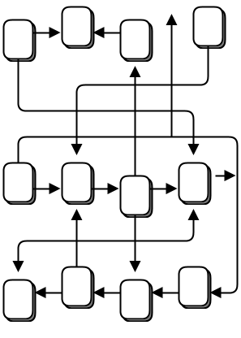
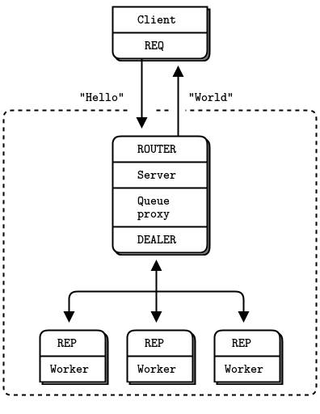

# ZeroMQ Guide

- [ZeroMQ Guide](#zeromq-guide)
  - [Basics](#basics)
    - [Hello World](#hello-world)
    - [A Minor Note on Strings](#a-minor-note-on-strings)
    - [A Note on the Naming Convention](#a-note-on-the-naming-convention)
    - [Getting the Message Out](#getting-the-message-out)
    - [Divide and Conquer](#divide-and-conquer)
    - [Programming with ZeroMQ](#programming-with-zeromq)
      - [Getting the Context Right](#getting-the-context-right)
      - [Making a Clean Exit](#making-a-clean-exit)
    - [Why We Needed ZeroMQ](#why-we-needed-zeromq)
    - [Socket Scalability](#socket-scalability)
  - [Sockets and Patterns](#sockets-and-patterns)
    - [The Socket API](#the-socket-api)
      - [Plugging Sockets into the Topology](#plugging-sockets-into-the-topology)
      - [Sending and Receiving Messages](#sending-and-receiving-messages)
      - [Unicast Transports](#unicast-transports)
      - [ZeroMQ is Not a Neutral Carrier](#zeromq-is-not-a-neutral-carrier)
      - [I/O Threads](#io-threads)
    - [Messaging Patterns](#messaging-patterns)
      - [High-Level Messaging Patterns](#high-level-messaging-patterns)
      - [Working with Messages](#working-with-messages)
      - [Handling Multiple Sockets](#handling-multiple-sockets)
      - [Multipart Messages](#multipart-messages)
      - [Intermediaries and Proxies](#intermediaries-and-proxies)
      - [The Dynamic Discovery Problem](#the-dynamic-discovery-problem)
      - [Shared Queue (DEALER and ROUTER sockets)](#shared-queue-dealer-and-router-sockets)
      - [ZeroMQ’s Built-In Proxy Function](#zeromqs-built-in-proxy-function)
      - [Transport Bridging](#transport-bridging)
    - [Handling Errors and ETERM](#handling-errors-and-eterm)
    - [Handling Interrupt Signals](#handling-interrupt-signals)
    - [Detecting Memory Leaks](#detecting-memory-leaks)
    - [Multithreading with ZeroMQ](#multithreading-with-zeromq)
    - [Signaling Between Threads (PAIR Sockets)](#signaling-between-threads-pair-sockets)
    - [Node Coordination](#node-coordination)
    - [Zero-Copy](#zero-copy)
    - [Pub-Sub Message Envelopes](#pub-sub-message-envelopes)
    - [High-Water Marks](#high-water-marks)
    - [Missing Message Problem Solver](#missing-message-problem-solver)

## Basics

### Hello World

So let's start with some code. We start of course with a Hello World example. We'll make a client and a server. The client sends "Hello" to the server, which replies with "World". Here's the server in C, which opens a ZeroMQ socket on port 5555, reads requests on it, and replies with "World" to each request:

```c++
//
//  Hello World server in C++
//  Binds REP socket to tcp://*:5555
//  Expects "Hello" from client, replies with "World"
//
#include <zmq.hpp>
#include <string>
#include <iostream>
#ifndef _WIN32
#include <unistd.h>
#else
#include <windows.h>

#define sleep(n)	Sleep(n)
#endif

int main () {
    //  Prepare our context and socket
    zmq::context_t context (1);
    zmq::socket_t socket (context, ZMQ_REP);
    socket.bind ("tcp://*:5555");

    while (true) {
        zmq::message_t request;

        //  Wait for next request from client
        socket.recv (&request);
        std::cout << "Received Hello" << std::endl;

        //  Do some 'work'
    	sleep(1);

        //  Send reply back to client
        zmq::message_t reply (5);
        memcpy (reply.data (), "World", 5);
        socket.send (reply);
    }
    return 0;
}
```


The REQ-REP socket pair is in lockstep. The client issues zmq_send() and then zmq_recv(), in a loop (or once if that's all it needs). Doing any other sequence (e.g., sending two messages in a row) will result in a return code of -1 from the send or recv call. Similarly, the service issues zmq_recv() and then zmq_send() in that order, as often as it needs to.

ZeroMQ uses C as its reference language and this is the main language we'll use for examples. If you're reading this online, the link below the example takes you to translations into other programming languages. Let's compare the same server in C++:

```c++
//
//  Hello World server in C++
//  Binds REP socket to tcp://*:5555
//  Expects "Hello" from client, replies with "World"
//
#include <zmq.hpp>
#include <string>
#include <iostream>
#ifndef _WIN32
#include <unistd.h>
#else
#include <windows.h>

#define sleep(n)	Sleep(n)
#endif

int main () {
    //  Prepare our context and socket
    zmq::context_t context (1);
    zmq::socket_t socket (context, ZMQ_REP);
    socket.bind ("tcp://*:5555");

    while (true) {
        zmq::message_t request;

        //  Wait for next request from client
        socket.recv (&request);
        std::cout << "Received Hello" << std::endl;

        //  Do some 'work'
    	sleep(1);

        //  Send reply back to client
        zmq::message_t reply (5);
        memcpy (reply.data (), "World", 5);
        socket.send (reply);
    }
    return 0;
}
```

Here's the client code:

```c++
//
//  Hello World client in C++
//  Connects REQ socket to tcp://localhost:5555
//  Sends "Hello" to server, expects "World" back
//
#include <zmq.hpp>
#include <string>
#include <iostream>

int main ()
{
    //  Prepare our context and socket
    zmq::context_t context (1);
    zmq::socket_t socket (context, ZMQ_REQ);

    std::cout << "Connecting to hello world server..." << std::endl;
    socket.connect ("tcp://localhost:5555");

    //  Do 10 requests, waiting each time for a response
    for (int request_nbr = 0; request_nbr != 10; request_nbr++) {
        zmq::message_t request (5);
        memcpy (request.data (), "Hello", 5);
        std::cout << "Sending Hello " << request_nbr << "..." << std::endl;
        socket.send (request);

        //  Get the reply.
        zmq::message_t reply;
        socket.recv (&reply);
        std::cout << "Received World " << request_nbr << std::endl;
    }
    return 0;
}
```

Now this looks too simple to be realistic, but ZeroMQ sockets have, as we already learned, superpowers. You could throw thousands of clients at this server, all at once, and it would continue to work happily and quickly. For fun, try starting the client and then starting the server, see how it all still works, then think for a second what this means.

Let us explain briefly what these two programs are actually doing. They create a ZeroMQ context to work with, and a socket. Don't worry what the words mean. You'll pick it up. The server binds its REP (reply) socket to port 5555. The server waits for a request in a loop, and responds each time with a reply. The client sends a request and reads the reply back from the server.

If you kill the server (Ctrl-C) and restart it, the client won't recover properly. Recovering from crashing processes isn't quite that easy. Making a reliable request-reply flow is complex enough that we won't cover it until Chapter 4 - Reliable Request-Reply Patterns.

There is a lot happening behind the scenes but what matters to us programmers is how short and sweet the code is, and how often it doesn't crash, even under a heavy load. This is the request-reply pattern, probably the simplest way to use ZeroMQ. It maps to RPC and the classic client/server model.

### A Minor Note on Strings

ZeroMQ doesn't know anything about the data you send except its size in bytes. That means you are responsible for formatting it safely so that applications can read it back. Doing this for objects and complex data types is a job for specialized libraries like Protocol Buffers. But even for strings, you need to take care.

In C and some other languages, strings are terminated with a null byte. We could send a string like "HELLO" with that extra null byte:

zmq_send (requester, "Hello", 6, 0);
However, if you send a string from another language, it probably will not include that null byte. For example, when we send that same string in Python, we do this:

socket.send ("Hello")
Then what goes onto the wire is a length (one byte for shorter strings) and the string contents as individual characters.


And if you read this from a C program, you will get something that looks like a string, and might by accident act like a string (if by luck the five bytes find themselves followed by an innocently lurking null), but isn't a proper string. When your client and server don't agree on the string format, you will get weird results.

When you receive string data from ZeroMQ in C, you simply cannot trust that it's safely terminated. Every single time you read a string, you should allocate a new buffer with space for an extra byte, copy the string, and terminate it properly with a null.

So let's establish the rule that ZeroMQ strings are length-specified and are sent on the wire without a trailing null. In the simplest case (and we'll do this in our examples), a ZeroMQ string maps neatly to a ZeroMQ message frame, which looks like the above figure–a length and some bytes.

Here is what we need to do, in C, to receive a ZeroMQ string and deliver it to the application as a valid C string:

```c++
//  Receive ZeroMQ string from socket and convert into C string
//  Chops string at 255 chars, if it's longer
static char *
s_recv (void *socket) {
    char buffer [256];
    int size = zmq_recv (socket, buffer, 255, 0);
    if (size == -1)
        return NULL;
    if (size > 255)
        size = 255;
    buffer [size] = \0;
    /* use strndup(buffer, sizeof(buffer)-1) in *nix */
    return strdup (buffer);
}
```

This makes a handy helper function and in the spirit of making things we can reuse profitably, let's write a similar s_send function that sends strings in the correct ZeroMQ format, and package this into a header file we can reuse.

The result is zhelpers.h, which lets us write sweeter and shorter ZeroMQ applications in C. It is a fairly long source, and only fun for C developers, so read it at leisure.

### A Note on the Naming Convention

The prefix s_ used in zhelpers.h and the examples which follow in this guide is an indicator for static methods or variables.

### Getting the Message Out

The second classic pattern is one-way data distribution, in which a server pushes updates to a set of clients. Let's see an example that pushes out weather updates consisting of a zip code, temperature, and relative humidity. We'll generate random values, just like the real weather stations do.

Here's the server. We'll use port 5556 for this application:

```c++
//
//  Weather update server in C++
//  Binds PUB socket to tcp://*:5556
//  Publishes random weather updates
//
#include <zmq.hpp>
#include <stdio.h>
#include <stdlib.h>
#include <time.h>

#if (defined (WIN32))
#include <zhelpers.hpp>
#endif

#define within(num) (int) ((float) num * random () / (RAND_MAX + 1.0))

int main () {

    //  Prepare our context and publisher
    zmq::context_t context (1);
    zmq::socket_t publisher (context, ZMQ_PUB);
    publisher.bind("tcp://*:5556");
    publisher.bind("ipc://weather.ipc");				// Not usable on Windows.

    //  Initialize random number generator
    srandom ((unsigned) time (NULL));
    while (1) {

        int zipcode, temperature, relhumidity;

        //  Get values that will fool the boss
        zipcode     = within (100000);
        temperature = within (215) - 80;
        relhumidity = within (50) + 10;

        //  Send message to all subscribers
        zmq::message_t message(20);
        snprintf ((char *) message.data(), 20 ,
        	"%05d %d %d", zipcode, temperature, relhumidity);
        publisher.send(message);

    }
    return 0;
}
```

There's no start and no end to this stream of updates, it's like a never ending broadcast.

Here is the client application, which listens to the stream of updates and grabs anything to do with a specified zip code, by default New York City because that's a great place to start any adventure:

```c++
//
//  Weather update client in C++
//  Connects SUB socket to tcp://localhost:5556
//  Collects weather updates and finds avg temp in zipcode
//

#include <zmq.hpp>
#include <iostream>
#include <sstream>

int main (int argc, char *argv[])
{
    zmq::context_t context (1);

    //  Socket to talk to server
    std::cout << "Collecting updates from weather server...\n" << std::endl;
    zmq::socket_t subscriber (context, ZMQ_SUB);
    subscriber.connect("tcp://localhost:5556");

    //  Subscribe to zipcode, default is NYC, 10001
	const char *filter = (argc > 1)? argv [1]: "10001 ";
    subscriber.setsockopt(ZMQ_SUBSCRIBE, filter, strlen (filter));

    //  Process 100 updates
    int update_nbr;
    long total_temp = 0;
    for (update_nbr = 0; update_nbr < 100; update_nbr++) {

        zmq::message_t update;
        int zipcode, temperature, relhumidity;

        subscriber.recv(&update);

        std::istringstream iss(static_cast<char*>(update.data()));
		iss >> zipcode >> temperature >> relhumidity ;

		total_temp += temperature;
    }
    std::cout 	<< "Average temperature for zipcode '"<< filter
    			<<"' was "<<(int) (total_temp / update_nbr) <<"F"
    			<< std::endl;
    return 0;
}
```


Note that when you use a SUB socket you must set a subscription using zmq_setsockopt() and SUBSCRIBE, as in this code. If you don't set any subscription, you won't get any messages. It's a common mistake for beginners. The subscriber can set many subscriptions, which are added together. That is, if an update matches ANY subscription, the subscriber receives it. The subscriber can also cancel specific subscriptions. A subscription is often, but not always, a printable string. See zmq_setsockopt() for how this works.

The PUB-SUB socket pair is asynchronous. The client does zmq_recv(), in a loop (or once if that's all it needs). Trying to send a message to a SUB socket will cause an error. Similarly, the service does zmq_send() as often as it needs to, but must not do zmq_recv() on a PUB socket.

In theory with ZeroMQ sockets, it does not matter which end connects and which end binds. However, in practice there are undocumented differences that I'll come to later. For now, bind the PUB and connect the SUB, unless your network design makes that impossible.

There is one more important thing to know about PUB-SUB sockets: you do not know precisely when a subscriber starts to get messages. Even if you start a subscriber, wait a while, and then start the publisher, the subscriber will always miss the first messages that the publisher sends. This is because as the subscriber connects to the publisher (something that takes a small but non-zero time), the publisher may already be sending messages out.

This "slow joiner" symptom hits enough people often enough that we're going to explain it in detail. Remember that ZeroMQ does asynchronous I/O, i.e., in the background. Say you have two nodes doing this, in this order:

Subscriber connects to an endpoint and receives and counts messages.
Publisher binds to an endpoint and immediately sends 1,000 messages.
Then the subscriber will most likely not receive anything. You'll blink, check that you set a correct filter and try again, and the subscriber will still not receive anything.

Making a TCP connection involves to and from handshaking that takes several milliseconds depending on your network and the number of hops between peers. In that time, ZeroMQ can send many messages. For sake of argument assume it takes 5 msecs to establish a connection, and that same link can handle 1M messages per second. During the 5 msecs that the subscriber is connecting to the publisher, it takes the publisher only 1 msec to send out those 1K messages.

In Chapter 2 - Sockets and Patterns we'll explain how to synchronize a publisher and subscribers so that you don't start to publish data until the subscribers really are connected and ready. There is a simple and stupid way to delay the publisher, which is to sleep. Don't do this in a real application, though, because it is extremely fragile as well as inelegant and slow. Use sleeps to prove to yourself what's happening, and then wait for Chapter 2 - Sockets and Patterns to see how to do this right.

The alternative to synchronization is to simply assume that the published data stream is infinite and has no start and no end. One also assumes that the subscriber doesn't care what transpired before it started up. This is how we built our weather client example.

So the client subscribes to its chosen zip code and collects 100 updates for that zip code. That means about ten million updates from the server, if zip codes are randomly distributed. You can start the client, and then the server, and the client will keep working. You can stop and restart the server as often as you like, and the client will keep working. When the client has collected its hundred updates, it calculates the average, prints it, and exits.

Some points about the publish-subscribe (pub-sub) pattern:

A subscriber can connect to more than one publisher, using one connect call each time. Data will then arrive and be interleaved ("fair-queued") so that no single publisher drowns out the others.

If a publisher has no connected subscribers, then it will simply drop all messages.

If you're using TCP and a subscriber is slow, messages will queue up on the publisher. We'll look at how to protect publishers against this using the "high-water mark" later.

From ZeroMQ v3.x, filtering happens at the publisher side when using a connected protocol (tcp:@<>@ or ipc:@<>@). Using the epgm:@<//>@ protocol, filtering happens at the subscriber side. In ZeroMQ v2.x, all filtering happened at the subscriber side.

This is how long it takes to receive and filter 10M messages on my laptop, which is an 2011-era Intel i5, decent but nothing special:

```shell
$ time wuclient
Collecting updates from weather server...
Average temperature for zipcode '10001 ' was 28F

real    0m4.470s
user    0m0.000s
sys     0m0.008s
```

### Divide and Conquer


As a final example (you are surely getting tired of juicy code and want to delve back into philological discussions about comparative abstractive norms), let's do a little supercomputing. Then coffee. Our supercomputing application is a fairly typical parallel processing model. We have:

A ventilator that produces tasks that can be done in parallel
A set of workers that process tasks
A sink that collects results back from the worker processes
In reality, workers run on superfast boxes, perhaps using GPUs (graphic processing units) to do the hard math. Here is the ventilator. It generates 100 tasks, each a message telling the worker to sleep for some number of milliseconds:

```c++
//
//  Task ventilator in C++
//  Binds PUSH socket to tcp://localhost:5557
//  Sends batch of tasks to workers via that socket
//

#include <zmq.hpp>
#include <stdlib.h>
#include <stdio.h>
#include <unistd.h>
#include <iostream>

#define within(num) (int) ((float) num * random () / (RAND_MAX + 1.0))

int main (int argc, char *argv[])
{
    zmq::context_t context (1);

    //  Socket to send messages on
    zmq::socket_t  sender(context, ZMQ_PUSH);
    sender.bind("tcp://*:5557");

    std::cout << "Press Enter when the workers are ready: " << std::endl;
    getchar ();
    std::cout << "Sending tasks to workers...\n" << std::endl;

    //  The first message is "0" and signals start of batch
    zmq::socket_t sink(context, ZMQ_PUSH);
    sink.connect("tcp://localhost:5558");
    zmq::message_t message(2);
    memcpy(message.data(), "0", 1);
    sink.send(message);

    //  Initialize random number generator
    srandom ((unsigned) time (NULL));

    //  Send 100 tasks
    int task_nbr;
    int total_msec = 0;     //  Total expected cost in msecs
    for (task_nbr = 0; task_nbr < 100; task_nbr++) {
        int workload;
        //  Random workload from 1 to 100msecs
        workload = within (100) + 1;
        total_msec += workload;

        message.rebuild(10);
        memset(message.data(), '\0', 10);
        sprintf ((char *) message.data(), "%d", workload);
        sender.send(message);
    }
    std::cout << "Total expected cost: " << total_msec << " msec" << std::endl;
    sleep (1);              //  Give 0MQ time to deliver

    return 0;
}
```

Here is the worker application. It receives a message, sleeps for that number of seconds, and then signals that it's finished:

```c++
//
//  Task worker in C++
//  Connects PULL socket to tcp://localhost:5557
//  Collects workloads from ventilator via that socket
//  Connects PUSH socket to tcp://localhost:5558
//  Sends results to sink via that socket
//

#include "zhelpers.hpp"
#include <string>

int main (int argc, char *argv[])
{
    zmq::context_t context(1);

    //  Socket to receive messages on
    zmq::socket_t receiver(context, ZMQ_PULL);
    receiver.connect("tcp://localhost:5557");

    //  Socket to send messages to
    zmq::socket_t sender(context, ZMQ_PUSH);
    sender.connect("tcp://localhost:5558");

    //  Process tasks forever
    while (1) {

        zmq::message_t message;
        int workload;           //  Workload in msecs

        receiver.recv(&message);
        std::string smessage(static_cast<char*>(message.data()), message.size());

        std::istringstream iss(smessage);
        iss >> workload;

        //  Do the work
        s_sleep(workload);

        //  Send results to sink
        message.rebuild();
        sender.send(message);

        //  Simple progress indicator for the viewer
        std::cout << "." << std::flush;
    }
    return 0;
}
```

Here is the sink application. It collects the 100 tasks, then calculates how long the overall processing took, so we can confirm that the workers really were running in parallel if there are more than one of them:

```c++
//
//  Task sink in C++
//  Binds PULL socket to tcp://localhost:5558
//  Collects results from workers via that socket
//

#include <zmq.hpp>
#include <time.h>
#include <sys/time.h>
#include <iostream>

int main (int argc, char *argv[])
{
    //  Prepare our context and socket
    zmq::context_t context(1);
    zmq::socket_t receiver(context,ZMQ_PULL);
    receiver.bind("tcp://*:5558");

    //  Wait for start of batch
    zmq::message_t message;
    receiver.recv(&message);

    //  Start our clock now
    struct timeval tstart;
    gettimeofday (&tstart, NULL);

    //  Process 100 confirmations
    int task_nbr;
    int total_msec = 0;     //  Total calculated cost in msecs
    for (task_nbr = 0; task_nbr < 100; task_nbr++) {

        receiver.recv(&message);
        if (task_nbr % 10 == 0)
            std::cout << ":" << std::flush;
        else
            std::cout << "." << std::flush;
    }
    //  Calculate and report duration of batch
    struct timeval tend, tdiff;
    gettimeofday (&tend, NULL);

    if (tend.tv_usec < tstart.tv_usec) {
        tdiff.tv_sec = tend.tv_sec - tstart.tv_sec - 1;
        tdiff.tv_usec = 1000000 + tend.tv_usec - tstart.tv_usec;
    }
    else {
        tdiff.tv_sec = tend.tv_sec - tstart.tv_sec;
        tdiff.tv_usec = tend.tv_usec - tstart.tv_usec;
    }
    total_msec = tdiff.tv_sec * 1000 + tdiff.tv_usec / 1000;
    std::cout << "\nTotal elapsed time: " << total_msec << " msec\n" << std::endl;
    return 0;
}
```

The average cost of a batch is 5 seconds. When we start 1, 2, or 4 workers we get results like this from the sink:

1 worker: total elapsed time: 5034 msecs.
2 workers: total elapsed time: 2421 msecs.
4 workers: total elapsed time: 1018 msecs.
Let's look at some aspects of this code in more detail:

The workers connect upstream to the ventilator, and downstream to the sink. This means you can add workers arbitrarily. If the workers bound to their endpoints, you would need (a) more endpoints and (b) to modify the ventilator and/or the sink each time you added a worker. We say that the ventilator and sink are stable parts of our architecture and the workers are dynamic parts of it.

We have to synchronize the start of the batch with all workers being up and running. This is a fairly common gotcha in ZeroMQ and there is no easy solution. The zmq_connect method takes a certain time. So when a set of workers connect to the ventilator, the first one to successfully connect will get a whole load of messages in that short time while the others are also connecting. If you don't synchronize the start of the batch somehow, the system won't run in parallel at all. Try removing the wait in the ventilator, and see what happens.

The ventilator's PUSH socket distributes tasks to workers (assuming they are all connected before the batch starts going out) evenly. This is called load balancing and it's something we'll look at again in more detail.

The sink's PULL socket collects results from workers evenly. This is called fair-queuing.


The pipeline pattern also exhibits the "slow joiner" syndrome, leading to accusations that PUSH sockets don't load balance properly. If you are using PUSH and PULL, and one of your workers gets way more messages than the others, it's because that PULL socket has joined faster than the others, and grabs a lot of messages before the others manage to connect. If you want proper load balancing, you probably want to look at the load balancing pattern in Chapter 3 - Advanced Request-Reply Patterns.

### Programming with ZeroMQ

Having seen some examples, you must be eager to start using ZeroMQ in some apps. Before you start that, take a deep breath, chillax, and reflect on some basic advice that will save you much stress and confusion.

- Learn ZeroMQ step-by-step. It's just one simple API, but it hides a world of possibilities. Take the possibilities slowly and master each one.
- Write nice code. Ugly code hides problems and makes it hard for others to help you. You might get used to meaningless variable names, but people reading your code won't. Use names that are real words, that say something other than "I'm too careless to tell you what this variable is really for". Use consistent indentation and clean layout. Write nice code and your world will be more comfortable.
- Test what you make as you make it. When your program doesn't work, you should know what five lines are to blame. This is especially true when you do ZeroMQ magic, which just won't work the first few times you try it.
- When you find that things don't work as expected, break your code into pieces, test each one, see which one is not working. ZeroMQ lets you make essentially modular code; use that to your advantage.
- Make abstractions (classes, methods, whatever) as you need them. If you copy/paste a lot of code, you're going to copy/paste errors, too.

#### Getting the Context Right

ZeroMQ applications always start by creating a context, and then using that for creating sockets. In C, it's the zmq_ctx_new() call. You should create and use exactly one context in your process. Technically, the context is the container for all sockets in a single process, and acts as the transport for inproc sockets, which are the fastest way to connect threads in one process. If at runtime a process has two contexts, these are like separate ZeroMQ instances. If that's explicitly what you want, OK, but otherwise remember:

Call zmq_ctx_new() once at the start of a process, and zmq_ctx_destroy() once at the end.

If you're using the fork() system call, do zmq_ctx_new() after the fork and at the beginning of the child process code. In general, you want to do interesting (ZeroMQ) stuff in the children, and boring process management in the parent.

#### Making a Clean Exit

Classy programmers share the same motto as classy hit men: always clean-up when you finish the job. When you use ZeroMQ in a language like Python, stuff gets automatically freed for you. But when using C, you have to carefully free objects when you're finished with them or else you get memory leaks, unstable applications, and generally bad karma.

Memory leaks are one thing, but ZeroMQ is quite finicky about how you exit an application. The reasons are technical and painful, but the upshot is that if you leave any sockets open, the zmq_ctx_destroy() function will hang forever. And even if you close all sockets, zmq_ctx_destroy() will by default wait forever if there are pending connects or sends unless you set the LINGER to zero on those sockets before closing them.

The ZeroMQ objects we need to worry about are messages, sockets, and contexts. Luckily it's quite simple, at least in simple programs:

- Use zmq_send() and zmq_recv() when you can, as it avoids the need to work with zmq_msg_t objects.
- If you do use zmq_msg_recv(), always release the received message as soon as you're done with it, by calling zmq_msg_close().
- If you are opening and closing a lot of sockets, that's probably a sign that you need to redesign your application. In some cases socket handles won't be freed until you destroy the context.
- When you exit the program, close your sockets and then call zmq_ctx_destroy(). This destroys the context.

This is at least the case for C development. In a language with automatic object destruction, sockets and contexts will be destroyed as you leave the scope. If you use exceptions you'll have to do the clean-up in something like a "final" block, the same as for any resource.

If you're doing multithreaded work, it gets rather more complex than this. We'll get to multithreading in the next chapter, but because some of you will, despite warnings, try to run before you can safely walk, below is the quick and dirty guide to making a clean exit in a multithreaded ZeroMQ application.

First, do not try to use the same socket from multiple threads. Please don't explain why you think this would be excellent fun, just please don't do it. Next, you need to shut down each socket that has ongoing requests. The proper way is to set a low LINGER value (1 second), and then close the socket. If your language binding doesn't do this for you automatically when you destroy a context, I'd suggest sending a patch.

Finally, destroy the context. This will cause any blocking receives or polls or sends in attached threads (i.e., which share the same context) to return with an error. Catch that error, and then set linger on, and close sockets in that thread, and exit. Do not destroy the same context twice. The zmq_ctx_destroy in the main thread will block until all sockets it knows about are safely closed.

Voila! It's complex and painful enough that any language binding author worth his or her salt will do this automatically and make the socket closing dance unnecessary.

### Why We Needed ZeroMQ

Now that you've seen ZeroMQ in action, let's go back to the "why".

Many applications these days consist of components that stretch across some kind of network, either a LAN or the Internet. So many application developers end up doing some kind of messaging. Some developers use message queuing products, but most of the time they do it themselves, using TCP or UDP. These protocols are not hard to use, but there is a great difference between sending a few bytes from A to B, and doing messaging in any kind of reliable way.

Let's look at the typical problems we face when we start to connect pieces using raw TCP. Any reusable messaging layer would need to solve all or most of these:

- How do we handle I/O? Does our application block, or do we handle I/O in the background? This is a key design decision. Blocking I/O creates architectures that do not scale well. But background I/O can be very hard to do right.

- How do we handle dynamic components, i.e., pieces that go away temporarily? Do we formally split components into "clients" and "servers" and mandate that servers cannot disappear? What then if we want to connect servers to servers? Do we try to reconnect every few seconds?

- How do we represent a message on the wire? How do we frame data so it's easy to write and read, safe from buffer overflows, efficient for small messages, yet adequate for the very largest videos of dancing cats wearing party hats?

- How do we handle messages that we can't deliver immediately? Particularly, if we're waiting for a component to come back online? Do we discard messages, put them into a database, or into a memory queue?

- Where do we store message queues? What happens if the component reading from a queue is very slow and causes our queues to build up? What's our strategy then?

- How do we handle lost messages? Do we wait for fresh data, request a resend, or do we build some kind of reliability layer that ensures messages cannot be lost? What if that layer itself crashes?

- What if we need to use a different network transport. Say, multicast instead of TCP unicast? Or IPv6? Do we need to rewrite the applications, or is the transport abstracted in some layer?

- How do we route messages? Can we send the same message to multiple peers? Can we send replies back to an original requester?

- How do we write an API for another language? Do we re-implement a wire-level protocol or do we repackage a library? If the former, how can we guarantee efficient and stable stacks? If the latter, how can we guarantee interoperability?

- How do we represent data so that it can be read between different architectures? Do we enforce a particular encoding for data types? How far is this the job of the messaging system rather than a higher layer?

- How do we handle network errors? Do we wait and retry, ignore them silently, or abort?

Take a typical open source project like Hadoop Zookeeper and read the C API code in src/c/src/zookeeper.c. When I read this code, in January 2013, it was 4,200 lines of mystery and in there is an undocumented, client/server network communication protocol. I see it's efficient because it uses poll instead of select. But really, Zookeeper should be using a generic messaging layer and an explicitly documented wire level protocol. It is incredibly wasteful for teams to be building this particular wheel over and over.

But how to make a reusable messaging layer? Why, when so many projects need this technology, are people still doing it the hard way by driving TCP sockets in their code, and solving the problems in that long list over and over?

It turns out that building reusable messaging systems is really difficult, which is why few FOSS projects ever tried, and why commercial messaging products are complex, expensive, inflexible, and brittle. In 2006, iMatix designed AMQP which started to give FOSS developers perhaps the first reusable recipe for a messaging system. AMQP works better than many other designs, but remains relatively complex, expensive, and brittle. It takes weeks to learn to use, and months to create stable architectures that don't crash when things get hairy.


Most messaging projects, like AMQP, that try to solve this long list of problems in a reusable way do so by inventing a new concept, the "broker", that does addressing, routing, and queuing. This results in a client/server protocol or a set of APIs on top of some undocumented protocol that allows applications to speak to this broker. Brokers are an excellent thing in reducing the complexity of large networks. But adding broker-based messaging to a product like Zookeeper would make it worse, not better. It would mean adding an additional big box, and a new single point of failure. A broker rapidly becomes a bottleneck and a new risk to manage. If the software supports it, we can add a second, third, and fourth broker and make some failover scheme. People do this. It creates more moving pieces, more complexity, and more things to break.

And a broker-centric setup needs its own operations team. You literally need to watch the brokers day and night, and beat them with a stick when they start misbehaving. You need boxes, and you need backup boxes, and you need people to manage those boxes. It is only worth doing for large applications with many moving pieces, built by several teams of people over several years.



So small to medium application developers are trapped. Either they avoid network programming and make monolithic applications that do not scale. Or they jump into network programming and make brittle, complex applications that are hard to maintain. Or they bet on a messaging product, and end up with scalable applications that depend on expensive, easily broken technology. There has been no really good choice, which is maybe why messaging is largely stuck in the last century and stirs strong emotions: negative ones for users, gleeful joy for those selling support and licenses.

What we need is something that does the job of messaging, but does it in such a simple and cheap way that it can work in any application, with close to zero cost. It should be a library which you just link, without any other dependencies. No additional moving pieces, so no additional risk. It should run on any OS and work with any programming language.

And this is ZeroMQ: an efficient, embeddable library that solves most of the problems an application needs to become nicely elastic across a network, without much cost.

Specifically:

It handles I/O asynchronously, in background threads. These communicate with application threads using lock-free data structures, so concurrent ZeroMQ applications need no locks, semaphores, or other wait states.

Components can come and go dynamically and ZeroMQ will automatically reconnect. This means you can start components in any order. You can create "service-oriented architectures" (SOAs) where services can join and leave the network at any time.

- It queues messages automatically when needed. It does this intelligently, pushing messages as close as possible to the receiver before queuing them.

It has ways of dealing with over-full queues (called "high water mark"). When a queue is full, ZeroMQ automatically blocks senders, or throws away messages, depending on the kind of messaging you are doing (the so-called "pattern").

It lets your applications talk to each other over arbitrary transports: TCP, multicast, in-process, inter-process. You don't need to change your code to use a different transport.

It handles slow/blocked readers safely, using different strategies that depend on the messaging pattern.

It lets you route messages using a variety of patterns such as request-reply and pub-sub. These patterns are how you create the topology, the structure of your network.

It lets you create proxies to queue, forward, or capture messages with a single call. Proxies can reduce the interconnection complexity of a network.

It delivers whole messages exactly as they were sent, using a simple framing on the wire. If you write a 10k message, you will receive a 10k message.

It does not impose any format on messages. They are blobs from zero to gigabytes large. When you want to represent data you choose some other product on top, such as msgpack, Google's protocol buffers, and others.

It handles network errors intelligently, by retrying automatically in cases where it makes sense.

- It reduces your carbon footprint. Doing more with less CPU means your boxes use less power, and you can keep your old boxes in use for longer. Al Gore would love ZeroMQ.

Actually ZeroMQ does rather more than this. It has a subversive effect on how you develop network-capable applications. Superficially, it's a socket-inspired API on which you do zmq_recv() and zmq_send(). But message processing rapidly becomes the central loop, and your application soon breaks down into a set of message processing tasks. It is elegant and natural. And it scales: each of these tasks maps to a node, and the nodes talk to each other across arbitrary transports. Two nodes in one process (node is a thread), two nodes on one box (node is a process), or two nodes on one network (node is a box)–it's all the same, with no application code changes.

### Socket Scalability

Let's see ZeroMQ's scalability in action. Here is a shell script that starts the weather server and then a bunch of clients in parallel:

```shell
wuserver &
wuclient 12345 &
wuclient 23456 &
wuclient 34567 &
wuclient 45678 &
wuclient 56789 &
```

As the clients run, we take a look at the active processes using the top command', and we see something like (on a 4-core box):

```
PID  USER  PR  NI  VIRT  RES  SHR S %CPU %MEM   TIME+  COMMAND
7136  ph   20   0 1040m 959m 1156 R  157 12.0 16:25.47 wuserver
7966  ph   20   0 98608 1804 1372 S   33  0.0  0:03.94 wuclient
7963  ph   20   0 33116 1748 1372 S   14  0.0  0:00.76 wuclient
7965  ph   20   0 33116 1784 1372 S    6  0.0  0:00.47 wuclient
7964  ph   20   0 33116 1788 1372 S    5  0.0  0:00.25 wuclient
7967  ph   20   0 33072 1740 1372 S    5  0.0  0:00.35 wuclient
```

Let's think for a second about what is happening here. The weather server has a single socket, and yet here we have it sending data to five clients in parallel. We could have thousands of concurrent clients. The server application doesn't see them, doesn't talk to them directly. So the ZeroMQ socket is acting like a little server, silently accepting client requests and shoving data out to them as fast as the network can handle it. And it's a multithreaded server, squeezing more juice out of your CPU.

## Sockets and Patterns

In Chapter 1 - Basics we took ZeroMQ for a drive, with some basic examples of the main ZeroMQ patterns: request-reply, pub-sub, and pipeline. In this chapter, we're going to get our hands dirty and start to learn how to use these tools in real programs.

We'll cover:

- How to create and work with ZeroMQ sockets.
- How to send and receive messages on sockets.
- How to build your apps around ZeroMQ's asynchronous I/O model.
- How to handle multiple sockets in one thread.
- How to handle fatal and nonfatal errors properly.
- How to handle interrupt signals like Ctrl-C.
- How to shut down a ZeroMQ application cleanly.
- How to check a ZeroMQ application for memory leaks.
- How to send and receive multipart messages.
- How to forward messages across networks.
- How to build a simple message queuing broker.
- How to write multithreaded applications with ZeroMQ.
- How to use ZeroMQ to signal between threads.
- How to use ZeroMQ to coordinate a network of nodes.
- How to create and use message envelopes for pub-sub.
- Using the HWM (high-water mark) to protect against memory overflows.

### The Socket API

To be perfectly honest, ZeroMQ does a kind of switch-and-bait on you, for which we don't apologize. It's for your own good and it hurts us more than it hurts you. ZeroMQ presents a familiar socket-based API, which requires great effort for us to hide a bunch of message-processing engines. However, the result will slowly fix your world view about how to design and write distributed software.

Sockets are the de facto standard API for network programming, as well as being useful for stopping your eyes from falling onto your cheeks. One thing that makes ZeroMQ especially tasty to developers is that it uses sockets and messages instead of some other arbitrary set of concepts. 

Like a favorite dish, ZeroMQ sockets are easy to digest. Sockets have a life in four parts, just like BSD sockets:

- Creating and destroying sockets, which go together to form a karmic circle of socket life (see `zmq_socket()`, `zmq_close()`).
- Configuring sockets by setting options on them and checking them if necessary (see `zmq_setsockopt()`, `zmq_getsockopt()`).
- Plugging sockets into the network topology by creating ZeroMQ connections to and from them (see `zmq_bind()`, `zmq_connect()`).
- Using the sockets to carry data by writing and receiving messages on them (see `zmq_msg_send()`, `zmq_msg_recv()`).

Note that sockets are always void pointers, and messages (which we'll come to very soon) are structures. So in C you pass sockets as-such, but you pass addresses of messages in all functions that work with messages, like `zmq_msg_send()` and `zmq_msg_recv()`. As a mnemonic, realize that "in ZeroMQ, all your sockets are belong to us", but messages are things you actually own in your code.

Creating, destroying, and configuring sockets works as you'd expect for any object. But remember that ZeroMQ is an asynchronous, elastic fabric. This has some impact on how we plug sockets into the network topology and how we use the sockets after that.

#### Plugging Sockets into the Topology

To create a connection between two nodes, you use `zmq_bind()` in one node and `zmq_connect()` in the other. As a general rule of thumb, the node that does `zmq_bind()` is a "server", sitting on a well-known network address, and the node which does `zmq_connect()` is a "client", with unknown or arbitrary network addresses. Thus we say that we "bind a socket to an endpoint" and "connect a socket to an endpoint", the endpoint being that well-known network address.

ZeroMQ connections are somewhat different from classic TCP connections. The main notable differences are:

- They go across an arbitrary transport (inproc, ipc, tcp, pgm, or epgm). See `zmq_inproc()`, `zmq_ipc()`, `zmq_tcp()`, `zmq_pgm()`, and `zmq_epgm()`.
- One socket may have many outgoing and many incoming connections.
- There is no `zmq_accept()` method. When a socket is bound to an endpoint it automatically starts accepting connections.
- The network connection itself happens in the background, and ZeroMQ will automatically reconnect if the network connection is broken (e.g., if the peer disappears and then comes back).
- Your application code cannot work with these connections directly; they are encapsulated under the socket.

Many architectures follow some kind of client/server model, where the server is the component that is most static, and the clients are the components that are most dynamic, i.e., they come and go the most. There are sometimes issues of addressing: servers will be visible to clients, but not necessarily vice versa. So mostly it's obvious which node should be doing zmq_bind() (the server) and which should be doing zmq_connect() (the client). It also depends on the kind of sockets you're using, with some exceptions for unusual network architectures. We'll look at socket types later.

Now, imagine we start the client before we start the server. In traditional networking, we get a big red Fail flag. But ZeroMQ lets us start and stop pieces arbitrarily. As soon as the client node does zmq_connect(), the connection exists and that node can start to write messages to the socket. At some stage (hopefully before messages queue up so much that they start to get discarded, or the client blocks), the server comes alive, does a zmq_bind(), and ZeroMQ starts to deliver messages.

A server node can bind to many endpoints (that is, a combination of protocol and address) and it can do this using a single socket. This means it will accept connections across different transports:

```c++
zmq_bind (socket, "tcp://*:5555");
zmq_bind (socket, "tcp://*:9999");
zmq_bind (socket, "inproc://somename");
```

With most transports, you cannot bind to the same endpoint twice, unlike for example in UDP. The ipc transport does, however, let one process bind to an endpoint already used by a first process. It's meant to allow a process to recover after a crash.

Although ZeroMQ tries to be neutral about which side binds and which side connects, there are differences. We'll see these in more detail later. The upshot is that you should usually think in terms of "servers" as static parts of your topology that bind to more or less fixed endpoints, and "clients" as dynamic parts that come and go and connect to these endpoints. Then, design your application around this model. The chances that it will "just work" are much better like that.

Sockets have types. The socket type defines the semantics of the socket, its policies for routing messages inwards and outwards, queuing, etc. You can connect certain types of socket together, e.g., a publisher socket and a subscriber socket. Sockets work together in "messaging patterns". We'll look at this in more detail later.

It's the ability to connect sockets in these different ways that gives ZeroMQ its basic power as a message queuing system. There are layers on top of this, such as proxies, which we'll get to later. But essentially, with ZeroMQ you define your network architecture by plugging pieces together like a child's construction toy.

#### Sending and Receiving Messages

To send and receive messages you use the zmq_msg_send() and zmq_msg_recv() methods. The names are conventional, but ZeroMQ's I/O model is different enough from the classic TCP model that you will need time to get your head around it.


Let’s look at the main differences between TCP sockets and ZeroMQ sockets when it comes to working with data:

- ZeroMQ sockets carry messages, like UDP, rather than a stream of bytes as TCP does. A ZeroMQ message is length-specified binary data. We’ll come to messages shortly; their design is optimized for performance and so a little tricky.
- ZeroMQ sockets do their I/O in a background thread. This means that messages arrive in local input queues and are sent from local output queues, no matter what your application is busy doing.
- ZeroMQ sockets have one-to-N routing behavior built-in, according to the socket type.

The zmq_send() method does not actually send the message to the socket connection(s). It queues the message so that the I/O thread can send it asynchronously. It does not block except in some exception cases. So the message is not necessarily sent when zmq_send() returns to your application.

#### Unicast Transports

ZeroMQ provides a set of unicast transports (inproc, ipc, and tcp) and multicast transports (epgm, pgm). Multicast is an advanced technique that we’ll come to later. Don’t even start using it unless you know that your fan-out ratios will make 1-to-N unicast impossible.

For most common cases, use tcp, which is a disconnected TCP transport. It is elastic, portable, and fast enough for most cases. We call this disconnected because ZeroMQ’s tcp transport doesn’t require that the endpoint exists before you connect to it. Clients and servers can connect and bind at any time, can go and come back, and it remains transparent to applications.

The inter-process ipc transport is disconnected, like tcp. It has one limitation: it does not yet work on Windows. By convention we use endpoint names with an “.ipc” extension to avoid potential conflict with other file names. On UNIX systems, if you use ipc endpoints you need to create these with appropriate permissions otherwise they may not be shareable between processes running under different user IDs. You must also make sure all processes can access the files, e.g., by running in the same working directory.

The inter-thread transport, inproc, is a connected signaling transport. It is much faster than tcp or ipc. This transport has a specific limitation compared to tcp and ipc: the server must issue a bind before any client issues a connect. This is something future versions of ZeroMQ may fix, but at present this defines how you use inproc sockets. We create and bind one socket and start the child threads, which create and connect the other sockets.

#### ZeroMQ is Not a Neutral Carrier

A common question that newcomers to ZeroMQ ask (it’s one I’ve asked myself) is, “how do I write an XYZ server in ZeroMQ?” For example, “how do I write an HTTP server in ZeroMQ?” The implication is that if we use normal sockets to carry HTTP requests and responses, we should be able to use ZeroMQ sockets to do the same, only much faster and better.

The answer used to be “this is not how it works”. ZeroMQ is not a neutral carrier: it imposes a framing on the transport protocols it uses. This framing is not compatible with existing protocols, which tend to use their own framing. For example, compare an HTTP request and a ZeroMQ request, both over TCP/IP.


The HTTP request uses CR-LF as its simplest framing delimiter, whereas ZeroMQ uses a length-specified frame. So you could write an HTTP-like protocol using ZeroMQ, using for example the request-reply socket pattern. But it would not be HTTP.


Since v3.3, however, ZeroMQ has a socket option called ZMQ_ROUTER_RAW that lets you read and write data without the ZeroMQ framing. You could use this to read and write proper HTTP requests and responses. Hardeep Singh contributed this change so that he could connect to Telnet servers from his ZeroMQ application. At time of writing this is still somewhat experimental, but it shows how ZeroMQ keeps evolving to solve new problems. Maybe the next patch will be yours.

#### I/O Threads

We said that ZeroMQ does I/O in a background thread. One I/O thread (for all sockets) is sufficient for all but the most extreme applications. When you create a new context, it starts with one I/O thread. The general rule of thumb is to allow one I/O thread per gigabyte of data in or out per second. To raise the number of I/O threads, use the zmq_ctx_set() call before creating any sockets:

```c++
int io_threads = 4;
void *context = zmq_ctx_new ();
zmq_ctx_set (context, ZMQ_IO_THREADS, io_threads);
assert (zmq_ctx_get (context, ZMQ_IO_THREADS) == io_threads);
```

We’ve seen that one socket can handle dozens, even thousands of connections at once. This has a fundamental impact on how you write applications. A traditional networked application has one process or one thread per remote connection, and that process or thread handles one socket. ZeroMQ lets you collapse this entire structure into a single process and then break it up as necessary for scaling.

If you are using ZeroMQ for inter-thread communications only (i.e., a multithreaded application that does no external socket I/O) you can set the I/O threads to zero. It’s not a significant optimization though, more of a curiosity.

### Messaging Patterns

Underneath the brown paper wrapping of ZeroMQ’s socket API lies the world of messaging patterns. If you have a background in enterprise messaging, or know UDP well, these will be vaguely familiar. But to most ZeroMQ newcomers, they are a surprise. We’re so used to the TCP paradigm where a socket maps one-to-one to another node.

Let’s recap briefly what ZeroMQ does for you. It delivers blobs of data (messages) to nodes, quickly and efficiently. You can map nodes to threads, processes, or nodes. ZeroMQ gives your applications a single socket API to work with, no matter what the actual transport (like in-process, inter-process, TCP, or multicast). It automatically reconnects to peers as they come and go. It queues messages at both sender and receiver, as needed. It limits these queues to guard processes against running out of memory. It handles socket errors. It does all I/O in background threads. It uses lock-free techniques for talking between nodes, so there are never locks, waits, semaphores, or deadlocks.

But cutting through that, it routes and queues messages according to precise recipes called patterns. It is these patterns that provide ZeroMQ’s intelligence. They encapsulate our hard-earned experience of the best ways to distribute data and work. ZeroMQ’s patterns are hard-coded but future versions may allow user-definable patterns.

ZeroMQ patterns are implemented by pairs of sockets with matching types. In other words, to understand ZeroMQ patterns you need to understand socket types and how they work together. Mostly, this just takes study; there is little that is obvious at this level.

The built-in core ZeroMQ patterns are:

- Request-reply, which connects a set of clients to a set of services. This is a remote procedure call and task distribution pattern.
- Pub-sub, which connects a set of publishers to a set of subscribers. This is a data distribution pattern.
- Pipeline, which connects nodes in a fan-out/fan-in pattern that can have multiple steps and loops. This is a parallel task distribution and collection pattern.
- Exclusive pair, which connects two sockets exclusively. This is a pattern for connecting two threads in a process, not to be confused with “normal” pairs of sockets.

We looked at the first three of these in Chapter 1 - Basics, and we’ll see the exclusive pair pattern later in this chapter. The zmq_socket() man page is fairly clear about the patterns – it’s worth reading several times until it starts to make sense. These are the socket combinations that are valid for a connect-bind pair (either side can bind):

- PUB and SUB
- REQ and REP
- REQ and ROUTER (take care, REQ inserts an extra null frame)
- DEALER and REP (take care, REP assumes a null frame)
- DEALER and ROUTER
- DEALER and DEALER
- ROUTER and ROUTER
- PUSH and PULL
- PAIR and PAIR

You’ll also see references to XPUB and XSUB sockets, which we’ll come to later (they’re like raw versions of PUB and SUB). Any other combination will produce undocumented and unreliable results, and future versions of ZeroMQ will probably return errors if you try them. You can and will, of course, bridge other socket types via code, i.e., read from one socket type and write to another.

#### High-Level Messaging Patterns

These four core patterns are cooked into ZeroMQ. They are part of the ZeroMQ API, implemented in the core C++ library, and are guaranteed to be available in all fine retail stores.

On top of those, we add high-level messaging patterns. We build these high-level patterns on top of ZeroMQ and implement them in whatever language we’re using for our application. They are not part of the core library, do not come with the ZeroMQ package, and exist in their own space as part of the ZeroMQ community. For example the Majordomo pattern, which we explore in Chapter 4 - Reliable Request-Reply Patterns, sits in the GitHub Majordomo project in the ZeroMQ organization.

One of the things we aim to provide you with in this book are a set of such high-level patterns, both small (how to handle messages sanely) and large (how to make a reliable pub-sub architecture).

#### Working with Messages

The libzmq core library has in fact two APIs to send and receive messages. The zmq_send() and zmq_recv() methods that we’ve already seen and used are simple one-liners. We will use these often, but zmq_recv() is bad at dealing with arbitrary message sizes: it truncates messages to whatever buffer size you provide. So there’s a second API that works with zmq_msg_t structures, with a richer but more difficult API:

- Initialise a message: zmq_msg_init(), zmq_msg_init_size(), zmq_msg_init_data().
- Sending and receiving a message: zmq_msg_send(), zmq_msg_recv().
- Release a message: zmq_msg_close().
- Access message content: zmq_msg_data(), zmq_msg_size(), zmq_msg_more().
- Work with message properties: zmq_msg_get(), zmq_msg_set().
- Message manipulation: zmq_msg_copy(), zmq_msg_move().

On the wire, ZeroMQ messages are blobs of any size from zero upwards that fit in memory. You do your own serialization using protocol buffers, msgpack, JSON, or whatever else your applications need to speak. It’s wise to choose a data representation that is portable, but you can make your own decisions about trade-offs.

In memory, ZeroMQ messages are zmq_msg_t structures (or classes depending on your language). Here are the basic ground rules for using ZeroMQ messages in C:

- You create and pass around zmq_msg_t objects, not blocks of data.
- To read a message, you use zmq_msg_init() to create an empty message, and then you pass that to zmq_msg_recv().
- To write a message from new data, you use zmq_msg_init_size() to create a message and at the same time allocate a block of data of some size. You then fill that data using memcpy, and pass the message to zmq_msg_send().
- To release (not destroy) a message, you call zmq_msg_close(). This drops a reference, and eventually ZeroMQ will destroy the message.
- To access the message content, you use zmq_msg_data(). To know how much data the message contains, use zmq_msg_size().
- Do not use zmq_msg_move(), zmq_msg_copy(), or zmq_msg_init_data() unless you read the man pages and know precisely why you need these.
- After you pass a message to zmq_msg_send(), ØMQ will clear the message, i.e., set the size to zero. You cannot send the same message twice, and you cannot access the message data after sending it.
- These rules don’t apply if you use zmq_send() and zmq_recv(), to which you pass byte arrays, not message structures.

If you want to send the same message more than once, and it’s sizable, create a second message, initialize it using zmq_msg_init(), and then use zmq_msg_copy() to create a copy of the first message. This does not copy the data but copies a reference. You can then send the message twice (or more, if you create more copies) and the message will only be finally destroyed when the last copy is sent or closed.

ZeroMQ also supports multipart messages, which let you send or receive a list of frames as a single on-the-wire message. This is widely used in real applications and we’ll look at that later in this chapter and in Chapter 3 - Advanced Request-Reply Patterns.

Frames (also called “message parts” in the ZeroMQ reference manual pages) are the basic wire format for ZeroMQ messages. A frame is a length-specified block of data. The length can be zero upwards. If you’ve done any TCP programming you’ll appreciate why frames are a useful answer to the question “how much data am I supposed to read of this network socket now?”

There is a wire-level protocol called ZMTP that defines how ZeroMQ reads and writes frames on a TCP connection. If you’re interested in how this works, the spec is quite short.

Originally, a ZeroMQ message was one frame, like UDP. We later extended this with multipart messages, which are quite simply series of frames with a “more” bit set to one, followed by one with that bit set to zero. The ZeroMQ API then lets you write messages with a “more” flag and when you read messages, it lets you check if there’s “more”.

In the low-level ZeroMQ API and the reference manual, therefore, there’s some fuzziness about messages versus frames. So here’s a useful lexicon:

- A message can be one or more parts.
- These parts are also called “frames”.
- Each part is a zmq_msg_t object.
- You send and receive each part separately, in the low-level API.
- Higher-level APIs provide wrappers to send entire multipart messages.

Some other things that are worth knowing about messages:

- You may send zero-length messages, e.g., for sending a signal from one thread to another.
- ZeroMQ guarantees to deliver all the parts (one or more) for a message, or none of them.
- ZeroMQ does not send the message (single or multipart) right away, but at some indeterminate later time. A multipart message must therefore fit in memory.
- A message (single or multipart) must fit in memory. If you want to send files of arbitrary sizes, you should break them into pieces and send each piece as separate single-part messages. Using multipart data will not reduce memory consumption.
- You must call zmq_msg_close() when finished with a received message, in languages that don’t automatically destroy objects when a scope closes. You don’t call this method after sending a message.

And to be repetitive, do not use zmq_msg_init_data() yet. This is a zero-copy method and is guaranteed to create trouble for you. There are far more important things to learn about ZeroMQ before you start to worry about shaving off microseconds.

This rich API can be tiresome to work with. The methods are optimized for performance, not simplicity. If you start using these you will almost definitely get them wrong until you’ve read the man pages with some care. So one of the main jobs of a good language binding is to wrap this API up in classes that are easier to use.

#### Handling Multiple Sockets

In all the examples so far, the main loop of most examples has been:

1. Wait for message on socket.
2. Process message.
3. Repeat.

What if we want to read from multiple endpoints at the same time? The simplest way is to connect one socket to all the endpoints and get ZeroMQ to do the fan-in for us. This is legal if the remote endpoints are in the same pattern, but it would be wrong to connect a PULL socket to a PUB endpoint.

To actually read from multiple sockets all at once, use zmq_poll(). An even better way might be to wrap zmq_poll() in a framework that turns it into a nice event-driven reactor, but it’s significantly more work than we want to cover here.

```c++
//
//  Reading from multiple sockets in C++
//  This version uses a simple recv loop
//


#include "zhelpers.hpp"


int main (int argc, char *argv[])
{
    //  Prepare our context and sockets
    zmq::context_t context(1);

    //  Connect to task ventilator
    zmq::socket_t receiver(context, ZMQ_PULL);
    receiver.connect("tcp://localhost:5557");

    //  Connect to weather server
    zmq::socket_t subscriber(context, ZMQ_SUB);
    subscriber.connect("tcp://localhost:5556");
    subscriber.setsockopt(ZMQ_SUBSCRIBE, "10001 ", 6);

    //  Process messages from both sockets
    //  We prioritize traffic from the task ventilator
    while (1) {
    	
        //  Process any waiting tasks
        bool rc;
        do {
        	zmq::message_t task;
            if ((rc = receiver.recv(&task, ZMQ_DONTWAIT)) == true) {
                //  process task
            }
        } while(rc == true);
        
        //  Process any waiting weather updates
        do {
            zmq::message_t update;
            if ((rc = subscriber.recv(&update, ZMQ_DONTWAIT)) == true) {
                //  process weather update

            }
        } while(rc == true);
        
        //  No activity, so sleep for 1 msec
        s_sleep(1);
    }
    return 0;
}
```

The cost of this approach is some additional latency on the first message (the sleep at the end of the loop, when there are no waiting messages to process). This would be a problem in applications where submillisecond latency was vital. Also, you need to check the documentation for nanosleep() or whatever function you use to make sure it does not busy-loop.

You can treat the sockets fairly by reading first from one, then the second rather than prioritizing them as we did in this example.

Now let’s see the same senseless little application done right, using zmq_poll():

```c++
//
//  Reading from multiple sockets in C++
//  This version uses zmq_poll()
//

#include "zhelpers.hpp"


int main (int argc, char *argv[])
{
    zmq::context_t context(1);

    //  Connect to task ventilator
    zmq::socket_t receiver(context, ZMQ_PULL);
    receiver.connect("tcp://localhost:5557");

    //  Connect to weather server
    zmq::socket_t subscriber(context, ZMQ_SUB);
	subscriber.connect("tcp://localhost:5556");
    subscriber.setsockopt(ZMQ_SUBSCRIBE, "10001 ", 6);

    //  Initialize poll set
    zmq::pollitem_t items [] = {
        { static_cast<void*>(receiver), 0, ZMQ_POLLIN, 0 },
        { static_cast<void*>(subscriber), 0, ZMQ_POLLIN, 0 }
    };
    //  Process messages from both sockets
    while (1) {
        zmq::message_t message;
        zmq::poll (&items [0], 2, -1);
        
        if (items [0].revents & ZMQ_POLLIN) {
            receiver.recv(&message);
            //  Process task
        }
        if (items [1].revents & ZMQ_POLLIN) {
            subscriber.recv(&message);
            //  Process weather update
        }
    }
    return 0;
}
```

The items structure has these four members:

```c++
typedef struct {
    void *socket;       //  ZeroMQ socket to poll on
    int fd;             //  OR, native file handle to poll on
    short events;       //  Events to poll on
    short revents;      //  Events returned after poll
} zmq_pollitem_t;
```

#### Multipart Messages

ZeroMQ lets us compose a message out of several frames, giving us a “multipart message”. Realistic applications use multipart messages heavily, both for wrapping messages with address information and for simple serialization. We’ll look at reply envelopes later.

What we’ll learn now is simply how to blindly and safely read and write multipart messages in any application (such as a proxy) that needs to forward messages without inspecting them.

When you work with multipart messages, each part is a zmq_msg item. E.g., if you are sending a message with five parts, you must construct, send, and destroy five zmq_msg items. You can do this in advance (and store the zmq_msg items in an array or other structure), or as you send them, one-by-one.

Here is how we send the frames in a multipart message (we receive each frame into a message object):

```c++
zmq_msg_send (&message, socket, ZMQ_SNDMORE);
...
zmq_msg_send (&message, socket, ZMQ_SNDMORE);
...
zmq_msg_send (&message, socket, 0);
```

Here is how we receive and process all the parts in a message, be it single part or multipart:

```c++
while (1) {
    zmq_msg_t message;
    zmq_msg_init (&message);
    zmq_msg_recv (&message, socket, 0);
    //  Process the message frame
    ...
    zmq_msg_close (&message);
    if (!zmq_msg_more (&message))
        break;      //  Last message frame
}
```

Some things to know about multipart messages:

- When you send a multipart message, the first part (and all following parts) are only actually sent on the wire when you send the final part.
- If you are using zmq_poll(), when you receive the first part of a message, all the rest has also arrived.
- You will receive all parts of a message, or none at all.
- Each part of a message is a separate zmq_msg item.
- You will receive all parts of a message whether or not you check the more property.
- On sending, ZeroMQ queues message frames in memory until the last is received, then sends them all.
- There is no way to cancel a partially sent message, except by closing the socket.

#### Intermediaries and Proxies 

ZeroMQ aims for decentralized intelligence, but that doesn’t mean your network is empty space in the middle. It’s filled with message-aware infrastructure and quite often, we build that infrastructure with ZeroMQ. The ZeroMQ plumbing can range from tiny pipes to full-blown service-oriented brokers. The messaging industry calls this intermediation, meaning that the stuff in the middle deals with either side. In ZeroMQ, we call these proxies, queues, forwarders, device, or brokers, depending on the context.

This pattern is extremely common in the real world and is why our societies and economies are filled with intermediaries who have no other real function than to reduce the complexity and scaling costs of larger networks. Real-world intermediaries are typically called wholesalers, distributors, managers, and so on.

#### The Dynamic Discovery Problem

One of the problems you will hit as you design larger distributed architectures is discovery. That is, how do pieces know about each other? It’s especially difficult if pieces come and go, so we call this the “dynamic discovery problem”.

There are several solutions to dynamic discovery. The simplest is to entirely avoid it by hard-coding (or configuring) the network architecture so discovery is done by hand. That is, when you add a new piece, you reconfigure the network to know about it.


In practice, this leads to increasingly fragile and unwieldy architectures. Let’s say you have one publisher and a hundred subscribers. You connect each subscriber to the publisher by configuring a publisher endpoint in each subscriber. That’s easy. Subscribers are dynamic; the publisher is static. Now say you add more publishers. Suddenly, it’s not so easy any more. If you continue to connect each subscriber to each publisher, the cost of avoiding dynamic discovery gets higher and higher.


There are quite a few answers to this, but the very simplest answer is to add an intermediary; that is, a static point in the network to which all other nodes connect. In classic messaging, this is the job of the message broker. ZeroMQ doesn’t come with a message broker as such, but it lets us build intermediaries quite easily.

You might wonder, if all networks eventually get large enough to need intermediaries, why don’t we simply have a message broker in place for all applications? For beginners, it’s a fair compromise. Just always use a star topology, forget about performance, and things will usually work. However, message brokers are greedy things; in their role as central intermediaries, they become too complex, too stateful, and eventually a problem.

It’s better to think of intermediaries as simple stateless message switches. A good analogy is an HTTP proxy; it’s there, but doesn’t have any special role. Adding a pub-sub proxy solves the dynamic discovery problem in our example. We set the proxy in the “middle” of the network. The proxy opens an XSUB socket, an XPUB socket, and binds each to well-known IP addresses and ports. Then, all other processes connect to the proxy, instead of to each other. It becomes trivial to add more subscribers or publishers.


We need XPUB and XSUB sockets because ZeroMQ does subscription forwarding from subscribers to publishers. XSUB and XPUB are exactly like SUB and PUB except they expose subscriptions as special messages. The proxy has to forward these subscription messages from subscriber side to publisher side, by reading them from the XPUB socket and writing them to the XSUB socket. This is the main use case for XSUB and XPUB.

#### Shared Queue (DEALER and ROUTER sockets)

In the Hello World client/server application, we have one client that talks to one service. However, in real cases we usually need to allow multiple services as well as multiple clients. This lets us scale up the power of the service (many threads or processes or nodes rather than just one). The only constraint is that services must be stateless, all state being in the request or in some shared storage such as a database.


There are two ways to connect multiple clients to multiple servers. The brute force way is to connect each client socket to multiple service endpoints. One client socket can connect to multiple service sockets, and the REQ socket will then distribute requests among these services. Let’s say you connect a client socket to three service endpoints; A, B, and C. The client makes requests R1, R2, R3, R4. R1 and R4 go to service A, R2 goes to B, and R3 goes to service C.

This design lets you add more clients cheaply. You can also add more services. Each client will distribute its requests to the services. But each client has to know the service topology. If you have 100 clients and then you decide to add three more services, you need to reconfigure and restart 100 clients in order for the clients to know about the three new services.

That’s clearly not the kind of thing we want to be doing at 3 a.m. when our supercomputing cluster has run out of resources and we desperately need to add a couple of hundred of new service nodes. Too many static pieces are like liquid concrete: knowledge is distributed and the more static pieces you have, the more effort it is to change the topology. What we want is something sitting in between clients and services that centralizes all knowledge of the topology. Ideally, we should be able to add and remove services or clients at any time without touching any other part of the topology.

So we’ll write a little message queuing broker that gives us this flexibility. The broker binds to two endpoints, a frontend for clients and a backend for services. It then uses zmq_poll() to monitor these two sockets for activity and when it has some, it shuttles messages between its two sockets. It doesn’t actually manage any queues explicitly–ZeroMQ does that automatically on each socket.

When you use REQ to talk to REP, you get a strictly synchronous request-reply dialog. The client sends a request. The service reads the request and sends a reply. The client then reads the reply. If either the client or the service try to do anything else (e.g., sending two requests in a row without waiting for a response), they will get an error.

But our broker has to be nonblocking. Obviously, we can use zmq_poll() to wait for activity on either socket, but we can’t use REP and REQ.


Luckily, there are two sockets called DEALER and ROUTER that let you do nonblocking request-response. You’ll see in Chapter 3 - Advanced Request-Reply Patterns how DEALER and ROUTER sockets let you build all kinds of asynchronous request-reply flows. For now, we’re just going to see how DEALER and ROUTER let us extend REQ-REP across an intermediary, that is, our little broker.

In this simple extended request-reply pattern, REQ talks to ROUTER and DEALER talks to REP. In between the DEALER and ROUTER, we have to have code (like our broker) that pulls messages off the one socket and shoves them onto the other.

The request-reply broker binds to two endpoints, one for clients to connect to (the frontend socket) and one for workers to connect to (the backend). To test this broker, you will want to change your workers so they connect to the backend socket. Here is a client that shows what I mean:

```c++
//   Request-reply client in C++
//   Connects REQ socket to tcp://localhost:5559
//   Sends "Hello" to server, expects "World" back
//

#include "zhelpers.hpp"
 
int main (int argc, char *argv[])
{
    zmq::context_t context(1);

	zmq::socket_t requester(context, ZMQ_REQ);
	requester.connect("tcp://localhost:5559");
 
	for( int request = 0 ; request < 10 ; request++) {
		
		s_send (requester, "Hello");
        std::string string = s_recv (requester);
		
		std::cout << "Received reply " << request 
				<< " [" << string << "]" << std::endl;
	}
}
```

Here is the worker:

```c++
//
//   Request-reply service in C++
//   Connects REP socket to tcp://localhost:5560
//   Expects "Hello" from client, replies with "World"
//


#include "zhelpers.hpp"
 
int main (int argc, char *argv[])
{
    zmq::context_t context(1);

	zmq::socket_t responder(context, ZMQ_REP);
	responder.connect("tcp://localhost:5560");
 
	while(1)
	{
		//  Wait for next request from client
		std::string string = s_recv (responder);
		
		std::cout << "Received request: " << string << std::endl;
		
		// Do some 'work'
        sleep (1);
        
        //  Send reply back to client
		s_send (responder, "World");
		
	}
}
```

And here is the broker, which properly handles multipart messages:

```c++
//
//  Simple request-reply broker in C++
//

#include "zhelpers.hpp"


int main (int argc, char *argv[])
{
    //  Prepare our context and sockets
    zmq::context_t context(1);
    zmq::socket_t frontend (context, ZMQ_ROUTER);
    zmq::socket_t backend (context, ZMQ_DEALER);

    frontend.bind("tcp://*:5559");
    backend.bind("tcp://*:5560");

    //  Initialize poll set
    zmq::pollitem_t items [] = {
        { static_cast<void*>(frontend), 0, ZMQ_POLLIN, 0 },
        { static_cast<void*>(backend), 0, ZMQ_POLLIN, 0 }
    };
    
    //  Switch messages between sockets
    while (1) {
        zmq::message_t message;
        int more;               //  Multipart detection

        zmq::poll (&items [0], 2, -1);
        
        if (items [0].revents & ZMQ_POLLIN) {
            while (1) {
                //  Process all parts of the message
                frontend.recv(&message);
                size_t more_size = sizeof (more);
                frontend.getsockopt(ZMQ_RCVMORE, &more, &more_size);
                backend.send(message, more? ZMQ_SNDMORE: 0);
                
                if (!more)
                    break;      //  Last message part
            }
        }
        if (items [1].revents & ZMQ_POLLIN) {
            while (1) {
                //  Process all parts of the message
                backend.recv(&message);
                size_t more_size = sizeof (more);
                backend.getsockopt(ZMQ_RCVMORE, &more, &more_size);
                frontend.send(message, more? ZMQ_SNDMORE: 0);
                if (!more)
                    break;      //  Last message part
            }
        }
    }
    return 0;
}
```


Using a request-reply broker makes your client/server architectures easier to scale because clients don’t see workers, and workers don’t see clients. The only static node is the broker in the middle.

#### ZeroMQ’s Built-In Proxy Function

It turns out that the core loop in the previous section’s rrbroker is very useful, and reusable. It lets us build pub-sub forwarders and shared queues and other little intermediaries with very little effort. ZeroMQ wraps this up in a single method, zmq_proxy():

```c++
zmq_proxy (frontend, backend, capture);
```

The two (or three sockets, if we want to capture data) must be properly connected, bound, and configured. When we call the zmq_proxy method, it’s exactly like starting the main loop of rrbroker. Let’s rewrite the request-reply broker to call zmq_proxy, and re-badge this as an expensive-sounding “message queue” (people have charged houses for code that did less):

```c++
//
//  Simple message queuing broker in C++
//  Same as request-reply broker but using QUEUE device
//

#include "zhelpers.hpp"

int main (int argc, char *argv[])
{
    zmq::context_t context(1);

    //  Socket facing clients
    zmq::socket_t frontend (context, ZMQ_ROUTER);
    frontend.bind("tcp://*:5559");

    //  Socket facing services
    zmq::socket_t backend (context, ZMQ_DEALER);
    backend.bind("tcp://*:5560");

    //  Start the proxy
    zmq::proxy(static_cast<void*>(frontend),
               static_cast<void*>(backend),
               nullptr);
    return 0;
}
```

If you’re like most ZeroMQ users, at this stage your mind is starting to think, “What kind of evil stuff can I do if I plug random socket types into the proxy?” The short answer is: try it and work out what is happening. In practice, you would usually stick to ROUTER/DEALER, XSUB/XPUB, or PULL/PUSH.

#### Transport Bridging

A frequent request from ZeroMQ users is, “How do I connect my ZeroMQ network with technology X?” where X is some other networking or messaging technology.


The simple answer is to build a bridge. A bridge is a small application that speaks one protocol at one socket, and converts to/from a second protocol at another socket. A protocol interpreter, if you like. A common bridging problem in ZeroMQ is to bridge two transports or networks.

As an example, we’re going to write a little proxy that sits in between a publisher and a set of subscribers, bridging two networks. The frontend socket (SUB) faces the internal network where the weather server is sitting, and the backend (PUB) faces subscribers on the external network. It subscribes to the weather service on the frontend socket, and republishes its data on the backend socket.

```c++
//
//  Weather proxy device C++
//

#include "zhelpers.hpp"

int main (int argc, char *argv[])
{
    zmq::context_t context(1);

    //  This is where the weather server sits
    zmq::socket_t frontend(context, ZMQ_SUB);
    frontend.connect("tcp://192.168.55.210:5556");

    //  This is our public endpoint for subscribers
    zmq::socket_t backend (context, ZMQ_PUB);
    backend.bind("tcp://10.1.1.0:8100");

    //  Subscribe on everything
    frontend.setsockopt(ZMQ_SUBSCRIBE, "", 0);

    //  Shunt messages out to our own subscribers
    while (1) {
        while (1) {
            zmq::message_t message;
            int more;
            size_t more_size = sizeof (more);

            //  Process all parts of the message
            frontend.recv(&message);
            frontend.getsockopt( ZMQ_RCVMORE, &more, &more_size);
            backend.send(message, more? ZMQ_SNDMORE: 0);
            if (!more)
                break;      //  Last message part
        }
    }
    return 0;
}
```

It looks very similar to the earlier proxy example, but the key part is that the frontend and backend sockets are on two different networks. We can use this model for example to connect a multicast network (pgm transport) to a tcp publisher.

### Handling Errors and ETERM

ZeroMQ’s error handling philosophy is a mix of fail-fast and resilience. Processes, we believe, should be as vulnerable as possible to internal errors, and as robust as possible against external attacks and errors. To give an analogy, a living cell will self-destruct if it detects a single internal error, yet it will resist attack from the outside by all means possible.

Assertions, which pepper the ZeroMQ code, are absolutely vital to robust code; they just have to be on the right side of the cellular wall. And there should be such a wall. If it is unclear whether a fault is internal or external, that is a design flaw to be fixed. In C/C++, assertions stop the application immediately with an error. In other languages, you may get exceptions or halts.

When ZeroMQ detects an external fault it returns an error to the calling code. In some rare cases, it drops messages silently if there is no obvious strategy for recovering from the error.

In most of the C examples we’ve seen so far there’s been no error handling. Real code should do error handling on every single ZeroMQ call. If you’re using a language binding other than C, the binding may handle errors for you. In C, you do need to do this yourself. There are some simple rules, starting with POSIX conventions:

- Methods that create objects return NULL if they fail.
- Methods that process data may return the number of bytes processed, or -1 on an error or failure.
- Other methods return 0 on success and -1 on an error or failure.
- The error code is provided in errno or zmq_errno().
- A descriptive error text for logging is provided by zmq_strerror().

For example:

```c++
void *context = zmq_ctx_new ();
assert (context);
void *socket = zmq_socket (context, ZMQ_REP);
assert (socket);
int rc = zmq_bind (socket, "tcp://*:5555");
if (rc == -1) {
    printf ("E: bind failed: %s\n", strerror (errno));
    return -1;
}
```

There are two main exceptional conditions that you should handle as nonfatal:

- When your code receives a message with the ZMQ_DONTWAIT option and there is no waiting data, ZeroMQ will return -1 and set errno to EAGAIN.
- When one thread calls zmq_ctx_destroy(), and other threads are still doing blocking work, the zmq_ctx_destroy() call closes the context and all blocking calls exit with -1, and errno set to ETERM.

In C/C++, asserts can be removed entirely in optimized code, so don’t make the mistake of wrapping the whole ZeroMQ call in an assert(). It looks neat; then the optimizer removes all the asserts and the calls you want to make, and your application breaks in impressive ways.


Let’s see how to shut down a process cleanly. We’ll take the parallel pipeline example from the previous section. If we’ve started a whole lot of workers in the background, we now want to kill them when the batch is finished. Let’s do this by sending a kill message to the workers. The best place to do this is the sink because it really knows when the batch is done.

How do we connect the sink to the workers? The PUSH/PULL sockets are one-way only. We could switch to another socket type, or we could mix multiple socket flows. Let’s try the latter: using a pub-sub model to send kill messages to the workers:

- The sink creates a PUB socket on a new endpoint.
- Workers connect their input socket to this endpoint.
- When the sink detects the end of the batch, it sends a kill to its PUB socket.
- When a worker detects this kill message, it exits.


It doesn’t take much new code in the sink:

```c++
void *controller = zmq_socket (context, ZMQ_PUB);
zmq_bind (controller, "tcp://*:5559");
...
//  Send kill signal to workers
s_send (controller, "KILL");
```

Here is the worker process, which manages two sockets (a PULL socket getting tasks, and a SUB socket getting control commands), using the zmq_poll() technique we saw earlier:

```c++
//
//  Task worker in C++ - design 2
//  Adds pub-sub flow to receive and respond to kill signal
//

#include "zhelpers.hpp"
#include <string>

int main (int argc, char *argv[])
{
    zmq::context_t context(1);
    
    //  Socket to receive messages on
    zmq::socket_t receiver(context, ZMQ_PULL);
    receiver.connect("tcp://localhost:5557");

    //  Socket to send messages to
    zmq::socket_t sender(context, ZMQ_PUSH);
    sender.connect("tcp://localhost:5558");

    //  Socket for control input
    zmq::socket_t controller (context, ZMQ_SUB);
    controller.connect("tcp://localhost:5559");
    controller.setsockopt(ZMQ_SUBSCRIBE, "", 0);

    //  Process messages from receiver and controller
    zmq::pollitem_t items [] = {
        { static_cast<void*>(receiver), 0, ZMQ_POLLIN, 0 },
        { static_cast<void*>(controller), 0, ZMQ_POLLIN, 0 }
    };
    //  Process messages from both sockets
    while (1) {
        zmq::message_t message;
        zmq::poll (&items [0], 2, -1);
        
        if (items [0].revents & ZMQ_POLLIN) {
            receiver.recv(&message);

            //  Process task
            int workload;           //  Workload in msecs
           
            std::string sdata(static_cast<char*>(message.data()), message.size());
            std::istringstream iss(sdata);
            iss >> workload;

            //  Do the work
            s_sleep(workload);

            //  Send results to sink
            message.rebuild();
            sender.send(message);

            //  Simple progress indicator for the viewer
            std::cout << "." << std::flush;

        }
        //  Any waiting controller command acts as 'KILL'
        if (items [1].revents & ZMQ_POLLIN) {
        	std::cout << std::endl;
            break;                      //  Exit loop
        }
    }
    //  Finished
    return 0;
}
```

Here is the modified sink application. When it’s finished collecting results, it broadcasts a kill message to all workers:

```c++
//
//  Task sink in C++ - design 2
//  Adds pub-sub flow to send kill signal to workers
//

#include "zhelpers.hpp"

int main (int argc, char *argv[])
{
    zmq::context_t context(1);

    //  Socket to receive messages on
    zmq::socket_t receiver (context, ZMQ_PULL);
    receiver.bind("tcp://*:5558");

    //  Socket for worker control
    zmq::socket_t controller (context, ZMQ_PUB);
    controller.bind("tcp://*:5559");

    //  Wait for start of batch
    s_recv (receiver);

    //  Start our clock now
    struct timeval tstart;
    gettimeofday (&tstart, NULL);

    //  Process 100 confirmations
    int task_nbr;
    for (task_nbr = 0; task_nbr < 100; task_nbr++) {
        s_recv (receiver);

        if (task_nbr % 10 == 0)
            std::cout << ":" ;
        else
            std::cout << "." ;
    }
    //  Calculate and report duration of batch
    struct timeval tend, tdiff;
    gettimeofday (&tend, NULL);

    if (tend.tv_usec < tstart.tv_usec) {
        tdiff.tv_sec = tend.tv_sec - tstart.tv_sec - 1;
        tdiff.tv_usec = 1000000 + tend.tv_usec - tstart.tv_usec;
    }
    else {
        tdiff.tv_sec = tend.tv_sec - tstart.tv_sec;
        tdiff.tv_usec = tend.tv_usec - tstart.tv_usec;
    }
    int total_msec = tdiff.tv_sec * 1000 + tdiff.tv_usec / 1000;
    std::cout << "\nTotal elapsed time: " << total_msec 
            << " msec\n" << std::endl;

    //  Send kill signal to workers
    s_send (controller, "KILL");

    //  Finished
    sleep (1);              //  Give 0MQ time to deliver
    return 0;
}
```

### Handling Interrupt Signals

Realistic applications need to shut down cleanly when interrupted with Ctrl-C or another signal such as SIGTERM. By default, these simply kill the process, meaning messages won’t be flushed, files won’t be closed cleanly, and so on.

Here is how we handle a signal in various languages:

```c++
//  Handling Interrupt Signals in C++
//
//  Zaytsev Roman Borisovich <roman.zaytsev.borisovich@gmail.com>

#include <iostream>
#include <signal.h>
#include <zmq.hpp>

static volatile int s_interrupted = 0;
static void s_signal_handler (int signal_value)
{
    s_interrupted = 1;
}

static void s_catch_signals (void)
{
    struct sigaction action;
    action.sa_handler = s_signal_handler;
    action.sa_flags = 0;
    sigemptyset (&action.sa_mask);
    sigaction (SIGINT, &action, NULL);
    sigaction (SIGTERM, &action, NULL);
}

int main (void)
{
    zmq::context_t context (1);
    zmq::socket_t socket (context, ZMQ_REP);
    socket.bind ("tcp://*:5555");

    s_catch_signals ();
    while ( true ) {
        //  Blocking read will throw on a signal
        zmq::message_t msg;
        try {
            socket.recv (&msg);
        }
        catch(zmq::error_t& e) {
            std::cout << "W: interrupt received, proceeding…" << std::endl;
        }
        if (s_interrupted) {
            std::cout << "W: interrupt received, killing server…" << std::endl;
            break;
        }
    }
    return 0;
}
```

The program provides s_catch_signals(), which traps Ctrl-C (SIGINT) and SIGTERM. When either of these signals arrive, the s_catch_signals() handler sets the global variable s_interrupted. Thanks to your signal handler, your application will not die automatically. Instead, you have a chance to clean up and exit gracefully. You have to now explicitly check for an interrupt and handle it properly. Do this by calling s_catch_signals() (copy this from interrupt.c) at the start of your main code. This sets up the signal handling. The interrupt will affect ZeroMQ calls as follows:

If your code is blocking in a blocking call (sending a message, receiving a message, or polling), then when a signal arrives, the call will return with EINTR.
Wrappers like s_recv() return NULL if they are interrupted.
So check for an EINTR return code, a NULL return, and/or s_interrupted.

Here is a typical code fragment:

```c++
s_catch_signals ();
client = zmq_socket (...);
while (!s_interrupted) {
    char *message = s_recv (client);
    if (!message)
        break;          //  Ctrl-C used
}
zmq_close (client);
```

If you call s_catch_signals() and don’t test for interrupts, then your application will become immune to Ctrl-C and SIGTERM, which may be useful, but is usually not.

### Detecting Memory Leaks

Any long-running application has to manage memory correctly, or eventually it’ll use up all available memory and crash. If you use a language that handles this automatically for you, congratulations. If you program in C or C++ or any other language where you’re responsible for memory management, here’s a short tutorial on using valgrind, which among other things will report on any leaks your programs have.

To install valgrind, e.g., on Ubuntu or Debian, issue this command:

```shell
$ sudo apt-get install valgrind
```

By default, ZeroMQ will cause valgrind to complain a lot. To remove these warnings, create a file called vg.supp that contains this:

```c++
{
   <socketcall_sendto>
   Memcheck:Param
   socketcall.sendto(msg)
   fun:send
   ...
}
{
   <socketcall_sendto>
   Memcheck:Param
   socketcall.send(msg)
   fun:send
   ...
}
```

- Fix your applications to exit cleanly after Ctrl-C. For any application that exits by itself, that’s not needed, but for long-running applications, this is essential, otherwise valgrind will complain about all currently allocated memory.
- Build your application with -DDEBUG if it’s not your default setting. That ensures valgrind can tell you exactly where memory is being leaked.
- Finally, run valgrind thus:

```
valgrind --tool=memcheck --leak-check=full --suppressions=vg.supp someprog
```

And after fixing any errors it reported, you should get the pleasant message:

```
==30536== ERROR SUMMARY: 0 errors from 0 contexts...
```

### Multithreading with ZeroMQ

ZeroMQ is perhaps the nicest way ever to write multithreaded (MT) applications. Whereas ZeroMQ sockets require some readjustment if you are used to traditional sockets, ZeroMQ multithreading will take everything you know about writing MT applications, throw it into a heap in the garden, pour gasoline over it, and set it alight. It’s a rare book that deserves burning, but most books on concurrent programming do.

To make utterly perfect MT programs (and I mean that literally), we don’t need mutexes, locks, or any other form of inter-thread communication except messages sent across ZeroMQ sockets.

By “perfect MT programs”, I mean code that’s easy to write and understand, that works with the same design approach in any programming language, and on any operating system, and that scales across any number of CPUs with zero wait states and no point of diminishing returns.

If you’ve spent years learning tricks to make your MT code work at all, let alone rapidly, with locks and semaphores and critical sections, you will be disgusted when you realize it was all for nothing. If there’s one lesson we’ve learned from 30+ years of concurrent programming, it is: just don’t share state. It’s like two drunkards trying to share a beer. It doesn’t matter if they’re good buddies. Sooner or later, they’re going to get into a fight. And the more drunkards you add to the table, the more they fight each other over the beer. The tragic majority of MT applications look like drunken bar fights.

The list of weird problems that you need to fight as you write classic shared-state MT code would be hilarious if it didn’t translate directly into stress and risk, as code that seems to work suddenly fails under pressure. A large firm with world-beating experience in buggy code released its list of “11 Likely Problems In Your Multithreaded Code”, which covers forgotten synchronization, incorrect granularity, read and write tearing, lock-free reordering, lock convoys, two-step dance, and priority inversion.

Yeah, we counted seven problems, not eleven. That’s not the point though. The point is, do you really want that code running the power grid or stock market to start getting two-step lock convoys at 3 p.m. on a busy Thursday? Who cares what the terms actually mean? This is not what turned us on to programming, fighting ever more complex side effects with ever more complex hacks.

Some widely used models, despite being the basis for entire industries, are fundamentally broken, and shared state concurrency is one of them. Code that wants to scale without limit does it like the Internet does, by sending messages and sharing nothing except a common contempt for broken programming models.

You should follow some rules to write happy multithreaded code with ZeroMQ:

- Isolate data privately within its thread and never share data in multiple threads. The only exception to this are ZeroMQ contexts, which are threadsafe.
- Stay away from the classic concurrency mechanisms like as mutexes, critical sections, semaphores, etc. These are an anti-pattern in ZeroMQ applications.
- Create one ZeroMQ context at the start of your process, and pass that to all threads that you want to connect via inproc sockets.
- Use attached threads to create structure within your application, and connect these to their parent threads using PAIR sockets over inproc. The pattern is: bind parent socket, then create child thread which connects its socket.
- Use detached threads to simulate independent tasks, with their own contexts. Connect these over tcp. Later you can move these to stand-alone processes without changing the code significantly.
- All interaction between threads happens as ZeroMQ messages, which you can define more or less formally.
- Don’t share ZeroMQ sockets between threads. ZeroMQ sockets are not threadsafe. Technically it’s possible to migrate a socket from one thread to another but it demands skill. The only place where it’s remotely sane to share sockets between threads are in language bindings that need to do magic like garbage collection on sockets.

If you need to start more than one proxy in an application, for example, you will want to run each in their own thread. It is easy to make the error of creating the proxy frontend and backend sockets in one thread, and then passing the sockets to the proxy in another thread. This may appear to work at first but will fail randomly in real use. Remember: Do not use or close sockets except in the thread that created them.

If you follow these rules, you can quite easily build elegant multithreaded applications, and later split off threads into separate processes as you need to. Application logic can sit in threads, processes, or nodes: whatever your scale needs.

ZeroMQ uses native OS threads rather than virtual “green” threads. The advantage is that you don’t need to learn any new threading API, and that ZeroMQ threads map cleanly to your operating system. You can use standard tools like Intel’s ThreadChecker to see what your application is doing. The disadvantages are that native threading APIs are not always portable, and that if you have a huge number of threads (in the thousands), some operating systems will get stressed.

Let’s see how this works in practice. We’ll turn our old Hello World server into something more capable. The original server ran in a single thread. If the work per request is low, that’s fine: one ØMQ thread can run at full speed on a CPU core, with no waits, doing an awful lot of work. But realistic servers have to do nontrivial work per request. A single core may not be enough when 10,000 clients hit the server all at once. So a realistic server will start multiple worker threads. It then accepts requests as fast as it can and distributes these to its worker threads. The worker threads grind through the work and eventually send their replies back.

You can, of course, do all this using a proxy broker and external worker processes, but often it’s easier to start one process that gobbles up sixteen cores than sixteen processes, each gobbling up one core. Further, running workers as threads will cut out a network hop, latency, and network traffic.

The MT version of the Hello World service basically collapses the broker and workers into a single process:

```c++
/*
    Multithreaded Hello World server in C
*/

#include <pthread.h>
#include <unistd.h>
#include <cassert>
#include <string>
#include <iostream>
#include <zmq.hpp>

void *worker_routine (void *arg)
{
    zmq::context_t *context = (zmq::context_t *) arg;

    zmq::socket_t socket (*context, ZMQ_REP);
    socket.connect ("inproc://workers");

    while (true) {
        //  Wait for next request from client
        zmq::message_t request;
        socket.recv (&request);
        std::cout << "Received request: [" << (char*) request.data() << "]" << std::endl;

        //  Do some 'work'
        sleep (1);

        //  Send reply back to client
        zmq::message_t reply (6);
        memcpy ((void *) reply.data (), "World", 6);
        socket.send (reply);
    }
    return (NULL);
}


int main ()
{
    //  Prepare our context and sockets
    zmq::context_t context (1);
    zmq::socket_t clients (context, ZMQ_ROUTER);
    clients.bind ("tcp://*:5555");
    zmq::socket_t workers (context, ZMQ_DEALER);
    workers.bind ("inproc://workers");

    //  Launch pool of worker threads
    for (int thread_nbr = 0; thread_nbr != 5; thread_nbr++) {
        pthread_t worker;
        pthread_create (&worker, NULL, worker_routine, (void *) &context);
    }
    //  Connect work threads to client threads via a queue
    zmq::proxy (static_cast<void*>(clients),
                static_cast<void*>(workers),
                nullptr);
    return 0;
}
```



All the code should be recognizable to you by now. How it works:

- The server starts a set of worker threads. Each worker thread creates a REP socket and then processes requests on this socket. Worker threads are just like single-threaded servers. The only differences are the transport (inproc instead of tcp), and the bind-connect direction.
- The server creates a ROUTER socket to talk to clients and binds this to its external interface (over tcp).
- The server creates a DEALER socket to talk to the workers and binds this to its internal interface (over inproc).
- The server starts a proxy that connects the two sockets. The proxy pulls incoming requests fairly from all clients, and distributes those out to workers. It also routes replies back to their origin.

Note that creating threads is not portable in most programming languages. The POSIX library is pthreads, but on Windows you have to use a different API. In our example, the pthread_create call starts up a new thread running the worker_routine function we defined. We’ll see in Chapter 3 - Advanced Request-Reply Patterns how to wrap this in a portable API.

Here the “work” is just a one-second pause. We could do anything in the workers, including talking to other nodes. This is what the MT server looks like in terms of ØMQ sockets and nodes. Note how the request-reply chain is REQ-ROUTER-queue-DEALER-REP.

### Signaling Between Threads (PAIR Sockets)

When you start making multithreaded applications with ZeroMQ, you’ll encounter the question of how to coordinate your threads. Though you might be tempted to insert “sleep” statements, or use multithreading techniques such as semaphores or mutexes, the only mechanism that you should use are ZeroMQ messages. Remember the story of The Drunkards and The Beer Bottle.

Let’s make three threads that signal each other when they are ready. In this example, we use PAIR sockets over the inproc transport:

```c++
//
//  Multithreaded relay in C++
//

#include "zhelpers.hpp"


//  Step 1 pushes one message to step 2

void *step1 (void *arg) {
	
	zmq::context_t * context = static_cast<zmq::context_t*>(arg);
	
	//  Signal downstream to step 2
	zmq::socket_t sender (*context, ZMQ_PAIR);
	sender.connect("inproc://step2");

	s_send (sender, "");

	return (NULL);
}

//  Step 2 relays the signal to step 3

void *step2 (void *arg) {

	zmq::context_t * context = static_cast<zmq::context_t*>(arg);
	
    //  Bind to inproc: endpoint, then start upstream thread
	zmq::socket_t receiver (*context, ZMQ_PAIR);
    receiver.bind("inproc://step2");

    pthread_t thread;
    pthread_create (&thread, NULL, step1, context);

    //  Wait for signal
    s_recv (receiver);

    //  Signal downstream to step 3
    zmq::socket_t sender (*context, ZMQ_PAIR);
    sender.connect("inproc://step3");
    s_send (sender, "");

    return (NULL);
}

//  Main program starts steps 1 and 2 and acts as step 3

int main () {
	
	zmq::context_t context(1);

    //  Bind to inproc: endpoint, then start upstream thread
    zmq::socket_t receiver (context, ZMQ_PAIR);
    receiver.bind("inproc://step3");

    pthread_t thread;
    pthread_create (&thread, NULL, step2, &context);

    //  Wait for signal
    s_recv (receiver);
    
    std::cout << "Test successful!" << std::endl;

    return 0;
}
```


This is a classic pattern for multithreading with ZeroMQ:

1. Two threads communicate over inproc, using a shared context.
2. The parent thread creates one socket, binds it to an inproc:@<*>@ endpoint, and *then// starts the child thread, passing the context to it.
3. The child thread creates the second socket, connects it to that inproc:@<*>@ endpoint, and *then// signals to the parent thread that it’s ready.

Note that multithreading code using this pattern is not scalable out to processes. If you use inproc and socket pairs, you are building a tightly-bound application, i.e., one where your threads are structurally interdependent. Do this when low latency is really vital. The other design pattern is a loosely bound application, where threads have their own context and communicate over ipc or tcp. You can easily break loosely bound threads into separate processes.

This is the first time we’ve shown an example using PAIR sockets. Why use PAIR? Other socket combinations might seem to work, but they all have side effects that could interfere with signaling:

- You can use PUSH for the sender and PULL for the receiver. This looks simple and will work, but remember that PUSH will distribute messages to all available receivers. If you by accident start two receivers (e.g., you already have one running and you start a second), you’ll “lose” half of your signals. PAIR has the advantage of refusing more than one connection; the pair is exclusive.
- You can use DEALER for the sender and ROUTER for the receiver. ROUTER, however, wraps your message in an “envelope”, meaning your zero-size signal turns into a multipart message. If you don’t care about the data and treat anything as a valid signal, and if you don’t read more than once from the socket, that won’t matter. If, however, you decide to send real data, you will suddenly find ROUTER providing you with “wrong” messages. DEALER also distributes outgoing messages, giving the same risk as PUSH.
- You can use PUB for the sender and SUB for the receiver. This will correctly deliver your messages exactly as you sent them and PUB does not distribute as PUSH or DEALER do. However, you need to configure the subscriber with an empty subscription, which is annoying.

For these reasons, PAIR makes the best choice for coordination between pairs of threads.

### Node Coordination

When you want to coordinate a set of nodes on a network, PAIR sockets won’t work well any more. This is one of the few areas where the strategies for threads and nodes are different. Principally, nodes come and go whereas threads are usually static. PAIR sockets do not automatically reconnect if the remote node goes away and comes back.


The second significant difference between threads and nodes is that you typically have a fixed number of threads but a more variable number of nodes. Let’s take one of our earlier scenarios (the weather server and clients) and use node coordination to ensure that subscribers don’t lose data when starting up.

This is how the application will work:

- The publisher knows in advance how many subscribers it expects. This is just a magic number it gets from somewhere.
- The publisher starts up and waits for all subscribers to connect. This is the node coordination part. Each subscriber subscribes and then tells the publisher it’s ready via another socket.
- When the publisher has all subscribers connected, it starts to publish data.

In this case, we’ll use a REQ-REP socket flow to synchronize subscribers and publisher. Here is the publisher:

```c++
//
//  Synchronized publisher in C++
//

#include "zhelpers.hpp"

//  We wait for 10 subscribers
#define SUBSCRIBERS_EXPECTED  10

int main () {
	zmq::context_t context(1);

    //  Socket to talk to clients
    zmq::socket_t publisher (context, ZMQ_PUB);

    int sndhwm = 0;
    publisher.setsockopt (ZMQ_SNDHWM, &sndhwm, sizeof (sndhwm));

    publisher.bind("tcp://*:5561");

    //  Socket to receive signals
    zmq::socket_t syncservice (context, ZMQ_REP);
    syncservice.bind("tcp://*:5562");

    //  Get synchronization from subscribers
    int subscribers = 0;
    while (subscribers < SUBSCRIBERS_EXPECTED) {
        
		//  - wait for synchronization request
		s_recv (syncservice);
       
		//  - send synchronization reply
		s_send (syncservice, "");


        subscribers++;
    }
    
    //  Now broadcast exactly 1M updates followed by END
    int update_nbr;
    for (update_nbr = 0; update_nbr < 1000000; update_nbr++) {	
		s_send (publisher, "Rhubarb");
	}
	
    s_send (publisher, "END");

    sleep (1);              //  Give 0MQ time to flush output
    return 0;
}
```

And here is the subscriber:

```c++
//
//  Synchronized subscriber in C++
//

#include "zhelpers.hpp"

int main (int argc, char *argv[])
{
   zmq::context_t context(1);

    //  First, connect our subscriber socket
    zmq::socket_t subscriber (context, ZMQ_SUB);
    subscriber.connect("tcp://localhost:5561");
    subscriber.setsockopt(ZMQ_SUBSCRIBE, "", 0);

    //  Second, synchronize with publisher
    zmq::socket_t syncclient (context, ZMQ_REQ);
    syncclient.connect("tcp://localhost:5562");

    //  - send a synchronization request
    s_send (syncclient, "");

    //  - wait for synchronization reply
    s_recv (syncclient);

    //  Third, get our updates and report how many we got
    int update_nbr = 0;
    while (1) {

        if (s_recv (subscriber).compare("END") == 0) {
            break;
        }

        update_nbr++;
    }
    std::cout << "Received " << update_nbr << " updates" << std::endl;

    return 0;
}
```

This Bash shell script will start ten subscribers and then the publisher:

```c++
echo "Starting subscribers..."
for ((a=0; a<10; a++)); do
    syncsub &
done
echo "Starting publisher..."
syncpub
```

Which gives us this satisfying output:

```
Starting subscribers...
Starting publisher...
Received 1000000 updates
Received 1000000 updates
...
Received 1000000 updates
Received 1000000 updates
```

We can’t assume that the SUB connect will be finished by the time the REQ/REP dialog is complete. There are no guarantees that outbound connects will finish in any order whatsoever, if you’re using any transport except inproc. So, the example does a brute force sleep of one second between subscribing, and sending the REQ/REP synchronization.

A more robust model could be:

- Publisher opens PUB socket and starts sending “Hello” messages (not data).
- Subscribers connect SUB socket and when they receive a Hello message they tell the publisher via a REQ/REP socket pair.
- When the publisher has had all the necessary confirmations, it starts to send real data.

### Zero-Copy

ZeroMQ’s message API lets you send and receive messages directly from and to application buffers without copying data. We call this zero-copy, and it can improve performance in some applications.

You should think about using zero-copy in the specific case where you are sending large blocks of memory (thousands of bytes), at a high frequency. For short messages, or for lower message rates, using zero-copy will make your code messier and more complex with no measurable benefit. Like all optimizations, use this when you know it helps, and measure before and after.

To do zero-copy, you use zmq_msg_init_data() to create a message that refers to a block of data already allocated with malloc() or some other allocator, and then you pass that to zmq_msg_send(). When you create the message, you also pass a function that ZeroMQ will call to free the block of data, when it has finished sending the message. This is the simplest example, assuming buffer is a block of 1,000 bytes allocated on the heap:

```c++
void my_free (void *data, void *hint) {
    free (data);
}
//  Send message from buffer, which we allocate and ZeroMQ will free for us
zmq_msg_t message;
zmq_msg_init_data (&message, buffer, 1000, my_free, NULL);
zmq_msg_send (&message, socket, 0);
```

Note that you don’t call zmq_msg_close() after sending a message–libzmq will do this automatically when it’s actually done sending the message.

There is no way to do zero-copy on receive: ZeroMQ delivers you a buffer that you can store as long as you wish, but it will not write data directly into application buffers.

On writing, ZeroMQ’s multipart messages work nicely together with zero-copy. In traditional messaging, you need to marshal different buffers together into one buffer that you can send. That means copying data. With ZeroMQ, you can send multiple buffers coming from different sources as individual message frames. Send each field as a length-delimited frame. To the application, it looks like a series of send and receive calls. But internally, the multiple parts get written to the network and read back with single system calls, so it’s very efficient.

### Pub-Sub Message Envelopes

In the pub-sub pattern, we can split the key into a separate message frame that we call an envelope. If you want to use pub-sub envelopes, make them yourself. It’s optional, and in previous pub-sub examples we didn’t do this. Using a pub-sub envelope is a little more work for simple cases, but it’s cleaner especially for real cases, where the key and the data are naturally separate things.


Subscriptions do a prefix match. That is, they look for “all messages starting with XYZ”. The obvious question is: how to delimit keys from data so that the prefix match doesn’t accidentally match data. The best answer is to use an envelope because the match won’t cross a frame boundary. Here is a minimalist example of how pub-sub envelopes look in code. This publisher sends messages of two types, A and B.

The envelope holds the message type:

```c++
//
//  Pubsub envelope publisher
//  Note that the zhelpers.h file also provides s_sendmore
//

#include "zhelpers.hpp"

int main () {
    //  Prepare our context and publisher
    zmq::context_t context(1);
    zmq::socket_t publisher(context, ZMQ_PUB);
    publisher.bind("tcp://*:5563");

    while (1) {
        //  Write two messages, each with an envelope and content
        s_sendmore (publisher, "A");
        s_send (publisher, "We don't want to see this");
        s_sendmore (publisher, "B");
        s_send (publisher, "We would like to see this");
        sleep (1);
    }
    return 0;
}
```

The subscriber wants only messages of type B:

```c++
//
//  Pubsub envelope subscriber
//

#include "zhelpers.hpp"

int main () {
    //  Prepare our context and subscriber
    zmq::context_t context(1);
    zmq::socket_t subscriber (context, ZMQ_SUB);
    subscriber.connect("tcp://localhost:5563");
    subscriber.setsockopt( ZMQ_SUBSCRIBE, "B", 1);

    while (1) {
 
		//  Read envelope with address
		std::string address = s_recv (subscriber);
		//  Read message contents
		std::string contents = s_recv (subscriber);
		
        std::cout << "[" << address << "] " << contents << std::endl;
    }
    return 0;
}
```

When you run the two programs, the subscriber should show you this:

```
[B] We would like to see this
[B] We would like to see this
[B] We would like to see this
...
```

This example shows that the subscription filter rejects or accepts the entire multipart message (key plus data). You won’t get part of a multipart message, ever. If you subscribe to multiple publishers and you want to know their address so that you can send them data via another socket (and this is a typical use case), create a three-part message.


### High-Water Marks

When you can send messages rapidly from process to process, you soon discover that memory is a precious resource, and one that can be trivially filled up. A few seconds of delay somewhere in a process can turn into a backlog that blows up a server unless you understand the problem and take precautions.

The problem is this: imagine you have process A sending messages at high frequency to process B, which is processing them. Suddenly B gets very busy (garbage collection, CPU overload, whatever), and can’t process the messages for a short period. It could be a few seconds for some heavy garbage collection, or it could be much longer, if there’s a more serious problem. What happens to the messages that process A is still trying to send frantically? Some will sit in B’s network buffers. Some will sit on the Ethernet wire itself. Some will sit in A’s network buffers. And the rest will accumulate in A’s memory, as rapidly as the application behind A sends them. If you don’t take some precaution, A can easily run out of memory and crash.

It is a consistent, classic problem with message brokers. What makes it hurt more is that it’s B’s fault, superficially, and B is typically a user-written application which A has no control over.

What are the answers? One is to pass the problem upstream. A is getting the messages from somewhere else. So tell that process, “Stop!” And so on. This is called flow control. It sounds plausible, but what if you’re sending out a Twitter feed? Do you tell the whole world to stop tweeting while B gets its act together?

Flow control works in some cases, but not in others. The transport layer can’t tell the application layer to “stop” any more than a subway system can tell a large business, “please keep your staff at work for another half an hour. I’m too busy”. The answer for messaging is to set limits on the size of buffers, and then when we reach those limits, to take some sensible action. In some cases (not for a subway system, though), the answer is to throw away messages. In others, the best strategy is to wait.

ZeroMQ uses the concept of HWM (high-water mark) to define the capacity of its internal pipes. Each connection out of a socket or into a socket has its own pipe, and HWM for sending, and/or receiving, depending on the socket type. Some sockets (PUB, PUSH) only have send buffers. Some (SUB, PULL, REQ, REP) only have receive buffers. Some (DEALER, ROUTER, PAIR) have both send and receive buffers.

In ZeroMQ v2.x, the HWM was infinite by default. This was easy but also typically fatal for high-volume publishers. In ZeroMQ v3.x, it’s set to 1,000 by default, which is more sensible. If you’re still using ZeroMQ v2.x, you should always set a HWM on your sockets, be it 1,000 to match ZeroMQ v3.x or another figure that takes into account your message sizes and expected subscriber performance.

When your socket reaches its HWM, it will either block or drop data depending on the socket type. PUB and ROUTER sockets will drop data if they reach their HWM, while other socket types will block. Over the inproc transport, the sender and receiver share the same buffers, so the real HWM is the sum of the HWM set by both sides.

Lastly, the HWMs are not exact; while you may get up to 1,000 messages by default, the real buffer size may be much lower (as little as half), due to the way libzmq implements its queues.

### Missing Message Problem Solver

As you build applications with ZeroMQ, you will come across this problem more than once: losing messages that you expect to receive. We have put together a diagram that walks through the most common causes for this.


Here’s a summary of what the graphic says:

- On SUB sockets, set a subscription using zmq_setsockopt() with ZMQ_SUBSCRIBE, or you won’t get messages. Because you subscribe to messages by prefix, if you subscribe to "” (an empty subscription), you will get everything.
- If you start the SUB socket (i.e., establish a connection to a PUB socket) after the PUB socket has started sending out data, you will lose whatever it published before the connection was made. If this is a problem, set up your architecture so the SUB socket starts first, then the PUB socket starts publishing.
- Even if you synchronize a SUB and PUB socket, you may still lose messages. It’s due to the fact that internal queues aren’t created until a connection is actually created. If you can switch the bind/connect direction so the SUB socket binds, and the PUB socket connects, you may find it works more as you’d expect.
- If you’re using REP and REQ sockets, and you’re not sticking to the synchronous send/recv/send/recv order, ZeroMQ will report errors, which you might ignore. Then, it would look like you’re losing messages. If you use REQ or REP, stick to the send/recv order, and always, in real code, check for errors on ZeroMQ calls.
- If you’re using PUSH sockets, you’ll find that the first PULL socket to connect will grab an unfair share of messages. The accurate rotation of messages only happens when all PULL sockets are successfully connected, which can take some milliseconds. As an alternative to PUSH/PULL, for lower data rates, consider using ROUTER/DEALER and the load balancing pattern.
- If you’re sharing sockets across threads, don’t. It will lead to random weirdness, and crashes.
- If you’re using inproc, make sure both sockets are in the same context. Otherwise the connecting side will in fact fail. Also, bind first, then connect. inproc is not a disconnected transport like tcp.
- If you’re using ROUTER sockets, it’s remarkably easy to lose messages by accident, by sending malformed identity frames (or forgetting to send an identity frame). In general setting the ZMQ_ROUTER_MANDATORY option on ROUTER sockets is a good idea, but do also check the return code on every send call.
- Lastly, if you really can’t figure out what’s going wrong, make a minimal test case that reproduces the problem, and ask for help from the ZeroMQ community.


